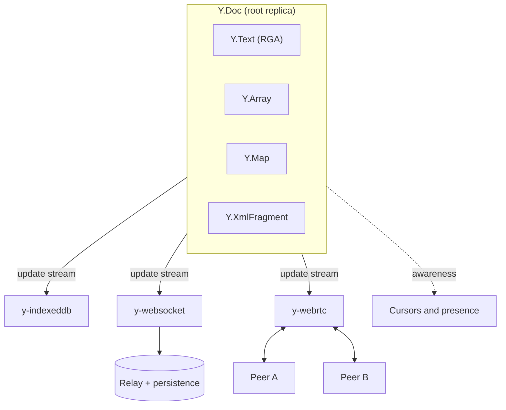
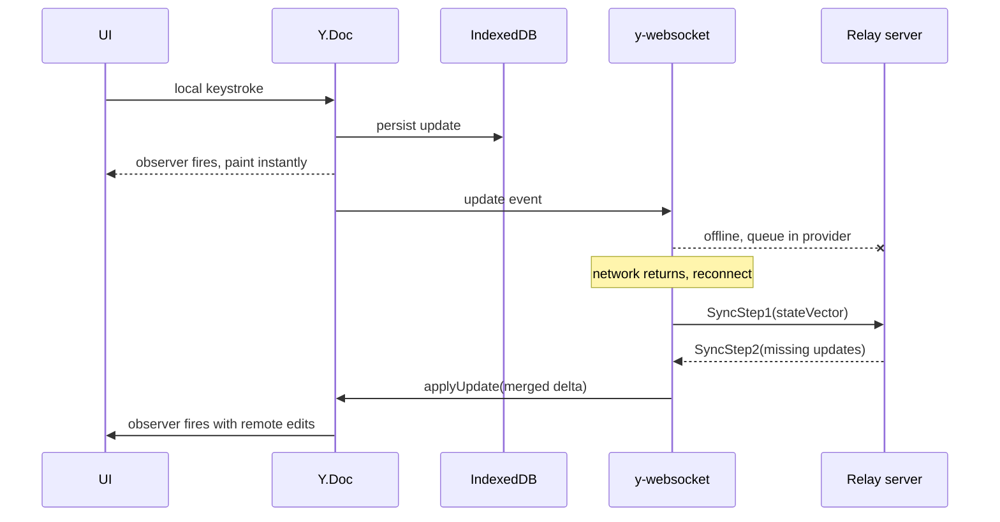
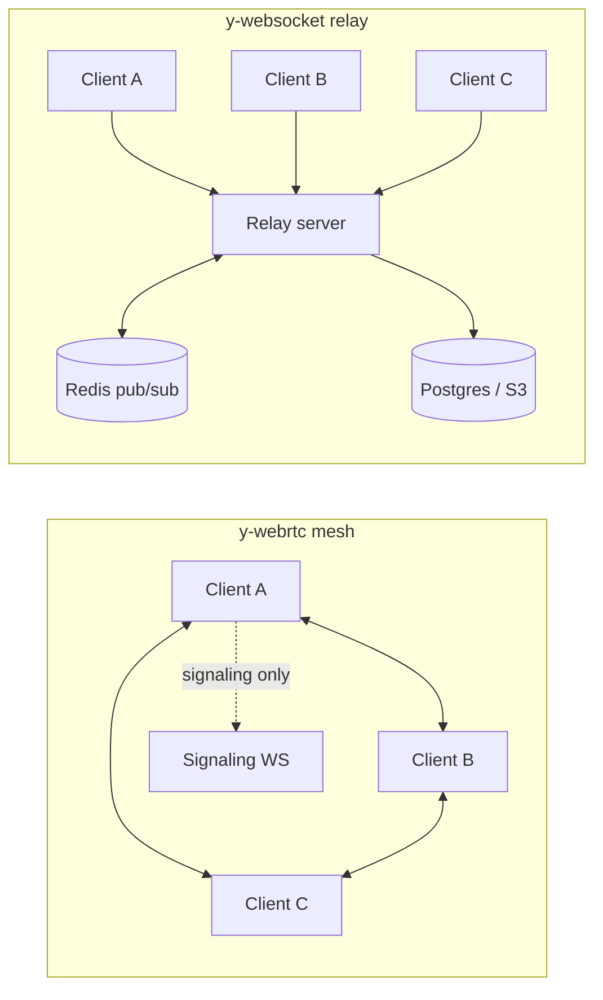
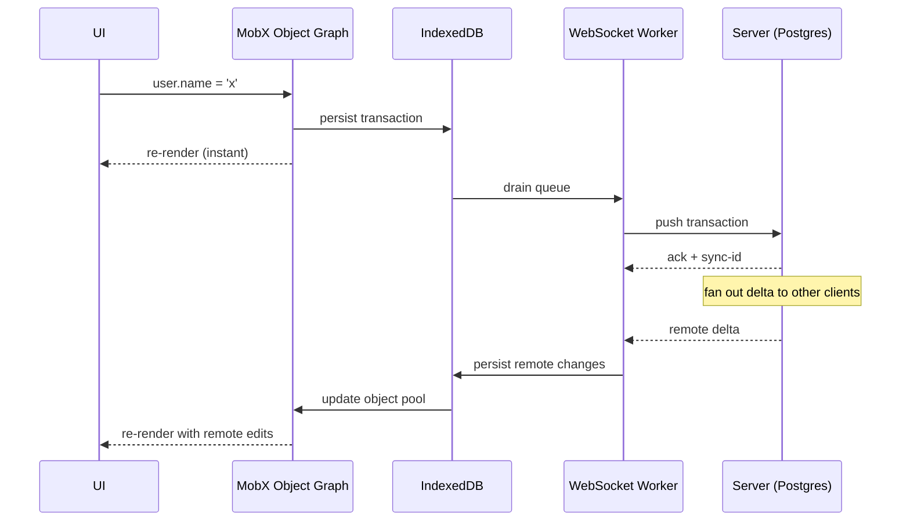

# CRDT Applications (Yjs, Automerge, Local-First Software)

> **TL;DR**: CRDT theory promises deterministic merge without coordination, but in production the hard parts are not the merge function. They are persistence, transport, schema migration, access control, and observability. A CRDT library gives you convergence; a sync engine gives you a product. Yjs processes 260K editing operations in ~1,074 ms (Ryzen 9 7900X)[^1] and stores them in ~227 KB on disk[^2]. Automerge 2.0's Rust rewrite cut memory from 1.1 GB to ~44.5 MB on the same trace.[^1] Choose Yjs for web editors, Automerge for JSON-shaped history-rich apps, and a managed service when you need collaboration in weeks rather than months.

## Learning Objectives

After this module, you will be able to:

- [ ] Pick between Yjs, Automerge, and Liveblocks for a given collaborative product
- [ ] Design a sync topology (p2p, server-relay, hybrid) given NAT, scale, and privacy constraints
- [ ] Architect an offline-first app around IndexedDB persistence and background sync
- [ ] Build user-visible undo/redo and merge-resolution UX on top of a CRDT document
- [ ] Instrument a sync pipeline well enough to debug a stuck client in production
- [ ] Explain why CRDTs displaced Operational Transform for new collaborative products

## Intuition

You and a friend keep a shared grocery list on a whiteboard in the kitchen. One morning you add "eggs" while your friend, in another room, adds "milk." Neither of you waits for the other. When you both walk back to the board, you see both items. No conflict. No coordinator. The whiteboard just has both entries because additions do not interfere with each other.

Now imagine you both erase the same item simultaneously. One of you sees it gone; the other re-adds it. Whose version wins? A regular whiteboard has no rule. A CRDT whiteboard does: it embeds a deterministic resolution into the data structure itself so that no matter who syncs first, both boards converge to the same state.

Scale that whiteboard to a rich-text editor with 50 concurrent cursors, a project tracker with 10 million issues, or a design tool with vector objects on a shared canvas. The whiteboard analogy still holds: every replica applies changes locally, syncs asynchronously, and converges by construction. The hard part is no longer the merge. It is everything around it: how do you persist the board when the user closes the tab? How do you sync when the network drops for an hour? How do you stop a malicious user from corrupting everyone's board?

[CRDTs: Conflict-Free Replicated Data Types](../part-3-distributed-systems-theory/05-crdts.md) covered the semilattice math, CvRDT vs CmRDT, OR-Set, and LWW-Register. This chapter is the applied half: what engineers actually ship on Monday.

## Theory

### The local-first thesis

Ink & Switch's 2019 essay named "local-first software" and proposed seven ideals: no spinners, work not trapped on one device, network optional, seamless collaboration, long-term storage, security and privacy by default, and user retaining ultimate ownership.[^3] The core architectural inversion: cloud apps treat the server as authoritative and the client as a disposable cache. Local-first flips that contract so the local replica is authoritative and the server is a relay.

CRDTs enable this inversion because they let independent replicas make changes without coordinating, with a mathematical guarantee of convergence when updates are eventually exchanged. The practical result is sub-50 ms interaction latency (reads and writes hit local storage, not the network) and full offline functionality without retrofitting.[^4]

Products shipping local-first principles today include Linear, Actual Budget, Logseq, Obsidian, and Apple Notes. None hits all seven ideals perfectly. Naming the gaps is part of the craft: Linear's server is authoritative for ordering; Obsidian stores files locally but has no built-in multi-user merge. The ideals are a compass, not a checklist.

### Yjs architecture

Yjs is a high-performance JavaScript CRDT library implementing the YATA algorithm. A `Y.Doc` is the root container holding shared types: `Y.Text` (an RGA-style sequence CRDT), `Y.Array`, `Y.Map`, and `Y.XmlFragment`. Each shared type is independently a CRDT. Editor bindings (ProseMirror, Tiptap, Monaco, Slate, BlockSuite) observe and mutate these types directly.[^5]

Providers are pluggable packages that move updates between `Y.Doc` instances or persist them:

- **y-websocket** connects to a relay server that broadcasts updates and optionally persists state.
- **y-webrtc** syncs directly between peers over WebRTC DataChannels.
- **y-indexeddb** persists every update to the browser's IndexedDB for offline durability.

The awareness protocol is a separate ephemeral channel for cursors, selections, and presence. The y-protocols spec defines two intervals: peers re-broadcast their awareness state at least every 15 seconds, and any entry not refreshed for 30 seconds is considered offline and removed locally.[^6]

*A single Y.Doc hosts typed shared structures and is replicated through independent provider packages; persistence is just another provider listening to the same update stream.*

The wire protocol is binary. Two peers sync by exchanging a state vector (a compact `Map<clientId, clock>` of everything each peer has seen), then each side sends only the missing updates via `encodeStateAsUpdate(doc, remoteStateVector)`. After bootstrap, every local change broadcasts as an incremental update message. Median update size for a single character append is ~27 bytes.[^2]

*Every local edit commits to the Y.Doc and IndexedDB before any network is involved; reconnect sends a single compacted delta via SyncStep1/SyncStep2 rather than replaying thousands of micro-ops.[^6]*

### Automerge 2.0

Automerge models documents as arbitrarily nested JSON (maps, arrays, text, counters) and retains full addressable history. The 2.0 release (January 2023) was a ground-up Rust rewrite replacing the pure-JS v0.14. Documents use a compressed columnar binary format: related data (all character opIds, all insertion positions) is packed together for cache efficiency.[^1]

Every change carries a Lamport timestamp `(counter, actorId)`. The full history is queryable, enabling time-travel, blame, and git-like branching. Peritext, developed by researchers from the Automerge/Ink & Switch team, is the only serious CRDT treatment of overlapping rich-text formatting spans.[^7]

Performance on the Martin Kleppmann paper trace (259,778 editing operations), as reported in the Automerge 2.0 release post on a Ryzen 9 7900X:[^1]

| Library | Apply time | Memory | Doc size on disk |
|---|---|---|---|
| Automerge 0.14 (JS) | ~500,000 ms | ~1,100 MB | ~146 MB |
| Automerge 2.0 (Rust/WASM) | ~1,816 ms | ~44.5 MB | ~129 KB |
| Yjs 13.6 | ~1,074 ms | ~10.1 MB | ~227 KB[^2] |

Cross-library benchmarks run on different hardware can differ by 2x to 3x: the Loro suite on a MacBook Pro M1 reports ~2,616 ms for Yjs 13.6.15 and ~7,109 ms for Automerge 2.1.10 on the same trace.[^2] Always re-run benchmarks on your target hardware before using these numbers in a capacity plan.

Automerge-repo (2023) is the higher-level batteries-included library with pluggable network adapters (WebSocket, BroadcastChannel, WebRTC) and storage adapters (IndexedDB, OPFS, filesystem). It exists because distributed-systems complexity scared off application developers in the v0.x era.

### Automerge 3.0

Automerge 3.0 (July 2025) re-architects the runtime to use the same columnar compression format in memory that was previously only used on disk. The result is a further 10x or more reduction in memory usage over 2.0. The headline number: pasting the full text of Moby Dick into an Automerge 2 document consumed ~700 MB of memory; in Automerge 3 the same document consumes ~1.3 MB.[^14] Load times for large-history documents also improved dramatically (one reported case went from 17+ hours to 9 seconds). The file format is unchanged from 2.0, so migration is a version bump with minimal API changes (the `Text` class is removed in favor of native strings; `RawString` is renamed to `ImmutableString`).

### Emerging libraries: Loro and Diamond Types

**Loro** is a Rust CRDT library targeting both text and rich structured data. On the paper trace it produces ~231 KB on disk, competitive with Yjs, and exposes a Movable Tree CRDT for hierarchical data that neither Yjs nor Automerge handles natively.

**Diamond Types** is Joseph Gentle's research CRDT for plain text, currently the fastest single-threaded text CRDT on the paper trace. Gentle's "CRDTs go brrr" blog documented a 5,000x speedup over early Automerge.[^8] It demonstrates that CRDT overhead is not fundamental. However, it is plain-text only and not meant as a production library yet.

### Sync topologies

Two transport shapes dominate:

**Server-relay** (`y-websocket`, Liveblocks, PartyKit): a single WebSocket server receives updates, applies them to a persisted `Y.Doc`, and broadcasts to other clients. Multi-instance deployments use Redis pub/sub for fan-out. Access control lives on the server, which is the guarantee pure p2p loses.[^5]

**Peer-to-peer** (`y-webrtc`, libp2p): peers sync directly over WebRTC DataChannels. An untrusted signalling server handles only SDP exchange. The client caps connections at `20 + random(15)` peers to prevent O(n^2) mesh from hitting browser limits; the random factor prevents cluster formation.[^9]

*WebRTC mesh keeps data off the relay but caps out around ~35 peers per node; hub-and-spoke scales to thousands of editors and takes the cost of being the auth enforcement point.*

NAT traversal requires STUN for public-IP discovery and TURN for relay when direct UDP fails. A significant minority of connections (commonly cited as 10 to 20%) require TURN relay due to symmetric NATs or restrictive firewalls.[^10] Without TURN, a sizeable fraction of users cannot connect directly. This is why pure p2p is rarely the production default.

### Managed services and sync frameworks

The middle tier of the ecosystem bundles persistence, transport, and auth so teams ship collaboration in days:

| Service | Model | Key trait |
|---|---|---|
| Liveblocks | Hosted WebSocket + own conflict types + Yjs mode | Ship in days; v2 engine streams docs from storage, raising limits to 2 MB per object[^11] |
| PartyKit | Cloudflare Durable Objects + Yjs | Edge-deployed rooms with per-room state |
| Y-Sweet | Hosted Yjs relay with S3 persistence | Drop-in replacement for y-websocket |
| Replicache | Client-side sync engine, pluggable backend | Game-inspired optimistic UX; succeeded by Zero (see below)[^12] |
| Zero (Rocicorp) | Query-driven Postgres-to-client sync engine | GA March 2026; replaces Replicache and Reflect; syncs Postgres subsets to client SQLite[^15] |
| ElectricSQL / PowerSync | Bi-directional Postgres to SQLite sync | Works with existing Postgres; not CRDT-based internally |

The cautionary tale: Rocicorp launched Reflect in 2023 and shut it down in November 2024.[^12] Their successor product Zero reached GA in March 2026.[^15] Vendor dependency violates the Ink & Switch longevity ideal. If local-first is a core value, own your sync layer.

### When NOT to use CRDTs

CRDTs cannot enforce global invariants. Use traditional coordination when you need:

- **Unique constraints** (usernames, email addresses): two replicas can independently claim the same username.
- **Financial transactions**: double-spend prevention requires serialization.
- **Ordered sequences with global agreement**: CRDTs converge but the final order may surprise users.
- **Small teams with reliable networks**: the complexity overhead is not justified if a simple Postgres row lock suffices.

## Real-World Example

Linear is a project tracker serving large workspaces at sub-50 ms interaction latency on any network, thanks to its local-first-inspired sync engine.[^4] Its sync engine is custom, not a CRDT library, but built on CRDT-inspired principles.

**Architecture:** The client holds a full object graph (Issues, Projects, Users) backed by MobX for reactivity, mirrored to IndexedDB. Every mutation flows: frontend mutates the graph, a transaction is appended to a queue persisted in IndexedDB, and a WebSocket worker drains the queue to the server. Reads: the server pushes changesets over WebSocket, the client fetches the delta, updates IndexedDB, and MobX notifies the UI.

**Conflict resolution:** Last-Write-Wins for most fields. Linear's CTO Tuomas Artman has noted that real conflicts are rare in an issue tracker because humans partition their attention. CRDTs (Yjs-style) are used only for issue descriptions (rich text) where concurrent character-level edits actually happen.[^13]

**Bootstrap:** First connect fetches a compressed snapshot. Subsequent connects send the last-known sync-id and receive only the delta. Read traffic to the backend drops sharply because most reads hit local IndexedDB.

*One assignment plus one save() is the entire product-code surface for a collaborative edit. The sync engine hides optimistic updates, retries, persistence, and fan-out from the application author.*

The insight: not every collaborative app needs CRDTs everywhere. LWW is an honest choice when overlap is rare. Carve out CRDTs for the fields where concurrent character-level editing actually occurs.

## Trade-offs

| Approach | Pros | Cons | Best when | Our Pick |
|---|---|---|---|---|
| Yjs | Fastest CRDT in benchmarks; production-hardened; rich editor bindings | JS-first; history grows without manual compaction | Web editors, 2 to 50 concurrent editors | Default for browser-based collaboration |
| Automerge | Clean JSON ergonomics; full history and time-travel; Rust core | Higher per-op overhead (~2x slower); smaller ecosystem | JSON-shaped data, native multi-platform | When you need history or non-JS clients |
| Liveblocks (managed) | Ship in days; auth, presence, comments built in | Vendor dependency; server-authoritative; per-MAU cost | Startups needing collaboration now | When time-to-market beats ownership |
| Custom (Linear, Figma) | Exactly tuned to your data model; full control | Years of engineering; custom bugs | You have 10+ engineers and a unique data shape | Only if libraries genuinely do not fit |
| OT (Google Docs) | Mature at massive scale; compact metadata; no tombstones | Central authority required; poor offline story | Legacy systems already on OT | Maintain existing OT deployments; choose a CRDT library for new collaborative products |

## Common Pitfalls

> [!WARNING]
> **Treating a CRDT library as a sync engine.** You pick Yjs, wire it to a WebSocket, and three months in you discover you have no auth model, no backup strategy, and no way to observe stuck clients. Libraries advertise "no central server"; the real world needs servers for auth, rate limiting, and persistence. Build a sync engine layer on top, or use Liveblocks / Y-Sweet / Automerge-repo.

> [!WARNING]
> **Unbounded history growth.** After a year of editing, a Yjs document that should be 50 KB is 20 MB because CRDTs track all history including tombstones. Periodically snapshot with `Y.encodeStateAsUpdate(doc)`, re-persist as a compacted update, and drop older entries. Ink & Switch explicitly flagged this after using PushPin for internal sprint planning.[^3]

> [!WARNING]
> **NAT traversal blocking p2p sync.** Two users see each other as "present" via the awareness protocol but updates never flow. Both are behind symmetric NATs. Ship a TURN server (coturn, Twilio) or bypass the problem entirely: use server-relay for the common case, p2p only for explicitly private documents.

> [!WARNING]
> **Last-Write-Wins on a text field.** Two editors type concurrently in the same paragraph; one edit silently overwrites the other. Field-level LWW treats the whole text blob as one value. Use a sequence CRDT (`Y.Text`, Automerge Text) for anything longer than ~16 characters. The Peritext paper calls this out for Notion (which supported the research): Notion's own block-level merge keeps only one side's edit when two users concurrently modify the same block.[^7]

> [!WARNING]
> **Schema migration with offline clients.** You rename a field from `authors` to `contributors`. An old client reconnects and replays pending edits referencing the old schema, reintroducing zombie data. Ink & Switch's Cambria library translates via bidirectional lenses: every write is tagged with the writer-schema, and readers translate via the shortest lens path in the schema graph.

## Exercise

Design the sync architecture for a mobile-first note-taking app with a web client and offline support. Pick a library and justify it; sketch the topology; define IndexedDB persistence and delta bootstrap; specify undo/redo scope; name the top three metrics to instrument before launch.

Hint

Think about what happens when a user edits offline for a week, then reconnects. How large is the pending update? How do you avoid replaying thousands of micro-ops? Consider whether the server needs to be authoritative or merely a relay.

Solution

**Library choice:** Yjs. Notes are rich text (the sweet spot for `Y.Text`), the app is web + mobile (Yjs has React Native support via ywasm), and the ecosystem has production-grade IndexedDB persistence.

**Topology:** Server-relay via y-websocket. A single relay per document room, backed by Postgres `bytea` for durable snapshots and Redis pub/sub for multi-instance fan-out. P2P is unnecessary because notes are personal or small-group; NAT issues are not worth the complexity.

**Persistence:** y-indexeddb on the client. On app open, load the persisted Y.Doc from IndexedDB (instant cold start). Subscribe to the update stream for incremental persistence. On the server, compact the update log into a single snapshot every 1,000 updates to bound storage growth.

**Delta bootstrap:** On reconnect, the client sends its state vector. The server replies with `encodeStateAsUpdate(serverDoc, clientStateVector)`, a single binary blob containing only the missing operations. No replay of individual keystrokes.

**Undo/redo:** Use `Y.UndoManager` scoped to the local user's client-id. The undo stack reverses only the local user's own operations, not remote edits that arrived during the session.

**Top three metrics:**

1. `sync_lag_seconds` per (user, doc): time since last successful server ack.
2. `pending_queue_depth`: number of unsynced local updates.
3. `doc_size_bytes` vs `content_length_bytes`: ratio indicates tombstone bloat.

## Key Takeaways

- A CRDT library gives you convergence. A sync engine gives you a product. Do not confuse the two.
- Yjs is the default for web editors; Automerge wins for JSON-shaped, history-rich apps; managed services win when time-to-market matters most.
- Local-first is a values shift: local replica authoritative, server as relay, user data ownership as a design input.
- Pure p2p is rarely the right default. NAT traversal, discovery, and access control push products back to a server relay.
- Not every collaborative app needs CRDTs everywhere. LWW is honest when overlap is rare; carve out CRDTs for fields with concurrent character-level editing.
- Sync observability is the gap that ruins production rollouts. Ship telemetry (state-vector size, queue depth, last-ack timestamp) before users.
- Schema migration in a CRDT world requires bidirectional lenses or versioned schemas. Plan for offline clients replaying old-schema writes.

## Further Reading

- [Local-First Software (Kleppmann et al., 2019)](https://www.inkandswitch.com/local-first/). the manifesto that named the movement; seven ideals are the single most-cited frame in the applied literature.
- [Peritext: A CRDT for Rich-Text Collaboration (Litt et al., 2022)](https://www.inkandswitch.com/peritext/). the only serious treatment of overlapping rich-text formatting spans in a CRDT; read before building any rich-text editor.
- [How Figma's multiplayer technology works (Evan Wallace, 2019)](https://www.figma.com/blog/how-figmas-multiplayer-technology-works/). canonical post on a production server-authoritative CRDT-inspired system that explicitly rejected both OT and true CRDTs.
- [Introducing Automerge 2.0 (2023)](https://automerge.org/blog/automerge-2/). numbers showing the 10 to 100x performance leap from the Rust rewrite; essential context for library selection.
- [Automerge 3.0 (2025)](https://automerge.org/blog/automerge-3/). columnar compression at runtime cuts memory by another 10x+; Moby Dick in 1.3 MB vs 700 MB in 2.0.
- [Yjs documentation](https://docs.yjs.dev/). reference for Y.Doc, shared types, providers, and the awareness protocol.
- [Cambria: Schema evolution via bidirectional lenses (Ink & Switch, 2020)](https://www.inkandswitch.com/cambria/). the only serious answer to "how do I migrate schemas in a CRDT world."
- [dmonad/crdt-benchmarks](https://github.com/dmonad/crdt-benchmarks). reproducible benchmark suite; read the README and B4 numbers before making any performance claim.
- [Diamond Types (Joseph Gentle)](https://github.com/josephg/diamond-types). see how far pure-performance text CRDTs can be pushed; the "CRDTs go brrr" blog post is the backstory.

## Flashcards

**Q:** What is the core architectural inversion of local-first software?
**A:** The local replica is authoritative and the server is a relay, inverting the cloud model where the server is authoritative and the client is a disposable cache.

**Q:** Name the four shared types in Yjs.
**A:** `Y.Text` (sequence/RGA), `Y.Array`, `Y.Map`, and `Y.XmlFragment`.

**Q:** How do two Yjs peers sync efficiently after a disconnect?
**A:** Each peer sends its state vector (a map of clientId to highest known clock). The other peer replies with only the missing updates encoded via `encodeStateAsUpdate(doc, remoteStateVector)`.

**Q:** What is the median wire size of a single character append in Yjs?
**A:** Approximately 27 bytes.

**Q:** Why did Automerge 2.0 rewrite the library in Rust?
**A:** The pure-JS v0.14 used ~1.1 GB of memory and ~146 MB on disk for 260K edits. The Rust rewrite cut memory to ~44.5 MB and disk to ~129 KB (about 1 byte overhead per character).

**Q:** What is the commonly cited TURN fallback rate for WebRTC connections?
**A:** Commonly cited as 10 to 20% of connections requiring TURN relay because direct UDP fails due to symmetric NATs or restrictive firewalls.

**Q:** Why does Linear use LWW instead of CRDTs for most fields?
**A:** Real conflicts are rare in an issue tracker because humans partition their attention. CRDTs are reserved for issue descriptions (rich text) where concurrent character-level edits actually happen.

**Q:** What problem does Cambria solve?
**A:** Schema migration in a CRDT world. It translates writes via bidirectional lenses so old-schema offline clients can reconnect without introducing zombie data.

**Q:** Name three metrics you should instrument before launching a sync engine.
**A:** (1) Sync lag per (user, doc), (2) pending queue depth of unsynced local updates, (3) document size vs content length ratio to detect tombstone bloat.

**Q:** When should you NOT use a CRDT?
**A:** When you need global invariants (unique usernames, financial transactions, double-spend prevention) or when a simple Postgres row lock suffices for your team size and network reliability.

**Q:** What is the awareness protocol in Yjs?
**A:** A separate ephemeral channel for cursors, selections, and presence state. Peers re-broadcast their state at least every 15 seconds; any entry not refreshed for 30 seconds is marked offline and removed locally.

**Q:** How does Figma's multiplayer differ from a true CRDT?
**A:** Figma uses a server-authoritative model with property-level LWW. The server defines ordering, so no Lamport timestamps or decentralized merge are needed. It is CRDT-inspired but explicitly not a CRDT.

## References

[^1]: "Introducing Automerge 2.0", Automerge Project, January 2023. https://automerge.org/blog/automerge-2/
[^2]: Loro project, "JS/WASM Benchmarks" (Yjs 13.6.15, Automerge 2.1.10, Loro 1.0.0-beta.2). https://loro.dev/docs/performance
[^3]: Kleppmann, Wiggins, van Hardenberg, McGranaghan, "Local-first software: you own your data, in spite of the cloud", Onward! 2019. https://www.inkandswitch.com/local-first/
[^4]: Tuomas Artman, "Scaling the Linear Sync Engine", Linear, June 2023. https://linear.app/blog/scaling-the-linear-sync-engine
[^5]: Yjs Documentation, "Introduction". https://docs.yjs.dev/
[^6]: y-protocols PROTOCOL.md (sync v1 encoding and awareness). https://github.com/yjs/y-protocols/blob/master/PROTOCOL.md
[^7]: Litt, Lim, Kleppmann, van Hardenberg, "Peritext: A CRDT for Rich-Text Collaboration", CSCW 2022. https://www.inkandswitch.com/peritext/
[^8]: Joseph Gentle, "5000x faster CRDTs: An Adventure in Optimization", July 2021. https://josephg.com/blog/crdts-go-brrr/
[^9]: y-webrtc README. https://github.com/yjs/y-webrtc
[^10]: WebRTC.ventures, "Mastering STUN/TURN Servers", November 2024. https://webrtc.ventures/2024/11/mastering-stun-turn-servers-a-guide-to-proper-integration-for-webrtc-applications/
[^11]: Liveblocks, "The new realtime data storage engine and its benefits" (v2, March 2026). https://liveblocks.io/docs/guides/about-the-new-storage-engine
[^12]: Rocicorp, "Retiring Reflect", June 2024. https://roci.dev/blog/retiring-reflect
[^13]: "Linear's sync engine architecture", fujimon.com, August 2024. https://www.fujimon.com/blog/linear-sync-engine
[^14]: "Automerge 3.0", Automerge Project, July 2025. https://automerge.org/blog/automerge-3/
[^15]: Rocicorp, "Zero - Project Status" (GA March 2026). https://zero.rocicorp.dev/docs/status
