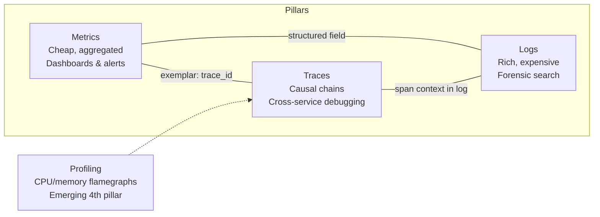
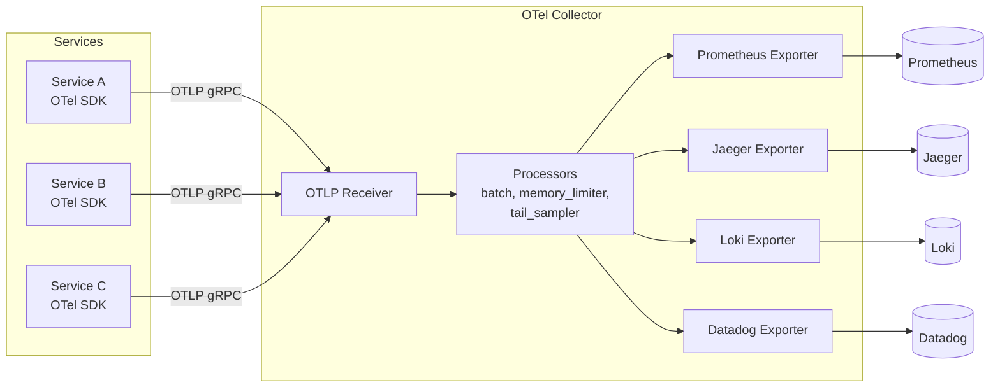
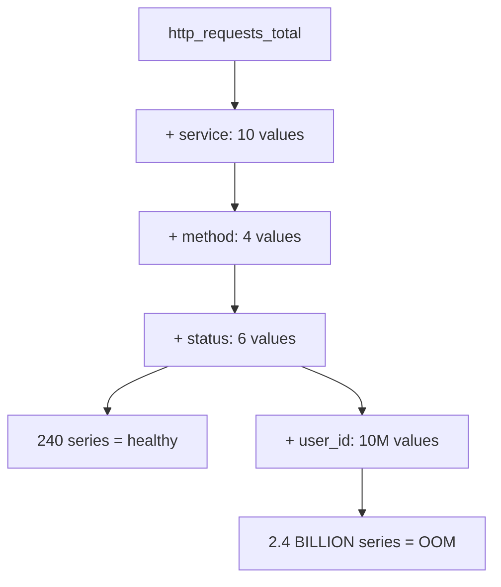
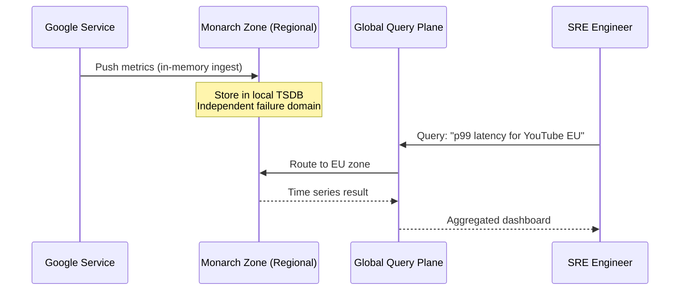

# Observability: Metrics, Logs, Traces, and the OpenTelemetry Standard

> **TL;DR**: Observability is the ability to ask arbitrary questions about your system's behavior without shipping new code. It rests on three pillars: metrics (cheap numeric aggregates for dashboards and alerts), logs (discrete events for forensics), and traces (per-request causal chains across services). Google's Dapper proved that even 0.1% trace sampling yields useful debugging data at planetary scale[^1]. The field's central tension is cost versus specificity: metrics are cheap but blunt, logs are rich but expensive, traces preserve causality but must be sampled. Every production observability deployment is a set of cardinality and sampling decisions dressed up as a stack. Instrument with OpenTelemetry, alert on SLI burn rates, and treat label cardinality as a schema you review in PRs.

## Learning Objectives

After this module, you will be able to:

- [ ] Explain the three pillars and what each is good and bad at
- [ ] Apply USE and RED methods to decide what to measure for resources vs services
- [ ] Instrument a service with OpenTelemetry for metrics, logs, and traces
- [ ] Design alerts on SLI burn rates, not noisy resource thresholds
- [ ] Reason about cardinality, sampling, and observability cost at scale
- [ ] Connect metrics to traces via exemplars for fast root-cause navigation

## Intuition

You own a chain of 50 coffee shops. Every morning you check a dashboard: total cups sold, average wait time, revenue per store. These are your **metrics**. They tell you something is wrong ("Store #12 revenue dropped 40%") but not why.

So you pull the security camera footage for Store #12. You scrub through hours of video looking for the moment things went sideways. This is your **logs**: high-detail, high-cost, great for forensics once you know where to look.

But what if the problem is not inside one store? A customer orders on the app, the payment goes to a processor, the order routes to the nearest store, and the barista gets a ticket. If the customer waited 10 minutes, which hop was slow? You need to follow that one customer's journey across every system it touched. That is a **trace**: a causal chain stitched together by a shared order ID.

Now imagine you have 50 stores, each generating footage 24/7. You cannot store it all forever. You sample: keep footage only when the wait-time metric spikes or a customer complains. That sampling decision, what to keep and what to discard, is the central economic problem of observability at scale.

[Availability and Reliability](../part-1-core-fundamentals/02-availability-and-reliability.md) gave you the vocabulary of nines and error budgets. This chapter gives you the instrumentation to measure whether you are meeting them, and the alerting philosophy to know when you are not.

## Theory

### The three pillars (and their critics)

The conventional model, popularized in 2017-2018 by Cindy Sridharan and Peter Bourgon, frames observability as three complementary telemetry types[^2]:

**Metrics** are numeric samples aggregated into time series, keyed by a name and a set of labels. Prometheus scrapes them every 1 minute by default, though production deployments commonly tune this to 15-30 seconds[^3]. They are the cheapest pillar per data point: a counter costs bytes, not kilobytes. Ideal for dashboards and alert evaluation.

**Logs** are discrete events with a timestamp, severity, message, and (increasingly) structured key-value attributes. They dominate the bill at scale. A service doing 10K RPS with 5 KB average log entries produces about 4 TB per day.

**Traces** are collections of spans, each representing one unit of work with a start time, duration, and parent span ID. Spans are stitched together by a trace ID propagated via the W3C `traceparent` header. Traces are the only pillar that can answer "why did this specific request take 2 seconds?" in a system of 100 microservices.

The three-pillar model is under active critique. Ben Sigelman (co-creator of Dapper, co-creator of OpenTracing and member of the OpenTelemetry governing committee) argued at KubeCon 2018 that treating metrics, logs, and traces as independent silos misses the point: real observability is about reducing the search space for plausible explanations, and each pillar alone fails at that. Charity Majors and Honeycomb push further toward "observability 2.0": one unified source of truth (arbitrarily wide structured events with high cardinality) from which metrics, traces, and logs are derived views, not three separate stores. A third camp proposes continuous profiling as a fourth pillar, grounded in Google's 2010 Google-Wide Profiling paper[^4].

The pragmatic takeaway: the three pillars remain the operational reality for most teams, but connect them with shared context (trace IDs in logs, exemplars in metrics) rather than treating them as islands.



*The three pillars are not silos: exemplars link metrics to traces, trace context enriches logs, and structured log fields feed metric aggregation. Profiling is the emerging fourth signal.*

### USE, RED, and the four golden signals

Three named methodologies tell you what to measure. They target different layers.

**USE** (Brendan Gregg): for every resource (CPU, disk, NIC, lock), record Utilization (percent busy), Saturation (queue length), and Errors (count). Gregg claims it solves roughly 80% of server performance issues with 5% of the effort[^5]. Key insight: a burst of 100% utilization for seconds causes saturation even when a 5-minute average shows 80%.

**RED** (Tom Wilkie, Grafana Labs): for every service, record Rate (requests/sec), Errors (failed requests/sec), and Duration (latency histogram). RED gives every service the same dashboard shape, making comparison and onboarding trivial[^6].

**Four Golden Signals** (Google SRE Book): latency, traffic, errors, saturation. This combines both views and adds the critical principle: alert on symptoms users feel, not causes you guess at[^7].

| Method | Target | Measures | Best for |
|---|---|---|---|
| USE | Resources (CPU, disk, NIC) | Utilization, Saturation, Errors | Infrastructure bottleneck hunting |
| RED | Services (API endpoints) | Rate, Errors, Duration | Per-service dashboards and SLOs |
| Golden Signals | User-facing systems | Latency, Traffic, Errors, Saturation | Alerting on user-visible impact |

> [!TIP]
> Use all three together. USE for your infrastructure layer, RED for your service layer, Golden Signals for your alert definitions. They are complementary, not competing.

### OpenTelemetry: instrument once, send anywhere

OpenTelemetry (OTel) was formed in May 2019 by merging OpenTracing and OpenCensus, announced at KubeCon Barcelona[^8]. It is the CNCF vendor-neutral standard for generating, collecting, and exporting telemetry, and the second-most-active CNCF project by contributor count, behind only Kubernetes[^9].

The architecture has three layers:

1. **API + SDK** (per language: Java, Go, Python, .NET, JS, Rust, C++). You call the API; the SDK handles sampling, batching, and export.
2. **OTLP** (OpenTelemetry Protocol): the wire format over gRPC (:4317) or HTTP (:4318).
3. **Collector**: a vendor-neutral agent that receives, processes (batching, memory limiting, tail sampling, PII scrubbing), and exports to any backend.

Semantic conventions standardize attribute names (`http.request.method`, `db.system`, `service.name`) so dashboards written for one backend work on another[^9].



*OpenTelemetry Collector sits between instrumented services and any number of backends. Instrumentation is written once; targets change via config, not code.*

The Collector config is declarative YAML:

```yaml
receivers:
  otlp:
    protocols:
      grpc:
        endpoint: 0.0.0.0:4317
processors:
  batch:
    timeout: 10s
  memory_limiter:
    check_interval: 1s
    limit_mib: 512
exporters:
  prometheus:
    endpoint: 0.0.0.0:8889
  otlp/jaeger:
    endpoint: jaeger:4317
service:
  pipelines:
    metrics:
      receivers: [otlp]
      processors: [memory_limiter, batch]
      exporters: [prometheus]
    traces:
      receivers: [otlp]
      processors: [memory_limiter, batch]
      exporters: [otlp/jaeger]
```

> [!IMPORTANT]
> "Vendor-neutral" does not mean "vendor-cooperative." Datadog's mapping of OTel semantic conventions to Datadog spans is lossy enough that many advanced features still require their proprietary SDK. Evaluate your vendor's OTel support before committing.

### Cardinality, sampling, and cost

Cardinality is the number of unique label-value tuples for a given metric name. Each unique combination is a separate time series with its own index entry, retention, and cost. This is the silent budget killer.

A metric `http_requests_total` with labels `service` (10 values), `method` (4), and `status` (6) produces 240 series. Add `user_id` (10M users) and you get 2.4 billion series. Prometheus OOMs. Datadog's bill jumps by orders of magnitude.



*Each label multiplies the series count. A single unbounded label destroys a TSDB's economics overnight.*

**Datadog pricing makes this concrete.** Beyond the free allotment (100 custom metrics per host on Pro, 200 on Enterprise), each additional 100 ingested custom metrics (under Metrics without Limits) costs $0.10/month; indexed metric overage is contract-specific but can be substantial. A cardinality bomb that creates millions of series can produce a six-figure surprise bill[^10].

**Sampling** is the trace-side equivalent. Head-based sampling decides at request entry whether to trace (typical rate: 0.1% to 1%). Dapper shipped with 0.1% in production at Google and still produced useful data across billions of requests[^1]. The problem: a 1-in-10,000 bug might produce zero traces per day in a service doing 10 QPS.

**Tail-based sampling** fixes this: buffer all spans for a few seconds, decide after the request finishes whether to export. Bias toward keeping errors and high-latency traces. The cost is memory and complexity in the Collector.

**The rule:** Treat metric labels as a schema, reviewed in PRs like any database migration. Enumerable labels only (service, route, status_code, region). Use exemplars to link metrics to individual traces instead of cramming request IDs into labels.

### Alerting philosophy: symptoms, not causes

The default instinct is to alert on resource thresholds: CPU > 80%, disk > 85%, memory > 90%. None of these are user-visible symptoms. The on-call engineer stops reading them. A real incident drowns in noise.

Modern alerting alerts on SLI burn rate against an SLO. The reference algorithm is multi-window, multi-burn-rate (MWMBR) from the Google SRE Workbook[^11]:

- An SLO of 99.9% over 30 days gives an error budget of 0.1% of total events.
- A burn rate of 1.0 consumes the budget in exactly 30 days.
- A burn rate of 14.4 exhausts it in 1/14.4 of the window (about 2 days).

The MWMBR rule pages when BOTH a long window AND a short window exceed the threshold:

| Burn rate | Long window | Short window | Budget consumed | Action |
|---|---|---|---|---|
| 14.4 | 1 hour | 5 minutes | 2% | PAGE |
| 6 | 6 hours | 30 minutes | 5% | PAGE |
| 1 | 3 days | 6 hours | 10% | TICKET |

The short window is the "are we still burning?" check. It prevents the alert from sticking hours after recovery.

```yaml
# Prometheus MWMBR page-level rule
expr: (
        job:slo_errors_per_request:ratio_rate1h{job="myjob"} > (14.4*0.001)
      and
        job:slo_errors_per_request:ratio_rate5m{job="myjob"} > (14.4*0.001)
      )
severity: page
```

This approach forces alerts to correspond to user-visible impact. [SLI, SLO, SLA, and Error Budgets](./01-sli-slo-sla-error-budgets.md) covers the full SLO framework and error budget mechanics that this alerting philosophy depends on.

> [!TIP]
> Every alert should have a runbook. If you cannot write a runbook for an alert, the alert is not actionable. Delete it.

## Real-World Example

### Google Monarch: planet-scale metrics

Google's Monarch is an in-memory, multi-tenant, globally distributed time series database that monitors Gmail, YouTube, Maps, and Google Cloud. The 2020 VLDB paper reports ingestion at terabytes of time series data per second and query rates of millions per second[^12].

Monarch's architecture makes three deliberate trade-offs:

1. **Availability over consistency.** A monitoring system is useless if a regional outage prevents observation of the outage. Monarch chose AP (availability and partition tolerance), explicitly rejecting Spanner-style strong consistency because writes and reads to a strongly consistent backend would block too long for a system whose SLO is measured in seconds[^12].

2. **In-memory over disk.** Monarch replaced Borgmon, whose cross-instance correlation was painful. Memory gives sub-second query latency for the recent window. Long-term retention lives in separate cold storage.

3. **Regionalized zones with a global query plane.** Each zone has independent failure domains and ingests data from nearby services. The global plane provides a unified query surface but is stateless, routing queries to the appropriate zones.



*Monarch's regionalized architecture ensures that a zone failure does not blind operators to the failure itself. The global plane is stateless query routing, not a consistency bottleneck.*

For comparison: Netflix Atlas grew from ~2 million time series in the pre-Atlas era to over 1.2 billion by 2014[^13], using a similar in-memory dimensional model. Meta's Scuba ingests millions of rows per second into hundreds of servers (each with 144 GB RAM), delivering sub-minute latency from event to developer dashboard[^14]. The pattern is universal at scale: in-memory for the hot window, cheap object storage for the cold tail.

## Trade-offs

| Approach | Pros | Cons | Best when | Our Pick |
|---|---|---|---|---|
| Metrics only | Cheap, sub-second queries, scales to billions of series | No forensics, cannot explain individual slow requests | Early-stage systems, infrastructure monitoring | Start here |
| Metrics + logs | Dashboards plus forensic search | Log volume and cost explode with request rate | Most production systems before microservice explosion | Default for < 10 services |
| Full three-pillar | Complete picture: alerts + forensics + causal analysis | Cost, complexity, three mental models, tool sprawl | Distributed systems with 10+ services and SLOs | Default for microservices |
| Event-based (Honeycomb-style) | High cardinality first-class, one source of truth, answers unanticipated questions | Smaller ecosystem than Prometheus/Grafana, event pricing surprises | Complex distributed debugging where unknown-unknowns dominate | When you outgrow three pillars |

## Common Pitfalls

> [!WARNING]
> **Cardinality bombs.** A developer adds `user_id` or `request_id` as a metric label. Series count explodes. Prometheus OOMs or Datadog's bill jumps 10x. Treat metric labels as a reviewed schema. Enumerable values only. Track `prometheus_tsdb_head_series` as your canary.

> [!WARNING]
> **"Log everything and sort it out later."** A service at 10K RPS with 5 KB log entries produces 4 TB/day. At commercial log-indexing prices, that is $50K+/month per service. Prefer metrics for anything aggregable. Reserve logs for incidents where you need the raw event. Sample or drop at ingest.

> [!WARNING]
> **Alert fatigue from cause-based alerting.** Alerts on CPU > 80% or disk > 85% are not user-visible symptoms. The on-call engineer stops reading them. Alert on SLI burn rates instead. Measure your false-positive ratio quarterly.

> [!WARNING]
> **Missing exemplar links.** A latency metric spikes on a dashboard but there is no way to jump to an example trace. Enable OpenTelemetry exemplars. Ensure `service.name`, `trace_id`, and `span_id` flow through both metrics and trace exports.

> [!WARNING]
> **Dashboard sprawl.** Teams accumulate hundreds of dashboards, most unmaintained. When an incident hits, no one knows which is current. Own dashboards at the service level. Auto-generate from SLO definitions. Archive anything not viewed in 90 days.

## Exercise

Design observability for a microservice platform with 50 services handling 100K RPS total. Choose an instrumentation stack, define golden signals per service, specify sampling rates for traces, and estimate monthly cost for a commercial vendor vs self-hosted.

<details>
<summary>Hint</summary>

Start with the write volume: 100K RPS across 50 services means ~2K RPS per service average. For metrics, estimate series count from labels (service x method x status x endpoint). For traces, calculate storage at 1% head-based sampling. For logs, assume 2 KB per structured log entry and calculate daily volume. Compare Datadog's per-host + custom-metric pricing against Prometheus + Grafana Cloud pricing.

</details>

<details>
<summary>Solution</summary>

**Stack choice:** OpenTelemetry SDK in all services, OTel Collector as a gateway, exporting to Prometheus (metrics), Tempo (traces), and Loki (logs). This gives vendor neutrality with a proven open-source backend.

**Metrics:** 50 services x 4 golden signals x ~20 label combinations = ~4,000 series per service = 200,000 total series. At Prometheus's 1-2 bytes per sample per 15-second scrape, this is modest. Self-hosted cost: 3 Prometheus servers with Thanos for long-term storage, roughly $2,000/month in compute.

**Traces:** 100K RPS at 1% head-based sampling = 1,000 traces/sec. Average span count of 5 per trace = 5,000 spans/sec. At ~500 bytes per span = 2.5 MB/sec = 6.5 TB/month. Tempo on S3: ~$150/month storage + compute for query nodes ~$1,500/month.

**Logs:** 100K RPS x 2 KB = 200 MB/sec = 17 TB/day. This is too expensive to index fully. Sample to 10% for indexed logs (1.7 TB/day) and archive the rest to cold storage. Loki on S3: ~$3,000/month.

**Total self-hosted:** ~$7,000/month for infrastructure (excluding engineering time).

**Datadog comparison:** 50 services on ~100 hosts. Infrastructure monitoring ($23/host) + APM ($40/host) + Log Management (1.7 TB/day indexed at ~$1.70/M events) = roughly $25,000-40,000/month depending on log volume and custom metrics.

**Trade-off:** Self-hosted saves 3-5x on direct cost but requires 1-2 engineers maintaining the stack. For teams under 200 engineers, the commercial vendor often wins on total cost of ownership.

**Sampling strategy:** 1% head-based for baseline coverage. Tail-based sampling in the Collector to keep 100% of error traces and traces exceeding p99 latency. This captures rare bugs that head-based sampling misses.

</details>

## Key Takeaways

- Observability is the ability to ask arbitrary questions about system behavior without deploying new code. Monitoring tells you something is wrong; observability helps you figure out why.
- The three pillars (metrics, logs, traces) are complementary, not competing. Connect them with shared context: trace IDs in logs, exemplars in metrics.
- USE targets resources, RED targets services, Golden Signals target user-facing alerts. Use all three at their respective layers.
- OpenTelemetry is the instrumentation standard. Instrument once with OTel, export to any backend via the Collector.
- Cardinality is the silent budget killer. Treat metric labels as a schema: enumerable values only, reviewed in PRs.
- Alert on SLI burn rates (MWMBR), not resource thresholds. Every alert needs a runbook or it should not exist.
- Tail-based sampling captures rare errors that head-based sampling misses, at the cost of Collector memory and complexity.

## Further Reading

- [OpenTelemetry Documentation](https://opentelemetry.io/docs/) - Start with Concepts > Signals, then Collector > Architecture. The standard your instrumentation should target.
- [Google SRE Book: Monitoring Distributed Systems](https://sre.google/sre-book/monitoring-distributed-systems/) - The four golden signals and the symptom-vs-cause alerting principle that underpins modern SRE practice.
- [Google SRE Workbook: Alerting on SLOs](https://sre.google/workbook/alerting-on-slos/) - The full MWMBR derivation with all six increasingly sophisticated alert shapes. Essential reading before configuring production alerts.
- [Dapper, a Large-Scale Distributed Systems Tracing Infrastructure](https://research.google/pubs/dapper-a-large-scale-distributed-systems-tracing-infrastructure/) - Sigelman et al., 2010. The paper every distributed tracing system builds on. Proves sub-1% sampling works at Google scale.
- [Monarch: Google's Planet-Scale In-Memory Time Series Database](https://research.google/pubs/monarch-googles-planet-scale-in-memory-time-series-database/) - VLDB 2020. How Google monitors billion-user services with an AP time series database.
- [The USE Method](https://www.brendangregg.com/usemethod.html) - Brendan Gregg's full methodology plus OS-specific checklists for every resource type.
- [Distributed Systems Observability](https://www.oreilly.com/library/view/distributed-systems-observability/9781492033431/) - Cindy Sridharan's 2018 O'Reilly report that popularized the three-pillar framing and remains the best short introduction.
- [Scuba: Diving into Data at Facebook](https://research.facebook.com/publications/scuba-diving-into-data-at-facebook/) - VLDB 2013. The intellectual ancestor of Honeycomb's wide-event model; shows why in-memory brute-force scan beats pre-built indexes for ad-hoc debugging.

## Flashcards

**Q:** What are the three pillars of observability?
**A:** Metrics (numeric aggregates for dashboards/alerts), logs (discrete events for forensics), and traces (per-request causal chains across services for distributed debugging).

**Q:** What does USE stand for and who created it?
**A:** Utilization, Saturation, Errors. Created by Brendan Gregg. Applied per resource (CPU, disk, NIC, lock) to find infrastructure bottlenecks.

**Q:** What does RED stand for and when do you use it?
**A:** Rate, Errors, Duration. Created by Tom Wilkie. Applied per service to give every microservice the same dashboard shape.

**Q:** What are Google's four golden signals?
**A:** Latency, traffic, errors, and saturation. They combine USE and RED perspectives and form the basis for SLI-based alerting on user-visible symptoms.

**Q:** What is OpenTelemetry and why does it exist?
**A:** OTel is the CNCF vendor-neutral standard for telemetry (API + SDK + Collector + OTLP protocol). It was formed in May 2019 by merging OpenTracing and OpenCensus to solve vendor lock-in: instrument once, export to any backend.

**Q:** Why is cardinality dangerous in metrics systems?
**A:** Each unique label-value combination creates a separate time series. Adding an unbounded label like `user_id` to a metric multiplies series count by the number of users, causing TSDB OOM or massive billing spikes.

**Q:** What is the difference between head-based and tail-based trace sampling?
**A:** Head-based decides at request entry whether to trace (before errors are known). Tail-based buffers all spans and decides after the request finishes, biasing toward keeping errors and high-latency traces. Tail-based catches rare bugs but costs more Collector memory.

**Q:** What is multi-window, multi-burn-rate (MWMBR) alerting?
**A:** An alert fires only when BOTH a long window and a short window show the SLO error budget burning faster than a threshold. The long window catches real incidents; the short window ensures the alert clears quickly after recovery.

**Q:** What is an exemplar in the context of metrics?
**A:** A metric data point that carries a trace ID, allowing you to jump from a latency spike on a dashboard directly to an example trace of a slow request. Bridges the gap between metrics and traces.

**Q:** What sampling rate did Google's Dapper use in production?
**A:** 0.1% (1 in 1,000 requests). Even at this low rate, the system produced useful debugging data across billions of daily requests because the sheer volume meant thousands of sampled traces per service per day.

**Q:** When should you alert on CPU > 80% vs SLI burn rate?
**A:** Almost never alert on raw CPU. Alert on SLI burn rates (error rate, latency) that reflect user-visible impact. Use CPU metrics for capacity planning dashboards, not paging. If CPU is high but users are happy, there is no incident.

**Q:** Name the open-source reference stack for full three-pillar observability.
**A:** Prometheus + Grafana for metrics, Loki for logs, Tempo or Jaeger for traces, all connected via OpenTelemetry Collector. For long-term metric storage, add Thanos, Cortex, or Mimir.

## References

[^1]: Sigelman, B. H., Barroso, L. A., Burrows, M., et al., "Dapper, a Large-Scale Distributed Systems Tracing Infrastructure", Google Technical Report, 2010. https://research.google/pubs/dapper-a-large-scale-distributed-systems-tracing-infrastructure/
[^2]: Sridharan, Cindy, "Distributed Systems Observability", O'Reilly 2018. https://www.oreilly.com/library/view/distributed-systems-observability/9781492033431/
[^3]: "Configuration", Prometheus documentation (global `scrape_interval` default `1m`). https://prometheus.io/docs/prometheus/latest/configuration/configuration/
[^4]: Ren, G., Tune, E., Moseley, T., et al., "Google-Wide Profiling: A Continuous Profiling Infrastructure for Data Centers", IEEE Micro, 2010. https://research.google/pubs/google-wide-profiling-a-continuous-profiling-infrastructure-for-data-centers/
[^5]: Gregg, Brendan, "The USE Method". https://www.brendangregg.com/usemethod.html
[^6]: Wilkie, Tom, "The RED Method: How to Instrument Your Services", Grafana Labs blog, August 2018. https://grafana.com/blog/2018/08/02/the-red-method-how-to-instrument-your-services/
[^7]: Ewaschuk, Rob, "Monitoring Distributed Systems", Google SRE Book Chapter 6. https://sre.google/sre-book/monitoring-distributed-systems/
[^8]: "A brief history of OpenTelemetry (So Far)", CNCF blog, May 2019. https://cncf.io/blog/2019/05/21/a-brief-history-of-opentelemetry-so-far
[^9]: OpenTelemetry documentation (Collector, SDK, Semantic Conventions). https://opentelemetry.io/docs/
[^10]: "Custom Metrics Billing", Datadog documentation, 2026. https://docs.datadoghq.com/account_management/billing/custom_metrics/
[^11]: Thurgood, S., Frame, J., Lenton, A., et al., "Alerting on SLOs", Google SRE Workbook Chapter 5. https://sre.google/workbook/alerting-on-slos/
[^12]: "Monarch: Google's Planet-Scale In-Memory Time Series Database", VLDB 2020. https://research.google/pubs/monarch-googles-planet-scale-in-memory-time-series-database/
[^13]: "Introducing Atlas: Netflix's Primary Telemetry Platform", Netflix Tech Blog, December 2014. https://netflixtechblog.com/introducing-atlas-netflixs-primary-telemetry-platform-bd31f4d8ed9a
[^14]: Abraham, L., Allen, J., Barykin, O., et al., "Scuba: Diving into Data at Facebook", VLDB 2013. https://research.facebook.com/publications/scuba-diving-into-data-at-facebook/
