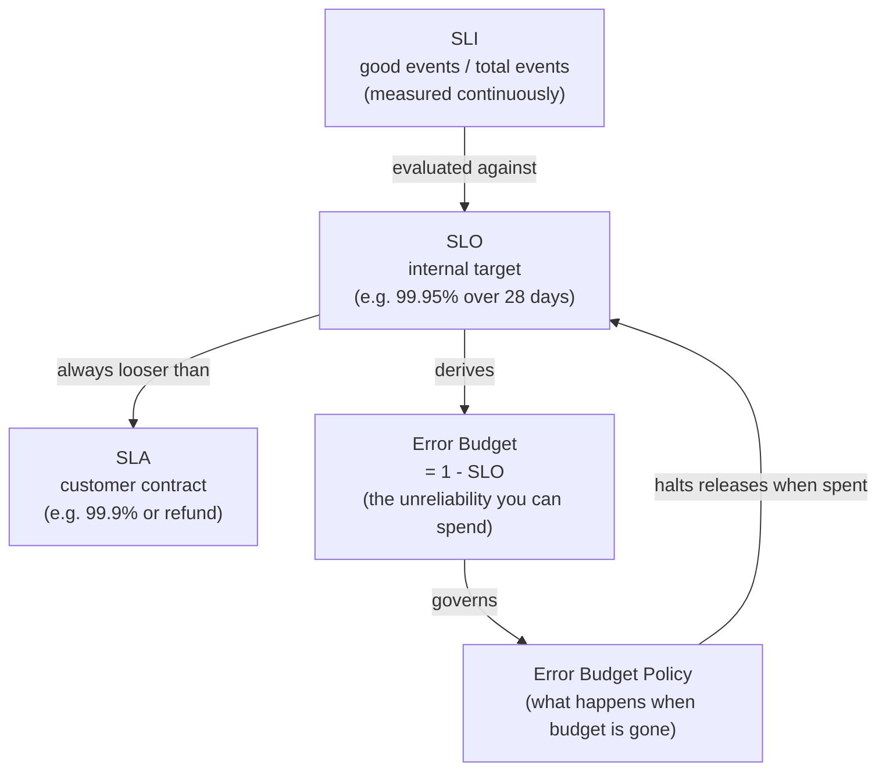
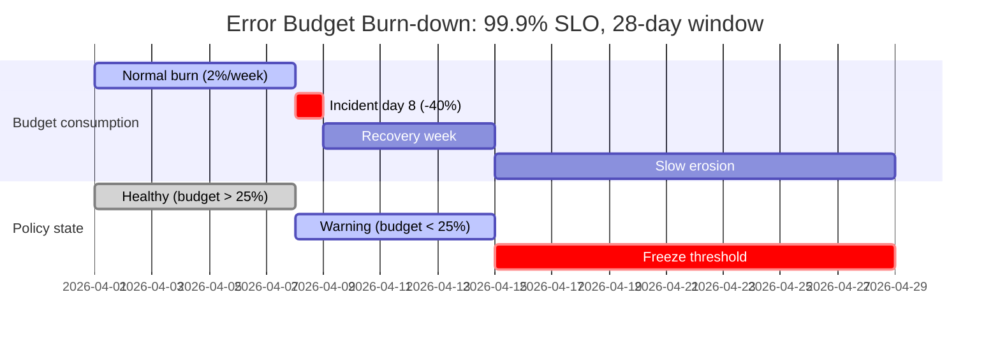
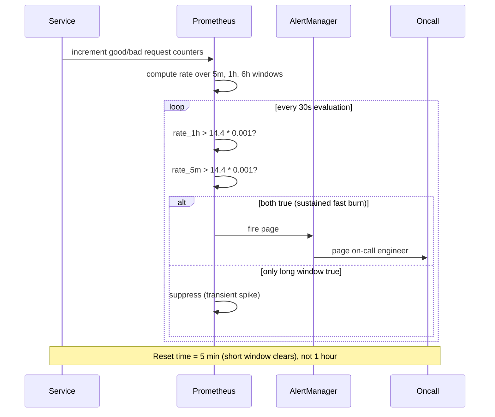

# SLI, SLO, SLA, and Error Budgets: Making Reliability Quantitative

> **TL;DR**: An SLI is a ratio of good events to total events. An SLO is the target for that ratio over a time window. An SLA is a contract with financial consequences when the SLO is missed. The error budget is `1 - SLO`: the unreliability you are allowed to spend on deploys, experiments, and feature launches. When the budget runs out, you freeze releases until the window resets. This mechanism turns reliability from a vague aspiration into a tradable resource that aligns product and infrastructure teams on the same arithmetic[^1].

## Learning Objectives

After this module, you will be able to:

- [ ] Pick SLIs that reflect user experience, not internal resource usage
- [ ] Set SLOs that are realistic, measurable, and decision-relevant
- [ ] Calculate error budgets and burn rates
- [ ] Design multi-window, multi-burn-rate alerts
- [ ] Use error budget policy to arbitrate feature vs reliability work

## Intuition

You have a monthly phone plan with 10 GB of data. You do not ration every byte on day one. Instead, you check your usage mid-month: if you have burned 80% by day 15, you throttle your streaming. If you still have 60% left, you watch videos freely.

Error budgets work the same way. Your SLO says "99.9% of requests succeed over 28 days." That gives you a budget of 0.1% failures. You spend that budget on risky deploys, database migrations, and experiments. A dashboard shows how much budget remains. When the budget is low, you slow down. When it is gone, you stop shipping features and fix reliability.

The genius is that nobody argues about whether to prioritize features or reliability. The budget decides. Product managers and SREs share the same number. If the budget is healthy, ship fast. If it is burning, invest in stability. No politics, just arithmetic.

This chapter gives you the vocabulary, the math, and the alerting machinery to make that work in production.

## Theory

### The vocabulary: SLI, SLO, SLA, error budget

Four terms carry the weight of the SRE reliability framework. Get them right and the rest follows.

**SLI (Service Level Indicator)** is a quantitative measure of one aspect of the service, expressed as the ratio of good events to total events[^2]. Example: "the fraction of HTTP requests that return 2xx within 300 ms." The ratio always ranges from 0% to 100%.

**SLO (Service Level Objective)** is a target value for that SLI over a defined time window[^2]. Example: "99.9% of requests succeed over a rolling 28-day window." Missing it triggers engineering action, not legal consequences.

**SLA (Service Level Agreement)** is a contract with users that includes financial or business consequences if the SLO in the agreement is missed[^2]. The distinguishing question: "what happens if the target is missed?" If the answer is nothing explicit, you have an SLO, not an SLA.

**Error budget** is `1 - SLO`. A 99.9% SLO gives a 0.1% budget. Over 1,000,000 requests, that is 1,000 allowed bad events. You spend the budget on deploys and experiments. When it is exhausted, you freeze.



*The SLI feeds the SLO; the SLO derives the error budget; the policy enforces consequences when the budget is spent.*

> [!IMPORTANT]
> Most people say "SLA" when they mean "SLO." One giveaway: if somebody talks about an "SLA violation," they almost always mean a missed SLO. A real SLA violation might trigger a court case for breach of contract[^3].

### Picking SLIs from the critical user journey

An SLI should measure what the user experiences. The SRE Workbook recommends treating the SLI as "the ratio of two numbers: the number of good events divided by the total number of events"[^1].

The **SLI menu** maps service types to indicator categories:

| Service type | SLI types |
|---|---|
| Request-driven | Availability, latency, quality |
| Pipeline | Freshness, correctness, coverage |
| Storage | Durability |

Start by identifying your **Critical User Journeys (CUJs)**. For an e-commerce site, CUJs include searching for a product, adding to cart, and completing a purchase. Each CUJ maps to one or more SLIs.

**Latency as a ratio, not a percentile.** Instead of "p99 < 300 ms," frame it as "99% of requests complete in < 300 ms." This makes error-budget computation direct: requests slower than 300 ms are bad events[^1].

**Why NOT CPU or memory as SLIs?** Resource metrics are inputs to capacity planning, not indicators of user happiness. Your servers can spike to 90% CPU while users experience zero degradation. Conversely, a partial outage can occur at 20% CPU. If a metric does not directly affect user satisfaction, it is not useful as an SLI[^4].

### Setting SLO targets and the nines table

Start from historical SLI measurements. The SRE Workbook recommends using current performance as a starting point, then rounding down to a number the team has actually achieved[^1].

**The nines table** makes the cost of each target concrete:

| Availability | Downtime/year | Downtime/month | Downtime/week |
|---|---|---|---|
| 99% | 3.65 days | 7.20 hours | 1.68 hours |
| 99.5% | 1.83 days | 3.60 hours | 50.4 minutes |
| 99.9% | 8.77 hours | 43.20 minutes | 10.08 minutes |
| 99.95% | 4.38 hours | 21.60 minutes | 5.04 minutes |
| 99.99% | 52.60 minutes | 4.32 minutes | 1.01 minutes |
| 99.999% | 5.26 minutes | 25.9 seconds | 6.05 seconds |

Common targets by service class (typical industry conventions, not formal standards):

- **99.0%**: Internal tooling, batch pipelines
- **99.9%**: Consumer-facing web applications
- **99.95%**: Critical B2B APIs, payment gateways
- **99.99%**: Business-critical platform services (Slack commits to this in customer agreements[^5])

**SLO tighter than SLA.** Set your internal SLO stricter than the contractual SLA. Google recommends an internal SLO of 99.95% when the external SLA is 99.9%[^2]. The gap is your safety margin.

**Compounding: dependencies cap your SLO.** If service A (99.9%) synchronously calls service B (99.9%) on every request, A's maximum achievable availability is `0.999 x 0.999 = 99.8%`[^6]. You cannot be more available than the product of your critical dependencies unless you soften them with caching, queues, or [graceful degradation](./03-graceful-degradation.md).

**Why 100% is wrong.** The SRE Workbook gives four reasons: physics makes it unachievable; the user's chain of dependencies is never 100% anyway; every nine past user perception is wasted engineering; and a 100% target means the team can never deploy changes[^1].

### Error budgets and the error budget policy

The error budget makes the SLO operational. For a 99.9% SLO over four weeks on a service receiving 3,000,000 requests, the budget is 3,000 errors. A single outage producing 1,500 errors consumes 50% of the budget.

The **error budget policy** is the written agreement describing what happens when the budget is spent. Google's canonical policy[^7]:

1. **Budget healthy:** Releases proceed normally.
2. **Budget exhausted:** Halt all changes except P0 issues or security fixes until the service is back within SLO.
3. **Single incident > 20% of budget:** Mandatory postmortem with at least one P0 action item.
4. **Exceptions:** Outages caused by company-wide network problems, upstream teams already frozen, or out-of-scope traffic (load tests, pen tests).

The freeze is a tool, not a punishment. The Workbook frames it explicitly: "Halting change is undesirable; this policy gives teams permission to focus exclusively on reliability when data indicates that reliability is more important than other product features"[^7].



*A single large incident spends 40% of the budget in one day; slow erosion over the remaining weeks decides whether the policy freezes releases.*

### Multi-window, multi-burn-rate alerting

A naive alert that fires whenever the error rate exceeds the SLO threshold produces up to 144 pages per day without the SLO actually being endangered[^8]. The solution is burn-rate alerting.

**Burn rate** is how fast the service consumes its error budget relative to sustainable. Burn rate 1 = budget lasts exactly the SLO window. Burn rate 14.4 = 2% of budget consumed in 1 hour.

| Burn rate | Error rate (99.9% SLO) | Time to exhaust budget |
|---|---|---|
| 1 | 0.1% | 30 days |
| 2 | 0.2% | 15 days |
| 10 | 1% | 3 days |
| 1,000 | 100% | 43 minutes |

The **multi-window, multi-burn-rate matrix** pairs a long window for detection with a short window for confirmation[^8]:

| Severity | Long window | Short window | Burn rate | Budget consumed |
|---|---|---|---|---|
| Page | 1 hour | 5 minutes | 14.4x | 2% |
| Page | 6 hours | 30 minutes | 6x | 5% |
| Ticket | 3 days | 6 hours | 1x | 10% |

The short window is 1/12 the duration of the long window. An alert fires only when **both** windows exceed the threshold. This kills false positives from transient spikes and gives a 5-minute reset time instead of a 1-hour reset[^8].



*The alert fires only when both the fast and slow windows confirm a high burn rate; single-window alerts would either flap or miss the event.*

A Prometheus alert implementing this pattern:

```yaml
- alert: ErrorBudgetBurn_Page
  expr: |
    (
      job:slo_errors_per_request:ratio_rate1h{job="checkout"} > (14.4 * 0.001)
      and
      job:slo_errors_per_request:ratio_rate5m{job="checkout"} > (14.4 * 0.001)
    )
    or
    (
      job:slo_errors_per_request:ratio_rate6h{job="checkout"} > (6 * 0.001)
      and
      job:slo_errors_per_request:ratio_rate30m{job="checkout"} > (6 * 0.001)
    )
  labels:
    severity: page
```

Tools like [Sloth](https://github.com/slok/sloth) auto-generate these recording rules and alerts from a short YAML SLO spec, producing the full Google multi-window multi-burn-rate alert set.

### Dependency math and the SLO floor

Your service's achievable SLO is bounded from above by the SLO of its critical dependencies. If your checkout depends on a payment gateway whose public SLA is 99.95%, your checkout cannot exceed 99.95% unless you introduce a fallback path.

The fix: soften dependencies. Retries with backoff, caching, circuit breakers, fallback responses, or queued asynchronous processing all decouple your SLO from the downstream floor[^6]. [Graceful Degradation](./03-graceful-degradation.md) covers these patterns in depth.

## Real-World Example

**Slack's Service Delivery Index (SDI-R).** Slack maintains a 99.99% availability target in customer agreements[^5]. Rather than a single global SLO, Slack uses a composite reliability metric called SDI-R (Service Delivery Index, Reliability).

SDI-R is calculated as `uptime(status site) * availability(api)` where API availability is `successful_requests / total_requests`[^5]. The metric is tracked daily, hourly, and per-service. Different APIs are weighted by user impact, and large enterprise customers get their own sub-SDI-R breakdown.

The organizational structure matters as much as the math. SDI-R is owned by the Reliability Engineering team but reviewed at the Engineering Monday Meeting with engineering leadership. This makes trade-offs organization-wide rather than team-local. A "Webapp Ownership Tool" automates SLO, alert, and dashboard setup for each API endpoint. A service catalog named Omni tracks ownership and escalation paths keyed to SDI-R regressions[^5].

The key insight: by the time an issue impacts SDI-R, it has already been captured by a service-level alert. SDI-R is the strategic metric; burn-rate alerts are the tactical response. This two-layer approach separates "are we meeting our commitment?" from "should we page someone right now?"

**Tooling ecosystem.** Beyond custom implementations, the SLO space has standardized:

- **Sloth** generates Prometheus recording rules and multi-burn-rate alerts from YAML specs
- **OpenSLO** provides a vendor-neutral YAML specification for SLO definitions
- **Honeycomb** computes SLOs from trace events, enabling immediate pivot from "budget is burning" to "here is why" via BubbleUp analysis
- **Nobl9** and **Datadog** offer managed SLO platforms with composite objectives and budget annotations

## Trade-offs

Once you have committed to running SLOs with a formal error budget policy, the next design decision is *shape*: one global SLO for the whole service, one SLO per critical user journey, or tiered/composite SLOs that reflect customer class. The rows below are the genuinely substitutable choices.

| Approach | Pros | Cons | Best when | Our Pick |
|---|---|---|---|---|
| Single service-wide SLO with error budget policy | Simplest arithmetic; one shared number drives product-vs-reliability decisions | Averages hide journey-specific failures (search can be healthy while checkout is down) | Small to mid services with one dominant user path | Default for a single team owning one service |
| Journey-based SLOs (one SLO per critical user journey) | SLIs align with what users actually do; a bad checkout does not hide behind a healthy search | More dashboards, more recording rules, more owners to coordinate | Services with 2-5 distinct critical user journeys | Default for medium-to-large services |
| Tiered SLOs (per customer class) | Matches contractual reality; premium customers get a stricter internal target | More complex measurement and alerting; separate burn-rate streams per tier | Services with paying customer tiers or enterprise SLAs | When premium customers justify the measurement cost |
| Composite reliability index (SDI-R style) | Single rollup number for leadership review; weighted by impact | Can smooth over acute per-journey failures unless paired with per-journey alerts | Large organisations reporting reliability to executives | Layer on top of journey-based SLOs, not instead of them |

> [!NOTE]
> The "no SLOs" and "SLOs without a policy" anti-patterns that used to appear in this table are covered in the Common Pitfalls below, which is where anti-patterns belong. The SLA-vs-SLO decision is also not on this axis: Google's guidance is to always keep an internal SLO tighter than any external SLA[^2], not to choose between them.

## Common Pitfalls

> [!WARNING]
> **SLOs without an error budget policy.** The SLO is published but nothing happens when it is missed. Teams continue shipping over a burning budget. The SLO becomes a reporting metric, not a decision tool. Require the policy as part of the SLO rollout[^1].

> [!WARNING]
> **Aspirational targets the team cannot meet.** Setting 99.99% because it sounds impressive, then missing it every window, either paralyzes feature work (policy fires constantly) or reduces the policy to theatre (quietly ignored). Start from historical data; make the tighter target an explicit "aspirational SLO" tracked separately[^1].

> [!WARNING]
> **CPU or memory as an SLI.** You get paged for a CPU spike during which no user experienced degradation, and miss a partial outage where CPU looked fine. Use resource metrics for capacity planning; use request success ratios for SLIs.

> [!WARNING]
> **Never-missed SLOs (too loose) or always-missed SLOs (too tight).** An SLO that never triggers the policy provides no signal. An SLO that always triggers is noise. Review quarterly: tighten when consistently met with no user complaints; loosen when consistently missed with high user satisfaction[^1].

> [!WARNING]
> **Conflating SLA and SLO.** Treating the contractual SLA number as the internal target leaves no safety margin. Every SLA breach is also an internal surprise. Set the internal SLO at least 0.05% tighter than the external SLA[^2].

## Exercise

Design SLIs and SLOs for a checkout service: identify the critical user journey, define SLIs (availability, latency, freshness), set SLO targets, compute the error budget, design the alerting strategy with burn-rate windows, and draft the error budget policy.

<details>
<summary>Hint</summary>

The checkout CUJ is: user clicks "Pay" to order confirmation. Think about what "good" means: 2xx response AND fast AND using fresh pricing data. Compute the budget in requests, not minutes. For alerting, use the 14.4x/1h and 6x/6h burn rates from the Workbook.

</details>

<details>
<summary>Solution</summary>

**Critical User Journey:** User clicks "Place Order" and receives order confirmation within an acceptable time, with correct pricing.

**SLIs:**

1. **Availability:** fraction of `POST /checkout` requests returning 2xx / total requests
2. **Latency:** fraction of `POST /checkout` requests completing in < 800 ms / total requests
3. **Freshness:** fraction of price-check requests using data fresher than 60 seconds / total price-check requests

**SLO targets (28-day rolling window):**

- Availability: 99.95% (budget: 500 errors per 1,000,000 requests)
- Latency: 99% < 800 ms (budget: 10,000 slow requests per 1,000,000)
- Freshness: 99.9% (budget: 1,000 stale-price events per 1,000,000)

**Error budget math (availability):** 28 days, ~3M requests/window. Budget = 3,000,000 * 0.0005 = 1,500 allowed errors.

**Alerting (availability SLI):**

```yaml
- alert: CheckoutBudgetBurn_Page
  expr: |
    (
      job:slo_errors_per_request:ratio_rate1h{job="checkout"} > (14.4 * 0.0005)
      and
      job:slo_errors_per_request:ratio_rate5m{job="checkout"} > (14.4 * 0.0005)
    )
    or
    (
      job:slo_errors_per_request:ratio_rate6h{job="checkout"} > (6 * 0.0005)
      and
      job:slo_errors_per_request:ratio_rate30m{job="checkout"} > (6 * 0.0005)
    )
  labels:
    severity: page
```

**Error budget policy:**

1. Budget > 50%: ship features freely.
2. Budget 25-50%: all deploys require SRE review; no risky migrations.
3. Budget < 25%: freeze feature launches; reliability-only work.
4. Budget exhausted: full release freeze until window resets.
5. Single incident > 20% of budget: mandatory postmortem with P0 action item.

**Dependency check:** If the payment gateway SLA is 99.95%, your checkout cannot exceed that without a fallback (queue-and-retry, secondary provider). Your 99.95% SLO is at the ceiling of what the dependency allows.

</details>

## Key Takeaways

- 100% reliability is the wrong target. Each nine past user perception is wasted engineering.
- SLI = measurement (good/total ratio). SLO = internal target. SLA = contract with consequences. Error budget = 1 - SLO.
- Pick SLIs from critical user journeys, not from server resource metrics. CPU is for capacity planning, not for SLOs.
- Start SLO targets from historical data. Set them tighter than the SLA but looser than aspiration.
- Dependencies cap your SLO: two 99.9% services in series give you at most 99.8%.
- Error budgets align product and SRE teams on the same arithmetic. The budget decides, not politics.
- Multi-window, multi-burn-rate alerts catch real problems without paging on every transient spike. Use 14.4x/1h for pages and 6x/6h for slower burns.

## Further Reading

- [The Site Reliability Workbook: Implementing SLOs (Ch. 2)](https://sre.google/workbook/implementing-slos/) - The canonical starting point with the full worked example, SLI menu, and ratio-based measurement approach.
- [The Site Reliability Workbook: Alerting on SLOs (Ch. 5)](https://sre.google/workbook/alerting-on-slos/) - The six-iteration derivation of multi-window multi-burn-rate alerting with PromQL throughout.
- [Google SRE Book: Service Level Objectives (Ch. 4)](https://sre.google/sre-book/service-level-objectives/) - The original definitions, including the Chubby planned-outage case study and the cost-of-nines framing.
- [Example Error Budget Policy (Appendix B, SRE Workbook)](https://sre.google/workbook/error-budget-policy/) - A short, usable template for the organizational agreement that gives SLOs teeth.
- [The Calculus of Service Availability (ACM Queue, 2017)](https://queue.acm.org/detail.cfm?id=3096459) - Treynor, Dahlin, Rau, and Beyer on why dependencies cap your achievable SLO and how to reason about composition.
- [Service Delivery Index: A Driver for Reliability (Slack Engineering, 2023)](https://slack.engineering/service-delivery-index-a-driver-for-reliability/) - Slack's real-world composite SLO implementation with weighted API importance and organizational review cadence.
- [Sloth: Prometheus SLO Generator](https://github.com/slok/sloth) - OSS tool that auto-generates the Workbook alert set from a short YAML SLO spec; pairs with OpenSLO for portability.
- [OpenSLO Specification](https://github.com/OpenSLO/OpenSLO) - The vendor-neutral YAML spec for defining SLOs, SLIs, and alert policies across tools.

## Flashcards

**Q:** What is the formula for error budget?
**A:** Error budget = 1 - SLO. A 99.9% SLO gives a 0.1% budget. Over 1,000,000 requests, that is 1,000 allowed bad events.

**Q:** What distinguishes an SLA from an SLO?
**A:** An SLA is a contract with financial or business consequences when missed (credits, penalties). An SLO is an internal target that triggers engineering action. If nothing explicit happens when the target is missed, it is an SLO, not an SLA.

**Q:** Why should you avoid CPU utilization as an SLI?
**A:** CPU does not directly reflect user experience. Servers can spike to 90% CPU with zero user impact, or suffer partial outages at 20% CPU. Use request success ratios measured from the user's perspective.

**Q:** What burn rate triggers a page in Google's recommended alerting?
**A:** 14.4x burn rate sustained over both a 1-hour and 5-minute window, meaning 2% of the 30-day budget consumed in 1 hour.

**Q:** Why does multi-window alerting require BOTH windows to exceed the threshold?
**A:** The long window detects sustained problems; the short window confirms the problem is still active. Without the short window, alerts keep firing for up to an hour after the issue resolves. Without the long window, transient spikes cause false pages.

**Q:** Two services in series, each at 99.9%. What is the maximum system availability?
**A:** 0.999 x 0.999 = 99.8%. Serial dependencies multiply, making availability worse. You need caching, queues, or graceful degradation to exceed this floor.

**Q:** What happens when the error budget is exhausted?
**A:** The error budget policy kicks in: halt all non-critical changes and releases until the service is back within SLO. The freeze gives the team permission to focus exclusively on reliability.

**Q:** Why is 100% the wrong reliability target?
**A:** Four reasons: physics makes it unachievable; the user's dependency chain is never 100% anyway; every nine past user perception is wasted engineering; and a 100% target means the team can never deploy changes.

**Q:** What is the recommended SLO window?
**A:** A four-week (28-day) rolling window. Rolling windows track user experience better than calendar windows because users do not forget an outage just because the month changed.

**Q:** How should the internal SLO relate to the external SLA?
**A:** The internal SLO should be tighter (e.g., 99.95% internal when the SLA is 99.9%). The gap is your safety margin: the internal policy fires before the contractual number is breached.

**Q:** Name three types of SLIs for request-driven services.
**A:** Availability (fraction of successful responses), latency (fraction of responses faster than a threshold), and quality (fraction of responses using full-fidelity data rather than degraded fallbacks).

**Q:** What is Slack's SDI-R?
**A:** Service Delivery Index, Reliability. A composite metric combining uptime and API availability, weighted by API importance, tracked per-service and reviewed at engineering leadership meetings to make reliability trade-offs organization-wide.

## References

[^1]: Steven Thurgood, David Ferguson, Alex Hidalgo, Betsy Beyer, "Implementing SLOs", The Site Reliability Workbook Ch. 2, Google/O'Reilly, 2018. https://sre.google/workbook/implementing-slos/
[^2]: Jay Judkowitz and Mark Carter, "SRE fundamentals: SLIs, SLAs and SLOs", Google Cloud Blog, 2018. https://cloud.google.com/blog/products/devops-sre/sre-fundamentals-slis-slas-and-slos
[^3]: Chris Jones, John Wilkes, Niall Murphy, Cody Smith (ed. Betsy Beyer), "Service Level Objectives", Site Reliability Engineering Ch. 4, Google/O'Reilly, 2016. https://sre.google/sre-book/service-level-objectives/
[^4]: Mark Azer and Kai Xin Tai, "SLOs: How to establish and define service level objectives", Datadog blog, 2020 (updated 2025). https://www.datadoghq.com/blog/establishing-service-level-objectives/
[^5]: Matthew McKeen and Ryan Katkov, "Service Delivery Index: A Driver for Reliability", Slack Engineering, 2023. https://slack.engineering/service-delivery-index-a-driver-for-reliability/
[^6]: Ben Treynor, Mike Dahlin, Vivek Rau, Betsy Beyer, "The Calculus of Service Availability", ACM Queue 15, no. 2, 2017. https://dl.acm.org/doi/10.1145/3096459 (also archived at https://web.archive.org/web/20250105182530/https://queue.acm.org/detail.cfm?id=3096459)
[^7]: Steven Thurgood, "Example Error Budget Policy", Appendix B, Site Reliability Workbook, Google/O'Reilly, 2018. https://sre.google/workbook/error-budget-policy/
[^8]: Steven Thurgood et al., "Alerting on SLOs", The Site Reliability Workbook Ch. 5, Google/O'Reilly, 2018. https://sre.google/workbook/alerting-on-slos/
