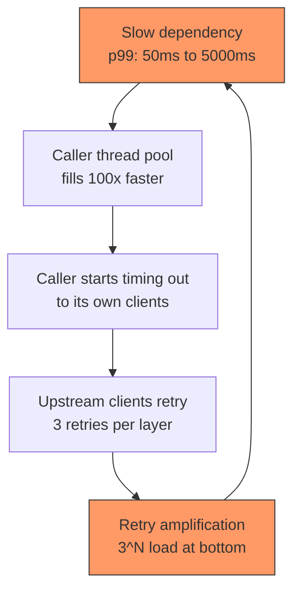
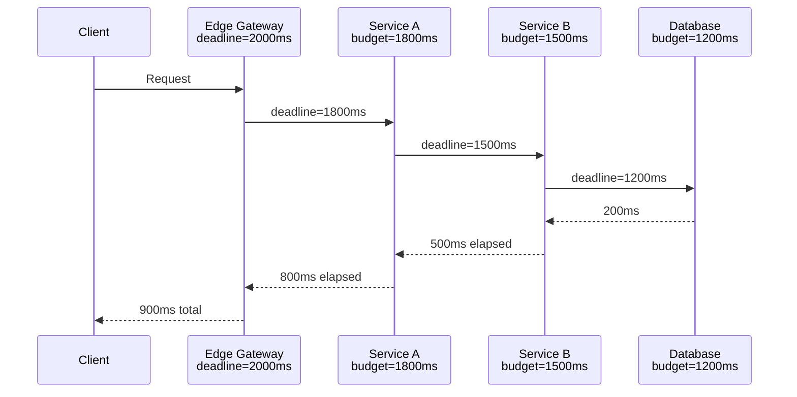
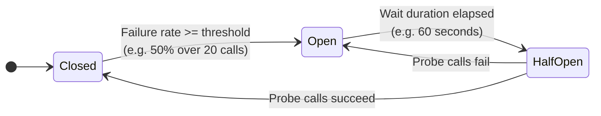

# Resilience Patterns: Timeouts, Retries, Circuit Breakers, and Bulkheads

> **TL;DR**: A distributed system with 30 dependencies each at 99.99% uptime gives you 99.7% composite uptime, roughly 2 hours of downtime per month, unless every dependency edge is independently defended[^1]. The defense toolkit is small: timeouts (never wait forever), retries with exponential backoff and full jitter (never retry in sync), circuit breakers (stop calling what is broken), and bulkheads (isolate blast radius). These patterns are not optional. They are the minimum safe configuration for any RPC between services. Start with a 2-second request timeout, 2 retries with 100 ms base and full jitter, a 50% failure-rate breaker over 20 requests, and measure from there.

## Learning Objectives

After this module, you will be able to:

- [ ] Set appropriate timeouts at each layer of a call chain
- [ ] Implement retries with exponential backoff and jitter without causing retry storms
- [ ] Configure circuit breakers: thresholds, half-open probing, fallback logic
- [ ] Design bulkheads via thread pools, connection pools, or adaptive concurrency limits
- [ ] Pick between library-based (Resilience4j, Polly) and mesh-based (Istio/Envoy) implementations

## Intuition

You live in an apartment building with a single water main. One morning, a pipe bursts in apartment 4B. Water floods the hallway, the pressure drops building-wide, and every apartment loses hot water. The building manager shuts off the main valve to stop the flood, but now nobody has water at all. Recovery takes hours because the plumber cannot even reach the burst pipe while the hallway is flooded.

Now imagine the building had been designed with isolation valves on every floor and per-apartment shutoffs. When 4B's pipe bursts, the floor valve closes automatically. The flood stays contained to one hallway. Every other floor keeps full pressure. The plumber fixes 4B in 20 minutes because the hallway is dry.

Distributed systems work the same way. A slow dependency is the burst pipe. Without defenses, it floods your thread pools, starves your other dependencies, and cascades upward until the entire system is down. Timeouts are the shutoff valves. Circuit breakers are the automatic floor valves. Bulkheads are the walls between apartments. Retries with backoff are the building manager waiting for the pressure to stabilize before turning the main back on, rather than flipping it on and off every second.

[Availability and Reliability](../part-1-core-fundamentals/02-availability-and-reliability.md) introduced the math of nines. This chapter gives you the engineering patterns that actually achieve them.

## Theory

### The cascading failure story

A cascading failure is not a single component dying. It is a feedback loop where one slow dependency consumes caller-side resources, causing the caller to slow, which cascades to its callers, until a large fraction of the system is unavailable.

The mechanism has three stages. First, a downstream service degrades. Its p99 jumps from 50 ms to 5,000 ms. Second, the caller's thread pool, sized for steady-state latency, fills 100x faster than it drains. Threads that should serve other dependencies are now blocked waiting on the slow one. Third, the caller itself starts timing out to its own clients, who retry, amplifying load at every layer. A five-deep call stack where each layer retries three times turns one original request into 3^5 = 243 downstream requests[^2].

The AWS DynamoDB outage of September 2015 is the canonical case. A brief network disruption caused storage servers to simultaneously re-request membership data from a metadata service. The metadata payloads had grown (due to Global Secondary Index adoption) to near the retrieval time limit. Requests timed out, servers retried, and the metadata service saturated under retry load. Even healthy servers' renewals failed. Error rates peaked at 55% and held for nearly 5 hours[^3]. Adding capacity did not help because the metadata service could not accept administrative requests under the retry storm. AWS had to pause all requests to break the loop.

The lesson: "just add more capacity" does not fix cascading failure. The bottleneck is correlated retry load, not steady-state capacity.



*A slow dependency triggers a feedback loop: pool exhaustion causes upstream timeouts, which trigger retries, which amplify load on the already-struggling dependency.*

### Timeouts

A timeout is the maximum time a client waits before abandoning a request and freeing its resources. There are distinct types:

- **Connection timeout**: how long to wait for TCP + TLS handshake (typically 1-3 seconds)
- **Request timeout**: end-to-end wait for a response after the connection is open (the critical one)
- **Socket/read timeout**: how long a single read call blocks on an open socket
- **Idle timeout**: how long an unused connection lives before the pool closes it

The dangerous default: most HTTP client libraries (Java's `HttpURLConnection`, Python's `requests`, Node's `http.request`, Go's default `http.Client`) historically default to infinite timeouts[^2]. A request that never completes holds a thread forever. This is the single most common root cause of cascading failures.

**Setting the right value.** Start from the downstream service's latency distribution. Pick the timeout at the p99.9, padded for network variance. If the downstream p99.9 is 800 ms, set the timeout at 2,000 ms. Too low and you get false timeouts that trigger retry storms. Too high and the timeout stops protecting against resource exhaustion.

**Timeout budgets** solve the multi-hop problem. A single end-to-end deadline is set at the edge and subtracted as the request moves through the call chain. gRPC implements this with the `grpc-timeout` header, decremented at each hop. If a caller has 200 ms of budget left and the downstream p99 is 300 ms, the call should be short-circuited immediately rather than issued.



*A deadline set at the edge is subtracted at each hop; if remaining budget is less than the downstream's known p99, the call is short-circuited.*

**Hedged requests** from Dean and Barroso's "The Tail at Scale" address tail latency caused by interference (GC pauses, noisy neighbors). Issue the primary request, wait for the p95 latency, then issue a second to a different replica. Take whichever returns first. This can significantly reduce p99 latency at the cost of additional load in the tail. Only safe for idempotent reads.

### Retries

Retries mask transient failures. But they are only safe when the target operation is idempotent, because a timeout does not mean the side effect did not happen. [Idempotency and Exactly-Once](../part-3-distributed-systems-theory/07-idempotency-exactly-once.md) covers the design patterns that make retries safe.

**Exponential backoff** increases delay as `delay = base * 2^attempt`. Linear backoff is insufficient because competing clients only drop off one at a time, producing O(N^2) total work. Capped exponential limits the maximum delay (e.g., 30 seconds) to prevent unbounded waits.

**Jitter** breaks synchronization. Without it, every client that failed at the same moment computes the same backoff and retries simultaneously. Marc Brooker's simulations show four variants[^4]:

```python
# No jitter (bad: synchronized storms)
sleep = min(cap, base * 2 ** attempt)

# Full Jitter (best: lowest total work)
sleep = random_between(0, min(cap, base * 2 ** attempt))

# Equal Jitter (middle ground)
temp = min(cap, base * 2 ** attempt)
sleep = temp / 2 + random_between(0, temp / 2)

# Decorrelated Jitter (fastest completion)
sleep = min(cap, random_between(base, sleep_prev * 3))
```

Full Jitter cuts total client work by more than half versus no jitter. AWS uses it as the default in most SDKs[^4].

```mermaid
gantt
    title Retry attempts over time: no jitter vs full jitter (5 clients)
    dateFormat X
    axisFormat %Ss
    section No jitter
    Client A retry :a1, 1, 1s
    Client B retry :b1, 1, 1s
    Client C retry :c1, 1, 1s
    Client D retry :d1, 1, 1s
    Client E retry :e1, 1, 1s
    section Full jitter
    Client A retry :a2, 0, 1s
    Client B retry :b2, 2, 1s
    Client C retry :c2, 3, 1s
    Client D retry :d2, 5, 1s
    Client E retry :e2, 6, 1s
```



*Without jitter, clients that failed together compute the same backoff and retry in a synchronized wave at t=1s; with full jitter, retries spread across the backoff window and the downstream sees a smooth recovery.*

**Retry budgets** cap amplification. gRPC's token bucket starts at 10 tokens; each failure costs 1, each success adds 0.1. When tokens fall to 5 or fewer (at or below maxTokens/2), retries are disabled until the count rises back above the threshold. This caps retry traffic at roughly 10% of baseline volume regardless of failure rate.

**Which codes are retriable:** 500, 502, 503, 504, 408, 429 (with Retry-After). Never retry 4xx (except 408/429) because the request itself is malformed and will fail identically.

**The critical rule:** retry at exactly one layer of the stack, typically the outermost. A 5-deep stack with 3 retries each produces 243x amplification. Lower layers surface the error; the edge decides whether to retry.

### Circuit breakers

A circuit breaker is a state machine that fails fast once a downstream failure rate exceeds a threshold, preventing callers from wasting resources on calls that will time out. Michael Nygard's "Release It!" (2007) introduced the pattern; Netflix Hystrix popularized it.

Three states govern the lifecycle:



*The circuit breaker transitions through three states; probe calls in Half-Open decide whether the downstream has recovered.*

**CLOSED**: calls flow through; the breaker records outcomes in a sliding window. Resilience4j defaults to a count-based window of 100 calls with a 50% failure threshold[^5].

**OPEN**: all calls are short-circuited immediately (fail fast). Lasts for a configurable wait duration (60 seconds in Resilience4j).

**HALF-OPEN**: a limited number of probe calls (10 in Resilience4j) are permitted. If they succeed below the failure threshold, the breaker closes. If not, it reopens.

**Per-host vs per-service**: a library-level breaker (Resilience4j, Polly) is typically per-service. Envoy outlier detection is per-host: it tracks each upstream pod independently and ejects unhealthy ones while keeping healthy ones in rotation. This is strictly stronger because one sick pod does not cause a blanket open-circuit for the entire service.

### Bulkheads

A bulkhead isolates resource pools so that one failing dependency consumes only its share, leaving resources available for others. The name comes from ship design, where transverse walls stop flooding from one compartment from sinking the whole vessel.

**Thread-pool isolation** (the Hystrix design): each dependency gets its own thread pool, typically 10 threads[^1]. If one dependency becomes latent, it saturates only its own pool. Cost: single-digit to tens of microseconds per call for thread-pool context switching overhead.

**Semaphore isolation**: a counting semaphore bounds concurrent calls without a separate thread pool. Near-zero overhead, but a slow dependency still occupies the caller's thread. You get concurrency capping without true isolation.

**Connection-pool isolation**: each downstream gets its own HTTP client with its own connection pool. A slow dependency fills its pool but not others.

**Cell-based architecture**: the extreme form. Tenants or shards are routed to isolated "cells," each a full stack. A cell-level failure affects only the tenants routed to that cell. The AWS S3 2017 postmortem explicitly names cell-based architecture as the recovery-time strategy the S3 team accelerated after the incident.

**Adaptive concurrency limits** (Netflix's `concurrency-limits` library) replace static pool sizing with a TCP-style congestion-control loop. The Vegas algorithm uses `L * (1 - minRTT/sampleRTT)` to estimate queue depth, growing the limit when latency is near minimum and shrinking when queueing is detected[^6]. This removes the need to hand-tune thread-pool sizes.

### Fallbacks and graceful degradation

A fallback is an alternative response path invoked when the primary fails. Common types, in order of user impact:

- **Cached stale response** (stale-while-revalidate)
- **Static default** (empty list for personalization)
- **Alternative upstream** (read replica instead of primary)
- **Fail silent** (null response the UI ignores)

**Fail-closed vs fail-open** depends on the operation. Authentication should fail closed (deny when unsure). Personalization should fail open (show non-personalized content).

> [!IMPORTANT]
> **AWS's contrarian position on fallbacks.** Jacob Gabrielson's "Avoiding fallback in distributed systems" documents a 2001 Amazon outage where the fallback from a failed cache to a direct database query turned "shipping speeds unavailable" into a full-site outage plus a worldwide fulfillment halt, because the fallback shared fate with the primary. AWS's preferred alternatives: improve primary reliability, let the caller retry, push data proactively, or exercise both paths continuously so the "fallback" is not rarely-exercised dead code.

[Graceful Degradation](./03-graceful-degradation.md) covers the UX side of this problem in depth.

### Library vs service mesh

| Dimension | Library (Resilience4j, Polly) | Service mesh (Istio/Envoy) |
|-----------|-------------------------------|----------------------------|
| Scope | In-process, per-language | Sidecar, language-agnostic |
| Granularity | Per-method, request-level state | Per-host, connection-level |
| Overhead | Near-zero | ~1 ms sidecar hop |
| Configuration | Code or config file | Kubernetes CRDs |
| Outlier detection | Per-service (blanket) | Per-host (surgical) |
| Best for | Fine-grained adaptive logic | Fleet-wide policy enforcement |

The modern answer is hybrid: use the service mesh for baseline protection (outlier detection, connection limits, global retry budgets) and a library for request-level adaptive behavior (hedging, custom fallbacks, business-logic-aware circuit breaking).

## Real-World Example

### Netflix: from Hystrix to adaptive concurrency

Netflix's API gateway handled over 1 billion incoming calls per day in 2012, fanning out at a 1:6 ratio to several billion outgoing dependency calls[^1]. With 30+ dependencies, each at 99.99% individual uptime, the composite uptime without isolation would have been 99.7%, roughly 2 hours of downtime per month.

Netflix's solution was Hystrix, open-sourced in 2012. Every network-bound dependency call was wrapped in a `HystrixCommand` running on a per-dependency thread pool (10 threads default). Each command had a per-call timeout, a sliding-window breaker (10-second window, 20-request minimum, 50% failure threshold), and a mandatory `getFallback()` method. Thread-pool rejection, timeout, or circuit-open all routed to the fallback.

The design forced developers to decide how to degrade at design time, not during the outage. At peak, Netflix processed over 100,000 dependency requests per second with this model.

**Why Hystrix was deprecated (2018).** Netflix announced Hystrix had entered maintenance mode because their focus shifted to "adaptive implementations that react to an application's real-time performance rather than pre-configured settings"[^6]. The problem: Hystrix required dozens of tuning parameters per dependency (thread-pool size, timeout, error threshold, window size). With 30 dependencies, that was 300+ knobs nobody tuned correctly. The thread-pool isolation model also added measurable per-call overhead, which mattered at Netflix scale.

The replacement, `Netflix/concurrency-limits`, uses TCP congestion-control algorithms (Vegas, Gradient2) to dynamically discover the right concurrency limit from measured latency. When RTT grows relative to minimum RTT, queueing is happening and the limit shrinks. When latency is near minimum, the limit grows. No manual tuning required.

**The industry arc:** early resilience was heavily configured static thresholds (Hystrix). Modern resilience increasingly replaces configuration with measurement (adaptive concurrency, Envoy outlier detection). Resilience4j and Polly remain useful for pattern-based work, but the direction is clear: measure, do not guess.

## Trade-offs

| Approach | Pros | Cons | Best when | Our Pick |
|----------|------|------|-----------|----------|
| Library (Resilience4j, Polly) | Fine-grained, in-process, no network hop | Per-language, config explosion | Small fleet, need request-level logic | **Default for <20 services** |
| Service mesh (Istio/Envoy) | Language-agnostic, per-host outlier detection | ~1 ms overhead, ops burden | Large polyglot fleet | **Default for 20+ services** |
| API gateway only | Central policy, one place to tune | Only at ingress, no east-west | Edge-focused, tiny internal fleet | Supplement, not primary |
| Adaptive concurrency | No manual tuning, reacts to real load | Control loop can oscillate | High-traffic services with variable load | **Add on top of mesh or library** |

## Common Pitfalls

> [!WARNING]
> **No timeouts (the infinite-wait trap).** Most HTTP client libraries default to infinite timeouts. A single stuck request holds a thread forever, and you will not notice until the pool is exhausted and the entire service is unresponsive. Every client must set explicit connection and request timeouts. No exceptions.

> [!WARNING]
> **Retries without jitter.** Capped exponential backoff without jitter has every client computing the same sleep value. They all retry at the same moment, creating synchronized load spikes that keep the downstream overloaded. Always use Full Jitter: `sleep = random_between(0, min(cap, base * 2^attempt))`.

> [!WARNING]
> **Retries without idempotency.** A timeout does not mean the server did not process the request. Retrying a non-idempotent operation (payment charge, message send) produces duplicate side effects. Only retry operations that are idempotent by design or protected by an idempotency key.

> [!WARNING]
> **Retries at every layer.** Each layer wants to be resilient in isolation; nobody owns end-to-end retry policy. A 5-deep stack with 3 retries each produces 243x load amplification. Retry at exactly one layer, typically the outermost.

> [!WARNING]
> **Fallbacks that share fate with the primary.** "When cache fails, query the database directly" sounds reasonable until you realize the cache was hiding the database from 10x its capacity. The fallback triggers exactly when the database is least able to handle it. Prefer static defaults or fail-silent responses that hit no shared dependencies.

## Exercise

Design the resilience configuration for a checkout service that calls 5 downstream services (Inventory, Payments, Shipping, Tax, Notifications). Specify timeouts, retry config with jitter, circuit breaker thresholds, bulkhead sizing, and fallback behavior per dependency. Justify each number.

<details>
<summary>Hint</summary>

Not all dependencies are equal. Payments is critical and non-idempotent without a key. Notifications is fire-and-forget. Tax is cacheable. Think about which services can fail open and which must fail closed. Use the recommended defaults as your starting point: timeout = 2-5x downstream p99, retries <= 3, base backoff 100 ms, breaker at 50% over 20 requests.

</details>

<details>
<summary>Solution</summary>

**Assumptions:** Inventory p99 = 80 ms, Payments p99 = 400 ms, Shipping p99 = 150 ms, Tax p99 = 50 ms, Notifications p99 = 200 ms.

| Dependency | Timeout | Retries | Backoff | Breaker | Bulkhead | Fallback |
|------------|---------|---------|---------|---------|----------|----------|
| Inventory | 500 ms | 1 | 100 ms full jitter | 50% / 20 req | 15 threads | Fail closed (cannot sell what you do not have) |
| Payments | 2,000 ms | 2 | 200 ms full jitter | 40% / 10 req | 20 threads | Fail closed + idempotency key required |
| Shipping | 800 ms | 2 | 100 ms full jitter | 50% / 20 req | 10 threads | Cached rates (stale 5 min acceptable) |
| Tax | 300 ms | 1 | 50 ms full jitter | 60% / 30 req | 10 threads | Cached rates (stale 24h, tax tables change rarely) |
| Notifications | 1,000 ms | 0 | N/A | 50% / 20 req | 5 threads | Fail silent (queue for later, never block checkout) |

**Justification:**

- Timeouts are 2-5x the downstream p99, giving headroom for tail latency without waiting forever.
- Payments gets the most generous timeout and bulkhead because it is the most critical and slowest dependency. Retries require an idempotency key (Stripe pattern).
- Notifications gets zero retries and the smallest bulkhead because it must never block checkout. If it fails, enqueue to a dead-letter queue and process asynchronously.
- Tax and Shipping use cached fallbacks because their data changes infrequently and stale values are acceptable for a brief period.
- Circuit breakers trip at 50% failure rate over 20 requests (the Hystrix default), except Payments which trips more aggressively (40% / 10 req) because false charges are worse than declined checkouts.
- Total thread budget: 60 threads across 5 dependencies, leaving the remaining Tomcat threads (typically 200) available for request handling and other work.

</details>

## Key Takeaways

- Timeouts are non-negotiable. No call should wait forever. Default to 2-5x the downstream p99.
- Retries without jitter cause synchronized thundering herds. Always use Full Jitter.
- Retries are only safe for idempotent operations. If the target is not idempotent, add an idempotency key before adding retries.
- Circuit breakers turn slow failures into fast ones, protecting callers from wasting resources on a broken dependency.
- Bulkheads prevent one failing dependency from consuming all resources. Thread pools, semaphores, or adaptive concurrency limits all work.
- Retry at exactly one layer of the stack. Multi-layer retries produce exponential amplification (3^N).
- The industry is moving from static thresholds (Hystrix) to adaptive measurement (concurrency limits, Envoy outlier detection). Start with sensible defaults, then let the system tune itself.

## Further Reading

- [Timeouts, retries, and backoff with jitter](https://aws.amazon.com/builders-library/timeouts-retries-and-backoff-with-jitter/) - Marc Brooker's canonical practitioner source covering the first three patterns with Amazon production anecdotes.
- [Exponential Backoff And Jitter](https://aws.amazon.com/blogs/architecture/exponential-backoff-and-jitter/) - The 2015 post defining the four jitter variants with simulation graphs; the basis for AWS SDK retry defaults.
- [Avoiding fallback in distributed systems](https://aws.amazon.com/builders-library/avoiding-fallback-in-distributed-systems/) - Gabrielson's contrarian take on why fallbacks usually make outages worse; includes the 2001 Amazon cache-to-DB disaster.
- [The Tail at Scale](https://research.google/pubs/the-tail-at-scale/) - Dean and Barroso's 2013 CACM paper introducing hedged and tied requests for tail-latency mitigation.
- [Fault Tolerance in a High Volume, Distributed System](https://netflixtechblog.com/fault-tolerance-in-a-high-volume-distributed-system-91ab4faae74a) - Netflix's 2012 post explaining the DependencyCommand pattern that became Hystrix.
- [Performance Under Load](https://netflixtechblog.medium.com/performance-under-load-3e6fa9a60581) - The 2018 Netflix post announcing the move from Hystrix to adaptive concurrency limits; explains Vegas and Gradient2 algorithms.
- [Resilience4j CircuitBreaker Documentation](https://resilience4j.readme.io/docs/circuitbreaker) - The modern JVM reference for breaker configuration with all defaults documented.
- [Envoy Outlier Detection](https://www.envoyproxy.io/docs/envoy/latest/intro/arch_overview/upstream/outlier) - Per-host ejection as mesh-level circuit breaking; strictly stronger than per-service library breakers.

## Flashcards

**Q:** What are the four core resilience patterns for RPC calls?
**A:** Timeouts (never wait forever), retries with exponential backoff and jitter (never retry in sync), circuit breakers (stop calling what is broken), and bulkheads (isolate resource pools per dependency).

**Q:** Why does "just add more capacity" not fix a cascading failure?
**A:** The bottleneck is correlated retry load, not steady-state capacity. Adding servers does not help when the existing servers cannot accept administrative requests under retry storm load. You must break the feedback loop first (e.g., pause all requests, then add capacity).

**Q:** What is Full Jitter and why is it the recommended default?
**A:** `sleep = random_between(0, min(cap, base * 2^attempt))`. It randomizes the entire backoff window, preventing synchronized retry waves. Brooker's simulations show it cuts total client work by more than half versus no jitter.

**Q:** Why must retries only happen at one layer of the call stack?
**A:** A 5-deep stack with 3 retries per layer produces 3^5 = 243 downstream requests for one original request. Multi-layer retries cause exponential amplification that guarantees the backend cannot recover.

**Q:** What are the three states of a circuit breaker?
**A:** CLOSED (calls flow through, outcomes recorded), OPEN (all calls short-circuited immediately), and HALF-OPEN (limited probe calls test whether the downstream has recovered).

**Q:** What is the difference between per-service and per-host circuit breaking?
**A:** A library-level breaker (Resilience4j) is per-service: one sick pod opens the circuit for all pods. Envoy outlier detection is per-host: it ejects only the unhealthy pod while keeping healthy ones in rotation. Per-host is strictly stronger.

**Q:** What is a timeout budget (deadline propagation)?
**A:** A single end-to-end deadline set at the edge, subtracted at each hop. If remaining budget is less than the downstream's known p99, the call is short-circuited immediately. gRPC implements this with the `grpc-timeout` header.

**Q:** Why did Netflix deprecate Hystrix in 2018?
**A:** Hystrix required dozens of tuning parameters per dependency that developers rarely got right. Netflix shifted to adaptive concurrency limits that react to real-time performance (Vegas/Gradient2 algorithms) rather than pre-configured static thresholds.

**Q:** What is a retry budget and how does gRPC implement it?
**A:** A retry budget caps retry traffic as a percentage of successful requests. gRPC uses a token bucket: 10 max tokens, each failure costs 1, each success adds 0.1. When tokens fall to 5 or fewer (at or below maxTokens/2), retries are disabled. This caps amplification at roughly 10% of baseline.

**Q:** When should a system fail-closed vs fail-open?
**A:** Fail-closed (deny when unsure) for security-critical operations like authentication. Fail-open (serve degraded content) for non-critical features like personalization, where no recommendations is better than no homepage.

**Q:** What HTTP status codes are retriable?
**A:** 500, 502, 503, 504 (server errors), 408 (request timeout), and 429 (too many requests, with Retry-After header). Never retry other 4xx codes because the request itself is malformed.

**Q:** What is the recommended starting configuration for resilience patterns?
**A:** Request timeout = 2-5x downstream p99, max 2-3 retries, base backoff 100 ms with Full Jitter and 10-30 second cap, circuit breaker at 50% failure rate over 20 requests in a 10-second window. Measure and adjust from there.

## References

[^1]: Ben Christensen, "Fault Tolerance in a High Volume, Distributed System", Netflix Technology Blog, February 2012. https://netflixtechblog.com/fault-tolerance-in-a-high-volume-distributed-system-91ab4faae74a (archived: https://web.archive.org/web/2023/https://netflixtechblog.com/fault-tolerance-in-a-high-volume-distributed-system-91ab4faae74a)
[^2]: Marc Brooker, "Timeouts, retries, and backoff with jitter", Amazon Builders' Library. https://aws.amazon.com/builders-library/timeouts-retries-and-backoff-with-jitter/
[^3]: Amazon Web Services, "Summary of the Amazon DynamoDB Service Disruption and Related Impacts in the US-East Region", September 2015. https://aws.amazon.com/message/5467D2/
[^4]: Marc Brooker, "Exponential Backoff And Jitter", AWS Architecture Blog, March 2015 (updated May 2023). https://aws.amazon.com/blogs/architecture/exponential-backoff-and-jitter/
[^5]: Resilience4j, "CircuitBreaker documentation", version 2.4.0. https://resilience4j.readme.io/docs/circuitbreaker
[^6]: Eran Landau, William Thurston, Tim Bozarth, "Performance Under Load: Adaptive Concurrency Limits @ Netflix", Netflix Technology Blog, March 2018. https://netflixtechblog.medium.com/performance-under-load-3e6fa9a60581
