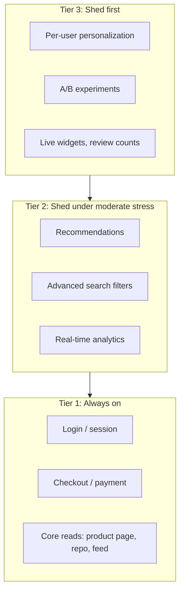
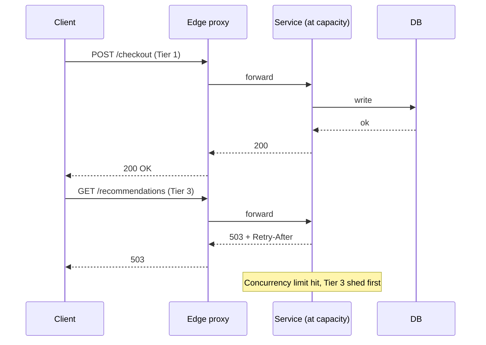
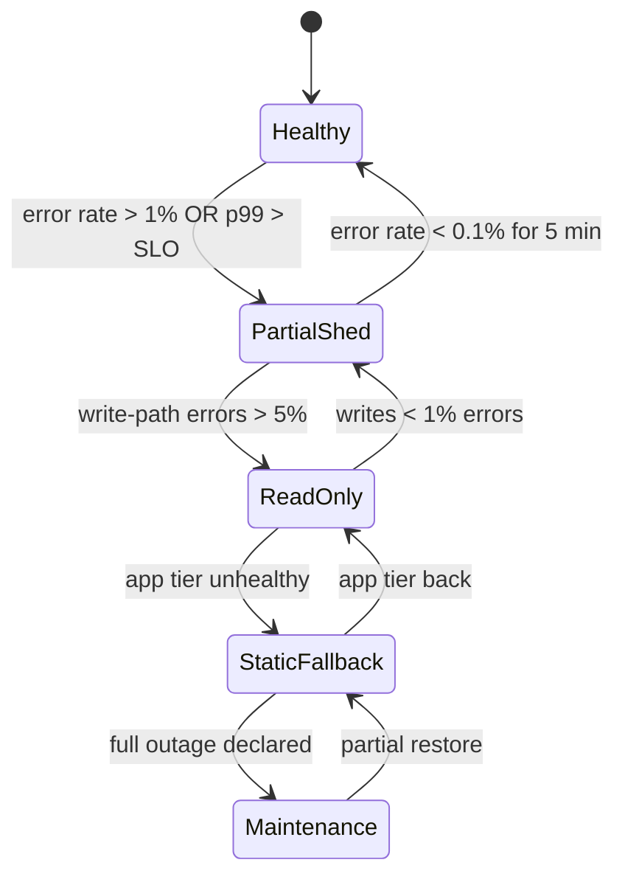
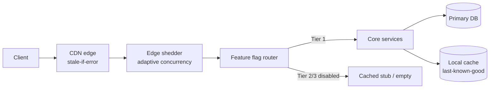

# Graceful Degradation: When Partial Service Beats No Service

> **TL;DR**: Production systems are never "fully up" or "fully down." The real question is which features you keep and which you shed. Graceful degradation is the discipline of deciding, before an incident, that checkout stays up while recommendations disappear. The toolkit is small: load shedding (reject early, reject cheap), feature flags (kill switches on non-essential paths), cached fallbacks (stale data beats no data), and static fallbacks (pre-rendered HTML when the app tier is gone). AWS distinguishes "throughput" from "goodput," where goodput is requests completed successfully and quickly enough to be useful[^1]. When a server passes its goodput knee, the engineering objective is to keep goodput high by rejecting or degrading the excess, not by accepting work you cannot finish.

## Learning Objectives

After this module, you will be able to:

- [ ] Design a priority tiering of features for load shedding
- [ ] Implement load shedding at the load balancer, gateway, or app layer
- [ ] Use feature flags to turn off expensive features under load
- [ ] Serve stale cached content as a fallback
- [ ] Communicate degradation to users without making things worse

## Intuition

You run a restaurant on a Friday night. The kitchen is at capacity. Orders are backing up. You have two choices: keep accepting every table's full order and watch every dish come out cold and late, or trim the menu. You tell the host: "No specials tonight. Appetizers are limited to three options. Desserts are off." The entrees, the thing people came for, still arrive hot and on time.

Nobody leaves a one-star review because the creme brulee was unavailable. They leave one-star reviews because their steak arrived 90 minutes late and cold. The restaurant that trims its menu under pressure delivers a better experience than the one that promises everything and delivers nothing well.

Software systems work the same way. When a dependency fails or traffic spikes beyond capacity, you can keep accepting every request and watch latency climb until clients time out, or you can shed the non-essential work and protect the critical path. Recommendations can disappear. Personalization can fall back to "popular items." Analytics can stop collecting. But login, checkout, and core reads must keep working.

[Resilience Patterns](./02-resilience-patterns.md) gave you the defensive mechanisms: timeouts, circuit breakers, bulkheads. This chapter teaches you what to do with those mechanisms. Which features get the circuit breaker's fallback? Which requests does the load shedder reject first? Who decides, and when?

## Theory

### Critical-path tiering

The first step in graceful degradation is not technical. It is a product conversation: which features matter most?

Google's internal RPC framework uses four fixed criticality levels: CRITICAL_PLUS, CRITICAL, SHEDDABLE_PLUS, and SHEDDABLE[^2]. A server rejects requests of lower criticalities first when overloaded. Criticality propagates across RPC hops so downstream services apply the same priority. AWS pushes tier decisions as close to the client edge as possible rather than making global prioritization decisions inside every service[^1].

A practical three-tier model for most systems:



*Features are grouped into tiers so operators know what to shed at 70% capacity, at 90%, and at a database-down event.*

The organizational challenge is tier inflation. If every team labels their feature CRITICAL_PLUS, the signal is destroyed[^2]. Tie tiers to SLOs: Tier 1 features get a three-nines target, Tier 2 gets two-nines, Tier 3 gets best-effort. [SLOs, SLIs, and Error Budgets](./01-sli-slo-sla-error-budgets.md) provides the framework for setting these targets.

### Load shedding

Load shedding is the act of rejecting requests at the earliest layer that has enough information, with a fast, cheap response, instead of accepting work the server cannot complete.

When a server passes its goodput knee, latency rises, clients time out, and retries amplify the load. The fix is to keep accepted work bounded and reject the rest with a cheap 503 + Retry-After. AWS recommends shedding at the earliest point where you have the information to decide: edge proxy, API gateway, or app middleware[^1].

**Where to shed:**

- **L4 load balancer**: connection limits, SYN flood protection. Blunt but fast.
- **API gateway**: per-client rate limits, per-endpoint quotas. Knows the route but not the request body.
- **App middleware**: priority-based shedding using request metadata (user tier, endpoint criticality). Most precise but most expensive to reject.

**Priority-based shedding** combines tiering with load shedding. Tag each request with its criticality. Under stress, reject Tier 3 first, then Tier 2. Tier 1 is the last to shed. Netflix's `concurrency-limits` library partitions capacity: 90% reserved for live traffic, 10% for batch. Under stress, batch traffic is shed while live traffic continues[^3].



*A server at capacity rejects low-priority requests cheaply with a 503 instead of accepting work it cannot finish.*

**Adaptive concurrency limits** solve the tuning problem. Netflix's library applies TCP congestion-control algorithms (Vegas, Gradient2) to HTTP/gRPC. It samples latencies, detects queueing via Little's Law (`Limit = Average RPS * Average Latency`), and shrinks the allowed in-flight count dynamically[^3]. No static RPS ceiling to go stale as services autoscale.

### Feature flags as kill switches

A feature flag used for degradation is an ops toggle: a manually-managed circuit breaker that turns off a specific feature without a redeploy[^4]. Pete Hodgson's taxonomy names four categories (Release, Experiment, Ops, Permissioning). Ops toggles are the kill-switch category.

The lifecycle is simple: on when healthy, flip off during incident, flip back after recovery. Platforms like LaunchDarkly, Unleash, and [OpenFeature](https://openfeature.dev/) provide the distributed config store, targeting rules, and audit log. Many can auto-flip a flag when an observability signal (error rate, latency) crosses a threshold, connecting directly to [Observability](./00-observability.md) pipelines.

**Tier-based auto-disable** extends this: when p99 latency exceeds the SLO, automatically disable Tier 3 features. If error rate exceeds 5%, disable Tier 2. Operators retain manual override for Tier 1.

> [!IMPORTANT]
> **A kill switch nobody tests does not exist.** Hodgson recommends testing the "all toggles flipped On" and "all Off" configurations, plus the production config[^4]. Schedule quarterly kill-switch exercises. Track "last flipped" timestamps for every ops toggle. Flags with no exercise in 90 days are suspect.

**Flag debt** is the carrying cost. Flags are cheap to add, expensive to remove. Every deployment has exponential toggle-state combinations to test. Hodgson: "Savvy teams view their Feature Toggles as inventory which comes with a carrying cost"[^4]. Add a removal task when the flag is created. Put expiration dates in the config. Knight Capital lost approximately 440 million USD in 45 minutes when a code deployment left deprecated logic active on one of eight servers, a cautionary tale about stale code paths that resembles the risks of unmanaged flag debt[^4].

### Cached and static fallbacks

When a dependency is unreachable, you have two options: error or stale data. For read-heavy paths, stale data almost always wins.

**RFC 5861** defines two HTTP directives for this[^5]:

- `stale-while-revalidate=N`: serve stale for N seconds while revalidating in the background.
- `stale-if-error=M`: serve stale for M seconds when the origin returns 500, 502, 503, or 504.

```http
Cache-Control: max-age=600, stale-if-error=1200
```

This tells CDNs: content is fresh for 10 minutes; if revalidation fails, keep serving the cached copy for up to 20 more minutes. Cloudflare's Always Online feature takes this further: when the origin is completely unreachable, Cloudflare serves static snapshots of popular pages from the Internet Archive. It cannot serve dynamic content, logins, or POST requests, but for marketing pages and documentation, it turns a full outage into a stale-but-available experience[^6].

**In-app last-known-good** is the application-level equivalent. When a recommendations service times out, return the last successful response from a local cache. The user sees slightly stale recommendations rather than an error or an empty widget.

**Static fallbacks** are the last resort before a maintenance page:

- Pre-rendered HTML for the homepage served from S3/CDN
- Skeleton UIs that show structure without data
- Read-only mode (writes disabled, reads served from replicas)

**The Amazon counter-argument.** AWS's explicit position is that fallback "almost never" helps in distributed systems because the fallback path is rarely exercised, hard to test, and shares fate with the primary in non-obvious ways[^7]. Their preferred alternative: make the primary path reliable, push data proactively (e.g., IAM credentials pushed hours in advance), or convert fallback into failover by exercising both paths continuously. This is not a contradiction. It is a distinction: a "degraded response" (intentional, tested, continuously exercised) is safe. A "fallback" (rarely-run code path full of latent bugs) is dangerous.

### Communicating degradation to users

Silent degradation is an anti-pattern. If a feature is off, tell the user.

**Status pages** (Statuspage, Instatus) communicate system-wide state. But the AWS S3 outage of February 2017 showed the failure mode: the status page itself depended on S3, so it could not report S3 being down[^8]. Host your status page on independent infrastructure.

**In-app banners** keyed to the same flag as the backend kill switch. When recommendations are disabled, show "Recommendations temporarily unavailable" in the widget space. Do not show an empty div that looks like a bug.

**Structured error responses** using [RFC 9457](https://www.rfc-editor.org/rfc/rfc9457) `application/problem+json` (which obsoletes RFC 7807) let clients and SDKs reason about the degradation mode programmatically:

```json
{
  "type": "https://example.com/probs/degraded",
  "title": "Recommendations temporarily unavailable",
  "detail": "Upstream recommender is disabled; showing popular items.",
  "instance": "/products/SKU-123"
}
```

The principle: be honest, not silent. Users tolerate "we are experiencing issues, some features are limited" far better than mysterious empty pages or unexplained slowness.

## Real-World Example

### GitHub's read-only mode (October 2018)

On October 21, 2018, a 43-second network connectivity loss between GitHub's US East Coast hub and its primary data center triggered a cascade. Orchestrator (GitHub's MySQL topology manager) promoted West Coast databases to primary. When the network healed, the application tier wrote to West Coast primaries across a cross-country link, introducing latency the app could not absorb. One busy cluster had 954 writes during the brief partition that were not replicated to the West Coast, while the West Coast ingested new writes from the application tier for nearly 40 minutes before engineers could intervene[^9].

GitHub's response was deliberate degradation: **read-only mode**. They paused webhook delivery and GitHub Pages builds rather than risk overwriting user data. For 24 hours and 11 minutes, users could browse repositories and issues but could not push, open pull requests, or receive webhooks[^9].

The numbers tell the story of the backlog: over 5 million webhook events queued, 80,000 Pages builds queued, and roughly 200,000 webhook payloads exceeded their internal TTL and were dropped[^9].



*The system transitions through explicit degradation states; each transition is triggered by a measurable signal and has a defined exit condition.*

The key engineering decision: **prioritize data integrity over site usability.** GitHub explicitly chose "frustrated but not defrauded" users. The majority of GitHub traffic is reads, so most users saw a slow but functional site. The post-incident actions included accelerating active/active multi-DC design and investing in chaos engineering to validate failure scenarios before they happen in production[^9].

This is the model for graceful degradation done right: a pre-planned operating mode, a clear trigger, a defined scope of impact, and a recovery path.

## Defense in depth

Graceful degradation is not a single technique you pick from a menu. Mature services stack these layers on top of one another so the failure of one does not bring the whole system down. The chapter's architecture diagram describes these as "three reinforcing layers"; the table below reflects that. Every row is additive, and the "Our Pick" column says *when* to add each layer, not which one to choose instead of the others.

| Layer | Pros | Cons | Best when | Add this layer when |
|----------|------|------|-----------|----------|
| Load shedding at ingress | Easy to implement at ingress; preserves goodput under overload | Blunt: treats all rejected traffic the same | Capacity-driven overloads | **Baseline for every service** |
| Feature-level degradation (ops flags) | Surgical, operator-driven, fast to flip | Flag debt; untested switches; requires observability | Systems with clear feature boundaries | **Add once you have 3+ feature tiers** |
| Cached fallbacks for reads | Invisible to users; edge-friendly; survives origin outages | Stale data risk; AWS warns fallbacks are hard to prove and test[^7] | Read-heavy paths with tolerable staleness | **Add for Tier 2/3 reads, with care** |
| Read-only mode | Preserves data integrity during storage incidents (GitHub Oct 2018[^9]) | Requires app-wide support; retrofit is expensive | CRUD systems with a safe read path | **Pre-build for any system where writes are < 30% of traffic** |

## Common Pitfalls

> [!WARNING]
> **Fallback that shares a dependency with primary.** In 2001, Amazon added a shipping-speed cache with a fallback to direct database queries. When all caches failed simultaneously, every web server hit the database directly, the database locked up, and the entire site plus all fulfillment centers went down[^7]. The fallback turned a partial outage into a full-site outage. Review every fallback path for shared fate with the primary.

> [!WARNING]
> **Silent degradation.** Ops flips a kill switch but does not update the UI or status page. Users see stale data, missing features, or subtle errors and do not know a feature is off. Key the in-app banner to the same flag as the backend switch. Use RFC 9457 structured errors so clients can reason about the degradation mode.

> [!WARNING]
> **False availability.** A server accepts a request, starts work, then fails halfway through. The client has already timed out and retried. The server's late reply is wasted work[^1]. Propagate per-request deadlines; dequeue stale requests from internal queues; prefer LIFO over FIFO in overload so the freshest requests get served first.

> [!WARNING]
> **Untested kill switch.** A kill switch nobody has flipped in production does not exist. Code drifts: the flag routes through a branch with a bug, or the config key was renamed. Schedule quarterly exercises. Track "last flipped" timestamps. Flags untested for 90+ days are suspect.

> [!WARNING]
> **Degradation as afterthought.** If you design degradation after the system is built, every write path must be retrofitted to handle read-only signals, every UI must learn to hide missing widgets, and every dependency must be classified. Design degradation tiers at the same time you design the feature. The cost is 10x lower.

## Exercise

Design the degradation plan for an e-commerce site: list features by priority, specify what gets shed at 70% capacity vs 90% vs database-down, and design the UX so customers understand what is happening without losing trust.

<details>
<summary>Hint</summary>

Start by listing every feature visible on the product page and checkout flow. Group them into three tiers. For each tier, decide: what is the trigger to disable it? What does the user see instead? What is the recovery condition? Think about the difference between shedding at the edge (reject requests) vs shedding at the feature level (serve the page without the widget).

</details>

<details>
<summary>Solution</summary>

**Tier classification:**

| Tier | Features | Shed trigger | User experience |
|------|----------|--------------|-----------------|
| 1 (always on) | Login, cart, checkout, payment, product page (price + availability) | Never shed; if these fail, declare full incident | Normal |
| 2 (shed at 90% capacity) | Recommendations, reviews, Q&A, shipping estimates, wishlists | p99 > 2x SLO OR dependency error rate > 5% | Banner: "Some features temporarily limited" + empty widget with explanation |
| 3 (shed at 70% capacity) | Personalization, A/B experiments, live chat, recently viewed, social proof counts | p99 > 1.5x SLO OR CPU > 70% | Features silently hidden (low user expectation) |

**At database-down:**

Switch to read-only mode. Product pages serve from cache (stale-if-error=3600). Cart and checkout return 503 with a banner: "Checkout temporarily unavailable. Your cart is saved." No writes accepted. Recovery condition: primary database healthy for 5 consecutive health checks.

**UX communication:**

- Tier 3 shed: no banner (users rarely notice these features missing)
- Tier 2 shed: yellow banner at top of page: "We are experiencing high demand. Some features are temporarily limited."
- Database-down: red banner: "Some services are temporarily unavailable. Your data is safe. We are working on it." Link to status page.
- Status page hosted on independent infrastructure (not the same CDN or cloud account as the main site).

**Architecture:**



*Three reinforcing layers: edge shedder rejects excess, flag service disables non-essential features, cache fallback returns stale data when the origin is unreachable.*

</details>

## Key Takeaways

- Degradation is a product decision dressed as a technical one. Classify features into tiers before the incident, not during.
- Shed early and cheaply. The worst case is accepting work you cannot complete, wasting resources, and still failing the client.
- Distinguish "degraded response" (intentional, tested, continuously exercised) from "fallback" (rarely-run code path full of latent bugs). AWS warns that fallback almost never helps[^7].
- Cached fallbacks buy time. Stale content is almost always better than errors for read-heavy paths.
- Read-only mode is underused. Most systems can degrade writes before reads, preserving data integrity while keeping the majority of users functional.
- A kill switch no one has flipped does not exist. Rehearse degradation quarterly. See [Chaos Engineering and Game Days](./06-chaos-engineering.md) for the methodology.
- Communicate honestly. Silent degradation erodes trust faster than a banner saying "some features are limited."

## Further Reading

- [Using load shedding to avoid overload](https://aws.amazon.com/builders-library/using-load-shedding-to-avoid-overload/) - David Yanacek's canonical primer on goodput, the knee, and rejecting early; the single best starting point for this topic.
- [Avoiding fallback in distributed systems](https://aws.amazon.com/builders-library/avoiding-fallback-in-distributed-systems/) - Jacob Gabrielson's counter-intuitive argument for why fallback usually makes outages worse, with the 2001 Amazon cache-to-DB disaster.
- [Handling Overload (Google SRE Book, Ch. 21)](https://sre.google/sre-book/handling-overload/) - Criticality tiers, client-side throttling, and retry budgets from Google's production experience.
- [Feature Toggles](https://martinfowler.com/articles/feature-toggles.html) - Pete Hodgson's taxonomy of flag types and the carrying-cost argument; essential reading before building a flag platform.
- [Netflix concurrency-limits](https://github.com/Netflix/concurrency-limits) - Adaptive shedding via TCP congestion-control algorithms; the modern replacement for static RPS ceilings.
- [RFC 5861: HTTP Cache-Control Extensions for Stale Content](https://www.rfc-editor.org/rfc/rfc5861) - The formal spec for `stale-while-revalidate` and `stale-if-error` directives.
- [GitHub October 21 post-incident analysis](https://github.blog/news-insights/company-news/oct21-post-incident-analysis/) - 24 hours of deliberate read-only degradation; the best public example of "partial service beats no service."
- [Performance Under Load](https://netflixtechblog.medium.com/performance-under-load-3e6fa9a60581) - Netflix on adaptive concurrency and the end of static timeouts; explains Vegas and Gradient2 algorithms.

## Flashcards

**Q:** What is the difference between "throughput" and "goodput"?
**A:** Throughput is total requests per second offered to a server. Goodput is requests per second that completed successfully and quickly enough to be useful to the client. When a server passes its knee, throughput keeps climbing but goodput collapses.

**Q:** What are Google's four RPC criticality levels?
**A:** CRITICAL_PLUS, CRITICAL, SHEDDABLE_PLUS, and SHEDDABLE. Servers reject lower-criticality requests first when overloaded, and criticality propagates across RPC hops.

**Q:** Why does AWS recommend shedding at the earliest possible layer?
**A:** Because rejecting a request at the edge (before spending compute, memory, or downstream calls) is orders of magnitude cheaper than accepting it, doing partial work, and failing halfway through. A late failure wastes resources and still disappoints the client.

**Q:** What is an ops toggle and how does it differ from a release toggle?
**A:** An ops toggle is a kill switch that turns off a feature at runtime without a redeploy, used during incidents. A release toggle gates incomplete code during development. Ops toggles are long-lived and must be tested regularly; release toggles are short-lived and removed after launch.

**Q:** Why did Amazon's 2001 shipping-speed fallback make the outage worse?
**A:** The fallback path queried the same supply-chain database the cache was protecting. When all caches failed, every server hit the database directly, overwhelming it and taking down the entire site plus all fulfillment centers. The fallback shared fate with the primary.

**Q:** What does `stale-if-error=1200` mean in a Cache-Control header?
**A:** If the origin returns a 500, 502, 503, or 504 during revalidation, the cache may continue serving the stale response for up to 1,200 additional seconds rather than forwarding the error to the client.

**Q:** What is "false availability" and why is it harmful?
**A:** False availability is when a server accepts requests it cannot complete. The client times out and retries, but the server's late reply is wasted work. It consumes resources without delivering value and amplifies load through retries.

**Q:** How do adaptive concurrency limits work?
**A:** They apply TCP congestion-control algorithms (Vegas, Gradient2) to HTTP/gRPC. The system samples latencies, detects queueing via Little's Law, and dynamically shrinks or grows the allowed in-flight request count. No static RPS ceiling to configure or go stale.

**Q:** Why is "a kill switch nobody tests does not exist" a core principle?
**A:** Code drifts over time. The flag may route through a branch with a new bug, or the config key may have been renamed. Without regular exercise (quarterly at minimum), you discover the switch is broken during the incident when you need it most.

**Q:** What did GitHub prioritize during their October 2018 read-only incident?
**A:** Data integrity over site usability. They paused webhook delivery and Pages builds for 24 hours rather than risk overwriting user data from divergent database replicas. Most users saw a functional (read-only) site because the majority of GitHub traffic is reads.

**Q:** When should you use read-only mode vs full maintenance mode?
**A:** Use read-only mode when the write path is compromised but reads are safe (database failover, replication lag). Use full maintenance mode only when even reads are unsafe or the app tier itself is down. Read-only preserves the majority of user value in read-heavy systems.

**Q:** What is the risk of flag debt?
**A:** Unused flags accumulate, creating exponential toggle-state combinations that are impossible to test. Stale flags become latent bugs. Knight Capital lost approximately 440 million USD in 45 minutes when a deployment left deprecated code active on one server. Treat flags as inventory with a carrying cost and set expiration dates.

## References

[^1]: David Yanacek, "Using load shedding to avoid overload," Amazon Builders' Library. https://aws.amazon.com/builders-library/using-load-shedding-to-avoid-overload/
[^2]: Alejandro Forero Cuervo, "Handling Overload," Google SRE Book, Chapter 21. https://sre.google/sre-book/handling-overload/
[^3]: Netflix, "concurrency-limits: Java Library that implements and integrates concepts from TCP congestion control to auto-detect concurrency limits for services." https://github.com/Netflix/concurrency-limits
[^4]: Pete Hodgson, "Feature Toggles (aka Feature Flags)," martinfowler.com, 9 October 2017. https://martinfowler.com/articles/feature-toggles.html
[^5]: Mark Nottingham, "HTTP Cache-Control Extensions for Stale Content," RFC 5861, May 2010. https://www.rfc-editor.org/rfc/rfc5861
[^6]: Cloudflare, "Always Online," Cloudflare Cache (CDN) docs. https://developers.cloudflare.com/cache/troubleshooting/always-online/
[^7]: Jacob Gabrielson, "Avoiding fallback in distributed systems," Amazon Builders' Library. https://aws.amazon.com/builders-library/avoiding-fallback-in-distributed-systems/
[^8]: AWS, "Summary of the Amazon S3 Service Disruption in the Northern Virginia (US-EAST-1) Region," 28 February 2017. https://aws.amazon.com/message/41926/
[^9]: Jason Warner, "October 21 post-incident analysis," GitHub Blog, 30 October 2018. https://github.blog/news-insights/company-news/oct21-post-incident-analysis/
