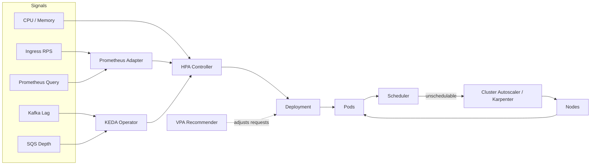
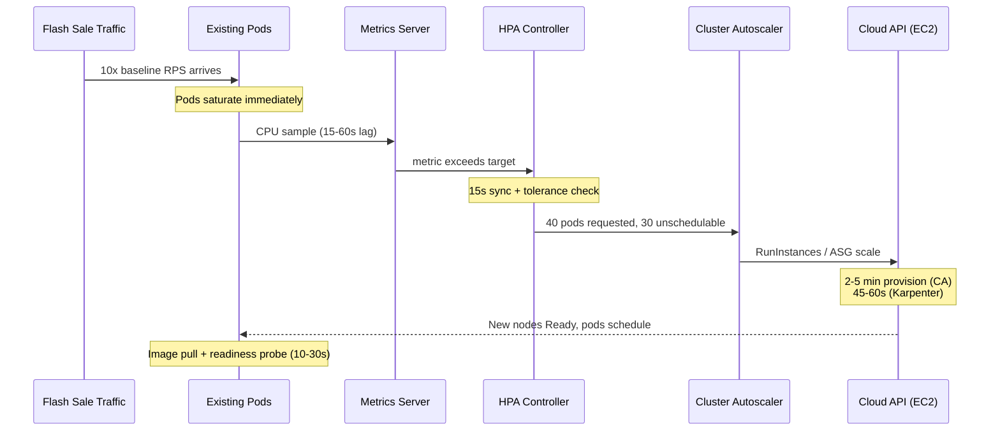
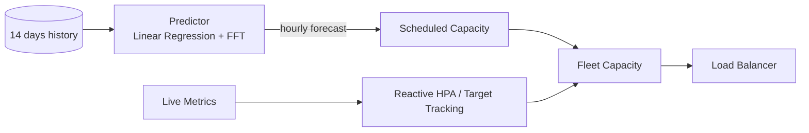
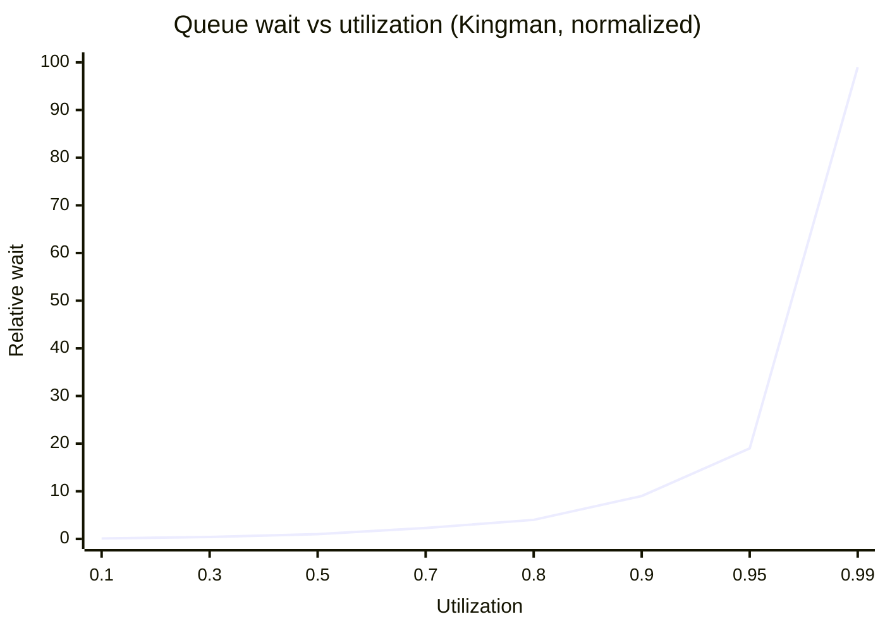

# Auto-Scaling and Capacity Planning: From HPA to Predictive Scaling

> **TL;DR**: Auto-scaling is a closed-loop control system with a dirty secret: it is slower than the traffic spikes it tries to chase. The reactive pipeline (metric sampling, controller decision, node provisioning, pod readiness) takes 1 to 5 minutes end-to-end[^1][^2], while a flash sale peaks in seconds. You need three layers: reactive scaling for the daily curve, scheduled or predictive scaling for known peaks, and capacity math (Little's Law, Kingman's formula) to set the headroom that absorbs what neither layer catches in time.

## Learning Objectives

After this module, you will be able to:

- [ ] Explain Kubernetes HPA, VPA, and Cluster Autoscaler, and when each applies
- [ ] Pick scaling signals (CPU, RPS, queue depth, custom) per workload type
- [ ] Use Little's Law and queuing theory for capacity planning
- [ ] Design for scaling lag and the dependencies that will not scale with you
- [ ] Decide between reactive, scheduled, and predictive scaling

## Intuition

You manage a taxi fleet. At 2 AM you have 10 cabs on the road. At 7 AM, commuters flood the app. You could watch the queue of waiting riders and dispatch more cabs as it grows (reactive scaling). But cabs take 20 minutes to reach the busy district from the depot. By the time they arrive, the morning rush is half over and riders have already churned.

A smarter dispatcher checks last Tuesday's data: "7 AM always needs 80 cabs downtown." She pre-positions them at 6:40 AM (scheduled scaling). An even smarter one feeds a year of ride data into a model that predicts tomorrow's demand by neighborhood and hour (predictive scaling). The reactive system still runs as a safety net for the unexpected concert or stadium event, but it no longer carries the daily load alone.

Now replace "cabs" with "pods" and "20 minutes" with "3 to 5 minutes for a new node." The math is the same. The discipline is knowing which layer handles which traffic shape, and knowing that your database, your payment provider, and your observability backend do not have a "dispatch more cabs" button at all.

## Theory

### Scaling dimensions

[Scalability](../part-1-core-fundamentals/00-scalability.md) introduced horizontal vs vertical scaling. Auto-scaling adds two more axes:

- **Application-level scaling** adjusts replica count (pods, tasks, Lambda concurrency) within existing infrastructure.
- **Cluster-level scaling** adjusts the infrastructure itself (nodes, VMs, instance groups).

Stateless services scale horizontally behind a [Load Balancer](../part-2-building-blocks/00-load-balancers.md). Stateful services (databases, brokers, coordination services) resist horizontal scaling because they own partitions of data. This asymmetry is the root of most autoscaling failures: the app tier triples in minutes, the database does not.

### The Kubernetes autoscaling family

Kubernetes splits autoscaling into three controllers, each operating at a different level:

**HPA (Horizontal Pod Autoscaler)** runs every 15 seconds and computes[^1]:

```text
desiredReplicas = ceil(currentReplicas * (currentMetricValue / desiredMetricValue))
```

If current CPU is 140% of target and you have 2 replicas, HPA requests `ceil(2 * 140/70) = 4`. A tolerance band (default 10%) prevents flapping. Scale-down uses a 5-minute stabilization window that picks the highest recommendation seen, avoiding premature shrinkage[^1].

**VPA (Vertical Pod Autoscaler)** recommends or applies per-pod CPU and memory requests. Google's Autopilot runs both horizontal and vertical tuning in production, reducing resource slack from 46% to 23% and cutting severe OOMs by 10x[^3].

**Cluster Autoscaler** watches for unschedulable pods and adds nodes via the cloud provider's API. This path (ASG launch, VM boot, kubelet bootstrap, CNI init, image pull) takes 2 to 5 minutes[^2].

**Karpenter** (AWS, open-sourced 2021) bypasses the ASG abstraction entirely. It calls `RunInstances` directly, picking the cheapest instance type that fits pending pods. Result: approximately 45 to 60 seconds from pod-pending to node-ready[^2].

**KEDA (Kubernetes Event-Driven Autoscaler)** extends HPA with external triggers: Kafka consumer lag, SQS queue depth, Prometheus queries, and cron schedules. It enables scale-to-zero for async workers, something default HPA cannot do[^4].



*The Kubernetes autoscaling stack: HPA scales replicas on metrics; KEDA feeds external signals; Cluster Autoscaler or Karpenter adds nodes when pods cannot schedule.*

### Picking the right signal

CPU is the default HPA metric and it is often wrong. A Node.js service with a blocked event loop stalls requests without burning CPU. A database-bound service blocks on I/O while the process shows idle. HPA on CPU misses both[^5].

Better signals, ranked by workload type:

| Workload | Best signal | Why |
|---|---|---|
| Web API (stateless) | Requests per second | Leads CPU by seconds; available from the load balancer |
| Async consumer (Kafka, SQS) | Queue depth / consumer lag | CPU is meaningless when the consumer idles with a backlog |
| Latency-sensitive service | p99 latency trending toward SLO | Scale before the SLO breaches, not after |
| General concurrency | In-flight requests (Little's Law) | Predicts thread-pool exhaustion directly |
| ML inference | GPU utilization / KV-cache occupancy | CPU is irrelevant for GPU workloads |

Cloudflare's Traffic Manager uses CPU time in milliseconds per second rather than raw RPS, because per-request CPU cost varies wildly between customers. An ML model dynamically adjusts the per-data-center CPU threshold to keep the 95th percentile `cfcheck` latency (time for a request to pass through Cloudflare's front-line servers) under its 20 ms SLO[^6].

### Scaling lag: the hidden enemy

The reactive autoscaling pipeline is a chain of sequential delays:



*The reactive pipeline totals 1 to 5+ minutes. A flash sale peaks in seconds. This gap is why reactive scaling alone is insufficient.*

Total lag breakdown:

- Metric sampling: 15 to 60 seconds
- HPA decision cycle: 15 seconds
- Node provisioning (Cluster Autoscaler): 2 to 5 minutes[^2]
- Node provisioning (Karpenter): 45 to 60 seconds[^2]
- Pod startup + readiness: 10 seconds to 2 minutes

Mitigations: pre-warm with scheduled scaling, set a sensible `minReplicas` floor, use predictive scaling for cyclical patterns, and keep "overhead pods" (pause-image with low priority) that reserve node space so real pods schedule instantly.

### Scheduled and predictive scaling

**Scheduled scaling** is cron for replica counts: `min=20 from 8am to 10pm, min=4 overnight`. It handles known daily and weekly cycles with zero ML complexity.

**Predictive scaling** trains a forecaster on historical load. AWS EC2 Predictive Scaling requires at least 24 hours of data, works best with 14 days, and produces a 48-hour forecast refreshed every 6 hours[^7]. It only scales out; reactive scaling handles scale-in.

**Netflix Scryer** (2013) predated AWS Predictive Scaling (2018) by five years. Netflix needed prediction because EC2 instance startup took 10 to 45 minutes at the time[^8]. Scryer used prediction algorithms (widely reported to include linear regression and FFT) to forecast capacity ahead of demand. The predicted baseline fed scheduled scaling actions; AWS Auto Scaling remained as the reactive safety net for unpredicted spikes[^8].



*Predictive scaling sets the baseline from historical patterns; reactive scaling catches what the predictor missed. Together they cover both the daily curve and the unexpected spike.*

### Capacity planning math

Three formulas anchor capacity planning:

**Little's Law**: `L = lambda * W`. The average number of in-flight requests (L) equals the arrival rate (lambda) times the average service time (W). A service handling 1,000 req/s with 340 ms average latency has 340 requests in flight. If each server has 6 worker threads, you need at least `ceil(340 / 6) = 57` servers[^9].

**Kingman's formula** (the VUT approximation) for the G/G/1 queue: expected wait is `E(Wq) ~ (rho / (1 - rho)) * ((ca^2 + cs^2) / 2) * tau`, where `rho` is utilization, `ca` and `cs` are the coefficients of variation for arrivals and service times, and `tau` is mean service time. The `rho / (1 - rho)` term is the utilization factor; variability scales it further. For the M/M/1 special case (`ca = cs = 1`), wait equals `rho / (1 - rho)` times service time: at 50% utilization, wait equals service time; at 80%, wait is 4x; at 95%, wait is 19x. Real systems with bursty arrivals (`ca > 1`) hit the cliff even harder. This is why many teams target 50 to 60% steady-state utilization, not 80%[^10].



*Past 80% utilization, each additional percentage point adds disproportionate queue time. This curve is why "target 60% CPU" is not waste but survival margin.*

**Correlated-failure buffer**: with 3 availability zones, losing one means the remaining two absorb 50% more load each. If you run at 66% utilization normally, losing a zone pushes survivors to 100%. Target 50% steady-state so that losing one AZ pushes the remaining two to 75%, still below the Kingman cliff.

### The dependencies that do not scale

You can add pods in seconds. These things do not follow:

- **Database connections**: RDS `max_connections` defaults scale with instance size but have a hard ceiling. Aurora Serverless v2 has an ACU cap. Triple your app tier and you hit `FATAL: sorry, too many clients already`. Fix: PgBouncer or RDS Proxy for connection multiplexing.
- **Third-party rate limits**: Stripe, Twilio, and payment processors have per-account ceilings that do not care how many pods you run. Pre-negotiate bumps before known peaks.
- **Kafka partition count**: Consumer parallelism is bounded by partition count. If you have 12 partitions, scaling to 50 consumers wastes 38 of them.
- **Observability cost**: Tripling the fleet triples metric cardinality, log volume, and trace count. Your Datadog bill scales with your fleet, not your revenue.

## Real-World Example

### Netflix: Scryer, Titus, and the predictive-reactive hybrid

Netflix is consistently one of the largest single sources of global internet traffic (Sandvine's Global Internet Phenomena reports placed it at roughly a third of North American downstream video at peak in the late 2010s, and still in the top three globally in 2024 as YouTube and social-video platforms have grown). Their container platform Titus schedules workloads across thousands of EC2 instances[^11].

**The problem**: In 2013, Netflix EC2 instances took 10 to 45 minutes to start. Reactive autoscaling could not keep up with evening traffic ramps that swung fleet size from 20% to 80% of daily peak within hours[^8].

**The solution**: Scryer, a predictive engine that forecasts capacity ahead of demand using prediction algorithms (widely reported to include linear regression for trend and FFT for periodicity). Predictions drive scheduled scaling actions. AWS Auto Scaling remains as the reactive layer for unpredicted spikes[^8].

**Evolution to Titus (2018)**: When Netflix moved to containers, they collaborated with AWS to integrate Titus with AWS Application Auto Scaling. Titus jobs register as scalable resources via API Gateway. Container metrics flow from Atlas (Netflix's telemetry) to CloudWatch. AWS Auto Scaling triggers decisions that Titus executes by launching or terminating containers[^11]. This gave Netflix engineers the same target-tracking and step-scaling semantics they already knew from EC2, without reinventing the control loop.

**Key decisions**:

- Scale on custom metrics (RPS from Atlas, container CPU), not CPU alone[^11]
- Predictive sets the floor; reactive handles the ceiling
- Build on AWS's managed autoscaler rather than maintaining a custom control loop

The lesson: no single scaling strategy is sufficient. Predictive handles the known curve. Reactive handles the unknown spike. Together they cover the full traffic shape.

## Trade-offs

| Strategy | Pros | Cons | Best when | Our Pick |
|---|---|---|---|---|
| Reactive (HPA, target tracking) | Follows traffic, no forecast needed | 1-5 min lag; CPU often the wrong signal | Smooth daily curves without sharp spikes | **Default for all synchronous services** |
| Scheduled (cron) | Handles known peaks; zero ML complexity | Misses surprises; wasted capacity if schedule wrong | Predictable daily/weekly patterns | **Layer on top of reactive** when peaks are known in advance |
| Predictive (Scryer, AWS Predictive Scaling) | Pre-warms before cyclical spikes | Needs 14+ days of history[^7]; misses unprecedented events | Large systems with cyclical traffic and > 14 days of data | **Layer on top of reactive** once the data supports it |
| Event-driven (KEDA) | Correct for async; scales to zero | Cold start on first event | Queue workers, batch jobs, consumers | **Default for all async consumers**[^4] |

> [!NOTE]
> Node provisioning sits underneath every strategy above. Karpenter provisions nodes in 45-60s; Cluster Autoscaler takes 2-5 min[^2]. Use Karpenter on AWS where it is production-GA. Its provider abstraction remained in beta for GCP, Azure, and generic on-prem via CAPI as of July 2025[^2], so that landscape will keep shifting.

## Common Pitfalls

> [!WARNING]
> **CPU-only scaling for event-loop or I/O-bound services.** A Node.js service with a blocked event loop stalls requests without CPU ever crossing the HPA threshold. Scale on RPS, concurrency, or SLO-based latency instead. If your p99 is climbing but CPU is flat, you are scaling on the wrong signal.

> [!WARNING]
> **Cluster Autoscaler too slow for flash sales.** HPA wants 500 pods, the cluster fits 100, and CA takes 3 to 5 minutes to add nodes. By the time capacity arrives, the spike is over or existing pods have crashed. Migrate to Karpenter (45-60s) or pre-provision overhead pods that reserve node space.

> [!WARNING]
> **Autoscaling the app but not the database.** App replicas multiply, each opens connections to Postgres, `max_connections` is hit, the app tier melts. Use PgBouncer or RDS Proxy, cap `maxReplicas` to stay under the connection ceiling, and pre-negotiate rate-limit bumps with third-party APIs before known peaks.

> [!WARNING]
> **Aggressive scale-down before the next peak.** Traffic dips between peaks, the autoscaler removes nodes, the next peak hits a cold fleet. Set HPA downscale stabilization to 15 to 30 minutes (not the default 5), maintain a sensible `minReplicas` floor, and use scheduled scaling to hold capacity through known peak windows.

> [!WARNING]
> **No minimum replica floor, no load test from cold.** A service that scales to 1 pod overnight gets hit by a morning spike with no headroom. Set `minReplicas` to the smallest size that can absorb a typical spike while the autoscaler warms up. Run quarterly load tests from minimum state to peak, not from peak to peak. Shopify runs five full-traffic load tests per year from steady state to projected peak[^12].

## Exercise

Design autoscaling for a service that handles 5k RPS baseline, 30k RPS during flash sales announced 10 minutes in advance, with 200 ms p99 latency budget and a Postgres backend that caps at 10k RPS. Specify scaling signals, thresholds, and how you protect the database.

<details>
<summary>Hint</summary>

Use Little's Law to calculate the minimum replica count at 30k RPS. Then ask: what happens to the database when the app tier scales 6x? The database does not have an HPA.

</details>

<details>
<summary>Solution</summary>

**Step 1: Capacity math with Little's Law.**

At 30k RPS with 200 ms target latency: `L = 30,000 * 0.2 = 6,000` concurrent requests. If each pod handles 50 concurrent requests (6 threads, some queueing headroom), you need `ceil(6000 / 50) = 120` pods at peak.

**Step 2: Scaling signal selection.**

Scale on RPS per pod (not CPU). Set target: 250 RPS per pod (50% of measured capacity at p99 < 200 ms). At 5k RPS baseline: `5000 / 250 = 20` pods. At 30k: `30000 / 250 = 120` pods. HPA will compute `ceil(20 * (30000/5000)) = 120`.

**Step 3: Handle the 10-minute advance notice.**

Use scheduled scaling: when the flash-sale event fires (10 min before), set `minReplicas = 120`. This pre-warms the fleet before traffic arrives. Reactive HPA remains as the safety net for overshoot.

**Step 4: Protect the database.**

The Postgres backend caps at 10k RPS. Your app at 30k RPS would overwhelm it. Mitigations:

- Add a read-through cache (Redis) for the product catalog queries that dominate flash-sale reads. Target 70%+ cache hit rate to keep DB load under 10k.
- Deploy PgBouncer with `max_client_conn = 2000` and `default_pool_size = 100` to multiplex connections.
- Set app-level circuit breaker: if DB latency exceeds 500 ms, serve degraded responses from cache rather than queueing.
- Cap `maxReplicas` at 150 (not unlimited) so the app tier cannot open more connections than PgBouncer can handle.

**Step 5: Node provisioning.**

Use Karpenter (45-60s provisioning) rather than Cluster Autoscaler. The 10-minute advance notice gives enough time for Karpenter to add nodes, but not enough for CA's 3-5 minute path if you need multiple scale-out rounds.

**Trade-offs accepted:** You over-provision for 10 minutes before the sale (cost of pre-warming). You accept cache staleness during the flash sale (eventual consistency on product data). You cap throughput at what the database can handle rather than letting the app tier grow unbounded.

</details>

## Key Takeaways

- Reactive autoscaling has a 1 to 5 minute lag. For spikes that peak in seconds, you need scheduled or predictive scaling on top.
- CPU is rarely the right scaling signal for web workloads. Use RPS, queue depth, or SLO-based latency.
- Little's Law (`L = lambda * W`) predicts the minimum replica count, thread-pool size, and connection-pool size. Memorize it.
- Kingman's formula explains why 80% utilization is a cliff, not a target. Aim for 50 to 60% steady state.
- Dependencies (databases, rate-limited APIs, Kafka partitions) do not scale with your app tier. Plan around their ceilings.
- Karpenter provisions nodes in 45 to 60 seconds vs 3 to 5 minutes for Cluster Autoscaler. The difference matters for bursty workloads.
- The gold standard is a predictive-reactive hybrid: predicted capacity sets the floor, reactive scaling catches the rest.

## Further Reading

- [Scryer: Netflix's Predictive Auto Scaling Engine](https://netflixtechblog.com/scryer-netflixs-predictive-auto-scaling-engine-a3f8fc922270) - The canonical predictive-scaling blog; the clearest explanation of why reactive alone fails at Netflix's scale.
- [Auto Scaling Production Services on Titus](https://netflixtechblog.com/auto-scaling-production-services-on-titus-1f3cd49f5cd7) - How Netflix and AWS built Application Auto Scaling together; the architecture of metrics-to-CloudWatch-to-Titus.
- [Kubernetes HPA documentation](https://kubernetes.io/docs/tasks/run-application/horizontal-pod-autoscale/) - The canonical spec; read for the algorithm, tolerance band, and stabilization-window math.
- [How predictive scaling works (AWS)](https://docs.aws.amazon.com/autoscaling/ec2/userguide/predictive-scaling-policy-overview.html) - The exact 14-day history, 48-hour forecast, 6-hour refresh cadence with operator-facing modes.
- [Meet Traffic Manager: how Cloudflare routes traffic](https://blog.cloudflare.com/meet-traffic-manager/) - Plurimog, Duomog, ML-tuned CPU thresholds, and anycast-based load distribution at 300+ cities.
- [Using Little's Law to scale applications](https://blog.danslimmon.com/2022/06/07/using-littles-law-to-scale-applications/) - The clearest production walkthrough of `L = lambda * W` applied to thread pools and replica counts.
- [How we prepare Shopify for BFCM (2025)](https://www.shopify.engineering/bfcm-readiness-2025) - Five scale tests per year, 200M RPM target, and the operational playbook behind 284M req/min on Black Friday.
- [KEDA documentation](https://keda.sh/docs/) - The API surface for event-driven scaling, scale-to-zero, and multi-trigger composition.

## Flashcards

**Q:** What is the HPA scaling formula?
**A:** `desiredReplicas = ceil(currentReplicas * (currentMetricValue / desiredMetricValue))`. It runs every 15 seconds with a 10% tolerance band to prevent flapping.

**Q:** How fast does Karpenter provision a node vs Cluster Autoscaler?
**A:** Karpenter: 45 to 60 seconds. Cluster Autoscaler: 2 to 5 minutes. Karpenter bypasses the ASG path and calls RunInstances directly.

**Q:** State Little's Law and give a capacity-planning example.
**A:** `L = lambda * W`. At 1,000 req/s with 340 ms average latency, 340 requests are in flight. With 6 threads per server, you need at least 57 servers (`ceil(340/6)`).

**Q:** Why does Kingman's formula say "target 50-60% utilization, not 80%"?
**A:** Kingman's G/G/1 approximation is `E(Wq) ~ (rho / (1 - rho)) * ((ca^2 + cs^2) / 2) * tau`. The utilization factor `rho / (1 - rho)` alone gives 4x service time at 80% and 9x at 90% (M/M/1 case); bursty arrivals (`ca > 1`) make it worse. Headroom below 80% is survival margin, not waste.

**Q:** Why is CPU often the wrong scaling signal for web services?
**A:** CPU is a lagging indicator. Node.js event-loop blocking and I/O-bound services stall requests without raising CPU. RPS, queue depth, or SLO-based latency lead CPU and trigger scaling sooner.

**Q:** What is the correlated-failure buffer rule for 3 AZs?
**A:** If one AZ dies, the remaining two absorb 50% more load each. Target 50% steady-state utilization so losing one AZ pushes survivors to 75%, still below the Kingman cliff.

**Q:** How does KEDA differ from standard HPA?
**A:** KEDA extends HPA with external event-source triggers (Kafka lag, SQS depth, Prometheus queries, cron) and enables scale-to-zero, which default HPA cannot do.

**Q:** What three layers make up a production autoscaling strategy?
**A:** (1) Reactive scaling (HPA/target tracking) for the daily curve, (2) scheduled or predictive scaling for known peaks, (3) capacity math (Little's Law, Kingman) to set the headroom that absorbs what neither layer catches in time.

**Q:** Name three dependencies that do not autoscale with your app tier.
**A:** Database connections (max_connections ceiling), third-party API rate limits (Stripe, Twilio), and Kafka partition count (consumer parallelism bounded by partitions).

**Q:** What did Netflix Scryer use to predict capacity?
**A:** Prediction algorithms (widely reported to include linear regression for trend and FFT for periodicity), forecasting capacity ahead of demand. Predictions drove scheduled scaling; AWS Auto Scaling remained as the reactive safety net.

## References

[^1]: Kubernetes Authors, "Horizontal Pod Autoscaling", Kubernetes documentation (v1.36). https://kubernetes.io/docs/tasks/run-application/horizontal-pod-autoscale/
[^2]: Chkk Engineering, "Karpenter vs. Cluster Autoscaler". https://www.chkk.io/blog/karpenter-vs-cluster-autoscaler
[^3]: Krzysztof Rzadca, Pawel Findeisen, John Wilkes, et al., "Autopilot: workload autoscaling at Google", EuroSys 2020. https://dl.acm.org/doi/10.1145/3342195.3387524
[^4]: KEDA Project (CNCF), "KEDA: Kubernetes Event Driven Autoscaling" README and docs. https://keda.sh/docs/
[^5]: Codelit, "Kubernetes HPA Deep Dive: CPU, Custom Metrics, Scaling Policies, and KEDA", 2025. https://codelit.io/blog/kubernetes-horizontal-pod-autoscaler
[^6]: David Tuber, Luke Orden, Goncalo Grilo, "How Cloudflare's systems dynamically route traffic across the globe", Cloudflare Blog, Sep 25 2023. https://blog.cloudflare.com/meet-traffic-manager/
[^7]: AWS, "How predictive scaling works - Amazon EC2 Auto Scaling". https://docs.aws.amazon.com/autoscaling/ec2/userguide/predictive-scaling-policy-overview.html
[^8]: Daniel Jacobson, Danny Yuan, Neeraj Joshi, "Scryer: Netflix's Predictive Auto Scaling Engine", Netflix TechBlog, Nov 5 2013. https://netflixtechblog.com/scryer-netflixs-predictive-auto-scaling-engine-a3f8fc922270
[^9]: Dan Slimmon, "Using Little's Law to scale applications", danslimmon.com, Jun 7 2022. https://blog.danslimmon.com/2022/06/07/using-littles-law-to-scale-applications/
[^10]: Alejandro Forero Cuervo, "Handling Overload", Site Reliability Engineering book (Google, O'Reilly). https://sre.google/sre-book/handling-overload/
[^11]: Andrew Leung, Amit Joshi et al., "Auto Scaling Production Services on Titus", Netflix TechBlog, Jul 9 2018. https://netflixtechblog.com/auto-scaling-production-services-on-titus-1f3cd49f5cd7
[^12]: Kyle Petroski, Matthew Frail, "How we prepare Shopify for BFCM", Shopify Engineering, Nov 20 2025. https://www.shopify.engineering/bfcm-readiness-2025
