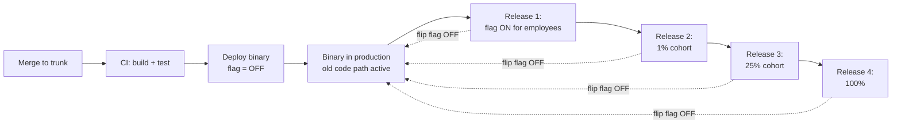
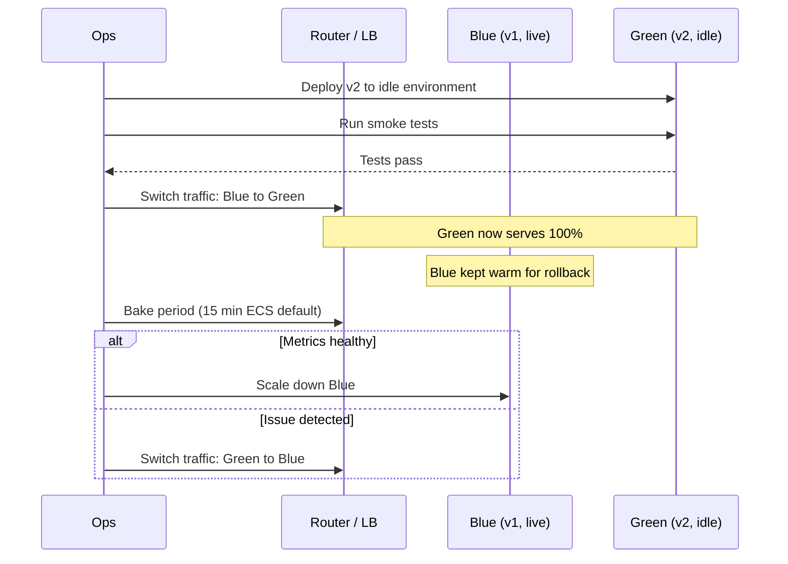
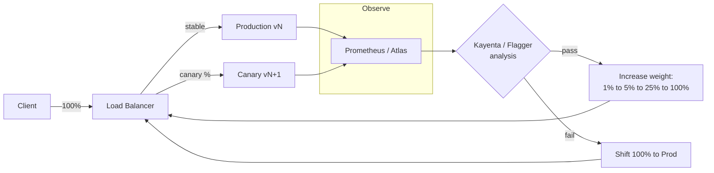
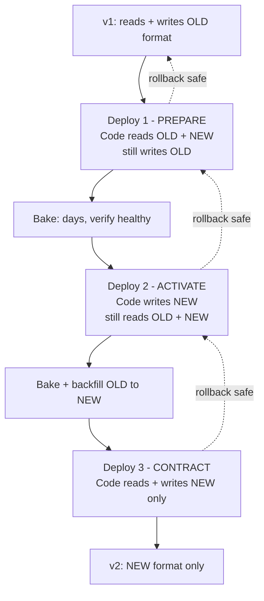

# Deployment Strategies: Blue-Green, Canary, Rolling, and Feature Flags

> **TL;DR**: Most production outages are caused by changes, not by organic load. Deployment strategies control the blast radius of each change so you can roll back before customers notice. Rolling deploys are the Kubernetes default (simple, zero extra cost). Blue-green gives instant rollback at 2x infrastructure cost. Canary validates with real traffic at bounded risk. Feature flags decouple deploy from release, making rollback a flag flip measured in seconds rather than a redeploy measured in minutes. Amazon ships at a pace measured in multiple deploys per second across its services[^1] not because they skip safety, but because safety is automated and in code.

## Learning Objectives

After this module, you will be able to:

- [ ] Compare rolling, blue-green, canary, and shadow deployment strategies
- [ ] Design an automated rollback trigger based on SLIs
- [ ] Use feature flags to decouple deploy from release
- [ ] Handle database migrations alongside application deploys using expand-contract
- [ ] Pick a strategy based on risk, traffic shape, and infrastructure cost

## Intuition

You run a restaurant. Tonight you are changing the menu. You have four options.

**Option A (big-bang):** Close for the night, reprint every menu, retrain every server, reopen tomorrow. If the new dishes are bad, you lost a full night of revenue and your regulars are annoyed.

**Option B (rolling):** Replace one table's menu at a time. Some diners see the old menu, some see the new. If a dish is terrible, you pull it from the next table's menu, but the tables already served cannot un-eat it.

**Option C (blue-green):** Print two complete sets of menus. Tonight everyone gets the old menu (blue). Tomorrow you swap every table to the new menu (green) at once. If complaints spike, you swap back in seconds because the old menus are still in the drawer.

**Option D (canary):** Give the new menu to one table only. Watch their faces. If they love it, give it to two more tables, then five, then the whole restaurant. If they grimace, pull it back before anyone else notices.

**The secret ingredient (feature flags):** The new dish is already printed on every menu, but it is listed as "coming soon." You flip a switch in the kitchen and it becomes orderable. If it fails, you flip the switch off. No reprinting required.

The restaurant is your production fleet. The menu is your binary. The diners are your users. The rest of this chapter is about making Option D the default, with Option C as your safety net and feature flags as the control plane for everything.

## Theory

### Deploy vs release

Jez Humble and Dave Farley drew the critical distinction in Continuous Delivery (2010): deploying code to production is the act of putting bits on servers. Releasing a feature is the act of making that feature visible to users. These are separate, independently triggered events[^2].

Why does this matter? Because it changes what "rollback" means. Rolling back a deploy means reverting the binary, which takes minutes to hours depending on fleet size. Rolling back a release means flipping a feature flag, which takes seconds and requires no redeploy.

Facebook's Gatekeeper system makes this concrete: every engineering change is wrapped with a feature flag and pushed live to production in a dark state. The flag is then exposed to employees, to 1% canaries, and eventually to all users. By 2016 Facebook was ingesting more than 1,000 diffs per day to the master branch, and in April 2017 the web front-end moved to a quasi-continuous "push from master" system that deploys "tens to hundreds of diffs every few hours" to 100% of production servers, tiered across employees then 2% then 100%[^3]. That velocity is only possible because deploy and release are decoupled.



*Deploying a binary and releasing a feature are separate events. The binary ships dark (flag OFF), then the flag is flipped progressively for employees, cohorts, and finally all users. Rollback at any stage is a flag flip back to OFF, not a redeploy.*

The DORA research quantifies what "good" looks like: elite performers deploy on demand (multiple times per day), maintain a change failure rate of 5%, and recover from failed deploys in under one hour[^4]. Low performers deploy between once a week and once a month with a 64% change failure rate and recovery times of one to six months. The difference is not risk tolerance. It is automation. [Availability and Reliability](../part-1-core-fundamentals/02-availability-and-reliability.md) introduced error budgets as the mechanism that makes "deploy faster" a disciplined claim rather than a vibe; the strategies in this chapter are how you spend that budget safely.

### Rolling deploys

A rolling deploy replaces instances in batches while the load balancer removes old instances and adds new ones. Aggregate capacity stays above a threshold throughout.

Kubernetes Deployments use `strategy: RollingUpdate` with two knobs: `maxSurge` (extra pods allowed above desired count) and `maxUnavailable` (pods allowed to be missing below desired count). Both default to 25%[^5]. A Deployment with 4 replicas can run up to 5 pods and have at most 1 unavailable at any moment.

```yaml
apiVersion: apps/v1
kind: Deployment
metadata:
  name: web
spec:
  replicas: 4
  strategy:
    type: RollingUpdate
    rollingUpdate:
      maxSurge: 25%
      maxUnavailable: 25%
```

The trade-off is simple: rolling deploys cost nothing extra (new replaces old in place), but they create a mixed-version window. During the roll, clients can hit old or new on consecutive requests. Any hidden protocol incompatibility surfaces immediately. Rollback is itself a roll, so reverting is as slow as rolling forward.

Use rolling deploys for stateless web services where batch-size plus readiness probes give adequate safety. Add readiness gates that verify the new pod can serve traffic before the old pod is terminated.

### Blue-green

Martin Fowler's 2010 formulation: two full production environments, exactly one of which receives live traffic. To deploy, install the new version in the idle environment, run smoke tests, then switch the router[^6].



*A blue-green deploy prepares the idle environment, flips the router, and keeps the previous environment warm as a rollback target during the bake period.*

Rollback is a single traffic switch, bounded by LB or DNS propagation (seconds to a minute). The cost is 2x infrastructure during the cutover window. For large stateful services, the idle copy is a significant bill line.

The hard part is databases. Fowler notes: "Databases can often be a challenge with this technique, particularly when you need to change the schema"[^6]. The answer is expand-contract, covered below.

### Canary with automated analysis

A canary deploy routes a small fraction of traffic to the new version and measures specific SLIs on the canary versus a baseline. If metrics pass, increase the weight. If they fail, abort.

Netflix formalizes this with three clusters: production (unchanged, most traffic), baseline (same code as production, freshly spun up, 3 instances), and canary (new code, 3 instances, same small traffic share as baseline). Comparing canary to a fresh baseline rather than to long-lived production removes effects from warmed caches and JITs[^7].

Kayenta, Netflix's open-source Automated Canary Analysis platform, retrieves metrics from both clusters, validates and cleans them, and classifies each metric as Pass, High, or Low using the Mann-Whitney U-test. The canary score is the ratio of Pass metrics (e.g., 9/10 = 90%). At open-source release in April 2018, Kayenta was running about 200 canary judgments per day[^7].



*A canary rollout shifts traffic in stages, with each step gated by automated SLI comparison. Any failed check rolls traffic back to the stable baseline.*

In the Kubernetes ecosystem, Argo Rollouts and Flagger implement this pattern declaratively. Flagger measures HTTP success rate and p99 latency every minute, shifts 2% more traffic per pass until reaching 50%, then promotes. Any 10 consecutive failures abort and roll back.

> [!IMPORTANT]
> A canary without automated metric comparison is theater. Netflix's pre-Kayenta state: "each canary meant several hours spent staring at graphs and combing through logs. Visually comparing graphs made it difficult to see subtle differences between the canary and baseline"[^7]. If your canary promotes on a timer with no SLI gate, you do not have a canary. You have a slow rolling deploy. The SLI thresholds that drive automated rollback come from your SLO definitions; see [SLI, SLO, SLA, and Error Budgets](./01-sli-slo-sla-error-budgets.md) for how to set them, and [Observability](./00-observability.md) for the metric infrastructure canaries depend on.

### Shadow and mirror traffic

Shadow traffic duplicates each live request and sends one copy to the new version without returning its response to the user. The new version runs on production data with zero user-visible risk.

Flagger implements this as blue/green-with-mirroring: traffic mirroring copies each incoming request, sending one to the primary and one to the canary. The response from the primary goes back to the user. The canary's response is discarded. Metrics are collected on both.

GitHub's [Scientist](https://github.com/github/scientist) library implements the same idea at the function level: wrap the old code in `use {}` (control) and the new code in `try {}` (candidate). Both execute in random order, results are compared, mismatches are logged, but the caller always gets the control's result.

Shadow traffic is only valid for idempotent reads. For writes, it duplicates side effects unless explicitly gated. It cannot validate user-visible changes because the user never sees the candidate's output. Use it for backend refactors, performance work, and read-path rewrites. [Strangler Fig](../part-5-architecture-patterns/06-strangler-fig.md) covers the broader pattern of using parallel runs and shadow traffic during incremental system migrations.

### Feature flags as the release control plane

A feature flag is a runtime switch that selects between old and new code paths without redeployment. Pete Hodgson's canonical taxonomy splits them into four categories[^8]:

- **Release toggles** (days to weeks): gate incomplete features on trunk. Short-lived. The most common type.
- **Experiment toggles** (hours to weeks): A/B tests with consistent-cohort hashing (`hash(user_id) mod 100 < 5`).
- **Ops toggles** (long-lived): kill switches for operators during incidents. Keep these forever with a clear owner.
- **Permissioning toggles** (years): entitlements like "premium tier can access X."

The commercial ecosystem includes LaunchDarkly (45 trillion flag evaluations per day, <200ms propagation globally), Unleash, Flagsmith, Split, and Statsig. [OpenFeature](https://openfeature.dev/) is the CNCF vendor-neutral SDK standard.

> [!WARNING]
> **Flag debt is real and dangerous.** Hodgson warns: "Savvy teams view their Feature Toggles as inventory which comes with a carrying cost, and work to keep that inventory as low as possible"[^8]. Knight Capital repurposed a decade-old dead-code flag called "Power Peg" for new functionality. A deployment missed one of eight servers. The stale flag reactivated dead code, and the resulting runaway order loop cost $440 million in 45 minutes[^9]. Never reuse flags. Add expiration dates. Fail tests when a flag outlives its spec.

### Database migrations and expand-contract

Database schema changes are almost always the hardest part of safe deploys. The naive approach, running `ALTER TABLE` synchronously with the app deploy, acquires an ACCESS EXCLUSIVE lock on large tables for minutes. Writes block, the connection pool exhausts, the site goes down.

The fix is expand-contract (also called "parallel change"): three deploys, not one, each independently rollback-safe[^1].



*Expand-contract separates the schema change from the application code change into three independently rollback-safe deploys separated by multi-day bake periods.*

The N-1 compatibility rule: every deploy must be compatible with the version immediately before it. You cannot roll back both phases at once, which is why the bake between phases should be days, not hours[^1].

For the physical ALTER itself, use online schema change tools: GitHub's [gh-ost](https://github.com/github/gh-ost) (triggerless, uses the MySQL binlog), Percona's pt-online-schema-change, or pg_repack for PostgreSQL. These avoid long-held locks by copying data to a ghost table and performing an atomic swap at the end.

## Real-World Example

### Amazon: hands-off deployments at continent scale

Amazon's deployment pipelines are designed to reach every Region in 4 to 5 business days for a typical service with no manual approval gates after code review[^1]. Public AWS re:Invent talks have cited volumes on the order of tens of millions of deploys per year across all environments. The pipeline architecture that makes this safe is documented in the AWS Builders' Library.

**Pipeline structure:** Each microservice has multiple independent pipelines (app code, infrastructure, OS patches, feature flags, operator tools). Production is split into waves of increasing scope: wave 1 deploys to one low-traffic Region, wave 2 to one high-traffic Region, later waves to groups of Regions in parallel. Within each wave, deploys go to one Availability Zone at a time.

**One-box stage:** Every wave starts with a "one-box" deploy to a single container or VM. The one-box bakes for at least 1 hour before promoting to the rest of the wave. After wave 1 completes, the pipeline bakes for 12 hours before starting wave 2. Total time to reach all Regions: 4 to 5 business days for a typical service[^1].

**Rolling batches:** Within each wave, at most 33% of boxes are replaced per batch, maintaining at least 66% capacity at all times. This matches the principle that all services are scaled to withstand losing an Availability Zone.

**Automated rollback:** A team-owned high-severity aggregate alarm ORs together fault rate, p50/p90/p99 latency, CPU, memory, disk, log errors, and health-check failures. Any trip rolls back ongoing deploys across all microservices in that Region automatically. No human approval gates exist after code review; "the code review is the last manual review and approval that a code change receives"[^1].

**Time-window blockers:** Pipelines exclude nights, weekends, holidays, and often Fridays and late afternoons. The rationale: "oncall engineers typically take longer to engage" during those windows, so deploys are scheduled when human recovery is fast[^1].

The meta-lesson: Amazon is not fast because they take more risk. They are fast because safety is expressed in code (staggered waves, automated rollback, bake periods) rather than in manual checklists.

## Trade-offs

| Approach | Pros | Cons | Best when | Our Pick |
|---|---|---|---|---|
| Rolling | Simple, built into K8s, no extra cost | Mixed-version state, slow rollback | Most stateless web services | Default for low-risk services |
| Blue-green | Instant rollback, exercises DR path | 2x cost during cutover, DB coupling hard | Risky or regulated releases | When rollback speed dominates cost |
| Canary | Real-traffic validation, bounded blast radius | Needs automated analysis, low-traffic services bake forever | High-traffic SLI-instrumented services | **Default for production services** |
| Shadow/mirror | Zero user impact, exercises production payloads | Only safe for idempotent reads, doubles backend load | Backend refactors, performance work | Complement, not standalone |
| Feature flags | Decouples deploy from release, O(seconds) rollback | Flag debt, testing complexity, evaluation latency | Everywhere, with lifecycle discipline | Always layer on top |

## Common Pitfalls

> [!WARNING]
> **Big-bang deploys.** Pushing new code to 100% of traffic at once means any latent bug takes down 100% of users instantly. DORA's low performers have a 64% change failure rate and recovery times of one to six months[^4]. Break changes into small deployable units and adopt progressive delivery.

> [!WARNING]
> **Canary without automated rollback.** A canary that promotes on a timer with no metric comparison is a slow rolling deploy with extra steps. Every canary step must be gated on SLI comparison (Kayenta score, Flagger success-rate threshold, Argo AnalysisTemplate) with automatic rollback on failure.

> [!WARNING]
> **Schema migration coupled to app deploy.** Running ALTER TABLE synchronously with the code that uses the new column acquires locks for minutes on large tables. Use expand-contract: three deploys, not one. Each phase is independently rollback-safe.

> [!WARNING]
> **Flag debt and flag reuse.** Release toggles that live for years become landmines. Knight Capital's $440M loss was partly caused by reusing a retired flag name[^9]. Add a flag-removal backlog item at creation time. Set expiration dates. Fail CI when a flag outlives its category's intended lifetime.

> [!WARNING]
> **Friday afternoon deploys.** A bad deploy at 4:30pm Friday surfaces at 11pm when the on-call engineer is asleep. Amazon's pipelines block deploys outside business hours because "oncall engineers typically take longer to engage" during off-hours[^1]. Encode time-window blockers in your pipeline.

## Exercise

Design the deploy pipeline for a consumer API serving 50,000 QPS with a 99.9% availability SLO. Specify: what triggers a canary, what SLIs drive automated promotion, how you handle a schema migration that adds a new column, and how feature flags fit in. Include the rollback criteria.

<details>
<summary>Hint</summary>

Think about the pipeline in layers: the binary deploy (canary with SLI gates), the schema change (expand-contract, decoupled from the binary), and the feature release (flag flip after both are stable). What SLIs would you compare between canary and baseline? At 50,000 QPS, how long does a 1% canary need to bake for statistical significance?

</details>

<details>
<summary>Solution</summary>

**Binary deploy pipeline:**

1. Merge to trunk triggers CI (build, unit tests, integration tests).
2. Deploy to staging, run end-to-end tests.
3. Deploy canary to production: 1% traffic weight, 3 canary pods, 3 fresh baseline pods.
4. Automated analysis runs every 2 minutes for 10 minutes. SLIs compared: HTTP 5xx rate (threshold: canary <= baseline + 0.1%), p99 latency (threshold: canary <= baseline + 50ms), error log rate. At 50,000 QPS, 1% canary sees 500 req/s, giving ~300,000 data points in 10 minutes, more than enough for statistical significance.
5. If pass: promote to 10%, bake 5 minutes, then 50%, bake 5 minutes, then 100%.
6. If fail at any step: automatic rollback to 0% canary, alert on-call, create incident ticket.

**Schema migration (add `preferences` column to `users` table):**

- Deploy 1 (PREPARE): Add column with `ALTER TABLE users ADD COLUMN preferences JSONB DEFAULT NULL` using gh-ost (no lock). Update app code to read from `preferences` if present, fall back to legacy `settings` field. Still writes to `settings` only. Bake 3 days.
- Deploy 2 (ACTIVATE): App now writes to both `preferences` and `settings`. Run backfill job to copy existing `settings` to `preferences` for all rows. Bake until backfill completes and no rows have NULL `preferences`.
- Deploy 3 (CONTRACT): App reads and writes `preferences` only. Drop `settings` column (or leave as deprecated for one more cycle).

**Feature flag integration:**

The new feature that uses `preferences` is gated behind a release toggle. The binary with the ACTIVATE code ships dark. After the backfill completes and the canary is healthy, flip the flag to employees, then 5%, then 100%. If the feature has a bug, flip the flag off (seconds) rather than rolling back the binary (minutes).

**Rollback criteria:**

- Binary: any SLI breach during canary analysis triggers automatic rollback.
- Schema: each phase is independently rollback-safe because the previous version can still read/write.
- Feature: flag flip to OFF is the fastest rollback path (no redeploy needed).

**Trade-off accepted:** This pipeline adds 4 to 5 days of total bake time for a schema-coupled feature. The alternative (coupling schema and code in one deploy) risks a multi-hour outage that burns the entire monthly error budget in one incident.

</details>

## Key Takeaways

- Deploy and release are different events. Feature flags make this real. Rollback-by-flag-flip is O(seconds); rollback-by-redeploy is O(minutes).
- Canary with automated SLI-gated promotion is the strongest default for production services. Without automated analysis, a canary is theater.
- Blue-green gives the fastest rollback (single traffic switch) at the highest cost (2x infrastructure). Use it when rollback speed dominates cost.
- Rolling deploys are the Kubernetes default and cost nothing extra, but create mixed-version windows and have slow rollback.
- Database migrations are almost always the hardest part. Use expand-contract: three deploys, each independently rollback-safe, separated by multi-day bakes.
- The fastest-shipping companies (Amazon at multiple deploys per second across its services) are not faster because they skip safety. They are faster because safety is automated and in code.
- DORA elite performers: deploy on demand, 5% change failure rate, recovery in under one hour[^4]. The strategies in this chapter are how you get there.

## Further Reading

- [Automating safe, hands-off deployments](https://aws.amazon.com/builders-library/automating-safe-hands-off-deployments/) - The most concrete description of Amazon's pipeline: one-box stages, staggered waves, alarm-driven rollback, and time-window blockers. Read this first.
- [Ensuring rollback safety during deployments](https://aws.amazon.com/builders-library/ensuring-rollback-safety-during-deployments/) - The expand-contract pattern at Amazon with a worked serialization-format example; essential for anyone shipping schema changes.
- [Feature Toggles (aka Feature Flags)](https://martinfowler.com/articles/feature-toggles.html) - Pete Hodgson's definitive taxonomy of release/experiment/ops/permissioning toggles and flag-debt mitigations.
- [Automated Canary Analysis at Netflix with Kayenta](https://netflixtechblog.com/automated-canary-analysis-at-netflix-with-kayenta-3260bc7acc69) - The three-cluster architecture and Mann-Whitney U-test judge; read before implementing automated canary analysis.
- [BlueGreenDeployment](https://martinfowler.com/bliki/BlueGreenDeployment.html) - Martin Fowler's 2010 original, including the database-refactoring pointer that motivates expand-contract.
- [Argo Rollouts documentation](https://argo-rollouts.readthedocs.io/) - The canonical Kubernetes-native progressive-delivery controller; read the canary steps and AnalysisTemplate specs.
- [gh-ost: GitHub's online schema migration for MySQL](https://github.com/github/gh-ost) - The reference triggerless online schema change tool; read the README and the why-triggerless doc.
- [Accelerate](https://itrevolution.com/accelerate-book/) by Forsgren, Humble, Kim - The book behind the DORA metrics; read for the statistical evidence that deployment frequency correlates with organizational performance.

## Flashcards

**Q:** What is the difference between deploying and releasing?
**A:** Deploying puts a new binary on production servers. Releasing makes a feature visible to users. Feature flags decouple the two, allowing instant rollback by flag flip (seconds) rather than binary rollback (minutes).

**Q:** What are the Kubernetes rolling update defaults?
**A:** `maxSurge: 25%` and `maxUnavailable: 25%`. For a 4-replica Deployment, this means up to 5 pods running and at most 1 pod unavailable during the update.

**Q:** Why does blue-green give faster rollback than rolling?
**A:** Blue-green keeps the previous environment warm. Rollback is a single traffic switch at the load balancer (seconds). Rolling rollback is itself a roll, taking as long as the original deploy (minutes).

**Q:** What is the three-cluster canary architecture?
**A:** Production (unchanged, most traffic), baseline (same code as production, freshly spun up), and canary (new code). Comparing canary to a fresh baseline removes effects from warmed caches and JITs on long-lived production instances.

**Q:** What statistical test does Netflix Kayenta use for canary analysis?
**A:** The Mann-Whitney U-test, a non-parametric test that does not assume Gaussian distributions. It classifies each metric as Pass, High, or Low. The canary score is the ratio of Pass metrics.

**Q:** What is the expand-contract pattern for database migrations?
**A:** Three deploys: (1) PREPARE: code reads old + new, writes old only. (2) ACTIVATE: code writes new, reads both, backfill runs. (3) CONTRACT: code reads + writes new only. Each phase is independently rollback-safe.

**Q:** Why is flag debt dangerous?
**A:** Long-lived release flags become landmines. Knight Capital reused a decade-old dead-code flag for new functionality. A partial deploy reactivated the dead code, costing $440M in 45 minutes. Never reuse flags; add expiration dates.

**Q:** What DORA metrics characterize elite performers?
**A:** Deploy on demand (multiple times per day), lead time under one day, change failure rate of 5%, and failed deploy recovery in under one hour.

**Q:** When should you use shadow/mirror traffic instead of a canary?
**A:** When you need to validate a backend refactor or read-path rewrite without any user-facing risk. Shadow traffic duplicates requests but discards the candidate's response. Only safe for idempotent reads.

**Q:** What is the N-1 compatibility rule?
**A:** Every deploy must be compatible with the version immediately before it. This ensures rollback is always safe. You cannot skip phases in expand-contract because the version two steps back may not understand the current data format.

**Q:** Why do Amazon's pipelines block Friday afternoon deploys?
**A:** Because oncall engineers take longer to engage during off-hours. A bad deploy at 4:30pm Friday may not get human attention until Saturday morning. Time-window blockers ensure deploys happen when recovery is fast.

**Q:** What makes a canary "theater" rather than real validation?
**A:** Promoting on a timer with no automated metric comparison. Without SLI-gated analysis (comparing error rates, latency percentiles between canary and baseline), subtle regressions escape to 100% of traffic undetected.

## References

[^1]: Clare Liguori, "Automating safe, hands-off deployments", Amazon Builders' Library. https://aws.amazon.com/builders-library/automating-safe-hands-off-deployments/ ; Sandeep Pokkunuri, "Ensuring rollback safety during deployments", Amazon Builders' Library. https://aws.amazon.com/builders-library/ensuring-rollback-safety-during-deployments/
[^2]: Jez Humble and Dave Farley, "Continuous Delivery: Reliable Software Releases through Build, Test, and Deployment Automation", Addison-Wesley, 2010. ISBN 978-0321601919.
[^3]: Chuck Rossi, "Moving to Mobile" and "Rapid release at massive scale", USENIX URES 2014 and Facebook Engineering blog. https://engineering.fb.com/2017/08/31/web/rapid-release-at-massive-scale/
[^4]: Steve Fenton, "Understanding the 4 DORA metrics and top findings from 2024/25 DORA report", Octopus Deploy. https://octopus.com/devops/metrics/dora-metrics/
[^5]: Kubernetes Deployment documentation, "Rolling update deployment". https://kubernetes.io/docs/concepts/workloads/controllers/deployment/
[^6]: Martin Fowler, "Blue Green Deployment", 2010. https://martinfowler.com/bliki/BlueGreenDeployment.html
[^7]: Michael Graff and Chris Sanden, "Automated Canary Analysis at Netflix with Kayenta", Netflix Tech Blog, April 2018. https://netflixtechblog.com/automated-canary-analysis-at-netflix-with-kayenta-3260bc7acc69
[^8]: Pete Hodgson, "Feature Toggles (aka Feature Flags)", martinfowler.com, 2017. https://martinfowler.com/articles/feature-toggles.html
[^9]: SEC Administrative Proceeding Release No. 34-70694, "In the Matter of Knight Capital Americas LLC", October 2013. https://www.sec.gov/litigation/admin/2013/34-70694.pdf ; Josh (Honeybadger), "The Most Expensive Bug in History: Knight Capital 2012". https://www.honeybadger.io/leveling-up/knight-capital/
