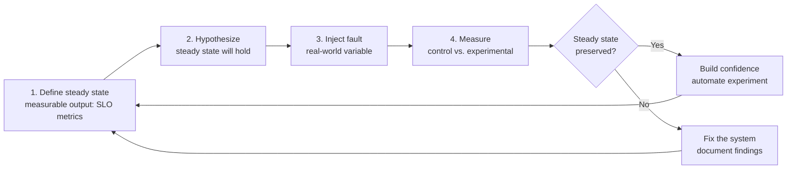
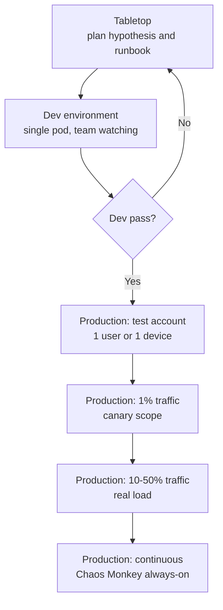
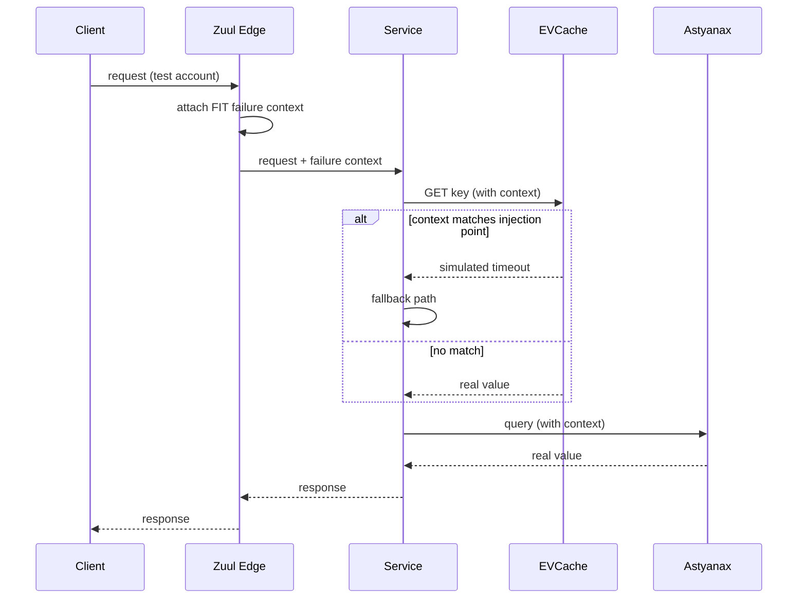

# Chaos Engineering: Breaking Things on Purpose

> **TL;DR**: Chaos engineering is not breaking things for fun. It is a scientific method: form a hypothesis about how your system handles failure, inject a controlled fault, measure whether steady state holds, and either build confidence or fix what broke. Netflix has run Chaos Monkey in production continuously since July 2011[^1]. When a real AWS DynamoDB outage hit US-EAST-1 in September 2015 and cascaded through dependent services including SQS, EC2 Auto Scaling, CloudWatch, and the AWS Console, with Auto Scaling backlogs not clearing until roughly 8.5 hours after the event began[^2], Netflix "sidestepped any significant impact" because Chaos Kong drills had already forced the cross-region failover fixes[^3]. The lesson: you do not have resilience until you have tested it under real failure. Blast-radius control is what separates chaos engineering from sabotage.

## Learning Objectives

After this module, you will be able to:

- [ ] Explain the Principles of Chaos and the four-step experiment framework
- [ ] Define steady-state metrics, hypothesis, and rollback criteria for an experiment
- [ ] Run a game day with appropriate blast radius and kill-switch conditions
- [ ] Choose between Chaos Monkey, Chaos Mesh, LitmusChaos, Istio fault injection, and managed services (AWS FIS, Azure Chaos Studio)
- [ ] Build organizational support for intentional production failure injection

## Intuition

You own a house with a backup generator. The power company has been reliable for years, so you have never tested the generator. One winter night, an ice storm knocks out power to the whole neighborhood. You flip the transfer switch. Nothing happens. The fuel line is clogged. The battery is dead. The manual is in a box you cannot find in the dark.

Your neighbor, on the other hand, runs the generator for 30 minutes every month. She checks the fuel, tests the transfer switch, and times how long it takes to restore power. When the ice storm hits, her lights come back in 90 seconds.

The difference is not the generator. Both houses have one. The difference is that your neighbor tested hers under controlled conditions before the real failure arrived. She found the clogged fuel line in daylight, on a Saturday, with a hardware store open. You found it at 2 a.m. in a blizzard.

Chaos engineering is the monthly generator test for distributed systems. [Resilience Patterns](./02-resilience-patterns.md) gave you the circuit breakers, retries, and bulkheads. This chapter teaches you how to verify they actually work, before the ice storm arrives.

## Theory

### The origin story

In August 2008, a corrupted database halted Netflix's DVD shipping for three days. Leadership concluded that horizontally scalable, fault-tolerant cloud architecture was the only path forward[^4]. The migration from monolithic datacenters to AWS ran from 2008 to 2011. The problem: AWS assumes individual VMs fail constantly. If your application cannot tolerate one instance disappearing, it will eventually suffer when AWS terminates that instance unexpectedly.

The solution, announced on the Netflix Tech Blog on July 19, 2011, was Chaos Monkey: a tool that "randomly disables our production instances to make sure we can survive this common type of failure without any customer impact"[^1]. The name came from "the idea of unleashing a wild monkey with a weapon in your data center to randomly shoot down instances and chew through cables"[^1].

By 2012, Netflix had built the Simian Army around Chaos Monkey:

- **Latency Monkey** injected artificial delays into RESTful calls
- **Conformity Monkey** terminated instances violating best practices (e.g., not in an auto-scaling group)
- **Chaos Gorilla** simulated the outage of an entire availability zone

By 2015, the program expanded further:

- **Chaos Kong** simulated the loss of an entire AWS region by routing all traffic away

In 2014, Netflix published FIT (Failure Injection Testing), which intercepts requests at the Zuul edge proxy, decorates them with failure context, and propagates that context through injection points inside Hystrix, Ribbon, EVCache, and Astyanax[^5]. FIT enabled targeting "a specific test account or a specific device" before scaling to a percentage of production.

In 2015, Netflix engineers including Casey Rosenthal, Ali Basiri, Lorin Hochstein, and Aaron Blohowiak published the Principles of Chaos manifesto at principlesofchaos.org, formalizing what Netflix had learned into a general engineering discipline[^6].

### The Principles of Chaos

The manifesto (last updated March 2019) prescribes a four-step experiment loop[^6]:

1. **Define steady state** as some measurable output that indicates normal behavior (throughput, error rates, latency percentiles)
2. **Hypothesize** that the steady state will hold in both control and experimental groups
3. **Introduce variables** that reflect real-world events (server crashes, network partitions, disk failures)
4. **Try to disprove** the hypothesis by looking for a steady-state difference

Five advanced principles describe the ideal practice: build hypotheses around steady-state behavior (output, not internals); vary real-world events (prioritize by impact or frequency); run experiments in production ("systems behave differently depending on environment and traffic patterns"); automate experiments to run continuously; and minimize blast radius[^6].

The key distinction: chaos engineering is not fault injection. Fault injection tests a single condition. Chaos engineering is an empirical method that generates new information about complex systems[^7]. The product is not discovered bugs. It is continuously re-validated operational readiness.

*The four-step experiment loop from the Principles of Chaos: define, hypothesize, inject, measure. The loop repeats to either build confidence or fix the system.*

### The experiment framework

A rigorous chaos experiment has six components:

**Quantified steady state.** Not "the system works" but "the Transaction Create API serves the 99th percentile of requests in under 100 ms." The AWS Well-Architected Reliability pillar provides a hypothesis template: "If `specific fault` occurs, the `workload name` workload will `describe mitigating controls` to maintain `business or technical metric impact`"[^8].

**Explicit hypothesis.** A concrete example from AWS: "If 20% of the nodes in the Amazon EKS node-group are taken down, the Transaction Create API continues to serve the 99th percentile of requests in under 100 ms. The EKS nodes will recover within five minutes, and pods will get scheduled and process traffic within eight minutes"[^8].

**Controlled, reversible fault injection.** The fault must be something you can stop. AWS FIS supports a post-action rollback configuration that "returns the target to the state that it was in before the action was run"[^8].

**Blast-radius control.** Start with one pod, one account, one user. Widen only after each phase passes.

**Kill switch.** AWS FIS supports up to five CloudWatch-alarm-based stop conditions per experiment template. The experiment halts automatically when any alarm breaches[^8]. An experiment without a kill switch is not chaos engineering. It is sabotage.

**Conclusion document.** Did steady state hold? If not, what broke, what is the fix, and who owns it?

### Failure modes to inject

The taxonomy of injectable faults spans seven categories:

| Category | Examples | Tools |
|----------|----------|-------|
| Compute | Instance termination, pod kill, container kill | Chaos Monkey, Chaos Mesh PodChaos, kube-monkey |
| Network | Latency, packet loss, partition, DNS failure | Chaos Mesh NetworkChaos, Toxiproxy, Istio fault injection |
| Resource exhaustion | CPU stress, memory pressure, disk fill, file descriptor exhaustion | Chaos Mesh StressChaos, stress-ng |
| Dependency | HTTP 500s, timeouts, slow responses from downstream | Istio VirtualService abort/delay, Toxiproxy |
| State | Clock skew, certificate expiry, corrupted config | Chaos Mesh TimeChaos, manual injection |
| AZ/Region | Availability zone loss, region evacuation | Chaos Gorilla, Chaos Kong, AWS FIS multi-AZ |
| Stateful systems | Primary kill, replica lag injection, split-brain | Manual + orchestration (requires replication topology knowledge) |

> [!IMPORTANT]
> Stateful failures (killing a Redis primary, a Kafka leader, a PostgreSQL primary) have blast radius determined by replication topology, not by the chaos tool. Before running the experiment, know: the replication mode (sync, async, quorum), the failover detection time, the promotion time, and the client reconnect behavior. If any of these are unknown, the experiment is not ready.

### Blast radius control

The Principles of Chaos states the obligation directly: "it is the responsibility and obligation of the Chaos Engineer to ensure the fallout from experiments are minimized and contained"[^6].

In practice, blast radius widens in phases:

*Blast radius widens in phases; each gate requires green signals from the previous phase. Most teams never need to reach "continuous" to get value.*

Netflix FIT uses Zuul to isolate most failure tests to "only a specific test account or a specific device" before expanding to "a small percentage of production requests"[^5]. LinkedIn's LinkedOut framework uses the LiX A/B testing platform to narrow failure to "a specific user making a specific request with a specific Rest.li method"[^9]. Slack's Disasterpiece Theater adds a human gate: every exercise begins in dev, and the team makes an explicit go/no-go decision before proceeding to production[^10].

**When to run.** Start during business hours with engineers on standby. Never Friday evening. Never during major launches. Netflix runs Chaos Monkey during business hours specifically so failures are learning opportunities rather than outages[^1].

### Game days and organizational adoption

A game day is a pre-planned chaos exercise with the team watching. The goal is to stress both the system and the humans: runbooks, alerting, on-call response, and cross-team coordination.

**Amazon GameDay** originated in the early 2000s under Jesse Robbins, whose title was "Master of Disaster." The ACM Queue round-table describes it as "a program designed to increase resilience by purposely injecting major failures into critical systems semi-regularly to discover flaws and subtle dependencies"[^11].

**Google DiRT** (Disaster Recovery Testing) has run annually company-wide since circa 2006. Kripa Krishnan's 2012 ACM Queue paper describes it as "an annual, company-wide, multi-day Disaster Recovery Testing event"[^12]. DiRT scenarios include simulated earthquakes and zombie apocalypses, but the wrapper is for realistic failures: datacenter power loss, inter-region network partition, loss of authentication infrastructure. The dramatic framing forces teams to engage rather than check boxes.

**Slack Disasterpiece Theater** (since January 2018) follows a structured format: hosts document "precisely how they're going to incite the failure, right down to the commands they're going to run," go on record with their confidence level, run in dev first, then make a go/no-go decision for production[^10].

**The adoption timeline.** Most organizations take 6 to 18 months from their first game day to comfortable production chaos. The path:

1. Tabletop exercises (zero risk, high learning)
2. Monthly game days in staging
3. Targeted production experiments with narrow scope
4. Continuous production chaos (Chaos Monkey always-on)

Cultural prerequisites matter more than tooling. LinkedIn Waterbear's playbook includes "roadshows to other eng teams and orgs, internal tech talks, resilience-focused sessions in new hire onboarding training, and competitive games to encourage people to discover resilience issues"[^9]. Chaos without blameless culture produces resentment, not resilience.

## Real-World Example

### Netflix: from Chaos Monkey to Chaos Kong

Netflix's chaos engineering program is the industry reference because it spans the full maturity spectrum: random instance termination (Chaos Monkey, 2011), targeted request-level faults (FIT, 2014), AZ outage simulation (Chaos Gorilla), and region evacuation drills (Chaos Kong, 2015).

**Architecture.** Chaos Monkey is a Go service integrated with Spinnaker that terminates "virtual machine instances and containers that run inside of your production environment" via API calls to whichever cloud backend Spinnaker manages[^13]. It is opt-out, not opt-in: eligibility defaults on, making resilience the default assumption.

FIT provides the fine-grained layer. Zuul decorates incoming requests with failure context at the edge. That context propagates through internal service-to-service calls. Each injection point (Hystrix, Ribbon, EVCache, Astyanax) checks the context and simulates the failure if matched[^5].

*FIT decorates requests at the Zuul edge; failure context propagates through the call chain, and each injection point decides whether to simulate a fault or pass through.*

**The Chaos Kong validation.** On September 20, 2015, a real AWS DynamoDB service event in US-EAST-1 cascaded into multiple dependent services. According to the AWS post-event summary, the DynamoDB error rate stabilized at roughly 55% starting at 2:37am PDT and the service was not restored until 7:10am PDT (~5 hours), with several dependent services affected: SQS cache refreshes failed from ~5:45am until 7:10am PDT, EC2 Auto Scaling APIs were degraded from 2:15am to 7:10am PDT and the backlog of scaling activities did not clear until 10:52am PDT (~8.5 hours from the start), CloudWatch metrics were delayed or missing from 2:35am until 7:29am PDT, and AWS Console logins were impacted from 5:45am to 7:10am PDT. AWS wrote that "there are several other AWS services that use DynamoDB that experienced problems during the event" beyond the named examples[^2]. Netflix "sidestepped any significant impact" because Chaos Kong exercises had already exposed and fixed the systemic weaknesses that would have made the outage catastrophic[^3]. The honest inversion: Chaos Kong had disproved Netflix's confidence in single-region operation many times before September 2015, forcing the cross-region failover fixes that made the real outage survivable.

**The Subscriber experiment.** In 2015, Netflix injected 30 ms of latency into 50% of Subscriber-to-cache traffic. Steady state was video plays per second. At 50% traffic, steady state deviated. The root cause was not a code bug but thread-pool configuration in an upstream service[^3]. This is what chaos engineering most often finds: misconfigured timeouts, missing fallbacks, undersized thread pools, and unbounded retries.

## Defense in depth

A mature chaos program is not a single practice you pick from a menu. The rows below are layered over 6 to 18 months: teams start in staging, graduate to bounded production experiments, then to continuous production chaos, while running game days in parallel the entire time. The "Add this layer when" column says when each layer earns its place, not which one to choose instead of the others.

| Layer | Pros | Cons | Best when | Add this layer when |
|----------|------|------|-----------|----------|
| Staging-only chaos | Safe, low friction, near-zero blast radius | Does not match production traffic or data; false confidence if it remains the only layer[^6] | Getting started; building team muscle | **Month 1-3 of the program** |
| Production chaos with bounded blast radius | Realistic signal; narrow scope bounds customer impact[^6] | Requires experimentation framework and observability[^8] | Established teams with SLOs and observability | **Once steady-state metrics, kill switches, and runbooks exist** |
| Continuous production chaos (Chaos Monkey-style) | Resilience becomes the default, not an event[^1] | Requires deep automation and SLO discipline | Mature organisations with strong automation | **Once bounded production chaos has been reliable for 6+ months** |
| Game days (Google DiRT[^12], Slack Disasterpiece[^10]) | Tests humans, runbooks, escalation and cross-team coordination, not just systems | Expensive per event; cannot be continuous | Complement to the other layers at quarterly cadence | **From day one, alongside every other layer** |

## Common Pitfalls

> [!WARNING]
> **No steady-state definition.** Running a chaos experiment without quantified steady-state metrics is like running a science experiment without a control group. You cannot measure what you did not define. Before injecting any fault, name the exact dashboard and metric that will confirm or refute your hypothesis.

> [!WARNING]
> **Missing kill switch.** An experiment scoped to 1% of traffic that accidentally runs for 15 minutes instead of 1 minute becomes a real outage. AWS FIS supports up to five alarm-based stop conditions per template. Set them. Every experiment needs an automatic halt on SLO burn-rate breach.

> [!WARNING]
> **Too-wide blast radius on the first try.** Starting with "kill an entire AZ" before you have validated single-pod resilience is backwards. The blast radius progression exists for a reason: tabletop, dev, test account, 1% traffic, then wider.

> [!WARNING]
> **Chaos without observability.** [Observability](./00-observability.md) is a prerequisite, not a nice-to-have. If you cannot see the experiment's effect in metrics, logs, and traces within 60 seconds, you cannot stop it safely. Chaos without observability is sabotage with extra steps.

> [!WARNING]
> **Findings ignored.** The experiment found that Redis failover takes 45 seconds instead of the expected 5. The team files a ticket, nobody prioritizes it, and six months later the real outage hits. Chaos engineering's value is zero if action items are not tracked to completion. Treat findings like [Incident Management](./07-incident-management.md) action items: owned, deadlined, reviewed.

## Exercise

Design a game day for your team: your Redis primary fails over. Define the steady-state metrics, write the hypothesis, choose the blast radius, plan the kill switch, write the runbook for the experiment, and plan the debrief.

Hint

Think about what "steady state" means for your Redis-dependent service. It is not "Redis is up." It is the user-facing metric that Redis supports (e.g., p99 latency of the product page, cache hit ratio, checkout success rate). Your hypothesis should include the expected failover time. Consider: what is your Redis replication mode (async? semi-sync?), what is the Sentinel/Cluster detection timeout, and what does your client library do during failover (retry? throw? reconnect)?

Solution

**Steady state:** Product page p99 latency < 200 ms; cache hit ratio > 85%; zero 5xx errors on the checkout endpoint.

**Hypothesis:** If the Redis primary is terminated, Sentinel promotes the replica within 30 seconds, the client library reconnects within 5 seconds of promotion, and steady-state metrics recover within 60 seconds total. No user-facing errors exceed the [SLI, SLO, SLA, and Error Budgets](./01-sli-slo-sla-error-budgets.md) burn-rate threshold.

**Blast radius:** Start in staging with production-like data volume. If staging passes, run in production against a single shard (if clustered) or the least-trafficked replica set.

**Kill switch:** CloudWatch alarm on 5xx rate > 1% for 30 seconds, OR p99 latency > 2 seconds for 30 seconds. Either alarm aborts the experiment and triggers manual rollback (promote original primary back if needed).

**Runbook:**

1. Announce in #ops channel: "Chaos experiment: Redis primary kill, shard-3, starting in 5 minutes"
2. Confirm observability dashboards are open and baseline is stable
3. Terminate the Redis primary via `redis-cli DEBUG SLEEP 300` (simulates hang) or instance termination
4. Observe: Does Sentinel detect the failure? How long until promotion? Does the client reconnect?
5. Measure: Are steady-state metrics within hypothesis bounds?
6. If kill-switch alarm fires: abort, restore, document
7. If hypothesis holds: document success, schedule next experiment with wider scope

**Debrief (within 24 hours):**

- Did the hypothesis hold? If not, what was the gap?
- Were alerts timely? Did the right people get paged?
- Is the runbook accurate? What steps were missing?
- Action items: who owns each fix, with a deadline

**Common finding:** The client library's reconnect timeout is set to the default (often 30 seconds), making the total outage window 30s detection + 30s reconnect = 60 seconds, not the expected 30 seconds. The fix: tune `retry_max_delay` and `reconnect_attempts` in the client config.

## Key Takeaways

- Chaos engineering is an empirical method (hypothesis, inject, measure, conclude), not random destruction.
- You do not have resilience until you have tested it under real failure. Staging-only chaos gives false confidence.
- Blast-radius control is what separates chaos engineering from sabotage: start with one pod, widen only after each phase passes.
- Every experiment needs a kill switch. AWS FIS supports up to five alarm-based stop conditions per template.
- What chaos engineering most often finds is not code bugs but misconfigured timeouts, missing fallbacks, undersized thread pools, and stale runbooks.
- Game days test the humans (runbooks, alerting, escalation), not just the system. Run them quarterly regardless of automation maturity.
- Cultural prerequisites (blameless debriefs, management buy-in, tracked action items) matter more than tooling.

## Further Reading

- [Principles of Chaos Engineering](https://principlesofchaos.org/) - The manifesto. Short, authoritative, and the single document every chaos program should align on before choosing tools.
- [Chaos Engineering: System Resiliency in Practice](https://www.oreilly.com/library/view/chaos-engineering/9781492043850/) by Rosenthal and Jones (O'Reilly, 2020) - The canonical book with case studies from Slack, LinkedIn, Capital One, Microsoft, and Google.
- [The Netflix Simian Army](https://netflixtechblog.com/the-netflix-simian-army-16e57fbab116) - The original 2011 blog post that started the discipline; read for the "opt-out not opt-in" design decision.
- [Chaos Engineering Upgraded](https://netflixtechblog.com/chaos-engineering-upgraded-878d341f15fa) - The 2015 Netflix post formalizing the experiment framework and introducing Chaos Kong region evacuation.
- [Disasterpiece Theater](https://slack.engineering/disasterpiece-theater-slacks-process-for-approachable-chaos-engineering/) - Richard Crowley's 2019 writeup of Slack's game-day process; the best guide for teams starting their first exercises.
- [Weathering the Unexpected](https://web.archive.org/web/20241220083626/https://queue.acm.org/detail.cfm?id=2371516) - Kripa Krishnan's 2012 ACM Queue paper on Google DiRT; the best published source on company-wide game days.
- [Resilience Engineering at LinkedIn with Project Waterbear](https://engineering.linkedin.com/blog/2017/11/resilience-engineering-at-linkedin-with-project-waterbear) - LinkedIn's socio-technical approach covering LinkedOut, FireDrill, and D2Tuner; read for the cultural adoption playbook.
- [Chaos Mesh documentation](https://chaos-mesh.org/docs/) - The CNCF incubating Kubernetes-native chaos platform; start with PodChaos and NetworkChaos CRDs.

## Flashcards

**Q:** What are the four steps of the chaos engineering experiment loop?
**A:** (1) Define steady state as a measurable output, (2) hypothesize that steady state will hold under failure, (3) inject a real-world fault variable, (4) measure whether steady state deviates between control and experimental groups.

**Q:** How does chaos engineering differ from fault injection testing?
**A:** Fault injection tests a single known condition. Chaos engineering is an empirical method that generates new information about complex systems by forming hypotheses and trying to disprove them. The product is continuously re-validated operational readiness, not just bug discovery.

**Q:** What is a "steady state" in chaos engineering?
**A:** A measurable output of the system that indicates normal behavior, such as video plays per second, p99 latency, error rate, or throughput. It must be quantified before the experiment starts so deviation can be detected.

**Q:** Why must chaos experiments run in production, not just staging?
**A:** Systems behave differently depending on environment and traffic patterns. Staging does not carry production load mix, data volumes, or real user behavior. An experiment that passes in staging but was never run in production provides false confidence.

**Q:** What is blast-radius control and why is it critical?
**A:** The set of techniques (scope narrowing, stop conditions, gradual rollout) that keep a chaos experiment from becoming a real outage. Without it, chaos engineering is sabotage. Start with one pod or test account, widen only after each phase passes.

**Q:** What did Netflix's Chaos Kong exercises prevent during the September 2015 AWS DynamoDB outage?
**A:** The DynamoDB service event in US-EAST-1 began at 2:19am PDT, peaked at a ~55% error rate, and was not restored until 7:10am PDT, with dependent services (SQS, EC2 Auto Scaling, CloudWatch, AWS Console, and others) degraded for several hours; the Auto Scaling backlog did not fully clear until 10:52am PDT. Netflix sidestepped significant impact because Chaos Kong region-evacuation drills had already exposed and forced fixes to the cross-region failover weaknesses that would have made the outage catastrophic.

**Q:** What is a kill switch in chaos engineering?
**A:** An automatic stop condition that halts the experiment when a guardrail metric breaches a threshold. AWS FIS supports up to five CloudWatch-alarm-based stop conditions per experiment template. An experiment without a kill switch is not chaos engineering.

**Q:** What does chaos engineering most often find?
**A:** Not code bugs, but operational weaknesses: misconfigured timeouts, missing fallbacks, undersized thread pools, unbounded retries, and runbooks that no longer match reality.

**Q:** What is the difference between a game day and continuous chaos?
**A:** A game day is a pre-planned exercise with the team watching, testing both the system and the humans (runbooks, alerting, escalation). Continuous chaos (Chaos Monkey) runs unannounced and ongoing. Game days test surprise response and cross-team coordination; continuous chaos validates that resilience has not decayed.

**Q:** Name three CNCF/OSS chaos engineering tools and their scope.
**A:** Chaos Mesh (CNCF incubating, Kubernetes-native CRDs for pod, network, IO, stress, time, and DNS faults), LitmusChaos (CNCF incubating, Kubernetes-native with a chaos hub of pre-built experiments), and Toxiproxy (Shopify, TCP-level proxy for injecting latency, timeouts, and bandwidth limits in development and test).

**Q:** What cultural prerequisites must exist before running production chaos?
**A:** Blameless postmortem culture, management buy-in, SLO discipline with error budgets, observability (metrics, logs, traces), tracked action items from findings, and a status-page communication plan. Tools without culture produce resentment, not resilience.

**Q:** How long does organizational adoption of chaos engineering typically take?
**A:** 6 to 18 months from first game day to comfortable production chaos. The path: tabletop exercises, monthly game days in staging, targeted production experiments with narrow scope, then continuous production chaos.

## References

[^1]: Yury Izrailevsky and Ariel Tseitlin, "The Netflix Simian Army", Netflix Tech Blog, July 19, 2011. https://netflixtechblog.com/the-netflix-simian-army-16e57fbab116
[^2]: AWS, "Summary of the Amazon DynamoDB Service Disruption and Related Impacts in the US-East Region", September 2015 post-event summary. https://aws.amazon.com/message/5467D2/
[^3]: Ali Basiri, Lorin Hochstein, Abhijit Thosar, Casey Rosenthal, "Chaos Engineering Upgraded", Netflix Tech Blog, September 25, 2015. https://netflixtechblog.com/chaos-engineering-upgraded-878d341f15fa
[^4]: Gremlin, "The Origin of Chaos Engineering" (Netflix's 2008 database outage context). https://www.gremlin.com/chaos-monkey/the-origin-of-chaos-monkey/
[^5]: Kolton Andrus, Naresh Gopalani, Ben Schmaus, "FIT: Failure Injection Testing", Netflix Tech Blog, October 23, 2014. https://netflixtechblog.com/fit-failure-injection-testing-35d8e2a9bb2
[^6]: Principles of Chaos Engineering, last updated March 2019. https://principlesofchaos.org/
[^7]: Casey Rosenthal, Lorin Hochstein, Aaron Blohowiak, Nora Jones, Ali Basiri, "Chaos Engineering" (O'Reilly, 2017). https://www.oreilly.com/library/view/chaos-engineering/9781491988459/ch01.html
[^8]: AWS Well-Architected Framework, Reliability Pillar, "REL12-BP05 Test resiliency using chaos engineering". https://docs.aws.amazon.com/wellarchitected/2024-06-27/framework/rel_testing_resiliency_failure_injection_resiliency.html
[^9]: Bhaskaran Devaraj and Xiao Li, "Resilience Engineering at LinkedIn with Project Waterbear", LinkedIn Engineering, November 10, 2017. https://engineering.linkedin.com/blog/2017/11/resilience-engineering-at-linkedin-with-project-waterbear
[^10]: Richard Crowley, "Disasterpiece Theater: Slack's process for approachable Chaos Engineering", Slack Engineering, August 1, 2019. https://slack.engineering/disasterpiece-theater-slacks-process-for-approachable-chaos-engineering/
[^11]: Jesse Robbins, Kripa Krishnan, John Allspaw, Tom Limoncelli, "Resilience Engineering: Learning to Embrace Failure", ACM Queue, November 2012. https://web.archive.org/web/20250108153902/https://queue.acm.org/detail.cfm?id=2371297
[^12]: Kripa Krishnan, "Weathering the Unexpected", ACM Queue and Communications of the ACM, November 2012. https://web.archive.org/web/20241220083626/https://queue.acm.org/detail.cfm?id=2371516
[^13]: Netflix, "chaosmonkey" GitHub repository README. https://github.com/Netflix/chaosmonkey
