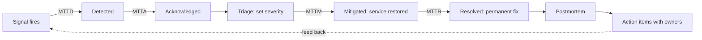
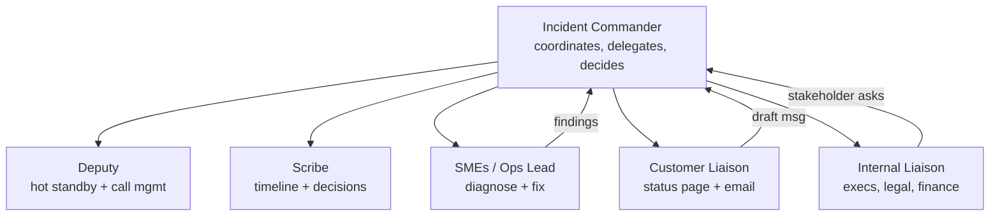
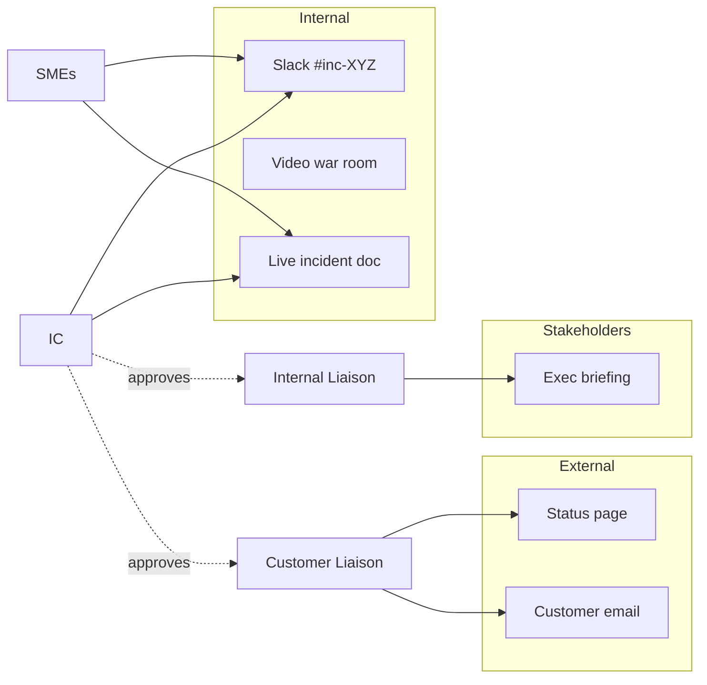
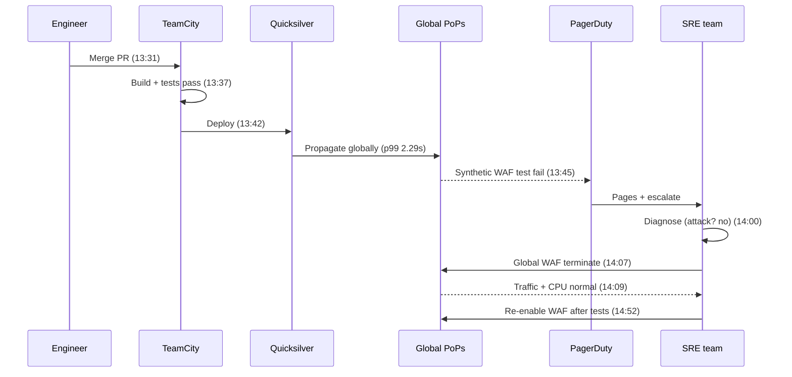

# Incident Management: From Detection to Blameless Postmortem

> **TL;DR**: Incidents are chaotic by definition, so the only way to respond calmly is to have pre-built structure you can fall back on. That structure has five phases (detect, triage, mitigate, resolve, postmortem), clear roles adapted from wildland firefighting (the incident commander coordinates but never fixes), and a blameless learning culture that treats every outage as a system failure, not a human one. Google SRE caps on-call load at two pages per 12-hour shift[^1]. Cloudflare's 2019 WAF postmortem lists eleven contributing factors rather than a single "root cause"[^2]. The discipline is simple to describe and hard to sustain, which is why you practice it before you need it.

## Learning Objectives

After this module, you will be able to:

- [ ] Design an on-call rotation that is sustainable long-term
- [ ] Define severity levels and their response expectations
- [ ] Run an incident as an incident commander using ICS roles
- [ ] Write a blameless postmortem that produces actionable improvements
- [ ] Decompose MTTR into its four components and identify which phase to optimize
- [ ] Integrate incident management tooling into your team's workflow

## Intuition

You are a restaurant manager. A waiter drops a tray of drinks on a customer. What happens next determines whether you lose one table or the whole evening.

The wrong response: the head chef runs out of the kitchen to apologize, leaving six orders burning on the stove. The hostess abandons the door to grab a mop, so a line forms outside. Everyone is helping, nobody is coordinating, and three problems are now five.

The right response: the manager (not the chef) takes charge. She assigns one person to the customer, one to the cleanup, and one to cover the hostess stand. She does not touch a mop herself. She checks in every two minutes: "Customer handled? Floor dry? Line moving?" When the dust settles, she writes up what happened, not to fire the waiter, but to ask: was the tray overloaded? Was the floor wet? Was the path too narrow?

That is incident management. The manager is the Incident Commander. The chef stays in the kitchen (Subject Matter Expert). The written debrief is the postmortem. And the question "was the floor wet?" is the shift from blaming a person to fixing a system.

[Observability](./00-observability.md) gave you the instrumentation to detect that something is wrong. [SLI, SLO, SLA, and Error Budgets](./01-sli-slo-sla-error-budgets.md) gave you the math to decide how wrong. This chapter gives you the human process that turns detection into recovery and recovery into learning.

## Theory

### The incident lifecycle and MTTR decomposition

An incident moves through five phases: detection, triage, mitigation, resolution, and postmortem[^3]. The first priority is always to "stop the bleeding, restore service, and preserve the evidence for root-causing"[^3]. Mitigation (rollback, traffic drain, feature flag) restores service without requiring you to understand the root cause. Resolution deploys the permanent fix. Conflating the two is the most common lifecycle mistake: engineers feel pressure to ship a "real fix" while customers burn.

The total time from signal to closure decomposes into four measurable components:

- **MTTD** (mean time to detect): alert fires to human awareness.
- **MTTA** (mean time to acknowledge): page fires to acknowledged.
- **MTTM** (mean time to mitigate): acknowledged to customer impact ending.
- **MTTR** (mean time to resolve): incident declared to fully closed.

*The five phases of an incident and the distinct MTTR components they contribute to. Optimizing the wrong phase wastes effort: if MTTD is 45 minutes and MTTM is 5, invest in detection, not faster rollbacks.*

Each component has a different optimization lever. MTTD improves with SLO-based alerting (covered in [SLI, SLO, SLA, and Error Budgets](./01-sli-slo-sla-error-budgets.md)). MTTA improves with on-call design. MTTM improves with runbooks and pre-built mitigation tools. MTTR improves with postmortem action items that prevent recurrence.

### On-call design

On-call is the human availability layer that makes incident response possible. Done poorly, it burns people out in weeks. Done well, it is sustainable for years.

**Rotation structure.** A primary on-call handles pages. A secondary is the escalation path if the primary does not acknowledge within 5 minutes[^4]. A third tier escalates to the entire team for catastrophic failures. Follow-the-sun uses sites in different time zones for 24/7 coverage without overnight shifts; for dual-site teams it requires at least six engineers per site[^5]. Single-site 24/7 requires at least eight engineers to avoid unsustainable shift frequency[^5].

**Pager budget.** Google SRE sets a maximum of two distinct incidents per 12-hour shift as the threshold above which corrective action is warranted[^1]. Beyond that, engineers cannot maintain 50% project time, quality of response degrades, and attrition accelerates.

**Alert hygiene.** Every page must be actionable. If you cannot write a runbook for an alert, the alert should not page. Non-actionable alerts become tickets. Flapping alerts get deleted. Review paging rules quarterly and measure the ratio of actionable to auto-resolved pages.

> [!TIP]
> A rotation of fewer than six people is fragile. Vacations, illness, and context-switching overhead mean that in practice you need six to eight engineers to sustain a healthy single-timezone rotation.

### Severity levels and escalation

Severity converts a fuzzy "how bad is this?" into a pre-negotiated response obligation. PagerDuty's public schema is one of the most widely referenced[^6]:

| Severity | Definition | Response |
|---|---|---|
| SEV-1 | Critical, warrants public notification and executive liaison | Major incident: IC paged, full ICS |
| SEV-2 | Critical, actively impacting many customers | Major incident: IC paged |
| SEV-3 | Stability issue requiring immediate service-team action | High-urgency page to service team |
| SEV-4 | Minor issue, no direct customer impact | Low-urgency page |
| SEV-5 | Cosmetic or minor bug | Jira ticket |

SEV-1 and SEV-2 automatically trigger the full Incident Command System response. SEV-3 can be promoted at the IC's discretion.

> [!TIP]
> "If you are unsure which level an incident is, treat it as the higher one. During an incident is not the time to discuss or litigate severities"[^6].

### The Incident Command System (ICS roles)

The Incident Command System originated in US wildland firefighting in the 1970s (later incorporated into NIMS in 2004) and was adapted for software by Google SRE and PagerDuty[^3][^7]. Its core invariant: **the Incident Commander coordinates but does not fix.** PagerDuty's explicit rule: "Delegate all repair actions, the Incident Commander is NOT a resolver"[^7].

The role taxonomy:

- **Incident Commander (IC):** Single source of truth. Declares the incident, sets severity, delegates work, makes decisions when consensus stalls, approves external communications.
- **Deputy:** Hot standby for the IC. Manages the call logistics. Takes over if the IC needs a break.
- **Scribe:** Captures timeline events, decisions, and actions in the live incident document.
- **Subject Matter Expert (SME) / Ops Lead:** Diagnoses and fixes. Multiple SMEs may work in parallel.
- **Customer Liaison:** Drafts and posts status-page updates and customer emails. Every external message is approved by the IC before posting.
- **Internal Liaison:** Bridges to executives, finance, legal, and other teams.

*The IC coordinates; SMEs fix; Liaisons shield responders from stakeholder interrupts. Information flows up to the IC, decisions flow down.*

Why separate IC from SME? Because the moment your best debugger opens a terminal, coordination stops. Status updates cease. Unacknowledged questions pile up. The Google SRE book illustrates this with "Mary," an on-call engineer who dives into logs while her boss yells for a status update and a colleague ships an unsafe fix that kills the remaining servers[^3].

For small teams, roles collapse: the Deputy doubles as Scribe, one person handles both Liaisons. But the IC/SME separation is non-negotiable for any incident above SEV-3.

### Communication discipline

Internal and external communication channels must be separated. Responders need a quiet space to work; customers and executives need regular updates without drowning the war room.

*Internal war-room traffic is separated from customer and executive channels. The IC gates every outbound message to prevent speculation from reaching customers.*

**Cadence:** Status updates every 15 to 30 minutes during SEV-1. Each update follows a fixed structure: what is broken, what we are doing, when the next update will come. This cadence pre-empts "what's going on?" interrupts that would distract responders[^3].

**External messaging rules:** State facts, not speculation. "We are investigating elevated error rates" is correct. "We think the database is corrupted" is not. Use pre-drafted templates to shorten the critical path.

**Regulatory obligations:** GDPR requires breach notification within 72 hours. HIPAA and SOC 2 have their own evidence-trail requirements. Loop legal in from minute one for any data-exposure incident.

**Self-host dependency trap:** Do not store your incident document, chat, or dashboard behind the service you are trying to fix. Cloudflare's 2019 outage locked engineers out of their own Access-protected control panel[^2]. Facebook's 2021 BGP withdrawal broke the internal tools needed to investigate the withdrawal[^8]. Maintain out-of-band access paths and practice using them.

### Blameless postmortems

John Allspaw's 2012 Etsy post established the blameless framing that became industry gospel: "we instead want to view mistakes, errors, slips, lapses, etc. with a perspective of learning"[^9]. Google's Chapter 15 codifies it: a postmortem is blameless when it "focus[es] on identifying the contributing causes of the incident without indicting any individual or team"[^10].

Richard Cook's *How Complex Systems Fail* takes the argument further: attribution to a single "root cause" is "fundamentally wrong" because overt failure requires multiple contributors and only their combination permits catastrophe[^11].

**Template (Google SRE):**

1. Executive summary (3 sentences)
2. Timeline (timestamped events from detection to resolution)
3. Impact (users affected, duration, revenue loss)
4. Contributing factors (plural, never singular "root cause")
5. What went well (reinforce good practices)
6. Action items (each with a named owner, priority, and due date)

**Triggers:** User-visible downtime beyond a threshold, any data loss, on-call engineer intervention (rollback, traffic reroute), resolution time above a threshold, or monitoring failure[^10].

**The 5 Whys:** A simple technique to force depth. Ask "why?" iteratively until you reach a systemic cause. Stop when the answer is a process or system design choice, not a human action.

**Public postmortems:** Cloudflare, GitHub, Atlassian, Fastly, and AWS all publish detailed post-incident reviews. These build industry trust and accelerate collective learning. Cloudflare's 2019 WAF postmortem names eleven contributing factors, publishes the offending regex, and explains catastrophic backtracking in an appendix[^2].

## Real-World Example

### Cloudflare WAF regex outage, 2 July 2019

On 2 July 2019, a single WAF rule change took down 80% of Cloudflare's global traffic for 27 minutes[^2]. The postmortem is the gold standard for public transparency.

**What happened:** An engineer merged a pull request containing a new XSS detection rule. The rule contained a regex that could backtrack catastrophically: reduced to its pathological core, `.*.*=.*`. TeamCity built and tested the rules (the test suite did not include CPU-consumption tests), then deployed globally via Cloudflare's Quicksilver KV store, which replicates configuration to 180+ cities with a p99 of 2.29 seconds[^2].

Within 3 minutes of deploy, every edge server's CPU pegged at 100%. PagerDuty fired. Global 502 errors cascaded. The SRE team diagnosed the cause (ruling out an attack), agreed on a global WAF termination, and executed it at 14:07 UTC. Traffic returned to normal at 14:09.

*The Cloudflare 2019 WAF outage from rule merge to global kill-switch in 36 minutes, with detection arriving within 3 minutes of deploy and full recovery 27 minutes after first impact.*

**Why it matters for incident management:**

1. **Detection was fast (3 minutes)** because synthetic WAF tests ran continuously. MTTD was not the bottleneck.
2. **Mitigation was a global kill-switch**, not a root-cause fix. The WAF stayed off for 43 more minutes while the team validated a safe re-enable path.
3. **Self-host dependency:** Engineers could not reach their own Cloudflare Access-protected dashboard. Some had lost credentials because a security feature disabled them after non-use.
4. **The postmortem lists eleven contributing factors**, not one. A regex that could backtrack, accidental removal of a CPU safeguard during a refactor, no complexity guarantee in the PCRE engine, no CPU-consumption tests, and an SOP that permitted non-emergency global push.
5. **Action items were systemic:** switch to a linear-time regex engine (re2 or Rust `regex`), manually audit 3,868 rules, add performance profiling to the test suite, add staged rollout for non-emergency rules.

The postmortem never names the engineer who shipped the rule. It names the system that allowed a single merge to take down the planet.

## Trade-offs

The substitutable decision is *how you structure response*, which scales with team size and incident frequency. Publishing public postmortems is a separate disclosure decision on a different axis and is covered in the prose above and in Further Reading below.

| Approach | Pros | Cons | Best when | Our Pick |
|---|---|---|---|---|
| Ad hoc response | Zero overhead, no process tax | Inconsistent, chaotic, no post-incident learning | Single-team pre-SEV-1 orgs with < 1 major incident per year | Appropriate for single-team pre-SEV-1 orgs only |
| Severity-based runbooks | Structured response, less mid-incident argument about severity[^6] | Runbook maintenance burden, staleness risk | Growing teams past their first major incident | **Default for most teams** |
| Dedicated incident commanders (ICS-derived) | Professional response; IC delegates repair actions and is not a resolver[^7] | Requires headcount; IC skill atrophies if the role is underused | Large-scale services running 24/7 or multi-region | When you exceed ~100 engineers |

## Common Pitfalls

> [!WARNING]
> **Alert fatigue.** Real signals get ignored because the on-caller has been desensitized by noise. Track pager load per shift. If it exceeds two pages per 12 hours consistently, your alerts need pruning, not your people need toughening[^1].

> [!WARNING]
> **IC who also fixes (role collapse).** The moment the IC opens a terminal, coordination stops. Train a pool of ICs. Make Deputy mandatory for SEV-1. If your team has only one person who can IC, you have a bus-factor problem.

> [!WARNING]
> **Self-host dependency.** Your debugging tools depend on the service that is down. Maintain out-of-band access: break-glass credentials, monitoring hosted outside the failure domain, and a phone tree that does not require Slack.

> [!WARNING]
> **Root-cause myopia.** Postmortems with a single contributing factor and action items that all patch the same file leave the broader failure class free to recur. Enumerate contributing factors. Cloudflare listed eleven[^2]. Atlassian listed four distinct learnings with sub-points[^12].

> [!WARNING]
> **Action items without owners or due dates.** The postmortem document exists, looks complete, and changes nothing. Every action item needs a named person (not a team), a priority, and a due date. Track completion rate quarterly. A repeat incident with the same contributing factor as a prior postmortem means your learning loop is broken.

## Exercise

Design the incident response playbook for a new team of 8 engineers running a B2B SaaS product with 500 enterprise customers and a 99.9% availability SLO. Define: severity matrix (3 levels), on-call rotation shape, IC role definition, status-page communication cadence, and postmortem template. Justify each choice.

Hint

Start with the SLO: 99.9% over 30 days gives you 43.2 minutes of downtime budget. Work backward from there to define what constitutes SEV-1 (burning the budget in minutes), SEV-2 (burning it in hours), and SEV-3 (not burning it but degraded). For the rotation, 8 engineers is exactly the minimum for single-site 24/7. Consider whether you actually need 24/7 or whether business-hours-only with an escalation path suffices for a B2B product.

Solution

**Severity matrix:**

| Level | Definition | Response | Example |
|---|---|---|---|
| SEV-1 | Complete outage or data loss affecting any customer | IC paged, full ICS, status page updated within 10 min | API returning 500 for all requests |
| SEV-2 | Significant degradation affecting > 10% of customers | IC paged, service team mobilized, status page within 30 min | Latency 10x normal, partial feature unavailable |
| SEV-3 | Minor degradation, single customer, or loss of redundancy | Service team page, no IC required | One replica down, failover healthy |

**On-call rotation:** 8 engineers, 1-week primary rotation, 1-week secondary. Follow-the-sun is not feasible with a single-site team. Business-hours escalation to the full team for SEV-1 outside working hours (B2B customers are mostly active during business hours). Pager budget: max 2 pages per shift. If exceeded for two consecutive weeks, the team pauses feature work to fix alert hygiene.

**IC role:** Any engineer who has completed IC training (a 2-hour workshop plus one shadowed incident). The on-call primary is NOT automatically the IC; the IC is whoever declares the incident. For SEV-1, a second engineer is always pulled in as Deputy.

**Status-page cadence:** SEV-1: update every 15 minutes. SEV-2: every 30 minutes. SEV-3: initial acknowledgment only, update on resolution. All external messages use templates: "We are investigating [symptom]. Next update in [N] minutes."

**Postmortem template:** Executive summary, timeline, impact (customers affected, duration, SLO budget consumed), contributing factors (minimum 2), what went well, action items (owner + due date + priority). Trigger: any SEV-1, any SEV-2 lasting > 30 minutes, any data loss, any monitoring failure. Review meeting within 5 business days. Action item completion tracked in weekly standup.

**Justification:** The 99.9% SLO means 43 minutes/month of budget. A single 30-minute SEV-1 consumes 70% of it. This forces aggressive detection (SLO burn-rate alerts) and fast mitigation (pre-built rollback scripts). The B2B context means fewer but higher-value customers, so communication quality matters more than speed of first update.

## Key Takeaways

- An incident has five phases: detect, triage, mitigate, resolve, postmortem. Mitigation (restore service) comes before resolution (fix root cause). Never conflate them.
- The Incident Commander coordinates but never fixes. Separating IC from SME is the single most impactful structural decision for incident response quality.
- Cap on-call load at two pages per 12-hour shift. Beyond that, response quality degrades and engineers leave.
- Severity levels eliminate mid-incident argument. When in doubt, escalate to the higher severity.
- Blameless postmortems surface issues earlier because engineers are not afraid to flag them. Blame breeds cover-ups.
- Prefer "contributing factors" over "root cause." Complex system failures always have multiple contributors.
- Action items without named owners and due dates do not get done. Track completion rate. A repeat incident with the same contributing factor means your learning loop is broken.

## Further Reading

- [Google SRE Book: Managing Incidents](https://sre.google/sre-book/managing-incidents/) - Andrew Stribblehill's canonical ICS adaptation with the "Mary" unmanaged-incident vignette that shows why IC/SME separation matters.
- [Google SRE Book: Postmortem Culture](https://sre.google/sre-book/postmortem-culture/) - The template, triggers, and review practice that most of the industry copies. Start here for your first postmortem process.
- [Google SRE Workbook: On-Call](https://sre.google/workbook/on-call/) - The "max 2 pages per 12-hour shift" guidance plus rotation sizing math. Essential reading before designing your first rotation.
- [PagerDuty Incident Response](https://response.pagerduty.com/) - Open-source documentation of severity levels, IC/Deputy/Scribe/SME roles, and call etiquette. The most copy-paste-ready starting point.
- [Blameless PostMortems and a Just Culture](https://www.etsy.com/codeascraft/blameless-postmortems) - John Allspaw's 2012 Etsy post that originated the term in software engineering. Short, persuasive, and still the best introduction.
- [How Complex Systems Fail](https://how.complexsystems.fail/) - Richard Cook's 18 short points. Read point 7 on the social construction of "root cause" and point 8 on hindsight bias.
- [Details of the Cloudflare outage on July 2, 2019](https://blog.cloudflare.com/details-of-the-cloudflare-outage-on-july-2-2019/) - The gold-standard public postmortem: eleven contributing factors, the offending regex published in full, and an appendix on catastrophic backtracking.
- [Howie: The Post-Incident Guide](https://howie-guide.pagerduty.com/) - Nora Jones, Laura Maguire, Vanessa Huerta Granda, and the Jeli team's guide to post-incident investigations (rehomed at PagerDuty after the Jeli acquisition). Start here if you want to go deeper than this chapter.

## Flashcards

**Q:** What are the five phases of the incident lifecycle?
**A:** Detection, triage, mitigation (restore service), resolution (permanent fix), and postmortem (learn and codify). Mitigation comes before resolution because restoring service is more urgent than understanding root cause.

**Q:** What are the four components of MTTR?
**A:** MTTD (time to detect), MTTA (time to acknowledge), MTTM (time to mitigate), and MTTR (time to fully resolve). Each has a different optimization lever: better alerting for MTTD, on-call design for MTTA, runbooks for MTTM, postmortem action items for MTTR.

**Q:** What is the IC's defining rule?
**A:** The Incident Commander coordinates but does NOT fix. PagerDuty's explicit rule: "Delegate all repair actions, the Incident Commander is NOT a resolver." The IC declares, delegates, decides, documents, and communicates.

**Q:** What is Google SRE's recommended pager budget?
**A:** A maximum of two distinct incidents per 12-hour shift. Beyond that, corrective action is warranted (fix alerts, add headcount, or reduce operational surface).

**Q:** Why is "root cause" a problematic term?
**A:** Richard Cook's *How Complex Systems Fail* argues that attribution to a single root cause is "fundamentally wrong" because complex system failures require multiple contributors. Prefer "contributing factors" (plural) to force depth and avoid premature closure.

**Q:** What makes a postmortem blameless?
**A:** It assumes everyone involved had good intentions and did the right thing with the information they had. It focuses on identifying contributing causes without indicting any individual. The goal is learning, not punishment.

**Q:** What is the minimum team size for sustainable single-site 24/7 on-call?
**A:** Eight engineers per the Google SRE Book. Follow-the-sun (dual-site) requires at least six engineers per site. Fewer than six on any rotation creates fragility from vacations and illness.

**Q:** When should you escalate severity during an incident?
**A:** When in doubt, always treat it as the higher severity. During an incident is not the time to discuss or litigate severity levels. You can always downgrade after the fact.

**Q:** What is the self-host dependency trap?
**A:** When your debugging tools, dashboards, or communication channels depend on the service that is down. Cloudflare engineers could not reach their Access-protected dashboard during the 2019 outage. Facebook engineers could not use internal tools during the 2021 BGP outage. Maintain out-of-band access paths.

**Q:** What should every postmortem action item include?
**A:** A named individual owner (not a team), a priority level, and a due date. Track completion rate quarterly. A repeat incident with the same contributing factor as a prior postmortem means the learning loop is broken.

**Q:** Name three triggers that should automatically require a postmortem.
**A:** (1) User-visible downtime beyond a threshold, (2) any data loss, (3) on-call engineer intervention such as rollback or traffic reroute. Additional triggers: resolution time above a threshold, or monitoring failure (the system was broken but alerts did not fire).

**Q:** How did Cloudflare's 2019 WAF postmortem demonstrate blameless culture?
**A:** It never named the engineer who shipped the rule. It listed eleven contributing factors (regex backtracking, missing CPU safeguard, no performance tests, global-push SOP). It attributed the outage to system design, not human error, and published action items that were all systemic fixes.

## References

[^1]: Ollie Cook et al., "On-Call," Google SRE Workbook Chapter 8. https://sre.google/workbook/on-call/
[^2]: John Graham-Cumming, "Details of the Cloudflare outage on July 2, 2019," Cloudflare blog, 12 July 2019. https://blog.cloudflare.com/details-of-the-cloudflare-outage-on-july-2-2019/
[^3]: Andrew Stribblehill, "Managing Incidents," Google SRE Book Chapter 14. https://sre.google/sre-book/managing-incidents/
[^4]: PagerDuty, "Being On-Call." https://response.pagerduty.com/oncall/being_oncall/
[^5]: Andrea Spadaccini, "Being On-Call," Google SRE Book Chapter 11. https://sre.google/sre-book/being-on-call/
[^6]: PagerDuty, "Severity Levels." https://response.pagerduty.com/before/severity_levels/
[^7]: PagerDuty, "Different Roles" (IC, Deputy, Scribe, SME, Customer Liaison, Internal Liaison). https://response.pagerduty.com/before/different_roles/
[^8]: Santosh Janardhan, "More details about the October 4 outage," Meta Engineering, 5 October 2021. https://engineering.fb.com/2021/10/05/networking-traffic/outage-details/
[^9]: John Allspaw, "Blameless PostMortems and a Just Culture," Etsy Code as Craft, 22 May 2012. https://www.etsy.com/codeascraft/blameless-postmortems
[^10]: John Lunney and Sue Lueder, "Postmortem Culture: Learning from Failure," Google SRE Book Chapter 15. https://sre.google/sre-book/postmortem-culture/
[^11]: Richard I. Cook, "How Complex Systems Fail." https://how.complexsystems.fail/
[^12]: Atlassian Engineering, "Post-Incident Review on the Atlassian April 2022 outage," Inside Atlassian, 29 April 2022. https://www.atlassian.com/engineering/post-incident-review-april-2022-outage
