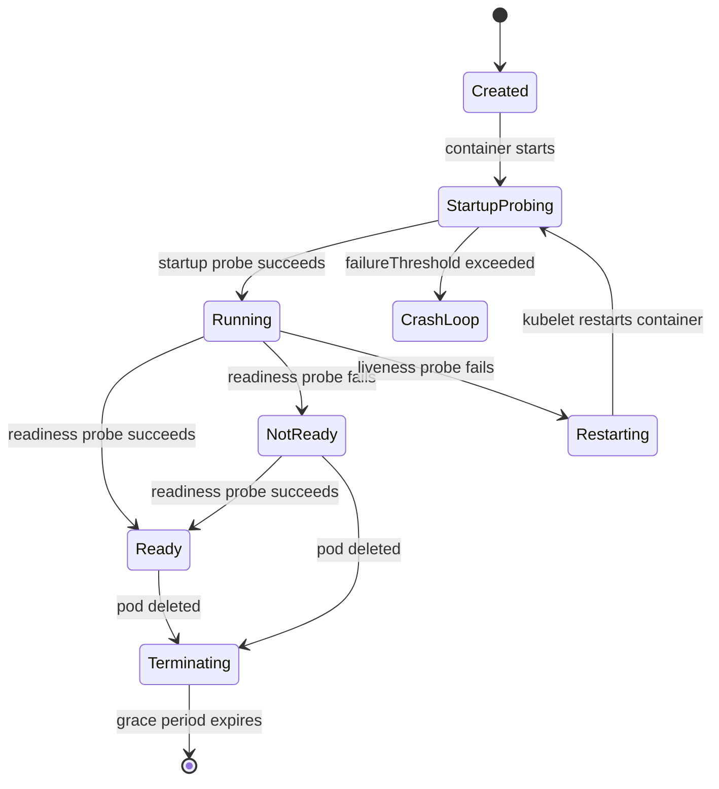
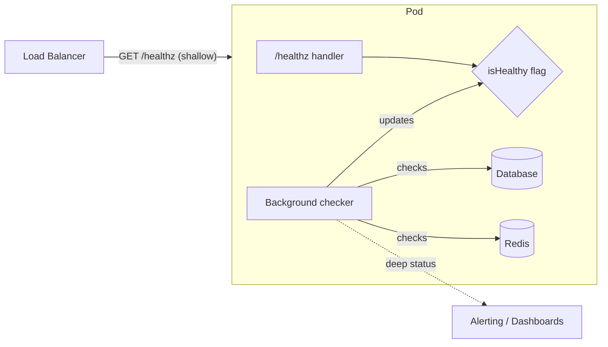
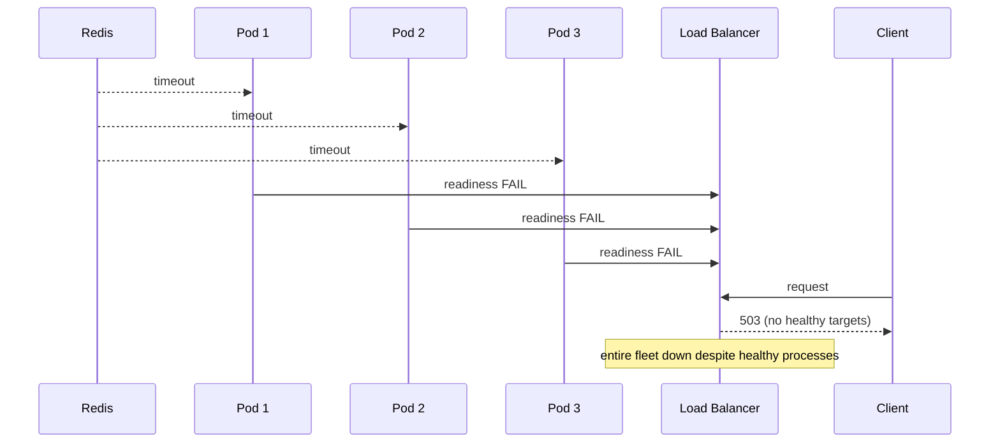
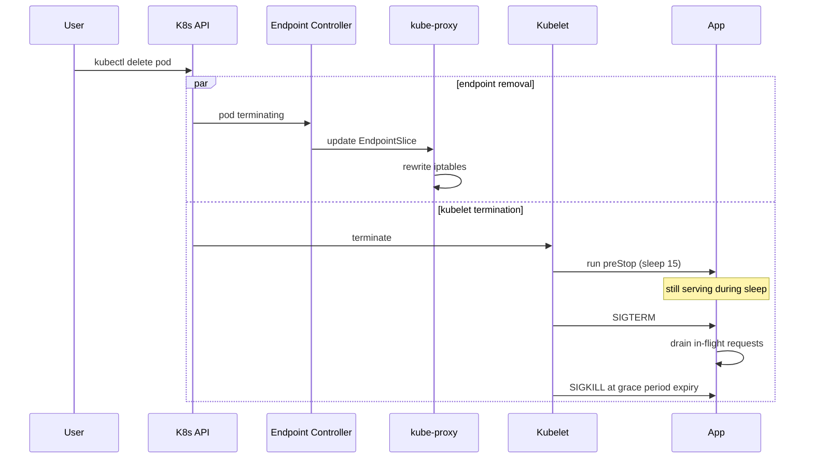

# Health Checks and Readiness: Telling the Truth About Whether You're Up

> **TL;DR**: A health check answers one question: "should this instance receive traffic right now?" Get it wrong and you cause more outages than you prevent. A server that returns blank error pages in 2 ms while peers take 200 ms to render real responses will attract a disproportionate share of traffic from latency-aware load balancers, becoming a black hole that amplifies its own failure[^1]. The fix is three separate signals: liveness (restart me if I am deadlocked), readiness (drain me if I cannot serve), and startup (give me time to boot). Keep external load balancer checks shallow. Run deep dependency checks locally and feed them to alerting, not routing.

## Learning Objectives

After this module, you will be able to:

- [ ] Distinguish liveness, readiness, and startup probes and use each correctly
- [ ] Design health checks that reflect real serving capability
- [ ] Avoid the deep-check cascading-failure trap
- [ ] Handle slow-starting services with startup probes
- [ ] Integrate health checks with load balancers, service mesh, and orchestrators

## Intuition

You are a restaurant host. Three questions run through your head every few seconds:

1. **Is the kitchen alive?** If the stove is off and the chef is unconscious, close the restaurant and call 911 (restart). This is liveness.
2. **Can we seat more guests right now?** Maybe the kitchen is alive but every burner is occupied. You stop seating new tables until a burner frees up. The kitchen does not need to restart; it just needs a breather. This is readiness.
3. **Is the kitchen still warming up?** The restaurant just opened. The oven takes 20 minutes to reach temperature. You would not declare the kitchen dead just because it cannot serve a souffle at 7:01 AM. You wait. This is the startup probe.

Now imagine the host checks readiness by calling the fish supplier every 10 seconds: "Do you have salmon?" If the supplier's phone line goes down for 30 seconds, the host declares every table in the restaurant unservable and turns away all guests, even though the kitchen has plenty of chicken, beef, and pasta. That is the cascading-failure trap of deep health checks at the load balancer.

The rest of this chapter makes these three signals precise, shows how to wire them to Kubernetes and load balancers, and teaches you the one rule that prevents fleet-wide outages: keep external checks shallow, run deep checks locally.

## Theory

### The three Kubernetes probe types

Kubernetes defines three probes that the kubelet runs against each container. Each triggers a different action on failure[^2]:

- **Startup probe.** Runs only during initialization. Gates liveness and readiness until it succeeds. If it exceeds `failureThreshold`, the kubelet kills and restarts the container. Use it for JVMs, Python model-loading, or any container that boots slower than your liveness budget.
- **Liveness probe.** Runs periodically over the container's lifetime. On failure, the kubelet kills and restarts the container. The Kubernetes docs warn explicitly: "liveness probes must be configured carefully to ensure that they truly indicate unrecoverable application failure, for example a deadlock."[^2]
- **Readiness probe.** Runs periodically. On failure, the EndpointSlice controller removes the pod's IP from all Services that select it. The container is not restarted. Readiness is reversible: the pod rejoins the pool when the probe succeeds again.

Four check mechanisms are available: `httpGet` (2xx-3xx is success), `tcpSocket` (connection opens), `exec` (exit 0), and `grpc` (stable since Kubernetes 1.27, checks `grpc.health.v1.Health/Check`)[^2].

Configuration fields and their defaults: `initialDelaySeconds` (0), `periodSeconds` (10, min 1), `timeoutSeconds` (1), `successThreshold` (1, must be 1 for liveness/startup), `failureThreshold` (3).

**Mean time to detection (MTTD)** = `periodSeconds` x `failureThreshold`. With defaults, that is 30 seconds before any action fires. Shorter periods detect faster but add probe load across the fleet.



*Startup gates liveness and readiness during boot; once it succeeds, readiness controls traffic routing and liveness controls restart.*

### Shallow vs deep health checks

A shallow check verifies the process is running: TCP accept, HTTP 200 from a trivial handler. A deep check verifies the process can do useful work: reach the database, decrypt a secret, write to disk.

The AWS Builders' Library separates three layers[^1]:

1. **Liveness checks** - TCP accept, basic HTTP response.
2. **Local health checks** - disk writable, critical threads alive, no decryption failures.
3. **Dependency health checks** - can reach DB, cache, peer services.

The guidance is explicit: "teams at Amazon tend to restrict their fast-acting load balancer health checks to local health checks and rely on centralized systems to carefully react to deeper dependency health checks."[^1]

Why? Because a dependency check at the load balancer turns that dependency into a hard dependency. If every instance checks Redis on every probe, a 30-second Redis blip removes every instance simultaneously. The load balancer sees zero healthy targets and returns 503 to every client, even though every application process is perfectly capable of serving cached data or degraded responses.



*The LB calls a shallow endpoint that never touches shared dependencies; deep checks run in a background thread and feed alerting, not routing decisions.*

The recommended pattern: deep locally for dashboards and alerting; shallow at the external load balancer. If deep must be at the LB, use a fail-open load balancer. AWS ALB fails open by design: "if a target group contains only unhealthy registered targets, the load balancer routes requests to all those targets, regardless of their health status."[^3]



*A 30-second Redis blip makes every instance fail readiness simultaneously; without fail-open, the endpoint list empties and clients get 503.*

### Startup probes and slow-starting services

Classic offenders: JVM applications that JIT-warm for 30 to 90 seconds, .NET tiered JIT, Python apps loading large ML models, services that prewarm a local cache.

Without a startup probe, liveness with `initialDelaySeconds: 10, periodSeconds: 10, failureThreshold: 3` kills the pod at ~40 seconds. A JVM that needs 60 seconds enters CrashLoopBackOff and never starts.

The fix: a startup probe with a generous budget that gates liveness:

```yaml
startupProbe:
  httpGet:
    path: /healthz
    port: 8080
  failureThreshold: 30
  periodSeconds: 10       # up to 5 min to start
livenessProbe:
  httpGet:
    path: /healthz
    port: 8080
  periodSeconds: 5
  failureThreshold: 3     # aggressive once running
```

The Kubernetes docs prescribe this formula: "if your container usually starts in more than `initialDelaySeconds + failureThreshold * periodSeconds`, you should specify a startup probe."[^2] While the startup probe runs, liveness and readiness are suspended. The JVM gets its full warmup window, and once startup succeeds, liveness can stay tight.

### Graceful shutdown and connection draining

When Kubernetes deletes a pod, two events fire in parallel[^4]:

1. The endpoint is removed from EndpointSlices (propagates through kube-proxy, Ingress, CoreDNS, mesh).
2. The kubelet sends SIGTERM to the container.

The race condition: if SIGTERM arrives before endpoint removal propagates, the pod stops accepting connections while kube-proxy still routes traffic to it. Clients get TCP RST errors during rolling updates.

The industry-standard fix is a `preStop` hook:

```yaml
lifecycle:
  preStop:
    exec:
      command: ["sleep", "15"]
```

The 15-second sleep spans the propagation race. Only after `preStop` finishes does the kubelet deliver SIGTERM. The app then stops accepting new connections and drains in-flight requests. After `terminationGracePeriodSeconds` (default 30), the kubelet sends SIGKILL.



*The preStop sleep lets endpoint removal propagate to kube-proxy, Ingress, and the service mesh before SIGTERM reaches the app. SIGKILL is the last-resort floor at the grace period expiry (default 30 s).*

At the load balancer boundary, AWS ALB has a `deregistration_delay.timeout_seconds` default of 300 seconds[^5]. During this window, ALB stops sending new requests but waits for open connections to drain. For fast blue-green rollouts, reduce this to 30-60 seconds.

Google's internal RPC system formalizes this as a **lame duck** state: "the backend task is listening on its port and can serve, but is explicitly asking clients to stop sending requests."[^6] SIGTERM transitions the task to lame duck; inactive clients discover the state via periodic UDP health checks in 1-2 RTT. The drain window is 10-150 seconds depending on request duration.

### Load balancer and service mesh integration

**AWS ALB/NLB.** ALB target group health checks run at `HealthCheckIntervalSeconds` (default 30 s, range 5-300), with `UnhealthyThresholdCount` (default 2) and `HealthyThresholdCount` (default 5)[^3]. NLB fails open when all targets in an Availability Zone are unhealthy.

**Envoy active + passive.** Envoy splits health checking into two mechanisms. Active probes (HTTP, gRPC, TCP) run at a configured interval. Passive outlier detection watches real traffic: after 5 consecutive 5xx responses, the host is ejected for a base 30-second window that grows with each re-ejection, capped at `max_ejection_percent` (default 10% of the cluster). This prevents a single bad host from cascading while limiting blast radius.

**Istio sidecar complications.** When strict mTLS is enabled, the kubelet has no Istio-issued certificate, so HTTP probes fail. Istio rewrites probes to route through the sidecar's pilot-agent on port 15020. TCP probes become tautological because the sidecar intercepts all TCP. The startup race is another trap: the app container can start before Envoy receives its config from the control plane. The fix is `holdApplicationUntilProxyStarts: true` in the ProxyConfig (part of mesh configuration).

**Consul.** Supports HTTP (2xx is passing, 429 is warning, else critical), TCP, gRPC, UDP, TTL (passive, service pushes status), Docker, and script checks. The TTL pattern is useful when the service itself knows best whether it is healthy.

## Real-World Example

### Google's lame-duck pattern at datacenter scale

Google's internal load balancing system, described in the SRE book Chapter 20, manages services ranging from a few to over 10,000 backend tasks, with 100 to 1,000 being typical[^6]. Health is not binary. Each backend reports three states: Healthy, Refusing connections, and Lame duck.

The key insight: backends embed utilization data (CPU, QPS, error rate) in every RPC response, including health-check responses. Clients use these signals for Weighted Round Robin, not just up/down routing. A backend at 90% CPU gets fewer requests than one at 30%, without any central coordinator.

When a backend receives SIGTERM, it transitions to lame duck. It keeps serving in-flight requests but tells clients to stop sending new ones. Inactive clients discover lame-duck status via periodic UDP health checks in 1-2 RTT[^6]. The drain window is 10-150 seconds depending on the longest expected request.

A critical anti-pattern Google avoids: counting errors as "fast responses." A backend returning errors in 1 ms would attract more load from a latency-aware balancer, becoming a sinkhole. Google's system counts errors as active requests, preventing this amplification loop[^6].

This architecture embodies the chapter's core principle: health is not a boolean. It is a spectrum (healthy, degraded, draining, dead), and the action taken (route less, stop routing, restart) must match the signal's meaning.

## Trade-offs

The substitutable decision is *what depth the external load balancer check has, and where the deep checks live*. The anti-pattern rows that used to appear here ("deep only" and "no health check") are covered by the Common Pitfalls below, which is where anti-patterns belong.

| Approach | Pros | Cons | Best when | Our Pick |
|---|---|---|---|---|
| Shallow only at the LB | Simple, no correlated-failure cascade risk | Misses broken internal state (stuck thread pool, full disk, wedged background worker) | External LB fronting data-plane services where fast reaction matters more than dependency awareness | Default for fast-acting LB checks[^1] |
| Split: shallow at LB, deep locally | Catches both classes of failure; decouples blast radius so a dependency blip removes an instance locally without correlating across the fleet | Two code paths, more config | Production services at scale | **The AWS-recommended default**[^1] |
| Deep at LB with fail-open | Safety net when every instance reports unhealthy: rather than removing the whole fleet, the LB sends traffic to all targets | Fail-open is hard to test; only AWS NLB and ALB support it natively[^1] | Only where fail-open is proven (ALB, NLB) | Acceptable fallback when the LB supports it |

## Common Pitfalls

> [!WARNING]
> **Liveness probe that hits the database.** A transient DB blip triggers liveness failure on every pod. The kubelet kills and restarts each one, producing a thundering herd of new connections when the DB recovers. Liveness should check only local state: can the HTTP server respond? Put dependency checks in readiness or background alerting.

> [!WARNING]
> **Aggressive liveness with no startup probe.** A JVM boots in 60 seconds. Liveness has `failureThreshold: 3, periodSeconds: 10`. The kubelet kills the pod at 30 seconds. Pod enters CrashLoopBackOff and never starts. Add a startup probe with `failureThreshold: 30, periodSeconds: 10` to give 5 minutes of boot budget.

> [!WARNING]
> **Tautological health endpoint.** `app.get('/health', (_, res) => res.send('OK'))` without reflecting real state. Broken instances stay in rotation. Maintain an `isHealthy` flag updated by a background thread that checks local state (pool alive, last request succeeded). The Builders' Library calls this the "background thread with flag" pattern[^1].

> [!WARNING]
> **Readiness checking a shared dependency across every instance.** A shared Redis has a 30-second blip. Every instance's readiness fails in lockstep. The Service's EndpointSlice empties. Without fail-open, the LB routes to nothing. Keep shared-dependency checks out of the data-plane readiness path.

> [!WARNING]
> **Missing preStop hook drops in-flight requests.** Rolling deploy sends SIGTERM; app exits immediately; kube-proxy has not yet removed the pod from iptables; clients get TCP RST. Add `preStop: sleep 15` and trap SIGTERM in the app to drain gracefully[^4].

## Exercise

Design health checks for a service that depends on PostgreSQL, Redis, and a third-party payment API. Specify liveness, readiness, and startup probes. Decide what each one checks, threshold counts, and how you avoid a Redis blip from taking every instance out of rotation.

<details>
<summary>Hint</summary>

Think about which dependencies are local vs shared. The payment API is external and unreliable. Redis is shared across all instances. PostgreSQL is the source of truth. Which of these should a liveness probe touch? Which should a readiness probe touch? What happens if you put the payment API in readiness?

</details>

<details>
<summary>Solution</summary>

**Startup probe:** `httpGet /healthz`, `failureThreshold: 30`, `periodSeconds: 10`. Gives 5 minutes for connection pool warmup and schema migration checks.

**Liveness probe:** `httpGet /healthz`, `periodSeconds: 5`, `failureThreshold: 3`. The `/healthz` handler checks only: (1) can the HTTP server allocate a response buffer, (2) is the main event loop responsive (not deadlocked). It touches zero external dependencies.

**Readiness probe:** `httpGet /ready`, `periodSeconds: 5`, `failureThreshold: 1`, `successThreshold: 1`. The `/ready` handler checks an `isReady` flag maintained by a background goroutine. That goroutine pings PostgreSQL every 10 seconds and updates the flag. It does NOT check Redis or the payment API.

**Why not Redis in readiness?** Redis is shared across all instances. A 30-second blip would flip every pod to NotReady simultaneously, emptying the endpoint list. Instead, Redis health feeds a Prometheus metric and a [Graceful Degradation](./03-graceful-degradation.md) circuit breaker: the app serves degraded responses (cache miss fallback to DB) rather than declaring itself unready.

**Why not the payment API anywhere?** It is a third-party dependency with its own SLA. Its availability should not determine your service's availability. Monitor it via alerting. Use [Resilience Patterns](./02-resilience-patterns.md) (circuit breaker, timeout) to handle its failures gracefully.

**Graceful shutdown:** `preStop: sleep 15`, `terminationGracePeriodSeconds: 45`. The app traps SIGTERM, stops accepting new connections, and drains in-flight requests for up to 30 seconds.

</details>

## Key Takeaways

- Liveness restarts; readiness drains traffic; startup protects slow boots. Confusing them causes outages.
- Deep checks at the load balancer turn every dependency into a hard dependency. Keep external checks shallow.
- MTTD = `periodSeconds` x `failureThreshold`. With Kubernetes defaults (10 x 3), detection takes 30 seconds.
- A readiness probe that checks a shared dependency will flap the entire fleet in lockstep.
- Graceful shutdown requires a `preStop` sleep to span the endpoint-propagation race, plus SIGTERM trapping in the app.
- Health is not binary. Google's lame-duck pattern shows that "draining" is a distinct state between "healthy" and "dead."
- Bad health checks cause more outages than the bugs they detect. Audit them as carefully as you audit application code.

## Further Reading

- [Implementing health checks](https://aws.amazon.com/builders-library/implementing-health-checks/) - David Yanacek, AWS Builders' Library. The canonical reference on shallow vs deep checks and the background-thread-with-flag pattern.
- [Liveness, Readiness, and Startup Probes](https://kubernetes.io/docs/concepts/configuration/liveness-readiness-startup-probes/) - Kubernetes official docs; authoritative semantics, defaults, and warnings about cascading failures.
- [SRE book Chapter 20: Load Balancing in the Datacenter](https://sre.google/sre-book/load-balancing-datacenter/) - Google's lame-duck pattern, weighted round-robin, and the sinkhole anti-pattern.
- [Graceful shutdown in Kubernetes](https://learnk8s.io/graceful-shutdown) - Learnk8s deep dive on the endpoint-propagation race and preStop hook patterns.
- [Envoy Outlier Detection](https://www.envoyproxy.io/docs/envoy/latest/intro/arch_overview/upstream/outlier) - Passive health checking via traffic observation; ejection algorithm and tuning knobs.
- [Details of the Cloudflare outage on July 2, 2019](https://blog.cloudflare.com/details-of-the-cloudflare-outage-on-july-2-2019/) - Canonical "global push caused global outage" post-mortem; 80% traffic drop in 27 minutes from a single WAF regex.
- [Health Checking of Istio Services](https://istio.io/latest/docs/ops/configuration/mesh/app-health-check/) - Probe rewriting, mTLS exemption, and `holdApplicationUntilProxyStarts`.
- [gRPC Health Checking Protocol](https://github.com/grpc/grpc/blob/master/doc/health-checking.md) - The minimal `Check`/`Watch` protocol spec for service-level health signals.

## Flashcards

**Q:** What action does a failed liveness probe trigger in Kubernetes?
**A:** The kubelet kills and restarts the container. Liveness failures indicate unrecoverable state (deadlock, hang), not transient load.

**Q:** What action does a failed readiness probe trigger?
**A:** The EndpointSlice controller removes the pod's IP from all Services. Traffic stops flowing, but the container is not restarted. Readiness is reversible.

**Q:** Why should you never put a database check in a liveness probe?
**A:** A transient DB blip would trigger liveness failure on every pod simultaneously. The kubelet restarts them all, causing a thundering herd of new connections. DB checks belong in readiness or background alerting.

**Q:** What is the formula for mean time to detection (MTTD) with Kubernetes probes?
**A:** MTTD = `periodSeconds` x `failureThreshold`. With defaults (10 x 3), detection takes approximately 30 seconds.

**Q:** What is the AWS-recommended split for health check depth?
**A:** Shallow checks at the external load balancer (never touches shared dependencies). Deep checks run locally in a background thread and feed alerting/dashboards, not LB routing decisions.

**Q:** What problem does a startup probe solve?
**A:** It protects slow-starting containers (JVM warmup, model loading) from being killed by liveness probes before they finish initializing. While the startup probe runs, liveness and readiness are suspended.

**Q:** What is the purpose of a preStop hook with `sleep 15`?
**A:** It spans the race between endpoint removal propagating through kube-proxy/Ingress/mesh and SIGTERM being delivered. Without it, the pod may stop serving before it is removed from the LB's target set, causing connection resets.

**Q:** What does "fail-open" mean for a load balancer health check?
**A:** When all targets report unhealthy, the LB routes to all of them anyway rather than returning 503. AWS ALB does this by default. It prevents a shared-dependency blip from taking the entire service offline.

**Q:** What is Google's "lame duck" state?
**A:** A backend that is still listening and can serve, but explicitly asks clients to stop sending new requests. It drains in-flight work for 10-150 seconds before shutting down. Clients discover lame-duck status via periodic UDP health checks in 1-2 RTT.

**Q:** Why are TCP socket probes unreliable when Istio sidecars are injected?
**A:** Istio intercepts all TCP traffic through the sidecar. Any `tcpSocket` probe succeeds as long as the sidecar is running, regardless of whether the application is actually listening. Istio rewrites probes to route through the pilot-agent for accurate results.

## References

[^1]: David Yanacek, "Implementing health checks", AWS Builders' Library. https://aws.amazon.com/builders-library/implementing-health-checks
[^2]: "Liveness, Readiness, and Startup Probes", Kubernetes documentation (v1.36). https://kubernetes.io/docs/concepts/configuration/liveness-readiness-startup-probes/
[^3]: "Health checks for Application Load Balancer target groups", AWS documentation. https://docs.aws.amazon.com/elasticloadbalancing/latest/application/target-group-health-checks.html
[^4]: Daniele Polencic, "Graceful shutdown in Kubernetes", Learnk8s, April 2024. https://learnk8s.io/graceful-shutdown
[^5]: "Edit target group attributes for your Application Load Balancer: deregistration delay", AWS documentation. https://docs.aws.amazon.com/elasticloadbalancing/latest/application/edit-target-group-attributes.html
[^6]: Alejandro Forero Cuervo, "Load Balancing in the Datacenter", Google SRE Book, Chapter 20. https://sre.google/sre-book/load-balancing-datacenter/
