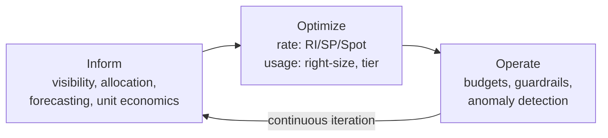
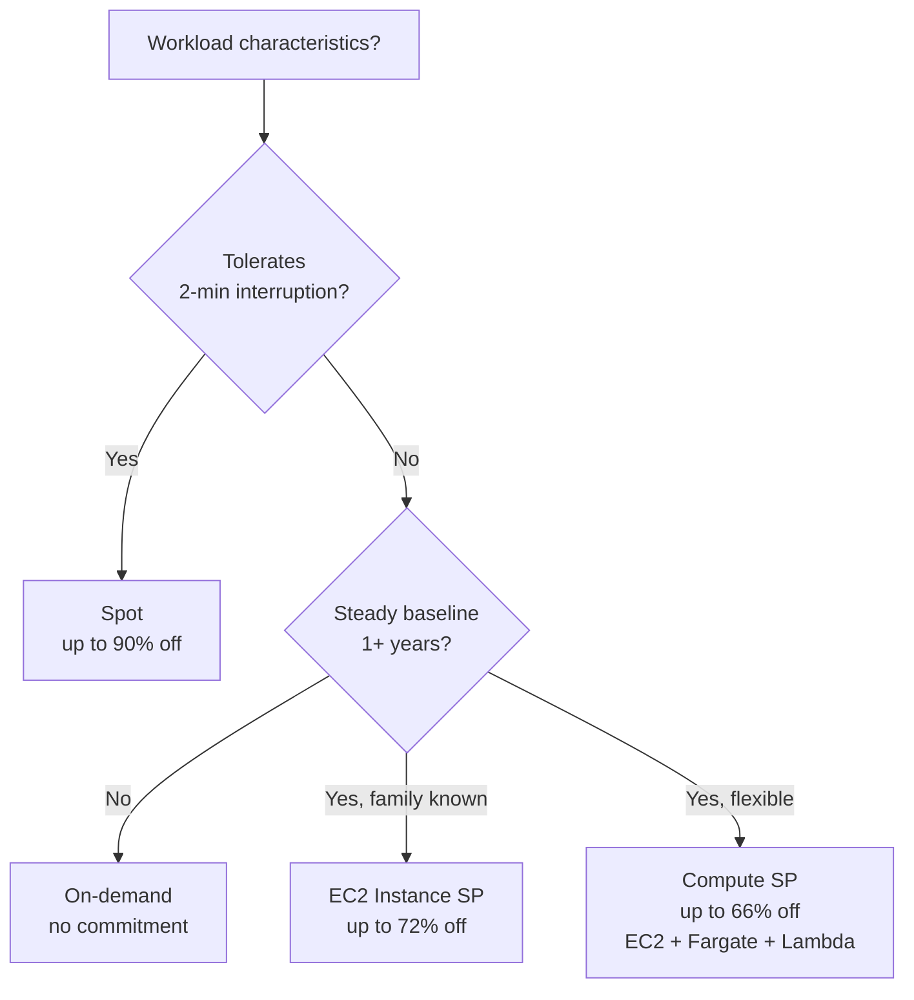
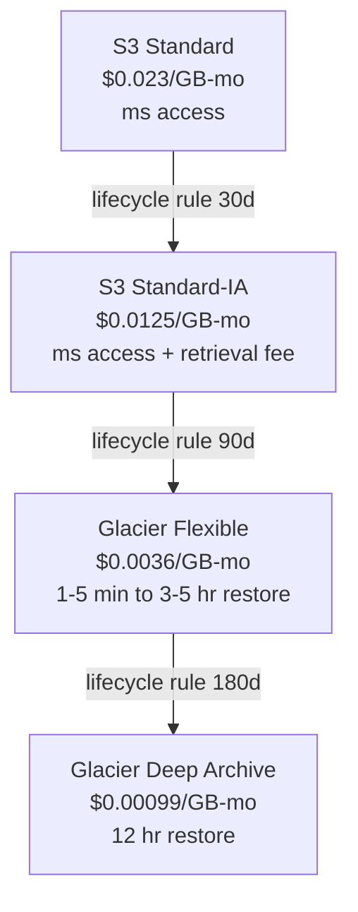
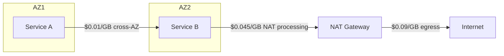

# Cost Optimization and FinOps

> **TL;DR**: Cloud pricing is deliberately multi-dimensional: AWS alone has 750+ instance types, four purchase models, and a separate charge for every byte that crosses an AZ boundary ($0.01/GB each way) or leaves a region ($0.09/GB)[^1]. FinOps is the operating model that turns this complexity into a managed KPI. The discipline iterates through three phases (Inform, Optimize, Operate)[^2] and the single most impactful cultural shift is making cost visible per team and per business transaction. Engineers who see their cost will optimize it. Engineers who do not, will not.

## Learning Objectives

After this module, you will be able to:

- [ ] Calculate unit economics (cost per user, cost per transaction) for a service
- [ ] Apply the three major discount levers: Spot, Reserved Instances, Savings Plans
- [ ] Design an autoscaling policy that respects both cost and reliability
- [ ] Implement storage tiering across hot, warm, and cold tiers with measurable SLOs
- [ ] Identify and eliminate the five most common cost anti-patterns (zombie resources, cross-AZ chattiness, untagged spend, over-provisioned databases, under-diversified Spot)

## Intuition

You run a restaurant. Every night you order ingredients for tomorrow. Order too much and food rots in the walk-in (over-provisioning). Order too little and you turn away diners (throttling). The smart chef tracks covers-per-night, knows Fridays spike 2x, pre-orders the Friday surplus on Wednesday (commitment discount), and buys day-of specials from the farmers' market at 70% off because the farmer would rather sell cheap than throw away (Spot pricing).

But the chef cannot optimize what she cannot see. If the sous chef orders truffle oil on the restaurant's card without telling anyone, the monthly P&L shows a mysterious spike under "miscellaneous." The fix is not a fancier ordering system. The fix is tagging every purchase to a dish, computing cost-per-plate, and publishing it on the kitchen whiteboard. Once the team sees that the truffle risotto costs $14/plate to make and sells for $16, they either raise the price or kill the dish.

Cloud cost works the same way. Your "ingredients" are compute hours, storage bytes, and network transfers. Your "dishes" are user-facing features. Your "whiteboard" is the cost-allocation dashboard. And your "farmers' market specials" are Spot instances that can vanish with 2 minutes' notice. The rest of this chapter makes each lever precise, quantifies the savings, and shows where each one breaks.

## Theory

### The FinOps lifecycle

The FinOps Foundation defines the discipline as maximizing business value from technology through data-driven collaboration between engineering, finance, and business teams[^3]. The 2024 framework revision broadened scope from "cloud" to any consumption-based technology (public cloud, SaaS, data center, AI services) and formalized three iterative phases[^2][^4]:

*The FinOps Foundation's Inform-Optimize-Operate cycle; teams iterate continuously rather than running one-off cost projects.*

**Inform** means visibility and allocation. Every resource is tagged on creation (team, service, environment, cost-center). Tags flow into billing exports. The FOCUS specification (v1.3 ratified December 2025, building on v1.0 from November 2023) normalizes billing data across AWS, Azure, and GCP so that "what did this service cost last month" is a portable query, not a vendor-specific forensic exercise[^5]. Showback publishes per-team bills; chargeback actually invoices them internally. Showback is usually enough to change behavior.

**Optimize** means pulling rate levers (commitments, Spot) and usage levers (right-sizing, tiering, deleting waste). This is where the engineering work lives.

**Operate** means continuous governance: budgets, anomaly alerts, automation that enforces tagging, and periodic reviews of commitment utilization.

### Unit economics: the metric that matters

Raw cloud spend is meaningless without a denominator. When Airbnb began tracking cost-per-night-booked and Lyft tracked cost-per-ride, optimization stopped being a periodic project and became a shipped metric[^6][^7]. That shift, from project to KPI, is what "doing FinOps" means in practice.

Define your unit metric early:

- **SaaS**: cost per active user per month
- **Marketplace**: cost per transaction (booking, ride, order)
- **API product**: cost per 1,000 API calls
- **ML platform**: cost per inference

Track it alongside latency and error rate. When cost-per-unit trends up without a corresponding feature launch, something is wrong.

### The discount levers

Cloud providers offer three commitment-based pricing models that trade flexibility for discount:

*Pick the purchase model based on workload shape: flexibility vs commitment vs interruption tolerance.*

**Spot instances** use spare EC2 capacity at up to 90% off on-demand pricing. The catch: AWS can reclaim them with a 2-minute warning[^8]. Spot is safe for batch jobs, ML training, CI/CD fleets, and stateless Kafka consumers. Lyft Level 5 ran 77% of its autonomous-vehicle compute fleet on Spot[^9]. The key engineering requirement is diversification across 5+ instance types in 3+ AZs, plus a graceful-drain handler on the SIGTERM signal.

**Reserved Instances** commit to a specific instance family in a region for 1 or 3 years at up to 72% off[^10]. They are inflexible: migrate to Graviton mid-term and you pay for capacity you do not use.

**Compute Savings Plans** commit to a dollars-per-hour spend for 1 or 3 years at up to 66% off. They apply automatically across EC2, Fargate, and Lambda in any region and any instance family[^10]. This flexibility makes them the default recommendation for mature workloads. Industry surveys suggest median commitment coverage remains well below the recommended target of 80 to 85%, leaving significant money on the table[^11].

### Right-sizing, Karpenter, and Graviton

[Auto-Scaling and Capacity Planning](../part-6-reliability-and-operations/04-auto-scaling-capacity.md) introduced HPA, VPA, and Cluster Autoscaler. Cost optimization adds a tighter loop: Karpenter watches unschedulable pods, provisions the cheapest instance type that fits, and continuously consolidates. When 20 pods shrink to 10, Karpenter drains a node and reschedules pods onto remaining nodes. Organizations report significant node-cost reductions through consolidation, commonly in the range of 20 to 60%[^12][^13].

**Graviton** (AWS ARM-based silicon) delivers 20 to 40% better price-performance than equivalent x86 instances[^14]. Pinterest migrated 25%+ of compute to Graviton by mid-2024, achieving 47% workload cost reduction and 38% compute resource reduction on their central API fleet[^15]. The migration requires recompiling native dependencies (most JVM, Python, and Go workloads run unmodified).

**Right-sizing** means matching resource requests to actual usage. Duolingo discovered services running comfortably at 90 to 95% of allocated memory, meaning they had been paying for headroom they never used[^16]. VPA automates this, but manual quarterly reviews remain common.

### Storage tiering

S3 storage classes span a 23x price range per GB-month:

*S3 storage classes span a 23x price range; access latency and retrieval fees grow with cheapness.*

S3 Intelligent-Tiering moves objects between hot, warm, and cold tiers automatically based on access patterns, saving up to 95% for cold data with no retrieval charges[^17]. The trade-off: a small per-object monitoring fee that dominates cost for very small objects.

For databases, DynamoDB on-demand mode charges per request (~$0.125/M strongly consistent reads, ~$0.0625/M eventually consistent, ~$0.625/M writes in us-east-1) while provisioned mode with reserved capacity is up to 77% cheaper for steady workloads above ~40% utilization[^18]. Aurora I/O-Optimized is cheaper than Aurora Standard above ~25% I/O spend share, which saved Duolingo "several hundred thousand dollars a year" on a single database[^16].

For block storage, EBS gp3 delivers 3,000 IOPS and 125 MB/s baseline at 20% lower cost than gp2, with no performance penalty for most workloads.

### Network cost: the sneaky line item

Egress hides in Cost Explorer as "EC2-Other," which Corey Quinn calls the single most common $50K to $500K cost-surprise category[^19]. The charge surfaces:

| Transfer type | Cost | Mitigation |
|---|---|---|
| Cross-AZ (same region) | $0.01/GB each direction | AZ-affinity routing, co-locate chatty services |
| Internet egress (first 10 TB) | $0.09/GB | CDN (CloudFront at $0.085/GB with caching) |
| NAT Gateway processing | $0.045/GB | VPC endpoints for S3/DynamoDB |
| Inter-region replication | $0.02/GB (varies by pair) | Compress before replicating, reduce frequency |

Duolingo uncovered a legacy service making 2.1 billion unnecessary cross-service API calls per day[^16]. At $0.01/GB each way, even small payloads compound fast.

*Where every byte costs money: cross-AZ at $0.01/GB each way, NAT processing at $0.045/GB, and internet egress at $0.09/GB are the charge surfaces that stack on a single outbound request [^1][^19].*

**Zero-egress providers** like Cloudflare R2 charge $0 for egress, offering 99% savings on egress-heavy workloads ($1,500/month for 100 TB vs $4,600+ on S3 when egress is included)[^20]. The trade-off: fewer ecosystem integrations and compliance certifications than S3.

Netflix solved egress at extreme scale with Open Connect: thousands of custom caching appliances embedded free inside ISP networks across 1,000+ locations, serving 100% of Netflix video traffic at tens of Tbps with effectively zero transit cost[^21].

## Real-World Example

### Duolingo: 20% cloud spend reduction in months

In 2024, Duolingo's infrastructure team achieved an annualized 20% reduction in cloud spend, saving "millions of dollars a year"[^16]. The approach was methodical, not heroic:

**Phase 1 (Inform):** They deployed CloudZero for per-line-item breakdown, extended coverage to non-AWS spend (OpenAI API costs), integrated cloud cost into their existing metrics ecosystem, and sent weekly cost reports to engineering teams.

**Phase 2 (Optimize):** Three workstreams ran in parallel:

1. **Delete unused resources** - ancient ElastiCache clusters, entire databases, and a full microservice whose owners had forgotten the price of their tech debt.
2. **Reduce paid-for data** - disabled unnecessary S3 versioning backups, added DynamoDB TTLs to expire stale records, and reduced verbose CloudWatch log retention.
3. **Right-size and tune** - lowered memory allocations to fit 90 to 95% actual usage, reduced ECS task counts, and extended ETag cache TTLs from 1 minute to 1 hour (cutting downstream service traffic by more than 60%).

**Phase 3 (Operate):** They purchased Reserved Instances for baseline EC2, RDS, and ElastiCache compute that could not run on Spot, and switched a high-I/O database to Aurora I/O-Optimized.

The key insight: making cloud cost an engineering-visible metric alongside latency and error rate changed behavior without mandates.

## Trade-offs

| Lever | Savings | Risk | Best when | Our Pick |
|---|---|---|---|---|
| Spot/preemptible | Up to 90% | 2-min reclaim notice | Batch, stateless, checkpointable | Default for all fault-tolerant workloads |
| Compute Savings Plans | Up to 66% | 1-3 year commit | Mature, flexible workloads | Default commitment vehicle (prefer over RIs) |
| Reserved Instances | Up to 72% | Family lock, inflexible | Known instance family, steady baseline | Only when family is locked for 3+ years |
| Autoscaling + Karpenter | 20-60% | Latency spikes, pod churn | Variable load, stateless pods | Always-on with consolidation enabled |
| Storage tiering | Up to 95% for cold | Retrieval latency (min to hours) | Compliance archives, backups, logs | Intelligent-Tiering for uncertain access patterns |
| Graviton migration | 20-50% | Native lib recompilation | API serving, JVM, Python, Go | Default instance family for new workloads |
| Egress avoidance (R2, CDN, VPC endpoints) | Varies, up to 99% | Ecosystem gaps | Chatty services, egress-heavy storage | VPC endpoints always; R2 for non-regulated egress |

## Common Pitfalls

> [!WARNING]
> **Zombie resources.** Old ElastiCache clusters, unattached EBS volumes, and staging environments nobody remembers scaling up still incur full hourly cost. Enforce mandatory tags at the IaC layer (OPA, cloud-custodian) and run periodic cleanup audits. Duolingo found entire microservices whose owners had left the company[^16].

> [!WARNING]
> **Cross-AZ chattiness.** Default service discovery picks any healthy instance regardless of AZ. A 10 Gbps cross-AZ flow at peak costs ~$2,600/hour. Use AZ-affinity routing in your service mesh and co-locate chatty service pairs.

> [!WARNING]
> **Untagged spend.** If 20 to 40% of spend cannot be attributed to a team, optimization is guessing. Block resource creation without mandatory tags via Service Control Policies. Target 95%+ tag coverage within 7 days of resource creation.

> [!WARNING]
> **Commitment under-utilization.** Buying a 3-year EC2 Instance Savings Plan for m5.4xlarge then migrating to Graviton 6 months later means paying for capacity you do not use. Default to Compute Savings Plans (flexible across family, region, Fargate, Lambda) and ladder commitments so 1/12 expires each month.

> [!WARNING]
> **When NOT to optimize cost first.** Do not optimize cost on reliability-critical paths (payment processing, auth), early-stage startups still searching for product-market fit, or non-repeating one-off workloads. The engineer-hours spent optimizing a $200/month service are worth more than the savings.

## Exercise

Your service costs $50K/month at 1M DAU, linearly $50/1M-DAU. Leadership wants the same reliability at $30K/month next quarter. Walk through the optimization plan: what you would measure first, which three levers you would pull in order, what you would not touch (and why), and the metric you would report to leadership to prove the reliability SLO held. Include the engineer-hours estimate for each change.

Hint

Start with visibility (what is the spend breakdown by service, by resource type?). The highest-ROI lever is usually commitment coverage because it requires zero architectural change. Then look for zombie resources. Only then consider architectural moves like Spot or tiering.

Solution

**Step 1: Measure (Week 1, ~20 engineer-hours).** Deploy cost-allocation tagging. Break the $50K into compute, storage, network, and database. Identify the top 3 cost centers. Compute the current commitment coverage percentage.

**Step 2: Commitment coverage (Week 2, ~10 engineer-hours).** If coverage is below 80%, purchase Compute Savings Plans to cover the steady baseline. At 66% discount on the covered portion, covering 60% of a $30K compute bill saves ~$12K/month. This is the boring, high-impact first move.

**Step 3: Delete and right-size (Weeks 3-4, ~40 engineer-hours).** Audit for zombie resources (CPU < 5% for 14 days). Right-size over-provisioned RDS instances by stepping down one class with load tests. Typical savings: 10 to 20% of remaining spend.

**Step 4: Do not touch.** Do not move the payment service to Spot (reliability-critical). Do not re-architect the data model for DynamoDB on-demand vs provisioned without 4 weeks of traffic data. Do not optimize the $200/month staging environment.

**Proof of SLO:** Report the same p99 latency, error rate, and availability percentage before and after each change. Publish a weekly dashboard showing cost-per-DAU trending from $0.05 to $0.03 while SLI metrics hold flat.

**Total: ~70 engineer-hours across 4 weeks for a projected $20K/month savings ($240K/year).** The ROI is clear, but only if you measure first.

## Key Takeaways

- You cannot optimize what you cannot see. Tagging and cost allocation come before any other move.
- Unit economics (cost per user, cost per transaction) is the metric that turns cost from a finance problem into an engineering KPI.
- Compute Savings Plans are the boring, high-impact first move: up to 66% off with zero architectural change and full flexibility across instance families.
- Spot instances save up to 90% but require fault-tolerant architecture: diversify across 5+ instance types, handle the 2-minute SIGTERM, never put stateful services on raw Spot.
- Storage tiering is "free money" for archival data because durability is identical across S3 classes.
- Egress is the sneaky line item. Cross-AZ traffic at $0.01/GB each way compounds fast in chatty microservice architectures.
- FinOps is a cultural discipline, not a quarterly project. Engineers who see their team's cost will optimize it; engineers who do not, will not.

## Further Reading

- [FinOps Foundation: What is FinOps](https://www.finops.org/introduction/what-is-finops/) - The operating definition and governance model; start here if FinOps is new to you.
- [FOCUS Specification v1.3](https://focus.finops.org/focus-specification/v1-3/) - The cross-cloud billing normalization standard that makes multi-provider cost queries portable.
- [Duolingo: How we reduced our cloud spending by 20%](https://blog.duolingo.com/reducing-cloud-spending/) - The best recent operational playbook with specific examples of what to delete, tune, and commit.
- [DHH: We stand to save $7m over five years from our cloud exit](https://world.hey.com/dhh/we-stand-to-save-7m-over-five-years-from-our-cloud-exit-53996caa) - The repatriation case for stable, predictable SaaS workloads; read critically for the narrow conditions that make it work.
- [Pinterest Graviton case study](https://aws.amazon.com/solutions/case-studies/pinterest-graviton3-case-study/) - ARM migration at fleet scale with 47% cost reduction and 62% carbon reduction per request.
- [Corey Quinn: Understanding Data Transfer in AWS](https://www.duckbillgroup.com/understanding-data-transfer-in-aws/) - The definitive egress walkthrough; read before your next multi-AZ architecture review.
- [Cloud FinOps, 2nd ed. (O'Reilly)](https://www.oreilly.com/library/view/-/9781492098348/) - The textbook treatment by J.R. Storment and Mike Fuller; covers organizational models and maturity frameworks.
- [OpenCost project](https://www.opencost.io/) - CNCF-incubating open-source Kubernetes cost allocation; pairs with Kubecost for real-time per-namespace cost.

## Flashcards

**Q:** What are the three phases of the FinOps lifecycle?
**A:** Inform (visibility and allocation), Optimize (rate and usage levers), Operate (budgets, guardrails, anomaly detection). Teams iterate continuously.

**Q:** What is the maximum discount for Spot instances vs on-demand?
**A:** Up to 90% off on-demand pricing, but instances can be reclaimed with a 2-minute warning. Requires fault-tolerant, checkpointable workloads.

**Q:** What is the difference between Compute Savings Plans and EC2 Instance Savings Plans?
**A:** Compute Savings Plans (up to 66% off) apply flexibly across EC2, Fargate, Lambda, any region, any instance family. EC2 Instance Savings Plans (up to 72% off) lock to a specific instance family in a specific region.

**Q:** What does cross-AZ data transfer cost on AWS?
**A:** $0.01/GB in each direction (so $0.02/GB round-trip). This adds up fast for chatty microservices deployed across multiple AZs.

**Q:** What is the price range across S3 storage classes?
**A:** 23x: from $0.023/GB-month (Standard) to $0.00099/GB-month (Glacier Deep Archive). Access latency and retrieval fees increase as price decreases.

**Q:** At what utilization threshold does DynamoDB provisioned mode beat on-demand?
**A:** Above ~40% of peak utilization, provisioned with auto-scaling wins. Above ~70%, provisioned with reserved capacity wins (up to 77% cheaper).

**Q:** What is the FOCUS specification?
**A:** FOCUS v1.3 (2025) is the FinOps Foundation's open standard for normalizing billing data across AWS, Azure, and GCP, enabling one set of queries to analyze cost across providers.

**Q:** Why is unit economics (cost per user, cost per transaction) more useful than raw cloud spend?
**A:** Raw spend grows with success. Unit economics reveals efficiency: if cost-per-user rises without a feature launch, something is wrong. It turns cost into an engineering KPI alongside latency and error rate.

**Q:** What did Pinterest achieve by migrating to Graviton?
**A:** 47% workload cost reduction, 38% compute resource reduction, and 62% carbon reduction per API request on their central API fleet by mid-2024.

**Q:** Name three tools for cloud cost visibility.
**A:** AWS Cost Explorer (native), OpenCost/Kubecost (Kubernetes-native, CNCF), and CloudZero or Vantage (third-party with cross-cloud support and per-service attribution).

**Q:** When should you NOT optimize cost first?
**A:** On reliability-critical paths (payment, auth), at early-stage startups still finding product-market fit, and for non-repeating one-off workloads where engineer-hours exceed potential savings.

**Q:** What is the recommended commitment coverage target?
**A:** 80 to 85% of steady-state spend should be covered by Savings Plans or Reserved Instances. Industry surveys suggest median coverage remains well below this target, leaving significant money on the table.

## References

[^1]: AWS, "Optimizing data transfer costs when using AWS Network Load Balancer". https://aws.amazon.com/blogs/networking-and-content-delivery/optimizing-data-transfer-costs-when-using-aws-network-load-balancer/
[^2]: FinOps Foundation, "FinOps Phases". https://framework.finops.org/framework/phases/
[^3]: FinOps Foundation, "What is FinOps". https://finops.org/introduction/what-is-finops
[^4]: FinOps Foundation, "Evolving the Framework with the Practice of FinOps (2024 revisions)". https://www.finops.org/insights/2024-finops-framework/
[^5]: FOCUS, "FOCUS Specification v1.3". https://focus.finops.org/focus-specification/v1-3/
[^6]: Jennifer Rice and Anna Matlin, Airbnb Engineering, "Our Journey Towards Cloud Efficiency". https://web.archive.org/web/20241203120646/https://medium.com/airbnb-engineering/our-journey-towards-cloud-efficiency-9c02ba04ade8
[^7]: AWS, "Lyft Uses AWS Cost Management to Cut Costs by 40% in 6 Months". https://web.archive.org/web/20230522183609/https://aws.amazon.com/solutions/case-studies/lyft-cost-management/
[^8]: AWS, "Best practices for Amazon EC2 Spot". https://docs.aws.amazon.com/AWSEC2/latest/UserGuide/spot-best-practices.html
[^9]: AWS, "Lyft Level 5 Case Study (77% Spot)". https://web.archive.org/web/20240119193008/https://aws.amazon.com/solutions/case-studies/Lyft-level-5-spot/
[^10]: AWS, "Compute Savings Plans". https://aws.amazon.com/savingsplans/compute-pricing/
[^11]: FinOps Foundation, "State of FinOps 2024: Top Priorities Shift to Reducing Waste and Managing Commitments". https://www.finops.org/insights/key-priorities-shift-in-2024/
[^12]: AWS Containers Blog, "Applying Spot-to-Spot consolidation best practices with Karpenter". https://aws.amazon.com/blogs/compute/applying-spot-to-spot-consolidation-best-practices-with-karpenter/
[^13]: Lukonde Mwila, AWS Containers Blog, "Optimizing your Kubernetes compute costs with Karpenter consolidation". https://aws.amazon.com/blogs/containers/optimizing-your-kubernetes-compute-costs-with-karpenter-consolidation/
[^14]: AWS, "How potential performance upside with AWS Graviton helps reduce your costs further". https://aws.amazon.com/blogs/compute/how-potential-performance-upside-with-aws-graviton-helps-reduce-your-costs-further/
[^15]: AWS, "Improving Sustainability and Price Performance Using AWS Graviton-Based Instances with Pinterest". https://aws.amazon.com/solutions/case-studies/pinterest-graviton3-case-study/
[^16]: Julie Wang and Virginia Cheng, Duolingo Engineering, "How we reduced our cloud spending by 20%". https://blog.duolingo.com/reducing-cloud-spending/
[^17]: AWS, "Automatically archive and restore data with Amazon S3 Intelligent-Tiering". https://aws.amazon.com/blogs/storage/automatically-archive-and-restore-data-with-amazon-s3-intelligent-tiering/
[^18]: AWS Database Blog, "Choose the right throughput strategy for Amazon DynamoDB applications". https://aws.amazon.com/blogs/database/choose-the-right-throughput-strategy-for-amazon-dynamodb-applications/
[^19]: Corey Quinn, The Duckbill Group, "Understanding Data Transfer in AWS". https://www.duckbillgroup.com/understanding-data-transfer-in-aws/
[^20]: Vantage, "Storage Wars: Cloudflare R2 vs Amazon S3". https://www.vantage.sh/blog/cloudflare-r2-aws-s3-comparison
[^21]: Netflix, "Open Connect overview". https://openconnect.netflix.com/en/
