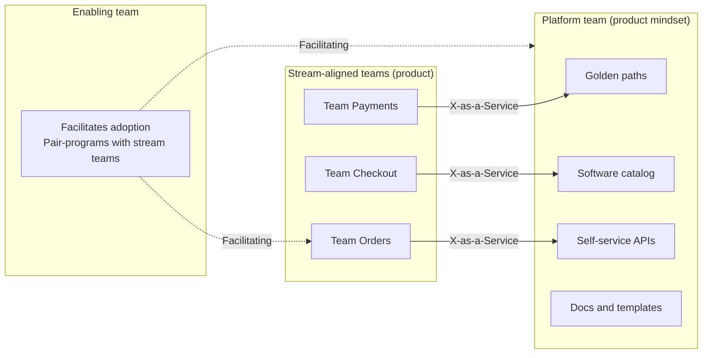
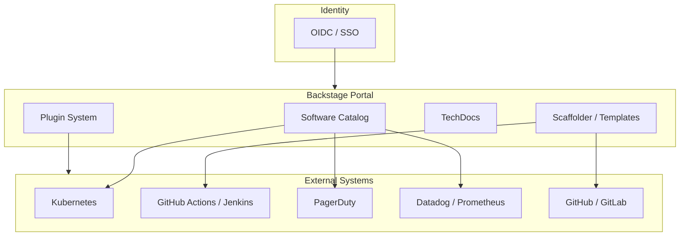
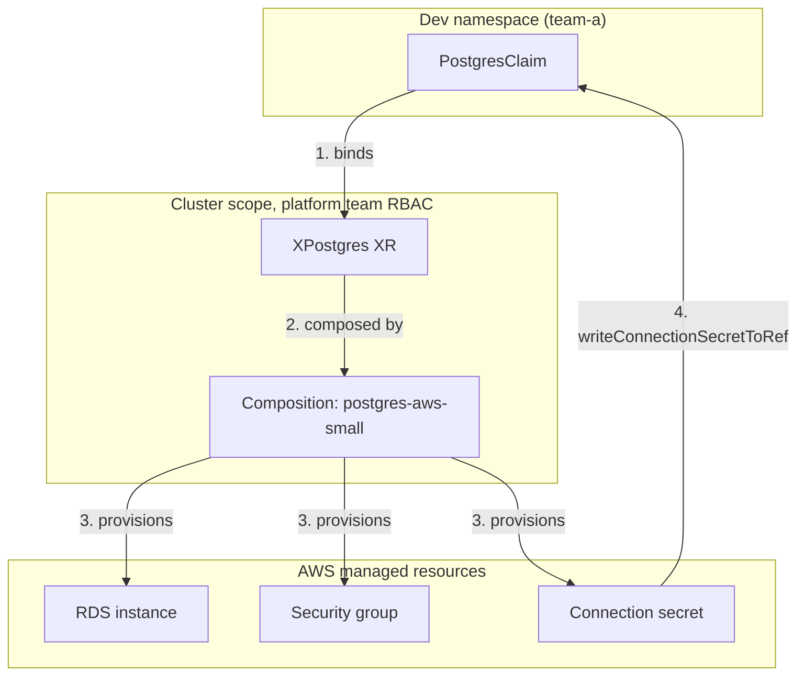

# Platform Engineering: IDPs, Golden Paths, and DX

> **TL;DR**: Platform engineering builds an internal developer platform (IDP) as a product, with engineers as customers and self-service as the default delivery mechanism. The CNCF Platforms Working Group defines a platform as "an integrated collection of capabilities defined and presented according to the needs of the platform's users"[^1]. Golden paths (Spotify's term) provide opinionated, supported defaults for 80% of cases; escape hatches handle the rest. Measure outcomes with DORA's four keys and the human experience with SPACE. Gartner's 2023 forecast projected 80% of large software engineering organizations would have platform teams by 2026[^2]; industry surveys show adoption tracking toward that target. The hard work is not choosing Backstage or Port; it is catalog discipline, template maintenance, and the product management mindset that prevents the platform from becoming a ticket queue.

## Learning Objectives

After this module, you will be able to:

- [ ] Distinguish DevOps (shared responsibility) from platform engineering (dedicated team, platform-as-product)
- [ ] Evaluate when to adopt Backstage versus scripts-plus-docs based on org size
- [ ] Design a golden path with escape hatches that do not fork the platform
- [ ] Pick the right DX metrics (DORA, SPACE, time-to-first-commit) for your stage

## Intuition

You move into a new apartment building. The building has a concierge desk. You do not need to find your own plumber, electrician, or locksmith. You walk to the desk, say "my sink is leaking," and the concierge dispatches a vetted plumber within the hour. You can still hire your own plumber if you want, but you lose the building's warranty on the work.

Now imagine the concierge is overwhelmed. They take three days to respond. Residents start calling their own plumbers, electricians show up unvetted, and the building's wiring becomes a mess of incompatible work. The concierge failed not because the idea was wrong, but because the building treated it as a cost center instead of a service.

Platform engineering is that concierge desk for software teams. The platform team builds self-service tools (golden paths) so product engineers do not need to become Kubernetes experts, CI/CD specialists, and compliance auditors simultaneously. The platform is a product; engineers are its customers. When it works, cognitive load drops and teams ship faster. When it fails, it becomes a ticket queue that is worse than no platform at all.

[Monolith vs Microservices](../part-5-architecture-patterns/00-monolith-vs-microservices.md) introduced the organizational complexity that microservices create. [Observability](../part-6-reliability-and-operations/00-observability.md) showed how instrumentation crosses every service boundary. This chapter addresses the meta-problem: who builds and maintains the shared infrastructure that every team depends on, and how do you run that work as a product rather than a bureaucracy?

## Theory

### Platform engineering vs DevOps

DevOps is a cultural practice: the team that builds the system operates it. "You build it, you run it" distributes ownership evenly. This worked when the stack was a monolith, a CI server, and a VM. It breaks when every team must master Kubernetes, Terraform, CI/CD pipelines, OTLP instrumentation, SBOM generation, OIDC federation, and SOC 2 compliance simultaneously.

Platform engineering adds a dedicated team whose product is the developer experience for every other team. The difference is not attitude; it is an org-chart fact. A platform team has a product manager, a roadmap, user research, adoption metrics, and an NPS score. Team Topologies (Skelton and Pais, 2019) categorizes this explicitly as a **Platform team** that interacts with stream-aligned product teams in **X-as-a-Service** mode[^3]. The platform exposes self-service APIs and golden paths. It does not take tickets for individual deployments.

The anti-pattern Team Topologies warns against is the "DevOps team" that becomes a ticket queue, gating every change and making things worse than pure DevOps[^3]. A platform team that requires a Jira ticket for every database provision is not a platform; it is Ops with a new name.



*Stream-aligned teams consume the platform via self-service (X-as-a-Service interaction mode). Enabling teams facilitate adoption without becoming permanent dependencies. The platform team never becomes a ticket queue.*

### Backstage: the de facto open-source IDP

Spotify had been using Backstage internally for years before open-sourcing it on March 16, 2020[^4][^5]. They donated it to CNCF as a Sandbox project in September 2020[^6], and it reached Incubation status in March 2022[^5]. By April 2025, Spotify reports over 3,000 companies have adopted Backstage to build IDPs of their own[^4]; the public `ADOPTERS.md` file lists 200+ named companies including American Airlines, Netflix, LinkedIn, LEGO, Zalando, Monzo (2,000+ microservices catalogued), HelloFresh (500+ engineers), and Expedia[^7].

Backstage ships four pillars:

- **Software Catalog** - every service, library, data pipeline, and ML model listed with owner, lifecycle, dependencies, SLOs, and integration annotations. This is the backbone. Without it, no one can answer "who owns this service and how do I page them?"
- **Software Templates (Scaffolder)** - "create a new Go microservice" scaffolds a repo with CI, observability, deployment pipeline, catalog entity, and on-call registration baked in.
- **TechDocs** - MkDocs-based docs-as-code rendered from the service repo. Docs live next to the code they describe.
- **Plugin architecture** - integrations for Kubernetes, PagerDuty, Datadog, SonarQube, GitHub Actions, Jenkins, and 150+ community plugins.



*Backstage is a framework, not a finished product. The catalog is the centerpiece; plugins connect it to every system the developer touches. Without catalog discipline, it decays into a wiki no one trusts.*

Alternatives exist: Port (commercial, no-code portal builder), OpsLevel, Cortex, Humanitec Portal, Roadie (managed Backstage), and Kratix (Kubernetes-native platform-as-a-product framework). The choice matters less than the discipline: do you have a platform team with product management running it?

### Golden paths and escape hatches

A golden path (Spotify's term[^8]) or paved road (Netflix's term[^9]) is the opinionated, supported route from "I need a new service" to "running in production with CI/CD, monitoring, and infra." Spotify publicly describes seven golden paths: backend engineering, client development, data engineering, data science, machine learning, web, and audio processing (the most recent addition)[^8]. New engineers complete the golden-path tutorial in their first two weeks as a fixed part of onboarding.

The critical design constraint: escape hatches are mandatory. Spotify states explicitly: "If you are an adventurer you can of course leave the Golden Path and do your own thing, but then you will not have the same support"[^8]. The CNCF white paper calls this the "optional and composable" attribute[^1]. Netflix's paved road is not mandated; it is made far better than the alternatives so teams choose it voluntarily[^9].

Golden paths without escape hatches cause resentment, shadow IT, and malicious compliance. Golden paths without maintenance become lies when tools change faster than docs.

```mermaid
flowchart LR
    DEV[Developer: I need a new service]
    SCAFF[Scaffolder template]
    REPO[Repo created<br/>with CI wired]
    DASH[Dashboards provisioned<br/>SLOs defined]
    ENTITY[Catalog entity registered]
    ONCALL[On-call rotation set]
    PROD[Running in production]
    ESCAPE[Escape hatch:<br/>RFC + platform review]
    EXTEND[Extend golden path<br/>or sanctioned deviation]

    DEV --> SCAFF
    SCAFF --> REPO
    REPO --> DASH
    DASH --> ENTITY
    ENTITY --> ONCALL
    ONCALL --> PROD
    DEV -->|"edge case"| ESCAPE
    ESCAPE --> EXTEND
    EXTEND -->|"feedback"| SCAFF
```



*The golden path takes a developer from "I need a service" to production in hours, not weeks. Edge cases route through an explicit escape-hatch process that feeds improvements back into the path.*

### Developer experience metrics: DORA and SPACE

**DORA's four keys** (Forsgren, Humble, Kim, from the Accelerate book) measure software-delivery outcomes: deployment frequency, lead time for changes, change failure rate, and failed deployment recovery time (previously MTTR)[^10]. The 2024 DORA report surveyed 39,000+ technical respondents and clusters teams into elite, high, medium, and low performers[^10][^11]. Google's 2024 report confirms that "internal development platforms effectively increase productivity for developers" but warns of a temporary performance dip during platform maturation[^12].

**SPACE** (Forsgren, Storey et al., ACM Queue 2021) argues no single metric captures productivity. It defines five dimensions: Satisfaction and well-being, Performance, Activity, Communication and collaboration, Efficiency and flow[^13]. SPACE counterbalances activity-maximizing anti-patterns (lines of code, deploy count) with satisfaction and flow.

**DevEx framework** (Noda, Storey, Forsgren, 2023) distills developer experience into three dimensions: feedback loops, cognitive load, and flow state.

Use DORA for outcomes. Use SPACE for the human experience producing them. The CNCF platforms white paper pairs both explicitly[^1]. Platform-specific metrics to add: time to provision a service, time for a new hire to submit their first production change, and platform NPS.

Anti-metrics to avoid: lines of code per individual, story points as productivity, and raw "velocity" without context. The 2024 DORA report notes that high-performing teams had a higher change failure rate than medium-performing teams because the report rewards improvement trajectory, not steady-state[^10][^11].

### Infrastructure abstractions: Crossplane and Score

Two projects exemplify the "developer declares intent, platform resolves it" pattern:

**Crossplane** (CNCF Graduated, November 2025) extends Kubernetes with managed resources and Compositions. A platform team defines a CompositeResourceDefinition (XRD) and a Composition that maps it to underlying cloud resources. Developers create namespaced Claims: "give me a Postgres." Only the platform team has RBAC to create the cluster-scoped composite resource directly[^14].



*Developers operate on namespaced Claims; only the platform team has RBAC to create the cluster-scoped XR. A Composition maps the XR to managed cloud resources, and connection details flow back to the developer's namespace [^14].*

**Score** is a CNCF Sandbox workload specification. A developer writes `score.yaml` describing runtime requirements (containers, resources, dependencies). A Score Implementation CLI or Platform Orchestrator translates that spec to Kubernetes manifests, Helm, Docker Compose, or Cloud Run depending on the deployment context[^15]. Humanitec claims this Dynamic Configuration Management reduces config files for a ten-service, four-environment app from 300+ (static) to roughly ten (dynamic)[^15].

Both share the same principle: developers describe what they need, not how to provision it. The platform team maintains the "how" as reusable compositions and resource definitions.

### When NOT to build an IDP

A ten-engineer startup that builds an IDP is performing Gartner cosplay. The honest answer at that scale is a monorepo, a Makefile, and a README. Only past roughly 20 engineers does dedicated platform work pay back.

| Org size | Platform depth | Team | Example |
|---|---|---|---|
| < 20 engineers | Scripts + docs, shared infra | No platform team | Seed-stage startup |
| 20 to 100 | Opinionated monorepo + templates | 1 to 3 platform engineers | Series B |
| 100 to 1,000 | Full IDP (Backstage + scorecards + self-service) | 2-5% of eng headcount | Growth-stage |
| 1,000+ | Meta-platform (multiple specialized platforms) | Multiple platform teams | FAANG-scale |

Platform-team headcount at mature IDPs commonly runs 2 to 5% of total engineering, according to Humanitec's 2023 benchmarking study[^17]. Full Backstage rollout at enterprise scale reportedly takes 6 to 18 months to deliver value[^16]. Do not start with the 1,000-engineer solution at the 50-engineer stage.

## Real-World Example

### Spotify: Backstage and the golden path

Spotify is the canonical case. Spotify's first Golden Path tutorial (for backend engineering) began as a Hack Week project roughly six years before the August 2020 blog post that introduced the concept publicly[^8]. Spotify open-sourced Backstage on March 16, 2020[^4][^5]. By 2020, Spotify had hundreds of microservices, dozens of internal tools, and a fragmentation problem: every team solved CI, observability, and deployment differently. Backstage unified the developer experience into a single portal.

The Software Catalog became the backbone. Every service registers as a YAML entity in its repo:

```yaml
apiVersion: backstage.io/v1alpha1
kind: Component
metadata:
  name: orders-service
  annotations:
    github.com/project-slug: acme/orders-service
    pagerduty.com/service-id: PX123
spec:
  type: service
  lifecycle: production
  owner: team-orders
  system: commerce
  dependsOn:
    - component:inventory-service
    - resource:orders-db
```

This entity powers scorecards (does the service have an owner? a runbook? SLOs defined?), dependency graphs, and cross-cuts every plugin. Software Templates scaffold new repos with CI, observability, and deployment wired from day one. New engineers complete the golden-path tutorial in their first two weeks as onboarding[^8].

Spotify donated Backstage to CNCF rather than retaining it as a single-vendor project, building ecosystem trust and avoiding the "abandoned corporate OSS" trap[^6]. By April 2025, Spotify reports over 3,000 companies have adopted Backstage[^4], with 200+ named on the public `ADOPTERS.md`[^7]. American Airlines built an internal Backstage-powered portal called Runway[^18]. Zalando is building V2 of their Internal Development Portal on it.

The honest lesson: Backstage is a framework, not a product. Without a platform team maintaining templates, enforcing catalog discipline, and running escape-hatch processes, it decays into a wiki that no one trusts. Spotify's own team admits tutorials "just reflect the actual Golden Path" and keeping them short requires active maintenance[^8].

## Trade-offs

| Platform depth | Pros | Cons | Best when | Our Pick |
|---|---|---|---|---|
| No platform (scripts + docs) | Zero overhead, fast iteration | Does not scale; tribal knowledge | < 20 eng startup | Start here |
| Light (opinionated monorepo + templates) | Low cost, serves 80% of needs | Limited integration, manual gaps | 20 to 100 eng | First platform hire |
| Full IDP (Backstage + scorecards + self-service APIs) | Self-service, onboard in hours, compliance baked in | 2-5% of eng on platform team, 6-18 months to value | 100 to 1,000 eng | Default for growth-stage |
| Meta-platform (multiple specialized platforms) | Per-domain excellence (infra, data, ML, frontend) | Coordination overhead, integration seams | 1,000+ eng | Only at FAANG scale |

## Common Pitfalls

> [!WARNING]
> **Platform as kingdom.** The platform team gates every change; product teams wait weeks for tickets. This happens when the interaction mode slips from X-as-a-Service to Collaboration for every request[^3]. Fix: genuine self-service, measure time-from-request-to-fulfillment, and make it a platform OKR.

> [!WARNING]
> **Golden paths without escape hatches.** Teams with valid edge-case needs cannot deviate without forking. Some defect to shadow infrastructure. Fix: make the escape-hatch policy explicit (RFC process, platform review, sanctioned deviation). Spotify says it plainly: "If you are an adventurer you can of course leave the Golden Path"[^8].

> [!WARNING]
> **Platform built in a vacuum.** Platform solves the platform team's imagined problems, not the product teams' real pain. Fix: include a product manager from day one, run user interviews, set OKRs around adoption and NPS, not feature count[^1].

> [!WARNING]
> **Measuring the wrong things.** DORA numbers look great but developers are miserable. Fix: combine DORA (outcome) with SPACE (experience). The 2024 DORA report notes high-performing teams had higher change failure rate than medium-performing teams[^10][^11], proving that no single metric tells the full story.

> [!WARNING]
> **Under-staffing the platform team.** A 5-person team serving 500 engineers cannot keep up. The CNCF white paper warns that leaders who "perceive IT infrastructure as an expense" under-fund platforms, leading to "unrealized promises and frustration"[^1]. Staff at 2-5% of engineering headcount with a dedicated budget line.

## Exercise

Design the platform for a 200-engineer fintech with 80+ microservices across 3 clouds. What is the MVP platform you ship in the first quarter? Which golden path do you pick first, and why? What does the 2-year roadmap look like, which DX metrics do you commit to leadership, and what is your explicit anti-goal for year one?

<details>
<summary>Hint</summary>

Start with the highest-pain, highest-frequency developer workflow. For a fintech with 80+ services, "create a new service" and "deploy to production" are likely the top two. The MVP is not a portal; it is a working golden path for one workflow. Think about what you measure to prove value to leadership in Q2.

</details>

<details>
<summary>Solution</summary>

**Q1 MVP: One golden path for "create a new service."**

Ship a Backstage instance with a single Software Template that scaffolds a new service repo with: CI pipeline (GitHub Actions), Kubernetes manifests (Helm chart), observability (OpenTelemetry SDK + Datadog exporter), catalog entity YAML, and PagerDuty on-call registration. Target: new service from zero to production in under 4 hours.

**Why this path first:** It is the highest-leverage workflow. Every new service created without the golden path accumulates tech debt (missing observability, no catalog entry, no on-call). For a fintech, compliance (SBOM, dependency scanning) baked into the template is a regulatory win.

**Platform team:** 4 engineers + 1 platform PM. That is 2.5% of 200 engineers.

**DX metrics committed to leadership:**

- DORA lead time for changes (target: < 1 day by Q3)
- Time to first production deploy for new hires (target: < 5 days by Q4)
- Platform NPS (quarterly survey, target: > 40)
- Golden-path adoption rate (target: 70% of new services use the template by Q4)

**Year-one anti-goal:** Do not build a self-service database provisioning portal. Use Crossplane Claims behind the scenes, but expose them through the template, not a separate UI. Avoid scope creep into infrastructure automation before the catalog and golden path are solid.

**2-year roadmap:**

- Q2: Add scorecards (prod-readiness checklist: SLOs defined, runbook exists, on-call set, SBOM present). Publish adoption dashboard.
- Q3: Second golden path for "add a new API endpoint" (schema-first, auto-generated client SDKs). Integrate OPA policies for compliance gates.
- Q4: Self-service database provisioning via Crossplane Claims. Expand to data-pipeline golden path.
- Year 2: Multi-cloud abstraction layer (Score or Crossplane compositions per cloud). Platform-wide DORA dashboard. Escape-hatch RFC process formalized. Third-party plugin contributions from product teams.

</details>

## Key Takeaways

- Platform engineering is not a rebrand of DevOps. It adds a dedicated team with a product manager treating the platform as a product with customers, roadmap, and adoption metrics.
- Golden paths work only with credible escape hatches. Without them, teams fork or defect to shadow IT.
- DORA measures delivery outcomes; SPACE measures the human experience producing them. Use both.
- Platform depth must match org size. A 1,000-engineer IDP imposed on 50 engineers is a tax, not a platform.
- Backstage is a starting point, not an answer. The hard work is catalog discipline, template maintenance, and escape-hatch policy.
- Staff the platform team at 2-5% of engineering headcount with a dedicated budget and a product manager from day one.
- The "thinnest viable platform" can be a wiki page with links plus scripts. Grow it only where a concrete team has a concrete pain.

## Further Reading

- [CNCF Platforms White Paper](https://appdelivery.cncf.io/whitepapers/platforms) - The clearest public definition of what a platform is, what a platform team measures, and the "optional and composable" design principle that prevents platform kingdoms.
- [Team Topologies](https://teamtopologies.com/) by Skelton and Pais (2019) - The canonical framework for stream-aligned, platform, enabling, and complicated-subsystem teams plus interaction modes. Required reading before forming a platform team.
- [Spotify: How We Use Golden Paths](https://engineering.atspotify.com/2020/08/how-we-use-golden-paths-to-solve-fragmentation-in-our-software-ecosystem/) - The origin story of the term; the success factors list and the honest admission about maintenance burden are gold.
- [Netflix: Full Cycle Developers](https://netflixtechblog.com/full-cycle-developers-at-netflix-a08c31f83249) - The canonical paved-road plus operate-what-you-build article. Shows how centralized tools teams act as force multipliers without becoming ticket queues.
- [The SPACE of Developer Productivity](https://queue.acm.org/detail.cfm?id=3454124) - Forsgren, Storey et al., ACM Queue 2021. The antidote to "lines of code" productivity metrics; defines the five dimensions every platform team should measure.
- [DORA State of DevOps 2024](https://dora.dev/research/2024/) - The annual benchmark based on 39,000+ respondents. Use it to calibrate your DORA targets against industry clusters.
- [Backstage Documentation](https://backstage.io/) - Start with the Software Catalog and Software Templates sections. Read ADOPTERS.md for 200+ named companies running it in production (Spotify reports 3,000+ total adopters as of April 2025).
- [CNOE (Cloud Native Operational Excellence)](https://cnoe.io/) - Multi-vendor reference architectures for IDPs using CNCF tools (ArgoCD, Backstage, Crossplane). Co-owned by AWS, Adobe, Salesforce, and others.

## Flashcards

**Q:** What distinguishes platform engineering from DevOps?
**A:** DevOps is a cultural practice of shared dev-ops ownership across every team. Platform engineering adds a dedicated team that treats the platform as a product, with a product manager, roadmap, user research, and adoption metrics. The platform exposes self-service; it does not take tickets.

**Q:** What are the four pillars of Backstage?
**A:** Software Catalog (service registry with owners, dependencies, lifecycle), Software Templates (scaffolders for new services), TechDocs (docs-as-code from service repos), and a Plugin architecture (150+ integrations for Kubernetes, PagerDuty, Datadog, etc.).

**Q:** What is a golden path and who coined the term?
**A:** A golden path (Spotify's term) is an opinionated, supported default route from "I need a new service" to "running in production with CI/CD, monitoring, and infra." It reduces cognitive load but requires an explicit escape-hatch policy for edge cases.

**Q:** What are DORA's four key metrics?
**A:** Deployment frequency, lead time for changes, change failure rate, and failed deployment recovery time (previously MTTR). They cluster teams into elite, high, medium, and low performers.

**Q:** What does SPACE stand for in developer productivity?
**A:** Satisfaction and well-being, Performance, Activity, Communication and collaboration, Efficiency and flow. It counterbalances activity-maximizing anti-patterns with satisfaction and flow dimensions.

**Q:** Why must golden paths have escape hatches?
**A:** Without escape hatches, teams with valid edge-case needs fork the platform or defect to shadow IT. The CNCF white paper requires platforms to be "optional and composable." Mandated paths without deviation routes cause resentment and malicious compliance.

**Q:** What is the recommended platform-team size relative to engineering headcount?
**A:** 2-5% of total engineering headcount for a mature IDP. A 200-engineer org needs roughly 4-10 platform engineers plus a dedicated platform product manager.

**Q:** When should you NOT build an internal developer platform?
**A:** Below roughly 20 engineers or with few services. At that scale, a monorepo, a Makefile, and a README suffice. Managed PaaS (Heroku, Railway, Render, Fly.io) may also eliminate the need for a custom IDP.

**Q:** What is the "platform as kingdom" anti-pattern?
**A:** The platform team gates every change, product teams wait weeks for tickets. The interaction mode slips from X-as-a-Service to Collaboration for every request, turning the platform into a bottleneck worse than no platform at all.

**Q:** How do Crossplane Claims separate developer and platform-team concerns?
**A:** Developers create namespaced Claims ("give me a Postgres") with simple parameters. Only the platform team has RBAC to create the cluster-scoped composite resource. A Composition maps the claim to underlying cloud resources (RDS, security groups, secrets), and connection details flow back to the developer's namespace.

**Q:** What platform-specific metrics should you track beyond DORA?
**A:** Time to provision a service or environment, time for a new hire to submit their first production change, golden-path adoption rate, and platform NPS (developer satisfaction survey).

**Q:** What did the 2024 DORA report find about high-performing teams and change failure rate?
**A:** High-performing teams had a higher change failure rate than medium-performing teams. This proves no single DORA metric tells the full story and reinforces the need to pair DORA with SPACE for a complete picture.

## References

[^1]: CNCF Platforms Working Group, "CNCF Platforms White Paper", April 2023. https://appdelivery.cncf.io/whitepapers/platforms
[^2]: Gartner, "Platform Engineering Empowers Developers to be Better, Faster, Happier" (paywalled; see [^16] for accessible summary). https://www.gartner.com/en/experts/top-tech-trends-unpacked-series/platform-engineering-empowers-developers
[^3]: Team Topologies, "Revisiting Team Topologies: Misuses of Platform Teams", newsletter, Nov 2024. https://teamtopologies.com/news-blogs-newsletters/2024/11/24/revisiting-team-topologies-misuses-of-platform-teams
[^4]: Spotify Engineering, "Celebrating Five Years of Backstage", April 2025. https://engineering.atspotify.com/2025/4/celebrating-five-years-of-backstage
[^5]: Backstage project README, CNCF Incubation status and pillars. https://github.com/backstage/backstage/blob/master/README.md
[^6]: Spotify Engineering, "Cloud Native Computing Foundation Accepts Backstage as a Sandbox Project", Sep 2020. https://engineering.atspotify.com/2020/9/cloud-native-computing-foundation-accepts-backstage-as-a-sandbox-project
[^7]: Backstage ADOPTERS.md, public adopters list. https://github.com/backstage/backstage/blob/master/ADOPTERS.md
[^8]: Niemen, G., "How We Use Golden Paths to Solve Fragmentation in Our Software Ecosystem", Spotify Engineering, Aug 17 2020. https://engineering.atspotify.com/2020/08/how-we-use-golden-paths-to-solve-fragmentation-in-our-software-ecosystem/
[^9]: Fisher-Ogden, P., Burrell, G., Marsh, D., "Full Cycle Developers at Netflix: Operate What You Build", Netflix Tech Blog, May 17 2018. https://netflixtechblog.com/full-cycle-developers-at-netflix-a08c31f83249
[^10]: DORA Research 2024 overview, dora.dev. https://dora.dev/research/2024/
[^11]: Matusov, L., "What are the latest benchmarks for the DORA four key metrics? (2024 DORA Report)", Research-Driven Engineering Leadership, Nov 12 2024. https://rdel.substack.com/p/rdel-68-what-are-the-latest-benchmarks
[^12]: Harvey, N. and DeBellis, D., "Highlights from the 10th DORA report" (2024 Accelerate State of DevOps), Google Cloud Blog, Oct 23 2024. https://cloud.google.com/blog/products/devops-sre/announcing-the-2024-dora-report
[^13]: Forsgren, N., Storey, M.-A., Maddila, C., Zimmermann, T., Houck, B., Butler, J., "The SPACE of Developer Productivity", ACM Queue, 2021. https://queue.acm.org/detail.cfm?id=3454124
[^14]: Crossplane docs v1.20, "Claims" and "Composite Resources". https://docs.crossplane.io/v1.20/concepts/claims/
[^15]: von Grunberg, K., "Implementing Dynamic Configuration Management with Score and Humanitec", Humanitec blog, Feb 16 2023. https://humanitec.com/blog/implementing-dynamic-configuration-management-with-score-and-humanitec
[^16]: Signisys, "Gartner Says 80% of Software Orgs Will Have Platform Teams by 2026", summarizing Gartner Hype Cycle for Platform Engineering 2024. https://www.signisys.com/blog/gartner-says-80-of-software-orgs-will-have-platform-teams-by-2026/
[^17]: Humanitec, "DevOps Benchmarking Study 2023", whitepaper (93% top performers use an IDP). https://humanitec.com/whitepapers/devops-benchmarking-study-2023
[^18]: Greul, H., "Adopter Spotlight: American Airlines demos Runway", Spotify for Backstage blog, Aug 25 2021. https://backstage.spotify.com/blog/adopter-spotlight-american-airlines-demos-runway
