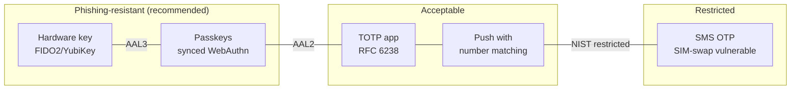
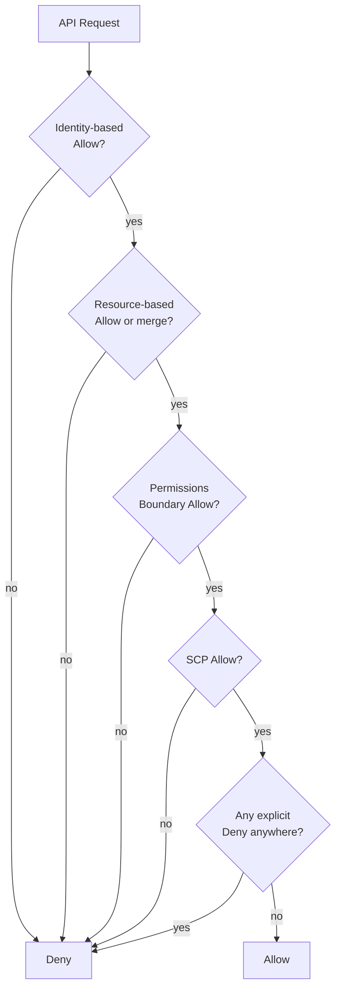
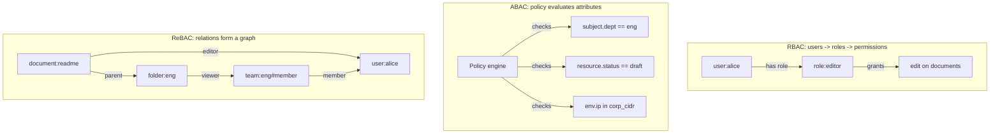
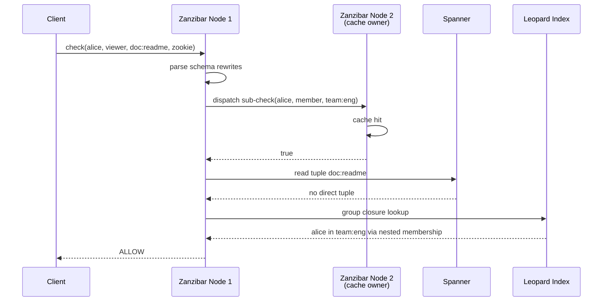

# Authentication vs Authorization: Identity, Permissions, and Access Models

> **TL;DR**: Authentication (AuthN) answers "who are you?" Authorization (AuthZ) answers "what can you do?" They are different problems with different failure modes, and conflating them is the #1 web-app vulnerability class per OWASP Top 10 (2021 and 2025). On the AuthN side, passwords persist but must be paired with phishing-resistant MFA (WebAuthn, not SMS). On the AuthZ side, RBAC works until role explosion hits at scale with many cross-cutting teams, at which point relationship-based access control (ReBAC) becomes the right default. Google's Zanzibar serves 12.4 million check and read requests per second at under 10 ms p95 [^1], and open-source descendants (SpiceDB, OpenFGA) bring that model to everyone.

## Learning Objectives

After this module, you will be able to:

- [ ] Distinguish AuthN and AuthZ and design each independently
- [ ] Compare session-based vs token-based authentication and pick correctly
- [ ] Choose between RBAC, ABAC, and ReBAC for a given product
- [ ] Model permissions with relationships (Zanzibar-style tuples and userset rewrites)
- [ ] Integrate SpiceDB, OpenFGA, or a build-your-own solution into a service architecture

## Intuition

Think of a nightclub. The bouncer at the door checks your ID. That is authentication: proving you are who you claim to be. Once inside, a velvet rope separates the VIP section. The host checks your wristband color before letting you through. That is authorization: deciding what you are allowed to do given your verified identity.

Nobody confuses the bouncer with the VIP host in real life. But in code, developers do it constantly. Middleware validates a JWT (the bouncer), sets `req.user`, and the route handler assumes that a valid identity means permission to act on any resource. The server never asks "does this user have access to *this* document?" It just serves the data. This is broken access control, and it has ranked #1 in the OWASP Top 10 since 2021 (confirmed again in the 2025 edition).

The fix is architectural separation. An identity provider (IdP) handles AuthN: verifying credentials, issuing tokens, managing sessions. A separate authorization service handles AuthZ: evaluating whether the authenticated principal may perform the requested action on the target resource. Google runs these as entirely separate systems. Their AuthZ layer, Zanzibar, sits on the hot path of every Drive share, every Calendar invite, every Cloud IAM check, handling trillions of stored permissions and millions of decisions per second [^1].

This chapter covers both halves. First, how to verify identity (passwords, MFA, SSO, sessions vs tokens). Then, how to model and enforce permissions (RBAC, ABAC, ReBAC). By the end, you will know when each model wins and how to avoid the traps that catch teams at scale.

## Theory

### AuthN foundations: passwords and modern guidance

A password is a memorized secret verified against a stored salted hash. The server never stores the plaintext. On registration it computes `hash = KDF(salt, password, cost)` using a deliberately slow algorithm. On login it recomputes and compares constant-time.

The hashing algorithms evolved to defeat hardware improvements:

- **bcrypt** (1999): Blowfish-based, adaptive cost factor. "The computational cost of any secure password scheme must increase as hardware improves" [^2].
- **scrypt** (2009): memory-hard, defeating GPU and ASIC attackers.
- **Argon2id** (2015): selected as the Password Hashing Competition winner from 24 candidates [^3]. The modern default.

NIST SP 800-63B-4 (2025) rewrites the rules your corporate training taught you [^4]:

- Minimum 15 characters for single-factor, 8 for MFA
- No composition rules (mixed case, digits, symbols)
- No periodic rotation
- Must check against breach corpuses

These changes reflect reality: credential stuffing (injecting breached username/password pairs into login forms) accounts for a median of 19% of authentication attempts across organizations and as high as 25% at enterprise scale [^5]. The FBI attributes 41% of financial-sector incidents to credential stuffing [^6].

### MFA: from SMS to passkeys

Multi-factor authentication requires two distinct factor types: something you know (password), something you have (phone, hardware key), or something you are (biometric).

**TOTP** (RFC 6238) hashes a pre-shared secret with the current 30-second time window. Cheap, offline, no network dependency. Good enough for most consumer apps.

**SMS OTP** delivers a code over PSTN. Vulnerable to SIM-swap attacks: an attacker social-engineers the carrier into porting the victim's number. Twitter CEO Jack Dorsey's `@jack` account was taken over this way in August 2019 [^7]. NIST now classifies SMS as a "restricted" authenticator requiring an alternative [^4].

**FIDO2/WebAuthn** performs a public-key challenge-response bound to the relying party's origin. A phishing site has the wrong origin and cannot receive a valid assertion. Google required hardware security keys for all 85,000+ employees in early 2017; since then, zero confirmed account takeovers [^8].

**Passkeys** are synced WebAuthn credentials (via iCloud Keychain, Google Password Manager). They bring phishing resistance to consumers without requiring a separate hardware token. NIST distinguishes syncable authenticators (AAL2) from non-exportable hardware keys (AAL3).



*MFA methods ranked by phishing resistance; prefer the left side for high-value accounts.*

### Session vs token authentication

After AuthN succeeds, the server issues a credential for subsequent requests. Two models:

**Session cookies.** The server stores a random session ID in Redis or Memcached. The browser receives an opaque cookie marked `HttpOnly; Secure; SameSite=Lax`. Logout deletes the server-side record. Revocation is instant.

**JWTs.** A signed payload of claims (`sub`, `exp`, `iat`, `roles`). The server verifies the signature and expiration without any lookup. Scales horizontally. But you cannot revoke a JWT without a deny list, which re-introduces the stateful lookup you were avoiding.

**The hybrid pattern** (recommended): short-lived JWT access tokens (5 to 15 minutes) plus long-lived refresh tokens stored in HttpOnly cookies. Revocation happens at refresh time. This gives you stateless verification for the common case and revocation when you need it.

> [!TIP]
> Chrome shipped `SameSite=Lax` as the default for cookies in 2020 [^9], blocking most CSRF vectors. But apps should still emit explicit anti-CSRF tokens on sensitive forms because the 2-minute Lax exception allows top-level POST navigations.

[OAuth 2.0 and OpenID Connect](./01-oauth2-oidc.md) covers the SSO protocols (SAML, OIDC) that sit on top of these session models. [JWT Deep Dive](./02-jwt-deep-dive.md) covers signing algorithms, `alg: none` attacks, and token lifecycle in detail.

### AuthZ models: from ACL to ReBAC

Authorization models differ in how they represent and evaluate permissions. Each is a different point on the correctness-flexibility-latency surface.

**ACL (Access Control List).** For each resource, store a list of `(subject, permission)` tuples. UNIX `rwxrwxrwx` is the canonical example. Simple per-resource, but does not scale to "grant the Engineering team read access to all 500 repos" without group expansion.

**RBAC (Role-Based Access Control).** Users get roles; roles get permissions. The check is: does the user have a role that grants this permission? NIST formalized RBAC in 2004 [^10]. It fits enterprises with clean job functions. But role explosion is real and measurable: one practitioner illustration describes reaching 287 roles after 18 months starting from 12, with 62% of permissions found inappropriate or excessive [^11]. At scale with many cross-cutting teams, roles can outnumber people.

**ABAC (Attribute-Based Access Control).** Policies evaluate attributes of the subject, resource, action, and environment. Example: `allow if resource.owner == subject.id AND env.time in business_hours`. AWS IAM's `Condition` blocks are ABAC. OPA/Rego and Cedar are modern policy engines. Extremely flexible, but you cannot efficiently answer "who has access to X?" because there is no reverse index.



*AWS IAM policy evaluation is layered: every request must pass identity-based, resource-based, permissions-boundary, and SCP checks. Any explicit Deny in any policy overrides all Allows. Cross-account access requires matching allows in both the caller's identity policy and the target resource's policy.*

**ReBAC (Relationship-Based Access Control).** Express permissions as relations between subjects and objects, then compute by graph traversal. The check is: "is there a path from (user) to (resource, permission) through the relation graph?" This maps directly onto product concepts: "shared with", "member of folder", "team owns repo". Google's Zanzibar is the canonical implementation.



*The same permission ("Alice can edit readme") modeled three ways. ReBAC computes permissions by traversing the relation graph at query time.*

### Zanzibar and its descendants

Google's Zanzibar (USENIX ATC 2019) is a global authorization system shared by Drive, Calendar, Cloud IAM, YouTube, Photos, and Maps [^1]. Three core concepts:

1. **Namespace configs (schemas)** define relations and userset rewrites per object type. Example: `document.viewer = reader OR editor OR owner OR parent->viewer`.
2. **Relation tuples** are atomic facts: `document:readme#editor@user:alice`, `document:readme#parent@folder:eng`.
3. **APIs**: `check(user, permission, object)`, `expand(object, permission)`, `lookupResources(user, permission, type)`.

Userset rewrites are the expressive core. `tuple_to_userset` follows one relation then evaluates another on the target. Set operations (union, intersection, exclusion) compose complex policies from simple relations.

**Consistency model.** Zanzibar uses Spanner's TrueTime for external consistency. "Zookies" (opaque consistency tokens) prevent the "new enemy problem": a user makes a document private, but a stale cache still allows reads. The Zookie sets a lower bound on the snapshot used for the check [^12].

**Open-source descendants:**

- **SpiceDB** (Authzed): gRPC service in Go, consistent-hash dispatch for cache locality, pluggable datastores (CockroachDB, PostgreSQL, Spanner) [^13].
- **OpenFGA** (Auth0/Okta, CNCF Incubating since Oct 2025): DSL-first schema, streaming ListObjects API, recently reduced P99 by 98% via Thompson-sampling strategy planning [^14].
- **Others**: Warrant, Oso, Cerbos (policy engines with ReBAC features).

## Real-World Example

Google Zanzibar handles authorization for every Google Drive share, every YouTube visibility setting, and every Cloud IAM check. The numbers from the 2019 paper [^1]:

- **12.4 million** permission check and read requests per second at peak
- **3 ms** p50 check latency; **20 ms** p99
- **> 99.999%** availability over 3 years of production use
- **> 10,000 servers** organized in several dozen clusters
- **Trillions** of stored access control lists backed by Spanner

The architecture achieves these numbers through three key techniques:

**Consistent-hash routing.** Each permission check decomposes into sub-problems (following userset rewrites). Identical sub-requests route to the same server via consistent hashing, building up cache locality. A check for "can Alice view document:readme?" might fan out to "is Alice in team:eng?" which always lands on the same cache-owning server.

**Request hedging.** If Spanner or the Leopard index (an in-memory transitive-closure cache for deeply nested groups) is slow, the server fires a duplicate request and uses the first response. This tames tail latency.

**Zookies for correctness.** Content writes generate a Zookie. Subsequent authorization checks pass it back, ensuring the check sees at least as recent a snapshot as the content it protects. Without this, a race between "make document private" and "check if Bob can read" could leak data.



*A single Zanzibar check fans out into cached sub-problems. Consistent-hash routing ensures repeated sub-questions hit warm caches.*

## Trade-offs

| Approach | Pros | Cons | Best When | Our Pick |
|---|---|---|---|---|
| Centralized RBAC | Clear, auditable, single admin surface | Role explosion past ~100 roles, static | Internal tools, admin consoles, clear job functions | Start here, migrate when it hurts |
| ABAC (OPA, Cedar) | Flexible policy-as-code, version-controlled, compliance-friendly | No reverse index, policy complexity, debugging pain | Compliance-heavy domains (healthcare, finance, regulatory) | Layer on top of RBAC/ReBAC for conditions |
| ReBAC (SpiceDB, OpenFGA) | Scales to social/sharing, reverse lookups, maps onto product | New mental model, stateful service on hot path, operational burden | Modern SaaS with sharing, teams, folders, nested orgs | Default for new products with sharing |
| Hybrid ABAC + ReBAC | Relations for structure, attributes for conditions | Two models to learn and operate | Apps with both sharing and environmental rules | The eventual steady state for complex products |

## Common Pitfalls

> [!WARNING]
> **Hardcoded role checks scattered through handlers.** `if user.role == "admin"` sprinkled across routes is fast to ship and impossible to audit. When you need to change "who can delete invoices?" you grep the codebase and hope. Centralize the decision behind an AuthZ service (even a thin library) before the check count passes ~20.

> [!WARNING]
> **Treating "authenticated" as "authorized."** Middleware validates the JWT and sets `req.user`. The route handler reads a resource by ID from the URL but never checks "does this user have permission on *this* resource?" Every handler must call an explicit AuthZ check before business logic.

> [!WARNING]
> **SMS-only MFA.** SIM-swap attacks hijack the phone number; the attacker receives the one-time code. Jack Dorsey's Twitter account was taken over this way [^7]. Always offer TOTP or WebAuthn as alternatives. Treat SMS as a fallback, not the primary factor.

> [!WARNING]
> **Role explosion.** Starting from 12 clean roles, an enterprise can end up with 287 after 18 months, with 62% of permissions inappropriate [^11]. If you have more roles than people, you have the problem. Combine RBAC with ReBAC for data-scoped permissions or move fully to ReBAC.

> [!WARNING]
> **JWT with no revocation strategy.** A stolen JWT is valid until expiry. "What happens when a user clicks Logout?" If the answer is "nothing until the token expires," use short-lived access tokens (5 to 15 min) plus server-side refresh token revocation.

> [!WARNING]
> **God-mode admin with no guardrails.** A single `is_admin = true` boolean grants unrestricted access. Split admin privileges by scope (billing, content, user management). Require MFA for admin actions. Log every admin operation to an immutable audit trail.

## Exercise

Design the permission model for a SaaS product with organizations, teams, projects, resources, sharing, and guest users. Pick a model, design the schema, sketch permission checks for three typical operations, and explain how you audit access.

<details>
<summary>Hint</summary>

Think about which operations are "role-like" (org admin, billing admin) and which are "relationship-like" (shared a document with a guest). A hybrid model handles both. Start by listing the core entities and the relations between them.

</details>

<details>
<summary>Solution</summary>

**Model choice:** ReBAC (Zanzibar-style) with RBAC roles expressed as relations.

**Schema (OpenFGA DSL):**

```text
type user

type team
  relations
    define member: [user, team#member]

type organization
  relations
    define owner: [user]
    define admin: [user] or owner
    define member: [user] or admin

type project
  relations
    define org: [organization]
    define admin: [user, team#member] or org_admin from org
    define editor: [user, team#member] or admin
    define viewer: [user, team#member] or editor or guest
    define guest: [user]
    define org_admin: admin from org

type resource
  relations
    define project: [project]
    define owner: [user]
    define editor: [user, team#member] or owner or project_editor from project
    define viewer: [user, team#member] or editor or project_viewer from project
    define project_editor: editor from project
    define project_viewer: viewer from project
```

**Three checks:**

1. "Can guest@example.com view resource:report-q4?" Follow `resource:report-q4#viewer` -> check `project_viewer from project` -> follow `project` relation -> check `viewer` on the project -> check `guest` -> find tuple `project:analytics#guest@user:guest@example.com`. Result: ALLOW.

2. "Can alice edit resource:design-doc?" Follow `resource:design-doc#editor` -> check `project_editor from project` -> follow to `project:frontend#editor` -> check `team:design#member` -> find `user:alice` as member. Result: ALLOW.

3. "Can bob delete organization:acme?" Only `owner` can delete. Check `organization:acme#owner` -> no tuple for bob. Result: DENY.

**Audit:** Every relation tuple write is an auditable event with timestamp, actor, and old/new state. To answer "who granted guest access to project:analytics?", query the tuple changelog filtered by `object=project:analytics, relation=guest`. SpiceDB and OpenFGA both expose Watch APIs for streaming changes to an audit sink.

</details>

## Key Takeaways

- AuthN and AuthZ are different problems with different failure modes. Design and deploy them as separate concerns.
- NIST 800-63B-4 (2025) forbids password rotation and composition rules. Require 15+ characters for single-factor, check against breach corpuses.
- WebAuthn/passkeys are the only phishing-resistant MFA. Google's zero-phishing-incidents stat after deploying hardware keys to 85,000 employees proves the case [^8].
- Use short-lived JWTs (5 to 15 min) plus refresh tokens for the hybrid of stateless verification and revocability.
- RBAC works until role explosion hits (~100+ roles, many cross-cutting teams). ReBAC (Zanzibar-style) is the right default for modern sharing-heavy products.
- Zanzibar achieves 12.4M check and read requests per second at 10 ms p95 through consistent-hash caching, request hedging, and Zookies for correctness [^1].
- Every permission change needs an immutable audit log. If you cannot answer "who granted X access to Y, and when?" you have a gap.

## Further Reading

- [Zanzibar: Google's Consistent, Global Authorization System](https://www.usenix.org/conference/atc19/presentation/pang) - The foundational paper (USENIX ATC 2019). Read this before building any fine-grained authorization system.
- [Zanzibar-Annotated by AuthZed](https://zanzibar.tech/) - The paper with running commentary from SpiceDB's authors; clarifies the dense sections on userset rewrites and Leopard.
- [SpiceDB Architecture Deep Dive](https://authzed.com/blog/spicedb-architecture) - How the open-source Zanzibar clone implements dispatch, caching, and consistent-hash routing in Go.
- [OpenFGA Documentation](https://openfga.dev/docs) - Modeling language, Check/Expand/ListObjects APIs, and integration guides for the Auth0/Okta-backed implementation.
- [NIST SP 800-63B-4](https://pages.nist.gov/800-63-4/sp800-63b.html) - The current digital-identity standard covering passwords, AAL levels, and authenticator requirements.
- [AWS IAM Policy Evaluation Logic](https://docs.aws.amazon.com/IAM/latest/UserGuide/reference_policies_evaluation-logic.html) - How explicit-deny-wins semantics and layered policies (identity, resource, boundary, SCP) compose in the world's largest ABAC system.
- [Krebs: Google Security Keys Neutralized Employee Phishing](https://krebsonsecurity.com/2018/07/google-security-keys-neutralized-employee-phishing/) - The canonical hardware-key success story with zero confirmed takeovers across 85,000+ employees.
- [Airbnb Himeji](https://medium.com/airbnb-engineering/himeji-a-scalable-centralized-system-for-authorization-at-airbnb-341664924574) - Production Zanzibar-style system outside Google; trades read-time fanout for write-time materialization.

## Flashcards

**Q:** What is the difference between authentication and authorization?
**A:** Authentication (AuthN) verifies identity ("who are you?"). Authorization (AuthZ) evaluates permissions ("what can you do?"). They are separate concerns with separate failure modes: AuthN failures are stolen credentials; AuthZ failures are broken access control.

**Q:** Why does NIST 800-63B-4 forbid periodic password rotation?
**A:** Forced rotation leads users to pick weaker passwords (incrementing a digit, using patterns). The new guidance requires longer passwords (15+ chars for single-factor), breach-corpus checking, and no composition rules instead.

**Q:** What makes WebAuthn phishing-resistant?
**A:** The browser binds the cryptographic assertion to the relying party's origin. A phishing site has a different origin and cannot receive a valid signature, even if the user clicks the prompt.

**Q:** What is role explosion and when does it happen?
**A:** When every product exception (regional access, project scope, temporary contractor) creates a new role. One illustration describes reaching 287 roles after 18 months from 12 starting roles, with 62% of permissions inappropriate. It hits at scale with many cross-cutting teams.

**Q:** What is a Zookie in Zanzibar?
**A:** An opaque consistency token returned on writes and passed back on checks. It sets a lower bound on the Spanner snapshot used, preventing the "new enemy problem" where a revocation races with a content read.

**Q:** How does Zanzibar achieve sub-10ms latency at 12M QPS?
**A:** Three techniques: (1) consistent-hash routing sends identical sub-requests to the same server for cache locality, (2) request hedging fires duplicate requests to tame tail latency, (3) the Leopard index pre-computes transitive group closures in memory.

**Q:** When should you choose ABAC over ReBAC?
**A:** When permissions depend on environmental attributes (time of day, source IP, MFA status, resource tags) rather than relationships. AWS IAM Condition blocks are the canonical ABAC example. In practice, most complex systems use a hybrid: ReBAC for structure, ABAC for conditions.

**Q:** Why is "valid JWT therefore authorized" a security hole?
**A:** A JWT proves identity (AuthN) but says nothing about whether that identity has permission on the specific resource being accessed. Every request must pass through an explicit AuthZ check after token validation.

**Q:** What is the hybrid session/token pattern?
**A:** Short-lived JWT access tokens (5 to 15 min) for stateless verification on every request, plus long-lived refresh tokens stored server-side for revocation. When the access token expires, the client hits the refresh endpoint, which checks the revocation list before issuing a new access token.

**Q:** Name three open-source Zanzibar implementations.
**A:** SpiceDB (Authzed, Go, gRPC, pluggable datastores), OpenFGA (Auth0/Okta, Go, DSL-first schema, streaming ListObjects), and Warrant (now part of WorkOS). All implement relation tuples, userset rewrites, and the Check/Expand/LookupResources API pattern.

## References

[^1]: Pang et al., "Zanzibar: Google's Consistent, Global Authorization System", USENIX ATC 2019. https://research.google/pubs/zanzibar-googles-consistent-global-authorization-system/
[^2]: Provos and Mazieres, "A Future-Adaptable Password Scheme", USENIX ATC 1999. https://www.usenix.org/conference/1999-usenix-annual-technical-conference/presentation/future-adaptable-password-scheme
[^3]: Password Hashing Competition official site announcing Argon2 as the 2015 winner. https://www.password-hashing.net/
[^4]: NIST Special Publication 800-63B-4 (2025), "Digital Identity Guidelines: Authentication and Authenticator Management". https://pages.nist.gov/800-63-4/sp800-63b.html
[^5]: Verizon 2025 Data Breach Investigations Report, credential-stuffing research article. https://www.verizon.com/business/resources/articles/credential-stuffing-attacks-2025-dbir-research
[^6]: FBI Private Industry Notification as reported by Bitdefender, "41% of Financial Sector Cyber Attacks Come from Credential Stuffing". https://www.bitdefender.com/en-gb/blog/businessinsights/fbi-41-of-financial-sector-cyber-attacks-come-from-credential-stuffing/
[^7]: The Guardian, "Jack Dorsey: Twitter CEO's account briefly hacked", 30 August 2019. https://www.theguardian.com/technology/2019/aug/30/twitter-ceo-jack-dorsey-account-hacked
[^8]: Brian Krebs, "Google: Security Keys Neutralized Employee Phishing", KrebsOnSecurity, 23 July 2018. https://krebsonsecurity.com/2018/07/google-security-keys-neutralized-employee-phishing/
[^9]: web.dev (Chrome team), "SameSite cookies explained". https://web.dev/articles/samesite-cookies-explained
[^10]: NIST Computer Security Resource Center, "Role Based Access Control FAQ and history". https://csrc.nist.gov/Projects/Role-Based-Access-Control
[^11]: Action1 blog, "RBAC Implementation: Best Practices & Checklist" citing typical enterprise role-sprawl numbers. https://www.action1.com/blog/rbac-implementation-best-practices/
[^12]: Jake Moshenko (AuthZed), "Understanding Google Zanzibar: A Comprehensive Overview". https://authzed.com/blog/what-is-google-zanzibar
[^13]: Jake Moshenko (AuthZed), "Google Zanzibar Open Source: The Architecture of SpiceDB". https://authzed.com/blog/spicedb-architecture
[^14]: Yamil Asusta and Yissell Garma (Auth0/OpenFGA), "Taming P99s in OpenFGA: How We Built a Self-Tuning Strategy Planner". https://auth0.com/blog/self-tuning-strategy-planner-openfga
