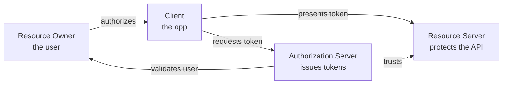
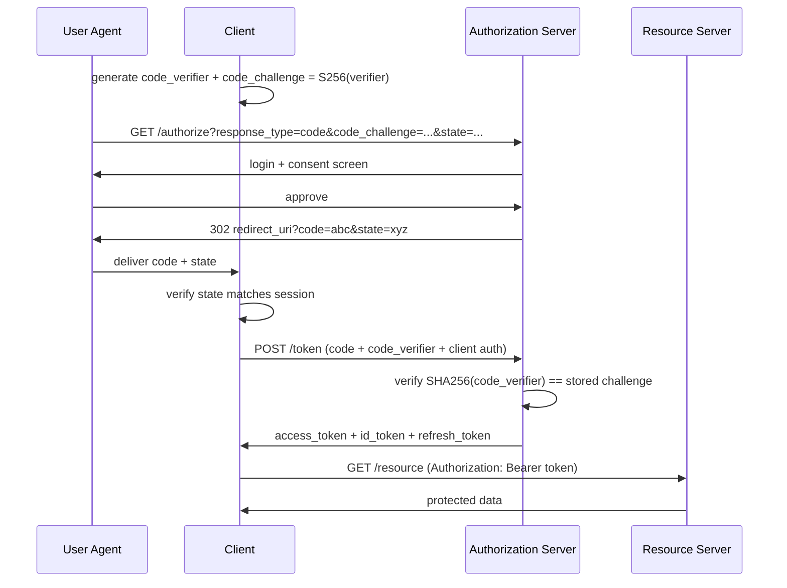
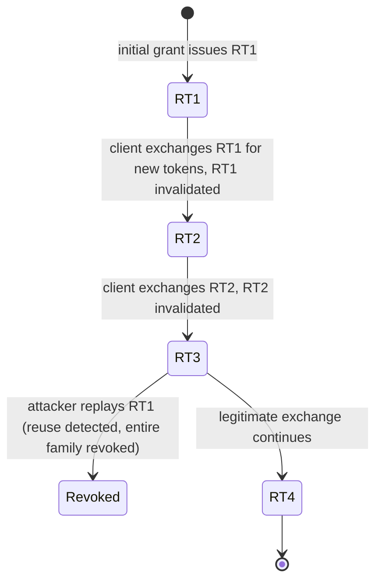
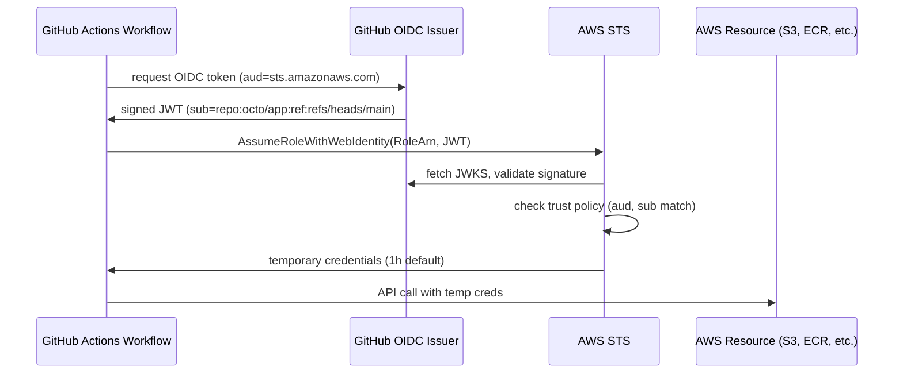

# OAuth 2.0 and OpenID Connect: Delegated Authorization and Identity Done Right

> **TL;DR**: OAuth 2.0 (RFC 6749, 2012) lets a user grant an application scoped access to their resources without sharing a password. [^1] OpenID Connect adds an identity layer so the app also knows *who* the user is. Authorization Code + PKCE is the only flow you should use for new code: SPAs, mobile, and server-side apps alike. OAuth 2.1 formalizes this by dropping Implicit and ROPC grants entirely and mandating PKCE for all clients. [^2] The spec's flexibility was its greatest weakness (its lead editor resigned calling it "the biggest professional disappointment of my career" [^3]), but a decade of security BCPs has tightened it into a reliable protocol when implemented correctly.

## Learning Objectives

After this module, you will be able to:

- [ ] Distinguish OAuth 2.0 (authorization) from OpenID Connect (authentication)
- [ ] Pick the right grant type: Auth Code + PKCE, Client Credentials, or Device Code
- [ ] Explain the roles of access tokens, refresh tokens, and ID tokens
- [ ] Design a secure token lifecycle with rotation, revocation, and sender-constraining
- [ ] Recognize common OAuth misconfigurations (open redirect, missing state, token leakage)
- [ ] Implement OIDC federation for CI/CD without long-lived secrets

## Intuition

You are renting a car. The rental company does not need the keys to your house. They need proof that you can drive (your license) and a scoped authorization (the rental agreement) that lets you use *this specific car* for *these specific dates*. You never hand over your house keys, your bank PIN, or your passport. The rental agreement is revocable: if you crash the car, the company cancels it immediately.

Before OAuth, the web worked like handing over your house keys. Want a third-party app to read your Gmail contacts? Give it your Google password. The app could read your email, delete your Drive files, change your password. There was no scoping, no revocation, no audit trail. In late 2006, while Blaine Cook was working on Twitter's OpenID implementation, he ran into a gap: OpenID could sign users in, but there was no open standard for delegating scoped API access without handing over a password. He, Chris Messina, David Recordon, Larry Halff, and others started sketching what became OAuth to fill that gap. The OAuth Core 1.0 final draft shipped in October 2007. [^4]

OAuth is the rental agreement for the web. The user (resource owner) visits the authorization server (the rental desk), approves a specific set of permissions (scopes), and the app receives a time-limited token (the rental agreement). The app never sees the password. The token can be revoked. The damage from theft is bounded.

This chapter builds on [Authentication vs Authorization](./00-authn-authz.md), which covered how to verify identity and enforce permissions. Here we focus on the protocol that delegates authorization across trust boundaries.

## Theory

### The password anti-pattern and OAuth's origin

Before OAuth, delegated access meant sharing credentials. This was called the "password anti-pattern": the user gives their username and password to a third-party app, which logs in on their behalf. The app has full access. The user cannot revoke it without changing their password (which breaks every other app). There is no audit trail of what the app did.

OAuth 1.0 (2007) introduced signed request tokens to solve this. It worked but required complex cryptographic signatures on every request. OAuth 2.0 (RFC 6749, October 2012) replaced signatures with bearer tokens over TLS, making implementation simpler but shifting security responsibility to the transport layer. [^1]

The spec was deliberately a "framework" rather than a tight protocol. Eran Hammer, its lead editor, resigned in July 2012, removing his name from the spec and calling it "a bad protocol" that "can be turned into a good one" only through significant implementer skill. [^3] He was right: the flexibility led to a decade of exploits. But the IETF responded with RFC 9700 (OAuth 2.0 Security Best Current Practice, January 2025) [^5] and the in-progress OAuth 2.1 draft, which folds PKCE, native-app rules, and browser-based app rules into one document and removes the flows that kept failing. [^2]

### OAuth 2.0 roles and grant types

Four roles interact in every OAuth flow:

*The four OAuth roles and the token flow between them. The client never sees the user's credentials.*

**Resource Owner**: the user who owns the data. **Client**: the application requesting access. **Authorization Server (AS)**: authenticates the user, collects consent, issues tokens. **Resource Server (RS)**: the API that validates tokens and serves protected data.

The grant types (flows) determine how the client obtains tokens:

| Grant Type | Use Case | Status |
|---|---|---|
| Authorization Code + PKCE | SPAs, mobile, server-side web | Required by OAuth 2.1 |
| Client Credentials | Machine-to-machine, CI/CD | Active |
| Device Code (RFC 8628) | Smart TVs, CLIs, IoT | Active |
| Authorization Code (no PKCE) | Legacy server-side only | Deprecated without PKCE |
| Implicit | (was for SPAs) | Removed in OAuth 2.1 |
| ROPC (password grant) | (client sees password) | Removed in OAuth 2.1 |

The Implicit grant returned tokens directly in the URL fragment, leaking them via browser history, Referer headers, and JavaScript. ROPC gave the client the user's password, defeating the entire purpose of OAuth. Both are dead. Do not use them. [^5]

### Authorization Code + PKCE

This is the flow you will implement. PKCE (RFC 7636, pronounced "pixy") adds a cryptographic binding between the authorization request and the token exchange, preventing code interception attacks. [^6]

The mechanism: before starting the flow, the client generates a random `code_verifier` (43 to 128 URL-safe characters; RFC 7636 Section 7.1 recommends at least 256 bits of entropy, typically produced by base64url-encoding 32 random octets). It computes `code_challenge = BASE64URL(SHA256(code_verifier))` and sends the challenge in the authorization request. When exchanging the code for tokens, the client sends the raw verifier. The AS recomputes the hash and rejects if it does not match. An attacker who intercepts the authorization code cannot redeem it without the verifier. [^6]

*Authorization Code + PKCE end to end. The code_verifier never leaves the client, so intercepting the code alone is useless.*

Key security parameters in this flow:

- **`state`**: a one-time, cryptographically random value bound to the user's session. Prevents CSRF. The AS returns it unchanged; the client rejects mismatches. [^5]
- **`nonce`** (OIDC): embedded in the ID token, prevents replay. The client checks the ID token's `nonce` claim matches what it sent.
- **`redirect_uri`**: must be registered exactly (no wildcards, no substring matching). RFC 9700 mandates exact string comparison. [^5]

OAuth 2.1 makes PKCE mandatory for all clients, including confidential ones, because PKCE also prevents authorization code injection attacks where an attacker forces a victim to use the attacker's code. [^2]

### OpenID Connect

OAuth answers "what can this app do?" but not "who is this user?" Using an access token for login is a well-known anti-pattern: access tokens have `aud = resource_server`, not `aud = client`. A token minted for one client can be replayed to another if both share a resource server.

OpenID Connect (OIDC, 2014) fixes this by adding:

- **ID token**: a signed JWT with `aud = client_id`, containing identity claims (`sub`, `iss`, `email`, `name`). The client validates the signature against the AS's JWKS, checks `iss`, `aud`, `exp`, and `nonce`.
- **`openid` scope**: triggers ID token issuance.
- **Discovery document**: `/.well-known/openid-configuration` publishes all endpoints, supported algorithms, and capabilities. Clients fetch this once at startup.
- **UserInfo endpoint**: returns additional profile claims for the authenticated user.
- **JWKS endpoint**: publishes the AS's public keys for signature verification.

The critical rule: **access tokens are for APIs. ID tokens are for login.** Never use an access token to determine who the user is. Never send an ID token to a resource server.

[JWT Deep Dive](./02-jwt-deep-dive.md) covers the token format, signing algorithms, and `alg: none` attacks in detail.

### Token lifecycle and security

**Access tokens** are short-lived (5 to 60 minutes). They are typically Bearer tokens (RFC 6750): possession alone authorizes the call. This means a stolen access token grants full access until expiry.

**Refresh tokens** are long-lived credentials exchanged at the token endpoint for new access tokens without user interaction. RFC 9700 requires that refresh tokens for public clients use either sender-constraining (mTLS or DPoP) or rotation with reuse detection. [^5]

*Refresh token rotation with reuse detection. A replayed old token signals theft and triggers revocation of the entire token family.*

**DPoP (RFC 9449, September 2023)** binds tokens to a client-held key pair. Every API call includes a DPoP proof JWT signed by the client's private key. The access token carries a `cnf.jkt` confirmation claim (the key's thumbprint). A stolen access token is useless without the private key. This moves beyond Bearer semantics toward sender-constrained tokens.

**Revocation (RFC 7009)** and **introspection (RFC 7662)** round out the lifecycle. Revocation lets clients or admins invalidate tokens immediately. Introspection lets resource servers check token validity in real time (useful for opaque tokens that cannot be validated locally).

### SPA token storage and the BFF pattern

Where should a single-page application store tokens? The answer matters because XSS is the dominant web vulnerability, and any script running in the page's origin can read `localStorage`.

**`localStorage` is not safe for tokens.** Any successful XSS exfiltrates the access token, refresh token, and ID token. The attacker has full API access for the token's lifetime. The IETF "OAuth 2.0 for Browser-Based Apps" BCP and Auth0's documentation both recommend against it.

The **Backend-for-Frontend (BFF)** pattern is the recommended approach: a thin server owned by the same team as the SPA completes the OAuth flow, holds tokens server-side in an encrypted session, and exposes `HttpOnly; Secure; SameSite=Lax` session cookies to the browser. The SPA calls its own BFF; the BFF calls the upstream API with the real access token. Tokens never reach JavaScript.

> [!IMPORTANT]
> If you are building a SPA today, use the BFF pattern. Do not store OAuth tokens in `localStorage` or `sessionStorage`. The convenience is not worth the XSS risk.

## Real-World Example

GitHub Actions OIDC federation to AWS eliminates long-lived cloud credentials from CI/CD pipelines. Since 2021, every GitHub Actions workflow run can mint a short-lived OIDC token signed by GitHub's identity provider (`https://token.actions.githubusercontent.com`). AWS STS validates this token and returns temporary credentials, typically valid for 1 hour.

The flow works as follows:

*GitHub Actions OIDC federation. No long-lived AWS access keys in the repository. Each workflow run gets fresh, scoped, short-lived credentials.*

The JWT's `sub` claim encodes the caller's identity: `repo:octo/app:ref:refs/heads/main`. The AWS IAM role's trust policy matches against this, so a workflow in a different repository cannot assume the role.

**The critical misconfiguration**: Datadog Security Labs documented real-world trust-policy mistakes in July 2023 where organizations used `StringLike` on `sub` without anchoring to a specific repo, or omitted the `aud` check entirely. [^7] Any repository on github.com could assume the victim's role. The fix: always pin both `aud` to `sts.amazonaws.com` and `sub` to the exact `repo:org/name:ref:refs/heads/branch` pattern.

This pattern extends beyond GitHub. GitLab CI, CircleCI, and Bitbucket Pipelines all offer similar OIDC tokens. The principle is the same: replace long-lived secrets with short-lived, cryptographically-verifiable identity assertions. [Secrets Management](./04-secrets-management.md) covers the broader problem of eliminating static credentials from infrastructure.

## Trade-offs

| Approach | Pros | Cons | Best When | Our Pick |
|---|---|---|---|---|
| Auth Code + PKCE | Safe for all client types; prevents code interception, injection, and CSRF; mandatory in OAuth 2.1 | Slightly more complex handshake; does not protect token storage | All new applications | Yes, always |
| Client Credentials | Simple M2M; supports mTLS and private_key_jwt | No user context; beware `sub` confusion | Service-to-service, CI/CD batch | For machine identity only |
| Device Code | Works without browser on device; strong UX for TVs | Poll-based; vulnerable to device-code phishing | Smart TVs, CLIs, IoT | When no browser available |

## Common Pitfalls

> [!WARNING]
> **Using the Implicit grant.** `response_type=token` returns the access token in the URL fragment, so it lands in browser history, referer headers, and server logs. There are no refresh tokens, and the grant was formally omitted from OAuth 2.1. If any legacy client still uses it, migrate to Auth Code + PKCE before touching anything else.

> [!WARNING]
> **Rolling your own auth server.** RFC 9700 (the OAuth 2.0 Security BCP) enumerates mix-up, CSRF on callback, PKCE downgrade, covert redirect, and several dozen other attacks that a hand-written server will miss. Use a reviewed implementation (Keycloak, Auth0, Okta, Ory Hydra, AWS Cognito) and focus your effort on configuring it correctly.

> [!WARNING]
> **Storing tokens in localStorage.** Any XSS exfiltrates all tokens. Use the BFF pattern with HttpOnly cookies. If you inherited a SPA that uses localStorage, migrate to BFF before your next security review.

> [!WARNING]
> **Sloppy redirect_uri validation.** Wildcards or substring matching let attackers harvest authorization codes via open redirectors. RFC 9700 mandates exact string comparison. Register every redirect URI explicitly. No exceptions.

> [!WARNING]
> **Missing state parameter.** Without a session-bound `state`, an attacker can CSRF the OAuth flow and link their resources to the victim's session. Always generate a cryptographically random state, bind it to the session, and reject mismatches on callback.

> [!WARNING]
> **Using OAuth for authentication (without OIDC).** Access tokens are not identity assertions. They have `aud = resource_server`, not `aud = client`. A token from one client can be replayed to another. Use OIDC's ID token for login. It is explicitly audience-bound to your client_id.

> [!WARNING]
> **PKCE downgrade.** If your AS supports PKCE but does not require it, an attacker can strip `code_challenge` from the request and inject their code into the victim's session. Require PKCE universally. OAuth 2.1 closes this gap by making PKCE mandatory for all clients. [^5]

## Exercise

Design the auth system for a SaaS product with: a web SPA, iOS/Android mobile apps, a public developer API, internal microservices, and SSO with enterprise customers (Okta, Azure AD). For each client type, specify: the OAuth grant, token storage strategy, token lifetimes, refresh rotation policy, and how you revoke all tokens when a user is deactivated.

Hint

Think about which clients are public (SPA, mobile) vs confidential (backend services). Public clients cannot store secrets, so they need PKCE and careful token storage. Enterprise SSO is OIDC federation. Revocation requires a server-side mechanism since JWTs cannot be recalled once issued.

Solution

**Web SPA**: Authorization Code + PKCE via a BFF. The BFF completes the OAuth flow, stores tokens in an encrypted server-side session, and issues HttpOnly/Secure/SameSite=Lax session cookies to the browser. Access token lifetime: 15 minutes. Refresh token: 7 days with rotation and reuse detection.

**Mobile apps (iOS/Android)**: Authorization Code + PKCE using the system browser (per RFC 8252). Tokens stored in the OS secure enclave (Keychain on iOS, Keystore on Android). Access token: 15 minutes. Refresh token: 30 days with rotation.

**Public developer API**: Developers register OAuth clients. Their server-side apps use Authorization Code + PKCE (confidential client with client_secret). Rate-limited. Access token: 1 hour. Refresh token: 90 days.

**Internal microservices**: Client Credentials grant with mTLS client authentication (per [mTLS and Service-to-Service Authentication](./03-mtls-service-auth.md)). Access token: 5 minutes. No refresh token needed since the service can request a new one at any time.

**Enterprise SSO**: OIDC federation. Enterprise customers configure their IdP (Okta, Azure AD) as an external identity provider in your AS. Your AS trusts their ID tokens. You map their `sub` claims to local user records.

**Revocation on user deactivation**: (1) Revoke all refresh tokens for the user at the AS (immediate). (2) Short-lived access tokens expire within 15 minutes naturally. (3) For instant revocation, add the user's `sub` to a deny list checked by resource servers on every request. (4) Terminate all active sessions in the BFF's session store.

## Key Takeaways

- OAuth 2.0 delegates authorization; OpenID Connect adds authentication. Use OIDC for "sign in with" flows.
- Authorization Code + PKCE is the only grant you should use for new user-facing applications. OAuth 2.1 makes this official. [^2]
- Access tokens are short-lived (5 to 60 min) and for APIs. ID tokens are for login and audience-bound to the client. Never confuse them.
- Refresh token rotation with reuse detection catches theft: a replayed old token revokes the entire family.
- Never store tokens in localStorage. Use the BFF pattern for SPAs.
- OIDC federation (GitHub Actions to AWS, GitLab to GCP) eliminates long-lived secrets from CI/CD. Pin trust policies to exact `sub` and `aud` values.
- The Facebook 2018 breach exposed roughly 29 million accounts' access tokens and resulted in a 251 million EUR fine from the Irish DPC in December 2024. [^8][^9] Token security is not optional.

## Further Reading

- [RFC 6749: The OAuth 2.0 Authorization Framework](https://datatracker.ietf.org/doc/html/rfc6749) - The core spec. Still the starting point even for OAuth 2.1 work. Read sections 4.1 (Auth Code) and 10 (Security Considerations) first.
- [RFC 7636: Proof Key for Code Exchange (PKCE)](https://datatracker.ietf.org/doc/html/rfc7636) - The extension that rescued the Authorization Code flow for public clients. Short, readable, and essential.
- [RFC 9700: OAuth 2.0 Security Best Current Practice](https://datatracker.ietf.org/doc/html/rfc9700) - The consolidated security BCP (January 2025). Required reading for anyone shipping OAuth in production.
- [RFC 9449: OAuth 2.0 Demonstrating Proof of Possession (DPoP)](https://datatracker.ietf.org/doc/html/rfc9449) - Binding tokens to client key pairs at the application layer. The future of sender-constrained tokens.
- [OpenID Connect Core 1.0](https://openid.net/specs/openid-connect-core-1_0.html) - The OIDC spec. Focus on sections 2 (ID Token) and 3.1 (Authorization Code Flow).
- [Eran Hammer, "OAuth 2.0 and the Road to Hell"](https://gist.github.com/nckroy/dd2d4dfc86f7d13045ad715377b6a48f) - The 2012 critique that shaped OAuth 2.1. Understand what went wrong to appreciate why the BCP exists.
- [Datadog Security Labs: GitHub-to-AWS Keyless Authentication Flaws](https://securitylabs.datadoghq.com/articles/exploring-github-to-aws-keyless-authentication-flaws/) - Real-world OIDC federation misconfigurations. Read before configuring any CI/CD trust policy.
- [oauth.net](https://oauth.net/2/) - Aaron Parecki's readable reference site. The best non-RFC introduction to OAuth concepts and flows.

## Flashcards

**Q:** What problem did OAuth solve that existed before 2007?
**A:** The "password anti-pattern": users gave their passwords directly to third-party apps, granting full unscoped access with no revocation mechanism.

**Q:** What are the four OAuth 2.0 roles?
**A:** Resource Owner (user), Client (app), Authorization Server (issues tokens after consent), and Resource Server (protects the API, validates tokens).

**Q:** Why is PKCE necessary even for confidential clients?
**A:** PKCE prevents authorization code injection attacks where an attacker forces a victim to use the attacker's code. OAuth 2.1 mandates PKCE for all clients, not just public ones.

**Q:** What is the difference between an access token and an ID token?
**A:** Access tokens authorize API calls (aud = resource server). ID tokens assert identity (aud = client_id). Never use access tokens for login; never send ID tokens to resource servers.

**Q:** Why is the Implicit grant deprecated?
**A:** It returns tokens directly in the URL fragment, leaking them via browser history, Referer headers, and JavaScript. It cannot support refresh tokens or sender-constraining.

**Q:** What is refresh token rotation with reuse detection?
**A:** Each refresh token use issues a new one and invalidates the old. If an invalidated token is presented again, the AS revokes the entire token family, signaling theft.

**Q:** Why should SPAs not store tokens in localStorage?
**A:** Any XSS vulnerability can exfiltrate all tokens from localStorage. The BFF pattern keeps tokens server-side in encrypted sessions, exposing only HttpOnly cookies to the browser.

**Q:** What does DPoP (RFC 9449) add beyond Bearer tokens?
**A:** DPoP binds the access token to a client-held key pair. Every request includes a signed proof JWT. A stolen access token is useless without the private key.

**Q:** How does GitHub Actions OIDC federation eliminate long-lived AWS credentials?
**A:** Each workflow run mints a short-lived JWT signed by GitHub's OIDC provider. AWS STS validates the signature and trust policy (checking sub and aud), then returns temporary credentials valid for about 1 hour.

**Q:** What is the most dangerous OIDC federation misconfiguration?
**A:** Omitting the `sub` constraint in the trust policy or using overly broad wildcards. Without anchoring to a specific repository and branch, any GitHub repo can assume the IAM role.

**Q:** What does the `state` parameter prevent in OAuth?
**A:** CSRF attacks on the authorization flow. Without a session-bound random state value, an attacker can initiate a flow and trick the victim into completing it in the attacker's session.

**Q:** What did OAuth 2.1 remove from the spec?
**A:** The Implicit grant and the Resource Owner Password Credentials (ROPC) grant. It also mandates PKCE for all clients and requires exact redirect_uri matching.

## References

[^1]: IETF, "RFC 6749: The OAuth 2.0 Authorization Framework", October 2012. https://datatracker.ietf.org/doc/html/rfc6749
[^2]: IETF, "The OAuth 2.1 Authorization Framework" (draft-ietf-oauth-v2-1-15), March 2026. https://datatracker.ietf.org/doc/draft-ietf-oauth-v2-1/
[^3]: Eran Hammer, "OAuth 2.0 and the Road to Hell", July 2012 (archived). https://gist.github.com/nckroy/dd2d4dfc86f7d13045ad715377b6a48f
[^4]: Eran Hammer-Lahav, "Introduction" (OAuth origin history), oauth.net, September 2007. https://oauth.net/about/introduction/
[^5]: IETF, "RFC 9700: OAuth 2.0 Security Best Current Practice", January 2025. https://datatracker.ietf.org/doc/html/rfc9700
[^6]: IETF, "RFC 7636: Proof Key for Code Exchange by OAuth Public Clients", September 2015. https://datatracker.ietf.org/doc/html/rfc7636
[^7]: Datadog Security Labs, "No keys attached: Exploring GitHub-to-AWS keyless authentication flaws", 27 July 2023. https://securitylabs.datadoghq.com/articles/exploring-github-to-aws-keyless-authentication-flaws/
[^8]: Meta (Facebook newsroom), "An Update on the Security Issue", 12 October 2018. https://about.fb.com/news/2018/10/update-on-security-issue/
[^9]: The Hacker News, "Meta Fined 251 Million EUR for 2018 Data Breach Impacting 29 Million Accounts", 17 December 2024. https://thehackernews.com/2024/12/meta-fined-251-million-for-2018-data.html
