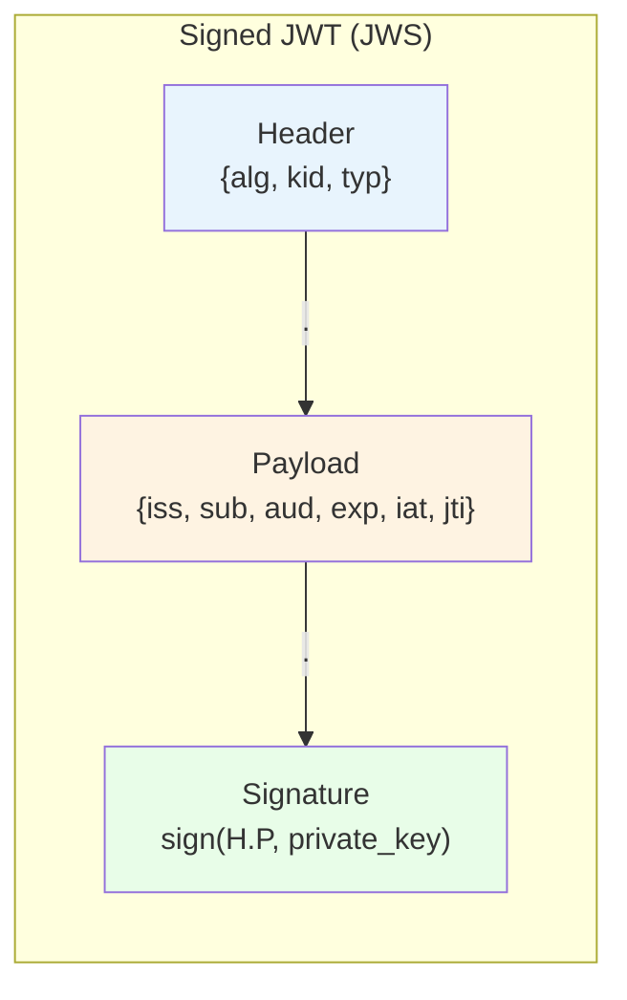
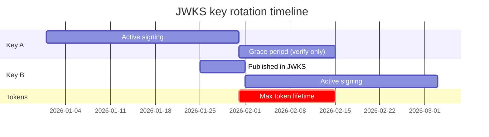
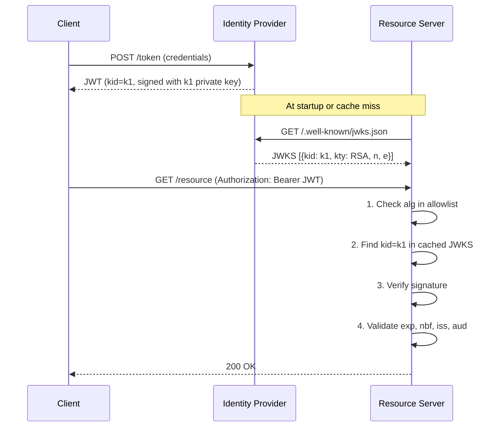
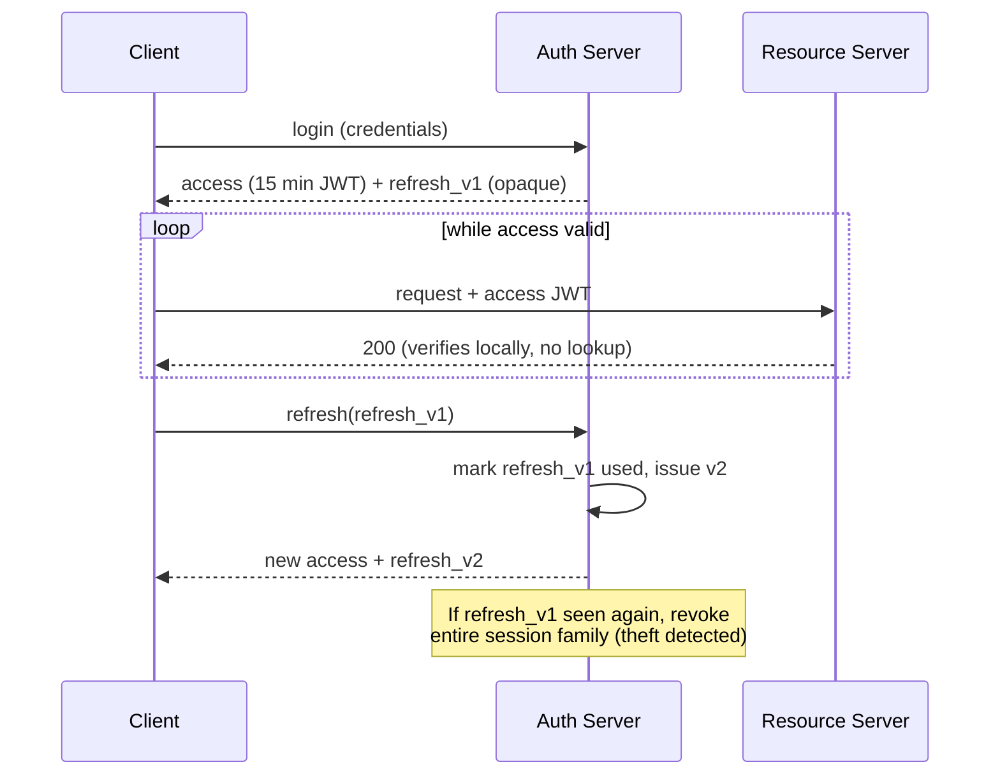

# JWT Deep Dive: Signed Tokens, Claims, and the Revocation Problem

> **TL;DR**: A JSON Web Token (JWT) is a signed JSON payload that any service can verify without a database lookup. That statelessness is its superpower and its curse: you cannot revoke a JWT without reintroducing server-side state. The format's flexibility (algorithm negotiation in the header, key URLs, the `none` algorithm) has produced numerous CVEs since 2015 [^1]. The industry-standard mitigation is short-lived access tokens (5 to 15 minutes), refresh-token rotation, pinned algorithm allowlists, and JWKS-based key distribution. RFC 8725 (BCP 225) codifies these lessons [^2].

## Learning Objectives

After this module, you will be able to:

- [ ] Decode a JWT and explain its three base64url-encoded parts
- [ ] Choose a signing algorithm (RS256, ES256, EdDSA) and explain why `none` is dangerous
- [ ] Validate required claims: `iss`, `aud`, `exp`, `nbf`, `sub`
- [ ] Design key rotation using JWKS endpoints and `kid` headers
- [ ] Handle the revocation problem with short lifetimes, refresh tokens, and denylists

## Intuition

You check into a hotel. The front desk verifies your ID and credit card, then hands you a keycard. For the next 48 hours, every door in the hotel trusts that card without calling the front desk. The card carries your room number and checkout time right on it. Any door reader can verify the card's magnetic signature locally.

Now imagine you lose the card. You call the front desk and say "cancel it." But the doors do not phone home. They cannot know the card is revoked until it expires at checkout time. The hotel's only option is to reprogram every lock, or issue cards that expire every hour and make you come back for a new one.

That is the JWT trade-off. The token is self-contained: any service with the issuer's public key can verify it instantly, no network call. But "self-contained" means "cannot be recalled." The entire security model rests on short lifetimes, careful claim validation, and never trusting the token's own header to tell you which algorithm to use.

[Authentication vs Authorization](./00-authn-authz.md) introduced the hybrid pattern of short-lived JWTs plus refresh tokens. [OAuth 2.0 and OpenID Connect](./01-oauth2-oidc.md) covers the protocols that produce JWTs. This chapter goes inside the token itself: its structure, its cryptography, its attack surface, and the operational machinery that keeps it safe.

## Theory

### JWT anatomy and base64url encoding

A signed JWT (technically a JWS, per RFC 7515) is three segments separated by dots [^3]:

```text
base64url(header) . base64url(payload) . base64url(signature)
```

The **header** declares the algorithm and key identifier:

```json
{"alg": "RS256", "kid": "2026-04-key", "typ": "JWT"}
```

The **payload** carries claims (the actual data):

```json
{"iss": "https://auth.example.com", "sub": "user-42", "aud": "api.example.com", "exp": 1714500000, "iat": 1714499100}
```

The **signature** is computed over the ASCII bytes of `base64url(header).base64url(payload)` using the algorithm and key indicated in the header.

All three segments use **base64url** (RFC 4648), not standard base64. The differences: `+` becomes `-`, `/` becomes `_`, and padding `=` is stripped. This makes JWTs safe to embed in URLs, HTTP headers, and query parameters without percent-encoding [^3].

A critical point: base64url is encoding, not encryption. Anyone who sees the token can decode the payload and read every claim. A JWT is a postcard, not a sealed envelope. If you need confidentiality, use JWE (five segments: header, encrypted key, IV, ciphertext, auth tag) or rely on TLS for transport confidentiality. In practice, almost all production JWTs are JWS over TLS rather than JWE, because the transport already provides confidentiality [^2].



*A JWT is three base64url segments joined by dots. The signature binds header and payload together but leaves both readable to anyone.*

**Registered claims** are standardized by RFC 7519: `iss` (issuer), `sub` (subject), `aud` (audience), `exp` (expiration as Unix seconds), `nbf` (not before), `iat` (issued at), and `jti` (unique token ID for replay detection). All are optional per the spec but critical in practice. Private claims are application-defined; public claims are registered with IANA [^3].

### Signing algorithms and the "none" disaster

RFC 7518 (JWA) and RFC 8037 define the algorithm identifiers [^4]:

| Algorithm | Type | Signature size | Use case |
|---|---|---|---|
| HS256 | HMAC-SHA256 (symmetric) | 32 bytes | Single-service, both sides share the secret |
| RS256 | RSA PKCS#1 v1.5 | 256 bytes (2048-bit key) | OIDC ID tokens, cross-org verification |
| PS256 | RSA-PSS (preferred over RS256) | 256 bytes | Modern RSA when you must use RSA |
| ES256 | ECDSA P-256 | 64 bytes (raw P1363) | Compact tokens, header-budget-constrained services |
| EdDSA | Ed25519 | 64 bytes | Modern default: deterministic, no RNG side-channel |
| none | Unsecured | 0 bytes | **Never use in production** |

**The `alg: none` vulnerability.** RFC 7519 defines unsecured JWTs with an empty signature segment. Early libraries read the `alg` from the untrusted header and dispatched accordingly. An attacker sets `"alg":"none"`, writes any payload, appends an empty signature, and the library accepts it. This was disclosed in Tim McLean's 2015 research on `node-jsonwebtoken`. Seven years later the same library was bitten by a related variant, CVE-2022-23540 (versions <= 8.5.1): if a caller invoked `jwt.verify()` without passing an `algorithms` option and with a falsy secret or key (null, false, undefined), the library defaulted to `none` and accepted unsigned tokens. The attack vectors differ (untrusted header dispatch vs. insecure default) but the root cause is shared: permitting the `none` algorithm anywhere in the verification path [^5].

**The RS256/HS256 confusion attack.** A server verifies RS256 tokens using an RSA public key. The attacker crafts a token with `"alg":"HS256"` and signs it using HMAC with the RSA public key (which is public) as the HMAC secret. A vulnerable library reads `alg: HS256`, treats the verification key as an HMAC secret, and accepts the forgery. This was CVE-2015-9235 in `node-jsonwebtoken` [^1].

**Psychic signatures (CVE-2022-21449).** Java 15 through 18 rewrote ECDSA verification in pure Java and omitted the check that `r` and `s` must be in `[1, n-1]`. A 64-byte all-zero signature verified against any P-256 public key. Any ECDSA-signed JWT could be forged against a vulnerable server [^6].

The fix for all three classes: **pin allowed algorithms at the verifier.** RFC 8725 Section 3.1 is emphatic: "Libraries MUST enable the caller to specify a supported set of algorithms and MUST NOT use any other algorithms" [^2]. Always pass `algorithms: ['RS256']` (or your chosen set) to the verify function.

> [!IMPORTANT]
> Never let the token's own header dictate which algorithm to use. The header is attacker-controlled. Your verifier decides the algorithm, not the token.

### Key management and JWKS

A JSON Web Key Set (JWKS) is a JSON document listing an issuer's current public keys, each identified by a `kid`. Published at a well-known URL (typically `/.well-known/jwks.json`), it lets verifiers fetch keys without pre-shared configuration [^2].

The flow:

1. The issuer generates a keypair, assigns it a `kid`, publishes the public half in JWKS.
2. When signing a JWT, the issuer sets the `kid` in the header.
3. The verifier fetches JWKS (at startup or on cache miss), finds the matching `kid`, and verifies the signature.

**Key rotation** requires overlap. The issuer publishes the new key in JWKS before using it for signing, then starts signing with the new `kid`. The old key stays in JWKS for at least one max-token-lifetime (the grace period). Tokens signed with the old key still verify during the transition.



*Keys overlap for at least one max-token-lifetime so tokens signed with the old key still verify during the transition.*

**JWKS caching rules:**

- Cache the JWKS response with a TTL (5 to 60 minutes is typical).
- On a `kid` miss (a new key was published), refetch JWKS once.
- Rate-limit refetches to prevent an attacker from flooding your issuer with forged `kid` values.
- Never follow a `jku` or `x5u` URL from the token header without strict allowlisting. CVE-2024-21643 (Microsoft IdentityModel Extensions for .NET) trusted `jku` by default in its SignedHttpRequest protocol implementation, enabling key substitution.

### Claim validation pipeline

RFC 7519 Section 7.2 defines mandatory verification steps. RFC 8725 adds the BCP hardening [^2]. The canonical order:

1. **Parse header.** Reject if `alg` is not in your pinned allowlist.
2. **Resolve key.** Look up `kid` in your cached JWKS. Refetch on miss (once, rate-limited).
3. **Verify signature.** Cryptographically verify over the exact bytes `base64url(header).base64url(payload)`. Reject on any failure.
4. **Validate `exp`.** Current time must be before `exp`. Allow 30 to 90 seconds of clock skew (60 is the most common default) [^3].
5. **Validate `nbf`.** Current time must be at or after `nbf` (same skew tolerance).
6. **Validate `iss`.** Exact string match against your issuer allowlist.
7. **Validate `aud`.** Your service's identifier must appear in `aud` (string or array). This prevents token reuse across services [^3].
8. **Validate `typ`.** If using explicit typing (RFC 8725 Section 3.11), reject cross-JWT confusion.
9. **Validate application claims.** Roles, scopes, tenant ID, whatever your service requires.



*The verifier fetches JWKS from the issuer once, caches it, and validates every token locally. No per-request round-trip to the IdP.*

> [!TIP]
> Validate `aud` strictly. A token issued for `billing-service` must not work on `admin-service`. Audience confusion is a substitution vector that appears in multiple CVE write-ups [^2].

### The revocation problem

JWTs are stateless. The server cannot "forget" a token. If a user logs out, gets deactivated, or has their session stolen, the JWT remains valid until `exp`. This is the fundamental tension of the format.

**Mitigation strategies (pick one or combine):**

| Strategy | Latency cost | Complexity | Revocation speed |
|---|---|---|---|
| Short TTL (5-15 min) + refresh | None on hot path | Low | At next refresh (minutes) |
| `jti` denylist (Redis/Bloom filter) | One lookup per request | Medium | Immediate |
| Version claim checked vs DB | One lookup per request | Medium | Immediate |
| Opaque token + introspection (RFC 7662) | Network call per request | High | Immediate |
| Rotate signing key | None after rotation | Emergency only | All tokens invalidated |

**The industry-standard answer:** Use 5 to 15 minute access tokens. Pair them with opaque refresh tokens stored server-side. When the access token expires, the client exchanges the refresh token for a new pair. Revocation happens at refresh time: the auth server checks whether the user is still active before issuing new tokens. For emergency revocation (admin deactivation, suspected breach), maintain a small `jti` denylist checked on every request. The denylist only needs to hold entries until `exp` passes, so it stays small.

**Refresh token rotation with reuse detection:** Each refresh token is single-use. When exchanged, the server issues a new refresh token and marks the old one as consumed. If the old token appears again, the entire token family is revoked. This detects theft: if an attacker and the legitimate user both try to use the same refresh token, the second use triggers revocation of all tokens in that session.



*Short-lived JWT access tokens plus refresh-token rotation give practical revocation without per-request introspection. The access token verifies locally on every request; revocation happens at refresh time by checking the refresh token against the server-side store.*

> [!WARNING]
> **Long-lived JWTs are a liability.** A 24-hour access token means a stolen credential is valid for 24 hours with no recourse. If your access tokens live longer than 15 minutes, you need a per-request denylist check, which defeats the purpose of statelessness.

## Real-World Example

GitHub Actions OIDC tokens demonstrate JWT best practices at scale. Every GitHub Actions workflow job can request a short-lived OIDC JWT from GitHub's token endpoint. The workflow presents this JWT to AWS, GCP, Azure, or HashiCorp Vault to obtain cloud credentials without storing long-lived secrets [^7].

**Token characteristics:**

- **Lifetime:** Approximately 5 minutes based on observed `exp - iat` values (not officially guaranteed)
- **Algorithm:** RS256
- **Issuer:** `https://token.actions.githubusercontent.com`
- **JWKS:** `https://token.actions.githubusercontent.com/.well-known/jwks`
- **Key claim:** `sub` encodes the security boundary (e.g., `repo:octo-org/octo-repo:environment:prod`)

**How cloud providers verify:**

1. Configure an OIDC trust policy pinning `iss` to GitHub's issuer URL.
2. Pin `aud` to the expected audience (configurable per workflow).
3. Pattern-match `sub` against allowed values (e.g., `repo:myorg/myrepo:ref:refs/heads/main`).
4. Fetch JWKS from GitHub's endpoint, verify signature, validate `exp`.
5. If everything matches, mint a short-lived cloud access token.

**Why this design works:**

- No long-lived cloud credentials stored as GitHub secrets. Eliminates an entire class of secret-rotation problems.
- Every job gets a fresh JWT, auto-generated and auto-expired. Token theft is bounded to 5 minutes.
- The `sub` claim is the security perimeter. Trust policies must be specific: pin the repo, branch, and environment. An overly permissive policy like `sub: repo:myorg/*:*` lets any branch or fork claim production credentials.

This pattern, short-lived JWTs with scoped claims verified against a JWKS endpoint, is the template for any service-to-service authentication where you want stateless verification without long-lived secrets. Kubernetes bound service account tokens (1-hour default lifetime, audience-scoped, pod-bound) follow the same model [^8].

## Trade-offs

| Approach | Pros | Cons | Best When | Our Pick |
|---|---|---|---|---|
| JWT (stateless) | No DB lookup per request; cross-service verification via public key | Revocation hard; 400 to 1,200 bytes per token | APIs, microservices, OIDC | Default for APIs |
| Session cookie (stateful) | Trivial revocation (delete the row); ~32 byte ID | Lookup per request; sticky or shared session store | Traditional web apps with single domain | Web apps without API consumers |
| Opaque token + introspection (RFC 7662) | Revocable; small; server always controls authority | Network call per request; issuer is per-request bottleneck | Banking, admin consoles requiring instant revocation | When revocation SLA < 1 minute |
| JWE (encrypted JWT) | Payload private even in browser storage | Double crypto cost; key management harder; invalid-curve bugs | Claims contain PII that must not leak to intermediaries | Only when TLS alone is insufficient |
| PASETO v4 | No alg header; no `none`; versioned; algorithm lucidity enforced | Smaller ecosystem; no JWKS standard; not OIDC-native | You control both issuer and verifier and want fewer footguns | Greenfield internal services |

## Common Pitfalls

> [!WARNING]
> **Trusting the `alg` header without an allowlist.** The token header is attacker-controlled. If your library dispatches on it without restriction, you are vulnerable to `alg: none` and RS256/HS256 confusion. Always pass an explicit `algorithms` parameter to your verify function.

> [!WARNING]
> **Storing secrets or PII in JWT claims.** Base64url is encoding, not encryption. Anyone who intercepts the token (browser DevTools, proxy logs, URL query strings) reads every claim in plaintext. Use JWE or keep sensitive data server-side and reference it by opaque ID.

> [!WARNING]
> **Skipping `aud` validation.** A token issued for `billing-service` should not work on `admin-service`. Without audience checks, a compromised low-privilege service can replay tokens against high-privilege endpoints.

> [!WARNING]
> **Using weak HMAC secrets.** A JWT signed with HS256 using a dictionary word or short string can be cracked offline with hashcat in seconds. RFC 8725 mandates that human-memorizable passwords must not be used as HMAC keys [^2]. Use at least 64 random bytes, or switch to asymmetric algorithms for cross-service use.

> [!WARNING]
> **Caching JWKS forever.** If you never refetch, key rotation breaks all new tokens. If you refetch on every `kid` miss without rate-limiting, an attacker can DDoS your issuer by sending tokens with random `kid` values. Cache with a TTL (5 to 60 minutes) and allow one rate-limited refetch on miss.

## Exercise

Design the JWT strategy for a SaaS API: lifetime, claims structure, signing algorithm, JWKS rotation policy, and how you handle a user deactivation within one minute. Justify each choice against the stateless/revocable trade-off.

<details>
<summary>Hint</summary>

Think about what happens between the moment an admin clicks "deactivate user" and the moment that user's next API call is rejected. A 15-minute access token means up to 15 minutes of continued access. What mechanism closes that gap without making every request stateful?

</details>

<details>
<summary>Solution</summary>

**Signing algorithm:** ES256. Compact 64-byte signatures fit comfortably in HTTP headers. Asymmetric, so API servers only need the public key. Avoids RSA's 256-byte signatures.

**Token lifetime:** 10-minute access tokens. Short enough that most deactivations resolve at next refresh. Long enough to avoid excessive refresh traffic.

**Claims structure:**

```json
{
  "iss": "https://auth.saas.com",
  "sub": "user-42",
  "aud": "api.saas.com",
  "exp": 1714500600,
  "iat": 1714500000,
  "jti": "abc-123-def",
  "org_id": "org-7",
  "roles": ["editor"],
  "token_version": 14
}
```

**JWKS rotation:** Rotate signing keys every 30 days. Publish the new key 7 days before first use. Keep the old key in JWKS for 15 days after last use (grace period exceeds max token lifetime by 5 minutes).

**Deactivation within one minute:** Maintain a Redis-backed `jti` denylist. When an admin deactivates a user, push all active `jti` values for that user (tracked at issuance) to the denylist with TTL equal to the remaining token lifetime. Every API request checks the denylist (one Redis GET, sub-millisecond). The denylist stays small because entries auto-expire.

**Alternative:** Use the `token_version` claim. Store a per-user version counter in the database. On deactivation, increment the counter. API servers check `token_version >= stored_version` on every request. This is one DB read per request but avoids maintaining a separate denylist.

**Trade-off accepted:** The denylist adds one network hop per request, partially defeating statelessness. But the denylist is tiny (only deactivated users' tokens, auto-expiring), so it is fast and bounded. For 99.9% of requests, the check returns "not found" in microseconds.

</details>

## Key Takeaways

- A JWT is base64url-encoded, not encrypted. Never put secrets or sensitive PII in the payload unless using JWE.
- Pin allowed algorithms at the verifier. The `alg: none` and RS256/HS256 confusion attacks are preventable with one line of config.
- Validate signature, then `exp`, `iss`, and `aud`. In that order. Skipping `aud` enables cross-service token replay.
- Short-lived access tokens (5 to 15 minutes) plus refresh-token rotation is the industry standard. Long-lived JWTs are a liability.
- JWKS endpoints decouple key distribution from token verification. Cache with a TTL, refetch on `kid` miss, rate-limit refetches.
- Key rotation requires overlap: publish the new key before signing with it, keep the old key until all outstanding tokens expire.
- For instant revocation (admin deactivation, breach response), maintain a small `jti` denylist with auto-expiring entries. Accept the one-hop cost.

## Further Reading

- [RFC 7519: JSON Web Token](https://datatracker.ietf.org/doc/html/rfc7519) - The spec itself. Section 4 (claims) and Section 7 (validation) are the core reading for implementers.
- [RFC 8725: JWT Best Current Practices](https://datatracker.ietf.org/doc/html/rfc8725) - BCP 225. Read this before shipping any JWT implementation. Covers every known attack class and the mitigation for each.
- [Tim McLean, "Critical vulnerabilities in JSON Web Token libraries"](https://auth0.com/blog/critical-vulnerabilities-in-json-web-token-libraries/) - The 2015 disclosure that named `alg: none` and RS256/HS256 confusion. Still the best single explanation of why algorithm pinning matters.
- [Neil Madden, "CVE-2022-21449: Psychic Signatures in Java"](https://neilmadden.blog/2022/04/19/psychic-signatures-in-java/) - The ECDSA r=s=0 disclosure. Shows how a single missing bounds check in a crypto implementation breaks all downstream JWT verification.
- [GitHub Actions OIDC documentation](https://docs.github.com/en/actions/deployment/security-hardening-your-deployments/about-security-hardening-with-openid-connect) - A production example of short-lived JWTs replacing long-lived secrets for CI/CD cloud access.
- [PASETO specification](https://github.com/paseto-standard/paseto-spec) - The JWT alternative that eliminates algorithm negotiation entirely. Worth evaluating for greenfield internal services.
- [OWASP JWT Cheat Sheet](https://cheatsheetseries.owasp.org/cheatsheets/JSON_Web_Token_for_Java_Cheat_Sheet.html) - Practical security guidance covering weak secrets, token storage, and validation order.
- [RFC 9449: OAuth 2.0 DPoP](https://datatracker.ietf.org/doc/html/rfc9449) - Sender-constrained tokens that bind a JWT to the client's key, making stolen tokens unusable by a different client.

## Flashcards

**Q:** What are the three parts of a signed JWT?
**A:** Header (algorithm and key ID), payload (claims), and signature. All three are base64url-encoded and separated by dots.

**Q:** Why is base64url used instead of standard base64?
**A:** Base64url replaces `+` with `-` and `/` with `_`, and strips padding `=`. This makes JWTs safe for URLs, HTTP headers, and query parameters without percent-encoding.

**Q:** What is the `alg: none` attack?
**A:** An attacker sets the header to `{"alg":"none"}`, writes any payload, and appends an empty signature. Vulnerable libraries that dispatch on the untrusted `alg` header accept it as valid. The fix: always pin allowed algorithms at the verifier.

**Q:** How does the RS256/HS256 confusion attack work?
**A:** The attacker crafts a token with `alg: HS256` and signs it using the server's RSA public key as the HMAC secret. A vulnerable library reads `alg: HS256`, uses the verification key as an HMAC secret, and accepts the forgery.

**Q:** What is a JWKS endpoint and why does it matter?
**A:** A JSON document at a well-known URL listing the issuer's current public keys with their `kid` identifiers. It decouples key distribution from token verification: verifiers fetch keys over HTTPS without pre-shared secrets.

**Q:** How do you rotate JWT signing keys without breaking existing tokens?
**A:** Publish the new key in JWKS before signing with it. Start signing with the new `kid`. Keep the old key in JWKS for at least one max-token-lifetime (the grace period). Remove the old key only after all tokens signed with it have expired.

**Q:** What is the standard approach to JWT revocation?
**A:** Short-lived access tokens (5 to 15 minutes) plus server-side refresh tokens. Revocation happens at refresh time. For immediate revocation, maintain a `jti` denylist with entries that auto-expire at the token's `exp`.

**Q:** Why must you validate the `aud` claim?
**A:** Without audience validation, a token issued for a low-privilege service can be replayed against a high-privilege service. The `aud` claim ensures a token is only accepted by its intended recipient.

**Q:** What was CVE-2022-21449 ("Psychic Signatures")?
**A:** Java 15 through 18 accepted a 64-byte all-zero ECDSA signature as valid against any public key. The rewritten Java ECDSA implementation omitted the check that `r` and `s` must be nonzero and less than the curve order.

**Q:** When should you use JWE instead of JWS?
**A:** When claims contain sensitive data that must remain confidential even if the token is intercepted outside TLS (e.g., stored in browser localStorage, passed through analytics pipelines, or logged by intermediaries). In most cases, JWS over TLS is sufficient.

**Q:** What is the difference between JWT and PASETO?
**A:** PASETO eliminates algorithm negotiation entirely. There is no `alg` header, no `none` algorithm, and no algorithm confusion possible. Each PASETO version specifies exactly one algorithm per purpose (signing or encryption). The trade-off: smaller ecosystem and no OIDC/JWKS standard support.

**Q:** How does GitHub Actions OIDC use JWTs to eliminate stored secrets?
**A:** Each workflow job requests a 5-minute RS256 JWT from GitHub. The job presents it to a cloud provider whose trust policy validates `iss`, `aud`, and `sub` (pinned to specific repos and branches). If valid, the cloud mints short-lived credentials. No long-lived secrets are stored in GitHub.

## References

[^1]: Tim McLean, "Critical vulnerabilities in JSON Web Token libraries", Auth0 blog, 2015 (republished 2020). https://auth0.com/blog/critical-vulnerabilities-in-json-web-token-libraries/
[^2]: Sheffer, Hardt, Jones, "RFC 8725: JSON Web Token Best Current Practices", IETF BCP 225, February 2020. https://datatracker.ietf.org/doc/html/rfc8725
[^3]: Jones, Bradley, Sakimura, "RFC 7519: JSON Web Token (JWT)", IETF, May 2015. https://datatracker.ietf.org/doc/html/rfc7519
[^4]: Jones, "RFC 7518: JSON Web Algorithms (JWA)", IETF, May 2015. https://datatracker.ietf.org/doc/html/rfc7518. EdDSA added by Liusvaara, "RFC 8037: CFRG Elliptic Curve Diffie-Hellman (ECDH) and Signatures in JOSE", IETF, January 2017. https://datatracker.ietf.org/doc/html/rfc8037
[^5]: Auth0, "CVE-2022-23539, CVE-2022-23541, CVE-2022-23540: Security Update for jsonwebtoken", December 21 2022. https://auth0.com/docs/secure/security-guidance/security-bulletins/2022-12-21-jsonwebtoken
[^6]: Neil Madden, "CVE-2022-21449: Psychic Signatures in Java", ForgeRock, April 19 2022. https://neilmadden.blog/2022/04/19/psychic-signatures-in-java/
[^7]: GitHub, "About security hardening with OpenID Connect" (GitHub Actions OIDC). https://docs.github.com/en/actions/deployment/security-hardening-your-deployments/about-security-hardening-with-openid-connect
[^8]: Kubernetes, "Managing Service Accounts", Kubernetes Documentation. https://kubernetes.io/docs/reference/access-authn-authz/service-accounts-admin/#bound-service-account-token-volume-mechanism
