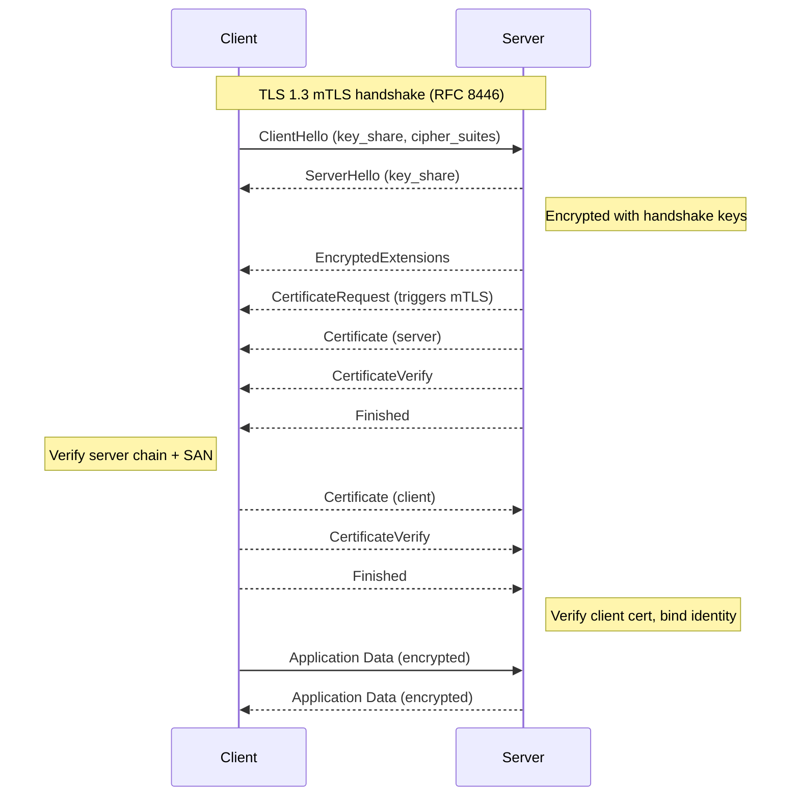
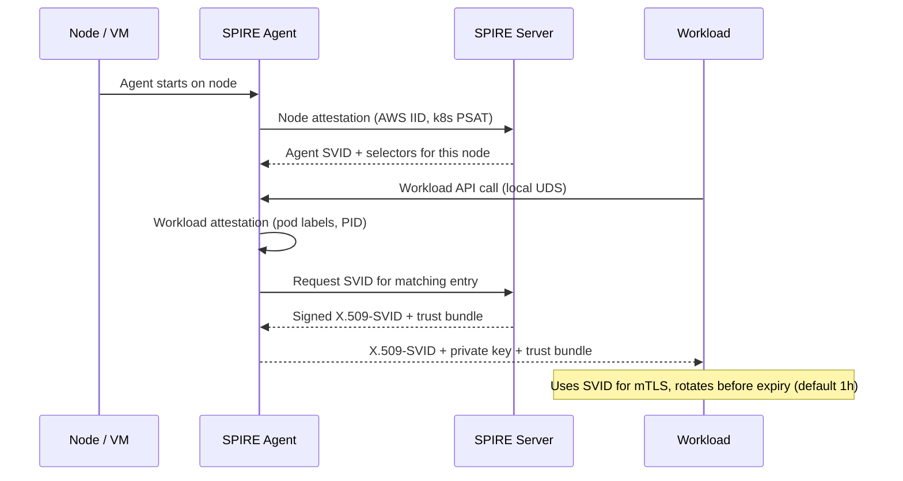
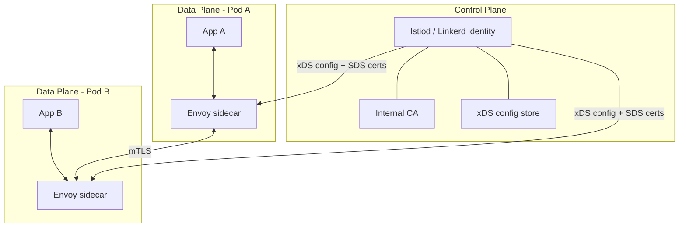

# mTLS and Service-to-Service Authentication: SPIFFE, Service Mesh, and Zero Trust

> **TL;DR**: Inside a traditional data center, services trusted callers based on network position. That model collapsed spectacularly (Target 2013: 40 million cards stolen because an HVAC vendor credential reached POS systems unchecked [^1]). Zero Trust says "authenticate every call." Mutual TLS (mTLS) is how you do it: both client and server present X.509 certificates and verify each other before any application byte flows. Doing mTLS by hand is a full-time job. Service meshes (Istio, Linkerd) and SPIFFE/SPIRE automate certificate issuance, rotation, and revocation so your application code never touches a key. Google's ALTS protects O(10^10) RPCs per second this way [^2].

## Learning Objectives

After this module, you will be able to:

- [ ] Explain the mTLS handshake and how it differs from server-only TLS
- [ ] Design certificate issuance, rotation, and revocation for short-lived workload identities
- [ ] Compare manual mTLS, service mesh mTLS (Istio, Linkerd), and SPIFFE/SPIRE
- [ ] Integrate mTLS with authorization policy (who can call what)
- [ ] Recognize when mTLS is overkill vs essential

## Intuition

You live in an apartment building with a single locked front door. Anyone who gets past that door can knock on any apartment, and residents open up because "they must be a neighbor." That is the castle-and-moat model: one perimeter, implicit trust inside.

Now imagine an attacker tailgates a delivery driver through the front door. They are inside. They can knock on every apartment, claim to be maintenance, and residents let them in. This is exactly what happened at Target in 2013: attackers stole credentials from an HVAC contractor, crossed the network perimeter, and moved laterally to point-of-sale systems across nearly all of Target's approximately 1,800 US stores because nothing inside the network challenged their identity [^1].

Zero Trust is the architectural response: every apartment gets its own deadbolt, and every visitor must show a photo ID before the door opens. In networking terms, every service presents a cryptographic certificate on every call, and the receiving service verifies it before processing a single byte. That is mutual TLS.

The challenge is operational. Imagine issuing, renewing, and revoking photo IDs for every resident every hour. That is the certificate lifecycle problem. Service meshes and SPIFFE/SPIRE exist to automate it so you can focus on building features instead of running a PKI.

## Theory

### The Zero Trust model

NIST SP 800-207 (August 2020) defines zero trust as a set of paradigms that move defenses away from static network perimeters to focus on users, assets, and resources, with authentication and authorization performed before every session to an enterprise resource [^3]. The core tenet: network location is no longer the prime component of security posture.

Google's BeyondCorp paper (Ward and Beyer, ;login: 2014) removed the privileged intranet for corporate apps. The production counterpart, documented in the BeyondProd whitepaper, applies the same principle to inter-service RPCs: "service trust should depend on characteristics like code provenance, trusted hardware, and service identity, rather than the location in the production network" [^4].

The perimeter does not disappear. Google still runs a Google Front End (GFE) that terminates public TLS and absorbs volumetric DDoS. But the GFE is not the trust gate. Every internal hop re-authenticates.

> [!IMPORTANT]
> Zero Trust is not a product you buy. It is a threat model: assume an attacker is already on the internal network. Then design accordingly.

### mTLS handshake mechanics

[Networking Fundamentals](../part-0-prerequisites/00-networking-fundamentals.md) introduced TLS 1.3 (RFC 8446) and its 1-RTT handshake. In standard TLS, only the server presents a certificate. The client verifies the server's identity but remains anonymous.

mTLS adds one step: the server sends a `CertificateRequest` message, and the client must respond with its own certificate and a `CertificateVerify` proof of possession [^5]. Both sides now know who the other is.



*A TLS 1.3 mTLS handshake completes in one round trip; the server's CertificateRequest is the only difference from standard server-authenticated TLS.*

Key properties of TLS 1.3 for mTLS:

- **1-RTT** (half the round trips of TLS 1.2). Forward secrecy is mandatory, not optional [^5].
- **Encrypted certificates.** Unlike TLS 1.2, the client certificate is never sent in the clear. An eavesdropper cannot see which service is calling.
- **No 0-RTT for mTLS.** The 0-RTT "early data" mode is replayable and unsuitable for state-changing calls. Google's ALTS explicitly skips 0-RTT for this reason [^2].

The identity claim lives in the certificate's Subject Alternative Name (SAN) extension. In a SPIFFE-aware system, the SAN is a URI like `spiffe://prod.example.com/ns/default/sa/checkout`. The verifier checks the chain to a trusted root, confirms the SAN matches the expected caller, and binds that identity to the session.

### Certificate lifecycle: issuance, rotation, revocation

Every mTLS certificate has a lifecycle: created via a Certificate Signing Request (CSR), signed by an internal CA, distributed to the workload, used for a bounded window, rotated before expiry, and invalidated on compromise.

Manual mTLS at scale is painful because all four phases are continuous operations for every workload. You must:

1. Run an internal CA (or delegate to Vault, cert-manager, SPIRE)
2. Issue per-service certificates with unique SANs
3. Rotate before expiry without downtime (graceful drain of old connections)
4. Distribute trust bundles (the CA certs peers use to verify)
5. Handle revocation when a key is compromised

**Revocation is the hardest part.** CRLs grow to megabytes. OCSP adds a round trip per handshake. OCSP stapling is not universally supported. The modern answer: make certificates so short-lived that revocation becomes unnecessary. A 1-hour cert cannot be leveraged for long. Linkerd defaults to 24-hour workload certs. SPIRE defaults to 1-hour rotation [^6]. Google's ALTS reissues workload handshake certs approximately every 48 hours and keeps CRLs as a compressed few-MB file pushed to every machine [^2].

> [!TIP]
> Short-lived certificates (hours, not years) eliminate the revocation problem entirely. If a key leaks, the cert expires before an attacker can exploit it meaningfully.

### SPIFFE and SPIRE

SPIFFE (Secure Production Identity Framework For Everyone) is a CNCF-graduated set of open standards (graduated September 20, 2022) for identifying software workloads with short-lived, cryptographically verifiable credentials, independent of any specific runtime [^7]. SPIRE is the reference implementation.

A SPIFFE ID is a URI: `spiffe://<trust-domain>/<workload-identifier>`. Examples:

```text
spiffe://prod.example.com/ns/default/sa/checkout
spiffe://acme.com/billing/payments
spiffe://staging.example.com/node/us-east-1/vm/i-0abc123
```

Identity is delivered as an SVID (SPIFFE Verifiable Identity Document) in two formats:

- **X.509-SVID**: an X.509 certificate with the SPIFFE ID as a SAN. Preferred for mTLS.
- **JWT-SVID**: a signed JWT carrying the SPIFFE ID. Used only where an L7 proxy sits in the path and cannot forward client certificates [^8].

The critical property: SPIFFE does not require the workload to hold a secret beforehand. Identity bootstraps from platform signals through attestation:

1. **Node attestation** proves which host the agent runs on (AWS instance identity document, Kubernetes Projected Service Account Token, or Intel SGX quote).
2. **Workload attestation** proves which process or pod is calling (Linux PID info, Kubernetes pod labels).

Workloads fetch SVIDs from the local SPIFFE Workload API over a Unix Domain Socket. No network call, no pre-shared secret.



*SPIRE bootstraps workload identity without a pre-shared secret: node attestation proves which host, workload attestation proves which process, and the workload receives an X.509-SVID over a local Unix Domain Socket.*

Production adopters include Uber ("the northstar foundation of securing all production interactions"), Pinterest, Bloomberg, ByteDance (hundreds of thousands of workloads), Netflix, GitHub, and HPE [^7].

### Service mesh as the practical answer

A service mesh splits network concerns out of the application into a data plane of proxies configured by a control plane. Matt Klein, creator of Envoy at Lyft (announced September 2016), defined the split: "the sidecar proxy is the data plane... responsible for conditionally translating, forwarding, and observing every network packet that flows to and from a service instance." The control plane "takes a set of isolated stateless sidecar proxies and turns them into a distributed system."

The data plane handles mTLS termination, service discovery, load balancing, retries, circuit breaking, and distributed tracing. The control plane (Istiod for Istio, Linkerd's identity component) pushes configuration via xDS APIs and signs certificates via an internal CA.



*In a service mesh, applications talk only to local sidecar proxies; the control plane configures proxies and signs their identities via a workload CA.*

**How identity issuance works in Istio:** On startup, the pilot-agent generates a private key (kept in tmpfs, never persisted to disk), sends a CSR tied to the Kubernetes ServiceAccount identity, and receives a signed X.509 certificate from Istiod's CA. The agent hands it to Envoy via the Secret Discovery Service (SDS) API and monitors expiry for rotation [^9].

**Linkerd** uses a Rust-based `linkerd2-proxy` with mTLS on by default for all TCP. Default cert lifetime: 24 hours. Default cipher: `TLS_CHACHA20_POLY1305_SHA256` over TLS 1.3. Note: since February 2024, Buoyant no longer publishes open-source stable release artifacts; stable builds (currently 2.19) require a Buoyant Enterprise subscription, though the source code remains Apache 2.0 licensed.

**Sidecar cost:** Each pod carries a proxy process (Envoy: typically 50-200 MB RSS; linkerd2-proxy: tens of MB). Latency overhead is commonly reported as 0.5-5 ms per hop depending on configuration. Istio ambient mode (GA in Istio 1.24, November 2024) moves L4 mTLS into a per-node `ztunnel` written in Rust; Istio's GA announcement notes that in some use cases "the savings can exceed 90% or more" versus sidecars [^10]. Cilium Service Mesh uses eBPF for L4 without any proxy on the data path.

### From authentication to authorization

mTLS tells you who called. Authorization policy tells you whether that caller is allowed. [Authentication vs Authorization](./00-authn-authz.md) covered this split for user-facing systems. The same principle applies service-to-service.

In Istio, two CRDs layer the controls:

- **PeerAuthentication** sets the mTLS mode: `STRICT` (reject plaintext), `PERMISSIVE` (accept both, for migrations), or `DISABLE`.
- **AuthorizationPolicy** binds identity to allowed operations. The `principals` field references the mTLS-derived SPIFFE identity.

```yaml
apiVersion: security.istio.io/v1
kind: AuthorizationPolicy
metadata:
  name: httpbin
  namespace: foo
spec:
  selector:
    matchLabels:
      app: httpbin
  action: ALLOW
  rules:
  - from:
    - source:
        principals: ["cluster.local/ns/default/sa/curl"]
    to:
    - operation:
        methods: ["GET"]
```

For more complex logic, Envoy's `ext_authz` filter offloads decisions to Open Policy Agent (OPA), which evaluates Rego policies against the SPIFFE principal and request attributes. Running OPA as a sidecar over a Unix Domain Socket avoids TCP/TLS overhead per request.

> [!NOTE]
> DENY rules evaluate before ALLOW rules in Istio. Once any ALLOW policy is attached to a workload, the default becomes deny-all for unmatched requests. Plan your migration accordingly.

### When mTLS is overkill

Not every system needs a mesh. mTLS adds operational complexity that must be justified:

- **Single-node applications** with no network calls between services gain nothing.
- **Trusted VPC with simple tokens** where compliance allows TLS-only (not mutual) and services are few.
- **Serverless behind a gateway** where the platform handles identity (AWS Lambda + IAM, Cloud Run + service accounts).

mTLS becomes essential when you have multi-tenant Kubernetes clusters, shared compute across trust zones, compliance requirements (PCI-DSS, HIPAA, FedRAMP), or cross-region communication where the network is not yours.

## Real-World Example

Google's Application Layer Transport Security (ALTS) protects O(10^10) RPCs per second across the production fleet [^2]. Development started in 2007, before TLS 1.3 existed, because TLS at the time carried too many legacy options to meet Google's security bar.

**Identity model.** ALTS binds identity to entities (users, machines, workloads) rather than hostnames. "The same identity can be used with multiple naming schemes. This level of indirection provides more flexibility and greatly simplifies the process of microservice replication, load balancing, and rescheduling between hosts" [^2]. This is the same insight SPIFFE later standardized.

**Credential types.** ALTS uses Protocol Buffers rather than X.509:

- **Master certificate**: signed by the Signing Service, essentially a constrained intermediate CA
- **Handshake certificate**: short-lived (reissued every ~48 hours by the Borgmaster), carries DH parameters
- **Resumption key**: for session resumption without a full handshake

**Handshake.** A 1-RTT authenticated Diffie-Hellman: `ClientInit -> ServerInit + ServerFinished -> ClientFinished`. AES-128-GCM is the primary record protocol. When workloads are in the same physical boundary, integrity-only protection is used; for WAN traffic, authenticated encryption activates automatically.

**Revocation.** The CRL database is "several hundred megabytes" but the compressed file pushed to every machine is only a few MB [^2].

**Key design decisions:**

- No 0-RTT: "RPC connections at Google are generally long-lived. Reducing channel setup latency was not a good tradeoff for the additional complexity and reduced security that 0-RTT handshakes require" [^2].
- PFS off by default, compensated by frequent static DH key rotation. Enabling PFS per connection is supported.
- In July 2022, Google disclosed that ALTS was using a hybrid key-exchange with post-quantum algorithms to secure internal traffic, making it one of the earliest large-scale deployments of post-quantum cryptography [^11].

The BeyondProd whitepaper documents the rollout discipline: services are onboarded with violations logged but not blocked (audit mode), until audit is clean, then switched to enforcement [^4]. This mirrors Istio's PERMISSIVE-to-STRICT migration path.

## Trade-offs

| Approach | Pros | Cons | Best When | Our Pick |
|---|---|---|---|---|
| JWT service tokens | No CA infra; stateless verification | Bearer tokens (replayable); require careful exp/aud | Cross-org, L7 gateways where mTLS is infeasible | Supplement mTLS, not replace it |
| Manual mTLS | Strong mutual identity | Cert management is a full-time job; any mistake is an outage | A handful of high-value point-to-point flows | Only if you cannot run a mesh |
| Service mesh (Istio, Linkerd) | Automatic mTLS; policy CRDs; unified telemetry | Mesh ops burden; sidecar latency/memory; new failure domain; Linkerd stable builds require commercial license since Feb 2024 | Large Kubernetes deployments, mixed-language | Default for K8s with > 20 services |
| SPIFFE/SPIRE (without mesh) | Platform-agnostic (K8s, VMs, bare metal); attestation-based | Still need transport glue; SPIRE is a new system to operate | Multi-platform, multi-cloud, federated trust | When you outgrow a single cluster |

## Common Pitfalls

> [!WARNING]
> **Shared secrets or API keys between services.** Rotation becomes a coordinated outage, leaks are silent (the secret keeps working), and the token carries no cryptographic identity. If service A's key is stolen, any attacker can impersonate A with no way to tell legitimate traffic apart. Move to mTLS, SPIFFE SVIDs, or signed service JWTs for any new service-to-service flow; keep shared secrets only for legacy vendors that give you no other option.

> [!WARNING]
> **Long-lived certificates with no revocation story.** Teams default to 1-year certs because rotation scripts are painful, then discover they have no way to invalidate a compromised key. Use short lifetimes (hours or days) plus automatic rotation. If your cert's `notAfter` is more than 90 days out, investigate.

> [!WARNING]
> **PERMISSIVE mode left on in production.** PERMISSIVE accepts plaintext alongside mTLS. If it outlives the migration window, attackers on the pod network can reach workloads without presenting identity, and `source.principal`-based policies are bypassed on plaintext traffic. Set a deadline, alert on PERMISSIVE in prod, and enforce STRICT.

> [!WARNING]
> **Same certificate shared across multiple services.** A shared cert means identity is ambiguous. Authorization cannot distinguish which service called. Compromise of one service compromises the identity for all. Issue one cert per workload with a unique SAN.

> [!WARNING]
> **Sidecar bypass via hostNetwork or privileged containers.** Pods with `hostNetwork: true` bypass iptables rules that redirect traffic through the sidecar. The proxy sees no traffic, mTLS is not applied, and peers cannot verify the pod's identity. Block hostNetwork in non-system namespaces via PodSecurityAdmission or OPA policy.

> [!WARNING]
> **Bypassing mTLS for "admin" or "break-glass" paths.** Operators open a non-mTLS port for debugging. Once it exists, it gets used. Authorization that relied on mTLS-derived identity is entirely skipped. Require break-glass paths to also authenticate with a separate short-lived admin SVID.

## Exercise

Design service-to-service authentication for a 40-service Kubernetes platform serving an e-commerce company. The platform runs in two regions, handles PCI-scoped payment flows, and has a mix of Java, Go, and Python services. Decide between Istio, Linkerd, SPIRE + custom glue, and JWT service tokens. Specify: identity format, cert rotation cadence, authorization policy engine, and how you onboard a new service.

<details>
<summary>Hint</summary>

PCI-DSS requires encryption of cardholder data in transit and strong access controls. Two regions means you need a shared trust anchor. Think about what happens during the migration from no-mTLS to full-mTLS (PERMISSIVE mode). Consider which services are PCI-scoped vs general.

</details>

<details>
<summary>Solution</summary>

**Choice: Istio with STRICT mTLS and SPIFFE identities.**

**Why Istio over Linkerd:** Two regions with PCI compliance need fine-grained AuthorizationPolicy (Linkerd's policy is less mature for cross-namespace deny rules). Istio's SPIFFE-based identity (`cluster.local/ns/<ns>/sa/<sa>`) maps cleanly to Kubernetes ServiceAccounts.

**Identity format:** SPIFFE URI as X.509 SAN. Each service gets a unique Kubernetes ServiceAccount, producing identities like `spiffe://cluster.local/ns/payments/sa/checkout`.

**Cert rotation:** Default Istio rotation (24 hours for workload certs). For PCI-scoped services in the `payments` namespace, override to 1 hour via mesh-wide config. Trust anchor managed by cert-manager with a 10-year root and 1-year intermediate, rotated annually.

**Authorization policy:**

```yaml
apiVersion: security.istio.io/v1
kind: AuthorizationPolicy
metadata:
  name: payment-gateway
  namespace: payments
spec:
  selector:
    matchLabels:
      app: payment-gateway
  action: ALLOW
  rules:
  - from:
    - source:
        principals:
          - "cluster.local/ns/checkout/sa/checkout-service"
          - "cluster.local/ns/orders/sa/order-service"
    to:
    - operation:
        methods: ["POST"]
        paths: ["/api/v1/charge"]
```

All other traffic to the payment gateway is denied by default.

**Onboarding a new service:**

1. Create a Kubernetes ServiceAccount for the service.
2. Deploy with Istio sidecar injection enabled (namespace label `istio-injection=enabled`).
3. The sidecar automatically gets an SVID on startup. No code changes.
4. Add AuthorizationPolicy rules for any services it needs to call or be called by.
5. Verify with `istioctl authz check <pod>` and monitor `istio_requests_total` for denied traffic.

**Migration path:** Start with `PeerAuthentication: PERMISSIVE` cluster-wide. Monitor `connection_security_policy` metrics. Once all traffic shows `mutual_tls`, switch to STRICT namespace by namespace, starting with PCI-scoped namespaces.

</details>

## Key Takeaways

- Zero Trust treats the internal network as hostile. mTLS is the concrete mechanism that implements per-call authentication between services.
- TLS 1.3 mTLS completes in 1-RTT with encrypted certificates. The server's `CertificateRequest` message is the only addition over standard TLS.
- Short-lived certificates (1 hour to 24 hours) eliminate the revocation problem. If a key leaks, the cert expires before meaningful exploitation.
- SPIFFE provides a platform-agnostic identity format (`spiffe://trust-domain/path`). SPIRE bootstraps identity from platform signals without pre-shared secrets.
- Service meshes (Istio, Linkerd) automate mTLS so application code never touches certificates. The sidecar proxy handles termination, rotation, and policy enforcement.
- mTLS authenticates (who is calling); AuthorizationPolicy or OPA authorizes (are they allowed). Both layers are required. Never conflate them.
- For small deployments without compliance requirements, mTLS may be overkill. For multi-tenant Kubernetes, PCI/HIPAA/FedRAMP environments, or cross-region traffic, it is effectively mandatory.

## Further Reading

- [NIST SP 800-207: Zero Trust Architecture](https://csrc.nist.gov/pubs/sp/800/207/final) - The US federal reference definition of zero trust; short, readable, and the authoritative source for the seven tenets.
- [BeyondProd (Google Cloud)](https://cloud.google.com/docs/security/beyondprod) - Google's production-side zero-trust playbook; the best real-world articulation of service identity, code provenance, and policy enforcement at scale.
- [Application Layer Transport Security (ALTS)](https://cloud.google.com/docs/security/encryption-in-transit/application-layer-transport-security) - How a fleet handling 10^10 RPCs/sec does mutual authentication; protocol, credentials, and design trade-offs spelled out.
- [RFC 8446: TLS 1.3](https://datatracker.ietf.org/doc/html/rfc8446) - The canonical spec; readable; important for understanding 1-RTT, 0-RTT replay risk, and the CertificateRequest flow.
- [SPIFFE Concepts](https://spiffe.io/docs/latest/spiffe-about/spiffe-concepts/) - SPIFFE ID, SVID, trust bundle, and Workload API explained in one page; the starting point for any SPIFFE adoption.
- [Istio Security Concepts](https://istio.io/latest/docs/concepts/security/) - PeerAuthentication, AuthorizationPolicy, SDS, and secure naming with concrete YAML examples.
- [Linkerd Automatic mTLS](https://linkerd.io/2.19/features/automatic-mtls/) - The simpler mental model; explains the trade-offs of defaulting mTLS on for all TCP with zero configuration. Note: as of February 2024, Buoyant no longer produces open-source stable release artifacts; stable builds require a Buoyant Enterprise subscription.
- [Uber: Our Journey Adopting SPIFFE/SPIRE at Scale](https://www.uber.com/blog/our-journey-adopting-spiffe-spire/) - A large-scale zero-trust migration narrative from an end user; covers the "why" and the operational lessons.

## Flashcards

**Q:** What is the difference between TLS and mTLS?
**A:** In standard TLS, only the server presents a certificate and the client verifies it. In mTLS, both sides present certificates and verify each other. The server sends a `CertificateRequest` message to trigger the client's certificate presentation.

**Q:** What is a SPIFFE ID and what does it look like?
**A:** A SPIFFE ID is a URI that identifies a workload: `spiffe://<trust-domain>/<workload-path>`. Example: `spiffe://prod.example.com/ns/default/sa/checkout`. It appears as a SAN in the workload's X.509 certificate.

**Q:** How does SPIRE bootstrap identity without a pre-shared secret?
**A:** Through two-phase attestation. Node attestation proves which host the agent runs on (using platform evidence like AWS instance identity documents). Workload attestation proves which process is calling (using pod labels or PID info). The workload receives its SVID over a local Unix Domain Socket.

**Q:** Why do short-lived certificates eliminate the need for CRLs?
**A:** A certificate that expires in 1 hour cannot be exploited for long even if the key is compromised. By the time an attacker could use a stolen key, the cert has already expired. This removes the need for CRL distribution or OCSP round trips.

**Q:** What is the role of the sidecar proxy in a service mesh?
**A:** The sidecar (Envoy or linkerd2-proxy) intercepts all network traffic to and from the application pod. It terminates and originates mTLS, enforces authorization policy, handles retries and timeouts, and reports telemetry. The application code is unaware of the security layer.

**Q:** What are Istio's three PeerAuthentication modes?
**A:** STRICT (reject plaintext, require mTLS), PERMISSIVE (accept both mTLS and plaintext, used during migrations), and DISABLE (turn off mTLS). Production should always end at STRICT.

**Q:** What is the "new enemy problem" that PERMISSIVE mode creates?
**A:** In PERMISSIVE mode, AuthorizationPolicy rules that depend on `source.principal` (the mTLS-derived identity) are bypassed on plaintext traffic because the principal is empty. An attacker on the pod network can reach workloads without presenting any identity.

**Q:** How does Google ALTS differ from standard mTLS?
**A:** ALTS uses Protocol Buffers instead of X.509, binds identity to entities (not hostnames), uses integrity-only protection within physical boundaries and full encryption for WAN, and skips 0-RTT because Google's RPCs are long-lived. It protects O(10^10) RPCs/sec.

**Q:** When is mTLS overkill?
**A:** Single-node applications, small deployments in a trusted VPC where compliance allows TLS-only, and serverless functions behind a platform gateway that handles identity (AWS Lambda + IAM). If you have fewer than 5 services and no compliance mandate, signed JWTs may suffice.

**Q:** What is the relationship between mTLS and authorization?
**A:** mTLS provides authentication (verified identity of the caller). Authorization is a separate layer that decides whether that identity is allowed to perform the requested operation. Both are required. Istio separates them into PeerAuthentication (mTLS) and AuthorizationPolicy (who can call what).

**Q:** What is Istio ambient mode and why does it exist?
**A:** Ambient mode moves L4 mTLS from per-pod sidecars into a per-node `ztunnel` proxy; Istio reports savings can exceed 90% versus sidecars in some use cases. L7 policy still requires an optional waypoint proxy. Ambient reached GA in Istio 1.24 (November 2024). It exists because sidecar overhead (50-200 MB RSS per pod) is a real cost at scale.

**Q:** Name three SPIFFE/SPIRE production adopters and the scale signal.
**A:** Uber (calls SPIFFE "the northstar foundation of securing all production interactions"), ByteDance (hundreds of thousands of workloads), and Netflix. SPIFFE/SPIRE graduated from CNCF on September 20, 2022, signaling production maturity.

## References

[^1]: Jaikumar Vijayan, "Target breach happened because of a basic network segmentation error", Computerworld, Feb 6, 2014. https://www.computerworld.com/article/2487425/target-breach-happened-because-of-a-basic-network-segmentation-error.html
[^2]: Google Cloud, "Application Layer Transport Security", whitepaper last updated October 2025. https://cloud.google.com/docs/security/encryption-in-transit/application-layer-transport-security
[^3]: NIST Special Publication 800-207, "Zero Trust Architecture", Rose, Borchert, Mitchell, Connelly, August 2020. https://csrc.nist.gov/pubs/sp/800/207/final
[^4]: Google Cloud, "BeyondProd", updated May 2024. https://cloud.google.com/docs/security/beyondprod
[^5]: E. Rescorla, "The Transport Layer Security (TLS) Protocol Version 1.3", RFC 8446, August 2018. https://datatracker.ietf.org/doc/html/rfc8446
[^6]: SPIRE Server Configuration Reference, default_x509_svid_ttl = 1h. https://spiffe.io/docs/latest/deploying/spire_server/
[^7]: CNCF Announcement, "SPIFFE and SPIRE Projects Graduate from Cloud Native Computing Foundation Incubator", Sep 20, 2022. https://www.cncf.io/announcements/2022/09/20/spiffe-and-spire-projects-graduate-from-cloud-native-computing-foundation-incubator/
[^8]: SPIFFE Concepts documentation. https://spiffe.io/docs/latest/spiffe-about/spiffe-concepts/
[^9]: Istio 1.29 documentation, "Security". https://istio.io/latest/docs/concepts/security/
[^10]: Lin Sun, "Fast, Secure, and Simple: Istio's Ambient Mode Reaches General Availability in v1.24", Istio Blog, Nov 7, 2024. https://istio.io/latest/blog/2024/ambient-reaches-ga/
[^11]: Google Cloud Blog, "How Google is preparing for a post-quantum world", Phil Venables, Jul 7, 2022. https://cloud.google.com/blog/products/identity-security/how-google-is-preparing-for-a-post-quantum-world
