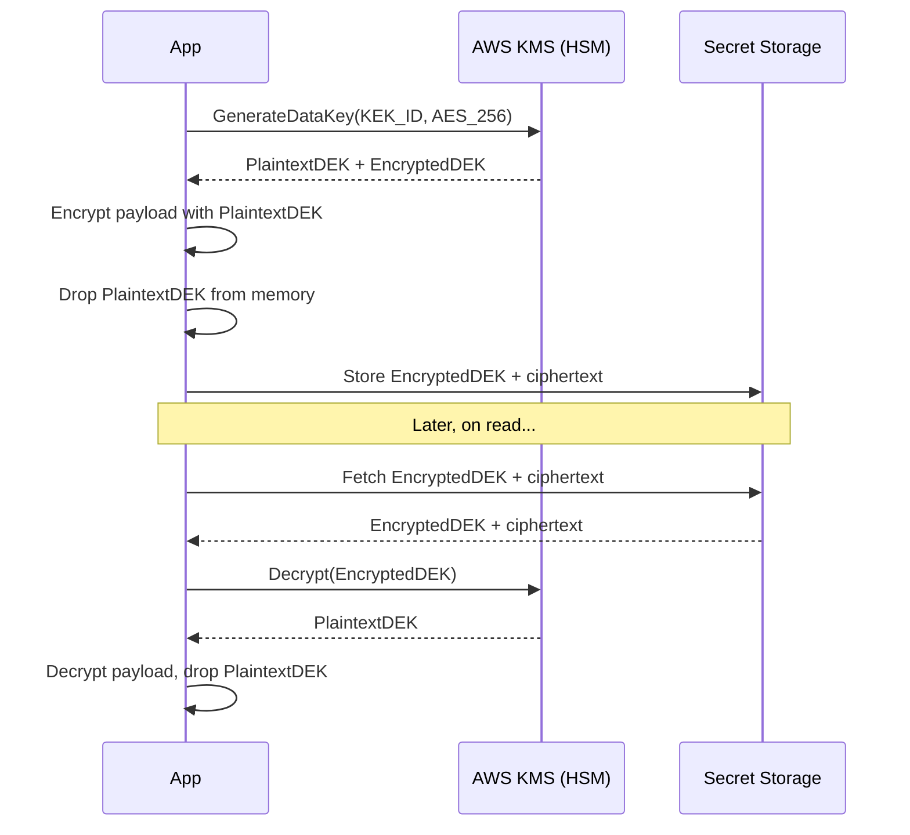
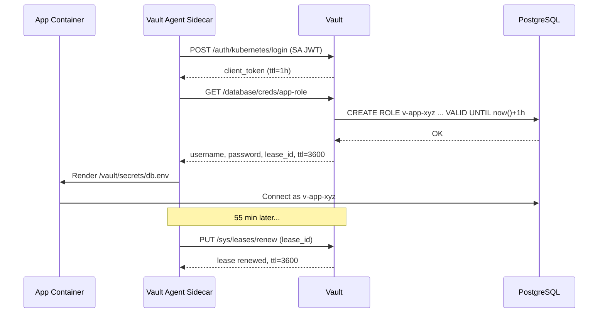
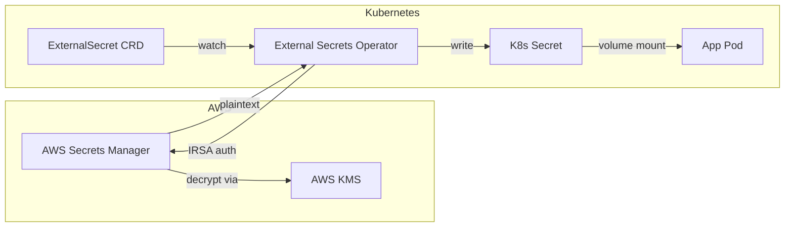

# Secrets Management: Vault, KMS, and the End of Secrets in Config Files

> **TL;DR**: A secret (database password, API key, TLS private key) must be plaintext at runtime but encrypted everywhere else. Hardcoded secrets in config files and environment variables are the #1 cause of catastrophic breaches: Uber's 2016 leak of 57 million user records started with AWS credentials committed to a private GitHub repo [^1]. The fix is a centralized secret manager (HashiCorp Vault, AWS Secrets Manager, GCP Secret Manager) backed by envelope encryption, where a KMS-protected master key encrypts per-record data keys that never leave memory. The killer feature is dynamic secrets: per-request, short-lived credentials that expire before an attacker can use them. If it expires in 30 minutes, it does not matter if it leaks.

## Learning Objectives

After this module, you will be able to:

- [ ] Move secrets out of config files and into a proper secrets manager
- [ ] Explain envelope encryption and KMS-managed data keys
- [ ] Design dynamic secret issuance for databases and cloud credentials
- [ ] Integrate secrets into Kubernetes via External Secrets, CSI, or Vault Agent
- [ ] Detect and respond to secret leakage (Gitleaks, GitHub secret scanning)

## Intuition

You keep your house key on your person. You do not tape it to the front door, write the address on it, and hope nobody walks by. Yet that is exactly what engineers do with database passwords: they commit them to source control, paste them into CI environment variables, and share them in Slack.

Now imagine a locksmith who cuts you a new key every morning. Each key works for 8 hours, then the lock rejects it. If someone photographs your key at lunch, by dinner it is useless. That is the dynamic-secrets model: credentials that self-destruct on a schedule.

The locksmith needs a master key to cut new ones. That master key lives in a vault (literally, a safe bolted to the floor). Nobody carries the master key around. When you need a fresh daily key, you prove your identity to the locksmith, the locksmith uses the master key inside the vault, and hands you a time-limited copy. The master key never leaves the vault. That is envelope encryption: the master key (KEK) encrypts short-lived data keys (DEKs), and the DEKs do the actual work.

This chapter walks you through the evolution from "password in a config file" to "ephemeral credential issued on demand, audited, and automatically revoked." [Authentication vs Authorization](./00-authn-authz.md) covered how you prove identity. This chapter covers what happens to the secrets that identity systems protect.

## Theory

### Where secrets should not live

Secrets committed to source control persist in git history forever. Deleting the file in the next commit does not help: every clone, every fork, every backup contains the plaintext. Environment variables appear in `/proc/<pid>/environ`, crash dumps, and CI build logs. Kubernetes Secret objects are base64-encoded, not encrypted, and are stored unencrypted in etcd by default [^2].

The consequences are not theoretical. In 2016, attackers accessed a private GitHub repository used by Uber engineers, found AWS access keys in the code, and used those keys to read an S3 bucket containing 57 million users' names, emails, and phone numbers, plus 600,000 drivers' license numbers [^1]. Uber paid the attackers $100,000 through its bug bounty program to suppress disclosure, then paid a $148 million settlement to US attorneys general for the cover-up [^3].

CircleCI's January 2023 breach followed a similar pattern. Malware on an engineer's laptop stole a post-2FA session cookie. The attacker used that token to extract encryption keys from running processes and decrypt customer secrets (environment variables, OAuth tokens, AWS keys) stored in CircleCI's production database. The advisory to all customers: rotate every secret stored in CircleCI between December 16, 2022 (the date the engineer's laptop was compromised) and January 4, 2023 [^4].

The lesson: secrets must never live in a location where compromise of that location grants access to the secret without an additional authentication step.

### Envelope encryption and KMS

Encrypting every secret directly with an HSM-resident master key would require an HSM round-trip for every read and write. At scale, that is too slow and too expensive. Envelope encryption solves this with a two-tier key hierarchy.

The client calls `GenerateDataKey` on the KMS, specifying the master key (KEK) and a key spec (e.g., AES-256). KMS returns two things: a plaintext data encryption key (DEK) and a copy of that DEK encrypted under the KEK. The client encrypts the payload in memory with the plaintext DEK, drops the plaintext DEK immediately, and stores the encrypted DEK alongside the ciphertext. On read, the client sends the encrypted DEK back to KMS for decryption, uses the resulting plaintext DEK to decrypt the payload, and drops the DEK again [^5].

AWS Secrets Manager uses exactly this pattern: "Secrets Manager does not use the KMS key to encrypt the secret value directly. Instead, it uses the KMS key to generate and encrypt a 256-bit AES symmetric data key, and uses the data key to encrypt the secret value" [^5].

*The plaintext DEK lives in application memory for microseconds. The KEK never leaves the HSM. Rotating the KEK requires only re-wrapping the DEKs, not re-encrypting petabytes of data.*

Why this matters:

- The KEK never leaves the HSM boundary. Compromising storage yields only ciphertext and wrapped DEKs.
- Rotating the KEK does not require re-encrypting all payload data. You re-wrap the DEKs under the new KEK.
- AWS KMS HSMs were validated at FIPS 140-3 Security Level 3 in February 2025 [^6], satisfying banking and government compliance requirements.
- Cost is manageable: $1/month per customer-managed key, $0.03 per 10,000 symmetric API requests.

### Dynamic secrets

Static credentials are a liability because their blast radius is unbounded in time. A leaked database password is valid until someone remembers to rotate it. Dynamic secrets eliminate this class of risk.

Vault's database secrets engine is configured with a privileged root connection to a database and a role that templates a SQL creation statement. When an application requests credentials, Vault generates a unique username and password, executes `CREATE ROLE ... WITH LOGIN PASSWORD ... VALID UNTIL ...`, and returns the credentials with a lease ID and TTL (typically 1 hour). When the lease expires, Vault runs a revocation statement that drops the role [^7].

*The application never sees the Vault token or the root database credential. It reads a rendered config file from a shared tmpfs volume. Leaked credentials expire before investigation begins.*

The same pattern works for cloud credentials. Vault's AWS secrets engine assumes an IAM role and returns STS temporary credentials that are "time-based and are automatically revoked when the Vault lease expires" [^8]. For CI/CD pipelines, OIDC federation (CircleCI or GitHub Actions issues a signed JWT that AWS STS trusts directly) eliminates long-lived cloud keys entirely.

> [!IMPORTANT]
> Dynamic secrets require applications to handle credential renewal. Naive code that caches credentials for the process lifetime will break when the lease expires. Use Vault Agent's template rendering or a connection-pool rebind on refresh.

### Secrets in Kubernetes

Kubernetes has three mainstream patterns for getting external secrets into pods without re-introducing plaintext leaks.

**External Secrets Operator (ESO)** is a CNCF sandbox project. A controller watches `ExternalSecret` CRDs, calls the external provider (Vault, AWS Secrets Manager, GCP Secret Manager, Azure Key Vault, and 20+ others), and writes a native Kubernetes `Secret` object. Applications consume the Secret normally. Rotation in the external store propagates automatically on the next `refreshInterval` [^9].

**Secrets Store CSI Driver** mounts secrets directly into the pod's filesystem as a tmpfs volume via a CSI driver. The secret is never stored in etcd. This eliminates the "base64 in etcd" problem entirely but requires every node to support the CSI volume type [^10].

**Vault Agent Injector** is a mutating webhook that injects a sidecar into annotated pods. The sidecar authenticates to Vault with the pod's projected service account token, fetches secrets, and renders them to shared volume files. It handles lease renewal and template rendering natively [^11].

*ESO pulls secrets on a schedule. The app consumes a normal Kubernetes Secret. Rotation in AWS propagates automatically on the next refresh cycle.*

**The recommendation for a Kubernetes-on-AWS team in 2026:** External Secrets Operator + AWS Secrets Manager + IRSA (IAM Roles for Service Accounts) + OIDC from CI. For a multi-cloud regulated team: Vault Enterprise (now IBM-owned, BSL-licensed) with auto-unseal via cloud KMS, or OpenBao (the CNCF Sandbox open-source fork) for teams requiring a permissive license.

### Leak detection and response

Prevention fails. You need detection as a second layer.

**GitHub Secret Scanning** runs server-side against every push, covering hundreds of provider-specific token formats across a large partner program. Push protection blocks the commit at the git protocol level before it lands on the server. When a public leak is detected, GitHub's partner program notifies the issuing provider (AWS, Stripe, Slack), which can auto-revoke the token within seconds [^12].

**Gitleaks and TruffleHog** are open-source regex-plus-entropy scanners that run in CI or as pre-commit hooks. They scan `git log -p` output (requiring `fetch-depth: 0` in CI) and fail the build on any match.

**Incident response** follows a strict order: rotate the leaked credential immediately, revoke active sessions derived from it, audit logs to find all uses during the leak window, determine blast radius, notify affected parties. Rotate first, investigate second. Every minute delayed is a minute the attacker can use the credential.

> [!TIP]
> Deploy canary tokens (fake AWS keys, fake database passwords) in honeypot locations. If they are ever used, you know you have an active intruder, and you know exactly which location was compromised.

## Real-World Example

Adobe runs HashiCorp Vault Enterprise as a platform-as-a-service for its entire engineering organization. (Note: HashiCorp switched Vault from MPL 2.0 to the Business Source License in August 2023. IBM completed its acquisition of HashiCorp on February 27, 2025. The open-source community forked Vault as OpenBao under the Linux Foundation, which entered the CNCF Sandbox in December 2023.) According to a HashiConf presentation, the deployment spans approximately 100,000 hosts across four regions, supporting over 20 products and trillions of transactions per year [^13]. After two years in production, 130+ internal teams had reportedly onboarded to the shared Vault service.

**Architecture decisions:**

- **Shared service model.** One Vault platform team operates the cluster; individual product teams onboard via self-service namespaces. This is the same consolidation argument as a central Kubernetes cluster versus every team running their own.
- **Auto-unseal via cloud KMS.** Vault's default Shamir seal requires M-of-N human operators to reconstruct the master key after every restart. At 3 AM, across 5 regions, that is a reliability crisis. Auto-unseal delegates the unseal operation to a cloud KMS key, keeping Shamir as the disaster-recovery seal only.
- **Auth methods.** Kubernetes service account JWT for containerized workloads, AWS IAM for EC2-based services, AppRole for legacy batch jobs.
- **Secret engines.** KV v2 for static credentials with versioning, database engine for dynamic PostgreSQL and MySQL credentials, PKI engine for internal mTLS certificates (see [mTLS and Service-to-Service Authentication](./03-mtls-service-auth.md)), and transit engine for encryption-as-a-service where applications send plaintext and receive ciphertext without ever handling a DEK.

The result: validation time for secret access dropped from approximately 1 hour (manual approval) to seconds (policy-based). The platform team manages one Vault cluster instead of 20 product teams each running their own, with consistent audit logging across the organization.

## Trade-offs

| Approach | Pros | Cons | Best When | Our Pick |
|---|---|---|---|---|
| Kubernetes Secrets | Built-in, simple consumption | Base64, not encryption; stored unencrypted in etcd by default | Small clusters with etcd encryption at rest enabled | Only with KMS-backed etcd encryption |
| Cloud secrets manager (AWS SM / GCP SM) | Managed, IAM-integrated, auto-rotation via Lambda | Vendor lock-in; $0.40/secret/month adds up | Single-cloud teams, compliance-sensitive workloads | Default for single-cloud |
| HashiCorp Vault (BSL-licensed since Aug 2023; IBM-owned since Feb 2025) | Dynamic secrets, multi-cloud, transit/PKI engines | BSL license (not open-source); ops burden: unseal, HA storage, upgrades | Large orgs, multi-cloud, regulated industries | Default for multi-cloud |
| OpenBao (CNCF Sandbox, Linux Foundation fork of Vault) | Open-source (MPL 2.0), community-governed, API-compatible with Vault | Younger ecosystem, fewer enterprise integrations | Teams needing an open-source Vault alternative | Evaluate for open-source mandate |
| External Secrets Operator | Best of cloud + Kubernetes; GitOps-native | More moving parts; ultimately writes to etcd | Kubernetes + cloud secret manager, many teams | Default for K8s-on-cloud |
| Secrets Store CSI Driver | Bypasses etcd entirely, pod-scoped mount | Every node needs CSI support; apps must read files | High-compliance Kubernetes workloads | When etcd exposure is unacceptable |

## Common Pitfalls

> [!WARNING]
> **Env vars and `.env` files as your secrets layer.** Env vars leak through `/proc/<pid>/environ` to any process with matching UID, show up in crash dumps, and get echoed into CI logs when a script runs `set -x`. Config files get committed "just for local dev" and rotation means a re-deploy across every service. There is no audit trail for "who read this secret and when." Use a real secrets manager (cloud SM, Vault, ESO) for anything past the first commit.

> [!WARNING]
> **Plaintext secrets in source control.** A committed secret, even one deleted in the next commit, persists in git history forever and in every clone and fork. The only safe response is immediate rotation. Do not attempt to rewrite git history first.

> [!WARNING]
> **Treating Kubernetes Secrets as encryption.** The word "Secret" in the API name suggests protection that is not there. The value is base64-encoded, not encrypted. Anyone with RBAC `secrets:get` on the namespace can decode it with `base64 -d`. Enable etcd encryption at rest with a KMS provider [^2].

> [!WARNING]
> **Long-lived static credentials with no rotation.** "Rotation is scheduled for next quarter." It never is. CircleCI customers who stored long-lived AWS keys instead of using OIDC federation had to treat every key as compromised in January 2023 [^4]. Use dynamic secrets where the engine supports it.

> [!WARNING]
> **Manual Vault unseal in production.** Shamir's Secret Sharing requires M-of-N human operators after every restart. At 3 AM across 5 regions, this is a pager nightmare. Use auto-unseal via cloud KMS for operational seals; keep Shamir as the disaster-recovery fallback only.

> [!WARNING]
> **Secrets in log lines and error responses.** Connection strings, API keys, and tokens appear in stack traces, debug logs, and HTTP error bodies. Sanitize all logging output. Never include credentials in error messages returned to clients.

## Exercise

Design the secrets layer for a platform with 30 microservices running on Kubernetes (AWS EKS), PostgreSQL databases, Stripe and SendGrid API keys, and a GitHub Actions CI/CD pipeline. Specify: (1) which tool manages which secret type, (2) rotation cadence per secret type, (3) the developer UX for accessing secrets locally and in production, and (4) the incident response plan for a committed-secret event.

Hint

Classify secrets by whether they can be dynamic (database credentials) or must be static (third-party API keys like Stripe). For static secrets, rotation cadence depends on the provider's support. For CI, think about eliminating long-lived credentials entirely via OIDC.

Solution

**Tool selection:**

- **AWS Secrets Manager** for Stripe and SendGrid API keys (static, rotated quarterly via Lambda).
- **Vault database engine** for PostgreSQL credentials (dynamic, 1-hour TTL, per-pod unique username).
- **External Secrets Operator** to sync both into Kubernetes Secrets consumed by pods.
- **GitHub Actions OIDC** to assume AWS IAM roles directly in CI, eliminating stored AWS keys entirely.

**Rotation cadence:**

| Secret type | Rotation | Mechanism |
|---|---|---|
| PostgreSQL credentials | Every 1 hour (dynamic) | Vault database engine, automatic |
| Stripe API key | Every 90 days | AWS Secrets Manager + Lambda rotation function |
| SendGrid API key | Every 90 days | AWS Secrets Manager + Lambda rotation function |
| TLS certificates | Every 30 days | Vault PKI engine, auto-renewal |
| CI cloud credentials | Per-job (minutes) | OIDC federation, no stored keys |

**Developer UX:**

- Local development: `vault login` with OIDC SSO, then `vault read database/creds/dev-role` for a personal short-lived DB credential. A `.env.vault` wrapper script handles this transparently.
- Production: pods get secrets via ESO-managed Kubernetes Secrets mounted as files. Developers never see production credentials.
- Secret creation: PR to a Terraform module that declares the `ExternalSecret` CRD and the Vault role. Reviewed, merged, applied.

**Incident response for a committed secret:**

1. Rotate the secret immediately (Secrets Manager API or Vault revoke).
2. Revoke any sessions or tokens derived from it.
3. Audit CloudTrail and Vault audit logs for unauthorized use during the exposure window.
4. Determine blast radius: what data was accessible with that credential?
5. Add the secret pattern to Gitleaks config and enable GitHub push protection for the repository.
6. Post-mortem: why did the pre-commit hook not catch it?

## Key Takeaways

- Static long-lived secrets are a liability. Dynamic, short-lived credentials are the modern default.
- Envelope encryption keeps the master key in an HSM and uses per-record data keys for performance. Rotating the KEK does not require re-encrypting data.
- Kubernetes Secrets are base64, not encryption. Enable etcd encryption at rest with a KMS provider, or bypass etcd entirely with the CSI driver.
- For Kubernetes-on-AWS: External Secrets Operator + AWS Secrets Manager + IRSA. For multi-cloud: Vault Enterprise (IBM/HashiCorp, BSL-licensed) with auto-unseal, or OpenBao (CNCF Sandbox, open-source fork) for permissive-license requirements.
- If a secret leaks, rotate first, investigate second. Every minute of delay is a minute the attacker can act.
- Secret scanning (GitHub, Gitleaks, TruffleHog) is a detection layer, not prevention. Combine with push protection to block commits before they land.
- Audit everything. Vault and KMS produce audit logs that are the investigative substrate during a breach.

## Further Reading

- [HashiCorp Vault Architecture](https://developer.hashicorp.com/vault/docs/internals/architecture) - The canonical description of Vault's barrier, seal/unseal, and secret engine pipeline. Read before operating Vault in production.
- [AWS Secrets Manager Encryption and Decryption](https://docs.aws.amazon.com/secretsmanager/latest/userguide/security-encryption.html) - The exact envelope-encryption flow with GenerateDataKey, EncryptionContext, and CloudTrail audit entries.
- [CircleCI Incident Report, January 4, 2023](https://circleci.com/blog/jan-4-2023-incident-report/) - Public post-mortem showing how a session-cookie theft cascaded into full customer-secret exfiltration. Required reading for CI/CD security.
- [OWASP Secrets Management Cheat Sheet](https://cheatsheetseries.owasp.org/cheatsheets/Secrets_Management_Cheat_Sheet.html) - Practical checklist from an auditor's viewpoint covering storage, rotation, and incident response.
- [External Secrets Operator Documentation](https://external-secrets.io/) - CRDs, SecretStore, ClusterSecretStore, and 20+ provider plugins for Kubernetes integration.
- [Secrets Store CSI Driver](https://secrets-store-csi-driver.sigs.k8s.io/) - The SIG-Auth-maintained alternative that bypasses etcd entirely by mounting secrets as tmpfs volumes.
- [GitHub Secret Scanning](https://docs.github.com/en/code-security/secret-scanning) - What is scanned, the partner auto-revocation program, and push protection configuration.
- [Gitleaks](https://github.com/gitleaks/gitleaks) - The open-source reference for local and CI secret scanning. Config format is widely adopted across the industry.

## Flashcards

**Q:** What is envelope encryption?
**A:** A two-tier key hierarchy where a data encryption key (DEK) encrypts the payload, and a key encryption key (KEK) protected by an HSM encrypts the DEK. The KEK never leaves the HSM; the plaintext DEK lives in memory only during encryption/decryption.

**Q:** Why does rotating the KEK not require re-encrypting all data?
**A:** Only the wrapped DEKs need to be re-encrypted under the new KEK. The payload ciphertext remains unchanged because it was encrypted with the DEK, not the KEK directly.

**Q:** What is a dynamic secret?
**A:** A per-request, short-lived credential generated on demand by the secret manager (e.g., Vault database engine creates a unique Postgres user with a 1-hour TTL). When the lease expires, the credential is automatically revoked.

**Q:** Why are Kubernetes Secrets not actually secret by default?
**A:** They are base64-encoded, not encrypted, and stored unencrypted in etcd. Anyone with RBAC read access on the namespace can decode them. You must enable etcd encryption at rest with a KMS provider for actual confidentiality.

**Q:** What three Kubernetes patterns exist for consuming external secrets?
**A:** (1) External Secrets Operator syncs from external stores to native K8s Secrets. (2) Secrets Store CSI Driver mounts secrets as tmpfs volumes, bypassing etcd. (3) Vault Agent Injector runs a sidecar that authenticates to Vault and renders secrets to shared files.

**Q:** What was the root cause of the Uber 2016 breach?
**A:** AWS access keys committed to a private GitHub repository. Attackers found the keys and used them to access an S3 bucket containing 57 million users' PII. The keys were long-lived and had overly broad IAM permissions.

**Q:** What is the correct order of incident response when a secret leaks?
**A:** Rotate immediately, revoke derived sessions, audit logs for unauthorized use, determine blast radius, notify affected parties. Rotate first, investigate second.

**Q:** What problem does Vault auto-unseal solve?
**A:** Vault's default Shamir seal requires M-of-N human operators to reconstruct the master key after every restart. Auto-unseal delegates this to a cloud KMS key, eliminating the operational burden of assembling key shards at 3 AM across multiple regions.

**Q:** How does GitHub Secret Scanning's partner program reduce blast radius?
**A:** When a public leak is detected, GitHub notifies the issuing provider (AWS, Stripe, Slack), which can auto-revoke the token within seconds, closing the window between leak and abuse.

**Q:** What is the recommended secrets stack for a Kubernetes-on-AWS team in 2026?
**A:** External Secrets Operator + AWS Secrets Manager + IRSA (IAM Roles for Service Accounts) for runtime secrets, plus OIDC federation from CI (GitHub Actions or similar) to eliminate long-lived cloud credentials in pipelines. For multi-cloud, Vault Enterprise (IBM-owned, BSL-licensed since 2023) or OpenBao (CNCF Sandbox open-source fork) with auto-unseal.

**Q:** Why should you prefer dynamic database credentials over static passwords?
**A:** Dynamic credentials are unique per instance (enabling audit attribution), expire automatically (limiting blast radius), and revocation is a scheduled background task rather than an incident. A leaked 1-hour credential expires before investigation begins.

**Q:** What does FIPS 140-3 Level 3 certification mean for KMS?
**A:** The HSM hardware has tamper-evident and tamper-resistant physical security mechanisms, identity-based authentication, and the key material cannot be exported in plaintext. AWS KMS achieved this in February 2025, satisfying banking and government compliance requirements.

## References

[^1]: Wired, "Uber tried to cover up a hack that hit 57 million customers." https://www.wired.co.uk/article/uber-hack-dara-khosrowshahi-bloomberg
[^2]: Kubernetes, "Good practices for Kubernetes Secrets." https://kubernetes.io/docs/concepts/security/secrets-good-practices/
[^3]: NPR, "Uber Pays $148 Million Over Yearlong Cover-Up Of Data Breach." https://www.npr.org/2018/09/27/652119109/uber-pays-148-million-over-year-long-cover-up-of-data-breach
[^4]: Rob Zuber (CircleCI CTO), "CircleCI incident report for January 4, 2023 security incident." https://circleci.com/blog/jan-4-2023-incident-report/
[^5]: AWS, "Secret encryption and decryption in AWS Secrets Manager." https://docs.aws.amazon.com/secretsmanager/latest/userguide/security-encryption.html
[^6]: AWS, "AWS KMS is now FIPS 140-3 Security Level 3." https://aws.amazon.com/blogs/security/aws-kms-now-fips-140-2-level-3-what-does-this-mean-for-you/
[^7]: HashiCorp, "Database secrets engine." https://developer.hashicorp.com/vault/docs/secrets/databases
[^8]: HashiCorp, "AWS secrets engine." https://developer.hashicorp.com/vault/docs/secrets/aws
[^9]: External Secrets Operator, project documentation. https://external-secrets.io/
[^10]: Kubernetes SIG-Auth, "Secrets Store CSI Driver." https://secrets-store-csi-driver.sigs.k8s.io/
[^11]: HashiCorp, "Vault Agent Injector." https://developer.hashicorp.com/vault/docs/platform/k8s/injector
[^12]: GitHub, "Supported secret scanning patterns." https://docs.github.com/code-security/secret-scanning/secret-scanning-patterns
[^13]: HashiCorp, "Secrets Management" (Adobe scale numbers). https://www.hashicorp.com/products/vault/secrets-management
