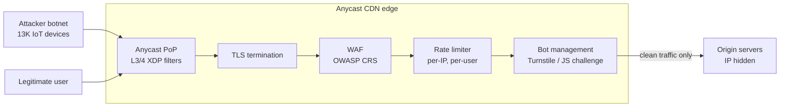
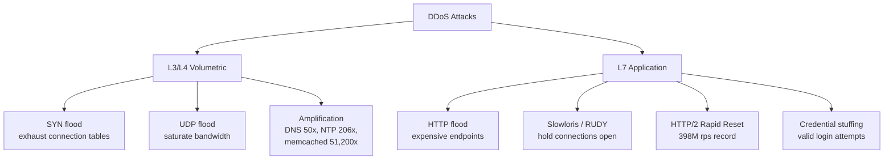
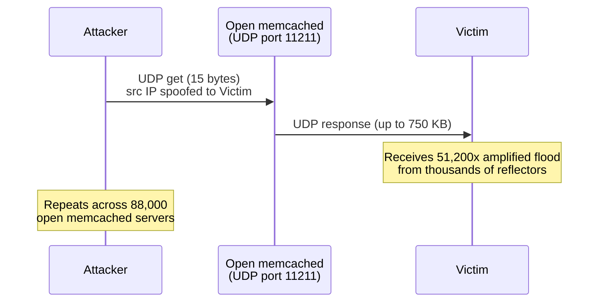
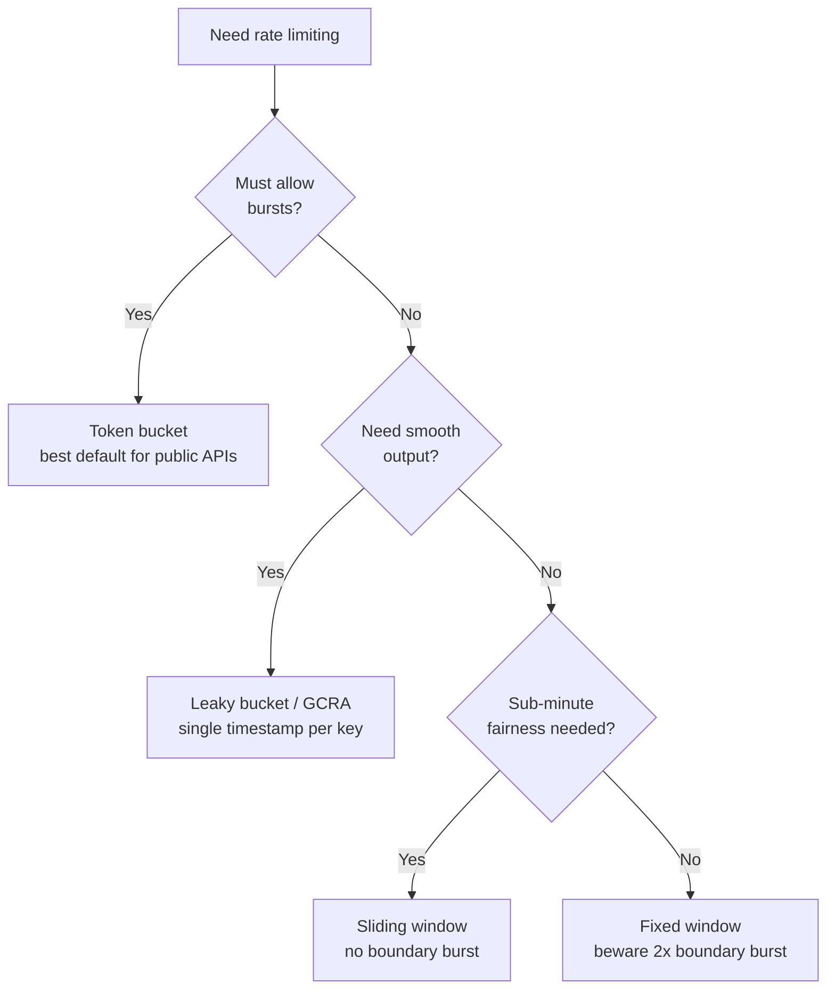

# DDoS Protection and WAFs: Mitigating Volumetric and Application Attacks

> **TL;DR**: DDoS attacks split into two problem classes: volumetric L3/L4 floods that saturate bandwidth and application-layer L7 floods that exhaust server resources with protocol-valid requests. Defense is layered: anycast CDNs with hundreds of Tbps absorb raw volume, WAFs block known-bad patterns, rate limiters cap per-client throughput, and bot management filters sophisticated automation. "Just scale up" is not a strategy. The largest DDoS attacks now exceed 30 Tbps: the Aisuru-Kimwolf botnet (1-4 million infected devices) peaked at 31.4 Tbps in a 35-second attack in late 2025 [^1], and a Mirai-variant 13,000-device botnet peaked at 5.6 Tbps in 80 seconds in Q4 2024 [^2]. No origin can autoscale through that without the bill becoming the attack.

## Learning Objectives

After this module, you will be able to:

- [ ] Distinguish L3/L4 and L7 DDoS attacks and match defenses accordingly
- [ ] Design rate limiting at the edge, gateway, and application layers
- [ ] Configure a WAF to block OWASP Top 10 attack classes
- [ ] Use bot management to handle credential stuffing and scraping
- [ ] Plan a DDoS incident response runbook

## Intuition

Imagine you run a popular restaurant. One evening, a mob of a thousand people walks in. They do not order food. They stand in the doorway, fill every table, and monopolize the host's attention. Real customers cannot get in. That is a volumetric attack: overwhelm capacity with sheer numbers.

Now imagine a subtler attack. Ten people walk in looking like normal diners. They order the most complex dish on the menu, then send it back, then order again, then send it back. The kitchen is overwhelmed cooking food nobody eats. From the outside, the restaurant looks fine. That is an application-layer attack: expensive requests that look legitimate.

Your defense has layers. A bouncer at the door (anycast CDN) turns away the obvious mob. A maitre d' (WAF) checks reservations and dress code. A kitchen manager (rate limiter) caps how many orders one table can place per hour. And a behavioral analyst (bot management) notices that those ten "diners" all arrived in the same taxi and share the same credit card.

No single layer works alone. The bouncer cannot spot a well-dressed attacker. The kitchen manager cannot stop a thousand people at the door. Layered defense is the only approach that works at internet scale, where attackers rent botnets for a few tens of dollars a month and the largest recorded attack hit 31.4 Tbps [^1].

## Theory

### Attack taxonomy: L3/L4 vs L7

[Networking Fundamentals](../part-0-prerequisites/00-networking-fundamentals.md) introduced the OSI layers. DDoS attacks exploit different layers with fundamentally different mechanisms.

**L3/L4 attacks** saturate network bandwidth or kernel connection state. SYN floods fill the server's half-open connection table. UDP floods send garbage packets faster than the NIC can process them. These attacks use spoofed source IPs, so the victim cannot even identify the real sender.

**L7 attacks** exhaust application resources with protocol-valid requests. HTTP floods hit expensive endpoints (search, login, checkout). Slowloris holds connections open with partial headers. The HTTP/2 Rapid Reset attack (CVE-2023-44487) abused stream cancellation to push Google's infrastructure to 398 million requests per second [^3].

The critical insight: WAF rules are useless against a SYN flood, and SYN cookies are useless against credential stuffing. These are different problem classes requiring different defenses.

*Each layer handles what the next cannot. Anycast XDP filters drop L3/L4 floods at the NIC before the proxy pipeline. TLS terminates at the edge so the WAF can inspect L7. Rate limiters cap per-client throughput; bot management filters sophisticated automation. Only clean traffic reaches the origin, whose IP must remain hidden.*

*L3/L4 attacks overwhelm network capacity with raw volume; L7 attacks consume application resources with protocol-valid requests that look like real traffic.*

### Amplification and reflection

Amplification is the attacker's force multiplier. The attacker sends a small UDP request with a spoofed source IP to a public server. That server returns a much larger response to the victim.

The amplification factors are staggering:

| Protocol | Amplification Factor | Mechanism |
|----------|---------------------|-----------|
| DNS | ~50x | Open recursive resolvers |
| NTP | up to 206x | `monlist` query [^4] |
| memcached | up to 51,200x | 15-byte request, 750 KB response |

Memcached is the worst known UDP amplifier. In February 2018, attackers exploited roughly 88,000 open memcached servers with UDP enabled by default [^5]. A 15-byte `get` request with a spoofed source IP triggered a 750 KB response directed at the victim. One day after Cloudflare disclosed the vector on February 27, 2018 (observing 257 Gbps of inbound amplified traffic), GitHub absorbed 1.35 Tbps on February 28 [^5][^6].

*A small spoofed request to an open UDP service produces a vastly larger response directed at the victim; memcached amplifies up to 51,200x.*

Mitigation at the protocol level: disable UDP on memcached (`-U 0`), bind to localhost, and deploy BCP38 (ingress filtering) to prevent IP spoofing at the network edge.

### HTTP/2 Rapid Reset (CVE-2023-44487)

In August 2023, a novel L7 attack exploited HTTP/2 stream cancellation. A client opens a stream with HEADERS, immediately sends RST_STREAM, and repeats. Because closed streams do not count against `SETTINGS_MAX_CONCURRENT_STREAMS`, one TCP connection can churn thousands of canceled requests per second [^7].

A 20,000-device botnet produced 201 million rps against Cloudflare. Google saw 398 million rps [^3]. AWS saw over 155 million rps [^8]. The prior L7 record was 71 million rps, set in February 2023, roughly six months earlier [^9].

Cloudflare's mitigation: count server-initiated RST_STREAMs per connection. Legitimate clients make "one or two mistakes" per connection. When the count exceeds a threshold, send GOAWAY and close the TCP connection. They also deployed an "IP jail" that blocks abusive IPs network-wide [^7].

> [!IMPORTANT]
> Rapid Reset was protocol-compliant. Every HTTP/2 server was vulnerable. The fix required patching every HTTP/2 implementation, not just writing a WAF rule.

### Rate limiting algorithms

Rate limiting caps per-client throughput to protect the origin. Five standard algorithms exist, each with different trade-offs:

**Token bucket** refills at rate R up to capacity B. Each request consumes a token. Bursty traffic is allowed up to B. This is the right default for public APIs because real users are bursty [^10].

**Leaky bucket** processes requests at a fixed rate, smoothing output. Good for downstream services that cannot handle bursts.

**Fixed window** counts requests per clock-aligned interval. Simple but flawed: a client can send 2x the limit across a window boundary [^10].

**Sliding window** tracks timestamps over a moving interval. Fairer than fixed window, no boundary burst, but more memory.

**GCRA (Generic Cell Rate Algorithm)** tracks a single timestamp (Theoretical Arrival Time) per key. It enforces smooth spacing with minimal storage. It is the memory-efficient canonical form of leaky bucket, used in cell networks and modern rate limiters [^11].

*Pick the rate-limit algorithm by whether you allow bursts, need smooth output, or are constrained by memory.*

**Distributed rate limiting** is harder. A single-instance counter breaks in a multi-replica deployment because no replica sees the full traffic. The standard pattern: Envoy's external rate-limit service backed by Redis `INCR` + `EXPIRE` provides cross-instance fairness. Use local per-instance rate limits as a first-line defense (zero-hop, no network call), and global Redis-backed limits for cross-instance accuracy.

### WAF: OWASP Top 10 and Core Rule Set

A Web Application Firewall inspects HTTP requests against rule sets. Two models exist:

**Negative security (block known bad):** The OWASP ModSecurity Core Rule Set (CRS) ships rules for SQL injection, XSS, command injection, and more. It uses paranoia levels: PL1 rarely false-alarms, PL4 is very aggressive. Higher paranoia levels "are increasingly likely to cause false positives" [^12]. Anomaly scoring accumulates points per rule match; a request is blocked only when the total exceeds a threshold.

**Positive security (allow known good):** Only permit requests matching a validated schema. High signal, but breaks on every API change.

The OWASP Top 10 (2021) is the canonical risk list:

| # | Risk | Key Fact |
|---|------|----------|
| A01 | Broken Access Control | 94% of apps tested had at least one occurrence [^13] |
| A02 | Cryptographic Failures | Weak TLS, plaintext secrets |
| A03 | Injection | SQL, NoSQL, OS command, LDAP |
| A04 | Insecure Design | Missing threat modeling |
| A05 | Security Misconfiguration | Default credentials, open S3 buckets |
| A06 | Vulnerable Components | Unpatched libraries |
| A07 | Auth Failures | Credential stuffing, weak passwords |
| A08 | Software Integrity Failures | Unsigned updates, CI/CD compromise |
| A09 | Logging Failures | No audit trail |
| A10 | SSRF | Server-side request forgery |

**WAF deployment pattern:** Start in count (monitor) mode to measure false positives. Quantify the rate from logs. Promote to block mode within 30 to 90 days. Enforce a time limit on count mode, or it stays there forever (see Common Pitfalls).

### Bot management

Sophisticated attackers bypass WAF signatures by mimicking real browsers. Bot management adds layers of passive and active signals:

**Passive signals:** TLS fingerprint (JA3/JA4), HTTP/2 SETTINGS frame ordering, user-agent plausibility, IP reputation, ASN classification, and behavioral analytics (mouse movement, timing patterns). Cloudflare's 2024 Q4 data shows the user agent `HITV_ST_PLATFORM` appeared in 99.9% DDoS-only traffic [^2].

**Active challenges:** JavaScript challenges verify the client executes code. CAPTCHAs (hCaptcha, reCAPTCHA) add visual puzzles. Cloudflare Turnstile replaces visible CAPTCHAs with non-intrusive browser challenges that minimize friction for real humans [^14].

**The arms race:** Sophisticated actors buy residential proxies and headless browsers that pass fingerprint checks. Defense evolves from signatures to ML-based behavioral models. The goal is not perfect detection but raising the attacker's cost above their willingness to pay.

## Real-World Example

**GitHub, February 28, 2018: 1.35 Tbps memcached amplification attack.**

At 17:21 UTC, GitHub's monitoring detected anomalous ingress/egress asymmetry on transit links. The attack peaked at 1.35 Tbps and 126.9 million packets per second, sourced from over 1,000 autonomous systems [^6]. This was the largest DDoS attack ever recorded at the time, surpassing the October 2016 Mirai/Dyn attack (Dyn never officially disclosed the attack size) [^15].

GitHub had doubled transit capacity year-over-year but could not absorb 1.35 Tbps unassisted. At 17:26 UTC, a ChatOps command withdrew BGP announcements from GitHub's own transit providers and announced AS36459 exclusively to Akamai Prolexic. Prolexic's scrubbing centers applied ACLs at their borders and forwarded clean traffic back to GitHub via GRE tunnels.

By 17:30 UTC, GitHub was fully back. Total hard downtime: 5 minutes. At 17:34 UTC, additional internet-exchange advertisements were withdrawn as a precaution against a secondary 400 Gbps spike [^6].

The key engineering decisions:

1. **BGP-level failover to a scrubbing provider** rather than absorbing at the origin. No single-site defense can match a scrubbing network's aggregate capacity.
2. **ChatOps-driven playbook.** One engineer issued the BGP withdrawal command. Route reconvergence took minutes, not hours.
3. **Post-incident automation.** GitHub committed to automating provider failover to shrink MTTR further.

The memcached vector existed because 88,000 servers on the public internet had UDP enabled by default. Cloudflare disclosed the vulnerability one day earlier (February 27, 2018); GitHub's attack confirmed the prediction within 24 hours [^5].

## Trade-offs

Edge-protection choice collapses to two tiers that are meaningfully different (self-hosted scrubbing is a compliance-only edge case; running with no edge protection at all is covered in Common Pitfalls, not as an alternative). Pick by revenue at risk and attack frequency:

- **Free tier (AWS Shield Standard, Cloudflare free).** Unmetered L3/L4 protection, no per-customer SLA, no dedicated response team. Shield Standard is enabled by default on every AWS account at no additional charge [^16]. Cloudflare's free plan includes the same anycast backbone. This is the starting point for every service (small businesses, side projects, and the "we'll upgrade when we're a target" crowd).
- **Premium tier (AWS Shield Advanced, Cloudflare Enterprise).** Adds a guaranteed SLA, a 24/7 DDoS Response Team (DRT), cost-protection credits that refund attack-driven autoscaling bills, and L7 WAF managed rulesets. Shield Advanced lists at $3,000/month [^16]; Cloudflare Enterprise is quote-based in a similar range. Reach for it when revenue loss per hour of downtime exceeds the monthly fee, or when you are a repeat target.

Self-hosted scrubbing remains an option only when regulators forbid third-party TLS termination. No single-site deployment can match a global anycast network; Cloudflare publicly reported 449 Tbps of network capacity in 2024 [^2]. Build it only when compliance leaves no alternative.

## Common Pitfalls

> [!WARNING]
> **Running in production with no edge protection.** A single public IP behind a small origin fleet gets taken offline by a volumetric flood that an anycast CDN would absorb without noticing. Turn on the free tier (Shield Standard is automatic on AWS; Cloudflare free is one DNS change) before you ship. "We'll add protection when we need it" means adding it at 3 AM during the first attack.

> [!WARNING]
> **Auto-scaling through a DDoS.** Autoscaling groups interpret attack RPS as demand. Your bill becomes the attack. A $0.10/hour instance becomes a $10,000/day ASG. Set autoscaling ceilings, put an anycast CDN in front, and never expose origin IPs. AWS Shield Advanced provides DDoS cost-protection credits for this reason.

> [!WARNING]
> **WAF left in count mode forever.** Rules deployed "to log only" six months ago never flip to block because of false-positive fear. Enforce a time limit: 30 to 90 days in count mode, then promote. Quantify false positives from logs before flipping.

> [!WARNING]
> **X-Forwarded-For trusted without validation.** Rate-limit middleware reads XFF by default. An attacker sends `X-Forwarded-For: 1.2.3.4` on every request to rotate "source IPs" and bypass per-IP limits. Mastodon's GHSA-c2r5-cfqr-c553 documents this exact bug. Fix: strip XFF at the trusted edge, key rate limits on the TCP peer IP.

> [!WARNING]
> **Origin IP leaked behind the CDN.** The attacker bypasses your anycast CDN by attacking the origin IP directly. IPs leak via historical DNS records (SecurityTrails, Censys), email headers, or subdomains without CDN coverage. Fix: firewall the origin to CDN IP ranges only; use authenticated origin pulls; rotate IPs if leaked.

> [!WARNING]
> **CAPTCHA provider rate-limited during attack.** During credential stuffing, your CAPTCHA service hits its own QPS cap and starts failing. Every login is rejected, including real users. Fix: use managed challenges with silent fallback (Turnstile rotates automatically), cache successful tokens, and have an emergency bypass for known-good devices.

## Exercise

Design DDoS and WAF protection for an e-commerce site that expects traffic spikes on product launches and is periodically targeted by competitors. Pick a provider, configure rate limits, select WAF rules, and draft the incident runbook for a live attack.

Hint

Think in layers: what absorbs volume at the edge? What inspects L7 at the proxy? What protects the origin from per-client abuse? And what happens at 3 AM when the pager fires?

Solution

**Provider:** Cloudflare Pro or Business tier for the CDN/WAF/DDoS bundle. If on AWS, CloudFront + AWS WAF + Shield Advanced for integrated billing and DRT access.

**Layered defense:**

1. **Edge (Cloudflare/CloudFront):** Anycast absorbs L3/L4. TLS terminates here. All traffic flows through the CDN; origin IP is hidden and firewalled to CDN ranges only.
2. **WAF:** Deploy OWASP CRS at paranoia level 2. Start in count mode for 30 days on staging traffic. Promote to block after confirming false-positive rate is below 0.1%. Add managed rules for known CVEs (virtual patching).
3. **Rate limiting:** Token bucket at the edge: 100 requests/minute per IP for `/api/*`, 10 requests/minute for `/login`. Sliding window at the application layer: 5 orders/hour per user ID for `/checkout`.
4. **Bot management:** Enable Turnstile on login and checkout. Allow Googlebot and monitoring bots via verified ASN. Block known-bad user agents.

**Incident runbook:**

1. **Detect:** Alert on 5xx rate > 5% for 2 minutes, or edge-blocked requests > 10x baseline.
2. **Triage:** Check if the attack is L3/L4 (bandwidth saturation) or L7 (origin CPU/memory). Dashboard: Cloudflare Analytics or Shield Advanced metrics.
3. **Escalate:** If L7 and WAF is not catching it, engage the provider's response team (Cloudflare Enterprise SOC or AWS SRT). Requires Business/Enterprise support.
4. **Mitigate:** Tighten rate limits temporarily. Enable "Under Attack" mode (JS challenge on all requests). If origin is overwhelmed, enable maintenance page at the edge.
5. **Communicate:** Status page update within 10 minutes. Internal war room in Slack.
6. **Recover:** Gradually relax rate limits. Confirm legitimate traffic is flowing. Post-incident review within 48 hours.

See [Incident Management](../part-6-reliability-and-operations/07-incident-management.md) for the full runbook framework.

## Key Takeaways

- Defense in depth: the edge absorbs volume, the WAF blocks known-bad patterns, rate limiters protect the origin, and bot management handles the sophisticated rest.
- "Scale up to ride it out" loses the economic fight. The bill becomes the attack. Use anycast CDNs with hundreds of Tbps of capacity instead.
- L3/L4 and L7 are different problem classes. SYN cookies do not stop HTTP floods; WAF rules do not stop bandwidth saturation.
- L7 is the growth vector: 51% of Cloudflare's 6.9 million attacks in Q4 2024 were HTTP DDoS [^2].
- Rate limit at multiple layers (edge, gateway, application) with different keys (IP, user ID, endpoint).
- WAFs must graduate from count mode to block mode within a bounded time window. Unflipped rules provide zero protection.
- Hide your origin IP. If it leaks, the entire CDN defense is bypassed.

## Further Reading

- [Cloudflare 2025 Q4 DDoS Threat Report](https://blog.cloudflare.com/ddos-threat-report-2025-q4/). The current record-setting 31.4 Tbps attack, the Aisuru-Kimwolf botnet (1-4M Android TVs), and 2025's 47.1 million mitigated attacks.
- [Cloudflare 2024 Q4 DDoS Threat Report](https://blog.cloudflare.com/ddos-threat-report-for-2024-q4/). The 5.6 Tbps attack from October 2024, 21.3M attacks in 2024, and detailed L7 trend data.
- [HTTP/2 Rapid Reset: deconstructing the record-breaking attack](https://blog.cloudflare.com/technical-breakdown-http2-rapid-reset-ddos-attack/). Authoritative protocol-level writeup of CVE-2023-44487 with Cloudflare's mitigation approach.
- [GitHub: February 28th DDoS Incident Report](https://github.blog/news-insights/company-news/ddos-incident-report/). The clearest public L3/L4 incident narrative: detection, BGP failover to Akamai, and recovery in 5 minutes.
- [Google Cloud: 398 million rps mitigation](https://cloud.google.com/blog/products/identity-security/google-cloud-mitigated-largest-ddos-attack-peaking-above-398-million-rps/). Largest L7 attack on record with coordinated disclosure details.
- [OWASP Top 10 (2021)](https://owasp.org/Top10/2021/). The canonical web vulnerability list with CWE mappings and incidence data.
- [OWASP ModSecurity Core Rule Set](https://coreruleset.org/). The reference open-source WAF ruleset; paranoia levels and anomaly scoring documented.
- [RFC 4987: TCP SYN Flooding Attacks and Common Mitigations](https://www.rfc-editor.org/rfc/rfc4987.html). Canonical catalog of SYN flood countermeasures including SYN cookies.
- [AWS Shield Advanced Documentation](https://docs.aws.amazon.com/waf/latest/developerguide/shield-chapter.html). Pricing ($3K/month), Shield Response Team access, and DDoS cost protection credits.

## Flashcards

**Q:** What are the two broad classes of DDoS attacks, and why do they require different defenses?
**A:** L3/L4 volumetric attacks saturate network bandwidth or kernel state (SYN floods, UDP floods, amplification). L7 application attacks exhaust server resources with protocol-valid requests (HTTP floods, Rapid Reset). L3/L4 is stopped by packet-level filters and anycast absorption; L7 requires TLS termination and HTTP-aware inspection.

**Q:** What is the amplification factor of memcached, and why is it so dangerous?
**A:** Up to 51,200x. A 15-byte UDP request triggers a 750 KB response. Combined with IP spoofing and 88,000 open memcached servers, this produced the 1.35 Tbps GitHub attack in February 2018.

**Q:** How does HTTP/2 Rapid Reset bypass SETTINGS_MAX_CONCURRENT_STREAMS?
**A:** The client opens a stream with HEADERS then immediately sends RST_STREAM. Closed streams do not count against the concurrency cap, so one connection can churn thousands of canceled requests per second without ever hitting the limit.

**Q:** What is the peak recorded L7 DDoS attack, and what vulnerability enabled it?
**A:** 398 million rps against Google in August 2023, enabled by HTTP/2 Rapid Reset (CVE-2023-44487). A 20,000-device botnet exploited stream cancellation semantics.

**Q:** Why is "auto-scale through a DDoS" a dangerous anti-pattern?
**A:** Autoscaling interprets attack traffic as demand and spins up thousands of instances. The attacker's cost stays flat while your bill explodes. The bill itself becomes the attack.

**Q:** Which rate-limiting algorithm is the best default for public APIs, and why?
**A:** Token bucket. It allows bursts (real users are bursty) up to a configurable capacity B, while enforcing a sustained rate R. It is simple to implement and matches real-world traffic patterns.

**Q:** What is the correct way to handle X-Forwarded-For for rate limiting?
**A:** Strip XFF at the trusted edge proxy and re-set it. Key rate limits on the TCP peer IP seen by your trusted proxy, not the first XFF hop. Never trust XFF from untrusted sources; attackers can spoof it to rotate apparent IPs.

**Q:** What is the difference between a WAF's negative security model and positive security model?
**A:** Negative security blocks known-bad patterns (CRS rules for SQLi, XSS). Positive security allows only known-good requests (schema-validated APIs). Negative is easier to deploy but has false positives at high paranoia. Positive has higher signal but breaks on every schema change.

**Q:** How did GitHub mitigate the 1.35 Tbps memcached attack in February 2018?
**A:** At 17:26 UTC (5 minutes after detection), a ChatOps command withdrew BGP announcements from GitHub's transit providers and announced exclusively to Akamai Prolexic. Prolexic's scrubbing centers filtered attack traffic and forwarded clean traffic via GRE tunnels. Full recovery by 17:30 UTC.

**Q:** What percentage of tested applications had at least one Broken Access Control vulnerability according to OWASP 2021?
**A:** 94%. Broken Access Control (A01) is the #1 risk in the OWASP Top 10 2021, with 318,000+ CWE findings across tested applications.

**Q:** Name three passive signals used in bot management to fingerprint automated clients.
**A:** TLS fingerprint (JA3/JA4), HTTP/2 SETTINGS frame ordering, and behavioral analytics (mouse movement, timing patterns). IP reputation and ASN classification are also common.

**Q:** What is Cloudflare's total network capacity, and why does that number matter for DDoS defense?
**A:** Over 500 Tbps of external interconnect capacity across 330+ cities (as of April 2026) [^1]. This matters because an attacker must exceed the aggregate capacity of the anycast network to overwhelm the defense. The largest DDoS attacks on record (29.7 Tbps in Q3 2025 and 31.4 Tbps in Q4 2025, both from the Aisuru-Kimwolf botnet) still consume less than 10% of this capacity. No single-site origin can match this.

## References

[^1]: Yoachimik, O., Pacheco, J. & Cloudforce One. "2025 Q4 DDoS threat report: A record-setting 31.4 Tbps attack caps a year of massive DDoS assaults." Cloudflare blog, 2026-02-05. https://blog.cloudflare.com/ddos-threat-report-2025-q4/
[^2]: Yoachimik, O. & Pacheco, J. "Record-breaking 5.6 Tbps DDoS attack and global DDoS trends for 2024 Q4." Cloudflare blog, 2025-01-21. https://blog.cloudflare.com/ddos-threat-report-for-2024-q4/
[^3]: Kiner, E. & April, T. "Google mitigated the largest DDoS attack to date, peaking above 398 million rps." Google Cloud blog, 2023-10-11. https://cloud.google.com/blog/products/identity-security/google-cloud-mitigated-largest-ddos-attack-peaking-above-398-million-rps/
[^4]: Cloudflare. "NTP amplification DDoS attack." Cloudflare Learning Center. https://www.cloudflare.com/learning/ddos/ntp-amplification-ddos-attack/
[^5]: Majkowski, M. "Memcrashed - Major amplification attacks from UDP port 11211." Cloudflare blog, 2018-02-27. https://blog.cloudflare.com/memcrashed-major-amplification-attacks-from-port-11211/
[^6]: Kottler, S. "February 28th DDoS Incident Report." GitHub blog, 2018-03-01. https://github.blog/news-insights/company-news/ddos-incident-report/
[^7]: Pardue, L. & Desgats, J. "HTTP/2 Rapid Reset: deconstructing the record-breaking attack." Cloudflare blog, 2023-10-10. https://blog.cloudflare.com/technical-breakdown-http2-rapid-reset-ddos-attack/
[^8]: Scholl, T. & Ryland, M. "How AWS protects customers from DDoS events." AWS Security Blog, 2023-10-10. https://aws.amazon.com/blogs/security/how-aws-protects-customers-from-ddos-events/
[^9]: Yoachimik, O., Desgats, J. & Forster, A. "Cloudflare mitigates record-breaking 71 million request-per-second DDoS attack." Cloudflare blog, 2023-02-13. https://blog.cloudflare.com/cloudflare-mitigates-record-breaking-71-million-request-per-second-ddos-attack/
[^10]: Arcjet. "Token Bucket vs Sliding Window vs Fixed Window." https://blog.arcjet.com/rate-limiting-algorithms-token-bucket-vs-sliding-window-vs-fixed-window/
[^11]: Lao, J. "GCRA Rate Limiting." 2018-12-27. https://jameslao.com/post/gcra-rate-limiting/
[^12]: OWASP Core Rule Set. "False Positives and Tuning." https://coreruleset.org/docs/2-how-crs-works/2-3-false-positives-and-tuning/
[^13]: OWASP Foundation. "A01:2021 - Broken Access Control." https://owasp.org/Top10/A01_2021-Broken_Access_Control/
[^14]: Cloudflare. "Announcing Turnstile, a user-friendly, privacy-preserving alternative to CAPTCHA." 2022-09. https://blog.cloudflare.com/turnstile-private-captcha-alternative/
[^15]: Cloudflare. "Famous DDoS attacks: The largest DDoS attacks of all time." Cloudflare Learning Center. https://www.cloudflare.com/learning/ddos/famous-ddos-attacks/
[^16]: Amazon Web Services. "AWS Shield Pricing." https://aws.amazon.com/shield/pricing/
