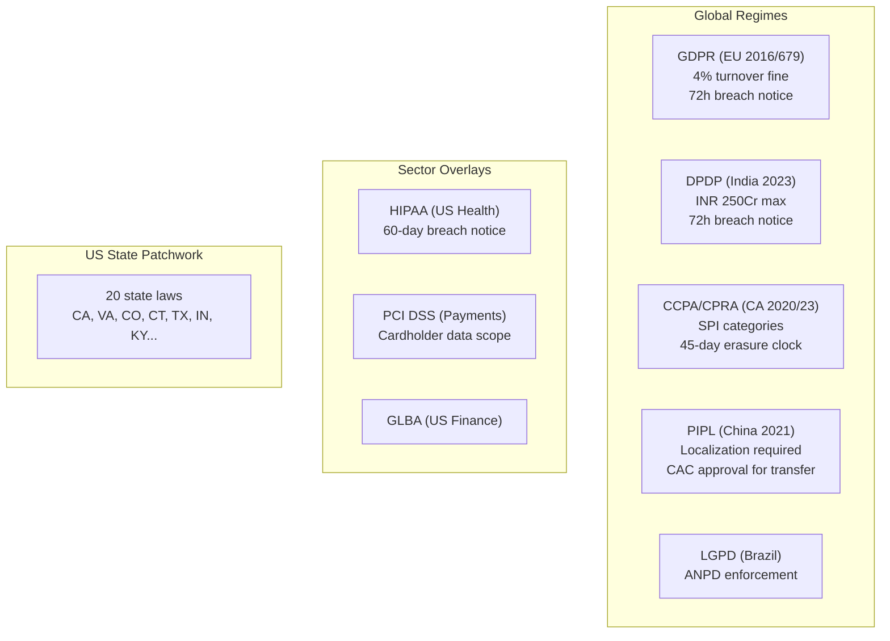
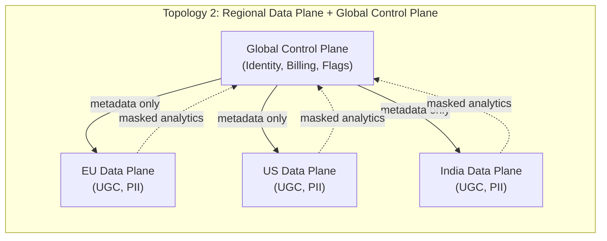
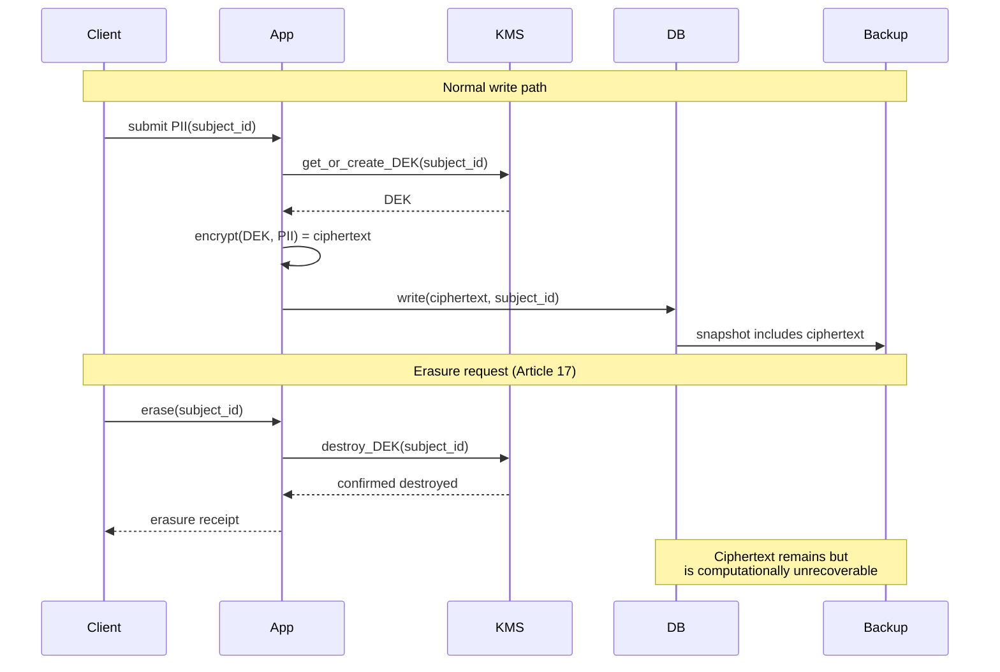
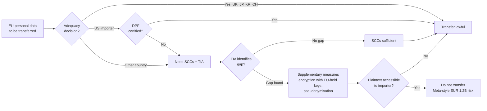

# Data Residency and Compliance Architecture (GDPR, DPDP, CCPA, Right-to-Erasure)

> **TL;DR**: Data-protection law is now an architectural constraint, not paperwork. A global service touches at least six overlapping regimes whose rules differ on where data lives, how long you keep it, and how fast you delete it. Cumulative GDPR fines alone passed EUR 7.1 billion by January 2026 [^1]. The canonical architecture is a regional data plane (user content stays in-jurisdiction) with a global control plane (identity, billing, feature flags), backed by crypto-shredding as the erasure primitive: encrypt each subject's PII with a per-subject key, and destroy the key on deletion. That single KMS operation renders ciphertext unrecoverable across every primary, replica, backup, and event log.

## Learning Objectives

After this module, you will be able to:

- [ ] Map data categories (PII, sensitive PII, financial, health, behavioral) to storage, encryption, and retention policies
- [ ] Choose between per-region silos, regional-plus-control-plane, and global-with-masking topologies
- [ ] Implement right-to-erasure via crypto-shredding even in event-sourced and backup-heavy systems
- [ ] Select the right cross-border transfer mechanism (SCCs, adequacy, EU-US DPF) post-Schrems II
- [ ] Build the audit, lineage, and consent infrastructure required to prove compliance to a regulator

## Intuition

You run a chain of safe-deposit-box vaults across five countries. Each country has its own rules about who can open a box, how long you keep records, and what happens when a customer says "destroy everything." Germany says you must shred within 30 days. India says you need a government-appointed auditor. China says the box contents cannot leave the building, period.

Now a customer walks in and says: "I want one box, accessible from any branch, but my documents must never physically leave Frankfurt." You can do this. You put the documents in Frankfurt, give the customer a key, and let other branches query a central directory that says "box 4217 is in Frankfurt." The directory is global. The documents are local. That is the regional-data-plane-plus-global-control-plane topology.

When the customer says "destroy everything," you do not need to visit every branch, every backup tape, every photocopy. You destroy the key. Without the key, the locked box is just metal. That is crypto-shredding: the key is the single point of truth for whether data exists.

The hard part is not any one rule. It is that you have 20+ countries, each with different shredding deadlines, different definitions of "personal," and different penalties for getting it wrong. This chapter gives you the architecture to handle all of them without building 20 separate systems.

## Theory

### The regulatory landscape

Six regimes define the constraints for most global services:

**GDPR (EU, 2016/679, applicable 2018)** is the baseline. Six lawful bases for processing (Article 6), subject rights in Articles 15 to 22, cross-border transfers governed by Chapter V, 72-hour breach notification under Article 33, and fines up to 4% of global annual turnover or EUR 20 million (whichever is higher) [^2]. Extraterritorial reach under Article 3 means any service processing EU residents' data is subject, regardless of where the company is headquartered.

**DPDP (India, 2023)** introduces the "Significant Data Fiduciary" classification with heightened obligations: mandatory DPIAs, annual audits, and an independent data auditor. Maximum penalty is INR 250 crore (roughly USD 30 million) per contravention. Final rules notified 14 November 2025 mandate 72-hour breach reporting and a phased compliance deadline ending 14 May 2027 [^3].

**CCPA/CPRA (California, 2020/2023)** grants rights to know, delete, correct, and opt-out of sale/sharing. CPRA defines Sensitive Personal Information (Civil Code SS1798.140(ae)) including government identifiers, financial account credentials, precise geolocation, mail/email/text contents, genetic data, biometrics, health, sex life/orientation, and racial/ethnic origin, with a right to limit their use [^4].

**PIPL (China, 2021)** requires domestic storage for Critical Information Infrastructure Operators and entities exceeding volume thresholds. Cross-border transfer requires a CAC security assessment, standard contract, or certification [^5]. In practice, this forces a separate China deployment for regulated data.

**LGPD (Brazil)** and **PIPEDA (Canada)** are GDPR-structurally similar. Quebec's Law 25 adds a provincial overlay with its own consent requirements.

The US has no federal comprehensive law. Instead, 20 states have comprehensive privacy laws in effect as of January 2026 [^6], plus sector rules (HIPAA for health with a 60-day breach notification window from discovery, GLBA for finance, PCI DSS for cardholder data). There is no single "US compliant" mode.

*Each regime defines its own data-subject rights, breach clocks, and penalty caps. A global service must satisfy all simultaneously.*

### Data classification as a distributed-systems problem

Classification is the foundation. Without it, you cannot answer "which fields must stay in the EU?" or "what do we delete when a user invokes Article 17?"

Five classes cover most systems:

- **PII**: name, email, phone, IP address, device IDs, user-agent fingerprint.
- **Sensitive PII** (SPI under CPRA): SSN, passport, biometrics, precise geolocation, genetic data, race/ethnicity, religion, sexual orientation, immigration status.
- **Health (PHI under HIPAA)**: diagnoses, prescriptions, lab results, wearable data tied to an identifier.
- **Financial**: PAN, bank accounts, transactions (PCI DSS overlay for cardholder data).
- **Behavioral**: clickstreams, search queries, inferred attributes. Regulators increasingly treat these as sensitive under CPRA and GDPR.

Each class maps to a policy: encryption requirement, retention window, regional pinning, and redaction in logs. Sensitive PII means per-subject keys, the shortest retention across applicable jurisdictions, and hard regional pinning. Behavioral means pseudonymization at ingest and aggregation-only in analytics.

Three classification strategies, in order of robustness:

1. **Tag-at-ingest.** The producer declares the class; a schema registry enforces it. Cleanest, but requires organization-wide discipline.
2. **Scan-at-rest DLP.** Pattern matchers (regex for PAN/SSN, NER for names) run across storage to catch drift. Catches mistakes at the cost of days or weeks of latency.
3. **ML classifier.** Last resort for legacy data lakes. High false-positive rates on free-text fields.

> [!TIP]
> Treat classification as a schema-registry concern. If your Kafka topic or Protobuf message does not declare its data class, it does not get published. Shift left.

### Residency topologies

[Multi-Region Architecture](../part-5-architecture-patterns/08-multi-region-architecture.md) covered the mechanics of running services across regions. This section adds the legal constraint layer.

**Topology 1: Per-region silos.** A full stack per legal region (EU, US, India, China). Tenants pinned at signup. Cross-region traffic blocked at the network layer. Cleanest audit story. Infrastructure cost multiplies by the number of silos, and cross-region features (global search, shared dashboards, cross-tenant analytics) break by construction.

**Topology 2: Regional data plane with global control plane.** User-generated content and subject data stay in the region. Metadata (tenant ID, billing, authentication anchors, feature flags) is global. This is Atlassian's shipped model: "realms" group AWS regions, services hold UGC in region-specific shards, and a central Tenant Context Service (sub-1ms p90, millions of requests per minute) routes traffic [^7]. Atlassian offers 11 pin locations as of 2025 [^8].

**Topology 3: Global with PII masked.** Raw PII stays in the origin region. Pseudonymized or aggregated derivatives replicate globally for analytics, ML, and backup. DLP at egress blocks or redacts anything classified as PII before the hop.

*User content stays regional. Only non-PII metadata flows globally. This is the default for multi-tenant SaaS.*

**The recommendation:** Use Topology 2 (regional data plane + global control plane) as the default for multi-tenant SaaS. Use Topology 1 (full silos) only when the regulator requires it: health, finance, defense, or China under PIPL. Use Topology 3 only at startup stage with low-sensitivity data.

### Right-to-erasure and crypto-shredding

GDPR Article 17 requires erasure "without undue delay," with a one-month response clock extendable by two months for complex requests [^9]. CCPA gives 45 days (extendable by 45 more). India's DPDP draft rules contemplate timelines prescribed by the Data Protection Board.

The problem: modern systems are not a single database. A user's data lives in the primary store, read replicas, search indexes, caches, feature stores, warehouses, ML training sets, observability logs, CDC pipelines, backups, and third-party processors. Soft-delete (setting `deleted_at = now()`) leaves data in every one of these locations. Regulators read Article 17 as "erasure," not "hidden from queries."

**Crypto-shredding** is the only pattern that survives immutable backups and append-only logs. The mechanism:

1. At write time, encrypt each subject's PII fields with a per-subject data encryption key (DEK).
2. Store the DEK in a KMS (the same envelope-encryption pattern from [Secrets Management](./04-secrets-management.md)).
3. On erasure request, destroy the DEK. Ciphertext survives in every backup, replica, and event log, but is computationally unrecoverable [^10].

*Destroying a single per-subject key renders all ciphertext across primaries, replicas, backups, and event logs unrecoverable. One KMS operation, complete erasure.*

For [Event Sourcing](../part-5-architecture-patterns/03-event-sourcing.md) systems, the pattern adapts: keep PII inside crypto-shredded payloads within events. Non-PII fields (event type, timestamps, aggregate IDs) remain in plaintext for replay and analytics. On erasure, destroy the key. The event log remains structurally intact but PII is gone [^10].

The erasure DAG must include every derived store. Search indexes, caches, feature stores, warehouses, logs, and third-party processors all confirm deletion before the origin DEK is destroyed. This topological ordering prevents a later replay from re-populating a derived store with now-undecryptable ciphertext.

> [!IMPORTANT]
> Crypto-shredding has a critical failure mode: if you lose the DEK through operator error (not intentional destruction), the user's own data is unrecoverable. Treat DEK backup and access control with the same rigor as the data itself.

**Erasure primitive: crypto-shredding vs tombstone-only.** Crypto-shredding is the default for anything user-facing or regulated: one KMS key-destroy makes ciphertext computationally unrecoverable across primaries, replicas, backups, and event logs, at the cost of per-subject key management and the key-loss-equals-data-loss risk above. Tombstone-only erasure (`deleted_at = now()` plus filtering in queries) is simple and database-native, but it is not real deletion. Rows persist in every backup, replica, search index, feature store, and warehouse copy, and regulators read Article 17 as erasure, not hiding. Use tombstone-only for low-regulation internal tools where audit exposure is acceptable; otherwise pair any topology above with crypto-shredding.

### Cross-border transfers post-Schrems II

In July 2020, the CJEU invalidated the EU-US Privacy Shield in Case C-311/18 (Schrems II) but upheld Standard Contractual Clauses, holding that exporters must assess whether the importer's country provides "essentially equivalent" protection [^11]. The EDPB published Recommendations 01/2020 on supplementary measures, endorsing strong encryption (with keys held by the exporter or in an adequate jurisdiction) and pseudonymization as effective technical measures [^12].

**Mechanisms available today:**

- **Adequacy decisions:** EU list of jurisdictions with equivalent protection (UK, Japan, South Korea, Switzerland, Israel, New Zealand, Canada commercial).
- **EU-US Data Privacy Framework (DPF):** adequacy decision adopted 10 July 2023, effective immediately for US importers who certify to DPF principles. Survived its first annulment challenge (Latombe, T-553/23) on 3 September 2025; appeal lodged 31 October 2025 and pending before the CJEU [^13].

- **Standard Contractual Clauses (SCCs, 2021 modernized set):** pre-approved contract clauses signed by exporter and importer. Require a Transfer Impact Assessment (TIA).
- **Binding Corporate Rules (BCRs):** intra-group transfers.
- **Article 49 derogations:** explicit consent, contract necessity. Designed for occasional transfers, not routine data flows.

**Why Meta was fined EUR 1.2 billion (May 2023):** Meta relied on SCCs to transfer EU Facebook data to US infrastructure. After Schrems II, SCCs alone without effective supplementary measures were held inadequate given US surveillance law (FISA 702). The lesson: "EU region of a US cloud" plus SCCs plus transport encryption is not automatically compliant. Supplementary measures strong enough to satisfy Schrems II require that plaintext never be accessible to the US importer [^14].

*After Schrems II, every EU-to-third-country transfer must satisfy at least one lawful mechanism plus a Transfer Impact Assessment where SCCs are used. Where the TIA finds a gap (as with US importers under FISA 702), supplementary measures must ensure plaintext is never accessible to the importer.*

### Audit, lineage, and consent

Three layers must exist and be queryable by ticket ID and subject ID:

**Immutable audit logs.** Append-only, cryptographically chained (hash of previous entry in each record), WORM-protected (S3 Object Lock in Compliance mode, Azure immutable blobs). Must capture: who read what, who wrote what, who deleted what, who changed access. Retention typically seven years for financial, three for general compliance.

**Data lineage.** Track origin and every downstream consumer of each dataset. Tools: OpenLineage (Marquez reference implementation), Apache Atlas, DataHub. Needed to answer "if we erase user X, which derived stores must we propagate to?"

**Consent records.** Timestamp, policy version, purpose, legal basis, method of capture. Under GDPR Article 6, controllers must demonstrate consent. Specialist vendors: OneTrust, TrustArc. The IAB Transparency and Consent Framework (TCF v2.2) is the ad-tech industry's standard consent signal format.

DSAR (Data Subject Access Request) automation is non-optional at scale. The one-month clock multiplied by thousands of derived records makes manual handling impossible. Pattern: request lands in a workflow tool, a lineage-aware orchestrator fans out deletion/export commands to every system of record, each system reports completion, a signed audit entry closes the ticket.

## Real-World Example

Atlassian's data residency architecture for Jira, Confluence, and Rovo demonstrates Topology 2 at scale. The engineering blog details the full build [^7].

**The problem:** Enterprise customers demanded that their Jira issues and Confluence pages stay within specific legal boundaries (EU, Australia, India), while Atlassian's identity, billing, and feature-flag systems remained global.

**The solution:** Atlassian introduced "realms," an abstraction over AWS regions that defines legal boundaries. Each tenant is pinned to a realm at signup. UGC-holding services (Issue Service, Pages, media) are sharded by realm. Metadata and identity remain global. The Catalogue Service is the system of record for tenant-to-shard mapping. The Tenant Context Service is the read-optimized projection, serving millions of requests per minute at sub-1ms p90 latency [^7].

**Migration:** When a customer changes their residency pin (e.g., from US to EU), the system executes a copy-then-delete workflow. The Issue Service migrated even the largest tenants (5-10 million issues) between regions in under 60 minutes. The key design decision: separation of "copy" and "delete" phases means rollback never does more work than "re-online the tenant in the original shard" [^7].

**Async event handling:** SQS/Kinesis consumers re-check shard location on consumption because events can sit in a queue longer than a migration takes. This prevents stale routing after a realm change.

**Scale:** 11 pin locations (US, EU, Australia, Germany, Singapore, Canada, UK, Japan, India, South Korea, Switzerland) as of 2025 [^8]. Page-load p90 improved by approximately 500ms after moving EU tenants to eu-west-1 [^7].

## Trade-offs

The table below compares residency **topologies** only. Erasure primitive (crypto-shredding vs tombstone-only) is an orthogonal decision covered in §Right-to-erasure above. Every topology needs an erasure primitive, and the two choices are not substitutes for a topology.

| Approach | Pros | Cons | Best When | Our Pick |
|---|---|---|---|---|
| Per-region silos | Clean isolation, trivial audit, network-layer guarantee | 2 to 3x infra cost, cross-region features break, tenant-pin errors expensive | Health, finance, defense, China/PIPL | Only when regulator requires |
| Regional data plane + global control plane | Scales, most features work, single identity graph | Metadata-leak risk, complex routing, bespoke migration logic | Global SaaS (Atlassian, Stripe, HubSpot) | Default for multi-tenant SaaS |
| Single global + PII masking | Operationally simplest, one stack | DLP must be perfect, SCCs still required, regulator-facing risk | Startup stage, low-sensitivity data | Pre-product-market-fit only |

## Common Pitfalls

> [!WARNING]
> **PII in application logs.** Subject data lands in stdout, ships to a logging backend (Splunk, Datadog, ELK), and propagates to long-retention storage outside the residency perimeter. Fix: enforce a redaction library at the logging facade, use typed log schemas that forbid PII fields, and run DLP scanners on log indexes.

> [!WARNING]
> **Soft-delete as "erasure."** Setting `deleted_at = now()` leaves rows in every backup, replica, and search index. Regulators read Article 17 as erasure, not "hidden from queries." Use crypto-shredding for PII columns while retaining the non-PII row skeleton for referential integrity.

> [!WARNING]
> **Derived-store drift.** The primary database hard-deletes a user, but search indexes, ML feature stores, CDC pipelines, and warehouse copies retain stale records for days or months. Fix: explicit erasure contract per derived store, tombstones propagated through CDC, periodic reconciliation jobs.

> [!WARNING]
> **Consent records lost on migration.** During a database migration or vendor swap, consent timestamps and policy versions are not preserved. The controller can no longer prove lawful basis under Article 6. Fix: consent as an immutable event stream with policy-version hash, separate retention from subject deletion (consent records survive erasure under legal-obligation basis).

> [!WARNING]
> **Cross-border log shipping without SCCs.** Application logs are regional, but the observability backend is US-headquartered and logs flow across the Atlantic without a Transfer Impact Assessment. Fix: regional observability tenants (Datadog EU1, Splunk Cloud EU), log scrubbing before shipping, DPF-certified processor lists.

## Exercise

Design the residency architecture for a global payroll SaaS with customers in the US, EU, India, and Brazil. For each jurisdiction, pick the topology, sketch the right-to-erasure workflow including backups and the analytics warehouse, and specify exactly what happens when a German employee travels to the US for a three-month assignment. Does their payroll data move, replicate, or stay pinned? Defend the design to a GDPR auditor and an India DPDP auditor simultaneously.

Hint

The key insight is that residency pins to the employer's primary jurisdiction, not the employee's physical location. A German employee on assignment in the US does not trigger a data transfer because the data never moves. Think about which fields are PII (salary, tax ID, bank account) versus metadata (headcount, department), and how crypto-shredding handles the analytics warehouse.

Solution

**Topology choice:** Regional data plane + global control plane (Topology 2). Payroll data (salary, tax ID, bank details) stays in the employer's primary realm. Global control plane handles tenant identity, billing, and feature flags.

**Region mapping:**

| Customer HQ | Data Plane Region | Applicable Law | Erasure Clock |
|---|---|---|---|
| Germany (EU) | eu-central-1 | GDPR | 1 month |
| US | us-east-1 | CCPA + state laws | 45 days |
| India | ap-south-1 | DPDP | Per Board rules |
| Brazil | sa-east-1 | LGPD | Per ANPD guidance |

**Right-to-erasure workflow:**

1. DSAR arrives, identity verified.
2. Lineage service returns the erasure DAG: primary Postgres, Elasticsearch index, Redis cache, Snowflake warehouse, monthly backups, third-party tax-filing API.
3. Derived stores confirm deletion in topological order.
4. KMS destroys the per-employee DEK last.
5. Signed audit entry closes the ticket.
6. Backups contain ciphertext whose key no longer exists. No rewrite needed.

**The German-in-US edge case:** Data stays pinned to the EU realm. The employee's physical location does not change the data's residency. The US office accesses the employee's record via the global control plane, which routes the read to eu-central-1. No cross-border transfer of PII occurs because the US office sees only the response from the EU data plane over an encrypted channel. This is defensible to both a GDPR auditor (data never left the EU) and a DPDP auditor (the pattern generalizes to Indian employees traveling abroad).

**Analytics:** The warehouse receives pseudonymized payroll aggregates (department-level salary bands, headcount by region) with no individual PII. Raw payroll data never leaves the regional data plane.

## Key Takeaways

- Compliance is an architectural concern. Your schema, region layout, event-log structure, and backup policy encode regulatory decisions.
- Classification must happen at ingest. Retrofitting across a multi-petabyte warehouse is a multi-quarter project.
- Crypto-shredding is the only credible erasure pattern for backup-heavy or append-only systems. One KMS key-destroy operation, complete erasure.
- After Schrems II, "US cloud with EU region" is not automatically compliant. Transfer Impact Assessments and supplementary measures (encryption with exporter-held keys) are mandatory.
- Every derived store (search index, cache, feature store, warehouse, logs, third-party processors) is part of the erasure contract. This is where most audits fail.
- The regional-data-plane-plus-global-control-plane topology is the default for multi-tenant SaaS. Full silos only when the regulator requires it.
- Consent records must survive subject erasure (legal-obligation basis) and include policy version, timestamp, and purpose.

## Further Reading

- [GDPR Full Text (Regulation 2016/679)](https://eur-lex.europa.eu/eli/reg/2016/679/oj) - The canonical source. Articles 15 to 22 for rights, 44 to 50 for transfers, 33 to 34 for breach notification. Read Chapter V before designing any cross-border flow.
- [EDPB Recommendations 01/2020 on Supplementary Measures](https://www.edpb.europa.eu/our-work-tools/our-documents/recommendations/recommendations-012020-measures-supplement-transfer_en) - The post-Schrems II playbook for SCCs plus TIA. Defines what "effective" encryption means (exporter-held keys, not transport-only).
- [Atlassian: How We Build Data Residency for Atlassian Cloud](https://www.atlassian.com/engineering/how-we-build-data-residency-for-atlassian-cloud) - The best public writeup of regional-data-plane/global-control-plane in production. Covers realm abstraction, migration workflow, and async event handling.
- [CJEU Schrems II Judgment (C-311/18)](https://curia.europa.eu/juris/liste.jsf?num=C-311/18) - The decision that invalidated Privacy Shield and reshaped transatlantic data flows. Required reading before relying on SCCs for US transfers.
- [DPF Adequacy Decision (EU 2023/1795)](https://eur-lex.europa.eu/eli/dec_impl/2023/1795/oj) - The current US transfer basis. Understand its scope and the risk of a future "Schrems III" challenge.
- [Conduktor: Crypto Shredding for Kafka](https://conduktor.io/glossary/crypto-shredding-for-kafka) - Practical guide to implementing crypto-shredding in event-sourced systems. Shows the per-subject DEK pattern with Kafka-specific considerations.
- [Apple: Learning with Privacy at Scale](https://machinelearning.apple.com/research/learning-with-privacy-at-scale) - Production local differential privacy. Demonstrates data minimization as an architectural choice that sidesteps residency rules entirely.
- [DLA Piper GDPR Fines Survey 2025](https://www.dlapiper.com/en-fr/insights/publications/2025/01/dla-piper-gdpr-fines-and-data-breach-survey-january-2025) - The annual empirical picture of enforcement. Useful for calibrating risk and justifying compliance investment to leadership.

## Flashcards

**Q:** What is crypto-shredding?
**A:** Encrypting each data subject's PII with a per-subject data encryption key (DEK), then destroying the DEK on erasure. Ciphertext survives in backups and event logs but is computationally unrecoverable without the key.

**Q:** What are the three canonical residency topologies?
**A:** (1) Per-region silos with full isolation. (2) Regional data plane with global control plane (user data regional, metadata global). (3) Global with PII masking/pseudonymization at egress. Topology 2 is the default for multi-tenant SaaS.

**Q:** What did Schrems II (July 2020) invalidate, and what survived?
**A:** The CJEU invalidated the EU-US Privacy Shield but upheld Standard Contractual Clauses, adding the requirement that exporters must assess the importer country's legal environment (Transfer Impact Assessment) and apply supplementary measures when protection is not "essentially equivalent."

**Q:** Why is soft-delete insufficient for GDPR Article 17 compliance?
**A:** Soft-delete (setting deleted_at) leaves data in backups, replicas, search indexes, and derived stores. Regulators interpret Article 17 as actual erasure, not "hidden from queries." Crypto-shredding or hard-delete with propagation across all derived stores is required.

**Q:** What is the GDPR erasure response clock?
**A:** One calendar month from receipt of the request, extendable by two additional months for complex requests (Article 12(3)). CCPA gives 45 days extendable by 45 more.

**Q:** What is the EU-US Data Privacy Framework (DPF)?
**A:** An adequacy decision adopted 10 July 2023 that provides a lawful basis for transferring personal data to US importers who certify to DPF principles. It replaced the invalidated Privacy Shield. It survived its first annulment challenge (Latombe, T-553/23, September 2025) but faces a pending appeal and potential broader "Schrems III" challenge from noyb.

**Q:** Why was Meta fined EUR 1.2 billion in May 2023?
**A:** Meta relied on SCCs to transfer EU Facebook data to US infrastructure. Post-Schrems II, SCCs without effective supplementary measures were ruled inadequate given US surveillance law (FISA 702), which allows intelligence access to data held by US electronic communications service providers.

**Q:** What three layers prove compliance after the fact?
**A:** (1) Immutable audit logs (append-only, hash-chained, WORM-protected). (2) Data lineage (origin and every downstream consumer). (3) Consent records (timestamp, policy version, purpose, legal basis).

**Q:** What is the "erasure DAG" and why does it matter?
**A:** The directed acyclic graph of all systems holding a subject's data: primary DB, search indexes, caches, feature stores, warehouses, logs, backups, and third-party processors. Every node must confirm deletion before the origin DEK is destroyed. This is where most audit failures occur.

**Q:** How does Atlassian's Tenant Context Service support data residency?
**A:** It serves as the read-optimized projection of tenant-to-realm mapping, handling millions of requests per minute at sub-1ms p90 latency. Every service query checks this service to route data operations to the correct regional shard.

**Q:** What happens to a German employee's payroll data when they travel to the US for three months?
**A:** The data stays pinned to the EU realm. Residency follows the employer's jurisdiction, not the employee's physical location. The US office accesses the record via the global control plane routing to the EU data plane. No cross-border transfer of PII occurs.

**Q:** Name three anti-patterns that cause compliance failures.
**A:** (1) PII in application logs shipped to a US-based observability backend without SCCs. (2) Soft-delete only, leaving data in backups indefinitely. (3) No data lineage, so erasure requests cannot propagate to all derived stores.

## References

[^1]: DLA Piper, "GDPR Fines and Data Breach Survey: January 2026" (cumulative EUR 7.1B). https://www.dlapiper.com/en-sa/insights/publications/2026/01/dla-piper-gdpr-fines-and-data-breach-survey-january-2026
[^2]: Regulation (EU) 2016/679 (GDPR) full text. https://eur-lex.europa.eu/eli/reg/2016/679/oj
[^3]: MeitY, "Digital Personal Data Protection Rules, 2025" (notified 14 November 2025; 72-hour breach reporting, phased compliance ending 14 May 2027). https://www.pib.gov.in/PressNoteDetails.aspx?ModuleId=3&NoteId=156054

[^4]: California Attorney General, "California Consumer Privacy Act" (CPRA amendments effective 1 January 2023). https://oag.ca.gov/privacy/ccpa
[^5]: Pillsbury, "China Clarifies and Relaxes Cross-Border Data Transfer Controls" (CAC Security Assessment, CIIO). https://www.pillsburylaw.com/en/news-and-insights/china-cross-border-data-controls.html
[^6]: IAPP, "US State Comprehensive Privacy Laws Report 2025". https://iapp.org/resources/article/us-state-privacy-laws-overview
[^7]: Atlassian Engineering, "How we build Data Residency for Atlassian Cloud" (26 August 2021). https://www.atlassian.com/engineering/how-we-build-data-residency-for-atlassian-cloud
[^8]: Atlassian, "Data Residency: Manage Where Your Data is Hosted" (11 pin locations). https://www.atlassian.com/software/data-residency
[^9]: GDPR Article 17 (Right to erasure) and Article 12(3) (one calendar month response). https://gdpr-info.eu/art-17-gdpr/
[^10]: Conduktor, "Crypto Shredding for Kafka: GDPR-Compliant Data Deletion". https://conduktor.io/glossary/crypto-shredding-for-kafka
[^11]: CJEU, Case C-311/18 "Data Protection Commissioner v Facebook Ireland and Maximillian Schrems" (Schrems II, 16 July 2020). https://curia.europa.eu/juris/liste.jsf?num=C-311/18
[^12]: EDPB, "Recommendations 01/2020 on measures that supplement transfer tools" (final, 18 June 2021). https://www.edpb.europa.eu/our-work-tools/our-documents/recommendations/recommendations-012020-measures-supplement-transfer_en
[^13]: Inside Privacy, "European Commission Adopts Adequacy Decision on the EU-U.S. Data Privacy Framework". https://www.insideprivacy.com/united-states/european-commission-adopts-adequacy-decision-on-the-eu-u-s-data-privacy-framework/
[^14]: Reuters, "Meta hit with record $1.3 bln fine over data transfers" (22 May 2023). https://www.reuters.com/technology/facebook-given-record-13-bln-fine-given-5-months-stop-eu-us-data-flows-2023-05-22/
