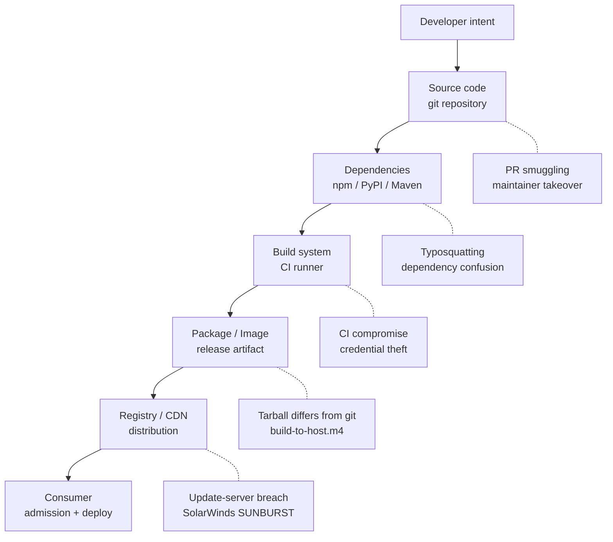
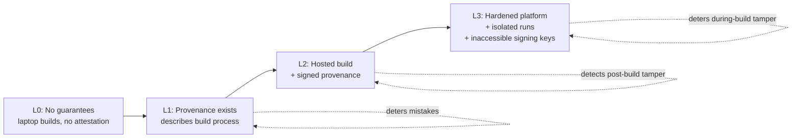
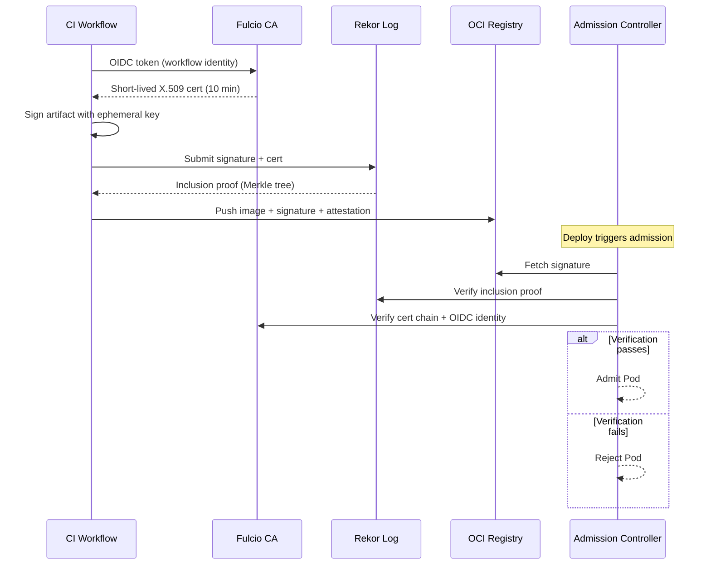
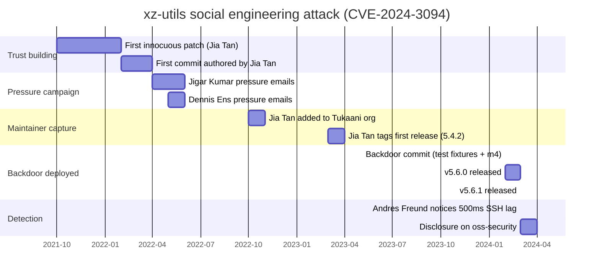

# Supply Chain Security: SBOM, SLSA, Sigstore, and Defending Against xz-utils

> **TL;DR**: Your application is overwhelmingly code you did not write. npm served approximately 4.5 trillion package requests in 2024 [^1], and Sonatype has identified over 704,102 malicious packages since 2019 [^2]. The modern defense stack has four layers: SBOMs for transparency (what is inside), SLSA for provenance (how it was built), Sigstore for integrity (who signed it), and admission controllers for enforcement (reject anything unverified). The xz-utils backdoor (CVE-2024-3094, CVSS 10.0) was not caught by any of these tools. A Microsoft engineer noticed SSH logins were 500ms slower [^3]. Maintainer burnout is a supply-chain vulnerability that no framework fully addresses.

## Learning Objectives

After this module, you will be able to:

- [ ] Map the supply-chain threat model: typosquatting, maintainer takeover, CI compromise, dependency confusion, build backdoors
- [ ] Generate and consume SBOMs in CycloneDX or SPDX format
- [ ] Explain the SLSA levels (L0 through L3) and what controls each level requires
- [ ] Sign artifacts with cosign (keyless via OIDC) and verify them at admission time
- [ ] Design dependency hygiene: lockfiles, SCA scanning, registry allowlists, egress filtering
- [ ] Explain the xz-utils backdoor timeline and what it teaches about maintainer burnout

## Intuition

You run a restaurant. You source ingredients from dozens of suppliers: flour from one mill, olive oil from another, spices from a third. You trust that the flour bag labeled "organic wheat" actually contains organic wheat. You trust that nobody tampered with the olive oil between the press and your kitchen.

Now imagine one supplier quietly replaces your olive oil with a cheaper blend. Another ships flour with a contaminant that only activates when heated above 200C. A third supplier goes bankrupt, and a stranger buys the brand name and starts shipping something else entirely under the same label. You would never know unless a customer got sick, or unless you tested every ingredient on arrival.

Software supply chains work the same way. Every `npm install`, every `docker pull`, every `pip install` fetches code from strangers. You trust that the package named `lodash` is actually lodash, that nobody modified it between the author's machine and yours, and that the author is who they claim to be. The xz-utils backdoor proved that a patient attacker can spend two years becoming the trusted supplier before poisoning the well.

This chapter gives you the ingredient-testing lab: tools to know what is in your artifacts, prove where they came from, verify who built them, and reject anything that fails inspection at the kitchen door.

## Theory

### The supply-chain attack surface

Every link between a developer's intent and a user's deployment is an attack surface. The SLSA threat model identifies five distinct choke points:



*Five attack surfaces run from developer intent to production deployment; each has a canonical incident and a matching control.*

Each choke point has been exploited in production:

- **Typosquatting and maintainer takeover.** The `event-stream` package (Nov 2018) was handed to a new maintainer who injected a bitcoin-stealing payload; it accumulated millions of downloads before detection [^4]. The `ua-parser-js` hijack (Oct 2021) affected versions with massive install bases [^5].
- **Dependency confusion.** Alex Birsan (Feb 2021) published public packages with the same names as internal ones at version 99.99.99. Default resolvers in npm, pip, and Maven preferred the higher version. Dependency confusion was detected inside more than 35 organizations, and Birsan collected over $130,000 in bug bounties [^6].
- **Build-system compromise.** SolarWinds SUNBURST (Dec 2020): attackers modified the Orion build pipeline to inject a backdoor into every signed release. Approximately 18,000 organizations installed compromised updates over nine months [^7].
- **Tarball divergence.** The xz-utils backdoor hid malicious code in release tarballs that did not exist in the git tree. Auditors who reviewed the repository saw clean code.
- **Double supply chain.** 3CX (Mar 2023) was compromised because an upstream dependency (X_Trader) was itself compromised, cascading through two layers [^8].

### SBOM: knowing what is inside

A Software Bill of Materials is a formal inventory of every component in an artifact, analogous to a food ingredient label. US Executive Order 14028 (May 2021) made SBOMs a federal procurement requirement [^9]. The EU Cyber Resilience Act (Regulation 2024/2847, entered into force December 2024) mandates supply-chain cybersecurity controls for commercial software placed on the EU market, with main obligations applying from December 2027 [^10].

Two formats dominate:

- **CycloneDX** (OWASP, first released 2018): security-focused, compact, with native vulnerability and VEX (Vulnerability Exploitability eXchange) support. JSON, XML, and Protobuf serialization.
- **SPDX** (Linux Foundation, ISO/IEC 5962:2021): compliance-focused with deep license documentation.

Both are accepted by regulators. The practical difference is tooling alignment: Syft generates SBOMs, Grype matches them against vulnerability feeds, and Trivy combines both in one scanner. An SBOM generated at build time and attached to the artifact (via OCI referrers or in-toto attestations) creates a durable audit record.

> [!IMPORTANT]
> An SBOM without a scanning pipeline is a file, not a control. Sonatype reports that 95% of vulnerable downloads had a newer non-vulnerable version available at download time [^1]. The data existed; nobody acted on it.

For organizations managing SBOMs at scale, GUAC (Graph for Understanding Artifact Composition) is an OpenSSF incubating project that ingests SBOMs, SLSA provenance, and vulnerability data into a queryable knowledge graph, enabling supply-chain-wide queries such as "which of my services transitively depend on this vulnerable library?" GUAC reached 1.0 in June 2025.

### SLSA: proving how it was built

SLSA (Supply-chain Levels for Software Artifacts) is an OpenSSF specification that defines incrementally stronger requirements for build integrity [^11]. Version 1.0 (April 2023) organizes requirements into a Build track with levels L0 through L3. Version 1.1 (approved April 2025) adds backwards-compatible clarifications to the threat model, attestation model, and verification procedure, including verifier metadata in the Verification Summary Attestation (VSA) format. Version 1.2 (November 2025, current) introduces the Source Track covering threats from source code authoring and review:



*Each SLSA level adds a specific control: L1 adds provenance, L2 moves builds to hosted infrastructure with signed provenance, L3 isolates runs and keeps signing material out of user-defined build steps.*

The levels in practice:

- **L1**: Provenance exists. A document describes the build platform, process, and top-level inputs. Can be bypassed, but useful against mistakes.
- **L2**: Build runs on hosted, dedicated infrastructure (not a laptop). Provenance is signed so tampering after the build is detectable. Achievable for most teams by moving to GitHub Actions, GCP Cloud Build, or GitLab Shared Runners.
- **L3**: Hardened build platform that isolates runs from each other and keeps signing keys inaccessible to user-defined build steps. Forging provenance requires exploiting the build platform itself.

> [!NOTE]
> The v0.1 spec had an L4 tier. It was removed in v1.0. Do not reference L4 in design documents. SLSA v1.2 (current as of May 2026) adds a Source Track with its own levels; the Build Track levels (L0-L3) remain unchanged from v1.0. SLSA is a build-integrity framework, not a vulnerability management framework. An L3 package can still contain Log4Shell.

Provenance is encoded as an in-toto attestation with `predicateType: https://slsa.dev/provenance/v1`, describing the builder, build type, external parameters, resolved dependencies, and output digests.

### Sigstore: keyless signing and transparency

[Secrets Management](./04-secrets-management.md) showed that long-lived keys are the root cause of most credential incidents. Sigstore eliminates long-lived signing keys entirely [^12].

The flow:



*Sigstore's keyless signing binds a workflow identity to a transparency-log entry; the admission controller rejects anything that cannot be verified against both the Fulcio certificate and the Rekor inclusion proof.*

The components:

- **Fulcio**: a lightweight CA that issues short-lived X.509 certificates (10-minute validity) binding an ephemeral keypair to an OIDC identity (Google, GitHub Actions, Azure).
- **Rekor**: an append-only transparency log backed by a Merkle tree. Every signature is recorded immutably. Attackers cannot silently rewrite history.
- **cosign**: the CLI and library. Signs containers and blobs, verifies against identity policy.

The verification command enforces signer identity:

```bash
cosign verify $IMAGE \
  --certificate-identity=$IDENTITY \
  --certificate-oidc-issuer=$OIDC_ISSUER
```

The upshot: no long-lived key material for any party to rotate, leak, or lose. npm (2023), PyPI, and GitHub Artifact Attestations (GA June 2024) have all integrated Sigstore-compatible provenance.

### Admission control and dependency hygiene

Signing is useless without enforcement. Kubernetes admission webhooks intercept Pod creation and reject images that fail policy. Kyverno exposes a native `verifyImages` rule:

```yaml
apiVersion: kyverno.io/v1
kind: ClusterPolicy
metadata:
  name: verify-image
spec:
  validationFailureAction: Enforce
  rules:
    - name: verify-cosign
      match:
        any:
          - resources:
              kinds: [Pod]
      verifyImages:
        - imageReferences: ["ghcr.io/myorg/*"]
          attestors:
            - entries:
                - keyless:
                    subject: "https://github.com/myorg/*"
                    issuer: "https://token.actions.githubusercontent.com"
```

OPA Gatekeeper composes with Ratify for the same purpose. Google's Binary Authorization provides the pattern on GKE and Cloud Run, enforcing SLSA provenance produced by Cloud Build [^13].

Beyond admission, four cheap controls reduce dependency risk:

1. **Lockfiles with hash verification.** `package-lock.json`, `poetry.lock`, `go.sum`, `Cargo.lock`. Pin exact transitive versions and content hashes. Reinstalling cannot silently substitute a different tarball.
2. **SCA scanning.** Snyk, Dependabot, Renovate, and Semgrep SCA scan lockfiles against vulnerability feeds and open PRs automatically.
3. **Registry allowlists.** Route all dependency fetches through an internal proxy (Artifactory, Nexus, GCP Artifact Registry). The resolver only sees internal packages, defeating dependency confusion [^6].
4. **Egress filtering in CI.** Refuse outbound connections to arbitrary domains during build. This catches exfiltration payloads that phone home.

## Real-World Example

GitHub Artifact Attestations (public beta May 2024, GA June 2024) demonstrate the full stack in production. A GitHub Actions workflow step calls `actions/attest-build-provenance`, which:

1. Exchanges the workflow's OIDC token (issuer `https://token.actions.githubusercontent.com`) for a Fulcio certificate
2. Signs the SLSA provenance with the ephemeral key
3. Pushes the signed attestation to Rekor and (for containers) to the OCI registry as a referrer

The certificate identity encodes the exact workflow: `https://github.com/ORG/REPO/.github/workflows/WORKFLOW.yml@REF`. Consumers verify with `gh attestation verify` or `cosign verify-attestation`.

For enforcement, GitHub documents a full admission-control path: deploy Sigstore's policy-controller, register the GitHub TrustRoot, apply a `ClusterImagePolicy`, and scope enforcement per namespace. The entire model depends on OIDC identity and short-lived certs. There is no key to rotate.

The cosign bundle format (standardized in v2.4, default in v3.0+) is shared across npm provenance, GitHub Artifact Attestations, Homebrew provenance, and PyPI attestations, so one verifier works across ecosystems.  The Rekor entry is public and permanent: anyone can audit a build's identity after the fact.

> [!TIP]
> Start with `gh attestation verify` on your existing images. If it fails, you have no provenance. That is your baseline.

## Defense in Depth

These controls are complementary layers, not alternatives. A real supply-chain program adopts all of them. The chapter's TL;DR says it outright: "The modern defense stack has four layers." The column below labelled "Our Pick" encodes adoption priority and threat-model threshold, not a choice between rows.

| Control | Pros | Cons | Best When | Adoption priority |
|---|---|---|---|---|
| Lockfile + hash mode | Deterministic installs; cheap to adopt; defeats silent substitution | Lockfile maintenance overhead; slower CI | All environments | Always. Turn it on today. |
| SBOM + SCA scanning | Transparency; vulnerability visibility; regulatory alignment (EO 14028, EU CRA) | Noisy (many low-severity alerts); needs triage workflow | Baseline for every project | Always. Non-negotiable. |
| Sigstore + admission policy | Keyless (no key to rotate); public transparency log; simple dev UX | Network dependency on Fulcio/Rekor; PII in log (signer email) | CNCF-aligned Kubernetes environments | Default for container workloads |
| SLSA L3 build | Strong provenance; tamper resistance; closes cross-tenant attacks | Build-platform complexity; L3 tooling still maturing | Sensitive production artifacts | L2 minimum; L3 for anything touching auth or payments |
| Hermetic builds (Bazel, Nix) | Reproducible; no drift from source; enables independent rebuild verification | Opinionated toolchain; significant migration cost | High-security or nation-state threat model | Only when compliance or threat model demands it |

Read the table top-to-bottom as an adoption order: lockfiles cost a CI config change and defeat the most common attack class (dependency confusion, silent substitution); SBOMs add visibility; Sigstore adds integrity at deploy time; SLSA L3 hardens the build platform itself; hermetic builds are the last layer, justified only when the threat model demands reproducible-from-source verification.

## Common Pitfalls

> [!WARNING]
> **SBOM without scanning.** Teams generate SBOMs and store them, but nothing ingests them. Vulnerable components ship unnoticed. Wire the SBOM into a scanner (Grype, Trivy) as a CI gate with severity thresholds. If your SBOM exists but your CVE alert count is zero, the pipeline is broken.

> [!WARNING]
> **Dependency confusion via mixed registries.** Your resolver is configured to look at both public npm and your internal registry. An attacker publishes `@internal/payments` at version 99.99.99 on public npm. The resolver picks the higher version. Fix: scope private packages (`@org/` in npm), route through an internal proxy, and never configure resolvers to search both public and private for the same namespace.

> [!WARNING]
> **Maintainer burnout as an unpatched vulnerability.** Critical open-source infrastructure is often maintained by one volunteer. The xz-utils attacker exploited this directly: sock-puppet accounts pressured a burned-out maintainer for months until he handed over commit rights. No technical control detects this. Fund critical maintainers. Require multiple signers on releases. Treat sudden aggressive "helpful" contributors as a yellow flag.



*Over more than two years, "Jia Tan" built trust through innocuous patches, pressured the burned-out maintainer via sock-puppet accounts, obtained commit rights, and finally shipped a backdoor that was caught not by any security tool but by a 500 ms SSH login regression that an engineer happened to notice.*

> [!WARNING]
> **Source tarball differs from git tree.** Auditors inspect the public git repository, which is clean. The actual distributed tarball contains extra files (generated configure scripts, m4 macros, test fixtures) with malicious content. The xz-utils backdoor lived exclusively in the release tarball. Always diff the tarball against `git archive` output for the same tag.

> [!WARNING]
> **Admission controller in fail-open mode.** A misconfigured webhook that fails open means a Fulcio outage silently disables all signature verification. Decide explicitly: fail-closed (blocks deploys during outages) or fail-open (allows unverified images). For production, fail-closed with a documented break-glass path is the correct answer.

## Exercise

Your organization runs three internal container registries and pulls from 50+ public dependencies. Design the minimum-viable supply-chain security program: SBOM policy (when generated, where stored), signing requirements (who signs, with what identity), and an admission rule that blocks unsigned prod images. What happens operationally when a critical prod image lacks provenance at 2am?

<details>
<summary>Hint</summary>

Think about the four layers: transparency (SBOM), provenance (SLSA), integrity (Sigstore), enforcement (admission). For the 2am scenario, consider the tension between security and availability. Google's Binary Authorization has a documented break-glass path for exactly this reason.

</details>

<details>
<summary>Solution</summary>

**SBOM policy:**

- Generate at build time using Syft in every CI pipeline. Attach to the OCI image as a referrer (oras.land format).
- Store in the registry alongside the image. Additionally push to a central Dependency-Track instance for continuous monitoring.
- CI gate: Grype scan with `--fail-on critical` blocks the build if any critical CVE is present.

**Signing requirements:**

- All production images signed via cosign keyless in GitHub Actions (or equivalent CI). The certificate identity is the workflow path: `https://github.com/myorg/myrepo/.github/workflows/release.yml@refs/heads/main`.
- No human holds a signing key. The OIDC identity of the CI workflow IS the signer.
- SLSA L2 minimum: hosted build, signed provenance attached as an in-toto attestation.

**Admission rule (Kyverno):**

```yaml
apiVersion: kyverno.io/v1
kind: ClusterPolicy
metadata:
  name: require-signed-images
spec:
  validationFailureAction: Enforce
  rules:
    - name: verify-prod-images
      match:
        any:
          - resources:
              kinds: [Pod]
              namespaces: ["production", "payments"]
      verifyImages:
        - imageReferences: ["registry.internal.io/*"]
          attestors:
            - entries:
                - keyless:
                    subject: "https://github.com/myorg/*"
                    issuer: "https://token.actions.githubusercontent.com"
```

**The 2am scenario:**
A critical hotfix image was built locally (not via CI) and lacks provenance. The admission controller rejects it.

Response: invoke the documented break-glass path. In Kyverno, this means a `PolicyException` resource scoped to the specific image digest, applied by an on-call engineer with elevated RBAC, and automatically reverted after 4 hours by a CronJob. The exception is logged, triggers an alert in [Observability](../part-6-reliability-and-operations/00-observability.md), and requires a post-incident review within 48 hours to rebuild the image through the proper pipeline.

The break-glass path must exist, be documented, be audited, and be rare. If it fires more than once a quarter, your CI pipeline has a reliability problem.

</details>

## Key Takeaways

- You are responsible for code you did not write. Know what is in your artifacts (SBOM) and where it came from (SLSA provenance).
- Sign everything, verify at admission. Keyless signing with cosign removes the "but we will rotate the key" excuse.
- Lockfiles with hash verification are the cheapest, highest-leverage control. Turn them on today.
- SLSA L2 (hosted build + signed provenance) is achievable for most teams by moving to GitHub Actions or equivalent hosted CI.
- The xz-utils backdoor was detected by a 500ms performance regression, not a security tool. Humility is required.
- Maintainer burnout is a supply-chain vulnerability. Funding and staffing upstream projects is security work, not charity.
- Registry allowlists and egress filtering in CI defeat dependency confusion and exfiltration without requiring new frameworks.

## Further Reading

- [Andres Freund, "backdoor in upstream xz/liblzma leading to ssh server compromise"](https://www.openwall.com/lists/oss-security/2024/03/29/4) - The original disclosure post; required reading for anyone making decisions about open-source dependency risk.
- [Russ Cox, "Timeline of the xz open source attack"](https://research.swtch.com/xz-timeline) - The canonical month-by-month reconstruction of the two-year social engineering campaign.
- [SLSA v1.0 specification](https://slsa.dev/spec/v1.0/) - Build tracks, provenance schema, and requirements per level; the authoritative source for what L1/L2/L3 actually require. See also [v1.2 (current)](https://slsa.dev/spec/v1.2/) which adds the Source Track.
- [Sigstore documentation](https://docs.sigstore.dev/cosign/signing/overview/) - Keyless signing end-to-end with cosign, Fulcio, and Rekor; start here for implementation.
- [NIST SP 800-218 SSDF v1.1](https://csrc.nist.gov/pubs/sp/800/218/final) - The US federal baseline for secure software development; shapes vendor attestation requirements.
- [GitHub Artifact Attestations](https://docs.github.com/en/actions/how-tos/secure-your-work/use-artifact-attestations/enforce-artifact-attestations) - How to generate and enforce cosign-backed provenance in the GitHub ecosystem.
- [Sonatype State of the Software Supply Chain 2024](https://www.sonatype.com/state-of-the-software-supply-chain/2024/scale) - Annual data on registry scale, malicious package trends, and the 156% year-over-year growth in supply-chain attacks.
- [Alex Birsan, "Dependency Confusion"](https://medium.com/@alex.birsan/dependency-confusion-4a5d60fec610) - The original write-up of the dependency confusion technique that was detected inside 35+ organizations; explains exactly how resolvers fail.

## Flashcards

**Q:** What are the four layers of the modern supply-chain defense stack?
**A:** Transparency (SBOM describes what is inside), provenance (SLSA attests how it was built), integrity (Sigstore cryptographically binds signer identity to artifact), and enforcement (admission controllers reject anything that fails verification).

**Q:** What is the difference between CycloneDX and SPDX?
**A:** CycloneDX (OWASP) is security-focused with native vulnerability and VEX support. SPDX (Linux Foundation, ISO/IEC 5962:2021) is compliance-focused with deep license documentation. Both serialize to JSON and are accepted by regulators.

**Q:** What are the three SLSA v1.0 Build levels above L0?
**A:** L1: provenance exists (describes build process). L2: hosted build platform with signed provenance (detects post-build tamper). L3: hardened platform with isolated runs and inaccessible signing keys (deters during-build tamper).

**Q:** How does Sigstore eliminate long-lived signing keys?
**A:** The signer authenticates via OIDC. Fulcio issues a short-lived X.509 certificate (10-minute validity) binding an ephemeral keypair to the OIDC identity. The signer signs the artifact, discards the key, and records the signature in Rekor's transparency log. No long-lived key exists.

**Q:** What is dependency confusion and how do you prevent it?
**A:** An attacker publishes a public package with the same name as an internal one at a higher version number. The resolver prefers the higher version and installs attacker code. Prevention: use scoped packages (`@org/` in npm), route fetches through an internal registry proxy, and never configure resolvers to search both public and private for the same namespace.

**Q:** How was the xz-utils backdoor (CVE-2024-3094) detected?
**A:** Andres Freund, a Microsoft engineer, noticed SSH logins were approximately 500ms slower than normal while benchmarking. He investigated and found the backdoor in liblzma. No security scanner, SBOM tool, or provenance check detected it.

**Q:** Why did the xz-utils backdoor exist only in release tarballs, not in the git tree?
**A:** The malicious code was injected via a modified `build-to-host.m4` macro included in the release tarball but not checked into git. Auditors reviewing the repository saw clean code. The tarball was the actual distributed artifact, and few people diff tarballs against git.

**Q:** What is VEX and why does it matter for SBOMs?
**A:** VEX (Vulnerability Exploitability eXchange) annotates whether a known CVE in a dependency is actually exploitable in your specific context: affected, not_affected, fixed, or under_investigation. It reduces alert noise by letting producers declare "this CVE exists in our SBOM but is not reachable in our usage."

**Q:** What does a Kyverno `verifyImages` policy do at admission time?
**A:** It intercepts Pod creation, fetches the image's cosign signature from the registry, verifies it against the specified attestor (public key or keyless identity), and rejects the Pod if verification fails. With `mutateDigest: true`, it also rewrites the image reference to a digest, preventing tag mutation between verification and pull.

**Q:** What is the "break-glass" pattern for admission control?
**A:** A documented, audited escape hatch that allows deploying an unverified image during an emergency. Typically implemented as a time-limited policy exception with automatic reversion, elevated RBAC requirements, alerting, and mandatory post-incident review. It must exist because fail-closed admission blocks all deploys during signing-infrastructure outages.

**Q:** Name three real-world supply-chain attacks and their attack vector.
**A:** SolarWinds SUNBURST (2020): build-system compromise injecting backdoor into signed releases, 18,000 customers affected. Dependency confusion (Birsan, 2021): public packages with internal names at higher versions, detected inside 35+ organizations. xz-utils (2024): two-year social engineering of a burned-out maintainer to inject a backdoor into release tarballs.

**Q:** What did US Executive Order 14028 require regarding SBOMs?
**A:** EO 14028 (May 2021) required NIST to define secure software development practices (formalized as NIST SP 800-218 SSDF). It made SBOMs a requirement for software sold to the US federal government, establishing minimum elements that every SBOM must contain.

## References

[^1]: Sonatype, "2024 State of the Software Supply Chain: scale and growth". https://www.sonatype.com/state-of-the-software-supply-chain/2024/scale
[^2]: Sonatype press release, "10th annual State of the Software Supply Chain Report: 156% surge in OSS malware", Oct 2024. https://www.sonatype.com/press-releases/sonatypes-10th-annual-state-of-the-software-supply-chain-report
[^3]: Andres Freund, "backdoor in upstream xz/liblzma leading to ssh server compromise", oss-security mailing list, 29 March 2024. https://www.openwall.com/lists/oss-security/2024/03/29/4
[^4]: Ars Technica, "Widely used open source software contained bitcoin-stealing backdoor" (event-stream), Nov 2018. https://arstechnica.com/information-technology/2018/11/hacker-backdoors-widely-used-open-source-software-to-steal-bitcoin/
[^5]: GitHub Advisory Database, "Embedded malware in ua-parser-js", CVE-2021-4229, Oct 2021. https://github.com/advisories/GHSA-pjwm-rvh2-c87w
[^6]: Alex Birsan, "Dependency Confusion: How I Hacked Into Apple, Microsoft and Dozens of Other Companies", Feb 2021. https://medium.com/@alex.birsan/dependency-confusion-4a5d60fec610
[^7]: Belfer Center, "The SolarWinds attack: 18,000 customers, compromised Orion updates". https://www.belfercenter.org/publication/solarwinds-attack
[^8]: Mandiant, "3CX Software Supply Chain Compromise Initiated by a Prior Software Supply Chain Compromise", April 2023. https://www.mandiant.com/resources/blog/3cx-software-supply-chain-compromise
[^9]: NIST SP 800-218, "Secure Software Development Framework (SSDF) Version 1.1". https://csrc.nist.gov/pubs/sp/800/218/final
[^10]: cyberresilienceact.eu, "Regulation (EU) 2024/2847 entered into force on 10 December 2024". https://www.cyberresilienceact.eu/commission-guidance-on-regulation-eu-2024-2847/
[^11]: SLSA v1.0 specification, "Security levels". https://slsa.dev/spec/v1.0/levels
[^12]: sigstore/cosign README (Quick Start, verify flags). https://github.com/sigstore/cosign/blob/main/README.md
[^13]: Google Cloud, "Binary Authorization documentation". https://cloud.google.com/binary-authorization/docs
