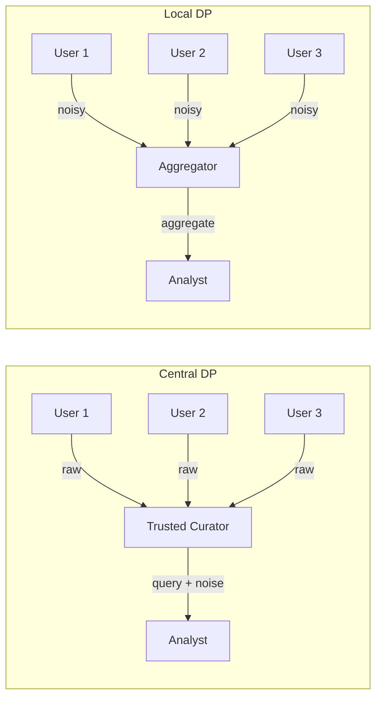
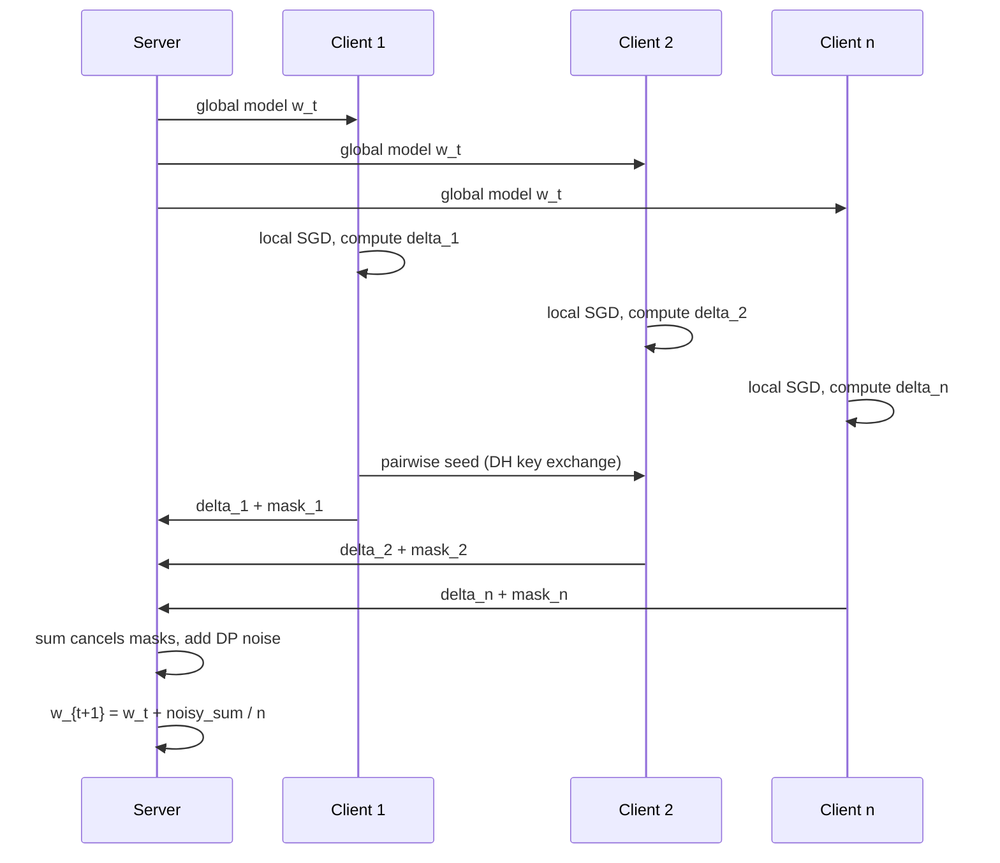
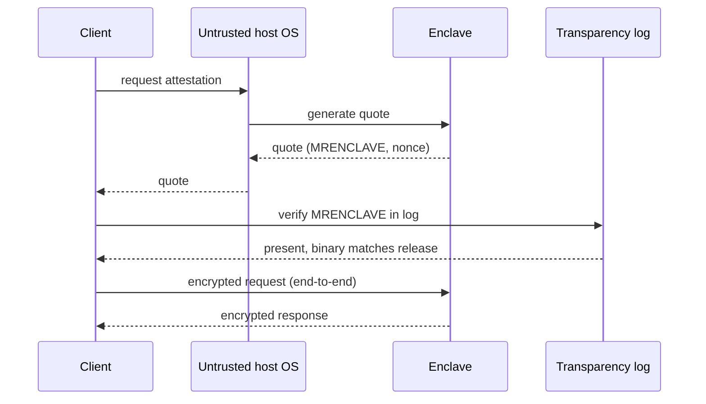
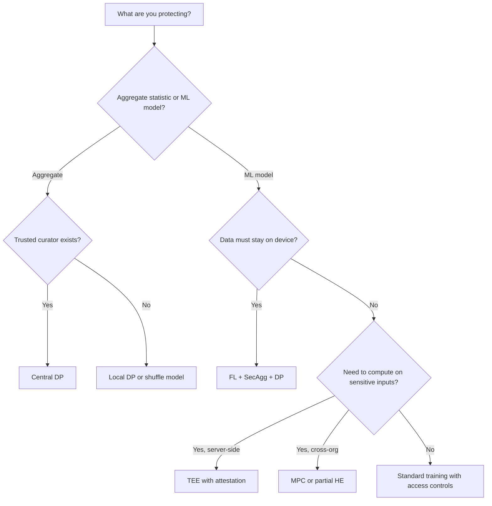

# Privacy-Preserving Systems (Differential Privacy, Federated Learning)

> **TL;DR**: Privacy-preserving systems shift the boundary of what an operator ever sees, rather than treating privacy as post-hoc access control. Five techniques dominate production: differential privacy (calibrated noise so no single record changes outputs meaningfully), federated learning (raw data stays on-device, only model updates travel), secure aggregation (cryptographic sums without individual visibility), homomorphic encryption (compute on ciphertext), and trusted execution environments (hardware-attested enclaves). Google's Gboard stack combines FL, secure aggregation, and DP-FTRL to achieve user-level zCDP of rho = 0.81, stronger than the US Census's rho = 2.63 [^1]. No single primitive covers both a compliance obligation and a threat model. The design question is which layering makes the cost acceptable.

## Learning Objectives

After this module, you will be able to:

- [ ] Apply differential privacy to a real aggregation query and choose an epsilon
- [ ] Describe federated learning and its communication-vs-privacy trade-offs
- [ ] Explain secure aggregation well enough to design a federated training protocol
- [ ] Recognize when homomorphic encryption is applicable (and when it is still too slow)
- [ ] Select the right privacy primitive for a given threat model using a decision tree
- [ ] Combine techniques (DP + FL + SecAgg) as production systems actually do

## Intuition

You run a hospital consortium. Ten hospitals want to know the average length of stay for pneumonia patients, but no hospital will share its patient records with the others. One approach: each hospital adds a small random number to its average before reporting it. The noise is large enough that you cannot reverse-engineer any single hospital's true value, but small enough that the combined average is still useful. That is differential privacy.

Now suppose the hospitals want to train a shared AI model for pneumonia risk prediction. No hospital sends patient data anywhere. Instead, each hospital downloads the current model, trains it on local records for a few hours, and sends back only the weight changes. A coordinator averages those changes and updates the global model. That is federated learning.

But wait. If the coordinator can see each hospital's individual weight update, a clever attacker could reconstruct patient records from those gradients. So the hospitals add pairwise random masks that cancel when summed. The coordinator sees only the aggregate. That is secure aggregation.

Finally, one hospital wants a cloud service to run a query on its encrypted patient database without ever decrypting it. That is homomorphic encryption, and it is 1,000x to 100,000x slower than plaintext [^2]. For most workloads, you pick a faster primitive and accept a different trust model.

The rest of this chapter gives you the formal tools to make these choices.

## Theory

### Differential privacy fundamentals

A randomized algorithm M is (epsilon, delta)-differentially private if for all neighboring datasets D, D' (differing in one record) and all output sets S:

```text
Pr[M(D) in S] <= e^epsilon * Pr[M(D') in S] + delta
```

Epsilon controls the privacy-utility trade-off. Smaller epsilon means stronger privacy but noisier outputs. Delta is the probability of a catastrophic privacy failure; set it to less than 1/n where n is the dataset size [^3].

**Mechanisms.** Pure DP (delta = 0) uses Laplace noise with scale = L1-sensitivity / epsilon. Approximate DP (delta > 0) uses Gaussian noise calibrated to L2 sensitivity. The Gaussian mechanism gives tighter composition bounds, which matters when you run many queries.

**Composition.** Every query on the same data spends privacy budget. Basic composition says k queries at epsilon each cost k * epsilon total. Advanced composition (Renyi DP, zero-concentrated DP) gives tighter accounting. Google's DP-FTRL uses tree-aggregation with negatively correlated noise to avoid the amplification-via-sampling assumption that is hard to enforce on drifting device populations [^1].

**Epsilon in the wild.** The US Census 2020 used epsilon = 19.61 total (17.14 for persons, 2.47 for housing) [^4]. Apple deploys per-datum epsilon of 1 to 2 but daily composed budgets up to 16 [^5]. Google's Gboard achieves rho = 0.81 zCDP at the user level [^1]. There is no universal "good epsilon." Calibrate against your utility requirements and threat model.

**Local vs. central DP.** In central DP, a trusted curator sees raw data and adds noise to query outputs. In local DP, each user adds noise before data leaves their device. Local DP requires roughly sqrt(n) times larger epsilon than central DP for the same utility, because noise is not amortized across users. Apple chose local DP because they refuse to be the trusted curator [^6].



*In central DP the curator sees raw data and is trusted to add noise correctly. In local DP noise is injected on-device so the aggregator never sees raw values.*

**Libraries.** Google's [differential-privacy](https://github.com/google/differential-privacy) (C++, Go, Java), OpenDP (Rust/Python, Harvard), Tumult Analytics (Spark-native), Opacus (PyTorch DP-SGD), TensorFlow Privacy (moments accountant). Google's library separates builder inputs (epsilon, delta, sensitivity) from mechanism selection, the API pattern every production DP system converges on.

### Federated learning and FedAvg

Federated learning is a distributed training protocol where a coordinator sends a model to many clients, each client trains on local data, and only weight updates return for aggregation [^7].

The canonical algorithm is FedAvg (McMahan et al., 2017): per round, sample a subset of available clients; each runs E epochs of local SGD; the server takes a weighted average of client updates by local dataset size. FedAvg reduces communication rounds by 10x to 100x versus synchronized SGD on non-IID mobile data [^7].

**Cross-device vs. cross-silo.** Cross-device FL involves millions of unreliable clients with tiny local datasets (Gboard: 6,500 devices per round, 2,000 rounds, 6 days of training [^1]). Cross-silo FL involves tens of stable participants (hospitals, banks) with large local datasets and reliable connectivity.

**Variants.** FedProx adds a proximal term penalizing client drift on non-IID data. FedOpt uses server-side adaptive optimizers (Adam, Adagrad). Personalization layers (FedPer, meta-learning) give each client a customized head while sharing a global backbone.

**Frameworks.** Flower (a widely-used open-source FL framework as of 2025), TensorFlow Federated, PySyft (OpenMined), NVIDIA FLARE (enterprise cross-silo).

> [!IMPORTANT]
> FL alone is not private. A server that sees individual client gradients can reconstruct training inputs via gradient inversion attacks [^8]. FL must be combined with secure aggregation and DP to provide meaningful privacy guarantees.

### Secure aggregation

Secure aggregation lets a server compute the sum of user-held vectors without learning any individual vector [^9].

In Bonawitz et al. (2017), each pair of clients (i, j) derives a shared mask via Diffie-Hellman. Client i adds +mask and client j adds -mask to their updates. When the server sums all n updates, pairwise masks cancel. Shamir secret sharing of each client's seed (threshold t) lets the server recover masks for clients that drop out mid-round [^9].



*Each round: server broadcasts model, clients train locally and mask updates pairwise, server aggregates the masked sum and adds DP noise before applying the update.*

Per-client communication is O(n) for masking plus O(n) for Shamir shares, giving O(n^2) total across the round [^9]. Sparse-graph variants (e.g., Choi et al. 2020) reduce per-client communication to O(log n) by replacing the complete pairwise-mask graph with an Erdos-Renyi random graph, taking total communication from O(n^2) to O(n log n) while preserving reliability and privacy guarantees [^10]. Flamingo extends to multi-round aggregation with a one-time setup.

### Homomorphic encryption and MPC

**Homomorphic encryption (HE)** lets specific operations on ciphertexts correspond to operations on plaintexts after decryption. Partial HE supports one operation (Paillier: additive). Fully HE (FHE) supports arbitrary circuits but incurs 1,000x to 100,000x slowdown [^2].

Modern FHE schemes: BFV and BGV (exact integer arithmetic, SIMD batching), CKKS (approximate real arithmetic, ideal for ML inference), TFHE (fast boolean gates, cheap bootstrapping). Libraries: Microsoft SEAL, OpenFHE, Zama Concrete/TFHE-rs, Google HEIR (MLIR-based compiler).

**When to use HE:** narrow, high-sensitivity queries where no party should see plaintext. Microsoft's Password Monitor uses SEAL to check breached credentials without exposing the password to the server [^11]. For general ML training or real-time serving, HE is too slow. Use TEEs or MPC instead.

**Secure multi-party computation (MPC)** lets n parties jointly compute a function such that each party learns only the output, not the others' inputs. Yao's Garbled Circuits (two-party), GMW (multi-party), and Shamir secret sharing are the foundations. Meta and Mozilla's Interoperable Private Attribution (IPA) uses three-party MPC for ad attribution, reporting 18 GB network cost per 1M records at roughly $1.44 in cloud egress [^12].

### Trusted execution environments

TEEs provide hardware-isolated execution with encrypted memory and remote attestation. The client verifies what code is running before sending data.

**Intel SGX** (enclaves with encrypted RAM) was deprecated on client CPUs (11th Gen onward), partly due to side-channel attacks like Foreshadow [^13], but remains on Xeon server parts. **Intel TDX** and **AMD SEV-SNP** provide VM-level confidential compute. **AWS Nitro Enclaves** isolate from the parent EC2 instance via vsock. **Apple Private Cloud Compute** (PCC, June 2024) is a full Apple-silicon server stack with Secure Enclave, measured Secure Boot, a transparency log of production binaries, and non-targetability via oblivious HTTP routing [^14]. Apple offers up to $1,000,000 for arbitrary code execution on a PCC node [^14].

Signal's Private Contact Discovery uses SGX enclaves with an oblivious hash-table construction to prevent access-pattern side channels. Clients verify the MRENCLAVE value via remote attestation before transmitting address-book hashes [^15].



*The client verifies the remote enclave's measurement against a trusted transparency log before sending any sensitive data. Apple PCC extends this pattern with Oblivious HTTP relays so Apple cannot preferentially route a user to a compromised node [^14].*

> [!WARNING]
> **TEE side channels are real.** Foreshadow leaked L1 cache contents via speculative execution [^13]. Encrypted RAM hides contents but not access patterns. Mitigations: oblivious memory access, minimal enclave code, current microcode, and transparency logs that bind deployed binaries.

### Choosing the right primitive



*Start from whether a trusted curator exists. Derive the primitive from the threat model and latency budget.*

**When NOT to use these techniques:** (1) Low-sensitivity data where access control suffices. (2) Pre-aggregated data where individual records are already gone. (3) Compliance-only scenarios where pseudonymization satisfies the regulator. (4) Tight latency budgets that cannot absorb FHE or MPC overhead. Privacy engineering has real costs. Apply it where the threat model demands it.

## Real-World Example

Google's Gboard federated learning stack is the most complete production deployment combining FL, secure aggregation, and differential privacy [^1].

**The problem:** Train a next-word prediction model on what users actually type, without collecting their keystrokes on a server.

**The solution:** A 1.3M-parameter recurrent neural network trained via DP-FTRL (Differentially Private Follow-the-Regularized-Leader). Each round, 6,500 devices are sampled. Each device trains locally on its typing history, computes a weight update, masks it via secure aggregation, and sends the masked update to the server. The server sums the masked updates (pairwise masks cancel), adds calibrated Gaussian noise for DP, and applies the noisy aggregate to the global model. Training takes 2,000 rounds over 6 days [^1].

**Key design decisions:**

- **DP-FTRL over DP-SGD:** DP-SGD requires uniformly random device sampling, which is infeasible when devices check in only when idle, charging, and on WiFi. DP-FTRL uses tree-aggregation with negatively correlated noise that avoids this assumption [^1].
- **User-level DP:** All data on one device counts as one user. The formal guarantee is rho = 0.81 zCDP at the user level, stronger than the US Census's rho = 2.63 [^1].
- **Device participation cap:** Each device participates at most once every 24 hours, bounding per-user contribution to the aggregate.
- **Open-sourced:** Production parameters published in TensorFlow Federated and TensorFlow Privacy for reproducibility.

**Deployments beyond Gboard:** Apple uses local DP for iOS/macOS telemetry (emoji usage, new words, Safari domains) with Count-Mean Sketch and Hadamard CMS [^6]. Hospital consortia use cross-silo FL via NVIDIA FLARE for radiology models without sharing patient images.

## Trade-offs

| Approach | Pros | Cons | Best When | Our Pick |
|---|---|---|---|---|
| Anonymization (hash, k-anonymity) | Simple, zero infra | Repeatedly broken by linkage attacks; GDPR still considers it personal data | As a defense-in-depth supplement layered under DP or a TEE | Use only as a supplement; pair with DP or a TEE for the actual privacy guarantee |
| Differential privacy | Provable, composable, post-processing robust | Accuracy loss; budget management overhead; epsilon choice is political | Aggregate telemetry, official statistics, dashboards | Default for analytics |
| Federated learning + SecAgg + DP | Data never leaves device; aligns with GDPR Art 25 | Communication cost; non-IID data; complex orchestration | On-device ML: keyboards, speech, health | Default for on-device training |
| MPC | Provable privacy under non-collusion; no hardware trust | High network cost; protocol complexity | Ad attribution (IPA), cross-silo analytics | When 2-3 non-colluding parties exist |
| Homomorphic encryption | Compute on ciphertext; no vendor trust | 1,000x to 100,000x slowdown; huge ciphertexts | Narrow high-sensitivity queries (password breach check) | Only for small circuits |
| TEE (SGX, TDX, SEV-SNP, Nitro, PCC) | Near-native speed; remote attestation | Vendor trust; side channels; CVE churn | Contact discovery, cloud AI inference | When latency matters and vendor trust is acceptable |

## Common Pitfalls

> [!WARNING]
> **Shipping k-anonymity or hashed identifiers as the privacy story.** Linkage attacks have repeatedly re-identified records that passed k-anonymity: Sweeney re-identified the Massachusetts governor's health record from supposedly anonymized public data (1997), Narayanan and Shmatikov deanonymized the Netflix Prize dataset by cross-referencing IMDb ratings (2008), and the AOL search query release (2006) was re-identified within days. GDPR Recital 26 still treats such data as personal if re-identification is reasonably likely, and the Article 29 Working Party Opinion 05/2014 concluded k-anonymity alone is insufficient. Use anonymization only as defense-in-depth layered under differential privacy (for aggregate release) or a TEE (for per-record compute); the primitive below it provides the actual guarantee.

> [!WARNING]
> **Treating epsilon as a fixed knob rather than a cumulative budget.** Successive queries compose. Engineers report per-query epsilon and ignore the daily total. Tang et al. reverse-engineered Apple's macOS 10.12 and found the daily composed epsilon was 16, not the advertised 1 to 2 per datum [^5]. Use RDP/zCDP accounting and maintain a per-user budget ledger.

> [!WARNING]
> **Federated learning without secure aggregation.** The server can reconstruct training inputs from individual client gradients via gradient inversion attacks [^8]. Always combine FL with secure aggregation (so the server sees only sums) and DP noise (so even the sum does not leak).

> [!WARNING]
> **Using FHE where TEEs or MPC would suffice.** FHE sounds maximally private, so teams reach for it without scoping the circuit depth. A 1,000x to 100,000x slowdown blows any real-time latency budget [^2]. Benchmark ciphertext operations against your SLO before committing. Use partial HE (Paillier) for additive-only sums, TEEs when hardware trust is acceptable, MPC when non-collusion is plausible.

> [!WARNING]
> **Non-IID client data killing FedAvg convergence.** FedAvg assumes client gradients are unbiased estimates of the global gradient. When local distributions are highly skewed, updates drift and the global model degrades. Mitigate with FedProx (proximal term), FedOpt (server-side momentum), or personalization layers.

> [!WARNING]
> **TEE attestation TOCTOU.** An attacker with host OS access observes memory access patterns or exploits speculative execution (Foreshadow [^13]). Mitigate with oblivious memory access patterns, minimal enclave code, microcode updates, and transparency logs that bind deployed binaries to attested measurements.

## Exercise

Design an anonymous voting system for user preference data ("which product feature should we build next?"). Specify the privacy technique (DP for aggregate counts? secure aggregation for per-category votes? both?), the epsilon and privacy budget, and how you prevent a single user from casting 10,000 votes. Include the threat model explicitly.

<details>
<summary>Hint</summary>

The key insight is separating authentication (proving you are a valid voter) from anonymity (hiding which option you chose). Consider: who is the adversary? The server operator? Other voters? Both? Your choice of local vs. central DP depends on whether you trust the server.

</details>

<details>
<summary>Solution</summary>

**Threat model:** The server operator is honest-but-curious (will follow the protocol but will try to learn individual votes). Other voters are passive.

**Architecture:**

1. **Authentication layer:** Each user authenticates via OAuth and receives a single-use voting token (blind signature scheme). The token proves eligibility without linking to identity.
2. **Vote submission:** The client adds local DP noise (randomized response with epsilon = 2) to their vote vector before submitting via the anonymous token. This protects against a compromised server.
3. **Aggregation:** The server sums all noisy vote vectors. With n = 10,000 voters and epsilon = 2, the expected error per category is sqrt(n) / (e^epsilon - 1), roughly 15 votes, which is acceptable for a feature-priority survey.
4. **Sybil prevention:** One token per authenticated user per voting period. Rate limiting at the auth layer, not the vote layer, so the vote layer never sees identity.

**Privacy budget:** epsilon = 2 per vote, one vote per user per period. No composition concern because each user votes once.

**Why not secure aggregation alone?** SecAgg hides individual votes from the server but does not protect against a server that correlates submission timing with identity. Local DP provides a mathematical guarantee regardless of what the server observes.

**Trade-off accepted:** Local DP noise means the aggregate has roughly 0.15% error at 10,000 voters. For a feature-priority survey, this is negligible. For an election with thin margins, you would need central DP with a trusted tallying authority or MPC among multiple non-colluding talliers.

</details>

## Key Takeaways

- Differential privacy is the only provable, composable privacy guarantee that survives arbitrary post-processing. Epsilon choice is a policy decision, not a technical one.
- Federated learning keeps data on-device but is not private by itself. Gradient inversion attacks reconstruct inputs. Always pair FL with secure aggregation and DP.
- Secure aggregation (Bonawitz et al. 2017) is the cryptographic primitive that makes FL privacy-preserving. O(n^2) total in the original protocol; sparse-graph variants (Choi et al. 2020) reduce per-client cost to O(log n) and total cost to O(n log n) [^10].
- Homomorphic encryption is too slow (1,000x to 100,000x) for general workloads. Reserve it for narrow, high-sensitivity queries like password breach checks.
- TEEs offer near-native speed but shift trust to the silicon vendor. Side-channel history (Foreshadow, SGAxe) means you cannot rely on hardware alone.
- Production systems combine primitives: Google's Gboard uses FL + SecAgg + DP-FTRL simultaneously. No single technique covers both compliance and threat model.
- Privacy is a system property, not a library call. [Data Residency and Compliance](../part-7-security-at-scale/06-data-residency-compliance.md) covers the regulatory context that motivates these techniques.

## Further Reading

- [The Algorithmic Foundations of Differential Privacy](https://www.cis.upenn.edu/~aaroth/Papers/privacybook.pdf) - Dwork and Roth's canonical 280-page reference, free online. Read chapters 1 to 3 before choosing an epsilon for any production system.
- [Communication-Efficient Learning of Deep Networks from Decentralized Data](https://arxiv.org/abs/1602.05629) - McMahan et al.'s FedAvg paper, the foundation of federated learning. Essential for understanding communication-computation trade-offs.
- [Practical Secure Aggregation for Privacy-Preserving Machine Learning](https://eprint.iacr.org/2017/281) - Bonawitz et al.'s CCS 2017 protocol. The canonical secure aggregation construction used in production at Google.
- [Federated Learning with Formal Differential Privacy Guarantees](https://research.google/blog/federated-learning-with-formal-differential-privacy-guarantees/) - Google Research blog on the Gboard DP-FTRL deployment with production parameters.
- [Apple: Learning with Privacy at Scale](https://machinelearning.apple.com/research/learning-with-privacy-at-scale) - Apple's description of CMS, HCMS, and SFP with deployed parameters. The best public reference for local DP at scale.
- [Apple Private Cloud Compute Security Guide](https://security.apple.com/blog/pcc-security-research/) - Apple's full security architecture for attested cloud AI inference. Sets the bar for TEE transparency.
- [Signal: Private Contact Discovery](https://signal.org/blog/private-contact-discovery/) - Signal's engineering writeup of SGX plus oblivious hash-table contact discovery. A masterclass in TEE threat modelling.
- [Deep Learning with Differential Privacy](https://arxiv.org/abs/1607.00133) - Abadi et al.'s DP-SGD and moments accountant paper. Required reading before using Opacus or TF Privacy.

## Flashcards

**Q:** What is the formal definition of (epsilon, delta)-differential privacy?
**A:** A randomized algorithm M is (epsilon, delta)-DP if for all neighboring datasets D, D' (differing in one record) and all output sets S: Pr[M(D) in S] <= e^epsilon * Pr[M(D') in S] + delta. Epsilon bounds the multiplicative privacy loss; delta bounds the probability of catastrophic failure.

**Q:** What is the difference between local DP and central DP?
**A:** In central DP, a trusted curator sees raw data and adds noise to query outputs. In local DP, each user adds noise on-device before data leaves. Local DP requires no trust in the curator but needs much larger epsilon for the same utility because noise is not amortized across users.

**Q:** Why is federated learning alone not private?
**A:** Individual client gradients can be inverted to reconstruct training inputs (gradient inversion attacks). FL must be combined with secure aggregation (so the server sees only the sum) and differential privacy (so even the sum does not leak individual information).

**Q:** How does secure aggregation work at a high level?
**A:** Each pair of clients derives a shared random mask via Diffie-Hellman. Client i adds +mask and client j adds -mask to their updates. When the server sums all updates, pairwise masks cancel, revealing only the aggregate. Shamir secret sharing handles client dropouts.

**Q:** What epsilon values are used in major production deployments?
**A:** US Census 2020: epsilon = 19.61 total. Apple macOS: per-datum epsilon = 1 to 2, daily composed up to 16. Google Gboard: rho = 0.81 zCDP (user-level). There is no universal "good" epsilon; it depends on the utility requirement and threat model.

**Q:** When should you use homomorphic encryption versus a TEE?
**A:** Use HE when no party (including hardware vendors) should see plaintext and the computation is narrow (small circuit depth). Use TEEs when latency matters and you accept vendor trust. HE incurs 1,000x to 100,000x slowdown; TEEs run at near-native speed but are vulnerable to side channels.

**Q:** What is DP-FTRL and why does Google use it instead of DP-SGD for Gboard?
**A:** DP-FTRL (Differentially Private Follow-the-Regularized-Leader) uses tree-aggregation with negatively correlated noise. Unlike DP-SGD, it does not require uniformly random device sampling, which is infeasible when devices check in opportunistically based on charging and WiFi status.

**Q:** What is the communication cost of the original Bonawitz secure aggregation protocol?
**A:** O(n^2) total across a round (O(n) per client for pairwise masks plus O(n) for Shamir shares). Sparse-graph variants (Choi et al. 2020) reduce per-client communication to O(log n) by using an Erdos-Renyi random graph of pairwise masks, taking total cost to O(n log n) [^10].

**Q:** Name three regulatory drivers for privacy-preserving systems.
**A:** GDPR Article 25 (data protection by design and by default), HIPAA (health data cannot be shared without de-identification), and CCPA/CPRA (right to opt out of sale/sharing of personal information). GDPR Recital 26 excludes truly anonymous data from scope, incentivizing mathematical anonymization via DP.

**Q:** What is Apple Private Cloud Compute and how does it achieve non-targetability?
**A:** PCC is Apple's attested cloud AI inference platform using custom Apple-silicon servers with Secure Enclave. Non-targetability is achieved via Oblivious HTTP relays so Apple cannot preferentially route a specific user to a compromised node. A transparency log binds every production binary to its attestation measurement.

**Q:** What are the main FHE scheme families and their use cases?
**A:** BFV/BGV for exact integer arithmetic with SIMD batching, CKKS for approximate real arithmetic (ideal for ML inference), and TFHE for fast boolean gates with cheap bootstrapping. Libraries include Microsoft SEAL, OpenFHE, and Zama Concrete.

**Q:** When should you NOT use privacy-preserving techniques?
**A:** (1) Low-sensitivity data where access control suffices. (2) Pre-aggregated data where individual records are already gone. (3) Compliance-only scenarios where pseudonymization satisfies the regulator. (4) Tight latency budgets that cannot absorb cryptographic overhead. Privacy engineering has real costs; apply it where the threat model demands it.

## References

[^1]: McMahan and Thakurta, "Federated Learning with Formal Differential Privacy Guarantees", Google Research blog, February 2022. https://research.google/blog/federated-learning-with-formal-differential-privacy-guarantees/
[^2]: Viand, Jattke, Hithnawi, "SoK: Fully Homomorphic Encryption Compilers", IEEE S&P 2021. https://arxiv.org/abs/2101.07078
[^3]: Dwork and Roth, "The Algorithmic Foundations of Differential Privacy", Foundations and Trends in Theoretical Computer Science, 2014. https://www.cis.upenn.edu/~aaroth/Papers/privacybook.pdf
[^4]: US Census Bureau, "Census Bureau Sets Key Parameters to Protect Privacy in 2020 Census Results", June 9, 2021. https://www.census.gov/newsroom/press-releases/2021/2020-census-key-parameters.html
[^5]: Tang, Korolova, Bai, Wang, Wang, "Privacy Loss in Apple's Implementation of Differential Privacy on MacOS 10.12", arXiv 2017. https://arxiv.org/abs/1709.02753
[^6]: Apple Differential Privacy Team, "Learning with Privacy at Scale", Apple Machine Learning Journal, December 6, 2017. https://machinelearning.apple.com/research/learning-with-privacy-at-scale
[^7]: McMahan, Moore, Ramage, Hampson, Aguera y Arcas, "Communication-Efficient Learning of Deep Networks from Decentralized Data", AISTATS 2017. https://arxiv.org/abs/1602.05629
[^8]: Suliman and Leith, "Two Models are Better than One: Federated Learning Is Not Private For Google GBoard Next Word Prediction", ESORICS 2023 (arXiv:2210.16947). https://arxiv.org/abs/2210.16947
[^9]: Bonawitz, Ivanov, Kreuter, Marcedone, McMahan, Patel, Ramage, Segal, Seth, "Practical Secure Aggregation for Privacy-Preserving Machine Learning", ACM CCS 2017. https://eprint.iacr.org/2017/281
[^10]: Choi, Sohn, Han, Moon, "Communication-Computation Efficient Secure Aggregation for Federated Learning", arXiv:2012.05433, 2020. https://arxiv.org/abs/2012.05433
[^11]: Microsoft Research, "Password Monitor: Safeguarding passwords in Microsoft Edge", January 2021. https://www.microsoft.com/en-us/research/blog/password-monitor-safeguarding-passwords-in-microsoft-edge/
[^12]: Case, Jain, Koshelev, Leiserson, Masny, Sandberg, Savage, Taubeneck, Thomson, Yamaguchi, "Interoperable Private Attribution: A Distributed Attribution and Aggregation Protocol", IACR eprint 2023/437. https://eprint.iacr.org/2023/437
[^13]: Van Bulck et al., "Foreshadow: Extracting the Keys to the Intel SGX Kingdom with Transient Out-of-Order Execution", USENIX Security 2018. https://www.usenix.org/conference/usenixsecurity18/presentation/bulck
[^14]: Apple Security Engineering and Architecture, "Security research on Private Cloud Compute", Apple Security Research blog, October 24, 2024. https://security.apple.com/blog/pcc-security-research/
[^15]: Marlinspike, "Technology preview: Private contact discovery for Signal", Signal blog, September 26, 2017. https://signal.org/blog/private-contact-discovery/
