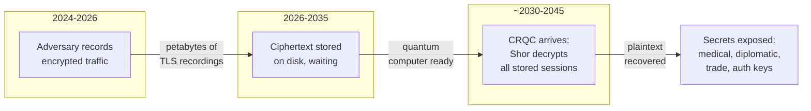
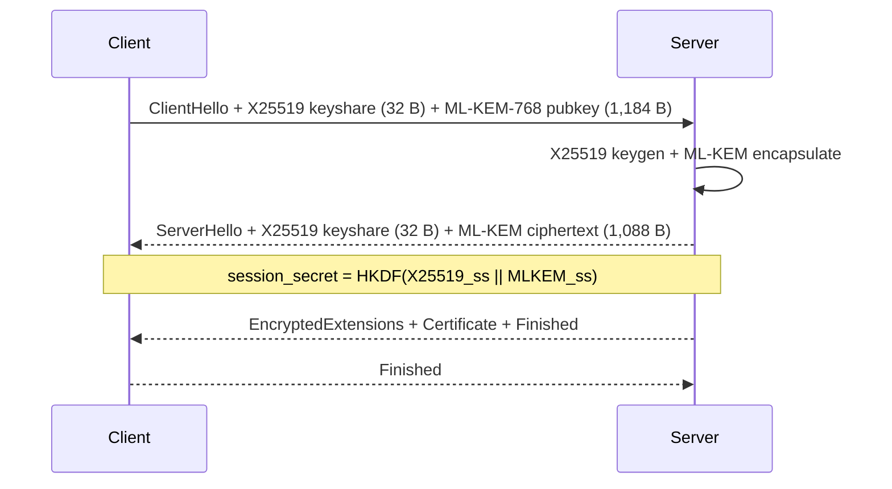
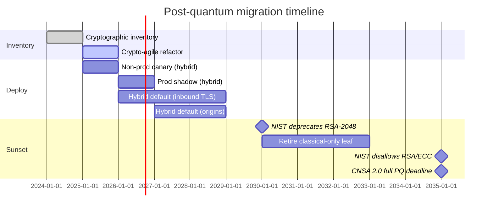

# Post-Quantum Cryptography: Migrating to ML-KEM, ML-DSA, and a Crypto-Agile Future

> **TL;DR**: Shor's algorithm breaks every public-key primitive you deploy today: RSA, ECDH, ECDSA, Ed25519. The threat is not "when quantum computers arrive" but "when adversaries record your traffic." Harvest-now-decrypt-later means any secret that must stay confidential past roughly 2035 is already at risk. NIST finalized three post-quantum standards in August 2024: ML-KEM (FIPS 203) for key exchange, ML-DSA (FIPS 204) for signatures, and SLH-DSA (FIPS 205) as a conservative hash-based backup[^1]. The correct deployment mode for 2025 to 2030 is hybrid (classical + PQC), where the session key is safe if either half holds. Start with a cryptographic inventory, deploy X25519MLKEM768 for TLS, and plan signature migration for long-lived trust anchors.

## Learning Objectives

After this module, you will be able to:

- [ ] Explain harvest-now-decrypt-later and why PQC timelines are tighter than CRQC timelines
- [ ] Compare ML-KEM, ML-DSA, and SLH-DSA parameter sizes and when to use each
- [ ] Design a hybrid (classical + PQC) TLS handshake and reason about its performance cost
- [ ] Build a migration framework: inventory, crypto-agility, prioritization, phased rollout
- [ ] Distinguish KEM urgency from signature urgency and prioritize accordingly

## Intuition

You keep a diary. Every night you write in it, lock it with a padlock, and leave it on your porch. Your neighbor photographs the locked diary every day. The padlock is strong today, but a new tool is coming that will open any padlock instantly. Your neighbor does not need the tool yet. They just need patience and a camera.

That is harvest-now-decrypt-later. Nation-state adversaries are recording encrypted traffic right now, storing petabytes of ciphertext, and waiting for a cryptographically relevant quantum computer (CRQC) to decrypt it all at once. The data does not expire. Medical records, diplomatic cables, trade secrets, and long-lived authentication keys all have confidentiality requirements that extend 10 to 30 years into the future.

The fix is not to wait for the CRQC and then panic. The fix is to change the padlock today, before the tool arrives, so that even if your neighbor has years of photographs, they are useless. In cryptographic terms: migrate key exchange to post-quantum algorithms now, while classical algorithms still hold, so recorded ciphertext remains safe even after a CRQC exists.

[Networking Fundamentals](../part-0-prerequisites/00-networking-fundamentals.md) introduced TLS 1.3 and its key-exchange mechanism. [mTLS and Service Authentication](../part-7-security-at-scale/03-mtls-service-auth.md) covered certificate chains and mutual authentication. This chapter extends both into the post-quantum era: what changes, what breaks, and how to migrate without downtime.

## Theory

### Threat timeline and the HNDL model

Shor's algorithm factors large integers and computes discrete logarithms in polynomial time on a quantum computer[^2]. This breaks RSA, finite-field Diffie-Hellman, ECDH (X25519, P-256), ECDSA, and EdDSA. Grover's algorithm offers a quadratic speedup on symmetric search, but NIST and published resource analysis confirm that AES-128 remains safe without doubling key sizes[^3]. The post-quantum transition is a public-key transition.

Current quantum hardware is not a CRQC. IBM Condor (1,121 physical qubits, 2023)[^4] and Google Willow (105 high-fidelity qubits with below-threshold error correction, December 2024) demonstrate scaling trajectories but remain millions of logical qubits short of running Shor's on production key sizes[^5]. Estimates for a CRQC range from 2030 to beyond 2045 depending on the source.

The urgency comes from the attack model, not the hardware timeline. An adversary who records your TLS session today can decrypt it the moment a CRQC becomes available. If the secret must remain confidential for 10 years, and a CRQC might arrive in 10 years, you are already late.

*Harvest-now-decrypt-later: the adversary captures ciphertext today and waits for a CRQC to decrypt it. Any secret with a confidentiality window extending past the CRQC arrival date is already compromised.*

### NIST FIPS 203, 204, and 205

On August 13, 2024, NIST approved three Federal Information Processing Standards for post-quantum cryptography after an 8-year open competition that started with 69 submissions[^1]:

- **ML-KEM (FIPS 203)** is a lattice-based key-encapsulation mechanism derived from CRYSTALS-Kyber. Three parameter sets: ML-KEM-512, ML-KEM-768 (the production default), and ML-KEM-1024.
- **ML-DSA (FIPS 204)** is a lattice-based digital signature from CRYSTALS-Dilithium. Three parameter sets: ML-DSA-44, ML-DSA-65, ML-DSA-87.
- **SLH-DSA (FIPS 205)** is a stateless hash-based signature from SPHINCS+. Conservative: relies only on hash security, no lattice assumptions.

A fourth algorithm, FN-DSA (Falcon), is in draft as FIPS 206. HQC, a code-based backup KEM, was selected in March 2025 with a draft expected in 2026.

The cautionary tale: SIKE, an isogeny-based KEM that was a NIST Round 4 candidate, was broken by Castryck and Decru in July 2022 in about ten minutes on a single core for SIKEp434 (the Category 1 parameter set); higher parameter sets fell in hours to roughly a day[^6]. This vindicated the hybrid-deployment instinct: never bet everything on a single new scheme.

| Primitive | Public key | Signature / Ciphertext | Classical equivalent |
|---|---|---|---|
| X25519 (classical) | 32 B | 32 B keyshare | Baseline |
| ML-KEM-768 | 1,184 B | 1,088 B ciphertext | Replaces X25519 for KEM |
| Ed25519 (classical) | 32 B | 64 B signature | Baseline |
| ML-DSA-65 | 1,952 B | 3,309 B signature | Replaces Ed25519/ECDSA |
| SLH-DSA-128s | 32 B | 7,856 B signature | Hash-only backup |
| SLH-DSA-128f | 32 B | 17,088 B signature | Fast variant, huge sigs |

ML-KEM-768 public keys are 37x larger than X25519. ML-DSA-65 signatures are 51x larger than Ed25519. These numbers reshape every protocol that carries public keys or signatures on the wire.

### Hybrid key exchange and X25519MLKEM768

Hybrid key agreement concatenates a classical keyshare and a PQC keyshare in one handshake. The session secret is derived from both, so the connection is safe if either half remains unbroken[^7].

In TLS 1.3, the client sends a combined X25519 + ML-KEM-768 keyshare (IETF codepoint 0x11EC)[^8]. The server performs X25519 key agreement and ML-KEM encapsulation, returning its own X25519 keyshare plus the ML-KEM ciphertext. HKDF-Extract mixes both shared secrets into the session key.

*Hybrid TLS 1.3 handshake with X25519MLKEM768: the session key mixes both a classical and a post-quantum shared secret, so an attacker must break both algorithms to recover plaintext.*

The same hybrid pattern appears in messaging. Signal shipped PQXDH in September 2023, combining X3DH Diffie-Hellman with a Kyber-768 KEM encapsulation[^9]. Apple iMessage PQ3 (February 2024) goes further: hybrid initial key establishment plus a periodic Kyber KEM ratchet every 50 messages or 7 days[^10]. Both refuse pure-PQC until ML-KEM has more cryptanalysis behind it.

The cost: the client keyshare grows from 32 bytes to 1,216 bytes, frequently pushing ClientHello past one network packet. Middleboxes that assumed fixed-size ClientHellos drop the connection. Cloudflare measured 0.34% of origin servers breaking outright when the client sends a PQ keyshare first[^7].

### Signatures versus KEMs: urgency differs

KEM migration is HNDL-urgent. Recording today's key exchange is sufficient to decrypt later. Signature migration is less urgent because forging a classical signature requires an active attacker running a CRQC at the time of the handshake, not afterward.

However, long-lived authentication anchors cannot wait:

- A root CA issued in 2022 with 10-year validity is still a classical RSA key in the trust store in 2032. A CRQC can forge signatures under it and issue rogue certificates.
- Firmware signing keys protect devices for 20+ years. They cannot be rotated after deployment.
- Code-signing keys for package managers and OS updates have multi-year trust windows.

Signatures also dominate TLS handshake size. ML-DSA-44 alone adds approximately 17 KB to a full certificate chain (six signatures and two public keys). Cloudflare's 2021 experiment showed measurable connection failures when certificate chains cross 10 KB and 30 KB boundaries[^11]. Google is pursuing Merkle Tree Certificates rather than PQ signatures in X.509 for Chrome, acknowledging that post-quantum certificates are not yet practical for the web PKI.

> [!IMPORTANT]
> Prioritize KEMs first (HNDL-urgent), then long-lived signature anchors (root CAs, firmware, code signing), then leaf certificates and session signatures last.

### Crypto-agility and migration frameworks

Crypto-agility is the architectural property that cryptographic algorithms can be swapped via configuration, protocol negotiation, or library upgrade without rewriting callers. [JWT Deep Dive](../part-7-security-at-scale/02-jwt-deep-dive.md) demonstrated this with the `alg` header and JWKS key rotation. TLS cipher negotiation, COSE algorithm registries, and X.509 OIDs all provide the same capability at different layers.

The migration framework:

1. **Inventory.** Find every classical key exchange and signature: TLS, VPN, SSH, S/MIME, JWT signing, mTLS between services, package signing, backup encryption, HSM key labels. OMB M-23-02 required US federal agencies to produce prioritized inventories and update annually through 2035[^12]. Industry experience suggests that manual inventories commonly miss a significant fraction of cryptographic usage.
2. **Prioritize by longevity.** Secrets that must remain confidential past 2035 migrate first. Session keys for ephemeral web traffic migrate last.
3. **Crypto-agile refactor.** If swapping an algorithm requires an application redeploy, fix that first. Named cipher suites, algorithm registries, and abstraction layers are prerequisites.
4. **Hybrid rollout.** Deploy X25519MLKEM768 for inbound TLS, then outbound. Shadow mode first, then default.
5. **Classical sunset.** NIST IR 8547 deprecates RSA-2048 and ECC-256 after 2030 and disallows them by 2035. NSA CNSA 2.0 mandates pure PQC for national-security systems by 2035[^12].

*A realistic 5-year PQC migration path anchored to NIST IR 8547 and NSA CNSA 2.0 deadlines. Inventory and crypto-agility come first; hybrid deployment fills the middle years; classical sunset aligns with regulatory dates.*

**Library readiness (2025).** OpenSSL 3.5 (released April 8, 2025, an LTS) is the first mainstream TLS stack with native ML-KEM, ML-DSA, and SLH-DSA[^13]. BoringSSL supports ML-KEM for Chrome 131+. Go 1.24 (February 2025) ships `crypto/mlkem` in the standard library. AWS-LC, Rustls, and wolfSSL followed. HSM vendors (Thales, Entrust, AWS CloudHSM) shipped ML-KEM firmware updates through 2024 and 2025, but FIPS 140-3 certification cycles remain a bottleneck.

## Real-World Example

Cloudflare terminates TLS for millions of domains at its edge. It enabled hybrid post-quantum key exchange (X25519+Kyber768, later renamed X25519MLKEM768) for inbound TLS in October 2022 and has been iterating ever since[^7].

**Scale numbers:**

- As of April 2026, over 65% of human-initiated TLS connections to Cloudflare use post-quantum key agreement (X25519MLKEM768)[^14].
- Client keyshare size: 1,216 bytes for the hybrid versus 32 bytes for X25519 alone.
- Throughput: approximately 11,000 ops/sec client-side for X25519+ML-KEM-768 versus 17,000 ops/sec for X25519 alone on Cloudflare hardware.
- 0.34% of origin servers break outright when the client sends a PQ keyshare first.

**Architecture decision: HelloRetryRequest fallback.** For outbound connections (edge to customer origin), Cloudflare advertises hybrid support but sends classical X25519 first. Origins that support hybrid negotiate up; origins that do not never see a split ClientHello. A scanner probes origins every 24 hours to learn support. This avoids breaking the 0.34% of origins that crash on oversized ClientHellos.

**KyberSlash (late 2023).** A timing side-channel affected multiple Kyber implementations including Cloudflare's Go code. TLS deployment was not exploitable because TLS reuses Kyber keys only ephemerally, but the episode reinforced the hybrid-first posture: if ML-KEM had been the sole key exchange and a more severe bug appeared, all sessions would be compromised. Hybrid means the classical half still protects you.

**Goal:** Cloudflare targets full PQ (inbound and outbound) by 2029.

## Trade-offs

| Approach | Pros | Cons | Best When | Our Pick |
|---|---|---|---|---|
| Classical only (X25519, Ed25519) | 32 B keys, sub-ms, mature, ubiquitous | Shor breaks it on CRQC; HNDL exposure now | Legacy services retiring within 3 years | Acceptable only for ephemeral services retiring before 2030; otherwise deploy hybrid |
| Hybrid (X25519MLKEM768) | Safe if either half holds; graceful fallback | 1.2 KB extra per handshake; split ClientHello | All public-internet TLS 2024 to 2030 | Default today for all public-facing TLS |
| Pure PQC (ML-KEM-768 only) | Quantum-safe, no classical hedge cost | Newer crypto; if ML-KEM breaks, no fallback | After classical sunset (CNSA 2.0, post-2035) | Plan for post-2035 once CNSA 2.0 mandates classical sunset; stay on hybrid until then |
| SLH-DSA (stateless hash) | Conservative, only hash assumption | 7.8 to 17 KB signatures, slow signing | Extreme-longevity or airgapped signing | Niche use only |
| LMS / XMSS (stateful hash) | Small signatures, NIST SP 800-208 | State management is dangerous (sign twice = compromise) | Firmware signing in HSM | For firmware today |

## Common Pitfalls

> [!WARNING]
> **Skipping cryptographic inventory.** Organizations discover mid-migration that RSA or ECDSA is hardcoded in dozens of unexpected places: backup encryption, JWT signing, mTLS between services, SSH host keys, VPN tunnels. If you do not know where your classical crypto lives, you cannot migrate it. Copy the OMB M-23-02 pattern: produce a prioritized inventory and update it annually.

> [!WARNING]
> **Betting on a single PQC scheme without hybrid.** SIKE was a NIST Round 4 candidate and was broken in about ten minutes (SIKEp434) on a single core[^6]. If ML-KEM is ever catastrophically broken, all sessions negotiated under pure-PQC mode are immediately compromised. Deploy hybrid through at least 2030.

> [!WARNING]
> **Underestimating TLS fragmentation.** ClientHellos spill past one packet; middleboxes that assumed fixed-size ClientHellos drop the connection. Certificate chains past 10 KB cross TCP congestion window boundaries and add a full RTT. Use HelloRetryRequest fallback (the Cloudflare pattern) and reach out to middlebox vendors proactively.

> [!WARNING]
> **Ignoring firmware and code signing.** These are the hardest to migrate because HSM vendors lag NIST standards by 2 to 4 years on FIPS 140-3 validation. For firmware signing today, use NIST SP 800-208 stateful hash-based signatures (LMS, XMSS), which NSA CNSA 2.0 already approves.

> [!WARNING]
> **Doubling symmetric keys for Grover.** The "Grover halves symmetric security" claim is widely repeated but misinterprets the algorithm. Grover requires deep sequential computation that does not parallelize. AES-128 is safe per NIST, BSI, and published resource analysis[^3]. Do not burn migration budget on AES-256 upgrades that should go to ML-KEM deployment.

## Exercise

Your organization's TLS uses X25519 for key exchange and Ed25519 for service-mesh mTLS (via [mTLS and Service Authentication](../part-7-security-at-scale/03-mtls-service-auth.md) patterns). Root CAs are 10-year certificates issued in 2022. Design the migration to hybrid PQC: (1) sequence of changes to libraries, config, CA, leaf certs, and clients; (2) what breaks in client compatibility, handshake size, and HSM support; (3) SLA impact on p50 and p99 handshake latency. **Bonus:** you have a backup-encryption key that must still decrypt data in 2040. How do you protect that specific key today?

Hint

Start with the inventory. Which components touch key exchange (HNDL-urgent) versus which touch only signatures (less urgent)? The 2022 root CA expires in 2032, which is within the CRQC window. For the backup key, think about wrapping it under a PQC KEM today so the wrapped copy is quantum-safe even if the original key material is classical.

Solution

**Phase 1: Inventory and crypto-agile refactor (months 1 to 3)**

Scan for all X25519, Ed25519, RSA, and ECDSA usage. Classify by longevity: backup keys (2040), root CA (2032), leaf certs (1-year), ephemeral TLS sessions (minutes). Ensure TLS libraries support named groups and algorithm negotiation without application changes.

**Phase 2: Hybrid KEM for TLS (months 3 to 6)**

Upgrade to OpenSSL 3.5+ or equivalent. Configure `X25519MLKEM768` as the preferred key-agreement group with X25519 as fallback. Deploy to non-production first, then shadow in production. Monitor for HelloRetryRequest rate spikes (indicates middlebox issues) and handshake failure rates.

**Phase 3: Service-mesh mTLS (months 6 to 12)**

The service mesh is internal, so you control both ends. Upgrade sidecar proxies to support hybrid KEM. Ed25519 signatures on leaf certificates are less urgent (no HNDL risk for ephemeral mTLS), but plan ML-DSA leaf certs for year 2.

**Phase 4: Root CA (months 12 to 18)**

Issue a new root CA with a hybrid signature (classical + ML-DSA) or plan for a pure ML-DSA root by 2028. The 2022 root expires in 2032; a CRQC could forge under it after that date. Cross-sign the new root with the old one for backward compatibility.

**What breaks:**

- ClientHello grows by approximately 1.2 KB. Internal services are fine (no middleboxes). External clients behind corporate proxies may see failures; HelloRetryRequest handles this.
- HSMs may not support ML-KEM yet. Use software KEM for ephemeral key exchange (acceptable because KEM keys are not long-lived) and wait for HSM firmware for signing keys.
- p50 latency: negligible (sub-ms for ML-KEM encapsulation). p99 latency: up to 1 extra RTT if HelloRetryRequest triggers for incompatible clients.

**Bonus: Backup key protection today**

Generate an ML-KEM-1024 keypair. Encapsulate the backup-encryption key under the ML-KEM public key, producing a PQC-wrapped ciphertext. Store both the classical backup key (for current use) and the ML-KEM-wrapped copy (for quantum-safe recovery). Even if an adversary records the classical key exchange used to transmit the backup key, the ML-KEM-wrapped copy remains safe post-CRQC.

## Key Takeaways

- Harvest-now-decrypt-later makes PQC a today problem, even though CRQC is a tomorrow threat. Any secret with a confidentiality window past 2035 is already at risk.
- NIST standardized ML-KEM (FIPS 203), ML-DSA (FIPS 204), and SLH-DSA (FIPS 205) in August 2024. ML-KEM-768 is the production default for key exchange.
- Hybrid (classical + PQC) is the correct deployment mode for 2025 to 2030. You are safe if either half holds.
- KEMs are HNDL-urgent; signatures are less urgent except for long-lived trust anchors (root CAs, firmware signing, code signing).
- ML-KEM-768 public keys are 1,184 bytes versus 32 bytes for X25519. This inflates TLS ClientHellos past one packet and triggers middlebox failures.
- Crypto-agility is the real prerequisite. Organizations that hardcode algorithms will migrate twice.
- Do not waste migration budget doubling AES key sizes for Grover. AES-128 is safe. Spend that effort on ML-KEM deployment.

## Further Reading

- [NIST FIPS 203 (ML-KEM)](https://csrc.nist.gov/pubs/fips/203/final) - The final KEM standard; sections 6 and 7 specify parameters and the encapsulation/decapsulation algorithms.
- [Cloudflare: The state of the post-quantum Internet](https://blog.cloudflare.com/pq-2024/) - The best single overview of real-world PQC TLS deployment, with scale numbers and middlebox breakage data.
- [Signal: Quantum Resistance and the Signal Protocol (PQXDH)](https://signal.org/blog/pqxdh/) - How Signal combines X3DH with Kyber-768 for hybrid post-quantum forward secrecy in messaging.
- [Apple: iMessage with PQ3](https://security.apple.com/blog/imessage-pq3/) - The Level 3 messaging architecture with periodic Kyber ratchets and formal verification by Stebila and Basin.
- [NIST IR 8547: Transition to Post-Quantum Cryptography Standards](https://csrc.nist.gov/pubs/ir/8547/ipd) - The RSA/ECC deprecation timeline: deprecated by 2030, disallowed by 2035.
- [OpenSSL 3.5 Final Release](https://openssl-library.org/post/2025-04-08-openssl-35-final-release/) - The first mainstream LTS TLS stack with native ML-KEM, ML-DSA, and SLH-DSA support.
- [Filippo Valsorda: Quantum Computers Are Not a Threat to 128-bit Symmetric Keys](https://words.filippo.io/128-bits/) - The definitive explanation of why Grover does not halve AES security in practice.
- [Castryck-Decru SIDH break (eprint 2022/975)](https://eprint.iacr.org/2022/975) - The cautionary tale: SIKEp434 broken in about 10 minutes on a single core, mid-NIST-round-4.

## Flashcards

**Q:** What is harvest-now-decrypt-later (HNDL)?
**A:** An adversary records encrypted traffic today and stores it until a cryptographically relevant quantum computer (CRQC) can decrypt it. Any secret with a confidentiality window extending past the CRQC arrival date is already compromised.

**Q:** Which classical primitives does Shor's algorithm break?
**A:** All public-key primitives based on integer factorization or discrete logarithms: RSA, finite-field DH, ECDH (X25519, P-256), ECDSA, and EdDSA. Symmetric primitives (AES, SHA) are not broken by Shor.

**Q:** What are the three NIST PQC standards finalized in August 2024?
**A:** FIPS 203 (ML-KEM, lattice-based key encapsulation), FIPS 204 (ML-DSA, lattice-based digital signature), and FIPS 205 (SLH-DSA, stateless hash-based signature).

**Q:** Why is ML-KEM-768 the production default rather than ML-KEM-512 or ML-KEM-1024?
**A:** ML-KEM-768 provides NIST Category 3 security (roughly 192-bit equivalent), balancing security margin against key size. ML-KEM-512 is Category 1 (lower margin); ML-KEM-1024 is Category 5 (used by CNSA 2.0 for national-security systems but larger).

**Q:** What is hybrid key exchange and why use it?
**A:** Hybrid concatenates a classical keyshare (X25519) and a PQC keyshare (ML-KEM-768) in one handshake, deriving the session secret from both. The connection is safe if either algorithm remains unbroken. This hedges against a future break of ML-KEM (as happened to SIKE in 2022).

**Q:** How much larger is an X25519MLKEM768 client keyshare compared to X25519 alone?
**A:** 1,216 bytes (32 B X25519 + 1,184 B ML-KEM-768 public key) versus 32 bytes for X25519 alone, a 38x increase that pushes ClientHello past one network packet.

**Q:** Why are KEMs more HNDL-urgent than signatures?
**A:** KEM compromise is passive: recording today's key exchange suffices to decrypt later. Signature forgery requires an active attacker running a CRQC at the time of the handshake. However, long-lived signature anchors (root CAs, firmware keys) still need migration because they must remain trustworthy past the CRQC date.

**Q:** What is crypto-agility?
**A:** The architectural property that cryptographic algorithms can be swapped via configuration, protocol negotiation, or library upgrade without rewriting application code. It is the prerequisite for any PQC migration.

**Q:** What happened to SIKE and why does it matter?
**A:** SIKE was a NIST Round 4 KEM candidate broken by Castryck and Decru in July 2022 in about ten minutes on a single core for the Category 1 parameter set (SIKEp434). It demonstrates that new cryptographic assumptions can fail catastrophically, which is why hybrid deployment (never relying solely on PQC) is essential during the transition period.

**Q:** When does NIST IR 8547 deprecate RSA-2048 and ECC-256?
**A:** Deprecated after 2030, disallowed by 2035. NSA CNSA 2.0 requires pure PQC for US national-security systems by 2035.

**Q:** What is the first step in a PQC migration framework?
**A:** Cryptographic inventory: find every classical key exchange and signature across TLS, VPN, SSH, JWT, mTLS, package signing, backup encryption, and HSMs. You cannot migrate what you have not found.

**Q:** Does Grover's algorithm require doubling AES key sizes?
**A:** No. Grover provides a quadratic speedup but requires deep sequential computation that does not parallelize. NIST, BSI, and published analysis confirm AES-128 remains safe. CNSA 2.0 mandates AES-256 for policy uniformity, not Grover defense.

## References

[^1]: NIST, "Announcing Approval of Three Federal Information Processing Standards (FIPS) for Post-Quantum Cryptography", Aug 13, 2024. https://www.nist.gov/news-events/news/2024/08/announcing-approval-three-federal-information-processing-standards-fips
[^2]: Peter W. Shor, "Polynomial-Time Algorithms for Prime Factorization and Discrete Logarithms on a Quantum Computer", SIAM J. Comput., 1997. https://arxiv.org/abs/quant-ph/9508027
[^3]: Filippo Valsorda, "Quantum Computers Are Not a Threat to 128-bit Symmetric Keys", Apr 2026. https://words.filippo.io/128-bits/
[^4]: IBM Research, "The hardware and software for the era of quantum utility is here" (IBM Condor: 1,121 superconducting qubit processor), Dec 4, 2023. https://research.ibm.com/blog/quantum-roadmap-2033
[^5]: Google, "Meet Willow, our state-of-the-art quantum chip", Dec 2024. https://blog.google/technology/research/google-willow-quantum-chip/
[^6]: Wouter Castryck and Thomas Decru, "An efficient key recovery attack on SIDH", IACR eprint 2022/975 (SIKEp434 broken in about 10 minutes on a single core). https://eprint.iacr.org/2022/975
[^7]: Cloudflare (Ahmad, Valenta, Westerbaan), "Cloudflare now uses post-quantum cryptography to talk to your origin server", Sep 29, 2023. https://blog.cloudflare.com/post-quantum-to-origins/
[^8]: Kwiatkowski, Kampanakis, Westerbaan, Stebila, "Post-quantum hybrid ECDHE-MLKEM Key Agreement for TLSv1.3", IETF draft-kwiatkowski-tls-ecdhe-mlkem-02, Sep 10, 2024 (assigns codepoint 0x11EC to X25519MLKEM768). https://www.ietf.org/archive/id/draft-kwiatkowski-tls-ecdhe-mlkem-02.html
[^9]: Signal, "Quantum Resistance and the Signal Protocol", Sep 19, 2023 (PQXDH). https://signal.org/blog/pqxdh/
[^10]: Apple Security Engineering and Architecture, "iMessage with PQ3: The new state of the art in quantum-secure messaging at scale", Feb 21, 2024. https://security.apple.com/blog/imessage-pq3/
[^11]: Cloudflare (Westerbaan), "Sizing Up Post-Quantum Signatures", Nov 8, 2021 (experiment showing connection failures at 10 KB and 30 KB certificate chain boundaries). https://blog.cloudflare.com/sizing-up-post-quantum-signatures/
[^12]: NIST IR 8547 (Initial Public Draft), "Transition to Post-Quantum Cryptography Standards", Nov 12, 2024 (comment period closed Jan 10, 2025). https://csrc.nist.gov/pubs/ir/8547/ipd
[^13]: OpenSSL Library, "OpenSSL 3.5 Final Release", Apr 8, 2025. https://openssl-library.org/post/2025-04-08-openssl-35-final-release/
[^14]: Cloudflare (Westerbaan), "Cloudflare targets 2029 for full post-quantum security", Apr 7, 2026 (reports "over 65% of human traffic" uses PQ encryption). https://blog.cloudflare.com/post-quantum-roadmap/
