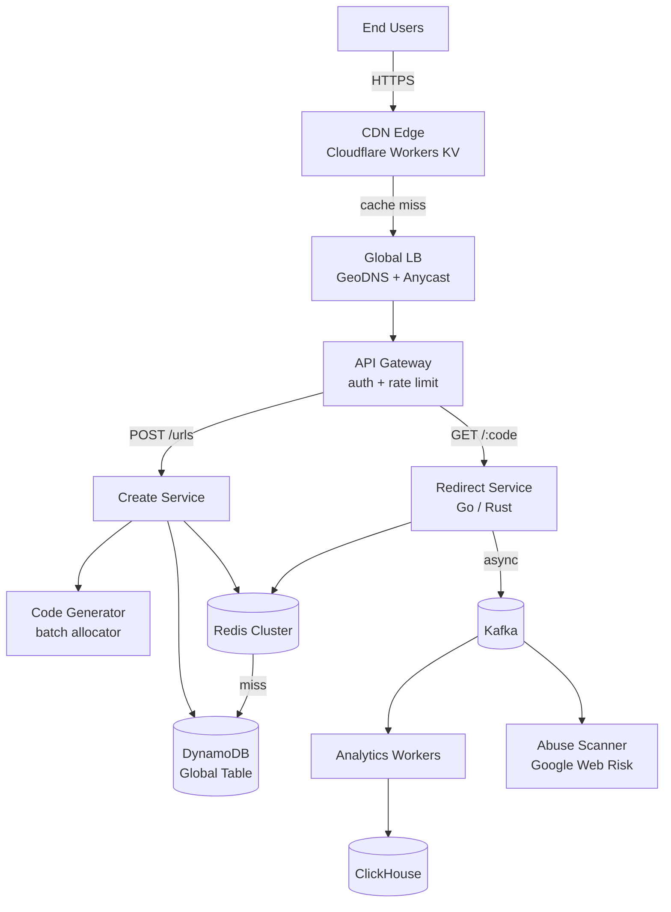
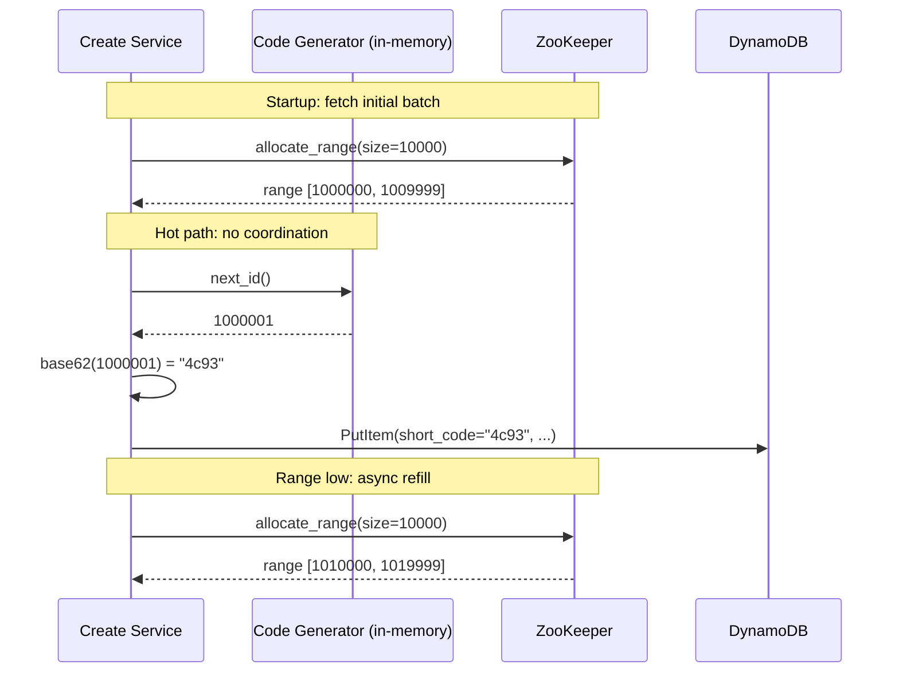
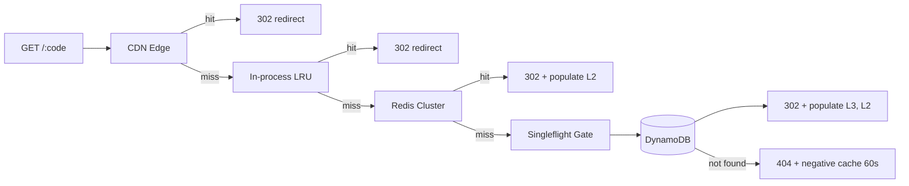
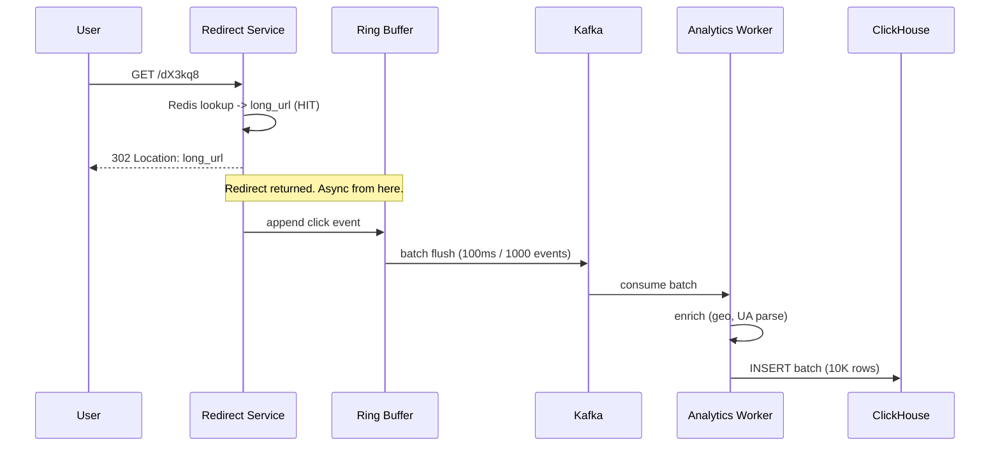

# Design a URL Shortener (TinyURL / bit.ly)

> **TL;DR.** A URL shortener is a read-heavy caching problem disguised as a storage problem. The 100:1 redirect-to-create ratio means you design the read path first: layered caches (CDN edge, in-process LRU, Redis) absorb 100K+ QPS while DynamoDB sees only misses. Pre-allocated batch IDs eliminate per-write coordination. A buffered Kafka pipeline decouples analytics from the redirect hot path. Bitly serves billions of redirects per month at 99.99% uptime[^1] using exactly this shape.

## Learning Objectives

After this module, you will be able to:

- [ ] Estimate capacity for a URL shortener at 10M creates/day and 1B redirects/day
- [ ] Compare four code-generation strategies and justify pre-allocated batches as the default
- [ ] Design a layered cache topology with singleflight to defend against cache stampedes
- [ ] Decouple analytics from the redirect hot path using buffered Kafka producers
- [ ] Justify the redirect-code choice (302, or 301 with a short `Cache-Control`) for analytics-bearing shorteners
- [ ] Integrate abuse scanning without blocking the redirect path

## Intuition

You run a coat-check counter at a concert venue. A guest hands you a coat (long URL), you hand back a numbered ticket (short code). When they return with the ticket, you find their coat and hand it back (redirect). Simple.

Three problems make this hard at scale. First, 100 guests arrive per minute but 10,000 guests per minute come back to retrieve coats. Your retrieval path is 100x hotter than your storage path. You need runners, a sorted rack, and a front-desk cache of the most popular coats. Second, you cannot pause to think of a ticket number. You pre-tear a roll of numbered tickets so handing one out takes zero thought. Third, your boss wants to know which coats get retrieved most often, but counting must never slow down the handoff. You jot a tally mark on a notepad and reconcile later.

That is a URL shortener. The coat rack is DynamoDB. The runners are Redis. The pre-torn tickets are batch-allocated IDs. The notepad is a Kafka buffer. The naive approach (one Postgres row, one server, synchronous analytics) handles 10 users fine. At 10 million writes per day and 1 billion reads per day, it collapses because the read path saturates a single database, the write path blocks on a global counter, and synchronous analytics doubles redirect latency.

The one insight that unlocks the design: treat the read path as a CDN problem, not a database problem. The mapping is immutable once created. Cache it aggressively at every tier.

## Requirements

### Clarifying Questions

- **Q: Authenticated users only, or anonymous?**
  Assume: Both. Anonymous creates with aggressive rate limits (10/min); registered users get quotas (10K/day).

- **Q: Do we need click analytics?**
  Assume: Yes. Per-link click counts, geo breakdown, referrer, and user-agent. Dashboard latency can be minutes behind real-time.

- **Q: Custom aliases (vanity URLs)?**
  Assume: Yes for paid users. Must be globally unique with a conditional write.

- **Q: Multi-region required?**
  Assume: Yes. Active-active reads across 3 regions. Writes route to nearest region with async replication.

- **Q: What is the SLA target?**
  Assume: 99.99% read availability, 99.9% write availability, p99 < 50 ms globally on redirect.

- **Q: Link expiration?**
  Assume: Optional TTL. Default is permanent. Expired links return 410 Gone.

### Functional Requirements

- Create a short URL from a long URL and return the short code.
- Redirect GET requests on the short code to the original URL via HTTP 302.
- Support optional custom aliases with uniqueness enforcement.
- Record click events for analytics (geo, referrer, user-agent).
- Allow link deletion and optional TTL-based expiration.
- Block or warn on malicious destination URLs.

### Non-Functional Requirements

- **Load:** 10M writes/day (~115 write QPS avg, ~350 peak), 1B reads/day (~11,500 read QPS avg, ~100K peak).
- **Latency:** p50 < 10 ms, p99 < 50 ms on redirect globally.
- **Availability:** 99.99% read path, 99.9% write path.
- **Consistency:** eventual for cross-region reads (1-5s lag); strong for custom-alias uniqueness.
- **Durability:** once published, a short code mapping must never change or disappear without explicit deletion.

## Capacity Estimation

| Metric | Value | Derivation |
|--------|------:|------------|
| Total records (5 yr) | 18.25B | 10M/day x 365 x 5 |
| Storage per record | ~500 B | short_code(8) + long_url(~300) + metadata(~192) |
| Total raw storage | 9.1 TB | 18.25B x 500 B |
| Replicated storage (3x, 3 regions) | ~82 TB | 9.1 TB x 3 replicas x 3 regions |
| Peak read QPS | 100K | 1B/day / 86,400 x ~8.6 burst factor |
| Peak write QPS | 350 | 10M/day / 86,400 x 3 |
| Hot cache memory | 9 GB | 18M keys (top 0.1%) x 500 B |

Key ratios:

- **Read:write = 100:1.** This ratio drives every architectural decision.
- **Cache hit rate target: 95%+.** At 95% hit rate on 100K peak QPS, DynamoDB sees only 5K reads/sec, well within burst capacity.
- **Code space:** 7-char base62 = 62^7 = 3.52 trillion slots[^2]. At 10M/day, that is ~965 years of headroom.
- **Bandwidth:** 100K req/sec x ~1 KB response (headers + 302) = ~100 MB/s egress at peak.

## API and Data Model

### API Design

```http
POST /v1/urls
  Authorization: Bearer <token>
  Idempotency-Key: <uuid>
  Body: { "long_url": "https://...", "custom_alias": "my-brand", "expires_at": "2027-01-01T00:00:00Z" }
  Returns: 201 { "short_code": "dX3kq8", "short_url": "https://sho.rt/dX3kq8", "created_at": "..." }
  Errors: 409 alias conflict, 429 rate limited, 400 invalid URL

GET /{short_code}
  Returns: 302 Found, Location: <long_url>, Cache-Control: private, max-age=0
           404 not found, 410 gone (expired)

GET /v1/urls/{short_code}/stats
  Returns: 200 { "clicks": 42000, "by_country": {...}, "by_day": [...] }

DELETE /v1/urls/{short_code}
  Returns: 204 No Content
```

Why 302 (or 301 with a short `Cache-Control`) and not an uncapped 301: browsers may cache a vanilla 301 indefinitely and never re-request[^3], which kills click analytics and delays revocation until each client's cache expires on its own schedule. A 302 response forces the client back to the server on every click. Bitly takes a different route: direct HTTP probes against `bit.ly` return **`HTTP/2 301` with `Cache-Control: private, max-age=90`**, which accepts up to ~90 seconds of per-client analytics lag in exchange for browser-cache friendliness[^4]. Either pattern is defensible; a bare 301 without a short `Cache-Control` is not.

### Data Model

```sql
-- Primary store: DynamoDB Global Table
-- Partition key: short_code (hash-distributed)
-- No secondary indexes on the hot path

table url_mappings (
  short_code     String    -- partition key, 7-char base62
  long_url       String    -- the destination
  owner_id       String    -- nullable for anonymous creates
  created_at     Number    -- epoch ms
  expires_at     Number    -- nullable, epoch ms
  safety_status  String    -- "clean" | "warn" | "blocked"
)

-- Analytics store: ClickHouse
-- Partitioned by month, ordered by (short_code, event_time)

table click_events (
  event_time     DateTime
  short_code     String
  country        FixedString(2)
  referrer_host  String
  ua_family      LowCardinality(String)
)
```

DynamoDB Global Tables provide single-digit ms point reads, managed multi-region replication, and no joins on the hot path[^5]. Per-partition limits are 3,000 RCU and 1,000 WCU[^5], which is fine because 7-char base62 codes distribute uniformly across partitions.

ClickHouse's sparse primary index makes "last 30 days of clicks for this code" a contiguous range scan over a single disk segment[^6].

## High-Level Architecture



*The redirect path is lean: CDN edge, gateway, redirect service, Redis, DynamoDB. Analytics and safety scanning hang off a Kafka bus so neither blocks a click.*

**Write path:** Client sends POST to the API gateway. The create service calls the code generator (in-memory batch allocation, no RPC), writes to DynamoDB with a conditional put, warms Redis, and emits a `url.created` event to Kafka. The safety scanner consumer evaluates the destination URL against Google Web Risk asynchronously.

**Read path:** Client sends GET to the CDN edge. On cache hit (viral codes), the CDN returns 302 directly. On miss, the request falls through to the redirect service, which checks the in-process LRU, then Redis, then DynamoDB. The redirect service appends a click event to an in-process buffer (never blocks on Kafka).

**Async path:** Kafka consumers enrich click events (geo from IP, UA parsing) and batch-insert into ClickHouse. A separate consumer re-scans URLs for safety status changes.

## Deep Dives

### Deep dive 1: ID generation strategies

The code generator must produce globally unique, URL-safe, compact codes at 350 peak writes/sec with zero per-request coordination.

**Option A: Hash truncation (MD5 prefix, base62-encoded).** Deterministic, but collisions are guaranteed by the birthday paradox. With 6-char base62 (62^6 = 56.8B slots), collisions become likely at ~238,000 URLs[^7]. Also leaks information: anyone with the long URL can compute the code.

**Option B: Auto-increment counter (Flickr ticket-server style[^8]).** Zero collisions, compact codes. Flickr runs two MySQL servers with `auto_increment_increment=2` and offsets 1/2 for HA. "In production since Friday the 13th, January 2006"[^8]. But the counter is a single-point bottleneck, and codes are enumerable.

**Option C: Random + conditional write.** Unguessable codes. At 18B existing codes in a 3.52T code space, collision probability per attempt is ~0.5%. Requires an extra DB round-trip per write.

**Option D: Pre-allocated batches (the winner).** A coordinator (ZooKeeper or a Postgres row) hands out ranges of 10,000 consecutive integer IDs to each create-service instance. The instance assigns IDs from its in-memory range with zero coordination per request. When the range runs low, it fetches another batch asynchronously.

This is the Instagram sharded-ID pattern[^9]: 41 bits of timestamp, 13 bits of shard ID, 10 bits of sequence, yielding 1,024 IDs per shard per millisecond without cross-shard coordination. Twitter's Snowflake uses the same principle at 64 bits[^10].



*Each create-service instance holds a pre-allocated ID range in memory. The hot path requires zero network calls for ID generation; ZooKeeper is contacted only when the range runs low.*

**Why batches win:** no per-request coordination, linear throughput scaling with instances, zero collisions by construction. If an instance crashes with 9,000 unused IDs, those are wasted. With 3.52 trillion slots, waste is irrelevant.

### Deep dive 2: Read path at 100K QPS

The redirect path must serve 100K peak QPS at p99 < 50 ms globally. A single database cannot do this. The solution is a four-tier cache:

| Layer | Cumulative hit rate | Latency | Notes |
|-------|--------------------:|---------|-------|
| CDN edge (Workers KV) | 15-30% | 5-20 ms | Viral codes only; short TTL (30-60s) |
| In-process LRU | 50-65% | ~0.1 ms | Catches "one link, N sequential clicks" |
| Redis cluster | 92-97% | 1-2 ms | 9 GB working set per region |
| DynamoDB (origin) | 100% | 5-10 ms | Only 3-8% of requests reach here |

Cloudflare reports that less than 0.03% of Workers KV keys account for nearly half of all KV requests, and their in-memory cache resolves these hottest keys in under 1 ms[^11]. That hot-key concentration matches URL shortener traffic perfectly.

**The stampede problem:** a hot cache key expires, 10,000 clients miss simultaneously, all 10,000 queries hit DynamoDB for the same key. DynamoDB's per-partition limit is 3,000 RCU[^5]. One viral code can saturate a partition.

**Defense: request coalescing (singleflight).** Only one in-flight DB lookup per key per redirect-service instance. All other callers subscribe to the same in-flight future. Go's `golang.org/x/sync/singleflight` implements this in a single file (~200 lines)[^12]. Discord uses the same pattern in their Rust data services layer, collapsing thousands of concurrent reads into one DB call[^13].



*A miss at any tier falls through to the next. The singleflight gate before DynamoDB collapses concurrent misses on the same key into one DB call.*

Additional defenses: **stale-while-revalidate** (serve expired value while refreshing in background), **pre-warming** (seed cache on create with long TTL), **negative caching** (cache 404s for 60s to block random-code scanners).

### Deep dive 3: Async analytics pipeline

The redirect must never block on analytics. Every millisecond added to the redirect path is a direct SLO violation.

The redirect service appends a click event to an in-process ring buffer and flushes to Kafka every 100 ms or 1,000 events, whichever comes first. If the buffer is full, the event is dropped. Analytics can tolerate small loss (typically < 0.1%); the redirect cannot tolerate blocking.

**Kafka sizing:** 100K events/sec (peak) x 200 B/event = 20 MB/s. With 30 partitions (< 1 MB/s each) and 7-day retention, the cluster holds ~12 TB. A 3-broker cluster with 3x replication handles this comfortably.

**Consumer pipeline:** Analytics workers consume batches, enrich (geo from MaxMind IP, UA parsing), and batch-insert into ClickHouse (10K rows per insert). ClickHouse's `SummingMergeTree` materialized views pre-aggregate daily counts at insert time so dashboard reads never scan raw events[^6].



*The redirect returns before any analytics I/O. Kafka is a replay log: if ClickHouse ingestion fails, events re-ingest without loss.*

**Why not write directly to ClickHouse?** ClickHouse is optimized for batch inserts, not low-latency single-row writes. A synchronous insert from the redirect handler would couple redirect latency to OLAP store health. Under partial ClickHouse degradation, redirects would time out.

## Real-World Example

Bitly processes billions of clicks per month[^14] across more than 190 countries, serving more than half of the Fortune 500 as enterprise customers[^1]. The redirect path targets 99.99% uptime[^1].

**Abuse detection pipeline.** Bitly's Trust and Safety system has three stages that never touch the redirect hot path[^4]:

1. **Crawl.** On create ("encoding" in Bitly's terminology), a Crawler fetches the destination URL and extracts metadata: page title, redirect chains, SSL certificate, hosting provider.
2. **Classify.** The Threat Detection Service evaluates metadata against Google Web Risk's database of over 1 million known-bad URLs[^15]. Web Risk scans over 10 billion URLs daily and returns a confidence score (low to extremely high)[^15].
3. **Enforce.** The Abuse API is the single source of truth. On every redirect ("decoding"), the cached record includes safety status. Flagged URLs show an interstitial warning; hard-blocked URLs return a block page. The flag lives in the cached record, so enforcement adds zero latency.

**Re-scanning.** A rolling Kafka consumer re-evaluates existing URLs because a benign page today can become a phishing page tomorrow[^4]. This is why the safety scanner is a consumer, not a synchronous gate.

**Twitter t.co** takes a different approach: every URL in every tweet is wrapped automatically with no opt-out[^16]. The fixed 23-character length for HTTPS links[^17] decouples link length from the character budget. Twitter's Snowflake[^10] provides uncoordinated ID generation at tens of thousands of IDs per second, and t.co likely uses this or a similar scheme.

**Google goo.gl shutdown.** Google's URL shortener stopped accepting new URLs in 2018 and began displaying interstitials in 2024. Their own data: "more than 99% of [goo.gl URLs] had no activity in the last month"[^18], yet the remaining links were embedded in "countless documents, videos, posts and more"[^18]. Google later revised their approach in August 2025, preserving actively-used links while deactivating only those with no recent activity[^18]. The lesson: a shortener makes a long-term durability promise. Breaking it has cascading costs for every artifact that embedded the link.

## Trade-offs

| Approach | Pros | Cons | When to use |
|----------|------|------|-------------|
| Code gen: hash truncation (MD5 prefix) | Deterministic; free dedup | Birthday-paradox collisions; guessable | Prototypes and offline tooling only |
| Code gen: counter (Flickr ticket server) | Zero collisions; compact | Single-point bottleneck; enumerable | Low write QPS; enumeration acceptable |
| Code gen: random + conditional write | Unguessable; simple | Extra DB round-trip; collision cost rises | Private codes; code space >> population |
| Code gen: pre-allocated batches | No coordination; linear scale; zero collisions | Wasted IDs on crash; still enumerable | **Default choice** for production |
| Store: DynamoDB Global Tables | Managed multi-region; ms point reads | Hot-partition cap (3K RCU); cost at scale | Managed ops; multi-region from day one |
| Store: ScyllaDB self-hosted | Horizontal scale; no GC pauses | Ops burden; requires DB expertise | >100B links and team with DB ops[^13] |
| Redirect: 301 + short `Cache-Control` (Bitly) | Browser & intermediary caching; first-click analytics | SEO signal inheritance; revocation delayed by max-age | Shorteners that accept brief cache-imposed analytics gaps |
| Redirect: 302 + `max-age=0` | Every click hits the server; exact analytics | No intermediary caching; one RTT per click | **Default** for analytics-bearing shorteners |
| Analytics: sync to OLAP | Simple; no event loss | Couples redirect latency to OLAP health | Internal dashboards with no burst tolerance |
| Analytics: buffered to Kafka | Redirect latency bounded; replay-safe | Small loss on buffer overflow | **Default** for any non-trivial shortener |

The single biggest trade-off: **302 vs 301**. Serving 302 means every click hits the server, which costs compute and adds latency but gives exact analytics and immediate revocation. Serving 301 with a default `Cache-Control` means browsers may cache the redirect indefinitely, so returning users never come back to the origin; analytics decay and revocation takes weeks. The middle path is what Bitly actually runs in production: **301 with `Cache-Control: private, max-age=90`** (verified by direct HTTP probe against `bit.ly` at time of writing), which keeps the first-click hit on the server while letting browsers cache the redirect for a short, bounded window. Pick 302 when you want every click counted and you control the whole path; pick 301-with-short-Cache-Control when you want browser-cache friendliness and can tolerate ~max-age seconds of analytics lag and revocation delay.

## Scaling and Failure Modes

**At 10x load (100M writes/day, 10B reads/day, 1M peak read QPS):**

- Redis memory grows to 90 GB per region. Shard across more nodes; Redis Cluster handles this natively.
- DynamoDB hot partitions: a celebrity tweet sends one code viral. The cache tier absorbs most traffic, but leakage can hit the 3,000 RCU cap[^5]. Mitigation: write-sharding (replicate the hot key across N partition-key variants, round-robin reads).
- Kafka partition count increases to 300 to maintain < 1 MB/s per partition.

**At 100x load (1B writes/day, 100B reads/day):**

- Storage reaches petabyte scale. DynamoDB still handles it, but cost may justify migrating to self-hosted ScyllaDB. Discord proved this at trillions of messages: p99 reads dropped from 40-125 ms (Cassandra) to 15 ms (ScyllaDB) on 72 nodes instead of 177[^13].
- The CDN becomes the primary read path. DynamoDB becomes origin-only, hit on < 1% of requests.

**At 1000x load:** the architecture shifts to CDN-first with edge compute (Cloudflare Workers) resolving most redirects without ever hitting origin infrastructure.

**Failure modes:**

- **Regional outage:** GeoDNS routes traffic to surviving regions. DynamoDB Global Tables provide RPO < 1s for committed writes. URLs created in the failed region during the last replication window may 404 briefly in other regions until replication catches up.
- **Redis cluster failure:** redirect service falls through to DynamoDB directly. Latency increases from ~2 ms to ~8 ms. Singleflight prevents stampede. The CDN absorbs viral traffic regardless.
- **Kafka broker failure:** the in-process ring buffer continues accepting events. If all brokers are down for > buffer capacity (~10 seconds at peak), events are dropped. Analytics tolerates this; redirects are unaffected.

## Common Pitfalls

> [!WARNING]
> **Using MD5(long_url) as the code-generation strategy.** It leaks information (anyone with the long URL can compute the code), collides at ~238K URLs for 6-char codes[^7], and prevents revocation. Use pre-allocated batches.

> [!WARNING]
> **Synchronously writing a click row inside the redirect handler.** Even a 5 ms write doubles your p50. The first viral link will blow your SLO. Always buffer and flush asynchronously.

> [!WARNING]
> **Serving HTTP 301 without a short `Cache-Control`.** A 301 with no cache directive (or `Cache-Control: public, max-age=<large>`) is cached by browsers and intermediaries potentially indefinitely per RFC 7231[^3]. Your analytics dashboard will show decaying click counts as returning users never hit the server again, and link revocation effectively does not work until every client's cache expires on its own schedule. Either use 302, or (like Bitly) return 301 with `Cache-Control: private, max-age=<small>` to bound the blast radius.

> [!WARNING]
> **Ignoring malicious-URL scanning.** Within days of launch, spammers will use your shortener to launder phishing links. Phishing is among the most common abuse vectors for URL shorteners[^4]. Integrate threat intelligence from day one.

> [!WARNING]
> **Single-region writes causing cross-region redirect failures.** A URL created in us-east-1 is not resolvable from ap-south-1 until replication catches up (1-5s). Pin the creating client to its origin region briefly, or synchronously warm the local cache on create.

> [!WARNING]
> **Choosing 6-character codes to save one character.** 62^6 = 56.8B slots exhausts in ~15.6 years at 10M/day. 62^7 = 3.52T slots lasts ~965 years. The one extra character buys centuries of headroom.

## Follow-up Questions

**1. How would you handle multi-region active-active writes?**

DynamoDB Global Tables use last-writer-wins with server-side timestamps. For auto-generated codes (batch-allocated per region with non-overlapping ranges), there is no conflict. For custom aliases, route the conditional write to a designated "owner region" for that alias prefix, or accept that two users in different regions racing for the same alias will see one succeed and one get 409.

**2. How do you detect and block phishing URLs that turn malicious after creation?**

A rolling Kafka consumer re-scans the corpus against Google Web Risk on a schedule (e.g., re-check URLs clicked in the last 7 days every 24 hours). On status change, update the `safety_status` field in DynamoDB and invalidate the Redis cache entry. The next redirect sees the updated flag.

**3. How would you implement exact-time expiry (link dies at midnight UTC)?**

Store `expires_at` in the DynamoDB record. The redirect service checks `expires_at` on every cache miss. For cached entries, set Redis TTL to `min(cache_ttl, expires_at - now)`. A background sweeper deletes expired records from DynamoDB and emits cache-invalidation events.

**4. How do custom domains (branded short links) work?**

The customer sets up a CNAME from `yourbrnd.co` to our edge. We provision a TLS certificate via ACME (Let's Encrypt). At the edge, we route based on the `Host` header to the correct tenant's namespace. The data model adds a `domain` field to `url_mappings`; the partition key becomes `(domain, short_code)`.

**5. What changes for a link-in-bio product (one user, many links, ordered)?**

Add a `page_id` concept with an ordered list of short codes. The page itself is a separate entity stored in DynamoDB with a sort key for ordering. The redirect path is unchanged; the new surface is a read-heavy page renderer that fetches the ordered list and renders HTML.

**6. How would you offer premium analytics (real-time, per-click, exportable)?**

Premium users get a dedicated Kafka consumer group that writes to a per-tenant ClickHouse table with finer granularity (per-click rows instead of pre-aggregated daily counts). Export via a scheduled S3 dump or a streaming Kafka topic the customer consumes directly.

## Exercise

### Exercise 1: Custom-alias collision handling

A premium user requests `sho.rt/my-brand`. Another user already owns that alias. Design the flow that handles: (1) the conditional write detecting the collision, (2) the response to the second user, (3) caching negative lookups so popular alias checks do not hammer the DB, and (4) a reservation system that holds an alias for 5 minutes during checkout.

<details>
<summary>Hint</summary>

DynamoDB's `PutItem` with `attribute_not_exists(short_code)` gives you an atomic conditional write. Think about what happens when 1,000 users simultaneously check whether `taylor-swift` is available.

</details>

<details>
<summary>Solution</summary>

**Conditional write:** use `PutItem` with `ConditionExpression: attribute_not_exists(short_code)`. If the alias exists, DynamoDB returns `ConditionalCheckFailedException`. Return 409 Conflict.

**Negative caching:** popular aliases like `taylor-swift` will be checked thousands of times. Cache "alias taken" in Redis with a 60-second TTL. This prevents the DB from seeing repeated conditional-write failures.

**Reservation:** on checkout, write a reservation record with a 5-minute TTL: `{ short_code: "my-brand", status: "reserved", owner_id: "...", expires_at: now+5min }`. The conditional write checks `attribute_not_exists(short_code) OR (status = "reserved" AND expires_at < now)`. If the user completes payment, promote to permanent. If not, the TTL expires and the alias becomes available.

**Race condition:** two users reserve simultaneously. The conditional write ensures only one succeeds atomically. The loser gets 409 immediately. No distributed lock needed because DynamoDB's conditional write is the lock.

</details>

## Key Takeaways

- **Read-heavy caching problem.** Design the redirect path first; the create path is trivial at 350 peak QPS.
- **Pre-allocated batch IDs.** Eliminate per-write coordination. 7-char base62 gives ~965 years of headroom at 10M/day.
- **Layered caching + singleflight.** CDN, in-process LRU, Redis, then DynamoDB. Singleflight collapses stampedes into one DB call.
- **302, or 301 with a short `Cache-Control`.** A bare 301 is cached by browsers indefinitely and breaks analytics. 302 costs one RTT per click for exact analytics; Bitly's 301+`max-age=90` is the middle ground.
- **Async analytics via Kafka.** The redirect handler never blocks on analytics I/O. Tolerate < 0.1% event loss.
- **Abuse scanning is not optional.** Shorteners obscure destinations. Integrate Google Web Risk from day one.

## Further Reading

- [Bitly Trust and Safety: An Overview of Our Abuse System](https://bitly.com/blog/trust-safety-abuse-system/). The closest thing to a public architecture post Bitly publishes; describes Crawler, Threat Detection Service, and Abuse API end-to-end.
- [How Discord Stores Trillions of Messages](https://discord.com/blog/how-discord-stores-trillions-of-messages/). The canonical reference for hot-partition cascades and request coalescing via a Rust data-services tier.
- [Announcing Snowflake (Twitter, 2010)](https://blog.twitter.com/engineering/en_us/a/2010/announcing-snowflake). The original 64-bit uncoordinated ID scheme that inspired batch allocation patterns everywhere.
- [Sharding and IDs at Instagram](https://instagram-engineering.com/sharding-ids-at-instagram-1cf5a71e5a5c). The 41+13+10 bit layout in PL/PGSQL, complete with runnable code.
- [Ticket Servers: Distributed Unique Primary Keys on the Cheap (Flickr, 2010)](https://code.flickr.net/2010/02/08/ticket-servers-distributed-unique-primary-keys-on-the-cheap/). The REPLACE INTO + odd/even offset HA pattern.
- [We made Workers KV up to 3x faster (Cloudflare, 2024)](https://blog.cloudflare.com/faster-workers-kv/). Tiered cache architecture and hot-key concentration data (0.03% of keys = ~50% of requests).
- [Designing robust and predictable APIs with idempotency (Stripe, 2017)](https://stripe.com/blog/idempotency). Idempotency keys, exponential backoff, and thundering-herd mitigation.
- [Google URL Shortener links will no longer be available (2024)](https://developers.googleblog.com/en/google-url-shortener-links-will-no-longer-be-available). The interstitial rollout and the cost of breaking link durability.

## Flashcards

<details>
<summary><strong>Q: Why is pre-allocated batch ID generation preferred over a global counter or random generation?</strong></summary>

A: A global counter is a single-point bottleneck and produces enumerable codes. Random generation requires a uniqueness check per write. Batches let each instance hand out IDs from an in-memory range with zero coordination, scaling linearly with instances.

</details>

<details>
<summary><strong>Q: Base62 with 7 characters gives how many unique codes, and how long does that last at 10M/day?</strong></summary>

A: 62^7 = ~3.52 trillion codes. At 10M/day, that is ~965 years. 6 characters (56.8 billion) would exhaust in ~15.6 years.

</details>

<details>
<summary><strong>Q: Why serve HTTP 302 (or 301 with a short `Cache-Control`) instead of a bare 301 for short URL redirects?</strong></summary>

A: A bare 301 can be cached by browsers essentially permanently per RFC 7231, so returning users never hit the origin and click analytics decay while revocation is effectively impossible. A 302 forces a server round-trip on every click. Bitly's production behavior is a third option: 301 with `Cache-Control: private, max-age=90`, which bounds the browser-cache window to ~90 seconds, accepting a small analytics lag in exchange for browser-cache friendliness.

</details>

<details>
<summary><strong>Q: What is request coalescing (singleflight) and why does it matter for a URL shortener?</strong></summary>

A: When a hot cache key expires, thousands of concurrent misses would all query the DB. Singleflight ensures only one in-flight lookup per key; all other callers wait on the same result. This prevents cache stampedes from overwhelming DynamoDB's 3,000 RCU per-partition limit.

</details>

<details>
<summary><strong>Q: How does the analytics pipeline avoid blocking the redirect?</strong></summary>

A: The redirect service buffers click events in a ring buffer and flushes to Kafka in batches every 100 ms. A separate consumer enriches and inserts into ClickHouse. The redirect returns before any analytics I/O occurs.

</details>

<details>
<summary><strong>Q: What is the DynamoDB per-partition read limit and why does it matter for viral URLs?</strong></summary>

A: 3,000 RCU per partition per second. A single viral short code maps to one partition key. Without caching and singleflight, a viral link can saturate that partition.

</details>

<details>
<summary><strong>Q: Why is abuse scanning critical for a URL shortener from day one?</strong></summary>

A: Shorteners obscure destinations, which is exactly what phishing campaigns exploit. Without scanning, the domain gets blacklisted by email providers within days. Bitly evaluates every URL against Google Web Risk, which scans over 10 billion URLs daily.

</details>

<details>
<summary><strong>Q: What happens when a hot key expires in the cache and 10,000 clients request it simultaneously?</strong></summary>

A: Without protection, all 10,000 requests hit DynamoDB for the same key (cache stampede). Defenses: singleflight (one in-flight lookup per key), stale-while-revalidate (serve expired value while refreshing), and pre-warming (seed cache on create with long TTL).

</details>

<details>
<summary><strong>Q: What did Google's goo.gl shutdown teach about URL shortener design?</strong></summary>

A: Over 99% of goo.gl URLs had no activity in the prior month, yet the remaining links were embedded in documents, videos, and posts across the internet. A shortener makes a durability promise; breaking it has cascading costs for every artifact that embedded the link.

</details>

<details>
<summary><strong>Q: How does Bitly's abuse pipeline avoid adding latency to the redirect path?</strong></summary>

A: The safety status is stored in the cached record itself. On redirect, the service reads the cached mapping which already includes the safety verdict. Scanning happens asynchronously via a Kafka consumer that updates the record when status changes.

</details>

## References

[^1]: Bitly, "Bitly Enters 2026 With Expanded Link and QR Code Solutions", 2025. https://bitly.com/pages/resources/press/bitly-connection-layer-links-qr-codes-2026

[^2]: Birthday-bound analysis: 62^7 = 3.52 trillion slots; at 10M/day = ~965 years of headroom.

[^3]: RFC 7231, Section 6.4.2: 301 Moved Permanently. Browsers may cache indefinitely.

[^4]: Balan and Santos Rivera, "Trust and Safety: An Overview of Our Abuse System", Bitly blog, 2023-02-21. https://bitly.com/blog/trust-safety-abuse-system/

[^5]: AWS DynamoDB Developer Guide, "Best practices for designing and using partition keys effectively". https://docs.aws.amazon.com/amazondynamodb/latest/developerguide/bp-partition-key-design.html

[^6]: ClickHouse documentation, "A Practical Introduction to Sparse Primary Indexes". https://clickhouse.com/docs/en/guides/improving-query-performance/sparse-primary-indexes

[^7]: Birthday-bound analysis: 6-char base62 = 62^6 = 56.8 billion slots; collisions likely at sqrt(56.8B) = ~238,000 URLs. Gupta et al documented collision edge cases in Bitly URL datasets (arXiv:1406.3687, 2014).

[^8]: Kremerskothen, "Ticket Servers: Distributed Unique Primary Keys on the Cheap", Flickr code blog, 2010. https://code.flickr.net/2010/02/08/ticket-servers-distributed-unique-primary-keys-on-the-cheap/

[^9]: Instagram Engineering, "Sharding and IDs at Instagram", 2012. https://instagram-engineering.com/sharding-ids-at-instagram-1cf5a71e5a5c

[^10]: King, "Announcing Snowflake", Twitter engineering blog, 2010. https://blog.twitter.com/engineering/en_us/a/2010/announcing-snowflake

[^11]: Gauvin, Sutter, Plunk, "We made Workers KV up to 3x faster, here's the data", Cloudflare blog, 2024-09-26. https://blog.cloudflare.com/faster-workers-kv/

[^12]: Go `golang.org/x/sync/singleflight` package. https://github.com/golang/sync/blob/master/singleflight/singleflight.go

[^13]: Ingram, "How Discord Stores Trillions of Messages", Discord engineering blog, 2023-03-06. https://discord.com/blog/how-discord-stores-trillions-of-messages

[^14]: Bitly press release, "Bitly Takes Action To Enhance The Future of User Safety With New IWF Partnership", 2023. https://bitly.com/pages/resources/press/bitly-takes-action-to-enhance-the-future-of-user-safety-with-new-iwf-partnership

[^15]: Google Cloud customer case study, "Bitly: Ensuring real-time link safety with Web Risk to protect people". https://cloud.google.com/customers/bitly

[^16]: X help center, "X link shortener (t.co) and how it works". https://help.twitter.com/en/using-x/url-shortener

[^17]: X Developer Platform, "Data Dictionary" (entities show t.co URLs occupy 23 characters). https://docs.x.com/x-api/fundamentals/data-dictionary

[^18]: Chandel and Babu, "Google URL Shortener links will no longer be available", Google Developers blog, 2024-07-18. https://developers.googleblog.com/en/google-url-shortener-links-will-no-longer-be-available
