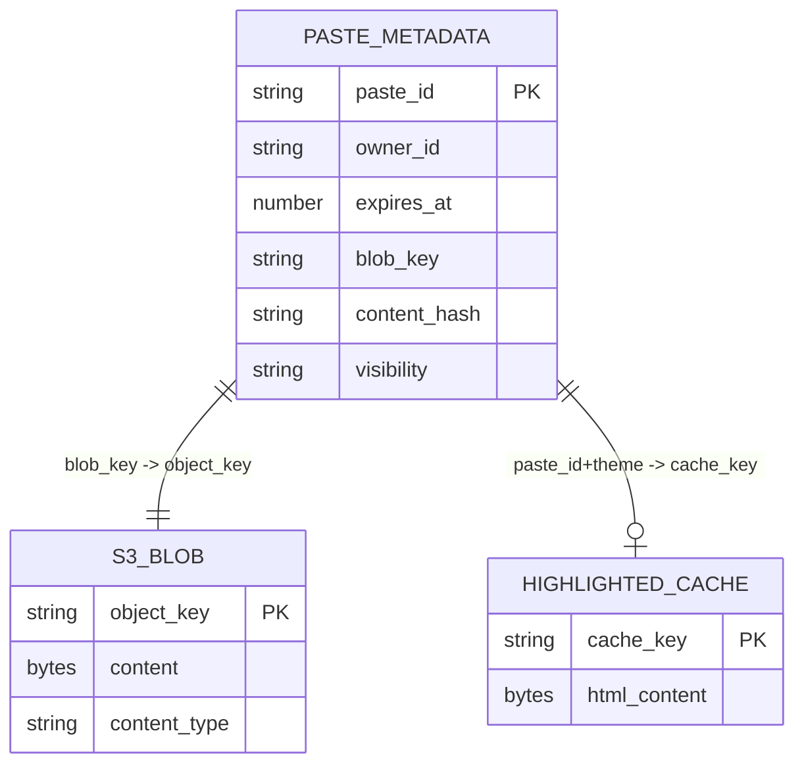
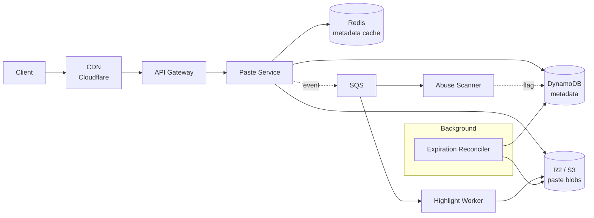
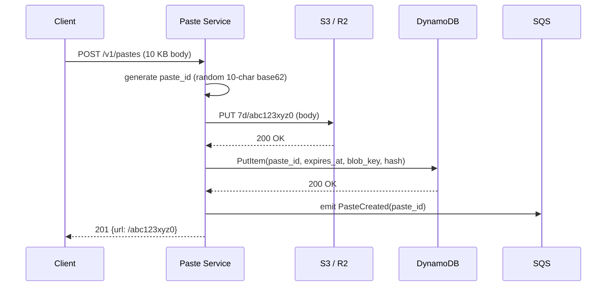
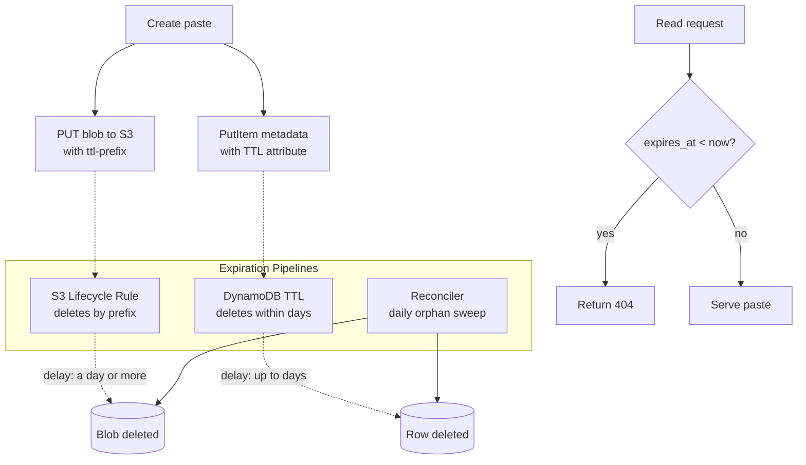

# Design a Pastebin (Paste Sharing Service)

> **TL;DR.** A pastebin looks like a URL shortener with a payload attached, but that payload (10 KB average, 1 MB at p99, 10 MB hard cap) changes everything. DynamoDB hard-caps items at 400 KB[^1], so blobs must live in object storage while metadata stays in a KV table. Expiration is a three-layer pipeline (S3 lifecycle rules, DynamoDB TTL, and a reconciler) because S3 lifecycle deletions can take a day or more[^2] and DynamoDB TTL deletes within a few days[^3]. Syntax highlighting belongs on the render path with caching. Cloudflare R2's zero-egress pricing makes it the cost-optimal blob store for a 10:1 read-heavy workload[^4].

## Learning Objectives

After this module, you will be able to:

- [ ] Design a blob/metadata storage split that handles payloads from 1 KB to 10 MB without hitting DynamoDB's 400 KB item limit
- [ ] Justify S3 lifecycle rules plus DynamoDB TTL as the expiration mechanism and explain the asynchronous-deletion trade-off
- [ ] Compare write-time, render-time, and client-side syntax highlighting with concrete cost and latency reasoning
- [ ] Estimate storage, compute, and egress costs for a 10M-paste/day service
- [ ] Implement abuse-prevention scanning as an async pipeline that does not block writes
- [ ] Trade off zero-knowledge encryption (PrivateBin model) against server-side scanning capability

## Intuition

A pastebin looks trivial. Accept text, return a URL, serve it back. A single Postgres table handles this for 100 users.

At 10 million pastes per day it collapses, and the reason is payload size. A URL shortener stores a 500-byte row. A pastebin stores blobs that run 10 KB on average, 1 MB at p99, and up to 10 MB for PRO users[^5]. That three-to-five orders of magnitude increase in record size means you cannot fit a paste in a DynamoDB item (400 KB cap[^1]), cannot afford to scan billions of rows nightly for expiration, and cannot run a CPU-intensive syntax highlighter synchronously on every write without burning 12 continuous cores.

The one insight that unlocks the design: split the system into a cheap, scalable blob store (S3/R2) for payloads and a fast, indexed metadata store (DynamoDB) for lookups. Then treat expiration as a data pipeline, not a database feature. Every other decision flows from this split.

## Requirements

### Clarifying Questions

- **Q: What is the maximum paste size?**
  Assume: 10 KB average, 1 MB at p99, 10 MB hard cap (PRO tier). Standard accounts cap at 512 KB[^5].

- **Q: What TTL options do users get?**
  Assume: 10 min, 1 hour, 1 day, 7 days (default), 30 days, never.

- **Q: Authenticated users only, or anonymous?**
  Assume: Both. Guests get 10 pastes per 24 hours; free accounts get 20; PRO gets 250[^5].

- **Q: What visibility tiers exist?**
  Assume: Public (indexed, searchable), unlisted (accessible only by URL), private (requires auth token).

- **Q: Do we need syntax highlighting?**
  Assume: Yes, server-rendered with caching. Support 100+ languages.

- **Q: Multi-region required?**
  Assume: Single-region at launch; design for multi-region expansion.

### Functional Requirements

- Create a paste (text content, language hint, TTL, visibility) and return a short URL.
- Retrieve a paste by ID with optional syntax-highlighted rendering.
- Delete a paste (owner or admin).
- List a user's pastes with cursor-based pagination.
- Auto-expire pastes after their TTL fires.

### Non-Functional Requirements

- **Load:** 10M writes/day (~116 avg QPS, ~1,000 peak); 100M reads/day (~1,160 avg QPS, ~10,000 peak).
- **Latency:** p99 < 200 ms on read; p99 < 500 ms on write.
- **Availability:** 99.99% read path, 99.9% write path.
- **Consistency:** eventual for read-after-write (CDN cache lag acceptable); strong for delete.
- **Durability:** 11 nines (S3 standard).

## Capacity Estimation

| Metric | Value | Derivation |
|--------|------:|------------|
| Write QPS (avg) | 116/sec | 10M / 86,400 |
| Write QPS (peak) | ~1,000/sec | ~10x average |
| Read QPS (avg) | 1,160/sec | 100M / 86,400 |
| Read QPS (peak) | ~10,000/sec | ~10x average |
| Daily ingest | ~100 GB | 10M x 10 KB |
| Active storage (7d default) | ~700 GB | 7 x 100 GB |
| Annual growth ("never" pastes) | ~10 TB | ~10% of pastes set to "never" |
| S3 cost (700 GB) | ~$16/month | $0.023/GB-month[^6] |
| R2 cost (700 GB, zero egress) | ~$10.50/month | $0.015/GB-month[^4] |

- **Read:write ratio:** 10:1. The CDN absorbs 95%+ of reads on popular pastes, so origin sees ~500 read QPS at steady state.
- **Egress dominates cost.** At 100M reads/day x 10 KB average = 1 TB/day egress. On S3 at $0.09/GB (US East), that is $90/day. On R2, it is $0. This single number justifies R2[^4].
- **Metadata row size:** ~200 bytes. At 10M rows/day, DynamoDB on-demand handles this without capacity planning.

## API and Data Model

### API Design

```http
POST   /v1/pastes
       Idempotency-Key: <uuid>
       Body: { "content": "...", "language": "python", "ttl": "7d",
               "visibility": "unlisted", "password": null }
       Returns: 201 { "paste_id": "abc123xyz0", "url": "https://pb.io/abc123xyz0",
                       "expires_at": "2026-05-11T00:00:00Z" }
       Errors: 413 payload too large, 429 rate limited

GET    /v1/pastes/{paste_id}
       Query: ?format=raw|highlighted&theme=monokai
       Returns: 200 { "content": "...", "language": "python", "created_at": "...",
                       "expires_at": "...", "view_count": 42 }
       Errors: 404 not found or expired, 403 private paste

GET    /v1/pastes/{paste_id}/raw
       Returns: 200 text/plain (streaming for pastes > 1 MB)

DELETE /v1/pastes/{paste_id}
       Returns: 204 No Content

GET    /v1/users/{user_id}/pastes?cursor=...&limit=20
       Returns: 200 { "pastes": [...], "next_cursor": "..." }
```

Rate limiting: per-IP token bucket at the edge (Cloudflare WAF) plus per-account counters in Redis. Guests: 10/24h. Free: 20/24h. PRO: 250/24h[^5].

### Data Model

**Metadata table (DynamoDB):**

```text
table paste_metadata (
  paste_id        String    -- PK, random 10-char base62
  owner_id        String    -- nullable for guest pastes
  created_at      Number    -- epoch seconds
  expires_at      Number    -- DynamoDB TTL attribute
  blob_key        String    -- S3 object key: "7d/abc123xyz0"
  content_hash    String    -- SHA-256 for dedup + integrity
  size_bytes      Number    -- for streaming decisions
  language_hint   String    -- lexer name
  visibility      String    -- public | unlisted | private
  scan_status     String    -- pending | clean | flagged
)

GSI: owner_id -> [paste_id, created_at]  (user's paste list)
```

**Blob store (S3/R2):** Objects keyed by `<ttl-bucket>/<paste_id>`. The TTL-bucket prefix (`10m/`, `1h/`, `1d/`, `7d/`, `30d/`, `never/`) enables S3 lifecycle rules to expire entire prefix cohorts[^7].



*Each paste has one metadata row, one raw blob, and zero-or-one cached highlighted HTML blob.*

## High-Level Architecture



*The write path stores a blob then metadata and emits an event; the read path hits the CDN first, falls through to Redis, then DynamoDB and S3 on cache miss. Background workers handle highlighting and abuse scanning asynchronously.*

**Write path:** Client POSTs content. The Paste Service generates a random 10-char base62 ID, PUTs the blob to S3 under the appropriate TTL prefix, PUTs metadata to DynamoDB, emits a `PasteCreated` event to SQS, and returns the URL. Total latency: ~100-200 ms (S3 PUT ~40 ms + DynamoDB PutItem ~10 ms + overhead).

**Read path:** The CDN serves cached public/unlisted pastes. On miss, the service checks Redis for metadata (5 ms), falls through to DynamoDB on Redis miss, validates `expires_at < now()`, fetches the blob from S3 via streaming, and returns it with `Cache-Control: public, max-age=<remaining_ttl>`.

**Async path:** The Highlight Worker renders syntax-highlighted HTML and stores it as a second blob. The Abuse Scanner checks for credential patterns (AWS keys with prefix `AKIA`[^8], Stripe `sk_live_`, SSH private keys). Matches set `scan_status: flagged` on the metadata row.

## Deep Dives

### Deep dive 1: Storage split (metadata in DynamoDB, blob in S3)

The fundamental constraint: DynamoDB hard-caps each item at 400 KB total (attribute names plus values)[^1]. A 1 MB paste physically cannot fit. Even a 512 KB paste (the standard-tier cap on pastebin.com[^5]) exceeds the limit. AWS's own Database Blog explicitly recommends storing large objects in S3 and keeping a pointer in DynamoDB[^9].

**Write ordering matters.** Write the blob first, then the metadata. If the blob PUT succeeds but the metadata PUT fails, you have an orphan blob that costs fractions of a cent and gets cleaned by the reconciler. If you wrote metadata first and the blob PUT failed, you would have a row pointing at nothing, causing user-visible 404s.

**Deduplication via content hash.** The `content_hash` (SHA-256) enables optional dedup: two identical pastes can share a blob. This saves storage but complicates TTL (the blob must outlive the longest-lived metadata row). Skip dedup at launch; revisit if storage costs grow.

**Streaming large reads.** A 10 MB paste must not be buffered entirely in memory. Use S3's streaming body piped directly to the HTTP response. At 100 concurrent reads of 10 MB pastes, buffering would consume 1 GB of process RSS. Streaming keeps memory constant.



*Write the blob before metadata so a failure between steps leaves an orphan blob (cheap, reconcilable) rather than a dangling pointer (user-visible error).*

### Deep dive 2: TTL and the expiration pipeline

Expiration is a data pipeline problem, not a database feature. Three layers work in parallel:

**Layer 1: S3 lifecycle rules.** Objects are written with a TTL-bucket prefix (`10m/`, `1h/`, `1d/`, `7d/`, `30d/`). A lifecycle rule on each prefix expires objects after the corresponding duration. This handles 90%+ of blob cleanup with zero custom code[^7]. The catch: S3 lifecycle expiration is asynchronous. AWS states that "Amazon S3 queues the object for removal and removes it asynchronously"[^7], with delays of a day or more[^2].

**Layer 2: DynamoDB TTL.** The `expires_at` attribute is the table's TTL attribute. DynamoDB auto-deletes expired items, but "automatically deletes expired items within a few days of their expiration time"[^3]. These deletions consume no write capacity[^10].

**Layer 3: Reconciler.** A daily background job handles orphans. It lists metadata rows whose blob HEAD returns 404 and deletes them. It also lists blobs older than a threshold whose paste_id has no metadata row and deletes those.

**The critical insight:** The service layer checks `expires_at < now()` on every read and returns 404 immediately, even if the blob and row still physically exist. Observable behavior is correct from the moment of expiry; physical deletion catches up within days.

**Why not a synchronous cron?** dpaste runs a `cleanup_snippets` Django management command on a cron[^11]. At dpaste's modest volume this works. At 10M pastes/day, you accumulate 3.65B pastes per year. A nightly scan of every row is untenable. The lifecycle + TTL + reconciler pattern scales because each layer handles its own domain without a full table scan.



*TTL is three parallel pipelines: S3 lifecycle for blobs, DynamoDB TTL for rows, and a reconciler for orphans. The service layer returns 404 immediately on expiry without waiting for physical deletion.*

### Deep dive 3: Syntax highlighting placement

Three options exist. Each has a clear best-fit scenario.

**Option A: Write-time (server-side).** Run Pygments (550+ lexers[^12]) on paste creation, store the HTML blob alongside the raw blob. dpaste uses this approach[^13]. Pro: reads serve pre-rendered HTML directly, CDN-friendly. Con: every paste pays CPU cost. At 10M pastes/day and ~100 ms per render, that is ~12 continuous CPU cores just for highlighting. Most pastes are never read again after the author checks the URL.

**Option B: Render-time with cache (our pick).** On first read requesting highlighted output, render the HTML, cache it in S3 as a second blob (`highlighted/<paste_id>/<theme>`), and serve the cached copy on subsequent reads. Pro: pastes never read cost zero CPU. Con: first reader pays a latency hit (50-200 ms for 10 KB; up to 2-5 seconds for 1 MB). Mitigation: the SQS event triggers a Highlight Worker that pre-renders asynchronously. If the worker finishes before the first read, the highlighted blob is already cached.

**Option C: Client-side.** Ship highlight.js (192 languages, 512 themes[^14]) to the browser. PrivateBin uses this because its zero-knowledge model means the server cannot see plaintext[^15]. Pro: zero server CPU, privacy-preserving. Con: depends on JavaScript, poor for SEO and accessibility.

We pick **Option B** for the general case. The event bus emits `PasteCreated`; the Highlight Worker renders HTML via Pygments and stores it in S3. The first read either hits the pre-rendered blob (if the worker finished) or falls back to plain text with a client-side highlighter as a progressive enhancement.

## Real-World Example

### PrivateBin: zero-knowledge paste architecture

PrivateBin is an open-source paste service (~8,300 GitHub stars[^16]) with a radically different trust model: the server never sees plaintext[^15]. The architecture demonstrates how a single design constraint (zero-knowledge) cascades through every component.

**Encryption model:** The browser generates a 256-bit AES key, encrypts the paste with AES-256-GCM via the Web Crypto API, and appends the key to the URL as a fragment identifier (the `#key` portion)[^15][^17]. Because URL fragments are never sent in HTTP requests, even an HTTPS-terminating proxy or access log cannot leak the key. The server stores only opaque ciphertext.

**Storage:** PrivateBin's `S3Storage` backend stores each paste as a single S3 object keyed by `<prefix>/<paste_id>`, with the encrypted payload as JSON and selected metadata replicated into S3 object metadata for cheap HEAD lookups[^18]. Comments are stored under `<prefix>/<paste_id>/discussion/<parent_id>/<comment_id>`.

**Expiration:** Rather than relying on S3 lifecycle rules, PrivateBin implements a custom `_getExpiredPastes` method that lists all objects, reads their `expire_date` metadata via `headObject`, and batches expired keys for deletion[^18]. At scale this becomes a bottleneck (listing millions of objects), which is exactly why our recommended architecture uses TTL-bucket prefixes with lifecycle rules instead.

**Cascading trade-offs from zero-knowledge:**

- No server-side syntax highlighting (server cannot see plaintext). Client-side `prettify.js` is the only option[^15].
- No server-side search or indexing.
- No server-side abuse scanning. A compromised paste is invisible to the operator.
- A compromised server can inject malicious JavaScript that exfiltrates the decryption key. This is the residual trust model[^15].

PrivateBin proves that zero-knowledge is viable for privacy-focused deployments but incompatible with the abuse-scanning and server-side-highlighting requirements of a public service. For a general-purpose pastebin, store plaintext server-side and invest in the scanning pipeline.

## Trade-offs

| Decision | Option A | Option B | Our Choice | Why |
|----------|----------|----------|------------|-----|
| Blob storage | S3 ($0.023/GB) | R2 ($0.015/GB, zero egress) | R2 | Read-heavy; egress dominates cost at 1 TB/day[^4] |
| Metadata store | DynamoDB (serverless) | PostgreSQL (managed) | DynamoDB | Native TTL, no capacity planning, auto-scales[^3] |
| Highlighting | Write-time | Render-time + cache | Render-time | 90%+ pastes never read; avoid wasted CPU |
| ID scheme | Sequential base62 | Random 10-char base62 | Random | Prevents enumeration attacks[^19] |
| Expiration | Synchronous cron | Lifecycle + TTL + reconciler | Lifecycle + TTL | Scales to billions without full scans[^7] |
| Trust model | Server sees plaintext | Zero-knowledge (PrivateBin) | Plaintext | Enables abuse scanning, server highlighting, search |
| Large-paste reads | Buffer in memory | Stream from S3 | Stream | Constant memory; no OOM at 100 concurrent 10 MB reads |

The biggest meta-decision is the trust model. Zero-knowledge (PrivateBin) gives operators plausible deniability and users real privacy, but it eliminates server-side scanning, highlighting, and search. For a public service that must handle abuse reports and credential leaks, server-side plaintext is the pragmatic choice. For a privacy-focused deployment (healthcare, legal, whistleblower), zero-knowledge wins.

## Scaling and Failure Modes

**At 10x (100M pastes/day, 1B reads/day):**

- Write QPS hits ~10,000/sec peak. S3 handles 3,500 PUTs/sec per prefix; our 5+ TTL prefixes distribute writes. No bottleneck.
- DynamoDB on-demand auto-scales.
- The CDN absorbs read amplification. Origin sees <5% of reads.
- Abuse scanner queue depth grows. Add horizontal workers.

**At 100x (1B pastes/day):**

- Storage grows to ~1 TB/day ingest. Annual "never" pastes reach 100+ TB. Tiered storage (S3 Intelligent-Tiering) becomes necessary.
- The reconciler must shard by prefix to avoid listing billions of objects.
- Abuse scanning needs ML-based classification rather than regex matching.
- Move to multi-region: DynamoDB Global Tables for metadata, S3 Cross-Region Replication for blobs.

**Failure modes:**

- **S3 regional outage:** Reads fail for cache-miss pastes. Mitigation: CDN serves stale content for public pastes (set `stale-while-revalidate`). Writes fail entirely; return 503 with retry-after header.
- **DynamoDB throttling on hot partition:** A viral paste causes a hot key. Mitigation: Redis absorbs repeated metadata reads. DynamoDB adaptive capacity shifts throughput to hot partitions automatically.
- **Orphan accumulation after reconciler failure:** Blobs pile up without metadata rows, inflating storage cost. Detection: CloudWatch alarm on S3 object count vs DynamoDB item count divergence. Recovery: manual reconciler run.

## Common Pitfalls

> [!WARNING]
> **Storing blobs in DynamoDB.** DynamoDB's 400 KB item-size limit[^1] means any paste over 400 KB fails with a `ValidationException`. This is the single most common mistake when engineers copy a URL-shortener design without adjusting for payload size.

> [!WARNING]
> **Synchronous syntax highlighting on write.** A 10 MB Python paste takes 2-5 seconds to highlight. If highlighting is synchronous on the write path, the user's POST times out and worker threads starve. Move highlighting to an async worker or to render-time.

> [!WARNING]
> **Sequential paste IDs enabling enumeration.** Sequential 8-char base62 IDs let an attacker iterate through recent IDs and scrape "unlisted" pastes. Tools like PasteHunter[^20] do exactly this. Use random IDs with at least 10 characters (62^10 ~ 8.4 x 10^17 combinations).

> [!WARNING]
> **Trusting S3 lifecycle for immediate expiration.** S3 lifecycle rules are asynchronous and can take a day or more[^2]. If your service relies on the blob being physically gone at expiry time rather than checking `expires_at` on read, users will see "expired" pastes until physical deletion completes.

> [!WARNING]
> **Not streaming large paste reads.** A 10 MB paste buffered entirely in memory before sending to the client consumes 10 MB of process RSS per concurrent request. At 100 concurrent large-paste reads, that is 1 GB. Stream the S3 body directly to the HTTP response.

## Follow-up Questions

**1. How would you support end-to-end encrypted pastes (PrivateBin model)?**

Generate AES-256-GCM key in the browser, encrypt before upload, append key to URL fragment. Server stores ciphertext only. Trade-off: lose server-side highlighting, search, and abuse scanning. Offer as an opt-in mode alongside plaintext pastes.

**2. How do you handle a viral paste that causes a cache stampede?**

Use singleflight (or request coalescing) at the origin. When 1,000 concurrent requests arrive for the same cache-miss paste, only one fetches from S3; the rest wait on the same in-flight response. Set `Cache-Control: public, max-age=<remaining_ttl>` so the CDN absorbs all subsequent reads.

**3. How would you implement private/unlisted visibility without auth?**

Unlisted pastes use random IDs with sufficient entropy (10+ chars base62). The URL itself is the capability token. Private pastes require a password; derive an encryption key from the password via PBKDF2, encrypt the blob, and require the password on read.

**4. How do you handle abuse reporting and DMCA takedowns?**

A "report abuse" endpoint sets `scan_status: flagged` and enqueues for human review. On confirmed abuse, soft-delete (set `visibility: deleted`, stop serving) with a 30-day hard-delete window for legal holds. Pastebin.com uses this workflow[^21].

**5. How would you add Markdown rendering alongside syntax highlighting?**

Treat Markdown as another "language" in the highlight pipeline. The Highlight Worker detects `language_hint: markdown`, renders via a Markdown library instead of Pygments, and stores the HTML blob. Same caching pattern applies.

**6. What changes for a multi-region active-active deployment?**

DynamoDB Global Tables replicate metadata across regions with last-writer-wins conflict resolution. S3 Cross-Region Replication handles blobs. Each region writes to its local table and bucket. Reads are region-local. TTL and lifecycle rules fire independently per region.

## Exercise

### Exercise 1: Scanner backpressure under attack

Your abuse scanner takes 500 ms on a 10 MB paste. An attacker floods the service with 1,000 large pastes per minute from rotating IPs. The scanner queue backs up to 50,000 messages. Design the system behavior: what happens to new pastes, how do you protect legitimate users, and what is the failure mode if the scanner goes down entirely?

<details>
<summary>Hint</summary>

Consider the difference between fail-open (promote pastes before scanning completes) and fail-closed (block pastes until scanned). What are the risks of each? How does adaptive rate limiting interact with scanner backpressure? Think about size-based routing.

</details>

<details>
<summary>Solution</summary>

**Architecture under load:**

1. **Adaptive rate limiting.** When the SQS queue depth exceeds 5,000 messages, tighten per-IP rate limits from 10/24h to 3/24h for guests and escalate to CAPTCHA. This reduces inflow without blocking authenticated users.

2. **Size-based routing.** Pastes under 100 KB go through a fast-path regex scanner (< 50 ms). Pastes over 100 KB go to a dedicated large-paste queue with more workers. This prevents large pastes from starving small-paste scanning.

3. **Fail-open with quarantine.** Pastes exceeding a 5-second scan SLA are promoted to Active but tagged `scan_status: pending`. A background sweep re-scans when capacity recovers. This preserves user experience at the cost of temporarily exposing unscanned content.

4. **Scanner failure mode.** If the scanner is entirely down, all pastes promote with `scan_status: failed`. An alarm fires. The on-call either restores the scanner or pauses guest writes. The system never blocks authenticated users because the abuse vector is overwhelmingly unauthenticated.

**Trade-off accepted:** Fail-open means a credential dump may be visible for seconds to minutes. This is acceptable because fail-closed creates a DoS vector, and credential rotation is the correct response to a leak.

</details>

## Key Takeaways

- **Split storage by nature:** Blobs in object storage (S3/R2), metadata in DynamoDB. The 400 KB item limit is not negotiable.
- **Write blob first, metadata second.** Orphan blobs are cheap and reconcilable; dangling pointers cause user-visible errors.
- **TTL is a pipeline, not a cron.** S3 lifecycle + DynamoDB TTL + reconciler scales to billions without full table scans.
- **Render-time highlighting wins.** Most pastes are never read; write-time highlighting wastes CPU at scale.
- **Random IDs are a security requirement.** Sequential IDs enable enumeration of unlisted pastes.
- **Zero-egress object storage changes the cost model.** R2's free egress makes it optimal for read-heavy blob workloads.

## Further Reading

- [AWS S3 Lifecycle Configuration](https://docs.aws.amazon.com/AmazonS3/latest/userguide/object-lifecycle-mgmt.html). The canonical reference for TTL-based object expiration; read the "expiring objects" page for the asynchronous-delete caveat.
- [AWS DynamoDB TTL](https://docs.aws.amazon.com/amazondynamodb/latest/developerguide/time-to-live-ttl-before-you-start.html). Explains the "within a few days" deletion window, epoch-seconds format, and when TTL processes ignore items.
- [Large Object Storage Strategies for DynamoDB](https://aws.amazon.com/blogs/database/large-object-storage-strategies-for-amazon-dynamodb/). The official AWS stance on S3 + DynamoDB for oversized items; the pattern this chapter is built on.
- [Cloudflare R2 Pricing](https://developers.cloudflare.com/r2/pricing/). Zero-egress pricing details; critical for cost comparisons on read-heavy workloads.
- [PrivateBin](https://github.com/PrivateBin/PrivateBin). Production-quality zero-knowledge paste service; read `lib/Data/S3Storage.php` for the S3 integration pattern.
- [dpaste Source Code](https://github.com/DarrenOfficial/dpaste). Smaller-scale reference with a Pygments pipeline, Django ORM metadata, and a `cleanup_snippets` cron for TTL.
- [GitHub Secret Scanning Patterns](https://docs.github.com/en/code-security/secret-scanning/introduction/supported-secret-scanning-patterns). The gold-standard list of credential regex patterns (AWS, Stripe, GitHub PAT, and 500+ others); the right reference for building an abuse scanner.
- [Syntax Highlighting on the Web](https://joelgustafson.com/posts/2022-05-31/syntax-highlighting-on-the-web). Thoughtful comparison of regex-based grammars (Pygments, highlight.js) vs tree-sitter for incremental rendering.

## Flashcards

<details>
<summary><strong>Q: Why can't you store a 1 MB paste in a single DynamoDB item?</strong></summary>

A: DynamoDB hard-caps each item at 400 KB total (attribute names plus values). A 1 MB paste exceeds this limit and fails with a ValidationException.

</details>

<details>
<summary><strong>Q: What is the recommended storage pattern for a pastebin at scale?</strong></summary>

A: Blob in object storage (S3/R2) keyed by paste_id; metadata (owner, TTL, hash, visibility) in DynamoDB. Write blob first, metadata second.

</details>

<details>
<summary><strong>Q: How long can S3 lifecycle rules take to physically delete an expired object?</strong></summary>

A: A day or more. S3 queues the object for removal asynchronously. The service layer must check `expires_at` on read and return 404 immediately, regardless of physical state.

</details>

<details>
<summary><strong>Q: Why use random paste IDs instead of sequential ones?</strong></summary>

A: Sequential IDs enable enumeration attacks. An attacker can iterate through recent IDs and scrape unlisted pastes. Random IDs with 10+ characters from a 62-char alphabet make enumeration infeasible (62^10 ~ 8.4 x 10^17 combinations).

</details>

<details>
<summary><strong>Q: Where should syntax highlighting run for a pastebin?</strong></summary>

A: Render-time with caching. Most pastes are never read, so write-time highlighting wastes CPU. On first read, render the HTML, cache it in S3, and serve the cached copy on subsequent reads.

</details>

<details>
<summary><strong>Q: What are the three layers of the TTL expiration pipeline?</strong></summary>

A: (1) S3 lifecycle rules delete blobs by TTL-prefix. (2) DynamoDB TTL auto-deletes metadata rows within a few days of expiration. (3) A daily reconciler sweeps orphaned blobs and orphaned rows that the other two layers missed.

</details>

<details>
<summary><strong>Q: How does PrivateBin achieve zero-knowledge encryption?</strong></summary>

A: The browser generates an AES-256-GCM key, encrypts the paste client-side, and appends the key to the URL as a fragment identifier. The fragment never leaves the browser in HTTP requests, so the server stores only ciphertext.

</details>

<details>
<summary><strong>Q: Why does Cloudflare R2 beat S3 on cost for a read-heavy pastebin?</strong></summary>

A: R2 charges zero egress fees. At 100M reads/day x 10 KB = 1 TB/day egress, S3 charges ~$90/day in egress alone. R2 charges $0.

</details>

<details>
<summary><strong>Q: What happens if the abuse scanner goes down?</strong></summary>

A: Pastes promote to Active with `scan_status: failed` (fail-open). An alarm fires. The alternative (fail-closed, blocking all writes) creates a denial-of-service vector.

</details>

<details>
<summary><strong>Q: Why write the blob before metadata in the create path?</strong></summary>

A: If the blob PUT succeeds but metadata PUT fails, you have an orphan blob (cheap, invisible to users, cleaned by reconciler). If metadata were written first and blob PUT failed, you would have a dangling pointer causing user-visible 404s.

</details>

## References

[^1]: AWS DynamoDB - "Best practices for storing large items and attributes". https://docs.aws.amazon.com/amazondynamodb/latest/developerguide/bp-use-s3-too.html

[^2]: AWS Knowledge Center "Confirm that the lifecycle rule on my Amazon S3 bucket is working". https://aws.amazon.com/premiumsupport/knowledge-center/s3-lifecycle-rule-delay/

[^3]: AWS DynamoDB "Computing time to live (TTL)". https://docs.aws.amazon.com/amazondynamodb/latest/developerguide/time-to-live-ttl-before-you-start.html

[^4]: Cloudflare R2 Pricing documentation. https://developers.cloudflare.com/r2/pricing/

[^5]: "Pastebin Statistics and Facts" (Similarweb-aggregated). https://expandedramblings.com/index.php/pastebin-statistics-and-facts/

[^6]: AWS S3 pricing page. https://aws.amazon.com/s3/pricing/

[^7]: AWS S3 "Expiring objects" documentation. https://docs.aws.amazon.com/AmazonS3/latest/userguide/lifecycle-expire-general-considerations.html

[^8]: AWS re:Post - "Difference between AWS Access Key IDs and Secret Access Keys" (includes the AKIA regex from git-secrets). https://repost.aws/questions/QUX9b0juKPQGaR3VCYkCAajw/difference-between-aws-access-key-ids-and-secret-access-keys

[^9]: AWS Database Blog "Large object storage strategies for Amazon DynamoDB". https://aws.amazon.com/blogs/database/large-object-storage-strategies-for-amazon-dynamodb/

[^10]: AWS DynamoDB "Using time to live (TTL)". https://docs.aws.amazon.com/amazondynamodb/latest/developerguide/TTL.html

[^11]: DarrenOfficial/dpaste `cleanup_snippets` management command. https://github.com/DarrenOfficial/dpaste/blob/master/dpaste/management/commands/cleanup_snippets.py

[^12]: Pygments supported languages list. https://pygments.org/languages/

[^13]: DarrenOfficial/dpaste highlight.py. https://github.com/DarrenOfficial/dpaste/blob/master/dpaste/highlight.py

[^14]: highlight.js homepage (v11.11.1, 192 languages, 512 themes). https://highlightjs.org/

[^15]: PrivateBin README. https://github.com/PrivateBin/PrivateBin/blob/master/README.md

[^16]: PrivateBin organization on GitHub. https://github.com/PrivateBin

[^17]: PrivateBin FAQ (client-side encryption, key in URL fragment). https://github.com/PrivateBin/PrivateBin/wiki/FAQ

[^18]: PrivateBin S3Storage implementation. https://github.com/PrivateBin/PrivateBin/blob/master/lib/Data/S3Storage.php

[^19]: DarrenOfficial/dpaste models.py (Snippet model and generate_secret_id). https://github.com/DarrenOfficial/dpaste/blob/master/dpaste/models.py

[^20]: dibsy/pastehunter - "automated tool to fetch pastes from pastebin to find leaked information, credentials, or any sensitive data". https://github.com/dibsy/pastehunter

[^21]: Pastebin.com FAQ (report abuse workflow). https://web.archive.org/web/20241231210907/https://pastebin.com/faq
