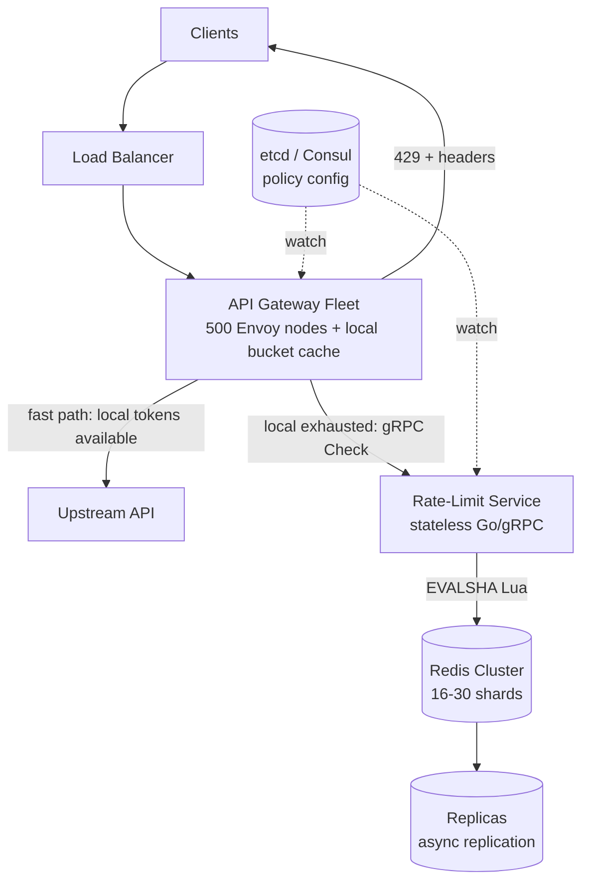
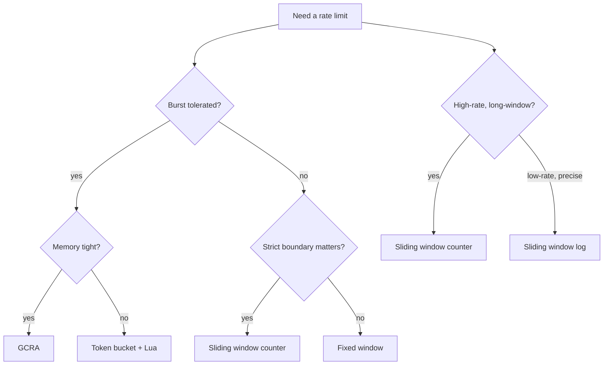
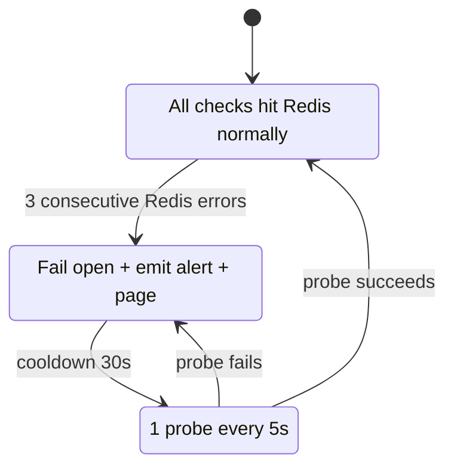
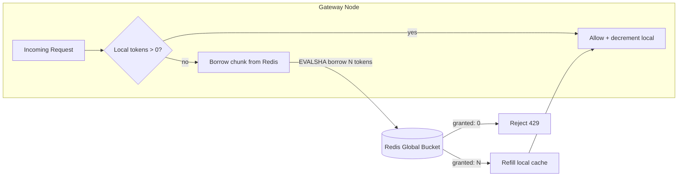

# Design a Distributed Rate Limiter

> **TL;DR.** The algorithm is the easy part. Token bucket, sliding window counter, and GCRA each solve the counting problem in O(1) state. The hard part is enforcing a single logical limit across a fleet of 500 gateway nodes without turning every request into a network round trip. The production answer, used by Stripe[^1], Cloudflare[^2], and Envoy[^3], is a two-tier scheme: a local approximate bucket per gateway plus a shared Redis of record, reducing Redis traffic by 10x while keeping accuracy within 6% of the true rate[^2]. The single biggest Staff-level signal is failure behavior: a rate limiter must fail open, never becoming the outage it was designed to prevent[^1].

## Learning Objectives

After this module, you will be able to:

- [ ] Compare token bucket, sliding window counter, and GCRA and justify the right algorithm for a given workload
- [ ] Design a two-tier local+global architecture that reduces Redis traffic by 10x
- [ ] Implement atomic rate-limit checks using Redis Lua scripts to eliminate race conditions
- [ ] Articulate fail-open vs fail-closed trade-offs and implement circuit breakers around the counter store
- [ ] Integrate idempotency keys so retried requests never burn quota
- [ ] Size a Redis Cluster for 1M+ rate-limit decisions per second

## Intuition

You run a popular bakery. Each customer gets a punch card: 10 free coffees per month. One cashier, one line, one punch card per customer. Easy.

Now open 500 locations. A customer walks into any store and orders. Each store has its own cashier. How does cashier #347 know that the customer already used 8 punches at other locations today? You could call headquarters on every order (centralized Redis), but that slows every transaction to the speed of a phone call. Instead, each store keeps a small local stash of "pre-approved punches" borrowed from headquarters. When the stash runs out, the store calls HQ for more. If HQ's phone line goes down, you still serve the coffee (fail open) and reconcile later.

That is the two-tier local+global pattern. The punch card is the token bucket. The phone call to HQ is the Redis round trip. The "serve the coffee anyway" policy is fail-open. The rest of this chapter makes each piece concrete at 1M requests per second.

## Requirements

### Clarifying Questions

- **Q: What types of limits do we enforce?**
  Assume: Per-user API rate limits (e.g., 100 req/min), per-endpoint caps, and fleet-wide load shedding. Multiple limit types evaluated per request, similar to GitHub's primary and secondary rate-limit system[^4].
- **Q: What is the latency budget for the rate-limit check?**
  Assume: p99 < 10 ms at origin; < 1 ms at edge for cached decisions.
- **Q: Fail-open or fail-closed when the counter store is unreachable?**
  Assume: Fail open by default. Fail closed only for security-critical endpoints (login, OTP, account creation).
- **Q: Multi-region deployment?**
  Assume: Yes. Each region has its own Redis cluster. Per-IP limits are PoP-local (anycast guarantees same PoP). Per-user limits use the regional Redis.
- **Q: Do retried requests consume quota?**
  Assume: No. Idempotency keys prevent double-counting.
- **Q: What response headers do we return?**
  Assume: `X-RateLimit-Limit`, `X-RateLimit-Remaining`, `X-RateLimit-Reset`, `Retry-After` (delay-seconds with jitter, per IETF draft-ietf-httpapi-ratelimit-headers-10[^14]).

### Functional Requirements

- Accept or reject a request based on the caller's remaining quota for the current window.
- Return remaining quota and reset time in response headers.
- Support multiple limit dimensions per request (per-user + per-endpoint + per-IP).
- Allow configuration changes (new limits, plan upgrades) without restart. AWS API Gateway's usage plans demonstrate this pattern with per-key throttle settings and quota adjustable at runtime[^9].
- Shadow mode: new rules log decisions without enforcing, enabling dark launch[^1].

### Non-Functional Requirements

- **Load:** 1M+ rate-limit decisions/sec across the fleet; 100K+ RPS per individual limit key for hot tenants.
- **Latency:** p99 < 10 ms for the check (origin path); < 1 ms for cached over-limit decisions (edge).
- **Availability:** 99.99%. The limiter must never be the reason the API goes down.
- **Accuracy:** Within 6% of the true rate for the two-tier scheme[^2]; exact for single-tier Redis Lua.
- **Consistency:** Approximate. A user may briefly exceed their limit by one chunk size during chunk borrowing.

## Capacity Estimation

| Metric | Value | Derivation |
|--------|------:|------------|
| Gateway nodes | 500 | Fleet size for a large API platform |
| Peak decisions/sec (fleet) | 1M | 500 nodes * 2,000 RPS per node |
| Redis ops/sec (no local cache) | 1M | 1 EVALSHA per decision |
| Redis ops/sec (10-token chunks) | 100K | 1M / 10 |
| Unique rate-limit keys (active) | 5M | 5M active users in a 1-minute window |
| Memory per key (token bucket) | ~80 B | hash: tokens(8B) + last(8B) + key overhead(~64B) |
| Total Redis memory | ~400 MB | 5M * 80 B |
| Redis cluster shards | 16-30 | 100K ops/sec / ~6K ops/shard (conservative) |

A single Redis instance handles ~100,000+ `INCR` ops/sec with redis-benchmark (no pipelining)[^17], and a Redis Cloud cluster achieved 1.2M ops/sec in a vendor test with aggressive pipelining (pipeline=75)[^18]. With 10-token chunk borrowing, 100K ops/sec is well within a 16-shard cluster's capacity.

## API and Data Model

### API Design

```http
POST /v1/ratelimit/check
  X-Idempotency-Key: <uuid>
  Body: { "user_id": "u_42", "endpoint": "/v1/charges", "cost": 1 }
  Returns: 200 { "allowed": true, "remaining": 87, "reset_at": 1714473660 }
           429 { "allowed": false, "remaining": 0, "retry_after": 27 }

GET /v1/ratelimit/status/{user_id}
  Returns: 200 { "limits": [ { "name": "api_rate", "limit": 100, "remaining": 87, "reset_at": ... } ] }

PUT /v1/ratelimit/config/{rule_id}
  Body: { "key_pattern": "user:{user_id}", "algorithm": "token_bucket", "rate": 100, "burst": 150, "window": "1m" }
  Returns: 200 { "rule_id": "r_abc", "status": "active" }
```

Response headers on every API response (set by the gateway after the check). This pattern is consistent with the X/Twitter API v2 which returns per-endpoint `x-rate-limit-*` headers on every response, enabling clients to self-throttle before hitting 429s[^19]:

```http
X-RateLimit-Limit: 100
X-RateLimit-Remaining: 87
X-RateLimit-Reset: 1714473660
Retry-After: 27
```

### Data Model

```text
-- Redis hash per rate-limit key (token bucket)
HSET ratelimit:user:u_42:api_rate
  tokens   87.0       -- current token count (float)
  last     1714473633000  -- last refill timestamp (ms)
PEXPIRE ratelimit:user:u_42:api_rate 120000  -- 2x window

-- Idempotency cache
SETEX idem:<idempotency_key> 86400 <cached_decision_json>

-- Configuration (etcd / Consul, watched by gateways)
/ratelimit/rules/r_abc -> { "key_pattern": "user:{user_id}", "algorithm": "token_bucket", "rate": 100, "burst": 150, "unit": "minute" }
```

No relational database. Counters live exclusively in Redis. Configuration lives in etcd or Consul with filesystem watch for hot-reload[^3]. The `INCR` + `EXPIRE` pattern for fixed-window counters requires careful atomicity handling; Redis documents the race condition where a key is incremented but the `EXPIRE` never fires if the client crashes between the two calls[^12].

## High-Level Architecture



*Gateway fleet checks a local bucket first and only hits the shared Redis when local tokens run low; configuration is watched out-of-band from etcd or Consul.*

**Write path (rate-limit check).** Every inbound request hits the gateway. The gateway first checks its local token cache. If tokens remain, it decrements locally and forwards to upstream (fast path, sub-microsecond). If the local cache is empty, it sends a gRPC `Check` to the rate-limit service, which executes an atomic Lua script on Redis and returns `{allowed, remaining, reset_at}`. The gateway caches the result and responds with appropriate headers.

**Configuration path.** Operators write rules to etcd/Consul. Both gateways and the rate-limit service watch for changes and hot-reload without restart. New rules can be deployed in shadow mode (log-only) before enforcement[^1][^3].

**Failure path.** If Redis is unreachable, the circuit breaker trips. The gateway fails open (allows all traffic), emits an alert, and pages on-call. Over-limit decisions are cached locally so confirmed-blocked keys stay blocked even during Redis recovery.

## Deep Dives

### Deep dive 1: Algorithm comparison and selection

Six algorithms dominate rate-limiter design. They differ in memory, accuracy, and burst handling:

| Algorithm | State per key | Accuracy | Burst behavior | Atomicity cost |
|---|---|---|---|---|
| Fixed window | 1 counter | 2x boundary burst[^6] | Uncontrolled | INCR + EXPIRE |
| Sliding window log | sorted set | Exact | None | ZADD + ZRANGEBYSCORE |
| Sliding window counter | 2 integers | ~0.003% error[^2] | None | INCR + GET |
| Token bucket | 2 fields | Exact (with Lua) | Configurable | EVALSHA (Lua) |
| Leaky bucket | queue + drain | Smooth output | Queue-based | Background drip[^11] |
| GCRA | 1 scalar (TAT) | Exact | Configurable | EVALSHA (Lua) |

**Token bucket** is the industry default for user-facing APIs. Stripe uses it because "every time they make a request we remove a token from that bucket"[^1]. The burst parameter maps cleanly to real usage: clients burst briefly (batch imports, webhook replays), then slow down.

**Sliding window counter** is the best choice for strict per-endpoint caps where burst is unacceptable. Cloudflare's formula blends two fixed-window counters by the overlap ratio:

```text
estimated = prev_count * ((60 - elapsed_in_current) / 60) + curr_count
```

On 400 million production requests from 270,000 distinct sources, this produced only 0.003% wrongly-allowed or wrongly-limited requests, with zero false positives[^2].

**GCRA (Generic Cell Rate Algorithm)** stores a single scalar (Theoretical Arrival Time) and computes the decision in a handful of arithmetic operations[^7]. Originally from ATM networking, it is carried forward in the Rust `governor` crate[^8] and the open-source `throttled` Go library (used in production at Stripe). Use it on memory-constrained edge paths where every byte counts.



*Pick token bucket for user-facing APIs with burst needs; sliding window counter for strict endpoint caps; GCRA for memory-constrained edge; never sliding window log at scale.*

**Our pick:** Token bucket (Lua) for per-user limits. Sliding window counter for per-endpoint caps. GCRA as a niche option for edge nodes with extreme memory pressure.

### Deep dive 2: Redis Lua atomic implementation and failure modes

The critical implementation detail is atomicity. Without it, two concurrent requests can both read `tokens=1`, both decrement, and both succeed. Figma explicitly documented this bug: "If only a single token remains and two servers' Redis operations interleave, both requests would be let through."[^6]

The Stripe-style Lua script executed atomically via `EVALSHA`[^1]:

```lua
-- KEYS[1]: bucket key; ARGV: rate, burst, cost, now_ms
local rate   = tonumber(ARGV[1])
local burst  = tonumber(ARGV[2])
local cost   = tonumber(ARGV[3])
local now    = tonumber(ARGV[4])

local state  = redis.call('HMGET', KEYS[1], 'tokens', 'last')
local tokens = tonumber(state[1]) or burst
local last   = tonumber(state[2]) or now

local elapsed = math.max(0, now - last)
tokens = math.min(burst, tokens + (elapsed * rate / 1000.0))

local allowed = 0
if tokens >= cost then
    tokens = tokens - cost
    allowed = 1
end

redis.call('HMSET', KEYS[1], 'tokens', tokens, 'last', now)
redis.call('PEXPIRE', KEYS[1], 2 * math.ceil(burst * 1000 / rate))
return { allowed, tokens }
```

**Why not WATCH/MULTI/EXEC?** Under contention on hot keys, optimistic locking retries storm and become the bottleneck. Lua is atomic by construction with zero retries[^1][^6].

**Clock skew.** Token bucket refill math depends on elapsed time. If gateways pass their own timestamps, skewed clocks corrupt bucket state. Fix: use `redis.call('TIME')` inside the Lua script so Redis is the authoritative clock.

**Failure mode: Redis unavailable.** The circuit breaker pattern:



*A circuit breaker ensures a Redis outage cannot cascade into an API outage; the gateway fails open and pages on-call.*

**Single shard failure.** With 30 shards, one failure affects 3.3% of keys. Redis Cluster promotes the replica within ~10 seconds. During the gap, the per-shard circuit breaker trips for that shard only; all other shards continue normally.

### Deep dive 3: Two-tier local+global pattern (Cloudflare / Envoy)

Calling Redis on every request sends 1M gRPC calls/sec to the cluster. The production pattern, used by Cloudflare[^2] and Envoy's ratelimit service[^3], is a two-tier scheme:

1. Each gateway borrows a **chunk** of tokens from the global Redis bucket (e.g., 10 tokens at a time).
2. The gateway consumes locally until the chunk is exhausted or expires (5-second TTL).
3. When the local chunk runs out, it borrows another. If the global bucket is empty, the borrow fails and the gateway rejects locally.

**Traffic reduction math:**

```text
Without local cache: 1M QPS * 1 Redis call = 1M Redis ops/sec
With 10-token chunks: 1M QPS / 10         = 100K Redis ops/sec
Reduction: 10x
```

**Accuracy cost:** A user with a 100/min limit might briefly see 110/min if chunks are distributed awkwardly across gateways. Cloudflare measured this drift at ~6% average on production traffic, with zero false positives (no legitimate user was ever incorrectly throttled)[^2].

**Dynamic chunk sizing for hot keys:** An enterprise customer with a 10,000/min limit should get larger chunks (50-100 tokens) to reduce the number of outstanding borrows. Envoy's ratelimit uses `LocalCacheSizeInBytes` to cache confirmed over-limit keys locally, so subsequent rejects are served from the per-node cache until TTL[^3].

**Cloudflare's anycast optimization:** Anycast routing guarantees a client IP reaches the same PoP. Each PoP becomes an independent counting domain with its own memcache cluster. No cross-PoP coordination needed for per-IP limits[^2]. This eliminates the distributed coordination problem entirely for IP-based rules.



*Each gateway borrows tokens in chunks, reducing Redis round trips by 10x while keeping accuracy within 6% of the true rate.*

**Alternative: CRDT g-counters.** For geo-replicated edge systems where even the shared Redis round trip is too expensive, CRDT grow-only counters allow each node to broadcast deltas on a gossip channel; counters converge eventually[^16]. The trade-off is higher over-limit drift (unbounded during partition) in exchange for zero coordination cost.

## Real-World Example

### Stripe: four rate limiters protecting every API request

Stripe runs four rate limiters simultaneously on every API request[^1]:

1. **Request rate limiter** (token bucket per user): the primary user-facing limiter. Each user has a bucket stored as a Redis hash, updated atomically via Lua.
2. **Concurrent request limiter**: caps in-flight requests per user. Prevents a single client from monopolizing worker threads.
3. **Fleet usage load shedder**: triggered when overall fleet utilization exceeds a threshold. Sheds low-priority traffic (batch jobs, webhooks) to protect interactive requests.
4. **Worker utilization load shedder**: per-worker circuit breaker. If a single worker is overloaded, it sheds locally.

**Key engineering decisions:**

- **Dark launch.** Every new limiter runs in shadow mode first, logging what it would have blocked before actually blocking. "Dark launch each rate limiter to watch the traffic they would block."[^1]
- **Kill switches.** "Make sure you have kill switches to disable the rate limiters should they kick in erroneously."[^1]
- **Fail open.** "If there were bugs in the rate limiting code (or if Redis were to go down), requests wouldn't be affected."[^1]
- **Idempotency integration.** Retried requests with the same `Idempotency-Key` return the cached decision without consuming a new token[^20].

The fleet usage load shedder was triggered "only for a very small fraction of requests this month" and the worker utilization load shedder rejected "only 100 requests this month"[^1], indicating the system handles enormous throughput with minimal false rejections.

**Cloudflare's complementary approach:** Where Stripe operates at the app layer with full user identity, Cloudflare operates at the edge with IP-level visibility. Their sliding window counter processes "several billion requests per day" across "millions of domains" and in 2017 mitigated attacks as large as 400,000 req/s to a single domain without degrading service for legitimate users[^2].

**Discord's per-route buckets:** Discord exposes per-route rate limits with bucket identifiers in response headers, allowing clients to track independent limits for each API resource[^13]. Their system returns `X-RateLimit-Bucket` hashes so bot developers can pre-emptively avoid 429s without hardcoding route-to-limit mappings.

## Trade-offs

| Approach | Pros | Cons | When to use |
|----------|------|------|-------------|
| Token bucket + Lua | Burst tolerance; clean semantics; atomic[^1] | Two state fields; needs Lua | Per-user API limits; plan tiers |
| Sliding window counter | O(1) state; 0.003% error; no Lua[^2] | Minor under-counting near boundary | Per-endpoint strict caps |
| GCRA | Single TAT scalar; fewest CPU cycles[^7] | Less intuitive; fewer impls | Memory-constrained edge |
| Fixed window | Simplest; 1-op INCR | 2x boundary burst[^6] | Internal, low-stakes limits |
| Centralized Redis per request | Truly global; exact | 1 round trip per request (~1 ms) | Small fleets; billing-critical |
| Local + global chunks | 10x fewer Redis ops[^2][^3] | 5-10% over-limit drift | Large fleets (500+ nodes) |
| CRDT g-counter (gossip) | No central store; eventually consistent[^16] | Unbounded drift during partition | Geo-replicated edge |

The single biggest meta-decision: **fail-open vs fail-closed**. Stripe's position is unambiguous: fail open by default[^1]. The rate limiter is protective infrastructure. If it fails, the API should keep serving. Fail closed only when the limit is the actual security boundary (login attempts, OTP, account creation) and its absence would cause immediate abuse.

## Scaling and Failure Modes

- **At 10x load (10M decisions/sec):** The local cache absorbs most growth. Increase chunk size from 10 to 50 tokens. Redis cluster grows from 16 to 60 shards. Enable Envoy's `REDIS_PIPELINE_WINDOW` at 150-500 microseconds to batch concurrent writes into fewer round trips[^3].
- **At 100x load (100M decisions/sec):** Single Redis cluster saturates. Shard by region (each region gets its own cluster). For per-IP limits, Cloudflare's anycast-per-PoP model eliminates cross-region coordination entirely[^2]. For per-user limits, route to the user's home region.
- **At 1000x load:** Move to edge-native rate limiting (Cloudflare Workers[^15], Fastly Compute). Counters live in edge KV stores with eventual consistency. Accept higher drift (10-15%) in exchange for sub-millisecond decisions at 330+ PoPs.

**Failure modes:**

- **Regional Redis cluster down:** Circuit breaker trips. All gateways in the region fail open. Alert fires. Traffic is unmetered for 10-30 seconds until the replica promotes. Blast radius: one region's rate limits are unenforced.
- **Hot-key shard saturation:** A popular tenant concentrates all 500 gateways on one shard. That shard's p99 climbs from 0.5 ms to 50 ms. Mitigation: dynamic chunk sizing (larger chunks for hot keys), local caching of over-limit decisions, or dedicated Redis instances for top tenants.
- **Thundering herd on reset:** At the exact second a fixed-window quota resets, every throttled client retries simultaneously. Mitigation: use token bucket (continuous refill, no hard reset) and return `Retry-After` as delay-seconds with jitter[^14].

## Common Pitfalls

> [!WARNING]
> **Fail-closed as the default.** A failed rate limiter should never take down the API it protects. Fail open, log, alert. Only fail closed for endpoints where the limit is the sole abuse defense (login, OTP, account creation).[^1]

> [!WARNING]
> **GET+SET without atomicity.** The classic race: two concurrent requests both see `tokens=1`, both decrement, both succeed. Use Lua scripts. Figma documented this bug explicitly.[^6]

> [!WARNING]
> **Double-counting retried requests.** A network blip causes a retry; without idempotency keys the retry burns a token. Cache `(idempotency_key, decision)` for 24 hours.[^20]

> [!WARNING]
> **Sliding window log at high scale.** It stores one sorted-set entry per allowed request per key per window. At 10,000 users with 500 req/day limits, Figma calculated ~20 MB total ZSET overhead for the sliding window log approach[^6]. Use sliding window counter instead: same accuracy, 1/100th the memory.

> [!WARNING]
> **Hot-key shard saturation.** A popular tenant concentrates all gateways on one Redis shard. Fix: dynamic chunk sizing, local caching of over-limit decisions (Envoy's `LocalCacheSizeInBytes`[^3]), or dedicated Redis instances for top tenants.

> [!WARNING]
> **Relational DB as the counter store.** Using Postgres for rate-limit counters adds 10-50 ms per check and collapses under contention. A single row per user becomes the hottest row in the database. Use Redis.[^6]

## Follow-up Questions

**1. How would you implement multi-dimensional rate limiting (per-user + per-endpoint + per-IP simultaneously)?**

Envoy's descriptor-based matching[^3]. The gateway sends a list of `(key, value)` tuples per request. The rate-limit service matches them hierarchically and applies the most restrictive limit. Each dimension has its own Redis key and independent bucket. A single gRPC call evaluates all dimensions and returns the most restrictive result. Kubernetes API Priority and Fairness (APF) takes this further with flow-schema classification and priority levels that provide weighted fair queuing across request categories[^10].

**2. How would CRDT counters work for a geo-replicated edge rate limiter?**

Each PoP maintains a local g-counter (grow-only CRDT)[^16]. Periodically (every 1-5 seconds), nodes broadcast their delta to peers via gossip. The global count is the sum of all replicas. Trade-off: during a partition, each side counts independently, so the effective limit is `limit * num_partitions`. Acceptable for soft limits; unacceptable for billing-critical caps.

**3. How would you implement cost-based throttling (like Shopify's GraphQL query cost)?**

Each request has a `cost` field instead of a fixed cost of 1. A simple GET costs 1 point; a complex GraphQL mutation costs 5-50 points based on field complexity analysis[^5]. The token bucket's `cost` parameter in the Lua script already supports this. Shopify's GraphQL Admin API tiers restore points at 100/sec on Standard, 200/sec on Advanced, 1000/sec on Shopify Plus, and 2000/sec on Shopify for Enterprise (Commerce Components)[^5].

**4. When should you ban vs throttle?**

Throttle (429 + Retry-After) for legitimate clients exceeding quota. Ban (403 + block for N minutes) for confirmed abuse patterns (credential stuffing, scraping). Implement as a separate abuse-detection layer that feeds into the rate limiter's blocklist. Figma used shadow bans (return 200 but silently drop the action) to prevent attackers from detecting the limit and rotating accounts[^6].

**5. How would you adopt the IETF RateLimit header standard?**

The draft-ietf-httpapi-ratelimit-headers-10 (September 2025) defines `RateLimit-Policy` and `RateLimit` as structured fields[^14]. Return both the legacy `X-RateLimit-*` headers and the new standard headers during a transition period. The standard introduces partition keys for multi-dimensional limits and structured-field syntax for machine-readable policies.

**6. What changes for WASM-based edge rate limiting?**

Deploy the rate-limit logic as a WASM module in Envoy or Cloudflare Workers. The module runs in-process (no gRPC hop to a separate service), reducing latency to sub-microsecond for local decisions. The WASM module still calls Redis for global state, but the local cache layer is embedded in the proxy itself.

## Exercise

### Exercise 1: Diagnosing chunk-borrowing waste

A multi-tier SaaS API has three plan levels: free (100 req/min), paid (1,000 req/min), and enterprise (10,000 req/min). The system has 200 gateway nodes with 10-token chunk borrowing. An enterprise customer reports they are being incorrectly throttled at ~8,500 req/min instead of 10,000. Diagnose the problem and propose a fix.

<details>
<summary>Hint</summary>

Consider what happens when 200 gateways each borrow 10-token chunks for a customer with a 10,000/min limit. How many chunks are outstanding at any moment? What is the effective "reserved but unused" capacity?

</details>

<details>
<summary>Solution</summary>

**Diagnosis:** With 200 gateways borrowing 10-token chunks, up to 200 * 10 = 2,000 tokens can be "in flight" (borrowed but not yet consumed). If the customer's traffic is bursty and concentrated on a few gateways, the remaining gateways hold unused tokens that expire after 5 seconds. The effective limit becomes 10,000 - (wasted tokens from expired chunks) = ~8,500.

**Fix:** Dynamic chunk sizing based on the customer's limit and the number of active gateways serving that customer.

1. Track which gateways have active chunks for each key (a lightweight counter in Redis).
2. For enterprise customers (10,000/min), increase chunk size to 50-100 tokens. This reduces the number of outstanding chunks from 200 to 20-40, cutting waste.
3. Shorten chunk TTL from 5 seconds to 2 seconds for high-limit keys, so unused tokens return to the global pool faster.
4. Alternatively, use a "credit-back" mechanism: when a gateway's chunk expires with unused tokens, it writes the remainder back to Redis.

**Trade-off accepted:** Larger chunks mean slightly less accuracy (a user might briefly exceed their limit by one chunk size). For an enterprise customer at 10,000/min, being 50 tokens over for a few seconds is acceptable.

</details>

## Key Takeaways

- **The algorithm is the easy part.** The interview differentiator is coordination across a fleet and failure behavior.
- **Token bucket for user-facing APIs** (burst tolerance), **sliding window counter for strict endpoint caps** (0.003% error, O(1) state)[^2].
- **Redis with atomic Lua scripts** is the industry standard for correctness under concurrency[^1][^6].
- **Local + global two-tier** reduces Redis traffic by 10x while keeping accuracy within 6%[^2].
- **Fail open is the default.** The rate limiter protects the API; it must never be the reason the API goes down[^1].
- **Idempotency key integration** prevents retried requests from burning quota[^20].

## Further Reading

- [Scaling your API with rate limiters](https://stripe.com/blog/rate-limiters). Paul Tarjan's canonical Stripe post describing four rate-limiter types in production with open-sourced Lua code; the single best starting point for this topic.
- [How we built rate limiting capable of scaling to millions of domains](https://blog.cloudflare.com/counting-things-a-lot-of-different-things/). Cloudflare's sliding window counter math, anycast-per-PoP decomposition, and the 0.003% accuracy analysis on 400M requests.
- [An alternative approach to rate limiting](https://www.figma.com/blog/an-alternative-approach-to-rate-limiting/). Figma's comparison of token bucket, fixed window, sliding window log, and sliding window counter with concrete memory math and the race-condition explanation.
- [Rate Limiting, Cells, and GCRA](https://brandur.org/rate-limiting). Brandur Leach's plain-English explanation of GCRA; the "I know more than the average candidate" signal in interviews.
- [Envoy ratelimit service](https://github.com/envoyproxy/ratelimit). Open-source Go/gRPC implementation with descriptor-based matching, local caching, shadow mode, and Redis pipelining configuration.
- [IETF draft-ietf-httpapi-ratelimit-headers-10](https://datatracker.ietf.org/doc/html/draft-ietf-httpapi-ratelimit-headers). The emerging standard for `RateLimit-Policy` and `RateLimit` HTTP header fields; version 10 (September 2025) introduces partition keys.
- [Designing robust and predictable APIs with idempotency](https://stripe.com/blog/idempotency). Required reading for the idempotency-key integration that prevents retried requests from burning quota.
- [GitHub REST API rate limits](https://docs.github.com/en/rest/using-the-rest-api/rate-limits-for-the-rest-api). The most thoroughly documented real-world primary + secondary rate-limit system with per-resource buckets and point-based cost models.

## Flashcards

<details>
<summary><strong>Q: Why is sliding window counter preferred over sliding window log at scale?</strong></summary>

A: The log stores one entry per allowed request per key per window (O(N) memory). The counter stores two integers (O(1)) and is accurate to within 0.003% using weighted interpolation between previous and current windows. Same accuracy, 100x less memory.[^2][^6]

</details>

<details>
<summary><strong>Q: What problem does the local + global two-tier pattern solve?</strong></summary>

A: Cost. Calling Redis on every request is accurate but expensive (1M ops/sec across the fleet). Borrowing chunks of tokens into a local cache reduces Redis traffic by 10x while keeping accuracy within 6-10%.[^2][^3]

</details>

<details>
<summary><strong>Q: Why should a rate limiter fail open by default?</strong></summary>

A: The rate limiter is protective infrastructure. If it fails, the API should keep serving. Fail closed only when the limit is the actual security boundary (login attempts, OTP, account creation) and its absence would cause immediate abuse.[^1]

</details>

<details>
<summary><strong>Q: How do idempotency keys interact with rate limiting?</strong></summary>

A: A retried request with the same idempotency key must not consume an additional token. Cache the decision against the key in Redis for 24 hours; subsequent retries return the cached decision without touching the bucket.[^20]

</details>

<details>
<summary><strong>Q: Why use Lua scripts for token bucket on Redis instead of MULTI/EXEC with WATCH?</strong></summary>

A: Lua is atomic by construction with zero retries. MULTI+WATCH requires retries on concurrent modification and serializes poorly under contention on hot keys. EVALSHA is one network round trip and one server-side atomic execution.[^1][^6]

</details>

<details>
<summary><strong>Q: What is GCRA and when would you use it over token bucket?</strong></summary>

A: Generic Cell Rate Algorithm stores a single scalar (Theoretical Arrival Time) instead of two fields. It is mathematically equivalent to a leaky bucket but uses fewer CPU cycles and less memory. Use it on memory-constrained edge paths or high-throughput gateways.[^7]

</details>

<details>
<summary><strong>Q: How does Cloudflare avoid a globally shared counter for per-IP rate limiting?</strong></summary>

A: Anycast routing guarantees a client IP reaches the same PoP. Each PoP becomes an independent counting domain with its own memcache cluster. No cross-PoP coordination needed for per-IP limits.[^2]

</details>

<details>
<summary><strong>Q: What is the thundering herd problem on rate-limit reset?</strong></summary>

A: When a fixed window resets at a known timestamp, every throttled client retries simultaneously. Mitigation: use token bucket (continuous refill, no hard reset) and return Retry-After as delay-seconds with jitter rather than an absolute timestamp.[^14]

</details>

<details>
<summary><strong>Q: How does Envoy's descriptor-based matching enable multi-dimensional rate limiting?</strong></summary>

A: The gateway sends a list of (key, value) tuples per request. The rate-limit service matches them hierarchically against a YAML config tree and applies the most specific limit. A single gRPC call evaluates per-endpoint + per-user + per-region limits simultaneously.[^3]

</details>

<details>
<summary><strong>Q: What is the sliding window counter formula?</strong></summary>

A: `estimated = prev_count * ((window - elapsed_in_current) / window) + curr_count`. It blends the previous and current fixed-window counters by the overlap ratio, giving O(1) state and 0.003% error in production.[^2]

</details>

## References

[^1]: Paul Tarjan, "Scaling your API with rate limiters", Stripe blog, 2017. https://stripe.com/blog/rate-limiters
[^2]: Julien Desgats, "How we built rate limiting capable of scaling to millions of domains", Cloudflare blog, 7 June 2017. https://blog.cloudflare.com/counting-things-a-lot-of-different-things/
[^3]: envoyproxy/ratelimit README, "Overview" and "Redis" sections. https://github.com/envoyproxy/ratelimit
[^4]: GitHub, "Rate limits for the REST API", GitHub Docs. https://docs.github.com/en/rest/using-the-rest-api/rate-limits-for-the-rest-api
[^5]: Shopify, "Shopify API limits" (GraphQL Admin, Storefront, Payments Apps, Customer Account). https://shopify.dev/docs/api/usage/limits
[^6]: Nikrad Mahdi, "An alternative approach to rate limiting", Figma blog, 12 April 2017. https://www.figma.com/blog/an-alternative-approach-to-rate-limiting/
[^7]: Brandur Leach, "Rate Limiting, Cells, and GCRA", brandur.org, 18 September 2015. https://brandur.org/rate-limiting
[^8]: governor (Rust), GCRA-based rate limiter crate. https://lib.rs/crates/governor
[^9]: AWS, "Usage plans and rate limits for API keys", Amazon API Gateway Developer Guide. https://docs.aws.amazon.com/apigateway/latest/developerguide/api-gateway-api-usage-plans.html
[^10]: Kubernetes, "API Priority and Fairness", Kubernetes Documentation. https://kubernetes.io/docs/concepts/cluster-administration/flow-control/
[^11]: Nginx, "Module ngx_http_limit_req_module", nginx.org. http://nginx.org/en/docs/http/ngx_http_limit_req_module.html
[^12]: Redis, "INCR command", Redis Documentation (atomicity section on INCR + EXPIRE race). https://redis.io/commands/incr/
[^13]: Discord, "Rate Limits", Discord Developer Documentation. https://discord.com/developers/docs/topics/rate-limits
[^14]: R. Polli, A. Martinez, D. Miller, "RateLimit header fields for HTTP", draft-ietf-httpapi-ratelimit-headers-10, IETF, 27 September 2025. https://datatracker.ietf.org/doc/html/draft-ietf-httpapi-ratelimit-headers
[^15]: Cloudflare, "Rate Limit binding", Cloudflare Workers Runtime APIs. https://developers.cloudflare.com/workers/runtime-apis/bindings/rate-limit/
[^16]: arXiv:1307.3207v1, "Scalable Eventually Consistent Counters over Unreliable Networks" (formal treatment of CRDT counters). https://arxiv.org/abs/1307.3207v1
[^17]: Redis, "Redis benchmark", Redis Documentation (official redis-benchmark tool results and methodology). https://redis.io/docs/latest/operate/oss_and_stack/management/optimization/benchmarks/
[^18]: High Scalability, "The 1.2M Ops/Sec Redis Cloud Cluster Single Server Unbenchmark", 2014. https://highscalability.com/the-12m-opssec-redis-cloud-cluster-single-server-unbenchmark/
[^19]: X/Twitter, "Rate limits", X API v2 Documentation. https://developer.x.com/en/docs/x-api/rate-limits
[^20]: Brandur Leach, "Designing robust and predictable APIs with idempotency", Stripe blog, 2017. https://stripe.com/blog/idempotency
