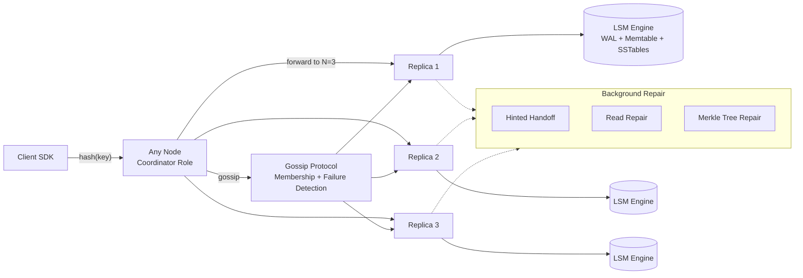
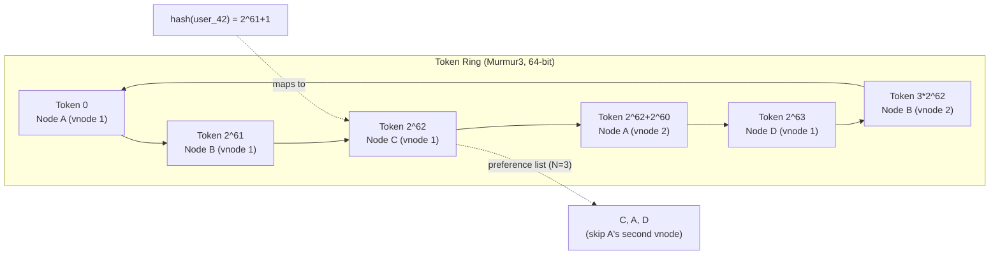
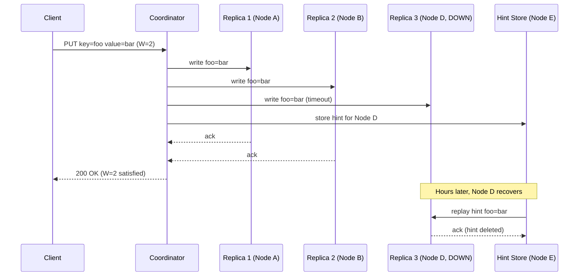
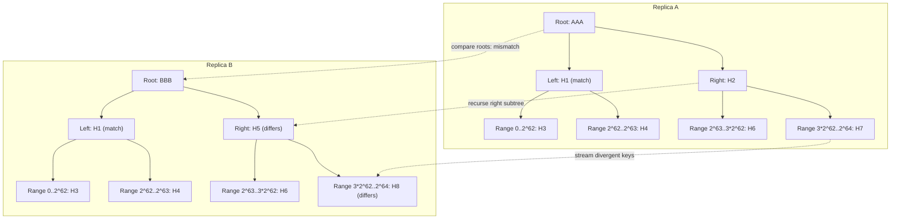
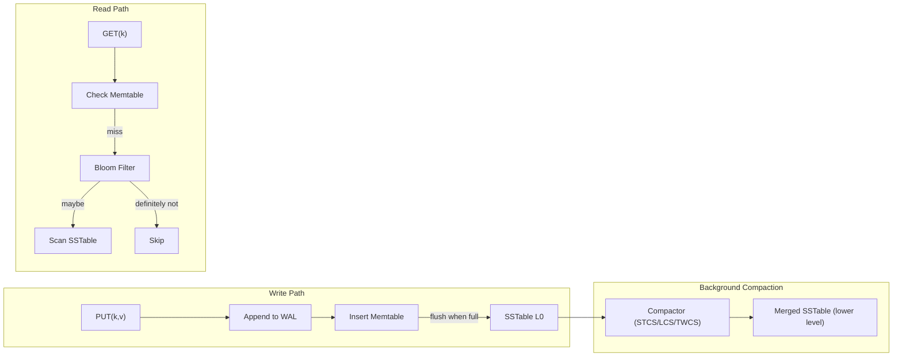

# Design a Distributed Key-Value Store (Dynamo / Cassandra / Riak)

> **TL;DR.** A Dynamo-style distributed key-value store maps opaque keys to opaque values across a cluster of commodity servers with no single point of failure. The 2007 Amazon Dynamo paper[^1] defined the template: partition data with consistent hashing, replicate to N nodes, tune consistency per operation with R and W quorums (R + W > N for strong reads), detect failures with gossip, and heal divergence with anti-entropy. DynamoDB peaked at 151 million requests per second during Prime Day 2025 with single-digit-millisecond latency[^20]. The central tension is the CAP trade-off made explicit: writes never reject during partitions, but replicas may diverge and need reconciliation.

## Learning Objectives

After this module, you will be able to:

- [ ] Design a consistent-hashing ring with virtual nodes that rebalances gracefully on topology changes
- [ ] Tune per-operation consistency with quorum math (R + W > N) and justify the cost
- [ ] Compare vector clocks and last-write-wins for conflict resolution and cite failure rates under each
- [ ] Explain hinted handoff, read repair, and Merkle-tree anti-entropy as complementary repair layers
- [ ] Describe the LSM-tree write path and choose between STCS, LCS, and TWCS compaction strategies
- [ ] Estimate capacity for a 10M+ ops/sec workload and identify bottlenecks at 10x and 100x scale

## Intuition

A single-server key-value store is trivial: a hash map in memory, a WAL on disk, done. It handles 10 users fine. At 10 million operations per second it collapses, because one machine cannot hold 100 billion records, cannot survive disk failure without data loss, and cannot serve users on three continents with single-digit-millisecond latency.

The naive fix is `server = hash(key) % N`. It works until you add a ninth server to an eight-server cluster: nearly every key remaps, forcing a petabyte-scale data migration[^3]. Consistent hashing solves this by moving only 1/N of keys on a topology change. But now you have N copies of each key on different machines, and those machines can disagree about the current value. That disagreement is the entire design problem.

The 2007 Dynamo paper[^1] made a deliberate choice: Amazon's shopping cart must never reject an "add to cart" operation, because a rejected write is lost revenue. The system accepts writes on any live replica and pushes conflict resolution to the application at read time. Every design decision in this chapter flows from that single priority: **always-writable, even during partitions**. The 2022 DynamoDB paper[^2] chose the opposite corner: Paxos per partition, linearizable reads, writes that reject during partitions. Same lineage, opposite trade-off. This chapter teaches the leaderless (AP) design and contrasts it with the leader-based (CP) alternative.

## Requirements

### Clarifying Questions

- **Q: What consistency model does the system provide?**
  Assume: Tunable per-operation. Default eventual consistency; strong consistency available via quorum settings (R + W > N).
- **Q: What is the value size range?**
  Assume: Keys up to 256 bytes, values up to 1 MB. Median value ~500 bytes.
- **Q: Multi-region active-active?**
  Assume: Yes, 3 regions, each region holds a full replica set. Cross-region replication is asynchronous.
- **Q: What is the SLA target?**
  Assume: 99.99% availability on reads, 99.9% on writes. p99 < 10 ms intra-region, p99 < 100 ms cross-region.
- **Q: Do we need range scans or only point lookups?**
  Assume: Primarily point lookups (GET/PUT/DELETE by key). Range scans are a follow-up extension.
- **Q: How do we handle conflicts from concurrent writes?**
  Assume: Application chooses per-bucket: vector clocks with app-side merge, or last-write-wins for immutable data.

### Functional Requirements

- PUT(key, value): store a key-value pair, replicated to N nodes
- GET(key): retrieve the latest value (or siblings if concurrent writes exist)
- DELETE(key): tombstone the key across all replicas
- Tunable consistency: caller specifies R and W per operation

### Non-Functional Requirements

- **Load:** 10M+ ops/sec aggregate, 100K ops/sec per node (assumed for capacity planning)
- **Latency:** p50 < 5 ms, p99 < 10 ms intra-region; p999 < 15 ms (design target for this exercise)
- **Availability:** 99.99% read, 99.9% write
- **Storage:** 100B+ records, petabyte-scale across the cluster
- **Durability:** no data loss on single-node failure; bounded data loss (RPO < 3 hours) on single-region failure

## Capacity Estimation

| Metric | Value | Derivation |
|--------|------:|------------|
| Total records (5 yr) | 100B | 55M writes/day x 365 x 5 |
| Storage per record | 600 B | key(64) + value(500) + metadata(36) |
| Total raw storage | 60 TB | 100B x 600 B |
| With RF=3 | 180 TB | 60 TB x 3 replicas |
| Peak read QPS | 8M | 80% of 10M ops/sec |
| Peak write QPS | 2M | 20% of 10M ops/sec |
| Nodes (at 100K ops/node) | 100 | 10M / 100K |
| Hot-key cache (top 1%) | 600 GB | 1B keys x 600 B |

- **Read:write ratio:** 4:1 (typical for session stores, product catalogs)
- **Replication bandwidth:** each write replicates to N=3 nodes, so effective write load is 6M ops/sec cluster-wide
- **Bloom filter memory:** 10 bits per key x 1B keys per node = ~1.2 GB RAM per node[^4]
- **Compaction headroom:** STCS requires 50% free disk; provision 2x raw storage per node[^4][^5]

## API and Data Model

### API Design

```http
PUT /v1/kv/{key}
  Headers: Consistency: QUORUM, Idempotency-Key: <uuid>
  Body: { "value": "<base64-encoded blob>", "context": "<vector-clock>" }
  Returns: 201 { "key": "...", "version": "...", "timestamp": "..." }
  Errors: 503 insufficient replicas, 429 rate limited

GET /v1/kv/{key}
  Headers: Consistency: QUORUM
  Returns: 200 { "key": "...", "value": "...", "context": "<vector-clock>", "siblings": [...] }
  Errors: 404 not found

DELETE /v1/kv/{key}
  Headers: Consistency: QUORUM
  Body: { "context": "<vector-clock>" }
  Returns: 204 No Content
```

The `context` field carries the vector clock (or DVV) from the last read. On write, the coordinator compares contexts to detect concurrent writes. Clients that omit context trigger a new sibling.

### Data Model

```sql
-- Per-node LSM storage (Cassandra-style)
-- Partition key: hash(key) determines ring placement
-- Clustering: none (single value per key)
table kv_store (
  key_hash    bigint,       -- Murmur3 token
  key         blob,         -- original key bytes
  value       blob,         -- opaque payload
  vector_clock blob,        -- serialized VC/DVV
  timestamp   bigint,       -- HLC for LWW fallback
  tombstone   boolean,      -- soft delete marker
  PRIMARY KEY (key_hash)
)

-- Hint store (per-node, for hinted handoff)
table hints (
  target_node_id  uuid,
  hint_id         timeuuid,
  key_hash        bigint,
  mutation        blob,
  created_at      timestamp,
  PRIMARY KEY (target_node_id, hint_id)
) WITH default_time_to_live = 10800  -- 3 hours
```

## High-Level Architecture



*Every node can coordinate any request; the client SDK hashes the key to select a coordinator with data locality, then the coordinator forwards to N replicas and waits for W acks.*

**Write path.** The client hashes the key, picks a coordinator (any node, but preferably one in the preference list for locality). The coordinator forwards the write to all N=3 replicas in parallel. Each replica appends to its WAL, inserts into its memtable, and acks. The coordinator returns success after W acks arrive. Slow replicas receive the write asynchronously.

**Read path.** The coordinator sends read requests to all N replicas, waits for R responses, compares versions, returns the latest (or siblings if concurrent). If any replica returned a stale version, the coordinator issues a background read-repair write to bring it up to date.

**Failure path.** If a replica in the preference list is unreachable, the coordinator writes to the next live node clockwise (hinted handoff). That node holds the data as a hint and replays it when the failed node recovers. If hints expire (3 hours default[^6]), full Merkle-tree repair reconciles the divergence.

## Deep Dives

### Deep dive 1: Consistent hashing and virtual nodes

The problem: distribute 100 billion keys across 100+ nodes such that adding or removing one node moves minimal data.

**The ring.** Both keys and nodes map to the same circular hash space. Cassandra uses 64-bit Murmur3 tokens over [-2^63, 2^63)[^7]. A key's coordinator is the first node clockwise from hash(key). The next N-1 distinct physical nodes clockwise form the preference list[^1].

**Virtual nodes.** Each physical node claims multiple ring positions (Cassandra defaults to 16 vnodes per node since version 4.0[^7]). This smooths load distribution: without vnodes, a cluster of 8 nodes where one dies shifts 1/8 of all traffic to a single successor. With 16 vnodes per node, the dead node's load spreads across all 7 survivors because its ring positions are interleaved with theirs.

**Rebalancing.** Adding a node with 16 vnodes means 16 small data streams from 16 different sources, parallelizing the bootstrap. The trade-off: more vnodes means more Merkle trees to maintain during repair. Cassandra's documented default changed from 256 (pre-4.0) to 16 (4.0+)[^7] to bound repair and streaming overhead[^8]. ScyllaDB has moved away from vnodes entirely in recent releases, replacing them with "tablets" that are scheduled and migrated independently per table[^9].

**Jump consistent hash (Lamping and Veach 2014)[^10].** An alternative that computes bucket assignment in O(ln N) time with zero memory. Five lines of code. But it cannot handle heterogeneous node weights or vnodes, so production Dynamo descendants still use the ring.



*A key hashes to a ring position; the preference list is the next N=3 distinct physical nodes clockwise, skipping vnodes belonging to the same host.*

### Deep dive 2: Quorum replication and conflict resolution

**The math.** With N=3, R=2, W=2: R + W = 4 > N = 3. Every read overlaps with every write in at least one replica, guaranteeing the read sees the most recent committed value for that key[^1]. With R=1, W=1: R + W = 2 < 3, and reads may miss recent writes entirely.

**Sloppy quorum.** When a replica is unreachable, the coordinator writes to a fallback node. The quorum count is satisfied, but the write may live on zero primary replicas. Jepsen testing showed Riak with sloppy quorum lost 91% of acknowledged writes during a partition[^11]. Strict quorum (PR + PW > N) prevents this at the cost of lower write availability.

**Vector clocks vs. LWW.** Vector clocks detect true concurrency: two browser tabs writing the same key produce siblings that the application merges at read time[^12]. LWW uses wall-clock timestamps; the highest timestamp wins. Under clock skew, a causally-later write with an older timestamp is silently discarded. Jepsen measured 28% write loss on Cassandra with QUORUM during network partitions[^13]. The Riak LWW result is stronger and more unsettling: Kingsbury measured a 71.7% loss rate on a fully-connected, healthy cluster with no partitions, driven purely by concurrent writes racing on wall-clock timestamps[^11]. The partition case for Riak with sloppy quorum and LWW is worse still (~91% loss[^11]). The two numbers test different failure modes: the Cassandra figure isolates partition behavior, while the Riak 71% isolates plain concurrent-write unsafety of LWW independent of partitions.

Dotted version vectors (DVVs) refine vector clocks by tagging each value with the exact (replica-id, counter) dot that produced it, eliminating sibling explosion that plagued pre-2.0 Riak[^12].



*The write acknowledges after W=2 acks; the third replica receives data via hinted handoff once it recovers. Hints expire after 3 hours[^6].*

### Deep dive 3: LSM storage engine and Merkle-tree anti-entropy

**LSM write path.** Every write appends to the commit log (WAL) and inserts into the memtable (a sorted in-memory structure). When the memtable fills, it flushes to an immutable SSTable on disk. Writes are sequential: one append + one memory insert. A B-tree, by contrast, may dirty any page in the index[^14].

**Read path.** Check memtable, then SSTables in reverse time order. Bloom filters (10 bits per key, 1% false positive rate[^4]) skip SSTables that cannot contain the key. Read amplification grows with SSTable count; compaction bounds it.

**Compaction strategies:**

- **STCS (Size-Tiered):** merges 4 similarly-sized SSTables. Low write amplification, but requires 50% free disk and has high space amplification[^4][^5].
- **LCS (Leveled):** each level is 10x the previous. Bounded read amplification (log N), but ~10x write amplification[^4][^5].
- **TWCS (Time-Window):** partitions by time window. No major re-compaction; ideal for TTL workloads[^4].

**Merkle-tree anti-entropy.** Two replicas build a binary tree of hashes over their token ranges. They compare root hashes; if they differ, recurse into children. Only subtrees with mismatched hashes need detailed comparison. Two replicas holding 1 TB each can confirm identity by exchanging a few KB of hashes[^1][^8].



*Two replicas compare hash trees top-down, recursing only into mismatched subtrees. Divergent key ranges are streamed in O(differences) bandwidth.*

Repair must complete within `gc_grace_seconds` (10 days default in Cassandra[^6]). If a replica was offline longer and returns after tombstones are purged on live replicas, read repair resurrects deleted data (the "zombie resurrection" problem).



*Writes are sequential (WAL append + memtable insert); reads check memtable then SSTables via bloom filters; compaction merges SSTables to bound read amplification.*

## Real-World Example

### Discord: from 177 Cassandra nodes to 72 ScyllaDB nodes

Discord stored trillions of messages on a 177-node Cassandra cluster[^15]. Apple has publicly discussed running tens of thousands of Cassandra nodes at multi-petabyte scale[^16]. The operational reality exposed every weakness of the Dynamo model at scale:

**Hot partitions.** A server with hundreds of thousands of members generates orders of magnitude more traffic than a small friend group. All traffic for a popular channel hits one vnode, saturating its CPU while the rest of the cluster idles[^15].

**GC pauses.** Cassandra runs on the JVM. Full garbage collection pauses look identical to node death from the phi-accrual failure detector[^17] (phi threshold = 8, roughly 18.4 seconds[^18]). On-call engineers burned significant time distinguishing real failures from GC-induced false convictions[^15].

**Compaction storms.** Compaction fell behind faster than it could catch up. Operators rotated nodes in and out of the cluster ("gossip dance") to give them compaction capacity without application traffic[^15].

**The migration.** Discord moved to ScyllaDB, a C++ rewrite with a shard-per-core architecture and no garbage collector[^9]. Results:

| Metric | Cassandra (before) | ScyllaDB (after) |
|---|---|---|
| Nodes | 177 | 72 |
| p99 read latency | 40-125 ms | 15 ms |
| p99 write latency | 5-70 ms | 5 ms (steady) |
| Migration speed | - | ~3.2M messages/sec |

The shard-per-core model isolates hot partitions to a single CPU core without stalling other cores' queries. No GC means no false failure convictions. Discord also deployed a Rust-based request-coalescing layer that deduplicates concurrent reads for the same hot key[^15].

## Trade-offs

| Approach | Pros | Cons | When to Use |
|---|---|---|---|
| Tunable quorum, AP (Dynamo) | Always writable, no leader bottleneck, per-op consistency | App must reconcile conflicts, LWW unsafe for mutable data | Session stores, shopping carts, availability-first |
| Paxos per shard, CP (DynamoDB) | Linearizable reads, simple client contract | Writes reject during partition, leader is SPOF per shard | Metadata, financial records, config stores |
| Vector clocks / DVVs | Detect concurrent writes, preserve all data | Client-side merge logic, VC size grows with writers | Mutable objects where data loss is unacceptable |
| Last-write-wins (LWW) | Simple API, no siblings, lower latency | Silent data loss under clock skew or partition; Jepsen measured ~28% write loss in a partitioned Cassandra cluster even with perfect locks[^13] | Immutable data, append-only logs, caches |
| Leaderless with CRDTs | Always writable, automatic merge, no app-side resolution | Restricted data types (counters, sets, maps) | Collaborative state, counters, eventually-consistent sets |
| STCS compaction | Low write amplification | 50% free disk required, high space amplification | Write-heavy append workloads |
| LCS compaction | Bounded read amplification, low space amp | ~10x write amplification | Read-heavy OLTP workloads |

The single biggest trade-off: **availability versus consistency during partitions**. The 2007 Dynamo paper chose availability (shopping cart must never reject). The 2022 DynamoDB paper chose consistency (Paxos per partition, linearizable reads at 151M RPS[^20]). Your choice depends on whether a rejected write or a stale read is more expensive for your business.

## Scaling and Failure Modes

**At 10x (100M ops/sec):** The ring scales linearly by adding nodes. Bottleneck shifts to cross-region replication bandwidth and hot partitions on viral keys. Mitigation: request coalescing (Discord's approach[^15]), per-key rate limiting, and automatic partition splitting (DynamoDB's approach[^2]).

**At 100x (1B ops/sec):** Single-cluster gossip convergence slows with thousands of nodes. Mitigation: hierarchical gossip (gossip within racks, rack-leaders gossip across racks). Compaction becomes the binding constraint; move to tiered storage (hot SSTables on NVMe, cold on object storage).

**At 1000x (10B ops/sec):** The ring model itself becomes a bottleneck (ring metadata grows). Mitigation: shard the ring into sub-rings per keyspace, each independently managed. This is effectively what DynamoDB does with its partition-group architecture[^2].

**Failure: single node dies.** Hinted handoff covers the gap for up to 3 hours[^6]. Read repair heals on access. Full repair reconciles within gc_grace_seconds. No data loss if repair completes in time.

**Failure: entire region goes down.** Cross-region async replication means RPO is bounded by replication lag (typically seconds to minutes). Clients fail over to the nearest healthy region. Conflict resolution handles divergent writes that occurred during the partition.

**Failure: split brain (network partition within a region).** Sloppy quorum allows writes to both sides. On heal, vector clocks detect concurrent versions and surface siblings. With LWW, one side's writes are silently lost.

## Common Pitfalls

> [!WARNING]
> **Hot partitions from bad partition-key choice.** Monotonic keys (auto-incrementing IDs, current-day timestamps) hash to nearby ring positions, saturating one vnode. Use a composite partition key with a high-cardinality prefix. Discord's hot-channel problem is the canonical example[^15].

> [!WARNING]
> **R=1, W=1 with N=3 gives no consistency guarantee.** R + W = 2 < N = 3, so reads and writes may never overlap. Engineers reach for this to minimize latency without doing the math. Enforce R + W > N at the config layer[^1].

> [!WARNING]
> **Tombstone resurrection after gc_grace_seconds.** If a replica is offline longer than gc_grace_seconds (10 days[^6]) and returns after tombstones are purged, read repair resurrects deleted data. Run repair more frequently than gc_grace_seconds on every replica[^8].

> [!WARNING]
> **Sloppy quorum creating false durability.** A write acknowledged with W=2 may live on zero primary replicas if both intended replicas were down. Jepsen showed Riak lost 91% of acknowledged writes during a partition with sloppy quorum[^11]. Use strict quorum (PR + PW > N) when durability matters.

> [!WARNING]
> **Compaction storms filling disk.** STCS requires 50% free disk during merges. If ingest exceeds compaction throughput, SSTable count balloons, read amplification rises, and the node evicts itself. Provision 2x raw storage and monitor pending compactions[^4][^5].

## Follow-up Questions

**1. How would you add secondary indexes?**

Local secondary indexes (each node indexes only its own data) avoid cross-node coordination but require scatter-gather on queries. Global secondary indexes (a separate partitioned index) give single-node lookups but require distributed writes to keep the index consistent. DynamoDB uses global secondary indexes with asynchronous replication from the base table[^2].

**2. How do global tables work for multi-region active-active?**

Each region holds a full replica set. Writes are accepted locally and replicated asynchronously to other regions. Conflicts are resolved per-key using vector clocks or LWW with hybrid logical clocks. DynamoDB Global Tables use last-writer-wins with region-tagged timestamps[^19].

**3. How would you offer a strong consistency option?**

Route strongly-consistent reads to the partition leader (requires electing one via Paxos or Raft). This is what DynamoDB does: each partition has a Paxos-elected leader that serves consistent reads[^2]. The trade-off is that consistent reads are unavailable during leader elections.

**4. How do you implement backup and point-in-time recovery?**

SSTables are immutable, so snapshots are cheap (hard-link the current SSTable set). For PITR, stream the commit log to object storage continuously. Restore by replaying the WAL from the desired timestamp onto the latest snapshot.

**5. What observability do you need?**

Per-node metrics (SSTable count, pending compactions, memtable size, bloom filter false-positive rate), per-operation metrics (coordinator latency by consistency level, timeout rate), and cluster-level metrics (gossip convergence time, hint backlog size, repair progress). Alert on pending compactions > threshold and hint queue growth.

**6. How would you optimize cost at scale?**

Tiered storage (hot data on NVMe, warm on SSD, cold on object storage with lazy rehydration). On-demand capacity (DynamoDB model) versus provisioned (Cassandra model). Compress values with LZ4 or Zstandard. Reduce replication factor for non-critical data (N=2 for caches, N=3 for durable state).

## Exercise

### Exercise 1: Range scan extension

Your product team wants to support `GET /v1/kv/range?start=K1&end=K2&limit=100`. Consistent hashing destroys key locality by construction. Design an extension that supports range scans without sacrificing write throughput for point operations.

<details>
<summary>Hint</summary>

Consider maintaining a separate data structure (or a separate partitioning scheme) for range-scannable data. What does Cassandra do within a single partition? What does Bigtable do across partitions?

</details>

<details>
<summary>Solution</summary>

**Option A: Range partitioning (Bigtable/HBase model).** Store keys in sorted order, split into contiguous ranges assigned to nodes. Range scans hit one or a few nodes. Cost: hot ranges (all writes for "today" hit one node) require automatic splitting. Write throughput is bounded by the hottest range's node.

**Option B: Consistent hashing + global secondary index.** Keep the primary store hashed for uniform writes. Build a secondary index partitioned by key prefix that maps (range) to (list of primary keys). A range scan queries the index, then fetches individual keys. Read amplification = index lookup + N point reads.

**Option C: Cassandra's compromise.** Consistent hashing across partition keys, but sorted clustering columns within a partition. Range scans within a single partition key are efficient (sequential SSTable reads). Cross-partition range scans still require scatter-gather.

**Decision:** Ship Option C for most workloads. If cross-partition range scans are the primary access pattern, use range partitioning with automatic split/merge (accept the hot-range risk and mitigate with pre-splitting). State this trade-off explicitly in an interview: uniform distribution and locality are fundamentally at odds.

</details>

## Key Takeaways

- **Consistent hashing with vnodes** is the foundation; everything else is keeping replicas honest.
- **R + W > N** gives strong consistency per key without a leader, at the cost of write latency equal to the W-th slowest replica.
- **Three repair layers** (hinted handoff, read repair, Merkle-tree anti-entropy) are complementary; none alone is sufficient.
- **LWW is not safe for mutable data.** Jepsen measured 28% write loss on Cassandra with QUORUM during partitions[^13].
- **The 2007 Dynamo paper and 2022 DynamoDB are cousins, not the same system.** DynamoDB uses Paxos per partition and provides linearizable reads at 151M RPS[^20].
- **Operational reality matters as much as theory:** GC pauses, compaction storms, and hot partitions are what page you at 3 AM.

## Further Reading

- [Dynamo: Amazon's Highly Available Key-value Store (SOSP 2007)](https://www.amazon.science/publications/dynamo-amazons-highly-available-key-value-store). The original paper that defined the template; read sections 4.1, 4.4, 4.5, and 4.7 for the core mechanisms.
- [Amazon DynamoDB: A Scalable, Predictably Performant, and Fully Managed NoSQL Database Service (USENIX ATC 2022)](https://www.usenix.org/conference/atc22/presentation/elhemali). Documents DynamoDB's evolution from the 2007 paper to Paxos-backed linearizability (Prime Day 2021 peak: 89.2M RPS).
- [How Discord Stores Trillions of Messages](https://discord.com/blog/how-discord-stores-trillions-of-messages). The clearest operational case study of Cassandra at scale, with concrete before/after migration numbers to ScyllaDB.
- [Jepsen: Cassandra](https://aphyr.com/posts/294-call-me-maybe-cassandra). Kingsbury's 2013 test showing 28% write loss under QUORUM with partitions; essential for understanding why LWW is dangerous.
- [Jepsen: Riak](https://aphyr.com/posts/285-call-me-maybe-riak). The companion test showing 91% write loss with sloppy quorum; the cleanest demonstration of why strict quorum matters.
- [Riak Causal Context Documentation](https://docs.riak.com/riak/kv/latest/learn/concepts/causal-context/). The best practical explanation of vector clocks, DVVs, and sibling resolution outside a textbook.
- [A Fast, Minimal Memory, Consistent Hash Algorithm (Lamping and Veach 2014)](https://arxiv.org/abs/1406.2294). Jump consistent hash in five lines of code; the state-of-the-art for homogeneous sharded systems.
- [The Log-Structured Merge-Tree (O'Neil et al. 1996)](https://www.cs.umb.edu/~poneil/lsmtree.pdf). The storage-engine foundation under every system in this chapter.

## Flashcards

<details>
<summary><strong>Q: What happens to key distribution when you add a node to hash(key) % N?</strong></summary>

A: Nearly every key remaps to a different server because the modulus changes. Consistent hashing fixes this by moving only ~1/N of keys when a node joins or leaves.

</details>

<details>
<summary><strong>Q: What does R + W > N guarantee, and what does it NOT guarantee?</strong></summary>

A: It guarantees every read overlaps with the most recent write for a single key. It does NOT guarantee ordering across keys, transactions, or read-your-writes across sessions.

</details>

<details>
<summary><strong>Q: Why is last-write-wins dangerous for mutable data?</strong></summary>

A: Under clock skew, a causally-later write with an older timestamp is silently discarded. Jepsen measured 28% write loss on Cassandra with QUORUM during partitions.

</details>

<details>
<summary><strong>Q: What are the three anti-entropy mechanisms in a Dynamo-style store?</strong></summary>

A: Hinted handoff (short-term, during transient failures), read repair (on every quorum read), and full Merkle-tree repair (scheduled background). All three are needed; none alone is sufficient.

</details>

<details>
<summary><strong>Q: What is the phi-accrual failure detector's advantage over a fixed timeout?</strong></summary>

A: It outputs a continuous suspicion score adjusted for observed network jitter, so a loaded network raises the conviction bar rather than flapping nodes up and down.

</details>

<details>
<summary><strong>Q: Why did Discord migrate from Cassandra to ScyllaDB?</strong></summary>

A: JVM garbage collection pauses caused false failure convictions, compaction fell behind under load, and hot partitions saturated individual nodes. ScyllaDB's shard-per-core C++ architecture eliminated GC pauses and isolated hot partitions to single cores. Result: 177 nodes to 72, p99 reads from 40-125 ms to 15 ms.

</details>

<details>
<summary><strong>Q: What is the tombstone resurrection problem?</strong></summary>

A: If a replica is offline longer than gc_grace_seconds and returns after tombstones are purged on live replicas, read repair resurrects the deleted data because the returning replica still has the original value.

</details>

<details>
<summary><strong>Q: How do Merkle trees make anti-entropy repair efficient?</strong></summary>

A: Two replicas compare a tree of hashes top-down, recursing only into subtrees that differ. This locates divergent key ranges in O(log N) comparisons and streams only the differing data, not the full dataset.

</details>

<details>
<summary><strong>Q: What is the difference between STCS and LCS compaction?</strong></summary>

A: STCS merges similarly-sized SSTables with low write amplification but requires 50% free disk. LCS bounds each level to 10x the previous with bounded read amplification but ~10x write amplification. Choose STCS for write-heavy, LCS for read-heavy.

</details>

<details>
<summary><strong>Q: How does DynamoDB differ from the 2007 Dynamo paper?</strong></summary>

A: DynamoDB uses Multi-Paxos per partition for linearizable reads, adaptive partition splitting, and admission control. The 2007 paper used sloppy quorum, vector clocks, and always-writable semantics. Same lineage, opposite consistency trade-off.

</details>

## References

[^1]: DeCandia et al., "Dynamo: Amazon's Highly Available Key-value Store", SOSP 2007. https://www.amazon.science/publications/dynamo-amazons-highly-available-key-value-store

[^2]: Elhemali et al., "Amazon DynamoDB: A Scalable, Predictably Performant, and Fully Managed NoSQL Database Service", USENIX ATC 2022. https://www.usenix.org/conference/atc22/presentation/elhemali

[^3]: Wikipedia, "Consistent hashing" (background on Karger et al. 1997). https://en.wikipedia.org/wiki/Consistent_hashing

[^4]: Apache Cassandra documentation, "Compaction". https://cassandra.apache.org/doc/latest/cassandra/managing/operating/compaction/index.html

[^5]: ScyllaDB docs, "Choose a Compaction Strategy". https://docs.scylladb.com/manual/stable/architecture/compaction/compaction-strategies.html

[^6]: Apache Cassandra documentation, "Hints". https://cassandra.apache.org/doc/latest/cassandra/managing/operating/hints.html

[^7]: Apache Cassandra documentation, "Adding, replacing, moving and removing nodes" (num_tokens = 16 default since 4.0). https://cassandra.apache.org/doc/stable/cassandra/managing/operating/topo_changes.html

[^8]: Apache Cassandra documentation, "Repair". https://cassandra.apache.org/doc/latest/cassandra/managing/operating/repair.html

[^9]: ScyllaDB technology overview. https://www.scylladb.com/product/technology/

[^10]: Lamping and Veach, "A Fast, Minimal Memory, Consistent Hash Algorithm", 2014. https://arxiv.org/abs/1406.2294

[^11]: Kyle Kingsbury, "Jepsen: Riak", 2013. https://aphyr.com/posts/285-call-me-maybe-riak

[^12]: Riak KV documentation, "Causal Context" (vector clocks and dotted version vectors). https://docs.riak.com/riak/kv/latest/learn/concepts/causal-context/

[^13]: Kyle Kingsbury, "Jepsen: Cassandra", 2013. https://aphyr.com/posts/294-call-me-maybe-cassandra

[^14]: O'Neil, Cheng, Gawlick, O'Neil, "The Log-Structured Merge-Tree (LSM-Tree)", Acta Informatica 1996. https://www.cs.umb.edu/~poneil/lsmtree.pdf

[^15]: Bo Ingram, "How Discord Stores Trillions of Messages", Discord Engineering Blog, March 2023. https://discord.com/blog/how-discord-stores-trillions-of-messages

[^16]: InfoQ, "Discord Migrates Trillions of Messages from Cassandra to ScyllaDB", 2023; Apple Cassandra scale figures originate from 2015 Cassandra Summit presentations. https://www.infoq.com/news/2023/06/discord-cassandra-scylladb/

[^17]: Hayashibara, Defago, Yared and Katayama, "The phi Accrual Failure Detector", IEEE SRDS 2004. https://ieeexplore.ieee.org/document/1353004

[^18]: Digitalis blog, "Understanding phi_convict_threshold in Apache Cassandra". https://digitalis.io/post/understanding-phi-convict-threshold-in-apache-cassandra-a-deep-dive-into-failure-detection

[^19]: Amazon Science, "Amazon's DynamoDB 10 years later". https://www.amazon.science/latest-news/amazons-dynamodb-10-years-later

[^20]: Channy Yun, "AWS services scale to new heights for Prime Day 2025: Key metrics and milestones", AWS News Blog, 2025. https://aws.amazon.com/blogs/aws/aws-services-scale-to-new-heights-for-prime-day-2025-key-metrics-and-milestones/
