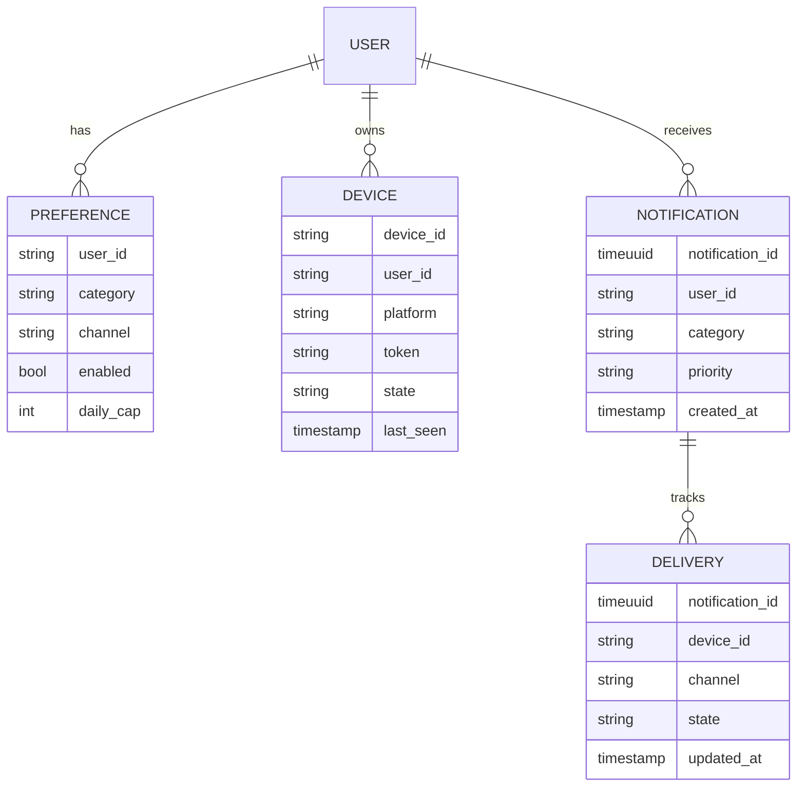
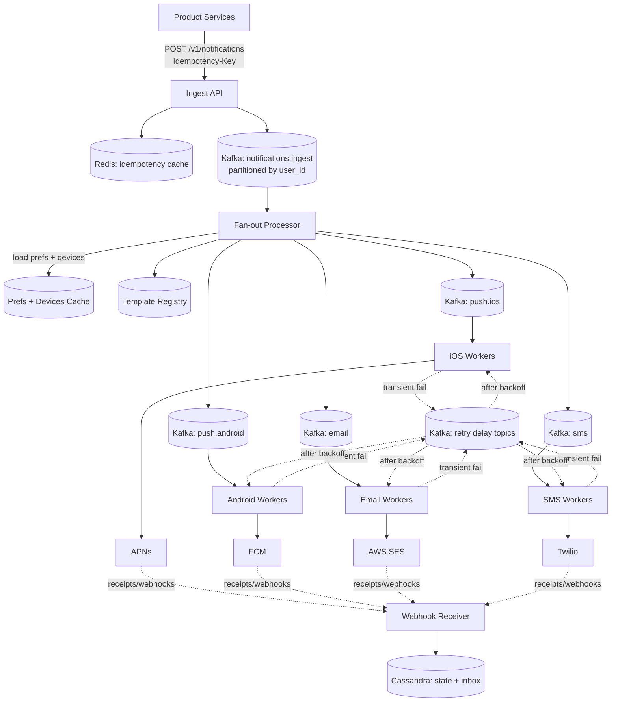
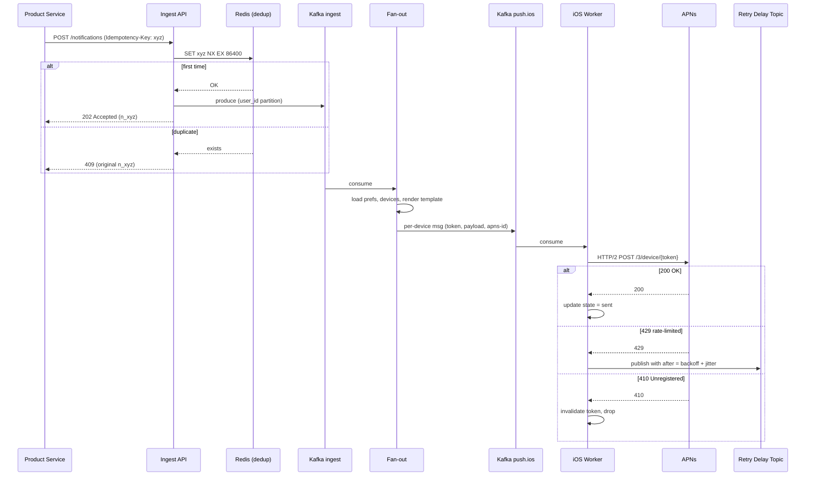
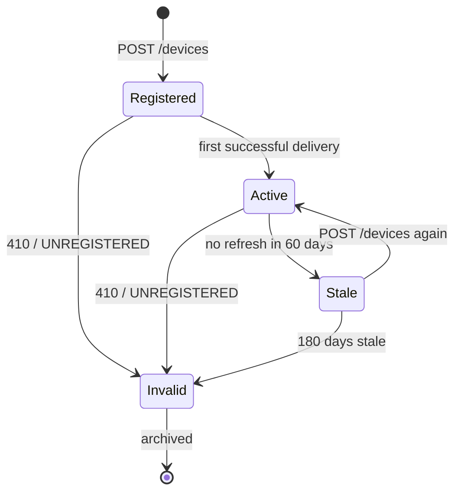
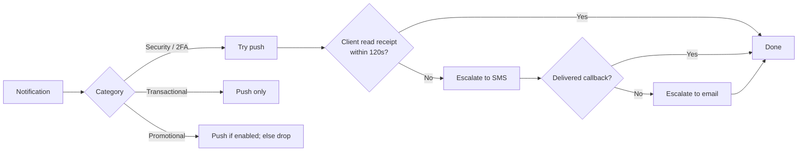

# Design a Notification System (Push, SMS, Email at Scale)

> **TL;DR.** A notification system is three problems in a trenchcoat: fan-out (one event produces N deliveries across M channels for K devices), provider integration (APNs, FCM, Twilio, and SES each have different rate limits, payload sizes, and error semantics), and delivery semantics (at-least-once with deduplication, because exactly-once across external providers is impossible). LinkedIn's Air Traffic Controller processes over 1 billion requests per day[^1] and cut member complaints in half by centralizing orchestration. The pivotal trade-off: throughput versus correctness under heterogeneous provider constraints.

## Learning Objectives

After this module, you will be able to:

- [ ] Design a fan-out architecture that isolates channel failures and scales each provider fleet independently
- [ ] Implement a device-token lifecycle driven by provider feedback (APNs 410, FCM UNREGISTERED)
- [ ] Apply caller-side and provider-side idempotency to achieve effectively-once delivery
- [ ] Justify retry strategies using delay topics with exponential backoff and jitter
- [ ] Estimate capacity for a platform delivering 10B notifications per day across 4 channels
- [ ] Trade off delivery latency against cost in a push-to-SMS fallback waterfall

## Intuition

A notification platform looks like a trivial CRUD app at 10 users. Accept an event, call APNs, done. At 10 billion notifications per day it collapses, and the reason is channel heterogeneity.

APNs can absorb effectively unlimited pushes over multiplexed HTTP/2 connections. Twilio SMS short codes cap at 100 messages per second[^2]. FCM's default quota is 600,000 messages per minute per project[^3]. If you put all channels on one queue, SMS backpressure stalls push delivery. If a provider goes down, the entire pipeline backs up.

The insight that unlocks the design: treat each channel as an independent delivery system with its own worker fleet, its own queue, its own rate limits, and its own failure domain. A thin orchestration layer sits in front, handling dedup, preferences, and fan-out. This is exactly what LinkedIn built with Air Traffic Controller[^1], what Uber built for marketing push[^4], and what Slack rebuilt in 2026 for notification preferences[^5].

The second insight: sending more is not better. Every low-quality notification erodes trust. LinkedIn's pre-ATC world let every team decide its own notification policy, producing "non-regulated, excessive, and low-quality member notification experience"[^1]. Centralization cut complaints in half with double-digit engagement lift. The platform is a gatekeeper, not just a delivery pipe.

## Requirements

### Clarifying Questions

- **Q: Which channels must we support day one?**
  Assume: Push (iOS + Android), SMS, email, and in-app inbox. Web push is a stretch goal.

- **Q: What is the latency SLA for transactional vs promotional?**
  Assume: Transactional (password reset, security alert) p99 < 5 seconds end-to-end. Promotional can be scheduled within a 1-hour window.

- **Q: Do we need delivery confirmation?**
  Assume: Yes for transactional. APNs provides no positive receipt[^6], so we rely on client-side read receipts for push confirmation.

- **Q: Multi-region?**
  Assume: Active-active in 2 regions. Kafka MirrorMaker for cross-region replication of notification state.

- **Q: Who are the callers?**
  Assume: Internal product services (ride-arrived, new-message, marketing-campaign). External webhook triggers are out of scope.

- **Q: What compliance frameworks apply?**
  Assume: TCPA for US SMS, GDPR for EEA, CAN-SPAM for email, A2P 10DLC for US 10-digit long codes[^7], RFC 8058 one-click unsubscribe for bulk email[^8].

### Functional Requirements

- Accept notification requests from product services with idempotency keys
- Fan out to all of a user's registered devices across all enabled channels
- Enforce per-user, per-category, per-channel preferences and frequency caps
- Retry transient failures with exponential backoff; dead-letter permanent failures
- Track delivery state (accepted, sent, delivered, read) per notification per device
- Support scheduled sends and digest batching for promotional categories

### Non-Functional Requirements

- **Load:** 10B notifications/day, 100K/sec peak ingest, 300K/sec peak provider calls (after fan-out)
- **Latency:** p99 < 5s for transactional push; p99 < 60s for email/SMS
- **Availability:** 99.95% on the ingest path; 99.9% on delivery (provider-dependent)
- **Consistency:** at-least-once delivery with effectively-once semantics via dedup
- **Durability:** no notification silently dropped; permanent failures land in DLQ for human review

## Capacity Estimation

| Metric | Value | Derivation |
|--------|------:|------------|
| Daily notifications | 10B | Given requirement |
| Average ingest QPS | 115K | 10B / 86,400 |
| Peak ingest QPS | 300K | 2.5x average (marketing bursts) |
| Fan-out factor | 1.8 | avg 1.8 devices per user |
| Peak provider QPS | 540K | 300K * 1.8 |
| Idempotency cache (24h TTL) | ~170 GB | 10B keys * 17 bytes avg |
| Notification state storage (1 yr) | ~36 TB | 10B/day *365* 10 bytes metadata |
| SMS cost ceiling | $83K/day | 10M SMS * ~$0.0083/segment (Twilio US, as of 2025)[^2] |

- **Read:write ratio:** 1:10 (writes dominate; reads are inbox queries and admin dashboards)
- **Hot partition risk:** celebrity users or viral campaigns can produce 100K+ fan-out from a single trigger
- **Bandwidth:** ~50 Gbps egress at peak (540K msgs/sec * 12 KB avg rendered payload)
- **SMS throughput ceiling:** A2P 10DLC MMS was capped at 1 MPS account-level before March 2026[^9]; short codes provide 100 MPS guaranteed[^2]

## API and Data Model

### API Design

```http
POST /v1/notifications
  Idempotency-Key: <uuid>
  Body: {
    "user_id": "u_abc",
    "category": "security",
    "priority": "high",
    "channels": ["push", "sms"],
    "template_id": "password_reset_v2",
    "params": { "code": "482910", "expires_min": 10 },
    "ttl_seconds": 300
  }
  Returns: 202 { "notification_id": "n_xyz", "status": "accepted" }
  Errors: 409 duplicate (returns original notification_id), 429 rate limited

GET /v1/notifications/{id}/status
  Returns: 200 {
    "notification_id": "n_xyz",
    "deliveries": [
      { "channel": "push", "device": "d_1", "state": "delivered", "at": "..." },
      { "channel": "sms", "state": "sent", "at": "..." }
    ]
  }

GET /v1/users/{id}/inbox?cursor=...&limit=50
  Returns: 200 { "items": [...], "next_cursor": "..." }

PUT /v1/users/{id}/preferences
  Body: { "category": "marketing", "channel": "push", "enabled": false }
  Returns: 200
```

Pagination uses opaque cursor tokens (base64-encoded `notification_id`). Rate limiting: 1,000 req/sec per caller service, enforced at the API gateway. Note: AWS SES sandbox limits to 200 messages/day and 1 msg/sec; production accounts scale to millions/day[^10].

### Data Model

```sql
-- Notification state (Cassandra, partitioned by user_id)
CREATE TABLE notifications (
  user_id       text,
  notification_id timeuuid,
  category      text,
  priority      text,
  template_id   text,
  params        map<text, text>,
  created_at    timestamp,
  ttl_seconds   int,
  PRIMARY KEY (user_id, notification_id)
) WITH CLUSTERING ORDER BY (notification_id DESC);

-- Delivery tracking (Cassandra, partitioned by notification_id)
CREATE TABLE deliveries (
  notification_id timeuuid,
  device_id     text,
  channel       text,
  state         text,   -- accepted | sent | delivered | read | failed
  updated_at    timestamp,
  provider_id   text,   -- apns-id, twilio-sid, ses-message-id
  PRIMARY KEY (notification_id, device_id)
);

-- Device registry (Cassandra, partitioned by user_id)
CREATE TABLE devices (
  user_id       text,
  device_id     text,
  platform      text,   -- ios | android | web
  token         text,
  state         text,   -- registered | active | stale | invalid
  last_seen     timestamp,
  PRIMARY KEY (user_id, device_id)
);
```



*Core entities: a user has preferences and devices; each notification spawns one delivery record per device-channel pair.*

## High-Level Architecture



*Each channel's worker fleet scales independently; a Twilio outage cannot stall APNs delivery. Delay topics handle retries without blocking worker threads.*

**Write path.** A product service POSTs a notification. The Ingest API checks the idempotency key in Redis (SET NX, 24h TTL). On first-seen, it produces to `notifications.ingest` partitioned by `user_id` and returns 202. The fan-out processor consumes, loads preferences and device tokens from a Redis-backed cache, renders the template, and emits one message per (device, channel) pair to the appropriate channel topic.

**Delivery path.** Channel workers consume from their topic, call the provider API, and classify the response. Success updates Cassandra state. Transient failures (429, 5xx) go to a delay topic with exponential backoff. Permanent failures (410, UNREGISTERED) invalidate the device token and drop the message.

**Receipt path.** Provider webhooks (FCM delivery receipts, Twilio status callbacks, SES events) feed a webhook receiver that updates delivery state in Cassandra. APNs provides no positive delivery receipt[^6]; true push confirmation requires client-side analytics.

**Priority isolation.** Separate Kafka topics per priority tier (`push.ios.transactional`, `push.ios.promotional`). Workers consume transactional first. A password reset never sits behind 10 million marketing pushes.

## Deep Dives

### Deep dive 1: Fan-out, ordering, and backpressure across heterogeneous channels

The fan-out processor is the brain of the system. It takes one ingest message and produces N delivery messages. The challenge: channels have wildly different latencies and throughput ceilings.

**Throughput asymmetry.** APNs accepts effectively unlimited pushes over multiplexed HTTP/2 connections (one connection, many concurrent streams). FCM allows 600,000 messages per minute per project[^3]. Twilio short codes cap at 100 MPS; toll-free numbers at 3 MPS baseline[^2]. A single marketing campaign targeting 10M users produces 10M push messages (absorbed in seconds) but 10M SMS messages (which would take 28 hours at 100 MPS on a single short code).

**Per-user ordering.** Kafka partitioning by `user_id` guarantees that all notifications for one user are processed in order by the fan-out processor[^1]. Cross-channel ordering is weaker: a user can receive the SMS before the push if the SMS worker is faster. This is acceptable because channels serve different purposes.

**Backpressure.** When a provider returns 429, the worker must not block. It publishes to a delay topic with a backoff timestamp. A scheduler consumer re-injects messages when the backoff elapses. At 20K QPS with a 30-second in-process retry, you would need 600,000 blocked threads[^11]. Delay topics cost nothing.

**Circuit breaking.** If a provider returns 429 for >30 seconds continuously, a circuit breaker pauses consumption from that channel's topic entirely. On recovery, traffic ramps gradually (1% to 5% to 25% to 100%) to avoid thundering-herd amplification[^11].



*Hot-path flow from ingest through fan-out to APNs, showing idempotency check, per-attempt delivery, and retry via delay topic.*

The 410 response in the sequence above triggers a device token state transition. Every token follows this lifecycle:



*Token lifecycle driven by client re-registration and provider feedback; Invalid is a terminal sink that stops wasted sends.*

### Deep dive 2: Dedup, preferences, and quiet-hours engine on the hot path

Every notification passes through three gates before dispatch: deduplication, preference check, and timing rules. All three must execute in the hot path without adding significant latency.

**Layered deduplication.** (1) Caller-supplied `Idempotency-Key` checked in Redis at ingest (SET NX, 24h TTL, following Stripe's pattern[^12]). (2) Provider-side idempotency: APNs accepts `apns-id` for dedup within its window[^6]; Twilio supports idempotency headers. (3) Content-hash dedup: hash of (template_id + params + user_id) catches semantic duplicates from different callers. (4) Time-windowed dedup: drop identical content to the same user within 5 minutes as a last line.

At 10B notifications/day with 24h TTL, the idempotency cache holds ~10B entries. A Bloom filter in front cuts Redis memory from ~170 GB to ~17 GB: 99% of checks return "definitely not a duplicate" from the filter, and only suspected duplicates hit Redis.

**Preference enforcement.** The fan-out processor loads preferences from a Redis-backed cache keyed by `(user_id, category, channel)`. The preference model encodes: enabled/disabled, daily frequency cap, quiet hours (start/end in user's timezone), digest window, and consent flags (TCPA opt-in for SMS, GDPR consent for EEA)[^7]. Slack's 2026 rebuild separated "what to notify about" from "how to receive it" into independent fields, and saw settings engagement increase 5x post-launch[^5].

**Quiet hours.** The processor checks the user's stored timezone against current UTC. If the notification falls within quiet hours and is not `time-sensitive` priority, it is deferred to a scheduler topic that re-injects at quiet-hours-end. Stale timezone data (user traveled) is the main failure mode; a 1-hour grace window mitigates.

**iOS interruption levels.** Since iOS 15, server-side priority maps to client-side gating: `passive` notifications are silently delivered, `active` respect Focus modes, `time-sensitive` break through Focus, and `critical` (requires Apple entitlement) override Do Not Disturb[^13]. Apple Mail Privacy Protection also pre-fetches tracking pixels, making email open-rate metrics unreliable for MPP users[^14]. The fan-out processor sets `apns-priority` and `interruption-level` based on notification category.

**RFC 8058 compliance.** Every promotional email includes `List-Unsubscribe` and `List-Unsubscribe-Post: List-Unsubscribe=One-Click` headers, DKIM-signed, POST-able without cookies or auth[^8]. Gmail and Yahoo require this for bulk senders (>5,000 emails/day) since 2024[^8].

### Deep dive 3: Delivery tracking, retries, and fallback waterfall

The delivery subsystem answers: "Did the user actually see this notification?" The answer varies dramatically by channel.

**Provider response classification.** Workers classify responses into three buckets: transient (retry), permanent (drop/DLQ), and policy (TTL expired). FCM recommends at least 10 seconds before first retry, exponential backoff with jitter, and drops after ~60 minutes[^11]. FCM error codes like `UNREGISTERED` and `INVALID_ARGUMENT` require different handling paths[^15]. APNs returns 200 on acceptance but provides no positive delivery receipt[^6]. Twilio provides status callbacks (queued, sent, delivered, undelivered, failed). SES provides bounce, complaint, and delivery events via SNS[^10].

**Retry mechanics.** Delay topics implement retries without blocking workers. The worker publishes to a delay topic with a `deliver_after` timestamp. A scheduler consumer (or Kafka's built-in delayed delivery if available) re-injects when the backoff elapses. Backoff schedule: 10s, 30s, 60s, 120s, 300s, then drop to DLQ. Jitter is mandatory to prevent thundering herd on provider recovery[^11].

**Fallback waterfall.** For security-critical categories (password reset, 2FA, fraud alert), if push is not confirmed via client-side read receipt within 120 seconds, the system escalates to SMS. If SMS fails, it escalates to email. Promotional notifications never fall back to paid channels.



*Only security-critical categories waterfall to paid channels; fallback is driven by client-side read receipts, not provider acceptance.*

**Cost control.** Blind SMS fallback is dangerous. Since APNs gives no positive receipt, naive "if no APNs confirmation in 5 minutes, send SMS" fires on every push. At ~$0.0075/segment (Twilio US)[^2], a million daily users equals ~$7,500/day in wasted SMS. The fix: drive fallback off actual client-side read receipts (in-app analytics SDK reports "notification displayed"), not provider response codes.

**Observability.** Slack models each notification as its own OpenTelemetry trace (`trace_id = notification_id`) with spans at `trigger`, `notify`, `sent`, `received`, `opened`, and `read-in-app`[^16]. Span links connect to the sender's message trace without creating billion-span fan-out traces. Sampling is 100% for notification traces (customer-experience engineers need fidelity) versus 1% for message sends. This cut triage time by 30%[^16].

## Real-World Example

### LinkedIn Air Traffic Controller

LinkedIn's Air Traffic Controller (ATC) is the canonical production notification orchestrator. It processed over 1 billion requests per day for 546+ million members as of 2018[^1].

**Architecture.** ATC runs on Apache Samza with state in RocksDB and transport on Kafka[^17]. Services write notification requests to a Kafka topic. Partitioners distribute by hash of recipient `member_id` so all state for one member lives on one Samza task. Relevance processors score each request using ML models pushed from offline jobs and stored in RocksDB. Pipeline processors aggregate scores and make final decisions: drop, in-app only, in-app + push, digest, or Delivery Time Optimization[^1]. Facebook Messenger's Iris system uses a similar per-consumer pointer model for mobile sync, where each device maintains its own read cursor into a totally-ordered queue[^18].

**Key decisions:**

- **Partition by recipient.** All of a member's state (history, devices, settings, preferences) is co-located. Lookups are local RocksDB reads at "a couple of milliseconds" versus remote calls at 10-100ms[^1].
- **ML models in RocksDB.** Offline model outputs ingested via Kafka streams into local RocksDB avoid remote calls on the hot path.
- **Samza Async API.** Thread parallelism hides remote-call latency for unavoidable sender-side lookups. This reduced P90 end-to-end push latency from ~12 seconds to ~1.5 seconds[^1].
- **Send-time optimization.** Delivery Time Optimization picks each member's highest-engagement hour from historical data, smoothing spikes.

**Impact.** ATC "cut member complaints in half and created double-digit increases in member engagement site-wide"[^1]. The pre-ATC world was fragmented: every team decided its own notification policy. Centralization was the fix.

**Uber's parallel evolution.** Uber's RAMEN platform handles 1.5 million concurrent persistent connections and 250,000 messages per second for in-app state pushes[^19]. The 2022 reboot moved to gRPC/QUIC for bi-directional streaming, solving HTTP/1.1 SSE limitations on mobile[^20]. For marketing push, Uber's Consumer Communication Gateway (CCG) was introduced to address notifications "being sent within minutes and hours of each other" with conflicting messaging, after push volume grew to billions per month by late 2020[^4]. Their scheduler uses an XGBoost model combined with an integer linear program solver to jointly pick send time and notification selection per user, subject to per-user frequency caps and send-window constraints[^4].

## Trade-offs

| Decision | Option A | Option B | Our Choice | Why |
|---|---|---|---|---|
| Worker topology | Per-channel fleets | Monolithic worker | Per-channel | Channels have different throughput (APNs >> SMS), rate limits, and failure modes; prevents head-of-line blocking[^1] |
| Delivery guarantee | At-least-once + dedup | Exactly-once | At-least-once | Exactly-once across external providers is impossible; effectively-once via layered dedup is industry standard[^12] |
| Queue backbone | Kafka (user_id partition) | SQS / RabbitMQ | Kafka | Per-user partitioning preserves ordering; LinkedIn and Uber both use Kafka[^1][^4] |
| Retry mechanism | Delay topics | In-process sleep | Delay topics | At 20K QPS * 30s = 600K blocked threads; delay topics are free[^11] |
| Idempotency store | Redis + Bloom filter | DB unique constraint | Redis + Bloom | Sub-ms hot-path check; Bloom cuts 170 GB to ~17 GB; DB UC locks hot keys |
| Send-time strategy | ML-based STO (marketing) | Immediate for all | ML STO | Uber saw conflicting pushes within minutes of each other at billions/month volume; unsmoothed spikes cause FCM 429s[^4][^11] |
| Fallback trigger | Client-side read receipt | Provider acceptance | Client receipt | APNs gives no positive delivery receipt[^6]; provider acceptance != user saw it |

## Scaling and Failure Modes

**At 10x load (100B/day, 1M/sec peak):**
The fan-out processor becomes the bottleneck. Mitigation: horizontally scale Samza/Flink tasks; increase Kafka partitions for channel topics. The idempotency Bloom filter grows to ~170 GB (still fits in a Redis cluster). Provider quotas become the hard ceiling: request FCM quota increase, add more Twilio short codes.

**At 100x load (1T/day, 10M/sec peak):**
Single-region Kafka cannot absorb 10M/sec writes. Mitigation: multi-region Kafka clusters with geo-routing (notifications processed in the user's home region). Template rendering becomes CPU-bound; pre-render templates at campaign creation time. SMS cost at this scale ($750K/day) forces aggressive push-first strategy with SMS reserved for security-only.

**At 1000x load:**
The architecture shifts to edge-first: notification decisions made at edge PoPs with local preference caches, only state updates replicated to core. Provider APIs become the fundamental bottleneck; negotiate dedicated capacity with Apple and Google.

**Failure mode: Provider outage (FCM down for 30 minutes).**
Circuit breaker pauses Android push topic consumption. Messages accumulate in Kafka (hours of retention). On recovery, gradual ramp prevents thundering herd. Messages past TTL are dropped. Users receive a single collapsed notification via `collapse_key` instead of 40 stale pushes.

**Failure mode: Preference cache poisoned.**
A bad deployment writes incorrect preferences. Users receive notifications they opted out of. Detection: anomaly detection on opt-out rate spikes. Recovery: rollback cache, replay from source-of-truth DB, issue apology notification. Blast radius: bounded by cache TTL (5 minutes).

**Failure mode: Kafka consumer lag spike.**
Fan-out processors fall behind during a viral campaign. Transactional notifications (security alerts) are delayed. Detection: consumer lag metric > 10K. Mitigation: priority topics ensure transactional traffic has dedicated consumer groups that are never starved by promotional volume.

## Common Pitfalls

> [!WARNING]
> **Thundering herd on provider recovery.** When FCM recovers from an outage, every waiting worker retries in lockstep. FCM explicitly calls this "retry amplification" and lists it as a top contributor to cascading outages[^11]. Fix: exponential backoff with random jitter (minimum 10s for FCM) and gradual traffic ramp on recovery (1% to 5% to 25% to 100%).

> [!WARNING]
> **Cost explosion from blind SMS fallback.** APNs provides no positive delivery receipt[^6]. If fallback triggers on "no APNs confirmation within 5 minutes," every transactional push becomes push + SMS. At ~$0.0075/segment, a million daily users equals ~$7,500/day in wasted SMS. Drive fallback off client-side read receipts.

> [!WARNING]
> **PII leak via queue payloads.** Phone numbers, emails, and device tokens in Kafka topics with multi-day retention are a GDPR liability. Store only a reference (`notification_id`) on the queue; let workers fetch rendered content from an encrypted store. Shorten Kafka retention; rotate topic keys with tenant offboarding.

> [!WARNING]
> **Notification storm on backend recovery.** An 8-hour outage defers all notifications; recovery fires 40 pushes per user at 3 AM. Fix: TTL on every notification (APNs `apns-expiration`, FCM `ttl`), per-user rate cap on the recovery path (max 5 per 10 minutes), and collapse with `apns-collapse-id` / FCM `collapse_key`.

> [!WARNING]
> **Dead-token waste.** Sending to tokens for uninstalled apps can waste a significant percentage of volume at scale. Workers must synchronously invalidate tokens on `410 Gone` / `UNREGISTERED`[^3][^6]. Mark tokens dead in the device table and evict the per-user device cache on write.

> [!WARNING]
> **Email IP-reputation collapse.** A promotional campaign from a fresh dedicated IP gets bulk-foldered by Gmail for weeks. Fix: warmup schedule over 4-8 weeks[^21], send to most-engaged subscribers first, monitor complaint rate (<0.1%), and ensure RFC 8058 one-click unsubscribe[^8].

## Follow-up Questions

**1. How do you handle digests vs real-time for high-volume categories?**

The fan-out processor checks the category's delivery mode. For digest-eligible categories (social updates, marketing), it writes to a per-user digest buffer in Redis with a configurable window (1h, 4h, daily). A scheduler flushes the buffer at window-end, rendering a single email or push summarizing N events. Transactional categories always deliver immediately.

**2. How do you handle GDPR right-to-erasure for notification history?**

On erasure request, tombstone all records keyed by `user_id` in Cassandra (TTL-based compaction removes them). Purge the user from the idempotency cache, preference store, and device registry. For Kafka: notification payloads contain only `notification_id` references (not PII), so log retention is safe. Audit trail retained with pseudonymized IDs.

**3. How do you support multi-language templates?**

The template registry stores per-locale variants keyed by `(template_id, locale)`. The fan-out processor resolves the user's locale from their profile and selects the appropriate variant. Fallback chain: user locale, then region default, then English. Template rendering is a pure function (Mustache/Handlebars) with no side effects.

**4. How do iOS Focus Modes affect your architecture?**

Map notification categories to iOS interruption levels (`passive`, `active`, `time-sensitive`, `critical`)[^13]. The fan-out processor sets `apns-push-type` and `interruption-level` in the APNs payload based on category priority. Only security-critical categories use `time-sensitive` to break through Focus. Overuse of `time-sensitive` risks Apple rejecting the entitlement.

**5. How would you add end-to-end encrypted push notifications?**

The notification payload is encrypted client-side with the recipient's public key before storage. The server relays ciphertext without reading content. Challenge: template rendering must happen on-device (server cannot personalize encrypted payloads). Practical compromise: encrypt only the data payload; the notification title/body use generic text ("You have a new message") with details revealed on unlock.

**6. How do Apple Intelligence notification summaries affect your design?**

Apple Intelligence (iOS 18+) summarizes notification stacks on-device. You cannot control the summary, but you can influence it by writing clear, concise notification titles and using the `relevance-score` field in APNs to rank which notifications surface. Avoid clickbait titles that summarize poorly. Test with Apple's notification summary simulator.

## Exercise

### Exercise 1: Fan-out capacity for a ride-sharing app

A ride-sharing app sends driver-match notifications. At peak, 200,000 ride requests per hour. Each request notifies the nearest 50 drivers. Each driver has 1.5 devices on average. Design the fan-out path and estimate peak provider QPS. What happens if FCM returns 429 for 30 seconds?

<details>
<summary>Hint</summary>

Calculate the fan-out factor (50 drivers * 1.5 devices = 75 pushes per ride request). Then compute peak QPS. For the FCM 429 scenario, think about delay topic accumulation and how TTL prevents stale delivery on recovery.

</details>

<details>
<summary>Solution</summary>

**Fan-out math:**

- 200,000 ride requests/hour = ~56 requests/second at ingest
- Each request fans out to 50 drivers * 1.5 devices = 75 push messages
- Peak provider QPS = 56 * 75 = 4,200 pushes/second (split ~60% FCM, ~40% APNs)

**FCM 429 handling:**
During the 30-second FCM outage, 4,200 *0.6* 30 = ~75,600 messages accumulate in the delay topic. On recovery:

1. Workers use exponential backoff with jitter (minimum 10s per FCM guidance[^11]).
2. Circuit breaker pauses consumption from the Android push topic after 5 consecutive 429s.
3. On recovery signal (first 200 response), ramp gradually: 1% to 10% to 50% to 100% over 2 minutes.
4. Messages older than TTL (60 seconds for driver notifications) are dropped since the ride was likely matched by another driver.

Result: ~75,600 messages accumulated, but most are dropped by TTL. Only the ~4,200 messages from the last 60 seconds before recovery are actually delivered. No thundering herd.

</details>

## Key Takeaways

- **Three problems, one platform:** fan-out, provider integration, and delivery semantics. Solve them independently with per-channel worker fleets connected by Kafka topics.
- **Idempotency is non-negotiable:** caller-supplied keys in Redis at ingest, provider-side dedup (APNs `apns-id`), and content-hash as last line.
- **Device tokens are a dataset you maintain:** synchronous invalidation on 410/UNREGISTERED prevents significant wasted sends.
- **Retries belong in delay topics:** backoff with jitter, respect TTLs, permanent failures to DLQ for human review.
- **Centralize preference enforcement:** LinkedIn's fragmented approach led to excessive notifications; centralization cut complaints in half[^1].
- **APNs is write-only:** true delivery confirmation requires client-side analytics, not provider response codes.

## Further Reading

- [Air Traffic Controller: Member-First Notifications at LinkedIn](https://engineering.linkedin.com/blog/2018/03/air-traffic-controller--member-first-notifications-at-linkedin). The canonical write-up explaining partition-by-recipient, RocksDB-first architecture, and the engagement impact of centralized notification orchestration.
- [Tracing Notifications at Slack](https://slack.engineering/tracing-notifications/). Modeling notifications as OpenTelemetry traces with span links; explains why 100% sampling for notifications is worth the cost and how it cut triage time by 30%.
- [How Uber Optimizes the Timing of Push Notifications using ML](https://www.uber.com/blog/how-uber-optimizes-push-notifications-using-ml/). ML + linear programming for send-time optimization; documents how push grew to billions per month and how conflicting, back-to-back notifications drove the Consumer Communication Gateway redesign.
- [How Slack Rebuilt Notifications](https://slack.engineering/how-slack-rebuilt-notifications/). Preference-model refactor separating "what to notify about" from "how to receive it"; read-time migration for rollback safety.
- [FCM: Best Practices at Scale](https://firebase.google.com/docs/cloud-messaging/scale-fcm). Traffic spike taxonomy, exponential backoff requirements, and ramp-up schedules from Google's own documentation.
- [APNs Provider API Reference](https://developer.apple.com/library/archive/documentation/NetworkingInternet/Conceptual/RemoteNotificationsPG/CommunicatingwithAPNs.html). HTTP/2 headers, status codes, 4 KB payload limit, and the critical absence of positive delivery receipts.
- [RFC 8058: One-Click Unsubscribe](https://www.rfc-editor.org/rfc/rfc8058). The POST-based unsubscribe mechanism now required by Gmail and Yahoo for bulk email senders since 2024.
- [Stripe: Designing Robust APIs with Idempotency](https://stripe.com/blog/idempotency). The foundational pattern for idempotent ingestion APIs that notification systems adopt wholesale.

## Flashcards

<details>
<summary><strong>Q: Why use per-channel Kafka topics instead of one shared notification topic?</strong></summary>

A: Each channel has different throughput limits (APNs effectively unlimited vs Twilio SMS at 100 MPS[^2]), different failure modes, and different rate-limiting behavior. Separate topics prevent head-of-line blocking when one provider degrades.

</details>

<details>
<summary><strong>Q: A worker sends a push to APNs and gets HTTP 410. What should happen next?</strong></summary>

A: The token is permanently dead. The worker marks the device as Invalid in the devices table, evicts the user-devices cache, and drops the message without retry. Future fan-outs skip that token.

</details>

<details>
<summary><strong>Q: How do you achieve effectively-once delivery when exactly-once is impossible?</strong></summary>

A: Layer three dedup mechanisms: caller-supplied idempotency keys checked in Redis at ingestion, provider-side idempotency (APNs `apns-id`, Twilio headers), and content-hash dedup as a last line of defense.

</details>

<details>
<summary><strong>Q: Why should retries use delay topics instead of in-process sleeps?</strong></summary>

A: At 20K QPS with a 30-second retry sleep, you would need 600,000 blocked worker threads. Delay topics let the worker acknowledge immediately; a scheduler reinjects the message when the backoff elapses.

</details>

<details>
<summary><strong>Q: What is FCM's default quota per project?</strong></summary>

A: 600,000 messages per minute per project[^3]. Per-device: 240 messages per minute and 5,000 per hour. Collapsible messages burst at 20 per device with 1 refill per 3 minutes.

</details>

<details>
<summary><strong>Q: Why is blind SMS fallback dangerous from a cost perspective?</strong></summary>

A: APNs provides no positive delivery receipt. If fallback triggers on "no APNs confirmation within 5 minutes," every transactional push becomes push + SMS. At ~$0.0075 per Twilio segment, a million users equals ~$7,500/day in wasted SMS.

</details>

<details>
<summary><strong>Q: How does LinkedIn ATC achieve low-latency preference lookups?</strong></summary>

A: Partition by recipient `member_id` so all state lives on one Samza task. Lookups are local RocksDB reads at "a couple of milliseconds" versus remote calls at 10-100ms[^1].

</details>

<details>
<summary><strong>Q: Why did LinkedIn build ATC as a centralized notification platform?</strong></summary>

A: Before ATC, every team decided its own notification policy, producing excessive low-quality notifications. Centralization cut member complaints in half and produced double-digit engagement lift site-wide[^1].

</details>

<details>
<summary><strong>Q: How does Slack achieve end-to-end notification observability?</strong></summary>

A: Each notification gets its own OpenTelemetry trace (trace_id = notification_id) with spans at trigger, notify, sent, received, opened, and read-in-app. Span links connect to the sender's message trace. Sampling is 100% for notifications versus 1% for message sends[^16].

</details>

<details>
<summary><strong>Q: What is the device token state machine's terminal state?</strong></summary>

A: Invalid. Once a token receives a 410 (APNs) or UNREGISTERED (FCM) response, it transitions to Invalid and is never used again. The only path back to Active is a fresh POST /devices from the client app.

</details>

## References

[^1]: Changji Shi and Adriel Fuad, "Air Traffic Controller: Member-First Notifications at LinkedIn," LinkedIn Engineering, March 2018. https://engineering.linkedin.com/blog/2018/03/air-traffic-controller--member-first-notifications-at-linkedin

[^2]: "Account Based Throughput Overview," Twilio Docs. https://www.twilio.com/docs/messaging/guides/account-based-throughput-overview

[^3]: "FCM Throttling and Quotas," Firebase Cloud Messaging docs. https://firebase.google.com/docs/cloud-messaging/throttling-and-quotas

[^4]: "How Uber Optimizes the Timing of Push Notifications using ML and Linear Programming," Uber Engineering, November 2022. https://www.uber.com/blog/how-uber-optimizes-push-notifications-using-ml/

[^5]: Frances Coronel and Shilpa Kannan, "How Slack Rebuilt Notifications," Slack Engineering, March 2026. https://slack.engineering/how-slack-rebuilt-notifications/

[^6]: "Communicating with APNs," Apple Developer Documentation Archive. https://developer.apple.com/library/archive/documentation/NetworkingInternet/Conceptual/RemoteNotificationsPG/CommunicatingwithAPNs.html

[^7]: "Programmable Messaging and US A2P 10DLC," Twilio Docs. https://www.twilio.com/docs/sms/a2p-10dlc

[^8]: John Levine and Tobias Herkula, "Signaling One-Click Functionality for List Email Headers," RFC 8058, IETF, January 2017. https://www.rfc-editor.org/rfc/rfc8058

[^9]: "Increased MMS rate limits for A2P 10DLC Phone Numbers in the U.S. starting March 18, 2026," Twilio changelog. https://www.twilio.com/en-us/changelog/increased-mms-rate-limits-for-a2p-10dlc-phone-numbers-in-the-u-s0

[^10]: "Service quotas in Amazon SES," AWS SES Developer Guide. https://docs.aws.amazon.com/ses/latest/dg/quotas.html

[^11]: "Best practices when sending FCM messages at scale," Firebase Docs. https://firebase.google.com/docs/cloud-messaging/scale-fcm

[^12]: Brandur Leach, "Designing robust and predictable APIs with idempotency," Stripe Blog. https://stripe.com/blog/idempotency

[^13]: "iOS: Focus modes and interruption levels," OneSignal Documentation. https://documentation.onesignal.com/docs/ios-focus-modes-and-interruption-levels

[^14]: "Apple Mail Privacy Protection and bot activity," Brevo Help. https://help.brevo.com/hc/en-us/articles/4406537065618-About-Apple-Mail-Privacy-Protection-MPP-and-bot-activity-in-Brevo

[^15]: "FCM error codes reference (UNREGISTERED, INVALID_ARGUMENT)," Firebase Docs. https://firebase.google.com/docs/cloud-messaging/error-codes

[^16]: Suman Karumuri and George Luong, "Tracing Notifications," Slack Engineering, April 2023. https://slack.engineering/tracing-notifications/

[^17]: "Air Traffic Controller with Samza at LinkedIn," Apache Samza case studies. https://samza.apache.org/case-studies/linkedin

[^18]: Jeremy Fein, "Building Mobile-First Infrastructure for Messenger," Meta Engineering, October 2014. https://engineering.fb.com/production-engineering/building-mobile-first-infrastructure-for-messenger/

[^19]: Anirudh Raja, Uday Kiran Medisetty, and Madan Thangavelu, "Uber's Real-Time Push Platform," Uber Engineering, December 2020. https://www.uber.com/blog/real-time-push-platform/

[^20]: "Uber's Next Gen Push Platform on gRPC," Uber Engineering. https://www.uber.com/blog/ubers-next-gen-push-platform-on-grpc/

[^21]: "Twilio SendGrid's Email Guide to IP Warm Up," Twilio Resource Center. https://www.twilio.com/en-us/resource-center/email-guide-ip-warm-up
