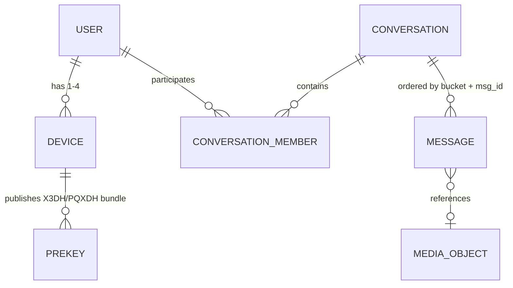
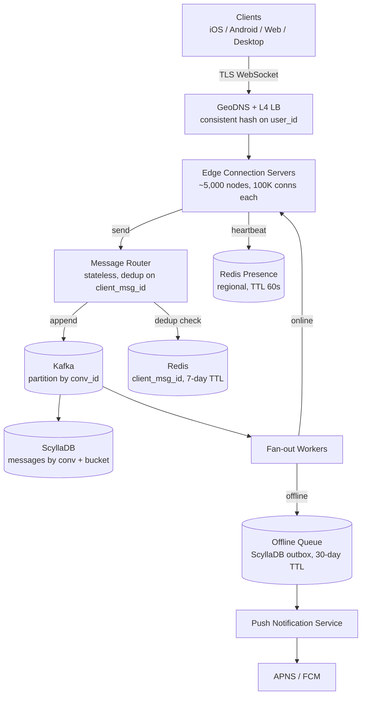
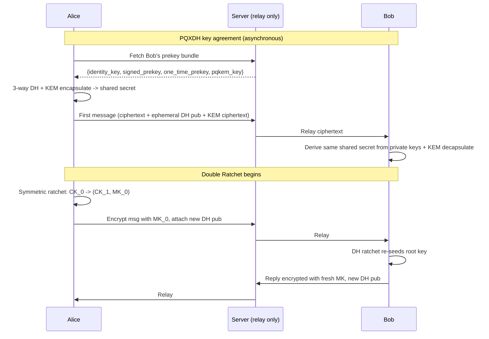
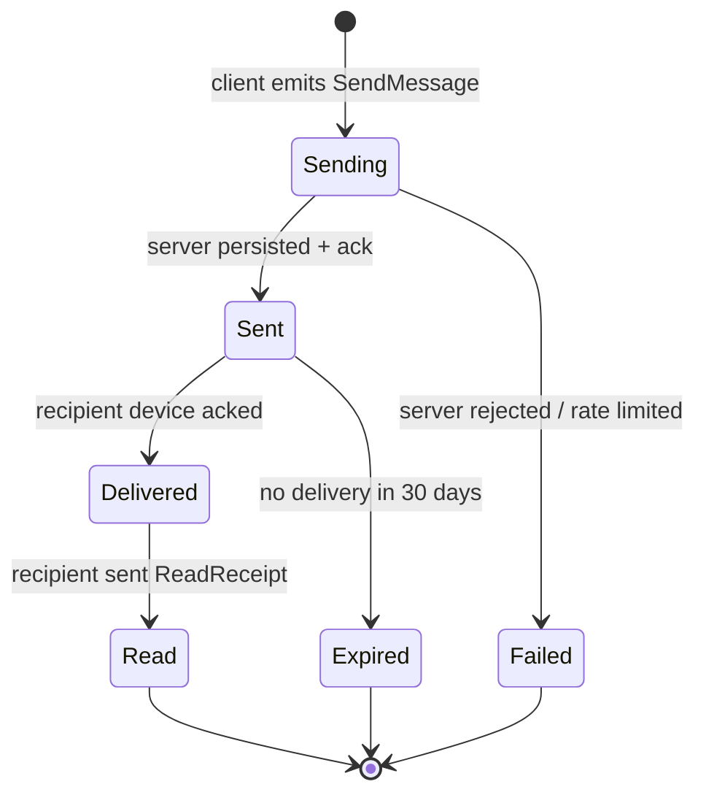
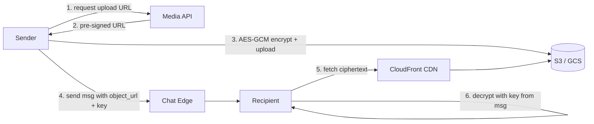

# Design a Chat System (WhatsApp / Messenger / Signal)

> **TL;DR.** A chat system is three loosely coupled problems behind one UI: holding hundreds of millions of persistent connections, ordering and delivering messages per conversation with at-least-once semantics, and encrypting payloads so the server sees only ciphertext. WhatsApp serves 3 billion MAU and over 100 billion messages per day [^1][^2] with roughly 32 engineers at acquisition [^3]. The pivotal trade-off is between pushing work to the server (rich multi-device sync, search, moderation) and pushing work to the client (stronger privacy, smaller server footprint). This chapter covers 1:1 and small-group chat (up to 1,024 members). For channel-scale fan-out (Discord/Slack), see [Design Channel-Scale Chat (Discord / Slack)](./55-channel-scale-chat.md).

## Learning Objectives

- Design a connection tier that holds 500M concurrent WebSocket connections with consistent-hash stickiness
- Implement per-conversation message ordering using Hybrid Logical Clocks and Kafka partitioning
- Apply the Signal Protocol (X3DH/PQXDH + Double Ratchet + Sender Keys) to 1:1 and group encryption
- Justify the choice between store-until-delivered, permanent history, and encrypted relay storage models
- Estimate capacity for peak deliveries per second including group fan-out, not average logical sends
- Trade off privacy, multi-device sync, and server-side features across WhatsApp, Messenger, and Signal architectures

## Intuition

A chat system looks like a trivial CRUD app. Accept a message, store it, deliver it. Handles 10 users fine. At 500 million concurrent connections it collapses, and the reason is not the message processing itself but the connection tier.

Every device must hold an open socket to the server so messages can be pushed without polling. At 500M users polling every 5 seconds, you generate 100M requests/sec of mostly-empty traffic [^4]. WebSocket eliminates this waste, but now you must hold 500M persistent TLS connections simultaneously. That is the first hard problem.

The second hard problem is ordering. Two messages in the same conversation must arrive in the same order for both participants. Global ordering across all conversations would require a single sequencer, an unacceptable bottleneck. Per-conversation ordering is cheap if you partition correctly.

The third hard problem is encryption. Users expect that the server cannot read their messages. The Signal Protocol solves this with forward secrecy and post-compromise security, but it means the server cannot search, moderate, or sync history without additional protocol machinery.

The naive single-server design fails on all three axes simultaneously. The architecture that works is a fleet of edge servers (connections), a stateless router (ordering), and a client-side crypto layer (encryption), each scaling independently.

## Requirements

### Clarifying Questions

- **Q: 1:1 only, or groups?**
  Assume: Both. 1:1 and small groups up to 1,024 members. Channel-scale (10K+) is a separate system.
- **Q: End-to-end encryption required?**
  Assume: Yes, Signal Protocol. Server sees only ciphertext.
- **Q: Multi-device support?**
  Assume: Yes, up to 4 companion devices per account, each with independent identity keys.
- **Q: Message persistence model?**
  Assume: Permanent encrypted server history (Messenger Labyrinth model) for multi-device sync.
- **Q: Media support?**
  Assume: Yes. Images, video, voice notes, documents. Separate pipeline from text.
- **Q: Availability and latency targets?**
  Assume: 99.99% availability, p99 < 100 ms message delivery for online recipients.
- **Q: Geographic distribution?**
  Assume: Global, multi-region active-active with regional edge servers.

### Functional Requirements

- Send and receive text messages in 1:1 and group conversations (up to 1,024 members)
- End-to-end encrypt all message content; server stores only ciphertext
- Deliver messages to all recipient devices with sent/delivered/read status
- Upload and download media (images, video, voice notes) via a separate pipeline
- Show presence (online/offline/last-seen) and typing indicators
- Support view-once media with server-enforced deletion after first read

### Non-Functional Requirements

- **Users:** 3B registered, 500M peak concurrent connections [^1][^2]
- **Load:** 100B messages/day, ~1.2M logical sends/sec average, ~3.6M peak [^1]
- **Latency:** p50 < 30 ms, p99 < 100 ms for online-to-online delivery
- **Availability:** 99.99% on the read/delivery path
- **Consistency:** per-conversation total ordering; eventual for presence
- **Durability:** no message loss after server ack; 30-day offline queue

## Capacity Estimation

| Metric | Value | Derivation |
|--------|------:|------------|
| Messages/day | 100B | WhatsApp reported figure [^1] |
| Average logical sends/sec | 1.16M | 100B / 86,400 |
| Peak sends/sec (3x) | 3.5M | New Year's Eve, World Cup spikes [^5] |
| Peak deliveries/sec | 7M+ | 3.5M x avg 2 recipients (1:1 + small groups) |
| Avg message size | 500 B | text + metadata + E2E overhead |
| Daily storage (text) | 50 TB | 100B x 500 B |
| 5-year storage | ~90 PB | 50 TB x 365 x 5 |
| Media volume/day | ~2.5 PB | images, video, voice at observed ratios |
| Concurrent connections | 500M | peak online devices |
| Edge servers needed | ~5,000 | 500M / 100K connections per node (conservative for generic WebSocket stacks; Erlang/BEAM achieves 1-2M per node [^12]) |

Key ratios:

- **Read:write** is roughly 1:1 for 1:1 chat (each send is one delivery), but group fan-out pushes effective writes to 2-4x logical sends.
- **Presence traffic** exceeds message traffic by ~5x (heartbeats, typing, online/offline events).
- **Media bandwidth:** at 2.5 PB/day, media must bypass chat servers entirely.

## API and Data Model

### API Design

```http
POST /v1/messages
  Body: { "conversation_id": "...", "client_msg_id": "<uuid>",
          "ciphertext": "<base64>", "device_id": "..." }
  Returns: 201 { "message_id": "<snowflake>", "hlc": "..." }
  Idempotent on client_msg_id (dedup window: 7 days)

GET /v1/conversations/{id}/messages?before=<cursor>&limit=50
  Returns: 200 { "messages": [...], "next_cursor": "..." }

POST /v1/messages/{id}/ack
  Body: { "type": "delivered" | "read" }
  Returns: 204

GET /v1/keys/{user_id}/prekey-bundle
  Returns: 200 { "identity_key": "...", "signed_prekey": "...",
                  "one_time_prekey": "...", "pqkem_key": "..." }

POST /v1/media/upload-url
  Body: { "content_type": "image/jpeg", "size_bytes": 2048000 }
  Returns: 200 { "upload_url": "<pre-signed S3>", "object_id": "..." }
```

### Data Model

```sql
-- Messages (ScyllaDB, partitioned for time-bounded reads)
CREATE TABLE messages (
    conversation_id bigint,
    bucket          int,          -- rolling 10-day window
    message_id      bigint,       -- Snowflake, clustering key
    sender_id       bigint,
    ciphertext      blob,
    media_ref       text,         -- nullable, S3 object_id
    created_at      timestamp,
    PRIMARY KEY ((conversation_id, bucket), message_id)
) WITH CLUSTERING ORDER BY (message_id DESC);

-- Conversation members (PostgreSQL, strong consistency)
CREATE TABLE conversation_members (
    conversation_id bigint,
    user_id         bigint,
    joined_at       timestamp,
    role            text,         -- admin | member
    PRIMARY KEY (conversation_id, user_id)
);

-- Prekey bundles (PostgreSQL, per-device)
CREATE TABLE prekeys (
    user_id         bigint,
    device_id       int,
    identity_key    bytea,
    signed_prekey   bytea,
    one_time_prekeys bytea[],     -- consumed on use
    pqkem_key       bytea,        -- PQXDH (ML-KEM/Kyber)
    PRIMARY KEY (user_id, device_id)
);
```



*A user has up to 4 devices; each device publishes prekey bundles; messages belong to bucketed conversation partitions and optionally reference media objects stored in S3.*

## High-Level Architecture



*Clients connect via sticky L4 load balancing to edge servers; messages flow through a stateless router to Kafka, then fan-out workers push to recipient edges or the offline queue for push notification delivery.*

**Write path:** Client sends ciphertext over WebSocket to its sticky edge server. The edge forwards to a stateless router. The router checks Redis for `client_msg_id` dedup, assigns an HLC timestamp, appends to the Kafka partition keyed by `conversation_id`, and returns an ack (single check) to the sender. Kafka consumers persist to ScyllaDB and trigger fan-out.

**Read path:** Fan-out workers look up conversation members (cached at the edge), find each recipient's edge server, and push the message. If the recipient is offline, the message goes to the offline queue (ScyllaDB outbox with 30-day TTL) and a push notification fires via APNS/FCM.

**Presence path:** Edge servers publish heartbeats to regional Redis with 60-second TTL. Typing indicators are ephemeral (5-second TTL, never persisted).

## Deep Dives

### Deep dive 1: End-to-end encryption (Signal Protocol)

The Signal Protocol provides three layers that together give forward secrecy, post-compromise security, and efficient group messaging.

**X3DH (Extended Triple Diffie-Hellman)** enables asynchronous key agreement [^6]. Each user uploads a prekey bundle (identity key, signed prekey, one-time prekeys) to the server. A sender fetches the target's bundle and computes a shared secret via three DH operations (DH1-DH3), plus a fourth DH (DH4) when a one-time prekey is available, without the recipient being online. **PQXDH** (September 2023) replaces X3DH with a hybrid that combines classical DH with a post-quantum KEM (ML-KEM/Kyber), defending against harvest-now-decrypt-later attacks by future quantum computers [^7][^8].

**Double Ratchet** runs after the initial handshake [^9]. A symmetric-key ratchet (KDF chain) derives a fresh message key for every message (forward secrecy: compromising the current key cannot decrypt past messages). A DH ratchet generates a new ephemeral keypair on every round trip and mixes it into the root key (post-compromise security: future messages recover after one exchange even if current keys are stolen).



*PQXDH bootstraps a shared secret asynchronously (combining classical DH with post-quantum KEM); the Double Ratchet then advances forward-only, producing a unique message key per send.*

**Sender Keys for groups** [^10]. Each sender holds a symmetric sender key per group, distributed to all members via pairwise Double Ratchet sessions. A group message is encrypted once with the sender key rather than N times for N recipients. This scales to ~1,024 members but requires key rotation on every membership change, which is one reason WhatsApp historically limited group sizes (256, later 512, before reaching 1,024 with Communities) [^11].

### Deep dive 2: Connection manager sharding and offline delivery

The connection tier is the most expensive component. At 500M concurrent connections and 100K per node, you need ~5,000 edge servers globally [^4][^12].

**Consistent-hash stickiness.** L4 load balancers (Envoy, HAProxy) hash on `user_id` so a reconnecting user lands on the same edge. This lets the edge cache conversation membership and session state, avoiding a Redis roundtrip on every hot message [^4].

**At-least-once delivery.** Exactly-once is impossible in the general asynchronous case [^13]. The server deduplicates incoming sends on `client_msg_id` (UUID) and returns the same `message_id` on retries. Recipients dedup on `message_id` client-side. Three user-visible states are tracked:



*Every message transitions sent (single check), delivered (double gray check), read (double blue check) as acks flow back to the sender over the same socket.*

**Offline store.** When a recipient is offline, fan-out workers write to a per-user outbox (ScyllaDB, partition key = `user_id`, clustering key = `message_id`, 30-day TTL). On reconnect, the client sends `SyncRequest{last_seen_message_id}` per conversation. The server streams batches of 100, newest-first. A push notification fires once (not per message) via APNS/FCM.

**Drain and deploy.** WebSocket stickiness conflicts with rolling deploys. Each deploy drains connections gracefully: the edge stops accepting new connections, sends a `RECONNECT` frame to existing clients with a 30-second jitter window, and clients reconnect to a fresh node. Session state (conversation membership, last-seen cursors) is rebuilt from Redis on reconnect.

### Deep dive 3: Read receipts and typing indicators without amplification

At 256 members, a single read produces 256 "mark X as read by user Y" events. A user typing fires 256 "typing" events. Presence traffic exceeds message traffic by ~5x.

**Batching.** Read receipts are batched per conversation: instead of sending one receipt per message, the client sends "I have read up to message_id X in conversation Y" every 2 seconds. The server fans this out to other members as a single event.

**TTL and drop-on-backpressure.** Typing indicators have a 5-second TTL and are never persisted. If the fan-out pipeline is under pressure, typing events are the first to be dropped. Users see a slightly stale "typing..." indicator; this is acceptable.

**Regional edge caching (Flannel pattern).** Slack's Flannel service [^14][^15] is the canonical solution: a per-region edge cache that subscribes to team-level pub/sub and holds a compact replica of presence state. Each edge server maintains a local presence table; updates propagate via gossip between edges rather than hitting a central Redis cluster.

**Signal's approach.** Signal deliberately minimizes presence: they do not expose "online" or "last seen" to the network at all, and typing indicators use sealed-sender-style metadata protection [^7].

### Deep dive 4: Media pipeline and view-once

At 2.5 PB/day of media, any system that streams media bytes through chat servers saturates its own backbone. The solution is a fully decoupled pipeline:

1. Client requests a pre-signed upload URL from a lightweight REST endpoint
2. Client encrypts the media with AES-256-GCM (key generated locally)
3. Client uploads ciphertext directly to S3/GCS via the pre-signed URL
4. Client sends a chat message containing the object URL and the AES key inside the E2E-encrypted payload
5. Recipients fetch ciphertext from CDN (CloudFront/Fastly), decrypt locally



*Media bytes never touch chat servers; the CDN caches ciphertext, and the decryption key travels inside the E2E-encrypted chat message.*

**View-once media.** The server sets a `view_once` flag on the media object. After the first recipient fetch, the server deletes the S3 object (or marks it for immediate expiry). Client-side guards disable screenshots (not cryptographically enforced, but raises the bar). WhatsApp generates thumbnails client-side before upload to keep the pipeline zero-touch for the server [^10].

**CDN caching of ciphertext.** Because the CDN only ever sees ciphertext, edge caching works normally. Popular media (group photos) benefit from CDN cache hits without compromising privacy. The key is per-message, so even if the CDN is compromised, content remains encrypted.

## Real-World Example

**WhatsApp: 32 engineers, 550 servers, $19 billion.**

WhatsApp's architecture is the reference for small-team, high-density chat. At acquisition in 2014, roughly 32 engineers served 450 million users on ~550 servers [^3][^12]. By 2025, WhatsApp reports 3 billion MAU and over 100 billion messages per day [^1][^2].

The stack is Erlang/BEAM on FreeBSD. Each connection is an Erlang process (~2 KB initial heap), enabling 2 million connections per tuned server [^4][^12]. Rick Reed's 2014 talk reported over 11,000 cores and 70 million Erlang messages per second across the cluster [^12]. The choice of FreeBSD over Linux came from the early team's deeper BSD kernel experience and preference for its SMP networking [^16].

Messages were historically stored only until delivered [^17]. In 2021, WhatsApp shipped multi-device: each companion device (up to 4) connects independently with its own Signal Protocol session, eliminating the phone-as-proxy bottleneck [^18]. In November 2022, they launched Communities and raised the group cap to 1,024 [^11].

The 2023 triple-header of protocol events shows three different production answers to the same questions: Messenger shipped E2E by default in December 2023 using the Labyrinth encrypted storage protocol [^19][^20]; Signal deployed PQXDH in September 2023 [^7][^8]; Discord migrated from 177-node Cassandra to 72-node ScyllaDB, cutting p99 read latency from 40-125 ms to ~15 ms [^21].

The October 4, 2021 outage (6 hours, affecting WhatsApp, Facebook, and Instagram globally) was caused by a BGP misconfiguration that withdrew Meta's authoritative DNS, not a chat-system fault [^22].

## Trade-offs

| Decision | Option A | Option B | Our Pick | Why |
|---|---|---|---|---|
| Transport | WebSocket / HTTP/3 | HTTP long poll | WebSocket | Polling at a 5-second interval across 500M users would generate ~100M mostly-empty requests/sec [^4] |
| Load balancing | L4 consistent hash on user_id | Random per-connection | Consistent hash | Edge caches hot metadata; avoids Redis per-message |
| Storage model | Permanent encrypted history | Store-until-delivered | Permanent | Multi-device sync requires it; moderation benefits |
| Storage engine | ScyllaDB | Cassandra | ScyllaDB | No GC pauses; Discord cut 177 to 72 nodes [^21] |
| Message ordering | HLC per conversation | Global sequencer | HLC | No single bottleneck; human-readable timestamps [^23] |
| Delivery semantics | At-least-once + client dedup | Exactly-once | At-least-once | Exactly-once is impossible; client dedup is trivial [^13] |
| E2E protocol | Signal Protocol (libsignal) | Custom crypto | Signal Protocol | Audited, forward secrecy, post-compromise security [^9] |
| Group encryption | Sender Keys | Per-recipient pairwise | Sender Keys | Scales to ~1,024; one encrypt per message [^10] |
| Presence | Regional edge cache + gossip | Global Redis | Regional | Global Redis becomes a bottleneck at millions of events/sec [^14] |
| Media | Pre-signed URLs + CDN | Through chat servers | Pre-signed URLs | Chat servers never touch 2.5 PB/day of media bytes |

The single biggest meta-decision is the storage model. WhatsApp chose store-until-delivered (maximum privacy, minimum cost). Messenger chose permanent server history (maximum convenience, decade-long E2E retrofit). Signal chose minimal relay (maximum metadata protection). Each is defensible; the choice is a product decision, not a pure engineering one.

## Scaling and Failure Modes

**At 10x load (1T messages/day):** The Kafka cluster becomes the bottleneck. Mitigation: add partitions (one per hot conversation is fine; Kafka handles millions of partitions), add brokers, and shard fan-out workers by conversation hash range.

**At 100x load (10T messages/day):** Edge connection servers saturate. Mitigation: move to HTTP/3 (QUIC) for better connection multiplexing, deploy edge servers in 50+ PoPs, and implement connection coalescing where multiple users on the same network share a single upstream connection.

**At 1000x load:** The architecture shifts to a CDN-first model where edge nodes are the primary message relay, and the central Kafka cluster becomes an async durability layer rather than the real-time path.

**Failure mode: Regional outage.** If an entire region goes down, GeoDNS reroutes clients to the nearest healthy region. Clients reconnect within 30 seconds (jittered). Messages queued in the failed region's Kafka are replayed from cross-region replication (MirrorMaker 2) once the region recovers. RPO: < 1 second for replicated partitions.

**Failure mode: Edge server crash.** Clients detect via missed heartbeat (10-30 seconds), reconnect to a new edge via the load balancer. The offline queue catches messages sent during the reconnection window. No message loss after server ack.

**Failure mode: Kafka partition leader failure.** ISR (in-sync replicas) elect a new leader within seconds. Producers retry with idempotent writes. Consumers resume from committed offsets. Delivery latency spikes briefly but no data loss.

## Common Pitfalls

> [!WARNING]
> **Designing for average rate and forgetting peak + fan-out.** The stated "1.2M msg/sec" average hides a peak closer to 3.5M logical sends/sec and 7M+ deliveries/sec after group fan-out. Size for peak deliveries, not average sends. WhatsApp reports regular 2x peaks on New Year's Eve [^5].

> [!WARNING]
> **Using a global Redis for presence.** Presence updates dominate message traffic at ~5x volume. A single Redis cluster becomes the bottleneck at millions of events/sec. Use regional sharding with edge-local presence tables and gossip, like Slack's Flannel [^14].

> [!WARNING]
> **Putting media bytes through the chat pipeline.** At 2.5 PB/day of media, any system that streams media through chat servers saturates its own backbone. Pre-signed URLs to S3 for upload, CDN for download. The chat message carries only the object URL and the E2E-encrypted key [^10].

> [!CAUTION]
> **Implementing your own E2E crypto.** Every custom protocol has had critical bugs (nonce reuse, key compromise impersonation, metadata leakage). Use the Signal Protocol (implemented in the open-source libsignal library; adopted by WhatsApp, Google Messages RCS, and Signal). Academic analyses continue to find subtle issues even in audited protocols [^24].

> [!WARNING]
> **Naive Cassandra schema without bucketing.** A hot long-lived group conversation becomes a 100+ GB partition. Partition by `(conversation_id, time_bucket)`. Discord's 2023 migration post calls this the single biggest Cassandra pain point [^21][^25].

> [!WARNING]
> **Attempting exactly-once delivery.** Teams that try end up with subtle duplication or message loss bugs under network partitions. At-least-once on the server, dedup on the client by `message_id`. The two-generals problem makes exactly-once impossible in the general case [^13].

## Follow-up Questions

**1. How do you handle multi-device sync when a new device is added?**

Each new device generates its own identity keypair and registers it with the server. Existing devices are notified and establish pairwise Double Ratchet sessions with the new device. For message history, the Labyrinth protocol encrypts server-stored history with a key tree rooted in a user PIN; the new device reconstructs the key tree by knowing the PIN [^19]. Without the PIN, only messages sent after device registration are visible.

**2. How would you support RCS/iMessage interop under EU DMA requirements?**

Expose a gateway API that translates between Signal Protocol ciphertext and the interop partner's encryption format. The gateway holds no plaintext; it re-encrypts at the protocol boundary. Key challenge: the interop partner may not support forward secrecy, degrading the security guarantee for cross-platform messages. Display a clear UI indicator when a conversation is in "interop mode."

**3. What changes for PQXDH rollout to 3B users?**

Signal's hybrid approach [^7][^8] adds a post-quantum KEM key to the prekey bundle alongside classical DH keys. Clients that support PQXDH use both; legacy clients fall back to classical X3DH. The server stores both key types. Rollout is gradual: new prekey bundles include the KEM key; old bundles are consumed until replaced. No flag day required.

**4. How do disappearing messages work with E2E encryption?**

The sender sets a TTL in the message metadata (inside the ciphertext). The recipient's client enforces deletion after the TTL expires. The server cannot enforce this because it cannot read the metadata. This is a cooperative protocol: a malicious client can ignore the TTL. The server can enforce deletion of the ciphertext blob after a maximum TTL (e.g., 90 days) as a backstop.

**5. How would you add voice/video calls to this architecture?**

Calls use a separate real-time media path (WebRTC with SRTP). The chat system's signaling channel (the existing WebSocket) carries call setup messages (offer/answer/ICE candidates). Media flows peer-to-peer when possible, or through TURN relays. The Signal Protocol session negotiates the SRTP master key, so call audio is E2E encrypted using the same trust model as messages.

**6. What is sealed sender and why does Signal use it?**

Sealed sender [^26] hides the sender's identity from the server. The sender encrypts the message envelope (including their own identity) with the recipient's identity key. The server routes based on the recipient address but cannot see who sent the message. This prevents the server from building a social graph from message metadata. Trade-off: abuse detection becomes harder because the server cannot attribute spam to a sender without recipient cooperation.

**7. How do group video calls scale to 32 participants?**

Beyond 3-4 participants, peer-to-peer mesh becomes impractical (N^2 streams). Use a Selective Forwarding Unit (SFU) that receives each participant's stream once and forwards it to all others. The SFU sees encrypted media (SRTP); it selects which streams to forward based on audio activity (dominant speaker) without decrypting. WhatsApp Communities support up to 32 participants in video calls [^11].

## Exercise

### Exercise 1: Offline queue sizing

You are designing the offline message queue for 500M DAU. A user's devices may be offline for up to 30 days. Design the queue: what store backs it, how do you bound its size, and what happens when a user reconnects after 2 weeks with 50,000 queued messages?

<details>
<summary>Hint</summary>

Think about the difference between "messages the user has never seen" and "messages the user can fetch from history." The queue does not need to hold everything; it needs to hold enough to bootstrap the reconnection. Consider a two-tier approach with different TTLs.

</details>

<details>
<summary>Solution</summary>

Use a two-tier approach:

1. **Hot queue (Redis list per user, bounded at 1,000 messages).** For users expected to reconnect within minutes. `LPUSH` on arrival, `RPOP` on delivery. If the list exceeds 1,000 entries, trim the oldest and mark the user as "needs full sync."

2. **Cold storage (ScyllaDB outbox table, partition key = user_id, clustering key = message_id, 30-day TTL).** For users offline longer than 5 minutes. On reconnect, the client sends `SyncRequest{last_seen_message_id}` per conversation.

3. **Reconnection flow for 50,000 queued messages:** Client connects, sends last-seen cursors per conversation. Server streams messages in batches of 100, newest-first per conversation. Client renders progressively. A push notification fires only once, not 50,000 times. Per-connection send buffer is bounded at 1 MB; if the client cannot keep up, the server pauses and the client fetches on demand.

4. **After 30 days:** messages expire from the outbox. The client fetches from permanent history (ScyllaDB messages table) on explicit scroll.

Trade-off accepted: users offline for 30+ days lose push-style delivery for old messages but can still browse history.

</details>

## Key Takeaways

- **Connection tier dominates cost.** Holding 500M persistent connections requires ~5,000 edge servers; this is the single most expensive component, not message processing.
- **Per-conversation ordering is sufficient.** Kafka partitioning by `conversation_id` + HLC gives total ordering within a conversation without a global sequencer bottleneck.
- **At-least-once is the only correct contract.** Exactly-once delivery is impossible in the general case; client-side dedup on `message_id` is trivial and correct.
- **Storage model is a product decision.** WhatsApp (ephemeral), Signal (minimal relay), and Messenger (permanent encrypted) each justify their choice differently.
- **Use libsignal, not custom crypto.** The Signal Protocol (X3DH/PQXDH + Double Ratchet + Sender Keys) is the gold standard; rolling your own will have bugs.
- **Presence is a firehose.** At 5x message volume, presence needs its own regional system with aggressive TTLs and willingness to drop on backpressure.
- **Media must bypass chat servers.** At 2.5 PB/day, pre-signed URLs + CDN is the only affordable design.

## Further Reading

- [The WhatsApp Architecture Facebook Bought For $19 Billion](https://highscalability.com/the-whatsapp-architecture-facebook-bought-for-19-billion/). Contains the canonical "2M connections per Erlang/FreeBSD server" detail from Rick Reed's 2012/2014 talks; the single most cited number in chat-system design.
- [How Discord Stores Trillions of Messages](https://discord.com/blog/how-discord-stores-trillions-of-messages). The 177-node Cassandra to 72-node ScyllaDB migration with p99 improvements and the 3.2M msg/sec Rust migrator.
- [The Double Ratchet Algorithm](https://signal.org/docs/specifications/doubleratchet/). Signal's official specification; readable, precise, and the foundation of every modern E2E chat protocol.
- [Quantum Resistance and the Signal Protocol (PQXDH)](https://signal.org/blog/pqxdh/). Signal's September 2023 post-quantum upgrade combining classical DH with ML-KEM/Kyber; the first major messenger to ship post-quantum protection.
- [How WhatsApp enables multi-device capability](https://engineering.fb.com/2021/07/14/security/whatsapp-multi-device/). The 2021 rewrite from phone-as-proxy to peer-device architecture; explains the per-device identity key model.
- [Building end-to-end security for Messenger](https://engineering.fb.com/2023/12/06/security/building-end-to-end-security-for-messenger/). Meta's 2023 E2E-by-default launch including the Labyrinth encrypted storage protocol for multi-device history sync.
- [Flannel: An Application-Level Edge Cache to Make Slack Scale](https://slack.engineering/flannel-an-application-level-edge-cache/). The edge cache that absorbs presence and team-state traffic; the canonical pattern for solving the "presence firehose" problem.
- [How Discord Stores Billions of Messages](https://discord.com/blog/how-discord-stores-billions-of-messages). The 2017 predecessor post with the original Cassandra schema and bucket strategy that Discord carried forward to ScyllaDB.

## Flashcards

<details>
<summary><strong>Q: Why do chat systems use WebSocket instead of HTTP polling?</strong></summary>

A: Polling at 500M users with 5-second intervals generates 100M requests/sec of mostly-empty traffic. WebSocket holds one persistent TLS connection per device and sends bytes only when needed, eliminating wasted round trips.

</details>

<details>
<summary><strong>Q: What connection density did WhatsApp achieve per server, and what enabled it?</strong></summary>

A: 2 million TCP connections per Erlang/FreeBSD server (2012). Enabled by BEAM's lightweight process model (~2 KB per process), custom VM patches, and FreeBSD kernel tuning for file descriptors and TCP memory.

</details>

<details>
<summary><strong>Q: Why is exactly-once delivery not a practical goal for chat?</strong></summary>

A: The two-generals problem makes exactly-once impossible in the general asynchronous case. Production systems use at-least-once delivery plus client-side deduplication on a server-assigned message_id.

</details>

<details>
<summary><strong>Q: What does the Signal Double Ratchet provide that a static shared key does not?</strong></summary>

A: Forward secrecy (past messages stay encrypted if current keys are stolen) via a per-message symmetric ratchet, and post-compromise security (future messages recover after a DH exchange) via a DH ratchet that re-seeds the root key on every round trip.

</details>

<details>
<summary><strong>Q: What is PQXDH and why did Signal deploy it in 2023?</strong></summary>

A: PQXDH is a hybrid key agreement that combines classical Diffie-Hellman with a post-quantum KEM (ML-KEM/Kyber). It defends against harvest-now-decrypt-later attacks where an adversary records ciphertext today and decrypts it with a future quantum computer.

</details>

<details>
<summary><strong>Q: Why do WhatsApp and Signal cap group size at 256 to 1,024 members?</strong></summary>

A: Sender Keys require re-distribution to all members on every membership change. At 256 members this is tolerable; beyond ~1,024 the key-distribution overhead and per-device fan-out become impractical for real-time interactive chat.

</details>

<details>
<summary><strong>Q: How does the media pipeline avoid saturating chat servers?</strong></summary>

A: Clients encrypt media locally, upload ciphertext directly to S3 via pre-signed URLs, and send only the object URL + AES key inside the E2E-encrypted chat message. Recipients fetch from CDN. Chat servers never touch media bytes.

</details>

<details>
<summary><strong>Q: What is the "presence firehose" problem and how is it solved?</strong></summary>

A: Presence events (online/offline/typing/last-seen) exceed message traffic by ~5x. A user typing in a 256-member group fires 256 events. Solution: regional edge caches (Slack's Flannel pattern), aggressive TTLs, batching, and willingness to drop on backpressure.

</details>

<details>
<summary><strong>Q: Why does Discord partition messages by (channel_id, bucket) instead of just channel_id?</strong></summary>

A: Without bucketing, a long-lived active channel becomes a 100+ GB partition that destroys read performance and causes endless compaction. A rolling time bucket (~10 days) caps partition size and keeps reads fast.

</details>

<details>
<summary><strong>Q: What is sealed sender in Signal?</strong></summary>

A: The sender encrypts the message envelope (including their own identity) with the recipient's identity key. The server routes based on recipient address but cannot see who sent the message, preventing the server from building a social graph from metadata.

</details>

## References

[^1]: Backlinko, "How Many People Use WhatsApp?", 2024. https://www.backlinko.com/whatsapp-users
[^2]: Statista, "WhatsApp: number of monthly active users 2025". https://www.statista.com/statistics/260819/number-of-monthly-active-whatsapp-users/
[^3]: Rick Reed, "Scaling to Millions of Simultaneous Connections", Erlang Factory SF Bay 2012. https://www.erlang-factory.com/conference/SFBay2012/speakers/RickReed
[^4]: HighScalability, "The WhatsApp Architecture Facebook Bought For $19 Billion", 2014. https://highscalability.com/the-whatsapp-architecture-facebook-bought-for-19-billion/
[^5]: Demandsage, "Latest WhatsApp Statistics 2026". https://www.demandsage.com/whatsapp-statistics/
[^6]: Signal Specifications, "The X3DH Key Agreement Protocol". https://signal.org/docs/specifications/x3dh/
[^7]: Signal Blog, "Quantum Resistance and the Signal Protocol", Sept 19, 2023. https://signal.org/blog/pqxdh/
[^8]: Signal Specifications, "The PQXDH Key Agreement Protocol". https://signal.org/docs/specifications/pqxdh/
[^9]: Signal Specifications, "The Double Ratchet Algorithm". https://signal.org/docs/specifications/doubleratchet/
[^10]: WhatsApp, "WhatsApp Encryption Overview" (Signal Protocol applied to groups and multi-device). https://faq.whatsapp.com/820124435853543
[^11]: TechCrunch, "WhatsApp officially launches its new discussion group feature, Communities", Nov 3, 2022. https://techcrunch.com/2022/11/03/whatsapp-officially-launches-its-new-discussion-group-feature-communities/
[^12]: HighScalability, "How WhatsApp Grew to Nearly 500 Million Users, 11,000 cores, and 70 Million Messages a Second", 2014. https://highscalability.com/how-whatsapp-grew-to-nearly-500-million-users-11000-cores-an/
[^13]: Kleppmann, "Designing Data-Intensive Applications", Ch. 11 (Stream Processing), at-least-once and idempotence. https://dataintensive.net
[^14]: Slack Engineering, "Flannel: An Application-Level Edge Cache to Make Slack Scale", 2017. https://slack.engineering/flannel-an-application-level-edge-cache/
[^15]: Slack Engineering, "Real-time messaging", 2023. https://slack.engineering/real-time-messaging/
[^16]: Rick Reed, "WhatsApp: Half a billion unsuspecting FreeBSD users", MeetBSD California 2014. https://archive.org/details/bsdtalk250
[^17]: WhatsApp FAQ, "About end-to-end encryption", historical store-until-delivered model. https://faq.whatsapp.com/820124435853543
[^18]: Meta Engineering, "How WhatsApp enables multi-device capability", July 14, 2021. https://engineering.fb.com/2021/07/14/security/whatsapp-multi-device/
[^19]: Meta Engineering, "Building end-to-end security for Messenger", Dec 6, 2023. https://engineering.fb.com/2023/12/06/security/building-end-to-end-security-for-messenger/
[^20]: Meta Newsroom, "Launching Default End-to-End Encryption on Messenger", Dec 6, 2023. https://about.fb.com/news/2023/12/default-end-to-end-encryption-on-messenger/
[^21]: Discord Engineering, "How Discord Stores Trillions of Messages", 2023. https://discord.com/blog/how-discord-stores-trillions-of-messages
[^22]: Cloudflare Blog, "Understanding How Facebook Disappeared from the Internet", Oct 4, 2021. https://blog.cloudflare.com/october-2021-facebook-outage/
[^23]: Kulkarni et al., "Logical Physical Clocks and Consistent Snapshots in Globally Distributed Databases", 2014. https://cse.buffalo.edu/tech-reports/2014-04.pdf
[^24]: Fiedler and Gunther, "Security Analysis of Signal's PQXDH Handshake", IACR ePrint 2024/702 (PKC 2025). https://eprint.iacr.org/2024/702
[^25]: Discord Engineering, "How Discord Stores Billions of Messages", 2017. https://discord.com/blog/how-discord-stores-billions-of-messages
[^26]: Signal Blog, "Technology preview: Sealed sender for Signal", 2018. https://signal.org/blog/sealed-sender/
