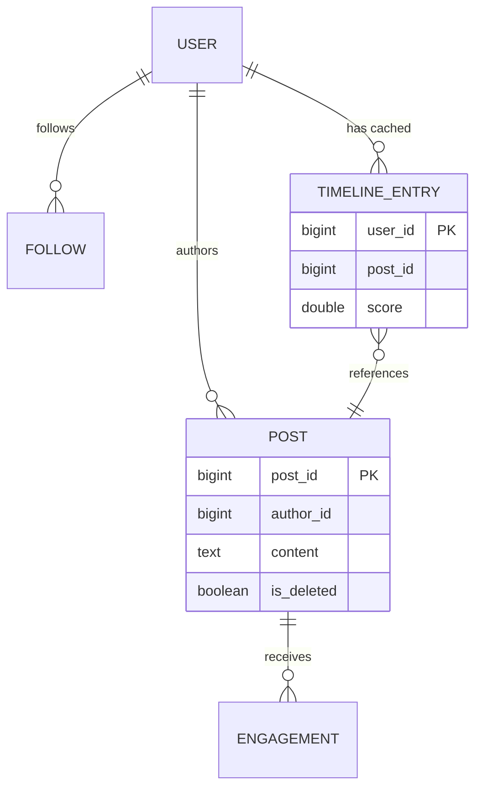
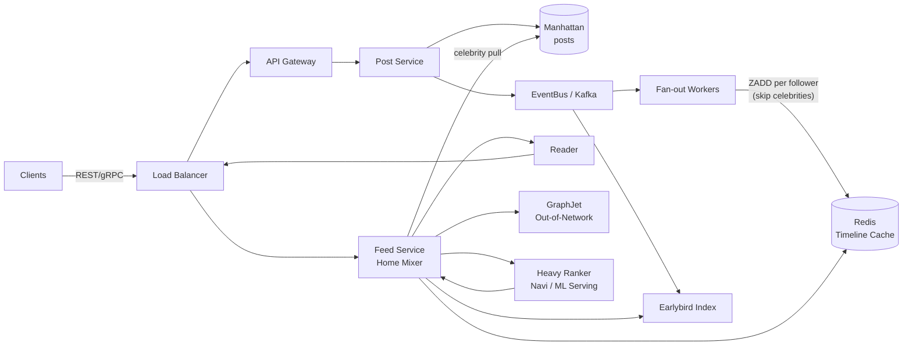
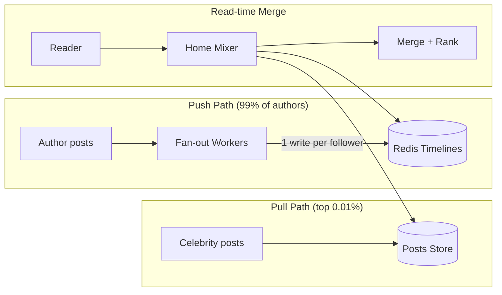
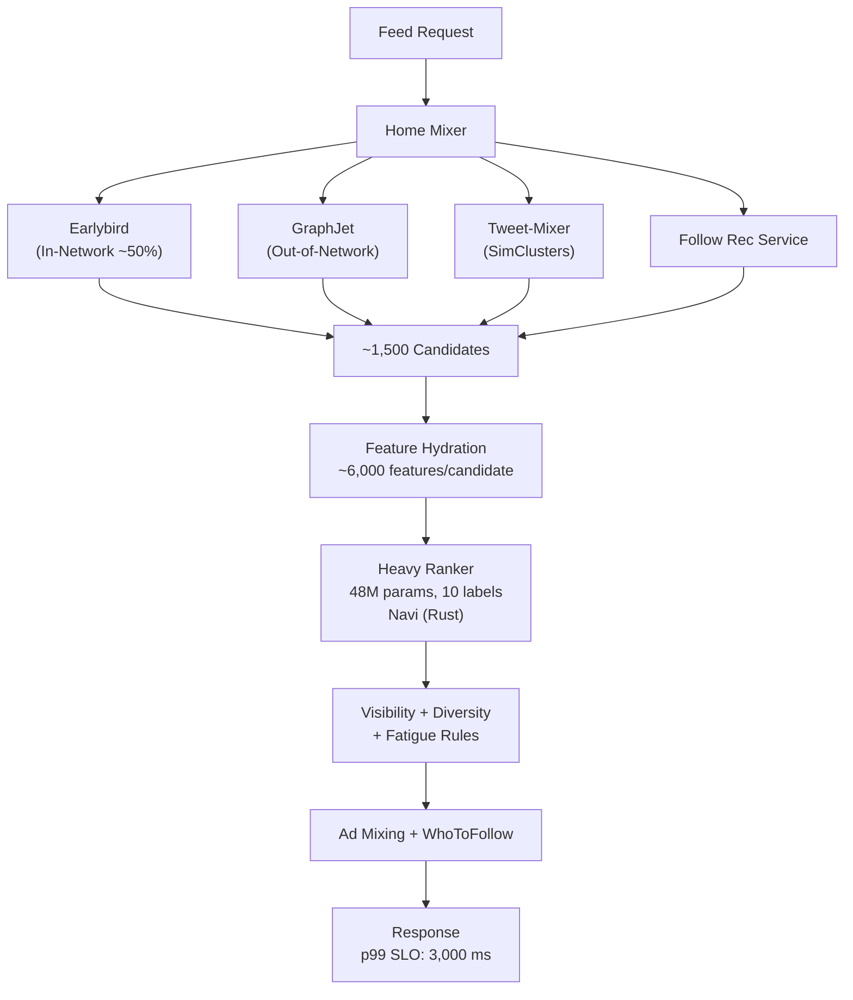
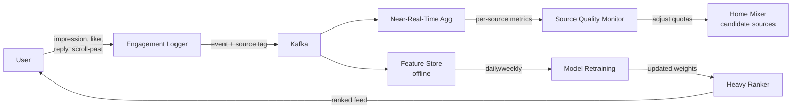

# Design a Social Media Feed (Twitter / Instagram / LinkedIn)

> **TL;DR.** A home feed is the read-heavy problem of record: Twitter reported 300,000 timeline-read QPS against only 6,000 tweet-write QPS in 2013, a 50:1 asymmetry [^1]. Pure fan-out-on-write collapses when one account has 100M+ followers; pure fan-out-on-read collapses at millions of feed reads per second. The industry answer is a hybrid: push for regular authors, pull for celebrities, merge at read time, then score with a multi-task neural ranker. Twitter ran this hybrid for a decade before retiring the Fanout Service in 2023 in favor of Earlybird-backed candidate sourcing inside Home Mixer [^2]. The pivotal trade-off: write amplification versus read latency, mediated by the power-law follower distribution.

## Learning Objectives

- Design a hybrid fan-out system that handles 500M+ DAU with sub-second feed loads
- Identify when push, pull, or hybrid fan-out is appropriate given a follower distribution
- Estimate write amplification for a heavy-tailed social graph and derive the celebrity threshold
- Justify a two-phase ranking pipeline (candidate generation + heavy ranker) over brute-force scoring
- Trade off eventual consistency against feed freshness in a multi-region deployment
- Compare graph-primary feeds (Twitter) with recommendation-first feeds (TikTok) and algorithm-marketplace feeds (Bluesky)

## Intuition

Imagine you run a newspaper with 500 million subscribers. Every morning, 50,000 journalists file stories. For most journalists, you print their story and physically deliver a copy to each of their 300 subscribers. That is fan-out-on-write: expensive at delivery time, but every subscriber's mailbox is pre-filled when they wake up.

Now imagine one journalist has 100 million subscribers. Printing and delivering 100 million copies of a single story takes hours. Meanwhile, the other 49,999 journalists' stories pile up behind it in the printing queue. Subscribers of normal journalists get their papers late because one celebrity clogged the press.

The fix: do not deliver the celebrity's story at all. Instead, post it on a bulletin board in the town square. When subscribers open their mailbox, they find their pre-delivered normal stories plus a note: "Check the bulletin board for today's celebrity stories." The bulletin board is tiny (one copy of each celebrity story), read by everyone, and cached at every street corner.

That is the hybrid fan-out model. Push for the 99% of authors whose follower counts are manageable. Pull for the 1% whose follower counts would melt the delivery system. Merge at read time. Then sort the combined pile by relevance using a machine-learned ranker, because chronological order stopped being the right answer around 2011 when Facebook retired EdgeRank in favor of ML [^3].

The naive approach (one database, one server) handles 10 users fine. At 500 million DAU with a power-law follower distribution, three forces collide: write amplification from celebrities, read amplification from pull, and ranking latency from scoring thousands of candidates per request. Every architectural decision in this chapter resolves one of these three pressures.

## Requirements

### Clarifying Questions

- **Q: What is the follower distribution shape?**
  Assume: Power-law. Median user has ~300 followers; top 0.01% have 50M-237M+ (Elon Musk holds the record at ~237M as of 2026) [^24][^25].
- **Q: Chronological or ranked feed?**
  Assume: ML-ranked primary tab (For You), chronological secondary tab (Following).
- **Q: Multi-region?**
  Assume: Yes, active-active across 3+ regions. Eventual consistency acceptable for feed reads.
- **Q: Real-time or near-real-time?**
  Assume: Posts appear in followers' feeds within 5 seconds for push-eligible authors; within 30 seconds for celebrity pull at next feed refresh.
- **Q: What content types?**
  Assume: Text, images, video links, reposts/retweets. Media blobs served via CDN, not inline in the feed payload.
- **Q: Feed personalization scope?**
  Assume: Both in-network (accounts you follow) and out-of-network (recommended content from accounts you do not follow).

### Functional Requirements

- Post creation: text + media references, distributed ID generation, persisted durably
- Home feed: ranked list of ~50 posts per page, cursor-based pagination, mix of in-network and out-of-network content
- Following feed: reverse-chronological posts from followed accounts only
- Engagement actions: like, reply, repost, bookmark (used as ranking signals)
- Real-time delivery: new posts from followed accounts appear without manual refresh

### Non-Functional Requirements

- **Load:** 500M DAU, 100K posts/sec write, 5M feed reads/sec peak
- **Latency:** Feed load p50 < 200 ms, p99 < 500 ms (Following tab); ranked feed p99 < 3,000 ms [^4]
- **Availability:** 99.99% read path, 99.9% write path
- **Consistency:** Eventual for feed reads; per-user read-your-writes for own posts via sticky routing
- **Durability:** No post loss; 11-nines storage durability

## Capacity Estimation

| Metric | Value | Derivation |
|--------|------:|------------|
| Write QPS (posts) | 100K | 500M DAU *avg 2 posts/day / 86,400* 10x peak |
| Fan-out writes/sec (push) | 30M | 100K posts * avg 300 followers (non-celebrity) |
| Feed read QPS | 5M | 500M DAU *50 opens/day / 86,400* 17x peak |
| Read:write ratio | 50:1 | 5M reads / 100K writes [^1] |
| Timeline cache per user | 24 KB | 800 entries * 30 bytes (tweet ID + metadata) |
| Total timeline cache | 6 TB | 200M active users * 30 KB (with overhead) |
| Post storage/year | 15 TB | 100K/sec *86,400* 365 * 500 B avg |
| Ranking compute/day | ~5B runs | One Heavy Ranker call per feed load [^2] |

Key ratios: the 50:1 read:write asymmetry means optimizing the read path dominates. The 6 TB timeline cache fits in a Redis cluster of ~200 nodes (32 GB each with replication). Celebrity fan-out (accounts with 50M+ followers) would add 500M+ writes/sec from just 10 posts, which is why the hybrid skips them.

## API and Data Model

### API Design

```http
POST /v1/posts
  Idempotency-Key: <uuid>
  Body: { "text": "...", "media_ids": [...] }
  Returns: 201 { "id": "1780234567890001", "created_at": "..." }

GET /v1/feed/for-you?cursor=<snowflake_id>&limit=50
  Returns: 200 { "posts": [...], "next_cursor": "1780234567889500" }

GET /v1/feed/following?cursor=<snowflake_id>&limit=50
  Returns: 200 { "posts": [...], "next_cursor": "..." }

POST /v1/posts/{id}/like
  Returns: 200 { "liked": true, "like_count": 4521 }

GET /v1/users/{id}/posts?cursor=...&limit=20
  Returns: 200 { "posts": [...], "next_cursor": "..." }
```

Cursor-based pagination uses Snowflake IDs [^5][^6][^29]: 41 bits millisecond timestamp (epoch 2010-11-04), 10 bits machine ID, 12 bits sequence. Time-sortable, 64-bit (half the size of UUIDs), 4M IDs/sec per machine without coordination. Cursors are opaque to clients but internally are the last-seen Snowflake ID.

### Data Model

```sql
-- Posts (Manhattan / wide-column store, partitioned by post_id)
table posts (
  post_id       bigint primary key,   -- Snowflake ID
  author_id     bigint,
  text          text,
  media_ids     list<uuid>,
  created_at    timestamp,            -- derived from Snowflake
  is_deleted    boolean default false  -- soft-delete
)

-- Timeline cache (Redis sorted set per active user)
-- Key: timeline:{user_id}
-- Members: post_id (score = Snowflake timestamp bits)
-- Cap: 800 entries, evict oldest on overflow

-- Social graph (sharded by follower_id for fan-out reads)
table follows (
  follower_id   bigint,
  followee_id   bigint,
  created_at    timestamp,
  primary key (follower_id, followee_id)
)
-- Reverse index: followee_id -> [follower_ids] for fan-out writes
```



*Core entities: users author posts, the social graph drives fan-out, and timeline entries are the precomputed cache that makes reads O(1).*

## High-Level Architecture



*Write path: posts persist to Manhattan and emit to Kafka; fan-out workers push into Redis timelines (skipping celebrities). Read path: Home Mixer pulls from the timeline cache, Earlybird index, and GraphJet, then scores via the Heavy Ranker.*

The write path is fire-and-forget from the author's perspective: the Post Service persists to Manhattan, emits to Kafka, and returns. Fan-out workers consume the event, look up the author's follower list, check the celebrity threshold, and pipeline `ZADD` commands into each follower's Redis sorted set. Only active users (login within 30 days) receive fan-out writes [^1].

The read path for the For You tab is orchestrated by Home Mixer: it fetches the precomputed timeline from Redis, pulls celebrity posts from Manhattan, retrieves out-of-network candidates from GraphJet and Earlybird, hydrates features (~6,000 per candidate), scores via the Heavy Ranker, applies visibility filtering and diversity rules, mixes in ads, and returns ~50 posts. Total pipeline p99: 3,000 ms [^4].

The Following tab is simpler: fetch the Redis timeline, hydrate post bodies, filter deleted posts, return in reverse-chronological order. p99: ~100 ms [^1].

## Deep Dives

### Deep dive 1: Fan-out strategy (push vs pull vs hybrid)

The fan-out decision is the single most important architectural choice in a feed system. It determines write amplification, read latency, storage cost, and operational complexity.

**Push (fan-out-on-write):** On each post, write one timeline entry per follower. Twitter capped timelines at 800 entries per active user in Redis sorted sets [^1]. Read path is O(1): one cache fetch, p50 5 ms. Failure mode: one post from a 100M-follower account generates 100M writes. At 5 posts/day from 100 such accounts, that is 50 billion writes/day from 0.0002% of authors.

**Pull (fan-out-on-read):** On each feed read, query every followed account's recent posts. Write cost is zero. Failure mode: a user following 10,000 accounts issues 10,000 queries per feed load. At 5M feed reads/sec, downstream sees 50B QPS. Infeasible.

**Hybrid (what Twitter ran for a decade):** Push for authors below a follower threshold (estimated low millions). Pull for authors above. Merge at read time. Krikorian 2013: "For people like Taylor Swift don't bother with fanout anymore, instead merge in her timeline at read time" [^1][^7]. Celebrity posts have extreme cache locality (everyone reads the same few posts), so the pull side is cheap.



*Push materializes timelines for regular authors; celebrities skip fan-out entirely and are pulled at read time, exploiting cache locality.*

The threshold is a product decision. Too low: too many pull-side queries at read time. Too high: fan-out storms from semi-popular accounts. Twitter never published the exact number, but the architecture implies it sits where the marginal cost of one more fan-out write exceeds the amortized cost of one more read-time pull across all that author's followers' feed loads.

### Deep dive 2: ML ranking pipeline

A modern feed is not chronological. Twitter's For You pipeline (open-sourced March 2023) pulls ~1,500 candidates per request from four sources [^2]:

1. **Earlybird In-Network (feeds ~50% of final timeline):** Lucene-based real-time search index of followed accounts' recent posts
2. **UTEG / GraphJet (Out-of-Network):** Graph-based collaborative filtering ("users similar to you engaged with this")
3. **Tweet-Mixer (Out-of-Network):** Content-based retrieval via SimClusters (145,000 communities, refreshed every 3 weeks) [^2]
4. **Follow-Recommendation Service:** Suggested accounts' top posts

The Heavy Ranker is a ~48M-parameter neural network producing 10 engagement-probability outputs per candidate (like, reply, retweet, profile click, video watch, etc.) [^2][^8]. It runs ~5B times/day, consuming ~220 CPU-seconds per execution [^2]. The two-tower (dual-encoder) pattern handles candidate retrieval: one tower encodes the user, the other encodes the item, and approximate nearest neighbor search (FAISS/ScaNN) retrieves top-K in under 10 ms across 100M-item catalogs [^9][^10].



*Home Mixer pulls ~1,500 candidates from four sources, hydrates 6,000 features each, scores via the 48M-param Heavy Ranker, and returns under a 3-second p99 SLO.*

The production SLOs from the open-sourced `ForYouProductPipelineConfig.scala`: p99 warn at 2,800 ms, critical at 3,000 ms; success-rate warn below 99.9%; throughput warn at 70,000 QPS, critical at 80,000 QPS [^4]. A "Twitter p99" in a system-design discussion should mean 3,000 ms for the For You pipeline, not the 5 ms figure (which was p50 for the older 2013 Timeline Service).

### Deep dive 3: Read path, timeline cache, and cold-user warm-up

The read path for the Following tab is deceptively simple: `ZREVRANGE timeline:{user_id} 0 49` returns the 50 most recent post IDs in ~5 ms [^1]. Post bodies are hydrated via a multiget to the posts store (Manhattan/Tweetypie). Deleted posts are filtered at assembly time (soft-delete + filter-on-read).

**Cold users** (no login in 30+ days) have empty timeline caches because fan-out workers skip them [^1]. On return, the system must warm up their timeline:

1. Fetch the user's follow list
2. Query each followed account's recent posts (bounded to last 7 days)
3. Merge, rank, populate the cache
4. Serve the first feed load from this freshly-built timeline

This is effectively a one-time pull for cold users. Latency is higher (1-3 seconds) but acceptable because it happens once per reactivation. The 30-day active window saves enormous fan-out cost: if 40% of registered users are dormant, you eliminate 40% of all fan-out writes.

**Hot-key mitigation:** A viral celebrity post receives 1M+ QPS to one Redis shard. Mitigations: shadow-replicate hot keys across multiple shards, CDN-edge cache the post body, and maintain an in-process LRU for the top-N hot posts in the feed service. Twitter's cache tier aggregated 320M packets/sec and over 120 GB/s across hundreds of clusters [^11].

### Deep dive 4: Engagement logging for ranker retraining

The Heavy Ranker is only as good as its training data. Every user action (impression, like, reply, repost, dwell time, scroll-past, hide, report) must flow back to the training pipeline with the candidate source attribution intact.

**Candidate source feedback:** Each served post carries metadata identifying which source nominated it (Earlybird, GraphJet, Tweet-Mixer, FRS). When the user engages (or does not), the feedback event includes this source tag. This enables per-source quality metrics: if GraphJet's candidates consistently get lower engagement than Earlybird's, the system can reduce GraphJet's candidate quota.

**Logging pipeline:** Engagement events flow through Kafka to a feature store (offline) and a near-real-time aggregation layer. Offline retraining runs daily/weekly on the full engagement corpus. TikTok's Monolith framework goes further: online training with collisionless embeddings updates the model in near-real-time as users swipe, achieving sub-minute feedback loops [^12][^13]. Twitter's SimClusters refresh every 3 weeks [^2], a much slower cadence that trades freshness for stability.



*Engagement events carry candidate-source attribution back through Kafka to both real-time quality monitoring and offline retraining, closing the feedback loop.*

**Feedback loops and filter bubbles:** If the ranker only sees engagement on content it already ranked highly, it converges on a narrow content distribution. Instagram's Constrained Exploration system [^14] injects content from outside the strict follow graph with bounded relevance-regression risk, ensuring the ranker explores new content types without tanking engagement metrics.

## Real-World Example

**Twitter/X: From Fanout Service to Home Mixer (2013-2023)**

Twitter's timeline architecture is the most publicly documented feed system in existence. In 2013, the system absorbed 300,000 timeline-read QPS against 6,000 tweet-write QPS [^1]. The Fanout Service pushed tweet IDs into Redis-Haplo timelines for active users, capping each at 800 entries. Celebrity accounts skipped fan-out; their posts were pulled at read time and merged.

This hybrid ran for a decade. Then in March 2023, Twitter open-sourced the-algorithm and revealed the retirement of the Fanout Service [^2]. The replacement: Earlybird (a Lucene-based search index) now supplies In-Network candidates at read time, eliminating the push path entirely for the For You tab. Home Mixer orchestrates the full pipeline: candidate sourcing from four services, feature hydration, scoring via the Heavy Ranker served through Navi (a Rust ML serving framework), visibility filtering, author diversity, and ad mixing [^8].

The Castle in the Sky incident (2013-08-03) validated the JVM/Finagle rewrite: 143,199 TPS absorbed with no outage, about 25x the steady state of 5,700 TPS [^15]. The 2010 World Cup had caused repeated brief outages on the old Rails stack. The lesson: the hybrid fan-out decision is necessary but not sufficient. You also need a runtime that absorbs 25x spikes without falling over.

Manhattan replaced Cassandra in 2014 as Twitter's multi-tenant eventually-consistent KV store, now serving "all core nouns at Twitter including Tweets, Users, and Direct Messages" [^16]. The cache tier aggregated 320M packets/sec and over 120 GB/s across hundreds of clusters as of 2017 [^11].

**Contrast: TikTok's Monolith (rec-first).** TikTok inverts the model. The follow graph is a weak signal; candidates come from content-signal embeddings and short-horizon engagement. Online learning with collisionless hash-based embeddings means the model adapts in minutes, not weeks [^12]. Structurally different from Twitter: nightly retrain becomes continuous online training; graph-primary becomes rec-first.

**Contrast: Bluesky's feed generators (algorithm-as-marketplace).** The AT Protocol inverts feed ownership: custom feed generators consume the firehose (300-700 events/sec [^17]), emit ranked URI lists, and users subscribe to them like playlists [^18][^19]. The algorithm is not owned by the platform. Bluesky grew from 25.94M users at the start of 2025 to 41.41M by year-end, with 1.41B posts in 2025 alone [^20].

## Trade-offs

| Approach | Pros | Cons | When to use | Our Pick |
|----------|------|------|-------------|----------|
| Fan-out on write (push) | O(1) reads, p50 5 ms; simple assembly | Write amp = follower count; celebrities break it; expensive deletes | Bounded follower counts, small apps | No (alone) |
| Fan-out on read (pull) | Zero write amp; deletes free; federation-friendly | Read cost = follow count; infeasible at 5M reads/sec | Federated systems (Bluesky, Mastodon) | No (alone) |
| Hybrid (push + pull) | O(1) reads 99% of time; bounded write amp; celebrity cache locality | Two code paths; merge-at-read correctness footgun; threshold tuning | Heavy-tailed follow graphs with celebrities | Yes (primary) |
| Rec-first pull (TikTok) | Decouples from follow graph; online learning reacts in minutes | Huge embedding infra; cold-start hard; no "following" tab | Content discovery dominates social signal | For discovery tab |
| TAO graph-cache (Meta) | Unified objects+associations; 1B+ reads/sec [^21] | Massive eng investment; write amp on association lists | Planet-scale social graph reads | For graph layer |
| Feed generator marketplace (Bluesky) | User choice of algorithm; no lock-in | Quality varies; economics unclear for operators | Decentralized / user-sovereign platforms | For open protocols |

The single biggest trade-off: **write amplification versus read latency**. Push minimizes read latency but maximizes write cost. Pull minimizes write cost but maximizes read latency. The hybrid is the only architecture that survives a power-law follower distribution at platform scale. Every major platform (Twitter, Instagram, LinkedIn) converged on some variant of this. LinkedIn's FollowFeed indexes activities through Kafka (1.4T messages/day across 1,400+ brokers as of 2016) with per-vertical first-pass rankers [^27][^28]. Facebook's News Feed has run multi-task neural networks since 2021, scoring candidates across thousands of features [^26].

## Scaling and Failure Modes

**At 10x load (5B DAU equivalent):** The Redis timeline cache saturates. Mitigation: tier the cache (hot users in Redis, warm users in SSD-backed cache, cold users rebuilt on demand). Shard the fan-out workers by author-ID range to parallelize celebrity-adjacent fan-out.

**At 100x load:** The Heavy Ranker becomes the bottleneck. At 50B ranking calls/day, even with GPU serving, compute cost dominates. Mitigation: pre-rank candidates with a lightweight model (distilled from the heavy ranker), only send the top 200 to the full model. Two-stage distillation reduces compute by 5-10x.

**At 1000x load:** The architecture shifts to CDN-first: pre-render personalized feed pages at the edge for the top engagement percentiles. The origin becomes a slow-path fallback. This is where TikTok's rec-first model has an advantage: no per-user state to materialize.

**Failure mode: Regional Redis cluster failure.** Impact: all users in that region see stale or empty feeds. Response: failover to the replica cluster (async replication lag ~100 ms). Degraded mode: serve the Following tab from Earlybird index directly (higher latency, no precomputed timeline). Recovery: rebuild timelines from the Kafka event log.

**Failure mode: Heavy Ranker timeout cascade.** Impact: For You tab returns errors or falls back to chronological. Response: circuit breaker on the ranker; serve unranked candidates from the timeline cache. Detection: p99 latency exceeds 3,000 ms critical threshold [^4]. Recovery: shed load by reducing candidate pool size (1,500 to 500) until ranker recovers.

**Failure mode: Fan-out worker lag during mega-event.** Impact: posts from normal authors delayed by minutes. Detection: Kafka consumer lag exceeds 60 seconds. Response: temporarily raise the celebrity threshold (more authors skip fan-out), reducing write volume. Recovery: workers drain the backlog; timelines catch up within minutes.

## Common Pitfalls

> [!WARNING]
> **Pure fan-out-on-write at platform scale.** One celebrity with 100M followers generates 100M timeline writes per post. Smaller accounts' posts queue behind and take minutes to deliver. The hybrid is mandatory above a few million followers for top accounts.

> [!WARNING]
> **Cascade-deleting timeline entries on post delete.** Purging one post from 100M timelines is a massive write amplification storm. Soft-delete on the authoritative store and filter at read time. This has been standard since Twitter's early Redis era [^1].

> [!WARNING]
> **Running the Heavy Ranker on every follow-graph candidate.** A 10k-follow user would trigger 10k ranker calls per feed load. Two-phase retrieval is the production pattern: cheap candidate generation first (~1,500 candidates), expensive model only on that set [^2].

> [!CAUTION]
> **Treating the feed as strongly consistent.** Synchronous cross-region reads blow the sub-second latency budget. Eventual consistency with per-user read-your-writes via sticky routing is correct. Manhattan explicitly trades consistency for latency [^16].

> [!WARNING]
> **Hot-key storm on viral post content.** A celebrity post receives 1M+ QPS to one Redis shard. Shadow-replicate hot keys across shards, CDN-edge cache the post body, and use in-process LRU for the top-N hot posts in the feed service.

> [!WARNING]
> **Ignoring dormant-user fan-out cost.** Writing to timelines of users who have not logged in for months wastes 30-40% of fan-out capacity. Twitter's 30-day active window [^1] is the standard mitigation.

## Follow-up Questions

**1. How do you handle multi-device sync for the feed position?**

Store the last-seen cursor (Snowflake ID) per user per device in a lightweight KV store. On device switch, fetch from the stored cursor. Do not attempt cross-device "read position sync" in real-time; it creates consistency headaches for minimal UX gain. Most platforms treat each device's feed position independently.

**2. How do you solve cold-start for new users with no follow graph?**

Bootstrap with a popularity-based feed (trending posts, editorially curated accounts). Use the onboarding flow to collect topic interests and seed the recommendation model. Instagram/Threads leveraged the existing Instagram graph for instant cold-start [^22]. After 10-20 engagements, the ranker has enough signal to personalize.

**3. How do you insert ads without degrading feed quality?**

Reserve fixed slots (e.g., positions 3, 8, 15) for ad candidates. The ad ranker runs in parallel with the organic ranker. A pacing layer ensures no user sees more than 1 ad per 5 organic posts. Ad candidates compete on a blended score (bid * predicted engagement) but are capped to prevent ad fatigue.

**4. How do you handle content moderation in the feed pipeline?**

Two layers. Pre-ranking: a lightweight classifier flags violating content before it enters candidate pools (blocks distribution). Post-ranking: visibility filtering removes borderline content based on viewer context (country, age, preferences). Twitter's pipeline includes a dedicated "Visibility" filtering stage after ranking [^2].

**5. How would you build a group feed (e.g., Facebook Groups)?**

Group feeds are a bounded fan-out problem. Group membership is typically < 1M, so pure push works. Partition timeline caches by `(group_id, user_id)`. Ranking is simpler (recency + engagement within group). The hard part is notification volume management, not fan-out.

**6. How did Threads bootstrap so quickly?**

Meta built nothing new. Threads composed existing infrastructure: ZippyDB (distributed KV), Async (serverless fan-out), TAO (social graph), and Instagram's follow graph for instant cold-start [^22][^23]. A small team shipped in five months; infra teams got 2 days' notice before launch. The lesson is architectural reuse, not innovation.

**7. How does Bluesky's federated model handle feed ranking?**

The AT Protocol separates data (Personal Data Servers), aggregation (Relays), indexing (AppViews), and algorithms (Feed Generators) into independent layers [^18]. Feed generators are third-party services that consume the firehose and return ranked URI lists. Users subscribe to generators like playlists. The platform does not own the algorithm.

## Exercise

### Exercise 1: Celebrity threshold calculation

Your platform has 500M DAU. The fan-out worker cluster can sustain 50M writes/sec to Redis. The top 1,000 accounts average 80M followers each and post 5 times/day. Calculate: (a) the fan-out write load from these 1,000 accounts alone, and (b) the maximum follower count at which you can still afford to push, given the remaining write budget for the other 499,999,000 users.

<details>
<summary>Hint</summary>

For (a), multiply accounts *avg followers* posts/day and convert to writes/sec. For (b), subtract the celebrity load from total capacity, then figure out how much budget remains for the "normal" users who average 2 posts/day with 300 followers.

</details>

<details>
<summary>Solution</summary>

**(a) Celebrity fan-out load:**
1,000 accounts *80M followers* 5 posts/day = 400B writes/day = 4.6M writes/sec sustained.

At peak (3x), that is 13.8M writes/sec from 0.0002% of users. This alone consumes 28% of the cluster's 50M writes/sec capacity.

**(b) Remaining budget for normal users:**
50M - 4.6M = 45.4M writes/sec available.
499M normal users *2 posts/day* 300 followers = 299.4B writes/day = 3.5M writes/sec sustained.
At peak (3x): 10.4M writes/sec. Well within the 45.4M budget.

The threshold: any account whose fan-out alone would consume > 0.1% of cluster capacity should skip push. At 50M writes/sec capacity, 0.1% = 50K writes/sec. An account posting 5 times/day with N followers generates N *5 / 86,400 writes/sec. Setting this equal to 50K: N = 50K* 86,400 / 5 = 864M. That is higher than any real account, suggesting the threshold is actually driven by burst (peak) behavior, not sustained. At 10x burst on a single post: N * 1 / (fan-out-drain-time) = 50K. If you want to drain fan-out within 60 seconds: N / 60 = 50K, so N = 3M. This is consistent with industry estimates of the threshold being in the low millions [^1][^7].

</details>

## Key Takeaways

- **50:1 read-heavy:** The read path dominates every architectural decision. Optimize reads first, then bound write amplification.
- **Hybrid fan-out is mandatory:** Pure push fails on celebrities; pure pull fails at platform read QPS. Every major platform converges on the hybrid.
- **Two-phase ranking is non-negotiable:** Cheap candidate generation (~1,500 candidates) followed by expensive neural scoring. Running the heavy ranker on the full follow graph is computationally impossible.
- **p99 honesty:** Twitter's For You p99 is 3,000 ms, not 5 ms. The 5 ms figure is p50 for the older 2013 Timeline Service. Get this right in interviews.
- **Soft-delete + filter-on-read:** Cascade-deleting from 100M timelines is infeasible. Every production system uses filter-on-read.
- **Dormant-user skip saves 30-40% of fan-out cost:** Only push to users who logged in within 30 days.

## Further Reading

- [Timelines at Scale (Raffi Krikorian, QCon 2013)](https://www.infoq.com/presentations/Twitter-Timeline-Scalability/). The canonical talk that introduced hybrid fan-out publicly; every social-feed design interview cites this.
- [Twitter's Recommendation Algorithm (2023)](https://blog.x.com/engineering/en_us/topics/open-source/2023/twitter-recommendation-algorithm). Home Mixer, Heavy Ranker, candidate sources, and the Fanout Service retirement narrative.
- [twitter/the-algorithm on GitHub](https://github.com/twitter/the-algorithm). Production Scala source for Home Mixer, Product Mixer, Navi, and SimClusters; read ForYouProductPipelineConfig.scala for real SLOs.
- [TAO: Facebook's Distributed Data Store for the Social Graph (USENIX ATC 2013)](https://www.usenix.org/conference/atc13/technical-sessions/presentation/bronson). The objects+associations model that replaced memcache+MySQL; essential reading for understanding Meta's graph layer.
- [Monolith: Real Time Recommendation with Collisionless Embedding Table (arXiv 2022)](https://arxiv.org/abs/2209.07663). ByteDance/TikTok's online-training recommendation infrastructure; the structural counterpoint to Twitter's weekly retrain.
- [How Meta built the infrastructure for Threads (2023)](https://engineering.fb.com/2023/12/19/core-infra/how-meta-built-the-infrastructure-for-threads/). A masterclass in architectural reuse: ZippyDB + Async + TAO + Instagram graph composed into a new product in 5 months.
- [The Infrastructure Behind Twitter: Scale (2017)](https://blog.x.com/engineering/en_us/topics/infrastructure/2017/the-infrastructure-behind-twitter-scale). Manhattan, Haplo, cache tier numbers (320M packets/sec, 120 GB/s).
- [Announcing Snowflake (Twitter 2010)](https://blog.twitter.com/engineering/en_us/a/2010/announcing-snowflake). The canonical distributed-ID scheme; understand the bit layout before any feed design interview.

## Flashcards

<details>
<summary><strong>Q: What read:write ratio did Twitter report for its timeline system in 2013?</strong></summary>

A: 50:1. 300,000 timeline-read QPS versus 6,000 tweet-write QPS.

</details>

<details>
<summary><strong>Q: Why does pure fan-out-on-write fail at platform scale?</strong></summary>

A: Celebrity accounts with 100M+ followers generate 100M timeline inserts per post. This write amplification saturates the cache tier and delays delivery of normal users' posts.

</details>

<details>
<summary><strong>Q: What is Twitter's hybrid fan-out strategy?</strong></summary>

A: Push timeline entries for regular authors (below a follower threshold in the low millions). Skip fan-out for celebrities. At read time, pull celebrity posts and merge with the precomputed timeline, then rank.

</details>

<details>
<summary><strong>Q: What is the p99 latency SLO for Twitter's For You pipeline?</strong></summary>

A: 3,000 ms (critical alert threshold from ForYouProductPipelineConfig.scala). The 5 ms figure is p50 for the older 2013 Timeline Service.

</details>

<details>
<summary><strong>Q: How many candidates does Twitter's For You pipeline score per request?</strong></summary>

A: ~1,500 tweets from four candidate sources (Earlybird In-Network, UTEG/GraphJet, Tweet-Mixer, Follow-Recommendation Service), scored by a 48M-parameter Heavy Ranker outputting 10 engagement labels.

</details>

<details>
<summary><strong>Q: How does a feed system handle post deletes?</strong></summary>

A: Soft-delete on the authoritative posts store. Filter deleted posts at feed assembly time. Timeline entries referencing deleted posts are never proactively purged from the cache.

</details>

<details>
<summary><strong>Q: What replaced Twitter's Fanout Service in 2023?</strong></summary>

A: Earlybird (a Lucene-based search index) now supplies In-Network candidates at read time inside Home Mixer, eliminating the push path for the For You tab.

</details>

<details>
<summary><strong>Q: What is a Snowflake ID and why is it useful for feeds?</strong></summary>

A: A 64-bit ID: 41 bits millisecond timestamp, 10 bits machine ID, 12 bits sequence. Time-sortable without coordination, enabling cursor-based pagination and efficient range scans on post tables.

</details>

<details>
<summary><strong>Q: How does TikTok's feed architecture differ from Twitter's?</strong></summary>

A: TikTok uses a recommendation-first model (Monolith) where the follow graph is a weak signal. Candidates come from content-signal embeddings with online training that adapts in minutes. Twitter is graph-primary with weekly/tri-weekly model retraining.

</details>

<details>
<summary><strong>Q: Why do fan-out workers skip dormant users?</strong></summary>

A: Users who have not logged in for 30+ days are unlikely to read their timeline soon. Skipping them eliminates 30-40% of fan-out writes. Their timeline is rebuilt on-demand when they return (cold-user warm-up).

</details>

## References

[^1]: Raffi Krikorian, "Timelines at Scale" (QCon SF 2012), analyzed in High Scalability. https://highscalability.com/the-architecture-twitter-uses-to-deal-with-150m-active-users/
[^2]: Twitter Engineering, "Twitter's Recommendation Algorithm", 2023-03-31. https://blog.x.com/engineering/en_us/topics/open-source/2023/twitter-recommendation-algorithm (archived: https://web.archive.org/web/20241231203139/https://blog.x.com/engineering/en_us/topics/open-source/2023/twitter-recommendation-algorithm)
[^3]: EdgeRank (Wikipedia), documenting Facebook's retirement of EdgeRank circa 2011 in favor of ML. https://en.wikipedia.org/wiki/EdgeRank
[^4]: twitter/the-algorithm, ForYouProductPipelineConfig.scala (p99 2,800/3,000 ms, success-rate 99.9%, throughput 70k/80k QPS). https://github.com/twitter/the-algorithm/blob/main/home-mixer/server/src/main/scala/com/twitter/home_mixer/product/for_you/ForYouProductPipelineConfig.scala
[^5]: Twitter Engineering, "Announcing Snowflake", 2010-06-01. https://blog.twitter.com/engineering/en_us/a/2010/announcing-snowflake
[^6]: X Docs, "X IDs" (Snowflake bit layout). https://docs.x.com/resources/fundamentals/x-ids
[^7]: Raffi Krikorian, "Timelines at Scale", InfoQ presentation, 2013. https://www.infoq.com/presentations/Twitter-Timeline-Scalability/
[^8]: twitter/the-algorithm (GitHub), README and home-mixer/README.md. https://github.com/twitter/the-algorithm
[^9]: Google Cloud, "Scaling deep retrieval with TensorFlow 2 and two-tower architecture", 2023. https://cloud.google.com/blog/products/ai-machine-learning/scaling-deep-retrieval-tensorflow-two-towers-architecture
[^10]: Shaped.ai, "The Two-Tower Model for Recommendation Systems: A Deep Dive". https://www.shaped.ai/blog/the-two-tower-model-for-recommendation-systems-a-deep-dive
[^11]: Twitter Engineering, "The Infrastructure Behind Twitter: Scale", 2017-01-19. https://blog.x.com/engineering/en_us/topics/infrastructure/2017/the-infrastructure-behind-twitter-scale
[^12]: Liu et al., "Monolith: Real Time Recommendation System With Collisionless Embedding Table", arXiv:2209.07663, 2022. https://arxiv.org/abs/2209.07663
[^13]: bytedance/monolith on GitHub. https://github.com/bytedance/monolith
[^14]: Instagram Engineering, "Designing a Constrained Exploration System", 2020-12. https://about.instagram.com/blog/engineering/designing-a-constrained-exploration-system
[^15]: Twitter Engineering, "New Tweets per second record, and how!", 2013-08-16. https://blog.twitter.com/engineering/en_us/a/2013/new-tweets-per-second-record-and-how/ (archived: https://web.archive.org/web/20240422132107/https://blog.x.com/engineering/en_us/a/2013/new-tweets-per-second-record-and-how)
[^16]: Twitter Engineering, "Data transfer in Manhattan using RocksDB", 2022. https://blog.twitter.com/engineering/en_us/topics/infrastructure/2022/data-transfer-in-manhattan-using-rocksdb (archived: https://web.archive.org/web/20240418144109/https://blog.twitter.com/engineering/en_us/topics/infrastructure/2022/data-transfer-in-manhattan-using-rocksdb)
[^17]: Kuba's Journal, "Speeding up the firehose" (300-700 events/sec aggregate), 2025-03. https://journal.mackuba.eu/2025/03/18/speeding-up-the-firehose/
[^18]: AT Protocol, "Write a Custom Feed" tutorial. https://atproto.com/guides/custom-feed-tutorial
[^19]: Bluesky Docs, "Custom Feeds" tutorial. https://docs.bsky.app/docs/starter-templates/custom-feeds
[^20]: Bluesky, "2025 Transparency Report" (25.94M -> 41.41M users in 2025; 1.41B posts), 2026-01-29. https://bsky.social/about/blog/01-29-2026-transparency-report-2025
[^21]: Bronson et al., "TAO: Facebook's Distributed Data Store for the Social Graph", USENIX ATC 2013. https://www.usenix.org/conference/atc13/technical-sessions/presentation/bronson
[^22]: Meta Engineering, "How Meta built the infrastructure for Threads", 2023-12-19. https://engineering.fb.com/2023/12/19/core-infra/how-meta-built-the-infrastructure-for-threads/
[^23]: Pragmatic Engineer, "Building Meta's Threads App", 2023-09. https://newsletter.pragmaticengineer.com/p/building-metas-threads-app
[^24]: "Most Followed Twitter (X) Accounts", Useqwitter (2026 snapshot, Musk ~237M). https://useqwitter.com/most-followed-twitter-accounts/
[^25]: New York Post, "Musk passes Obama to become most followed account on Twitter", 2023-03-31. https://nypost.com/2023/03/31/musk-passes-obama-to-become-most-followed-account-on-twitter/
[^26]: Meta Engineering, "News Feed ranking, powered by machine learning", 2021-01-26. https://engineering.fb.com/2021/01/26/core-infra/news-feed-ranking/
[^27]: LinkedIn Engineering, "FollowFeed: LinkedIn's Feed Made Faster and Smarter", 2016-03. https://engineering.linkedin.com/blog/2016/03/followfeed--linkedin-s-feed-made-faster-and-smarter
[^28]: LinkedIn Engineering, "Kafka Ecosystem at LinkedIn" (1.4T messages/day, 1,400+ brokers). https://engineering.linkedin.com/blog/2016/04/kafka-ecosystem-at-linkedin
[^29]: Snowflake ID (Wikipedia), bit layout and epoch details. https://en.wikipedia.org/wiki/Snowflake_ID
