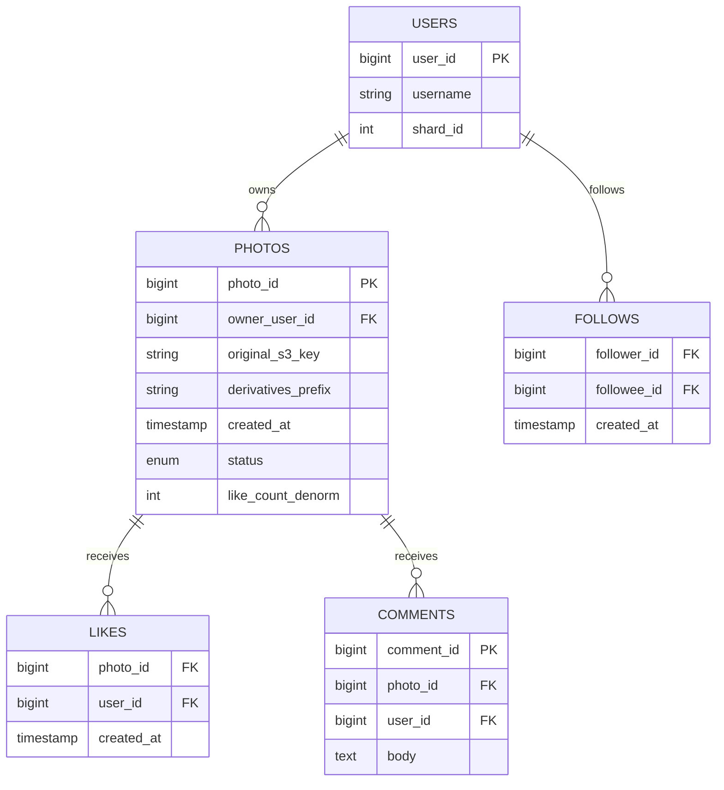
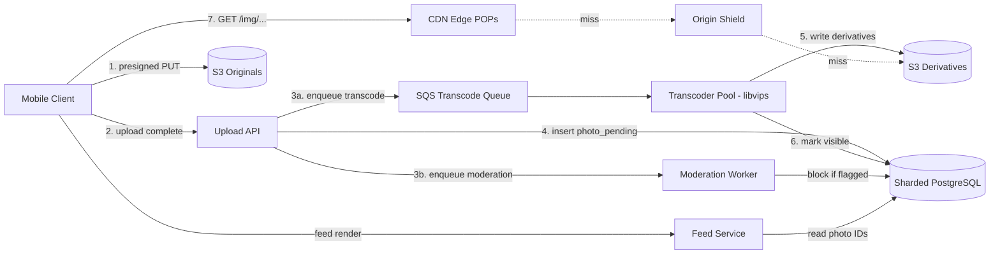
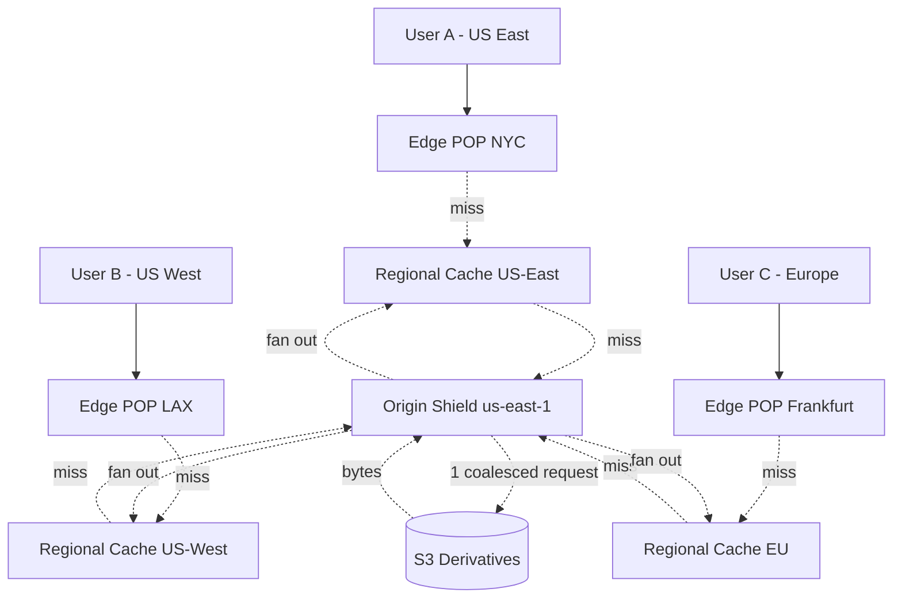
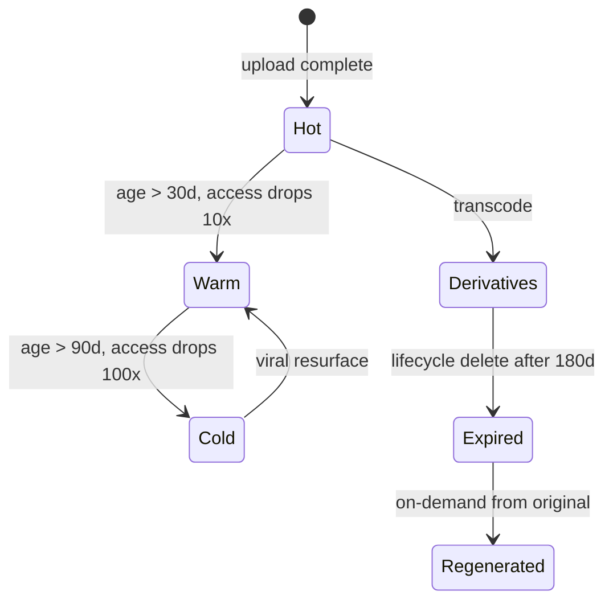
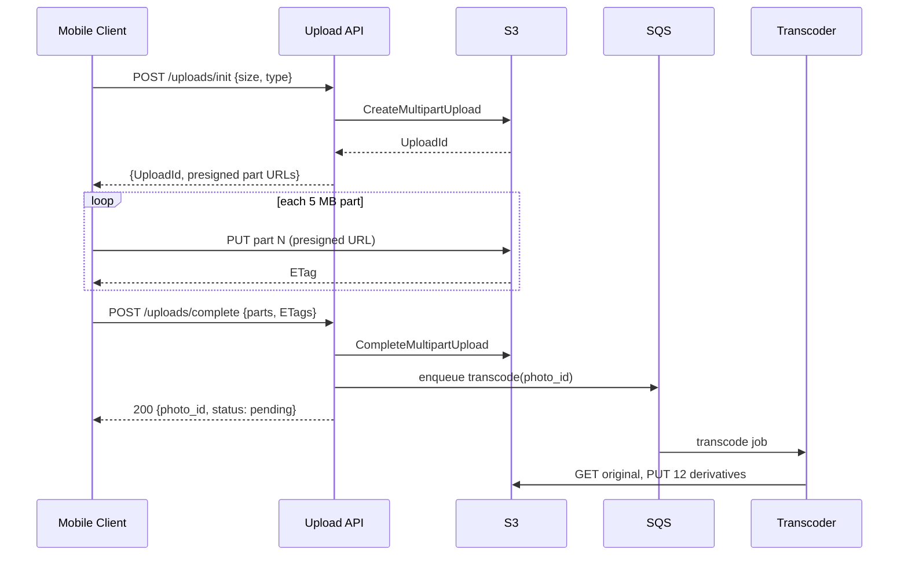

# Design a Photo Sharing Service (Instagram)

> **TL;DR.** A photo-sharing service at Instagram scale is three decoupled subsystems sharing one photo ID: an upload pipeline (presigned direct-to-S3, resumable multipart), a transcoding pipeline (libvips producing a fixed derivative ladder in 3 formats), and a read pipeline (CDN with origin shield collapsing viral stampedes into a single origin fetch). Instagram serves 3B+ MAU uploading 100M photos/day against a read-write ratio between 100:1 and 1,000:1 [^1][^2][^6]. The pivotal trade-off: pay the upload cost once (eagerly transcode all derivatives) so every subsequent view is a cache hit.

## Learning Objectives

After this module, you will be able to:

- [ ] Design a resumable upload pipeline that bypasses the API tier for photo bytes using presigned URLs
- [ ] Justify pre-generating a fixed derivative ladder over resize-on-demand at scale
- [ ] Apply CDN origin shielding to protect object storage from viral-content stampedes
- [ ] Estimate storage, compute, and bandwidth for a 100M-uploads/day photo service
- [ ] Separate photo storage from feed delivery and articulate the coupling contract
- [ ] Choose between Haystack-style custom blob stores and managed object storage based on scale

## Intuition

A photo-sharing service looks like a trivial CRUD app. Accept a JPEG, store it, serve it back. Handles 10 users fine. At 100 million uploads per day and 10 billion reads, it collapses, and the reason is the read-write asymmetry.

Every photo uploaded triggers one expensive write (megabytes over a flaky mobile radio, CPU for transcoding, a mandatory moderation scan) but then gets read hundreds to thousands of times in its first week [^3]. The naive approach, storing one original and resizing on each request, means every read is a CPU-bound cold computation. At 10 billion reads/day, that is not a photo service; it is a compute cluster pretending to be one.

The insight that unlocks the design: pay the upload cost once, eagerly, to convert an unbounded-scale read problem into a cache lookup. Generate all derivative sizes at upload time. Serve them from a CDN. Make the origin invisible behind a shield that coalesces duplicate requests. Now your read path is a static file fetch, and your write path is a background job that can tolerate seconds of latency without the user noticing.

The second pressure is storage temperature. A photo uploaded today is hot for a week, warm for a month, and cold forever after [^3]. Treating all bytes the same way is the fastest way to bankrupt the service. Facebook's journey from NFS to Haystack to f4 exists because of this single economic fact [^4][^5].

## Requirements

### Clarifying Questions

- **Q: Authenticated uploads only, or anonymous?**
  Assume: Authenticated. Anonymous viewing with rate limits; registered users get upload quotas.
- **Q: What is the SLA target?**
  Assume: 99.9% upload availability, p99 < 200 ms image load globally, 99.99% read availability.
- **Q: Multi-region required?**
  Assume: Yes. Active-passive writes (primary region), active-active reads via CDN.
- **Q: Do we store video or only photos?**
  Assume: Photos only in this design. Video is a separate pipeline (see Follow-up Questions).
- **Q: What is the maximum photo size?**
  Assume: 20 MB per upload. Larger files rejected at presign time.
- **Q: Do we need real-time feed integration?**
  Assume: Yes. After transcoding and moderation, the photo appears in followers' feeds within 5 seconds.

### Functional Requirements

- Upload a photo (JPEG, PNG, HEIC, WebP) up to 20 MB with caption and tags
- View a photo at the appropriate resolution for the requesting device
- Delete a photo (soft-delete with 30-day recovery window)
- Like, comment on, and share photos
- Browse a user's photo grid and a personalized home feed

### Non-Functional Requirements

- **Load:** 100M uploads/day (~1,200/sec average, 3,600/sec peak); 5B+ reads/day
- **Latency:** p50 < 50 ms, p99 < 200 ms on image load (CDN edge); p99 < 2s on upload complete
- **Availability:** 99.99% read path, 99.9% write path
- **Consistency:** eventual for feed appearance (< 5s); strong for ownership metadata
- **Durability:** 11 nines on originals; derivatives are regeneratable

## Capacity Estimation

| Metric | Value | Derivation |
|--------|------:|------------|
| DAU | 500M | ~25% of 2B MAU (as of 2021) [^6]; Instagram reached 3B MAU by Q3 2025 [^24] |
| Uploads/day | 100M | ~1,200/sec avg, 3,600/sec peak [^2] |
| Reads/day | 5B+ | 50:1 ratio on uploads (conservative) |
| Original size (avg) | 3 MB | Typical smartphone JPEG |
| Derivatives per photo | 12 | 4 sizes x 3 formats (JPEG, WebP, AVIF) |
| Derivative storage/photo | 1.5 MB | Compressed smaller sizes |
| New storage/day | 450 TB | 100M x (3 + 1.5) MB |
| 5-year storage | ~800 PB | 450 TB/day x 1,825 days (before tiering) |
| CDN origin QPS (after 95% hit) | ~2,900/sec | 5B / 86,400 x 0.05 |
| Peak CDN origin QPS | ~8,700/sec | 3x average |

Key ratios:

- **Read:write ratio:** 50:1 to 1,000:1 depending on photo popularity [^1][^7]
- **CDN edge hit rate target:** 95%+ (derivatives are immutable, cache-friendly)
- **Storage growth after tiering:** up to 68% savings on originals not accessed for 90+ days via Intelligent-Tiering's Archive Instant Access tier (actual savings vary by access pattern) [^8]

## API and Data Model

### API Design

```http
POST /v1/uploads/init
  Body: { "content_type": "image/jpeg", "size_bytes": 3145728 }
  Response: 201 { "upload_id": "...", "key": "originals/{user_id}/{uuid}",
                  "presigned_part_urls": ["..."], "expires_in": 3600 }

POST /v1/uploads/{upload_id}/complete
  Idempotency-Key: <client-uuid>
  Body: { "parts": [{"part": 1, "etag": "..."}], "caption": "...", "tags": [...] }
  Response: 200 { "photo_id": "...", "status": "pending" }

GET /v1/photos/{photo_id}
  Accept: image/avif, image/webp, image/jpeg
  Response: 200 { "photo_id": "...", "owner_id": "...", "derivatives": {...},
                  "status": "visible", "like_count": 42 }

DELETE /v1/photos/{photo_id}
  Response: 204 No Content (soft-delete, recoverable for 30 days)

GET /v1/users/{user_id}/photos?cursor=...&limit=50
  Response: 200 { "items": [...], "next_cursor": "..." }
```

Pagination uses cursor-based keyset pagination on `(created_at, photo_id)` descending. Rate limiting: 100 uploads/hour per user, 1,000 reads/sec per IP.

### Data Model



*Photo metadata is sharded by owner user_id; likes and comments are sharded by photo_id; follows are sharded by follower_id.*

| Table | Primary Key | Shard Key | Storage |
|---|---|---|---|
| photos | photo_id (encodes shard) | owner_user_id | Sharded PostgreSQL |
| likes | (photo_id, user_id) | photo_id | Sharded PostgreSQL |
| comments | comment_id | photo_id | Sharded PostgreSQL |
| follows | (follower_id, followee_id) | follower_id | Sharded PostgreSQL |
| feeds | (user_id, photo_id) | user_id | Redis / Cassandra |

Instagram's 64-bit ID scheme encodes 41 bits timestamp + 13 bits shard + 10 bits sequence directly in the photo_id, enabling routing without a directory lookup [^9].

## High-Level Architecture



*The three decoupled subsystems (upload, transcode, read) share state only through S3 buckets and the metadata database.*

**Write path:** The client obtains presigned URLs from the Upload API, streams bytes directly to S3 (bypassing the API tier entirely [^10]), then signals completion. The API writes a `photo_pending` row and enqueues transcode + moderation jobs. Only after both pass does the photo become `visible`.

**Read path:** The client resolves a CDN URL. On edge hit (95% of requests), bytes return in < 50 ms. On miss, the request escalates to Origin Shield, which coalesces concurrent misses into a single S3 fetch [^11]. The feed service returns photo IDs and metadata; the client fetches image bytes separately from the CDN.



*Origin Shield coalesces N concurrent edge misses into a single S3 fetch, protecting the origin from viral-content stampedes that would exceed per-prefix limits.*

**Async path:** Transcoder workers consume from SQS, download the original, produce 12 derivatives (4 sizes x 3 formats), write them to the derivatives bucket, and emit a `photo_visible` event to the feed service.

## Deep Dives

### Deep dive 1: Storage tiering (Haystack to f4 to S3 Intelligent-Tiering)

Photos follow a steep access curve: hundreds of reads in the first week, then roughly one order of magnitude drop per age band [^3]. Yet only ~25% are deleted within a year [^4], so storage grows monotonically.

**The NFS problem (pre-2009).** Facebook's original photo tier used NFS on commodity servers. Reading one photo required up to 3 disk I/Os just to walk directory metadata [^12][^13]. At 550,000 images/sec peak, the filesystem was the bottleneck.

**Haystack (2010).** A log-structured append-only store on XFS. Each storage node runs ~100 "physical volumes" (preallocated 100 GB files). An in-memory index maps photo_id to a byte offset, reducing reads to a single disk I/O [^4]. Per the OSDI 2010 paper, Facebook stored 260 billion images (20 PB) this way, serving 1 million images/sec at peak [^4].

**f4 (2014).** After 90 days in Haystack, blobs migrate to f4's warm tier. f4 uses Reed-Solomon (10,4) erasure coding within a datacenter and optionally XOR coding across datacenters, reducing the effective replication factor from 3.6x in Haystack to either 2.8x (cross-datacenter XOR) or 2.1x (single-datacenter Reed-Solomon only). As of the 2014 paper, f4 stored over 65 PB of logical BLOBs at these reduced replication factors [^3][^5].

**For cloud-native services (Instagram on AWS/Meta infra):** Use separate buckets with different lifecycles. Originals transition to S3 Intelligent-Tiering (automatic hot/warm/cold movement) after 30 days. Derivatives stay in S3 Standard, regeneratable from originals if expired [^8].



*Photos flow through temperature tiers; derivatives are regeneratable from originals and can be aggressively expired to save cost.*

### Deep dive 2: Thumbnail pipeline and format negotiation

At 100M uploads/day producing 12 derivatives each, the transcoding pipeline processes 1.2 billion images daily. Throughput is the constraint.

**Why libvips?** It is a demand-driven, horizontally threaded library that benchmarks at roughly 7-8x higher throughput than ImageMagick on resize workloads on multi-core hardware (libvips 0.57s vs ImageMagick 4.44s on a 16-core benchmark), and still around 5-6x faster when libvips is restricted to a single worker thread [^14][^15]. At scale, that throughput difference is a directly visible line on the AWS bill. libvips powers Mastodon, sharp (Node.js), imgproxy, Rails Active Storage, and MediaWiki [^15].

**The derivative ladder:**

| Size | Width | Formats | Use case |
|---|---|---|---|
| Thumbnail | 150 px | JPEG, WebP, AVIF | Grid views, search |
| Small | 320 px | JPEG, WebP, AVIF | Feed on low-end devices |
| Medium | 640 px | JPEG, WebP, AVIF | Standard phone feed |
| Large | 1080 px | JPEG, WebP, AVIF | Full-screen flagship |

AVIF compresses 20-30% smaller than WebP at equal visual quality [^16]. The client negotiates format via the `Accept` header; the CDN varies the cache key on `Accept`.

**EXIF GPS stripping is mandatory.** Mobile phones embed GPS coordinates in every photo. If derivatives preserve this metadata, any viewer can extract the photographer's exact location. Strip all EXIF at the transcoder stage, preserving only orientation for correct display [^15]. This is a privacy incident, not a feature request.

**Two-phase publish:** The feed never shows `pending` photos. A moderation worker processes the photo asynchronously (AWS Rekognition or equivalent). On pass, flip to `visible` and emit the feed event. On fail, flip to `blocked` and notify the user. This decouples upload latency from moderation latency.

### Deep dive 3: Upload path with direct-to-S3 presigned URLs

The upload API never touches photo bytes. This is the single most important bandwidth decision.

**Why presigned URLs?** AWS explicitly recommends this pattern: "By directly uploading these files to Amazon S3, you can avoid proxying these requests through your application server. This can significantly reduce network traffic and server CPU usage" [^10]. At 100M uploads/day averaging 3 MB each, that is 300 TB/day of bandwidth the API tier never sees.

**Resumable multipart upload:** S3 supports parts from 5 MiB to 5 GiB (up to 10,000 parts), with a maximum object size of 48.8 TiB [^17]. For a typical 3 MB photo, a single-part presigned PUT suffices. For larger files or unreliable networks, multipart upload with 5 MiB chunks allows resume on failure.



*Multipart upload with resume: the client streams directly to S3, the API only orchestrates metadata and job dispatch.*

**Garbage collection:** Clients that start but never finish leave orphaned parts. S3's `AbortIncompleteMultipartUpload` lifecycle rule cleans these after 7 days [^18].

**Idempotency:** The client generates a UUID per upload attempt. If it retries the `complete` call after a timeout, the API detects the duplicate via the idempotency key and returns the existing photo_id.

## Real-World Example

**Instagram: from Django on EC2 to three data centers serving 40 billion photos.**

Instagram launched in 2010 as a pure Django + EC2 stack: PostgreSQL for metadata, Redis for feeds and sessions, Memcached for caching, S3 for photo bytes, and CloudFront as the CDN [^19]. Photos went directly from the client to S3 via presigned URLs from day one. The Django app never handled image bytes.

By early 2012, Instagram had 30 million users and was sharding PostgreSQL by user_id using the 41+13+10 bit ID scheme, implemented as a PL/pgSQL function on each shard [^9]. This avoided any central ID service (unlike Flickr's ticket-server approach [^20]).

After the 2012 Facebook acquisition, Instagram migrated from AWS to Facebook data centers, swapped EC2 for Tupperware containers, and plugged into TAO, Scuba, and Haystack [^2]. By 2015, they served over 1 million requests per second across three data centers with 40 billion photos stored [^21].

Cross-region consistency used PgQ to invalidate Memcached entries, and a memcache lease mechanism collapsed thundering-herd cache misses on hot counters [^1][^2]. Instagram accepts a 60 ms cross-region latency penalty on writes [^21].

The key architectural insight: the photo service owns bytes and metadata. The feed service owns timelines (see [Design a Social Media Feed](./06-social-media-feed.md)). Photo IDs flow through the feed; photo bytes never do. This decoupling is why Instagram could later slot Reels (a video service) into the same feed without rearchitecting [^1].

## Trade-offs

| Approach | Pros | Cons | When to Use | Our Pick |
|---|---|---|---|---|
| Presigned direct-to-S3 | Removes API from bandwidth path [^10] | Cannot enforce pre-upload content policy | Large files, trusted clients | Yes |
| Pre-generate full ladder | Every read is a cache hit, predictable latency [^21] | 1.5-2.5x storage multiplier | Read-heavy, predictable sizes | Yes |
| On-demand resize at edge | Only store original, infinite sizes | Cold-request CPU tail, unpredictable latency | Long-tail rarely-accessed photos | No (except backfill) |
| libvips transcoder | ~7-8x faster than ImageMagick on multi-core [^14] | Smaller plugin ecosystem | Resize-heavy workloads at scale | Yes |
| Origin Shield with coalescing | Collapses viral stampedes to 1 fetch [^11] | Extra latency hop on cold requests | CDN-heavy read path | Yes |
| Shard-embedded 64-bit ID | Zero-latency routing, no directory [^9] | 13-bit shard space caps at 8,192 | Sharded relational store | Yes |
| Haystack custom blob store | Single-disk-IO reads [^4] | Must build and operate bespoke system | Hyperscale (100s PB), in-house infra | Only at Facebook scale |

The biggest meta-decision: managed object storage (S3) vs. custom blob store (Haystack). For any team that does not operate its own data centers, S3 with Intelligent-Tiering replaces the entire Haystack/f4 stack. The per-request cost at extreme scale is real, but the operational cost of running a custom storage system is higher for 99% of organizations.

## Scaling and Failure Modes

**At 10x load (1B uploads/day):** The transcoder pool saturates. Mitigation: auto-scale transcoder workers horizontally (stateless, queue-driven). S3 prefix limits become real; spread keys across more hash prefixes.

**At 100x load (10B uploads/day):** S3 request costs dominate the bill. CDN origin traffic exceeds Origin Shield capacity in a single region. Mitigation: multi-region origin shields, regional derivatives buckets with cross-region replication for hot content only.

**At 1,000x load:** The architecture shifts to CDN-first. Derivatives are pre-pushed to edge POPs for high-follower accounts. S3 becomes a cold origin only. Consider a Haystack-style custom store for warm data to eliminate per-request pricing.

**Failure mode: Regional S3 outage.** Reads degrade gracefully (CDN serves stale cached derivatives). Uploads fail in the affected region. Mitigation: multi-region upload endpoints with DNS failover; originals replicate cross-region within 15 minutes via S3 Cross-Region Replication.

**Failure mode: Transcoder queue backup.** Photos stay in `pending` state. Users see "processing" for minutes instead of seconds. Mitigation: dead-letter queue with alerting; auto-scale workers on queue depth; degrade gracefully by serving the original at reduced quality while derivatives generate.

**Failure mode: Viral photo exceeds per-prefix S3 limits.** S3 returns 503 Slow Down [^22][^23]. Mitigation: Origin Shield coalescing, hash-based prefix spreading, and pre-warming the shield cache for high-follower uploads.

## Common Pitfalls

> [!WARNING]
> **Storing originals and derivatives in the same bucket with the same lifecycle.** Originals are archival; derivatives are regeneratable. One lifecycle rule either archives derivatives to Glacier (breaking CDN reads) or keeps originals in S3 Standard forever (wasting money) [^8].

> [!WARNING]
> **Synchronous moderation blocking the upload path.** A moderation service latency spike propagates as upload failures. Use two-phase publish: return success immediately, moderate asynchronously, flip to visible on pass.

> [!WARNING]
> **Single-size pipeline ("just resize on the client").** Every device downloads the full-resolution original. Mobile data bills explode, feed render is slow, and CDN hit rate collapses. Pre-generate a fixed ladder of 4 sizes in 3 formats.

> [!WARNING]
> **Ignoring S3 per-prefix request limits.** S3 supports 3,500 PUT/sec and 5,500 GET/sec per prefix [^22]. A naive key structure concentrates viral-photo reads on one prefix. Use hash-based prefixes to distribute load.

> [!WARNING]
> **Leaking EXIF GPS coordinates in derivatives.** Mobile phones embed GPS in every photo. If derivatives preserve this data, any viewer can extract the photographer's exact location. This is a privacy incident, not a bug [^15].

> [!WARNING]
> **No garbage collection for abandoned multipart uploads.** Clients that start but never finish leave orphaned parts in S3. Without `AbortIncompleteMultipartUpload` lifecycle rules, storage costs grow silently [^18].

## Follow-up Questions

**1. How would you extend this to support video uploads (Reels)?**

Video requires a fundamentally different transcoding pipeline (FFmpeg, HLS/DASH adaptive bitrate segments, audio normalization). The upload path is similar (presigned multipart to S3), but transcoding is 100x more CPU-intensive and produces dozens of segment files per video. Separate the video pipeline entirely; share only the feed event contract and CDN infrastructure.

**2. How would you implement end-to-end encryption for photos (like iCloud Advanced Data Protection)?**

Encrypt the original with a per-photo symmetric key before upload. Store the encrypted blob in S3. The key is wrapped with the user's device keys and stored in a key management service. Derivatives cannot be generated server-side (the server never sees plaintext). Either generate derivatives on-device before encrypting, or accept that E2E-encrypted photos cannot have server-side thumbnails.

**3. How would you deduplicate photos at upload time?**

Compute a perceptual hash (pHash or dHash) of the original at upload time. Check against a bloom filter or hash index. If a match exists, point the new photo_id at the existing original's S3 key (copy-on-write semantics). Saves storage but adds complexity for deletion (reference counting).

**4. How would you detect copyright violations using perceptual hashing?**

Maintain a database of known copyrighted image hashes (like YouTube's Content ID). On upload, compute the perceptual hash and compare against the database using hamming distance < threshold. Flag matches for review. False positive rate must be tuned carefully to avoid blocking legitimate fair-use content.

**5. How would you detect AI-generated images and deepfakes?**

Run a classifier (fine-tuned on synthetic image datasets) in the moderation pipeline. Look for C2PA/IPTC metadata provenance signals. Neither approach is reliable alone; combine with user reporting and human review for flagged content. This is an active research area with no production-proven solution at 100% accuracy.

**6. How does the architecture diverge for short-form video (Reels vs. Stories vs. Feed photos)?**

Feed photos are permanent, high-resolution, eagerly transcoded. Stories are ephemeral (24h TTL), lower resolution, and can skip the warm/cold tiering entirely. Reels are long-lived video with adaptive bitrate, requiring segment-based storage and a separate CDN origin optimized for byte-range requests. All three share the feed event bus but have entirely separate storage and transcoding pipelines.

## Exercise

### Exercise 1: Format migration backfill

Your photo service has been running for two years with a 4-size JPEG-only derivative ladder. Product wants to add WebP and AVIF support for bandwidth savings. You have 40 billion stored photos. Design the migration strategy.

<details>
<summary>Hint</summary>

Not all 40 billion photos need WebP/AVIF immediately. Think about which photos are actually being served from CDN right now. The URL scheme should let you serve the right format without changing existing cached URLs.

</details>

<details>
<summary>Solution</summary>

**Prioritize by access recency.** Only photos accessed in the last 30 days need immediate backfill (roughly 5-10% of the corpus at Instagram's access curve). The remaining 90% can be backfilled lazily or on first request in the new format.

**Rate-limit the backfill.** Run backfill workers on a separate SQS queue with lower priority than the live transcode queue. Cap backfill at 30% of total transcoder capacity using a token-bucket rate limiter. Live uploads always take priority.

**Format negotiation without URL changes.** Use content negotiation via the `Accept` header. The CDN varies the cache key on `Accept` (CloudFront supports this in cache policy). The same URL `/img/{photo_id}/medium` returns AVIF, WebP, or JPEG based on client capability. Existing cached JPEG URLs remain valid.

**Cost math:** 4B photos (10% hot) x 8 new derivatives (4 sizes x 2 new formats) x 200 KB avg = 6.4 PB of new storage. At ~$0.023/GB/month, that is ~$150K/month. Bandwidth savings from 20-30% smaller files at billions of daily views far exceed this.

</details>

## Key Takeaways

- **Three decoupled subsystems:** Upload, transcode, and read scale independently. Conflating them is the fastest way to sound junior in an interview.
- **Presigned direct-to-S3:** The API never touches photo bytes. At 300 TB/day of uploads, this is a non-negotiable architectural decision [^10].
- **Pre-generate, do not resize on demand:** A fixed derivative ladder (4 sizes x 3 formats) converts the read problem into a cache lookup. libvips benchmarks roughly 7-8x faster than ImageMagick on multi-core hardware [^14].
- **Origin Shield is the key CDN optimization:** Request coalescing collapses viral stampedes into a single origin fetch, protecting S3 from exceeding per-prefix limits [^11].
- **Storage tiering is economic survival:** Separate originals (archival) from derivatives (regeneratable). Tier aggressively. Facebook's f4 cut warm-BLOB effective replication from 3.6x to 2.1x using erasure coding, across a 65+ PB corpus [^3].

## Further Reading

- [Sharding and IDs at Instagram](https://instagram-engineering.com/sharding-ids-at-instagram-1cf5a71e5a5c). The canonical blog post on the 41+13+10 bit ID scheme; explains why encoding the shard in the ID eliminates a directory lookup.
- [Instagration Pt 2: Scaling to Multiple Data Centers](https://instagram-engineering.com/instagration-pt-2-scaling-our-infrastructure-to-multiple-data-centers-5745cbad7834). How Instagram handled cross-region Memcached invalidation via PgQ and scaled to 40B photos across three data centers.
- [Finding a Needle in Haystack (OSDI 2010)](https://www.usenix.org/conference/osdi10/finding-needle-haystack-facebooks-photo-storage). Facebook's log-structured photo store that reduced per-read I/O from 3 disk seeks to 1.
- [f4: Facebook's Warm BLOB Storage System (OSDI 2014)](https://research.facebook.com/publications/f4-facebooks-warm-blob-storage-system/). Erasure coding for warm photo data, reducing effective replication from 3.6x to 2.8x or 2.1x across a 65+ PB corpus.
- [CloudFront Origin Shield documentation](https://docs.aws.amazon.com/AmazonCloudFront/latest/DeveloperGuide/origin-shield.html). The AWS feature that protects your origin from viral-content stampedes via request coalescing.
- [AWS S3 performance guidelines](https://docs.aws.amazon.com/AmazonS3/latest/userguide/optimizing-performance.html). The per-prefix 3,500/5,500 RPS limits that drive origin-shield and prefix-spreading design decisions.
- [libvips Speed and Memory Use benchmarks](https://github.com/libvips/libvips/wiki/Speed-and-memory-use). The numbers behind the ~7-8x multi-core throughput advantage over ImageMagick.
- [Flickr: Ticket Servers](http://code.flickr.com/blog/2010/02/08/ticket-servers-distributed-unique-primary-keys-on-the-cheap/). The REPLACE INTO ID trick that Instagram explicitly considered and rejected in favor of shard-embedded IDs.

## Flashcards

<details>
<summary><strong>Q: Why does the upload API never handle photo bytes directly?</strong></summary>

A: Presigned URLs let the client stream directly to S3, removing the API tier from the bandwidth path. At 100M uploads/day averaging 3 MB each, that is 300 TB/day the API never touches. AWS explicitly recommends this pattern to reduce network traffic and server CPU [^10].

</details>

<details>
<summary><strong>Q: What is the read-write ratio at Instagram scale, and why does it matter architecturally?</strong></summary>

A: Between 100:1 and 1,000:1. This extreme asymmetry means you should pay the upload cost once (eagerly transcode all derivatives) to convert the read problem into a cache lookup. Every design decision flows from this ratio.

</details>

<details>
<summary><strong>Q: Why use libvips instead of ImageMagick for transcoding at scale?</strong></summary>

A: libvips benchmarks at roughly 7-8x higher throughput than ImageMagick on resize workloads on multi-core hardware because it is demand-driven and horizontally threaded. At 1.2 billion derivatives/day, that throughput difference is a directly visible line on the AWS bill [^14][^15].

</details>

<details>
<summary><strong>Q: What problem does CDN Origin Shield solve for photo services?</strong></summary>

A: It coalesces concurrent cache misses for the same object into a single origin fetch. Without it, a viral photo can generate 80,000+ RPS to S3, exceeding the per-prefix limit of 5,500 GET/sec and causing 503 errors [^11][^22].

</details>

<details>
<summary><strong>Q: Why separate originals and derivatives into different S3 buckets?</strong></summary>

A: They have fundamentally different lifecycles. Originals are archival (transition to Glacier after 30-90 days, never deleted). Derivatives are regeneratable (can be expired and recreated on demand, stay in S3 Standard for fast CDN serving) [^8].

</details>

<details>
<summary><strong>Q: How does Instagram's 64-bit ID scheme enable zero-latency shard routing?</strong></summary>

A: The ID encodes 41 bits timestamp + 13 bits shard ID + 10 bits sequence. The shard is embedded directly in the photo_id, so the application can extract the shard number with a bit shift and route to the correct PostgreSQL shard without any directory lookup [^9].

</details>

<details>
<summary><strong>Q: What is two-phase publish and why is it critical for the upload path?</strong></summary>

A: Upload returns immediately with status "pending." A moderation worker processes the photo asynchronously. On pass, status flips to "visible" and the feed event fires. This decouples upload latency from moderation latency, preventing moderation service spikes from causing upload failures.

</details>

<details>
<summary><strong>Q: How did Facebook's Haystack reduce photo read I/O from 3 disk seeks to 1?</strong></summary>

A: Haystack replaced the NFS filesystem (which required directory traversal) with a log-structured append-only store. An in-memory index maps photo_id directly to a byte offset in a preallocated volume file, enabling a single disk seek per read [^4][^12].

</details>

<details>
<summary><strong>Q: Why must you strip EXIF GPS metadata from photo derivatives?</strong></summary>

A: Mobile phones embed GPS coordinates in every photo by default. If derivatives preserve this data, any viewer can extract the photographer's exact home or workplace location. This is a privacy and safety incident, not just a feature gap [^15].

</details>

<details>
<summary><strong>Q: What happens when a viral photo exceeds S3's per-prefix request limit?</strong></summary>

A: S3 returns 503 Slow Down errors. Mitigations: (1) Origin Shield coalesces duplicate requests into one origin fetch, (2) hash-based key prefixes distribute load across independent prefix partitions (each scaling to 5,500 GET/sec independently), (3) pre-warm the shield cache for high-follower uploads [^22][^23].

</details>

## References

[^1]: ByteByteGo, "How Instagram Scaled Its Infrastructure To Support a Billion Users", 2025. https://blog.bytebytego.com/p/how-instagram-scaled-its-infrastructure

[^2]: ByteByteGo, "How Instagram Scaled Its Infrastructure", with cache lease mechanism and denormalised counters detail, 2025. https://blog.bytebytego.com/p/how-instagram-scaled-its-infrastructure

[^3]: Muralidhar, Lloyd, Roy, Hill, Lin, Liu, Pan, Shankar, Sivakumar, Tang, Kumar, "f4: Facebook's Warm BLOB Storage System", OSDI 2014. https://www.usenix.org/conference/osdi14/technical-sessions/presentation/muralidhar

[^4]: Beaver, Kumar, Li, Sobel, Vajgel, "Finding a Needle in Haystack: Facebook's Photo Storage", OSDI 2010. https://www.usenix.org/conference/osdi10/finding-needle-haystack-facebooks-photo-storage

[^5]: Chris Mellor, "Facebook storage techies: We sift through your family snaps to find warm BLOBs", The Register, October 2014. https://www.theregister.com/2014/10/13/facebook_codes_warm_erasure_blobs_storage/

[^6]: CNBC, "Instagram surpasses 2 billion monthly users", December 2021. https://www.cnbc.com/2021/12/14/instagram-surpasses-2-billion-monthly-users.html (historical; Instagram reached 3B MAU by Q3 2025 [^24])

[^7]: Sujeet Jaiswal, "Facebook TAO: The Social Graph's Distributed Cache" (summary of TAO paper Bronson et al ATC 2013). https://sujeet.pro/articles/facebook-tao-social-graph

[^8]: AWS, "Amazon S3 Intelligent-Tiering Storage Class". https://aws.amazon.com/s3/storage-classes/intelligent-tiering/

[^9]: Instagram Engineering, "Sharding and IDs at Instagram", 2012. https://instagram-engineering.com/sharding-ids-at-instagram-1cf5a71e5a5c

[^10]: AWS, "Uploading to Amazon S3 directly from a web or mobile application", AWS Compute Blog, 2020. https://aws.amazon.com/blogs/compute/uploading-to-amazon-s3-directly-from-a-web-or-mobile-application/

[^11]: AWS, "Use Amazon CloudFront Origin Shield", CloudFront Developer Guide. https://docs.aws.amazon.com/AmazonCloudFront/latest/DeveloperGuide/origin-shield.html

[^12]: Stephen Holiday, "Finding a needle in Haystack: Facebook's photo storage" notes on the 2010 OSDI paper. https://stephenholiday.com/notes/haystack/

[^13]: Peter Vajgel, Doug Beaver, Jason Sobel, "Needle in a haystack: efficient storage of billions of photos", Facebook Engineering blog, April 2009. https://engineering.fb.com/core-data/needle-in-a-haystack-efficient-storage-of-billions-of-photos/

[^14]: libvips maintainers, "Speed and Memory Use" benchmarks, 2025. https://github.com/libvips/libvips/wiki/Speed-and-memory-use

[^15]: libvips maintainers, README.md - libvips used by Mastodon, sharp, imgproxy, Ruby on Rails, MediaWiki; format support list. https://github.com/libvips/libvips/blob/master/README.md

[^16]: Bulk Image Pro, "AVIF vs WebP: Which Next-Gen Format Should You Use?" (2024 benchmarks, 20-30% smaller than WebP). https://bulkimagepro.com/compare/avif-vs-webp/

[^17]: AWS, "Amazon S3 multipart upload limits", S3 User Guide (maximum object size 48.8 TiB, part size 5 MiB to 5 GiB, up to 10,000 parts). https://docs.aws.amazon.com/AmazonS3/latest/userguide/qfacts.html

[^18]: AWS, "Download and upload objects with presigned URLs", S3 User Guide. https://docs.aws.amazon.com/AmazonS3/latest/userguide/using-presigned-url.html

[^19]: Instagram Engineering, "What Powers Instagram: Hundreds of Instances, Dozens of Technologies", 2011. https://instagram-engineering.com/what-powers-instagram-hundreds-of-instances-dozens-of-technologies-adf2e22da2ad

[^20]: Flickr Code Blog (Kay Kremerskothen), "Ticket Servers: Distributed Unique Primary Keys on the Cheap", February 2010. http://code.flickr.com/blog/2010/02/08/ticket-servers-distributed-unique-primary-keys-on-the-cheap/

[^21]: Instagram Engineering, "Instagration Pt 2: Scaling our Infrastructure to Multiple Data Centers", 2015. https://instagram-engineering.com/instagration-pt-2-scaling-our-infrastructure-to-multiple-data-centers-5745cbad7834

[^22]: AWS, "Best practices design patterns: optimizing Amazon S3 performance", S3 User Guide. https://docs.aws.amazon.com/AmazonS3/latest/userguide/optimizing-performance.html

[^23]: AWS repost, "5,500 GET requests/sec and 3,500 PUT/POST/DELETE requests/sec per prefix" confirmation, 2025. https://www.repost.aws/ja/questions/QUm1b7F1CNTxiw-UNQSecIYg/how-to-model-or-determine-io-throughput-requests-sec-capacity-for-s3-buckets

[^24]: CNBC, "Instagram now has 3 billion monthly active users", September 2025. https://www.cnbc.com/2025/09/24/instagram-now-has-3-billion-monthly-active-users.html
