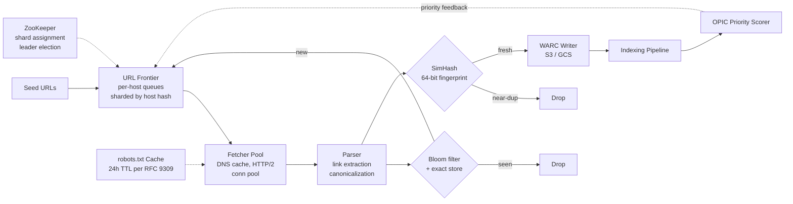
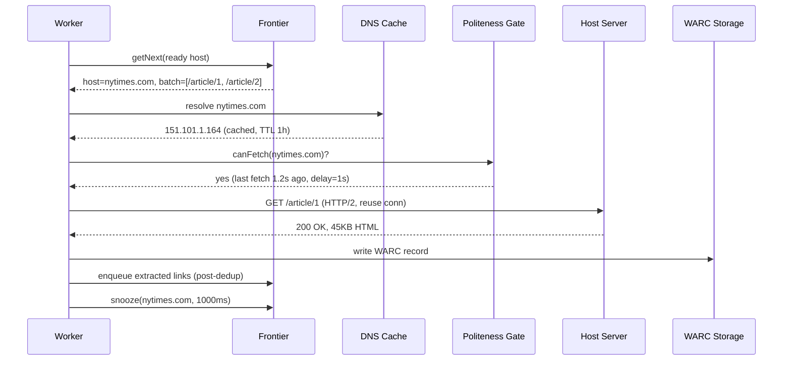
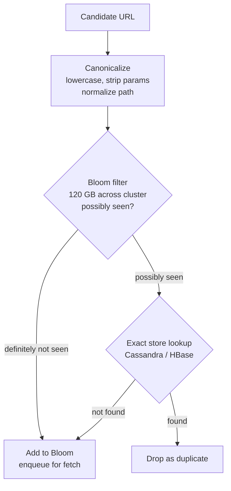
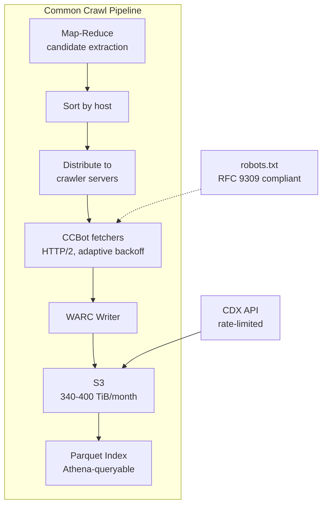

# Design a Web Crawler (Googlebot-style)

> **TL;DR.** A web crawler is a scheduling problem first and a fetching problem second. At 1 billion pages per day, the URL frontier holds 10 TB of state[^1], per-host politeness demands at most one in-flight request per hostname across the entire fleet, and duplicate detection requires two complementary layers: Bloom filters for URL dedup (~120 GB for 100B URLs at 1% FPR[^2]) and SimHash for content dedup (64-bit fingerprints, Hamming-3 threshold[^3]). Mercator's 1999 reference architecture[^1] established the component decomposition every major crawler since has reused. The pivotal trade-off: crawl rate versus politeness compliance.

## Learning Objectives

After this module, you will be able to:

- [ ] Design a URL frontier that enforces per-domain politeness at millions of domains in parallel
- [ ] Size Bloom filters for 100-billion-URL dedup and explain the Bloom + exact-store production pattern
- [ ] Separate URL dedup from content dedup and justify why both layers are necessary
- [ ] Implement RFC 9309-compliant robots.txt parsing and articulate why it is a hard constraint
- [ ] Estimate capacity for a billion-page-per-day crawl system using back-of-envelope math
- [ ] Justify frontier sharding by hostname hash for global politeness enforcement

## Intuition

A web crawler looks trivial: fetch a page, extract links, repeat. A `while` loop with a queue and a `set` handles 100 pages. At 1 billion pages per day it collapses, and the reason is not bandwidth or CPU. It is scheduling.

The naive approach (one big FIFO queue) fails immediately. If the next 10,000 URLs in the queue all belong to `example.com`, you hammer that server with 10,000 concurrent requests. The site goes down. You get blocked. Your IP range gets flagged by Cloudflare, and since July 2025 all sites on Cloudflare block AI crawlers by default unless explicit permission is granted[^4].

The insight that unlocks the design: the crawler is a distributed rate limiter running from the client side. Every architectural decision, from frontier partitioning to DNS caching to WARC storage, flows from one invariant: **at most one in-flight request per hostname, globally, across every fetcher you own.** Once you internalize that constraint, the Mercator two-level frontier, the host-hash sharding, and the politeness gate all follow naturally.

## Requirements

### Clarifying Questions

- **Q: What is the target crawl scale?**
  Assume: 1 billion pages per day (~11,500 pages/sec average, 30K-50K peak). Comparable to Common Crawl's monthly 2-3B pages[^5].

- **Q: Must we render JavaScript?**
  Assume: HTML-only for the bulk path. Selective headless-Chrome rendering for high-priority SPA pages (estimated 100-1000x cost per page[^6]).

- **Q: What politeness guarantees?**
  Assume: At most 1 request per second per host. Honor robots.txt per RFC 9309[^7]. Honor `Crawl-delay` as a de facto convention.

- **Q: How do we store crawled content?**
  Assume: WARC format (ISO 28500) in object storage (S3/GCS). Compressed 3-5x[^5][^8].

- **Q: What is the active frontier size?**
  Assume: 100 billion URLs in the pending pool. At ~100 bytes per URL (URL + metadata), that is 10 TB of frontier state[^1].

- **Q: Multi-region or single cluster?**
  Assume: Single cluster with geographically distributed fetcher pods for latency. Frontier is centralized (sharded).

### Functional Requirements

- Discover new pages by recursively following links from seed URLs
- Fetch pages over HTTP/1.1 and HTTP/2, respecting robots.txt and Crawl-delay
- Deduplicate URLs (canonicalization + Bloom filter) and content (SimHash)
- Store raw responses in WARC format with metadata (timestamp, digest, status)
- Prioritize URLs by importance (OPIC/PageRank) and freshness (change-rate scheduling)
- Provide a re-crawl loop: pages with high change rates get revisited more frequently

### Non-functional Requirements

- **Throughput:** 1B pages/day sustained; 30K-50K pages/sec peak
- **Politeness:** <=1 req/sec per host; 99%+ robots.txt compliance
- **Dedup accuracy:** URL dedup at 1% FPR (Bloom), content dedup at Hamming-3 threshold (SimHash)
- **Storage:** ~500 TB/day raw (100 TB compressed); 5-year retention
- **Availability:** frontier and dedup services at 99.9%; fetcher fleet tolerates individual node failure
- **Latency:** not user-facing; optimize for throughput, not p99

## Capacity Estimation

| Metric | Value | Derivation |
|--------|------:|------------|
| Pages/day | 1B | Target scale |
| Avg page size | 500 KB | HTML + embedded resources |
| Raw ingest/day | 500 TB | 1B x 500 KB |
| Compressed storage/day | 100-125 TB | 4-5x WARC compression[^5] |
| 5-year storage | ~180 PB | 100 TB/day x 365 x 5 |
| Peak fetch QPS | 50K | 3-5x average of 11,574/sec |
| Active frontier URLs | 100B | Cumulative discovered minus crawled |
| Frontier state | 10 TB | 100B x 100 bytes/URL[^1] |
| Bloom filter RAM (1% FPR) | 120 GB | 100B x 9.6 bits/element[^2] |
| SimHash index | ~600 MB/billion pages | 64 bits/doc + 4 permutation tables at 150 MB each[^3] |
| DNS cache entries | ~50M | One per active host |

Key ratios:

- **Read:write** on the frontier is roughly 1:1 (every fetch produces new URLs to enqueue)
- **Bloom filter hit rate:** ~60-70% of candidate URLs are duplicates (seen before)
- **Content dedup rate:** an estimated ~25-30% of fetched pages are near-duplicates of existing content[^3]
- **Hosts per crawl:** Common Crawl reports 43-46 million hosts per monthly crawl[^5]

## API and Data Model

### API Design

The crawler is not user-facing, but the frontier exposes a gRPC API (following the Crawler-Commons URL Frontier specification[^9]):

```http
POST   /frontier/v1/urls          # Inject seed URLs or discovered URLs
GET    /frontier/v1/next           # Pull next ready host + URL batch
PUT    /frontier/v1/urls/{id}      # Update URL state (fetched, failed, blocked)
PUT    /frontier/v1/hosts/{host}/rate  # Set per-host crawl rate
GET    /frontier/v1/hosts          # List active hosts with queue depth
GET    /frontier/v1/stats          # Frontier health: queue depth, throughput, FPR
```

The dedup service exposes:

```http
POST   /dedup/v1/url/check         # Bloom + exact-store URL lookup
POST   /dedup/v1/content/check     # SimHash fingerprint comparison
```

### Data Model

```sql
-- URL frontier state (sharded by host_hash)
table frontier_urls (
  host_hash       int,          -- partition key (consistent hash of hostname)
  url_id          uuid,         -- clustering key
  url             text,
  priority        float,        -- OPIC score
  state           enum,         -- queued, fetching, parsed, blocked, retired
  last_fetch_at   timestamp,
  retry_count     int,
  crawl_delay_ms  int           -- from robots.txt
)

-- Content fingerprints (for SimHash dedup)
table content_fingerprints (
  fingerprint_block  bigint,    -- 16-bit prefix block (partition key)
  fingerprint        bigint,    -- full 64-bit SimHash
  url_id             uuid,
  fetched_at         timestamp
)

-- WARC metadata index
table warc_records (
  url_id          uuid,
  warc_file       text,         -- S3 key
  offset          bigint,       -- byte offset within WARC file
  content_length  int,
  content_digest  text,         -- SHA-256
  fetch_status    int,
  fetched_at      timestamp
)
```

## High-Level Architecture



*End-to-end crawler pipeline: seeds enter the Mercator-style frontier, fetchers pull from per-host queues through a politeness gate, dual dedup layers filter duplicates, WARC records land in object storage, and an OPIC scorer feeds priority back to the frontier.*

The write path: a fetcher pulls a ready host from the frontier, resolves DNS (cached), checks the politeness gate (last fetch timestamp + Crawl-delay), fetches the page over HTTP/2, passes the response to the parser. The parser extracts links, canonicalizes them, and submits them to the URL dedup service. Fresh URLs re-enter the frontier. The raw response goes through SimHash content dedup; if fresh, it is written to a WARC file in S3.

The feedback path: the indexing pipeline computes OPIC scores (an online approximation of PageRank[^10]) and updates priority weights in the frontier. High-priority pages get re-crawled sooner.

ZooKeeper manages frontier shard assignment and leader election. When a frontier node fails, its host-hash range is reassigned to surviving nodes via consistent hashing with virtual nodes.

## Deep Dives

### Deep dive 1: URL frontier and politeness scheduler

The frontier is the hardest component. It must satisfy three constraints simultaneously: (1) per-host rate limiting across the entire fleet, (2) global priority ordering so important pages get crawled first, and (3) durability so a multi-week crawl survives node failures.

**Mercator's two-level design[^1]** solves this with per-host back queues and a global front queue. URLs are assigned to a back queue by hostname. A worker pulls a ready host from the front queue (selected by priority), fetches a batch of URLs from that host's back queue, then parks the host on a delay timer. The host becomes eligible again only after `Crawl-delay` seconds elapse.

Heritrix implements this as `BdbFrontier` with per-host work queues that move between several collections: `inProcessQueues`, `readyClassQueues`, `snoozedClassQueues` (plus a `snoozedOverflow` map for extreme situations), `inactiveQueuesByPrecedence`, and `retiredQueues`[^11]. The `classKey` is the hostname. Berkeley DB JE provides disk-backed durability with deferred-write mode for short-lived URLs that never hit disk.

**Adaptive revisit scheduling.** Not all pages change at the same rate. OPIC (Adaptive On-Line Page Importance Computation, Abiteboul et al. 2003) distributes "cash" from each crawled page to its outlinks; accumulated cash approximates PageRank without the full link matrix in memory[^10]. Combine OPIC priority with observed change rate: pages that changed on the last N visits get shorter re-crawl intervals.

**Why BFS fails at scale.** Breadth-first traversal from seeds fans out uniformly. Without per-host gating, it creates DNS stampedes (millions of uncached resolutions saturating upstream resolvers[^1]) and accidental DDoS on small sites. Mercator's per-host queue is the fix.



*A single fetch cycle: the frontier gates every request through a per-host delay timer, ensuring politeness holds globally regardless of fleet size.*

### Deep dive 2: Content dedup at scale (SimHash + URL canonicalization)

Two dedup layers attack duplicates from different angles:

**URL canonicalization** catches syntactic duplicates: `http://A.com/` vs `http://a.com`, trailing slashes, session IDs (`?PHPSESSID=abc`), tracking parameters (`?utm_source=twitter`), and protocol normalization. This is cheap (string manipulation) and eliminates 30-40% of candidate URLs before the Bloom filter.

**SimHash** catches semantic duplicates: the same article republished at a different URL, or a page with minor boilerplate changes (ads, timestamps, navigation). Charikar's 2002 locality-sensitive hash[^12] maps documents to 64-bit fingerprints where cosine similarity is preserved as Hamming distance. Manku et al. at Google (2007) showed that a Hamming threshold of 3 bits on 64-bit fingerprints yields good precision and recall for web pages[^3].

The construction:

1. Tokenize the document into overlapping 3-word shingles
2. Hash each shingle to 64 bits
3. For each bit position, accumulate +1 (bit=1) or -1 (bit=0) across all shingles
4. Final fingerprint: sign of each accumulator

**Sublinear candidate lookup.** Scanning all fingerprints for Hamming distance is O(N). The permutation-table trick: split 64 bits into B blocks. For two fingerprints to differ by at most 3 bits, at least B-3 blocks must match exactly. Index by each block permutation. Manku et al. used 4 tables at ~150 MB each per billion fingerprints[^3].

**The Bloom + exact-store pattern for URL dedup:**



*The Bloom filter handles 99%+ of checks without disk I/O. Only Bloom-positive results (1% false positives) trigger the expensive exact-store lookup, eliminating false positives without paying disk cost for every URL.*

### Deep dive 3: Distributed coordination and frontier sharding

**The invariant:** all URLs for one hostname must live on the same frontier shard. This is non-negotiable. If two shards independently schedule fetches for `nytimes.com`, politeness breaks.

**Host-hash partitioning.** Hash the hostname (not the full URL) to determine the frontier shard. All URLs for `nytimes.com` land on shard 7 (for example). Within shard 7, the two-level scheduler enforces local politeness. Since no other shard holds `nytimes.com` URLs, local politeness equals global politeness[^13].

**Consistent hashing with virtual nodes.** When a shard fails, its host-hash range must be reassigned. With virtual nodes, only 1/N of the key space moves. At 10 TB of frontier state, moving 1/N is still expensive (hundreds of GB), so the system must checkpoint frequently and minimize in-flight state.

**The Crawler-Commons URL Frontier gRPC API[^9]** decouples fetchers from the frontier service. Fetchers call `getNext` to pull work and `update` to report results. This lets the fetcher pool and the frontier scale independently. StormCrawler uses Apache Storm spouts as fetchers with a shared URL-Frontier service[^14].

**ZooKeeper's role:** shard assignment (which frontier node owns which hash range), leader election (one coordinator distributes config changes), and robots.txt rule distribution (blocked domains, custom Crawl-delay overrides). Failure detection must be fast: a dead shard strands all URLs for its hosts until reassigned.

**Cross-shard priority.** OPIC scores are computed per-shard (each shard knows the cash for its hosts). Global priority requires a lightweight gossip protocol between shards to surface the highest-priority hosts across the cluster. In practice, per-shard priority is sufficient: the top-priority hosts within any shard are likely globally important[^10].

## Real-World Example

**Common Crawl: the only public, auditable web-scale crawler.**

Common Crawl's April 2026 crawl archived 2.19 billion pages across 43.2 million hosts and 35.4 million registered domains, totaling 379.2 TiB uncompressed[^5]. Each monthly crawl discovers approximately 600-660 million new URLs not seen in prior crawls[^5][^15]. The cumulative archive exceeds 10 PB since 2008[^16].

CCBot is Nutch-based (Apache Nutch over Hadoop). Map-Reduce processes the crawl database and extracts candidates, sorted by host and distributed to crawler servers[^13]. HTTP/1.1 and HTTP/2 over TLS are supported. No JavaScript execution. Raw content is stored in WARC format (ISO 28500)[^8]. Files land in S3 on AWS, with a columnar Parquet index queryable via Athena without bulk download.

Key engineering decisions that differentiate Common Crawl from a naive implementation:

- **Adaptive back-off on 429/5xx** rather than static per-host rate limits. CCBot slows to any host that signals overload[^13]. This is more robust than configuration-driven politeness.
- **WARC over custom format.** Interoperability with Heritrix and IIPC tooling outweighs compression savings from a bespoke format[^8].
- **Published, reverse-DNS-verifiable IP ranges.** Site operators can distinguish real CCBot from spoofed User-Agents[^13]. Googlebot uses the same verification pattern[^17].
- **No JavaScript rendering.** At 3B pages/crawl, headless Chrome at an estimated 100-1000x cost per page[^6] would require a fleet 1000x larger. CCBot accepts missing SPA content.



*Common Crawl's Nutch-based pipeline: Map-Reduce extracts candidates, fetchers crawl with adaptive politeness, WARC records land in S3, and a Parquet index makes 10 PB queryable without bulk download.*

## Trade-offs

| Approach | Pros | Cons | When to Use | Our Pick |
|----------|------|------|-------------|----------|
| Per-domain queue (Mercator) | Natural politeness, simple fairness | Hot domains create backlog | General web crawl | Yes |
| Priority queue by OPIC | Crawl important pages first | Cross-shard gossip, feedback lag | Refresh crawls on known graph | Combined with Mercator |
| Breadth-first (naive) | Simple, uniform | Politeness violations, DNS stampede | Intranet or single-domain crawlers under ~1M pages | No (at web scale) |
| Bloom filter only | ~120 GB RAM, O(1) check | False positives miss real URLs | Tolerate small miss rate | No |
| Bloom + exact store | Zero false negatives | Two lookups, more code | Web scale where miss = lost page | Yes |
| Centralized frontier | Simple, global priority trivial | Single-point failure, scaling ceiling | Up to ~1 node capacity | No |
| Distributed frontier (host-hash) | Horizontal scale, local = global politeness | Rebalance cost on failure | >10K pages/sec | Yes |

The biggest meta-decision: **crawl rate versus politeness.** Google resolves it with dynamic per-hostname budgets that increase when the site responds fast and decrease on 5xx[^18]. Common Crawl resolves it with adaptive back-off on any overload signal[^13]. Both approaches treat the host's response as the ground truth for acceptable load.

## Scaling and Failure Modes

**At 10x (10B pages/day):**

- Frontier state grows to 100 TB. Disk-backed frontier (Berkeley DB or RocksDB) becomes the bottleneck. Mitigation: tiered storage with hot partitions in NVMe, cold in HDD.
- Bloom filter grows to 1.2 TB. Mitigation: shard across 10+ dedup nodes or switch to scalable Bloom filters that chain additional filters on saturation[^2].

**At 100x (100B pages/day):**

- Fetcher fleet must sustain 500K QPS. Mitigation: geographically distributed fetcher pods to reduce RTT. HTTP/2 multiplexing over persistent connections.
- DNS cache must hold 500M+ entries. Mitigation: dedicated recursive resolver cluster with aggressive TTL extension.

**At 1000x (the entire web, continuously):**

- Architectural rewrite: move from batch-oriented (Nutch/Hadoop) to streaming (Flink/Kafka). The frontier becomes a distributed log. Priority is computed incrementally via streaming OPIC.

**Failure modes:**

- **Frontier shard failure.** All hosts assigned to that shard are stranded. Detection: ZooKeeper session timeout (seconds). Recovery: consistent-hash reassignment moves 1/N of hosts to surviving nodes. Data loss bounded by last checkpoint interval.
- **Bloom filter node failure.** Dedup degrades to exact-store-only (slower but correct). No data loss since the exact store is the source of truth. Bloom can be rebuilt from the exact store.
- **Fetcher pod failure.** In-flight URLs return to `queued` state after timeout. No data loss. The frontier re-issues them to another fetcher on the next scheduling round.

## Common Pitfalls

> [!WARNING]
> **Crawler traps (infinite calendars, session-ID URLs).** A calendar generating pages for every day since 1900 creates millions of zero-value URLs. The crawler exhausts its budget on one host. Fix: per-host URL budget caps, URL pattern detection, and SimHash-based content similarity checks (if 95% of a host's pages have near-identical fingerprints, blocklist the pattern)[^19].

> [!WARNING]
> **DNS stampede.** Fanning out across millions of hosts without a dedicated DNS cache saturates upstream resolvers. Mercator identified DNS as the "major bottleneck" in 1999[^1]. Fix: long-TTL in-process DNS cache, async resolution decoupled from fetch, and HTTP/2 connection reuse.

> [!WARNING]
> **Accidental DDoS on small sites.** Without host-hash partitioning, two fetchers independently crawling `example.com` double the load. Politeness must hold globally, not per-fetcher. Fix: frontier-level per-host scheduling so only one worker touches any host at a time[^11].

> [!WARNING]
> **robots.txt misinterpretation.** 28 years of de facto convention (1994-2022) produced divergent parsers. Common mistakes: wrong longest-match logic, incorrect User-Agent group merging, treating 5xx as "crawl freely" instead of RFC 9309's "MUST assume complete disallow"[^7]. Fix: use an RFC 9309-compliant parser; test against Google's open-source `robots` library.

> [!WARNING]
> **Bloom filter saturation.** A filter sized for 100B URLs silently degrades past capacity. False positives rise, causing real URLs to be dropped as "seen." The effect is indistinguishable from legitimate dedup. Fix: FPR sampling (test known-fresh URLs), size for 2x expected capacity, periodic regeneration from the exact store[^2].

## Follow-up Questions

**1. How do you handle JavaScript rendering for SPA-heavy sites?**

Two-phase indexing (Google's model[^6]). HTML-only fetch feeds the pipeline immediately. High-priority pages (detected by empty `<body>` or known SPA frameworks) enter a separate render queue running headless Chromium. Render is estimated at 100-1000x the cost of plain fetch, so budget it at <1% of total crawl volume. Timeout aggressively (5-10 seconds per render).

**2. How do you handle LLM-crawler blocks (GPTBot, ClaudeBot, CCBot)?**

Respect `User-agent: GPTBot / Disallow: /` in robots.txt per RFC 9309[^7]. Since July 2025, Cloudflare blocks AI crawlers by default across all sites on its platform unless publishers opt in or are compensated[^4]. Publish verifiable IP ranges and a clear opt-out mechanism. The legal landscape is active: Reddit sued Anthropic in June 2025 over unauthorized scraping[^20], following the NYT v. OpenAI precedent. Compliance is not optional.

**3. How do you implement incremental re-crawl freshness?**

Track per-URL change rate (did the content hash change on the last N visits?). High-change-rate pages (news homepages, stock tickers) get re-crawled hourly. Low-change-rate pages (about pages, documentation) get re-crawled weekly or monthly. OPIC priority combined with change-rate scheduling gives a two-dimensional priority: importance x freshness.

**4. How do you partition the URL frontier across data centers?**

Hash by hostname, not by URL. All URLs for one host land on one shard. This preserves the politeness invariant without cross-shard coordination. Use consistent hashing with virtual nodes for rebalancing on failure. Do not split by geography unless fetcher-to-host latency is the bottleneck (rare; most hosts are behind CDNs).

**5. What is the difference between near-duplicate and exact-duplicate detection?**

Exact dedup uses content hash (SHA-256 of the response body). Near-dedup uses SimHash with Hamming-3 threshold[^3]. Exact dedup catches byte-identical mirrors. Near-dedup catches the same article with different ads, timestamps, or navigation chrome. You need both: exact dedup is cheap (one hash comparison), near-dedup is expensive (permutation-table lookup) but catches an estimated 25-30% more duplicates.

**6. How do you extract main content from a page (boilerplate removal)?**

Algorithms like Readability, Dragnet, or Trafilatura strip navigation, ads, and boilerplate to extract the "main content" block. This improves SimHash accuracy (fingerprinting only main content reduces false negatives from boilerplate variation) and reduces storage (store extracted text alongside raw WARC for downstream consumers).

## Exercise

### Exercise 1: Bloom filter sizing

Your crawler has discovered 50 billion unique URLs so far and expects to reach 200 billion over 3 years. Design the Bloom filter layer: how much RAM do you need today, how much at capacity, and when should you trigger a filter rebuild?

<details>
<summary>Hint</summary>

Use the formula: bits per element = -ln(e) / (ln 2)^2. For 1% FPR, that is ~9.6 bits/element. Consider what happens to FPR as the filter fills beyond its designed capacity. Think about when the observed FPR (measured by sampling) should trigger a rebuild.

</details>

<details>
<summary>Solution</summary>

**Today (50B URLs, 1% FPR target):**

- Bits needed: 50B x 9.6 = 480 billion bits = 60 GB
- Hash functions: k = 7

**At capacity (200B URLs, 1% FPR target):**

- Bits needed: 200B x 9.6 = 1.92 trillion bits = 240 GB
- Sharded across 24 nodes at 10 GB each, or 8 nodes at 30 GB each

**Sizing strategy:** Build the filter for 200B from day one (240 GB). At 50B URLs inserted, the actual FPR is well below 1% (the filter is only 25% utilized). As it fills toward 200B, FPR approaches the designed 1%.

**Rebuild trigger:** Monitor FPR by sampling 10,000 known-fresh URLs per hour against the filter. When observed FPR exceeds 2% (double the design target), trigger a rebuild from the exact store. This gives early warning before the filter becomes useless.

**Trade-off accepted:** 240 GB upfront is 4x what you need today. The alternative (start at 60 GB and rebuild at 50B) requires a stop-the-world rebuild that pauses dedup for hours. Over-provisioning is cheaper than downtime.

</details>

## Key Takeaways

- **The frontier is a scheduler, not a queue.** Per-domain fairness via Mercator's two-level design is the hard part; every production crawler since 1999 reuses it[^1].
- **Politeness is the load-bearing constraint.** At most one in-flight request per host, globally. This single invariant dictates frontier sharding, fetcher assignment, and DNS caching.
- **Two dedup layers are mandatory.** URL canonicalization + Bloom catches syntactic duplicates; SimHash catches semantic duplicates. Neither alone is sufficient[^3].
- **Bloom + exact store, never Bloom alone.** A false positive means a lost page. The exact store eliminates false positives on the 1% slow path[^2].
- **robots.txt is legally binding.** RFC 9309 formalized it in 2022[^7], Cloudflare enforces it commercially with default-block since July 2025[^4], and courts are adjudicating violations[^20].

- **Common Crawl's numbers are your benchmark.** 2-3B pages, 350-425 TiB, 43-46M hosts per monthly crawl[^5]. Use these for capacity estimation in interviews.

## Further Reading

- [Mercator: A Scalable, Extensible Web Crawler (Heydon and Najork, 1999)](https://link.springer.com/article/10.1023/A:1019213109274). The reference architecture that established per-host queues and the component decomposition every modern crawler reuses.
- [Detecting Near-Duplicates for Web Crawling (Manku, Jain, Das Sarma, WWW 2007)](https://research.google/pubs/pub33026/). The production-scale SimHash paper; 64-bit fingerprints, Hamming-3 threshold, permutation-table trick for sublinear lookup.
- [RFC 9309: Robots Exclusion Protocol (IETF, 2022)](https://www.rfc-editor.org/rfc/rfc9309.txt). The formal standardization of robots.txt with ABNF grammar, longest-match semantics, and the 500 KiB parser budget.
- [Common Crawl FAQ](https://commoncrawl.org/faq). The only public, auditable web-scale crawler; documents CCBot behavior, IP ranges, WARC format, and opt-out mechanisms.
- [Google Crawl Budget documentation](https://developers.google.com/search/docs/crawling-indexing/large-site-managing-crawl-budget). The canonical description of crawl capacity limit vs crawl demand and per-hostname budgeting.
- [Bloom Filters: Network Applications Survey (Broder and Mitzenmacher, 2005)](https://www.eecs.harvard.edu/~michaelm/postscripts/im2005b.pdf). The canonical math reference for sizing Bloom filters; source for the 9.6 bits-per-element formula.
- [WARC 1.1 specification (ISO 28500)](https://iipc.github.io/warc-specifications/specifications/warc-format/warc-1.1/). The standard archive format for web crawls; essential for building the storage layer.
- [Cloudflare: Content Independence Day (2025)](https://blog.cloudflare.com/content-independence-day-no-ai-crawl-without-compensation/). The commercial reframe of crawler etiquette; documents default-block for AI crawlers and pay-per-crawl across all Cloudflare-protected sites.

## Flashcards

<details>
<summary><strong>Q: What is the memory cost of a Bloom filter for 100B URLs at 1% FPR?</strong></summary>

A: ~120 GB (9.6 bits per element, k=7 hash functions). Reducing FPR to 0.1% costs ~180 GB (14.4 bits per element)[^2].

</details>

<details>
<summary><strong>Q: Why do production crawlers use Bloom + exact store instead of Bloom alone?</strong></summary>

A: A Bloom false positive means not crawling a real URL (lost page). The exact store (Cassandra, HBase, RocksDB) eliminates false positives on the slow path, while the Bloom filter handles 99%+ of checks without disk I/O.

</details>

<details>
<summary><strong>Q: What is Mercator's two-level frontier design?</strong></summary>

A: Per-host back queues hold pending URLs for each hostname. A global front queue (priority scheduler) selects which host to crawl next. Only one worker touches any host at a time, enforcing politeness regardless of fleet size[^1].

</details>

<details>
<summary><strong>Q: What Hamming distance threshold does SimHash use for web-page near-duplicate detection?</strong></summary>

A: 3 bits on a 64-bit fingerprint. Two pages whose SimHash fingerprints differ by 3 or fewer bits are considered near-duplicates[^3].

</details>

<details>
<summary><strong>Q: What does RFC 9309 say a crawler MUST do when robots.txt returns a 5xx error?</strong></summary>

A: Treat the site as fully disallowed (do not crawl any path) for a reasonably long period, such as 30 days[^7].

</details>

<details>
<summary><strong>Q: Why is DNS a bottleneck for web crawlers?</strong></summary>

A: Crawling millions of distinct hosts requires millions of DNS resolutions. Without a dedicated cache, the OS resolver saturates at thousands of queries/sec and upstream resolvers rate-limit. Mercator identified DNS as the "major bottleneck" in 1999[^1].

</details>

<details>
<summary><strong>Q: How does host-hash partitioning of the frontier enforce global politeness?</strong></summary>

A: All URLs for one hostname land on one shard. Within that shard, the scheduler enforces per-host rate limiting. Since no other shard holds URLs for that host, local politeness equals global politeness[^13].

</details>

<details>
<summary><strong>Q: Why do you need both URL dedup and content dedup?</strong></summary>

A: URL canonicalization catches the same page at different URL variants (trailing slash, case, parameters). SimHash catches the same article republished at an entirely different URL. Neither layer alone is sufficient.

</details>

<details>
<summary><strong>Q: How does Common Crawl handle sites that return 429 or 5xx?</strong></summary>

A: Adaptive back-off: CCBot slows its crawl rate to any host that signals overload, rather than relying on static per-host rate limits configured ahead of time[^13].

</details>

<details>
<summary><strong>Q: Why is headless-Chrome rendering impractical for bulk crawling?</strong></summary>

A: Rendering costs an estimated 100-1000x more per page than a plain HTTP fetch[^6]. At 1B pages/day, rendering everything would require a fleet 1000x larger. The production approach is two-phase: HTML-only for bulk, selective render for high-priority SPA pages.

</details>

## References

[^1]: Heydon, A. and Najork, M. "Mercator: A Scalable, Extensible Web Crawler." World Wide Web 2(4), 1999. https://link.springer.com/article/10.1023/A:1019213109274

[^2]: Wikipedia. "Bloom filter." https://en.wikipedia.org/wiki/Bloom_filter

[^3]: Manku, G. S., Jain, A., Das Sarma, A. "Detecting Near-Duplicates for Web Crawling." WWW 2007, ACM, Banff. https://research.google/pubs/pub33026/

[^4]: Cloudflare. "Content Independence Day: no AI crawl without compensation!" July 2025. https://blog.cloudflare.com/content-independence-day-no-ai-crawl-without-compensation/

[^5]: Common Crawl. "April 2026 Crawl Archive Now Available." https://commoncrawl.org/blog/april-2026-crawl-archive-now-available

[^6]: Stackmatix. "How Googlebot Crawls Single-Page Applications." https://www.stackmatix.com/blog/how-googlebot-crawls-single-page-applications

[^7]: Koster, M., Illyes, G., Zeller, H., Sassman, L. "RFC 9309: Robots Exclusion Protocol." IETF, September 2022. https://www.rfc-editor.org/rfc/rfc9309.txt

[^8]: IIPC. "The WARC Format 1.1 (ISO 28500:2017)." https://iipc.github.io/warc-specifications/specifications/warc-format/warc-1.1/

[^9]: NLnet. "URL Frontier project." https://nlnet.nl/project/URLFrontier/

[^10]: Apache Nutch. "OPICScoringFilter (apache-nutch 1.22 API)." Paper: Abiteboul, S., Preda, M., Cobena, G. "Adaptive On-Line Page Importance Computation" (2003). https://nutch.apache.org/documentation/javadoc/api/org/apache/nutch/scoring/opic/OPICScoringFilter.html

[^11]: Internet Archive. BdbFrontier.java, Heritrix3 source. https://github.com/internetarchive/heritrix3/blob/master/engine/src/main/java/org/archive/crawler/frontier/BdbFrontier.java

[^12]: Charikar, M. "Similarity estimation techniques from rounding algorithms." STOC '02. https://dl.acm.org/doi/10.1145/509907.509965

[^13]: Common Crawl. "Frequently Asked Questions: CCBot." https://commoncrawl.org/faq

[^14]: Apache Software Foundation. "Apache StormCrawler." https://stormcrawler.apache.org/

[^15]: Common Crawl. "October 2024 Crawl Archive Now Available." https://commoncrawl.org/blog/october-2024-crawl-archive-now-available

[^16]: Common Crawl. "About Common Crawl." https://commoncrawl.org/about

[^17]: Google Search Central. "Googlebot." https://developers.google.com/search/docs/crawling-indexing/googlebot

[^18]: Google Search Central. "Large site owner's guide to managing your crawl budget." https://developers.google.com/search/docs/crawling-indexing/large-site-managing-crawl-budget

[^19]: Google Search Central. "Google, duplicate content caused by URL parameters, and you." https://developers.google.com/search/blog/2007/09/google-duplicate-content-caused-by-url

[^20]: CPO Magazine. "Reddit Sues Anthropic Over Unauthorized AI Training." https://www.cpomagazine.com/data-protection/reddit-sues-anthropic-over-unauthorized-ai-training/
