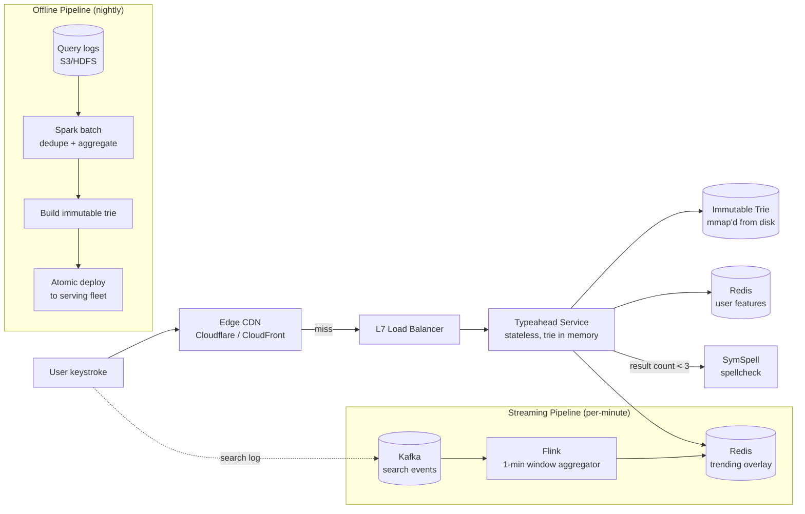
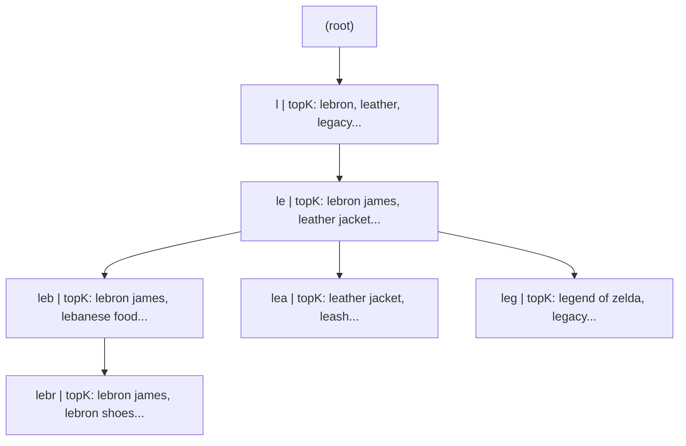
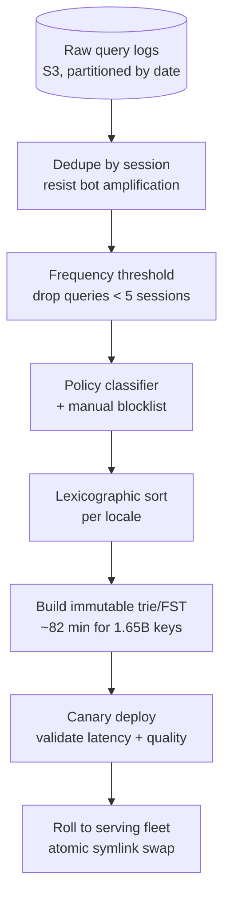
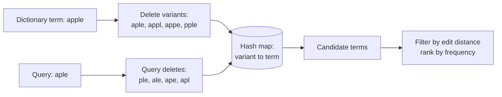

# Design Search Autocomplete (Typeahead Suggestions)

> **TL;DR.** Autocomplete is the feature users never notice until it is slow. Google processes 8.5 billion searches per day [^1], and autocomplete fires on every keystroke, so the suggestion service handles 5-10x the search QPS. The entire budget from keystroke to rendered suggestion is 100 ms, with the backend allotted under 50 ms [^2]. The winning architecture precomputes top-K completions at every trie node (zero sorting at query time), layers a streaming trending overlay for freshness, and pushes 20-30% of traffic to edge CDN caches. The pivotal trade-off is precompute vs. freshness: a lambda-architecture hybrid resolves it.

## Learning Objectives

After this module, you will be able to:

- [ ] Design a trie-based serving layer that returns top-K completions in O(prefix length) with no query-time sorting
- [ ] Estimate capacity for Google-scale autocomplete traffic using back-of-envelope math
- [ ] Architect a lambda-style update pipeline: nightly batch rebuild plus per-minute streaming overlay
- [ ] Justify when to use an FST over a plain trie and quantify the memory savings
- [ ] Integrate spellcheck and personalization without exceeding the 50 ms backend budget
- [ ] Identify autocomplete poisoning as a trust-and-safety risk and design velocity-based mitigations

## Intuition

You walk into a library and ask the librarian for books about "quantum." Before you finish the word, she slides a card across the counter with the ten most popular titles starting with "quant." She did not search the catalog in real time. Last night, she pre-sorted every book by popularity and wrote the top ten on an index card for every possible prefix. Your request is just a card lookup.

Now imagine a breaking-news event: a new book called "Quantum Leap" just went viral. The librarian's nightly cards do not include it yet. So she keeps a small whiteboard behind the counter labeled "trending today." When you ask for "quant," she checks both the pre-sorted card and the whiteboard, merges the results, and hands you the combined top ten.

That is the entire architecture of a production autocomplete system. The pre-sorted cards are a trie with precomputed top-K at each node, rebuilt nightly from query logs. The whiteboard is a streaming overlay fed by real-time search events. The librarian's 100 ms response budget is the same one Google's typeahead service operates under [^2]. And the reason she pre-sorts rather than searching live is the same reason production systems do: sorting millions of candidates per keystroke is too slow when you have 99,000 queries per second [^1].

A naive approach (one database, one `SELECT ... WHERE query LIKE 'app%' ORDER BY frequency LIMIT 10`) handles 10 users fine. At 500K QPS it collapses because every request scans and sorts thousands of rows. The insight that unlocks the design: move all ranking to build time, so query time is a pointer walk.

## Requirements

### Clarifying Questions

- **Q: What scale are we targeting?**
  Assume: Google-scale. 8.5B searches/day, autocomplete fires on every keystroke (5-10x search QPS), so 500K-1M autocomplete QPS globally.

- **Q: What is the latency SLA?**
  Assume: 100 ms end-to-end (keystroke to rendered suggestion). Backend budget is under 50 ms after subtracting network and render time.

- **Q: Personalized or generic suggestions?**
  Assume: Both. Generic (non-personalized) is the default and cacheable at CDN. Personalized re-ranks the generic top-K using user history and location.

- **Q: How fresh must trending suggestions be?**
  Assume: Breaking-news terms must appear within 5 minutes. The daily batch rebuild alone is insufficient.

- **Q: Multi-language support?**
  Assume: Yes. 130+ locales including CJK (Chinese, Japanese, Korean) which require dictionary-based tokenization.

- **Q: Do we need to filter offensive or defamatory suggestions?**
  Assume: Yes. Policy classifiers and manual blocklists are required. Legal precedent exists (Bettina Wulff v. Google, 2013) [^3][^4].

### Functional Requirements

- Return top-10 ranked completions for any prefix typed by the user
- Support fuzzy matching (spellcheck fallback) when exact-prefix results are thin
- Surface trending queries within 5 minutes of a spike
- Personalize suggestions using user search history and location
- Filter policy-violating suggestions (violence, hate, defamation) before serving

### Non-Functional Requirements

- **Load:** 500K-1M autocomplete QPS globally; 10K QPS per serving node
- **Latency:** p50 < 10 ms, p99 < 50 ms on the backend; 100 ms end-to-end
- **Availability:** 99.99% read path (degraded mode: serve stale trie if overlay is down)
- **Consistency:** eventual. Stale suggestions for up to 5 minutes are acceptable; 24-hour staleness is not.
- **Corpus size:** 500M-1B unique query strings across all locales

## Capacity Estimation

| Metric | Value | Derivation |
|--------|------:|------------|
| Google searches/day | 8.5B | Published aggregate [^1] |
| Autocomplete QPS (sustained) | ~500K | 8.5B/86,400 * 5 keystrokes avg |
| Peak autocomplete QPS | ~1.5M | 3x sustained during peak hours |
| Unique query strings | ~1B | Deduplicated across all locales |
| Avg query length | 20 chars | Industry average |
| Raw corpus size | 20 GB | 1B * 20 bytes |
| Trie memory (with top-K=10) | 30-40 GB | ~2x raw due to node overhead + top-K arrays [^5] |
| FST memory (compressed) | 4-8 GB | 20-40% of raw text [^6] |
| CDN cache hit rate (short prefixes) | 95%+ | Single-letter prefixes cover 20-30% of volume |
| Trending overlay size | ~100 MB | Top 1M trending queries in Redis |

- **Read:write ratio:** 1,000:1 or higher. Writes are search events feeding the pipeline; reads are autocomplete lookups.
- **Bandwidth:** At 1 KB average response * 500K QPS = 500 MB/s egress from origin (before CDN offload).
- **Serving fleet:** At 10K QPS per node with the trie in memory, ~50-150 nodes globally (after CDN absorbs 80%+ of traffic).
- **Redis overlay memory:** Top 1M trending queries at ~100 bytes each = ~100 MB per locale. A single Redis cluster handles this easily.

## API and Data Model

### API Design

```http
GET /v1/autocomplete?q=leb&locale=en&limit=10
  Headers: X-User-ID (optional, for personalization)
  Returns: 200 {
    "suggestions": [
      {"text": "lebron james", "score": 0.98},
      {"text": "lebanese food", "score": 0.87},
      ...
    ],
    "corrected_prefix": null
  }
  Cache-Control: public, max-age=60 (non-personalized)
                 private, no-cache (personalized)
  Errors: 429 rate limited, 503 service degraded

GET /v1/autocomplete/trending?locale=en&limit=20
  Returns: 200 { "trending": [...] }
  (Internal: used by monitoring dashboards, not user-facing)

DELETE /v1/autocomplete/suggestions/{suggestion_id}
  (Admin: policy team removes a specific suggestion from the index)
```

- **Pagination:** Not needed. Autocomplete always returns a fixed top-K (typically 10).
- **Rate limiting:** Per-IP and per-user. Debounce at the client (50-200 ms between keystrokes).
- **Cache key:** `(prefix, locale)` for non-personalized; personalized requests bypass CDN.

### Data Model

```sql
-- Batch pipeline output (immutable, rebuilt nightly)
-- Stored as a serialized trie/FST on disk, mmap'd into serving processes
trie_snapshot (
  prefix        varchar,       -- implicit in trie structure
  top_k         text[10],      -- precomputed completions, score-descending
  score         float[10],     -- corresponding scores
  locale        varchar(5),    -- partition key for sharding
  build_id      bigint         -- version for atomic swap
)

-- Trending overlay (Redis sorted sets, queried via ZRANGE ... BYLEX)
-- Key: trending:{locale}
-- Members: query strings, Score: frequency count in current window
ZADD trending:en 4500 "lebron james" 3200 "lebanese food"

-- User features (Redis hash, TTL 30 days)
-- Key: user_features:{user_id}
HSET user_features:u123 recent_queries "lebron,lakers,nba" geohash "9q8yy"
```

Sharding strategy: partition the trie by prefix range (a-d, e-h, ...) across serving nodes. Each node holds the full trie for its prefix range in memory. The trending overlay is a single Redis cluster sharded by locale.

## High-Level Architecture



*End-to-end autocomplete architecture: edge CDN absorbs popular prefixes; the typeahead service merges the immutable trie with a streaming trending overlay; offline and streaming pipelines feed both layers.*

**Write path:** Every issued search produces a log event `{query, user_id, locale, timestamp}`. Events land on a Kafka topic partitioned by query hash. The Flink streaming job windows them into 1-minute tumbling aggregates and writes to the Redis trending overlay. Separately, raw logs batch to S3 for the nightly trie rebuild.

**Read path:** A keystroke triggers a GET to the CDN. On a cache miss, the typeahead service walks the immutable trie for the generic top-50, fetches trending candidates from Redis, merges, optionally rescores with user features, and returns the top-10. If the result count is below 3, the spellcheck fallback fires.

**Async path:** The nightly Spark job reads the full query log, deduplicates, frequency-thresholds, builds a new immutable trie, and deploys it to the serving fleet via atomic file swap (symlink rotation). Zero-downtime: old trie serves until the new one is fully loaded.

## Deep Dives

### Deep dive 1: Trie-based serving, memory math, and FST compression

**The problem:** Serving 500K QPS with sub-50 ms p99 requires an in-memory data structure that answers prefix queries without sorting. A database query is too slow. A hash map does not support prefix matching.

**Trie with precomputed top-K:** Each node stores a fixed-size array of the K most popular completions rooted at that subtree, sorted by score descending. A lookup walks the prefix string character by character and returns `node.top_k` directly. Cost: O(prefix length), typically 5-20 pointer chases. No comparators run at serve time [^5].

**Memory math:** 1B unique queries * 20 chars average = 20 GB raw. With K=10 completions per node (each a 20-byte pointer), overhead roughly doubles the raw size to 30-40 GB. A radix trie (Patricia trie) collapses single-child chains, typically cutting node count by 50-70% and bringing memory to 15-25 GB per shard [^5].

**FST compression:** When even a radix trie is too large, a finite-state transducer shares both prefixes AND suffixes. BurntSushi's `fst` crate indexed 16M Wikipedia titles (384 MB raw) into 157 MB (41% of raw). On 1.65B Common Crawl URLs (134 GB sorted), the FST was 27 GB (20% of raw) [^6]. Elasticsearch's completion suggester uses one FST per Lucene segment, achieving 0.72 ms p50 on 2.1M Wikipedia titles [^7].

**Sharding strategy:** Partition by prefix range across N serving nodes. Each node holds the full trie for its prefix range. A routing layer maps the first 1-2 characters of the query to the correct shard. At 50 nodes with 30 GB each, total cluster memory is 1.5 TB, well within commodity hardware budgets. Elasticsearch's completion field type stores one FST per Lucene segment, enabling horizontal scaling where each shard maintains its own independent FST [^8].



*Each trie node stores a precomputed top-K array. A query for "leb" walks three nodes and returns the answer with zero sorting.*

**Trade-off: trie vs. FST.** Use a plain radix trie when the corpus fits in memory per shard (under 30 GB) and you need fast updates. Use an FST when the corpus exceeds memory or you need the smallest possible footprint for mmap'd serving. FSTs are immutable, so updates require a full rebuild or a new segment (Lucene-style).

### Deep dive 2: Offline query log aggregation pipeline

**The problem:** The immutable trie must be rebuilt daily from billions of raw search events. The pipeline must deduplicate, frequency-threshold, apply policy filters, and produce a sorted key set suitable for FST construction, all within a nightly batch window.

**Pipeline stages:**

1. **Ingest:** Raw query logs land in S3/HDFS partitioned by date and locale. Each record: `{query, user_id, locale, timestamp, clicked_result_id}`.
2. **Deduplicate:** Group by `(query, locale)`. Count unique sessions (not raw events) to resist bot amplification.
3. **Frequency threshold:** Drop queries below a minimum session count (e.g., 5 unique sessions in 30 days). This eliminates long-tail noise and reduces corpus size by 80-90%.
4. **Policy filter:** Run automated classifiers (violence, hate, sexual, elections, health) on every candidate. Drop violators. Merge with the manual blocklist maintained by trust-and-safety [^9].
5. **Sort:** Lexicographic sort of surviving queries per locale. Required for FST construction [^6].
6. **Build:** Stream sorted keys into the trie/FST builder. BurntSushi reports 82 minutes to build an FST from 1.65B pre-sorted URLs on a single machine [^6].
7. **Deploy:** Upload the new trie artifact to each serving node. Atomic swap via symlink rotation. Canary one node, validate latency and suggestion quality, then roll to the fleet.



*The nightly batch pipeline transforms raw query logs into a deployable immutable trie in seven stages. Session-based deduplication and policy filtering run before the build to keep the corpus clean.*

**Streaming overlay (speed layer):** The batch pipeline runs once per day. For freshness, a Flink job consumes the Kafka search-events topic with a 1-minute tumbling window, aggregates counts keyed by `(query, locale)`, applies a velocity check (require N unique sessions from M unique IPs to resist poisoning), and writes to the Redis trending overlay [^10][^11]. At query time, the typeahead service merges trending candidates with the immutable trie's top-K using a simple score-weighted union [^12].

### Deep dive 3: Personalization, ranking, and spellcheck

**Personalization as a rescorer:** The typeahead service fetches the generic top-50 from the trie, then a lightweight rescorer re-ranks using per-user features:

- **Recent queries this session:** Boost completions the user has searched before (exp-decay by recency).
- **Geolocation:** A user in Tokyo sees Japanese restaurants boosted for prefix "sush"; a user in New York sees different results.
- **Long-term interests:** Topic preferences derived from search history (sports, cooking, tech).
- **ML model (optional):** A small pointwise ranker (logistic regression or gradient-boosted tree) scores each of the 50 candidates. Must complete in under 20 ms.

Storage cost is O(generic index + per-user feature vector) rather than O(users * index size). The generic layer remains cacheable at CDN; the rescorer runs only on personalized requests.

**Spellcheck fallback:** When exact-prefix returns fewer than 3 results, the service invokes SymSpell. SymSpell precomputes all delete-variants of every dictionary term up to edit distance d and stores them in a hash map. At query time, it generates delete-variants of the query and does hash-map lookups. Achieves 0.033 ms per lookup at d=2 [^13]. The SeekStorm benchmark shows SymSpell 1,870x faster than a BK-tree at d=3 [^14].



*SymSpell's asymmetric trick: both dictionary terms and queries generate only delete-variants. A hash-map lookup replaces the expensive O(alphabet * length^d) edit generation, achieving 0.033 ms per lookup [^13].*

**Ranking signals merged at query time:**

| Signal | Weight | Source |
|--------|--------|--------|
| Global frequency | 0.4 | Immutable trie score |
| Trending velocity | 0.25 | Redis overlay |
| User recency | 0.2 | User features hash |
| Geo relevance | 0.1 | Geohash match |
| Spellcheck penalty | -0.05 | Edit distance > 0 |

## Real-World Example

**LinkedIn Cleo: typeahead at 150M+ members in 20 ms**

LinkedIn's open-source Cleo library (2012) powered both generic typeahead (companies, groups, skills) and network-aware typeahead (1st/2nd degree connections re-ranked with People You May Know scores). The system served suggestions in approximately 20 ms average at 150M+ members [^11].

Cleo's architecture uses four data structures per partition [^11]:

1. **Inverted index** keyed on short prefixes (max length 4 characters). The short prefix ensures the inverted list fits in L3 cache for a memory scan rather than a disk read.
2. **Bloom filter** (8 bytes, 64 bits per document). Filters candidates whose bloom filter does not contain all bits of the query's bloom filter. False positive rate is approximately 10%, acceptable because step 3 catches them.
3. **Forward index** confirms prefix match, rejecting bloom filter false positives.
4. **External scores** table for per-document relevance (popularity, PYMK).

A query for `john san fran` retrieves the inverted list for `john` (max prefix length 4), bloom-filters candidates, confirms via forward index, scores, and merges top-K across partitions. Out-of-order prefix matching means `john san fran` matches "San Francisco, John Doe" because the inverted index is per-token, not per-phrase [^11].

LinkedIn later retired Cleo into `LinkedInAttic` and replaced it with `typeahead-rest`, a Rest.li mid-tier federating across member, company, group, and skill backends, created in Q1 2014 [^15]. As of 2026, LinkedIn has more than 1.3 billion members in more than 200 countries and regions worldwide [^16]. The key insight non-experts miss: Cleo's 4-character prefix cap was not a limitation but a deliberate design choice. Shorter prefixes produce smaller inverted lists that fit in CPU cache, making the scan phase memory-bound rather than compute-bound.

## Trade-offs

| Approach | Pros | Cons | When to use | Our Pick |
|----------|------|------|-------------|----------|
| Trie with top-K per node | O(prefix) lookup, no query-time sort | 20-40 GB for 100M queries; O(depth) update cost | Large corpus, stable distribution | Core serving layer |
| Lucene FST (standalone) | 20-40% of raw text; suffix sharing | Immutable; requires sorted input; complex build | Billion-scale static corpus | Daily rebuild format |
| Redis ZRANGE BYLEX [^17] | O(log N + M), simple updates, easy sharding | No natural popularity ordering; higher memory per entry | Trending overlay, small corpus | Trending layer |
| ES completion suggester | Built-in fuzzy, horizontal scale | Higher p99 vs in-process trie; JVM GC pauses | Mixed-feature search UI already on ES | Not for primary path |
| Snapshot + streaming overlay | Fresh trending in minutes + simple core | Two code paths, merge complexity | High-churn query streams | Lambda architecture |
| Edge CDN for top prefixes | Shifts 20-30% of load off origin | Stale during breaking news until TTL expires | Global user base, high read:write | Tier-1 cache |
| ML re-ranker on generic top-50 | Adapts to user/query features; model swappable | Adds 10-20 ms hop; quality ceiling = generic top-50 | Mature product with user behavior data | Personalized path |

The single biggest trade-off: **precompute vs. freshness.** A fully precomputed trie gives microsecond latency but misses trending queries for up to 24 hours. A fully real-time system (query the log on every keystroke) cannot meet the 50 ms budget. The lambda hybrid resolves this: the immutable trie handles >99% of queries, and the streaming overlay covers the <1% that are trending. Google, YouTube, and LinkedIn all use variants of this pattern [^10][^11][^9].

## Scaling and Failure Modes

**At 10x load (5M QPS):** The CDN absorbs most of the increase for non-personalized queries. The serving fleet scales horizontally by adding more trie shards. Redis trending overlay may need cluster expansion.

**At 100x load (50M QPS):** The trie must be further compressed (FST mandatory). Edge CDN caching becomes critical for all prefixes up to 3 characters. The streaming pipeline needs Kafka partition expansion and Flink parallelism increase.

**At 1,000x load (500M QPS):** Architectural rewrite. Move to a CDN-first model where the CDN holds precomputed JSON for all prefixes up to length 4 (26^4 = 456K keys per locale). Origin only serves long-tail and personalized queries. The trie becomes an origin-only fallback.

**Failure modes:**

- **Redis trending overlay down:** Degrade gracefully. Serve from the immutable trie only. Suggestions are stale by up to 24 hours but still functional. Alert on overlay staleness > 10 minutes.
- **Trie build failure (nightly):** Keep serving the previous day's trie. The atomic symlink swap means the old version remains live until explicitly replaced. Alert on build age > 36 hours.
- **Autocomplete poisoning (bot attack):** The velocity check in the Flink pipeline (require N unique sessions from M unique IPs) blocks most automated campaigns. If a poisoned suggestion reaches production, the manual blocklist + policy classifier catch it within minutes. The Bettina Wulff case [^3][^4] established legal precedent for notice-and-takedown duty.

## Common Pitfalls

> [!WARNING]
> **Using full-text search as typeahead.** A `match_phrase_prefix` query OR-expands to every term starting with the prefix, walking posting lists and scoring each candidate. Elasticsearch's own benchmarks show the completion suggester is 6x faster (0.72 ms vs 4.41 ms) on the same dataset [^7]. Use a dedicated completion index.

> [!WARNING]
> **Sorting at query time instead of precomputing top-K.** A naive trie stores all completions and sorts them per request. At 500K QPS with 1,000 candidates per prefix, you burn all CPU on comparators. Precompute the top-K array at build time; query becomes O(1) copy [^5].

> [!WARNING]
> **Running spellcheck on every keystroke.** SymSpell is fast (0.033 ms per lookup) but running it unconditionally adds latency and CPU for the 95% of queries where exact-prefix returns sufficient results. Gate on "exact results < 3" and debounce client-side at 200 ms [^13].

> [!WARNING]
> **Ignoring CJK tokenization.** Chinese, Japanese, and Thai have no word boundaries. A character-level trie built from raw text produces zero suggestions for Chinese users. Use a dictionary-based tokenizer per locale (jieba for Chinese, kuromoji for Japanese) and normalize all keys to Unicode NFC [^18][^19].

> [!CAUTION]
> **Autocomplete poisoning.** Coordinated bot campaigns can push defamatory queries into the top-K. The Bettina Wulff case (2012-2013) led to a German Federal Court ruling that Google must remove defamatory autocomplete suggestions once notified [^3][^4]. Mitigate with velocity thresholds, policy classifiers, and a user-facing "report this suggestion" tool [^9].

## Follow-up Questions

**1. How do you handle multilingual autocomplete, especially CJK and RTL scripts?**

Normalize all keys and queries to Unicode NFC at index and query time [^18]. For CJK, tokenize with a dictionary-based segmenter (jieba for Chinese, kuromoji for Japanese) and index individual tokens [^19]. Maintain parallel transliteration paths (Pinyin-to-Hanzi) so typing `beij` matches a Chinese query. For Arabic/Hebrew, storage and matching remain byte-wise LTR; the client handles RTL rendering via the BiDi algorithm.

**2. How would you integrate semantic autocomplete with LLMs (Bing Chat, Google SGE)?**

LLM-powered suggestions are a rescorer over the generic top-50, not a replacement for the prefix trie. Run a lightweight embedding model to compute semantic similarity between the partial query and candidate completions. Union the semantic top-10 with the frequency-based top-10 and re-rank. Latency constraint: the embedding inference must complete in under 20 ms (use a distilled model or precomputed embeddings).

**3. How do you handle removal requests for defamatory suggestions?**

Maintain a manual blocklist checked at both build time (excluded from the trie) and query time (filtered from results). The user-facing "report this suggestion" tool feeds a review queue. For legal takedowns (DMCA, court orders), remove within 24 hours. The Bettina Wulff precedent [^4] requires proactive filtering once notified.

**4. How would you roll out autocomplete to a new country/locale?**

Bootstrap with translated global queries plus locale-specific seed data (local business names, celebrities, news topics). Run the batch pipeline per-locale from day one. The streaming overlay populates organically as users search. Quality metric: suggestion-click-through rate compared to the global baseline.

**5. What changes for mobile-specific ranking?**

Mobile users type slower (higher inter-keystroke delay) and have smaller screens (show 5 suggestions instead of 10). Debounce more aggressively (300 ms vs 50 ms on desktop). Boost shorter completions that fit on one line. Prefetch the top-100 suggestions for the user's recent queries on app launch (like Twitter's typeahead.js Bloodhound pattern [^20]).

**6. How do you choose the debouncing interval?**

Too short (0 ms) floods the backend with requests for every keystroke. Too long (500 ms) feels sluggish. Production systems use 50-200 ms adaptive debounce: start a timer on each keystroke, reset on the next keystroke, fire the request when the timer expires. Mobile uses longer intervals (200-300 ms) due to slower typing speed.

## Exercise

### Exercise 1: Fuzzy fallback design

A user types `lbro` (typo of `lebron`). Exact-prefix lookup returns zero suggestions. Design the fallback path that triggers fuzzy/edit-distance lookup within the 50 ms budget. Decide what fraction of queries should run fuzzy and how you would measure the quality gain.

<details>
<summary>Hint</summary>

The trigger condition is "exact-prefix returned fewer than N results" (typically N=3). SymSpell at edit distance 2 runs in 0.033 ms per term [^13], so the fuzzy path itself is not the bottleneck. Think about what quality metric you would use on a labeled holdout of known-typo queries.

</details>

<details>
<summary>Solution</summary>

1. The typeahead service walks the immutable trie for prefix `lbro`. Result count = 0.
2. Because result count < threshold (3), the service invokes the spellcheck fallback.
3. SymSpell generates delete-variants of `lbro` (`bro`, `lro`, `lbo`, `lbr`) and looks each up in the precomputed hash map. Match: `lebron` (edit distance 2).
4. The service walks the trie for the corrected prefix `lebron`, retrieves the top-10, and returns them annotated with "showing results for: lebron."

**Fraction running fuzzy:** Approximately 5-10% of queries trigger the fallback (those with fewer than 3 exact results). SymSpell adds only 0.033-0.18 ms, well within budget.

**Quality measurement:** Build a labeled dataset of (typo query, intended query) pairs from click-through logs. Compute NDCG@10 on this holdout with and without the fuzzy fallback. A/B test and measure suggestion-click-through rate as the online metric.

**Budget breakdown:** Trie walk (0.1 ms) + SymSpell (0.033 ms) + corrected trie walk (0.1 ms) + rescore (1-2 ms) = under 5 ms total.

</details>

## Key Takeaways

- **Precompute top-K at build time, never sort at query time.** This single decision is the difference between 0.1 ms and 100 ms per request.
- **Lambda architecture resolves precompute vs. freshness.** Immutable daily trie handles >99% of queries; streaming overlay covers trending within minutes.
- **FSTs compress billion-key corpora to 20-40% of raw size** via suffix sharing, making in-memory serving feasible on commodity hardware [^6].
- **Spellcheck is a gated fallback, not a default path.** Trigger on low-result prefixes only; SymSpell at 0.033 ms per lookup fits easily in the budget [^13].
- **Edge CDN caching for short prefixes offloads 20-30% of traffic** with a 60-second TTL. Autocomplete is read-heavy by 1,000:1.
- **Autocomplete poisoning is a real legal liability.** The Bettina Wulff ruling established notice-and-takedown duty for defamatory suggestions [^4].

## Further Reading

- [How Google autocomplete predictions work](https://support.google.com/websearch/answer/7368877?hl=en). Google's own explainer on ranking signals, freshness, and policy filtering; the "predictions are not answers" framing is canon.
- [You Complete Me (Elastic blog, 2013)](https://www.elastic.co/blog/you-complete-me/). Alexander Reelsen's post introducing the completion suggester with benchmarks showing 0.72 ms p50 vs 4.41 ms for prefix queries.
- [Index 1,600,000,000 Keys with Automata and Rust (BurntSushi, 2015)](https://burntsushi.net/transducers/). The best deep dive on FST construction, with numbers on Wikipedia titles and Common Crawl URLs.
- [LinkedIn Cleo: Open Source Technology Behind LinkedIn's Typeahead Search](https://engineering.linkedin.com/open-source/cleo-open-source-technology-behind-linkedins-typeahead-search). The inverted-index + bloom filter + forward-index architecture that served 150M members in 20 ms.
- [SymSpell (GitHub)](https://github.com/wolfgarbe/SymSpell). The symmetric delete spelling correction algorithm with benchmarks against BK-tree and Norvig.
- [SymSpell vs BK-tree (SeekStorm, 2017)](https://seekstorm.com/blog/symspell-vs-bk-tree/). Head-to-head comparison showing SymSpell 100-1,870x faster depending on edit distance.
- [Fagin et al., "Optimal Aggregation Algorithms for Middleware" (2003)](https://arxiv.org/abs/cs/0204046). The Threshold Algorithm paper; the theoretical backbone of top-K merging across ranked lists.
- [Redis ZRANGEBYLEX reference](https://redis.io/docs/latest/commands/zrangebylex/). The O(log N + M) lexicographic range query that powers the trending overlay pattern. Deprecated since Redis 6.2; prefer `ZRANGE` with `BYLEX` argument in new code.

## Flashcards

<details>
<summary><strong>Q: What is the end-to-end latency budget for autocomplete, and how much does the backend get?</strong></summary>

A: 100 ms end-to-end from keystroke to rendered suggestion. The backend is allotted under 50 ms once network and render time are subtracted [^2].

</details>

<details>
<summary><strong>Q: Why must top-K be precomputed at each trie node rather than sorted at query time?</strong></summary>

A: Sorting M candidates per request is O(M log M). At 500K QPS with M=1,000, CPU is consumed entirely by comparators. Precomputing makes query time O(prefix length) with zero sorting [^5].

</details>

<details>
<summary><strong>Q: How does an FST achieve 20-40% of raw text size?</strong></summary>

A: By sharing both prefixes (like a trie) and suffixes (unlike a trie). All keys ending in the same substring share terminal states, dramatically reducing node count [^6].

</details>

<details>
<summary><strong>Q: What is the lambda-architecture pattern for autocomplete freshness?</strong></summary>

A: An immutable daily trie (batch-rebuilt from query logs) handles >99% of queries. A streaming overlay (Kafka + Flink, 1-minute windows, writing to Redis) surfaces trending queries within minutes. Both are merged at query time [^10][^11].

</details>

<details>
<summary><strong>Q: When should the spellcheck fallback trigger?</strong></summary>

A: When exact-prefix lookup returns fewer than N results (typically N=3). Running spellcheck unconditionally wastes CPU for the 90-95% of queries with sufficient exact results [^13].

</details>

<details>
<summary><strong>Q: What is SymSpell's asymmetric trick?</strong></summary>

A: It precomputes only delete-variants of dictionary terms. At query time, it generates delete-variants of the query and does hash-map lookups. This reduces candidate generation from O(alphabet * length^d) to O(5^d) hash probes [^13].

</details>

<details>
<summary><strong>Q: How did the Bettina Wulff case change autocomplete system design?</strong></summary>

A: The 2013 German Federal Court ruling established that Google has a notice-and-takedown duty for defamatory autocomplete suggestions. Production systems now run policy classifiers on every candidate and maintain manual blocklists [^3][^4].

</details>

<details>
<summary><strong>Q: What role does the edge CDN play in autocomplete architecture?</strong></summary>

A: It caches non-personalized responses for short, popular prefixes with a 60-300 second TTL, offloading 20-30% of total request volume from the origin service.

</details>

<details>
<summary><strong>Q: How does LinkedIn Cleo achieve 20 ms latency at 150M members?</strong></summary>

A: Four data structures per partition: inverted index (max prefix length 4 to fit in L3 cache), bloom filter (64 bits, ~10% FP rate), forward index (confirms matches), and external scores. The short prefix cap keeps inverted lists small enough for a memory scan [^11].

</details>

<details>
<summary><strong>Q: What is the read:write ratio for autocomplete, and why does it matter?</strong></summary>

A: At least 1,000:1. This extreme ratio means multi-tier caching (CDN, in-memory trie, Redis) pays off more here than in almost any other search subsystem. Writes (search events) feed the pipeline asynchronously.

</details>

## References

[^1]: Colorlib/wifitalents aggregation of Google search statistics: "Google handles 8.5 billion searches per day ... approximately 99,000 search queries per second." https://colorlib.com/wp/search-engine-statistics/

[^2]: Industry convention for keystroke-to-suggestion latency (100 ms human-perceptible, 50 ms backend budget). https://www.elastic.co/blog/you-complete-me/

[^3]: Deutsche Welle, "German federal court raps Google on the knuckles over autocomplete function," 2013-05-15. https://www.dw.com/en/german-federal-court-raps-google-on-the-knuckles-over-autocomplete-function/a-16813363

[^4]: AIAAIC, "Google Autocomplete conflates Bettina Wulff with 'prostitute'" case file. https://www.aiaaic.org/aiaaic-repository/ai-algorithmic-and-automation-incidents/google-autocomplete-conflates-bettina-wulff-with-prostitute

[^5]: Donne Martin, "System Design Primer: Design a typeahead/autocomplete system." https://github.com/donnemartin/system-design-primer

[^6]: Andrew Gallant (BurntSushi), "Index 1,600,000,000 Keys with Automata and Rust," 2015. https://burntsushi.net/transducers/

[^7]: Alexander Reelsen, "You Complete Me," Elastic blog, 2013-08-22. https://www.elastic.co/blog/you-complete-me/

[^8]: Elasticsearch Reference, "Completion field type." https://www.elastic.co/docs/reference/elasticsearch/mapping-reference/completion

[^9]: Google Search Help, "How Google autocomplete predictions work." https://support.google.com/websearch/answer/7368877?hl=en

[^10]: Tianpan / Puncsky, "Designing typeahead search or autocomplete" - covers the immutable-snapshot + streaming-overlay lambda pattern. https://tianpan.co/notes/179-designing-typeahead-search-or-autocomplete

[^11]: Jingwei Wu, "Cleo: the open source technology behind LinkedIn's typeahead search," LinkedIn Engineering, 2012. https://engineering.linkedin.com/open-source/cleo-open-source-technology-behind-linkedins-typeahead-search

[^12]: Ronald Fagin, Amnon Lotem, Moni Naor, "Optimal Aggregation Algorithms for Middleware" (Threshold Algorithm), JCSS 2003. https://arxiv.org/abs/cs/0204046

[^13]: Wolf Garbe, SymSpell README with performance numbers. https://github.com/wolfgarbe/SymSpell

[^14]: SeekStorm, "SymSpell vs. BK-tree: 100x faster fuzzy string search & spell checking," 2017. https://seekstorm.com/blog/symspell-vs-bk-tree/

[^15]: LinkedIn Engineering, "Search Federation Architecture at LinkedIn," 2018-03. https://engineering.linkedin.com/blog/2018/03/search-federation-architecture-at-linkedin

[^16]: LinkedIn About page, "Welcome to LinkedIn, the world's largest professional network with more than 1.3 billion members in more than 200 countries and regions worldwide." https://about.linkedin.com/

[^17]: Redis documentation, "ZRANGEBYLEX" command reference (deprecated since Redis 6.2; use `ZRANGE ... BYLEX` in new code). https://redis.io/docs/latest/commands/zrangebylex/

[^18]: Unicode.org FAQ on Normalization (NFC vs NFD). http://unicode.org/unicode/faq/normalization.html

[^19]: fxsjy/jieba - Chinese word segmentation library. https://github.com/fxsjy/jieba

[^20]: Twitter typeahead.js README with Bloodhound + Typeahead component breakdown. https://github.com/twitter/typeahead.js
