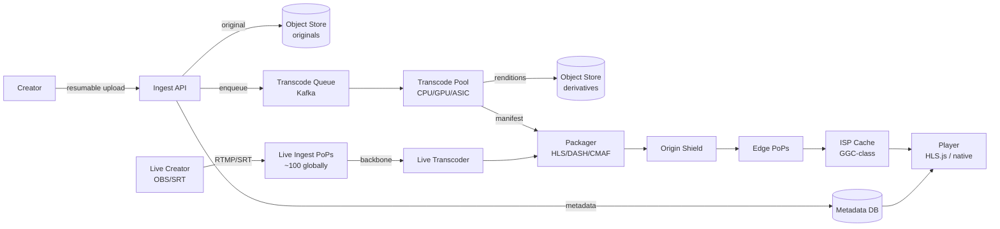
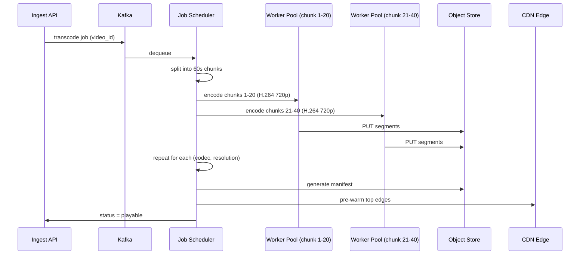
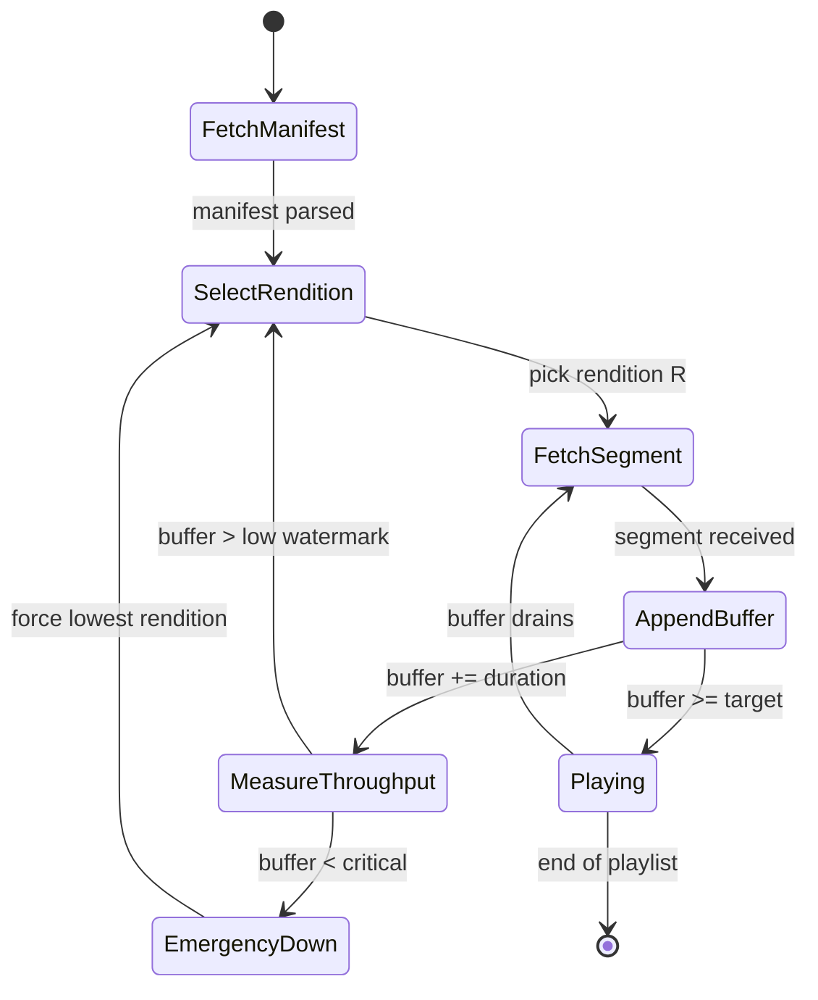
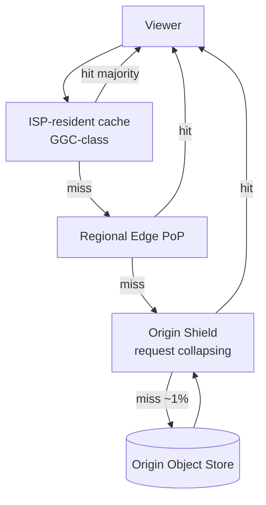
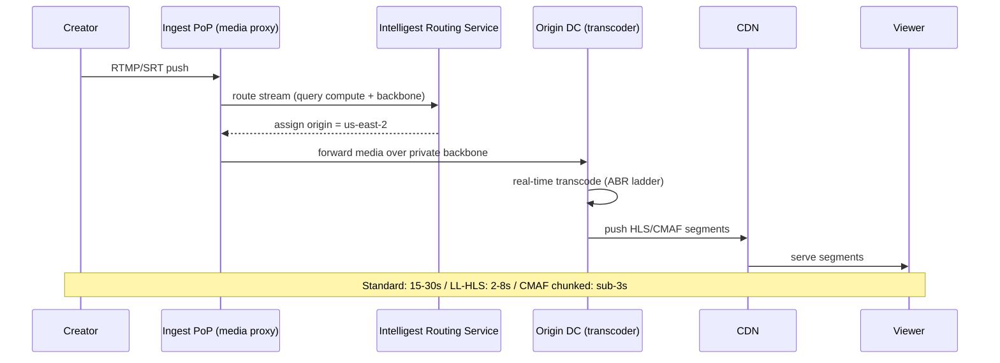

# Design a Video Streaming Service (YouTube / Twitch / TikTok)

> **TL;DR.** A UGC video platform is four loosely coupled pipelines sharing one video ID: ingest, transcode, package, and deliver. YouTube ingests 500+ hours of video per minute [^1] and serves roughly 1 billion watch-hours per day [^2]. The architecture exploits a 100,000:1 read-write asymmetry: pay a large one-time cost at upload (encode every rendition, package into HLS/DASH segments, replicate to edges) so that every subsequent view is a CDN cache hit. Custom transcoding ASICs deliver 20-33x efficiency over software encoding [^3][^4], ISP-resident caches keep ~95% of bytes inside the viewer's network [^5][^6], and adaptive bitrate streaming lets the player switch renditions mid-stream without rebuffering. The pivotal trade-off: pre-encode eagerly (fast playback, high storage cost) versus encode on-demand (low storage, cold-start latency).

## Learning Objectives

After this module, you will be able to:

- [ ] Design a transcoding pipeline that produces an ABR ladder from a single uploaded source
- [ ] Compare HLS, DASH, and CMAF and justify when each wins
- [ ] Estimate storage, compute, and bandwidth for a platform receiving 500 hours of uploads per minute
- [ ] Architect a CDN hierarchy with origin shielding that achieves 95%+ edge hit rates
- [ ] Distinguish live ingest architecture from VOD and articulate the latency trade-offs (standard HLS 15-30s vs LL-HLS 2-8s)
- [ ] Justify custom hardware (ASIC) versus commodity CPU/GPU transcoding at different scale tiers

## Intuition

A naive video platform is trivial: upload an MP4 to S3, serve the URL. This works for 10 users on fiber. At 10 million users on heterogeneous networks, it collapses for three reasons.

First, a 4K 60 Mbps file sent to a viewer on 4 Mbps DSL means infinite buffering or 90% wasted bytes. You need multiple resolutions. Second, encoding a single 10-minute video into a 7-rendition ladder takes 30+ CPU-minutes. At 500 hours uploaded per minute [^1], that is 210,000 CPU-minutes of encoding work every minute. You need parallelism and possibly custom hardware. Third, serving a billion hours of watch time per day [^2] from a single origin would require petabits of egress. You need caches everywhere, ideally inside the viewer's ISP.

The insight that unlocks the design: video is write-once, read-millions. Every dollar spent at upload time (encoding, packaging, replicating) saves thousands of dollars at view time. The entire architecture is a direct consequence of that asymmetry. Once you internalize this, every downstream decision (pre-encode the full ladder, push segments to ISP caches, use HTTP-based delivery so any CDN works) follows naturally.

## Requirements

### Clarifying Questions

- **Q: UGC (user-generated) or licensed catalog (Netflix-style)?**
  Assume: UGC. Unbounded uploads from any creator. Licensed VOD is covered in [Design Netflix](./11-netflix.md).
- **Q: What is the upload volume?**
  Assume: 500+ hours of video per minute at YouTube scale [^1]. Design for this ceiling.
- **Q: What latency target for video start (time-to-first-frame)?**
  Assume: p99 < 200 ms for viewers on cached content. Cold-tier content may take seconds.
- **Q: Do we support live streaming?**
  Assume: Yes. Standard live (15-30s latency) and low-latency live (2-8s, commonly 2-5s with well-tuned deployments).
- **Q: Multi-codec support?**
  Assume: H.264 (compatibility), VP9 (bandwidth savings), AV1 (mainstream since ~2024; YouTube 75%+ of library, Netflix 30% of streams). All three in the ladder.

- **Q: Geographic distribution?**
  Assume: Global. Viewers in 200+ countries. ISP-resident caching where possible.

### Functional Requirements

- Creators upload videos via resumable HTTP upload (survive mid-upload network drops)
- System transcodes each upload into a multi-resolution, multi-codec ABR ladder
- Viewers stream video with adaptive bitrate switching based on network conditions
- Live creators push RTMP/SRT streams with real-time transcoding and delivery
- Creators manage metadata (title, description, thumbnails) and view analytics

### Non-Functional Requirements

- **Upload volume:** 500+ hours/min (~30,000 video-minutes/min) [^1]
- **Daily watch time:** ~1 billion hours/day [^2]
- **Monthly active users:** ~2.58 billion (2025-2026; has ranged 2.5-2.7B over recent years) [^2]
- **Video start latency:** p99 < 200 ms (cached content)
- **Edge hit rate:** 95%+ of segment requests served without reaching origin [^5]
- **Live latency:** standard 15-30s, low-latency 2-8s [^7][^8]
- **Availability:** 99.99% read path, 99.9% write path

## Capacity Estimation

| Metric | Value | Derivation |
|--------|------:|------------|
| Upload rate | 500 hrs/min | YouTube public figure [^1] |
| Upload QPS | ~50 uploads/sec | 500 hrs/min / avg 10 min per video |
| Transcode jobs/min | 500 | 1 job per uploaded video |
| Renditions per video | 15-20 | 7 resolutions x 2-3 codecs |
| Storage per day (derivatives) | ~1 PB | 500 hrs/min x 1440 min x 3-5x ladder multiplier |
| Daily watch hours | 1B hours | YouTube public figure [^2] |
| Peak segment QPS | ~50M | 1B hrs/day / 86,400 x segments/hr x peak multiplier |
| Egress bandwidth | ~100 Tbps peak | 1B hrs x avg 3 Mbps / 86,400 sec |

- **Read:write ratio:** ~100,000:1 (billions of views per upload)
- **Cache hit rate target:** 95% at ISP/edge, 99% before origin
- **Hot storage:** top 10% of videos by view count; bottom 50% rarely watched [^5]

## API and Data Model

### API Design

```http
POST /v1/uploads
  Tus-Resumable: 1.0.0
  Upload-Length: <total_bytes>
  Returns: 201 { "upload_url": "/v1/uploads/{id}", "video_id": "abc123" }

PATCH /v1/uploads/{id}
  Upload-Offset: <current_offset>
  Content-Type: application/offset+octet-stream
  Body: [remaining bytes]
  Returns: 204 { Upload-Offset: <new_offset> }

HEAD /v1/uploads/{id}
  Returns: 200 { Upload-Offset: <current_offset> }

GET /v1/videos/{id}/manifest.m3u8
  Returns: 200 (HLS master playlist with variant streams)

GET /v1/videos/{id}/segments/{resolution}/{segment_number}.m4s
  Returns: 200 (fMP4 segment bytes, served from CDN)

POST /v1/live/streams
  Body: { "title": "...", "latency_mode": "low" | "standard" }
  Returns: 201 { "stream_key": "...", "rtmp_url": "rtmp://ingest.example.com/live" }
```

Upload uses the [tus resumable upload protocol](https://tus.io/protocols/resumable-upload/1-0-x) [^9]: `POST` creates the resource, `HEAD` queries offset after a drop, `PATCH` resumes from that byte. Mismatched offsets return `409 Conflict`.

### Data Model

```sql
-- Metadata store (PostgreSQL, sharded by video_id)
CREATE TABLE videos (
  video_id       UUID PRIMARY KEY,
  creator_id     UUID NOT NULL,
  title          TEXT,
  duration_sec   INT,
  status         ENUM('uploading','processing','playable','failed'),
  manifest_url   TEXT,
  created_at     TIMESTAMPTZ,
  INDEX (creator_id, created_at DESC)
);

-- Rendition registry (which derivatives exist for a video)
CREATE TABLE renditions (
  video_id       UUID,
  codec          TEXT,       -- h264, vp9, av1
  resolution     TEXT,       -- 720p, 1080p, 4k
  bitrate_kbps   INT,
  segment_count  INT,
  storage_path   TEXT,
  PRIMARY KEY (video_id, codec, resolution)
);
```

Segments themselves are stored as objects in blob storage (S3/Colossus), keyed by `video_id/codec/resolution/segment_N.m4s`. Manifests are generated from the renditions table and cached at the edge.

## High-Level Architecture



*Four loosely coupled pipelines (ingest, transcode, package, deliver) share one video ID and one metadata store. Live and VOD converge at the packager.*

**Write path (VOD):** Creator uploads via resumable HTTP to the ingest API. On completion, the original lands in durable object storage. The ingest service writes metadata (status=processing) and enqueues a transcode job to Kafka. Workers consume jobs, produce the ABR ladder, and write derivatives back to object storage. The packager generates HLS/DASH manifests. Status flips to "playable."

**Read path:** The player fetches the master manifest (cached at edge). The manifest lists variant streams. The player picks a rendition based on measured throughput, fetches segments from the nearest cache tier. 90%+ of requests terminate at the ISP-resident cache; 99% before reaching origin.

**Live path:** Creator pushes RTMP/SRT to a nearby ingest PoP. The PoP routes the stream to an origin with spare transcoding capacity. The transcoder produces segments in real-time and pushes them to the CDN. Viewers fetch segments via the same edge hierarchy, with latency determined by segment duration and buffer depth.

## Deep Dives

### Deep dive 1: Transcode pipeline and per-title encoding

**The problem:** A single 10-minute 4K video encoded into a 7-resolution, 3-codec ladder requires 21 encode passes. At 500 hours/min ingest [^1], that is over 10,000 concurrent encode jobs. Software encoding of VP9 costs ~5x the CPU of H.264; AV1 costs roughly 2-4x more than VP9 depending on encoder preset [^1][^3][^10].

**Chunked-parallel encoding:** Split a 60-minute video into 60 one-minute segments. Fan each segment across hundreds of workers encoding in parallel [^10]. A batch job that would take hours on a single encoder completes in minutes. Critical constraint: GOP (Group of Pictures) boundaries must align at segment boundaries across all renditions so the player can switch renditions cleanly mid-stream [^11].

**YouTube's VCU ASIC:** YouTube designed the Argos Video Coding Unit, a custom ASIC that delivers 20-33x compute efficiency versus software transcoding on commodity CPUs [^3][^4]. Each PCIe card carries two Argos ASICs under a passive heatsink. The first generation (2018) targeted VP9; the second generation added AV1. The ASPLOS 2021 paper documents the co-design between the silicon team and the video pipeline team [^4]. This is a multi-year, multi-hundred-million-dollar investment that only pays off above ~100M daily transcodes.

**Per-title encoding (Netflix pattern):** Rather than applying one fixed bitrate ladder to every video, Netflix analyzes content complexity (motion, texture) and computes a per-title convex hull of (bitrate, quality) points using VMAF as the quality metric [^12]. Result: ~20% bitrate savings at equal perceptual quality [^12]. The successor (per-shot encoding, 2020) operates at shot granularity for 4K premium content [^13]. This technique is economical for a finite catalog (Netflix: thousands of titles) but not for unbounded UGC where the upfront analysis is never amortized on long-tail content.



*Chunked-parallel encoding: the scheduler splits the video into segments, fans them across worker pools per rendition, and assembles the manifest once all priority renditions complete.*

### Deep dive 2: Adaptive bitrate streaming (HLS, DASH, CMAF, BOLA)

**The problem:** A viewer's network fluctuates. Serving a fixed bitrate means either buffering (too high) or wasted quality (too low). The player must adapt in real-time.

**HLS** (RFC 8216, August 2017) [^11] uses `.m3u8` text playlists. A master playlist lists variant streams (one per rendition with declared `BANDWIDTH`). Each variant points at a media playlist of segment URLs. `EXT-X-TARGETDURATION` declares the maximum segment length; the server must not produce segments longer than this or clients stall [^11].

**DASH** (ISO/IEC 23009-1) [^14] uses an XML `.mpd` manifest. Same concept: manifest plus HTTP-fetched segments.

**CMAF** (ISO/IEC 23000-19, first published 2018; 3rd ed. 2024) [^15] defines a single fragmented MP4 format consumable by both HLS and DASH players. Encode once, store one set of fMP4 segments, generate two manifests. Storage for media segments is roughly halved versus maintaining separate TS (HLS) and fMP4 (DASH) copies [^7].

**BOLA algorithm:** The player measures throughput after each segment fetch and picks the highest sustainable rendition. BOLA (Buffer Occupancy based Lyapunov Algorithm) [^16], which won the 2026 IEEE INFOCOM Test of Time award, formalized this as utility maximization over buffer occupancy. Buffer-based ABR avoids the oscillation pathology of naive throughput-based algorithms that over-correct on each measurement sample.



*The player keeps its buffer between low and high watermarks; throughput measurements drive rendition upgrades, buffer depletion triggers emergency downswitch (BOLA-style).*

### Deep dive 3: CDN architecture and ISP peering

**The problem:** Serving 1 billion watch-hours per day [^2] from origin would require ~100 Tbps of egress. No single data center can do this. You need a cache hierarchy that terminates 99% of requests before they reach origin.

**Google Global Cache (GGC):** Google provides servers at no cost to participating ISPs in exchange for rack space, power, and a network port [^5][^6]. These nodes cache popular YouTube content so bytes never leave the ISP's internal network. As of 2021, Google's edge operates from 1,300+ cities across 200+ countries [^6]. YouTube traffic served from GGC does not count against the ISP's transit bill, which is the economic lever that keeps the program expanding.

**Cache hierarchy:** Viewer request hits ISP-resident cache (high hit rate), then escalates to regional edge PoP, then origin shield, and only a small fraction reach true origin. The combined hit rate across ISP cache and regional edge typically exceeds 95% before reaching origin [^6][^7]. The origin shield collapses duplicate concurrent requests (request collapsing) so a viral video going cold-to-hot does not thundering-herd the origin.

**Multi-CDN (non-Google platforms):** Platforms without ISP relationships use Akamai, Fastly, Cloudflare simultaneously with real-time traffic steering. A quality-of-experience platform (Conviva, NPAW) routes each viewer session to the CDN with the lowest rebuffer rate in that region at that moment.



*A viewer request traverses ISP cache to regional edge to origin shield to origin; ~95% terminate before the shield, ~99% before origin.*

### Deep dive 4: Live streaming (RTMP/SRT ingest, LL-HLS, Twitch Intelligest)

**The problem:** Live content cannot be pre-transcoded. Segments must be produced within seconds of capture. The entire ingest-transcode-deliver path must complete within a latency budget: standard HLS 15-30s [^7][^8], LL-HLS 2-8s [^8], chunked CMAF sub-3s [^7].

**Ingest:** Creator's encoder pushes RTMP (TCP, legacy but dominant) or SRT (UDP with custom ARQ, lower latency) to a nearby ingest PoP. Twitch operates ~100 ingest PoPs globally [^17].

**Twitch Intelligest (2022):** Replaced static HAProxy-based routing with a media proxy that queries the Intelligest Routing Service (IRS) per stream [^17]. IRS considers compute utilization (Capacitor subsystem) and backbone utilization (The Well subsystem), then uses a randomized greedy algorithm to select an origin with spare capacity. This solved cyclical utilization: EU streamers go live in EU hours, Americas in Americas hours. Dynamic cross-origin routing sizes the fleet for the global peak rather than the sum of regional peaks [^17].

**Tiered transcoding:** Partner channels get the full ABR ladder; smaller streams get pass-through or limited transcodes. This saves significant transcoding cost while maintaining quality for the vast majority of view-hours [^18].

**Latency breakdown:** Standard HLS latency = encoder GOP (2-4s) + packager segment (6-10s) + CDN propagation (1-2s) + player buffer (3 segments = 18-30s total) [^7][^8]. LL-HLS uses partial segments (200-500ms each) and preload hints to reduce this to 2-8s (commonly 2-5s in well-tuned deployments) with the same CDN infrastructure [^8]. WebRTC pushes to sub-second but requires a different delivery path entirely.



*Dynamic ingest routing: each new live stream is assigned to an origin with spare transcoding capacity, evening out cyclical load and surviving origin failures.*

## Real-World Example

**YouTube: custom silicon, ISP caches, and a billion hours a day.**

YouTube is the canonical UGC video platform. It ingests 500+ hours of video per minute [^1], serves ~1 billion watch-hours per day [^2], and reaches roughly 2.58 billion monthly active users as of 2025-2026 (a figure that has oscillated between 2.5B and 2.7B across recent years) [^2]. During COVID-19, daily watch time surged 25% in Q1 2020 and total daily livestreams grew 45% in H1 2020 [^1].

A creator uploads through resumable HTTP to Google's edge, where the original lands in Colossus (Google's successor to GFS). The ingest service writes metadata and enqueues transcoding jobs. Transcoding runs on VCU-accelerated servers: full-length PCIe cards each carrying two Argos ASICs under a passive heatsink [^4]. The effort started in 2015, deployed from 2018, and the ASPLOS paper was published in 2021 [^3][^4]. The justification: VP9 at 5x CPU cost and AV1 at 10x (libaom reference encoder, circa 2018; modern SVT-AV1 is 2-4x VP9) would have required a proportional hardware budget blowup without custom silicon.

The front-end client fetches a DASH manifest URL. The manifest resolves via Google's global load balancing to the nearest edge PoP or, most often, to a GGC appliance inside the viewer's ISP [^5][^6]. The segment fetch is served from local cache in ~95% of cases.

Key engineering decisions: (1) custom ASIC rather than commodity encoding, justified only at hyperscaler volume; (2) ISP-resident caches that convert YouTube bytes into bytes that never leave the ISP's network; (3) VP9/AV1 prioritization over licensed HEVC, keeping the codec stack royalty-free.

**Twitch** takes a different path for live: ~100 ingest PoPs [^17], dynamic routing via Intelligest, tiered transcoding saving significant compute cost [^18], and delivery via a mix of AWS origin and Fastly CDN. Twitch's architecture optimizes for latency (2-8s LL-HLS range, often 2-5s in practice) rather than storage efficiency.

## Trade-offs

| Approach | Pros | Cons | When to Use | Our Pick |
|----------|------|------|-------------|----------|
| Pre-encode full ladder | Fast start, warm cache, predictable cost/view | Storage 3-5x multiplier, wasted on long-tail | Popular UGC, VOD | Default for UGC at scale |
| On-demand JIT encoding | Storage only for source | Cold-start latency, CPU spike at view time | Archives, long-tail recovery | Only for cold-tier restore |
| Per-title encoding | ~20% bitrate savings at equal VMAF [^12] | Expensive analysis, not amortized on UGC | Finite high-volume catalog | Skip for UGC; use for premium |
| Custom ASIC (VCU) | 20-33x efficiency vs CPU [^3] | Multi-year design, hyperscaler-only ROI | >100M daily transcodes | Only at YouTube/TikTok scale |
| Single CDN | Simple, volume discount | Single point of variance | <1 PB/month egress | Start here |
| Multi-CDN + steering | Best per-session, failover | Orchestration cost | Global scale, tight SLOs | Graduate at >1 PB/month |
| CMAF (HLS+DASH shared) | Storage halved, one encode [^7] | More complex packaging | Mixed-device audiences | Default for new builds |

The single biggest meta-decision: **pre-encode eagerly versus encode on-demand.** At UGC scale, the read:write ratio is so extreme (~100,000:1) that pre-encoding always wins for content that will be watched. The challenge is the long tail: the bottom 50% of videos may never be watched [^5]. The hybrid answer is pre-encode a minimal ladder (720p H.264) immediately, encode the full ladder only after the video receives its first N views, and demote cold derivatives to archive after M days.

## Scaling and Failure Modes

- **At 10x load (5,000 hrs/min upload):** The transcode queue becomes the bottleneck. Mitigation: auto-scale worker pools horizontally; prioritize by creator tier (verified > new); defer AV1 encoding to off-peak hours.
- **At 100x load (50,000 hrs/min):** Object storage write throughput saturates on a single bucket prefix. Mitigation: shard by video_id prefix; use multi-region write with eventual consistency; consider custom hardware (VCU-class) as mandatory rather than optional.
- **At 1000x load:** The CDN itself becomes the bottleneck. ISP-resident caches cannot be deployed fast enough. Mitigation: peer-to-peer segment sharing (BitTorrent-style) for viral content; edge compute that transcodes on-demand at the PoP.

**Failure mode 1: Origin shield saturation on viral spike.** A video goes viral, 10M viewers hit the CDN in 5 minutes, 5% of edges miss simultaneously. Without request collapsing at the shield, origin saturates and the miss rate cascades. Detection: origin 5xx rate + connection count spike together. Recovery: request collapsing, proactive pre-warming from virality signals, and circuit-breaking origin at capacity.

**Failure mode 2: Live manifest staleness cascade.** During a live stream, origin has a brief hiccup and cannot update the manifest for 15 seconds. Every viewer stops requesting new segments. When the manifest resumes, all viewers request missed segments simultaneously. Detection: correlated viewer stalls without encoder or CDN fault. Recovery: generate manifests at the edge using timing-based prediction of segment availability [^18].

**Failure mode 3: Transcoder crash mid-live-stream.** A worker crashes during live transcoding. The stream must failover to another worker without visible interruption. Detection: missing heartbeat from worker. Recovery: graceful drain on scale-down; new worker picks up from the last keyframe; viewers see a brief quality dip (keyframe-only segments for 2-3 segments) but no interruption [^18].

## Common Pitfalls

> [!WARNING]
> **Synchronous transcoding on upload.** Blocking the upload API on transcode completion holds HTTP connections open for 5-10 minutes. The API tier exhausts workers. Always return 200 on durable persistence and transcode asynchronously.

> [!WARNING]
> **No backfill plan for new codecs.** Rolling out AV1 eighteen months in requires a backfill across a multi-PB library. Without a rate-limited backfill controller that prioritizes by view count, the job consumes the entire transcode fleet and stalls new uploads [^1].

> [!WARNING]
> **Single-resolution upload with no ABR.** Serving a 4K 60 Mbps original to a viewer on 4 Mbps DSL means infinite buffering. Even a minimal 3-rendition ladder (360p, 720p, 1080p) saves more bandwidth than it costs to produce.

> [!WARNING]
> **Storing the full ladder in hot storage forever.** Video popularity is heavy-tailed: top 10% generate the majority of views [^5]. After two years, derivative storage cost exceeds egress cost. Tier aggressively: demote after N days since last view.

> [!WARNING]
> **Ignoring GOP alignment across renditions.** If keyframe boundaries do not align at segment boundaries, the player cannot switch renditions cleanly. Result: visual glitches on every ABR switch. Force fixed-interval keyframes with `-g` and `-keyint_min` matching segment duration [^11].

## Follow-up Questions

**1. How do you handle DVR/rewind on a live stream?**

Retain the last N minutes of live segments in hot storage (sliding window). The manifest includes a `DVR_WINDOW` attribute. The player can seek backward within that window using the same segment-fetch mechanism as VOD. Beyond the window, segments age into the VOD archive.

**2. How does the recommendation system integrate?**

The video platform feeds watch events, completion rates, and engagement signals to the recommendation system (see [Design a Recommendation System](./17-recommendation-system.md)). The recommender returns ranked video IDs; the video platform resolves those IDs to manifest URLs. The two systems share a video_id namespace but are otherwise decoupled.

**3. How do you handle DRM for paid/premium streams?**

Encrypt segments with AES-128 (HLS) or CENC (DASH). Key delivery via a license server (Widevine, FairPlay, PlayReady). The manifest includes a `#EXT-X-KEY` tag pointing at the license URL. The player acquires the key before decrypting segments. Key rotation per session prevents key sharing.

**4. How do you insert ads without re-encoding?**

Server-side ad insertion (SSAI). The manifest stitcher replaces segment URLs in the playlist with ad segment URLs at the designated cue points. The viewer's player fetches ad segments from the same CDN path as content segments, making ad-blockers ineffective. The stitcher personalizes per viewer session.

**5. What changes with WebRTC-based ingest?**

WebRTC replaces RTMP/SRT for sub-second ingest latency (no TCP head-of-line blocking). The ingest PoP terminates the WebRTC session and re-packages into CMAF segments for CDN delivery. Trade-off: WebRTC ingest is harder to scale (SRTP, DTLS, ICE negotiation per stream) but eliminates the encoder-to-PoP latency that RTMP adds.

**6. When does AV1 justify the encode cost?**

AV1 encoding costs roughly 2-4x more CPU than VP9 [^1][^3][^10]. It is worth it when: (a) the video will be watched enough to amortize the encode cost in bandwidth savings (~20-30% fewer bits than VP9 at equal quality), and (b) the viewer base supports AV1 decoding (Chrome, Android 10+, newer smart TVs). Encode AV1 only for videos that cross a view-count threshold; do not encode AV1 for the long tail.

## Exercise

### Exercise 1: Progressive manifest publication

Your transcoder takes 30 minutes to produce all renditions for a 10-minute 1080p video. A creator wants the video live at upload + 5 minutes for a scheduled premiere. Design the priority lane: which renditions transcode first, how you publish a manifest that serves partial renditions, and what the player sees if it requests a rendition not yet ready.

<details>
<summary>Hint</summary>

Think about which renditions cover the most viewers. Mobile users on cellular dominate traffic. A manifest can list only the renditions that exist right now and be updated as more become available.

</details>

<details>
<summary>Solution</summary>

**Priority order:** Encode 720p H.264 first (covers ~60% of mobile viewers), then 360p (low-bandwidth fallback), then 1080p, then 4K. VP9/AV1 variants encode after the H.264 ladder completes.

**Progressive manifest:** Publish the manifest as soon as 720p + 360p are ready (~5 minutes with chunked-parallel encoding). The manifest lists only those two renditions. As 1080p and 4K complete, update the manifest. New viewers get the full ladder; existing viewers discover new renditions on their next manifest refresh (every target duration interval).

**Missing rendition handling:** The player never requests a rendition not in the manifest, because the manifest is the source of truth. If the manifest updates mid-session and the player's cached copy is stale, the worst case is the player stays on its current rendition until the next manifest fetch. No error, no stall.

**Cost trade-off:** This approach trades a brief period of reduced quality options (first 5 minutes: only 2 renditions) for dramatically faster time-to-playable. For premiere content, this is the right trade-off.

</details>

## Key Takeaways

- **100,000:1 read-write asymmetry** drives every decision: pay once at upload, serve from cache forever.
- **Chunked-parallel encoding** is the single biggest wall-clock improvement in any video pipeline; it converts hours into minutes.
- **CMAF eliminates the HLS-vs-DASH storage tax.** If building new today, start with CMAF and generate both manifests.
- **ISP-resident caches or multi-CDN routing** are the only paths to 95%+ edge hit rates at global scale.
- **Live streaming is the same pipeline compressed into real-time.** The lever is segment duration: shorter = lower latency but more HTTP overhead.
- **Per-title encoding is a Netflix pattern, not a YouTube pattern.** UGC volume makes per-title analysis uneconomical for long-tail content.

## Further Reading

- [Reimagining video infrastructure to empower YouTube (YouTube blog, 2021)](https://blog.youtube/inside-youtube/new-era-video-infrastructure/). Jeff Calow on the genesis of the VCU, the 500-hours-per-minute stat, and the codec economics driving custom silicon.
- [Warehouse-Scale Video Acceleration (ASPLOS 2021)](https://dl.acm.org/doi/10.1145/3445814.3446723). The peer-reviewed Argos VCU paper; read for co-design details between silicon and video pipeline teams.
- [Ingesting Live Video Streams at Global Scale (Twitch blog, 2022)](https://fr.blog.twitch.tv/en/2022/04/26/ingesting-live-video-streams-at-global-scale/). Twitch's Intelligest system: the optimization formulation, Capacitor, The Well, and dynamic routing.
- [Per-Title Encode Optimization (Netflix, 2015)](http://techblog.netflix.com/2015/12/per-title-encode-optimization.html). The seminal post on content-aware bitrate ladders; understand why this works for a finite catalog but not unbounded UGC.
- [RFC 8216: HTTP Live Streaming](https://tools.ietf.org/html/rfc8216). The canonical HLS specification; master/media playlist examples are the best reference for manifest structure.
- [BOLA: Near-Optimal Bitrate Adaptation for Online Videos (Spiteri, Urgaonkar, and Sitaraman)](https://arxiv.org/abs/1601.06748). The ABR algorithm most widely deployed in DASH reference players; 2026 INFOCOM Test of Time award winner.
- [tus resumable upload protocol](https://tus.io/protocols/resumable-upload/1-0-x). The reference open protocol for resumable uploads; conceptually similar to YouTube's proprietary resumable upload.
- [Google peering infrastructure](https://peering.google.com/#/options/google-global-cache). Google's own description of the GGC program for ISPs; explains the economic model that makes ISP-resident caching viable.

## Flashcards

<details>
<summary><strong>Q: What is the read-write asymmetry at YouTube scale, and how does it shape the architecture?</strong></summary>

A: YouTube ingests ~500 hours/min (write) but serves ~1 billion watch-hours/day (read), a ratio of roughly 100,000:1. The architecture pays a large one-time cost at upload (transcode, package, replicate) so every view becomes a CDN cache hit.

</details>

<details>
<summary><strong>Q: What efficiency gain does YouTube's Argos VCU deliver over software transcoding?</strong></summary>

A: 20-33x compute efficiency versus software transcoding on commodity CPUs, per the ASPLOS 2021 paper. This justified the multi-year ASIC design investment at YouTube's scale.

</details>

<details>
<summary><strong>Q: What is CMAF and why does it reduce storage cost?</strong></summary>

A: CMAF (Common Media Application Format) defines a single fragmented MP4 segment format consumable by both HLS and DASH players. Instead of maintaining separate TS segments for HLS and fMP4 for DASH, you store one set of segments and generate two manifests, roughly halving media storage.

</details>

<details>
<summary><strong>Q: What is the latency difference between standard HLS and LL-HLS?</strong></summary>

A: Standard HLS adds 15-30 seconds of glass-to-glass latency (3-segment buffer at 6-10s each). LL-HLS with partial segments and preload hints brings this to 2-8 seconds (commonly 2-5s in well-tuned deployments) using the same CDN infrastructure.

</details>

<details>
<summary><strong>Q: How does Twitch's tiered transcoding save cost?</strong></summary>

A: Partner channels get the full ABR ladder; smaller streams get pass-through or limited transcodes. This saves significant transcoding cost while maintaining quality for the vast majority of view-hours, because most viewers watch partner streams.

</details>

<details>
<summary><strong>Q: What is BOLA and why is it better than naive throughput-based ABR?</strong></summary>

A: BOLA (Buffer Occupancy based Lyapunov Algorithm) formulates ABR as a utility maximization over buffer occupancy. Unlike naive throughput-based algorithms that over-correct on each measurement and oscillate between renditions, BOLA provides stable quality switching with provable near-optimality.

</details>

<details>
<summary><strong>Q: Why is per-title encoding a Netflix pattern but not a YouTube pattern?</strong></summary>

A: Per-title encoding burns expensive upfront compute analyzing content complexity. Netflix amortizes this across millions of views on a finite catalog (~20,000 titles). YouTube's unbounded UGC (500 hrs/min) includes a massive long tail never watched enough to justify the analysis cost.

</details>

<details>
<summary><strong>Q: What is an origin shield and why is it critical for video CDN?</strong></summary>

A: An origin shield is a regional mid-tier cache between edge PoPs and true origin. It collapses duplicate concurrent requests from multiple edges into a single origin fetch, preventing thundering-herd cascades when a video goes viral and many edges miss simultaneously.

</details>

<details>
<summary><strong>Q: How does Twitch's Intelligest solve cyclical utilization?</strong></summary>

A: Intelligest dynamically routes each new live stream to an origin with spare transcoding capacity based on real-time telemetry. This means the fleet is sized for the global peak rather than the sum of regional peaks, since EU and Americas streamers go live at different hours.

</details>

<details>
<summary><strong>Q: What is chunked-parallel encoding?</strong></summary>

A: A long video is split into N segments (e.g., 60 one-minute chunks) and each segment is encoded in parallel across hundreds of workers. This converts a multi-hour batch job into a minutes-long job, the single biggest wall-clock improvement in any video pipeline.

</details>

## References

[^1]: The YouTube Team, "Reimagining video infrastructure to empower YouTube", Inside YouTube blog, April 21, 2021. https://blog.youtube/inside-youtube/new-era-video-infrastructure/

[^2]: Industry tracker summaries of YouTube monthly active users and daily watch time. DemandSage (accessed 2026-05-08) reports ~2.58B MAU in 2025 (2024: 2.50B; 2023: 2.70B) and ~1B daily watch hours. https://www.demandsage.com/youtube-stats/

[^3]: Ranganathan et al., "Warehouse-Scale Video Acceleration: Co-design and Deployment in the Wild", ASPLOS 2021. https://dl.acm.org/doi/10.1145/3445814.3446723

[^4]: Ars Technica, "YouTube is now building its own video-transcoding chips", April 2021. https://arstechnica.com/gadgets/2021/04/youtube-is-now-building-its-own-video-transcoding-chips/

[^5]: "Google Global Cache", Wikipedia, accessed 2026. https://en.wikipedia.org/wiki/Google_Global_Cache

[^6]: Shweta Jain, "What's in a name? Understanding the Google Cloud network edge", Google Cloud blog, February 22, 2021. https://cloud.google.com/blog/products/networking/understanding-google-cloud-network-edge-points

[^7]: Shoutcast Net, "What is CMAF (Common Media Application Format)", 2026. https://www.shoutcastnet.com/school/what-is-cmaf-common-media-application-format.php

[^8]: Cloudinary, "Low-Latency HLS (LL-HLS), CMAF, and WebRTC: Which Is Best". https://cloudinary.com/guides/live-streaming-video/low-latency-hls-ll-hls-cmaf-and-webrtc-which-is-best

[^9]: Geisendorfer et al., "tus resumable upload protocol v1.0.0", March 2016. https://github.com/tus/tus-resumable-upload-protocol/blob/main/protocol.md

[^10]: Jaiswal, "Video Transcoding Pipeline Design" (industry analysis on chunked-parallel encoding at YouTube/Twitch scale). https://sujeet.pro/articles/video-transcoding-pipeline

[^11]: Pantos and May (Eds.), "HTTP Live Streaming", RFC 8216, Independent Submission, August 2017. https://tools.ietf.org/html/rfc8216

[^12]: Aaron et al., "Per-Title Encode Optimization", Netflix Tech Blog, December 14, 2015. https://netflixtechblog.com/per-title-encode-optimization-7e99442b62a2

[^13]: Netflix Research, "Optimized shot-based encodes for 4K: Now streaming!", 2020. https://research.netflix.com/publication/optimized-shot-based-encodes-for-4k-now-streaming

[^14]: ISO/IEC 23009-1, "Dynamic adaptive streaming over HTTP (DASH) - Part 1: Media presentation description and segment formats". https://www.iso.org/standard/83314.html

[^15]: ISO/IEC 23000-19, CMAF (Common Media Application Format), 1st ed. 2018; 3rd ed. 2024 (current); 4th ed. in progress. https://www.iso.org/standard/71975.html

[^16]: UMass CICS, "Spiteri, Sitaraman Receive 2026 IEEE INFOCOM Test of Time Paper Award for Video Streaming Algorithm" (re BOLA). https://www.cics.umass.edu/news/2026-ieee-infocom-test-time-award

[^17]: Puri, Lafata, Pan, Kwong, "Ingesting Live Video Streams at Global Scale", Twitch blog, April 26, 2022. https://fr.blog.twitch.tv/en/2022/04/26/ingesting-live-video-streams-at-global-scale/

[^18]: SystemDR, "Live Streaming Architecture: Ingest, Transcoding, and Delivery at Scale", April 2026. https://systemdr.substack.com/p/live-streaming-architecture-ingest

