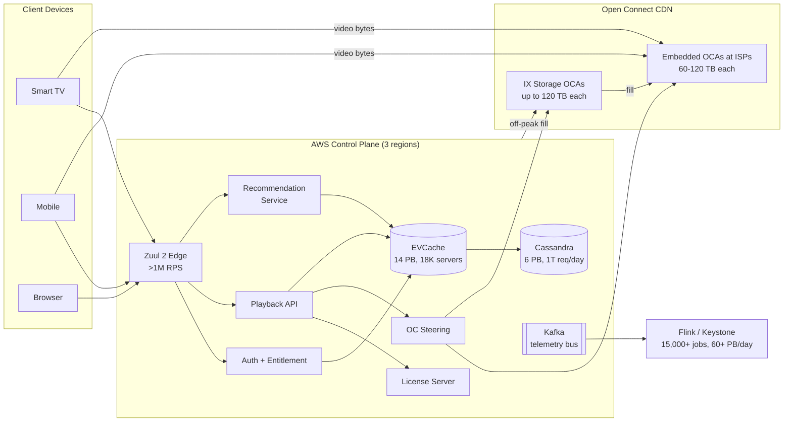
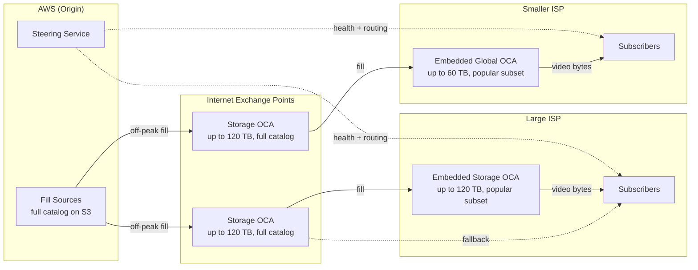
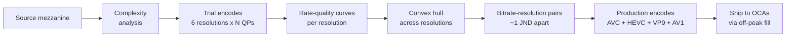
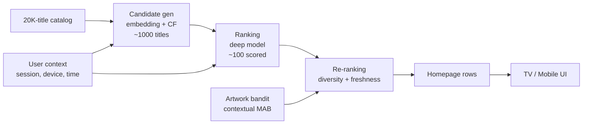
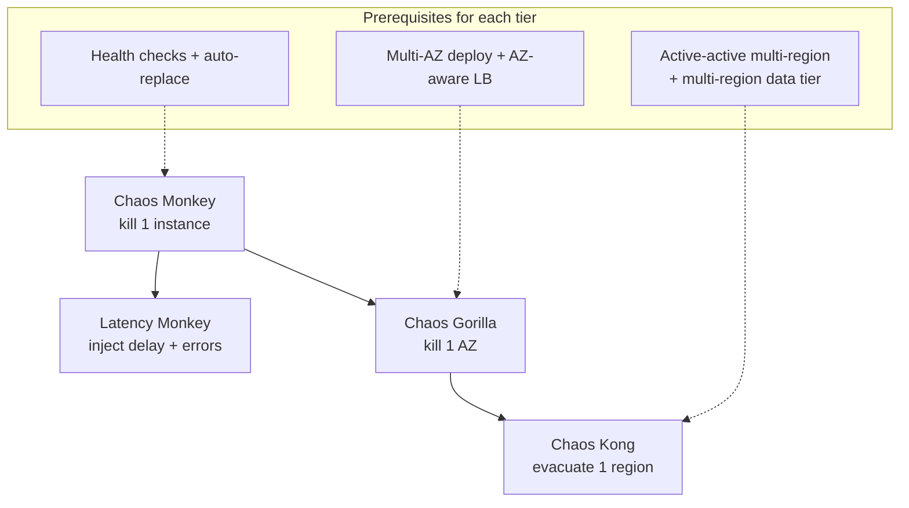

# Design Netflix (End-to-End)

> **TL;DR.** Netflix decouples a control plane (~1,000+ microservices on AWS as of 2020, multi-region active-active) from a data plane (Open Connect: ~18,000 custom appliances in 6,000+ ISP locations serving ~15% of global downstream internet traffic [^1]). The architecture is defined by three bets: build your own CDN once you exceed ~10% of internet traffic, encode every title against its own bitrate ladder to halve bandwidth at matched quality [^2], and prove resilience by deliberately breaking production (Chaos Monkey through Chaos Kong) [^3]. With 325 million paid subscribers [^4] and over 1 trillion Cassandra requests per day [^5], Netflix is the most publicly documented distributed system at planetary scale.

## Learning Objectives

- Design a VOD streaming architecture that separates control plane (AWS) from data plane (CDN) to achieve 99.99% availability
- Justify the economic crossover point (~10% of internet traffic) where building a custom CDN beats paying a commercial one
- Apply per-title and per-shot encoding with convex-hull optimization to halve bandwidth at matched perceptual quality
- Implement a two-stage recommendation funnel (candidate generation + deep ranking) within a 200 ms page-load budget
- Justify chaos engineering as a production discipline by mapping Simian Army tiers to infrastructure prerequisites
- Estimate capacity for 325M subscribers with ~15% of global downstream traffic

## Intuition

Imagine you run a chain of 6,000 neighborhood video stores, each stocked with the most popular movies for that zip code. A customer walks in, picks a title, and the clerk hands them the disc immediately. No internet order, no shipping delay, no warehouse in another state.

Now imagine you also run a central headquarters that decides which movies go to which stores. Every night, trucks deliver fresh titles to each location based on what the neighborhood is likely to watch tomorrow. The headquarters never touches the disc once it reaches the store. If headquarters burns down, the stores keep serving whatever they already have on the shelves.

That is Netflix's architecture. The "neighborhood stores" are Open Connect Appliances (OCAs), physical servers sitting inside your ISP's network. The "headquarters" is the AWS control plane: account management, personalization, DRM licensing, and the steering service that tells your TV which OCA to fetch from. The "overnight trucks" are the off-peak fill window (typically 02:00 to 06:00 local time) when OCAs pull new content.

The key insight: video bytes never traverse the public internet during playback. They travel from a server inside your ISP directly to your device. Netflix pays zero transit cost for those bytes, and the ISP saves backbone bandwidth. Both sides win, which is why ISPs host OCAs rent-free [^6]. This separation of control plane from data plane is the single most important architectural decision in the system.

## Requirements

### Clarifying Questions

- **Q: VOD only, or live streaming too?**
  Assume: VOD is the primary design. Live (WWE, boxing) is a follow-up extension.
- **Q: What scale of catalog and subscribers?**
  Assume: ~20,000 titles, 325M paid subscribers, 190+ countries [^4].
- **Q: What is the availability target?**
  Assume: 99.99% for playback start; control-plane degradation must not block video delivery.
- **Q: Multi-region required?**
  Assume: Yes, active-active across 3 AWS regions for the control plane.
- **Q: Latency target for playback start?**
  Assume: p99 < 200 ms from tap-to-first-byte for the manifest/license path; video segments served from local OCA add ~10-50 ms.
- **Q: What consistency model for user state?**
  Assume: Eventual consistency for viewing history and recommendations; strong consistency for billing and entitlements.

### Functional Requirements

- Stream video on demand from a catalog of ~20,000 titles across all device types (TV, mobile, web, console)
- Personalize homepage rows, title ordering, and artwork per user
- Issue DRM licenses and enforce concurrent-stream limits per account
- Adapt bitrate in real time based on measured throughput (ABR)
- Support offline downloads with time-limited DRM licenses

### Non-Functional Requirements

- **Load:** 325M subscribers, peak concurrent streams in tens of millions, Zuul edge handling >1M req/sec [^7]
- **Latency:** p99 < 200 ms for manifest + DRM license round-trip; sub-second video start
- **Availability:** 99.99% playback availability; graceful degradation when personalization is slow
- **Bandwidth:** ~15% of global downstream internet traffic [^1]
- **Durability:** content stored with 11-nines durability on S3; user state replicated across 3 regions

## Capacity Estimation

| Metric | Value | Derivation |
|--------|------:|------------|
| Paid subscribers | 325M | Q4 2025 earnings [^4] |
| Peak concurrent streams | ~65M | Tyson vs. Paul live event ceiling [^8] |
| Zuul edge RPS | >1M | 80+ clusters, 2018 figures [^7] |
| Cassandra requests/day | ~1T | 10,000+ instances, 6 PB, 100+ clusters [^5] |
| EVCache fleet (as of 2021) | ~18,000 servers | ~14 PB cached data [^9][^10] |
| OCA fleet | ~18,000 appliances | 6,000+ locations globally [^6] |
| Per-OCA throughput | up to 200 Gbps | Storage Appliance spec [^6] |
| Per-OCA storage | up to 120 TB | Raw NAND capacity [^6] |
| Global downstream share | ~15% | Sandvine GIPR 2018, 2023 [^1] |
| Spinnaker deployments (as cited 2021) | >20,000/day | Multi-region pipelines [^11] |
| Flink (Keystone) jobs | 15,000+ | Processing 60+ PB/day [^29] |

Key ratios:

- **Read:write** on the control plane is extreme: billions of manifest/recommendation reads per day vs. millions of writes (new viewing history entries, profile updates).
- **Cache hit rate** on EVCache is critical: sub-millisecond reads soak up hot-path load that would otherwise crush Cassandra [^9].
- **Fill bandwidth** during off-peak windows must deliver new titles to 18,000 OCAs before the next day's peak; hierarchical fill (AWS to IXP to ISP) parallelizes this.

## API and Data Model

### API Design

```http
POST /v1/play
  Authorization: Bearer <token>
  Body: { "title_id": "80100172", "device_id": "...", "profile_id": "..." }
  Returns: 200 {
    "manifest_url": "https://oca-123.nflxvideo.net/manifest.mpd",
    "license": "<base64 DRM license>",
    "oca_urls": ["https://oca-123...", "https://oca-456..."],
    "bitrate_ladder": [{"width": 1920, "bitrate_kbps": 5800}, ...]
  }

GET /v1/profiles/{profile_id}/homepage?device=tv&page=1
  Returns: 200 {
    "rows": [
      {"title": "Continue Watching", "items": [...]},
      {"title": "Because You Watched X", "items": [...]}
    ]
  }

GET /v1/titles/{title_id}/segments?range=0-299
  (Served directly by OCA, not AWS)
  Returns: 206 Partial Content (encrypted video bytes)

POST /v1/telemetry
  Body: { "events": [{"type": "rebuffer", "ts": "...", "bitrate": 3000}] }
  Returns: 202 Accepted
```

### Data Model

```sql
-- Cassandra: viewing history (multi-region async replication)
CREATE TABLE viewing_history (
  user_id       uuid,
  title_id      uuid,
  watched_at    timestamp,
  progress_pct  float,
  PRIMARY KEY ((user_id), watched_at)
) WITH CLUSTERING ORDER BY (watched_at DESC);

-- Cassandra: title metadata
CREATE TABLE titles (
  title_id      uuid PRIMARY KEY,
  name          text,
  genres        set<text>,
  bitrate_ladder frozen<list<frozen<map<text, int>>>>,
  available_regions set<text>
);

-- EVCache: session and entitlement (sub-ms reads)
-- Key: "session:{user_id}" -> {device_ids, concurrent_count, region}
-- Key: "entitlement:{user_id}:{title_id}" -> {allowed, expiry}
```

Partition key for viewing history is `user_id`, giving per-user locality. Cassandra's multi-datacenter async replication matches the active-active geography requirement [^5].

## High-Level Architecture



*The control plane (AWS) handles auth, personalization, DRM, and steering; video bytes flow directly from OCAs inside the viewer's ISP, never traversing AWS during playback.*

**Write path:** User actions (play, pause, rate) flow through Zuul to application services, which write to Cassandra (durable) and invalidate EVCache. Telemetry events stream to Kafka for real-time processing via the Keystone pipeline (Apache Flink): 15,000+ jobs processing 60+ PB/day across data movement, personalization, messaging, and finance use cases [^29].

**Read path:** Homepage requests hit Zuul, which routes to the recommendation service. The recommender reads user features from EVCache (sub-ms), scores candidates, and returns personalized rows. Playback requests follow the press-play sequence: auth, entitlement, manifest, DRM license, OCA URL selection.

**Async path:** Off-peak fill pushes new encodes from S3 through IXP OCAs down to ISP-embedded OCAs. Kafka telemetry feeds model retraining, A/B test analysis, and real-time alerting.

## Deep Dives

### Deep dive 1: Open Connect CDN and peering economics

The defining architectural bet: at ~15% of global downstream internet traffic [^1], paying a commercial CDN would cost hundreds of millions annually. Netflix instead ships custom 2U FreeBSD/Nginx appliances to ISPs and internet exchanges [^6].

**Hardware:** Each Storage Appliance packs up to 120 TB of commodity NAND SSDs and delivers ~200 Gbps from a single AMD processor; Storage Appliances are used at IX (internet exchange) locations and embedded at larger ISP partners. The Global Appliance offers ~60 TB and ~80 Gbps at ~250 W peak power and is used for smaller ISP partners and emerging markets [^6]. The software stack is FreeBSD-CURRENT (Netflix engineers are upstream kernel committers), Nginx for HTTP serving with kTLS and sendfile(2), and BIRD for BGP peering [^6].

**Two-tier topology:** Smaller ISP-embedded OCAs cache only the popular subset (hot titles for that region). OCAs at internet exchanges (and at larger ISPs) hold the full catalog. AWS-hosted fill sources are the ultimate origin. A central steering service in AWS tells each client which OCA to hit based on health metrics, utilization, and measured throughput [^6].

**Economics:** ISPs host OCAs rent-free because it saves them backbone transit. Netflix pays zero egress. The crossover point is roughly 10% of peak internet traffic: below ~5%, a commercial CDN is cheaper; above ~10%, custom hardware wins decisively [^6][^12].



*Open Connect is a two-tier CDN: ISP-embedded OCAs serve the popular subset locally; OCAs at internet exchanges hold the full catalog as fallback; AWS is only the fill source and control plane. Storage Appliances (up to 120 TB) are used at IXes and larger ISPs; Global Appliances (up to 60 TB) are used at smaller ISPs and in emerging markets.*

### Deep dive 2: Per-title and per-shot encoding

A fixed bitrate ladder (235/560/1050/1750/2350/3000/4300/5800 kbps) wastes bits on simple content and under-serves complex content. Per-title encoding analyzes each title's complexity, runs trial encodes at six candidate resolutions across a range of quantization parameters, measures quality using VMAF [^13][^14], and picks bitrate-resolution pairs on the convex hull of the rate-quality curves [^2].

Results: for a 1080p animation title, Netflix moved from 1750 kbps at 480p on the fixed ladder to 1540 kbps at 1080p on the per-title ladder [^2]. At matched quality (VMAF=80), the optimized ladder uses less than half the bits [^15].

Per-shot encoding ("Dynamic Optimizer", 2018) extends this to individual shots. A 1-hour episode becomes ~900 shot-boundary-aligned units at ~4 second average shot length, each independently optimized [^15]. The ladder routes bits to hard shots and starves easy shots.

**Pipeline complexity:** Going from 20 chunks to 900 shots per episode increased messaging volume by ~100x. The team added collation (packing shots into chunk-sized work units) and checkpointing (persisting each shot's encode to S3 so a preempted spot instance does not redo work) [^15].

**Codec coverage:** AVC (H.264) as universal fallback, HEVC for premium devices, VP9 for Android, and AV1 via hardware decoders on modern TVs. As of late 2025, AV1 powers ~30% of all Netflix viewing, produces VMAF scores 4.3 points higher than AVC, and drives 45% fewer buffering interruptions [^16].



*The per-title encoder picks bitrate-resolution pairs on the convex hull of rate-quality curves; the fixed ladder assigns resolutions by pre-set thresholds and wastes bits on simple content.*

### Deep dive 3: Recommendation architecture

Netflix personalizes not just the rows on your homepage but the row order, title-within-row order, artwork shown for each title, and the trailer played on hover. The combined system is valued internally at over $1 billion per year in retained subscription revenue [^17].

**Two-stage funnel:**

1. **Candidate generation** retrieves ~1,000 candidates from the ~20,000-title catalog using embedding similarity (two-tower neural networks) and collaborative-filtering lookups.
2. **Ranking** scores candidates with a heavier deep model incorporating user context, session context, time of day, and device.
3. **Re-ranking** enforces business rules: diversity, freshness, licensing-window expiry.

**Artwork personalization** uses contextual bandits: for each (user, title) pair, pick the image variant most likely to earn a play while balancing exploration against exploitation [^18]. Roughly 82% of a browsing member's focus is on artwork [^18].

The latency budget for the entire page is ~200 ms. The two-stage pattern (fast retrieval over the full catalog, expensive ranking over a small set) is what keeps it feasible.



*The two-stage recommendation funnel: cheap retrieval produces ~1,000 candidates; an expensive ranker scores them; a re-ranker applies business rules and artwork personalization.*

### Deep dive 4: Chaos engineering and multi-region resilience

Netflix runs three AWS regions active-active for the US/EU control plane, roughly doubling compute cost relative to active-passive but giving near-zero RTO on a region failure [^3]. To prove that property holds, they built the Simian Army.

**Progression of severity:**

- **Chaos Monkey** terminates random instances during business hours. Integrated with Spinnaker: every deployed service is eligible unless it explicitly opts out [^19].
- **Chaos Gorilla** takes out an entire Availability Zone.
- **Chaos Kong** evacuates a whole region. Netflix has shifted live US traffic from us-east-1 entirely to us-west-2 for over 24 hours with no user-visible outage [^3][^20].
- **Latency Monkey** injects delays and error responses between services.

**Canonical validation:** A 2014 AWS us-east-1 reboot event was mostly invisible to Netflix members because recent Chaos Kong exercises had proven the traffic could shift west [^20].

**Circuit breakers (Hystrix to Envoy):** Hystrix introduced the three-state circuit breaker (CLOSED, OPEN, HALF_OPEN) with thread-pool isolation [^21]. It entered maintenance mode in 2018 [^22]. Netflix shifted to adaptive concurrency limits (based on Little's Law and real-time latency) and service-mesh resilience via Envoy [^22]. The lesson: pre-configured thresholds became a liability at scale; adaptive limits that respond to measured latency are the successor pattern.



*The Simian Army increases failure blast radius as the system proves it can absorb each tier; Chaos Kong is only run once Chaos Gorilla is routinely green.*

The discipline is codified in the Principles of Chaos Engineering: form a hypothesis about steady-state behavior, vary real-world events, run in production, minimize blast radius, automate [^23].

## Real-World Example

In 2008, Netflix suffered a major database corruption that took the service offline for three days. That incident catalyzed the migration from a single-datacenter Oracle stack to AWS [^24]. The migration took seven years (completed January 2016) and forced every team to design for failure [^24].

Open Connect emerged in 2011-2012 as the secret weapon against CDN costs. At the time, Netflix was paying Akamai and Limelight tens of millions annually. Once traffic crossed ~10% of peak internet bandwidth, the economics flipped: shipping custom FreeBSD boxes to ISPs became cheaper than any CDN contract [^6][^12]. Today, ~18,000 OCAs in 6,000+ locations serve close to all video bytes [^6].

The chaos engineering culture grew directly from the AWS migration. When you run on commodity infrastructure that can fail at any moment, the only way to know your system survives is to kill things deliberately. Netflix introduced Chaos Monkey in 2011 (open-sourced under Apache 2.0 in 2012); by 2014, Netflix could evacuate an entire AWS region without user impact [^20]. The practice was codified by Casey Rosenthal and Nora Jones in the O'Reilly book "Chaos Engineering" (2020) [^23].

The November 2024 Jake Paul vs. Mike Tyson boxing match tested the architecture at 65 million concurrent viewers [^8]. It exposed the gap between VOD (content pre-positioned on OCAs) and live streaming (content generated in real-time, no pre-positioning possible). A retry storm converted a transient glitch into widespread buffering. Netflix CTO Elizabeth Stone later said part of the fix was "building a more flexible algorithm for choosing which appliance a given user streams from" [^8]. The live platform now processes up to 38 million telemetry events per second [^25].

## Trade-offs

| Approach | Pros | Cons | When to Use | Our Pick |
|----------|------|------|-------------|----------|
| Build your own CDN (Open Connect) | Zero transit cost, video-tuned kernel, peering leverage | Hardware logistics; multi-year buildout; capex only amortizes at hyperscale streaming volume | Moving double-digit % of internet traffic | Yes, at Netflix scale |
| Pay a commercial CDN (Akamai/Cloudflare) | No capex, fast time to market | Egress bills scale linearly, shared tenancy | Below ~5% of internet traffic | For startups and mid-scale |
| Multi-region active-active | ~Zero RTO on region failure, load-balances normal traffic | ~2x cost, conflict resolution, requires multi-region data tier | Mission-critical consumer service above $1B revenue | Yes, for Netflix |
| Multi-region active-passive | Simpler data path, cheaper | Minutes of RTO, cold standby may not work | Tolerant of some downtime | For most companies |
| Per-title / per-shot encoding | 20-50% bandwidth savings at matched VMAF | Much more encoding compute, pipeline complexity | Billion+ viewing hours, CDN egress is top-3 cost | Yes, at Netflix scale |
| Fixed bitrate ladder | Simple, predictable, cheap to run | Wastes bits on easy content, under-serves hard content | Small catalog, small audience | For early-stage services |
| Service mesh (Envoy) | Language-agnostic resilience, uniform policy | Mesh ops team, sidecar latency overhead | Polyglot microservice estate with platform org | Netflix's current direction |

The meta-decision: Netflix's architecture is expensive. Active-active doubles compute. Open Connect requires hardware logistics at 18,000-unit scale[^6]. Per-title encoding multiplies encoding compute by 10-100x. These bets only pay off above hyperscale streaming revenue (Netflix reported ~$45B in 2025[^4]). For most companies, the right answer is: commercial CDN, active-passive, fixed bitrate ladder, and a modular monolith.

## Scaling and Failure Modes

**At 10x load (popular title launch):** The control plane (manifest, DRM, steering) faces thundering-herd pressure. Mitigation: predictive autoscaling via Scryer [^26], EVCache warming pipelines that move petabytes at deploy time via EBS snapshots [^9], and Zuul admission control that sheds excess requests.

**At 100x load (live event, 65M concurrent):** The live platform cannot pre-position content on OCAs. Ingest latency matters. Retry storms cascade. Mitigation: server-guided backoff (Retry-After header), regional traffic rebalancing, and the 38M events/sec telemetry pipeline for real-time detection [^25].

**At 1000x load (hypothetical global live event):** The steering service becomes the bottleneck. OCAs saturate their 200 Gbps links. Mitigation: multi-CDN failover (use Akamai/Cloudflare as overflow), edge-side manifest caching, and client-side OCA selection with local health probes.

**Failure mode 1: AWS region outage.** Chaos Kong has proven the system survives. Traffic shifts to remaining regions via DNS and client-side failover. EVCache cross-region invalidation via SQS ensures eventual consistency within hundreds of milliseconds [^3][^9].

**Failure mode 2: OCA degradation in a major ISP.** The steering service detects health degradation and re-routes clients to IXP OCAs or neighboring ISP OCAs within seconds. Clients see a brief quality dip (lower bitrate from a more distant OCA) but no interruption [^6].

**Failure mode 3: Personalization service timeout.** Circuit breaker trips OPEN. Fallback serves "Continue Watching" + "Popular in [Country]" rows from EVCache. Playback is never blocked by a slow recommendation service.

## Common Pitfalls

> [!WARNING]
> **Copying Netflix microservices without the platform.** An org with 50 engineers splits a monolith into 80 microservices with no service mesh or mature CD. Result: cascading failures weekly. Netflix's architecture works because ~2,000 platform engineers staff the tooling. Start with a modular monolith; carve out services only where the scaling axis demands it.

> [!WARNING]
> **Active-active without the data tier to match.** Services deploy active-active in two regions, but the database is single-region RDS. A region failure takes everything down anyway. Active-active requires a multi-region-native data store (Cassandra, DynamoDB Global Tables, Spanner) for any data on the hot path [^3].

> [!WARNING]
> **Retry storms during live events.** Uncoordinated client retries with no backoff jitter convert a transient glitch into a full outage. At 65 million concurrent viewers, a 1% retry fraction is 650,000 extra requests per second [^8]. Mitigation: server-guided backoff, regional traffic rebalancing, and admission control at the edge.

> [!WARNING]
> **Over-engineering the encoding pipeline at small scale.** Per-title encoding only pays off at billions of viewing hours. If your CDN spend is not a top-3 line item, a fixed bitrate ladder is fine. Count CDN cost vs. encoding-infrastructure cost before investing.

> [!WARNING]
> **Thundering herd on popular launches.** Every client hits the playback API simultaneously on a popular title release. Mitigation: predictive autoscaling (Scryer) [^26], cache warming, admission control, and graceful degradation that serves a generic homepage when personalization is slow.

## Follow-up Questions

**1. How would you architect the ads-supported tier (launched Nov 2022)?**

Microsoft's ad-tech stack handles targeting and auction [^27]. The manifest includes ad-break markers; the client fetches ad creatives from a separate CDN. The playback API inserts ad pods at server-stitched or client-stitched break points. Key constraint: ad latency cannot exceed 200 ms or users perceive a stall.

**2. How does live sports infrastructure differ from VOD (WWE 2025, boxing)?**

No pre-positioning on OCAs. Ingest from venue encoders via redundant paths. Real-time encoding with reduced per-shot optimization (latency budget is seconds, not hours). Multi-CDN failover for overflow. The 38M events/sec telemetry pipeline detects retry storms within seconds [^25][^8].

**3. How did the password-sharing crackdown (May 2023) change the architecture?**

Device-location fingerprinting (IP geolocation + device graph) to detect out-of-household usage. Enforcement at the entitlement layer: if the device is outside the household, prompt to add a member or block. Netflix gained ~30 million subscribers in 2023 from this enforcement [^28].

**4. How do offline downloads work with DRM?**

The license server issues a time-limited offline license (typically 48 hours after first play, 30 days after download). Content is encrypted with the same CENC keys. The device stores encrypted segments locally; playback requires a valid cached license. Widevine (Android), FairPlay (iOS), PlayReady (Windows) each handle offline differently.

**5. How would you handle multi-CDN failover for a global live event?**

The steering service maintains health scores for Open Connect OCAs and commercial CDN endpoints (Akamai, Cloudflare). When OCA utilization exceeds a threshold (e.g., 80% of 200 Gbps), the steering service shifts overflow traffic to commercial CDN. Client-side logic also probes alternate URLs on timeout.

**6. What changes for podcast or audio-only streaming?**

Same manifest/DRM/OCA architecture but with much smaller segment sizes (~128 kbps vs. 5,800 kbps). OCAs can serve 100x more concurrent audio streams per box. The encoding pipeline simplifies to a fixed ladder (AAC-LC at 64/128/256 kbps). Personalization and recommendation remain identical.

**7. How does Netflix Games (2024, 100+ titles) integrate with the streaming platform?**

Games are distributed via mobile app stores (iOS, Android), not OCAs. The Netflix app acts as a launcher; game binaries are separate downloads. Authentication reuses the existing account/profile/entitlement stack. No ads, no in-app purchases (included with all plans). Cloud gaming (beta 2024) streams interactive frames from server-side GPU instances, reusing the low-latency OCA steering logic but requiring sub-50 ms round-trip rather than buffered segments [^30].

## Exercise

### Exercise 1: Press-play latency budget

Design the "press play" path in detail: from the TV app firing a POST, through the Zuul gateway, the account service, the entitlements check, the playback manifest service, the DRM license issuance, and the first video segment. Annotate each hop with a latency budget (total manifest round-trip under 200 ms). Then design the degraded-mode fallback when the personalization service is slow.

<details>
<summary>Hint</summary>

Think about which hops are on the critical path (blocking playback) vs. which can be served from cache or skipped entirely. The circuit breaker's HALF_OPEN state is how you detect recovery.

</details>

<details>
<summary>Solution</summary>

**Per-hop budget (total < 200 ms):**

| Hop | Budget | Notes |
|---|---|---|
| Zuul edge processing | 20 ms | TLS termination, filter chain |
| Auth validation | 10 ms | Token verification from EVCache |
| Entitlement check | 30 ms | Account status, geo-licensing |
| Playback manifest assembly | 50 ms | Bitrate ladder selection, OCA ranking |
| DRM license issuance | 40 ms | Device attestation, key wrapping |
| Network overhead | 50 ms | Client to nearest AWS region |

**Degraded-mode fallback:** When the personalization service exceeds its p99 budget, the circuit breaker trips OPEN. The playback API falls back to: (1) "Continue Watching" row from EVCache, (2) "Popular in [Country]" from a pre-computed cache, (3) Editorial "Top 10" (static, refreshed hourly). These rows are always available from EVCache without hitting personalization. Recovery: HALF_OPEN after a 5-second sleep window allows one probe; success closes the circuit.

</details>

### Exercise 2: OCA capacity planning

A new ISP in Brazil with 2 million Netflix subscribers wants to host OCAs. Estimate how many appliances they need and what storage capacity is required, assuming 60% of viewing comes from the top 500 titles and each title averages 4 GB across all renditions.

<details>
<summary>Hint</summary>

Calculate peak concurrent streams for 2M subscribers (assume 10% concurrency at peak). Then calculate bandwidth needed per stream (~5 Mbps average) and divide by per-OCA throughput. For storage, calculate how many titles fit on one 60 TB appliance.

</details>

<details>
<summary>Solution</summary>

Peak concurrent: 2M x 10% = 200,000 streams. Bandwidth: 200,000 x 5 Mbps = 1 Tbps. Per OCA: ~80 Gbps (Global Appliance). Need: 1,000 / 80 = ~13 OCAs for bandwidth. Storage: top 500 titles x 4 GB = 2 TB (fits easily on one 60 TB box). The constraint is bandwidth, not storage. Deploy 15 OCAs (with headroom) across 3-4 POPs in the ISP's network. The remaining 58 TB per box caches the long tail for reduced IXP fallback.

</details>

## Key Takeaways

- **Control plane / data plane separation is the architecture.** AWS handles auth, personalization, and DRM; Open Connect handles bytes. A region failure does not stop playback for cached content.
- **Build your own CDN only above ~10% of peak internet traffic.** Below that, pay Akamai. Do not copy Open Connect at 1% of Netflix's scale.
- **Per-title encoding halves bandwidth at matched quality** but only pays off at billions of viewing hours. Start with a fixed ladder.
- **Active-active multi-region is expensive (~2x cost)** and requires a multi-region-native data tier. Active-passive is fine for 99% of products.
- **Chaos engineering is not a flex.** It is the only way to verify resilience at Netflix's scale and deploy velocity. Staging is never production.
- **The service mesh replaced the in-process library.** Hystrix is deprecated since 2018; adaptive concurrency limits are the successor.

## Further Reading

- [Open Connect Appliances](https://openconnect.netflix.com/en/appliances/) - Netflix's public documentation of OCA hardware specs, software stack, and peering program; the primary source for CDN architecture details.
- [Per-Title Encode Optimization (Aaron et al., 2015)](https://netflixtechblog.com/per-title-encode-optimization-7e99442b62a2) - the foundational paper on rate-quality convex-hull optimization that started the per-title line of work.
- [Optimized Shot-Based Encodes: Now Streaming (2018)](https://netflixtechblog.com/optimized-shot-based-encodes-now-streaming-4b9464204830) - the per-shot productization, including the 100x messaging scale-up and checkpointing design.
- [Active-Active for Multi-Regional Resiliency (2013)](https://netflixtechblog.com/active-active-for-multi-regional-resiliency-c47719f6685b) - the canonical active-active migration write-up with EVCache cross-region invalidation.
- [Chaos Engineering Upgraded (Chaos Kong)](https://netflixtechblog.com/chaos-engineering-upgraded-878d341f15fa) - region evacuation in production and the 2014 us-east-1 validation.
- [The Netflix Recommender System (Gomez-Uribe and Hunt, 2015)](https://dl.acm.org/doi/10.1145/2843948) - the $1B/year personalization system paper covering A/B testing culture and the two-stage funnel.
- [AV1: Now Powering 30% of Netflix Streaming (2025)](https://netflixtechblog.com/av1-now-powering-30-of-netflix-streaming-02f592242d80) - current state of codec rollout with VMAF and rebuffer comparisons.
- [Principles of Chaos Engineering](https://principlesofchaos.org/) - the community-maintained manifesto codifying Netflix's chaos practices into universal principles.

## Flashcards

<details>
<summary><strong>Q: Why did Netflix build Open Connect instead of using a commercial CDN?</strong></summary>

A: At ~15% of global downstream internet traffic, transit bills from a commercial CDN would be astronomical. Shipping custom FreeBSD/Nginx boxes to ISPs costs less because ISPs host them rent-free (saving their own backbone traffic) and Netflix pays zero egress for bytes served locally.

</details>

<details>
<summary><strong>Q: What is the per-title encoding convex hull?</strong></summary>

A: For each candidate resolution, Netflix runs trial encodes at various quality parameters, plots bitrate vs. VMAF quality, and picks bitrate-resolution pairs on the convex hull (maximum quality per bit). This uses less than half the bits of a fixed ladder at matched quality.

</details>

<details>
<summary><strong>Q: What are the three states of a Hystrix circuit breaker?</strong></summary>

A: CLOSED (requests flow normally), OPEN (requests fail fast after error threshold breach), HALF_OPEN (one probe request allowed after a sleep window; success closes the circuit, failure re-opens it).

</details>

<details>
<summary><strong>Q: Why is Hystrix deprecated and what replaced it?</strong></summary>

A: Hystrix entered maintenance mode in 2018 because pre-configured thresholds became a liability at scale. Netflix shifted to adaptive concurrency limits (based on Little's Law and real-time latency) and service-mesh-level resilience via Envoy.

</details>

<details>
<summary><strong>Q: What is the difference between Chaos Monkey, Chaos Gorilla, and Chaos Kong?</strong></summary>

A: Chaos Monkey kills a single instance. Chaos Gorilla takes out an entire Availability Zone. Chaos Kong evacuates a whole AWS region. Each tier requires the previous tier's prerequisites to be proven first.

</details>

<details>
<summary><strong>Q: How does EVCache handle cross-region consistency?</strong></summary>

A: Writes in one region asynchronously invalidate the corresponding key in the other region via SQS. This accepts bounded eventual consistency (a few hundred ms of staleness) as the cost of cheaper, latency-tolerant replication.

</details>

<details>
<summary><strong>Q: What is the economic crossover point for building your own CDN?</strong></summary>

A: Roughly 10% of peak internet traffic. Below ~5%, a commercial CDN is cheaper. Above ~10%, transit bills overwhelm any CDN contract and custom hardware becomes cost-optimal.

</details>

<details>
<summary><strong>Q: How does Netflix handle a thundering herd on a popular title launch?</strong></summary>

A: Predictive autoscaling (Scryer) pre-provisions capacity based on historical load shapes, EVCache warming pipelines move petabytes at deploy time, Zuul admission control sheds excess requests, and graceful degradation serves generic rows from cache when personalization is slow.

</details>

<details>
<summary><strong>Q: What percentage of Netflix viewing uses AV1 as of 2025?</strong></summary>

A: ~30%. AV1 produces VMAF scores 4.3 points higher than AVC and drives 45% fewer buffering interruptions while using roughly one-third less bandwidth.

</details>

<details>
<summary><strong>Q: How does the two-stage recommendation funnel stay within a 200 ms budget?</strong></summary>

A: Candidate generation uses cheap embedding lookups to retrieve ~1,000 titles from the 20K catalog. Only those ~1,000 pass to the expensive deep ranker, which scores ~100. This asymmetry (fast retrieval, expensive ranking over a small set) keeps total latency feasible.

</details>

## References

[^1]: Sandvine, "Global Internet Phenomena Report" (2018, 2023). https://www.sandvine.com/inthenews/netflix-eats-up-15-of-global-downstream-traffic
[^2]: A. Aaron, Z. Li, M. Manohara, J. De Cock, D. Ronca, "Per-Title Encode Optimization," Netflix Technology Blog, Dec 14 2015. https://netflixtechblog.com/per-title-encode-optimization-7e99442b62a2
[^3]: Netflix Technology Blog, "Active-Active for Multi-Regional Resiliency," Dec 2 2013. https://netflixtechblog.com/active-active-for-multi-regional-resiliency-c47719f6685b
[^4]: TheWrap, "Netflix Q4 Revenue Surges as Streamer Reaches 325 Million Paid Subscribers," Jan 2026. https://www.thewrap.com/industry-news/business/netflix-earnings-q4-2025/
[^5]: Apache Cassandra 4.0 release announcement, including Netflix scale statistics. https://news.apache.org/foundation/entry/the-apache-cassandra-project-releases
[^6]: Netflix Open Connect, "Open Connect Appliances (hardware and software specifications)." https://openconnect.netflix.com/en/appliances/
[^7]: Netflix Technology Blog, "Open Sourcing Zuul 2," May 21 2018. https://netflixtechblog.com/open-sourcing-zuul-2-82ea476cb2b3
[^8]: Sports Business Journal, "Netflix makes improvements to live events as push into area grows," Jan 13 2026. https://www.sportsbusinessjournal.com/Articles/2026/01/13/netflix-makes-improvements-to-live-events-as-push-into-area-grows/
[^9]: Netflix Technology Blog (Medium), "Cache warming: Leveraging EBS for moving petabytes of data," Nov 2021. https://netflixtechblog.medium.com/cache-warming-leveraging-ebs-for-moving-petabytes-of-data-adcf7a4a78c3
[^10]: Netflix Technology Blog, "Evolution of Application Data Caching: From RAM to SSD," Jul 2018. https://netflixtechblog.com/evolution-of-application-data-caching-from-ram-to-ssd-a33d6fa7a690
[^11]: Spinnaker blog, "Evolving How Netflix Builds, Maintains, and Operates Their Spinnaker Distribution," May 2021. https://blog.spinnaker.io/evolving-how-netflix-builds-maintains-and-operates-their-spinnaker-distribution-33c844d0102c
[^12]: Netflix Open Connect, program overview. https://openconnect.netflix.com/en/
[^13]: Netflix/vmaf README. https://github.com/Netflix/vmaf
[^14]: Netflix Technology Blog, "Toward a Practical Perceptual Video Quality Metric (VMAF)," Jun 6 2016. https://netflixtechblog.com/toward-a-practical-perceptual-video-quality-metric-653f208b9652
[^15]: M. Manohara, A. Moorthy, J. De Cock, I. Katsavounidis, A. Aaron, "Optimized shot-based encodes: Now Streaming!", Netflix Technology Blog, Mar 9 2018. https://netflixtechblog.com/optimized-shot-based-encodes-now-streaming-4b9464204830
[^16]: Netflix Technology Blog, "AV1 - Now Powering 30% of Netflix Streaming," Dec 1 2025. https://netflixtechblog.com/av1-now-powering-30-of-netflix-streaming-02f592242d80
[^17]: C. A. Gomez-Uribe and N. Hunt, "The Netflix Recommender System: Algorithms, Business Value, and Innovation," ACM Transactions on Management Information Systems, 2015. https://dl.acm.org/doi/10.1145/2843948
[^18]: Netflix Technology Blog, "Artwork Personalization at Netflix," Dec 7 2017. https://netflixtechblog.com/artwork-personalization-c589f074ad76
[^19]: Netflix/chaosmonkey README. https://github.com/Netflix/chaosmonkey
[^20]: Netflix Technology Blog, "Chaos Engineering Upgraded (Chaos Kong)." https://netflixtechblog.com/chaos-engineering-upgraded-878d341f15fa
[^21]: Netflix/Hystrix circuit breaker source. https://github.com/Netflix/Hystrix/blob/master/hystrix-core/src/main/java/com/netflix/hystrix/HystrixCircuitBreaker.java
[^22]: Netflix/Hystrix README, "Hystrix Status: maintenance mode." https://github.com/Netflix/Hystrix
[^23]: C. Rosenthal and N. Jones (eds.), "Chaos Engineering: System Resiliency in Practice," O'Reilly, 2020. https://principlesofchaos.org/
[^24]: Y. Izrailevsky, S. Vlaovic, R. Meshenberg, "Completing the Netflix Cloud Migration," Netflix (about.netflix.com), Feb 12 2016. https://about.netflix.com/en/news/completing-the-netflix-cloud-migration
[^25]: J. Ozer, "Netflix's Live Platform: What Streaming Engineers Can Learn," Streaming Learning Center, Jul 28 2025. https://streaminglearningcenter.com/blogs/netflixs-live-platform-what-streaming-engineers-can-learn-and-what-they-cant.html
[^26]: Netflix Technology Blog, "Scryer: Netflix's Predictive Auto-Scaling Engine." https://netflixtechblog.com/scryer-netflixs-predictive-auto-scaling-engine-a3f8fc922270
[^27]: Microsoft Advertising blog, "How Microsoft will power Netflix's new ad-supported tier," Oct 2022. https://about.ads.microsoft.com/en-us/blog/post/october-2022/how-microsoft-will-power-netflix-new-ad-supported-tier
[^28]: Business Insider, "Netflix added almost 30 million subscribers in 2023 after cracking down on password sharing," Jan 2024. https://www.businessinsider.com/netflix-password-sharing-crackdown-worked-how-to-increase-subscription-streaming-2024-1
[^29]: Confluent Current 2024, "Building a Scalable Flink Platform: A Tale of 15,000 Jobs at Netflix." https://current.confluent.io/2024-sessions/building-a-scalable-flink-platform-a-tale-of-15-000-jobs-at-netflix
[^30]: Netflix, "All of The Games on Netflix Right Now," 2024. https://www.netflix.com/tudum/games
