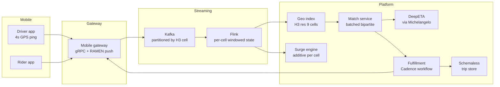
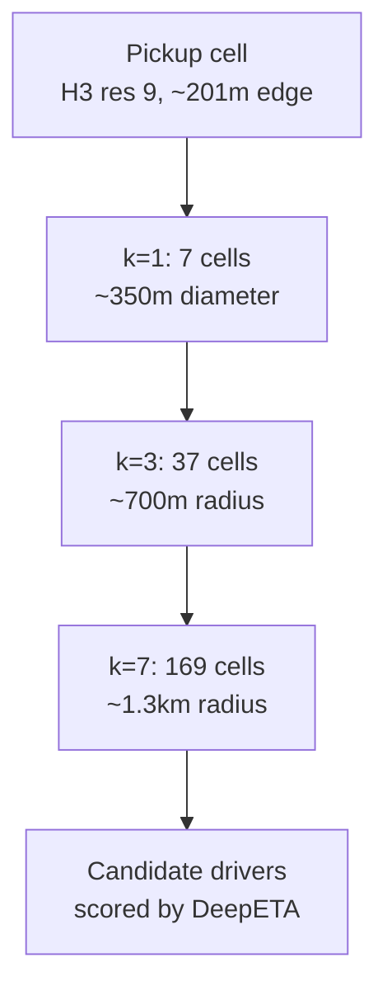
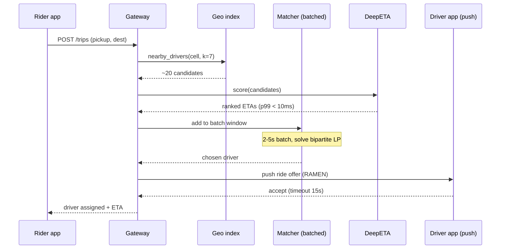
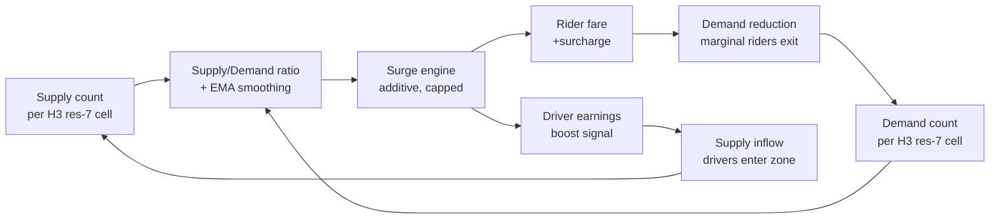
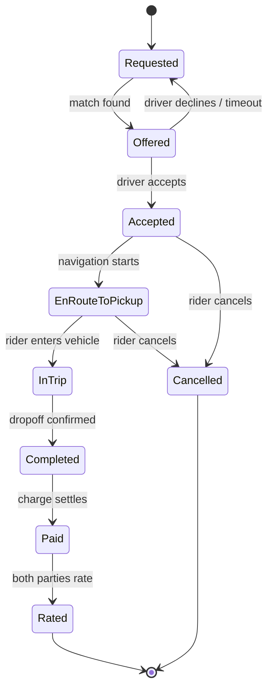

# Design a Ride-Hailing Service (Uber / Lyft)

> **TL;DR.** Ride-hailing is a two-sided marketplace where physical state (moving vehicles, moving riders) collides with a globally distributed backend that must match them in under one second. Uber completed over 15 billion trips in FY2025 (up from 11.3B in FY2024) across 70+ countries [^1][^36]. The system absorbs ~1.25 million GPS updates per second, indexes them in Uber's H3 hexagonal grid [^2], runs batched bipartite matching every 2 to 5 seconds [^3], and orchestrates each trip through a durable Cadence workflow [^4]. The pivotal trade-off: batched matching adds visible latency but produces documented double-digit utility gains over greedy dispatch.

## Learning Objectives

After this module, you will be able to:

- [ ] Choose a geospatial indexing scheme (H3, S2, geohash, quadtree) and defend the trade-offs for ride matching
- [ ] Design a streaming pipeline that ingests millions of driver location updates per second
- [ ] Apply batched bipartite matching under latency and supply constraints
- [ ] Justify additive surge pricing as a market-clearing mechanism with incentive-compatibility guarantees
- [ ] Model a trip as a durable workflow that survives client restarts and network partitions
- [ ] Estimate capacity for peak QPS on the geo index and downstream notification fan-out

## Intuition

Imagine you run a taxi dispatch office in the 1970s. A wall-sized map of the city hangs behind you, covered in magnets. Each magnet is a cab. Every few seconds, drivers radio in their cross-street, and you slide their magnet to the new position.

When a customer calls, you glance at the map, find the three closest magnets, and radio the nearest driver. Simple. But on New Year's Eve the phone rings 50 times a minute. You cannot keep up. You hire more dispatchers, split the map into zones, and give each dispatcher a zone. Now each person handles fewer calls, but a customer on a zone boundary might get a worse match because the dispatcher cannot see the magnet one block away in the next zone.

That is the ride-hailing problem at its core. The "magnets" are GPS pings from 5 million drivers. The "map zones" are hexagonal cells in a geospatial index. The "dispatcher" is a matching algorithm that runs every few seconds. The "New Year's Eve rush" is surge pricing. And the "zone boundary" problem is why hexagons (one neighbor class, uniform center-to-center distance) beat squares (two neighbor classes, diagonal distortion).

The engineering challenge is not dispatching one ride. It is dispatching over 40 million rides per day [^36] while every magnet moves every 4 seconds [^5], the map spans 10,000+ cities [^6], and the dispatcher must decide in under one second.

## Requirements

### Clarifying Questions

- **Q: What is the geographic scope?**
  Assume: Global, 70+ countries, 10,000+ cities [^6]. Multi-region active-active.
- **Q: Human drivers only, or autonomous vehicles too?**
  Assume: Primarily human. AVs are a driver type with geofence constraints (Waymo, Avride, and 20+ partners as of 2026) [^37].
- **Q: 1:1 rides only, or shared/pool rides?**
  Assume: Both. Shared rides turn bipartite matching into a many-to-one variant.
- **Q: What latency target for dispatch?**
  Assume: p99 < 1 second for geo lookup + ETA scoring; 2 to 5 seconds for the batch window.
- **Q: What availability target?**
  Assume: 99.95% for the dispatch path. Degraded mode (greedy fallback) rather than refusal.
- **Q: How fresh must driver locations be?**
  Assume: 4-second update interval from driver apps [^5]. Stale by at most one interval.

### Functional Requirements

- Rider requests a trip with pickup and destination; system matches to a nearby driver within seconds.
- Driver receives ride offers via push; accepts or declines within 15 seconds.
- Real-time ETA updates for both rider (pickup ETA) and driver (navigation).
- Dynamic pricing adjusts fares based on local supply-demand imbalance.
- Trip lifecycle tracking from request through payment and rating.
- Shared rides: multiple riders matched to one driver with detour optimization.

### Non-Functional Requirements

- **Load:** 40M+ trips/day (FY2025), ~1.25M location updates/sec peak, tens of millions of concurrent connections [^36][^5].
- **Latency:** p99 < 100 ms for geo index queries; p99 < 1s end-to-end dispatch (excluding batch window).
- **Availability:** 99.95% for the dispatch path.
- **Consistency:** Eventual for location index (4s staleness acceptable); strong for trip state transitions.
- **Durability:** Trip records must survive any single-region failure.

## Capacity Estimation

| Metric | Value | Derivation |
|--------|------:|------------|
| Trips/year | ~15B | Uber FY2025 run rate (Q4 2025: 3.8B trips) [^36] |
| Trips/day (avg) | 40M+ | CEO statement, FY2025 earnings [^36] |
| Driver location updates/sec | 1.25M | ~5M active drivers and couriers / 4s interval [^5] |
| Kafka throughput | trillions msgs/day | Platform-wide at Uber [^8] |
| Geo index reads/sec (peak) | ~6.7M | 40M trips/day peak 5x = ~2.3K trips/sec, each queries 169 cells |
| Trip record size | ~2 KB | Route polyline + metadata + payment |
| Daily trip storage | ~80 GB | 40M x 2 KB |
| 5-year trip storage | ~146 TB | 80 GB x 365 x 5 |
| ML predictions/sec | 10M | Michelangelo peak [^6] |

**Key ratios:**

- Read:write on geo index is ~4:1 (riders query, drivers write).
- Location updates dominate write bandwidth: 1.25M/sec x ~100 bytes = ~125 MB/sec ingress to Kafka.
- Hot cells (Manhattan, Bengaluru) concentrate 100x average traffic on a single partition.

## API and Data Model

### API Design

```http
POST /v1/trips
  Body: { "pickup": {"lat": 40.7128, "lng": -74.0060}, "destination": {...}, "ride_type": "pool" }
  Returns: 201 { "trip_id": "uuid", "status": "matching", "estimated_pickup": "3min" }

GET /v1/trips/{trip_id}
  Returns: 200 { "status": "en_route", "driver": {...}, "eta_pickup": "2min", "eta_dest": "14min" }

POST /v1/drivers/{driver_id}/location
  Body: { "lat": 40.7130, "lng": -74.0055, "heading": 270, "speed_mps": 8.5 }
  Returns: 204

POST /v1/trips/{trip_id}/accept
  Idempotency-Key: <uuid>
  Returns: 200 { "trip_id": "...", "rider": {...}, "pickup": {...} }

GET /v1/surge?lat=40.7128&lng=-74.0060
  Returns: 200 { "multiplier": 1.0, "surcharge_cents": 500, "cell_id": "8928308280fffff" }
```

Pagination on trip history uses cursor-based `?before=<trip_id>&limit=50`. Rate limiting: 1 location update per 3 seconds per driver (server-side dedup).

### Data Model

```sql
-- Trip store (Schemaless / Cassandra)
table trips (
  trip_id         uuid,
  rider_id        uuid,
  driver_id       uuid,
  status          enum(requested, offered, accepted, en_route, in_trip, completed, cancelled),
  pickup_cell     bigint,       -- H3 res 9 cell ID
  pickup_lat      double,
  pickup_lng      double,
  dest_lat        double,
  dest_lng        double,
  fare_cents      int,
  surge_cents     int,
  created_at      timestamp,
  completed_at    timestamp,
  partition_key:  trip_id
)

-- Driver location (in-memory geo index, backed by Kafka log)
table driver_locations (
  driver_id       uuid,
  cell_id         bigint,       -- H3 res 9
  lat             double,
  lng             double,
  heading         smallint,
  speed_mps       float,
  updated_at      timestamp,
  partition_key:  cell_id       -- colocates proximity queries
)
```

Uber's Schemaless is MySQL-backed, append-only with immutable cells keyed by (row, column, ref_key) [^9][^10]. New versions write a new cell rather than overwriting, giving an audit trail for every trip state change.

## High-Level Architecture



*Driver locations stream through the mobile gateway into Kafka partitioned by H3 cell ID; Flink materializes per-cell state consumed by dispatch, surge, and ETA prediction.*

**Write path:** Driver app pushes lat/lng every 4 seconds over a persistent gRPC connection [^11]. The gateway computes the H3 cell ID at resolution 9 and publishes to Kafka. Flink windows the stream (1 to 5 seconds) and updates the in-memory geo index.

**Read path:** When a rider requests a trip, the gateway queries the geo index with a k-ring expansion (k=7 at res 9, covering ~1.3 km). Candidate drivers are scored by DeepETA (served via Michelangelo at 10M predictions/sec peak [^6]), then fed into the batched bipartite matcher.

**Async path:** Once matched, a Cadence workflow owns the trip lifecycle. State transitions (accepted, en-route, in-trip, completed, paid) are durable events persisted to Cassandra. The workflow survives backend restarts and app crashes [^4][^12].

## Deep Dives

### Deep dive 1: Geospatial indexing with H3

**The problem.** Find all available drivers within ~1.3 km of a pickup point, updated every 4 seconds, at 1.25M writes/sec and millions of reads/sec globally.

**Why generic indexes fail.** A B-tree cannot answer k-NN in 2-D. A hash index cannot answer range. A quadtree adapts to density but data-dependent splits mean two replicas drift, which Uber cites as one reason they moved to H3 [^13].

**H3's design.** Built on a Dymaxion-oriented spherical icosahedron with aperture-7 subdivision. Each resolution's total cells follows `c(r) = 2 + 120 * 7^r`, reaching 569.7 trillion cells at res 15 [^2]. Resolution 9 (~201 m average edge, ~0.105 km^2 area) is used for matching; resolution 7 (~1.4 km edge, ~5.16 km^2 area) for surge zones [^2].

**The k-ring primitive.** `gridDisk(origin, k)` returns all cells within grid distance k. The formula is `3k(k+1)+1` cells [^14]. At res 9, k=7 returns 169 cells covering ~1.3 km radius, the typical urban matching radius.



*At resolution 9, expanding the k-ring from 1 to 7 covers the typical urban matching radius; the matcher scores all drivers found within this disk by predicted pickup ETA.*

**Why not S2?** S2 (Google) projects 6 cube faces to the sphere with aperture-4 quadtree subdivision and 31 levels down to ~1 cm cells [^15]. Exact containment on subdivision is its strength. But square cells mean two neighbor classes (edge vs corner), complicating uniform radius expansion [^16]. H3's single-distance neighbors simplify convolutions and k-ring queries.

**The 12 pentagons.** Hexagons cannot tile a sphere. H3 has 12 pentagons per resolution placed over ocean in the Dymaxion orientation. Code must handle `E_PENTAGON` errors [^14]. Urban pickups never hit them.

### Deep dive 2: Dispatch and matching algorithm

**The problem.** Given N open ride requests and M available drivers in a region, produce assignments that maximize marketplace utility (minimize rider wait, maximize driver earnings, observe fairness constraints).

**Greedy FCFS.** Assign the nearest driver to each request on arrival. Simple, fair, low latency. But at rush hour, dispatching the only nearby driver to a mediocre match at t=0 leaves a high-value request unmatched at t=1 [^3].

**Batched bipartite matching.** Lyft publicly describes dispatch as a weighted bipartite matching problem: drivers on one side, riders on the other, edge weights are a learned utility (pickup ETA, driver future earnings, detour cost). The LP relaxation gives integer solutions for bipartite graphs by Edmonds' theorem, solvable by the Hungarian algorithm in polynomial time [^3].



*A rider tap resolves into an H3 k-ring lookup, ETA scoring, and a batched bipartite match; the geo+ETA path targets sub-second while the batch window adds 2 to 5 seconds of visible latency.*

**The batching window trade-off.** Longer batches give a fuller picture of supply and demand, producing better matches and lower wait times, but they delay ride assignments and risk cancellations [^3]. Uber and Lyft tune this per-market: 2 seconds in low-density suburbs, 5 seconds in Manhattan at rush hour.

**RL augmentation.** Lyft's reinforcement learning system (deployed globally in 2021) adds driver future-earnings estimates into edge weights. After global rollout, it served millions of additional riders per year and drove more than $30M/year of incremental revenue [^17]. DiDi uses end-to-end RL for micro-view order dispatching [^18][^19].

**Shared rides (UberPool).** The graph is no longer strictly bipartite when one driver serves multiple riders. The problem becomes a constrained vehicle routing problem. Uber uses ILP solvers with detour-time constraints and fairness bounds on per-rider price [^3].

### Deep dive 3: Surge pricing as real-time market clearing

**The problem.** When demand exceeds supply in a geographic area, the system must either refuse rides or raise prices to suppress marginal demand and attract supply. Refusal is worse.

**Multiplicative vs additive.** Historically Uber used multiplicative surge ("3.0x"). Garg and Nazerzadeh (INFORMS Management Science, 2022) proved multiplicative surge is not incentive-compatible in dynamic settings: drivers who reason about future surge trips have a perverse incentive to reject short non-surge trips [^20]. Their paper proposes a structured additive mechanism that Uber deployed in production [^20].

**The feedback loop.** Surge is computed per H3 cell (res 7) using short-window supply/demand signals with exponential moving average smoothing. The loop must be damped: naive feedback without dead-time causes oscillation where surge rises, suppresses demand, rises further on stale data, and leaves the market empty.



*Surge is a damped feedback loop on per-cell supply-demand imbalance; additive rather than multiplicative, with EMA smoothing and a hard cap to prevent overshoot.*

**Political and regulatory risk.** New Year's Eve 2015 produced 9x surges and $1,114 bills [^21]. The 2016 Chelsea bombing saw surge active at the explosion site [^22]. NSW Australia forced Uber to cap surge during public transport failures [^23]. Academic work shows drivers can collude to manufacture perceived supply shortages [^24].

**Joint optimization.** Research shows that joint optimization of dynamic pricing and dynamic wage "mitigates price variability while increasing capacity utilization, trip throughput, and welfare" [^25].

### Deep dive 4: Trip state machine with Cadence workflow orchestration

**The problem.** A trip is a long-running stateful process spanning minutes to hours. It must survive app crashes, network drops, backend restarts, and multi-step payment flows across millions of concurrent instances.

**Why not a database state column?** A simple `UPDATE trips SET status = 'accepted'` works for one trip. At 1 million concurrent trips with timeouts, retries, compensation (refunds), and multi-step sagas (charge + dispatch + navigate + complete + pay + rate), the state machine logic overwhelms application code. Every timeout needs a cron job. Every retry needs idempotency plumbing.

**Cadence/Temporal.** Uber built Cadence specifically for this: a durable workflow engine that persists all workflow state to Cassandra, allowing a workflow function to be paused for hours and resumed exactly where it left off [^4][^12]. Each state transition is an activity with an idempotency key. If the payment service times out, Cadence retries with the same key. If the rider cancels mid-trip, a compensation activity reverses the charge.



*The fulfillment workflow owns the trip lifecycle across app restarts and network drops; each transition is a durable Cadence event with automatic retry and compensation.*

**Scale.** Uber's Fulfillment Platform owns the end-to-end trip lifecycle across "millions of active participants" [^4]. Cadence has been in production since 2017 and tagged its stable v1.0 release on June 22, 2023 [^12]. Maxim Fateev later forked Cadence to create Temporal (MIT-licensed), inheriting the same feature set [^26].

**Ringpop (historical).** Uber's 2015-era application-layer sharding library kept cooperating nodes in a consistent-hash ring with SWIM gossip over TCP [^27][^28]. It is no longer under active development; new services adopt Cadence/Temporal for stateful orchestration [^27].

## Real-World Example

**Uber Mobility, FY2025: ~15 billion trips (annualized), 202 million monthly active users, $193 billion gross bookings.**

Uber reached a 15-billion annual trip run rate by Q4 2025 (3.8B trips in Q4, +22% YoY), with over 40 million trips per day and 202 million monthly active platform consumers [^36]. For reference, FY2024 totaled 11.273 billion trips with 171 million MAPCs and $162.8 billion gross bookings [^1]. The platform operates in 70+ countries and 10,000+ cities [^6].

**The ML stack.** DeepETA replaced an XGBoost baseline with a deep transformer-style model that returns ETAs within milliseconds [^29]. A companion residual network (DeeprETA) refines naive route-planner ETAs and reports both offline MAE improvements and online wins [^30]. Both are served through Michelangelo, which as of 2024 runs ~400 active ML projects, 5,000+ models in production, and serves 10 million real-time predictions per second at peak [^6].

**Autonomous integration (2025-2026).** Waymo launched on Uber in Austin (initially 37 square miles, expanded to ~130 square miles by early 2026) in March 2025 and expanded to Atlanta (~65 square miles) in June 2025 [^7]. Architecturally, an AV is another driver type in the matching pipeline: AV eligibility is a driver attribute (geofence, vehicle type, opt-in). Uber has over 20 AV partnerships (including Waymo, Avride, May Mobility, Baidu Apollo Go, Lucid-Nuro, Rivian, NVIDIA) and aims for AV operations in 15 cities by end of 2026 [^37]. Waymo independently runs ~500,000 paid robotaxi rides per week across 10 US cities as of early 2026 [^38].

## Trade-offs

| Approach | Pros | Cons | When to Use | Our Pick |
|----------|------|------|-------------|----------|
| H3 hex grid | Uniform neighbors; O(k^2) expansion; Uber-tested [^13] | 12 pentagons; approximate containment [^31] | Urban matching, delivery | H3 for matching |
| S2 spherical cells | Exact containment; 31 levels to ~1 cm [^15] | Two neighbor classes; coarser per level [^16] | Maps, geo-sharding | S2 for analytics only |
| Geohash | String-based; prefix-indexable in any KV store [^32] | Edge straddle; non-uniform at high latitudes | Simple use cases, Redis GEO | Debugging only |
| Quadtree | Adaptive density; no resolution choice | Data-dependent splits; replica drift [^13] | Static/slow data | Not for real-time |
| Greedy FCFS dispatch | Simple, fair, lowest latency | Globally wasteful at rush hour [^3] | Low-density markets | Fallback mode |
| Batched bipartite (2-5s) | Better utility; Lyft reported "more than $30 million per year in incremental revenue" from the switch [^17] | Visible latency; complex solver | High-density peak | Primary at peak |
| Additive surge (capped) | Incentive-compatible; transparent [^20] | Price volatility; regulator risk [^23] | Production at scale | Default mechanism |

The single biggest meta-decision: greedy vs batched matching. Greedy is correct for sparse markets (rural, late night) where the next request may not arrive for 30 seconds. Batched is correct for dense markets (Manhattan rush hour) where 50 requests arrive in the same 3-second window. Production systems run both and switch based on real-time density signals.

## Scaling and Failure Modes

**At 10x load (400M trips/day):** The geo index becomes the bottleneck. Hot cells (Manhattan, Bengaluru) saturate single partitions. Mitigation: sub-shard within cells by driver ID hash; replicate hot cells across multiple nodes; increase H3 resolution to res 10 (~38,000 m^2) for finer partitioning during events.

**At 100x load (4B trips/day):** Kafka partitions by cell hash become insufficient. Mitigation: multi-tier partitioning (region, then city, then cell); dedicated Kafka clusters per metro; edge-local matching that only escalates to regional when local supply is exhausted.

**At 1000x load:** The architecture shifts to fully edge-local matching with gossip-based supply sharing between adjacent edge nodes. The central platform becomes an analytics and settlement layer, not a real-time dispatch layer.

**Failure modes:**

- **Regional outage:** Riders in the affected region fail over to the nearest healthy region. Location data is stale by the failover duration (seconds to minutes). Degraded mode: greedy matching with wider k-ring expansion until the geo index repopulates. Uber's 2020 global outage lasted 1 to 2 hours and prevented trip requests entirely [^33].
- **Surge engine failure:** Freeze surge at the last computed value. Do not set surge to zero (causes demand spike that overwhelms supply). Alert on-call; manual override available per city.
- **Payment service timeout:** Cadence workflow retries with the same idempotency key. If payment fails after 3 retries, the trip completes but payment settles asynchronously. Uber's 2023 surge pay-split glitch (riders charged surge, drivers not paid) is a real-world example of this failure class [^34].

## Common Pitfalls

> [!WARNING]
> **Thundering herd on event end.** A concert ends and 30,000 people hit the app in 5 minutes in a 4 km^2 area with 800 drivers. Naive geo queries saturate the index; dispatch queues explode; clients retry and multiply load. Mitigation: partition-local rate limiting per cell, geo-expand search to adjacent cells, and honest ETA communication rather than refusal.

> [!WARNING]
> **Cell-boundary driver flicker.** A driver on a cell boundary oscillates between two H3 cells on each GPS ping (GPS error is meters; cell edge is tens of meters). This generates spurious enter/exit events. Mitigation: add stickiness; a driver stays in cell C until they move > X meters past the boundary for N consecutive pings.

> [!WARNING]
> **Surge feedback overshoot.** Naive feedback loops without damping cause surge to rise, suppress demand, rise further on stale data, and leave the market empty. Mitigation: additive surge with EMA smoothing and a hard cap [^20][^23].

> [!CAUTION]
> **Payments/dispatch split-brain.** Rider is charged but driver is not dispatched, or vice versa. Uber's 2023 surge pay-split glitch is a documented instance [^34]. Mitigation: model the trip as a Cadence workflow where charge and dispatch are activities with idempotency keys and compensation [^4].

> [!WARNING]
> **Matching starvation (long-wait outlier).** The objective function rewards total utility; a low-utility rider (far from supply) is systematically deprioritized. Mitigation: age-based edge weight boost so older requests win; fairness constraints in the LP [^35].

## Follow-up Questions

**1. How do you integrate autonomous vehicles without rewriting the matching pipeline?**

An AV is a driver type with attributes (geofence polygon, vehicle capabilities, no-tip, no-rating). The matcher filters candidates by type eligibility before scoring. Fleet ops (charging, cleaning, depot routing) are separate Cadence workflows. Uber's Waymo integration uses exactly this model [^7].

**2. How do you handle multi-stop trips and group ride splitting?**

Multi-stop extends the trip state machine with intermediate waypoints. Group ride (UberPool) pricing uses per-rider detour-time budgets and splits the fare proportionally to solo-equivalent distance. Fairness constraints prevent one rider from subsidizing another's long detour.

**3. What changes for inter-city long-distance trips?**

Long-distance trips cross multiple H3 res-7 surge zones. Price is locked at request time (no mid-trip surge changes). The driver's return trip is unpaid dead-heading unless the system pre-matches a return rider at the destination. Relay models (driver A to midpoint, driver B onward) reduce dead-heading.

**4. How do you handle regulatory compliance across 70+ countries?**

Per-city configuration layer controls: surge caps (NSW Australia [^23]), driver licensing requirements, insurance mandates, data residency (GDPR in EU, PIPL in China), and tax withholding rules. The trip workflow reads city config at each state transition.

**5. How do you optimize driver incentives without overspending?**

Incentives (quest bonuses, surge guarantees) are a constrained optimization problem: maximize online hours subject to a budget. Lyft's RL system estimates driver future earnings and incorporates them into matching weights, effectively replacing blunt incentives with smarter matching [^17].

**6. How does the Uber Eats architecture overlap with Mobility?**

Shared infrastructure: mobile gateway, Kafka, Cadence, Michelangelo, Schemaless. Eats adds a third side (restaurant) making it a three-sided marketplace. The matching problem becomes: (rider, restaurant, courier) with preparation-time constraints. The fulfillment workflow is longer (order placed, restaurant confirms, prep starts, courier dispatched, pickup, delivery).

**7. What happens when a celebrity rider with 100M followers shares their surge price on social media?**

The surge engine does not know or care about rider identity. The PR response is operational, not architectural. Architecturally, ensure surge caps are in place and that the public-facing price breakdown is transparent (base fare + surcharge, not opaque multiplier).

## Exercise

### Exercise 1: Concert surge scenario

A concert ends and 30,000 people hit the app within 5 minutes in a 4 km^2 area. Supply in that area is 800 drivers. Design the system's response: how the matching service avoids thrashing, how surge pricing ramps without overshooting, and how you communicate ETAs honestly.

<details>
<summary>Hint</summary>

The arrival rate is ~100 requests/second concentrated in a handful of H3 res-9 cells. Think about what happens to the batch window, the k-ring expansion radius, and the surge engine's feedback loop. The worst outcome is not a long wait; it is a refusal to dispatch.

</details>

<details>
<summary>Solution</summary>

**Peak QPS:** 30,000 requests in 5 minutes = 100 requests/second. Each triggers a k=7 expansion (169 cell lookups) = ~16,900 cell reads/second on the geo index. Manageable for in-memory, but concentrated on hot partitions.

**Matching under load:** With 800 drivers and 30,000 riders, supply is constrained 37:1. Increase the batch window from 2s to 5s under load. Expand k-ring from k=7 to k=15 (~3 km) to pull drivers from adjacent areas.

**Surge response:** Detect demand/supply ratio > 5:1. Ramp additive surge: +$5, +$10, +$15 over 3 minutes with EMA smoothing. Cap at 3x base fare. Propagate the surge signal to adjacent cells as a supply-pull incentive.

**Honest ETAs:** Display "estimated wait: 12 minutes" based on queue depth / match rate. If wait exceeds 15 minutes, offer alternatives (scheduled pickup, transit, walking to a less congested point). Truthful ETAs reduce cancellation churn.

**Trade-off accepted:** Some riders wait 10 to 15 minutes. This is better than "no cars available."

</details>

## Key Takeaways

- **Geospatial indexing is the foundation.** Pick H3 (hexagons, uniform neighbors, O(k^2) expansion) and commit. Mixing schemes creates seam bugs at boundaries.
- **Location updates are a firehose.** 5M drivers / 4s = 1.25M updates/sec. Partition by cell hash and aggregate in-stream; never query the raw stream directly.
- **Batched matching beats greedy at high density.** The cost is 2 to 5 seconds of visible latency; the win is documented $30M+/year at Lyft [^17].
- **Surge is market clearing, not revenue extraction.** Additive surge is incentive-compatible; multiplicative is not [^20]. Cap it, damp it, and be transparent.
- **Model trips as durable workflows.** Cadence/Temporal eliminates split-brain between payments and dispatch. Every transition is an activity with retry and compensation.
- **Every component has a soft-fail mode.** If the matcher is down, fall back to greedy. If surge is down, freeze at last value. The worst outcome is refusal to dispatch.

## Further Reading

- [H3: Uber's Hexagonal Hierarchical Spatial Index](https://h3geo.org/docs/). The canonical documentation for H3's cell hierarchy, resolution tables, and API; start here before implementing any geo-matching.
- [Garg & Nazerzadeh, "Driver Surge Pricing" (arXiv:1905.07544)](https://arxiv.org/abs/1905.07544). The Uber-adjacent paper proving multiplicative surge is not incentive-compatible and proposing the additive mechanism now in production.
- [Azagirre et al., "A Better Match for Drivers and Riders: RL at Lyft" (arXiv:2310.13810)](https://arxiv.org/abs/2310.13810). Online RL for matching with documented $30M+/year lift; the best public description of production matching augmentation.
- [Lyft Engineering: Solving Dispatch in a Ridesharing Problem Space](https://eng.lyft.com/solving-dispatch-in-a-ridesharing-problem-space-821d9606c3ff). Public bipartite-matching formulation with the LP relaxation argument and batching trade-offs.
- [Cadence Workflow Engine (GitHub)](https://github.com/cadence-workflow/cadence). The orchestration engine that runs Uber's trip fulfillment; read the README for the "microservice architecture beyond request-reply" motivation.
- [Uber Engineering: DeepETA](https://www.uber.com/us/en/blog/deepeta-how-uber-predicts-arrival-times/). How Uber replaced XGBoost with a deep model for ETA prediction, served at 10M predictions/sec via Michelangelo.
- [H3 Resolution Tables](https://h3geo.org/docs/core-library/restable/). Edge lengths and areas at every resolution; the numbers you need for back-of-envelope estimation in interviews.
- [Uber Q4 and Full Year 2024 Results](https://investor.uber.com/news-events/news/press-release-details/2025/Uber-Announces-Results-for-Fourth-Quarter-and-Full-Year-2024). FY24 scale numbers: 11.3B trips, 171M MAPCs, $162.8B gross bookings. See also [FY2025 results](https://web.archive.org/web/2024/https://www.businesswire.com/news/home/20260204947622/en/Uber-Announces-Results-for-Fourth-Quarter-and-Full-Year-2025) for latest: ~15B trip run rate, 202M MAPCs, $193B gross bookings.

## Flashcards

<details>
<summary><strong>Q: What geospatial index does Uber use for matching, and at what resolution?</strong></summary>

A: H3 hexagonal grid at resolution 9 (~201 m average edge length, ~0.105 km^2 area). Resolution 7 (~5.16 km^2) is used for surge/supply heatmaps.

</details>

<details>
<summary><strong>Q: How often do Uber drivers push GPS location, and what peak update rate does this imply?</strong></summary>

A: Every 4 seconds. At 5 million active drivers, this produces ~1.25 million location updates per second at peak.

</details>

<details>
<summary><strong>Q: Why do hexagons beat squares for proximity queries?</strong></summary>

A: Hexagons have one neighbor class (6 equidistant neighbors) giving uniform expansion via gridDisk. Squares have two classes (edge vs corner), making diagonal distance 1.41x edge distance and distorting radius queries.

</details>

<details>
<summary><strong>Q: What is the formula for the number of cells in an H3 k-ring?</strong></summary>

A: 3k(k+1)+1. So k=1 returns 7 cells, k=2 returns 19, k=7 returns 169 cells covering ~1.3 km at res 9.

</details>

<details>
<summary><strong>Q: Why is batched matching better than greedy FCFS at high density?</strong></summary>

A: Greedy is locally optimal but globally wasteful. Batched bipartite matching considers all pending requests and available drivers simultaneously, producing better overall utility. Lyft documented $30M+/year incremental revenue from RL-augmented batched matching.

</details>

<details>
<summary><strong>Q: Why did Uber switch from multiplicative to additive surge pricing?</strong></summary>

A: Garg and Nazerzadeh proved multiplicative surge is not incentive-compatible in dynamic settings: drivers have a perverse incentive to reject short non-surge trips while waiting for surge. Additive surge eliminates this gaming.

</details>

<details>
<summary><strong>Q: What is Cadence and why does Uber use it for trip fulfillment?</strong></summary>

A: Cadence is a durable workflow engine that persists all workflow state to Cassandra. A trip workflow can be paused for hours and resumed exactly where it left off, surviving app crashes, network drops, and backend restarts. Each state transition is an activity with automatic retry and compensation.

</details>

<details>
<summary><strong>Q: What happens at H3's 12 pentagons per resolution?</strong></summary>

A: Hexagons cannot tile a sphere perfectly, so H3 has 12 pentagons placed over ocean in the Dymaxion orientation. Code must handle E_PENTAGON errors on traversal. Urban pickups never hit them, but logistics/flight use cases can.

</details>

<details>
<summary><strong>Q: How does Uber integrate autonomous vehicles into the existing architecture?</strong></summary>

A: An AV is treated as another driver type with attributes (geofence polygon, vehicle capabilities). The matching pipeline filters candidates by type eligibility before scoring. No architectural rewrite is needed.

</details>

<details>
<summary><strong>Q: What is the surge feedback overshoot problem and how is it mitigated?</strong></summary>

A: Naive feedback loops cause surge to rise, suppress demand, rise further on stale data, and leave the market empty. Mitigation: additive (not multiplicative) surge with EMA smoothing and a hard cap to prevent oscillation.

</details>

## References

[^1]: Uber Technologies, "Uber Announces Results for Fourth Quarter and Full Year 2024", 2025-02-05. https://investor.uber.com/news-events/news/press-release-details/2025/Uber-Announces-Results-for-Fourth-Quarter-and-Full-Year-2024
[^2]: H3 Documentation, "Tables of Cell Statistics Across Resolutions". https://h3geo.org/docs/core-library/restable/
[^3]: Oussama Hanguir, "Solving Dispatch in a Ridesharing Problem Space", Lyft Engineering. https://eng.lyft.com/solving-dispatch-in-a-ridesharing-problem-space-821d9606c3ff
[^4]: Uber Engineering, "Ground-up Re-architecture to Accelerate Uber's Go/Get Strategy" (fulfillment platform). https://www.uber.com/en-CO/blog/fulfillment-platform-rearchitecture/
[^5]: Uber Engineering, "Driver app GPS update interval (~4 seconds)", widely cited in Uber engineering talks and documentation; developer.uber.com (specific page no longer publicly accessible).
[^6]: Uber Engineering, "From Predictive to Generative - How Michelangelo Accelerates Uber's AI Journey", 2024. https://www.uber.com/en-FR/blog/from-predictive-to-generative-ai/
[^7]: Kirsten Korosec, "Uber and Waymo's commercial robotaxi service is open for business in Atlanta", TechCrunch, 2025-06-24. https://techcrunch.com/2025/06/24/uber-and-waymos-commercial-robotaxi-service-is-open-for-business-in-atlanta/
[^8]: Uber Engineering, "Enabling Seamless Kafka Async Queuing with Consumer Proxy", 2021. https://www.uber.com/en-BD/blog/kafka-async-queuing-with-consumer-proxy/
[^9]: Uber Engineering, "The Architecture of Schemaless, Uber Engineering's Trip Datastore Using MySQL". https://www.uber.com/en-MO/blog/schemaless-part-two-architecture/
[^10]: Uber Engineering, "Designing Schemaless, Uber Engineering's Scalable Datastore Using MySQL". https://www.uber.com/en-IN/blog/schemaless-part-one-mysql-datastore/
[^11]: Uber Engineering, "Uber's Next Gen Push Platform on gRPC", 2022. https://www.uber.com/en-JP/blog/ubers-next-gen-push-platform-on-grpc/
[^12]: Cadence Workflow project, README. https://github.com/cadence-workflow/cadence
[^13]: H3 Documentation, "Introduction". https://h3geo.org/docs/
[^14]: uber/h3 source, `src/h3lib/lib/algos.c`. https://github.com/uber/h3/blob/master/src/h3lib/lib/algos.c
[^15]: S2 Geometry Documentation, "S2 Cells". https://s2geometry.io/devguide/s2cell_hierarchy
[^16]: H3 Documentation, "S2 comparison". https://h3geo.org/docs/comparisons/s2/
[^17]: Xabi Azagirre et al., "A Better Match for Drivers and Riders: Reinforcement Learning at Lyft", arXiv:2310.13810, 2023. https://arxiv.org/abs/2310.13810
[^18]: "An End-to-End Reinforcement Learning Based Approach for Micro-View Order-Dispatching in Ride-Hailing" (DiDi), arXiv:2408.10479. https://arxiv.org/abs/2408.10479
[^19]: "Optimizing Long-Term Efficiency and Fairness in Ride-Hailing via Joint Order Dispatching and Driver Repositioning", ACM KDD 2022. https://dl.acm.org/doi/abs/10.1145/3534678.3539060
[^20]: Nikhil Garg and Hamid Nazerzadeh, "Driver Surge Pricing", arXiv:1905.07544v3, 2021. https://arxiv.org/abs/1905.07544v3
[^21]: "Uber cab ride on New Year's Eve pinches customer for $1,114.71", CBC, 2016-01-06. https://www.cbc.ca/news/canada/edmonton/uber-cab-ride-on-new-year-s-eve-pinches-customer-for-1-114-71-1.3387808
[^22]: "Uber rescinded automated surge pricing as soon as it learned of Chelsea bombing", Digital Trends, 2016-09-19. https://www.digitaltrends.com/phones/uber-chelsea-bomb/
[^23]: "Uber to cap surge pricing in NSW during public transport outages after deal with government", The Guardian, 2023-06-01. https://www.theguardian.com/technology/2023/jun/01/uber-to-cap-surge-pricing-in-nsw-during-public-transport-outages-after-deal-with-government
[^24]: "Price Cycles in Ridesharing Platforms", arXiv:2202.07086. https://arxiv.org/abs/2202.07086
[^25]: "Dynamic pricing and matching in ride-hailing platforms", ResearchGate, 2019. https://www.researchgate.net/publication/337282035_Dynamic_pricing_and_matching_in_ride-hailing_platforms
[^26]: Temporal, "Temporal vs. Cadence". https://temporal.io/temporal-versus/cadence
[^27]: uber/ringpop-go README (project no longer under active development). https://github.com/uber/ringpop-go
[^28]: Uber Engineering, "How Ringpop from Uber Engineering Helps Distribute Your Application". https://www.uber.com/en-JP/blog/ringpop-open-source-nodejs-library/
[^29]: Uber Engineering, "DeepETA: How Uber Predicts Arrival Times Using Deep Learning", 2022-02-10. https://www.uber.com/us/en/blog/deepeta-how-uber-predicts-arrival-times/
[^30]: Xinyu Hu et al., "DeeprETA: An ETA Post-processing System at Scale", arXiv:2206.02127, 2022. https://arxiv.org/abs/2206.02127
[^31]: Kabyik Kayal, "Guide to Uber's H3 for Spatial Indexing", Analytics Vidhya, 2025-03. https://www.analyticsvidhya.com/blog/2025/03/ubers-h3-for-spatial-indexing/
[^32]: Redis, "Geospatial" documentation. https://redis.io/docs/latest/develop/data-types/geospatial
[^33]: "Uber say app outages fixed after customers complained of issues", USA Today, 2020-03-05. https://www.usatoday.com/story/tech/2020/03/05/uber-outages-reported-company-says-its-working-known-issue/4963414002/
[^34]: "Uber Charged Riders Surge Rates, But Drivers Didn't Get Paid Due to Glitch", Vice/Motherboard, 2023-05-23. https://www.vice.com/en/article/uber-charged-riders-surge-rates-but-drivers-didnt-get-paid-due-to-glitch/
[^35]: "Ride-share matching algorithms generate income inequality", arXiv:1905.12535. https://arxiv.org/abs/1905.12535
[^36]: Uber Technologies, "Uber Announces Results for Fourth Quarter and Full Year 2025", 2026-02-04. https://web.archive.org/web/2024/https://www.businesswire.com/news/home/20260204947622/en/Uber-Announces-Results-for-Fourth-Quarter-and-Full-Year-2025
[^37]: TechCrunch, "Uber launches an 'AV Labs' division to gather driving data for robotaxi partners" (more than 20 AV partners), 2026-01-27. https://techcrunch.com/2026/01/27/uber-launches-an-av-labs-division-to-gather-driving-data-for-robotaxi-partners/
[^38]: TechCrunch, "Waymo's skyrocketing ridership in one chart" (500,000 paid rides/week across 10 cities), 2026-03-27. https://techcrunch.com/2026/03/27/waymo-skyrocketing-ridership-in-one-chart/
