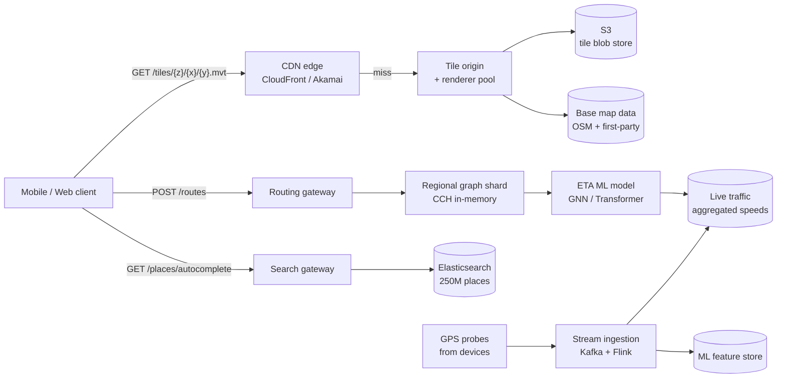
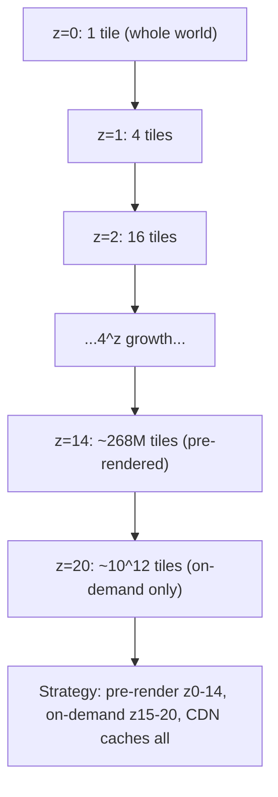
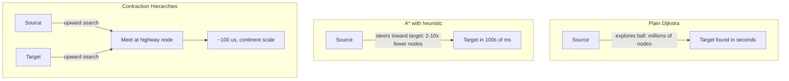
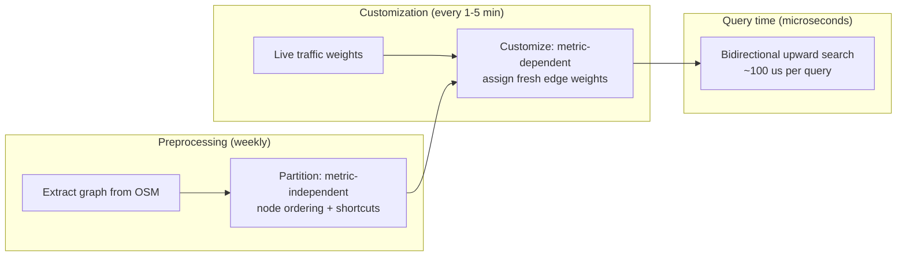
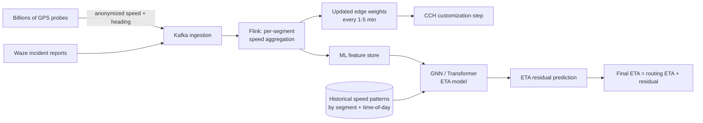
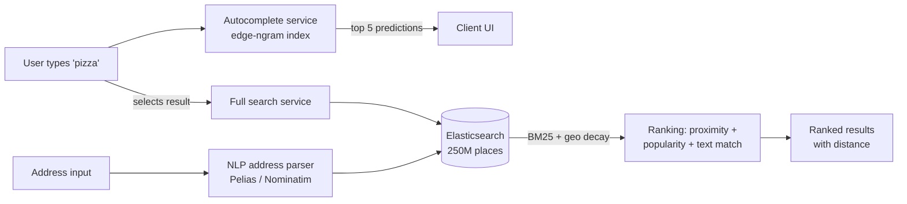

# Design Google Maps (Routing and Tile Rendering)

> **TL;DR.** A planet-scale mapping product is two systems in one trench coat: a read-heavy tile service shipping vector polygons for every patch of Earth at 20+ zoom levels via CDN, and a computationally heavy routing engine consulting a precomputed shortest-path graph with live traffic edge weights to return a polyline plus ETA in under a second. Google Maps serves over 2 billion monthly active users [^1] with 250 million places receiving 100 million updates per day [^2]. The pivotal trade-off is freshness versus cost: tiles want to be static and CDN-cacheable, but the physical world changes every minute; routing wants precomputed shortcuts, but traffic invalidates them constantly.

## Learning Objectives

After this module, you will be able to:

- [ ] Design a tile-serving pipeline that handles 10B+ daily fetches using the Slippy Map scheme and CDN caching
- [ ] Compare Dijkstra, A*, Contraction Hierarchies, and Customizable CH, and justify when each applies
- [ ] Architect an ETA prediction pipeline that blends historical speeds, live GPS probes, and ML post-processing
- [ ] Design a POI search and geocoding subsystem with proximity biasing and sub-100 ms autocomplete
- [ ] Estimate capacity for tile storage, routing QPS, and traffic ingestion bandwidth
- [ ] Articulate the metric-independent vs. metric-dependent preprocessing split that enables live-traffic routing

## Intuition

Imagine you run a pizza delivery chain with 10,000 locations across a country. Every customer has a paper map on their fridge, but the map is printed in tiny squares. When a customer looks at their neighborhood, they only need the four squares around their house. When they zoom out to see the whole city, they need a single coarser square that summarizes everything. You pre-print millions of these squares at different zoom levels and stack them in warehouses near each city. That is tile serving: pre-rendered squares, cached at the edge, fetched on demand.

Now the customer wants directions to the nearest pizza shop. You could trace every possible road with your finger (Dijkstra), but the country has 50 million intersections. Instead, you pre-mark the highways as "important" and build shortcut roads that skip over small neighborhoods. When someone asks for directions, you only walk uphill on importance from both ends until the paths meet. That is Contraction Hierarchies: precompute shortcuts offline, answer queries in microseconds.

But traffic changes every five minutes. The shortcut you precomputed at 3 AM is wrong at 5 PM. So you split the work: the shortcut structure stays fixed for weeks, but the travel times update every few seconds from GPS probes. That is Customizable Contraction Hierarchies: slow structure, fast weights. These three ideas are the backbone of every modern mapping product.

## Requirements

### Clarifying Questions

- **Q: What geographic coverage is required?**
  Assume: Global, 220+ countries, with detailed street-level data in urban areas and road-level coverage everywhere else.
- **Q: What latency targets for tile delivery vs. routing?**
  Assume: p99 < 200 ms for tile fetch (CDN-served), p99 < 500 ms for routing queries (intra-country), p99 < 2 s for intercontinental routes.
- **Q: Do we need real-time traffic or are static speed limits acceptable?**
  Assume: Real-time traffic is required. Static-only ETAs can be significantly inaccurate under congestion.
- **Q: Offline maps support?**
  Assume: Yes, users can download per-country bundles for turn-by-turn navigation without connectivity.
- **Q: What consistency model for map data updates?**
  Assume: Eventual consistency is acceptable. A new road appearing within 24 hours is fine; routing must reflect traffic changes within minutes.
- **Q: Multi-modal routing (transit, walking, cycling)?**
  Assume: Driving is the primary mode for this design; transit and walking use the same graph infrastructure with different edge weights and profiles.

### Functional Requirements

- Render interactive map tiles at 20+ zoom levels with pan, zoom, rotate, and tilt
- Compute fastest route between two or more waypoints with turn-by-turn instructions
- Provide real-time ETA that accounts for live traffic conditions
- Search for places by name, address, or category with proximity-biased autocomplete
- Support offline map downloads with pre-compiled routing graphs

### Non-Functional Requirements

- **Load:** 10B+ tile fetches/day, 100M+ routing queries/day, 2B+ MAU [^1]
- **Latency:** p99 < 200 ms tile delivery, p99 < 500 ms routing, < 100 ms autocomplete
- **Availability:** 99.99% for tile serving (CDN-backed), 99.9% for routing
- **Freshness:** Traffic weights updated every 1-5 minutes; base map tiles updated within 24 hours of source change
- **Storage:** PB-scale for raster tile pyramids, TB-scale for vector tiles, TB-scale for road graphs

## Capacity Estimation

| Metric | Value | Derivation |
|--------|------:|------------|
| Tile fetches/day | 10B | 2B MAU x ~5 tiles/session avg across all sessions |
| Peak tile QPS | 230K | 10B / 86,400 x 2x peak factor |
| Routing queries/day | 100M | ~10% of sessions request a route |
| Peak routing QPS | 2,300 | 100M / 86,400 x 2x peak |
| Tile storage (vector, z0-20) | ~50 TB | Sparse pyramid; only populated areas at deep zooms [^3] |
| Road graph (global, compiled) | ~200 GB | 50M nodes x 120M edges x ~1.5 KB avg with shortcuts |
| GPS probe ingestion | ~5 TB/day | Billions of anonymized speed samples globally |
| Places database | ~250M records | Google's stated catalog size [^2] |

- **Read:write ratio (tiles):** Effectively infinite reads to rare writes (tiles are immutable per version)
- **CDN hit rate:** 95%+ for zoom levels 0-14; lower for deep zooms in sparse areas
- **Routing graph memory:** Each regional shard fits in RAM (North America ~30 GB compiled CCH)
- **Traffic update frequency:** Edge weights refreshed every 60-300 seconds from aggregated probes

## API and Data Model

### API Design

```http
GET /tiles/v5/{z}/{x}/{y}.mvt
  Returns: 200 application/vnd.mapbox-vector-tile (protobuf)
  Cache-Control: public, max-age=86400, immutable
  Errors: 404 (tile not rendered), 429 rate limited

POST /routes/v1/directions
  Body: { "origin": [lat, lon], "destination": [lat, lon],
          "waypoints": [...], "mode": "driving", "depart_at": "ISO8601" }
  Returns: 200 { "polyline": "encoded", "eta_seconds": 1847,
                  "distance_m": 42300, "steps": [...] }
  Errors: 400 invalid coords, 429 rate limited

GET /places/v1/autocomplete?q=pizza&lat=40.7&lon=-74.0&radius=5000
  Returns: 200 { "predictions": [{ "place_id": "...", "name": "...",
                  "distance_m": 320 }] }

GET /places/v1/geocode?address=1600+Amphitheatre+Parkway
  Returns: 200 { "lat": 37.4220, "lon": -122.0841, "formatted": "..." }

GET /places/v1/reverse?lat=37.4220&lon=-122.0841
  Returns: 200 { "address": "1600 Amphitheatre Parkway, Mountain View, CA" }
```

### Data Model

```sql
-- Tile metadata (actual tile bytes in blob store / CDN origin)
table tile_versions (
  z           int,
  x           int,
  y           int,
  version     int,
  blob_key    text,       -- S3 / GCS key
  rendered_at timestamp,
  PRIMARY KEY ((z, x, y), version)
)

-- Road graph stored as compiled binary (CCH format)
-- Partitioned by continent/region, loaded into memory at startup
-- Schema is implicit in the binary format (nodes, edges, shortcuts, weights)

-- Places / POI index (Elasticsearch)
-- document: { place_id, name, category, lat, lon, rating, review_count, updated_at }
-- geo_point field for proximity queries, text fields for autocomplete
```

## High-Level Architecture



*The tile path, routing path, and search path are independent service trees sharing no runtime state; they converge only at the client UI layer.*

The system decomposes into three independent read paths:

**Tile path.** The client requests vector tiles by `(z, x, y)` from the CDN. On cache hit (95%+ of requests), the response returns in under 50 ms from the nearest edge POP. On miss, the request falls through to a tile origin backed by a rendering cluster (Mapnik or Tippecanoe) and a blob store. Hot zoom levels (0-12) are pre-rendered; cold tiles render on demand and cache. Versioned URL paths (`/v5/{z}/{x}/{y}.mvt`) make invalidation a CDN purge plus a new URL root [^4].

**Routing path.** The client sends origin and destination to a routing gateway, which dispatches to a regional graph shard holding the CCH-compiled road network. The shard runs a bidirectional upward search, produces a polyline and raw ETA, then passes the route through the ETA ML model for correction. The corrected result returns to the client.

**Search path.** Autocomplete and geocoding queries hit an Elasticsearch cluster holding 250M+ place documents [^2]. Proximity biasing uses a geo_point decay function; text matching uses edge-ngram tokenization for prefix search.

## Deep Dives

### Deep dive 1: Tile serving at 10B fetches/day

**The problem.** Each zoom level quadruples the tile count: zoom `z` has `4^z` tiles [^3]. The theoretical global mosaic at zoom 20 is roughly 10^12 tiles. Pre-rendering all of them is impossible. Serving them without a CDN would require origin capacity for 230K peak QPS.

**Vector tiles.** The Mapbox Vector Tile specification encodes geometries as protobuf with delta-compressed zigzag-encoded integer coordinates [^5]. Feature attributes are pooled into `keys` and `values` arrays referenced by index, so repeated strings like `highway=residential` occupy constant space. The default tile extent of 4096 units gives roughly 4 cm resolution at zoom 18 at the equator [^5]. Vector tiles are 2-5x smaller than equivalent raster tiles and support client-side rotation, tilt, and restyling without a server round trip [^6].



*Each zoom level quadruples the tile count; pre-rendering stops at z14 (~268M tiles) and deeper zooms render on demand with aggressive CDN caching.*

**CDN strategy.** Tiles are immutable per dataset version. A versioned URL scheme (`/v5/{z}/{x}/{y}.mvt`) means cache invalidation is a matter of deploying a new version prefix and letting old entries expire. CDN hit rates exceed 95% for zoom levels 0-14 because the same tiles serve millions of users viewing the same cities. At deep zooms, hit rates drop but request volume also drops (fewer users zoom to building level). The origin rendering pool scales horizontally; each renderer is stateless and pulls source data from the base map store.

**Offline bundles.** Mapbox demonstrated that reorganizing tile storage for offline packs shrank bundle sizes by up to 40% [^6]. A country-level offline bundle includes vector tiles at z0-14, a CH-compiled routing graph, and a compressed POI index.

### Deep dive 2: Routing algorithm progression

**The problem.** The North American road graph has roughly 50 million nodes and 120 million edges. A naive shortest-path algorithm cannot meet a sub-second latency SLO at this scale.

**Dijkstra** explores a ball around the source until it hits the target, touching millions of nodes on cross-country queries [^7]. At 1 microsecond per node relaxation, that is seconds per query.

**A* with geographic heuristic** steers the search toward the target using great-circle distance as an admissible heuristic, cutting explored nodes by roughly 2-3x with a basic Euclidean heuristic and up to 10x or more with advanced heuristics [^8]. Better, but still hundreds of milliseconds on long routes.

**Contraction Hierarchies (Geisberger et al., 2008)** precompute a node importance ordering and insert shortcut edges by iteratively contracting the least important node [^9]. At query time, bidirectional Dijkstra relaxes only edges going "upward" in importance. Query time drops to roughly 100 microseconds on continent-scale graphs, and the auxiliary shortcut data often needs less space than the input graph [^9].



*Three algorithms on the same continent graph: Dijkstra explores everything, A* prunes toward the target, CH exploits precomputed importance to answer in microseconds.*

**Customizable Contraction Hierarchies (Dibbelt et al., 2014)** split preprocessing into a slow metric-independent phase (topology, node ordering) and a fast metric-dependent customization phase that absorbs new edge weights in seconds [^10]. Microsoft's Customizable Route Planning achieves the same split via multilevel graph partitioning [^11]. OSRM exposes this directly as separate `osrm-partition` and `osrm-customize` commands [^12]:

```bash
# Metric-independent: slow, run once per data update (hours)
osrm-partition /data/north-america.osrm

# Metric-dependent: fast, re-run when traffic changes (seconds)
osrm-customize /data/north-america.osrm

# Serve queries with fresh weights
osrm-routed --algorithm mld /data/north-america.osrm
```



*The metric-independent partition runs weekly; the metric-dependent customization absorbs live traffic in seconds; queries execute in microseconds against fresh weights.*

### Deep dive 3: Traffic ingestion and ETA prediction

**The problem.** Static speed limits produce significantly inaccurate ETAs under congestion. Production systems need a pipeline that ingests billions of GPS probes, aggregates per-segment speeds, and feeds an ML model that corrects the routing engine's estimate.

**Ingestion pipeline.** Millions of phones emit anonymized speed-and-direction measurements. Apple collects random slivers of trips where neither origin nor destination is transmitted and identifiers rotate, preventing trip reconstruction [^13]. Waze relies on active drivers; incident reports arrive 9.8 minutes earlier on average than probe-based alternatives [^14]. Waze sustains over 1 million Redis MGET commands per second against its session store with sub-millisecond latency [^15].



*GPS probes flow through Kafka and Flink into per-segment speed aggregates that feed both the routing engine's weight customization and the ML model's feature store.*

**Google Maps + DeepMind GNN (2020).** The road network is divided into "Supersegments" (subgraphs of adjacent segments with shared traffic volume). A Graph Neural Network with message passing between adjacent nodes predicts per-segment travel time [^16]. Google reports ETAs were already accurate for over 97% of trips; the GNN targets the remaining inaccuracies, reducing error by more than 50% in cities like Taichung and up to 50% in places like Berlin, Jakarta, Sao Paulo, Sydney, Tokyo, and Washington D.C. [^16].

**Uber DeepETA (2022).** A single global encoder-decoder Transformer (linearized, O(K*d^2) instead of O(K^2*d)) post-processes the routing-engine ETA [^17]. Continuous features are quantile-bucketized then embedded. Only about 0.25% of the model's parameters are touched per prediction due to feature sparsity [^17]. It serves as the highest-QPS model at Uber with a few-millisecond latency budget [^17].

### Deep dive 4: POI search and geocoding

**The problem.** A user types "pizza" and expects relevant results within 100 ms, biased toward their current viewport. The system must handle 250M+ places [^2], fuzzy address parsing across languages, and partial-query autocomplete.

**Architecture.** Geocoding converts addresses to coordinates; reverse geocoding does the inverse. Pelias is a modular open-source geocoder built on Elasticsearch with a natural-language classification engine for parsing [^18]. Nominatim uses OpenStreetMap data with three stages: import (osm2pgsql into PostgreSQL with PostGIS), address computation, and a search frontend [^19].

**Ranking signals.** Results blend geospatial proximity (geo_point decay function), textual match quality (edge-ngram for prefix, BM25 for relevance), and popularity signals (review count, click-through rate). Proximity biasing ensures "Pizza" in Manhattan returns Manhattan results, not Lisbon results.

**Autocomplete.** A separate subsystem backed by an edge-ngram index with geo-biasing toward the user's current viewport. Must respond in under 100 ms for every keystroke. The index is sharded by geographic region to keep per-shard sizes manageable and latency predictable.



*POI search combines a fast autocomplete path (edge-ngram, sub-100 ms) with a full-text search path that blends BM25 relevance, geo-proximity decay, and popularity signals.*

## Real-World Example

**Apple Maps: rebuilding from the ground up (2018-present).**

After the disastrous 2012 Apple Maps launch (Tim Cook issued a formal apology), Apple spent four years building a first-party data collection infrastructure before relaunching [^13]. The fleet consists of vans equipped with 4 LiDAR arrays, 8 overlapping high-resolution cameras, a rooftop GPS rig, a wheel odometer, and a Mac Pro plus SSD array recording encrypted point clouds and imagery [^13].

**Three-layer architecture:**

1. **Ground truth (van captures).** Raw data is encrypted with split keys: one in the van, one in the data center. On arrival, a compute pipeline strips faces and license plates. Computer-vision models extract street signs, addresses, and POIs. Deep Lambertian Networks produce 3D object classifications [^13].
2. **Satellite layer.** High-resolution satellite imagery cross-referenced with van captures produces orthogonal reconstructions, letting editors "see through" tree cover to underlying roads [^13].
3. **Probe data.** Anonymized speed-and-direction segments from over 2 billion active Apple devices. Neither origin nor destination is transmitted, identifiers rotate, and only random slivers of any trip are uploaded [^13].

The privacy design is genuinely clever: trips are never reconstructable because slice boundaries are chosen randomly and IDs rotate. Apple explicitly states: "We specifically don't collect data, even from point A to point B" [^13]. Northern California coverage launched in iOS 12 (fall 2018) with country-by-country rollout after.

The key insight non-experts miss: Apple rejected patching over third-party data (TomTom) because with 2B+ active Apple devices, only first-party ground truth could deliver continent-scale freshness. The capex was enormous (4 years of van operations), but the result is autonomous-grade data density that also serves consumer maps.

## Trade-offs

| Approach | Pros | Cons | When to Use | Our Pick |
|----------|------|------|-------------|----------|
| Raster tiles (PNG) | Simple, any client renders | 2-5x larger, no client styling | Legacy clients, static styles | No |
| Vector tiles (MVT) | 2-5x smaller, client-side styling [^6] | Requires WebGL-capable client | Modern web and mobile | Yes |
| Plain Dijkstra | Correct, simple | Seconds per query at continent scale [^7] | Small graphs, precomputation | No |
| A* with heuristic | 2-10x fewer explored nodes [^8] | Still too slow for interactive use | No precomputation budget | No |
| Contraction Hierarchies | ~100 us queries [^9] | Hours preprocessing, static weights | Offline maps, rare reweightings | For offline |
| CCH / MLD | Absorbs live traffic in seconds [^10] | More complex implementation | Real-time traffic-aware routing | Yes |
| Static speed limits | Zero infrastructure | Significantly inaccurate under congestion | Backup fallback only | No |
| ML post-processor (GNN) | 50% error reduction on hard cases [^16] | Model drift, continuous retraining | Production consumer apps | Yes |

The single biggest trade-off: **freshness versus precomputation cost.** Every hierarchical routing speedup bakes assumptions into the preprocessing. The CCH/CRP insight (separate topology from weights) is the resolution that makes live-traffic routing tractable. Without it, you choose between stale-but-fast (CH) and fresh-but-slow (Dijkstra).

## Scaling and Failure Modes

**At 10x load (10B routing queries/day):**

- Graph shards saturate. Mitigation: add regional replicas; each shard is read-only after customization, so replication is trivial.
- CDN origin rendering pool becomes the bottleneck for deep-zoom tiles. Mitigation: pre-render to z16 instead of z14; expand the rendering fleet.

**At 100x load (100B tile fetches/day):**

- CDN egress cost dominates. Mitigation: negotiate volume discounts; move to multi-CDN with cost-based routing.
- ETA model inference becomes the latency bottleneck. Mitigation: model distillation; serve a smaller student model at the edge with the full model as fallback.

**At 1000x load:**

- Architectural rewrite: push compiled routing graphs to the edge (on-device or edge POPs) so routing queries never reach the origin. Tile serving becomes a pure CDN problem with no origin at all for hot tiles.

**Failure modes:**

- **CDN POP failure:** Automatic failover to next-nearest POP. Tile latency degrades from 50 ms to 150 ms for affected users. No data loss (tiles are immutable).
- **Stale traffic weights (Flink pipeline lag):** Routing engine serves ETAs based on weights that are 5-15 minutes old instead of 1-5 minutes. Detection: monitor weight-age metric. Degraded mode: fall back to historical patterns for the current time-of-day.
- **Graph shard OOM during customization:** The customization step writes new weights into the shard's memory. If a traffic spike causes weight arrays to exceed allocation, the shard crashes. Mitigation: blue-green deployment of shards; new weights are applied to the standby shard, then traffic is switched.

## Common Pitfalls

> [!WARNING]
> **Running Dijkstra at query time on the full road graph.** At 50M+ nodes, queries take seconds. CPU saturates before request rate hits plan. Use CH (static) or CCH/MLD (live traffic) [^12].

> [!WARNING]
> **Serving tiles without a CDN.** Tiles are the most cacheable object on the internet. Without a CDN, every viewport pan hits the origin and the rendering queue grows unbounded at peak [^4].

> [!WARNING]
> **Baking traffic directly into Contraction Hierarchies.** Every traffic update invalidates the hierarchy. Preprocessing takes hours. Use CCH or CRP to separate topology from weights [^10][^11].

> [!WARNING]
> **Treating ETA as a deterministic sum of edge weights.** Static speed limits are significantly inaccurate under congestion. Layer an ML post-processor that predicts the residual between graph-based ETA and reality [^16][^17].

> [!WARNING]
> **Ignoring map-matching for GPS traces.** Raw GPS in urban canyons has 10-50 m error. Naive nearest-road snapping picks the wrong parallel road on divided highways, causing phantom reroutes. Use HMM-based map matching [^20].

> [!CAUTION]
> **Per-country offline bundles without delta updates.** Unoptimized bundles hit 2+ GB. Users abandon downloads on cellular. Use vector tiles (2-5x smaller than raster [^6]), ship CH-compiled graphs, and deliver weekly binary diffs instead of full reinstalls.

## Follow-up Questions

**1. How would you add AR walking directions (Live View)?**

The phone's camera feed is processed by on-device visual positioning (VPS) that matches building facades against a pre-built 3D mesh from Street View imagery. Arrows and labels are rendered as AR overlays anchored to the matched position. The key challenge is VPS accuracy in areas without distinctive facades; fall back to compass-based arrows when confidence is low.

**2. How would you handle indoor routing (airports, malls)?**

Indoor maps use a separate floor-aware graph with edges for elevators, escalators, and corridors. Positioning switches from GPS (unusable indoors) to Wi-Fi RTT, BLE beacons, or barometric altitude for floor detection. The tile layer adds per-floor vector tiles triggered by a zoom-level threshold.

**3. How would you support multi-modal routing (transit + walk + drive)?**

Model each mode as a separate graph layer with transfer edges (e.g., "park car at station, walk to platform, ride train"). Run a multi-criteria shortest path that optimizes for time, transfers, and walking distance simultaneously. GTFS feeds provide transit schedules; real-time GTFS-RT updates adjust ETAs.

**4. How would you handle privacy-preserving routing (Apple's approach)?**

Compute routes on-device using a downloaded CCH graph. Send only anonymized, non-reconstructable probe slivers to the server for traffic aggregation. Rotate identifiers per session. Never transmit trip origin or destination [^13].

**5. How would you integrate community edits (Waze model)?**

User-submitted road closures and hazards enter a moderation queue (automated + human). Verified edits update the base map within minutes for incidents, hours for permanent changes. Waze reports arrive 9.8 minutes earlier than probe-based alternatives on average [^14], making community data a critical freshness signal.

**6. How would you support LLM-powered trip planning (2024+ feature)?**

An LLM generates a structured itinerary (waypoints, time budgets, POI categories) from natural language. The itinerary is validated against the routing and places APIs. The LLM does not replace the routing engine; it orchestrates calls to it. Hallucinated POIs are caught by validating place_ids against the places database.

**7. How does the Overture Maps Foundation change the data landscape?**

Overture's GA Transportation dataset contains 86 million km of roads under a permissive license [^21]. It provides a viable alternative to OSM for commercial use without share-alike obligations. The architecture remains the same; only the data source changes. Quality validation against first-party captures remains necessary.

## Exercise

### Exercise 1: Offline maps for a country

You want to add offline navigation for France. The user downloads a bundle on Wi-Fi and navigates without connectivity for two weeks. Design the bundle contents, quantify the size, and propose a freshness strategy that keeps 50M offline users in sync without bankrupting the CDN budget.

<details>
<summary>Hint</summary>

Vector tiles at z0-14 cover navigation needs. A CH-compiled graph for France fits in roughly 500 MB. The key tension is freshness: road closures happen daily, but full re-downloads are expensive. Think about binary diffs and calculate 50M users times weekly delta size.

</details>

<details>
<summary>Solution</summary>

**Bundle contents:** Vector tiles z0-14 (~800 MB), CH-compiled road graph (~500 MB), POI index (~200 MB), voice phonemes (~100 MB). Total: ~1.6 GB compressed.

**Live traffic:** Unavailable offline. Use free-flow speed limits from the CH graph. ETA accuracy degrades to 20-40% error. UI indicates "offline ETA."

**Freshness:** Weekly binary diffs (bsdiff) against the previous version. Delta size: 5-15% of full bundle = ~80-240 MB/week. Road closures: a lightweight incidents overlay (~1 MB JSON) syncs opportunistically when connectivity appears.

**CDN cost:** 50M users x 150 MB avg delta/week = 7.5 PB/week. At $0.02/GB = ~$150K/week. Mitigate: stagger rollouts by region, skip deltas for users inactive 30+ days, compress aggressively.

**Trade-off accepted:** Offline maps sacrifice ETA accuracy and real-time incidents for full functionality without connectivity.

</details>

## Key Takeaways

- **Two systems, one UI:** Tiles and routing are independent service trees with different scaling characteristics. Do not let them share a database or deployment.
- **CCH is the breakthrough:** The separation of metric-independent preprocessing from metric-dependent customization is what makes live-traffic routing tractable at continent scale.
- **ETA is a model, not a calculation:** Treat it as an ML system with feature engineering, continuous retraining, and drift monitoring. Static speed limits are significantly inaccurate under congestion.
- **CDN-first for tiles:** At 10B+ fetches/day, the CDN IS the tile-serving system. The origin is a fallback renderer, not the primary serving path.
- **Privacy is a design constraint, not a feature:** Apple's probe-data architecture (random slivers, rotating IDs, split-key encryption) shows that privacy-preserving traffic data is architecturally feasible at scale.

## Further Reading

- [Contraction Hierarchies: Faster and Simpler Hierarchical Routing (Geisberger et al., 2008)](https://link.springer.com/chapter/10.1007/978-3-540-68552-4_24). The canonical CH paper; essential background for any staff interview on routing algorithms.
- [Customizable Contraction Hierarchies (Dibbelt, Strasser, Wagner, 2014)](https://arxiv.org/abs/1402.0402). The paper that made live-traffic CH practical; directly applicable to the metric-independent vs. metric-dependent split.
- [Route Planning in Transportation Networks (Delling et al., 2015)](https://arxiv.org/abs/1504.05140). Comprehensive survey of CH, CRP, Hub Labeling, and MLD from Microsoft Research; the single best routing refresher.
- [DeepETA: How Uber Predicts Arrival Times (Uber Engineering, 2022)](https://www.uber.com/blog/deepeta-how-uber-predicts-arrival-times/). The clearest published ETA ML architecture with linearized Transformer and discretized embeddings.
- [Traffic Prediction with Advanced Graph Neural Networks (DeepMind + Google, 2020)](https://deepmind.com/blog/article/traffic-prediction-with-advanced-graph-neural-networks). Supersegments and GNN message-passing for ETA correction in production.
- [Mapbox Vector Tile Specification 2.1](https://github.com/mapbox/vector-tile-spec/blob/master/2.1/README.md). The authoritative wire format for every modern web map; understand the encoding to reason about tile sizes.
- [Apple is Rebuilding Maps from the Ground Up (TechCrunch, 2018)](https://techcrunch.com/2018/06/29/apple-is-rebuilding-maps-from-the-ground-up/). The best public account of building a continental base map with a sensor fleet under privacy constraints.
- [OSRM Documentation](https://github.com/Project-OSRM/osrm-backend). The most-studied open-source routing engine; exposes CH and MLD as a concrete pipeline you can run locally.

## Flashcards

<details>
<summary><strong>Q: What is the time complexity of a Contraction Hierarchies query on a continent-scale road graph?</strong></summary>

A: Roughly 100 microseconds. CH precomputes shortcut edges and a node importance ordering; queries run bidirectional Dijkstra relaxing only upward edges, touching a few hundred nodes instead of millions [^9].

</details>

<details>
<summary><strong>Q: Why can you not bake live traffic directly into standard Contraction Hierarchies?</strong></summary>

A: CH shortcuts encode specific edge weights. Changing any weight potentially invalidates the shortcut structure, requiring hours of reprocessing. CCH and CRP separate topology (slow, metric-independent) from weights (fast, metric-dependent) [^10].

</details>

<details>
<summary><strong>Q: How does the tile pyramid scale with zoom level?</strong></summary>

A: Each zoom level doubles both x and y dimensions, so zoom z has 4^z tiles. Zoom 20 has roughly 10^12 tiles in the theoretical global mosaic, but only populated areas are rendered at deep zooms [^3].

</details>

<details>
<summary><strong>Q: What is the role of the ML model in ETA prediction?</strong></summary>

A: It is a post-processor, not a replacement for the routing engine. The routing engine proposes a polyline and raw ETA; the ML model predicts the residual between the graph-based estimate and reality using live traffic, historical patterns, and spatial features [^16][^17].

</details>

<details>
<summary><strong>Q: Why do modern mapping apps use vector tiles instead of raster?</strong></summary>

A: Vector tiles are 2-5x smaller, support client-side rotation and restyling without server round trips, and encode geometries as compact protobuf with delta-compressed coordinates [^5][^6]. The trade-off is requiring a WebGL-capable client.

</details>

<details>
<summary><strong>Q: What is map matching and why is it necessary?</strong></summary>

A: Map matching aligns noisy GPS traces (10-50 m error in urban canyons) to the road graph using an HMM where emission probability is Gaussian over distance-to-road and transition probability compares route distance to great-circle distance. Without it, the app picks the wrong parallel road on divided highways [^20].

</details>

<details>
<summary><strong>Q: How does Google's DeepMind GNN improve ETA accuracy?</strong></summary>

A: It divides the road network into Supersegments and trains a GNN with message passing between adjacent nodes. It reduced remaining ETA error by more than 50% in cities like Taichung, targeting the cases where the routing engine was already inaccurate [^16].

</details>

<details>
<summary><strong>Q: What is the CCH metric-independent vs. metric-dependent split?</strong></summary>

A: The metric-independent phase (node ordering, shortcut structure) depends only on graph topology and runs weekly. The metric-dependent phase (assigning travel times to edges and shortcuts) absorbs live traffic in seconds. This split is what makes real-time traffic-aware routing tractable [^10][^11].

</details>

<details>
<summary><strong>Q: How does Apple Maps preserve user privacy while collecting traffic data?</strong></summary>

A: Apple collects only random slivers of trips where neither origin nor destination is transmitted. Identifiers rotate per session. Trips are never reconstructable because slice boundaries are chosen randomly [^13].

</details>

<details>
<summary><strong>Q: What is the CDN hit rate strategy for map tiles?</strong></summary>

A: Pre-render zoom levels 0-14 (high reuse across users, ~268M tiles). Render z15-20 on demand and cache at the CDN. Versioned URL paths enable clean invalidation. Hit rates exceed 95% for pre-rendered levels.

</details>

## References

[^1]: 9to5Google, "Google Maps now has over 2 billion monthly users", Oct 2024 (confirmed by Google; CNBC Jan 2025 also reports "more than 2 billion monthly users"). https://9to5google.com/2024/10/29/google-maps-2-billion/

[^2]: Google Maps Platform, "Places UI Kit: 250 million places, 100 million daily updates", 2025. https://developers.google.com/maps/architecture/places-ui-kit-getting-started

[^3]: Wikipedia, "Tiled web map" (Slippy Map, XYZ scheme, zoom levels). https://en.wikipedia.org/wiki/Tiled_web_map

[^4]: switch2osm.org, "Manually building a tile server" (Mapnik + mod_tile + renderd stack). https://switch2osm.org/serving-tiles/manually-building-a-tile-server-debian-13/

[^5]: Mapbox, "Vector Tile Specification 2.1" README on GitHub. https://github.com/mapbox/vector-tile-spec/blob/master/2.1/README.md

[^6]: Mapbox Engineering, "More efficient offline map tiles (up to 40% smaller in v2)". https://www.mapbox.com/blog/more-efficient-offline-map-tiles-save-up-to-40-storage-space

[^7]: Abhinav Ralhan et al., "A* and Dijkstra performance comparison on OSM". https://jaeds.uitm.edu.my/index.php/jaeds/article/view/94

[^8]: arXiv 1812.07441, "Fast A* on Road Networks Using a Scalable Separator-Based Heuristic". https://arxiv.org/abs/1812.07441v2

[^9]: Geisberger, Sanders, Schultes, Delling, "Contraction Hierarchies: Faster and Simpler Hierarchical Routing in Road Networks", Springer LNCS, 2008. https://link.springer.com/chapter/10.1007/978-3-540-68552-4_24

[^10]: Dibbelt, Strasser, Wagner, "Customizable Contraction Hierarchies", arXiv 1402.0402v5, 2015. https://arxiv.org/abs/1402.0402v5

[^11]: Delling, Goldberg, Pajor, Werneck, "Customizable Route Planning", Microsoft Research. https://www.microsoft.com/en-us/research/publication/customizable-route-planning/

[^12]: Project-OSRM, "osrm-backend README" (CH + MLD pipelines, HTTP API services). https://github.com/Project-OSRM/osrm-backend/blob/master/README.md

[^13]: Matthew Panzarino, "Apple is rebuilding Maps from the ground up", TechCrunch, Jun 2018. https://techcrunch.com/2018/06/29/apple-is-rebuilding-maps-from-the-ground-up/

[^14]: "Evaluating the Reliability, Coverage, and Added Value of Crowdsourced Traffic Incident Reports from Waze", 2018. https://www.researchgate.net/publication/326916618

[^15]: Google Cloud Blog, "Waze keeps traffic flowing with 1M+ real-time reads per second on Memorystore", Nov 2025. https://cloud.google.com/blog/products/databases/how-waze-keeps-traffic-flowing-with-memorystore

[^16]: Oliver Lange and Luis Perez (DeepMind), "Traffic prediction with advanced Graph Neural Networks", Sep 2020. https://deepmind.com/blog/article/traffic-prediction-with-advanced-graph-neural-networks

[^17]: Xinyu Hu et al., "DeepETA: How Uber Predicts Arrival Times Using Deep Learning", Feb 2022. https://www.uber.com/blog/deepeta-how-uber-predicts-arrival-times/

[^18]: Pelias Project, "pelias/pelias: Modular open-source geocoder using Elasticsearch". https://github.com/pelias/pelias

[^19]: Nominatim Documentation, "Architecture Overview" (import + address computation + frontend). https://nominatim.org/release-docs/latest/develop/overview/

[^20]: Valhalla, "Meili: Map Matching in a Programmer's Perspective" (HMM with Newson-Krumm 2009 model). https://github.com/valhalla/valhalla/blob/master/docs/docs/meili/algorithms.md

[^21]: Overture Maps Foundation, "GA release of Transportation Dataset: 86M km of roads", Dec 2024. https://overturemaps.org/announcements/2024/overture-general-availability-of-transportation-dataset/
