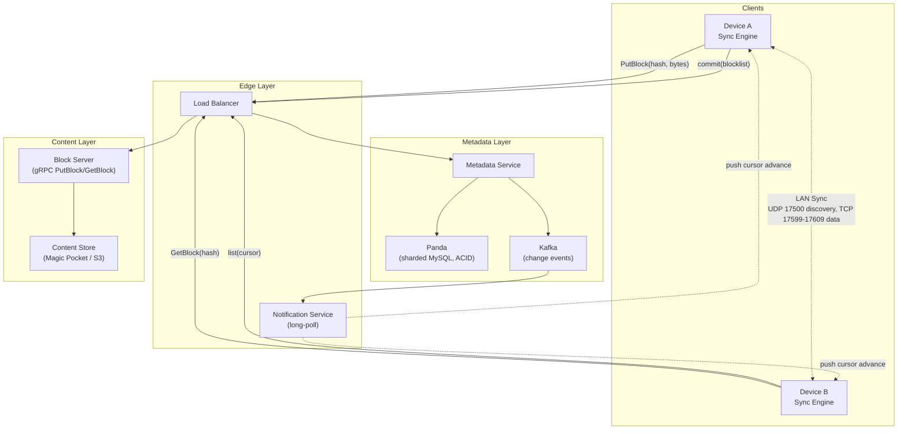
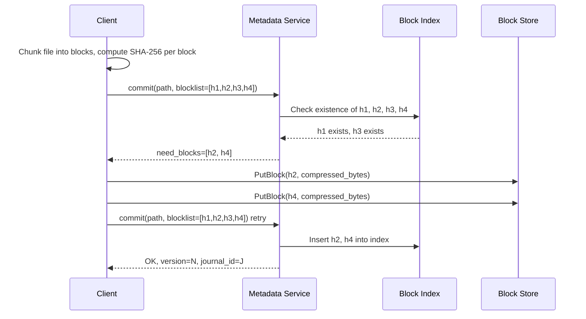
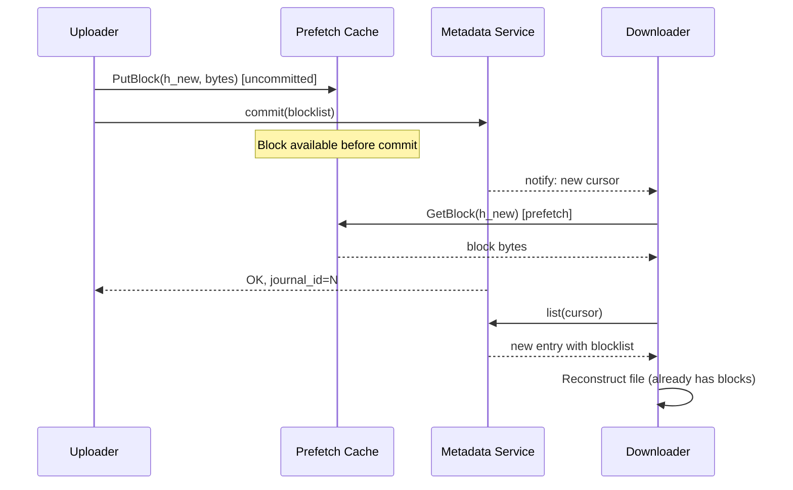
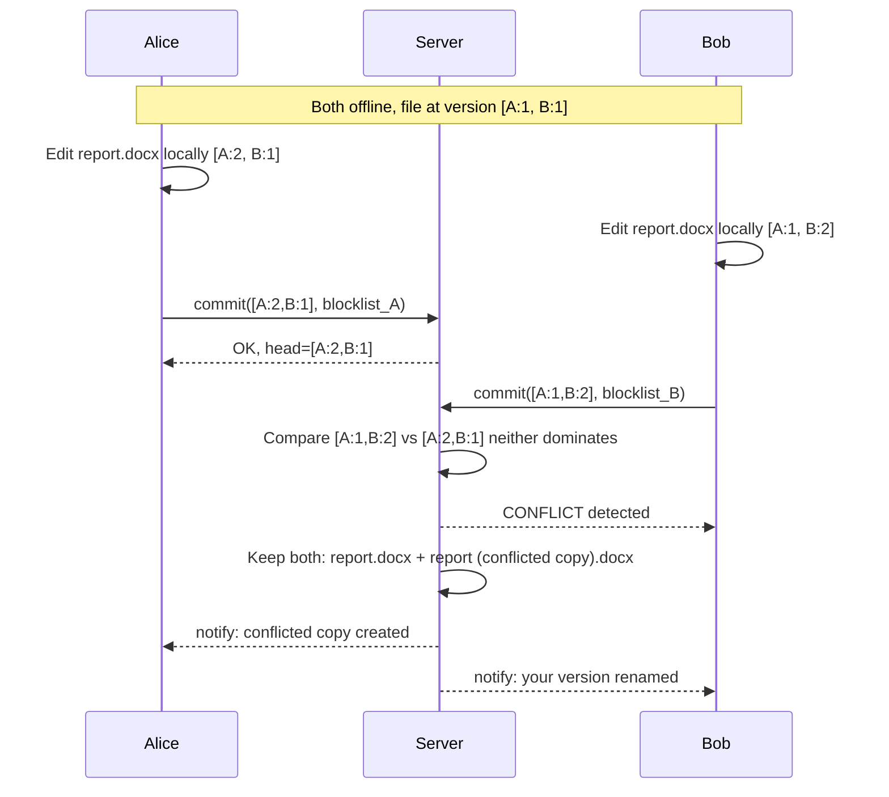

# Design a File Sync Service (Dropbox / Google Drive)

> **TL;DR.** A file sync service splits into two layers: a content-addressable block store holding immutable chunks keyed by SHA-256, and a metadata service tracking the file tree, versioning, and permissions. Content-defined chunking ensures local edits only re-upload local chunks. Block-level deduplication means the same 10 MB PDF across 100 million inboxes is stored once. Conflict resolution uses version vectors and dual-copy semantics because silent last-writer-wins destroys data[^1]. Dropbox runs this at ~5 exabytes across 600,000+ drives with 12+ nines of durability[^2][^3].

## Learning Objectives

- Design a two-layer file sync architecture that separates metadata from content at exabyte scale
- Compare fixed-size chunking vs content-defined chunking and justify when each applies
- Implement block-level deduplication with the `need_blocks` negotiation protocol
- Apply rsync-style delta sync to minimize wire bytes on file edits
- Resolve conflicts from concurrent offline edits without silent data loss
- Estimate capacity for 700M+ users storing petabytes of daily writes

## Intuition

A file sync service looks like a trivial CRUD app. Upload a file, download it elsewhere. Handles 10 users fine. At 700 million users storing 5 exabytes, it collapses, and the reasons are three-fold.

First, clients spend most of their time offline or on flaky networks. Two laptops editing the same spreadsheet on separate airplanes cannot run a consensus protocol. When they reconnect, the server faces divergent state and must reconcile without losing either user's work[^4].

Second, the same 10 MB PDF circulates across millions of inboxes. Storing one copy per user wastes petabytes. Cross-user deduplication becomes economically mandatory at scale[^5][^2].

Third, files mutate in place. An editor rewriting one cell in a 2 GB spreadsheet must not re-upload 2 GB. The system must identify which bytes actually changed and transfer only those[^6][^7].

The insight that unlocks the design: separate what a file IS (its metadata: name, path, permissions, version history) from what a file CONTAINS (immutable byte chunks keyed by their cryptographic hash). Once you make this split, versioning lives in metadata, dedup lives in content, conflicts live in metadata, and blocks are dumb. Every other design choice follows.

## Requirements

### Clarifying Questions

- **Q: What file sizes must we support?**
  Assume: 1 KB text notes to 50 GB video files. Median file ~2 MB, p99 ~500 MB.
- **Q: How many devices per user?**
  Assume: Average 3 devices (phone, laptop, desktop). Max 10.
- **Q: Do we need real-time collaborative editing?**
  Assume: No. That is a separate system (OT/CRDT). We handle offline-first sync with conflict detection.
- **Q: What consistency model for cross-device sync?**
  Assume: Eventual consistency with causal ordering. Changes propagate within seconds when online.
- **Q: End-to-end encryption required?**
  Assume: Optional tier. Standard mode allows server-side dedup; E2E mode sacrifices cross-user dedup for privacy.
- **Q: Multi-region?**
  Assume: Yes. Three zones (West, Central, East) with cross-zone replication in ~1 second[^5].

### Functional Requirements

- Upload files from any device; sync to all linked devices within seconds when online
- Resume interrupted uploads and downloads without restarting from zero
- Detect and surface conflicts from concurrent offline edits (no silent data loss)
- Support file versioning with configurable retention (30-day default)
- Share files and folders with other users with granular permissions
- LAN sync: transfer blocks peer-to-peer when devices share a local network[^8]

### Non-Functional Requirements

- **Users:** 700M+ registered, ~18M paying[^2]
- **Storage:** ~5 exabytes total customer data[^2]
- **Durability:** 12+ nines (>99.9999999999%)[^3]
- **Availability:** 99.99% for reads and writes[^2]
- **Latency:** Change notification to peer devices p99 < 1 second when online
- **Consistency:** Eventual with causal ordering per namespace; strong consistency between client and server views[^4]

## Capacity Estimation

| Metric | Value | Derivation |
|--------|------:|------------|
| Registered users | 700M | Dropbox public disclosure[^2] |
| Active devices (peak) | ~200M | 700M users x 0.3 DAU ratio x 1 device avg active |
| Daily file changes | ~2B | 200M active devices x 10 changes/day avg |
| Write QPS (avg) | ~23K | 2B / 86,400 |
| Write QPS (peak, 3x) | ~70K | Burst during business hours |
| Avg change size | 4 MB | One block (Dropbox block size)[^6] |
| Daily ingress (pre-dedup) | 8 PB | 2B changes x 4 MB |
| Daily ingress (post-dedup) | ~3 PB | ~60% dedup ratio (estimated) |
| Total storage | ~5 EB | Dropbox FY2025[^2] |
| Storage drives | 600,000+ | Across all zones[^2] |
| Block Index entries | ~1.5T | 5 EB / 4 MB avg block |

Key ratios: read:write is roughly 3:1 (each change fans out to ~3 devices). Block dedup eliminates ~40-60% of raw ingress. Cold data (>1 year old) represents >90% of bytes but <5% of access[^9].

## API and Data Model

### API Design

```http
POST /v1/files/commit
  Body: { "namespace_id": "ns123", "path": "/docs/report.pdf",
          "blocklist": ["sha256_h1", "sha256_h2", "sha256_h3"],
          "parent_version": 42 }
  Returns: 200 { "version": 43, "need_blocks": ["sha256_h2"] }
           409 conflict (parent_version stale)

PUT /v1/blocks/{block_hash}
  Headers: Content-Type: application/octet-stream, Block-Format: broccoli
  Body: <compressed block bytes, max 4 MB>
  Returns: 201 stored | 200 already exists

GET /v1/blocks/{block_hash}
  Headers: Accept-Encoding: broccoli, identity
  Returns: 200 <block bytes>

GET /v1/files/list?namespace_id=ns123&cursor=41
  Returns: 200 { "entries": [...], "cursor": 43, "has_more": false }

GET /v1/notifications/longpoll?namespace_id=ns123&cursor=41
  Returns: 200 { "new_cursor": 43 } (blocks until change or timeout)
```

The `commit` endpoint is the core protocol: client sends the blocklist, server replies with `need_blocks` indicating which hashes are missing. Client uploads only those, then retries `commit`[^6]. Idempotency is inherent: uploading the same block hash twice is a no-op.

### Data Model

```sql
-- Metadata layer (sharded MySQL / Panda)
CREATE TABLE file_journal (
    namespace_id  BIGINT,
    journal_id    BIGINT AUTO_INCREMENT,  -- monotonic per namespace
    path          VARCHAR(4096),
    file_id       UUID,                   -- stable across renames
    blocklist     JSON,                   -- ordered list of SHA-256 hashes
    size_bytes    BIGINT,
    version_vector JSON,                  -- {client_id: counter}
    is_deleted    BOOLEAN DEFAULT FALSE,
    created_at    TIMESTAMP,
    PRIMARY KEY (namespace_id, journal_id)
);

-- Content layer (Magic Pocket / S3)
CREATE TABLE block_index (
    block_hash    CHAR(64) PRIMARY KEY,   -- SHA-256 hex
    cell_id       INT,
    bucket_id     BIGINT,
    checksum      INT,                    -- corruption detection
    ref_count     INT DEFAULT 1
);
```

The file journal is append-only: every mutation (create, edit, rename, delete) appends a new row with an incremented `journal_id`. Clients poll by cursor (their last-seen `journal_id`)[^7]. The block index maps hash to physical location; it has no concept of files or users[^5].

## High-Level Architecture



*The architecture splits cleanly: metadata handles correctness (file tree, versioning, permissions) while the content layer handles bytes (immutable, content-addressed, globally deduplicated). Neither knows the other's internals.*

**Write path:** Device A chunks the file into 4 MB blocks, computes SHA-256 per block, calls `commit` with the blocklist. The metadata service checks which hashes exist in the block index, returns `need_blocks`. Device A uploads missing blocks via gRPC `PutBlock`[^10], retries `commit`, and the metadata service appends a new journal entry. Kafka propagates the change event to the notification service.

**Read path:** Device B holds a long-poll connection to the notification service. On cursor advance, it calls `list` to fetch new journal entries, then `GetBlock` for any blocks not in local cache. It reconstructs the file by concatenating blocks in blocklist order and atomically renames the temp file over the old one.

**LAN sync:** Devices on the same network discover each other via UDP broadcast on port 17500[^8]. Block transfers happen peer-to-peer over HTTPS on TCP ports 17599-17609 (the first available), authenticated with per-namespace SSL certificates[^11]. Metadata always comes from the server; only opaque block bytes transfer locally[^8].

## Deep Dives

### Deep dive 1: Block-level deduplication with content-defined chunking

**The problem:** Naive per-user storage at 700M users is economically impossible. The same stock image, OS installer, or PDF exists in millions of accounts. Without dedup, storage costs scale linearly with user count.

**Content-addressing:** Every block is keyed by SHA-256 of its uncompressed bytes. The block store is a pure key-value mapping: `hash -> encrypted compressed bytes`[^5]. It has no concept of files, users, or permissions. If two users upload the same 4 MB block, it is stored once.

**The `need_blocks` protocol:** On `commit`, the client sends the full blocklist. The server checks each hash against the block index. Hashes already present are skipped; only missing hashes require upload[^6]. For a fully duplicated file (the 10 MB PDF in 100M inboxes), zero bytes cross the wire after the first upload.

**Fixed vs content-defined chunking:** Dropbox uses fixed 4 MB blocks[^6][^7]. This is simple and aligns with erasure-coding stripe sizes, but inserting one byte at offset 0 shifts every subsequent boundary and invalidates all downstream hashes[^12]. Content-defined chunking (CDC) uses a rolling hash (Rabin fingerprint or FastCDC) to declare boundaries where content matches a pattern. Boundaries track content, not position, so edits only disturb local chunks[^12][^13]. Modern systems like Hugging Face xet use ~64 KB average CDC chunks for ML model versioning[^14].



*The dedup protocol: client sends hashes, server identifies novelty, client uploads only new blocks. For fully duplicated files, zero bytes cross the wire.*

**Scale numbers:** Magic Pocket stores ~5 EB across 600,000+ drives[^2]. Blocks are compressed with Broccoli (Dropbox's Rust Brotli encoder with minor tweaks that enable O(1) concatenation while still emitting standard Brotli output) before wire transfer, cutting median upload size from 3.5 MB to 1.6 MB[^10]. FastCDC achieves ~10x the throughput of classic Rabin CDC for systems that choose variable-size chunks[^13].

**Privacy risk:** Client-side dedup reveals whether a hash exists on the server. An attacker can probe for specific files by observing upload timing[^15]. Mitigations: server-side-only dedup (client always uploads, server dedupes on receive) or randomized thresholds. Apple's Advanced Data Protection side-steps this entirely with per-user E2E keys, but cross-user dedup collapses[^16].

### Deep dive 2: Delta sync with the rsync algorithm

**The problem:** Even with chunking, a 4 MB block that changes by 100 bytes still uploads 4 MB. For large files with small edits (database files, Photoshop scratch), this wastes bandwidth.

**The rsync algorithm** (Tridgell and Mackerras, 1996) completes in one round trip[^17]. The receiver splits its copy into S-byte blocks, computes a cheap rolling 32-bit checksum and a 128-bit MD4 hash for each, and sends the signature to the sender. The sender rolls a window across its version computing the rolling checksum at every byte offset. On a match, it verifies with the MD4 hash. The sender emits instructions: "use receiver's block k" or "here are N literal bytes."

Wire bytes scale with the actual difference, not the file size. For a 100 MB file with a 1 KB edit, rsync transfers ~1 KB plus overhead[^17].

**Dropbox's implementation:** The open-source `fast_rsync` crate (Rust, SIMD-accelerated) computes signatures at 3.6 GiB/s on an Intel i7-6820HQ, roughly 6x faster than librsync[^18]. Caveat: MD4 is cryptographically broken; callers must separately verify integrity with SHA-256[^18].

**Streaming sync:** Dropbox overlaps upload and download. The server accepts not-yet-committed blocklists in memcache keyed by uploader. Downloader clients prefetch those blocks before the formal metadata commit lands. A 500 MB sync dropped from 383 seconds to 293 seconds in Dropbox's tests[^7].



*Streaming sync overlaps upload and download via a prefetch cache. The downloader pulls blocks before the metadata commit lands, roughly halving end-to-end sync time.*

### Deep dive 3: Conflict resolution with version vectors

**The problem:** Two clients editing offline produce divergent versions. Last-writer-wins silently destroys one user's work. This happens every day on shared folders[^1].

**Version vectors:** Each file version carries a vector: a map from client ID to logical counter. On reconnect, the server compares the incoming vector against the current head. If one dominates (every component >=), it is a clean fast-forward. If neither dominates, the versions are concurrent[^1][^19].

**Dual-copy resolution:** On detected concurrency, the server keeps both versions: `report.docx` (the first to arrive) and `report (conflicted copy 2026-05-04).docx` (the second). Both are visible to the user, who reconciles manually[^1]. This looks ugly but is strictly better than silent data loss for binary files where 3-way merge is impossible (Photoshop, Sketch, video).

**Why LWW is forbidden:** Unlike a cache or a counter, a file represents hours of human work. Silently discarding one version is unacceptable. Every production file sync service (Dropbox, Google Drive, OneDrive) uses dual-copy or a variant[^1][^4].



*Two offline clients produce divergent version vectors. The server detects concurrency (neither vector dominates) and preserves both versions as a dual-copy, surfacing the conflict to users.*

**Nucleus (Dropbox's sync engine rewrite):** Assigns globally unique file identifiers preserved across renames and moves. Atomic moves are independent of subtree size. Strong consistency checks where "any discrepancy is a bug"[^4]. The edge case: Alberto moves Archives into January while Beatrice moves Drafts into Archives. Applied naively, this creates a directory cycle. Nucleus detects this via globally unique IDs and rejects the cycle[^4].

## Real-World Example

### Dropbox Magic Pocket: from S3 to exabyte-scale in-house storage

Dropbox started on Amazon S3. By 2015, they stored over 500 PB and the economics no longer worked. The migration to Magic Pocket, their in-house immutable block storage system, peaked at over 0.5 Tbps of network traffic and reportedly saved ~$74.6 million net over two years[^20][^3][^21].

**Cell architecture:** Magic Pocket is a three-zone system (West Coast, Central, East Coast). Inside a zone, Frontends consult a Block Index (sharded MySQL: `hash -> cell, bucket, checksum`) to locate blocks. Each zone contains Cells, self-contained 50 to 100 PB units holding Object Storage Devices on SMR drives[^5][^2]. Writes go into 4x-replicated volumes; when a volume fills and closes, it gets erasure-coded. Reed-Solomon 6+3 carries a 1.5x storage overhead (9 fragments stored per 6 data fragments); Local Reconstruction Codes drive that down to roughly 1.33x with the same single-failure read cost, at the cost of losing coverage for rarer 3-failure patterns[^5][^2].

**Engineering philosophy:** "Boring tech wins." Sharded MySQL for the Block Index rather than a novel KV store, "more than capable" and "leverages operational competency"[^5]. Centralized Master per cell rather than Paxos. Immutable blocks rather than mutable blocks. The Master caps cell size at ~100 PB due to memory/CPU, but cells are independent so the system scales horizontally.

**Panda:** The metadata layer evolved from raw sharded MySQL to Panda, a custom petabyte-scale transactional key-value store providing ACID transactions, range transfers, MVCC, and hybrid-logical clocks[^22]. This powers the file journal, permissions, and sharing graph.

**Cold storage optimization:** Data older than one year (>90% of bytes, <5% of access) uses XOR-parity striping across 3 regions (2+1), reducing replication from 2x to 1.5x for 25% disk savings[^9]. Cross-zone replication completes in ~1 second[^5]. For comparison, Google Drive sits on Colossus (cluster file system scaling to exabytes per cluster with tens of thousands of machines) and Spanner for metadata[^23].

## Trade-offs

| Approach | Pros | Cons | When to Use | Our Pick |
|----------|------|------|-------------|----------|
| Fixed 4 MB chunks | Simple, deterministic, aligns with stripe sizes | Misaligns on insert/delete; no delta savings | Append-only workloads; pair with compression | Use at scale with Broccoli compression |
| Content-defined chunking (8 KB avg) | Robust to edits; dedup-friendly across files | Variable size; CPU-heavy rolling hash; min/max clamps needed | General-purpose sync with frequent edits | Default for new systems |
| Per-user dedup only | Strong privacy; no side channel | No cross-user savings; huge storage cost | E2E encrypted tiers (iCloud ADP) | Only when privacy mandates it |
| Global cross-user dedup | Massive storage savings at scale | Side-channel leak[^15]; incompatible with per-user E2E keys | Consumer sync with privacy mitigations | Default for consumer products |
| Dual-copy conflict resolution | Safe, user-resolvable, no data loss | Inbox clutter when conflicts are frequent | Default for all file sync | Always |
| Erasure coding (Reed-Solomon 6+3, 1.5x overhead) | Storage-efficient vs 3x replication; tolerates 3 drive failures | Higher read latency (reconstruction); CPU for encode/decode | Cold data; hot data uses replication | Cold tier (>1 year old) |
| Local Reconstruction Codes (~1.33x overhead) | Cheaper than Reed-Solomon 6+3; single-failure read cost unchanged | Loses coverage for rarer 3-failure patterns vs RS(6+3) | Warm/cold tiers where 1-failure repair dominates | When per-byte cost outweighs failure-pattern coverage |

The single biggest trade-off: **dedup vs end-to-end encryption**. When each user encrypts with a unique key, identical plaintext produces different ciphertext and cross-user dedup collapses[^16]. Apple's Advanced Data Protection makes this trade-off explicit: standard mode allows server-side dedup via metadata checksums; ADP mode encrypts everything with user-held keys and accepts higher storage costs[^16].

## Scaling and Failure Modes

**At 10x load (7B users):** The Block Index becomes the bottleneck. Sharded MySQL handles it today at 1.5T entries, but 15T entries requires either wider sharding or migration to a distributed KV. Cell count grows from ~100 to ~1,000. Cross-zone replication bandwidth approaches network saturation.

**At 100x load (70B files, 50 EB):** The metadata layer needs a global database (Spanner-class). The block store needs multi-region erasure coding by default, not just for cold data. Client-side CDC becomes mandatory to reduce ingress.

**At 1000x load:** The architecture shifts to edge-first: blocks cached at CDN edge, metadata replicated to edge PoPs, sync decisions made locally with lazy server reconciliation.

**Failure modes:**

- **Zone outage:** Cross-zone replication ensures blocks exist in 2+ zones. Metadata failover to a secondary zone within seconds. Clients retry against the surviving zone. RPO: ~1 second of replication lag[^5].
- **Block corruption (bit rot):** Each block has a checksum in the Block Index. Background scrubbers verify checksums continuously. Corrupted blocks are repaired from erasure-coded parity or cross-zone replicas. Repair SLA: <48 hours; ~4 extents repaired per second, each 1 to 2 GB[^2].
- **Metadata inconsistency:** A file must not appear in metadata before its blocks land, or reads return 404. The two-phase commit protocol (upload blocks first, then commit metadata) prevents this. Streaming sync's prefetch cache adds complexity: memcache entries must expire safely[^7].

## Common Pitfalls

> [!WARNING]
> **Fixed-size chunking on mutable files.** Insert one byte at offset 0 of a 10 MB file. Every subsequent 4 MB block has a new hash. The sync engine uploads the entire file. Use CDC, or compensate with compression and streaming sync[^12][^10].

> [!WARNING]
> **Silent last-writer-wins on conflicts.** Without a version vector, the server cannot distinguish concurrent from sequential writes and silently discards one user's work[^1]. Always detect divergence and preserve both versions.

> [!WARNING]
> **Full re-upload on rename or move.** If the client represents moves as delete + add pairs, a transient failure can drop the add and the file disappears[^4]. Use globally unique stable file IDs preserved across moves.

> [!WARNING]
> **No resumable uploads.** A user on hotel Wi-Fi uploads a 2 GB file. Connection drops at 1.8 GB. Block-level upload means a drop loses at most the last 4 MB chunk. On retry, `need_blocks` identifies only missing chunks[^6][^7].

> [!WARNING]
> **Cross-user dedup side channel.** If client-side dedup skips upload when the hash exists, an attacker can probe whether specific files are on the server[^15]. Use server-side-only dedup or randomized thresholds.

## Follow-up Questions

**1. How do you handle end-to-end encryption without losing dedup?**

You cannot have both. Apple's Advanced Data Protection makes this explicit: standard mode keeps server-accessible checksums for dedup; ADP mode encrypts with user-held keys and accepts higher storage costs[^16]. A middle ground: convergent encryption (hash the plaintext to derive the key), but this leaks whether two users have the same file, which is the same side channel[^15].

**2. How does LAN sync work for devices on the same network?**

Each client broadcasts UDP on port 17500 announcing supported namespaces. Peers with matching namespaces establish HTTPS connections on TCP ports 17599-17609 (the first available), authenticated with per-namespace SSL certificates. Block transfers happen peer-to-peer; metadata always comes from the server[^8][^11]. Dropbox caps the number of connections made to any single peer and the number of peers asked for a given block to prevent hotspots[^8].

**3. How would you add AI-powered search over cloud files?**

Index file content server-side (for non-E2E users) using an async pipeline off the change event stream. For E2E users, index on-device only. Dropbox Dash and Google Gemini in Drive take the server-side approach for non-E2E content.

**4. What versioning retention policy makes sense?**

30-day rolling window for free tier (store all journal entries for 30 days, then GC). Paid tier: 180 days or unlimited. Each version is just a blocklist pointer; storage cost is only the delta of new blocks.

**5. How do you handle GDPR right-to-erasure across deduplicated blocks?**

Decrement ref_count on user deletion. Only physically delete a block when ref_count reaches zero. The user's metadata (file journal entries, permissions) is hard-deleted immediately. Blocks shared with other users remain.

**6. How do you support offline-first mobile clients?**

The client maintains a local SQLite journal mirroring the server's file journal. On reconnect, it replays local mutations against the server, handling conflicts via version vectors. Selective sync (pin specific folders) keeps mobile storage bounded.

**7. How would you handle large-file streaming (50 GB video) vs chunked sync?**

Same protocol, but with parallel block uploads (8 to 16 concurrent `PutBlock` RPCs) and HTTP/2 multiplexing. The client prioritizes blocks sequentially so a partial upload is still useful. Resume is free: `need_blocks` on retry skips already-uploaded chunks.

## Exercise

### Exercise 1: Quantify wire bytes for a Photoshop edit

A user has a 2 GB Photoshop file. They edit it, touching 200 scattered locations. Compare wire bytes for fixed 4 MB chunks vs 8 KB CDC chunks.

<details>
<summary>Hint</summary>

Calculate how many chunks each edit pattern invalidates under each scheme. With fixed chunks, each edit that lands in a different 4 MB block invalidates that entire block. With CDC, each edit invalidates only the ~8 KB chunk containing it.

</details>

<details>
<summary>Solution</summary>

**Fixed 4 MB chunks (Dropbox model):**

- 2 GB / 4 MB = 512 blocks total.
- 200 scattered edits could touch up to 200 distinct blocks (worst case).
- Wire cost: 200 x 4 MB = 800 MB uploaded.
- With Broccoli compression (~33% savings[^10]): ~530 MB on the wire.

**8 KB CDC chunks:**

- 2 GB / 8 KB = ~262,144 chunks total.
- 200 scattered edits disturb ~200 chunks (CDC boundaries track content, so each edit invalidates 1 to 3 chunks).
- Wire cost: 200 x 8 KB = ~1.6 MB uploaded.
- This is a ~500x improvement for this workload.

**Verdict:** For Photoshop-class workloads with scattered edits, CDC with small average chunk size dominates. Fixed 4 MB chunks only make sense when paired with aggressive compression and when the workload is predominantly append-only or whole-file replacement.

</details>

## Key Takeaways

- **Metadata/content split is the architectural keystone.** Versioning, permissions, and conflicts live in metadata. Dedup lives in content. Blocks are dumb.
- **Content-defined chunking is the single most important algorithmic choice.** Get it wrong and every edit re-uploads the whole file.
- **Global block dedup buys enormous storage wins** (5 EB with fewer physical bytes than user-visible bytes[^2]) but requires careful privacy analysis for the side-channel risk[^15].
- **Conflicts are inevitable.** Design for them visibly (dual-copy) rather than pretending they will not happen. LWW is never acceptable for files[^1].
- **"Boring tech wins":** Sharded MySQL for the Block Index, centralized Master per cell, immutable blocks. Operational simplicity at exabyte scale[^5].

## Further Reading

- [Inside the Magic Pocket](https://dropbox.tech/infrastructure/inside-the-magic-pocket). The canonical Dropbox architecture post covering Block Index, cell internals, and the decision to use sharded MySQL over a novel KV store.
- [Streaming File Synchronization](https://dropbox.tech/infrastructure/streaming-file-synchronization). How Dropbox overlaps upload and download via prefetch cache, with the 383s-to-293s benchmark on 500 MB files.
- [The rsync algorithm (Tridgell and Mackerras, 1996)](https://www.samba.org/rsync/tech_report/). The canonical delta-sync paper; read for the rolling-checksum derivation and one-round-trip proof.
- [A Low-bandwidth Network File System (LBFS, SOSP 2001)](https://pdos.csail.mit.edu/archive/lbfs/pubs.html). Introduced content-defined chunking to systems; the paper that started CDC.
- [FastCDC (USENIX ATC 2016)](https://www.usenix.org/conference/atc16/technical-sessions/presentation/xia). Modern CDC achieving ~10x throughput over Rabin; essential reading if implementing a chunker.
- [Rewriting the heart of our sync engine (Nucleus)](https://dropbox.tech/infrastructure/rewriting-the-heart-of-our-sync-engine). How Dropbox rewrote the sync engine in Rust with pseudorandom simulation testing and globally unique file IDs.
- [iCloud data security overview](https://support.apple.com/en-us/102651). Standard vs Advanced Data Protection; the concrete trade-off between dedup and end-to-end encryption.
- [Future-proofing our metadata stack with Panda](https://dropbox.tech/infrastructure/panda-metadata-stack-petabyte-scale-transactional-key-value-store). The transactional KV layer over sharded MySQL powering Dropbox's metadata at petabyte scale.

## Flashcards

<details>
<summary><strong>Q: What are the two layers in a file sync architecture?</strong></summary>

A: A metadata layer (sharded SQL, file tree, versioning, permissions, blocklists) and a content layer (immutable content-addressed block store, keyed by SHA-256, globally deduplicated). The content layer has no concept of users or files.

</details>

<details>
<summary><strong>Q: Why does fixed-size chunking fail on byte insertions?</strong></summary>

A: Inserting one byte at offset 0 shifts every subsequent block boundary. Every block hash changes, so the sync engine re-uploads the entire file. CDC boundaries track content, not position, so only the affected chunk changes.

</details>

<details>
<summary><strong>Q: What is the need_blocks protocol?</strong></summary>

A: The client sends a blocklist (ordered SHA-256 hashes) to the metadata server. The server replies with the subset of hashes it does not already have. The client uploads only those blocks, achieving zero-byte transfer for fully duplicated files.

</details>

<details>
<summary><strong>Q: Why is last-writer-wins forbidden for file sync?</strong></summary>

A: Two users editing offline produce concurrent versions. Without a version vector, the server cannot distinguish concurrent from sequential writes and silently discards one user's work. Dual-copy conflict resolution preserves both versions visibly.

</details>

<details>
<summary><strong>Q: How does streaming sync reduce latency?</strong></summary>

A: The server accepts not-yet-committed blocklists in a prefetch cache. Downloader clients pull blocks before the formal metadata commit lands, overlapping upload and download. Dropbox measured a 500 MB sync dropping from 383s to 293s.

</details>

<details>
<summary><strong>Q: What is the dedup side-channel attack?</strong></summary>

A: If client-side dedup skips upload when the hash already exists on the server, an attacker can probe whether specific files are stored by observing upload timing or bandwidth. Mitigations include server-side-only dedup or randomized thresholds.

</details>

<details>
<summary><strong>Q: How does Dropbox handle a rename without re-uploading?</strong></summary>

A: Content-addressable storage means a rename is just a metadata path change. The block hashes are identical, so the client short-circuits. Nucleus uses globally unique stable file IDs preserved across moves.

</details>

<details>
<summary><strong>Q: What does Apple's Advanced Data Protection sacrifice for E2E encryption?</strong></summary>

A: Cross-user dedup collapses because identical plaintext encrypted with different per-user keys produces different ciphertext. Storage costs increase, but only the user can decrypt their data.

</details>

<details>
<summary><strong>Q: What is Dropbox Magic Pocket's durability target?</strong></summary>

A: 12+ nines (>99.9999999999%) with 99.99% availability. Achieved via 4x replication for hot data, Reed-Solomon erasure coding (6+3) for warm data, and cross-zone XOR-parity for cold data.

</details>

<details>
<summary><strong>Q: How does LAN sync work?</strong></summary>

A: Clients broadcast UDP on port 17500 announcing supported namespaces. Peers with matching namespaces transfer blocks peer-to-peer over HTTPS on TCP ports 17599-17609 (the first available), authenticated with per-namespace SSL certificates. Metadata always comes from the server; only opaque block bytes transfer locally.

</details>

## References

[^1]: "Version vector," Wikipedia (based on Parker et al., 1983). https://en.wikipedia.org/wiki/Version_vector

[^2]: Facundo Agriel, "Magic Pocket: Dropbox's Exabyte-Scale Blob Storage System," InfoQ, May 15, 2023. https://www.infoq.com/articles/dropbox-magic-pocket-exabyte-storage

[^3]: Akhil Gupta, "Scaling to exabytes and beyond," Dropbox Tech Blog, March 14, 2016. https://dropbox.tech/infrastructure/magic-pocket-infrastructure

[^4]: Sujay Jayakar, "Rewriting the heart of our sync engine," Dropbox Tech Blog, March 9, 2020. https://dropbox.tech/infrastructure/rewriting-the-heart-of-our-sync-engine

[^5]: James Cowling, "Inside the Magic Pocket," Dropbox Tech Blog, May 6, 2016. https://dropbox.tech/infrastructure/inside-the-magic-pocket

[^6]: Nipunn Koorapati, "Streaming File Synchronization," Dropbox Tech Blog, July 10, 2014. https://dropbox.tech/infrastructure/streaming-file-synchronization

[^7]: Nipunn Koorapati, "Streaming File Synchronization," Dropbox Tech Blog, July 10, 2014. https://dropbox.tech/infrastructure/streaming-file-synchronization

[^8]: Matt Dee, "Inside LAN Sync," Dropbox Tech Blog, October 13, 2015. https://dropbox.tech/infrastructure/inside-lan-sync

[^9]: Preslav Le, "How we optimized Magic Pocket for cold storage," Dropbox Tech Blog, May 6, 2019. https://dropbox.tech/infrastructure/how-we-optimized-magic-pocket-for-cold-storage

[^10]: Rishabh Jain and Daniel Reiter Horn, "Broccoli: Syncing faster by syncing less," Dropbox Tech Blog, August 4, 2020. https://dropbox.tech/infrastructure/-broccoli--syncing-faster-by-syncing-less

[^11]: Dropbox, "How to enable LAN sync," Dropbox Help Center. https://help.dropbox.com/installs-integrations/sync-uploads/lan-sync-overview

[^12]: Athicha Muthitacharoen, Benjie Chen, and David Mazieres, "A Low-bandwidth Network File System," Proc. 18th Symposium on Operating Systems Principles (SOSP), October 2001. https://pdos.csail.mit.edu/papers/lbfs:sosp01/lbfs.pdf

[^13]: Wen Xia et al., "FastCDC: A Fast and Efficient Content-Defined Chunking Approach for Data Deduplication," USENIX ATC 2016. https://www.usenix.org/conference/atc16/technical-sessions/presentation/xia

[^14]: Hugging Face xet documentation, "Content-Defined Chunking Algorithm." https://huggingface.co/docs/xet/main/en/chunking

[^15]: Danny Harnik, Benny Pinkas, and Alexandra Shulman-Peleg, "Side Channels in Cloud Services: Deduplication in Cloud Storage," IEEE Security and Privacy, 2010. https://ieeexplore.ieee.org/document/5655241

[^16]: Apple, "iCloud data security overview," updated January 5, 2026. https://support.apple.com/en-us/102651

[^17]: Andrew Tridgell and Paul Mackerras, "The rsync algorithm," Technical Report TR-CS-96-05, Australian National University, 1996. https://www.samba.org/rsync/tech_report/

[^18]: Dropbox, "fast_rsync: An optimized implementation of librsync in pure Rust," GitHub README. https://github.com/dropbox/fast_rsync

[^19]: MIT 6.824 Lecture Notes, "Consistency with Timestamps / Version Vectors," 2006. https://pdos.csail.mit.edu/archive/6.824-2006/notes/l10.txt

[^20]: Sujeet Jaiswal, "Dropbox Magic Pocket: Building Exabyte-Scale Blob Storage," 2024. https://sujeet.pro/articles/dropbox-magic-pocket

[^21]: Dropbox, Inc., Form S-1 Registration Statement, SEC Filing, February 23, 2018. https://www.sec.gov/Archives/edgar/data/1467623/000119312518055809/d451946ds1.htm

[^22]: Preslav Le, Tanay Lathia, and Mehant Baid, "Future-proofing our metadata stack with Panda," Dropbox Tech Blog, November 3, 2022. https://dropbox.tech/infrastructure/panda-metadata-stack-petabyte-scale-transactional-key-value-store

[^23]: Dean Hildebrand and Denis Serenyi, "Colossus under the hood: a peek into Google's scalable storage system," Google Cloud Blog, April 20, 2021. https://cloud.google.com/blog/products/storage-data-transfer/a-peek-behind-colossus-googles-file-system
