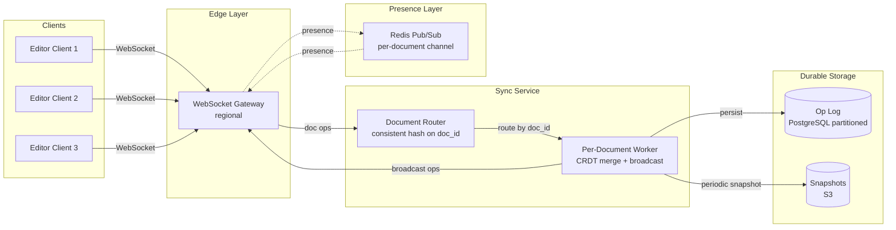
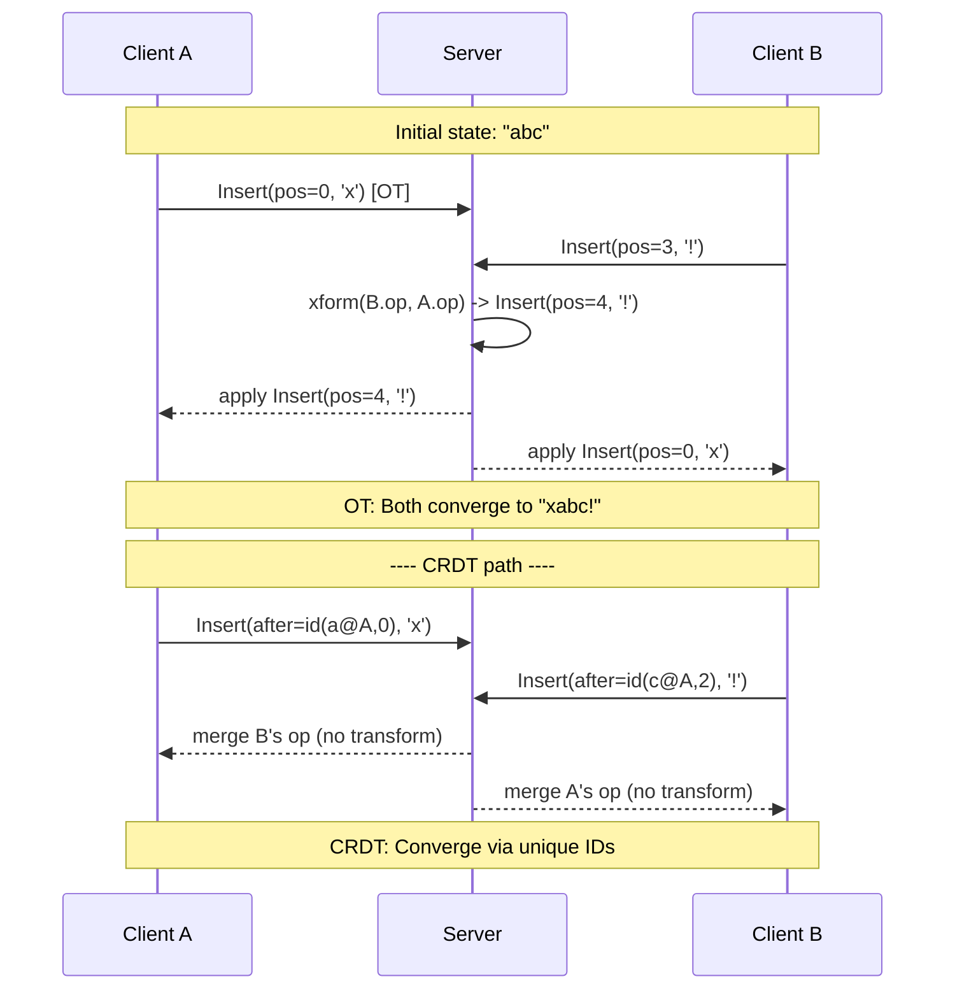
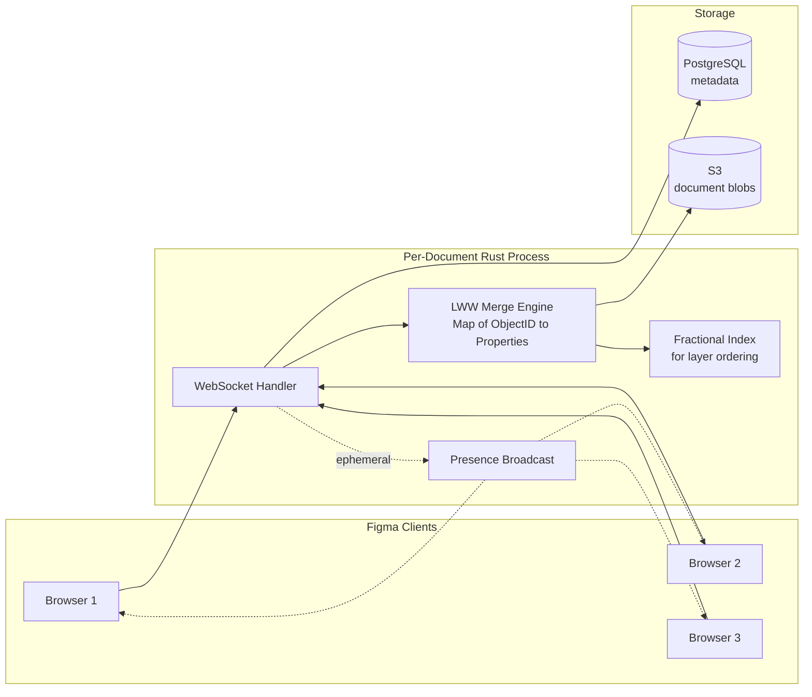
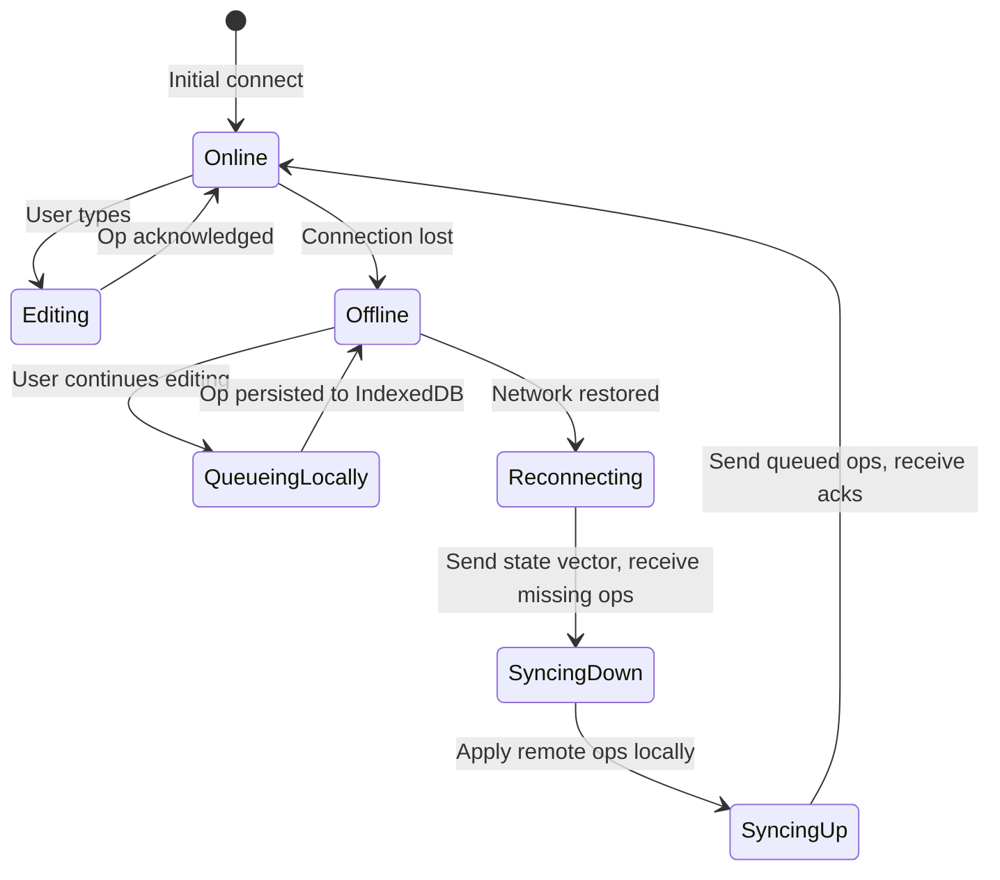
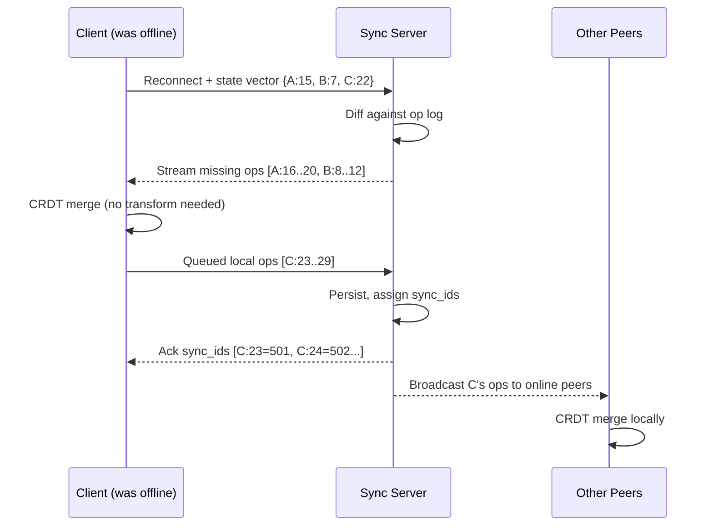

# Design Collaborative Editing (Google Docs / Figma / Notion)

> **TL;DR.** Real-time collaborative editing is the showcase problem of distributed concurrency. Two users typing 80 ms apart must both see a coherent final state with no lost keystrokes, under 50 ms local echo and under 200 ms peer visibility [^1]. Two algorithm families compete: Operational Transformation (OT), which transforms concurrent positional edits on a central server, and Conflict-free Replicated Data Types (CRDTs), which assign every character a unique ID so operations commute without coordination [^2]. The pivotal trade-off is centralization (OT, simpler wire format, single-server bottleneck) versus commutativity (CRDT, any topology, heavier metadata). Our design uses a server-mediated CRDT with separate ephemeral presence, targeting 100K+ concurrent editors across millions of documents.

## Learning Objectives

- Design a collaborative editing system that handles 100K+ concurrent editors with p99 < 100 ms keystroke echo
- Compare OT and CRDTs and justify when each is appropriate
- Architect cursor presence broadcasting that scales to N editors without N^2 amplification
- Design offline edit reconciliation using state vectors and CRDT merge
- Estimate capacity for the edit channel and presence fanout separately
- Justify the choice of server-mediated CRDT over pure P2P or pure OT for a SaaS product

## Intuition

Imagine two chefs sharing a single recipe card. Chef A writes "add salt" at line 3 while Chef B simultaneously writes "add pepper" at line 3. If both scribble directly, one overwrites the other.

**Strategy 1 (OT):** A head chef stands between them. When both submit edits at the same position, the head chef adjusts one: "Chef B, your line 3 is now line 4 because Chef A already wrote at line 3." The head chef transforms positions so both edits land cleanly. This works, but the head chef is a bottleneck. If 50 chefs submit at once, the head chef gets overwhelmed.

**Strategy 2 (CRDT):** Every word gets a sticky note with a unique serial number. "Add salt" is sticky #A-7, "add pepper" is sticky #B-3. Because each sticky has a globally unique ID, both chefs can paste them in any order and the recipe always converges to the same arrangement. No head chef needed. The cost: every word carries a serial number, making the recipe card heavier.

Now scale to a Google Doc with 50 simultaneous editors, each typing at keystroke speed. Add cursor positions (where is each chef looking?), offline editing (a chef goes home and keeps writing), and version history (what did the recipe look like yesterday?). The "head chef" is a server process; the "sticky notes" are Lamport-timestamped character IDs. The algorithm is only the headline feature. Production systems spend most engineering effort on three other problems: ephemeral presence, offline reconciliation, and version history.

## Requirements

### Clarifying Questions

- **Q: What content types must support concurrent editing?**
  Assume: Rich text (paragraphs, headings, lists, inline formatting), structured blocks (tables, embeds), and vector graphics (Figma-style objects). Character-level merging for text; property-level for structured objects.

- **Q: How many concurrent editors per document?**
  Assume: Up to 100 simultaneous editors per document at peak. System-wide: 100K+ concurrent editing sessions across millions of documents.

- **Q: What is the latency target for keystroke echo?**
  Assume: Local echo < 50 ms (optimistic local apply). Peer visibility < 200 ms [^1].

- **Q: Must the system support offline editing?**
  Assume: Yes. Clients may be offline for hours and must reconcile cleanly on reconnect without data loss.

- **Q: What consistency model?**
  Assume: Eventual consistency with convergence guarantee. All peers must reach the same final state given the same set of operations, regardless of application order.

- **Q: Multi-region deployment?**
  Assume: Yes. Documents are pinned to a home region for the sync server; clients connect to the nearest edge and relay to the home region.

### Functional Requirements

- Multiple users edit the same document concurrently with real-time character-level merging
- Cursor positions, selections, and typing indicators visible to all active editors
- Full offline editing with automatic reconciliation on reconnect
- Version history with named snapshots and time-travel playback
- Undo/redo that respects only the local user's operations, not peers' edits

### Non-Functional Requirements

- **Load:** 100K+ concurrent editing sessions; millions of active documents
- **Latency:** p50 < 30 ms local echo, p99 < 100 ms; peer visibility p99 < 200 ms
- **Availability:** 99.99% for the edit path; 99.9% for version history retrieval
- **Consistency:** eventual with guaranteed convergence (all peers reach identical state)
- **Durability:** zero data loss on single-region failure; RPO < 1 second for active documents

## Capacity Estimation

| Metric | Value | Derivation |
|--------|------:|------------|
| Concurrent editing sessions | 100K | Peak load target |
| Avg operations/sec per editor | 3 | ~180 chars/min typing speed |
| Total edit ops/sec (system) | 300K | 100K sessions x 3 ops/sec |
| Presence updates/sec per editor | 10 | Cursor moves at keystroke rate, throttled |
| Total presence msgs/sec | 1M | 100K editors x 10/sec (before fanout) |
| Avg document size | 50 KB | Rich text with formatting metadata |
| Op log entry size | 64 B | (clientID:8, clock:8, origin:8, content:32, meta:8) |
| Op log storage/day | ~1.6 TB | 300K ops/sec x 86,400 x 64 B |
| Snapshot storage (5 yr) | ~500 TB | Periodic snapshots + compaction |

Key ratios:

- **Presence-to-edit ratio:** 3:1. Presence generates 3x more messages than actual edits but requires zero durable storage [^3].
- **Fanout per document:** At 50 editors per doc, each edit fans out to 49 peers. At 100 editors, 99 peers. Presence fanout is the dominant bandwidth cost.
- **CRDT overhead:** Yjs stores a 100 KB document in approximately 160 KB on disk (~1.6x overhead) [^2]; Automerge 2.0 stores a 107 KB paper with full history in 129 KB (~1.2x overhead) [^4]. Automerge 3.0 (July 2025) further cut in-memory footprint by over 10x by using the compressed columnar representation at runtime rather than only at rest [^5].

## API and Data Model

### API Design

```http
POST /v1/docs/{doc_id}/connect
  Upgrade: websocket
  Auth: Bearer <token>
  Returns: WebSocket connection + initial document state + state vector

WS SEND: { type: "op", ops: [...], stateVector: {...} }
  Server assigns syncId, persists, broadcasts to peers

WS SEND: { type: "awareness", state: { cursor: {line, col}, selection: {...}, user: {...} } }
  Server broadcasts to peers (ephemeral, not persisted)

WS RECV: { type: "op", ops: [...], syncId: N }
  Remote operations to apply locally

GET /v1/docs/{doc_id}/history?from=<timestamp>&to=<timestamp>
  Returns: 200 { snapshots: [...], ops_between: [...] }

POST /v1/docs/{doc_id}/snapshot
  Body: { name: "v2.1 draft" }
  Returns: 201 { snapshot_id: "...", created_at: "..." }
```

Pagination for history uses timestamp cursors. Rate limiting: 100 ops/sec per client per document. Idempotency: each op carries `(clientID, clock)` which is globally unique; duplicate ops are silently dropped.

### Data Model

```sql
-- Document metadata (PostgreSQL)
CREATE TABLE documents (
  doc_id        UUID PRIMARY KEY,
  owner_id      UUID NOT NULL,
  title         TEXT,
  home_region   VARCHAR(16),
  created_at    TIMESTAMPTZ,
  updated_at    TIMESTAMPTZ
);

-- Operation log (append-only, partitioned by doc_id)
CREATE TABLE op_log (
  doc_id        UUID,
  sync_id       BIGINT,       -- monotonic per document
  client_id     BIGINT,
  clock         BIGINT,
  op_data       BYTEA,        -- binary-encoded CRDT op
  created_at    TIMESTAMPTZ,
  PRIMARY KEY (doc_id, sync_id)
) PARTITION BY HASH (doc_id);

-- Snapshots (S3 references)
CREATE TABLE snapshots (
  doc_id        UUID,
  snapshot_id   UUID,
  s3_key        TEXT,
  sync_id_at    BIGINT,       -- op log position at snapshot time
  created_at    TIMESTAMPTZ,
  PRIMARY KEY (doc_id, snapshot_id)
);
```

The op log is the source of truth. Snapshots are periodic materializations stored in S3 for fast document load (avoid replaying the full op log). State vectors index into the op log for efficient delta computation on reconnect.

## High-Level Architecture



*Persistent document operations flow through the sync service (one logical worker per document); ephemeral presence rides Redis Pub/Sub and never touches durable storage.*

**Write path:** Client applies operation optimistically to local CRDT state, sends the op over WebSocket to the edge gateway. The gateway routes to the per-document worker (consistent-hashed by `doc_id`). The worker assigns a monotonic `sync_id`, persists to the op log, and broadcasts to all connected peers.

**Read path (reconnect):** Client sends its state vector. The worker computes the diff against the op log (or loads from the latest snapshot + forward ops) and streams missing operations. The client's queued offline ops flow the other direction.

**Presence path:** Cursor/selection updates bypass the sync service entirely. They flow through Redis Pub/Sub on a per-document channel. No persistence, no op log entry, no sync_id assignment.

## Deep Dives

### Deep dive 1: OT vs CRDT architectural trade-offs

**The problem:** Two users type into the same paragraph simultaneously. Their edits reference character positions that shift as the other types. How do you guarantee both converge to the same final state?

**OT approach (Google Docs):** Each operation is positional: `Insert(pos=5, 'H')`, `Delete(pos=12, len=3)`. When a remote op arrives based on an older version, the server transforms it against intervening ops. The Jupiter algorithm (Xerox PARC, 1995) [^6] pins a single server as total-order authority. Each client exchanges ops only with the server, reducing transforms to pairwise `xform(client_op, server_op)` [^7].

OT requires two correctness properties. TP1 (two concurrent ops converge regardless of order) is achievable. TP2 (three concurrent ops converge regardless of path) is notoriously hard. The original 1989 paper did not satisfy TP2, and the problem remained open for years [^8][^9]. Google solved this by centralizing: if the server defines a single total order, only TP1 is needed [^2]. The cost: a popular document hits a single-server bottleneck. Google Docs shows "editing disabled" when one document is overloaded [^2].

The transformation matrix grows O(n^2) with distinct operation types. Figma rejected OT explicitly: "adding more operations increases implementation complexity quadratically" [^10].

**CRDT approach (Yjs, Automerge):** Every character gets a globally unique ID: `(clientID, clock)`. Insertions reference neighbor IDs, not positions. Concurrent inserts after the same character resolve via deterministic tiebreakers [^11]. Operations commute by construction, so any application order converges.



*OT transforms positional operations at the server; CRDTs tag each character with a unique ID so any application order converges without transformation.*

**Performance reality:** Yjs applies a 260,000-operation editing trace in 1,074 ms. Automerge 2.0 handles the same trace in 1,816 ms, down from 500,000 ms in version 0.14 [^4]. The "CRDTs are too slow" argument died in 2023.

**Our choice:** Server-mediated CRDT. We get CRDT merge guarantees (clean offline, commutative ops) without P2P operational complexity. The server provides durability and fanout but does not define truth; the CRDT convergence property does.

### Deep dive 2: Figma's multiplayer architecture

Figma serves millions of users [^12] with a CRDT-inspired but explicitly not pure-CRDT architecture. Evan Wallace wrote: "there is some unavoidable performance and memory overhead with [pure CRDTs]. Since Figma is centralized, we can simplify our system by removing this extra overhead" [^1].

**Data model:** `Map<ObjectID, Map<Property, Value>>`. Every Figma object (rectangle, frame, text node) has a stable ID and a dictionary of typed properties. Two clients editing different properties of the same object never conflict. Two clients editing the same property resolve via server-ordered last-write-wins [^1].

**Ordered sequences:** Layers and groups use fractional indexing. Each child has a position encoded as an arbitrary-precision base-95 string. To insert between `"0.4"` and `"0.5"`, pick `"0.45"` [^10]. This avoids OT entirely for reordering.

**Per-document process isolation:** Each document runs in a dedicated Rust process. Clients open a WebSocket and download the full document on connect [^1]. In 2018, Figma rewrote the server from TypeScript to Rust, reporting roughly 10x faster serialization [^13]. The TypeScript event loop had been blocking on large document serialization, causing multi-document worker pool failures.



*Figma runs one Rust process per document; property-level LWW resolves conflicts, fractional indexing handles ordering, and presence rides a separate ephemeral path.*

**Key insight:** Figma chose property-level conflict resolution because design-tool users rarely type into the same text field simultaneously. If User A changes `x` and User B changes `fill`, there is no conflict. This is why character-level CRDTs are overkill for most of Figma's surface area [^1].

**Limitation:** If User A types "AB" and User B types "BC" into the same text field, the result is "AB" or "BC", never "ABC" [^1]. Acceptable for design tools; unacceptable for word processors.

### Deep dive 3: Presence and awareness at scale

**The problem:** 50 editors in a document, each broadcasting cursor position at keystroke rate (10 Hz). Naive implementation: 50 x 49 = 2,450 messages/sec for one document. At 100 editors: 9,900 messages/sec. This is N^2 fanout and it dominates bandwidth before you even consider actual edits.

**Solution architecture:**

1. **Separate channel.** Presence never touches the op log or durable storage. Yjs formalizes this as the Awareness CRDT: a tiny state-based CRDT keyed by client ID, automatically cleared on disconnect [^3]. Liveblocks exposes the same pattern as a distinct "presence" primitive [^14].

2. **Server-side fanout.** Clients send presence updates to the server only. The server fans out to all peers on that document's channel. This is N messages in, N messages out (2N total), not N^2.

3. **Throttling and coalescing.** The server coalesces rapid cursor updates into 30 ms windows. If a client sends 10 cursor moves in 30 ms, peers see only the last one. Losing intermediate positions is harmless.

4. **Relative positions.** Cursor positions expressed as character offsets break when someone inserts text earlier. Yjs solves this with `Y.RelativePosition`, which pins to character IDs and survives arbitrary concurrent edits [^11].

5. **Automatic cleanup.** When a peer disconnects, the server broadcasts a removal event. No tombstone, no garbage collection, no storage cost.

**Infrastructure:** Redis Pub/Sub with one channel per document. At 100K concurrent documents with 10 editors average, this is 1M presence messages/sec across the Redis cluster. A single Redis node handles ~500K pub/sub messages/sec; two nodes with sharding by doc_id suffice.

### Deep dive 4: Offline support and sync-on-reconnect

**The problem:** A user edits offline for hours. Meanwhile, 5 other users have made thousands of edits. On reconnect, the offline user's edits must merge cleanly without data loss and without surprising the user.

**CRDT solution:** The client appends ops to a local log persisted in IndexedDB. Each op carries `(clientID, clock, origin, content)`. On reconnect:

1. Client sends its state vector: `{A:15, B:7, C:22}` (highest clock seen per peer)
2. Server computes diff: "you are missing ops A:16-20, B:8-12"
3. Server streams missing ops to client
4. Client sends its queued local ops (C:23-29) to server
5. Server persists, assigns sync_ids, broadcasts to other peers
6. CRDT merge handles all conflicts automatically: no transformation step needed



*The client state machine treats offline as a first-class state, not an error mode. Local edits queue in IndexedDB and sync bidirectionally on reconnect.*



*On reconnect, state vectors enable minimal delta exchange; the CRDT merge step requires no transformation because operations commute by construction.*

**OT alternative (Figma's approach):** "When you come back online, the client downloads a fresh copy of the document, reapplies any offline edits on top of this latest state, and then continues syncing" [^1]. Simpler but potentially surprising: OT transforms positional operations against operations the user never saw, which can produce unexpected results for long offline periods.

**Linear's approach:** Every mutation persists in a TransactionQueue backed by IndexedDB. On reconnect, the queue replays through a REST endpoint. The server assigns monotonic sync IDs that all clients subscribe to [^15][^16]. Conflicts resolve to the highest sync_id (server-ordered LWW at the attribute level).

**Our choice:** CRDT with state-vector sync. The client never needs to re-download the full document. Merge is automatic and preserves user intent because insertions carry origin pointers, not positional offsets [^11].

## Real-World Example

**Google Docs: server-authoritative OT at billion-user scale.**

Google Docs uses Operational Transformation based on the Jupiter algorithm, serving billions of users across Google Workspace [^17]. Each document is served by a single logical process that assigns a scalar version number to every operation. Clients send deltas over a WebSocket; the server transforms and broadcasts [^6][^18].

The architecture shards by document ID across workers. Each document's process maintains the canonical operation log and periodic snapshots. Version history is materialized on demand from snapshots plus forward deltas. The transform logic sits at the server (not pairwise-peer), which simplifies the matrix to `xform(client_op, server_op)` and eliminates the TP2 problem entirely [^7].

**The scaling limit:** A single document can be rate-limited with an "editing disabled" notice when concurrency is too high. Joseph Gentle (former Google Wave engineer) attributes this directly to the single-server OT bottleneck [^2]. Google solved this for most documents by keeping the per-document process lightweight, but the architectural ceiling exists.

**Key engineering decisions:**

- Central server as total-order authority, eliminating TP2
- One process per hot document; scale by sharding document IDs
- Persistent op log + snapshots in Bigtable-style storage
- Version history materialized from snapshots + forward deltas

**Contrast with our design:** We chose server-mediated CRDT specifically to avoid the single-server bottleneck. The server persists and fans out, but the CRDT convergence property means the server does not need to transform operations. If the server fails, clients can continue editing offline and reconcile later.

## Trade-offs

| Approach | Pros | Cons | When to Use | Our Pick |
|----------|------|------|-------------|----------|
| OT (central server) | Minimal per-op metadata; battle-tested at Google [^18] | Single-server bottleneck; O(n^2) op-type matrix; TP2 unsolved [^7][^10] | Rich-text docs with trusted authority | Word processors only |
| CRDT (Yjs/Automerge) | P2P possible; clean offline; commutative [^11][^4] | 1.2-1.6x size overhead; tombstones grow; structured moves weak | Local-first, offline-heavy apps | Local-first tools |
| Server-mediated CRDT | CRDT guarantees + simple ops model [^1][^14] | Gives up P2P; server is durability choke point | Most SaaS collaborative products | **Our default** |
| Pure P2P CRDT | No server; true data ownership [^19] | NAT traversal; discovery; no guaranteed durability | Privacy-critical specialty tools | Only if privacy demands |
| Property-level LWW | Simple; no character-level complexity [^1] | Concurrent text edits lose one writer's work | Design tools, issue trackers | Non-text fields |
| Block-level LWW (Notion) | Conflicts rare; permission inheritance natural [^20] | No character-level merge within blocks; not a CRDT | Structured document tools | Block-based editors |

The single biggest trade-off: **centralization vs commutativity**. Google chose centralization (OT) and got simplicity at the cost of a per-document ceiling. Figma chose a hybrid (server-mediated property-level CRDT) and got horizontal scale at the cost of giving up character-level merge. We choose server-mediated character-level CRDT (Yjs-style) because our product is a word processor, not a design tool.

## Scaling and Failure Modes

**At 10x load (1M concurrent editors):** The per-document worker becomes the bottleneck for viral documents with 500+ editors. Mitigation: shard presence fanout across multiple Redis nodes; for the edit path, the CRDT merge is CPU-bound, so vertically scale the worker or split read-fanout from write-persist.

**At 100x load (10M concurrent editors):** Op log writes to PostgreSQL saturate. Mitigation: move the op log to an append-only store (Kafka or a custom WAL) with async compaction to cold storage. Snapshots become the primary read path; op log is only for delta sync.

**At 1000x load (100M concurrent editors):** The architecture shifts to edge-first: each region runs a full sync service, regions gossip CRDT state asynchronously, and the "home region" concept dissolves into a multi-leader CRDT mesh. This is the local-first thesis at infrastructure scale [^19].

**Failure modes:**

- **Sync service crash (per-document worker dies):** Clients detect via missed heartbeats, reconnect, and send state vectors. The new worker loads the latest snapshot + op log tail and resumes. Offline-capable clients continue editing locally. Data loss window: ops accepted but not yet persisted (mitigated by WAL fsync before ack).

- **Redis Pub/Sub failure (presence outage):** Cursors freeze but editing continues unaffected. Presence is ephemeral; on Redis recovery, clients re-broadcast their current state. No data loss, only UX degradation.

- **Split-brain between regions:** Two sync workers for the same document accept conflicting ops. CRDT convergence guarantees both will reach the same state once they exchange ops. No manual conflict resolution needed. This is the fundamental advantage over OT.

## Common Pitfalls

> [!WARNING]
> **Running cursor presence over the persistent edit channel.** Cursors are ephemeral and high-frequency. If they share the code path with durable edits, every cursor twitch writes to the op log and hits disk. Separate presence from edits. Yjs, Automerge-Repo, and Liveblocks all ship explicit awareness APIs to prevent this [^3][^14].

> [!WARNING]
> **Ignoring CRDT tombstone growth.** Sequence CRDTs must remember deleted characters because a peer may reference them from arbitrarily old offline state. Automerge 0.14 required roughly 1.1 GB of RAM for a 100 KB paper's full history [^2][^4]. Enable garbage collection (Yjs `doc.gc = true`) or use Automerge's columnar format; Automerge 3.0 reduced in-memory usage by over 10x versus 2.0 (e.g., pasting Moby Dick went from ~700 MB to ~1.3 MB) by using the compressed representation at runtime [^5].

> [!WARNING]
> **Assuming OT TP2 is solved.** Three concurrent operations can diverge on different peers if transform functions do not satisfy TP2. Even the original 1989 paper failed this [^9]. Google's fix: centralize ordering so only pairwise TP1 is needed. If you cannot centralize, use CRDTs.

> [!WARNING]
> **Expecting character-level merge from property-level systems.** If User A types "AB" and User B types "BC" into the same text field concurrently, a property-level LWW system produces "AB" or "BC", never "ABC" [^1]. Know your conflict unit before choosing an algorithm.

> [!WARNING]
> **Cursor positions as character offsets.** Offsets break when someone inserts text earlier in the document. Use relative positions pinned to character IDs (Yjs `Y.RelativePosition`) that survive arbitrary concurrent edits [^11].

> [!CAUTION]
> **Reparenting cycles in tree-structured documents.** Client A moves X under Y; Client B moves Y under X. If parent pointers form a cycle, the tree is invalid. Figma's fix: temporarily remove both objects until the server rejects one move [^1].

## Follow-up Questions

**1. How do you handle rich-text structured content (tables, embeds, nested blocks)?**

Use a block-based CRDT where each block is a node in a tree. Text within a block uses character-level CRDT (Yjs Y.Text). Block-level operations (move, reparent, delete) use a tree CRDT with cycle detection. Peritext [^21] handles concurrent formatting (bold + italic) by storing format markers at character positions rather than as tree nodes.

**2. How would you implement E2E encrypted collaboration?**

Each document has a symmetric group key distributed via asymmetric encryption to authorized editors. Ops are encrypted client-side before transmission. The server sees only ciphertext and cannot transform or validate content. This breaks server-side search, spell-check, and AI features. Signal's Sender Keys pattern works for group key rotation.

**3. What changes for block-based vs character-based CRDTs?**

Block-based systems (Notion-style) move the conflict unit from character to block property. Notion itself is not a CRDT: every client action becomes a transaction against a record, and the server applies last-write-wins per field through a `saveTransactions` API [^20]. Conflicts are rarer because users usually edit different blocks. Trade-off: simultaneous editing within a single block's text field does not merge at character level. Linear uses CRDTs only for rich-text descriptions, keeping everything else at attribute-level LWW [^22].

**4. How do you handle undo across sessions?**

Undo must reverse only the local user's operations, not peers' edits. Maintain a per-user undo stack of operation inverses. For CRDTs, "undo insert" means "mark that character as deleted"; "undo delete" means "unmark the tombstone." The undo operation itself is a new CRDT op that other peers receive and apply.

**5. How would you handle multi-document transactions (atomic move between docs)?**

True atomicity across documents requires distributed transactions, which conflicts with the per-document isolation model. Instead, use a saga: (1) insert into target doc, (2) delete from source doc, (3) if step 2 fails, compensate by deleting from target. Accept that for a brief window the content exists in both documents.

**6. How do Liveblocks and PartyKit simplify this architecture?**

Both are managed infrastructure for the sync service layer. Liveblocks provides the WebSocket gateway, CRDT storage (Yjs-compatible), presence API, and conflict resolution as a service [^14]. PartyKit (acquired by Cloudflare in April 2024) runs per-document workers on Durable Objects [^23]. They eliminate the need to build the sync service yourself but constrain your data model to their supported CRDT types.

**7. How do you handle latency-hiding cursor prediction?**

Apply cursor movements optimistically on the local client before server confirmation. If the server rejects (rare with CRDTs), snap the cursor to the correct position. For remote cursors, interpolate between known positions using timestamps to smooth rendering at 60 fps even when updates arrive at 10 Hz.

## Exercise

### Exercise 1: Presence fanout at scale

A document has 200 concurrent editors. Each broadcasts cursor position at 10 Hz. Calculate the total message volume per second, propose an architecture that keeps per-client bandwidth under 50 KB/s, and explain what you sacrifice.

<details>
<summary>Hint</summary>

Calculate raw fanout first (200 editors x 10 Hz x 199 recipients). Then consider: what if the server coalesces updates into 100 ms windows and sends a single batch per window? What information can you drop without degrading UX?

</details>

<details>
<summary>Solution</summary>

**Raw fanout:** 200 editors x 10 updates/sec = 2,000 incoming messages/sec. Each fans out to 199 peers = 398,000 outgoing messages/sec for one document. At ~100 bytes per presence message, that is 39.8 MB/s outgoing bandwidth for one document.

**Mitigation:** Server coalesces into 100 ms windows. In each window, at most 200 updates arrive. The server sends one batch of 200 cursor positions (200 x 100 B = 20 KB) to each of 200 clients every 100 ms. Per-client bandwidth: 20 KB x 10/sec = 200 KB/s. Still too high.

**Further optimization:** Only send cursors for editors visible in the client's viewport. If a client's viewport shows 20% of the document, send only ~40 relevant cursors per batch: 40 x 100 B x 10/sec = 40 KB/s per client. Under our 50 KB/s budget.

**Sacrifice:** Cursors outside the viewport are invisible until the user scrolls. This is acceptable because users cannot see off-screen cursors anyway. Google Docs uses this exact optimization.

</details>

## Key Takeaways

- **Server-mediated CRDT is the right default for SaaS collaborative editing.** You get CRDT merge guarantees without P2P operational complexity.
- **Presence is a separate system from edits.** Running it over the persistent op channel is a textbook scaling mistake that causes N^2 write amplification.
- **OT won the 2000s; CRDTs are winning the 2020s.** Yjs applies 260K ops in ~1 second [^4]; Automerge 2.0 stores full history with only 30% overhead [^4]. The performance argument is settled.
- **Know your conflict unit.** Property-level LWW (Figma) is simpler and sufficient when users rarely edit the same field. Character-level CRDTs are necessary for word processors.
- **Offline is a first-class state, not an error mode.** CRDTs handle it via state vectors; OT requires full document re-download and rebase.

## Further Reading

- [How Figma's multiplayer technology works](https://www.figma.com/blog/how-figmas-multiplayer-technology-works/). Evan Wallace's definitive account of server-mediated CRDT-inspired merging; the single best production architecture post in this space.
- [I was wrong. CRDTs are the future](https://josephg.com/blog/crdts-are-the-future/). Joseph Gentle (ex-Google Wave) on why OT lost and CRDTs won; essential context for the algorithm debate.
- [Introducing Automerge 2.0](https://automerge.org/blog/automerge-2/). The 2023 rewrite with benchmarks showing 275x speedup; proof that CRDTs are production-viable.
- [Yjs internals (INTERNALS.md)](https://github.com/yjs/yjs/blob/main/INTERNALS.md). The actual YATA implementation: origin pointers, linked-list structure, and the integration algorithm.
- [Local-first software: you own your data, in spite of the cloud](https://www.inkandswitch.com/local-first/). Ink & Switch's 2019 manifesto reframing collaborative editing as a data-ownership problem.
- [Realtime editing of ordered sequences](https://www.figma.com/blog/realtime-editing-of-ordered-sequences/). Figma's fractional indexing post; the standard technique for ordered lists without OT.
- [Peritext: a CRDT for rich text](https://www.inkandswitch.com/peritext/). The algorithm for concurrent formatting that Automerge 2.2 integrates; frontier material worth knowing exists.
- [Scaling the Linear Sync Engine](https://linear.app/blog/scaling-the-linear-sync-engine). How Linear built local-first-in-spirit sync with server-ordered deltas and selective CRDT adoption.

## Flashcards

<details>
<summary><strong>Q: What are the two main algorithm families for collaborative editing?</strong></summary>

A: Operational Transformation (OT) transforms positional operations against each other on a central server. CRDTs assign each character a globally unique ID so operations commute without transformation, enabling any application order to converge.

</details>

<details>
<summary><strong>Q: Why does OT require a central server in practice?</strong></summary>

A: OT needs a total ordering of operations to avoid the TP2 correctness problem (three concurrent ops diverging). A central server provides that total order, reducing the problem to pairwise TP1 transforms only.

</details>

<details>
<summary><strong>Q: What is the tombstone problem in CRDTs?</strong></summary>

A: Deleted characters must be remembered as tombstones because a peer may reference them from arbitrarily old offline state. Without garbage collection, document size grows unboundedly. Automerge 0.14 needed 1.1 GB for a 100 KB paper's history; Automerge 2.0 reduced this to 129 KB with columnar encoding.

</details>

<details>
<summary><strong>Q: Why should cursor presence use a separate channel from document edits?</strong></summary>

A: Cursors are ephemeral and high-frequency (10+ updates/sec per user). Routing them through the persistent edit channel causes write amplification to durable storage and N^2 fanout that saturates the edit pipeline.

</details>

<details>
<summary><strong>Q: How does Figma handle concurrent edits to the same object property?</strong></summary>

A: Server-ordered last-write-wins at the property level. Two clients editing different properties never conflict. Two clients editing the same property resolve by the server accepting whichever message arrives last.

</details>

<details>
<summary><strong>Q: What is fractional indexing and why did Figma choose it?</strong></summary>

A: Each item gets a position string between 0 and 1 (e.g., "0.45" between "0.4" and "0.5"). Reordering updates exactly one field. OT would require expressing reorders as delete-plus-insert and transforming against every other operation type, growing complexity O(n^2).

</details>

<details>
<summary><strong>Q: How does a CRDT client sync after being offline?</strong></summary>

A: The client sends a state vector (highest clock per peer) to the server. The server computes the diff and streams missing ops. The client's queued local ops flow the other direction. No transformation step needed because CRDT operations commute.

</details>

<details>
<summary><strong>Q: What performance does Yjs achieve on the standard editing trace?</strong></summary>

A: Yjs applies 260,000 operations in approximately 1,074 ms with document size overhead of 1.2-1.6x raw text after binary compression. Automerge 2.0 handles the same trace in 1,816 ms with 30% storage overhead.

</details>

<details>
<summary><strong>Q: What is the N^2 presence problem and how do you solve it?</strong></summary>

A: With N editors each broadcasting at 10 Hz, naive peer-to-peer fanout produces N x (N-1) messages/sec. Solution: server-side fanout (N in, N out = 2N), coalescing into time windows, and viewport-based filtering to send only relevant cursors.

</details>

<details>
<summary><strong>Q: Why did Figma rewrite their multiplayer server from TypeScript to Rust?</strong></summary>

A: The TypeScript event loop blocked on large document serialization, causing multi-document worker pool failures. Rust provided roughly 10x faster serialization and low enough memory that one-process-per-document became practical at scale.

</details>

## References

[^1]: Evan Wallace, "How Figma's multiplayer technology works", Figma Blog, October 2019. https://www.figma.com/blog/how-figmas-multiplayer-technology-works/

[^2]: Joseph Gentle, "I was wrong. CRDTs are the future", September 2020. https://josephg.com/blog/crdts-are-the-future/

[^3]: Yjs documentation, "Awareness & Presence". https://docs.yjs.dev/getting-started/adding-awareness

[^4]: Alex Good, Orion Henry et al., "Introducing Automerge 2.0", Automerge Blog, January 2023. https://automerge.org/blog/automerge-2/

[^5]: Alex Good, "Automerge 3.0", Automerge Blog, July 2025. https://automerge.org/blog/automerge-3/

[^6]: Nichols, D. A.; Curtis, P.; Dixon, M.; Lamping, J., "High-latency, low-bandwidth windowing in the Jupiter collaboration system", UIST 1995. https://doi.org/10.1145/215585.215706

[^7]: Wikipedia, "Operational transformation", section on TP1/TP2 transformation properties. https://en.wikipedia.org/wiki/Operational_transformation#Transformation_properties

[^8]: Ellis, C. A.; Gibbs, S. J., "Concurrency control in groupware systems", ACM SIGMOD Record 18(2), 1989. https://doi.org/10.1145/67544.66963

[^9]: Sun, Chengzheng; Ellis, Clarence, "Operational transformation in real-time group editors: Issues, algorithms, and achievements", CSCW 1998. https://doi.org/10.1145/289444.289469

[^10]: Evan Wallace, "Realtime editing of ordered sequences", Figma Blog, March 2017. https://www.figma.com/blog/realtime-editing-of-ordered-sequences/

[^11]: Yjs internals (INTERNALS.md), GitHub. https://github.com/yjs/yjs/blob/main/INTERNALS.md

[^12]: "How Figma Beat Sketch", ideaplan.io analysis, 2024. https://www.ideaplan.io/blog/how-figma-won-the-design-tool-market

[^13]: Evan Wallace, "Rust in production at Figma", Figma Blog, May 2018. https://www.figma.com/blog/rust-in-production-at-figma/

[^14]: Max Heichling, "Understanding sync engines: How Figma, Linear, and Google Docs work", Liveblocks Blog, December 2025. https://www.liveblocks.io/blog/understanding-sync-engines-how-figma-linear-and-google-docs-work

[^15]: Tuomas Artman, "Scaling the Linear Sync Engine", Linear Blog, June 2023. https://linear.app/blog/scaling-the-linear-sync-engine

[^16]: Mark Percival, "Reverse engineering Linear's sync magic", December 2022. https://marknotfound.com/posts/reverse-engineering-linears-sync-magic/

[^17]: "Google Workspace Statistics 2026", gwsave.com, 2025. https://gwsave.com/blog/google-workspace-statistics

[^18]: "Operational transformation", Wikipedia, accessed 2026. https://en.wikipedia.org/wiki/Operational_transformation

[^19]: Kleppmann, M.; Wiggins, A.; van Hardenberg, P.; McGranaghan, M., "Local-first software: you own your data, in spite of the cloud", Ink & Switch, April 2019. https://www.inkandswitch.com/local-first/

[^20]: Jake Teton-Landis, "The data model behind Notion's flexibility", Notion Blog, May 2021. https://www.notion.com/blog/data-model-behind-notion

[^21]: Ink & Switch, "Peritext: a CRDT for rich-text collaboration", 2022. https://www.inkandswitch.com/peritext/

[^22]: Thuan Ho, "Linear's sync engine architecture", fujimon.com, August 2024. https://www.fujimon.com/blog/linear-sync-engine

[^23]: Sunil Pai, Rita Kozlov, "Cloudflare acquires PartyKit to allow developers to build real-time multi-user applications", Cloudflare Blog, April 2024. https://blog.cloudflare.com/cloudflare-acquires-partykit
