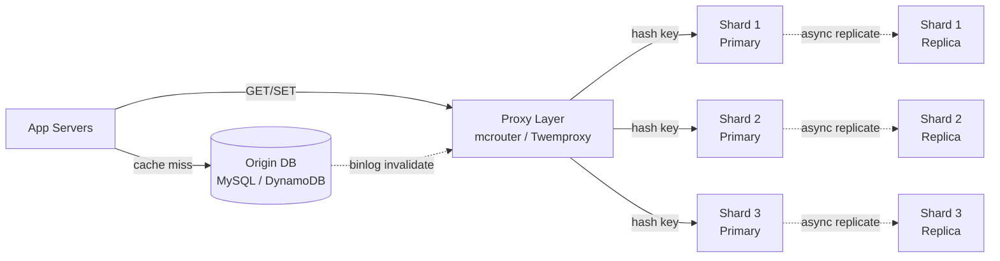
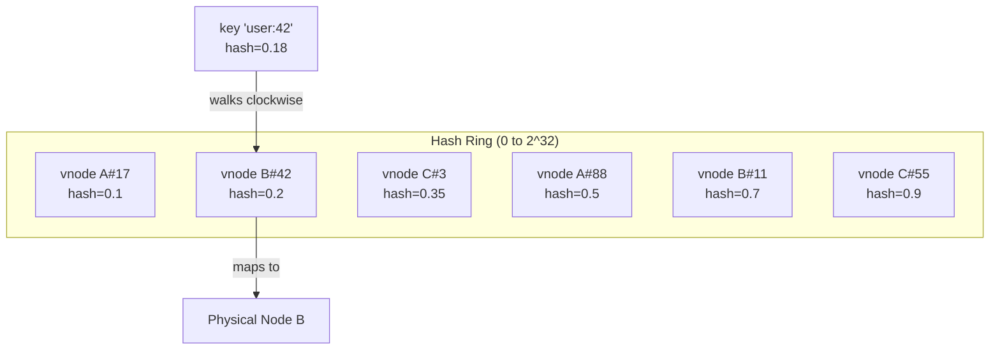
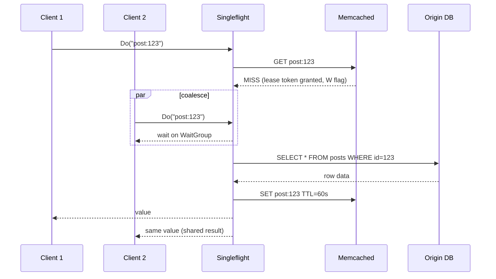
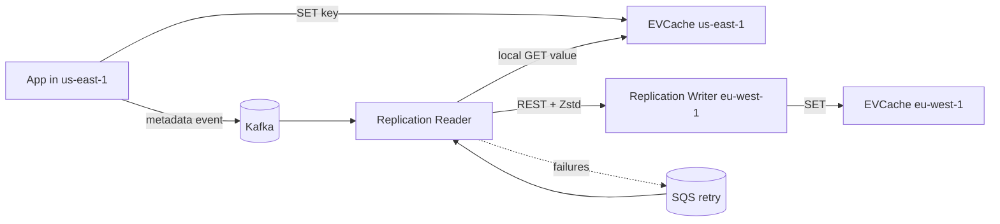

# Design a Distributed Cache (Memcached / Redis Cluster)

> **TL;DR.** A distributed cache is a fleet of RAM-backed nodes sitting between stateless application servers and a slower origin database. The design pivots on three axes: how keys map to nodes (consistent hashing), what to evict when memory fills (LRU vs W-TinyLFU), and how to survive hot keys that exceed single-shard capacity (leases, singleflight, probabilistic early expiration). Facebook's memcache tier serves billions of requests per second[^1] with a 99% hit rate that reduces MySQL load by 100x[^2]. Netflix EVCache runs 22,000 instances across 4 regions handling 400M ops/sec against 14.3 PB of cached data[^3]. The client library is the part you will spend the most time maintaining.

## Learning Objectives

After this module, you will be able to:

- [ ] Map keys to shards using consistent hashing and explain when rendezvous hashing is preferable
- [ ] Choose eviction policies (LRU, LFU, W-TinyLFU, ARC) based on workload access patterns
- [ ] Design replication and failover for a cache tier that must survive node loss
- [ ] Mitigate hot keys and cache stampedes with leases, singleflight, and probabilistic early expiration
- [ ] Justify when to pick Memcached vs Redis Cluster vs a managed service like MemoryDB
- [ ] Estimate memory, node count, and bandwidth for a 10M ops/sec cache cluster

## Intuition

A distributed cache looks trivial. Hash a key, pick a server, store the value in RAM. A single-node prototype handles this in an afternoon.

Three forces break the naive approach at scale. First, memory. A 100 TB working set does not fit on one machine. You need 1,000 nodes, and now every key lookup requires a routing decision. If that routing is a simple modulo hash, adding one node remaps nearly every key and your hit rate drops to zero during the transition. Second, hot keys. A celebrity tweet or a viral product page concentrates millions of reads on one shard. That shard's NIC saturates, its tail latency spikes, and every other key on the same shard suffers collateral damage. Third, TTL cliffs. When a popular key expires, thousands of concurrent clients miss simultaneously and stampede the origin database.

The one insight that unlocks the design: the cache is not a database. It is a performance optimization with a memory budget. Every decision flows from that constraint. You can lose data (it is regenerable). You cannot lose availability (the origin cannot absorb the full load). You cannot lose routing stability (remapping all keys on every topology change is a self-inflicted outage).

## Requirements

### Clarifying Questions

- **Q: Is this a pure cache (regenerable from origin) or a primary store?**
  Assume: Pure cache. The origin database is the system of record. Cache loss means higher latency, not data loss.

- **Q: What is the read:write ratio?**
  Assume: 100:1. Reads dominate. Writes are origin-triggered invalidations or TTL-based expiry.

- **Q: Multi-region required?**
  Assume: Yes. Three regions, zone-local reads, cross-region replication for latency-sensitive data.

- **Q: What consistency guarantee?**
  Assume: Eventual. Stale reads are acceptable for seconds. Strong consistency is the origin's job.

- **Q: What is the SLA target?**
  Assume: p99 < 5 ms for cache hits, 99.99% availability on the read path.

- **Q: Must we support rich data structures (sorted sets, lists) or just key-value blobs?**
  Assume: Key-value blobs for the core design. Rich structures are a Redis-specific extension.

### Functional Requirements

- Store key-value pairs in RAM with configurable TTL per key
- Route keys to shards via consistent hashing with minimal remapping on topology changes
- Evict keys when memory fills, using a configurable policy (LRU default)
- Replicate shards optionally for high-value data that is expensive to regenerate
- Expose a memcached-compatible ASCII/binary protocol for broad client support

### Non-Functional Requirements

- **Load:** 10M ops/sec cluster-wide, 10K ops/sec per node (p99 < 1 ms)
- **Capacity:** 100 TB total across 1,000 nodes, 100 GB RAM per node
- **Availability:** 99.99% read path; shard failure must not drop user-visible requests
- **Rebalance:** adding or removing a node moves at most 1/N of keys
- **Latency:** p50 < 0.5 ms, p99 < 2 ms for cache hits within a region

## Capacity Estimation

| Metric | Value | Derivation |
|--------|------:|------------|
| Total cache capacity | 100 TB | 1,000 nodes x 100 GB RAM |
| Avg item size | 1 KB | key(~50 B) + value(~900 B) + metadata(~50 B) |
| Total items | 100B | 100 TB / 1 KB |
| Peak read QPS | 10M | 100:1 read:write, 100K writes/sec |
| Per-node QPS | 10K | 10M / 1,000 nodes |
| Replication factor 2 memory | 200 TB | doubles raw capacity cost |
| Network per node (reads) | ~80 Mbps | 10K ops/sec x 1 KB x 8 bits |

Key derivations:

- **Node count from QPS:** Redis single-node handles ~100K ops/sec[^4]; memcached handles ~1M simple gets/sec per instance[^2]. At 10M cluster QPS, you need 100 Redis nodes or 10 memcached nodes for throughput alone.
- **Node count from memory:** 100 TB / 100 GB = 1,000 nodes. Memory is the binding constraint, not CPU.
- **Slab overhead (memcached):** ~50 bytes per item metadata[^5]. At 100B items, that is 5 TB of overhead (~5% on 1 KB items).
- **Fragmentation headroom:** budget 20% extra RAM for jemalloc fragmentation (Redis) or slab calcification (memcached)[^5][^6].

## API and Data Model

### API Design

```text
GET <key>
  Returns: value (bytes) + flags + CAS token
  Miss: NOT_FOUND (or lease token if leases enabled)

SET <key> <flags> <ttl> <bytes>\r\n<value>
  Returns: STORED | NOT_STORED (CAS mismatch)

DELETE <key>
  Returns: DELETED | NOT_FOUND

GETS <key1> <key2> ... <keyN>
  Returns: multiple values + CAS tokens (batched multi-get)

META GET <key> [flags: v N30 R10 t]
  Returns: value + metadata flags (W=win recache, Z=wait)
  Purpose: server-side lease and probabilistic early refresh[^7]
```

Design notes:

- **Multi-get batching:** clients group keys by shard, issue parallel requests, and reassemble. mcrouter does this transparently[^8].
- **CAS (compare-and-swap):** prevents stale-write races. The client reads a CAS token with `GETS`, then writes with `CAS <token>`. If another writer intervened, the CAS fails.
- **Meta commands:** memcached's meta protocol exposes lease semantics (`N` flag creates a stub on miss, `W` flag grants recache permission) without application-level coordination[^7].

### Data Model

```text
-- Per-item layout (memcached slab allocator)
struct item {
    uint8_t   slab_class;     // which size class (1 of ~40)
    uint32_t  flags;          // application-defined
    uint32_t  exptime;        // absolute TTL (epoch seconds)
    uint64_t  cas_token;      // compare-and-swap version
    uint8_t   key_len;        // max 250 bytes[^7]
    uint32_t  value_len;      // max 1 MB default[^7]
    char      key[];
    char      value[];
}
// Total overhead: ~50 bytes per item[^5]

-- Redis Cluster slot mapping
HASH_SLOT = CRC16(key) mod 16384
-- Hash tags: {user:1000}.name and {user:1000}.age -> same slot[^9]
```

Memcached uses a slab allocator: memory is divided into 1 MB pages, each assigned to a size class (chunk sizes grow by factor 1.25). An item of 600 bytes fits the 640-byte class. Each class has its own LRU chain[^5].

Redis Cluster maps all keys to 16,384 hash slots via CRC16. Each master owns a subset of slots. Hash tags (`{...}`) force related keys to the same slot for multi-key operations[^9].

## High-Level Architecture



*Look-aside cache architecture: the application talks to cache and origin independently. The cache does not know about the DB schema. Binlog-driven invalidation ensures deletes propagate without application coordination.*

**Write path (cache-aside with delete-on-write):** The application writes to the origin DB, then deletes the cache key. Facebook uses delete rather than set because concurrent writers are commutative under delete but not under set[^2]. A stale reader's `SET` after a concurrent writer's `DELETE` would permanently cache stale data; with delete-on-write, the worst case is a transient miss.

**Read path:** Application calls `GET key` on the proxy. The proxy hashes the key to a shard. On hit, the shard returns the value in < 1 ms. On miss, the application reads the origin and issues `SET` to populate the cache.

**Invalidation path:** MySQL binlog changes flow through a pipeline (McSqueal at Facebook[^2]) that emits `DELETE` commands to the cache proxy. This ensures every cluster sees invalidations even if the writing application crashes before issuing its own delete.

## Deep Dives

### Consistent hashing and key distribution

The fundamental routing problem: given N cache nodes and a key, which node owns it? And when N changes to N+1, how many keys move?

**Naive modulo hashing** (`node = hash(key) % N`) remaps nearly all keys when N changes. Adding one node to a 100-node cluster moves ~99% of keys, causing a near-total cache miss storm.

**Ring-based consistent hashing** (Karger et al., 1997)[^10][^11] places nodes and keys on a circular hash space. A key walks clockwise to the next node. Adding a node moves only 1/N of keys. To avoid skew from uneven node placement, each physical node is represented by V virtual nodes (vnodes). Ketama (last.fm, 2007) uses 160 vnodes per server with MD5 as the ring hash[^10].

**Jump consistent hash** (Lamping and Veach, Google, 2014)[^12] replaces the ring with a 5-line closed-form function. Zero memory overhead, O(ln N) per lookup, better balance than ring hashing on random buckets. Downside: assumes sequentially numbered buckets, so removing an arbitrary server is awkward.

**Rendezvous hashing (HRW)** (Thaler and Ravishankar, 1996)[^13] assigns a key to the node with the highest `hash(key, node)`. O(N) per lookup, but stateless and naturally supports weighted nodes. At N > 1,000 physical nodes, the CPU cost becomes noticeable.



*Each physical node appears as 100-160 vnodes on the ring. A key walks clockwise to the nearest vnode to find its owner. Adding Node D inserts new vnodes and moves only ~1/N of keys.*

**Production choice:** mcrouter uses Ketama consistent hashing[^8]. Redis Cluster uses a fixed 16,384-slot hash ring with CRC16[^9]. Twemproxy supports both Ketama and modular hashing with auto-eject on failure[^14].

### Hot keys and cache stampedes

A hot key is one key whose QPS exceeds a single shard's capacity. A cache stampede (thundering herd) happens when a popular key expires and N concurrent callers all miss and hit the origin simultaneously.

**The stampede problem:** a key serving 500K reads/sec expires. All 500K clients miss. All hit the origin. The origin's per-partition limit (3,000 RCU on DynamoDB, ~100K QPS on MySQL) is exceeded by orders of magnitude. Cascading failure follows.

**Defense 1: Leases (Facebook, NSDI 2013).** On a miss, memcached hands the first requester a 64-bit lease token and tells subsequent clients "try again in a few milliseconds." Only the leaseholder reads the DB and back-populates the cache. A delete of the key invalidates outstanding leases, preventing the stale-write race[^1][^2].

**Defense 2: Singleflight (client-side coalescing).** N in-process threads asking for the same key are funneled through a single in-flight call. The `groupcache/singleflight` package implements this in about 65 lines (the `Do` method itself is roughly 20)[^15]; Go's `golang.org/x/sync/singleflight` is a longer, feature-richer variant that adds `DoChan` and `Forget`. Limitation: only coalesces within one process. A fleet of 10,000 processes still stampedes the origin.

**Defense 3: Probabilistic early expiration (XFetch).** Each reader rolls a dice on every hit. With a small probability that grows as TTL approaches zero, the reader refreshes the value before it formally expires[^16]. Memcached's meta protocol exposes this via the `N` and `R` flags: `mg key v N30 R10` grants a recache win if remaining TTL is under 10 seconds[^7].



*The first caller wins the lease and refreshes. Singleflight coalesces concurrent in-process misses into one DB call. Subsequent clients share the result without additional origin load.*

**Hot-key mitigation beyond stampedes:** Shadow the hot key across M shards (`post:123:0` through `post:123:M-1`). Readers pick a random suffix. Writers update all M copies. Netflix EVCache achieves this naturally because the client replicates on write and reads from the local zone[^3][^17].

### Eviction policies beyond LRU

When memory fills, the cache must choose which key to drop. The choice directly impacts hit rate, which directly impacts origin load.

**LRU (Least Recently Used):** evicts the key accessed longest ago. O(1) via doubly linked list + hash map. Good default on recency-skewed workloads. Thrashes on scan-heavy traces: a single full-table scan evicts the entire working set[^18].

**LFU (Least Frequently Used):** tracks access frequency. Better for Zipfian workloads where a small set of keys is accessed repeatedly. Bias problem: a key popular yesterday but cold today stays cached because its count is high.

**W-TinyLFU (Caffeine, 2015):** pairs a small LRU admission window with a TinyLFU frequency filter built on a 4-bit count-min sketch (8 bytes per entry)[^19]. The sketch counts are periodically halved to age out stale frequencies. A segmented LRU main region holds admitted items. W-TinyLFU achieves near-optimal hit rates across database, search, OLTP, and loop traces while using substantially less memory than ARC[^18].

**ARC (Adaptive Replacement Cache, IBM):** maintains two LRU lists (recently seen, frequently seen) plus two ghost lists of evicted keys. Self-tuning without workload-specific knobs. Downside: patented by IBM, and ghost lists effectively double the metadata memory requirement[^18].

| Policy | Hit Rate (Zipfian) | Memory Overhead | Complexity | Best For |
|--------|-------------------|-----------------|------------|----------|
| LRU | Good | Minimal | O(1) | General web caches |
| LFU | Better | Moderate (counters) | O(log n) | Stable hot sets |
| W-TinyLFU | Near-optimal | 8 B/entry sketch[^19] | O(1) amortized | CDN edges, large working sets |
| ARC | Good (self-tuning) | 2x metadata (ghosts) | O(1) | ZFS, patented contexts |

**Production reality:** Memcached uses per-slab-class LRU with HOT/WARM/COLD/TEMP sub-chains[^5]. Redis offers 10 eviction policies including `allkeys-lfu` and `volatile-lfu`[^4]. Caffeine (JVM) uses W-TinyLFU and is the default in-process cache for Spring, Micronaut, and many JVM services[^18].

## Real-World Example

**Facebook memcache (Nishtala et al., NSDI 2013)** is the canonical production distributed cache. At publication, the fleet handled billions of requests per second across trillions of items[^1]. Each memcached instance served ~1M gets/sec[^2]. A 99% hit rate reduced MySQL read load by 100x; a 1% drop doubled DB load[^2].

The architecture is look-aside: memcached sits beside MySQL, not in front of it. Writes go to MySQL, then the app deletes the cache key. Each region has multiple memcached clusters (front-end pools). A shared regional pool holds less-popular keys to avoid per-cluster replication waste. A Gutter pool absorbs traffic for failed nodes without overloading survivors[^2].

mcrouter is the userspace proxy that ties it together: connection pooling, multi-key get fan-out, prefix-based namespace routing, shadow traffic to test clusters, and failover to Gutter. At peak, mcrouter handles ~5 billion requests per second across Facebook and Instagram caches (per the project README, circa 2019)[^8].

**Netflix EVCache** runs 22,000 server instances across 4 regions and 200 clusters, serving 400M ops/sec against 2 trillion items totaling 14.3 PB[^3]. The client library is topology-aware: writes fan out to all AZ replicas in the local region; reads pick the same-AZ replica to avoid cross-AZ data transfer cost. Cross-region replication uses metadata-only Kafka events (key + TTL, no value), a reader in the destination region that fetches the value locally, and a REST writer in the target region. SQS handles retries. Netflix reports 30M replication events/sec globally with 35% bandwidth savings from Zstandard batch compression[^3].



*Netflix EVCache cross-region replication: metadata-only Kafka events avoid flooding the bus with 14 PB of values. The reader fetches locally and pushes compressed batches cross-region.*

## Trade-offs

| Approach | Pros | Cons | When to Use |
|----------|------|------|-------------|
| Consistent hashing ring (vnodes) | Well-understood, balanced with 160 vnodes[^10] | Ring data structure, operational overhead | Large fleets, familiar tooling |
| Rendezvous hashing (HRW) | Stateless, simple, weighted nodes[^13] | O(N) per lookup; costly at N > 1,000 | Small-to-mid clusters, proxies |
| Jump consistent hash | Zero memory, 5 lines of code[^12] | Assumes contiguous bucket IDs | Sequential node numbering |
| Client-side sharding (EVCache) | Lowest latency, simple servers[^3] | Client library must know topology | Homogeneous internal services |
| Server-side cluster (Redis Cluster) | Transparent MOVED/ASK redirects[^9] | Higher latency, gossip overhead | Mixed-language clients |
| LRU eviction | Simple, O(1), good default[^18] | Thrashes on scans | General web caches |
| W-TinyLFU eviction | Near-optimal hit rate[^19] | 8 B/entry sketch overhead | CDN edges, hot working sets |
| No replication (Memcached) | Cheap, simple[^5] | Key loss on node failure | Pure cache, regenerable data |
| Replication (Redis Cluster, EVCache) | Survives node loss[^9][^3] | 2x memory cost | Expensive-to-regenerate data |

The single biggest meta-decision: **Memcached vs Redis**. Memcached is the right answer for pure caches where data is regenerable, items are simple blobs, and you want predictable tail latency with minimal per-item overhead (~50 bytes)[^5]. Redis is the right answer when you need rich data structures (sorted sets, streams, HyperLogLog), optional persistence, or cluster-managed failover. Do not use Redis Cluster as a system of record: replication is asynchronous, and writes can be lost during partition[^9]. AWS MemoryDB exists for people who want Redis API with durability (multi-AZ transactional log, single-digit ms writes, microsecond reads)[^20].

## Scaling and Failure Modes

**At 10x load (100M ops/sec):**

- Memory-bound: add nodes. Consistent hashing moves only 1/N of keys per addition.
- Hot keys saturate individual shards. Mitigation: shadow keys across M shards, client-side L1 cache with short TTL.
- Network becomes the bottleneck before CPU on memcached (1M ops/sec x 1 KB = 8 Gbps per node).

**At 100x load (1B ops/sec):**

- Client-side connection count explodes. Proxy layer (mcrouter) multiplexes thousands of app connections onto a few persistent server connections[^8].
- Cross-region replication lag increases. Mitigation: read-local-write-all (EVCache pattern)[^3].

**At 1000x load (10B ops/sec):**

- Facebook-scale. mcrouter already handles ~5B req/sec[^8]. Architecture shifts to multiple regional clusters with shared pools for cold data and per-cluster pools for hot data.

**Failure modes:**

- **Node failure (no replication):** keys on that node miss until the origin repopulates them. Consistent hashing redistributes load to remaining nodes. A Gutter pool (Facebook) absorbs the spike[^2].
- **Node failure (replicated):** Redis Cluster promotes a replica via gossip-based election within `NODE_TIMEOUT * 2`[^9]. Writes acknowledged by the failed primary but not yet replicated are lost.
- **Network partition:** Redis Cluster's "last failover wins" can cause write loss. The minority-side primary continues accepting writes that will be discarded when the partition heals[^9].
- **Slab calcification (memcached):** workload shifts from small to large items; the large-item slab class runs out while small classes hold unreusable memory. Enable `slabs automove 1`[^5][^7].

## Common Pitfalls

> [!WARNING]
> **Treating Redis Cluster as a system of record.** Redis replication is asynchronous. A primary failure can lose acknowledged writes. Use MemoryDB or a separate durable store for data you cannot regenerate[^9][^20].

> [!WARNING]
> **Using modulo hashing instead of consistent hashing.** Adding one node to a 100-node cluster with modulo remaps ~99% of keys. The resulting miss storm can take down the origin database.

> [!WARNING]
> **Ignoring slab calcification in memcached.** If your workload shifts item sizes, one slab class starves while another holds unused memory. Monitor `stats slabs` and enable the slab automover[^5][^7].

> [!WARNING]
> **Assuming singleflight solves stampedes fleet-wide.** Singleflight coalesces within one process. A fleet of 10,000 processes still sends 10,000 requests to the origin on a cold miss. You need server-side leases or probabilistic early expiration for fleet-wide protection[^1][^21].

> [!WARNING]
> **Setting identical TTLs on all keys.** When thousands of keys expire at the same second, the origin sees a synchronized miss storm. Add random jitter (5-10% of TTL) to spread expirations across time.

> [!WARNING]
> **Using SET-on-write instead of DELETE-on-write.** Concurrent writers can arrive at the cache in a different order than at the DB, permanently caching stale data. DELETE is commutative; SET is not[^2].

> [!WARNING]
> **Ignoring hot keys until production breaks.** A single key at 500K reads/sec saturates a shard rated for 100K. Detect early with per-key sampling (`lru_crawler metadump` in memcached, `--hotkeys` in Redis) and have a shadow-key promotion path ready[^17].

## Follow-up Questions

**1. How would you handle a celebrity event that makes one key 100x hotter than any shard can serve?**

Detect the hot key via per-shard QPS monitoring. Promote it to an in-process L1 cache on every app server with a 1-2 second TTL. Simultaneously shadow the key across M shards (`key:0` through `key:M-1`); readers pick a random suffix. Writers update all M copies. Demote when QPS drops below threshold.

**2. How do you maintain consistency between cache and origin during a schema migration?**

Dual-write during migration. Old-schema writes invalidate old cache keys; new-schema writes populate new cache keys. A background reconciler compares sampled cache values against the origin and invalidates stale entries[^3].

**3. What changes if the cache must support multi-key transactions (e.g., transfer between two counters)?**

Redis Cluster supports multi-key operations only within the same hash slot. Use hash tags to co-locate related keys: `{account:A}.balance` and `{account:A}.history`. For cross-slot transactions, use application-level saga patterns or accept eventual consistency.

**4. How would you implement cache warming for a new region?**

Facebook's cold-cluster warm-up path: the new cluster's clients, on miss, read from an existing warm cluster and SET into the cold one[^2]. This avoids a DB spike during rollout. Gradually shift traffic from warm to cold cluster as hit rate rises.

**5. How do you handle a memcached fleet upgrade without losing the entire cache?**

Rolling restart with consistent hashing. Each restarted node loses its data, but only 1/N of keys are affected. Stagger restarts so the origin never sees more than 1/N additional load simultaneously. Pre-warm restarted nodes from a peer if the data is expensive to regenerate.

**6. What is the operational cost of Redis Cluster's gossip protocol at 1,000 nodes?**

Redis Cluster's gossip sends heartbeats to a random subset of nodes every second. At 1,000 nodes, the cluster bus traffic grows quadratically in the worst case. The Redis documentation recommends a maximum of ~1,000 nodes[^9]. Beyond that, shard behind a proxy layer (like mcrouter for memcached) rather than relying on cluster-native gossip.

## Exercise

### Exercise 1: Hot-key mitigation design

Your Redis Cluster has 100 shards, each rated at 100K ops/sec. A celebrity post causes `post:12345:likes` to receive 500K reads/sec. Design the mitigation path using shadow keys, client-side coalescing, and a promotion strategy. Decide: when to promote, how to detect the heat is gone, and what happens to writes during the promotion window.

<details>
<summary>Hint</summary>

The key needs to be served from 5+ shards to handle 500K reads/sec. Think about how the client decides which shadow shard to read from, and how writes (like count increments) stay consistent across shadows.

</details>

<details>
<summary>Solution</summary>

**Detection:** per-shard QPS monitoring triggers an alert when any key exceeds 80% of shard capacity (80K ops/sec). The hot-key detector identifies `post:12345:likes` via Redis `--hotkeys` or proxy-level sampling.

**Promotion:** create shadow keys `post:12345:likes:0` through `post:12345:likes:4` (5 shadows, distributed across 5 different shards by consistent hashing). Copy the current value to all shadows. Update the routing table in the client library to mark this key as "shadowed."

**Reads during promotion:** clients pick a random suffix `[0..4]` and read from that shadow. Load distributes evenly: 500K / 5 = 100K per shard, within capacity.

**Writes during promotion:** the like-count increment goes to the primary key only. A background replicator copies the updated value to all shadows every 500 ms. Reads may be slightly stale (up to 500 ms), which is acceptable for a like counter.

**Demotion:** when the hot-key detector sees QPS drop below 100K for 5 minutes, delete the shadow keys and remove the routing override. The primary shard resumes serving directly.

**Trade-off accepted:** 500 ms staleness on shadows during the promotion window. For a like counter, this is invisible to users. For a balance or inventory field, this approach would not work.

</details>

## Key Takeaways

- **Consistent hashing is non-negotiable.** Modulo hashing causes near-total cache miss storms on topology changes. Pick ring-based (Ketama) or jump hash and make it boring.
- **LRU is fine for most workloads.** W-TinyLFU is a clear win when the working set is large and Zipfian, but adds complexity.
- **Hot keys are the hardest real problem.** Every production cache has stories. Have a shadow-key promotion path ready before you need it.
- **DELETE-on-write, not SET-on-write.** Concurrent writers are commutative under delete. This single decision prevents an entire class of permanent-stale-data bugs.
- **The client library is the part you maintain most.** It knows topology, handles failover, coalesces requests, and routes multi-gets. Pick one (or fork one) and own it.
- **Redis Cluster is not a system of record.** Async replication means write loss during partition. Use MemoryDB or a separate durable store for non-regenerable data.

## Further Reading

- [Scaling Memcache at Facebook (NSDI 2013)](https://www.usenix.org/conference/nsdi13/technical-sessions/presentation/nishtala). The single most important paper on operating a distributed cache at planet scale; covers leases, gutter pools, cold-cluster warm-up, and cross-region invalidation.
- [Redis Cluster specification](https://redis.io/docs/latest/operate/oss_and_stack/reference/cluster-spec/). Canonical reference for 16,384 hash slots, gossip protocol, MOVED/ASK redirection, and failover semantics.
- [TinyLFU: A Highly Efficient Cache Admission Policy](https://arxiv.org/abs/1512.00727). The frequency-sketch paper that beats LRU on almost every workload; the basis for Caffeine's W-TinyLFU.
- [Building a Global Caching System at Netflix](https://www.infoq.com/articles/netflix-global-cache/). 400M ops/sec, 14.3 PB, Kafka+SQS cross-region replication, 35% bandwidth savings from Zstandard compression.
- [Optimal Probabilistic Cache Stampede Prevention (PVLDB 2015)](https://cseweb.ucsd.edu/~avattani/papers/cache_stampede.pdf). The XFetch paper proving that probabilistic early refresh is optimal under certain assumptions.
- [A Fast, Minimal Memory, Consistent Hash Algorithm](https://arxiv.org/abs/1406.2294). Lamping and Veach's jump consistent hash in 5 lines of code; zero memory, O(ln N) lookup.
- [Why Pelikan (Twitter, 2019)](https://pelikan.io/blog/why-pelikan/). A field report on what breaks with Redis and Twemcache at Twitter scale: fragmentation, unpredictable expiration, OOM kills.
- [Caffeine Efficiency wiki](https://github.com/ben-manes/caffeine/wiki/Efficiency). Ben Manes's comparative hit-rate plots across ARC, LIRS, W-TinyLFU on Wikipedia, Search, Database, and OLTP traces.

## Flashcards

<details>
<summary><strong>Q: Why does consistent hashing move only 1/N of keys when a node is added?</strong></summary>

A: Each key is owned by the next node clockwise on the hash ring. Adding a node only intercepts keys between it and its predecessor. With N existing nodes, that is approximately 1/N of the key space.

</details>

<details>
<summary><strong>Q: What is the difference between a lease (Facebook) and singleflight (Go)?</strong></summary>

A: A lease is server-side: memcached grants one caller permission to refresh and tells others to retry. Singleflight is client-side: one process coalesces concurrent in-process requests into a single call. Leases protect fleet-wide; singleflight protects within one process.

</details>

<details>
<summary><strong>Q: Why does Facebook use DELETE-on-write instead of SET-on-write for cache invalidation?</strong></summary>

A: Concurrent writers can arrive at the cache in a different order than at the DB. SET is not commutative (last SET wins, which may be stale). DELETE is commutative: any order of deletes produces the same result (key absent), and the next reader fetches fresh data.

</details>

<details>
<summary><strong>Q: What is slab calcification in memcached?</strong></summary>

A: Memory is pinned to size classes. If the workload shifts (e.g., items grow from 500 B to 4 KB), the large-item class runs out while small classes hold memory that cannot be reused. Mitigation: enable `slabs automove 1` or restart instances.

</details>

<details>
<summary><strong>Q: How does Redis Cluster handle a key request that arrives at the wrong node?</strong></summary>

A: The node computes the hash slot. If it does not own that slot, it replies `-MOVED <slot> <correct_node>`. The client updates its slot map and retries. During live resharding, the source replies `-ASK` (one-shot redirect) instead.

</details>

<details>
<summary><strong>Q: Why can Redis Cluster lose acknowledged writes during a partition?</strong></summary>

A: Replication is asynchronous. The primary acknowledges a write before the replica receives it. If the primary fails before replication completes, the promoted replica does not have the write. The `WAIT` command can force synchronous semantics at a latency cost.

</details>

<details>
<summary><strong>Q: What is W-TinyLFU and why does it outperform LRU?</strong></summary>

A: W-TinyLFU combines a small LRU admission window with a 4-bit count-min sketch frequency filter. Items must pass a frequency check to enter the main cache. This prevents scan pollution (where a single full-table scan evicts the working set) while adapting to recency.

</details>

<details>
<summary><strong>Q: How does Netflix EVCache replicate data cross-region without flooding Kafka with 14 PB of values?</strong></summary>

A: EVCache sends metadata-only events to Kafka (key, TTL, timestamp, no value). A replication reader in the destination region polls Kafka, fetches the full value locally via a GET, then pushes it cross-region via REST with Zstandard batch compression.

</details>

<details>
<summary><strong>Q: What is probabilistic early expiration (XFetch) and when should you use it?</strong></summary>

A: Each reader rolls a dice on every cache hit. With a probability that grows as TTL approaches zero, the reader refreshes the value before formal expiry. This spreads recomputes across time, preventing the TTL cliff where all clients miss simultaneously.

</details>

<details>
<summary><strong>Q: At what scale does rendezvous hashing (HRW) become impractical, and what should you use instead?</strong></summary>

A: HRW computes hash(key, node) for every node, so it is O(N) per lookup. At N > 1,000 physical nodes, CPU cost becomes noticeable. Use ring-based consistent hashing (O(log V) lookup where V is vnode count) or jump hash (O(ln N)) instead.

</details>

## References

[^1]: Rajesh Nishtala et al., "Scaling Memcache at Facebook," NSDI 2013. https://www.usenix.org/conference/nsdi13/technical-sessions/presentation/nishtala

[^2]: MIT 6.5840 course notes on Scaling Memcache at Facebook. https://pdos.csail.mit.edu/6.5840/notes/l-memcached.txt

[^3]: Sriram Rangarajan and Prudhviraj Karumanchi, "Building a Global Caching System at Netflix: A Deep Dive to Global Replication," InfoQ, 2024-10-11. https://www.infoq.com/articles/netflix-global-cache/

[^4]: Redis docs, "Key eviction policies." https://redis.io/docs/latest/develop/reference/eviction/

[^5]: Memcached project, "Slab allocator and LRU internals." https://github.com/memcached/memcached/wiki/UserInternals

[^6]: Yao Yue, "Why Pelikan," 2019. https://pelikan.io/blog/why-pelikan/

[^7]: Memcached project, "ASCII protocol reference including meta commands." https://github.com/memcached/memcached/blob/master/doc/protocol.txt

[^8]: Facebook, "Mcrouter: Memcached protocol router." https://github.com/facebook/mcrouter

[^9]: Redis, "Redis cluster specification." https://redis.io/docs/latest/operate/oss_and_stack/reference/cluster-spec/

[^10]: Tom White, "A Brief History of Consistent Hashing," 2007. https://tom-e-white.com/2007/11/consistent-hashing.html

[^11]: David Karger, Eric Lehman, Tom Leighton, Rina Panigrahy, Matthew Levine, Daniel Lewin, "Consistent Hashing and Random Trees: Distributed Caching Protocols for Relieving Hot Spots on the World Wide Web," STOC 1997, pp. 654-663. https://doi.org/10.1145/258533.258660

[^12]: John Lamping and Eric Veach, "A Fast, Minimal Memory, Consistent Hash Algorithm," Google, 2014. https://arxiv.org/abs/1406.2294

[^13]: Wikipedia, "Rendezvous hashing," citing Thaler and Ravishankar 1996/1998. https://en.wikipedia.org/wiki/Rendezvous_hashing

[^14]: Twitter, "Twemproxy: A fast, light-weight proxy for memcached and redis." https://github.com/twitter/twemproxy

[^15]: golang/groupcache, "singleflight package source." https://github.com/golang/groupcache/blob/master/singleflight/singleflight.go

[^16]: Andrea Vattani, Flavio Chierichetti, Keegan Lowenstein, "Optimal Probabilistic Cache Stampede Prevention," PVLDB Vol. 8, 2015. https://cseweb.ucsd.edu/~avattani/papers/cache_stampede.pdf

[^17]: Netflix TechBlog, "Caching for a Global Netflix," 2016. https://web.archive.org/web/20240126/http://techblog.netflix.com/2016/03/caching-for-global-netflix.html

[^18]: Ben Manes, "Caffeine: Efficiency wiki." https://github.com/ben-manes/caffeine/wiki/Efficiency

[^19]: Gil Einziger, Roy Friedman, Ben Manes, "TinyLFU: A Highly Efficient Cache Admission Policy," arXiv:1512.00727, 2015. https://arxiv.org/abs/1512.00727

[^20]: AWS, "What is MemoryDB." https://docs.aws.amazon.com/memorydb/latest/devguide/what-is-memorydb.html

[^21]: Jaz Volpert, "Solving Thundering Herds with Request Coalescing in Go." https://jazco.dev/2023/09/28/request-coalescing/
