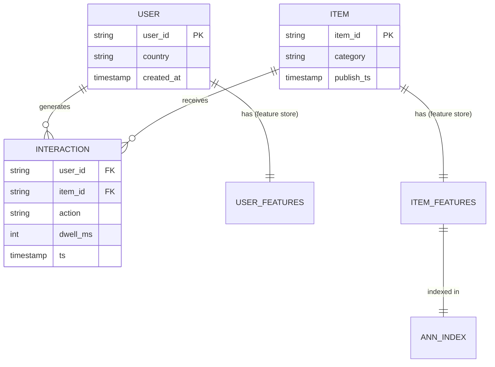
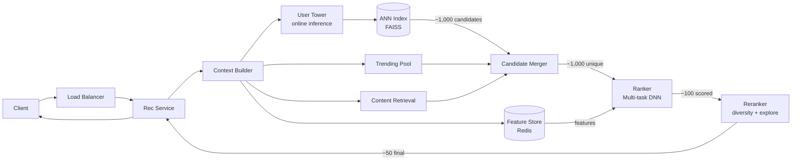
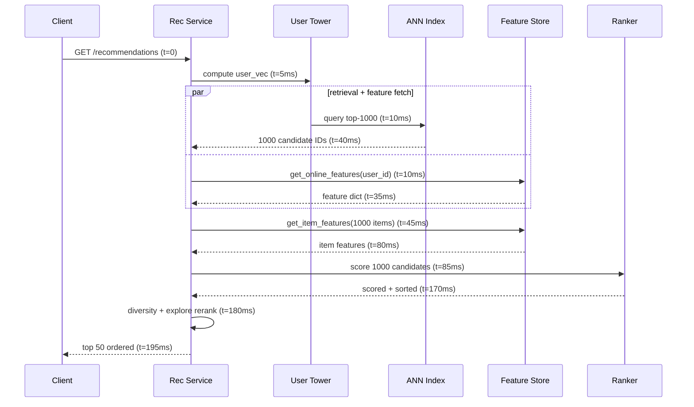
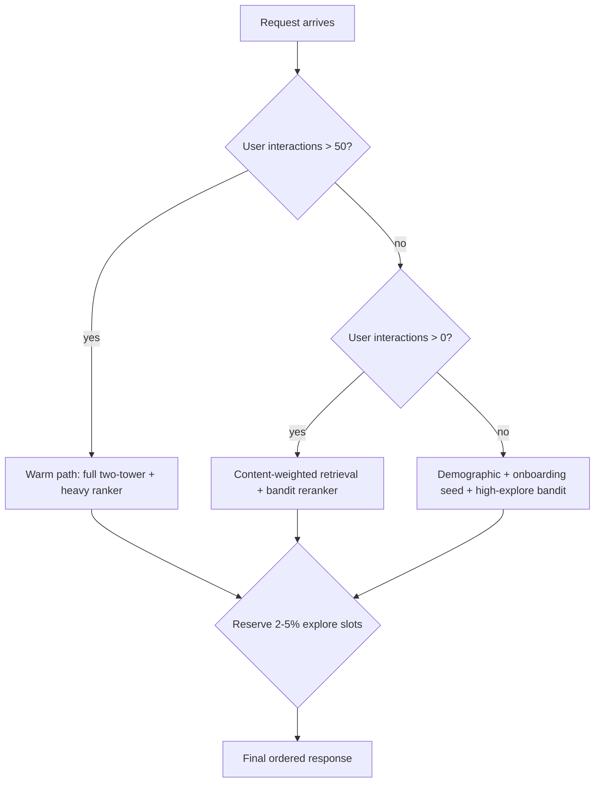
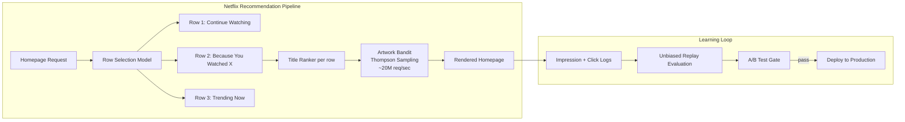

# Design a Recommendation System (Netflix / YouTube / TikTok)

> **TL;DR.** A production recommender is a pipeline, not a model. The two-stage architecture (fast candidate generation via ANN over embeddings, then a heavyweight ranker scoring hundreds of features per item) is the industry default because nothing else fits a 200 ms latency budget over a billion-item corpus[^1]. Netflix estimates personalization is worth over $1 billion per year in retention[^2], and YouTube reports 70% of watch time is driven by recommendations[^3]. The pivotal trade-off: recommendation quality versus serving latency, mediated by the funnel width at each stage.

## Learning Objectives

- Design a two-stage recommendation pipeline that serves 10M+ requests/sec within a 200 ms latency budget
- Justify the split between candidate generation (ANN retrieval) and ranking (deep multi-task model) using capacity math
- Identify when collaborative filtering, content-based, or hybrid approaches apply and explain the cold-start implications of each
- Architect a feature store that eliminates training-serving skew across batch and streaming features
- Trade off exploration versus exploitation using contextual bandits with a bounded regret budget
- Estimate storage, compute, and bandwidth for a billion-user recommendation system

## Intuition

Imagine you run a bookstore with 100 million titles. A customer walks in and says "recommend something." You have 200 milliseconds before they lose interest and leave[^2].

Reading every back cover (scoring every item) takes hours. Instead, you keep a mental map of the store: "customers who liked X also liked Y" (collaborative filtering). You walk to the three relevant aisles in 50 milliseconds, grab 1,000 plausible books, then spend the remaining 150 milliseconds reading those back covers carefully, weighing the customer's mood, the time of day, and what they bought last week.

That is the two-stage funnel. Stage one (candidate generation) is cheap and fast: it narrows a billion items to a thousand using precomputed embeddings and approximate nearest neighbor search. Stage two (ranking) is expensive and precise: it scores those thousand items using hundreds of features per (user, item) pair, including cross-features that the retrieval stage cannot use because they would break the separability that makes ANN possible[^4].

The naive approach (one model scores everything) works at 10,000 items. At 100 million items, the ranker alone would need 100,000x more compute per request. The funnel is not an optimization; it is the only architecture that fits the latency budget at scale.

## Requirements

### Clarifying Questions

- **Q: What is the catalog size and growth rate?**
  Assume: 1B items in catalog. YouTube ingests approximately 500+ hours of video per minute[^5]; Netflix and Spotify grow more slowly but still add thousands of items daily.
- **Q: What latency SLA for recommendations?**
  Assume: End-to-end p99 under 200 ms from request to ordered response.
- **Q: Real-time personalization or batch-precomputed?**
  Assume: Online scoring at request time. Batch precomputation for heavy users as a latency optimization.
- **Q: How fresh must the model be?**
  Assume: Daily retrain baseline. Near-real-time online learning for short-video domains (TikTok achieves minute-scale freshness[^6]).
- **Q: Multi-objective or single metric?**
  Assume: Multi-task ranking. The ranker predicts multiple engagement types (click, watch, like, share) and combines them with tunable weights[^4].
- **Q: How do we handle new users and new items?**
  Assume: First-class cold-start path using content-based features and contextual bandits with a 2-5% exploration budget[^7][^8].

### Functional Requirements

- Return a personalized, ordered list of N items for a given user context (device, time, location)
- Support multiple retrieval sources (collaborative, content-based, trending, editorial)
- Score candidates using a multi-task model that outputs probabilities for multiple engagement types
- Apply diversity constraints and exploration slots in the final reranking stage
- Log impressions and interactions with full attribution for model retraining

### Non-Functional Requirements

- **Load:** 10M recommendation requests/sec peak (1B DAU, 10 sessions/day, peak 3x)
- **Latency:** p50 < 100 ms, p99 < 200 ms end-to-end
- **Availability:** 99.99% read path with graceful degradation to popularity-based fallback
- **Freshness:** Model weights updated daily; streaming features updated within seconds
- **Catalog:** 1B items indexed for retrieval; embeddings refreshed nightly

## Capacity Estimation

| Metric | Value | Derivation |
|--------|------:|------------|
| Recommendation QPS (peak) | 10M | 1B DAU *10 sessions/day / 86,400* 3x peak |
| Candidate generation output | 1,000 items | Per request, from ANN index[^1] |
| Ranker input | 1,000 items * ~100 features each | 100K feature lookups per request[^1] |
| Item embeddings (128-d float32) | 512 B/item | 128 dims * 4 bytes |
| Total embedding storage | 512 GB | 1B items * 512 B |
| Feature store online reads | 10M/sec | One feature-vector fetch per request |
| Interaction events/day | ~100B | 1B users * ~100 impressions/day |
| Training data/day | ~10 TB | 100B events * ~100 B each |
| Model size (ranker) | 1-10 GB | Embedding tables dominate[^9] |

Key ratios: retrieval is 1,000:1 reduction (1B to 1,000 candidates). The ranker sees 0.0001% of the catalog per request. Feature store latency must be under 30 ms to fit the budget. ANN recall at 95-99% is acceptable; the ranker compensates for missed candidates[^10].

## API and Data Model

### API Design

```http
GET /v1/recommendations?user_id=<id>&context=<ctx>&limit=50
  Returns: 200 { "items": [...], "request_id": "abc", "next_cursor": "..." }

POST /v1/impressions
  Body: { "request_id": "abc", "items_shown": [...], "positions": [...] }
  Returns: 202 Accepted

POST /v1/interactions
  Body: { "user_id": "...", "item_id": "...", "action": "click|watch|like|skip", "dwell_ms": 4500 }
  Returns: 202 Accepted

GET /v1/items/{id}/similar?limit=20
  Returns: 200 { "items": [...] }
```

The recommendation endpoint accepts context (device type, time of day, location) as a query parameter because context features influence both retrieval and ranking. Impression and interaction endpoints are fire-and-forget (202) to avoid blocking the user experience; they feed the training pipeline asynchronously via Kafka.

### Data Model

```sql
-- User features (Feature Store - online: Redis, offline: Parquet/Hive)
key: user:{user_id}
value: {
  embedding_128d: float[128],       -- from user tower, refreshed daily
  recent_items_50: list<item_id>,   -- streaming, updated per interaction
  demographics: {age_bucket, country, device},
  long_term_prefs: float[64]        -- batch, refreshed weekly
}

-- Item features (Feature Store - online: Redis, offline: Parquet/Hive)
key: item:{item_id}
value: {
  embedding_128d: float[128],       -- from item tower, refreshed nightly
  content_embedding: float[256],    -- from text/image/audio encoder
  metadata: {category, creator_id, publish_ts, duration},
  popularity_7d: float              -- streaming aggregate
}

-- ANN Index (FAISS IVF-PQ or HNSW, served via dedicated cluster)
-- 1B item embeddings, 128 dimensions, updated nightly
-- Query: user_embedding -> top-1000 item_ids in <10 ms
```



*User and item features live in a dual-store (online Redis + offline Parquet); the ANN index is a materialized view of item embeddings refreshed nightly.*

## High-Level Architecture



*The funnel trims a billion-item corpus to 50 ordered results in under 200 ms: retrieval (multiple sources merged), ranking (heavy model with full features), and reranking (diversity and exploration).*

The write path is separate: interaction events flow from clients through Kafka to both the streaming feature pipeline (Flink, updating the online feature store within seconds) and the batch training pipeline (daily model retrain). The read path above is entirely online and stateless except for the feature store lookups.

Retrieval runs in parallel across multiple sources: the two-tower ANN path (collaborative signal), a content-based retrieval path (for cold items), and a trending/editorial pool (for freshness and coverage). Results are deduplicated and merged before entering the ranker.

The ranker is the most compute-intensive component. Meta's DLRM architecture feeds dense features through a bottom MLP, looks up sparse IDs in embedding tables, computes pairwise dot products, and passes everything through a top MLP that outputs engagement probabilities[^9]. At 10M QPS with 1,000 candidates each, the ranker cluster must handle 10B scoring operations per second.

## Deep Dives

### Deep dive 1: Two-stage retrieval and ranking

The two-stage architecture was formalized by Covington, Adams, and Sargin in the 2016 YouTube paper[^1]. The insight: separate the problem into "find plausible items fast" and "rank them precisely."

**Candidate generation** uses a two-tower neural network. The user tower encodes user features (watch history, search history, demographics) into a 128-dimensional vector[^1]. The item tower encodes item features (content embeddings, metadata) into the same 128-d space. Training minimizes a sampled softmax loss so that positive (user, item) pairs have high inner product[^11].

At serving time, item embeddings are precomputed offline and loaded into an ANN index (FAISS IVF with product quantization, or HNSW graphs). The user embedding is computed online (one forward pass through the user tower, ~5 ms), then used as the query vector. FAISS returns the top-1,000 nearest items in under 10 ms at billion scale with 95-99% recall[^10].

**Ranking** uses the full feature set. Unlike the two-tower model, the ranker can consume user-item cross-features (e.g., "how many times has this user watched videos from this creator in the last 7 days"). These cross-features are the most powerful signals but break the separability that makes ANN possible[^4]. Instagram Explore extends this to four stages: retrieval, first-stage ranking (lightweight two-tower), second-stage ranking (heavy multi-task model), and final reranking[^4].



*The 200 ms budget splits roughly: 40 ms retrieval, 40 ms feature fetch (parallel), 85 ms ranking, 15 ms reranking. Retrieval and feature fetch run in parallel to keep tails in check.*

The key engineering decision from the YouTube paper: train on implicit feedback (watches) with negative sampling over the entire corpus, not just impressed items. This matches the serving distribution where retrieval considers all items, not just previously shown ones[^1].

### Deep dive 2: Feature store and training-serving skew

The feature store is infrastructure, not an ML artifact. It solves the most common production failure: features computed differently in training versus serving.

A feature store has two stores and one registry[^12]. The offline store (Parquet on S3, or Hive) serves point-in-time correct feature joins for training. The online store (Redis, DynamoDB) serves low-latency feature vectors at inference. Both stores are populated from the same feature definitions, ensuring consistency.

**Batch features** (user lifetime preferences, item popularity aggregates) are materialized on a schedule (daily or weekly). **Streaming features** (last 10 items watched, session context) are ingested from Kafka via Flink and pushed to the online store within seconds[^12][^13].

Feast is the open-source reference implementation. At inference, the client calls `store.get_online_features(features=[...], entity_rows=[{"user_id": 1001}])` and receives a feature dictionary in single-digit milliseconds[^12]. The same feature list is used at training time via `store.get_historical_features(entity_df=...)`, guaranteeing identical computation.

Uber's Michelangelo Palette extends this pattern at scale: auto-generating feature pipelines, managing feature freshness SLAs, and serving features to model serving through a unified contract[^13].

**Why this matters for recommendations:** The ranker consumes ~100 features per (user, item) pair[^1]. If even one feature (say, "average watch time in last 7 days") is computed differently in training versus serving, the model's score distribution shifts. This manifests as a model that looks good in offline evaluation but underperforms in A/B tests[^14]. The feature store eliminates this class of bugs by construction.

### Deep dive 3: Cold start and exploration

Cold start is not a one-time problem. New users arrive every minute. New items land every second. A recommender that only works for warm entities is broken for a permanent fraction of traffic.

**New items** get content-based embeddings at upload time. The item tower processes text, image, and audio features to produce a reasonable 128-d vector even with zero interaction history[^4]. This vector enters the ANN index immediately, making the item retrievable from day one.

**New users** have no interaction history for collaborative filtering. Mitigations: onboarding flows that harvest 3-5 explicit preferences, demographic-based priors, and aggressive exploration. The system routes cold users through a dedicated path that weights content-based retrieval more heavily than collaborative retrieval.

**Contextual bandits** (LinUCB, Thompson Sampling) explicitly allocate a fraction of impressions to high-uncertainty items, accepting short-term regret for long-term learning[^7][^8]. Netflix uses contextual bandits for artwork personalization: in 2017, the system handled a peak of over 20 million requests per second, and the per-user exploration cost is negligible, and the system learns which artwork drives clicks for each member segment[^7].



*Cold start routes around the collaborative-heavy default path. All paths reserve 2-5% of slots for deliberate exploration to prevent filter bubbles.*

The "explore slot" pattern reserves 2-5% of the final ranking for deliberately out-of-model items[^7][^8]. This prevents the feedback loop where the model only receives labels on items it already recommended, causing it to narrow over time. Spotify's BaRT framework (Bandits for Recommendations as Treatments) jointly learns which shelves to show, which content within each shelf, and which explanation to display, all through an explore-exploit framework[^8].

## Real-World Example

**Netflix: From collaborative filtering to contextual bandits**

Netflix's recommendation system drives approximately 80% of hours streamed[^15], with an estimated value of over $1 billion per year in retention[^2]. A member loses interest after 60-90 seconds of browsing[^2], making recommendation quality existential for the business.

Netflix does not run one model. It runs many: row selection (which rows appear on the homepage), title-within-row ranking, artwork personalization, search ranking, and more. In 2025, Netflix began scaling generative recommender models from O(1M) to O(1B) parameters using transformer architectures, moving toward a unified foundation model that replaces many specialized models. The artwork personalization system is particularly instructive. Each title has dozens of artwork variants. The system uses contextual bandits (Thompson Sampling) with per-member context to learn which artwork drives clicks for each user segment[^7]. In 2017, Netflix reported this system handling a peak of over 20 million requests per second[^7], making it one of the highest-QPS bandit systems in production.

The experimentation platform runs hundreds of A/B tests concurrently[^16]. The key insight: offline metrics (AUC, NDCG) correlate weakly with online engagement. Netflix treats offline evaluation as a filter (reject models that regress on any held-out metric) and A/B testing as the ground truth (the only way to measure actual retention impact)[^16]. Sequential A/B testing keeps regressions out of production by detecting harm early and stopping experiments before they accumulate damage[^17].



*Netflix layers multiple personalization models (row selection, title ranking, artwork bandits) and validates every change through unbiased replay evaluation before live A/B testing.*

Spotify's Discover Weekly demonstrates the batch-precompute pattern: approximately 1 TB of new data is processed to refresh personalized playlists every Monday[^18]. By its 10th anniversary in 2025, the playlist had surpassed 100 billion tracks streamed and was sparking 56 million new artist discoveries per week[^18]. The system combines collaborative filtering on listening logs, NLP on lyrics, and CNN-based audio embeddings, then caches the result rather than serving it on the fly.

## Trade-offs

| Approach | Pros | Cons | When to use |
|----------|------|------|-------------|
| Collaborative filtering (MF/ALS) | Captures latent preferences; cheap inference | Cold start; ignores content | Large interaction dataset, stable catalog[^15] |
| Content-based filtering | Works day one for new items; interpretable | Over-specialization; ignores social signal | New catalog, sparse interactions |
| Hybrid two-tower | Best of both; cacheable towers | Cannot use cross-features; in-batch negative bias | Production retrieval stage[^1][^4] |
| Single-stage scoring | Simple; no pipeline complexity | Infeasible above ~100K items | Small catalogs, prototypes |
| Two-stage funnel | Scales to billions; latency-bounded | Two models to maintain; recall loss at retrieval | All production recommenders at scale[^1] |
| Pointwise ranking | Simple training; fast inference | Ignores list context and diversity | Low-diversity requirements |
| Listwise ranking | Optimizes NDCG; considers diversity | Complex training; slower convergence | Video feeds, music playlists[^8] |
| Explore 2-5% slots | Long-term engagement; prevents narrowing | Small visible quality hit | All production systems[^7][^8] |

The single biggest trade-off: **quality versus latency**. A heavier ranker with more features produces better recommendations but takes longer. The funnel architecture resolves this by spending heavy compute only on the final few hundred candidates. The second biggest: **freshness versus stability**. TikTok's Monolith trades system reliability for minute-scale model freshness[^6]; Netflix retrains daily and validates through sequential A/B tests[^17]. The right answer depends on content velocity: short-video platforms need minute-scale freshness because topics trend within hours.

## Scaling and Failure Modes

**At 10x load (100M QPS):** The ANN index becomes the bottleneck. Mitigation: shard the index by item-ID range across multiple replicas; route queries to the nearest shard set. Pre-warm indexes on deploy to avoid cold-cache latency spikes.

**At 100x load (1B QPS):** The ranker saturates. Mitigation: two-stage distillation (train a lightweight student model from the heavy ranker; use the student for first-pass scoring, heavy ranker only for the top 100). Pre-compute recommendations for the top 10% of users during off-peak hours and serve from cache.

**At 1000x load:** The architecture shifts to edge-first: pre-render personalized feeds at CDN edge for high-engagement users. The origin becomes a slow-path fallback for cold users and fresh items only.

**Failure mode: Feature store outage.** Impact: ranker receives null features; scores become meaningless. Response: circuit breaker falls back to retrieval-only ordering (ANN scores without ranking). Detection: feature-fetch error rate exceeds 1%. Recovery: feature store replicas in multiple AZs; stale-cache fallback serves last-known features for up to 5 minutes.

**Failure mode: ANN index corruption after nightly rebuild.** Impact: retrieval returns irrelevant candidates. Detection: online metrics (CTR, watch time) drop within minutes of index deployment. Response: automated rollback to previous index version via canary deployment with engagement-metric gates.

**Failure mode: Feedback loop collapse.** Impact: recommendation diversity drops over weeks; long-term retention declines. Detection: entropy of recommended categories drops below threshold; catalog coverage metric falls. Response: increase exploration budget from 2% to 5%; inject diversity constraints in reranker.

## Common Pitfalls

> [!WARNING]
> **Scoring every item with the heavy ranker.** At 1B items and 10M QPS, that is 10^16 scoring operations per second. The two-stage funnel exists because single-stage is computationally impossible at scale.

> [!WARNING]
> **Training-serving skew from ad-hoc feature computation.** Computing "average watch time last 7 days" differently in the training pipeline versus the serving path is the most common production bug. Use a feature store with one definition, two stores[^12][^13].

> [!WARNING]
> **Ignoring cold start as a permanent traffic class.** New users and items arrive continuously. Treating cold start as a rare edge case means 5-15% of traffic gets garbage recommendations. Design a first-class cold path with content-based retrieval and aggressive exploration[^7].

> [!WARNING]
> **Trusting offline metrics as ground truth.** A model with higher NDCG offline can lose an A/B test online due to selection bias in logged data. Offline metrics are filters; A/B tests are decisions[^16].

> [!WARNING]
> **Pure exploitation without exploration.** A recommender that only shows what the model predicts will engage stops learning about user preferences it has never tested. Filter bubbles emerge within weeks. Reserve 2-5% explore slots[^7][^8].

> [!WARNING]
> **Popularity bias from in-batch negatives.** Popular items appear in more training batches as negatives, biasing the sampled softmax. Apply sampling-bias correction (subtract log item frequency from the logit)[^11].

## Follow-up Questions

**1. How do you handle a viral item that 100M users want simultaneously?**

The item's embedding is already in the ANN index from nightly refresh. For same-day viral items, maintain a "trending pool" retrieval source that bypasses ANN entirely. Cache the item's features aggressively. The ranker scores it normally; no special path needed beyond retrieval injection.

**2. How do you prevent the model from optimizing for clickbait?**

Multi-objective ranking. The value model combines P(click), P(long_watch), P(like), and P(see_less) with tunable weights[^4]. Penalize items with high click but low dwell time. Add a "regret" label (user clicks back within 5 seconds) as a negative signal. YouTube's ranking network originally used expected watch time as the primary objective[^1]; as of early 2026, YouTube weights "satisfaction signals" (post-view surveys, repeat views, shares) above raw watch time.

**3. How do you serve recommendations in multiple regions with model consistency?**

Replicate the ANN index and feature store to each region. The ranker model is small enough (1-10 GB) to deploy globally. Accept that streaming features have cross-region lag (seconds). For most recommendation use cases, eventual consistency in features is acceptable because the model is robust to small feature staleness.

**4. How would you add explainability ("Because you watched X")?**

At retrieval time, record which source nominated each candidate and which seed items drove the ANN query. At ranking time, identify the top-contributing features via SHAP or attention weights. Surface the highest-weight explanation to the user. Spotify's BaRT framework jointly optimizes the explanation alongside the recommendation[^8].

**5. How do you retrain the model without serving stale predictions during the transition?**

Shadow deployment. Train the new model offline, evaluate via unbiased replay on logged randomized data[^7], then deploy as a canary serving 5% of traffic. Monitor engagement metrics for 24 hours. If metrics hold, ramp to 100%. The old model remains hot-standby for instant rollback.

**6. What changes for a short-video platform (TikTok) versus long-form (Netflix)?**

Content velocity is the key difference. TikTok needs minute-scale model freshness because topics trend within hours. ByteDance's Monolith uses online training with collisionless embedding tables and deliberately relaxes consistency for freshness[^6]. Netflix retrains daily because movie preferences shift slowly. The architecture is the same funnel; the training cadence and freshness requirements differ by 1000x.

## Exercise

### Exercise 1: Cold-to-warm transition

A new user signs up. You know their age (25), country (US), and the three items they clicked during onboarding. Design their first recommendation feed. After 1 hour and 50 interactions, describe how the recommendation changes. Specify the cold-to-warm transition threshold.

<details>
<summary>Hint</summary>

Consider which retrieval sources are available without a trained user embedding. Think about how many interactions the user tower needs to produce a meaningful embedding, and what happens to the explore budget as confidence grows.

</details>

<details>
<summary>Solution</summary>

**First feed (0 interactions beyond onboarding):**

- No user embedding exists yet. Skip the two-tower ANN path.
- Retrieval sources: content-based similarity to the 3 onboarded items (use their item embeddings as a pseudo-user vector by averaging), demographic cohort popularity (US, age 25), and trending pool.
- Ranker uses demographic features + the 3 item interactions as sparse history. Exploration budget: 10% (higher than the 2-5% steady state).
- Result: a mix of items similar to onboarding choices, popular items in the user's demographic, and exploratory items.

**After 50 interactions (approximately 1 hour):**

- The user tower can now produce a meaningful embedding from 50 interaction IDs. Enable the two-tower ANN retrieval path.
- Reduce exploration budget from 10% to 5%.
- The ranker now has streaming features (recent 50 items, session dwell times) that provide strong signal.
- Transition threshold: 50 interactions. Below this, the user embedding has high variance and ANN retrieval is unreliable. Above this, collaborative signal dominates content-based.

The threshold is empirical: plot recommendation quality (online CTR or NDCG) versus interaction count. The crossover point where collaborative retrieval outperforms content-based retrieval is the transition threshold. Industry values range from 20-100 interactions depending on domain.

</details>

## Key Takeaways

- **Two-stage is mandatory at scale:** Single-stage scoring over 1B items does not fit any latency budget. The funnel (retrieve 1,000, rank 1,000, serve 50) is the only architecture that works[^1].
- **The feature store is infrastructure:** Skimping on it guarantees training-serving skew. One definition, two stores, zero divergence[^12].
- **Cold start is permanent:** New users and items arrive continuously. Design the cold path as first-class, not a fallback[^7].
- **Exploration is not optional:** A recommender that only exploits stops learning and narrows within weeks. Reserve 2-5% explore slots[^8].
- **Offline metrics are filters, not decisions:** A/B testing is the ground truth. NDCG correlates weakly with online engagement[^16].
- **Freshness depends on content velocity:** Short-video needs minute-scale updates (Monolith[^6]); long-form needs daily retrains (Netflix[^17]).

## Further Reading

- [Deep Neural Networks for YouTube Recommendations (RecSys 2016)](https://research.google/pubs/deep-neural-networks-for-youtube-recommendations/). The canonical two-stage paper; read it before any recommendation system interview.
- [Scaling the Instagram Explore Recommendations System (Meta, 2023)](https://engineering.fb.com/2023/08/09/ml-applications/scaling-instagram-explore-recommendations-system/). A current-generation four-stage production writeup with concrete architecture details.
- [Artwork Personalization at Netflix (2017)](https://netflixtechblog.com/artwork-personalization-c589f074ad76). Contextual bandits in production at 20M req/sec; the best public writeup on exploration in recommendations.
- [Monolith: Real Time Recommendation with Collisionless Embedding Table (ByteDance, 2022)](https://arxiv.org/abs/2209.07663). TikTok's online-training architecture that trades reliability for minute-scale freshness.
- [Sampling-Bias-Corrected Neural Modeling (YouTube, RecSys 2019)](https://research.google/pubs/sampling-bias-corrected-neural-modeling-for-large-corpus-item-recommendations/). How to train two-tower models without popularity bias from in-batch negatives.
- [Feast Documentation](https://docs.feast.dev/). The open-source reference feature store; essential reading for the training-serving skew problem.
- [FAISS: A Library for Efficient Similarity Search (Meta)](https://github.com/facebookresearch/faiss). The canonical ANN library for billion-scale vector retrieval.
- [Explore, Exploit, Explain (Spotify, RecSys 2018)](https://research.atspotify.com/publications/explore-exploit-explain-personalizing-explainable-recommendations-with-bandits). BaRT foundations for bandit-driven homepage personalization.

## Flashcards

<details>
<summary><strong>Q: What are the two stages in a production recommendation pipeline?</strong></summary>

A: Candidate generation (fast ANN retrieval over precomputed embeddings, reducing billions to thousands) and ranking (heavy multi-task model scoring hundreds of features per candidate, reducing thousands to tens).

</details>

<details>
<summary><strong>Q: Why can the ranker use cross-features but the retrieval stage cannot?</strong></summary>

A: Cross-features (user-item interactions like "times user watched this creator") require both user and item to be known simultaneously. This breaks the separability needed for ANN: you cannot precompute item embeddings if they depend on the querying user.

</details>

<details>
<summary><strong>Q: What percentage of Netflix hours streamed come from recommendations?</strong></summary>

A: Approximately 80%, with an estimated value of over $1 billion per year in retention.

</details>

<details>
<summary><strong>Q: What is training-serving skew and how do feature stores prevent it?</strong></summary>

A: Training-serving skew occurs when features are computed differently in the training pipeline versus the serving path. Feature stores prevent it by using one feature definition that populates both an offline store (for training) and an online store (for serving).

</details>

<details>
<summary><strong>Q: What is the typical exploration budget in production recommenders?</strong></summary>

A: 2-5% of recommendation slots are reserved for deliberately out-of-model items, using contextual bandits (Thompson Sampling, LinUCB) to balance exploration regret against long-term learning.

</details>

<details>
<summary><strong>Q: How does the cold-start path differ from the warm path?</strong></summary>

A: Cold users lack interaction history for collaborative filtering. The cold path uses content-based retrieval (item embeddings from text/image/audio), demographic priors, and a higher exploration budget (5-10% vs 2-5%). Transition to warm path occurs after approximately 50 interactions.

</details>

<details>
<summary><strong>Q: Why does YouTube's candidate generation train on the entire corpus rather than only impressed items?</strong></summary>

A: At serving time, retrieval considers all items in the corpus, not just previously shown ones. Training only on impressed items creates a distribution mismatch. Negative sampling over the full corpus matches the serving distribution.

</details>

<details>
<summary><strong>Q: What is the key architectural difference between TikTok (Monolith) and Netflix recommendations?</strong></summary>

A: TikTok uses online training with minute-scale model freshness and collisionless embedding tables, trading system reliability for freshness. Netflix retrains daily and validates through sequential A/B tests, prioritizing stability over freshness. The difference is driven by content velocity: short-video topics trend within hours.

</details>

<details>
<summary><strong>Q: What recall-latency trade-off do ANN indexes make?</strong></summary>

A: ANN indexes (FAISS IVF-PQ, HNSW) trade a few percent of recall (95-99% vs 100%) for orders-of-magnitude speedup over exact kNN. Tuning parameters (nprobe, efSearch) slide along this curve.

</details>

<details>
<summary><strong>Q: Why are offline metrics (NDCG, AUC) insufficient for evaluating recommenders?</strong></summary>

A: Offline metrics measure ranking quality on logged data produced by the old model (selection bias). Improvements may reflect shortcuts that do not generalize. A/B testing is the ground truth; offline metrics are filters to reject models that regress on any held-out metric before live testing.

</details>

## References

[^1]: Covington, Adams, Sargin, "Deep Neural Networks for YouTube Recommendations", RecSys 2016. https://research.google/pubs/deep-neural-networks-for-youtube-recommendations/

[^2]: Hartmans, "Netflix Recommendation Engine Worth $1 Billion Per Year", Business Insider, 2016. https://www.businessinsider.com/netflix-recommendation-engine-worth-1-billion-per-year-2016-6

[^3]: Solsman, "CES 2018: YouTube's AI recommendations drive 70 percent of viewing", CNET, 2018. https://www.cnet.com/tech/services-and-software/youtube-ces-2018-neal-mohan/

[^4]: Vorotilov and Shugaepov, "Scaling the Instagram Explore recommendations system", Meta Engineering, 2023. https://engineering.fb.com/2023/08/09/ml-applications/scaling-instagram-explore-recommendations-system/

[^5]: Multiple sources including Statista, vidIQ, and whatsthebigdata.com confirm 500+ hours of video uploaded to YouTube every minute (2022-2026). https://whatsthebigdata.com/youtube-statistics/

[^6]: Liu et al., "Monolith: Real Time Recommendation System With Collisionless Embedding Table", ByteDance, arXiv 2209.07663, RecSys ORSUM 2022. https://arxiv.org/abs/2209.07663

[^7]: Chandrashekar et al., "Artwork Personalization at Netflix", Netflix TechBlog, 2017. https://netflixtechblog.com/artwork-personalization-c589f074ad76

[^8]: McInerney et al., "Explore, Exploit, Explain: Personalizing Explainable Recommendations with Bandits", Spotify Research, RecSys 2018. https://research.atspotify.com/publications/explore-exploit-explain-personalizing-explainable-recommendations-with-bandits

[^9]: Naumov et al., "Deep Learning Recommendation Model for Personalization and Recommendation Systems (DLRM)", 2019. https://github.com/facebookresearch/dlrm

[^10]: Meta Fundamental AI Research, "Faiss: A library for efficient similarity search and clustering of dense vectors". https://github.com/facebookresearch/faiss

[^11]: Yi et al., "Sampling-Bias-Corrected Neural Modeling for Large Corpus Item Recommendations", RecSys 2019. https://research.google/pubs/sampling-bias-corrected-neural-modeling-for-large-corpus-item-recommendations/

[^12]: Feast project, README and online features API. https://github.com/feast-dev/feast

[^13]: Uber Engineering, "Palette Meta Store Journey", 2024. https://www.uber.com/us/en/blog/palette-meta-store-journey/

[^14]: Chandrashekar, Amat, Basilico, Jebara, "Artwork Personalization at Netflix", Netflix TechBlog, 2017. https://netflixtechblog.com/artwork-personalization-c589f074ad76

[^15]: ACM, "The Netflix Recommender System: Algorithms, Business Value, and Innovation" (Gomez-Uribe and Hunt), ACM TMIS, 2016. https://dl.acm.org/doi/10.1145/2843948

[^16]: Netflix Technology Blog, "It's All A/Bout Testing: The Netflix Experimentation Platform", 2016. https://netflixtechblog.com/its-all-a-bout-testing-the-netflix-experimentation-platform-4e1ca458c15

[^17]: Netflix Technology Blog, "Sequential A/B Testing Keeps the World Streaming Netflix, Part 1: Continuous Data", 2024. https://netflixtechblog.com/sequential-a-b-testing-keeps-the-world-streaming-netflix-part-1-continuous-data-cba6c7ed49df

[^18]: Spotify Newsroom, "Celebrating 100 Billion+ Tracks Streamed and a Decade of Personalized Discovery", 2025. https://newsroom.spotify.com/2025-06-30/discover-weekly-turns-10-celebrating-100-billion-tracks-streamed-and-a-decade-of-personalized-discovery
