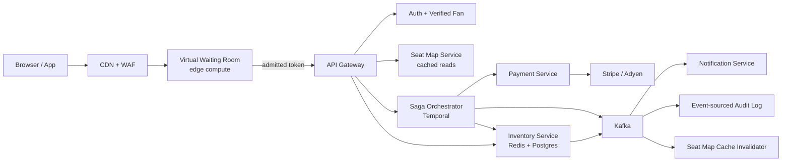
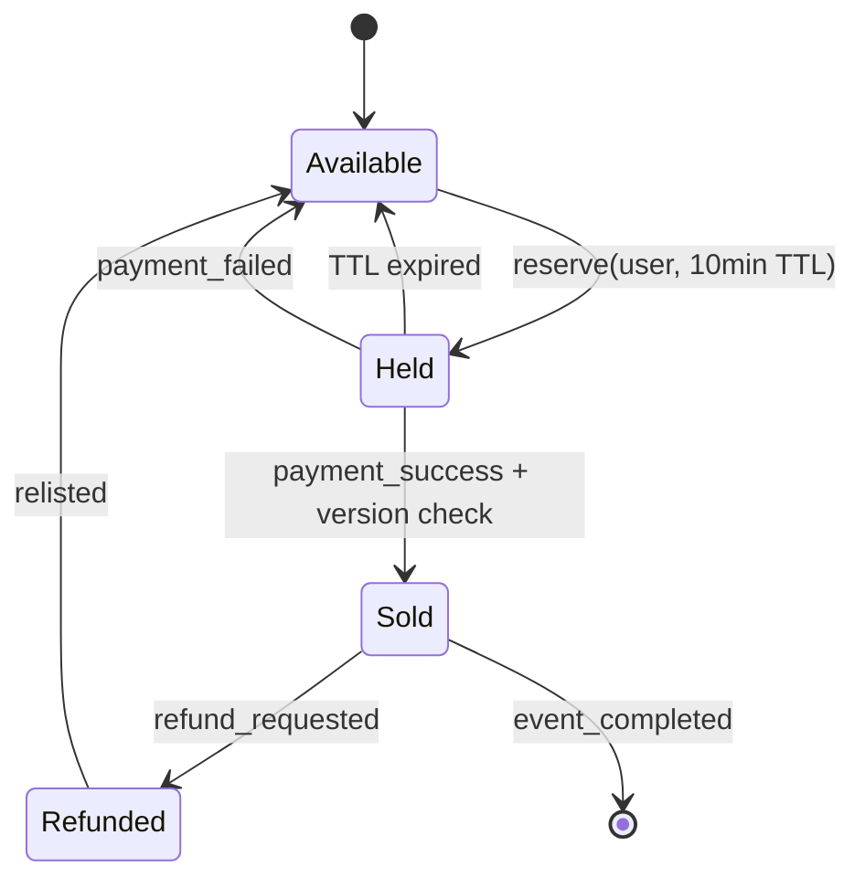
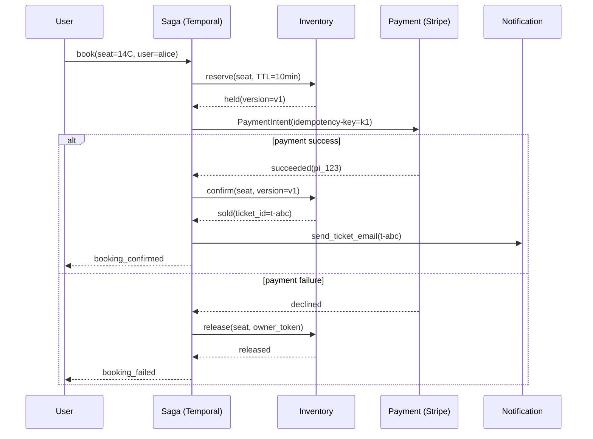
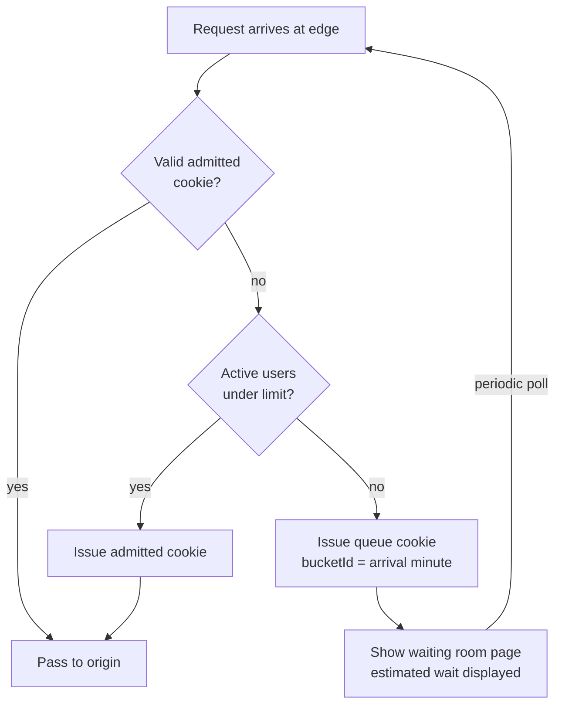

# Design a Ticketing System (BookMyShow / Ticketmaster)

> **TL;DR.** Ticketing is the canonical "strong consistency for inventory, eventual consistency for everything else" problem. Live Nation processes 500 million tickets per year [^1], but a single hot onsale can attract 14 million users against 70,000 seats [^2]. The architecture linearizes one operation (seat reservation via Redis `SET NX PX` with Lua scripts), pushes everything else to cached reads and async fan-out, gates admission through a virtual waiting room, and coordinates payment through a saga with compensations. The pivotal trade-off: hold TTL duration versus payment-completion latency.

## Learning Objectives

After this module, you will be able to:

- [ ] Design a three-state seat-locking protocol (available, held, sold) that prevents double-booking under 100K TPS burst
- [ ] Choose between Redis single-node locks, Redlock, ZooKeeper, etcd, and DB row locks with explicit safety reasoning
- [ ] Apply the saga pattern to coordinate seat reservation with external payment providers
- [ ] Architect a virtual waiting room that converts a traffic spike into a bounded admission rate
- [ ] Defend anti-bot strategies (Verified Fan, device fingerprinting, CAPTCHA) with regulatory context
- [ ] Estimate capacity for a Ticketmaster-scale platform handling 3.5 billion daily requests at peak [^1]

## Intuition

A ticketing system looks like a trivial CRUD app. Create an event, list seats, let users buy them. At 10 users it works fine. At 10 million users hitting "Buy" on the same 70,000 seats at 10:00:00 AM, it collapses, and the reason is contention.

Think of a bakery with 50 numbered tickets on the counter. One customer walks in, picks ticket #7, pays, leaves. No problem. Now open the doors to 5,000 people simultaneously. Everyone lunges for the counter. Two people grab ticket #7 at the same time. One tears it. The other claims they had it first. The baker has no record of who touched it when.

The engineering insight: you cannot let 5,000 people touch the counter at once. You need a bouncer at the door (the waiting room) who admits 10 people per minute. Inside, each ticket has a clip that only one hand can close (the atomic lock). And the baker does not hand over the pastry until the card clears (the saga), but holds the ticket for exactly 10 minutes so an abandoned attempt does not block the next buyer forever.

Three forces shape every decision: (1) strong consistency on the seat-to-buyer mapping is non-negotiable, (2) adversarial traffic from bots is not an edge case but the dominant load source, and (3) demand exceeding supply by 10x to 100x is the normal operating condition for hot events.

## Requirements

### Clarifying Questions

- **Q: Are seats uniquely identified (assigned seating) or general admission?**
  Assume: Both. Assigned seating is the hard case; general admission is a counter decrement.
- **Q: What is the hold duration before payment must complete?**
  Assume: 10 minutes. Must exceed p99 payment latency with margin.
- **Q: Do we own the payment system or integrate externally?**
  Assume: External (Stripe, Adyen). We cannot run 2PC across their systems.
- **Q: What is the peak burst scenario?**
  Assume: 500K concurrent users for a single event, 100K seat-selection TPS at peak [^1].
- **Q: Is bot traffic a design concern or an ops concern?**
  Assume: Design concern. Bots generated 3x prior peak traffic during the 2022 Eras Tour onsale [^3].
- **Q: Multi-region?**
  Assume: Yes for reads (event catalog, seat maps). Single-leader for inventory writes per event.

### Functional Requirements

- Browse events and view real-time seat availability maps
- Select and hold specific seats for a bounded duration (10 minutes)
- Complete purchase within the hold window; confirm seat as sold
- Release held seats automatically on TTL expiry or payment failure
- Queue users fairly when demand exceeds backend capacity
- Deliver e-tickets with rotating encrypted barcodes (SafeTix) [^4]

### Non-Functional Requirements

- **Load:** 500M tickets/year steady state; 3.5B requests/day peak onsale [^1]; 100K seat-lock TPS burst
- **Latency:** p99 < 500 ms for seat selection; payment confirmation < 30 seconds end-to-end
- **Availability:** 99.9% for the purchase path; 99.99% for catalog reads
- **Consistency:** Linearizable for seat state transitions; eventual for catalog and recommendations
- **Durability:** Zero tolerance for double-booking; zero ticket loss after payment confirmation

## Capacity Estimation

| Metric | Value | Derivation |
|--------|------:|------------|
| Tickets/year | 500M | Ticketmaster platform-wide [^1] |
| Mean ticket rate | ~16/sec | 500M / (365 x 86,400) |
| Peak daily requests | 3.5B | Taylor Swift Eras Tour onsale [^1] |
| Peak request rate | ~40,500/sec | 3.5B / 86,400 (mean); bursts 3-5x higher |
| Seat-lock TPS (burst) | 100K | Design target for hot onsale minute |
| Concurrent buyers (peak) | 500K | 14M visitors, ~500K in active checkout [^2] |
| Seat record size | ~200 B | event_id(8) + seat_id(32) + state(8) + holder(8) + timestamps(32) + version(8) |
| Hot-event seat map | ~14 MB | 70K seats x 200 B |
| Storage/year (tickets) | ~100 GB | 500M x 200 B metadata + payment refs |
| Queue-it DynamoDB TPS | 100-200K | Per-table, virtual waiting room backend [^5] |

**Key ratios:** Read:write on the seat map is ~50:1 during browsing, collapsing to ~2:1 during active checkout. The waiting room absorbs 90%+ of inbound traffic before it reaches inventory. Redis single-node handles ~100K ops/sec [^6], matching the burst target with one node per hot event.

## API and Data Model

### API Design

```http
POST /v1/events/{event_id}/seats/hold
  Idempotency-Key: <uuid>
  Body: { "seat_ids": ["sec-A:row-12:seat-7"], "user_id": "u-abc" }
  Returns: 201 { "hold_id": "h-xyz", "held_until": "2026-05-04T10:10:00Z", "version": 1 }
  Errors: 409 seat already held, 429 rate limited, 403 not admitted

POST /v1/holds/{hold_id}/confirm
  Idempotency-Key: <uuid>
  Body: { "payment_intent_id": "pi_stripe_123" }
  Returns: 200 { "ticket_id": "t-final", "status": "sold" }
  Errors: 410 hold expired, 402 payment failed

DELETE /v1/holds/{hold_id}
  Returns: 204 (seat released)

GET /v1/events/{event_id}/seats?section=A
  Returns: 200 { "seats": [{"id": "...", "state": "available|held|sold"}], "updated_at": "..." }
```

Hold creation uses an idempotency key to prevent duplicate holds on retry. The `version` field is a fencing token for the confirm step. The seat-map GET is served from cache with 1-2 second staleness.

### Data Model

```sql
-- Source of truth (PostgreSQL)
CREATE TABLE seat (
  event_id   BIGINT  NOT NULL,
  seat_id    TEXT    NOT NULL,
  state      TEXT    NOT NULL DEFAULT 'available',
  holder_id  BIGINT,
  held_until TIMESTAMPTZ,
  version    BIGINT  NOT NULL DEFAULT 0,
  PRIMARY KEY (event_id, seat_id)
);

-- Atomic reserve (single statement, no SELECT FOR UPDATE needed)
UPDATE seat
SET state = 'held', holder_id = $1,
    held_until = now() + interval '10 minutes',
    version = version + 1
WHERE event_id = $2 AND seat_id = $3
  AND (state = 'available' OR (state = 'held' AND held_until < now()))
RETURNING version;
```

Redis serves as the hot-path lock layer for high-TPS events. PostgreSQL is the durable source of truth, reconciled asynchronously. Kafka streams hold/sale/release events to notifications, analytics, and the seat-map cache invalidator.

## High-Level Architecture



*The waiting room gates admission at the edge; only admitted users reach the inventory service, which coordinates seat locks through Redis and persists to PostgreSQL via Kafka-driven reconciliation.*

**Write path:** An admitted user selects seats. The inventory service executes `SET seat:{event}:{id} {owner_token} NX PX 600000` on Redis [^7]. On success, it publishes a `seat.held` event to Kafka and asynchronously writes to PostgreSQL. The saga orchestrator (Temporal) begins the reserve-charge-confirm workflow.

**Read path:** The seat-map service serves from a Redis-backed cache refreshed every 1-2 seconds via Kafka consumer. Browsers poll or receive SSE updates. The CDN caches the event catalog and venue metadata indefinitely until invalidated.

**Async path:** Kafka fans out hold/sale/expiry events to the notification service (email, SMS, push), the audit log (event-sourced for compliance), and analytics (real-time dashboards for ops).

## Deep Dives

### Seat locking: the three-state machine

A seat has exactly three states: `available`, `held`, and `sold`. A fourth state (`refunded`) transitions back to `available` after a relist decision.



*A seat transitions atomically from available to held via Redis SETNX; TTL expiry or payment failure returns it to available without manual intervention.*

The atomic transition uses Redis `SET key val NX PX 600000` where the key encodes `seat:{event_id}:{seat_id}` and the value is a random owner token [^7]. The `NX` flag ensures mutual exclusion. The `PX 600000` sets a 10-minute TTL in milliseconds. Release uses a Lua script that checks ownership before deleting:

```lua
if redis.call('get', KEYS[1]) == ARGV[1] then
  return redis.call('del', KEYS[1])
else
  return 0
end
```

This prevents a delayed client from releasing a lock that expired and was re-acquired by another user [^7]. The owner token is generated per-attempt; without it, client A could release client B's lock after a GC pause.

**Why 10 minutes?** The hold TTL must exceed p99 payment latency (typically 5-15 seconds for card auth) with generous margin for user hesitation, 3D Secure challenges, and network retries. Setting it to p50 payment latency guarantees race conditions at the boundary [^8]. Setting it too long (30 minutes) blocks inventory from legitimate buyers.

**The boundary race:** If payment succeeds at T+9:58 but the hold expired at T+10:00, the confirm step must atomically verify the fencing token (version number) before transitioning to `sold`. If the seat was re-sold during the 2-second gap, the original buyer gets a refund [^8].

### Distributed lock alternatives and the Kleppmann debate

The choice of lock mechanism sits on a cost/safety axis:

| Mechanism | Throughput | Safety | Fencing | Best for |
|-----------|-----------|--------|---------|----------|
| Redis `SET NX PX` (single node) | ~100K ops/sec [^6] | Lock lost on failover | Manual (version column) | Most production ticketing |
| Redlock (5 Redis nodes, majority) | ~20K ops/sec | Debated [^9] | None built-in | Avoid for correctness |
| ZooKeeper ephemeral sequential | ~5-20K ops/sec | Consensus-backed | zxid as fencing token [^10] | When correctness is paramount |
| etcd lease + CAS | ~10-30K ops/sec [^11] | Raft-backed | Revision as fencing token | Kubernetes-native stacks |
| PostgreSQL `SELECT FOR UPDATE` | ~few hundred/sec per row [^12] | Transactional | Version column | Small events, simple stack |

Martin Kleppmann's canonical critique of Redlock [^9] argues it is "neither fish nor fowl": too expensive for efficiency locks, not safe enough for correctness locks. The core problem: Redlock lacks fencing tokens. A GC pause on client A causes its lease to expire; client B acquires the lock; client A resumes and writes without checking. The fix is to pair any lock with a monotonic fencing token that the storage layer validates on write [^9].

For ticketing, the pragmatic choice is single-node Redis `SET NX PX` per hot event, paired with a PostgreSQL version column as the fencing token on the confirm path. Redis failover can cause a brief window of double-holds, but the confirm step's version check prevents double-sales. This is "efficiency lock + correctness fence" rather than relying on the lock alone for correctness.

### Saga for reservation + payment

[Distributed Transactions](../part-3-distributed-systems-theory/06-distributed-transactions.md) explains why 2PC fails across independent services. Stripe cannot participate as a resource manager in a distributed transaction; you cannot `PREPARE` a card authorization [^13]. The saga pattern is the industry-standard answer.



*The saga reserves the seat, charges the card with a Stripe idempotency key, and either confirms or compensates; a crash at any step triggers the appropriate rollback via Temporal's durable workflow replay.*

**Idempotency keys** are non-negotiable. Stripe holds the key-to-response mapping for 24 hours [^14]. The key is generated server-side at reservation time as `hash(user_id, seat_ids, attempt_nonce)` and persisted with the saga state. Network retries reuse the same key, preventing duplicate charges.

**Compensation is not rollback.** A refund is not an "uncharge." It appears on the customer's statement, may take 5-10 business days, and can itself fail. The saga must handle compensation failures with escalation to a dead-letter queue and manual reconciliation [^15].

**Orchestrator choice:** Temporal (the MIT-licensed successor to Uber's Cadence, built by the same creators) persists workflow state to Cassandra/PostgreSQL, survives process restarts, and provides built-in retry with exponential backoff [^13]. AWS Step Functions is an alternative for teams already on AWS.

### Virtual waiting room

When 14 million users arrive at 10:00:00 for 70,000 seats, the backend cannot serve them all simultaneously. The waiting room converts a spike into a trickle.



*The edge gateway checks a per-data-center admission budget; users over budget receive a queue cookie and poll until their bucket is admitted.*

Cloudflare Waiting Room implements this with a two-tier Durable Object architecture [^16]. Per-data-center Durable Objects aggregate local worker counts. A single Global Durable Object reconciles worldwide state. The admission budget is divided across data centers proportional to the previous minute's traffic ratio, so each data center knows its local limit without coordinating per-request [^16].

Ticketmaster's Smart Queue works identically from the user perspective: sign in before onsale, receive a queue position when the sale starts, enter the purchase flow at a rate matched to backend capacity [^17]. Queue-it handles tens of millions of requests per minute using DynamoDB at 100-200K TPS per table [^5].

**Estimated wait time** = `users_ahead / avg_admission_rate_per_minute` [^16]. Wildly wrong estimates destroy trust; Cloudflare uses the previous minute's actual admission rate, not a theoretical maximum.

## Real-World Example

**Ticketmaster, 2022-11-15: The Taylor Swift Eras Tour Meltdown**

The Eras Tour presale generated 3.5 billion system requests on a single day, 4x Ticketmaster's previous peak [^1]. Pre-registration attracted 3.5 million Verified Fan signups (the largest in history), of which 1.5 million received presale codes [^1]. Actual traffic during the onsale reached approximately 14 million users, including bots [^2].

The failure was not in the seat-locking or inventory paths. It was in the Verified Fan code-validation service, which bots targeted "for the first time" [^3]. Bot traffic was 3x Ticketmaster's prior peak [^3]. The code-validation servers buckled, causing ~15% of interactions to error, including passcode failures that caused fans to lose carted tickets [^1].

Ticketmaster responded by slowing the queue drain rate to stabilize the system. The trade-off: longer waits but fewer checkout errors [^1]. General sale was canceled on 2022-11-17 due to insufficient remaining inventory [^2]. Despite the chaos, over 2 million tickets sold on Ticketmaster on 2022-11-15, the most ever sold for a single artist in one day; total tour sales reached 2.4 million across Verified Fan and Capital One onsales on both Ticketmaster and SeatGeek [^1].

Live Nation President and CFO Joe Berchtold testified before the US Senate Judiciary Committee on 2023-01-24, attributing the failure to "industrial scalpers" and unprecedented bot traffic [^3] [^18]. The hearing became a referendum on Live Nation/Ticketmaster's market dominance following the 2010 merger, not just the technical outage [^18].

**Antitrust aftermath:** On 2024-05-23, the US Department of Justice and 30 state attorneys general filed *United States v. Live Nation Entertainment* in the Southern District of New York, alleging Live Nation illegally monopolized the live-events industry [^22]. Trial began 2026-03-02. The DOJ settled with Live Nation on 2026-03-09 (no forced divestiture), but 33 states rejected the settlement and continued litigation [^23]. On 2026-04-15, a federal jury found Live Nation and Ticketmaster liable for illegally maintaining monopoly power in ticketing and amphitheater markets [^24]. Remedies (potentially including a forced Ticketmaster divestiture) remain pending before the court as of May 2026.

**Key lesson:** Anti-bot defenses must protect every endpoint on the critical path, not just the purchase endpoint. The attackers targeted the cheapest bottleneck (auth validation), not the hardest one (inventory).

## Trade-offs

| Approach | Pros | Cons | When to Use | Our Pick |
|----------|------|------|-------------|----------|
| DB row lock (`SELECT FOR UPDATE`) | Simple, transactional, ACID | Caps at few hundred writes/sec per row [^12] | Small events, < 1K seats | No (does not scale) |
| Redis `SET NX PX` (single node) | ~100K ops/sec, sub-ms latency [^6] | Lock lost on async failover | Most production ticketing | Yes (hot-path lock) |
| Redlock (5 Redis nodes) | Survives single-node failure | No fencing tokens; unsafe as correctness lock per Kleppmann [^9] | Efficiency locking on HA Redis; pair with idempotency or a fencing token for correctness | Efficiency locks only |
| ZooKeeper / etcd | Consensus-backed, fencing tokens [^10] | 5-20 ms latency, lower throughput | When correctness > throughput | Fallback for VIP events |
| Saga with Temporal | Works across independent services; durable state [^13] | Compensation logic is business logic [^15] | Default for reservation + payment | Yes |
| Open sale (no waiting room) | Zero friction | System overload, 15% error rate [^1] | Events < 1K buyers | No (for hot events) |
| Queue-based waiting room | Smooth load, FIFO fairness [^16] | Adds perceived wait; cookie-replay attacks | All hot onsales | Yes |

The meta-decision: where to place the linearization boundary. Linearize only the seat state transition (Redis + fencing token). Push everything else (catalog, seat-map reads, notifications, analytics) to eventually-consistent cached paths. This minimizes the blast radius of the consistency requirement.

## Scaling and Failure Modes

**At 10x load (5B tickets/year, 1M TPS burst):** Single Redis node saturates. Mitigation: shard inventory by event_id; each hot event gets a dedicated Redis instance. The waiting room absorbs the multiplied edge traffic without architectural change since it runs on edge compute [^16].

**At 100x load (50B tickets/year, 10M TPS burst):** The saga orchestrator becomes the bottleneck (workflow state persistence). Mitigation: partition Temporal namespaces by event; use event-local orchestrators that share nothing. Payment provider rate limits become binding; negotiate dedicated capacity or fan out across multiple providers.

**At 1000x load:** The architecture shifts to a CDN-first model where the seat map is a static asset updated via invalidation, and the only origin-bound request is the atomic lock acquisition. The waiting room becomes the primary user interface, not a gate.

**Failure modes:**

- **Redis node crash during onsale:** Held seats in Redis are lost. PostgreSQL version column prevents double-sales on confirm. Affected users see "hold expired" and must re-select. Blast radius: one event's in-flight holds (seconds of data).
- **Payment provider timeout:** Saga retries with the same idempotency key [^14]. After 3 retries, the saga releases the hold and notifies the user. The seat returns to available within seconds, not 10 minutes.
- **Waiting room cookie replay attack:** Attacker harvests admitted cookies and replays them from multiple clients. Mitigation: bind the cookie to a device fingerprint and IP range; invalidate on mismatch. Rate-limit per-cookie request volume.

## Common Pitfalls

> [!WARNING]
> **Non-atomic check-then-set.** Doing `SELECT state` then `UPDATE state='held'` in two statements creates a race window. Two users both see "available" and both write "held." Use a single atomic statement: `UPDATE ... WHERE state='available' RETURNING ...` or Redis `SET NX` [^7] [^12].

> [!WARNING]
> **Trusting Redlock for correctness.** Redlock has no fencing tokens and assumes bounded GC pauses and clock drift. A paused client can resume after lease expiry and overwrite another client's lock [^9]. Use single-node Redis for efficiency + a version-column fence for correctness.

> [!WARNING]
> **Hold TTL set to p50 payment latency.** If your hold expires in 2 minutes but p99 card auth takes 8 seconds (plus 3D Secure at 30 seconds), you guarantee race conditions at the boundary. Set TTL to comfortably exceed p99 of the full payment flow [^8].

> [!WARNING]
> **Missing idempotency keys on payment calls.** A network retry without the same idempotency key creates a duplicate Stripe charge. The customer is billed twice; reconciliation finds extra charges with no matching seat [^14]. Generate the key server-side at reservation time and persist it.

> [!WARNING]
> **Anti-bot defenses only on the purchase endpoint.** The 2022 Eras Tour failure happened because bots targeted the Verified Fan code-validation service, not the seat inventory [^3]. A 2025 FTC BOTS Act case alleged scalpers scooped 107,265 tickets over a 14-month period using fake accounts and SIM farms [^19]. Every endpoint on the critical path needs edge-layer bot scoring.

> [!WARNING]
> **No waiting room for "small" events that go viral.** An event expected to sell 5,000 tickets gets celebrity endorsement and attracts 500,000 users. Without a waiting room, the backend collapses. Always have a waiting room in standby mode with auto-activation on traffic threshold [^20].

## Follow-up Questions

**1. How do you handle general admission (no assigned seats)?**

Replace per-seat locks with an atomic counter decrement. Redis `DECRBY` returns the new value; if >= 0, the decrement succeeded. If < 0, increment back (compensation). Simpler than per-seat locking but loses the ability to show a seat map.

**2. How do you prevent a user from holding seats on two devices simultaneously?**

Key the hold on `(event_id, user_id)` in addition to `(event_id, seat_id)`. Before issuing a new hold, check if the user already has an active hold for this event. If yes, release the old hold first. This prevents a single user from blocking multiple seats across browser tabs.

**3. What happens if dynamic pricing is required (like Ticketmaster's "Official Platinum")?**

Price is determined at hold-creation time based on real-time demand signals (queue depth, time since onsale, section fill rate). The price is locked into the hold record. The saga charges the locked price, not the current price. This prevents price changes mid-checkout.

**4. How do you handle partial failures in multi-seat bookings?**

Multi-seat holds are all-or-nothing. Acquire locks on all requested seats atomically (Redis Lua script iterating over seat keys). If any seat is unavailable, release all acquired locks in the same script and return failure. Do not allow partial holds.

**5. How would you implement a resale marketplace (like StubHub)?**

A sold ticket can be listed for resale by its owner. The listing creates a new "available_resale" state. A buyer's purchase triggers a saga: charge buyer, transfer ownership, notify original owner, issue new encrypted barcode (SafeTix [^4]). The original barcode is invalidated. StubHub (NYSE: STUB since September 2025) processes resale at global scale; its architecture mirrors the primary-sale saga but adds price-discovery and seller-payout workflows.

**6. How do you audit for regulatory compliance (BOTS Act, GDPR, antitrust)?**

The event-sourced audit log (Kafka to immutable store) records every state transition with actor, timestamp, IP, and device fingerprint. BOTS Act [^21] enforcement requires proving circumvention; the audit trail provides evidence. GDPR right-to-erasure tombstones PII but preserves anonymized transaction records. Following the April 2026 antitrust verdict against Live Nation [^24], platforms may face new interoperability or data-portability mandates; design APIs with open-access extensions in mind.

## Exercise

### Exercise 1: Hold expiration edge cases

Design the behavior when a user's card declines at T+9:55 inside a 10-minute hold. Should you extend the hold? What if the same user retries with a different card at T+10:02? What if clock drift between the Redis TTL and the saga orchestrator causes disagreement about whether the hold is still valid?

<details>
<summary>Hint</summary>

Think about who is the authority on hold validity: Redis (TTL-based, clock-local) or PostgreSQL (version-based, fencing). What happens if you extend the TTL on payment retry? What does the confirm step check?

</details>

<details>
<summary>Solution</summary>

**Do not extend the hold on decline.** Extending creates an unbounded blocking window if the user retries indefinitely. Instead, on decline at T+9:55, the saga releases the hold immediately (do not wait for TTL) and notifies the user. If the user retries at T+10:02, they must re-acquire the seat from scratch. If another user took it, the original user lost it fairly.

**Clock drift handling:** The confirm step does not trust Redis TTL. It checks the PostgreSQL `version` column. The confirm statement is: `UPDATE seat SET state='sold' WHERE event_id=$1 AND seat_id=$2 AND version=$3 AND state='held'`. If the version does not match (because the hold expired and was re-acquired), the confirm fails and the saga refunds the charge. Redis is the fast path; PostgreSQL is the source of truth.

**Trade-off accepted:** A user whose card declines at T+9:55 loses the seat. This is better than allowing indefinite hold extensions that block other buyers.

</details>

## Key Takeaways

- **Double-booking is a credibility-ending failure.** Optimize for zero double-sales before optimizing latency, throughput, or UX. The fencing token on confirm is the last line of defense.
- **The saga pattern is always the right answer for reservation + payment.** 2PC looks correct but fails because external payment providers are not resource managers [^13].
- **A waiting room is not user-hostile; it is the only path to fair access.** Without it, the fastest bots win and the backend collapses under thundering-herd load [^16].
- **Idempotency keys on payment are non-negotiable.** Every retry without the same key is a potential duplicate charge [^14].
- **Anti-bot is an architecture concern, not an ops afterthought.** The 2022 Eras Tour failed because bots targeted the auth path, not the inventory path [^3].
- **Hold TTL must exceed p99 payment latency, not p50.** The boundary race between hold expiry and payment confirmation is the most common source of oversell bugs [^8].

## Further Reading

- [How to do distributed locking](http://www.kleppmann.com/2016/02/08/how-to-do-distributed-locking.html). Kleppmann's canonical critique of Redlock with the fencing-token argument; required reading before choosing any distributed lock.
- [Distributed Locks with Redis](https://redis.io/docs/latest/develop/use/patterns/distributed-locks/). Salvatore Sanfilippo's Redlock specification; read alongside Kleppmann for the full debate.
- [Building Waiting Room on Workers and Durable Objects](https://blog.cloudflare.com/building-waiting-room-on-workers-and-durable-objects/). Cloudflare's two-tier Durable Object design showing how to divide a global admission budget without per-request coordination.
- [Designing robust and predictable APIs with idempotency](https://stripe.com/blog/idempotency). Stripe's engineering blog on idempotency keys, exponential backoff, and safe retries for payment APIs.
- [Ticketmaster: Taylor Swift Eras Tour Onsale Explained](https://business.ticketmaster.com/press-release/taylor-swift-the-eras-tour-onsale-explained/). Ticketmaster's own post-mortem of the 2022 failure with specific numbers on bot traffic and error rates.
- [Saga pattern](https://microservices.io/patterns/data/saga.html). Chris Richardson's reference definition of the saga pattern with orchestration vs choreography trade-offs.
- [Temporal trip-booking tutorial](https://learn.temporal.io/tutorials/python/trip-booking-app/). A worked example of saga with compensation in a durable workflow engine.
- [BOTS Act of 2016](https://www.congress.gov/114/plaws/publ274/PLAW-114publ274.htm). The federal statute making ticket-bot circumvention illegal under FTC enforcement.

## Flashcards

<details>
<summary><strong>Q: What are the three states in a seat-locking protocol?</strong></summary>

A: Available, held, and sold. A reserve transitions available to held with a TTL. Payment success transitions held to sold. TTL expiry or payment failure transitions held back to available.

</details>

<details>
<summary><strong>Q: Why is Redis SET NX PX preferred over SELECT FOR UPDATE for seat locking at scale?</strong></summary>

A: Redis SET NX PX handles ~100K ops/sec with sub-millisecond latency. PostgreSQL SELECT FOR UPDATE caps at a few hundred writes/sec per hot row due to lock queuing. For a 70K-seat event with 500K concurrent buyers, only Redis meets the throughput requirement.

</details>

<details>
<summary><strong>Q: What is Kleppmann's core argument against Redlock for correctness locks?</strong></summary>

A: Redlock lacks fencing tokens and assumes bounded process pauses and clock drift. A GC-paused client can resume after lease expiry and overwrite another client's lock without detection. The fix is a monotonic fencing token validated by the storage layer on every write.

</details>

<details>
<summary><strong>Q: Why can't you use 2PC for seat reservation + payment?</strong></summary>

A: External payment providers (Stripe, Adyen) cannot participate as resource managers in a distributed transaction. You cannot PREPARE a card authorization. The saga pattern with compensating actions is the correct alternative.

</details>

<details>
<summary><strong>Q: How does a virtual waiting room protect the backend?</strong></summary>

A: It runs at the edge and admits users at a bounded rate matched to backend capacity. Users over the limit receive a queue cookie and wait. This converts a traffic spike (14M users at 10:00:00) into a smooth trickle the inventory service can handle.

</details>

<details>
<summary><strong>Q: What caused the 2022 Ticketmaster/Taylor Swift onsale failure?</strong></summary>

A: Bot traffic 3x prior peak targeted the Verified Fan code-validation service for the first time. The auth path buckled before legitimate users could reach the queue. 3.5 billion system requests hit in one day, 4x the previous peak.

</details>

<details>
<summary><strong>Q: Why must the hold TTL exceed p99 payment latency, not p50?</strong></summary>

A: If the hold expires before payment completes, the seat may be re-acquired by another user. The confirm step then fails (version mismatch), requiring a refund. Setting TTL to p50 guarantees this race for half of all slow payments.

</details>

<details>
<summary><strong>Q: What is the role of the idempotency key in the payment saga?</strong></summary>

A: It ensures that network retries of the same PaymentIntent do not create duplicate charges. Stripe caches the response for 24 hours keyed by the idempotency key. The key is generated server-side at reservation time and bound to the booking attempt.

</details>

<details>
<summary><strong>Q: How does Cloudflare Waiting Room divide admission budget globally without per-request coordination?</strong></summary>

A: A Global Durable Object reconciles per-data-center counts. Each data center's admission budget is proportional to its share of traffic in the previous minute. This ratio is immutable for the current minute, so propagation delay is tolerable.

</details>

<details>
<summary><strong>Q: What is the BOTS Act and how does it affect ticketing system design?</strong></summary>

A: The Better Online Ticket Sales Act of 2016 makes it a federal offense to circumvent ticket purchase controls. It provides legal backing for anti-bot measures (Verified Fan, CAPTCHA, device fingerprinting) and creates liability for scalper operations.

</details>

## References

[^1]: Ticketmaster Business, "Taylor Swift | The Eras Tour Onsale Explained", 2022-11-19. https://business.ticketmaster.com/press-release/taylor-swift-the-eras-tour-onsale-explained/

[^2]: Fortune, "Taylor Swift Eras tickets: Bots helped drive presale fiasco", 2022-11-18. https://fortune.com/2022/11/18/taylor-swift-ticket-fiasco-bots-ticketmaster-greg-maffei/

[^3]: J.D. Capelouto, "Here's how Ticketmaster explained the Taylor Swift tour debacle to Congress", Semafor, 2023-01-24. https://www.semafor.com/article/01/24/2023/heres-how-ticketmaster-explained-the-taylor-swift-tour-debacle-to-congress

[^4]: Ticketmaster Business, "Encrypted Ticketing for Secure Fan Experiences with SafeTix", 2025-11. https://business.ticketmaster.com/encrypted-ticketing-for-secure-fan-experiences/

[^5]: Mojtaba Sarooghi and Jose Quaresma, "Queue-it's Virtual Waiting Room System Design", Queue-it Smooth Scaling Podcast Episode 17, 2025. https://queue-it.com/smooth-scaling-podcast/ep017-virtual-waiting-room-architecture/

[^6]: Redis, "Redis benchmark", Redis documentation. https://redis.io/docs/latest/operate/oss_and_stack/management/optimization/benchmarks/

[^7]: Salvatore Sanfilippo, "Distributed Locks with Redis", Redis documentation. https://redis.io/docs/latest/develop/use/patterns/distributed-locks/

[^8]: The Linux Code, "Design a Movie Ticket Booking System Like BookMyShow", 2024-12. https://thelinuxcode.com/design-a-movie-ticket-booking-system-like-bookmyshow-from-mvp-to-peak-traffic-reliability/

[^9]: Martin Kleppmann, "How to do distributed locking", 2016-02-08. http://www.kleppmann.com/2016/02/08/how-to-do-distributed-locking.html

[^10]: Apache ZooKeeper Project, "ZooKeeper Recipes - Locks". https://zookeeper.apache.org/doc/current/recipes.html

[^11]: etcd, "Performance", etcd documentation v3.5. https://etcd.io/docs/v3.5/op-guide/performance/

[^12]: Cybertec Postgres, "SELECT FOR UPDATE considered harmful in PostgreSQL", 2025-06. https://web.archive.org/web/20251009010508/https://www.cybertec-postgresql.com/en/select-for-update-considered-harmful-postgresql/

[^13]: Temporal, "Saga Design Pattern Explained for Distributed Systems", 2023-05. https://temporal.io/blog/saga-pattern-made-easy

[^14]: Brandur Leach, "Designing robust and predictable APIs with idempotency", Stripe engineering blog, 2017-02-22. https://stripe.com/blog/idempotency

[^15]: Chris Richardson, "Pattern: Saga", microservices.io. https://microservices.io/patterns/data/saga.html

[^16]: Fabienne Semeria, George Thomas, Mathew Jacob, "Building Waiting Room on Workers and Durable Objects", Cloudflare Blog, 2021-06-16. https://blog.cloudflare.com/building-waiting-room-on-workers-and-durable-objects/

[^17]: Ticketmaster Business, "Smart Queue: Streamline Sales and Maximize Sell-Through", 2025-12-10. https://business.ticketmaster.com/smart-queue/

[^18]: The Guardian, "Scalper bots caused Taylor Swift ticket chaos, Senate panel hears in testimony", 2023-01-24. https://www.theguardian.com/us-news/2023/jan/24/taylor-swift-ticketmaster-live-nation-senate-testimony

[^19]: Digital Music News, "BOTS Act Case Proceeds as Federal Judge Denies Dismissal Push", 2026-04-30. https://www.digitalmusicnews.com/2026/04/30/bots-act-case-continues/

[^20]: Queue-it, "Everything You Need to Know About Virtual Waiting Rooms", 2025-12. https://queue-it.com/blog/virtual-waiting-room/

[^21]: US Congress, "Better Online Ticket Sales Act of 2016" (Public Law 114-274), 2016-12-14. https://www.congress.gov/114/plaws/publ274/PLAW-114publ274.htm

[^22]: US Department of Justice, "Justice Department Sues Live Nation-Ticketmaster for Monopolizing Markets Across the Live Concert Industry", 2024-05-23. https://www.justice.gov/opa/pr/justice-department-sues-live-nation-ticketmaster-monopolizing-markets-across-live-concert

[^23]: PBS NewsHour, "States continue antitrust case against Live Nation and Ticketmaster after DOJ settles", 2026-03-17. https://www.pbs.org/newshour/nation/states-continue-antitrust-case-against-live-nation-and-ticketmaster-after-doj-settles

[^24]: NBC News, "Live Nation illegally monopolized ticketing market, jury in antitrust trial finds", 2026-04-15. https://www.nbcnews.com/business/consumer/livenation-illegally-monopolized-ticketing-market-jury-antitrust-trial-rcna273714
