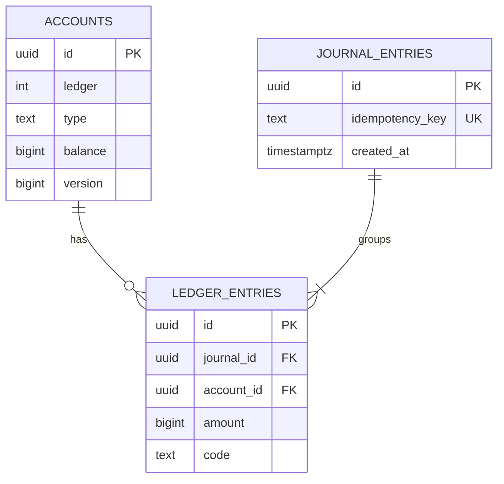
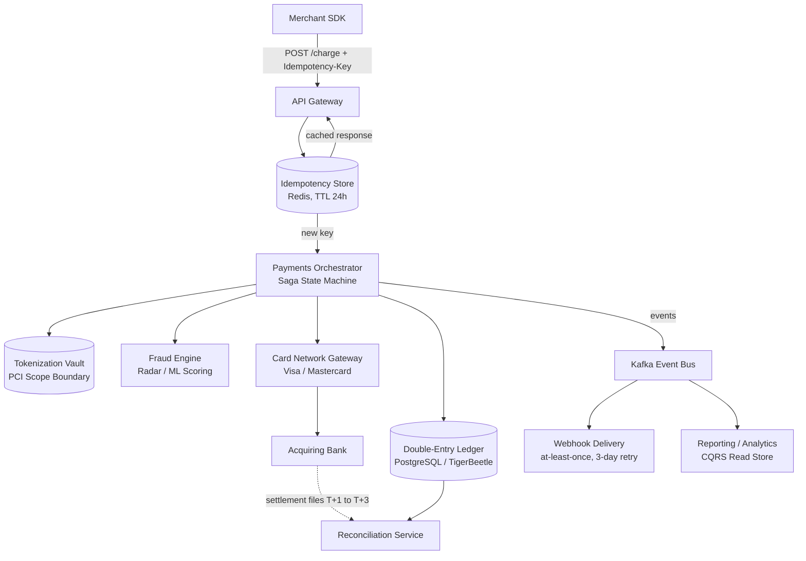
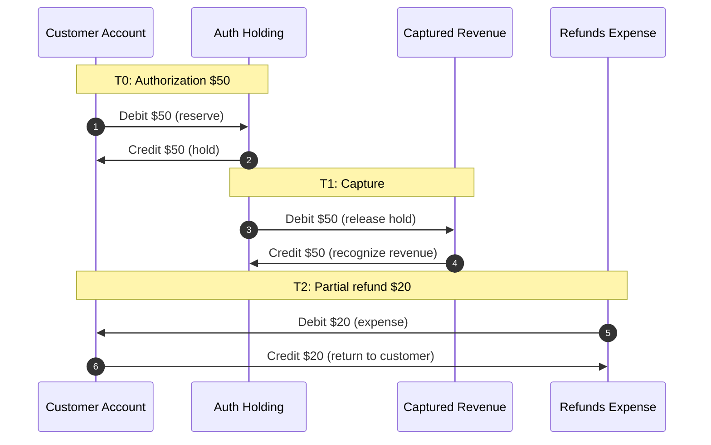
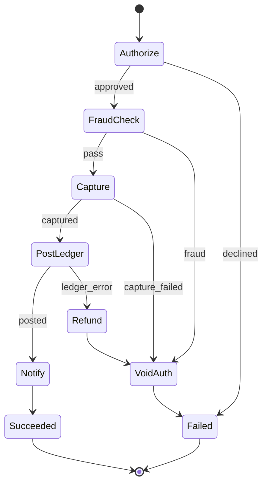

# Design a Payment System (Stripe / PayPal)

> **TL;DR.** A payment system looks like CRUD until you realize every retry is a potential duplicate charge and every crash is a potential lost transfer. The architecture converges on three primitives: a double-entry ledger where debits and credits always balance to zero, idempotency keys that make retries safe by caching responses for 24 hours[^1], and saga orchestration that replaces impossible cross-service 2PC with explicit compensating transactions[^2]. Stripe processes $1.4T annually on this model[^3]. Get the ledger right and everything else follows; get it wrong and you spend your career in reconciliation meetings.

## Learning Objectives

- [ ] Model a payment flow as balanced double-entry ledger postings and explain why immutable entries replace UPDATE statements
- [ ] Design an idempotency-key layer that prevents duplicate charges across network retries
- [ ] Apply the saga pattern to orchestrate authorization, capture, and settlement across services you do not own
- [ ] Trace the four-party card network flow from authorization through T+2 settlement
- [ ] Justify tokenization as the primary PCI-DSS scope-reduction lever
- [ ] Design a reconciliation loop that catches ledger-to-bank drift within 24 hours

## Intuition

A payment looks trivial: subtract $50 from the buyer, add $50 to the seller, done. A single Postgres transaction handles this for your first 10 customers.

At 10 million transactions per day, three things break simultaneously. First, the card network is not your database. Authorization takes 1 to 2 seconds, involves four independent parties, and settles days later[^4]. You cannot wrap that in a BEGIN/COMMIT. Second, networks between your own services drop, duplicate, and reorder messages[^1]. A timeout on the response does not mean the charge failed. It means you do not know. Third, regulators and auditors demand a permanent, immutable record of every cent that moved and why.

The insight that unlocks the design is over 700 years old: double-entry bookkeeping[^5]. Every movement of money is recorded as two entries, a debit and a credit, that sum to zero. You never edit history; you post corrections. This single invariant, "does this transaction balance?", replaces dozens of ad-hoc validation rules and makes reconciliation mechanical rather than investigative. Layer idempotency keys on top so retries are safe, wrap multi-service flows in sagas with compensations, and push raw card numbers into a tokenization vault so PCI scope stays small. That is the entire architecture.

## Requirements

### Clarifying Questions

- **Q: Do we process cards directly or use a gateway like Stripe/Adyen?**
  Assume: We are the payment platform (Stripe-like). We connect directly to card networks and acquiring banks.
- **Q: What consistency model for the ledger?**
  Assume: Strict serializability. Money cannot be eventually consistent. A transaction either posted or it did not.
- **Q: Multi-currency support?**
  Assume: Yes. Each ledger is denominated in one currency; FX is a separate transfer between ledgers.
- **Q: What is the SLA for authorization latency?**
  Assume: p99 under 2 seconds, bounded by the card network round trip[^4].
- **Q: PCI-DSS level?**
  Assume: Level 1 (over 6 million card transactions per year)[^6]. Tokenization vault is in-scope; application services are out-of-scope.
- **Q: Chargeback and dispute handling?**
  Assume: Yes. The system must reconstruct evidence from the ledger and respond within 7 days.

### Functional Requirements

- Accept a payment: authorize, capture, and record the charge in the ledger.
- Refund a payment: post reversal entries, notify the card network, credit the cardholder.
- Handle disputes: reconstruct the original transaction, submit evidence, post chargeback entries on loss.
- Deliver webhook notifications to merchants for async events (charge succeeded, dispute created, payout completed).
- Reconcile internal ledger against card network settlement files and bank statements daily.

### Non-Functional Requirements

- **Load:** 10M transactions/day, peak 5,000 TPS during Black Friday.
- **Latency:** p99 authorization under 2 seconds; p99 internal processing under 200 ms.
- **Availability:** 99.95% on the authorization path.
- **Consistency:** Strict serializability on the ledger. Zero tolerance for off-by-one.
- **Durability:** 11 nines. No transaction may be lost, ever.

## Capacity Estimation

| Metric | Value | Derivation |
|--------|------:|------------|
| Transactions/day | 10M | Given requirement |
| Peak TPS | 5,000 | Black Friday burst (3-5x average) |
| Avg transaction size | $50 | Mid-market e-commerce |
| Daily volume | $500M | 10M x $50 |
| Ledger entries/day | 40M | ~4 entries per transaction (auth, capture, fees, settlement) |
| Ledger storage/year | ~2.4 TB | 40M x 365 x ~160 B per entry |
| Idempotency store keys | 10M active | One key per transaction, 24h TTL[^1] |
| Idempotency store memory | ~1.6 GB | 10M x ~160 B (key + serialized response) |
| Webhook deliveries/day | 30M | ~3 events per transaction |

Stripe processes 500M+ API requests per day[^7] at roughly 5,800 RPS steady state (calculated). PayPal's Kafka fleet handles 1.32 trillion messages per day on peak days across 1,500+ brokers[^8]. Our 5,000 TPS target is well within single-cluster capacity for both the ledger and the event bus.

## API and Data Model

### API Design

```http
POST /v1/charges
  Idempotency-Key: <client-generated uuid>
  Body: { "amount": 5000, "currency": "usd", "payment_method": "tok_visa_4242", "merchant_id": "m_abc" }
  Returns: 201 { "id": "ch_xyz", "status": "succeeded", "amount": 5000 }
  Errors: 402 card_declined, 409 idempotency_conflict, 429 rate_limited

POST /v1/refunds
  Idempotency-Key: <uuid>
  Body: { "charge_id": "ch_xyz", "amount": 2000 }
  Returns: 201 { "id": "re_abc", "status": "succeeded" }

GET /v1/charges/{id}
  Returns: 200 { "id": "ch_xyz", "status": "succeeded", "amount": 5000, "refunded": 2000 }

GET /v1/ledger/accounts/{account_id}/entries?cursor=...&limit=100
  Returns: 200 { "entries": [...], "balance": 300000, "next_cursor": "..." }
```

Every mutating endpoint requires an `Idempotency-Key` header. The server stores the key and full response for 24 hours; retries with the same key replay the cached response[^1][^9].

### Data Model

```sql
-- Double-entry ledger (PostgreSQL or TigerBeetle)
CREATE TABLE accounts (
  id            UUID PRIMARY KEY,
  ledger        INT NOT NULL,        -- 840 = USD, 978 = EUR
  type          TEXT NOT NULL,        -- asset, liability, income, expense
  balance       BIGINT NOT NULL DEFAULT 0,
  version       BIGINT NOT NULL DEFAULT 0
);

CREATE TABLE journal_entries (
  id            UUID PRIMARY KEY,
  idempotency_key TEXT UNIQUE,
  created_at    TIMESTAMPTZ NOT NULL DEFAULT now()
);

CREATE TABLE ledger_entries (
  id            UUID PRIMARY KEY,
  journal_id    UUID REFERENCES journal_entries(id),
  account_id    UUID REFERENCES accounts(id),
  amount        BIGINT NOT NULL,     -- positive = debit, negative = credit
  code          TEXT NOT NULL,        -- CARD_AUTH, CARD_CAPTURE, REFUND, FEE
  CONSTRAINT balanced CHECK (true)   -- enforced at journal level
);
-- Invariant: SUM(amount) = 0 for all entries sharing a journal_id
```



*Every journal entry groups ledger entries that must sum to zero; the accounts table caches the running balance updated atomically in the same transaction.*

## High-Level Architecture



*A charge request flows through idempotency dedup, the saga orchestrator, and the card network; the ledger is the single append-only source of truth downstream of capture.*

**Write path.** The merchant SDK sends a charge request with an idempotency key. The gateway checks Redis for a cached response. On a miss, the orchestrator starts a saga: tokenize the card (vault), score for fraud (risk engine), authorize with the card network, and post entries to the ledger. The response is cached in Redis and returned.

**Read path.** Merchants query charge status and ledger entries directly from the primary store. The CQRS read store serves analytics and reporting queries without loading the ledger.

**Async path.** Kafka propagates events to webhook delivery (at-least-once with 3-day retries[^10]), the reconciliation service, and downstream analytics.

## Deep Dives

### Deep dive 1: Double-entry ledger and why UPDATE is forbidden

The fundamental invariant: for every journal entry, the sum of all ledger entries equals zero[^5][^11]. A $50 charge posts two entries: debit the customer's asset account by $50, credit the merchant's liability account by $50. A refund is not an edit. It is a new journal entry with the opposite sign[^11][^12].

Why not `UPDATE balance SET balance = balance - 50`? Three reasons. First, it destroys the audit trail. You cannot answer "why is this balance $4,982 instead of $5,000?" without the history[^13]. Second, concurrent updates race. Two debits reading the same balance can both succeed, underflowing the account[^13][^14]. Third, reconciliation becomes investigative rather than mechanical. With entries, you diff your journal against the bank's settlement file row by row.

**TigerBeetle** is a purpose-built financial database that enforces these invariants at the storage engine level. A single transfer has exactly one debit account and one credit account. Complex flows (split payments, FX) use `LINKED` chains that all succeed or all fail atomically[^15]. Benchmarks show 100K to 500K TPS on commodity hardware[^14], compared to 100 to 1,000 TPS for a naive Postgres implementation under contention[^14].

**Square's Books** runs on Google Cloud Spanner with three tables: `books` (cached balance + version), `journal_entries`, and `book_entries` interleaved with their parent journal[^13]. Every insert atomically updates the affected books' balances and versions in the same Spanner transaction. A team of three engineers manages 20 TB of data across Square, Cash App, and Caviar[^13].



*Authorization, capture, and refund post six balanced entries across four accounts; the ledger sum remains zero at every step.*

### Deep dive 2: Idempotency keys and safe retries

Networks are unreliable. A client sends a charge request, the server processes it, but the response is lost in transit. The client retries. Without idempotency, the customer is charged twice[^1].

**Mechanism.** The client generates a UUID and sends it as `Idempotency-Key` on every mutating request. The server stores the key and the serialized response in Redis with a 24-hour TTL[^1][^9]. On retry:

1. If the key exists and the operation completed, return the cached response.
2. If the key exists and the operation is in-flight, return 409 or block until completion.
3. If the key does not exist, execute normally and cache the result.

**Key choice is load-bearing.** If the client generates a new key on every retry, idempotency is defeated. If it reuses a key across logically different operations, it sees a stale response. Stripe returns an error if you reuse a key with a different request body[^9].

**Implementation detail.** The idempotency store must be checked and written atomically. A race between two concurrent requests with the same key must result in exactly one execution. Redis `SET NX` with the key as a lock, followed by the cached response write on completion, handles this. Stripe's Ruby client retries automatically with exponential backoff, jitter, and the original key[^1].

**Scope.** Idempotency lives at the gateway layer, covering all POST endpoints uniformly. Individual services downstream do not need their own dedup because the gateway guarantees at-most-once delivery into the saga[^1][^9].

### Deep dive 3: Saga orchestration across services you do not own

A checkout spans five systems: the tokenization vault, the fraud engine, the card network, the ledger, and the notification layer. These have no shared transaction manager. 2PC is not an option because the card network's authorization takes 1 to 2 seconds, during which you would hold locks across all participants[^4][^2].

**Saga pattern.** Each step commits locally and has an explicit compensating action[^2]:

| Step | Forward Action | Compensation |
|------|---------------|--------------|
| 1 | Authorize card | Void authorization |
| 2 | Score fraud risk | Release risk hold |
| 3 | Capture funds | Issue refund |
| 4 | Post to ledger | Post reversal entries |
| 5 | Notify merchant | Send cancellation |

On failure at step N, compensations run in reverse order from N-1 to 1. Each compensation is itself retried until success because compensations must be durable[^2].

**Orchestration beats choreography** for payments because the state is observable in one place. A central orchestrator (Temporal, Step Functions, or a bespoke state machine) sends commands and tracks progress. Choreography-based sagas become impossible to debug past five or six steps because no single log captures the flow[^2].



*Any failed step triggers reverse-order compensations; the orchestrator retries each compensation until success.*

**Isolation caveat.** Intermediate states are visible to other sagas. A customer checking their balance mid-saga sees the authorization hold but not the capture. This is correct behavior for payments (the hold is real), but requires careful UX: show "pending" charges distinctly from "completed" charges.

### Deep dive 4: Card network flow and PCI tokenization

**The four-party model.** Authorization flashes through cardholder, merchant, acquiring bank, card network, and issuing bank in 1 to 2 seconds[^4]. The issuer checks balance, credit limit, and fraud signals, then approves or declines. Clearing happens overnight: the acquirer and issuer exchange transaction files through the network[^16]. Settlement lands T+1 to T+3 business days later as actual funds movement between banks[^4][^17].

An authorization "hold" reserves credit line capacity but does not move funds. Capture converts the hold into a clearing record. For card-not-present transactions, uncaptured authorizations typically expire after 5 to 7 days depending on card brand and transaction type (Visa MIT: 5 days; most others: 7 days); card-present holds expire sooner (2 to 5 days). JPY-denominated transactions on Japan-based accounts are a special case that can hold up to 30 days[^4]. Your ledger must distinguish authorized, captured, and settled states because any of them can still be reversed[^17].

**Tokenization.** PCI-DSS dictates how card data is stored, processed, and transmitted. The architectural lever is scope reduction[^6]. Card data enters through a PCI-validated vault (Stripe Elements, VGS, Skyflow) that replaces the raw PAN with an opaque token. Your application services only ever see the token. This qualifies you for SAQ A (a short questionnaire covering roughly two dozen controls) instead of SAQ D, the most demanding self-assessment questionnaire, which covers the full PCI DSS requirement set[^6]. Merchants processing over 6 million Visa/Mastercard transactions annually are Level 1 and require an annual on-site audit by a Qualified Security Assessor[^6].

## Real-World Example

### Stripe: $1.4T on idempotency, ledger, and Radar

Stripe processed $1.4 trillion in total payment volume in 2024, roughly 1.3% of global GDP[^3]. The platform handles 500M+ API requests per day[^7] with nearly 200 million active subscriptions across 300,000+ billing customers[^3].

**Idempotency as a cross-cutting concern.** Every POST endpoint accepts an `Idempotency-Key` header. The server caches the response for 24 hours in a dedicated store[^1][^9]. This is not per-service; it is at the gateway layer, giving all clients one uniform contract.

**Internal ledger.** Ilya Ganelin describes Stripe's ledger as a state-of-the-art money movement tracking system[^7]. It is append-only and serves as the source of truth for all money movement. Radar and reporting consume from the ledger rather than maintaining their own counts.

**Radar ML fraud detection.** Trained on hundreds of billions of dollars of payments processed across the Stripe network, Radar uses merchant embeddings (similar to Word2Vec, so a fraud pattern on Uber generalizes to Lyft)[^18]. 90% of cards on the network have been seen more than once[^18], giving Radar a network-level signal no single merchant could replicate.

**Online migrations.** Stripe migrated hundreds of millions of subscription objects between stores without downtime using dual-write, GitHub's Scientist for read comparison, and incremental write cutover[^19]. No maintenance windows. This is how you evolve a ledger schema at scale.

Uber's Gulfstream platform takes a complementary approach: auditable double-entry with a trillion ledger entries migrated from DynamoDB to a tiered LedgerStore with cryptographic proofs of immutability[^20][^21].

## Trade-offs

| Decision | Option A | Option B | Our Choice | Why |
|----------|----------|----------|------------|-----|
| Ledger model | Double-entry (append-only) | Single-row balance updates | Double-entry | Audit trail, reconciliation, over 700 years of proof[^5][^13] |
| Ledger engine | PostgreSQL | TigerBeetle | PostgreSQL (start), TigerBeetle (scale) | Postgres is proven; TigerBeetle for 100K+ TPS[^15][^14] |
| Idempotency scope | Gateway-level | Per-service | Gateway-level | One contract for all clients; less duplication[^1] |
| Cross-service coordination | Saga with orchestrator | 2PC | Saga | Cannot hold locks across card networks[^2] |
| Saga flavor | Orchestration (Temporal) | Choreography (events) | Orchestration | Observable state, debuggable past 5 steps[^2] |
| PCI scope | Store cards in-house | Tokenize through vault | Tokenize | SAQ A vs SAQ D; millions in compliance savings[^6] |
| Webhook delivery | At-most-once | At-least-once with dedup | At-least-once | 3-day retries absorb receiver outages[^10] |

The single biggest meta-decision: **consistency over availability on the ledger path.** [CAP and PACELC](../part-3-distributed-systems-theory/03-cap-and-pacelc.md) frames this choice. Money cannot be eventually consistent. If the ledger is unavailable, you reject the charge rather than risk posting an unbalanced entry. The authorization path can tolerate brief unavailability (return "try again") but never inconsistency.

## Scaling and Failure Modes

- **At 10x (50K TPS):** The PostgreSQL ledger becomes the bottleneck under write contention. Migrate to TigerBeetle or shard by merchant_id. Scale the idempotency store to a Redis Cluster. Kafka partitions increase from 32 to 128.
- **At 100x (500K TPS):** Single-region architecture saturates. Deploy active-passive across regions with synchronous replication on the ledger. Shard the saga orchestrator by payment_id. PayPal's architecture at this scale runs 85+ Kafka clusters with 1,500+ brokers[^8].
- **At 1000x:** Purpose-built ledger engines (TigerBeetle claims 500K TPS on commodity hardware[^14]). Tiered storage: hot data (12 weeks) on SSD, cold data on blob storage with cryptographic proofs, as Uber's LedgerStore demonstrates[^21].

**Failure modes:**

- **Card network timeout:** The orchestrator marks the saga as "pending." A background reconciler queries the network for the authorization status. If confirmed, proceed; if not found after 30 minutes, void and retry with a new idempotency key.
- **Ledger write failure:** The saga compensation voids the card authorization. The charge is not posted. The customer sees no charge. Alert fires for manual review.
- **Webhook receiver down:** Stripe retries for up to 3 days with exponential backoff[^10]. The merchant's system must dedupe on `event.id` when it recovers. Events can arrive out of order; a `charge.refunded` may arrive before `charge.succeeded`[^10].

## Common Pitfalls

> [!WARNING]
> **Retries without idempotency keys.** A network timeout does not mean the charge failed. Without an idempotency key, the retry creates a duplicate charge. Mandate keys on every POST at the gateway[^1].

> [!WARNING]
> **UPDATE balance instead of posting entries.** Destroys the audit trail, races under concurrency, and makes reconciliation investigative. Square explicitly cites "inconsistencies in the data, resulting in customer inquiries and delayed deposits" as motivation for migrating to double-entry[^13].

> [!WARNING]
> **2PC across the card network.** The card network takes 1 to 2 seconds. Holding locks across that latency exhausts your connection pool and deadlocks under load. Use sagas with compensations[^2].

> [!WARNING]
> **Non-idempotent webhook handlers.** Stripe retries webhooks for 3 days. If your handler runs "credit the user" on every delivery, the user gets credited multiple times. Dedupe on `event.id` before applying side effects[^10].

> [!WARNING]
> **PAN storage creep.** A feature request for "show last-4 on the refund screen" leads to storing the full PAN, putting your entire database in PCI scope. Use tokens exclusively; the vault returns the last-4 as metadata[^6].

> [!WARNING]
> **No reconciliation loop.** Without continuous ledger-to-bank reconciliation, drift grows silently for months. Reconciliation is a feature, not a month-end report. Alert on any unmatched entry older than 24 hours.

## Follow-up Questions

**1. How do you handle chargebacks and disputes?**

When the card network initiates a chargeback, post a debit to the merchant's account (reversing the original credit). Reconstruct evidence from the immutable ledger entries: timestamps, delivery confirmation, IP address, 3DS authentication result. Submit within 7 days. If you win (representment), post a credit back. If you lose, the debit stands. The ledger records every state transition.

**2. How would you add multi-currency support?**

Each account belongs to exactly one ledger (currency). An FX transfer is a journal entry that debits the source-currency account and credits the destination-currency account, with the exchange rate recorded as metadata. The balanced-to-zero invariant holds within each journal entry because the amounts are in different ledgers (the constraint is per-ledger, not cross-ledger).

**3. How do you handle partial captures and split payments?**

Authorization holds the full amount. Capture can be for a lesser amount (partial capture). The difference is released as a void of the remaining hold. Split payments use linked transfers: one journal entry with multiple credit accounts (merchant A gets 70%, merchant B gets 30%) that sum to the single debit.

**4. What happens during a regional failover?**

The ledger runs active-passive with synchronous replication. On failover, the new primary has all committed transactions. In-flight sagas in the failed region are recovered from the orchestrator's durable log (Temporal's persistence layer). Idempotency keys in Redis are replicated; any duplicate retries during failover return cached responses safely.

**5. How would you implement usage-based billing (metered charges)?**

Accumulate usage events in a stream (Kafka). A billing worker aggregates usage per billing period and posts a single charge at period end. The aggregation is idempotent (reprocessing the same events produces the same total). The charge itself uses a deterministic idempotency key derived from (customer_id, billing_period) so retries are safe.

**6. How do you prevent fraud without adding latency?**

Run the fraud model in parallel with tokenization (both happen before the card network call). The model scores in under 50 ms using pre-computed features. Only block on the result before sending to the network. Stripe's Radar evaluates every transaction in real time using network-level signals[^18].

## Exercise

### Exercise 1: Chargeback ledger entries

A customer disputes a $50 charge 60 days after payment. The card network initiates a chargeback. Your system must respond with evidence within 7 days. If you lose, you owe the $50 plus a $15 dispute fee. Design the ledger entries for: (a) the original charge, (b) the chargeback initiation, (c) losing the dispute.

<details>
<summary>Hint</summary>

Think about which accounts are involved at each stage. The original charge moved money from customer to merchant. The chargeback reverses that movement and adds a fee. Every step must balance to zero.

</details>

<details>
<summary>Solution</summary>

**(a) Original charge ($50):**

- Debit: Customer Asset $50
- Credit: Merchant Liability $50

**(b) Chargeback initiated (hold $50 from merchant):**

- Debit: Merchant Liability $50 (reverse the original credit)
- Credit: Chargeback Holding $50 (funds held pending resolution)

**(c) Dispute lost ($50 + $15 fee):**

- Debit: Chargeback Holding $50
- Credit: Customer Asset $50 (money returned to cardholder)
- Debit: Merchant Liability $15 (dispute fee)
- Credit: Platform Revenue $15 (fee collected)

Each journal entry sums to zero. The merchant's balance decreases by $65 total ($50 refund + $15 fee). The immutable entries create a complete audit trail showing exactly when each movement occurred and why. If you win the dispute instead, you post: Debit Chargeback Holding $50, Credit Merchant Liability $50 (funds released back).

</details>

## Key Takeaways

- **Double-entry is not optional for money.** The balanced-to-zero invariant replaces dozens of ad-hoc checks and makes reconciliation mechanical[^5].
- **Idempotency keys belong at the gateway.** One layer, one contract, all endpoints covered. 24-hour TTL, cached full response[^1].
- **Sagas replace 2PC** when you cannot own all participants' transaction managers. Compensations are explicit code, not implicit rollback[^2].
- **PCI scope drives architecture.** Tokenization is how you avoid SAQ D. Build or buy a vault, but never let PANs touch application services[^6].
- **Reconciliation is a feature.** Continuous ledger-to-bank matching catches drift before it becomes a crisis.
- **The card network is not your database.** Authorization, clearing, and settlement are three separate phases spanning days. Design your state machine accordingly[^4].

## Further Reading

- [Designing robust and predictable APIs with idempotency](https://stripe.com/blog/idempotency). Brandur Leach's canonical writeup on why every payment API needs idempotency keys and how Stripe implements them with 24-hour response caching.
- [Accounting for Computer Scientists](https://martin.kleppmann.com/2011/03/07/accounting-for-computer-scientists.html). Martin Kleppmann frames double-entry as a directed graph where accounts are nodes and transfers are edges; the single best primer for engineers.
- [Books: an immutable double-entry accounting database service](https://developer.squareup.com/blog/books-an-immutable-double-entry-accounting-database-service). Square's Spanner-backed ledger schema, interleaved tables, and how three engineers manage 20 TB.
- [Engineering Uber's Next-Gen Payments Platform](https://www.uber.com/en-SE/blog/payments-platform/). Gulfstream's auditable, event-sourced ledger design with zero-downtime customer migration.
- [Saga pattern](https://microservices.io/patterns/data/saga.html). Chris Richardson's canonical description with orchestration vs choreography trade-offs and compensation semantics.
- [TigerBeetle: Debit/Credit](https://docs.tigerbeetle.com/concepts/debit-credit/). The design rationale for a purpose-built OLTP financial database that enforces balanced transfers at the storage engine level.
- [Scaling Kafka to Support PayPal's Data Growth](https://developer.paypal.com/community/blog/scaling-kafka-to-support-paypals-data-growth). 1.32T messages/day, 1,500 brokers, 85+ clusters; the event bus architecture behind a $1.68T payment platform.
- [A guide to PCI compliance](https://stripe.com/guides/pci-compliance). Stripe's walkthrough of SAQ levels, tokenization scope reduction, and why most merchants should never touch raw card data.

## Flashcards

<details>
<summary><strong>Q: What is the core invariant of a double-entry ledger?</strong></summary>

A: For every journal entry (transaction), the sum of all ledger entries (debits and credits) equals zero. This guarantees that money is never created or destroyed, only moved between accounts.[^5]

</details>

<details>
<summary><strong>Q: How does an idempotency key prevent duplicate charges?</strong></summary>

A: The client sends a unique key with every request. The server caches the key and full response for 24 hours. On retry with the same key, the server returns the cached response instead of re-executing the charge.[^1]

</details>

<details>
<summary><strong>Q: Why is 2PC unsuitable for payment flows?</strong></summary>

A: The card network authorization takes 1 to 2 seconds. 2PC holds locks across all participants for the duration of the slowest one. This exhausts connection pools and causes deadlocks under load. Sagas with compensations commit locally at each step instead.[^2]

</details>

<details>
<summary><strong>Q: What are the three phases of a card network transaction?</strong></summary>

A: Authorization (1-2 seconds, reserves credit line), clearing (overnight, transaction files exchanged), and settlement (T+1 to T+3, actual funds transfer between banks).[^4]

</details>

<details>
<summary><strong>Q: How does tokenization reduce PCI-DSS scope?</strong></summary>

A: A PCI-validated vault replaces the raw PAN with an opaque token before it reaches application services. The application never sees card data, qualifying for SAQ A (a short questionnaire) instead of SAQ D, the most demanding self-assessment questionnaire that covers the full PCI DSS requirement set.[^6]

</details>

<details>
<summary><strong>Q: Why are webhook handlers required to be idempotent?</strong></summary>

A: Stripe retries webhook deliveries for up to 3 days with exponential backoff. The same event can arrive multiple times. Handlers must dedupe on event.id before applying side effects to avoid double-crediting.[^10]

</details>

<details>
<summary><strong>Q: What is a compensating transaction in the saga pattern?</strong></summary>

A: An explicit action that undoes the effect of a previously committed step. For example, if capture fails after authorization succeeded, the compensation is to void the authorization. Compensations run in reverse order and are retried until success.[^2]

</details>

<details>
<summary><strong>Q: Why is a refund modeled as new entries rather than deleting the original charge?</strong></summary>

A: Ledger entries are immutable and append-only. A refund posts new entries with the opposite sign, preserving the complete audit trail. Deleting or editing entries would destroy the ability to reconcile and audit.[^11]

</details>

<details>
<summary><strong>Q: What does Stripe process in annual payment volume?</strong></summary>

A: $1.4 trillion in 2024, approximately 1.3% of global GDP, with 500M+ API requests per day.[^3][^7]

</details>

<details>
<summary><strong>Q: Why does orchestration beat choreography for payment sagas?</strong></summary>

A: Orchestration provides a single observable state machine where you can see exactly which step each payment is in. Choreography distributes state across event handlers, making it impossible to debug flows past five or six steps.[^2]

</details>

## References

[^1]: Brandur Leach, "Designing robust and predictable APIs with idempotency", Stripe Blog, Feb 2017. https://stripe.com/blog/idempotency

[^2]: Chris Richardson, "Pattern: Saga", microservices.io. https://microservices.io/patterns/data/saga.html

[^3]: Stripe Newsroom, "Stripe's total payment volume reaches $1.4T", Feb 27 2025. https://stripe.com/newsroom/news/stripe-2024-update

[^4]: Mastercard, "Mastercard Switching explained: Authorization, Clearing, and Settlement". https://www.mastercard.com/eea/switching-services/our-technology/transaction.html

[^5]: Martin Kleppmann, "Accounting for Computer Scientists", Mar 2011. https://martin.kleppmann.com/2011/03/07/accounting-for-computer-scientists.html

[^6]: Stripe, "A guide to PCI compliance". https://stripe.com/guides/pci-compliance

[^7]: Ilya Ganelin, "Ledger: Stripe's system for tracking and validating money movement", Stripe Dev Blog, Feb 16 2024. https://stripe.dev/blog/ledger-stripe-system-for-tracking-and-validating-money-movement

[^8]: Monish Koppa, "Scaling Kafka to Support PayPal's Data Growth", PayPal Developer Blog, Sep 7 2023. https://developer.paypal.com/community/blog/scaling-kafka-to-support-paypals-data-growth

[^9]: Stripe API Reference, "Idempotent Requests". https://stripe.com/docs/api/idempotent_requests

[^10]: Stripe docs, "Receive Stripe events in your webhook endpoint". https://docs.stripe.com/webhooks

[^11]: TigerBeetle docs, "Financial Accounting". https://docs.tigerbeetle.com/coding/financial-accounting/

[^12]: TigerBeetle docs, "TigerBeetle in Your System Architecture". https://docs.tigerbeetle.com/coding/system-architecture/

[^13]: Lukasz Strzalkowski, "Books, an immutable double-entry accounting database service", Square Developer Blog, Oct 16 2019. https://developer.squareup.com/blog/books-an-immutable-double-entry-accounting-database-service

[^14]: TigerBeetle, "Financial Transactions Database". https://tigerbeetle.com

[^15]: TigerBeetle docs, "Debit/Credit: The Schema for OLTP". https://docs.tigerbeetle.com/concepts/debit-credit/

[^16]: Mastercard, "Mastercard Switching explained". https://www.mastercard.com/eea/switching-services/our-technology/transaction.html

[^17]: Plasma Learn, "What Happens Between Tapping Your Card and the Merchant Getting Paid?". https://www.plasma.to/learn/payment-settlement-process

[^18]: Stripe, "A primer on machine learning for fraud detection", last updated Dec 15 2021. https://stripe.com/guides/primer-on-machine-learning-for-fraud-protection

[^19]: Jacqueline Xu, "Online migrations at scale", Stripe Blog, Feb 2 2017. https://stripe.com/blog/online-migrations

[^20]: Uber Engineering, "Engineering Uber's Next-Gen Payments Platform". https://www.uber.com/en-SE/blog/payments-platform/

[^21]: Uber Engineering, "Migrating a Trillion Entries of Uber's Ledger Data from DynamoDB to LedgerStore". https://www.uber.com/ca/en/blog/migrating-from-dynamodb-to-ledgerstore/
