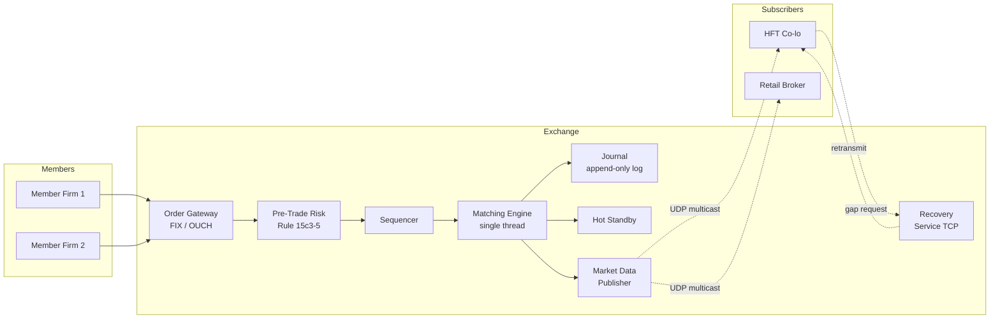
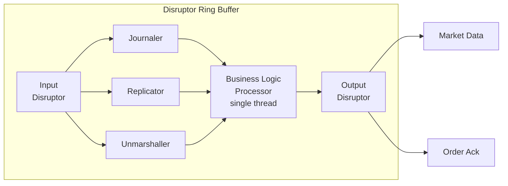
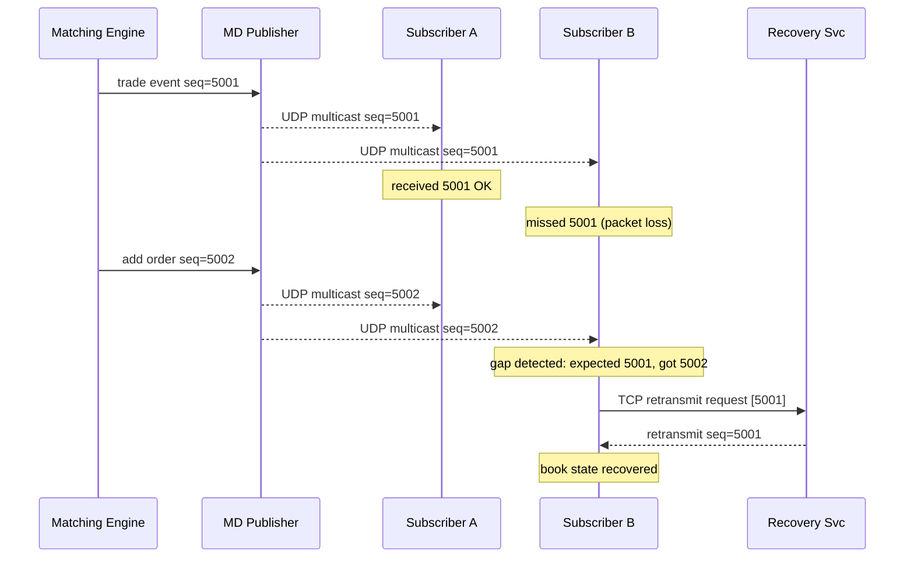
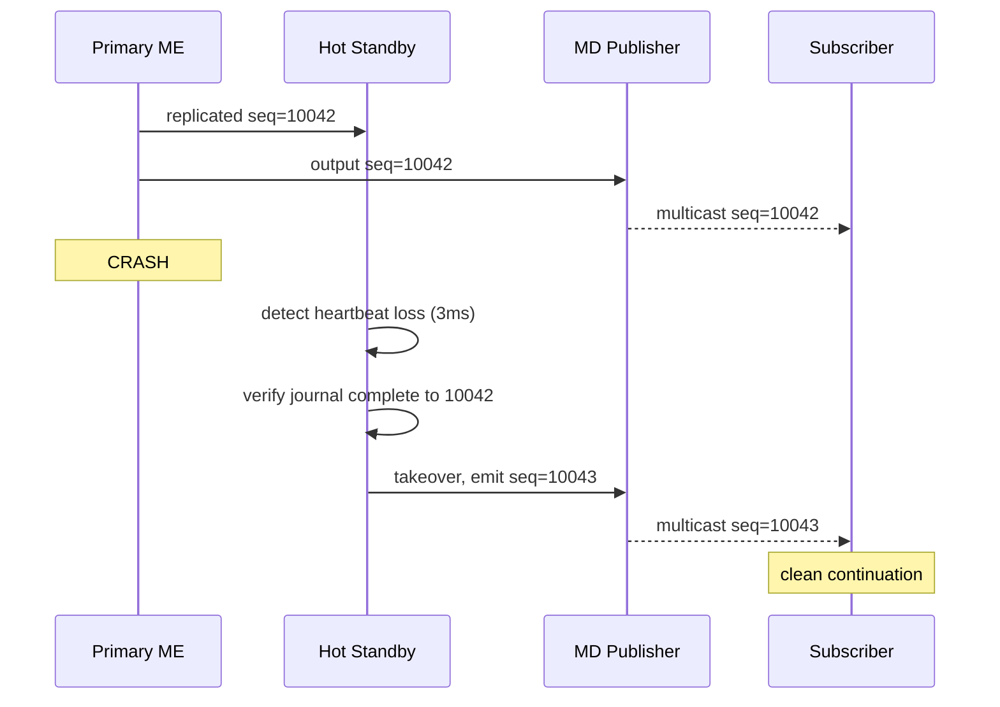
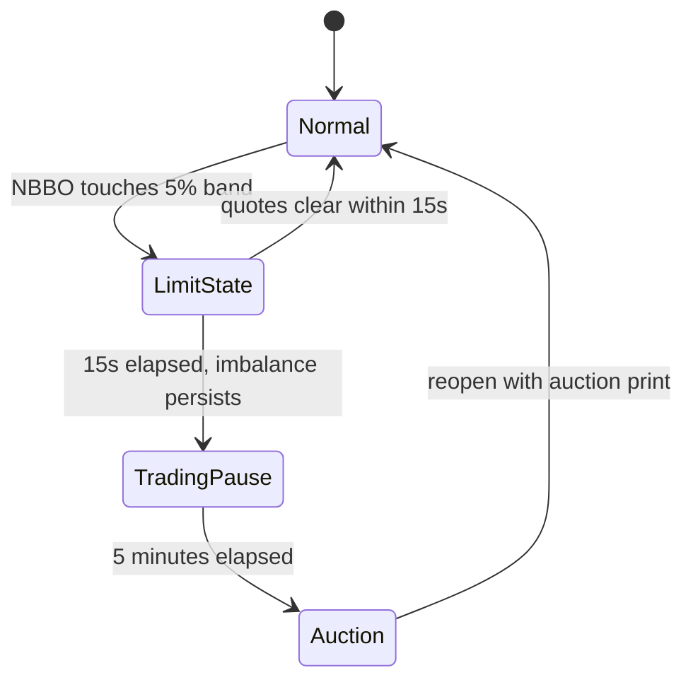

# Design a Stock Exchange (Matching Engine)

> **TL;DR.** A stock exchange matching engine is the rare distributed system where the correct answer is "do not distribute." NASDAQ's INET matches orders in under 40 microseconds at over 1 million messages per second[^1]. LMAX demonstrated 6 million orders per second on a single thread (benchmarked on 2010-era hardware)[^2]. The architecture is a strictly serialized event log: a sequencer stamps every order, a single-threaded engine matches against a price-time-priority order book, and outputs fan out via UDP multicast to thousands of subscribers. The pivotal trade-off is determinism over parallelism: you cannot scale one symbol's matching horizontally, but you can replay any failure identically.

## Learning Objectives

After this module, you will be able to:

- [ ] Design a FIFO order book with price-time priority and explain its determinism properties
- [ ] Architect market data distribution via UDP multicast with gap detection and recovery
- [ ] Reason about hot-standby replication and sub-second failover for the matching engine
- [ ] Explain why single-threaded design and kernel bypass beat parallel architectures for this workload
- [ ] Identify pre-trade risk controls mandated by SEC Rule 15c3-5 and their architectural impact
- [ ] Estimate capacity for a production exchange handling 1M+ messages per second

## Intuition

A stock exchange looks like a trivial CRUD app. Accept an order, store it, match buyers with sellers. A college student could build one in a weekend.

Now add the constraint that matters: two orders arrive 800 nanoseconds apart. The first must execute before the second. Always. Deterministically. If you replay the same input stream tomorrow, you must get bit-identical output. No locks, no retries, no "eventually consistent." The order book is the single source of truth, and it lives on one thread because that is the only way to guarantee total ordering without coordination overhead.

The naive multi-threaded approach fails immediately. Two threads reading the same price level introduce a race: which order fills first? You could add a lock, but a lock at 6 million operations per second costs more than the matching itself. You could use optimistic concurrency, but retries destroy determinism. The industry tried and abandoned parallelism decades ago.

The insight: serialize the hard part (matching), parallelize everything else (network I/O, journaling, market data publishing, risk checks). The matching engine becomes a pure function: input event in, output events out, no side effects, no I/O, no blocking calls. Everything around it can be concurrent because the engine has already established the authoritative order of events[^2].

This is the LMAX Disruptor pattern, and it powers every major equities and futures exchange in production today.

## Requirements

### Clarifying Questions

- **Q: What asset classes do we support?**
  Assume: US equities (NMS stocks). Single venue, not a consolidated tape.
- **Q: What matching algorithm?**
  Assume: Price-time priority (FIFO). The dominant algorithm for US equities and futures[^3].
- **Q: What is the latency target?**
  Assume: Wire-to-wire p99 under 50 microseconds at the matching engine. NASDAQ INET achieves sub-40 microseconds[^1].
- **Q: How many symbols?**
  Assume: 8,000 listed symbols. Each symbol has an independent order book.
- **Q: What is the failover requirement?**
  Assume: Sub-second failover with zero order loss. A fast failover that drops one order is worse than a slow one that preserves everything[^2].
- **Q: Do we need co-location?**
  Assume: Yes. Equal-length fiber cross-connects for all participants, per NYSE Mahwah model[^4].
- **Q: What regulatory constraints apply?**
  Assume: SEC Rule 15c3-5 (pre-trade risk), LULD bands, and Reg NMS obligations.

### Functional Requirements

- Accept limit, market, and cancel orders via FIX/OUCH protocol over TCP
- Match orders using strict price-time priority and emit trade confirmations
- Publish real-time order book updates and trades to all subscribers via UDP multicast (ITCH protocol)
- Support opening and closing auction mechanisms
- Enforce LULD price bands and halt trading when bands are breached[^5]
- Provide TCP-based gap recovery for subscribers who miss multicast packets

### Non-Functional Requirements

- **Throughput:** 1M+ messages/sec sustained; peak 1.1M messages/sec (NASDAQ record: 1,134,640/sec)[^1]
- **Latency:** p99 < 50 microseconds wire-to-wire at the matching engine
- **Determinism:** Replaying the input journal must produce bit-identical output
- **Availability:** 99.999% uptime during market hours (6.5 hours/day, 252 days/year)[^1]
- **Durability:** Zero order loss on primary failure; journal persisted before acknowledgment
- **Fairness:** Equal-length cross-connects; no participant has geometric latency advantage[^4]

## Capacity Estimation

| Metric | Value | Derivation |
|--------|------:|------------|
| Peak messages/sec | 1,134,640 | NASDAQ INET published record[^1] |
| Peak executions/sec | 193,350 | NASDAQ INET published record[^1] |
| Daily messages | 1.68B | NASDAQ record day: 1,684,103,265[^1] |
| Orders/day (typical) | 10M | Baseline for a mid-tier venue |
| Cancel:execute ratio | ~20:1 | US equities typical (estimates range from 10:1 to 30:1)[^6] |
| Market data subscribers | 1,000+ | Co-located HFT firms + retail brokers |
| Order book depth (per symbol) | ~10,000 levels | Wide-tick instruments; top 5 levels dominate |
| Memory per order | ~128 B | price(8) + qty(8) + id(8) + timestamps(16) + pointers(16) + metadata |
| Active orders in memory | ~2M | 8,000 symbols * 250 avg resting orders |
| Total hot memory | ~256 MB | Fits in L3 cache of a modern server |

The critical insight: the entire active state fits in CPU cache. This is why single-threaded matching works. Cache misses, not CPU cycles, are the bottleneck at microsecond latencies.

## API and Data Model

### API Design

Order entry uses OUCH (NASDAQ's binary protocol over SoupBinTCP) or FIX for compatibility[^7][^8]:

```text
-- OUCH Enter Order (binary, fixed 49 bytes)
OrderToken:       14 bytes (client-assigned)
Side:              1 byte  (B=buy, S=sell)
Shares:            4 bytes (quantity)
Symbol:            8 bytes (padded)
Price:             4 bytes (fixed-point, 4 decimal places)
TimeInForce:       4 bytes (DAY, IOC, GTC)
Display:           1 byte  (visible, hidden, attributable)

-- OUCH Accepted (exchange response, 66 bytes)
OrderToken:       14 bytes
OrderRefNum:       8 bytes (exchange-assigned sequence)
Side, Shares, Symbol, Price, TimeInForce, Timestamp

-- OUCH Cancel
OrderToken:       14 bytes
Shares:            4 bytes (partial cancel quantity)
```

Market data uses ITCH over MoldUDP64 (sequenced UDP multicast)[^9]:

```text
-- ITCH Add Order (28 bytes)
MessageType:       1 byte  ('A')
SequenceNumber:    8 bytes (monotonic, gap-detectable)
OrderRefNum:       8 bytes
Side:              1 byte
Shares:            4 bytes
Symbol:            8 bytes
Price:             4 bytes
```

### Data Model

```text
-- Order (in-memory, intrusive linked list node)
struct Order {
    order_id:       u64,        -- exchange-assigned sequence number
    client_token:   [u8; 14],   -- client reference
    symbol_id:      u16,        -- index into symbol table
    side:           Side,       -- Bid | Ask
    price:          i64,        -- fixed-point (price * 10000)
    remaining_qty:  u32,
    timestamp_ns:   u64,        -- sequencer timestamp
    prev:           *Order,     -- intrusive list pointers
    next:           *Order,
}

-- Price Level (one per distinct price in the book)
struct PriceLevel {
    price:      i64,
    head:       *Order,     -- FIFO queue head (oldest)
    tail:       *Order,     -- FIFO queue tail (newest)
    total_qty:  u64,        -- aggregate visible quantity
}

-- Order Book (one per symbol)
struct OrderBook {
    bids:       SortedMap<i64, PriceLevel>,  -- descending by price
    asks:       SortedMap<i64, PriceLevel>,  -- ascending by price
    order_map:  HashMap<u64, *Order>,        -- O(1) cancel lookup
}
```

The `order_map` is critical: cancels outnumber executions by roughly 20:1 in US equities[^6], so O(1) cancel via hash lookup dominates performance.

## High-Level Architecture



*Orders flow through risk checks and a sequencer into a single-threaded matching engine; outputs fan out to a journal, a hot standby, and a multicast market data publisher.*

**Write path (order entry).** A member firm sends an order over TCP (OUCH/FIX). The gateway decodes and validates the wire format. Pre-trade risk checks enforce Rule 15c3-5 limits (fat-finger size, daily credit, duplicate detection)[^10]. The sequencer stamps a monotonic sequence number, establishing the authoritative total order. The matching engine consumes the sequenced event, updates the order book, and emits output events (trade, add-to-book, or cancel-ack).

**Output path (market data).** The market data publisher serializes output events into ITCH messages and multicasts them over UDP to all subscribers simultaneously. Every message carries the sequence number. Subscribers detect gaps and request TCP retransmission from the recovery service[^9].

**Failover path.** The hot standby receives the same sequenced input stream (via IP multicast or dedicated replication link). It processes every event identically but discards its own output. On primary failure, it becomes the leader in microseconds[^2].

## Deep Dives

### Single-threaded matching and the LMAX Disruptor

The matching engine runs on one thread. Not because engineers are lazy, but because it is provably optimal for this workload.

**Why single-threaded wins.** At 6 million events per second, each event gets ~167 nanoseconds of CPU time[^2]. A single cache miss to DRAM costs ~100 nanoseconds. A mutex lock/unlock pair costs ~25 nanoseconds uncontended, ~1,000 nanoseconds contended. Any coordination mechanism between threads would consume the entire time budget for the event itself.

The LMAX Disruptor solves the surrounding concurrency problem. It is a lock-free ring buffer (power-of-two size, so index computation is a single bitwise AND instead of a modulo division)[^11]. Multiple consumers (journaler, replicator, unmarshaller) read from the ring in parallel without locks. Only after all consumers complete does the Business Logic Processor (the matching thread) consume the event.

```java
// Ring buffer index: single-cycle bitwise AND replaces modulo
this.indexMask = bufferSize - 1;  // bufferSize must be power of 2
E element = entries[BUFFER_PAD + (int)(sequence & indexMask)];
```

Cache-line padding prevents false sharing between producer and consumer sequence counters. The 64-byte padding on either side of hot fields guarantees each counter sits alone in its cache line[^11]:



*The Disruptor parallelizes I/O consumers around a single-threaded matching core; the BLP never blocks on I/O.*

**Deterministic replay.** Because the matching thread is a pure function of its input stream, bug reproduction is trivial: copy the journal to a dev box, replay, and the bug reproduces identically. LMAX restarts from a nightly snapshot plus journal replay in under 60 seconds[^2].

**The hard ceiling.** One core is the vertical limit. You cannot scale matching for a single symbol horizontally. But you can shard by symbol: each symbol's book runs on its own engine instance, and the sequencer routes by symbol ID.

### Market data multicast with gap recovery

The matching engine emits every book update and trade as a binary ITCH message to a UDP multicast group. This is the only architecture that scales: one packet per update reaches all 1,000+ subscribers without the engine maintaining per-subscriber state[^9].

**Protocol stack.** NASDAQ uses MoldUDP64 as the sequencing layer over UDP multicast. Every message carries a monotonic 64-bit sequence number. Subscribers track the expected next sequence; any gap triggers a retransmission request to the recovery service over TCP[^9]. Redundant A/B feeds on disjoint network paths help fill gaps without explicit retransmission requests.

**Wire format.** ITCH messages are fixed-size binary: no length prefixes, no varints, no parsing. A subscriber decodes by casting a pointer to a struct. At 1M+ messages/sec, parse cost matters[^8].



*Subscribers detect gaps via monotonic sequence numbers and request TCP retransmission; the engine never blocks waiting for slow consumers.*

**Why not TCP?** TCP provides reliability but requires per-subscriber state on the server. At 1,000 subscribers and 1M messages/sec, the engine would maintain 1,000 TCP connections, each with its own send buffer, congestion window, and retransmission timer. A single slow subscriber would back-pressure the engine. UDP multicast decouples the engine from subscriber speed entirely.

### Hot-standby failover and deterministic recovery

Zero order loss on failover is the non-negotiable requirement. LMAX runs three replicas: two in the primary data center, one in DR. All receive the sequenced input stream via IP multicast. All process every event identically. Only the leader's output is published; standby output is discarded[^2].

**Failover sequence:**

1. Standby detects primary heartbeat loss (typically 3 missed heartbeats at 1ms intervals = 3ms detection)
2. Standby verifies it has processed all journal entries up to the last known sequence
3. Standby promotes itself to leader and begins publishing output
4. Market data publisher switches source; sequence numbers continue monotonically
5. Subscribers see either a clean continuation or a small gap (handled by standard gap recovery)



*The hot standby replays any missing journal entries, takes over output with continued sequence numbers, and subscribers recover via standard gap-fill mechanisms.*

**Why not Raft/Paxos?** [Consensus Protocols](../part-3-distributed-systems-theory/00-consensus-protocols.md) introduced quorum-based replication. Exchanges reject it for the matching engine because consensus adds a round-trip per event (tens of microseconds minimum). Instead, the sequencer establishes total order unilaterally, and replicas follow deterministically. The cost: failover requires an external arbiter (or human) to declare the primary dead, because there is no quorum vote. This is acceptable because failover happens once per year, not once per second.

## Real-World Example

### NASDAQ INET: sub-40 microsecond matching at scale

NASDAQ's INET platform (acquired in 2005) is the matching engine behind NASDAQ, several Nordic exchanges, and multiple third-party venues worldwide.

**Scale numbers.** INET processes over 1 million messages per second at sub-40 microsecond latency[^1]. Its published record day handled 1,684,103,265 messages at a peak rate of 1,134,640 messages/sec and 193,350 executions/sec[^1]. The platform claims 99.999% uptime.

**Architecture.** INET is written in C/C++ with two distinct protocol stacks: OUCH over SoupBinTCP for order entry (reliable, sequenced TCP) and ITCH over MoldUDP64 for market data (unreliable multicast with gap recovery)[^7][^8]. The separation is deliberate: you must not lose a customer's order (TCP), but you must not hold the entire market for one slow subscriber (UDP).

**Co-location.** NASDAQ operates from Carteret, NJ. Member firms rent rack space with equal-length fiber cross-connects to the matching engine (following the same normalized-distance model used at NYSE's Mahwah data center[^4]). The round-trip from a co-located rack to the engine is estimated at sub-microsecond latencies. Firms using kernel bypass (DPDK, Solarflare OpenOnload) achieve sub-microsecond wire-to-userspace latency by eliminating interrupts and context switches.

**The IEX counterpoint.** IEX deliberately rejects the speed race. Its 38-mile (61 km) fiber coil imposes a 350-microsecond delay on every inbound and outbound message[^12][^13]. Co-location is not offered. The architectural statement: "equalize latency" is a valid design axis alongside "minimize latency." IEX's Discretionary Peg order type uses a proprietary signal to detect imminent NBBO changes and refuses to execute during those moments, removing latency-arbitrage opportunities[^13].

## Trade-offs

| Approach | Pros | Cons | When to use |
|----------|------|------|-------------|
| Single-threaded matching | Deterministic, cache-friendly, simple replay[^2] | Vertical scale only; one core per symbol | All production equities/futures exchanges |
| Multi-threaded matching | Theoretical parallelism | Non-deterministic interleavings; locking overhead; input-log replay loses bit-identical reproduction | Simulation, backtesting, or academic research only |
| Multicast market data (ITCH) | Low latency, natural fan-out, no per-subscriber state[^9] | Unreliable; requires gap recovery | Regulated markets, professional subscribers |
| WebSocket market data | Simple, reliable, works behind firewalls | Higher latency, per-subscriber state | Retail APIs (Coinbase, Robinhood)[^14] |
| Hot standby with log replication | Microsecond failover, zero order loss[^2] | Three live copies, complex state verification | Production exchanges |
| Warm standby with snapshot | Simpler, cheaper | Seconds of failover, brief data-loss window | Low-stakes or early-stage venues |
| Kernel bypass (DPDK/OpenOnload) | Sub-microsecond I/O[^4] | Specialized NICs, complex ops, small talent pool | Competitive HFT venues |
| Speed bump (IEX model) | Equalizes latency, removes certain HFT strategies[^12] | Lower market share, routing complexity | Venues prioritizing fairness over speed |

The meta-decision: **speed vs fairness**. NASDAQ and NYSE optimize for minimum latency, attracting liquidity through speed. IEX optimizes for equal access, attracting institutional flow that fears adverse selection. Both are valid; the architecture follows the business model.

## Scaling and Failure Modes

- **At 10x load (10M messages/sec):** Shard by symbol group. Each matching engine instance handles a subset of symbols. The sequencer becomes a per-symbol-group sequencer. Market data publishers aggregate across groups. NASDAQ already does this: different symbol ranges run on different engine instances.
- **At 100x load (100M messages/sec):** Move to FPGA-based matching for the hottest symbols. FPGAs eliminate JVM/OS jitter entirely and achieve single-digit microsecond matching. The journal becomes the bottleneck; use battery-backed NVMe with direct I/O.
- **At 1000x load (crypto peak):** Binance reportedly handles over 1 million orders/sec at peak[^15]. At this scale, the architecture remains fundamentally the same (single-threaded per symbol), but the number of independent engine instances grows to hundreds.

**Failure modes:**

- **Primary engine crash mid-match:** The hot standby has processed all sequenced inputs up to the crash point. It promotes and continues. The one order that was mid-match is replayed from the journal; because matching is deterministic, the standby produces the identical partial fill. Subscribers see a brief gap and recover via TCP retransmission.
- **Network partition between engine and market data publisher:** The engine continues matching (journal captures everything), but subscribers see a halt in market data. Detection: heartbeat timeout. Recovery: publisher reconnects, replays from journal, subscribers gap-fill.
- **Knight Capital scenario (runaway algorithm):** A member firm's order router sends aggressive orders at maximum rate for 45 minutes[^16]. Detection: pre-trade risk checks (Rule 15c3-5) should catch abnormal order rates and sizes[^10]. Kill switch: the exchange can disable a member's port within seconds. Knight lacked this and lost more than $460 million[^17].

## Common Pitfalls

> [!WARNING]
> **Dead code reachable in production.** Knight Capital's $460M loss came from a repurposed feature flag activating deprecated code on one of eight servers. Remove dead code. Never reuse flags without re-certification. Require peer review on every production deployment[^18].

> [!WARNING]
> **Synchronous I/O on the matching thread.** Any blocking call (disk write, network check, logging) stalls the entire exchange. The matching thread must complete every event in bounded memory-only time. External checks are modeled as asynchronous output events[^2].

> [!WARNING]
> **Multicast gap amnesia.** A subscriber misses a sequence number, fails to request retransmission, and builds a drifted local book. Implement strict monotonic validation; cross-check against end-of-day reference feeds; use dual A/B redundant feeds on disjoint paths[^9].

> [!WARNING]
> **GC pauses in the matching path.** A 10ms GC pause at 1M events/sec means 10,000 events queued. LMAX uses custom collections (`LongToObjectHashMap`) to avoid old-generation allocation. Production C++ engines eliminate this entirely[^2].

> [!WARNING]
> **Clock skew across hosts.** NTP drifts by milliseconds; regulatory reporting (MiFID II, CAT) requires microsecond accuracy. Deploy PTP (IEEE 1588) with hardware-timestamping NICs; discipline clocks to a GNSS master[^19].

> [!WARNING]
> **Ignoring settlement collateral risk.** Robinhood's January 2021 crisis: DTCC demanded ~$3 billion in collateral during the GameStop squeeze, against ~$700M available[^20]. Architect for intraday margin monitoring and maintain emergency credit lines.

## Follow-up Questions

**1. How would you handle a symbol that trades 100x more than average (e.g., AAPL during earnings)?**

Dedicate a full engine instance to that symbol. Pre-warm the order book with expected depth. Increase the ring buffer size for that instance. Market data for that symbol gets its own multicast group to avoid head-of-line blocking for other symbols.

**2. How would you implement a dark pool alongside the lit exchange?**

A dark pool is a separate matching engine with no pre-trade transparency (no public order book). Orders that do not match in the dark pool "fall through" to the lit exchange. The sequencer routes based on order type (dark vs. displayed). Dark pools match at the midpoint of the NBBO, so they need a fast feed of the lit market's best bid/offer.

**3. How would you add an opening auction mechanism?**

During the pre-open period (9:00-9:30 AM ET), orders accumulate but do not match. At 9:30, the engine calculates the single price that maximizes executable volume (the "indicative match price"), executes all crossable orders at that price simultaneously, then transitions to continuous matching.

**4. What changes for a crypto exchange vs. a regulated equity exchange?**

Remove LULD bands and circuit breakers (crypto trades 24/7 with no halts). Replace FIX/OUCH with WebSocket/REST APIs for retail accessibility[^14]. Settlement is on-chain (T+0) rather than through DTCC (T+1)[^20]. Add wallet management and hot/cold key custody. The matching engine architecture itself is identical.

**5. How would you implement the IEX speed bump in software instead of fiber?**

A software delay is non-deterministic (OS scheduling jitter, interrupt coalescing). IEX chose physical fiber specifically because it is provably constant and auditable[^12]. A software implementation would need kernel bypass with a busy-wait loop calibrated to the target delay, plus continuous monitoring to prove the delay stays within tolerance.

**6. How do you prevent a flash crash?**

LULD price bands (5% for Tier 1, 10% for Tier 2) prevent trades outside a reference band[^5]. If the NBBO touches the band for 15 seconds, trading pauses for 5 minutes. Market-wide circuit breakers (7%/13%/20% on the S&P 500) halt all trading[^21]. The 2010 Flash Crash, where a $4.1 billion E-Mini sell triggered a 1,000-point Dow drop, drove these controls[^21].



*A Tier 1 stock enters a Limit State when the NBBO touches the LULD band; if the imbalance does not clear in 15 seconds, a 5-minute trading pause follows before an auction reopen.*

## Exercise

### Exercise 1: Failover mid-match

The primary matching engine crashes at 10:00:00.123456 while processing a market buy order that has partially filled (100 of 300 shares filled against the best ask). The hot standby must take over. Design the handoff: how the standby knows it should take over, how it guarantees it has all orders up to the crash point, how subscribers detect the source switch, and what happens to the partially-filled order.

<details>
<summary>Hint</summary>

Consider what the journal contains at the crash point. The sequencer stamped the incoming market buy order before the engine processed it. Did the engine emit the partial fill to the journal before crashing, or not? The answer determines whether the standby replays the partial fill or re-executes the entire order.

</details>

<details>
<summary>Solution</summary>

**Detection:** The standby monitors the primary's heartbeat (1ms interval). After 3 missed heartbeats (3ms), it declares the primary dead.

**State verification:** The standby has been processing the same sequenced input stream. It checks its last processed sequence number against the journal's last persisted sequence. Two cases:

1. **Primary crashed after journaling the partial fill output:** The standby has already processed the input order and produced the same partial fill (determinism). It promotes, publishes the remaining 200-share residual as a resting order, and continues.

2. **Primary crashed before journaling the output:** The standby has the input event (the market buy) but has not yet seen the output. It re-executes the match from scratch. Because the order book state is identical (same input stream), it produces the same partial fill of 100 shares and the same 200-share residual.

**Subscriber impact:** The market data publisher switches to the standby's output stream. Sequence numbers continue monotonically. Subscribers either see a clean continuation or a brief gap (3-5ms of silence) followed by the next sequence number. Standard gap recovery handles any missed messages.

**Key invariant:** The partially-filled order is never double-filled because the standby's book state is identical to the primary's at the point of the last fully-processed input event. Determinism guarantees this.

</details>

## Key Takeaways

- **Single-threaded beats multi-threaded for matching.** Determinism is worth more than parallelism when you must replay identically and the entire state fits in L3 cache[^2].
- **The sequencer is the single source of truth.** Total order is established by stamping, not by consensus vote. This trades quorum latency for unilateral speed.
- **Multicast is the only sane market data architecture.** One packet reaches all subscribers; the engine never blocks on a slow consumer[^9].
- **Kernel bypass is the last 10 microseconds.** You do not need DPDK to build an exchange, but you need it to compete with NASDAQ[^4].
- **Failover correctness trumps failover speed.** A fast failover that loses one order is categorically worse than a slow one that preserves everything[^2].
- **Pre-trade risk controls are architectural, not optional.** Knight Capital's $460M loss in 45 minutes proved that kill switches and deployment discipline are load-bearing infrastructure[^16][^18].

## Further Reading

- [The LMAX Architecture](https://martinfowler.com/articles/lmax.html). Martin Fowler's definitive writeup of single-threaded, event-sourced matching with measured throughput numbers; the starting point for any exchange design.
- [LMAX Disruptor technical paper](https://lmax-exchange.github.io/disruptor/disruptor.html). The ring buffer design with cache-line padding analysis and false-sharing prevention; explains why power-of-two sizing matters.
- [NASDAQ INET performance page](https://www.nasdaqtrader.com/snippets/inet2.html). Real published throughput and latency records for OUCH and ITCH; the benchmark every exchange design is measured against.
- [SEC/CFTC Flash Crash report (2010)](https://www.sec.gov/news/studies/2010/marketevents-report.pdf). The joint report on the 2010 crash that drove LULD and updated circuit breakers; required reading for market microstructure.
- [SEC cease-and-desist against Knight Capital](https://www.sec.gov/news/press-release/2013-222). The deployment-failure case study with regulatory findings; the most teachable incident in exchange engineering.
- [Databento ITCH protocol reference](https://databento.com/microstructure/itch). Concise, correct explainer of the binary market data protocol used by NASDAQ and derivatives.
- [IEX Exchange overview](https://www.iexexchange.io/). The speed-bump design and its rationale in the exchange's own words; the architectural counterargument to pure speed optimization.

## Flashcards

<details>
<summary><strong>Q: Why do production exchanges use single-threaded matching instead of multi-threaded?</strong></summary>

A: Determinism. A single thread guarantees total ordering without locks. Replaying the input journal produces bit-identical output. Multi-threaded matching introduces non-deterministic interleavings that make replay and bug reproduction impossible. Additionally, the entire order book fits in L3 cache, so parallelism adds coordination cost without meaningful throughput gain.[^2]

</details>

<details>
<summary><strong>Q: What is the LMAX Disruptor and what problem does it solve?</strong></summary>

A: A lock-free ring buffer that allows multiple consumers (journaler, replicator, unmarshaller) to read events in parallel without locks. It solves the problem of parallelizing I/O around a single-threaded matching core. Power-of-two sizing enables bitwise AND indexing; cache-line padding prevents false sharing.[^11]

</details>

<details>
<summary><strong>Q: Why does NASDAQ use UDP multicast for market data instead of TCP?</strong></summary>

A: TCP requires per-subscriber state and allows a slow subscriber to back-pressure the engine. UDP multicast sends one packet that reaches all 1,000+ subscribers simultaneously with no per-subscriber state. Reliability is handled by monotonic sequence numbers and a separate TCP recovery service.[^9]

</details>

<details>
<summary><strong>Q: What is price-time priority (FIFO) matching?</strong></summary>

A: The dominant matching algorithm for US equities. Incoming marketable orders fill against the best-priced resting order first. Within a price level, the earliest-placed order fills first (FIFO queue). This incentivizes posting early, leading to tight spreads and visible queues.[^3]

</details>

<details>
<summary><strong>Q: What caused Knight Capital's $460M loss in 2012?</strong></summary>

A: A manual deployment missed one of eight servers. That server still had deprecated "Power Peg" code from 2003, activated by a repurposed feature flag. At market open, the old code sprayed aggressive orders into the market for 45 minutes before being identified and killed. 4 million executions in 154 stocks.[^16][^18]

</details>

<details>
<summary><strong>Q: What is LULD and why does it exist?</strong></summary>

A: Limit Up-Limit Down prevents trades outside a percentage band (5% for S&P 500 names, 10% for other NMS stocks) measured against a 5-minute reference price. If the NBBO touches the band for 15 seconds, trading pauses for 5 minutes. It was created after the 2010 Flash Crash to prevent stocks from printing at absurd prices.[^5][^21]

</details>

<details>
<summary><strong>Q: How does IEX's 38-mile fiber coil work architecturally?</strong></summary>

A: Every inbound and outbound message traverses a 38-mile (61 km) coil of single-mode optical fiber, imposing a 350-microsecond delay. This equalizes latency for all participants regardless of proximity. Co-location is not offered. The delay is physical and provably constant, unlike software delays which suffer from OS jitter.[^12][^13]

</details>

<details>
<summary><strong>Q: Why do exchanges reject Raft/Paxos for the matching engine?</strong></summary>

A: Consensus protocols add at least one round-trip per event (tens of microseconds). At sub-40 microsecond matching latency, this would more than double the critical path. Instead, a sequencer establishes total order unilaterally, and replicas follow deterministically. The trade-off: failover requires an external arbiter rather than automatic leader election.

</details>

<details>
<summary><strong>Q: What is the cancel-to-execute ratio in US equities and why does it matter architecturally?</strong></summary>

A: Approximately 20:1. Cancels vastly outnumber executions, so the order book must support O(1) cancel via a hash map from order ID to the linked-list node. Allocator discipline and linked-list pointer management matter more than match-loop throughput.[^6]

</details>

<details>
<summary><strong>Q: What is kernel bypass and when is it necessary?</strong></summary>

A: Techniques like DPDK and Solarflare OpenOnload that skip the Linux network stack, using user-space poll-mode drivers to eliminate interrupts and context switches. Packet-to-userspace latency drops from microseconds to hundreds of nanoseconds. Necessary for competitive HFT firms co-located at the exchange; not required to build a functional exchange.[^4]

</details>

## References

[^1]: NASDAQ Trader, "INET Performance and Records." https://www.nasdaqtrader.com/snippets/inet2.html
[^2]: Martin Fowler, "The LMAX Architecture", 12 July 2011. https://martinfowler.com/articles/lmax.html
[^3]: Coinbase Developer Documentation, "Matching Engine (price-time priority)." https://docs.cdp.coinbase.com/exchange/concepts/matching-engine
[^4]: NYSE Chicago / NYSE National Federal Register Filing, "Connectivity Fee Schedule - Mahwah data center" (demonstrates normalized cross-connect distances as industry standard). https://www.federalregister.gov/documents/full_text/html/2023/08/01/2023-16244.html
[^5]: LULD Plan, "Overview and Price Band calculation." https://luldplan.com/
[^6]: WK Selph, "How to Build a Fast Limit Order Book." https://gist.github.com/halfelf/db1ae032dc34278968f8bf31ee999a25
[^7]: Databento, "OUCH protocol reference." https://databento.com/microstructure/ouch
[^8]: OnixS, "Understanding Origins, Industry Context, Usage, and Updates to the ITCH Protocol." https://www.onixs.biz/insights/itch-protocol-usage
[^9]: Databento, "ITCH protocol reference." https://databento.com/microstructure/itch
[^10]: SEC, "Risk Management Controls for Brokers or Dealers with Market Access" (Rule 15c3-5). https://www.sec.gov/rules-regulations/2011/06/risk-management-controls-brokers-or-dealers-market-access
[^11]: LMAX Disruptor technical documentation. https://lmax-exchange.github.io/disruptor/disruptor.html
[^12]: IEX Trading, "Signal: the 350 microsecond speed bump." https://iextrading.com/trading/signal/
[^13]: Wikipedia, "IEX" (Investors Exchange), accessed 2026. https://en.wikipedia.org/wiki/IEX
[^14]: Coinbase Exchange docs, "WebSocket Feed Overview." https://docs.cdp.coinbase.com/exchange/websocket-feed/overview
[^15]: Tech Interview Dot Org, "Financial Exchange and Matching Engine." https://www.techinterview.org/system-design-financial-exchange/
[^16]: Kosli (John Willis), "Knight Capital - A story about DevOps Automated Governance." https://www.kosli.com/blog/knight-capital-a-story-about-devops-automated-governance/
[^17]: SEC Press Release 2013-222, "SEC Charges Knight Capital With Violations of Market Access Rule", 16 October 2013 (documenting "a loss of more than $460 million"). https://www.sec.gov/news/press-release/2013-222
[^18]: SEC Administrative Proceeding, Release No. 34-70694, "In the Matter of Knight Capital Americas LLC", 16 October 2013. https://www.sec.gov/litigation/admin/2013/34-70694.pdf
[^19]: IEEE 1588-2019, "Precision Time Protocol (PTP) standard." https://standards.ieee.org/ieee/1588/6825/
[^20]: Quartz (via Wayback Machine), "GameStop trading nearly destroyed Robinhood" (DTCC collateral call), 2 July 2022. https://web.archive.org/web/20241204055728/https://qz.com/2184431/robinhood-nearly-defaulted-during-the-gamestop-short-squeeze
[^21]: Reuters, "Single US trade helped spark May's flash crash", 1 October 2010. https://www.reuters.com/article/idUKN0114164220101001/
