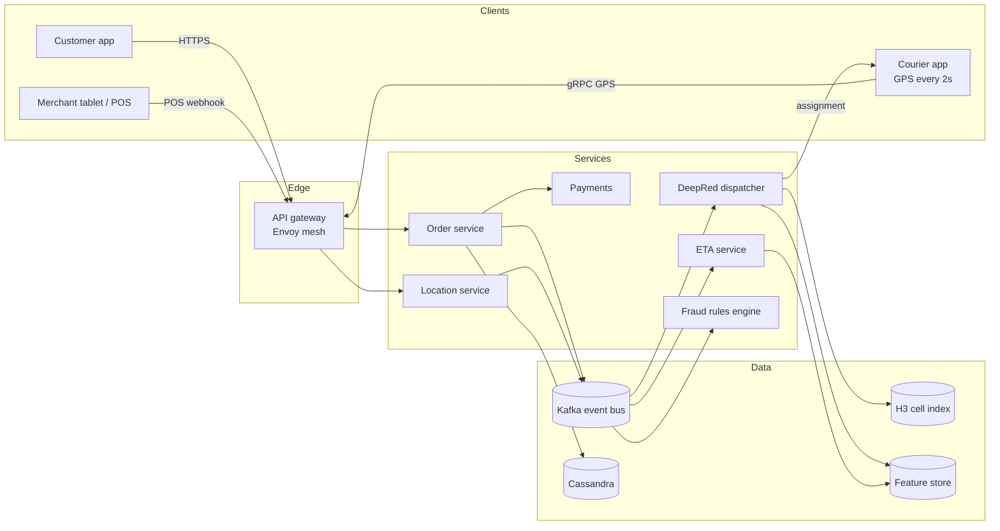
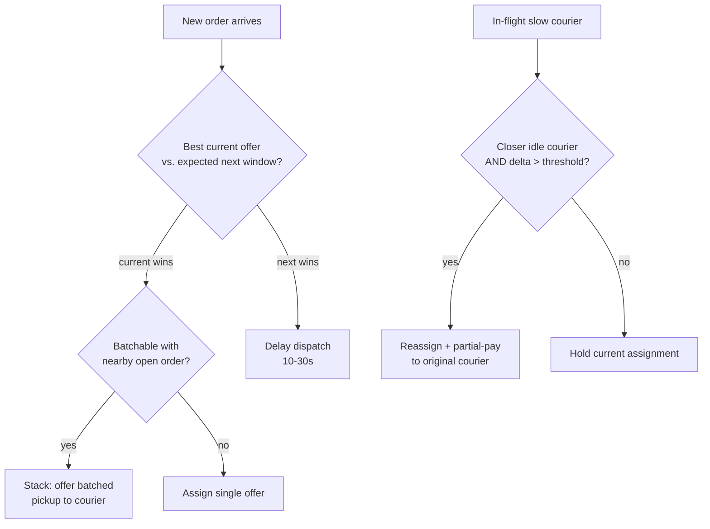
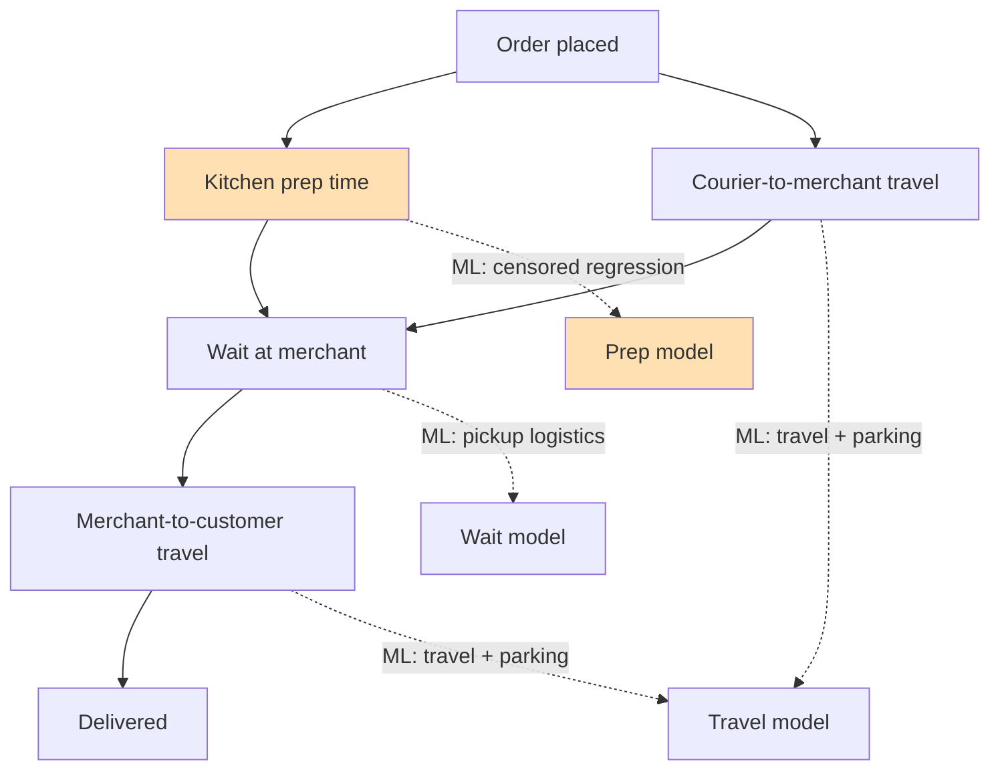
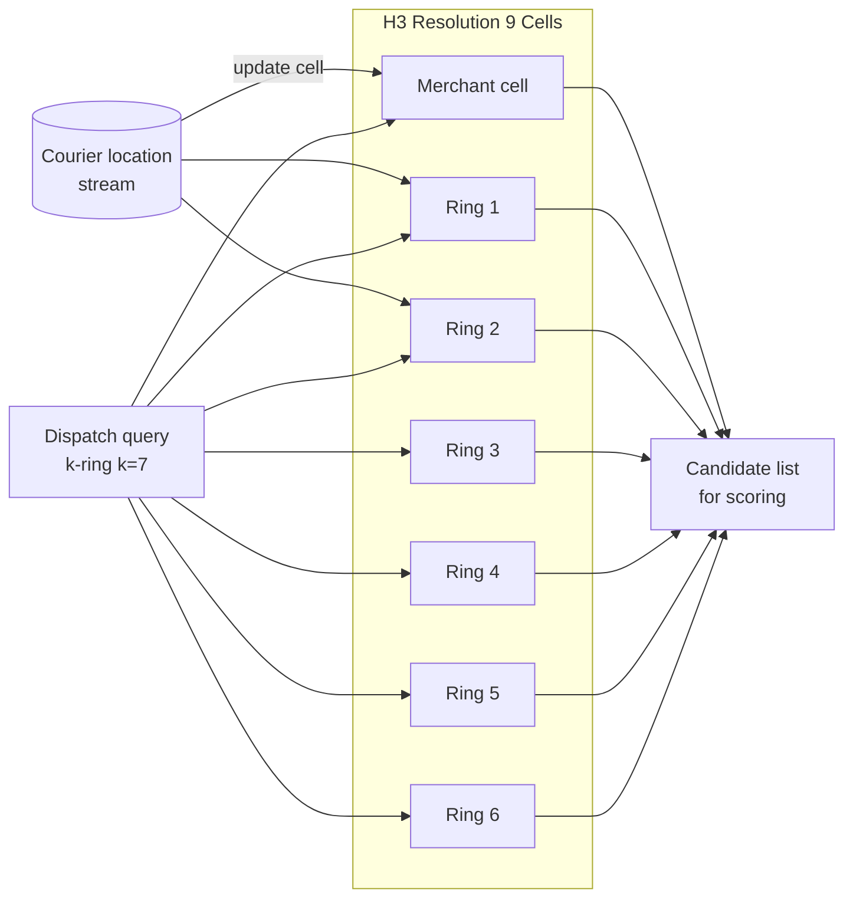

# Design a Food Delivery Service (DoorDash / Swiggy)

> **TL;DR.** Food delivery is ride-hailing with an extra party and a freshness clock. DoorDash processes over 2 billion orders annually [^1] across 1,000+ microservices handling 80M+ requests/sec at peak [^2]. The pivotal difference from ride-hailing: a three-sided marketplace (customer, merchant, courier) where the dispatch algorithm must batch orders, predict kitchen prep time, and coordinate a state machine across three independent mobile apps. The key trade-off is buffered batch dispatch (10 to 30 seconds of added assignment latency) versus greedy FCFS, with documented 15 to 30% efficiency gains in dense markets [^3].

## Learning Objectives

- [ ] Design a dispatch algorithm that buffers orders and solves a bipartite matching problem with batching constraints
- [ ] Decompose delivery ETA into four independently-modeled components and explain why kitchen prep is the hardest
- [ ] Justify H3 hexagonal indexing at resolution 9 for candidate retrieval and batching locality
- [ ] Coordinate a three-sided marketplace state machine where every event fans out to three parties
- [ ] Reason about reassignment economics: when to yank an order from a slow driver and the legal implications
- [ ] Estimate capacity for a platform serving 2B+ orders/year with 80M+ peak RPS

## Intuition

A pizza shop with one phone line and one delivery driver is trivial. The customer calls, the cook starts, the driver waits, the driver delivers. Now scale to 50 restaurants, 20 drivers, and 200 concurrent orders in a 5 km radius at dinner rush.

The naive approach assigns each order to the nearest idle driver the moment it arrives. This is greedy FCFS. It works at low volume. At dinner rush it collapses: Driver A is dispatched to Restaurant X across town while Driver B (who is finishing a drop-off 100 meters from Restaurant X) goes idle 30 seconds later. Meanwhile, Restaurant Y has two orders ready at the same time, but the system sent two different drivers instead of batching both pickups onto one.

The insight that unlocks the design: **hold orders in a buffer for 10 to 30 seconds, then solve a global assignment across all pending orders and available drivers simultaneously.** This is not a ride-hailing problem with a restaurant bolted on. The food has a freshness clock. The merchant controls prep time, which the platform observes only indirectly. And every failure has three blast radii: customer, merchant, and courier.

[Design a Ride-Hailing Service (Uber / Lyft)](./12-ride-hailing.md) covers the two-sided matching baseline. This chapter adds the third side, the prep-time constraint, and the batching dimension that makes food delivery architecturally distinct.

## Requirements

### Clarifying Questions

- **Q: How many sides does the marketplace have?**
  Assume: Three. Customer orders, merchant prepares, courier (Dasher) delivers. Each has a dedicated app/tablet.
- **Q: Do we support batched (stacked) deliveries?**
  Assume: Yes. A courier can carry two orders from the same or nearby restaurants on one trip.
- **Q: What is the dispatch latency budget?**
  Assume: 10 to 30 second buffer window for batch optimization; p99 under 2 seconds for the solver itself.
- **Q: Do we integrate with restaurant POS systems?**
  Assume: Yes. ~75% of marketplace orders flow through a POS integration (Toast, Square, NCR) [^4].
- **Q: What consistency model for order state?**
  Assume: Strong consistency for state transitions (Kafka ordering per order_id); eventual for location updates.
- **Q: Multi-region?**
  Assume: Per-region dispatcher processes to keep state bounded. No cross-region dispatch.

### Functional Requirements

- Customer places an order; system returns a composite ETA (prep + travel) before checkout.
- Dispatcher assigns a courier (possibly batched with another order) within the buffer window.
- Merchant receives the order on tablet/POS and marks "food ready" when prep completes.
- Courier receives navigation, picks up, and delivers with photo confirmation for contactless drop-off.
- All three parties see real-time state transitions (placed, prepping, picked up, en route, delivered).

### Non-Functional Requirements

- **Load:** 2B+ orders/year [^1]; peak ~20K orders/minute at dinner rush; 80M+ RPS system-wide [^2].
- **Latency:** Composite ETA prediction p99 < 200 ms; dispatch solver p99 < 2s per window.
- **Availability:** 99.9% for the order path. Degraded mode (greedy fallback) rather than refusal.
- **Consistency:** Per-order event ordering via Kafka partition key; eventual for courier GPS.
- **Durability:** Order records survive any single-AZ failure.

## Capacity Estimation

| Metric | Value | Derivation |
|--------|------:|------------|
| Orders/year | 2B+ | DoorDash 2024 [^1] |
| Orders/day (avg) | ~5.5M | 2B / 365 |
| Peak orders/min | ~20K | 3.6x average at dinner rush |
| Courier GPS updates/sec | ~250K | 500K active couriers / 2s interval |
| Kafka throughput | 80M+ RPS | DoorDash peak system-wide [^2] |
| Order record size | ~1.5 KB | Cart items + addresses + metadata |
| Daily storage | ~8.2 GB | 5.5M x 1.5 KB |
| 5-year storage | ~15 TB | 8.2 GB x 365 x 5 |
| ETA predictions/sec | ~100K | Every order + periodic refresh |

**Key ratios:**

- Write amplification: each order state transition fans out to 3 apps + 5 downstream services = 8x event amplification.
- POS integration coverage: ~75% of orders get ground-truth "food ready" timestamps [^4].
- Batch rate in dense markets: ~30% of deliveries are stacked (two orders per courier trip) [^3].

## API and Data Model

### API Design

```http
POST /v1/orders
  Body: { "customer_id": "uuid", "restaurant_id": "uuid", "items": [...], "address": {...} }
  Returns: 201 { "order_id": "uuid", "eta_minutes": 32, "status": "placed" }

GET /v1/orders/{order_id}
  Returns: 200 { "status": "en_route", "courier": {...}, "eta_updated": 28 }

POST /v1/orders/{order_id}/ready
  (Merchant POS webhook)
  Returns: 204

POST /v1/couriers/{id}/location
  Body: { "lat": 37.7749, "lng": -122.4194, "heading": 180, "speed_mps": 5.2 }
  Returns: 204

POST /v1/orders/{order_id}/delivered
  Body: { "photo_url": "s3://...", "signature": null }
  Idempotency-Key: <uuid>
  Returns: 200 { "status": "delivered", "tip_eligible": true }
```

Pagination on order history uses cursor-based `?before=<order_id>&limit=50`. Rate limiting: 1 location update per 2 seconds per courier (server-side dedup).

### Data Model

```sql
-- Order store (Cassandra, partitioned by order_id)
table orders (
  order_id        uuid PRIMARY KEY,
  customer_id     uuid,
  restaurant_id   uuid,
  courier_id      uuid,
  status          enum(placed, accepted, prepping, ready, picked_up, en_route, delivered, cancelled),
  items           json,
  pickup_cell     bigint,       -- H3 res 9
  dropoff_cell    bigint,       -- H3 res 9
  eta_seconds     int,
  created_at      timestamp,
  delivered_at    timestamp
)

-- Courier location (in-memory geo index, backed by Kafka)
table courier_locations (
  courier_id      uuid,
  cell_id         bigint,       -- H3 res 9
  lat             double,
  lng             double,
  heading         smallint,
  speed_mps       float,
  updated_at      timestamp,
  partition_key:  cell_id
)

-- Restaurant catalog (Elasticsearch for search + Redis for hot menu cache)
table restaurants (
  restaurant_id   uuid PRIMARY KEY,
  name            text,
  cuisine_tags    list<text>,
  h3_cell         bigint,
  avg_prep_min    float,
  pos_integrated  boolean
)
```

## High-Level Architecture



*Every order event fans out from Kafka to three apps plus dispatch, ETA, payments, and fraud; this write amplification is why a single shared-service failure (payments, notifications) cascades to all three marketplace sides.*

**Write path:** Customer places an order via the API gateway. The order service persists to Cassandra, publishes an `order.placed` event to Kafka (partitioned by `order_id`), and returns the pre-computed ETA. The dispatcher consumes the event and buffers it for the next matching window.

**Read path:** Courier app receives push notifications for offers. Customer app polls or subscribes (WebSocket) for state transitions. Merchant tablet receives the order via POS integration or Kafka consumer.

**Async path:** The dispatcher runs a matching window every 10 to 30 seconds. It queries the H3 cell index for nearby couriers, scores candidates via the ETA service and ML models, solves the assignment, and pushes offers to selected couriers.

## Deep Dives

### Dispatch algorithm: buffered batch matching (DeepRed)

The dispatcher is not a simple nearest-driver lookup. DoorDash's DeepRed has three layers [^3]. Uber Eats frames the same tension: dispatch too early and the courier waits while food is prepared; dispatch too late and the food goes cold [^5].

**Layer 1: Candidate generation.** For each new order, find couriers within a k-ring of 7 cells at H3 resolution 9 (~1 to 1.5 km radius). Also find other open orders at the same or nearby restaurants that could be batched onto one courier trip.

**Layer 2: ML scoring.** For each (order, courier) candidate pair, run four models: prep-time prediction, travel-time prediction (including parking), courier acceptance probability, and a variance estimator. The scoring function trades off delivery speed against courier efficiency and explicitly penalizes high-variance stacked routes [^3].

**Layer 3: MIP optimization.** Score all candidate pairs across the buffer window and solve a mixed-integer program (Gurobi) that maximizes total marketplace utility. The solver considers single offers, batched (stacked) offers, and strategic delay (wait for a better courier about to free up) [^3].



*DeepRed picks among four actions each window; the non-FCFS decisions (delay, stack, reassign) produce marketplace-level efficiency gains but add complexity and legal risk around courier compensation.*

**Reassignment and stacking trade-offs.** Stacking works well in dense urban grids: a courier picking up Order A at Restaurant X can detour to pick up Order B at nearby Restaurant Y. DoorDash frames this as "slightly delaying delivery time to help Dashers get more earning opportunities" [^3]. Reassignment is more contentious: yanking an order from a slow courier cuts their earnings. The $16.75M NY AG settlement over tip withholding [^6] shows that opaque pay manipulation invites regulatory action. Constrain reassignment to cases where the original courier is clearly delayed (N standard deviations beyond predicted travel) and pay a partial-trip fee.

### Composite ETA: kitchen + driver + wait + road

The customer-facing ETA is a sum of four components, each with its own model [^1]:

1. **Kitchen prep time** (hardest: partially observable)
2. **Courier travel to merchant** (routing + parking)
3. **Wait at merchant** (pickup logistics)
4. **Merchant to customer** (routing + parking at drop-off)



*Breaking ETA into four components lets each term be improved in isolation; kitchen prep (orange) is partially observable and is the single largest error source.*

**Why kitchen prep is hard.** The platform only observes "courier arrived" and "courier picked up." If the courier arrived at minute 10 and food was ready at minute 5, the true prep was 5 minutes, not 10. The label is right-censored. DoorDash applies censored regression so that arrival time is treated as a lower bound, not a ground-truth label [^7].

**The 2024 MoE architecture.** DoorDash's production ETA uses an MLP-gated mixture-of-experts with three parallel encoders (DeepNet, CrossNet, transformer on 5-minute rolling time-series features). It models delivery duration as a Weibull distribution fit via interval regression, delivering a 20% relative accuracy improvement over their tree-based baseline [^1]. For long-tail events specifically, an asymmetric MSE loss (where late is penalized more than early) improved on-time percentage by 10% [^8].

**Multitask learning for consistency.** Customers see an ETA on the store card (explore stage) and again at checkout. Different models trained on different data produced inconsistent estimates, eroding trust. DoorDash fixed this with sequential multitask training: train the checkout task first, freeze shared parameters, then fine-tune the explore-stage head [^1].

### Geospatial indexing: H3 for candidate retrieval

[Geospatial Indexing](../part-2-building-blocks/14-geospatial-indexing.md) covers H3 vs. S2 vs. geohash in depth. For food delivery dispatch, DoorDash chose H3 resolution 9 (~0.1 km^2 cells, ~201 m average edge length) as "the empirical optimal balance between computational complexity and approximation effectiveness" [^9].

**Why H3 over S2 or geohash.** Hexagons approximate a circle better than squares, which matches delivery radius semantics. H3 has a single neighbor class (6 equidistant neighbors), simplifying k-ring expansion for candidate retrieval. S2's square cells have two neighbor classes (edge vs. corner), distorting uniform radius queries [^10].

**Content discovery optimization.** Beyond dispatch, DoorDash uses H3 to group stores by hex for campaign lookups. Instead of fanning out per-store, they fetch campaigns per hex, reducing fan-out 200x in dense markets and 500x in non-dense areas, saving ~50% on Cassandra/Redis cost and ~75% on Kubernetes hosting [^9].



*At H3 resolution 9, the merchant cell plus a k-ring of 7 neighbors covers roughly 1 to 1.5 km, the typical urban dispatch radius; batching candidates naturally colocate within this ring.*

## Real-World Example

**DoorDash, FY2024 to FY2025: 2B+ orders/year, $10.72B revenue, 60.7% US market share.**

DoorDash finished FY2024 with $10.72B revenue (up 24% YoY), enabling ~$60B in merchant sales and $18B+ in Dasher earnings [^11]. FY2025 accelerated further: Q4 alone hit 903M total orders (up 32% YoY) and $4.0B revenue (up 38%), with full-year revenue reaching $13.7B [^12]. US market share reached 60.7% by December 2024 per Earnest Analytics card-panel data [^13]. More than 8 million people dashed in 2024 alone [^14].

**Infrastructure at scale.** DoorDash runs 1,000+ microservices on ~2,000 Kubernetes nodes behind a custom Envoy-based service mesh [^2]. The mesh was built by approximately 2 engineers in 3 months after a 2021 retry-storm outage cascaded the entire platform for over two hours [^2]. They rejected Istio for operational burden and Linkerd2 for feature gaps, building a custom xDS control plane on Envoy with adaptive concurrency and outlier detection.

**Experimentation under network effects.** Classical A/B testing fails on a marketplace because units interact (a courier in treatment taking an order means a courier in control cannot). DoorDash uses switchback testing: randomize regional-time units ("Manhattan, Thursday 12:00-12:30") rather than users. They run numerous concurrent switchback experiments [^15].

**POS integration as a moat.** Roughly three in four restaurant orders on DoorDash Marketplace flow through a POS integration (Toast, Square, NCR, Checkmate, Otter, Deliverect) [^4]. Toast's bi-directional integration delivers DoorDash orders directly into the restaurant's existing tablet workflow [^16]. This gives the prep-time model ground-truth "food ready" timestamps, a strategic advantage over platforms relying solely on manual tablet taps.

## Design decisions

| Decision axis | Approach | Pros | Cons | When to Use |
|---|---|---|---|---|
| Dispatch strategy | FCFS dispatch | Simple, fair-feeling, low latency | Globally wasteful; long-tail lateness rises | Low-volume markets, early-stage |
| Dispatch strategy | Buffered batch dispatch | 15-30% efficiency gain [^3] | 10-30s added assignment latency | Dense urban markets at scale |
| Dispatch strategy | Stacked (batched) delivery | Courier earnings up, marginal cost down | Customer ETA risk; communication complexity | Dense areas with high order overlap |
| Reassignment policy | No reassignment | Simple contract with courier | Stranded orders when courier is slow | Small markets with low reliability risk |
| Reassignment policy | Aggressive reassignment | Best customer outcome on long-tail | Courier pay disputes; regulatory risk [^6] | Large markets with clear compensation policy |
| ETA model | Single end-to-end ETA model | One pipeline to maintain | Opaque errors by component; bad drift signal | Early-stage, pre-POS integration |
| ETA model | Composite ETA (kitchen + road) | Explainable; targeted improvements [^1] | More pipelines, more models, more on-call | Mature production at scale |
| Prep-time model | Static prep time by cuisine | Easy to implement | Wrong at peak hours for popular restaurants | Baseline fallback for new merchants |
| Prep-time model | Dynamic prep from POS signals | Accurate when instrumented [^4] | Requires Toast/Square/NCR integration | Partner restaurants with integration depth |
| Geospatial index | H3 | Hex approximates circle; single neighbor class [^9] | 12 pentagons per resolution; approximate containment | Proximity matching + radius queries |
| Geospatial index | S2 | Exact containment; Google-scale tested | Two neighbor classes; coarser per level | Parcel/polygon containment use-cases |

The single biggest meta-decision: **greedy vs. buffered dispatch.** Greedy is correct for sparse markets (rural, late night) where the next order may not arrive for minutes. Buffered is correct for dense markets where 50 orders arrive in the same 30-second window. Production systems run both and switch based on real-time density signals per H3 cell.

## Scaling and Failure Modes

**At 10x load (20B orders/year):** The dispatcher's MIP solver becomes the bottleneck. Gurobi solve time scales poorly with candidate count. Mitigation: sub-shard dispatch by H3 super-cell (resolution 7); run independent solver instances per shard; use ruin-and-recreate heuristics instead of exact MIP for the largest windows [^3].

**At 100x load (200B orders/year):** Kafka partitions by order_id become insufficient for the event fan-out. Mitigation: tiered Kafka clusters per metro; edge-local dispatch that only escalates to regional when local supply is exhausted; pre-computed routing tables cached at the cell level.

**At 1000x load:** The architecture shifts to fully edge-local dispatch with gossip-based supply sharing between adjacent cells. The central platform becomes settlement and analytics only.

**Failure modes:**

- **Retry storm cascade (documented).** DoorDash's mid-2021 outage: payment service latency spiked, every upstream service retried, cascading failure across 1,000+ microservices for 2+ hours [^2]. Fix: Envoy service mesh with adaptive concurrency and outlier detection.
- **System-wide outage (documented).** May 12, 2022: 3.5-hour outage where couriers could not accept deliveries, customers could not order, and merchants prepped food that went undelivered [^17]. DoorDash refunded customers, paid merchants for cancelled orders, and removed low-star courier ratings from the window.
- **Data breach.** 2019: 4.9M customers, couriers, and merchants had data stolen including 100,000 driver-license numbers via a third-party provider [^18]. 2022: an undisclosed number of customer records exposed through Twilio/Oktapus phishing (DoorDash said "a small percentage" of users were affected) [^19].

## Common Pitfalls

> [!WARNING]
> **Treating food delivery as ride-hailing with a restaurant.** The third side (merchant) controls prep time, which is the largest ETA error source. Ignoring it produces a system that dispatches couriers too early (they wait) or too late (food goes cold).

> [!WARNING]
> **Retry storms on shared services.** A three-sided marketplace means every shared dependency (payments, notifications, location) has 3x the upstream callers. Without a service mesh with adaptive concurrency, a single slow service takes down the entire platform [^2].

> [!WARNING]
> **Opaque reassignment logic.** Yanking orders from couriers without transparent compensation invites regulatory action. The $16.75M NY AG settlement [^6] is the template. Disclose reassignment policy; pay partial-trip fees; cap reassignments per courier per day.

> [!WARNING]
> **Kitchen prep underestimation.** Prep-time labels are right-censored (platform sees courier arrival, not food-ready time). Training on arrival-equals-ready pollutes the model. Use censored regression [^7] and POS integration for ground-truth timestamps.

> [!WARNING]
> **ETA inconsistency between browse and checkout.** Different models for explore vs. checkout produce different estimates. Trust collapses when the ETA jumps 15 minutes at checkout. Fix with multitask learning and shared embeddings [^1].

> [!WARNING]
> **Network-effect-contaminated A/B tests.** Splitting couriers into treatment/control in one city biases results because units interact on the marketplace. Use switchback testing (randomize regional-time units) [^15].

## Follow-up Questions

**1. How do you handle ghost kitchens and virtual brands?**

A ghost kitchen is a physical location hosting multiple virtual restaurant brands. Model it as one `kitchen_id` with multiple `restaurant_id` entries sharing prep capacity. The dispatch system batches orders across virtual brands at the same kitchen since pickup is identical. Menu CMS supports brand-specific imagery served via CDN.

**2. How do you implement surge pricing (peak pay) for couriers?**

Compute supply/demand ratio per H3 resolution-7 cell with EMA smoothing. When demand exceeds supply by a threshold, offer "peak pay" bonus to couriers entering the zone. Cap the bonus and damp the feedback loop to prevent oscillation. This is the courier-side analog of rider surge in [Design a Ride-Hailing Service (Uber / Lyft)](./12-ride-hailing.md).

**3. How do you prevent refund abuse and fake-delivery fraud?**

Photo confirmation at drop-off (computer vision validates address match). Courier identity re-verification via real-time selfie compared to government ID; over 100,000 couriers re-verify weekly [^20]. Real-time fraud rules engine at ingress for allow/restrict/step-up decisions [^21]. Velocity checks on merchant self-service onboarding to catch fake merchants.

**4. How do you handle tipping flows and tip-based gaming?**

Tips are shown to couriers pre-delivery (incentivizes acceptance) but settled post-delivery (allows customer adjustment). Pre-delivery tip visibility lets couriers cherry-pick high-tip orders; mitigate by incorporating tip into the scoring function so low-tip orders still get assigned via base-pay boost. Never withhold tips from couriers (the $16.75M settlement lesson [^6]).

**5. How would you support 10-minute delivery (quick commerce)?**

Replace restaurant prep with dark-store fulfillment (urban micro-warehouses with no walk-in). Prep-to-pickup compresses from ~20 minutes to under 5 minutes. Pre-position couriers at dark-store clusters. Swiggy operates across 700+ Indian cities for food delivery, with Instamart's quick-commerce dark-store model available in major metros [^22]. The dispatch algorithm is the same but with tighter time constraints and pre-staged inventory.

**6. How do you run experiments on a three-sided marketplace?**

Switchback testing. Randomize regional-time units ("Bengaluru South, Tuesday 18:00-18:30") rather than individual users or orders. DoorDash runs multiple concurrent switchback experiments with cluster-robust standard errors and post-hoc regression for variance reduction [^15].

## Exercise

### Exercise 1: Stacked order flow

A courier picks up Order A at Restaurant X. While at the restaurant, the system identifies Order B at Restaurant Y (200 meters away) with a customer drop-off 500 meters from Order A's customer. Design the stacked-order flow: specify the constraints (how close is "nearby," how much delay to Order A is acceptable), the pricing adjustment (extra pay for the second stop), and the customer communication (Order A's ETA now depends on Order B).

<details>
<summary>Hint</summary>

Think about three constraints: (1) maximum added delay to Order A's customer (e.g., 8 minutes), (2) maximum detour distance for the courier (e.g., 1 km), and (3) the courier's right to decline the stack. The scoring function must compare the batched utility against the single-order baseline.

</details>

<details>
<summary>Solution</summary>

**Constraints:** Restaurant Y must be within k-ring k=3 of Restaurant X at H3 res 9 (~500 m). The predicted added delay to Order A's customer must be under 8 minutes. Order B's food must be ready within 5 minutes of Order A's pickup (otherwise the courier waits too long).

**Scoring:** The dispatcher compares `utility(A_single) + utility(B_single)` against `utility(A_stacked) + utility(B_stacked)`. Stacking wins when the shared pickup/drop-off proximity saves more courier-minutes than the added delay costs in customer satisfaction.

**Pricing:** The courier receives base pay for both orders plus a stacking bonus (e.g., $2 to $4). The customer for Order A sees "Your courier is picking up a nearby order" with an updated ETA. Transparency matters: hiding the stack erodes trust.

**Decline handling:** If the courier declines the stack, Order B goes back into the dispatch buffer for the next window. The system does not penalize the courier for declining.

**Trade-off accepted:** Order A's customer gets a slightly longer delivery (3 to 8 minutes). In exchange, the courier earns more, the platform's marginal cost drops, and Order B gets a faster assignment than waiting for a new courier.

</details>

## Key Takeaways

- **Three-sided marketplaces cost more than two-sided ones.** Every event fans out to three parties, and every failure has three blast radii. Design for 8x write amplification per state transition.
- **Buffered batch dispatch beats FCFS above a density threshold.** Hold orders 10 to 30 seconds; solve globally. The efficiency gain is 15 to 30% in dense markets [^3].
- **Kitchen prep is the hardest ETA component.** It is partially observable, right-censored in training data, and the largest error source. POS integration is a strategic moat [^4].
- **H3 resolution 9 is the production choice for delivery dispatch.** ~0.1 km^2 cells match urban block granularity; k-ring expansion gives O(k^2) candidate retrieval [^9].
- **Reassignment is a product feature that tests your legal guardrails.** Transparent compensation policy and regulatory compliance are as important as the optimization math [^6].
- **Service mesh is not optional at marketplace scale.** A single retry storm on a shared service cascades to all three sides. Adaptive concurrency and outlier detection are table stakes [^2].

## Further Reading

- [DoorDash: Using ML and Optimization to Solve DoorDash's Dispatch Problem](https://doordash.engineering/2021/08/17/using-ml-and-optimization-to-solve-doordashs-dispatch-problem/). The canonical three-layer DeepRed writeup; every paragraph maps to a design decision in this chapter.
- [DoorDash: Deep Learning for Smarter ETA Predictions](https://careersatdoordash.com/blog/deep-learning-for-smarter-eta-predictions/). The 2024 MLP-gated MoE architecture with Weibull outputs and multitask learning; the best public description of composite ETA at scale.
- [DoorDash: Taming Content Discovery with Hexagons and Elasticsearch](https://doordash.engineering/2022/06/28/taming-content-discovery-scaling-challenges-with-hexagons-and-elasticsearch/). H3 resolution 9 in production with measured 200-500x fan-out reduction; directly applicable to dispatch candidate retrieval.
- [DoorDash: Improving ETA Prediction Accuracy for Long-tail Events](https://doordash.engineering/2021/04/28/improving-eta-prediction-accuracy-for-long-tail-events/). Asymmetric MSE loss and long-tail handling; read before attempting any ETA system that must be honest about worst-case delivery times.
- [How DoorDash Moved to a Service Mesh](https://blog.bytebytego.com/p/how-doordash-moved-to-a-service-mesh). The 2021 outage-driven Envoy migration at 80M+ RPS; a case study in why service mesh matters for three-sided platforms.
- [DoorDash: Switchback Tests Under Network Effects](https://careersatdoordash.com/blog/switchback-tests-and-randomized-experimentation-under-network-effects-at-doordash/). Why A/B fails on a marketplace and what to do instead; essential reading for any marketplace experimentation.
- [Uber Eats: Trip Inferences and Machine Learning](https://www.uber.com/en-GB/blog/uber-eats-trip-optimization/). The trip state model and pickup-dispatch optimization from Uber's perspective; useful contrast with DoorDash's approach.
- [H3 Documentation](https://h3geo.org/). The H3 library itself; resolution tables and k-ring API reference for implementation.

## Flashcards

<details>
<summary><strong>Q: What are the three layers of DoorDash's DeepRed dispatch system?</strong></summary>

A: (1) Candidate generation via H3 k-ring expansion, (2) ML scoring (prep time, travel time, acceptance probability, variance), (3) MIP optimization via Gurobi that considers single, batched, and delayed offers.

</details>

<details>
<summary><strong>Q: What are the four components of a composite delivery ETA?</strong></summary>

A: Kitchen prep time, courier travel to merchant, wait at merchant (pickup logistics), and merchant-to-customer travel. Each is modeled independently; kitchen prep is the hardest because it is partially observable.

</details>

<details>
<summary><strong>Q: Why is kitchen prep time right-censored in training data?</strong></summary>

A: The platform observes "courier arrived" and "courier picked up" but not "food ready." If the courier arrives after food is ready, the observed arrival time is a lower bound on true prep time, not the actual label. Censored regression treats it as a bound.

</details>

<details>
<summary><strong>Q: What H3 resolution does DoorDash use for dispatch, and why?</strong></summary>

A: Resolution 9 (~0.1 km^2, ~201 m average edge length). It matches urban block granularity, provides efficient k-ring expansion for candidate retrieval, and was empirically validated as the optimal balance between computational complexity and approximation effectiveness.

</details>

<details>
<summary><strong>Q: How does buffered batch dispatch differ from greedy FCFS?</strong></summary>

A: FCFS assigns the nearest courier immediately on order arrival. Buffered batch holds orders for 10 to 30 seconds, then solves a global assignment (MIP) across all pending orders and available couriers simultaneously, capturing 15-30% efficiency gains in dense markets.

</details>

<details>
<summary><strong>Q: Why does a three-sided marketplace amplify failure blast radius?</strong></summary>

A: Every order state transition fans out to customer app, courier app, and merchant tablet plus downstream services. A shared dependency failure (payments, notifications) cascades to all three parties simultaneously, as demonstrated by DoorDash's 2021 retry-storm outage.

</details>

<details>
<summary><strong>Q: What is switchback testing and why is it needed for marketplace experiments?</strong></summary>

A: Switchback testing randomizes regional-time units (e.g., "Manhattan, Thursday 12:00-12:30") rather than individual users. It is needed because marketplace units interact: a courier in treatment taking an order prevents a courier in control from taking it, biasing classical A/B estimates.

</details>

<details>
<summary><strong>Q: How does DoorDash's H3-based content discovery reduce infrastructure cost?</strong></summary>

A: By grouping stores by H3 hex and fetching campaigns per hex instead of per store, DoorDash reduced fan-out 200x in dense markets and 500x in non-dense areas, saving ~50% on Cassandra/Redis cost and ~75% on Kubernetes hosting.

</details>

<details>
<summary><strong>Q: What caused DoorDash's 2021 platform-wide outage?</strong></summary>

A: A payment service latency spike caused every upstream service to retry aggressively. Without a shared service mesh, per-team retry policies multiplied load across 1,000+ microservices, cascading the entire platform for 2+ hours. The fix was a custom Envoy-based service mesh with adaptive concurrency.

</details>

<details>
<summary><strong>Q: What is the legal risk of aggressive order reassignment?</strong></summary>

A: Reassignment cuts courier earnings on accepted orders. At scale this resembles pay manipulation, inviting regulatory action. DoorDash's $16.75M NY AG settlement over tip withholding is the template. Mitigate with transparent policy, partial-trip fees, and per-courier caps.

</details>

## References

[^1]: DoorDash Engineering, "Precision in Motion: Deep learning for smarter ETA predictions", 2024-10-01. https://careersatdoordash.com/blog/deep-learning-for-smarter-eta-predictions/

[^2]: ByteByteGo (summarizing DoorDash engineering), "How DoorDash Moved to a Service Mesh to Handle 80M Requests/Second", 2025-12-05. https://blog.bytebytego.com/p/how-doordash-moved-to-a-service-mesh

[^3]: Weinstein, A. (DoorDash Engineering), "Using ML and Optimization to Solve DoorDash's Dispatch Problem", 2021-08-17. https://doordash.engineering/2021/08/17/using-ml-and-optimization-to-solve-doordashs-dispatch-problem/

[^4]: DoorDash Merchant Learning Center, "Toast Integration with DoorDash". https://merchants.doordash.com/en-us/learning-center/toast-integration

[^5]: Uber Engineering, "How Trip Inferences and Machine Learning Optimize Delivery Times on Uber Eats", 2018. https://www.uber.com/en-GB/blog/uber-eats-trip-optimization/

[^6]: New York Attorney General Letitia James, "Attorney General James Secures $16.75 Million from DoorDash for Cheating Delivery Workers Out of Tips", 2025-02-24. https://ag.ny.gov/press-release/2025/attorney-general-james-secures-1675-million-doordash-cheating-delivery-workers

[^7]: DoorDash Engineering, "Solving for Unobserved Data in a Regression Model", 2020-10-14. https://doordash.engineering/2020/10/14/solving-for-unobserved-data-in-a-regression-model/

[^8]: Lu, D. and Parekh, P. (DoorDash Engineering), "Improving ETA Prediction Accuracy for Long-tail Events", 2021-04-28. https://doordash.engineering/2021/04/28/improving-eta-prediction-accuracy-for-long-tail-events/

[^9]: Gulecha, U. (DoorDash Engineering), "Taming Content Discovery Scaling Challenges with Hexagons and Elasticsearch", 2022-06-28. https://doordash.engineering/2022/06/28/taming-content-discovery-scaling-challenges-with-hexagons-and-elasticsearch/

[^10]: H3 Documentation, "Introduction to H3". https://h3geo.org/docs/

[^11]: DoorDash, "DoorDash Releases Fourth Quarter and Full Year 2024 Financial Results", 2025-02-11. https://ir.doordash.com/news/news-details/2025/DoorDash-Releases-Fourth-Quarter-and-Full-Year-2024-Financial-Results/default.aspx

[^12]: DoorDash, "DoorDash Releases Fourth Quarter and Full Year 2025 Financial Results", 2026-02-18. https://ir.doordash.com/news/news-details/2026/DoorDash-Releases-Fourth-Quarter-and-Full-Year-2025-Financial-Results/default.aspx

[^13]: Earnest Analytics, "DoorDash leads US delivery share but some cities still competitive", 2024 Dec data. https://www.earnestanalytics.com/insights/doordash-leads-us-delivery-share-but-some-cities-still-competitive

[^14]: DoorDash, "How DoorDash is Different", 2024-12. https://about.doordash.com/en-us/news/how-doordash-is-different

[^15]: Weinstein (DoorDash Engineering), "Switchback Tests and Randomized Experimentation Under Network Effects at DoorDash", 2018-02-13. https://careersatdoordash.com/blog/switchback-tests-and-randomized-experimentation-under-network-effects-at-doordash/

[^16]: Toast Support, "Get Started With the DoorDash Integration". https://support.toasttab.com/en/article/Getting-Started-DoorDash-Integration

[^17]: DoorDash Engineering, "DoorDash's May 12th Outage", 2022-05-13. https://careers.doordash.com/es/blog/doordashs-may-12th-outage/

[^18]: Whittaker, Z., "DoorDash confirms data breach affected 4.9 million customers, workers and merchants", TechCrunch, 2019-09-26. https://techcrunch.com/2019/09/26/doordash-data-breach

[^19]: TechCrunch, "DoorDash hit by data breach linked to Twilio hackers", 2022-08-25. https://techcrunch.com/2022/08/25/doordash-customer-data-breach-twilio/

[^20]: DoorDash, "Our Commitment to Maintaining a Safe and Trusted Platform", 2024-04. https://about.doordash.com/en-us/news/our-commitment-to-maintaining-a-safe-and-trusted-platform

[^21]: DoorDash Engineering, "Fighting Fraud at Scale: Insights from building a real-time rules engine", 2025-12. https://careersatdoordash.com/blog/doordash-fraud-insights-from-building-a-real-time-rules-engine/

[^22]: CanvasBusinessModel, "How Does Swiggy Company Work?" (summarizing Swiggy IPO and H1 2025 operating data). https://canvasbusinessmodel.com/blogs/how-it-works/swiggy-how-it-works
