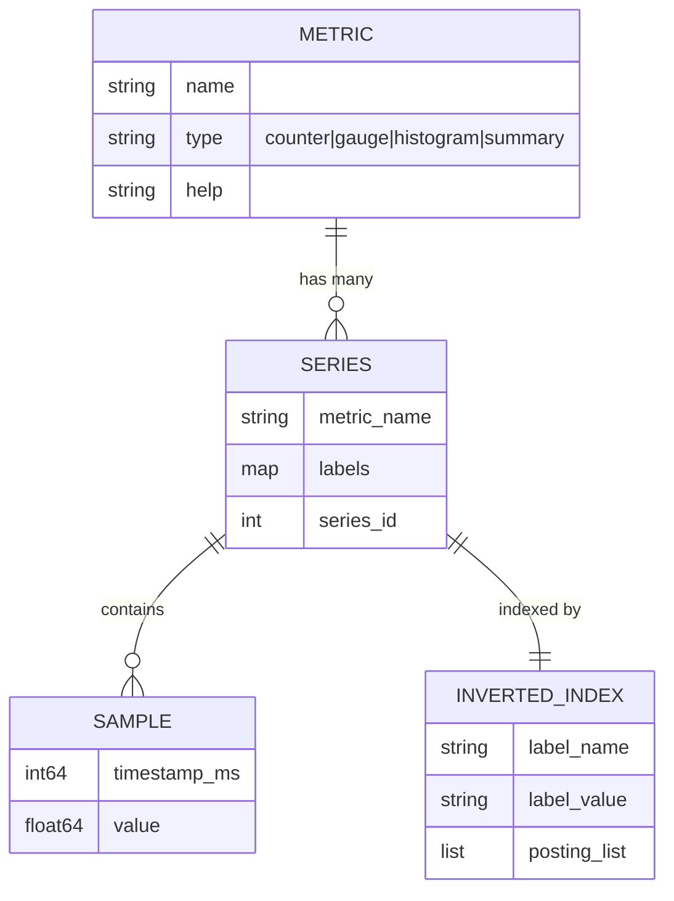
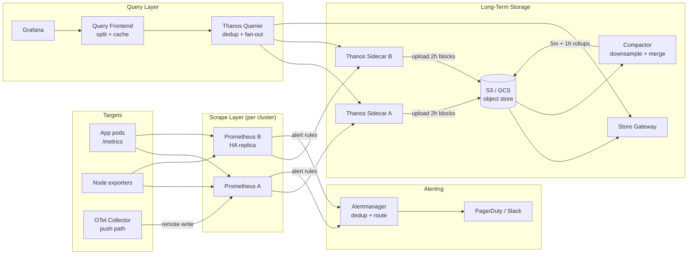
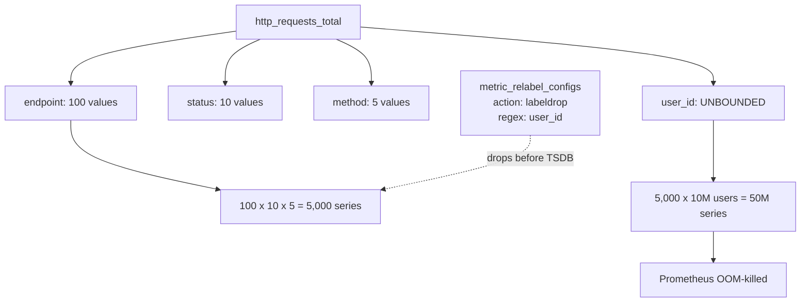
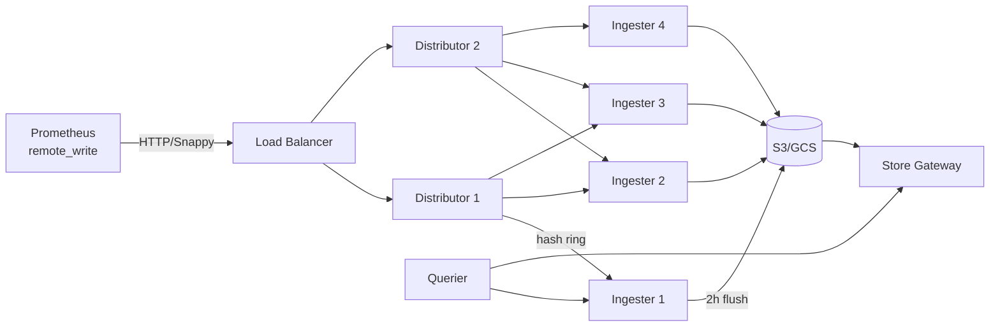

# Design a Metrics Pipeline (Prometheus / InfluxDB / Thanos)

> **TL;DR.** A metrics pipeline ingests, stores, queries, and alerts on time-series data from every service in your fleet. At 10M active series per cluster, Prometheus compresses samples to ~1.37 bytes each using Gorilla-style XOR encoding[^1], but local disk tops out at 2-4 weeks of retention. The pivotal trade-off is cardinality versus dimensionality: every unique label combination is a new series that costs memory, and a single unbounded label like `user_id` can OOM your monitoring stack during the exact incident you need it most[^2]. The architecture converges on per-cluster Prometheus for scrape, object-storage-backed long-term retention (Thanos or Mimir), tiered downsampling, and independent failure domains so the metrics pipeline survives what it observes.

## Learning Objectives

After this module, you will be able to:

- [ ] Design a pull-based metrics ingestion pipeline that handles 10M+ active series per cluster
- [ ] Identify cardinality explosion risks and implement relabel-based mitigations before they OOM Prometheus
- [ ] Justify the choice between Thanos (sidecar federation) and Cortex/Mimir (horizontal write path) for long-term storage
- [ ] Estimate capacity for a metrics pipeline using back-of-envelope math (samples/sec, bytes/sample, retention cost)
- [ ] Implement tiered downsampling (raw to 5m to 1h) and explain why it reduces storage 10-20x
- [ ] Trade off push versus pull ingestion and articulate when each model wins

## Intuition

A single Prometheus server monitoring a Kubernetes cluster looks trivial. Install the Helm chart, point Grafana at it, done. It handles 10 services fine. At 10,000 services with 50 metrics each and 20 label dimensions, you have millions of active time series, and the architecture collapses in three ways simultaneously.

First, memory. Every active series costs an in-memory head chunk plus an inverted-index entry. A careless developer adds `request_id` as a label, and your 5,000-series metric becomes a 50-million-series metric in one deploy cycle. Prometheus is OOM-killed. Your dashboards go dark during the incident you need them for[^3].

Second, retention. Raw 15-second samples for two years at 10M series is ~84 GB per day before compaction. That is 30 TB per year on local NVMe. Economically impossible, operationally fragile.

Third, survivability. If Prometheus runs in the same cluster it monitors, a cluster-wide failure takes both down. Facebook's Gorilla paper[^2] and Google SRE's monitoring chapter[^4] both identify this as a fundamental design constraint: the monitoring system must be independent infrastructure.

The insight that unlocks the design: treat the metrics pipeline as a **tiered storage system** with independent failure domains. Hot data (last 2 hours) lives in RAM for fast queries. Warm data (2 hours to 2 weeks) lives on local SSD. Cold data (weeks to years) lives in object storage at downsampled resolution. Each tier has different cost, latency, and durability characteristics. The scrape layer, the storage layer, and the query layer scale independently.

## Requirements

### Clarifying Questions

- **Q: What is the fleet size and series cardinality?**
  Assume: 10,000 scrape targets across 5 Kubernetes clusters, 10M active time series per cluster (50M total).

- **Q: What retention do we need?**
  Assume: 30 days raw (15-second resolution), 2 years downsampled (5-minute and 1-hour resolution).

- **Q: Pull or push ingestion?**
  Assume: Pull (Prometheus scrape) for long-lived services. Push (OTLP via OpenTelemetry Collector) for Lambda and batch jobs.

- **Q: Multi-tenant or single-tenant?**
  Assume: Multi-tenant. Engineering teams share infrastructure but have per-tenant cardinality caps.

- **Q: What is the alerting SLA?**
  Assume: Alert evaluation every 30 seconds on 5,000 rules. Page delivery within 60 seconds of threshold breach.

- **Q: Must the metrics pipeline survive a full cluster outage?**
  Assume: Yes. The monitoring stack runs in a dedicated failure domain, not colocated with the workloads it observes.

### Functional Requirements

- Scrape `/metrics` endpoints at configurable intervals (default 15 seconds in this design; Prometheus OSS default is 1 minute)
- Store counters, gauges, histograms, and summaries with dimensional labels[^5]
- Evaluate alerting rules and route notifications via Alertmanager
- Serve PromQL queries for dashboards with sub-second p99 for 1-hour ranges
- Downsample raw data to 5-minute and 1-hour resolution for long-range queries
- Support multi-cluster federation: query across all clusters from a single Grafana

### Non-functional Requirements

- **Ingestion:** 1M samples/sec per cluster (50M total across 5 clusters)
- **Latency:** dashboard query p99 < 1 second for 1-hour range; < 5 seconds for 30-day range
- **Availability:** 99.9% for the query path; alerting path must survive single-node failures
- **Retention:** 30 days raw, 2 years downsampled
- **Cardinality cap:** 100K series per metric per tenant; hard reject above threshold

## Capacity Estimation

| Metric | Value | Derivation |
|--------|------:|------------|
| Active series (per cluster) | 10M | 10K targets x 1,000 series/target |
| Scrape interval | 15 s | Design choice (Prometheus default is 1m) |
| Samples/sec (per cluster) | 667K | 10M / 15 |
| Bytes/sample (compressed) | 1.37 B | Gorilla XOR + delta-of-delta[^1] |
| Bytes/sample (raw) | 16 B | 8 B timestamp + 8 B float64 |
| Disk write/day (per cluster) | ~79 GB | 667K x 1.37 B x 86,400 |
| 30-day raw retention | ~2.4 TB | 79 GB x 30 |
| 5-min downsample (2 yr) | ~240 GB | 79 GB / (300/15) x 730 days |
| 1-hr downsample (2 yr) | ~20 GB | 79 GB / (3600/15) x 730 days |
| Object storage (5 clusters, 2 yr) | ~14 TB | (2.4 TB + 0.24 TB + 0.02 TB) x 5 |
| WAL segment size | 128 MB | Prometheus default[^6] |
| Block flush interval | 2 hours | Prometheus/Thanos default[^7] |

Key ratios:

- **Compression ratio:** 11.7x (16 B raw to 1.37 B compressed)[^1]
- **Downsample savings:** 20x at 5-min resolution, 240x at 1-hour resolution
- **Read:write ratio:** ~10:1 (dashboards refresh every 5-30 seconds across many users)
- **Alert evaluation cost:** 5,000 rules x 30-second interval = 167 rule evaluations/sec

## API and Data Model

### API Design

```http
GET  /api/v1/query?query=rate(http_requests_total[5m])&time=<ts>
GET  /api/v1/query_range?query=...&start=<ts>&end=<ts>&step=15s
POST /api/v1/write                    # Remote Write (Snappy-compressed Protobuf)
GET  /api/v1/labels                   # List all label names
GET  /api/v1/label/{name}/values      # List values for a label
GET  /api/v1/status/tsdb              # Cardinality stats (head series, label pairs)
POST /api/v1/admin/tsdb/delete_series # Tombstone series matching selector
```

Remote Write is the critical integration point. Prometheus scrapes locally, then pushes Snappy-compressed Protobuf batches to the long-term backend[^8]. The write payload is a list of `TimeSeries` messages, each containing labels and samples.

### Data Model

A time series is uniquely identified by its metric name plus label set:

```text
http_requests_total{method="GET", endpoint="/api/users", status="200", cluster="us-east-1"}
```

The underlying storage model (Prometheus TSDB)[^6]:

```text
./data
  01BKGV7JBM69T2G1BGBGM6KB12/     # 2-hour block
    chunks/000001                   # up to 512 MB per chunk segment
    index                           # inverted index: label -> posting list -> chunk offsets
    tombstones
    meta.json
  chunks_head/000001                # mmapped head chunks (currently writing)
  wal/                              # 128 MB WAL segments for crash recovery
    000000002
    checkpoint.00000001/
```



*Each unique label combination creates a distinct series; the inverted index maps label matchers to posting lists for fast PromQL resolution.*

## High-Level Architecture



*A Thanos-based metrics pipeline: per-cluster Prometheus pairs scrape targets, sidecars upload 2-hour blocks to object storage, the compactor produces downsampled tiers, and the querier fans out across sidecars (recent) and store gateways (historical) to serve Grafana.*

**Write path:** Prometheus scrapes targets every 15 seconds. Samples land in the WAL (crash safety), then the in-memory head block. Every 2 hours, the head flushes to an immutable on-disk block. The Thanos sidecar detects the new block and uploads it to S3/GCS[^9].

**Read path:** Grafana queries hit the Query Frontend, which splits long ranges into per-block sub-queries and caches results. The Querier fans out to sidecars (for the last 2 hours still in Prometheus) and store gateways (for historical blocks in object storage). Results are merged and deduplicated (HA pairs produce duplicate samples).

**Alert path:** Prometheus evaluates recording and alerting rules locally every 30 seconds. Firing alerts go to Alertmanager, which deduplicates across HA pairs, groups related alerts, and routes to PagerDuty or Slack.

## Deep Dives

### Cardinality control: the silent killer

Every unique combination of label values creates a new time series. A metric `http_requests_total{endpoint, status, method}` with 100 endpoints, 10 statuses, and 5 methods produces 5,000 series. Add `user_id` with 10M users and you have 50 million series from a single metric[^10][^11].

**Why it is catastrophic:** Prometheus pays the cost at write time. Each series needs a head chunk (~120 bytes), a memSeries struct, and postings-list entries in the inverted index. At 50M series, that is ~6 GB of RAM just for the index, plus the head chunks. Prometheus OOMs. Scrapes time out. Alerting stops. The on-call engineer loses visibility during the incident[^3].

**Detection:** Alert on `prometheus_tsdb_head_series` exceeding a per-metric threshold. Track `rate(prometheus_tsdb_head_series_created_total[5m])` for sudden jumps. Datadog surfaces this as ingested-vs-indexed divergence in their Metrics without Limits feature[^12].

**Mitigation stack:**

1. **Scrape-time relabeling:** `metric_relabel_configs` with `action: labeldrop` removes the offending label before it enters the TSDB. No restart needed after `POST /-/reload`[^13].
2. **Per-tenant cardinality caps:** Cortex/Mimir reject samples above a configurable series-per-tenant limit[^14].
3. **Automatic suppression:** FreshTracks' "Bomb Squad" pattern monitors series-creation rate and auto-drops labels that exceed a threshold[^3].



*A single unbounded label multiplies series count by its cardinality; relabel configs intervene at scrape time before the label enters the TSDB.*

### Long-term storage: Thanos vs. Cortex/Mimir

Prometheus local TSDB has no replication, no clustering, and retention limited by local disk[^6]. For 2-year retention across 5 clusters, you need a long-term storage layer.

**Thanos (sidecar federation model):** Keep vanilla Prometheus unchanged. A sidecar process watches the TSDB directory, uploads closed 2-hour blocks to S3/GCS, and exposes a gRPC StoreAPI. The Querier fans out across sidecars and store gateways. The Compactor runs as a singleton, merging blocks and producing 5-minute and 1-hour downsampled blocks[^15][^9].

**Cortex/Mimir (horizontal write path):** Prometheus remote-writes to stateless distributors. Distributors hash `(tenant_id, series_labels)` via a consistent hash ring to place samples on N ingesters (replication factor 3). Ingesters hold 2 hours in memory, flush to object storage. Store gateways serve historical queries. Grafana Mimir scaled this to 1 billion active series in a 2022 load test[^16][^17].



*Cortex/Mimir's horizontal write path: stateless distributors hash series to semi-stateful ingesters with replication factor 3, then flush 2-hour blocks to object storage for long-term queries.*

| | Thanos | Cortex/Mimir |
|---|---|---|
| Write path | Unchanged Prometheus | Remote write to distributors |
| Operational complexity | Low (add sidecars) | High (5+ component types)[^18] |
| Multi-tenancy | Bolt-on | Native from day one |
| Scale ceiling | Per-Prometheus memory | 1B+ active series[^16] |
| Best for | Existing Prometheus deployments | Greenfield, multi-tenant platforms |

### Gorilla compression: why 1.37 bytes per sample

The Gorilla paper (Facebook, VLDB 2015)[^2] introduced paired compression that makes in-memory time-series storage practical:

**Delta-of-delta for timestamps:** Scrape intervals are nearly constant (15 seconds). The first derivative is ~15; the second derivative is ~0. Encoding the second derivative costs 1-2 bits when it is zero, which it almost always is[^19].

**XOR for float64 values:** Consecutive samples of the same metric are usually close. `current XOR previous` produces a value with many leading and trailing zeros. Gorilla stores: 1 control bit + 5 bits leading-zero count + 6 bits significant-bit width + the significant bits themselves[^20]. If the XOR is exactly 0 (value unchanged), only a single 0 bit is written.

**Worked example:** Two consecutive samples of a gauge reading `1.0` (IEEE 754: `0x3FF0000000000000`). XOR = `0x0000000000000000`. Encoding: single bit `0`. Cost: 1 bit per sample instead of 64 bits.

**Result:** Facebook's Gorilla achieved ~12x compression (from 16 bytes to ~1.37 bytes per sample on average)[^2][^19]. Prometheus achieves an average of 1.37 bytes per sample in production[^1], down from 16 bytes uncompressed. This is why a single Prometheus node can hold 10M active series in ~6-8 GB of RAM for the head block.

## Real-World Example

**Uber M3: 2,500 QPS serving 8.5 billion data points per second.**

Uber's metrics infrastructure evolved from Graphite + WhisperDB (2014) through a painful period of "firefighting" to M3, a purpose-built metrics platform[^21]. By November 2018, M3Query served approximately 2,500 queries per second, each scanning a 7-day rolling window and streaming ~8.5 billion data points per second from M3DB[^22][^23].

M3 has three components:

1. **M3Coordinator + M3Aggregator:** Streaming aggregation with dynamic resolution per namespace. Infrastructure teams get 10-second resolution for 2 days; business teams get 1-minute resolution for 13 months. Same ingestion API, different cost profiles[^21].

2. **M3DB:** A distributed time-series database with an embedded inverted index. The index is the crucial piece: it resolves PromQL label-matcher expressions to posting lists before touching any samples, avoiding full scans.

3. **M3Query:** A PromQL-compatible engine that streams compressed blocks from M3DB and decompresses them lazily, one datapoint at a time. Functions are applied inline during decompression, minimizing network transfer and memory allocation[^22].

The key insight Uber's team had: **multiple retention/resolution namespaces in one cluster** eliminate the need for separate short-term and long-term systems. A single write path fans out to multiple namespaces with different aggregation windows. This is architecturally simpler than Thanos's two-tier model but requires a custom TSDB (M3DB) rather than vanilla Prometheus.

Netflix Atlas takes the opposite approach: an in-memory dimensional TSDB optimized for operational queries with a 6-hour hot window[^24][^25]. Atlas prioritizes operational queries (the last few hours) over long retention, echoing Gorilla's philosophy that recent data is far more valuable for incident response[^2].

## Trade-offs

| Approach | Pros | Cons | When to Use |
|----------|------|------|-------------|
| Pull (Prometheus scrape) | Dumb targets; `up{}` for free; service discovery drives target list[^13] | Ephemeral jobs need Pushgateway; firewall/NAT issues | Kubernetes, long-lived services |
| Push (OTLP / StatsD) | Works for Lambda, IoT, batch; client controls timing[^26] | Receiver must rate-limit and authenticate; no free liveness signal | Edge, serverless, event-driven |
| Thanos sidecar | Keep vanilla Prometheus; add incrementally; simple mental model[^9] | Store gateway slower for deep history; compactor is singleton | Already on Prometheus, want S3 retention |
| Cortex/Mimir horizontal | Multi-tenant to 1B series; true horizontal ingestion[^16] | 5+ component types to operate[^18] | Greenfield, multi-tenant, >10M series |
| VictoriaMetrics | Fast, resource-efficient, single binary or cluster[^27] | MetricsQL quirks vs pure PromQL | Cost-sensitive, operator preference |
| Raw 2-year retention | No downsampling bugs; simple queries | Storage scales linearly with cardinality | Compliance-driven only |
| Downsample tiers (raw/5m/1h) | 10-20x storage reduction; fast long-range queries[^15] | Query engine must pick resolution; lossy | Default for 6-month+ retention |

The biggest meta-decision: **Thanos versus Mimir.** If you already run Prometheus and want to add long-term storage incrementally, Thanos wins on operational simplicity. If you are building a multi-tenant metrics platform from scratch and expect to exceed 10M series per tenant, Mimir's horizontal write path is the better foundation. Both use the same block format and object storage backend; the difference is where the write path lives.

## Scaling and Failure Modes

**At 10x (100M active series, 5 clusters):**

- Single Prometheus per cluster hits memory ceiling (~32 GB for 20M series). Mitigation: shard Prometheus by namespace or service using hashmod relabeling. Two Prometheus instances per cluster, each scraping half the targets.
- Object storage query latency grows. Mitigation: Query Frontend with result caching (Memcached) and query splitting by time range.

**At 100x (1B active series):**

- Thanos architecture breaks down (too many sidecars, compactor cannot keep up). Mitigation: migrate to Mimir's horizontal write path with split-and-merge compaction[^17].
- Ingester memory becomes the bottleneck. Mitigation: increase ingester count, reduce replication factor from 3 to 2 for non-critical tenants.

**At 1000x (10B active series):**

- Architectural rewrite: streaming ingestion (Kafka-backed write path), per-tenant isolation at the storage layer, and aggressive pre-aggregation at the edge (aggregate before shipping).

**Failure modes:**

- **Prometheus OOM from cardinality explosion:** Detection: alert on `prometheus_tsdb_head_series > threshold`. Response: relabel-drop the offending label, delete tombstoned series, clean tombstones to reclaim memory. Recovery: minutes if automated, hours if manual[^3].
- **Object storage unavailable:** Recent data (last 2 hours) still served from sidecars/ingesters. Historical queries fail gracefully with partial results. Alerting continues from local Prometheus.
- **Ingester failure (Mimir):** Replication factor 3 means losing one ingester loses no data. The hash ring redistributes its token range to surviving ingesters. In-flight samples are retried by distributors.

## Common Pitfalls

> [!WARNING]
> **Cardinality explosion from unbounded labels.** A label like `request_id`, `user_id`, or a full URL path with dynamic segments creates one series per unique value. Detection: alert on `rate(prometheus_tsdb_head_series_created_total[5m]) > 10000`. Fix: `metric_relabel_configs` with `action: labeldrop`[^10][^11].

> [!WARNING]
> **Using summaries instead of histograms.** Summaries compute quantiles client-side and cannot be aggregated across instances. You cannot compute a global p99 from per-instance p99 values because you cannot average quantiles[^5]. Fix: use histograms for any metric you will aggregate; pick bucket boundaries logarithmically.

> [!WARNING]
> **Colocating the metrics stack with monitored workloads.** A cluster-wide failure takes down both the apps and the Prometheus scraping them. The metrics pipeline fails exactly when needed. Fix: run monitoring as independent infrastructure in a separate failure domain[^4].

> [!WARNING]
> **Alerting on causes instead of symptoms.** CPU at 80% fires a page but users are fine. Meanwhile, error rate spikes but nobody is paged. Fix: alert on the Four Golden Signals (latency, traffic, errors, saturation)[^4]. Use cause metrics for debugging, not paging.

> [!WARNING]
> **Retention sized by time without a size guard.** `--storage.tsdb.retention.time=30d` without `--storage.tsdb.retention.size` means disk usage grows linearly with cardinality. A cardinality spike fills the disk, writes stop, alerting stops. Fix: set both flags; size guard at 80-85% of allocated disk[^6].

> [!WARNING]
> **Pushgateway misuse for long-lived services.** Pushed metrics persist until explicitly deleted. When a node dies, its stale metrics linger in dashboards indefinitely[^13]. Fix: use Pushgateway only for batch jobs with a clear "done" signal.

## Follow-up Questions

**1. How do you handle multi-region metrics aggregation?**

Per-region Prometheus clusters with Thanos sidecars uploading to a shared object-storage bucket. A global Thanos Querier fans out across regional store gateways. Add an `external_labels` cluster/region tag to each Prometheus for deduplication. Cross-region query latency is bounded by object-storage access time, not by inter-region network.

**2. How do you implement per-tenant cardinality quotas in a shared platform?**

Cortex/Mimir's distributor enforces per-tenant limits via a cardinality API[^14]. When a tenant exceeds their series cap, new series are rejected with HTTP 429. The tenant sees a dashboard showing their usage versus quota. Graduated enforcement: warn at 80%, soft-reject at 100%, hard-reject at 120%.

**3. How do you migrate from Thanos to Mimir without data loss?**

Both use the same TSDB block format on object storage. Run Mimir's store gateway pointed at the existing Thanos bucket. Gradually shift remote-write traffic from Thanos sidecars to Mimir distributors. Dual-write during migration. Cut over the query path last.

**4. How do you handle histogram bucket boundaries that were chosen poorly?**

Native histograms (experimental in Prometheus 3.x, requiring `--enable-feature=native-histograms`) eliminate fixed bucket boundaries by using exponential bucketing with configurable resolution. For legacy histograms, add new bucket boundaries and accept that historical data uses the old boundaries. Never remove existing boundaries (breaks `histogram_quantile` continuity).

**5. What changes for a SaaS metrics product (Datadog model)?**

Per-customer ingestion quotas with overage billing. Datadog's Pro plan includes 100 custom metrics per host; Enterprise includes 200. For metrics configured with Metrics without Limits, overages on ingested custom metrics are billed at $0.10 per 100; for non-configured metrics and all indexed-metric overages, pricing is specified in the customer's contract[^12]. The architecture adds a metering layer between ingestion and storage that counts unique series per customer per billing period. Cardinality becomes a revenue problem, not just an operational one.

**6. How do you compute accurate p99 across a fleet of 1,000 instances?**

Use histograms (not summaries) so buckets are aggregatable. `histogram_quantile(0.99, sum(rate(request_duration_seconds_bucket[5m])) by (le))` computes the fleet-wide p99 by summing bucket counts across instances, then interpolating. For higher accuracy, use HDRHistogram or t-digest at the client and merge sketches server-side.

## Exercise

### Exercise 1: Cardinality incident response

It is 2 AM. A deploy pushed a bug that tags every `http_request_total` metric with `request_id`. Your Prometheus cardinality goes from 1M to 50M series in 15 minutes. Prometheus starts OOMing. Design the response: how you detect the explosion automatically, how you relabel-drop the bad label without restarting Prometheus, how you recover the series count, and how you prevent recurrence.

<details>
<summary>Hint</summary>

Think about what alert fires first (`prometheus_tsdb_head_series`), what API endpoint tells you which metric exploded (`/api/v1/status/tsdb`), and what Prometheus feature lets you change scrape config without restart (`POST /-/reload`). For recovery, you need to tombstone the old series and clean tombstones to reclaim memory.

</details>

<details>
<summary>Solution</summary>

**Detection:** An alert on `prometheus_tsdb_head_series > 30M` fires. The on-call checks `/api/v1/status/tsdb` which shows `http_request_total` with 49M series, up from 5,000.

**Immediate mitigation (stop the bleeding):**

```yaml
# Add to scrape config's metric_relabel_configs:
- source_labels: [__name__]
  regex: http_request_total
  action: labeldrop
  regex: request_id
```

Then `POST /-/reload` to apply without restart. New scrapes immediately stop creating series with `request_id`.

**Recovery (reclaim memory):**

```bash
# Tombstone the offending series
curl -X POST 'http://localhost:9090/api/v1/admin/tsdb/delete_series' \
  -d 'match[]=http_request_total{request_id=~".+"}'

# Reclaim disk and memory
curl -X POST 'http://localhost:9090/api/v1/admin/tsdb/clean_tombstones'
```

**Prevention:**

1. CI check: lint metric definitions for unbounded labels before deploy
2. Alert: `rate(prometheus_tsdb_head_series_created_total[5m]) > 10000` pages immediately
3. Guardrail: `sample_limit: 50000` per scrape target rejects targets that suddenly expose millions of series
4. Per-tenant cardinality cap in Mimir/Cortex as a backstop[^14]

**Trade-off accepted:** The relabel-drop loses the `request_id` dimension permanently for new scrapes. This is correct: `request_id` should never be a metric label. It belongs in traces, not metrics.

</details>

## Key Takeaways

- **Cardinality is the primary scaling constraint.** Not disk, not CPU, not network. Every unbounded label is a time bomb that detonates during incidents[^10].
- **Gorilla compression makes local TSDB practical.** 1.37 bytes per sample (11.7x compression) means 10M series fits in single-digit GB of RAM[^1].
- **Object storage is the universal long-term backend.** Thanos, Mimir, VictoriaMetrics, and M3 all converge on S3/GCS as the durable layer; they differ only in the write and query paths above it.
- **Downsampling is not optional at 2-year retention.** Raw 15-second samples for 2 years costs 20x more than tiered 5-minute and 1-hour rollups[^15].
- **The metrics pipeline must survive what it observes.** Independent failure domains, not colocated with monitored workloads[^4].
- **Pull for long-lived services, push for ephemeral.** This is not a religious debate; it is a failure-mode analysis. Pull gives you `up{}` for free; push works where there is no long-lived HTTP server[^13].

## Further Reading

- [Pelkonen et al., "Gorilla: A Fast, Scalable, In-Memory Time Series Database" (VLDB 2015)](https://www.researchgate.net/publication/283189750_Gorilla). The paper every metrics engineer should read; XOR/delta-of-delta compression and the in-memory-first philosophy that Prometheus, M3DB, and VictoriaMetrics all reimplement.
- [Prometheus TSDB storage documentation](https://prometheus.io/docs/prometheus/latest/storage/). Canonical reference for block layout, WAL segments, retention flags, and remote read/write configuration.
- [Ganesh Vernekar, "Prometheus TSDB: Compaction and Retention"](https://ganeshvernekar.com/blog/prometheus-tsdb-compaction-and-retention/). The best deep-dive on head block lifecycle, compaction ranges, and retention mechanics, by a core Prometheus maintainer.
- [Grafana Labs, "How we scaled Mimir to 1 billion active series"](https://grafana.com/blog/2022/04/08/how-we-scaled-our-new-prometheus-tsdb-grafana-mimir-to-1-billion-active-series/). Concrete methodology for the billion-series load test; covers split-and-merge compaction and ingester scaling.
- [Thanos quick tutorial](https://thanos.io/tip/thanos/quick-tutorial.md/). Sidecar, querier, compactor, and store gateway in one readable walkthrough; the fastest path from single Prometheus to multi-cluster long-term storage.
- [Uber Engineering, "The Billion Data Point Challenge"](https://www.uber.com/en-BE/blog/billion-data-point-challenge/). M3Query serving 8.5B data points/sec with lazy decompression and streaming evaluation.
- [Google SRE Book: Monitoring Distributed Systems](https://sre.google/sre-book/monitoring-distributed-systems/). Four Golden Signals, symptoms vs. causes, and why alerting philosophy matters more than alerting tooling.
- [FreshTracks, "Bomb Squad: Automatic Cardinality Explosion Detection"](https://web.archive.org/web/20210723035526/https://blog.freshtracks.io/bomb-squad-automatic-detection-and-suppression-of-prometheus-cardinality-explosions-62ca8e02fa32). The definitive post on automatic detection and suppression of cardinality bombs in production Prometheus.

## Flashcards

<details>
<summary><strong>Q: What are the four Prometheus metric types?</strong></summary>

A: Counter (monotonic, only goes up), gauge (arbitrary current value), histogram (client-side pre-bucketed distribution with `_bucket`, `_sum`, `_count`), and summary (client-side computed quantiles, not aggregatable across instances)[^5].

</details>

<details>
<summary><strong>Q: Why does Gorilla's XOR encoding achieve ~1.37 bytes per sample?</strong></summary>

A: Consecutive float values of the same metric are usually close. XOR of consecutive values has many leading and trailing zeros, so only the significant bits (typically 10-15) need storage. If the value is unchanged, only 1 bit is written. Combined with delta-of-delta timestamp encoding (also 1-2 bits when the scrape interval is constant), the average drops from 16 bytes to ~1.37 bytes[^1][^19].

</details>

<details>
<summary><strong>Q: What happens when you add user_id as a label to a request counter?</strong></summary>

A: Every unique user creates a new time series. With 10M users, a single metric becomes 10M+ series, consuming gigabytes of RAM for head chunks and index entries. Prometheus OOMs, and you lose observability during the incident[^10][^11].

</details>

<details>
<summary><strong>Q: What is the difference between Thanos and Cortex/Mimir architecturally?</strong></summary>

A: Thanos adds sidecars to existing Prometheus instances and uploads blocks to object storage (federation model). Cortex/Mimir replaces the write path entirely: Prometheus remote-writes to stateless distributors that hash to ingesters via a consistent ring (horizontal write model). Thanos is simpler to adopt; Mimir scales to 1B+ series with native multi-tenancy[^16][^9].

</details>

<details>
<summary><strong>Q: Why can you not compute a global p99 from per-instance summaries?</strong></summary>

A: Summaries compute quantiles client-side. You cannot average quantiles mathematically (the average of per-instance p99s is not the global p99). Histograms expose raw bucket counts that can be summed across instances, then `histogram_quantile()` interpolates the correct percentile from the aggregated buckets[^5].

</details>

<details>
<summary><strong>Q: What are the Four Golden Signals?</strong></summary>

A: Latency (how long requests take), traffic (how much demand the system handles), errors (rate of failed requests), and saturation (how full the system is). Alert on these symptoms, not on causes like CPU percentage[^4].

</details>

<details>
<summary><strong>Q: How does Thanos achieve multi-year retention without modifying Prometheus?</strong></summary>

A: A sidecar watches the Prometheus TSDB directory, uploads closed 2-hour blocks to S3/GCS, and exposes a gRPC StoreAPI. The Compactor produces 5-minute and 1-hour downsampled blocks. The Querier fans out across sidecars (recent) and store gateways (historical). Prometheus itself is unchanged[^15][^9].

</details>

<details>
<summary><strong>Q: What is the immediate response to a cardinality explosion at 2 AM?</strong></summary>

A: (1) Identify the offending metric via `/api/v1/status/tsdb`. (2) Add `metric_relabel_configs` with `action: labeldrop` for the unbounded label. (3) `POST /-/reload` to apply without restart. (4) Tombstone old series via the admin API. (5) Clean tombstones to reclaim memory[^3].

</details>

<details>
<summary><strong>Q: Why must the metrics pipeline run in a separate failure domain?</strong></summary>

A: If Prometheus is colocated with the services it monitors, a datacenter-wide failure takes both down. You lose observability exactly when you need it most. Gorilla's two-region deployment and Google SRE's guidance both mandate independent infrastructure for monitoring[^2][^4].

</details>

<details>
<summary><strong>Q: What compression ratio does downsampling from 15-second to 5-minute resolution achieve?</strong></summary>

A: 20x reduction. A 15-second interval produces 20 samples per 5-minute window; downsampling to one aggregated sample (min, max, sum, count) per 5 minutes reduces storage proportionally. Combined with 1-hour rollups (240x), 2-year retention becomes economically feasible[^15].

</details>

## References

[^1]: Moncef Abboud, "Exploring Prometheus Internals: TSDB and XOR Encoding", 2025. https://cefboud.com/posts/prometheus-monitoring-alertmanager-internals-tsdb/

[^2]: Pelkonen et al., "Gorilla: A Fast, Scalable, In-Memory Time Series Database", VLDB 2015. https://www.researchgate.net/publication/283189750_Gorilla

[^3]: FreshTracks, "Bomb Squad: Automatic Detection and Suppression of Prometheus Cardinality Explosions", 2018. https://web.archive.org/web/20210723035526/https://blog.freshtracks.io/bomb-squad-automatic-detection-and-suppression-of-prometheus-cardinality-explosions-62ca8e02fa32

[^4]: Rob Ewaschuk, "Monitoring Distributed Systems" (Google SRE Book, Ch. 6). https://sre.google/sre-book/monitoring-distributed-systems/

[^5]: Prometheus metric types (counter, gauge, histogram, summary). https://prometheus.io/docs/concepts/metric_types/

[^6]: Prometheus storage (local TSDB, remote read/write). https://prometheus.io/docs/prometheus/latest/storage/

[^7]: Ganesh Vernekar, "Prometheus TSDB (Part 6): Compaction and Retention", 2021. https://ganeshvernekar.com/blog/prometheus-tsdb-compaction-and-retention/

[^8]: Prometheus remote write 1.0 specification. https://prometheus.io/docs/specs/remote_write_spec/

[^9]: Thanos quick tutorial - sidecar, store gateway, compactor, querier. https://thanos.io/tip/thanos/quick-tutorial.md/

[^10]: Alexandre Vazquez, "High Cardinality And How To Fix It". https://alexandre-vazquez.com/prometheus-scalability/

[^11]: Openillumi, "Stop Blaming High Cardinality: Prometheus Performance Strategy Guide". https://openillumi.com/en/en-prometheus-high-cardinality-truth-design/

[^12]: Datadog, "Custom Metrics Billing". https://docs.datadoghq.com/account_management/billing/custom_metrics/

[^13]: Prometheus introduction and overview. https://prometheus.io/docs/introduction/overview/

[^14]: Grafana Mimir configuration parameters (per-tenant limits including max_global_series_per_user). https://grafana.com/docs/mimir/latest/references/configuration-parameters/

[^15]: Thanos design and storage. https://thanos.io/tip/thanos/design.md/

[^16]: Grafana Labs, "How we scaled our new Prometheus TSDB Grafana Mimir to 1 billion active series", 2022. https://grafana.com/blog/2022/04/08/how-we-scaled-our-new-prometheus-tsdb-grafana-mimir-to-1-billion-active-series/

[^17]: Grafana Labs, "How Grafana Mimir's split-and-merge compactor enables scaling metrics to 1 billion active series", 2022. https://grafana.com/blog/2022/04/19/how-grafana-mimirs-split-and-merge-compactor-enables-scaling-metrics-to-1-billion-active-series/

[^18]: Cortex architecture - distributors, ingesters, queriers, store gateway, compactor. https://cortexmetrics.io/docs/architecture/

[^19]: Database of Databases, "Beringei" (Gorilla open-source). https://dbdb.io/db/beringei

[^20]: dgryski/go-tsz - Gorilla time-series compression reference implementation. https://github.com/dgryski/go-tsz

[^21]: M3 Open Source Metrics Engine (history and components). https://m3db.io/about/

[^22]: Uber Engineering, "Building a Query Engine for High Cardinality Time Series Data", 2018. https://www.uber.com/en-BE/blog/billion-data-point-challenge/

[^23]: Uber Engineering, "The Billion Data Point Challenge". https://www.uber.com/en-MT/blog/billion-data-point-challenge/

[^24]: Netflix Atlas documentation - introduction. https://netflix.github.io/atlas-docs/

[^25]: Netflix, "Introducing Atlas: Netflix's Primary Telemetry Platform", 2014. https://netflix.github.io/atlas-docs/overview/

[^26]: OpenTelemetry Metrics API. https://opentelemetry.io/docs/specs/otel/metrics/api/

[^27]: VictoriaMetrics, "how to generate 100 million samples/s of production-like data", 2023. https://victoriametrics.com/blog/benchmark-100m/
