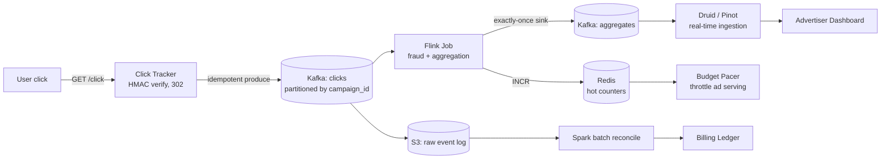
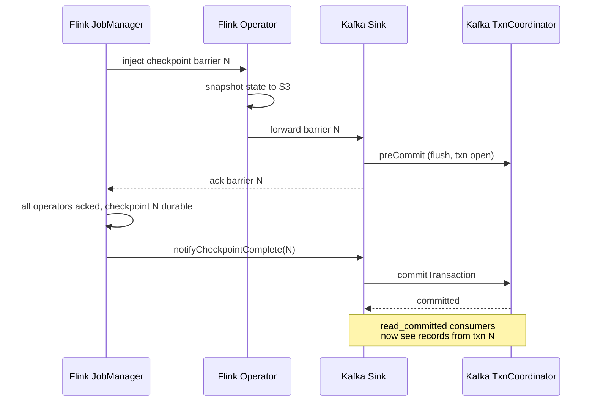
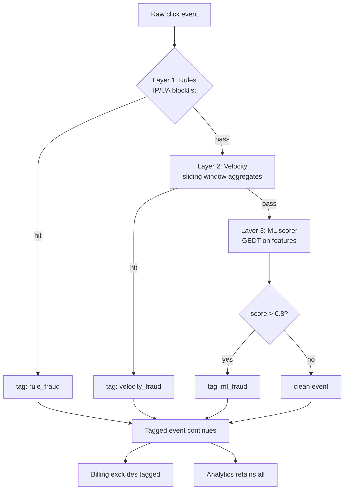
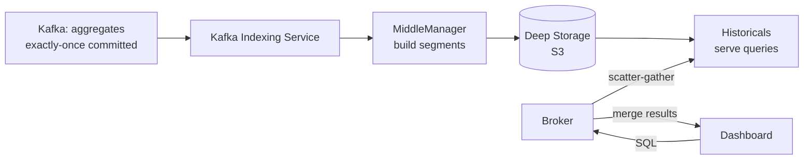
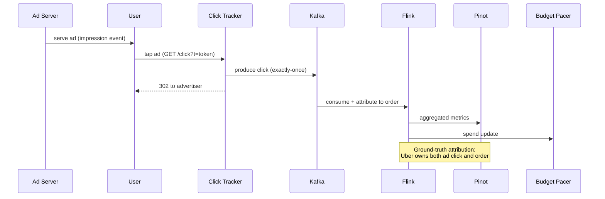

# Design Ad-Click Aggregation (Real-Time Stream Processing)

> **TL;DR.** Ad-click aggregation is a billing pipeline disguised as an analytics problem. At 1M clicks/sec peak, the system must deliver exactly-once semantics end-to-end (Kafka idempotent producer + Flink aligned checkpoints + idempotent sink) because every click is an invoice line item[^1]. The architecture layers a three-tier fraud filter (rules, velocity, ML) over a Kappa-style streaming core, sinks aggregates into a real-time OLAP store (Druid or Pinot) for sub-second dashboard queries[^2], and reconciles against a batch audit trail for billing correctness. The pivotal trade-off: exactly-once costs 3-30% throughput depending on batch size and commit interval, but eliminates chargebacks[^3].

## Learning Objectives

- Design an end-to-end click ingestion pipeline that achieves exactly-once semantics across source, state, and sink
- Explain the three-component chain (Kafka transactions, Flink checkpoints, idempotent sink) and what breaks when any link is missing
- Apply layered fraud detection (rules, velocity aggregates, ML scoring) as in-stream operators
- Justify the choice of a real-time OLAP store over a relational database for advertiser dashboards at billion-row scale
- Estimate capacity for a system processing 10B impressions and 100M clicks per day
- Trade off freshness against correctness in the context of advertiser billing

## Intuition

Counting clicks sounds trivial. A `GROUP BY campaign_id` on a Postgres table handles 100 advertisers. At 100 million clicks per day with peaks of 1 million per second, that approach collapses, and the reason is not volume alone. It is money.

Every click is a billable event. Under-count by 0.1% and you lose millions in revenue annually on a platform the size of Google advertising (~$264B in FY2024)[^4]. Over-count by 0.1% and advertisers dispute invoices, demand credits, and churn. A single production bug that double-counts clicks for an hour is an earnings-call event.

The naive "at-least-once plus dedup at read time" approach fails because dedup at read time is not auditable. You cannot prove to an advertiser that their invoice is correct if the pipeline silently dropped or duplicated events somewhere in the middle. The insight that unlocks the design: treat the click pipeline as a financial ledger, not an analytics pipeline. Every event must be processed exactly once, provably, with a batch reconciliation job as the audit trail.

This means the architecture is not "Kafka plus a consumer." It is Kafka with transactional producers, Flink with aligned checkpoint barriers that atomically commit state and sink transactions, and an OLAP store that ingests pre-aggregated, fraud-filtered, exactly-once-committed records. The complexity is justified because the output is an invoice.

## Requirements

### Clarifying Questions

- **Q: What is the billing model?**
  Assume: Cost-per-click (CPC). Every valid click generates a charge. Invalid clicks (fraud) must be excluded before billing but retained for audit.

- **Q: What freshness do advertisers expect?**
  Assume: Dashboard refresh within 5 seconds of click. Billing reconciliation runs hourly with final invoice daily.

- **Q: What fraud rate is acceptable?**
  Assume: Less than 0.5% of billed clicks should be invalid. Vendor estimates suggest 14-22% raw invalid traffic on search campaigns[^5]; the system must filter most of it.

- **Q: Multi-region?**
  Assume: Yes. Clicks arrive from global edge PoPs. Processing is regional with cross-region reconciliation for billing.

- **Q: What attribution model?**
  Assume: Last-click for billing (simple, auditable). Data-driven multi-touch for reporting (requires sufficient conversion volume per campaign for statistical stability; Google recommends at least 200 conversions in 30 days)[^6].

- **Q: Privacy constraints?**
  Assume: iOS ATT opt-out at ~75%[^7]. SKAdNetwork postbacks arrive 24-48 hours delayed[^8]. Chrome deprecated Privacy Sandbox Attribution Reporting in 2025; third-party cookies remain. No per-user conversion logs for opted-out users.

### Functional Requirements

- Ingest click events from edge trackers with exactly-once delivery to the processing layer
- Aggregate clicks per campaign, per advertiser, per dimension (country, device, placement) in tumbling 1-minute windows
- Detect and flag invalid traffic in-stream across three layers (rules, velocity, ML)
- Serve pre-aggregated metrics to advertiser dashboards with sub-second query latency
- Reconcile streaming output against the raw event log via batch for billing correctness
- Support budget pacing: real-time spend counters that throttle ad serving when budgets approach exhaustion

### Non-Functional Requirements

- **Load:** 10B impressions/day, 100M clicks/day (1% CTR), peak 1M clicks/sec
- **Latency:** click-to-dashboard visibility under 5 seconds; query p99 under 200 ms
- **Accuracy:** 99.999% event accuracy on billable data (no double-bills, no lost clicks)
- **Availability:** 99.99% on the ingestion path; 99.9% on the dashboard query path
- **Durability:** zero data loss; raw events retained in object storage for 7 years (audit)

## Capacity Estimation

| Metric | Value | Derivation |
|--------|------:|------------|
| Clicks/day | 100M | 10B impressions x 1% CTR |
| Peak clicks/sec | 1M | 10x average (1,157/sec avg) during major events |
| Click event size | 500 B | request_id, campaign_id, ad_id, user_cohort, geo, device, timestamp, token |
| Raw click storage/day | 50 GB | 100M x 500 B |
| Impressions storage/day | 5 TB | 10B x 500 B |
| 5-year raw storage | ~9 PB | (50 GB + 5 TB) x 365 x 5 |
| Flink state (1-min windows) | ~50 GB | 500K campaigns x 100 KB state each |
| OLAP storage (1 year, rollups) | ~10 TB | Pre-aggregated by campaign/day/geo/device |
| Redis hot counters | ~4 GB | 500K campaigns x 8 KB (today's spend + velocity) |

Key ratios:

- **Impression:click** = 100:1 (1% CTR). Impressions dominate storage; clicks dominate processing complexity.
- **Valid:invalid** = ~80:20. Vendor estimates suggest roughly 14-22% of raw clicks are invalid traffic[^5]; after filtering, less than 0.5% of billed clicks should be fraudulent.
- **Stream:batch** = real-time aggregates feed dashboards; batch reconciliation feeds billing. Both read from the same Kafka topic (Kappa architecture).

## API and Data Model

### API Design

```http
POST /v1/click?t=<signed_token>
  Response: 302 Location: <advertiser_landing_url>
  Side effect: click event produced to Kafka (idempotent)

GET /v1/campaigns/{id}/metrics?window=1h&dimensions=country,device
  Response: 200 { "clicks": 142000, "spend": 8520.00, "ctr": 0.012,
                  "breakdowns": [...], "as_of": "2026-05-04T12:00:05Z" }

GET /v1/campaigns/{id}/budget
  Response: 200 { "daily_budget": 50000, "spent_today": 32100,
                  "pacing_rate": 0.85, "estimated_exhaustion": "18:30Z" }

POST /v1/reports/reconciliation
  Body: { "date": "2026-05-03", "advertiser_id": "adv_123" }
  Response: 200 { "stream_total": 1420000, "batch_total": 1420003,
                  "delta": 3, "status": "within_tolerance" }
```

### Data Model

```sql
-- Kafka click event (Avro schema, partitioned by campaign_id)
record ClickEvent {
  string   request_id;       -- idempotency key
  string   campaign_id;      -- partition key
  string   ad_id;
  string   advertiser_id;
  string   user_cohort;      -- privacy-safe cohort, not user_id
  string   geo_country;
  string   device_type;
  long     timestamp_ms;     -- event time
  string   click_token;      -- HMAC-signed, validates origin
  float    fraud_score;      -- populated by Flink (0.0 = clean)
  string   fraud_flags;      -- comma-separated rule IDs that fired
}

-- OLAP rollup table (Druid/Pinot segment schema)
table click_aggregates (
  campaign_id     string,     -- primary dimension
  window_start    timestamp,  -- 1-minute tumbling window
  geo_country     string,
  device_type     string,
  valid_clicks    long,
  invalid_clicks  long,
  spend_cents     long,
  unique_users    long        -- HyperLogLog sketch
)

-- Redis hot counters (per campaign, today)
HASH campaign:{id}:today {
  spend_cents: 3210000,
  click_count: 142000,
  last_click_ts: 1714824005000
}
```

## High-Level Architecture



*The click data path from edge tracker to advertiser dashboard, with a parallel batch reconciliation branch feeding billing.*

The **write path**: a user taps an ad. The click tracker at the edge verifies the HMAC-signed token (preventing forged clicks), produces the event to Kafka with `enable.idempotence=true` and `acks=all`, and returns a 302 redirect to the advertiser's landing page. Total tracker latency: single-digit milliseconds.

The **stream path**: Flink consumes from the clicks topic, applies fraud detection (rules, velocity, ML), computes 1-minute tumbling-window aggregates keyed by `(campaign_id, geo, device)`, increments Redis hot counters for budget pacing, and sinks aggregates to a second Kafka topic via exactly-once transactions. The OLAP store ingests from the aggregates topic continuously.

The **batch path**: raw events land in S3 via Kafka Connect. A Spark job runs hourly, re-aggregates from the raw log, and compares against the stream output. Deltas beyond tolerance trigger alerts and billing adjustments.

## Deep Dives

### Exactly-once semantics: the three-component chain

The most common interview mistake is claiming "at-least-once plus idempotent writes equals exactly-once." It does not. Idempotent writes handle duplicate delivery, but they do not handle the case where Flink processes an event, updates internal state, but crashes before the sink commits. On recovery, the event is reprocessed with stale state, producing a different aggregate. True exactly-once requires atomicity across source offset, operator state, and sink output[^9].

**Component 1: Kafka idempotent + transactional producer.** KIP-98 (Kafka 0.11, 2017) introduced `producer_id` and per-partition sequence numbers[^3][^10]. The broker rejects duplicates from producer retries. Adding `transactional.id` makes the id survive restarts: the `TransactionCoordinator` fences zombie producers via `producer_epoch`, so a crashed producer cannot commit stale transactions after restart[^10].

**Component 2: Flink aligned checkpoint barriers.** The JobManager injects a barrier into the source stream. Each operator snapshots its state to S3 when the barrier passes through. The Kafka sink calls `preCommit` (flush pending writes inside an open Kafka transaction) but does not commit yet[^9][^11].

**Component 3: Atomic commit on checkpoint success.** Only after all operators acknowledge the barrier does the JobManager call `notifyCheckpointComplete`. The sink then calls `commitTransaction` on the Kafka `TransactionCoordinator`. Consumers with `isolation.level=read_committed` see the records only after this commit[^9][^3].



*Kafka transaction coordinator, Flink checkpoint barrier, and sink transaction commit atomically; failure at any stage rolls back the entire set.*

**Cost:** Confluent benchmarks show 3% overhead versus at-least-once (acks=all) for the producer, and 15-30% for the Streams API with short commit intervals (100 ms); real-world overhead for ad workloads with frequent checkpoints is typically in this upper range[^3]. This is the price of correctness when the output is an invoice.

### In-stream fraud detection: rules, velocity, ML

Vendor estimates suggest invalid traffic ranges from 14% to 22% of search clicks[^5]. The system must filter most of it before billing while retaining all events for audit. Each layer tags events with a `fraud_flag`; no layer deletes data.

**Layer 1: Rules (stateless, p99 < 1 ms).** IP blocklists (known data centers, VPN exit nodes), user-agent denylist (headless browsers, known bot signatures), and click-token validation (reject expired or malformed tokens)[^12]. This runs as the first Flink operator. Google's Ad Traffic Quality team uses similar rule-based filters as the first line[^13].

**Layer 2: Velocity aggregates (stateful, windowed).** Flink sliding windows compute: `same_ip_same_ad_clicks_in_10s`, `same_user_clicks_in_1m`, `new_campaign_click_rate_vs_baseline`. A Count-Min Sketch tracks approximate frequencies for high-cardinality dimensions (IP x ad_id) without exploding state. Thresholds are tuned per-campaign based on historical baselines.

**Layer 3: ML scorer (async, p99 < 50 ms).** A gradient-boosted tree (XGBoost/LightGBM) trained on labelled invalid traffic data scores each click on enriched features: time-since-impression, mouse-movement entropy, device fingerprint novelty, geo-mismatch with campaign targeting. The model is served via a feature store (Feast/Tecton) and called asynchronously; results arrive before the window closes.



*Every click passes through three fraud layers in order; each tags but never drops, letting billing exclude flagged events while analytics retains full data for audit.*

### Real-time OLAP for advertiser dashboards

Advertisers refresh dashboards every few seconds. The query pattern is: `SELECT SUM(valid_clicks), SUM(spend) FROM aggregates WHERE campaign_id = X AND window_start >= now() - 1h GROUP BY geo_country`. This is a high-concurrency, low-latency analytical query over billions of pre-aggregated rows.

**Why not Postgres?** At 500K campaigns x 1440 minutes/day x 5 dimensions, the rollup table grows by 3.6B rows/day. Postgres cannot serve thousands of concurrent analytical queries at sub-second latency over this volume.

**Druid** separates ingestion (MiddleManagers), query serving (Historicals + Brokers), and coordination (Coordinators + Overlords)[^14]. Segments are column-oriented, bitmap-indexed, and immutable. Streaming ingestion via the Kafka Indexing Service materializes new segments in near real time. Query latency: sub-second to a few seconds on trillions of rows[^15].

**Pinot** (LinkedIn, SIGMOD 2018) takes a similar approach with Helix-based cluster management and a star-tree index that pre-aggregates multi-column rollups[^2]. LinkedIn reports thousands of QPS with p99 under 100 ms after smart routing optimizations[^16].

**ClickHouse** uses MergeTree columnar storage with vectorized execution. Strongest for batch-flavored OLAP with SQL; weaker on high-concurrency real-time ingestion compared to Druid/Pinot[^17].

Our pick: **Druid** for the primary dashboard path (optimized for high-concurrency, real-time ingestion, sub-second queries). ClickHouse as a secondary store for ad-hoc analyst queries that need full SQL expressiveness.



*Druid's ingestion path: Kafka Indexing Service builds immutable columnar segments on MiddleManagers, publishes to deep storage, and Historicals serve sub-second queries via the Broker's scatter-gather layer.*

## Real-World Example

**Uber Eats Ads: Flink + Kafka + Pinot for exactly-once ad attribution.**

Uber's ad events processing system manages the flow of click and impression events, cleanses them, aggregates by campaign, attributes clicks to Uber Eats orders, and feeds both advertiser reporting and budget pacing[^1]. The stated reliability target is 100% accurate ad attribution, because clicks map directly to advertiser charges and double-counting is a billing incident.

The architecture mirrors our design: Kafka as the source of truth, Flink for stateful stream processing with exactly-once checkpoints, and Pinot for real-time OLAP serving advertiser dashboards[^1]. Uber chose exactly-once over at-least-once explicitly because the pipeline output is financial: a duplicated click event means an overcharged restaurant advertiser.

Key engineering decisions:

- **Flink over Samza** for the attribution job because Flink's event-time semantics and `TwoPhaseCommitSinkFunction` integrate cleanly with Kafka's transactional producer[^1][^9].
- **Pinot over Druid** because Uber had an existing Pinot platform powering hundreds of real-time analytics use cases, and operational familiarity outweighed Druid's slightly larger community[^1][^18].
- **Attribution is closed-loop.** Unlike third-party ad networks, Uber Eats owns the marketplace. When a user clicks an ad and places an order, Uber has ground-truth order data. Attribution correctness is verifiable end-to-end without relying on third-party conversion pixels.

The insight non-experts miss: Uber did not build exactly-once because it is theoretically elegant. They built it because the alternative (at-least-once with reconciliation) meant issuing credits to thousands of restaurant advertisers every billing cycle, which destroyed advertiser trust.



*Uber's closed-loop attribution: because Uber Eats owns the marketplace, the Flink job can join click events to order events with 100% ground-truth accuracy.*

## Trade-offs

| Approach | Pros | Cons | When to Use |
|----------|------|------|-------------|
| At-least-once + idempotent writes | Simple, 95% correct | Edge cases cause drift, hard to audit | Low-stakes analytics, non-billing |
| Exactly-once (Kafka + Flink) | Correct, auditable, no credits | Complex, 20-30% throughput cost | Billable data, money flows |
| Rule-based fraud only | Fast (< 1 ms), deterministic, auditable | Misses novel patterns, static | Baseline layer (always include) |
| ML fraud scoring | Catches new patterns, adapts | Needs training data, model drift | Mature product with labelled data |
| Druid for dashboards | Sub-second on trillions of rows, real-time ingest | 6 service types, ZooKeeper, ops burden | High-concurrency dashboard workloads |
| ClickHouse for dashboards | Vectorized SQL, simpler ops | Limited real-time concurrency | Analyst ad-hoc queries, batch OLAP |
| Lambda (batch + stream) | Correct + fresh, proven | Double code paths, reconciliation complexity | Migrating legacy pipelines |
| Kappa (stream only, replay) | Single code path, simpler | Requires replayable source (Kafka retention) | Greenfield (our pick) |

The biggest meta-decision: **exactly-once versus at-least-once**. At-least-once is simpler and faster, but it shifts correctness responsibility to downstream reconciliation. For ad billing, reconciliation is not optional either way (auditors require it), but exactly-once reduces the delta from thousands of events to single digits, making reconciliation a verification step rather than a correction step.

## Scaling and Failure Modes

**At 10x (1B clicks/day, 10M/sec peak):**

- Kafka partitions must increase from ~100 to ~1,000 per topic. Flink parallelism scales linearly with partitions.
- OLAP ingestion becomes the bottleneck. Mitigation: tiered ingestion with regional Druid clusters and a global query broker.
- Redis hot counters approach memory limits. Mitigation: shard by advertiser_id across a Redis Cluster.

**At 100x (10B clicks/day):**

- Single Flink job cannot hold window state. Mitigation: split into per-region jobs with regional Kafka clusters; cross-region aggregation via a lightweight merge job.
- Fraud ML inference at 100M/sec requires GPU-accelerated serving or pre-scored feature vectors cached in the feature store.

**At 1000x (Netflix/Twitter scale: trillions of events/day):**

- Netflix Keystone operates over 15,000 Flink jobs processing over 60 PB of data per day[^19]. The architectural shift: per-job Flink clusters (not shared multi-tenant), S3 for checkpoint state, and a declarative reconciliation architecture that continuously drives jobs toward desired state[^20].

**Failure modes:**

- **Flink job crash mid-checkpoint.** Recovery: Flink restores from the last completed checkpoint. Kafka consumer offsets roll back to the checkpoint's committed position. Exactly-once guarantees hold; the only cost is reprocessing latency (seconds to minutes depending on checkpoint interval).
- **Kafka broker failure.** With `acks=all` and replication factor 3, no data is lost. Producers retry transparently via the idempotent protocol. Consumers rebalance partitions across surviving brokers.
- **OLAP ingestion lag.** Dashboard shows stale data. Mitigation: expose `as_of` timestamp in every API response so advertisers know data freshness. Alert on lag exceeding 30 seconds.

## Common Pitfalls

> [!WARNING]
> **Claiming "at-least-once + dedup = exactly-once."** It does not. Idempotent writes handle duplicate delivery but not the case where operator state diverges from sink state after a crash. True exactly-once requires atomic commit across source offsets, operator state, and sink output[^9].

> [!WARNING]
> **Partitioning by advertiser_id creates hot keys.** One major retailer during a flash sale can generate 40% of clicks. The Flink subtask for that key saturates while others idle. Fix: salted keys `(campaign_id, rand(0, N))` for first-pass aggregation, then a second `keyBy(campaign_id)` for final merge[^21].

> [!WARNING]
> **Watermark stalls from idle Kafka partitions.** Flink takes the minimum watermark across all source subtasks. An idle partition (no traffic at 3 AM) prevents downstream windows from firing. Fix: configure `WatermarkStrategy.withIdleness(Duration.ofSeconds(30))`[^22].

> [!WARNING]
> **Thundering herd on budget exhaustion.** All bidders simultaneously stop when budget hits zero, then retry to confirm at the same instant. Fix: soft budget thresholds with jitter; DoorDash's "Smooth Fast Finish" approach dynamically updates pacing throttle rate near end-of-period[^23].

> [!WARNING]
> **Attribution windows that never close.** A 30-day attribution window holds state for every click for 30 days. Checkpoint size grows monotonically until checkpoints timeout and the job cannot recover. Fix: RocksDB state backend with incremental checkpoints; offload cold attribution state to a key-value store and join on demand[^20].

> [!WARNING]
> **Ignoring privacy constraints in the data model.** Storing per-user click logs post-ATT violates Apple's policy and risks App Store removal. Fix: aggregate to cohort-level before persisting; use differential privacy for small-group reporting; accept SKAdNetwork's 24-48 hour postback delay as a design constraint[^7][^8].

## Follow-up Questions

**1. How do you handle the 24-48 hour delay in SKAdNetwork postbacks for iOS attribution?**

The streaming pipeline cannot close attribution windows on event time alone for iOS. Use a two-phase approach: immediate last-click attribution for Android/web (real-time), and a delayed batch job that processes SKAdNetwork postbacks 48 hours later and reconciles iOS attribution. Dashboard shows "provisional" iOS numbers with a confidence interval until postbacks arrive.

**2. How would you implement multi-touch attribution at scale?**

Maintain a per-user (or per-cohort) touchpoint log in a key-value store (Cassandra). When a conversion arrives, look up all touchpoints within the attribution window. Apply the chosen model (linear, time-decay, or data-driven Shapley values). Data-driven models require sufficient conversion volume for statistical stability (Google recommends at least 200 conversions in 30 days)[^6]; below that threshold, fall back to last-click.

**3. What happens when a fraud model has high false positives on a major advertiser?**

Never auto-block based on ML alone. The ML layer tags with a score; a human-reviewable threshold (e.g., score > 0.95) triggers automatic exclusion from billing. Scores between 0.8 and 0.95 go to a review queue. Provide advertisers a "disputed clicks" self-service portal with 7-day credit SLA. Google issues credits as negative line items on subsequent invoices[^12].

**4. How do you prevent budget pacing from oscillating?**

DoorDash's arXiv paper on daily budget pacing describes a control-loop approach: compute a pacing multiplier as `remaining_budget / remaining_time_in_period`, smoothed with exponential moving average to dampen oscillation[^23]. Update the multiplier every minute, not every click. Expose the multiplier to bidders as a probability of entering the auction, not a hard on/off switch.

**5. How would you migrate from Lambda to Kappa architecture?**

Run both pipelines in parallel for 30 days. Compare outputs hourly. When the stream pipeline's delta versus batch is consistently within tolerance (e.g., < 0.001%), decommission the batch computation path. Keep the batch reconciliation job permanently as an audit mechanism, but stop using it as the source of truth for billing.

**6. How do you handle clock skew across global edge trackers?**

Use the Kafka broker's append timestamp as the ingestion time, but carry the tracker's event timestamp for event-time processing. Flink watermarks tolerate bounded out-of-orderness (configure `forBoundedOutOfOrderness(Duration.ofSeconds(10))`). Events arriving more than 5 minutes late go to a side output for batch reconciliation rather than corrupting real-time aggregates[^24].

## Exercise

### Exercise 1: Detecting a distributed bot network

A fraud pattern surfaces: a bot network clicks ads from 10,000 distinct IPs, each clicking once per minute, spread across 500 campaigns. No single IP or campaign trips a velocity rule. Design the detection approach: what streaming features would you compute, what model inputs would you use, and how would you retroactively credit affected advertisers?

<details>
<summary>Hint</summary>

No single dimension is anomalous. The signal is in the cross-dimensional pattern: the same set of IPs appearing across unrelated campaigns with unnaturally uniform timing. Think about what features would distinguish this from legitimate traffic across 500 campaigns.

</details>

<details>
<summary>Solution</summary>

**Detection features (computed in Flink):**

1. **Cross-campaign IP overlap:** For each IP, count distinct campaigns clicked in the last hour. Legitimate users rarely click ads across 50+ unrelated campaigns. Use a Count-Min Sketch to approximate `distinct_campaigns_per_ip` without exploding state.
2. **Click timing entropy:** Legitimate clicks have irregular inter-arrival times. Bot clicks at exactly once-per-minute have near-zero entropy. Compute `stddev(inter_click_interval)` per IP in a sliding window.
3. **IP cohort similarity:** Cluster IPs by their campaign-click vector using locality-sensitive hashing. A cluster of 10,000 IPs all clicking the same 500 campaigns is statistically impossible for organic traffic.

**Model inputs:** Feed these three features plus standard signals (geo diversity, device fingerprint novelty, time-of-day distribution) into the Layer 3 ML scorer. The model flags the cohort.

**Retroactive credit:** Once the pattern is confirmed, query the OLAP store for all clicks from the flagged IP set within the detection window. Sum spend per advertiser. Issue credits as negative line items on the next invoice. Total latency from detection to credit: 24-48 hours (detection is real-time; credit issuance follows the daily billing cycle).

**Trade-off accepted:** Cross-campaign features require global state (not per-campaign). This increases Flink checkpoint size. Mitigate by computing cohort features on a separate, lower-parallelism job that emits "suspicious IP sets" to a shared blocklist consumed by the main pipeline.

</details>

## Key Takeaways

- **Exactly-once is real but expensive.** Use it where money flows (billing); use at-least-once for analytics where a 0.01% delta is acceptable.
- **Fraud is layered defense.** Rules are fast and auditable, velocity catches patterns, ML catches novelty. You need all three; no single layer suffices[^12][^13].
- **The batch job is not a failure mode; it is the audit trail.** Without it, you cannot prove to an advertiser that their invoice is correct.
- **OLAP stores exist because Postgres cannot do "billions of rows, many dimensions, sub-second query, real-time ingestion" simultaneously.**
- **Privacy is now a first-class architectural constraint.** iOS ATT, SKAdNetwork, and the deprecation of cross-site tracking APIs change what data the pipeline can retain, not just how it is displayed[^7].
- **Budget pacing is a control-theory problem.** Treat it as a feedback loop with damping, not a threshold check[^23].

## Further Reading

- [Real-Time Exactly-Once Ad Event Processing (Uber)](https://www.uber.com/blog/real-time-exactly-once-ad-event-processing/). The closest public analog to this chapter's design; walks through Kafka + Flink + Pinot for ad billing.
- [Exactly-Once Semantics Are Possible: Here's How Kafka Does It (Confluent)](https://www.confluent.io/blog/exactly-once-semantics-are-possible-heres-how-apache-kafka-does-it/). The canonical explanation of KIP-98, idempotent producers, and transactional messaging.
- [End-to-End Exactly-Once Processing in Apache Flink (Flink blog)](https://flink.apache.org/2018/02/28/an-overview-of-end-to-end-exactly-once-processing-in-apache-flink-with-apache-kafka-too/). Nowojski and Winters explain the TwoPhaseCommitSinkFunction and checkpoint barrier protocol.
- [Pinot: Realtime OLAP for 530 Million Users (SIGMOD 2018)](https://dl.acm.org/doi/10.1145/3183713.3190661). LinkedIn's case for real-time OLAP; covers star-tree indexing and ingestion architecture.
- [Apache Druid Architecture](https://druid.apache.org/docs/latest/design/architecture). Official reference for the six-service-type architecture and segment lifecycle.
- [Preventing Overdelivery via Daily Budget Pacing at DoorDash (arXiv)](https://arxiv.org/abs/2509.07929). Production pacing paper with concrete control-loop design and "Smooth Fast Finish" approach.
- [Netflix Keystone Real-time Stream Processing Platform](https://netflixtechblog.com/keystone-real-time-stream-processing-platform-a3ee651812a). Trillions of events/day; per-job Flink clusters; declarative reconciliation architecture.
- [Chrome Privacy Sandbox Attribution Reporting API (deprecated 2025)](https://privacysandbox.google.com/private-advertising/attribution-reporting/web). The post-third-party-cookie measurement specification that briefly reshaped conversion pipelines before Google reversed course.

## Flashcards

<details>
<summary><strong>Q: What three components must be atomically committed for end-to-end exactly-once in Kafka + Flink?</strong></summary>

A: (1) Kafka source consumer offsets, (2) Flink operator state snapshot, and (3) Kafka sink transaction commit. Skipping any one breaks the chain and produces silent correctness bugs[^9].

</details>

<details>
<summary><strong>Q: What is the throughput cost of exactly-once semantics versus at-least-once?</strong></summary>

A: Confluent benchmarks show 3% overhead versus at-least-once (acks=all) for the producer, and 15-30% for the Streams API with short commit intervals (100 ms)[^3]. Ad workloads with frequent checkpoints typically see the upper end of this range. The cost comes from transaction coordination overhead and checkpoint barrier alignment.

</details>

<details>
<summary><strong>Q: Why do ad-click pipelines use three fraud detection layers instead of just ML?</strong></summary>

A: Rules are fast (< 1 ms), deterministic, and auditable. Velocity aggregates catch distributed patterns no single-event classifier sees. ML catches novel patterns but needs training data and drifts. Each layer compensates for the others' weaknesses[^12][^13].

</details>

<details>
<summary><strong>Q: What percentage of search ad clicks are estimated to be invalid traffic?</strong></summary>

A: Vendor estimates suggest 14-22% of search ad clicks may be invalid traffic[^5]. After filtering, the target is less than 0.5% of billed clicks being invalid.

</details>

<details>
<summary><strong>Q: Why can't PostgreSQL serve advertiser dashboards at ad-platform scale?</strong></summary>

A: At 500K campaigns with minute-level granularity across 5 dimensions, the table grows by billions of rows per day. Postgres cannot serve thousands of concurrent analytical queries at sub-second latency over this volume. OLAP stores (Druid, Pinot) use columnar storage, bitmap indexes, and pre-aggregation to achieve sub-second queries on trillions of rows[^14][^15].

</details>

<details>
<summary><strong>Q: What causes watermark stalls in Flink, and how do you fix them?</strong></summary>

A: An idle Kafka partition (no events) prevents its watermark from advancing. Since Flink takes the minimum watermark across all subtasks, one idle partition stalls all downstream windows. Fix: `WatermarkStrategy.withIdleness(Duration.ofSeconds(30))` excludes idle partitions from the global watermark[^22].

</details>

<details>
<summary><strong>Q: How does Kafka's idempotent producer prevent duplicate writes on retry?</strong></summary>

A: The broker assigns each producer a `producer_id` and tracks a monotonic sequence number per partition. On retry, the broker detects the duplicate sequence and rejects it. Adding `transactional.id` makes this survive producer restarts via the TransactionCoordinator's `producer_epoch` fencing[^3][^10].

</details>

<details>
<summary><strong>Q: What is the architectural difference between Lambda and Kappa for ad-click aggregation?</strong></summary>

A: Lambda runs parallel batch and stream pipelines with reconciliation. Kappa uses a single stream pipeline with a replayable source (Kafka with long retention) for corrections. Kappa wins for greenfield because it eliminates dual code paths; Lambda survives where legacy batch pipelines already exist[^25].

</details>

<details>
<summary><strong>Q: How does iOS ATT affect ad-click attribution pipelines?</strong></summary>

A: ~75% of iOS users opt out of deterministic tracking[^7]. Attribution shifts from per-user conversion logs to aggregated, delayed SKAdNetwork postbacks (24-48 hours)[^8]. The pipeline must handle provisional attribution that gets reconciled days later.

</details>

<details>
<summary><strong>Q: What is the "salted key" technique for handling hot partitions in Flink?</strong></summary>

A: Append a random suffix to the key: `(campaign_id, rand(0, N))`. This distributes a hot campaign across N subtasks for first-pass aggregation. A second `keyBy(campaign_id)` merges the partial aggregates into the final result[^21].

</details>

## References

[^1]: Uber Engineering. "Real-Time Exactly-Once Ad Event Processing with Apache Flink, Kafka, and Pinot." https://www.uber.com/blog/real-time-exactly-once-ad-event-processing/

[^2]: Im et al. "Pinot: Realtime OLAP for 530 Million Users." SIGMOD 2018. https://dl.acm.org/doi/10.1145/3183713.3190661

[^3]: Narkhede, Wang, et al. "Exactly-Once Semantics Are Possible: Here's How Kafka Does It." Confluent, 2017 (updated Mar 2025). https://www.confluent.io/blog/exactly-once-semantics-are-possible-heres-how-apache-kafka-does-it/

[^4]: Alphabet Inc. Form 10-K for fiscal year ended December 31, 2024 (filed Feb 5, 2025). Google advertising revenues: Google Search & other $198.1B + YouTube ads $36.1B + Google Network $30.4B = $264.6B. https://www.sec.gov/Archives/edgar/data/1652044/000165204425000014/0001652044-25-000014-index.htm

[^5]: TrafficGuard. "Protect Google Ads from Click Fraud with Smarter Detection." https://www.trafficguard.ai/blog/how-to-protect-your-google-ads-from-fraud-using-smarter-detection-tools

[^6]: Google Ads Help. "About data-driven attribution." https://support.google.com/google-ads/answer/6394265

[^7]: AdExchanger. "5 Years of ATT: What We've Learned." https://www.adexchanger.com/content-studio/5-years-of-att-what-weve-learned-and-what-the-future-of-ios-performance-looks-like/

[^8]: Apple Developer. "App Store Ad Attribution / SKAdNetwork." https://developer.apple.com/app-store/ad-attribution/

[^9]: Nowojski and Winters. "An Overview of End-to-End Exactly-Once Processing in Apache Flink (with Apache Kafka, too!)." Apache Flink blog, 28 Feb 2018. https://flink.apache.org/2018/02/28/an-overview-of-end-to-end-exactly-once-processing-in-apache-flink-with-apache-kafka-too/

[^10]: Apache Kafka. "KIP-98: Exactly Once Delivery and Transactional Messaging." https://cwiki.apache.org/confluence/display/KAFKA/KIP-98+-+Exactly+Once+Delivery+and+Transactional+Messaging

[^11]: Apache Flink source. "TwoPhaseCommitSinkFunction.java." https://github.com/apache/flink/blob/master/flink-streaming-java/src/main/java/org/apache/flink/streaming/api/functions/sink/legacy/TwoPhaseCommitSinkFunction.java

[^12]: Google Support. "About invalid traffic." https://support.google.com/google-ads/answer/11182074?hl=en

[^13]: Google Blog. "Google uses AI in new ways to fight invalid ad traffic." 2024. https://blog.google/products/ads-commerce/using-ai-to-fight-invalid-ad-traffic/

[^14]: Apache Druid. "Architecture." https://druid.apache.org/docs/latest/design/architecture

[^15]: Apache Druid. "Design." https://druid.apache.org/docs/latest/design/

[^16]: Pawar. "Pinot Joins Apache Incubator." LinkedIn Engineering, 12 Mar 2019. https://engineering.linkedin.com/blog/2019/03/pinot-joins-apache-incubator

[^17]: ClickHouse. "Real-time analytics platforms: a practical comparison." https://clickhouse.com/resources/engineering/real-time-analytics-platforms-a-practical-comparison

[^18]: Uber Engineering. "Rebuilding Uber's Apache Pinot Query Architecture." https://www.uber.com/blog/rebuilding-ubers-apache-pinot-query-architecture/

[^19]: Confluent Current 2024. "Building a Scalable Flink Platform: 15,000 Jobs at Netflix." https://current.confluent.io/2024-sessions/building-a-scalable-flink-platform-a-tale-of-15-000-jobs-at-netflix

[^20]: Netflix TechBlog. "Keystone Real-time Stream Processing Platform." Sep 2018. https://netflixtechblog.com/keystone-real-time-stream-processing-platform-a3ee651812a (see also [^19] for current architecture)

[^21]: Stack Overflow. "Flink: handle skew by partitioning by a field of the key." https://stackoverflow.com/questions/73006408/flink-handle-skew-by-partitioning-by-a-field-of-the-key

[^22]: Apache Flink. "Generating Watermarks." https://nightlies.apache.org/flink/flink-docs-master/docs/dev/datastream/event-time/generating_watermarks/

[^23]: Khan et al. "Preventing Overdelivery via Daily Budget Pacing at DoorDash." arXiv:2509.07929. https://arxiv.org/abs/2509.07929

[^24]: Apache Flink. "Windows." https://nightlies.apache.org/flink/flink-docs-master/docs/dev/datastream/operators/windows/

[^25]: Materialize blog. "Does Kappa architecture improve on Lambda architecture?" https://materialize.com/blog/does-kappa-architecture-improve-on-lambda/
