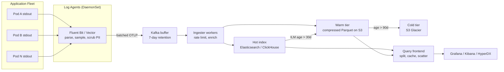
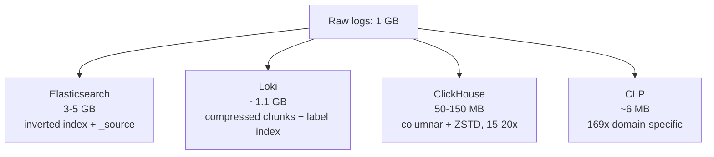
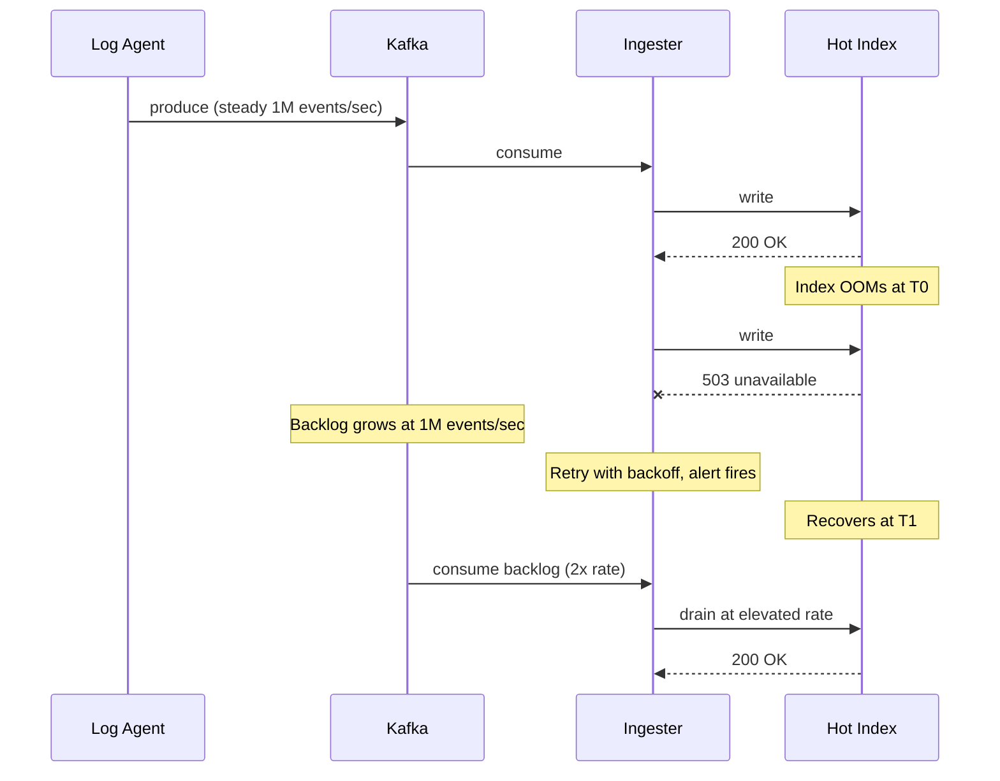
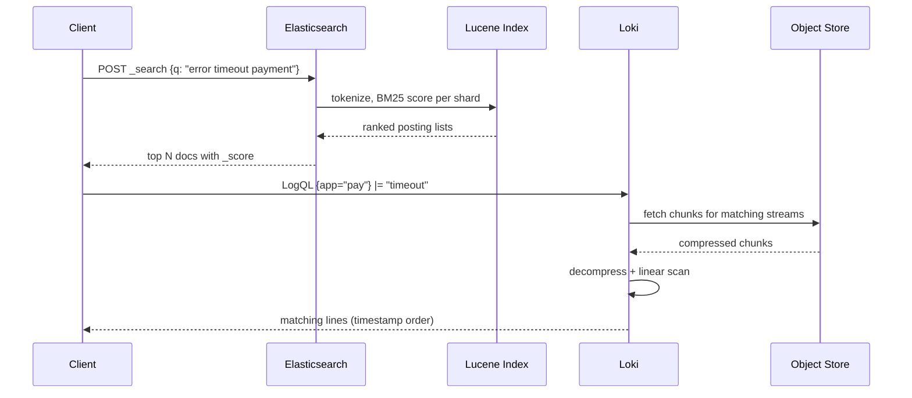
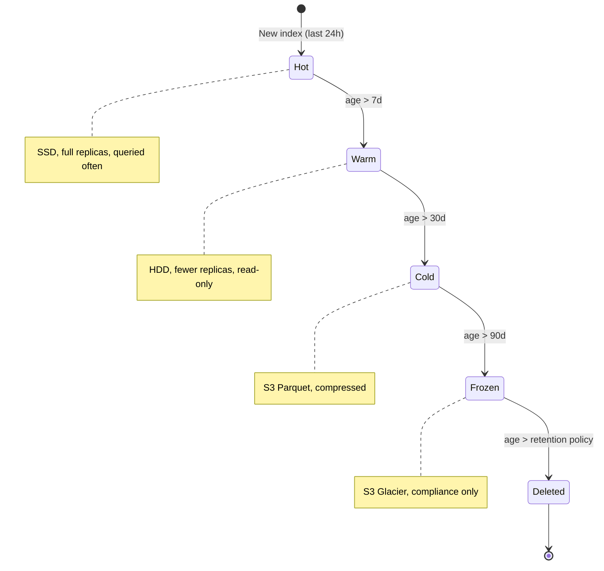

# Design a Logging Platform (ELK / Loki / Splunk)

> **TL;DR.** A logging platform ingests every textual event from an application fleet, buffers it through Kafka for durability, stores it in either an inverted-index system (Elasticsearch, Splunk) or a label-indexed object-store system (Loki), and exposes sub-5-second queries over days of data. The pivotal trade-off is what you index at ingest versus what you scan at query time: Elasticsearch indexes every field at 3-10x storage cost[^1], while Loki indexes only labels and grep-scans compressed chunks on demand[^2]. At hyperscale, Meta Scribe ingests over 2.5 TB/sec[^3], Character.AI processes 450 PB of raw log data per month[^4], and Uber compresses Spark logs 169:1 with CLP[^1]. The architecture converges on a Kafka buffer as the durability boundary, tiered retention (hot/warm/cold), and structured logging as the cost-control mechanism.

## Learning Objectives

After this module, you will be able to:

- [ ] Design a log ingestion pipeline with backpressure that survives downstream outages without data loss
- [ ] Compare index-based (ELK) and label-based (Loki) storage architectures and justify the choice for a given workload
- [ ] Apply BM25 scoring to understand how full-text log search ranks results
- [ ] Estimate capacity for a 10 PB/year logging platform using back-of-envelope math
- [ ] Implement tiered retention (hot, warm, cold, frozen) to satisfy compliance at minimal cost
- [ ] Justify structured logging over unstructured free-text at scale

## Intuition

Logging looks trivial at small scale. `kubectl logs` works. `tail -f` works. A single Elasticsearch node handles your startup's output. Then you grow to 500 microservices across 3,000 pods, and a single misbehaving retry loop emits 1,000 errors per second per pod. Across a 1,000-pod deployment, that is 1M log events per second from one bug. Your Elasticsearch cluster OOMs. Your Kafka partitions fill. Your on-call engineer cannot search the logs from the incident because the incident killed the logging platform.

The naive approach (write everything to one big index) fails for three reasons. First, cost: indexing every field of every log line costs 3-10x the raw data in storage[^1]. At 10 PB/year raw, that is 30-100 PB of index storage. Second, durability: without a buffer between producers and the index, a downstream outage means log loss. Third, query speed: searching 30 days of unindexed data is a full scan measured in minutes, not seconds.

The insight that unlocks the design: **separate the durability boundary from the query boundary.** Kafka absorbs ingest at any rate and holds data for days regardless of downstream health. The index (or chunk store) serves queries. These two systems scale independently, fail independently, and cost differently. Everything else, including agents, parsers, tiering, and retention policies, is plumbing between these two boundaries.

## Requirements

### Clarifying Questions

- **Q: What is the peak ingest rate?**
  Assume: 10M events/sec peak (1M/sec average), approximately 3 MB/sec per service at steady state.

- **Q: What retention is required?**
  Assume: 30 days hot (fast queries), 90 days warm, 13 months cold (compliance). PCI-DSS requires 12 months with 3 months immediately available[^5].

- **Q: Full-text search or structured filters only?**
  Assume: Both. Engineers need free-text keyword search during incidents; dashboards use structured label filters.

- **Q: Multi-tenant?**
  Assume: Yes. Each service team has per-tenant ingest quotas and query concurrency limits.

- **Q: What is the query latency target?**
  Assume: p99 under 5 seconds for queries spanning 7 days of hot data.

- **Q: Must we handle PII in logs?**
  Assume: Yes. PCI-DSS requires scrubbing cardholder data before it reaches persistent storage[^6].

### Functional Requirements

- Ingest structured and unstructured logs from any container, VM, or serverless function
- Parse, enrich, and optionally sample logs at the pipeline level
- Full-text search with relevance ranking (BM25) over hot data
- Label-based filtering with sub-second response for recent logs
- Tiered retention with automatic lifecycle transitions
- Per-tenant rate limiting and quota enforcement

### Non-Functional Requirements

- **Ingestion:** 10M events/sec peak, lossless up to 2x burst
- **Latency:** p99 < 5 seconds for 7-day queries; p99 < 30 seconds for 30-day queries
- **Availability:** 99.9% write path, 99.95% read path
- **Durability:** zero log loss during downstream outages up to 24 hours[^7]
- **Compliance:** SOX 7 years, HIPAA 6 years, PCI-DSS 12 months[^5]

## Capacity Estimation

| Metric | Value | Derivation |
|--------|------:|------------|
| Peak events/sec | 10M | 1,000 services x 10K events/sec peak |
| Average event size | 1 KB | JSON structured log with attributes |
| Peak ingest bandwidth | 10 GB/sec | 10M x 1 KB |
| Daily raw volume | 86 TB | 1M avg events/sec x 1 KB x 86,400 |
| 30-day hot storage (indexed) | 2.6 PB | 86 TB x 30 (before compression) |
| 30-day hot (15x compression) | ~170 TB | ClickHouse-style columnar[^4] |
| 13-month cold (S3, compressed) | ~1.2 PB | 86 TB x 395 days / 15x compression |
| Kafka buffer (7-day retention) | 600 TB | 86 TB x 7 |
| Query QPS (hot path) | ~500 | Engineering teams during incidents |

Key ratios:

- **Write:read ratio:** ~100:1 (most logs are never searched)
- **Compression:** 15-20x typical with ZSTD on columnar stores[^4]; 169x with domain-specific CLP[^1]
- **Index overhead (Elasticsearch):** 3-10x raw size for inverted index + `_source`[^1]
- **Cost at scale:** Datadog charges ~$0.10/GB ingested (ingestion only; indexing charged separately)[^8][^9]; Splunk (now Cisco, acquired March 2024) lists at $150-225/GB/day[^10]

## API and Data Model

### API Design

```http
POST /v1/ingest
  Content-Type: application/x-protobuf (OTLP)
  Body: ExportLogsServiceRequest { resource_logs: [...] }
  Returns: 200 { "accepted": 50000 }
  Errors: 429 rate limited, 503 backpressure

GET /v1/search?query=error+timeout&start=2026-05-01T00:00:00Z&end=2026-05-04T00:00:00Z&limit=100
  Returns: 200 { "hits": [...], "total": 4521, "next_cursor": "..." }

GET /v1/streams?labels={app="checkout",env="prod"}&start=...&end=...&filter=|="timeout"
  Returns: 200 { "streams": [...], "stats": { "bytes_processed": "2.1GB" } }

POST /v1/tail
  WebSocket upgrade for live tail with label selector
  Returns: streaming log lines matching selector

GET /v1/retention/policies
  Returns: 200 { "policies": [{ "name": "hot", "days": 30 }, ...] }
```

### Data Model

The OpenTelemetry log record defines the canonical schema[^11]:

```text
LogRecord {
  timestamp:          uint64 (nanoseconds since epoch)
  observed_timestamp: uint64 (collection time)
  trace_id:           bytes (W3C correlation)
  span_id:            bytes
  severity_number:    int (1-24: TRACE/DEBUG/INFO/WARN/ERROR/FATAL)
  severity_text:      string
  body:               AnyValue (structured or free-text)
  resource:           { service.name, k8s.pod.name, ... }
  attributes:         map<string, AnyValue>
}
```

Storage schemas differ by backend:

| Backend | Primary Key | Partition Strategy | Index Type |
|---------|------------|-------------------|------------|
| Elasticsearch | `_id` (auto) | Index-per-day, ILM rollover | Inverted (every field)[^12] |
| Loki | (tenant, label_set, timestamp) | Consistent hash ring to ingesters | Label TSDB only[^13] |
| ClickHouse | (service, timestamp) | MergeTree, partitioned by day | Sparse primary + bloom skip[^4] |

## High-Level Architecture



*The canonical logging pipeline: agents collect and scrub on-host, Kafka provides the durability boundary, ingesters write to the hot index, and ILM transitions data through warm and cold tiers.*

**Write path:** Agents tail container stdout, parse into structured records, apply PII scrubbing, sample INFO-level traffic, and batch-produce to Kafka. Ingester workers consume partitions, enforce per-tenant rate limits, and write to the hot index. Kafka's 7-day retention means a 24-hour downstream outage causes backlog, not loss[^7]. Meta's Scribe architecture uses over 40 distinct components to achieve this at 2.5 TB/sec input and 7 TB/sec output[^3].

**Read path:** The query frontend receives a search request, splits it by time range into sub-queries, fans out to the hot index (recent) and warm tier (older), merges results, and returns ranked hits. For Loki-style backends, the frontend parallelizes chunk fetches from S3.

**Alert path:** Streaming queries over the hot index trigger alerts on error-rate thresholds. Alert rules evaluate every 30 seconds; notifications route through Alertmanager to PagerDuty or Slack.

## Deep Dives

### Index-based vs. label-based storage

The fundamental architectural decision is how much you index at write time.

> **Ecosystem context (as of 2026-05).** Elasticsearch relicensed from Apache 2.0 to ELv2+SSPL in January 2021; Elastic added AGPL as a third option in September 2024, making it OSI-approved open source again. AWS forked Elasticsearch as OpenSearch in April 2021; OpenSearch moved to the Linux Foundation in September 2024. Splunk was acquired by Cisco in March 2024 for $28 billion. Emerging alternatives include Datadog Logs (SaaS, per-GB pricing), Grafana Loki (label-indexed, object-store-native), VictoriaLogs (single-binary, 30x less RAM than Elasticsearch), and ClickHouse-based stacks.

**Index-everything (Elasticsearch, Splunk):** Every field of every log record is tokenized and added to an inverted index. Each Elasticsearch index is divided into shards, each a self-contained Lucene inverted index with posting lists mapping terms to document IDs[^12][^14]. Queries against any field are fast because the posting list already points at matching documents. The cost: storage is 3-10x the raw log size (inverted index + stored `_source` field), and ingest CPU is dominated by tokenization[^1].

**Label-based (Grafana Loki):** Only a small set of stream labels (typically under 15 per stream) are indexed[^15]. The log body is compressed into chunks and flushed to object storage. The write path uses a consistent hash ring: the distributor hashes each stream's labels to an ingester, which builds compressed chunks per (tenant, label_set) and flushes them to S3/GCS along with a TSDB index mapping labels to chunk offsets[^13]. Full-text search is a parallel grep: the querier fetches chunks matching the label selector, decompresses them, and scans linearly for the filter string.

**Columnar (ClickHouse):** No traditional index. Data is stored column-by-column with LZ4/ZSTD compression, achieving 15-20x compression ratios[^4]. MergeTree primary keys provide sparse ordering; bloom-filter skip indexes accelerate high-cardinality field lookups. Character.AI processes 50 billion sampled log entries per month on ClickHouse Cloud with queries completing in seconds over 15-day ranges[^4].



*The same 1 GB of raw logs consumes vastly different storage depending on the indexing strategy; ClickHouse and CLP achieve 7-169x compression by avoiding per-field inverted indexes.*

The trade-off is stark: Elasticsearch gives you sub-second arbitrary queries but costs 10-50x more storage than Loki. Loki gives you cheap ingest but slow full-text search. Character.AI explicitly chose ClickHouse over Loki because "you must know the structure of your logs ahead of time" with label-based systems, and during incidents, engineers need free-text keyword search[^4].

### Ingestion pipeline with backpressure

The path from a running process to durable storage must survive three failure modes: the downstream store being slow, a single service flooding logs, and a network partition between agents and aggregators.

**Agent layer:** Fluent Bit runs as a DaemonSet with ~1 MB baseline memory (versus Fluentd's ~40 MB)[^16]. It tails container log files, applies parsing (JSON, logfmt, regex), executes PII scrubbing transforms, and produces batches to Kafka. On-disk buffering at the agent handles brief Kafka unavailability.

**Kafka buffer:** The critical durability boundary. With 7-day retention, a multi-hour downstream outage becomes bounded backlog rather than log loss. Datadog's 2023-03-08 outage illustrates why this matters: a systemd-networkd restart caused network connectivity loss starting at 06:00 UTC; on AWS, approximately 60% of instances were terminated and replaced by 08:00 UTC, and recovery drove traffic to roughly twice the usual throughput as the platform processed the backlog[^7]. Partitioning by tenant isolates noisy neighbors.

**Backpressure and quotas:** Meta's Scribe enforces per-category write quotas: "Quota excesses can then result in Scribe block listing a category, accepting a fraction of its logs, or applying backpressure to the Producers"[^3]. The same pattern applies here: per-tenant rate limits at the ingester reject excess traffic with HTTP 429, and the agent backs off exponentially.



*Kafka absorbs ingest during an index outage, converting downstream failure into bounded backlog; the ingester drains at elevated rate after recovery.*

**Log-flood mitigation:** A misbehaving service logging errors in a tight loop (1,000 errors/sec x 1,000 pods = 1M events/sec from one bug) can saturate the entire pipeline. Defense: per-tenant ingest quotas at the Kafka producer level, aggressive sampling of INFO/DEBUG at the agent (Character.AI samples backbone services at 1/10,000 for INFO[^4]), and circuit-breaker alerts on partition lag.

### Search ranking with BM25

When an engineer types `error timeout payment` into the search bar, the system must rank millions of matching log lines by relevance. BM25 (Best Matching 25) is the algorithm Elasticsearch and most full-text search engines use[^17].

**The formula:** For each query term q_i and document D, BM25 scores:

```text
score(D, Q) = sum over q_i of:
  IDF(q_i) * (f(q_i,D) * (k1 + 1)) / (f(q_i,D) + k1 * (1 - b + b * |D| / avgDL))
```

Where IDF(q_i) penalizes common terms (a log line containing "error" in a sea of errors gets less boost), k1=1.2 controls term-frequency saturation (seeing "timeout" 50 times in one line does not score 50x higher), and b=0.75 normalizes for document length (longer log lines do not get unfair advantage)[^17].

**Why it matters for logs:** Most log queries are structured filters (`service=checkout AND level=ERROR`), where boolean match suffices. But during incidents, engineers search free-text patterns they have never seen before. BM25 surfaces the most relevant lines first, saving minutes of scrolling. Label-based systems like Loki cannot do this; they return lines in timestamp order via LogQL stream selectors[^18].

**Limitation:** BM25 requires an inverted index. Systems without one (Loki, ClickHouse) rely on timestamp ordering or simple grep-match. This is the core reason index-based systems persist despite their cost: relevance-ranked search is qualitatively different from filtered scan. Cloudflare processes 6M HTTP requests per second of analytics through ClickHouse[^19], but uses timestamp-ordered results rather than relevance ranking.



*Full-text BM25 query returns relevance-ranked results via posting lists; Loki's label-match plus grep fetches and scans chunks linearly, returning results in timestamp order only.*

## Real-World Example

**Uber: from Elasticsearch to CLP, 169x compression, $1.8M to $10K/year.**

Uber's Spark cluster generates up to 200 TB of logs per day at INFO verbosity[^1]. The original architecture used Elasticsearch, but at this scale "Elasticsearch incurs prohibitive operational and hardware costs"[^1]. SSDs burned out prematurely because Log4j writes many small records spread across job durations, causing write amplification. The temporary fix was dropping verbosity from INFO to WARN, losing critical debugging visibility.

The solution was CLP (Compressed Log Processor), deployed in two phases. Phase 1 runs a CLP-aware Log4j appender inside each JVM: it parses each log line into a timestamp, a log type (the static template), and variables (dictionary and non-dictionary), then writes the parsed intermediate representation to a ZSTD stream with a 4 MB buffer aligned to SSD blocks[^1]. This eliminated write amplification immediately.

Phase 2 runs offline, aggregating IRs across JVMs into CLP's final columnar format. The result: 5.38 PB of uncompressed Spark logs over 30 days compresses to 31.4 TB, a 169:1 ratio[^1]. CLP's compression is 2.16x better than ZSTD alone and 2.28x better than Gzip. The OSDI 2021 paper shows CLP outperforms Elasticsearch and Splunk's ingestion by over 13x[^20].

The cost impact: 30-day retention went from a projected $1.8M/year to $10K/year after Phase 1 compression. Retention improved from 3 days to 30 days at 17x lower cost[^1]. For non-Spark JSON logs, Uber migrated to ClickHouse, which handles structured data with columnar compression and sparse indexes more efficiently than Elasticsearch.



*ILM transitions indices through tiers as they age; each tier trades query speed for cost, with object storage 10-50x cheaper than SSD-backed hot nodes.*

## Trade-offs

| Approach | Pros | Cons | When to Use |
|----------|------|------|-------------|
| Index everything (ELK, Splunk) | Fast queries on any field, BM25 ranking | 3-10x storage cost, high ingest CPU[^1] | Security, compliance, frequent ad-hoc search |
| Label-based (Loki) | Cheap ingest, S3-native storage | Slow full-text search, label cardinality limits[^15] | Debugging, occasional search, cost-sensitive |
| Columnar (ClickHouse) | 15-20x compression, fast aggregations[^4] | No native BM25, requires schema tuning | High-volume structured logs, analytics |
| Hybrid (Loki + ELK hot tier) | Cost-effective, fast for recent data | Two systems to operate | Large diverse workloads |
| Tier to object store | 10-50x cheaper for cold data | Slower cold queries, rehydration time | Compliance retention (SOX, HIPAA)[^5] |
| Structured logs (OTLP) | Typed fields, trace correlation[^11] | Requires developer adoption | Greenfield services |
| Unstructured logs | Easy to adopt, no SDK changes | Parsing cost, inconsistent fields | Legacy systems |

The biggest meta-decision: **index-based versus label-based.** If your engineers search logs daily during incidents and need free-text keyword search, pay for the index (Elasticsearch or ClickHouse with bloom filters). If logs are primarily for compliance and occasional debugging, Loki's 10-50x cost advantage wins. Most large organizations run both: ELK for security/compliance teams, Loki for application debugging.

## Scaling and Failure Modes

**At 10x (100M events/sec):**

- Kafka partitions saturate. Mitigation: increase partition count per topic, shard by service namespace.
- Elasticsearch hot tier OOMs from burst ingestion. Mitigation: separate hot/warm/cold tiers with ILM, index-per-hour rollover instead of per-day[^12].

**At 100x (1B events/sec):**

- Single Kafka cluster cannot handle the throughput. Mitigation: regional Kafka clusters with cross-region replication for compliance queries.
- Query frontend becomes the bottleneck. Mitigation: result caching (Memcached), query splitting by time range, per-tenant concurrency limits.

**At 1000x (Meta/Uber scale):**

- Architectural rewrite: custom transport (Scribe/LogDevice), domain-specific compression (CLP), aggressive pre-sampling at the agent, and dedicated query engines per use case[^3][^1].

**Failure modes:**

- **Index cluster OOM:** Kafka absorbs ingest; alert on partition lag. Recovery: scale hot nodes, force-merge segments, or temporarily route to warm tier. Cascading shard reallocation can stress adjacent nodes[^14].
- **Kafka broker failure:** Replication factor 3 means no data loss on single-broker failure. Producers retry to ISR replicas. Recovery: automatic via controller re-election.
- **Agent log-flood loop:** Per-tenant quotas at the ingester reject excess. Scribe's model: block-list the category and accept only a fraction[^3]. Alert on `fluentbit_output_errors_total` for silent drops.

## Common Pitfalls

> [!WARNING]
> **High-cardinality labels in Loki.** A label like `trace_id` or `user_id` creates a new stream per request. Loki defaults to 15 labels per stream and is "not designed or built to support high cardinality label values"[^15]. Put high-cardinality attributes in structured metadata, not labels.

> [!WARNING]
> **Logging PII without scrubbing.** Developers log whole request bodies containing cardholder data or SSNs. PCI-DSS requires protecting cardholder data wherever it is stored or transmitted, including log outputs[^6]. Scrub at the agent before data leaves the host; post-ingest redaction is too late.

> [!WARNING]
> **No Kafka buffer between agents and the index.** Without a durable buffer, a downstream outage means log loss. Agents have bounded memory buffers; exceeding them triggers silent drops. Kafka retention converts outages into bounded backlog[^3].

> [!WARNING]
> **Broad free-text queries over cold data.** A `|= "error"` query over 30 days in Loki scans terabytes of chunks. Enforce per-tenant query concurrency limits, require label selectors that match fewer than N streams, and split queries by time range at the frontend[^15].

> [!WARNING]
> **Ignoring agent-level drop metrics.** Fluent Bit and Vector drop logs silently when buffers fill. Emit `fluentbit_output_errors_total` and `vector_buffer_full` as metrics. Alert on any non-zero value. These are your only signal that logs are being lost.

## Follow-up Questions

**1. How do you handle multi-region log aggregation?**

Per-region Kafka clusters and ingesters writing to regional hot indexes. A global query frontend fans out across regions for cross-region searches. Cold-tier data replicates to a single S3 bucket per compliance region. Cross-region query latency is bounded by the slowest region's response.

**2. How do you implement log-based alerting without overwhelming the index?**

Streaming queries over Kafka (not the index) for real-time pattern detection. Use Flink or a dedicated alerting consumer that evaluates regex/threshold rules on the stream before indexing. This decouples alert latency from index write latency.

**3. What changes for a SaaS logging product (Datadog/Splunk Cloud model)?**

Per-customer ingestion quotas with overage billing ($0.10/GB at Datadog[^9]). Tenant isolation at the Kafka partition level. Dedicated index shards for enterprise customers. Metering layer between ingestion and storage counts bytes per tenant per billing period.

**4. How do you handle log correlation with traces?**

OpenTelemetry's log record includes `trace_id` and `span_id` fields[^11]. Index these as structured fields. The UI links from a log line to the corresponding trace span, and from a trace span to all logs emitted during that span. This requires structured logging adoption.

**5. How do you enforce GDPR right-to-erasure for logs?**

Logs are append-only and immutable in most systems. Use crypto-shredding: encrypt log bodies with per-user keys stored in a key management service. To "delete" a user's logs, delete their encryption key. Alternatively, ensure retention policies expire data within the GDPR response window (30 days).

**6. How do you migrate from Elasticsearch to Loki without losing search capability?**

Dual-write during migration. Route new logs to both systems. Keep Elasticsearch for the hot tier (7 days) where free-text search matters. Route older data exclusively to Loki for cost savings. Gradually reduce Elasticsearch retention as teams adopt structured logging with explicit label selectors.

## Exercise

### Exercise 1: Burst ingestion design

Your fleet emits 3 MB/sec of logs at steady state. During a specific outage, a library starts logging errors in a loop, spiking to 50 MB/sec. Design the ingestion so that the spike does not drop logs, the downstream index does not OOM, and ops teams can still query logs at the moment of the outage. Specify: Kafka retention needed, autoscaling behavior of the ingester, and the alert that tells you ingestion is throttling.

<details>
<summary>Hint</summary>

Think about how long the spike might last (hours, not minutes), what Kafka partition size covers that duration at peak rate, and how the ingester can throttle writes to the index without losing data in Kafka.

</details>

<details>
<summary>Solution</summary>

**Kafka sizing:** At 50 MB/sec peak for up to 24 hours, the burst produces ~4.3 TB. With 7-day Kafka retention and 3x replication, provision partitions to hold at least 4.3 TB per topic. This ensures zero loss even if the index is down for the entire burst duration.

**Ingester autoscaling:** HPA scales ingesters based on Kafka consumer lag. At steady state, 2 ingesters handle 3 MB/sec. When lag exceeds a threshold (e.g., 5 minutes of backlog), HPA scales to 10 ingesters. Each ingester writes to the index at a rate the index can sustain (rate-limited to 80% of index capacity).

**Per-tenant rate limiting:** The misbehaving service's tenant hits its quota (e.g., 10x baseline = 30 MB/sec). Excess is either sampled (keep 100% of ERROR, 1% of INFO) or rejected with 429. This protects other tenants.

**Alert:** Fire on `kafka_consumer_group_lag_seconds > 300` (5 minutes of backlog). A second alert fires on per-tenant ingest rate exceeding 10x baseline. The combination tells ops: "tenant X is flooding, and the pipeline is absorbing it in Kafka."

**Query during outage:** The hot index still serves queries for data already indexed. The burst data in Kafka is not yet queryable, but the alert tells ops the situation. Once the index recovers, ingesters drain at 2x rate until caught up.

</details>

## Key Takeaways

- **What you index is what you pay for at ingest; what you do not index is what you pay for at query time.** This is the single trade-off that determines your architecture.
- **Kafka as a durability buffer is not optional at scale.** It converts downstream failures into bounded backlog rather than log loss[^3].
- **Structured logging (OTLP) is a 10x quality-of-life improvement.** Push it upstream; fighting unstructured logs is lost time[^11].
- **Tiered retention (hot/warm/cold) reduces storage cost 10-50x.** Auditors rarely need sub-second query speed over year-old data[^5].
- **Per-tenant rate limits prevent a single misbehaving service from killing the platform.** Scribe's quota model is the gold standard[^3].
- **BM25 relevance ranking is qualitatively different from timestamp-ordered grep.** It justifies the cost of an inverted index for incident response[^17].

## Further Reading

- [Scribe: Transporting petabytes per hour via a distributed, buffered queueing system](https://engineering.fb.com/2019/10/07/data-infrastructure/scribe/). Meta's 12-year retrospective on the daemon+service+durable-log pattern at 2.5 TB/sec ingest.
- [Reducing Logging Cost by Two Orders of Magnitude using CLP](https://www.uber.com/blog/reducing-logging-cost-by-two-orders-of-magnitude-using-clp/). Uber's 169x compression case study with the two-phase Log4j appender design.
- [CLP: Efficient and Scalable Search on Compressed Text Logs (OSDI 2021)](https://www.usenix.org/conference/osdi21/presentation/rodrigues). The original paper showing 13x ingestion advantage over Elasticsearch and Splunk.
- [Grafana Loki architecture](https://grafana.com/docs/loki/latest/get-started/architecture/). Canonical docs for distributor, ingester, querier, chunk format, and the write/read paths.
- [Practical BM25, Part 2: The BM25 Algorithm and its Variables](https://www.elastic.co/blog/practical-bm25-part-2-the-bm25-algorithm-and-its-variables). Readable walkthrough of k1, b, IDF, and the full scoring formula with worked examples.
- [OpenTelemetry Logs Data Model](https://opentelemetry.io/docs/specs/otel/logs/data-model/). The standard schema for structured logs; read the SeverityNumber table for cross-language normalization.
- [Scaling observability at Character.AI with ClickStack](https://clickhouse.com/blog/scaling-observabilty-for-thousands-of-gpus-at-character-ai). 450 PB/month raw, 15x compression, 50% cost reduction with ClickHouse Cloud and OpenTelemetry Collectors.
- [Loki label cardinality best practices](https://grafana.com/docs/loki/latest/get-started/labels/cardinality/). The canonical explanation of why high-cardinality labels break Loki and the structured metadata escape hatch.

## Flashcards

<details>
<summary><strong>Q: What is the fundamental trade-off between index-based and label-based log storage?</strong></summary>

A: Index-based systems (Elasticsearch, Splunk) index every field at write time, making arbitrary queries fast but costing 3-10x storage. Label-based systems (Loki) index only labels and store compressed chunks, making ingest cheap but full-text search slow (parallel grep over chunks)[^1][^2].

</details>

<details>
<summary><strong>Q: Why is Kafka essential in a logging pipeline at scale?</strong></summary>

A: Kafka provides a durability boundary between log producers and the index. During downstream outages (index OOM, network partition), Kafka absorbs ingest at full rate for days. Without it, agents drop logs silently when their bounded buffers fill[^3][^7].

</details>

<details>
<summary><strong>Q: What are the three components of BM25 scoring?</strong></summary>

A: (1) IDF (inverse document frequency) penalizes common terms. (2) Term frequency with saturation controlled by k1=1.2 prevents a term appearing 50 times from scoring 50x higher. (3) Document length normalization controlled by b=0.75 prevents longer documents from getting unfair advantage[^17].

</details>

<details>
<summary><strong>Q: What compression ratio did Uber achieve with CLP on Spark logs?</strong></summary>

A: 169:1. Uber compressed 5.38 PB of 30-day Spark logs to 31.4 TB using CLP's two-phase approach (streaming IR in Phase 1, columnar aggregation in Phase 2). This is 2.16x better than ZSTD alone[^1].

</details>

<details>
<summary><strong>Q: Why do high-cardinality labels break Loki?</strong></summary>

A: Loki creates one stream per unique label set. A label like `request_id` creates a new stream per request, causing stream explosion: tiny chunks flood object storage, the index grows unbounded, and ingestion slows. Loki recommends keeping labels static and low-cardinality (under 15 per stream)[^15][^21].

</details>

<details>
<summary><strong>Q: What are the regulatory retention minimums for logs?</strong></summary>

A: PCI-DSS requires 12 months with 3 months immediately available. HIPAA requires 6 years. SOX requires 7 years. These drive cold-tier architecture: object storage at 10-50x lower cost than hot indexes[^5].

</details>

<details>
<summary><strong>Q: How does Meta Scribe handle a service that exceeds its write quota?</strong></summary>

A: Scribe can block-list the category (drop all new traffic), accept only a fraction of logs, or apply backpressure to producers. This prevents a single noisy service from starving other tenants of pipeline capacity[^3].

</details>

<details>
<summary><strong>Q: What is the typical storage overhead of Elasticsearch compared to raw log size?</strong></summary>

A: 3-10x. The inverted index (posting lists for every tokenized field) plus the stored `_source` field (original JSON) plus segment metadata all contribute. Uber explicitly migrated away because this overhead was "prohibitive" at 200 TB/day[^1][^12].

</details>

<details>
<summary><strong>Q: How does ClickHouse achieve 15-20x compression on log data?</strong></summary>

A: Columnar storage groups values of the same field together (timestamps with timestamps, severity with severity), enabling highly effective LZ4/ZSTD compression. MergeTree primary keys provide sparse ordering without per-row indexing overhead. Character.AI reports up to 50x on some columns[^4].

</details>

<details>
<summary><strong>Q: What is the OpenTelemetry SeverityNumber range and why does it matter?</strong></summary>

A: SeverityNumber is an integer from 1-24, bucketed into TRACE (1-4), DEBUG (5-8), INFO (9-12), WARN (13-16), ERROR (17-20), FATAL (21-24). It normalizes severity across languages and frameworks that name levels differently ("Error" vs "Critical" vs "Severe"), enabling consistent sampling and alerting rules[^11].

</details>

## References

[^1]: Agrawal, Luo, "Reducing Logging Cost by Two Orders of Magnitude using CLP", Uber Engineering, Sep 2022. https://www.uber.com/blog/reducing-logging-cost-by-two-orders-of-magnitude-using-clp/

[^2]: Grafana Labs, "Loki overview". https://grafana.com/docs/loki/latest/get-started/overview/

[^3]: Karpathiotakis, Wernli, Stojanovic, "Scribe: Transporting petabytes per hour via a distributed, buffered queueing system", Meta Engineering, Oct 2019. https://engineering.fb.com/2019/10/07/data-infrastructure/scribe/

[^4]: ClickHouse, "Scaling observability at Character.AI: thousands of GPUs, 10x logs, and 50% lower cost with ClickStack", Aug 2025. https://clickhouse.com/blog/scaling-observabilty-for-thousands-of-gpus-at-character-ai

[^5]: Bloo, "Security Log Retention: Regulation, Risk, and Reality". https://bloo.io/blog/security-log-retention

[^6]: Hoop.dev, "Masking and Tokenizing PII in Production Logs for PCI DSS Compliance". https://hoop.dev/blog/masking-and-tokenizing-pii-in-production-logs-for-pci-dss-compliance/

[^7]: Bernaille, "2023-03-08 incident: A deep dive into the platform-level impact", Datadog Engineering, May 2023. https://www.datadoghq.com/blog/engineering/2023-03-08-deep-dive-into-platform-level-impact

[^8]: Datadog, "Log Management Pricing" (per-GB ingestion and per-million-events indexing tiers). https://www.datadoghq.com/pricing/?product=log-management

[^9]: OneUptime, "The Real Cost of Datadog: A Breakdown for Engineering Teams", Feb 2026. https://oneuptime.com/blog/post/2026-02-16-the-real-cost-of-datadog/view

[^10]: Expanso, "Splunk Pricing in 2026: The Real Cost and How to Control It". https://expanso.io/blog/splunk-pricing-guide/

[^11]: OpenTelemetry, "Logs Data Model" (Stable). https://opentelemetry.io/docs/specs/otel/logs/data-model/

[^12]: Elastic, "Clusters, nodes, and shards". https://www.elastic.co/docs/deploy-manage/distributed-architecture/clusters-nodes-shards

[^13]: Grafana Labs, "Loki architecture". https://grafana.com/docs/loki/latest/get-started/architecture/

[^14]: Baeldung, "Shards and Replicas in Elasticsearch", Jan 2024. https://www.baeldung.com/java-shards-replicas-elasticsearch

[^15]: Grafana Labs, "Cardinality". https://grafana.com/docs/loki/latest/get-started/labels/cardinality/

[^16]: NXLog, "Fluent Bit vs Fluentd: How to choose the right tool for your log pipeline", 2025. https://nxlog.co/news-and-blog/posts/fluent-bit-vs-fluentd

[^17]: Connelly, "Practical BM25, Part 2: The BM25 Algorithm and its Variables", Elastic, Apr 2018. https://www.elastic.co/blog/practical-bm25-part-2-the-bm25-algorithm-and-its-variables

[^18]: Grafana Labs, "LogQL log queries". https://grafana.com/docs/loki/latest/query/log_queries/

[^19]: Cloudflare, "HTTP Analytics for 6M requests per second using ClickHouse", Mar 2018. https://blog.cloudflare.com/http-analytics-for-6m-requests-per-second-using-clickhouse/

[^20]: Rodrigues et al., "CLP: Efficient and Scalable Search on Compressed Text Logs", USENIX OSDI 2021. https://www.usenix.org/conference/osdi21/presentation/rodrigues

[^21]: Grafana Labs, "Label best practices". https://grafana.com/docs/loki/latest/get-started/labels/bp-labels/
