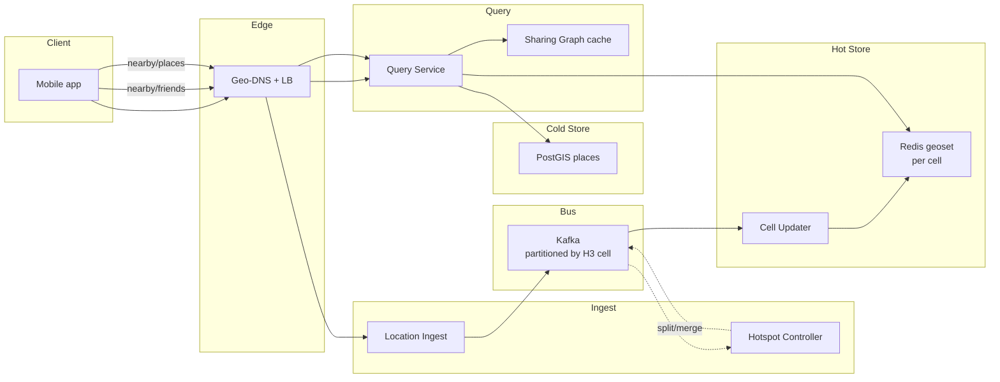
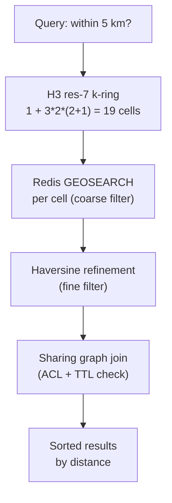
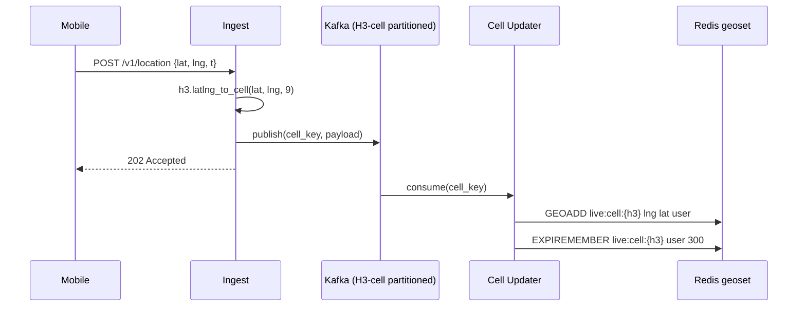
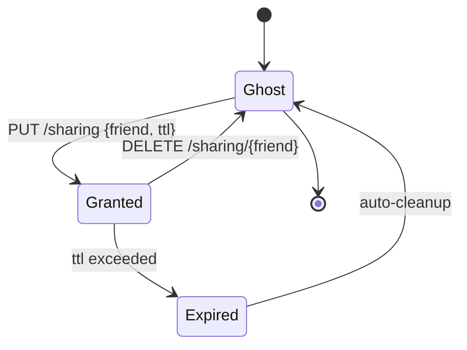

# Design a Proximity Service (Nearby Friends / Yelp)

> **TL;DR.** A proximity service answers "who/what is near me?" for two divergent workloads: static POIs (Yelp, 244M reviews [^1]) and live friend locations (Snap Map, over 400M MAU [^2]). The architecture splits into a PostGIS-backed place search and a Redis geoset-backed live-sharing layer, both indexed by H3 hexagonal cells. Kafka is partitioned by H3 cell ID so hotspot splits are tractable. The pivotal trade-off: hexagons give uniform neighbor distance for clean radius expansion, but require a coarse-filter/fine-filter refinement step because cell boundaries always produce false positives.

## Learning Objectives

- Design a dual-workload proximity service handling both static POI search and live friend-location sharing at 100M-user scale
- Compare geohash, H3, S2, quadtree, and PostGIS indexes and justify a choice for a given read/write ratio
- Size a Redis geoset write path for 100k updates/sec with per-member TTL
- Implement a k-ring fan-out read path that avoids over-fetching via Haversine refinement
- Detect and mitigate cell hotspots during concerts, protests, and disasters using dynamic resolution splitting
- Reason about location privacy via per-friend TTLs rather than a global toggle

## Intuition

"Find nearby friends" looks like a hash lookup. Store each user's lat/lng, query by distance. A single PostgreSQL table with `ST_DWithin` handles 100 users trivially.

At 1 million concurrent sharers updating every 10 seconds, that table absorbs 100k writes/sec. Community benchmarks suggest PostGIS GiST indexes struggle beyond roughly 10k to 30k writes/sec per primary before page-lock contention dominates. The read side is worse: a concert ends, 60,000 people open the app, and every query fans out across the same geographic cells. One shard melts.

The insight that unlocks the design: separate the two workloads entirely. Static POIs (restaurants, gas stations) change hourly and fit PostGIS perfectly. Live friend locations change every few seconds and belong in an in-memory geoset (Redis) partitioned by spatial cell. Partition Kafka by cell ID, not user ID, so that a hotspot in one cell can be split into finer-resolution children without touching the rest of the system.

The second insight: no cell index is exact. Every cell-based query returns false positives at boundaries. The universal fix is the two-step refinement pattern: coarse-filter by cell membership, fine-filter by exact Haversine distance [^3]. Accept this cost. It is O(candidates) and candidates are bounded by cell size.

## Requirements

### Clarifying Questions

- **Q: Nearby friends (dynamic), nearby places (static), or both?**
  Assume: Both. They share a query API but diverge in storage and freshness.
- **Q: Fixed radius or user-specified? Need k-NN too?**
  Assume: User-specified radius (default 5 km). k-NN for "closest 20 restaurants."
- **Q: Freshness target for live sharing?**
  Assume: Under 30 seconds for shared friends; under 60 seconds for discovery.
- **Q: Sharing model?**
  Assume: Per-friend grants with optional TTL. Ghost Mode by default (opt-in sharing) [^4].
- **Q: GPS or cell-tower accuracy?**
  Assume: GPS (5 m) on mobile; coarsen to cell center for privacy.
- **Q: Global day-one or single-region?**
  Assume: Single region first, multi-region roadmap.
- **Q: Mobile battery budget?**
  Assume: Request 10-second updates; expect iOS to throttle to 20 to 60 seconds in practice.

### Functional Requirements

- Update location from mobile client (lat, lng, accuracy, timestamp)
- Fetch friends within radius R, filtered by sharing graph and TTL
- Search businesses by category, query string, and radius
- Per-friend sharing grants with configurable expiry
- Notify when a shared friend crosses a configured geofence radius

### Non-Functional Requirements

- **Load:** 100M users, 50M friendships, 1M concurrent sharers. 100k location updates/sec peak (commute spike 200k/sec).
- **Latency:** Nearby-query p99 < 500 ms. Location ingest p99 < 100 ms.
- **Availability:** 99.95% read path, 99.9% write path.
- **Consistency:** Eventual for location (30s staleness acceptable). Strong for sharing-graph mutations.
- **Privacy:** Per-friend TTL server-side. Auto-fade after 24 hours of inactivity [^4]. Encrypted at rest.

## Capacity Estimation

| Metric | Value | Derivation |
|--------|------:|------------|
| Location writes/sec (peak) | 200k | 1M sharers / 10s interval, 2x commute spike |
| Nearby-friends reads/sec (avg) | 60 | 5M views/day / 86,400 |
| Nearby-friends reads/sec (concert spike) | 10k | 15-min burst |
| Hot-set memory | 320 MB | 5M sharers x 64 bytes per geoset member |
| POI storage | 400 GB | 200M businesses x 2 KB |
| Bandwidth in | 20 MB/s | 100k writes x 200 bytes |
| Bandwidth out | 50 MB/s | Reads return 20 friends x 100 bytes x 10k QPS peak |

- **Read:write ratio (live):** ~1:1,600 at steady state; inverts to 100:1 during concert spikes.
- **Cache hit rate:** The hot set fits one Redis node (320 MB). Replication handles read fan-out.
- **POI index:** PostGIS GiST on `geography(Point, 4326)` with per-region read replicas.

## API and Data Model

### API Design

```http
POST /v1/location
  Body: { "lat": 37.7749, "lng": -122.4194, "accuracy_m": 5, "timestamp": "..." }
  Returns: 202 Accepted
  Rate limit: 1 per 3 seconds per user (server-side dedup)

GET /v1/nearby/friends?radius_m=5000
  Returns: 200 { "friends": [{"user_id": "...", "distance_m": 340, "last_seen_s": 12}], "next_cursor": "..." }

GET /v1/nearby/places?lat=37.77&lng=-122.41&radius_m=2000&category=restaurant&q=sushi
  Returns: 200 { "places": [...], "next_cursor": "..." }

PUT /v1/sharing
  Body: { "friend_id": "uuid", "ttl_seconds": 3600 }
  Returns: 200 { "expires_at": "..." }

DELETE /v1/sharing/{friend_id}
  Returns: 204 (revoke within 5 seconds)
```

### Data Model

```sql
-- Redis geoset: one per H3 res-7 cell (~5.16 km^2)
-- Key: live:cell:{h3_cell_id}
-- Members: user_id with score = 52-bit geohash (GEOADD)
-- Per-member TTL: 300 seconds (5 min expiry on stale locations)

-- Sharing graph (Redis + Cassandra-backed)
-- Key: share:{user_id}
-- Value: hash { friend_id -> expiry_ts }

-- PostGIS places (static POI)
CREATE TABLE places (
  id          uuid PRIMARY KEY,
  name        text,
  category    text,
  geog        geography(Point, 4326),
  rating      numeric(2,1),
  review_count int
);
CREATE INDEX ON places USING GIST (geog);

-- Location history (Cassandra, optional analytics)
-- Partition: user_id, Cluster: bucket_ts (1-min), TTL 7 days
```

## High-Level Architecture



*Location updates flow left-to-right through cell-partitioned Kafka into per-cell Redis geosets; queries fan out to the right cells and join the sharing graph before responding.*

**Write path:** The mobile client posts lat/lng to the Location Ingest service. Ingest computes the H3 cell ID at resolution 9, validates the payload, and publishes to Kafka partitioned by cell. The Cell Updater consumes from Kafka and issues `GEOADD live:cell:{h3} lng lat user_id` with a 300-second per-member TTL [^5].

**Read path:** The Query Service receives a nearby-friends request, computes the caller's H3 cell, expands a k-ring of neighboring cells, issues parallel `GEOSEARCH` calls to each cell's Redis shard, joins results against the sharing graph (checking TTL expiry), refines by exact Haversine distance, and returns sorted results.

**Hotspot path:** The Hotspot Controller monitors per-cell write rates from Kafka consumer lag metrics. When a cell exceeds threshold (10k writes/sec), it triggers a resolution split from res-7 to res-8 children and updates the Kafka partition map.

## Deep Dives

### Geospatial index choice: why H3

Five index families compete for this workload. The choice depends on query shape, write rate, and neighbor semantics.

**Geohash** interleaves lat/lng bits along a Z-order curve and base-32 encodes the result [^6]. Elastic's documentation notes that length-12 geohash cells cover less than a square metre [^7]. Redis uses 52 bits of this interleave as a sorted-set score, giving sub-millisecond `GEOSEARCH` [^5][^8]. The fatal flaw: two points one metre apart across a cell boundary can share no prefix at all, because the Z-curve is not continuous across the equator or meridians [^6]. Cells are rectangular and elongate with latitude: a degree of longitude is 111 km at the equator but only 56 km at 60 degrees latitude [^6].

**H3** (Uber, 2018) tiles the sphere with hexagons at 16 resolutions [^9]. Each hexagon has exactly 6 equidistant neighbors, unlike squares which have 4 edge-adjacent and 4 diagonal-adjacent at sqrt(2)x distance [^9]. The `gridDisk(cell, k)` primitive returns `1 + 3k(k+1)` cells, a clean circular approximation [^10]. Resolution 7 averages 5.16 km^2 per cell; resolution 9 averages 0.105 km^2 [^10]. The 12 pentagons per resolution sit over ocean in the Dymaxion orientation and never affect urban queries [^9].

**S2** (Google) projects the sphere onto six cube faces, applies a Hilbert curve to each, and produces a 64-bit `S2CellId` with 31 levels of hierarchy (levels 0 through 30, where `kMaxLevel = 30`) [^11]. Numerically close IDs are spatially close, so any B-tree becomes a geo index. Google Maps, MongoDB 2dsphere, and CockroachDB use S2 internally [^11][^12]. The API is complex (`S2RegionCoverer`, `min_level`, `max_level`, `max_cells`), and k-ring expansion is less clean than H3's because adjacent cells across cube faces are numerically distant [^11].

**PostGIS GiST** (R-tree) handles exact distance, polygons, and KNN via the `<->` operator [^13][^14]. It is the right choice for static POI search. But community benchmarks suggest GiST page locks limit writes to roughly 10k to 30k/sec per primary.

**Our pick:** H3 for the live-sharing layer (uniform neighbors, clean k-ring, 64-bit integer key). PostGIS for static POI search (exact distance, polygon support, SQL). Redis GEO under the hood uses geohash scoring, but we partition by H3 cell externally so the geohash edge-straddle problem is contained within each cell's sorted set.



*The two-step refinement pattern: H3 k-ring provides the coarse filter, exact Haversine distance provides the fine filter, and the sharing graph enforces privacy.*

### Write path and hotspot containment

The write path must absorb 100k to 200k location updates/sec without letting a stadium crowd collapse a single shard.

**Normal flow:** Ingest computes `h3.latlng_to_cell(lat, lng, 9)` and publishes to Kafka with the cell ID as the partition key. The Cell Updater consumes and issues `GEOADD` [^5]. Because Kafka is partitioned by cell, all updates for co-located users land on the same partition, which means the downstream Redis shard for that cell handles a bounded write rate proportional to cell population.

**Hotspot detection:** The Hotspot Controller watches per-partition lag and write-rate metrics. When a res-7 cell exceeds 10k writes/sec (a stadium holding 60,000 fans with 10-second update intervals = 6,000 writes/sec, plus spectators outside), it triggers a split.

**Dynamic split:** The controller computes the 7 res-8 children of the hot res-7 cell [^10], creates new Kafka partitions for each child, and updates the partition routing table. Ingest begins computing res-8 cell IDs for users in the hot zone. The old res-7 partition drains. Queries transparently expand their k-ring at the finer resolution.



*Ingest computes the H3 cell, Kafka partitions by cell, and the updater writes the cell's Redis geoset with a 5-minute per-member TTL so stale locations auto-expire.*

### Read path: k-ring fan-out and refinement

A "friends within 5 km" query at H3 resolution 7 (cell edge ~1.4 km) requires expanding a k-ring of k=2, yielding 19 cells [^10]. Each cell maps to a Redis shard. The query fans out in parallel.

**Step 1: Cell expansion.** Compute the caller's res-7 cell. Call `gridDisk(cell, 2)` to get 19 candidate cells.

**Step 2: Parallel GEOSEARCH.** For each cell, issue `GEOSEARCH live:cell:{c} FROMLONLAT lng lat BYRADIUS 5000 m` [^5]. Redis returns all members within the bounding box of each cell that pass its internal Haversine check. This is the coarse filter.

**Step 3: Sharing graph join.** For each candidate friend, check `share:{caller}` for a valid grant with `expiry_ts > now`. Revocations propagate within 5 seconds because the sharing graph is in Redis with Cassandra as durable backing.

**Step 4: Haversine refinement.** Compute exact great-circle distance for each candidate. Discard anyone beyond the requested radius. Haversine error versus the WGS84 ellipsoid is under 0.5% [^3], acceptable for social proximity.

**Step 5: Sort and return.** Order by distance ascending. Include `last_seen_s` (server_time minus last update timestamp) so the client can grey out stale friends.

### Privacy: per-friend TTL and Ghost Mode

Location is the most sensitive attribute most apps store. Snap Map defaults to Ghost Mode on first install; sharing is opt-in per friend [^4]. Location updates are infrequent (users who do not open the app disappear after 24 hours) and positions auto-fade after 24 hours of inactivity [^4].

**Per-friend grants** are the right primitive. A global toggle ("share with all friends") is too coarse. The sharing graph stores `{friend_id -> expiry_ts}` per user. Every read-path join checks expiry. Revocation deletes the entry; propagation is bounded by Redis replication lag (sub-second).

**Precision fuzzing:** Never return raw GPS coordinates in API responses. Snap to the H3 res-9 cell center (edge ~201 m, apothem ~174 m, so worst-case snap distance ~174 m to the nearest edge midpoint) before responding. This prevents address-level stalking while preserving "nearby" utility.

**Auto-expire:** The 300-second per-member TTL on Redis geoset entries means a user who stops updating (phone dies, enters subway) disappears from queries within 5 minutes. The sharing grant's own TTL provides a second layer: even if the geoset entry persists, an expired grant blocks the read.



*A sharing grant transitions through Ghost, Granted, and Expired states; revocation returns to Ghost within seconds; per-friend TTL is the privacy primitive.*

## Real-World Example

**Uber H3 and Snap Map represent the two extremes of the proximity spectrum.**

Uber reportedly receives driver locations every 4 seconds [^15]. At an estimated 5 million active drivers, this would produce approximately 1.25 million updates per second at peak [^15]. H3 resolution 9 (~0.105 km^2) is used for matching; resolution 7 (~5.16 km^2) for surge heatmaps [^9][^10]. Kafka is partitioned by H3 cell so that co-located drivers land on the same broker, enabling cell-local queries without cross-partition joins [^9]. The dispatch system computes `gridDisk(cell, 7)` (169 cells at res 9, covering ~1.3 km) and scores candidates by predicted ETA [^15].

Snap Map takes the opposite approach. With over 400 million monthly active users [^2] (reported at ~435M in Q4 2025 third-party tallies [^16]) on a platform of 474 million DAU [^16], it prioritizes privacy over freshness. Ghost Mode is the default; sharing is opt-in per friend [^4]. Users who do not open the app disappear from the Map after 24 hours of inactivity [^4]. The display is a stylized map with Bitmoji avatars, not a precise coordinate grid. Actionmap aggregates anonymized snap submissions into heatmaps [^2]. The engineering lesson: a proximity product does not require continuous GPS. Infrequent, coarse updates with aggressive TTLs can serve hundreds of millions of users at a fraction of the infrastructure cost.

Yelp represents the static-POI workload: 244 million cumulative reviews at end of 2021 [^1], with another 22 million added in 2023 alone [^17]. Millions of daily visitors find businesses through Yelp search [^18], which fuses relevance, proximity, rating, and review count simultaneously [^18]. Foursquare's POI dataset covers 100 million places across 200+ countries with 16 billion human-verified check-ins [^19].

## Trade-offs

| Approach | Pros | Cons | When to Use |
|----------|------|------|-------------|
| Geohash (Redis GEO) | String prefix = hierarchy; sub-ms GEOSEARCH [^5] | Edge straddle; rectangular cells elongate at latitude [^6] | Live sharing with Redis; single-region prototypes |
| H3 (Uber) | Uniform 6-neighbor distance; clean gridDisk(k); 16 resolutions [^9][^10] | 12 pentagons per resolution; approximate cross-level containment | Social proximity, dispatch, surge gradients |
| S2 (Google) | Hilbert-curve 64-bit key in any B-tree; levels 0-30 (leaf cells ~1 cm) [^11] | Complex API; k-ring less clean than H3 | Large-scale mapping; MongoDB 2dsphere; Foursquare |
| Quadtree | Adapts to density; trivial in-memory | Data-dependent splits; hard to shard deterministically | Games; bounded single-node maps |
| PostGIS GiST | Exact SQL distance; polygons; KNN operator [^13][^14] | Single-writer ~10-30k QPS ceiling | Static POIs; geofences; analytics |
| MongoDB 2dsphere | Document-store integrated; uses S2 internally [^12] | Performance degrades on large ranges | Mid-scale POI where Mongo is already in stack |
| Tile38 | Geofence-as-a-service; WebSocket push for enter/exit [^20] | Separate operational surface | Real-time fleet geofencing |

The single biggest meta-decision: where to draw the line between the live layer (Redis, H3-partitioned, write-heavy) and the cold layer (PostGIS, read-heavy, exact). Our answer: anything with update cadence under 5 minutes goes to Redis. Everything else goes to PostGIS. The query service abstracts both behind a unified `/nearby/*` API.

## Scaling and Failure Modes

**At 10x load (1M updates/sec, 10M concurrent sharers):** The Redis hot set grows to 3.2 GB, still single-node viable. But hot cells (Times Square, airports) saturate individual shards. Mitigation: dynamic resolution splitting (res-7 to res-8) and Redis Cluster with cell-aware slot assignment.

**At 100x load (10M updates/sec):** Kafka partition count must scale to thousands. Redis Cluster alone is insufficient; add a regional edge cache layer (read replicas per metro) so that nearby-friends queries resolve locally. PostGIS read replicas per region handle POI fan-out.

**At 1000x load:** The architecture shifts to edge-local proximity resolution. Each metro runs its own Kafka cluster and Redis tier. Cross-region queries (friend in Paris, querier in NYC) route through a global coordination layer that aggregates results from both metros.

**Failure modes:**

- **Redis shard failure:** Sentinel promotes a replica within seconds. During failover, queries to that cell return stale data (last replicated state). The 300-second TTL bounds staleness.
- **Kafka partition leader failure:** Consumer group rebalances. Location updates queue on the client (mobile SDK buffers 60 seconds). No data loss; latency spike of 5 to 15 seconds.
- **Hotspot controller lag:** If the controller fails to split a hot cell, the Redis shard for that cell saturates. Circuit breaker on the Cell Updater drops updates for the hot cell and alerts on-call. Degraded mode: queries return stale data until the split completes.

## Common Pitfalls

> [!WARNING]
> **Cell-boundary false positives.** A "within 1 km" query returns users 1.3 km away because they sit in a boundary cell partially inside the radius. Always run Haversine refinement after cell lookup. Tune resolution so cell edge is roughly radius/3 to radius/4.

> [!WARNING]
> **Hotspot cells collapse a shard.** A stadium puts 60,000 users in one res-7 cell. Without dynamic splitting, one Redis shard and one Kafka partition absorb all traffic. Monitor per-cell write rate; alert when max/median exceeds 20x.

> [!WARNING]
> **Stale locations treated as current.** Mobile OS throttles GPS updates aggressively under low battery. A "last known location" 3 minutes old misleads the querier. Use server receive time as authoritative; TTL every geoset entry; display `last_seen_s` in the response.

> [!WARNING]
> **Antimeridian wraparound.** A ship crossing 180 degrees longitude disappears from geohash prefix searches because the Z-curve is discontinuous at the meridian [^6]. Use H3 or S2 for global services; geohash is safe only for single-region.

> [!WARNING]
> **Privacy leaks through precision.** Six-decimal GPS coordinates (sub-metre) in API responses reveal home addresses. Snap to cell center before responding. Default to Ghost Mode. Enforce per-friend TTLs server-side, not client-side [^4].

> [!WARNING]
> **Haversine vs Vincenty mismatch.** Haversine assumes a sphere (error under 0.5%); Vincenty assumes the WGS84 ellipsoid (sub-millimetre) [^3]. Mixing formulae across services produces silent drift on long-distance queries. Standardize: Haversine for radius filters under 100 km, Vincenty for legal boundaries.

## Follow-up Questions

**1. How do you add Ghost Mode with per-friend exceptions?**

The sharing graph is the source of truth. Ghost Mode = empty grant set. A per-friend exception is a single `PUT /sharing {friend, ttl}` entry. The query path checks grants, not a global toggle. Revocation is a delete, not a mode switch.

**2. What changes for geofenced alerts ("notify when Alice is within 200 m of home")?**

Store geofences as H3 cell coverings. On each location update, check if the user's new cell intersects any active geofence covering. If yes, evaluate exact distance and fire an ENTER/EXIT event via push notification. Tile38 provides this as a primitive [^20].

**3. How do you serve a 50 km radius query in a dense city without fan-out explosion?**

Switch to a coarser resolution (res 5, ~252 km^2 cells) for the k-ring expansion. Accept higher false-positive rate from the coarse filter. Alternatively, cap results at k=50 nearest and use PostGIS KNN (`<->` operator) for the long-range query.

**4. How do you detect spoofed-GPS fraud?**

Cross-reference reported location with IP geolocation and cell-tower triangulation. Flag users whose GPS jumps exceed physically possible speed (e.g., 1,000 km in 10 seconds). Rate-limit location updates that change cell by more than k=3 in one interval.

**5. Can this run on edge compute (Cloudflare Workers)?**

The read path can partially: cache the sharing graph at the edge and serve nearby-friends from a regional Redis replica. The write path cannot: Kafka ingest and hotspot control require stateful coordination that edge workers lack. Hybrid: edge for reads, origin for writes.

**6. What is the rollback plan if a new H3 resolution deploy corrupts locations?**

Kafka retains 24 hours of raw location events. Replay from the last known-good offset into a parallel Redis cluster at the correct resolution. Swap traffic via the query service's cell-routing config. The corrupted cluster drains and is decommissioned.

## Exercise

### Exercise 1: Concert hotspot sizing

A Taylor Swift concert ends. 60,000 fans in a 0.5 km^2 area open the app within 3 minutes. Each fan has an average of 8 friends also at the concert. Estimate the read QPS on the Redis shard serving that cell, and propose a mitigation that keeps p99 under 500 ms.

<details>
<summary>Hint</summary>

Each fan queries nearby friends. The k-ring for a 5 km radius at res-7 hits ~19 cells, but most friends are in the same cell. Think about how many GEOSEARCH commands hit the hot shard, and what happens if you pre-split before the event starts.

</details>

<details>
<summary>Solution</summary>

**Read QPS:** 60,000 fans / 180 seconds = 333 queries/sec. Each query hits the hot cell's Redis shard (plus neighbors, but the hot cell dominates). With 8 friends per fan in the same cell, each GEOSEARCH returns ~480 candidates (60,000 members, filtered by sharing graph). Redis GEOSEARCH at this cardinality takes ~1 to 2 ms per call. 333 calls/sec x 2 ms = 666 ms of CPU per second, leaving headroom on a single core but tight under concurrent load.

**Mitigation:** Pre-split the cell before the event. The venue's res-7 cell is known in advance. Split it into 7 res-8 children before doors open. Each child handles ~8,500 users instead of 60,000. Read QPS per shard drops to ~48/sec. Add a read replica per child for safety.

**Trade-off accepted:** Pre-splitting requires event awareness (calendar integration or manual ops). For unexpected hotspots, the dynamic controller handles it reactively with a 30 to 60 second detection lag.

</details>

## Key Takeaways

- **Pick the index to fit the query.** H3 for live "near me" (uniform neighbors, clean k-ring). PostGIS for place search (exact distance, polygons). Both coexist behind one API.
- **Partition Kafka by cell, not user.** This makes hotspot splitting tractable: split one partition into children without touching the rest of the topic.
- **Per-friend TTLs are the right privacy primitive.** A global toggle is too coarse. Snap Map's Ghost Mode + per-friend grants + 24-hour auto-fade is the production pattern [^4].
- **Always refine after cell lookup.** Cell indexes produce false positives at boundaries. The coarse-filter/fine-filter pattern (cell membership then Haversine) is non-negotiable.
- **The hard part is not the index.** It is the sharing graph, the hotspot controller, and iOS refusing GPS updates from a pocket underground.

## Further Reading

- [H3: Uber's Hexagonal Hierarchical Spatial Index](https://www.uber.com/us/en/blog/h3/). The origin blog explaining why hexagons beat squares for proximity gradients and how the icosahedron orientation places pentagons over ocean [^9].
- [H3 Resolution Tables](https://h3geo.org/docs/core-library/restable/). Cell counts, edge lengths, and areas at every resolution; the numbers you need for back-of-envelope estimation [^10].
- [S2 Geometry Library](https://s2geometry.io/devguide/s2cell_hierarchy). Google's Hilbert-curve cell hierarchy, 64-bit cell ID bit layout, and S2RegionCoverer API [^11].
- [Redis Geospatial Documentation](https://redis.io/docs/latest/develop/data-types/geospatial/). GEOADD, GEOSEARCH, GEODIST with live code examples and complexity analysis [^5].
- [PostGIS ST_DWithin Reference](https://postgis.net/docs/ST_DWithin.html). The index-accelerated radius filter that powers static POI search; includes use_spheroid semantics [^13].
- [Foursquare Places API](https://foursquare.com/products/places-api/). 100M+ POI dataset with Place Match scoring and Movement SDK venue matching [^19].
- [Tile38 Real-Time Geofencing](https://tile38.com/topics/network-protocols). WebSocket push for geofence enter/exit events; the reference for real-time fleet tracking [^20].

## Flashcards

<details>
<summary><strong>Q: Why do hexagons beat squares for proximity queries?</strong></summary>

A: Hexagons have one neighbor class (6 equidistant neighbors) giving uniform expansion via gridDisk. Squares have two classes (edge vs corner at sqrt(2)x distance), distorting radius queries into diamonds rather than circles [^9].

</details>

<details>
<summary><strong>Q: What is the two-step refinement pattern for cell-based proximity?</strong></summary>

A: Step 1 (coarse filter): query the cell index for all members in the k-ring of cells covering the radius. Step 2 (fine filter): compute exact Haversine distance for each candidate and discard those beyond the requested radius.

</details>

<details>
<summary><strong>Q: How many cells does H3 gridDisk(cell, k) return?</strong></summary>

A: 1 + 3k(k+1). So k=1 returns 7, k=2 returns 19, k=7 returns 169 cells.

</details>

<details>
<summary><strong>Q: Why partition Kafka by H3 cell ID rather than user ID?</strong></summary>

A: Cell-based partitioning co-locates spatially adjacent updates on the same partition, making hotspot detection and dynamic splitting tractable. User-based partitioning scatters co-located users across all partitions.

</details>

<details>
<summary><strong>Q: What is the geohash edge-straddle problem?</strong></summary>

A: Two points one metre apart on opposite sides of a geohash cell boundary can share no common prefix because the Z-order curve is discontinuous at cell edges [^6]. Redis GEOSEARCH mitigates this by scanning 9 cells (center + 8 neighbors).

</details>

<details>
<summary><strong>Q: How does Snap Map handle privacy by default?</strong></summary>

A: Ghost Mode is enabled on first install. Sharing is opt-in per friend. Users who do not open the app disappear after 24 hours of inactivity [^4].

</details>

<details>
<summary><strong>Q: What is the Haversine formula's error versus the WGS84 ellipsoid?</strong></summary>

A: Under 0.5%. Haversine assumes a perfect sphere; the Earth is an oblate spheroid. For radius filters under 100 km, this error is negligible. For cross-ocean or legal-boundary queries, use Vincenty [^3].

</details>

<details>
<summary><strong>Q: How do you handle a hotspot cell (stadium, concert)?</strong></summary>

A: Monitor per-cell write rate. When it exceeds threshold (e.g., 10k writes/sec), split the res-7 cell into its 7 res-8 children. Update the Kafka partition map. Queries transparently expand at the finer resolution.

</details>

<details>
<summary><strong>Q: What H3 resolution does Uber use for matching vs surge?</strong></summary>

A: Resolution 9 (~0.105 km^2, ~201 m average edge) for driver-rider matching. Resolution 7 (~5.16 km^2, ~1.4 km average edge) for surge pricing heatmaps [^9][^10].

</details>

<details>
<summary><strong>Q: Why does PostGIS top out at 10-30k writes/sec for live location?</strong></summary>

A: GiST index maintenance requires page-level locks during node splits. Under high write concurrency, these locks become the bottleneck. This is acceptable for static POIs but not for live location streams.

</details>

## References

[^1]: Statista, "Yelp: cumulative number of reviews 2022". https://www.statista.com/statistics/278032/cumulative-number-of-reviews-submitted-to-yelp/

[^2]: Snap Inc., "Snap Map Grows to over 400 Million Monthly Active Users". https://newsroom.snap.com/2025-snap-map-mau

[^3]: Stack Overflow, "Is the Haversine Formula or the Vincenty's Formula better for calculating distance?". https://stackoverflow.com/questions/38248046/is-the-haversine-formula-or-the-vincentys-formula-better-for-calculating-distance

[^4]: Snap Inc., "Privacy by Product: Snap Map". https://values.snap.com/privacy/privacy-by-product#snap-map

[^5]: Redis, "Redis geospatial" (data type documentation). https://redis.io/docs/latest/develop/data-types/geospatial/

[^6]: Wikipedia, "Geohash" (precision per length table, edge cases, non-linearity at latitude). https://en.wikipedia.org/wiki/Geohash

[^7]: Elastic, "Geohash grid aggregation" (length 12 cells cover less than a square metre). https://www.elastic.co/docs/reference/aggregations/search-aggregations-bucket-geohashgrid-aggregation

[^8]: Redis source, src/geohash.c (canonical interleave64 and geohashNeighbors). https://github.com/redis/redis/blob/unstable/src/geohash.c

[^9]: Isaac Brodsky, "H3: Uber's Hexagonal Hierarchical Spatial Index", Uber Engineering Blog, 2018-06-27. https://www.uber.com/us/en/blog/h3/

[^10]: Uber H3 documentation, "Tables of Cell Statistics Across Resolutions". https://h3geo.org/docs/core-library/restable/

[^11]: Google S2 Geometry, "S2 Cells" and "S2 Cell Hierarchy" developer guide. https://s2geometry.io/devguide/s2cell_hierarchy

[^12]: MongoDB docs, "Geospatial Indexes" and "2dsphere Indexes". https://mongodb.com/docs/v7.0/core/indexes/index-types/index-geospatial/

[^13]: PostGIS, "ST_DWithin" reference. https://postgis.net/docs/ST_DWithin.html

[^14]: PostGIS performance tips (GiST spatial indexes). https://postgis.net/docs/performance_tips.html

[^15]: Tech Interview Dot Org, "Ride-Sharing Dispatch System (Uber/Lyft)". https://techinterview.org/system-design-rideshare-dispatch/

[^16]: Useqwitter, "Snapchat Users, Revenue, Demographics and Trends" (Q4 2025 MAU/DAU). https://useqwitter.com/snapchat-statistics/

[^17]: Yelp Trust and Safety Report 2023. https://trust.yelp.com/trust-and-safety-report/2023-report/

[^18]: Yelp for Business, "Understanding Yelp search". https://blog.yelp.com/businesses/the-guide-to-understanding-yelp-search/

[^19]: Foursquare, "Global POI Data for Developers". https://foursquare.com/products/places-api/

[^20]: Tile38, "Network Protocols" and AWS Location Service, "Geofences". https://tile38.com/topics/network-protocols
