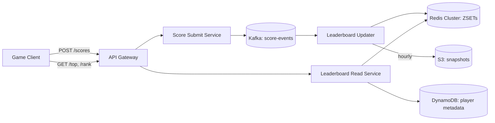
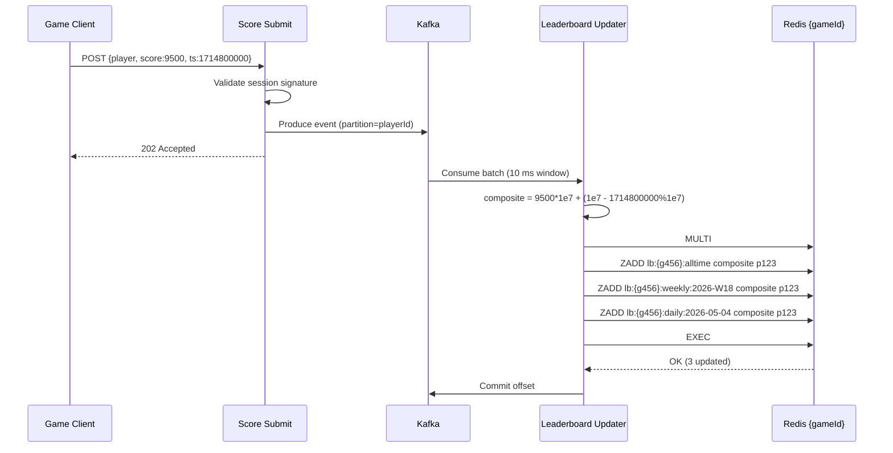
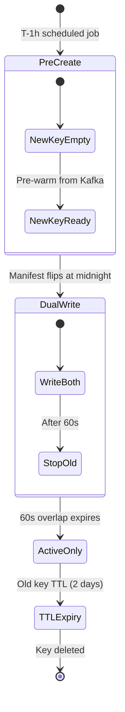

# Design a Real-Time Leaderboard

> **TL;DR.** A real-time leaderboard ranks 10M players by score and answers three queries on the hot path: top-K, player rank, and near-me neighbors. Redis sorted sets give O(log N) inserts and O(log N + M) range reads on a single node handling ~100K ops/sec[^1][^2]. The pivotal trade-off is durability versus speed: Redis is the projection layer, Kafka is the source of truth, and every other decision (composite scores, window rotation, friend intersection, approximate tail rank) exists to manage the sorted set's sharp edges at scale.

## Learning Objectives

- Design a leaderboard on Redis sorted sets and reason about ZADD/ZREVRANK costs at 10M entries
- Encode tie-breaking into a single composite score without losing IEEE-754 precision
- Architect per-window leaderboards (daily, weekly, all-time) with key rotation and zero-downtime cutover
- Solve friend-leaderboard fan-out via query-time intersection instead of per-user materialization
- Trade exact rank for approximate rank in the long tail using Count-Min Sketch and TOP-K
- Separate the durable event log (Kafka) from the volatile cache (Redis) and recover after data loss

## Intuition

A leaderboard looks like a trivial CRUD problem. Store scores, sort them, return the top 10. A single PostgreSQL table with `ORDER BY score DESC LIMIT 10` handles 100 users fine.

At 10 million players with 100,000 score updates per second, that query collapses. The naive SQL approach stops scaling somewhere between 50,000 and 500,000 users depending on update frequency[^3]. Every INSERT or UPDATE triggers an index rebalance; every top-N read scans the entire B-tree leaf chain. The database spends more time maintaining sort order than serving requests.

The insight that unlocks the design: a skip list, the probabilistic data structure introduced by William Pugh in 1990[^4], gives O(log N) insertion and O(log N + M) range reads without the overhead of a full relational engine. Redis wraps this in a sorted set (ZSET) that fits 10M entries in ~640 MB of RAM[^5]. One ZADD updates a player's rank. One ZREVRANGE returns the top 100. One ZREVRANK returns a player's position. All in microseconds.

But Redis is volatile. A crash loses everything. And a single sorted set cannot handle 500K writes/sec when every score event fans out to five time windows. The real design problem is not "how do I sort scores" but "how do I keep a volatile cache consistent with a durable log, partition it for throughput, handle ties, serve friend-scoped views, and degrade gracefully for the 95% of players who will never see the top 1000."

## Requirements

### Clarifying Questions

- **Q: What triggers a score update?** Assume: game completion events. Scores are monotonically increasing (high-score semantics); a lower score never overwrites a higher one.
- **Q: Tie-breaking policy?** Assume: earliest submission wins. Two players with the same score are ranked by who achieved it first.
- **Q: Which time windows?** Assume: all-time, weekly (Monday reset), and daily. Plus a friend-scoped view per window.
- **Q: Exact rank for all 10M players?** Assume: exact rank for top 1M; approximate percentile ("top 15%") for the tail.
- **Q: Freshness target?** Assume: top-N reads reflect scores within 1 second. Friend views tolerate 5 seconds of staleness.
- **Q: Global or per-game?** Assume: per-game leaderboards. Each game has independent boards across all windows.
- **Q: Tournament spikes?** Assume: peak traffic is 3x average during scheduled events. The system must not drop score events.

### Functional Requirements

- Submit a score for a player in a game; the system persists it durably and updates all active windows
- Retrieve the top-N players (with scores and metadata) for any window
- Retrieve a player's rank, score, and percentile in any window
- Retrieve K neighbors above and below a given player ("near-me" view)
- Retrieve a friend-scoped leaderboard for a player in any window

### Non-Functional Requirements

- **Load:** 100K score updates/sec peak; 20K read RPS peak (top-N and rank queries)
- **Latency:** p99 < 50 ms for top-10 reads; p99 < 100 ms for rank and near-me queries
- **Availability:** 99.95% through Redis node failures; score events never silently lost
- **Consistency:** eventual (up to 1 s staleness on reads); friend views up to 5 s
- **Durability:** Kafka retains events for 90 days; Redis loss is recoverable via replay

## Capacity Estimation

| Metric | Value | Derivation |
|--------|------:|------------|
| Players per game | 10M | Given requirement |
| Memory per ZSET entry | ~64 B | member + score + skiplist node overhead (pointers, levels)[^5] |
| Single window memory | 640 MB | 10M x 64 B |
| Total memory (3 windows + 20 regional) | ~15 GB | 23 ZSETs x 640 MB |
| Peak write QPS (raw) | 100K | Given requirement |
| Write amplification (5 windows) | 500K ZADDs/sec | 100K x 5 active windows |
| Kafka ingress | 10 MB/sec | 100K events x 100 B each |
| Kafka 90-day retention | ~75 TB | 10 MB/sec x 86,400 x 90 |
| Read QPS (peak) | 20K | 1M DAU x 100 reads/day / 86,400 x 17 (peak factor) |

- **Read:write ratio:** ~1:25 at the Redis layer (500K ZADDs vs 20K reads). This is a write-dominated workload.
- **Single Redis node capacity:** ~100K ops/sec[^2]. Five nodes minimum for the write path alone.
- **Bandwidth:** 500K ZADDs x 24 B per command = ~12 MB/sec into Redis Cluster.

## API and Data Model

### API Design

```http
POST /v1/scores
  Body: { "playerId": "p123", "gameId": "g456", "score": 9500, "timestamp": 1714800000 }
  Returns: 202 Accepted { "eventId": "evt_abc" }
  Notes: Async. Write goes to Kafka; rank updates within 1 s.

GET /v1/leaderboards/{gameId}/top?window=weekly&limit=100
  Returns: 200 { "entries": [{ "rank": 1, "playerId": "...", "score": 9500, "name": "..." }], "window": "weekly:2026-W18" }

GET /v1/leaderboards/{gameId}/players/{playerId}?window=weekly
  Returns: 200 { "rank": 4217, "score": 7300, "percentile": 0.58, "window": "weekly:2026-W18" }

GET /v1/leaderboards/{gameId}/players/{playerId}/neighbors?window=weekly&k=5
  Returns: 200 { "above": [...], "player": {...}, "below": [...] }

GET /v1/leaderboards/{gameId}/friends?playerId=p123&window=weekly
  Returns: 200 { "entries": [...], "cached": true, "ttl": 55 }
```

All reads are served from Redis. Writes are fire-and-forget into Kafka with a 202 response. Auth uses a server-signed session token validated at the API gateway.

### Data Model

```text
-- Redis sorted sets (one per game per window)
Key: lb:{gameId}:{window}        -- e.g. lb:{g456}:alltime, lb:{g456}:weekly:2026-W18
Member: playerId                  -- string, 8-12 chars
Score: composite float            -- score * 10^7 + (MAX_TS - timestamp)

-- Player metadata (DynamoDB)
Table: players
  PK: playerId
  Attributes: name, avatar_url, country, friend_list[]

-- Durable event log (Kafka)
Topic: score-events
  Partition key: playerId
  Value: { gameId, playerId, rawScore, timestamp, sessionSignature }
```

The `{gameId}` hash-tag braces in the Redis key ensure all windows for one game land on the same Redis Cluster node[^6]. This enables atomic multi-window ZADD via MULTI/EXEC without cross-slot errors.

## High-Level Architecture



*Score events flow through Kafka to the leaderboard-updater, which projects them into sharded Redis sorted sets; reads are served directly from Redis joined with player metadata from DynamoDB.*

**Write path.** The game client submits a score. The score-submit service validates the session signature (server-side anti-cheat gate), produces the event to Kafka partitioned by `playerId`, and returns 202. The leaderboard-updater consumes batches, computes the composite score, and issues a pipelined MULTI containing one ZADD per active window. After EXEC succeeds, the consumer commits its Kafka offset.

**Read path.** The leaderboard-read service handles top-N (ZREVRANGE), rank (ZREVRANK), near-me (ZREVRANK then ZREVRANGE around that position), and friend views (pipelined ZMSCORE + client-side sort). Player names and avatars come from a DynamoDB lookup cached at the read service for 60 seconds.

**Recovery path.** If Redis loses data (node failure, eviction, or operator error), the updater replays from Kafka's earliest retained offset for the affected game. Hourly S3 snapshots of the RDB file cut replay time from hours to minutes.

## Deep Dives

### Deep dive 1: Composite scores and the precision ceiling

The problem: two players achieve the same raw score. Who ranks higher? Redis sorts equal-score members lexicographically by member name[^1], which produces arbitrary, unstable ordering.

**The composite-score trick.** Encode both the raw score and a tie-breaker into a single 64-bit float:

```python
MULTIPLIER = 10**7
MAX_TS = 10**7  # covers ~115 days of epoch seconds

def composite(raw_score: int, timestamp: int) -> float:
    return raw_score * MULTIPLIER + (MAX_TS - timestamp)
```

Because `MAX_TS - timestamp` shrinks as time advances, an earlier submission gets a larger additive term and outranks a later one at the same raw score[^7][^8]. The raw score is recoverable via integer division: `raw = int(composite) // MULTIPLIER`.

**The precision ceiling.** IEEE-754 doubles have 53 bits of mantissa, representing integers exactly only up to 9,007,199,254,740,992[^1]. With 7 digits reserved for the timestamp component, raw scores must stay below ~900 billion. For most games this is fine. For games with unbounded scores (idle clickers), reduce the multiplier to 10^5 and accept coarser tie-breaking (10-second granularity).

**Under the hood.** The skip list uses a level probability of p = 0.25 (`ZSKIPLIST_P` in Redis source[^9]), giving a geometric level distribution where each node exists at level k with probability 0.25^(k-1). The maximum height is capped at 32 levels, which the Redis source comments as "enough for 2^64 elements" (with p=0.25, expected capacity is 4^32 ~ 1.8 * 10^19)[^10]. Search descends from the top level, walking forward while the next node's score is smaller, then dropping a level. The expected search cost analysis in Pugh's paper shows the probability of exceeding 3x expected time drops to 10^-6 at N = 256[^10].



*A single score event fans out to every active window on the same shard via composite-score encoding and a pipelined multi-window ZADD.*

### Deep dive 2: Windowed leaderboards and key rotation

Each time window is an independent ZSET keyed by the window identifier: `lb:{gameId}:daily:2026-05-04`, `lb:{gameId}:weekly:2026-W18`, `lb:{gameId}:alltime`[^8]. Every score event ZADDs to each active window. This creates write amplification: K active windows means K ZADDs per event.

**Rotation protocol:**

1. A scheduled job creates the next window's key 1 hour before cutover (e.g., `lb:{g456}:daily:2026-05-05` created at 23:00 UTC on May 4).
2. A manifest key (`lb:{gameId}:current_daily`) stores the active window name. Readers dereference this atomically.
3. At midnight, the manifest flips to the new key. The updater begins writing to both old and new for a 60-second overlap (dual-write), then stops writing to the old key.
4. Old keys receive a TTL of 172,800 seconds (2 days) for historical queries, then expire automatically[^8].

**Why this matters:** without the pre-creation step, clients querying at the exact rollover moment see an empty set. Without the manifest indirection, clients must know the current window name, creating a distributed clock-synchronization problem.



*Window rotation lifecycle: the next key is pre-created and warmed before cutover; a 60-second dual-write overlap prevents the "empty board" race condition.*

**Aggregation across windows:** ZUNIONSTORE with `AGGREGATE MAX` produces "personal best across daily boards" for a weekly rollup. This is a batch operation run once at the end of each day, not on the hot path.

### Deep dive 3: Friend leaderboards without materialization

The naive approach: maintain a ZSET per user containing only that user's friends' scores. At 10M players with a median of 200 friends, this creates 2 billion entries and forces 200 ZADDs per score event (20M writes/sec at 100K events/sec peak). Unacceptable.

**The query-time intersection pattern:**

1. Fetch the friend list from DynamoDB (~200 IDs, cached locally for 5 minutes).
2. Issue a single pipelined `ZMSCORE lb:{gameId}:{window} friend1 friend2 ... friend200` against the global board. This costs O(K) where K is the number of friends queried (~200), since each lookup uses the internal hash table at O(1) per member[^1]. It completes in one round trip.
3. Sort the ~200 (member, score) pairs client-side.
4. Cache the result per (userId, gameId, window) with a 60-second TTL.

At 200 friends, even the uncached path completes in under 10 ms. The 60-second cache means most friend-board reads are O(1) Redis GETs.

```mermaid
flowchart TD
    subgraph Rejected["Materialized fan-out (rejected)"]
        W1[Score event] --> W2[Read friend list: 200 IDs]
        W2 --> W3[ZADD to 200 per-user boards]
        W3 --> W4["Write amp: 200x per event = 20M/sec"]
    end
    subgraph Chosen["Query-time intersection (chosen)"]
        R1[Friend board request] --> R2[Check cache: 60s TTL]
        R2 -->|miss| R3[Fetch 200 friend IDs from DynamoDB]
        R3 --> R4[Pipelined ZMSCORE against global board]
        R4 --> R5[Sort 200 pairs client-side]
        R5 --> R6[Cache result 60s]
    end
```



*Materialized per-user boards cost O(P*F) storage and 200x write amplification; query-time intersection trades a slightly slower read for zero extra storage and no write fan-out.*

This mirrors the push-vs-pull debate in [Social Media Feed](./06-social-media-feed.md), but inverted: feed fan-out favors push because reads dominate, while leaderboard friend views favor pull because the friend subset is always a tiny slice of a global ranking[^11].

### Deep dive 4: Approximate rank for the long tail

Exact rank via ZREVRANK costs O(log N) per query. At 10M players this is fast. But maintaining exact rank for every player in every window consumes memory for a feature most players never check. Below rank 1M, "top 15%" is more useful than "rank 4,317,482."

**Count-Min Sketch + TOP-K approach:**

- Maintain exact rankings (the full ZSET) for the top 1M players.
- For the remaining 9M, maintain a Count-Min Sketch that estimates score frequency distribution[^12][^13]. Redis provides built-in `CMS.INCRBY` and `CMS.QUERY` commands, plus a TOP-K module for heavy-hitter tracking[^14].
- Bucket scores logarithmically (100 buckets). A player's percentile is derived from their bucket's cumulative count.

CMS never underestimates (errors are one-sided overestimates), so a player labeled "top 15%" is truly no worse than 15th percentile[^12]. The memory cost is constant regardless of player count: a CMS with width 2048 and depth 5 uses ~40 KB.

**The UX trade-off:** "You are rank 4,317,482 of 10,000,000" looks precise but is meaningless. "Top 43%" is honest and actionable. Duolingo solves this differently: cap leagues at approximately 30 users so every rank is exact and meaningful[^15][^16]. Their 10-tier system (Bronze through Diamond) with weekly promotion/relegation creates engagement without requiring a global ranking[^17].

## Real-World Example

### Strava segment leaderboards

Strava operates tens of millions of per-segment leaderboards, each ranking athletes on a specific road or trail section. Through 2021, Strava processed 1.8 billion activity uploads in a 12-month window[^18].

**Architecture.** Strava rebuilt its segment leaderboard infrastructure on Kafka, choosing it for "replication, strong ordering, high availability, and partitioning"[^11]. Activities flow as events through the pipeline; leaderboard projections are built by consumers that rank efforts per segment. This matches our design: Kafka as source of truth, Redis-like projections as the read layer.

**Anti-cheat.** Strava's integrity program removed 14.85 million anomalous activities across three cleanup waves (4.45M runs in May 2025, 3.9M rides in January 2026, 6.5M via rules-based fixes in December 2024)[^18]. The system layers rule-based fast-fail (impossible speed, impossible climb rate) before ML models trained on community-flagged examples. Their stated priority: "minimize false positives so athletes aren't penalized for legitimate (and extraordinary) performances"[^18].

**Key insight.** Per-segment leaderboards (hyper-local competition) drive retention far more than a global ranking. A user ranked 50,000th globally has no motivation; the same user ranked 3rd on their local hill climb checks back daily. Duolingo applies the same principle with ~30-user weekly leagues[^15]: make competition "winnable" by scoping it tightly.

## Trade-offs

| Approach | Pros | Cons | When to Use |
|----------|------|------|-------------|
| Redis sorted set (ZSET) | O(log N), in-memory, proven | Volatile; needs event log for durability | General leaderboard, <100M entries[^1][^5] |
| SQL ORDER BY score | Simple, ACID-durable | Dies at 50K-500K users under write load[^3] | Small games, admin dashboards |
| Shard by game-id (hash tag) | Multi-window atomicity, top-N is single-shard | Hot games become hot nodes | Per-game boards with moderate player counts[^6] |
| Shard by player-id | Even write distribution | Top-N requires scatter-gather merge | Write-heavy, per-player-rank reads |
| Materialize friend boards | O(1) read latency | O(P*F) storage, 200x write amplification | Tiny friend graphs (<50 friends) |
| Query-time intersection (ZMSCORE) | Zero extra storage, consistent | Slow above 1000 friends | General friend graphs with caching[^1] |
| Approximate rank (CMS + TOP-K) | Constant memory, one-sided error | Percentiles only, not exact rank | Long tail where exact rank has no UX value[^12][^13] |

The single biggest trade-off: **durability versus latency**. Redis gives sub-millisecond reads but loses data on crash. Kafka gives durability but adds 100-500 ms of end-to-end latency. The production answer is to accept both: Kafka is the source of truth, Redis is the projection, and a 1-second staleness window is the price of speed.

## Scaling and Failure Modes

**At 10x (1M writes/sec):** A single Redis node saturates at ~100K ops/sec[^2]. Shard by `playerId` across 10+ nodes and maintain a thin top-1000 summary set per game for hot reads. Kafka partitions grow from 32 to 256; consumer group scales to 50+ instances.

**At 100x (10M writes/sec):** Redis Cluster alone cannot absorb 50M ZADDs/sec (5 windows x 10M). Batch flush windows widen from 10 ms to 100 ms. Cache top-10 at the CDN edge with 1-5 second TTL. Consider score-bucket sharding for the hottest games.

**At 1000x (100M writes/sec):** The architecture shifts to regional clusters with async merge. Each region runs independent ZSETs; a background process produces a worldwide view with ~10 second staleness. Approximate rank replaces exact rank for all but the top 10,000. At this scale, Halo's approach of saga-based asynchronous workflows becomes relevant: score events become saga steps rather than direct writes[^19].

**Failure: Redis node dies.** The leaderboard-updater detects the gap via consumer lag. It replays from Kafka for the affected hash slots. Hourly S3 RDB snapshots cut replay from hours to minutes. Reads degrade to "stale" (serve from replica) rather than "unavailable."

**Failure: Kafka partition leader election.** Writes queue at the score-submit service for up to 30 seconds. No data loss because the producer retries with idempotent delivery enabled. Displayed ranks freeze but do not corrupt.

**Failure: Tournament-spike write saturation.** Pre-split hash tags before scheduled events. Token-bucket rate-limit at the API gateway (shed excess load with 429). Batch ZADDs with a 10-100 ms flush window inside the updater (multi-element ZADD is cheaper per-element than N single-element ZADDs)[^6][^2].

## Common Pitfalls

> [!WARNING]
> **Treating Redis as durable storage.** AOF with `appendfsync everysec` loses up to 1 second of writes on crash[^20]. With `appendfsync always`, throughput drops by 10x. Use Kafka as the source of truth and treat Redis as a rebuildable projection.

> [!WARNING]
> **Ignoring write amplification.** 5 active windows x 100K events/sec = 500K ZADDs/sec into one hot game shard. Candidates who say "just ZADD to each window" without sizing the amplification will hit the Redis throughput ceiling in production.

> [!WARNING]
> **Composite score precision overflow.** Using `score * 10^10` with raw scores above 10^6 silently rounds due to IEEE-754's 53-bit mantissa limit[^1]. Always unit-test score collisions at the upper bound of your score range.

> [!WARNING]
> **Friend cache stampede at weekly rollover.** At the reset timestamp, every cached friend board expires simultaneously. Jitter TTLs by +/-30 seconds per user and pre-warm top-engaged users' boards in the minute before rollover.

> [!WARNING]
> **Materializing friend leaderboards.** At 10M players with 200 friends each, materialization writes 2 billion entries and forces 20M ZADDs/sec. This is the fan-out trap. Always prefer query-time intersection with short-TTL caching[^11].

> [!WARNING]
> **Window-boundary "not found" race.** At the instant a daily window rolls over, clients see an empty set if the new key has no data yet. Pre-create the next window's key 1 hour before cutover and use a manifest key for atomic switchover.

## Follow-up Questions

**1. How do you detect cheating?**

Never trust the client. Scores are computed server-side from game-session telemetry. The score-submit service validates session signatures and rejects unsigned payloads. A rules engine flags impossible scores (exceeding theoretical maximums, sub-human reaction times). An ML model trained on community-flagged examples catches subtle anomalies. Strava's approach: rules first, ML second, human appeals third[^18].

**2. How do you retract a score from all active windows atomically?**

Produce a "score-retraction" event to Kafka. The updater issues ZREM against all active windows in a MULTI/EXEC block. Because all windows for a game share a hash tag, this is a single-shard atomic operation. Historical windows (already TTL'd) are ignored.

**3. What changes if scores can decrease (ELO/MMR)?**

The composite-score trick still works, but ZADD must use the `XX` flag (update only existing members) rather than `NX` (insert only). The "highest score wins" invariant no longer applies, so every event unconditionally overwrites. Tie-breaking by timestamp becomes "most recent update wins" instead of "earliest achiever wins."

**4. How would you add a guilds/team leaderboard?**

Maintain a separate ZSET keyed by `lb:{gameId}:guild:{window}`. On each player score event, look up the player's guild, compute the guild's aggregate (sum or average), and ZADD the guild's composite score. This adds one extra ZADD per window per event. Guild membership changes trigger a full recomputation from Kafka replay for that guild.

**5. How do you handle multi-region active-active?**

Each region runs a local Redis Cluster with local ZSETs. Score events replicate cross-region via Kafka MirrorMaker. Each region's updater processes all events, so all regions converge within replication lag (~2-5 seconds). For tournaments requiring a single global view, designate one region as primary and route all reads there.

**6. How would you A/B test a scoring formula change?**

Produce events to two Kafka topics (or use a single topic with a version field). Run two updater instances writing to separate ZSET key prefixes (`lb:v1:{gameId}:...` and `lb:v2:{gameId}:...`). The read service routes users to the appropriate prefix based on their experiment cohort. Compare engagement metrics (return rate, session length) between cohorts.

## Exercise

### Exercise 1: Sizing a tournament spike

A new game launches a 24-hour tournament. Expected: 500K concurrent players, 50K score submissions/sec sustained, 200K/sec peak at hour 22. The game has 3 active windows (all-time, daily, tournament-specific). Your Redis Cluster has 5 nodes, each rated at 100K ops/sec. Will it survive the peak?

<details>
<summary>Hint</summary>

Calculate the total ZADDs/sec at peak including write amplification across all windows. Compare against total cluster capacity. Remember that hash-tag sharding puts all windows for one game on a single node.

</details>

<details>
<summary>Solution</summary>

Peak write amplification: 200K events/sec x 3 windows = 600K ZADDs/sec. With `{gameId}` hash-tag sharding, all 600K ZADDs hit a single node (capacity: 100K ops/sec). The node is overloaded by 6x.

Mitigations: (1) Batch ZADDs with a 50 ms flush window, reducing round trips by ~10x. Multi-element ZADD (`ZADD key score1 member1 score2 member2 ...`) processes N members in one command at O(N log M) total. (2) Pre-split the tournament across 4 hash tags (`{gameId:0}` through `{gameId:3}`), distributing writes across 4 nodes. Top-N becomes a 4-way merge but remains sub-10 ms. (3) Rate-limit submissions at the API to 150K/sec and queue excess in Kafka for delayed processing (accepting 2-3 seconds of additional staleness during the spike).

The correct interview answer: acknowledge the bottleneck, propose batching + pre-splitting, and state the staleness trade-off explicitly.

</details>

## Key Takeaways

- **Sorted sets are the right primitive.** Everything else either does not scale (SQL) or reinvents the skip list poorly.
- **Tie-breaking belongs in the score.** `score * 10^7 + (MAX_TS - timestamp)` gives stable ordering with zero extra storage[^7][^8].
- **Redis is the cache, Kafka is the source of truth.** A Redis flush should be annoying (minutes of replay), not catastrophic (data loss).
- **Friend leaderboards are a fan-out trap.** Query-time intersection with ZMSCORE and 60-second caching beats materialization at any reasonable friend-graph size[^11].
- **Exact rank for the long tail is vanity.** Approximate percentile is what tail players want and what you can afford at constant memory[^12].
- **Write amplification is the hidden bottleneck.** 5 windows x 100K events = 500K ZADDs/sec. Size for the amplified load, not the raw event rate.

## Further Reading

- [Redis ZADD command reference](https://redis.io/docs/latest/commands/zadd/). The primitive behind the design; documents score precision limits and O(log N) complexity guarantees.
- [Strava Engineering: Rebuilding the Segment Leaderboards, Part 3](https://medium.com/strava-engineering/rebuilding-the-segment-leaderboards-infrastructure-part-3-design-of-the-new-system-39fdcf0d5eb4). Production walkthrough of a Kafka-as-source-of-truth leaderboard at billions-of-activities scale.
- [Keeping Strava's Segment Leaderboards Fair](https://stories.strava.com/articles/keeping-stravas-segment-leaderboards-fair-an-engineers-perspective). The anti-cheat integrity essay with specific cleanup numbers and the false-positive SLO philosophy.
- [Pugh, "Skip Lists: A Probabilistic Alternative to Balanced Trees", CACM 1990](https://dl.acm.org/doi/abs/10.1145/78973.78977). The foundational paper behind Redis ZSETs; read for the probabilistic analysis of O(log N) guarantees.
- [Redis Cluster scaling guide](https://redis.io/docs/latest/operate/oss_and_stack/management/scaling/). Hash tags, slot migration, and cross-slot limitations that constrain sharding decisions.
- [How Halo on Xbox Scaled to 10+ Million Players using the Saga Pattern](https://blog.bytebytego.com/p/how-halo-on-xbox-scaled-to-10-million). Saga-based game-service architecture at gaming scale.
- [Duolingo: How do Duolingo Leaderboards work?](https://blog.duolingo.com/duolingo-leagues-leaderboards/). The simplest correct design: 30-user capped leagues with promotion/relegation.
- [Count-Min Sketch in Redis](https://redis.io/docs/latest/develop/data-types/probabilistic/count-min-sketch/). Built-in probabilistic module for approximate-rank estimation in the long tail.

## Flashcards

<details>
<summary><strong>Q: Why does SQL ORDER BY score LIMIT 10 fail at scale?</strong></summary>

A: The query requires a full index scan or sort at write time. Between 50K and 500K users, the B-tree rebalancing on every INSERT and the leaf-chain traversal on every SELECT become the bottleneck, exceeding acceptable latency at high update rates.

</details>

<details>
<summary><strong>Q: What is the time complexity of ZADD and ZREVRANGE in a Redis sorted set?</strong></summary>

A: ZADD is O(log N) per element where N is the set size. ZREVRANGE is O(log N + M) where M is the number of elements returned. Both derive from the underlying skip list structure.

</details>

<details>
<summary><strong>Q: How does the composite-score trick encode tie-breaking?</strong></summary>

A: Multiply the raw score by 10^7 and add (MAX_TS - timestamp). Because the timestamp term shrinks as time advances, an earlier submission gets a larger composite score, breaking ties in favor of the first achiever.

</details>

<details>
<summary><strong>Q: Why does Redis use p=0.25 for skip list level probability?</strong></summary>

A: With p=0.25, each node exists at level k with probability 0.25^(k-1). This gives O(log N) expected search cost with lower memory overhead than p=0.5, while maintaining the probabilistic balancing guarantees from Pugh's 1990 paper.

</details>

<details>
<summary><strong>Q: What is the write amplification problem in windowed leaderboards?</strong></summary>

A: Every score event must ZADD to each active window (all-time + weekly + daily + regional). With 5 active windows, 100K input events become 500K ZADDs/sec. The system must be sized for the amplified load, not the raw event rate.

</details>

<details>
<summary><strong>Q: Why is query-time intersection preferred over materialization for friend leaderboards?</strong></summary>

A: Materialization at 10M players with 200 friends each creates 2 billion entries and forces 200 ZADDs per score event (20M writes/sec at peak). Intersection costs one ZMSCORE round trip for ~200 members, completes in under 10 ms, and requires zero extra storage.

</details>

<details>
<summary><strong>Q: How does the {gameId} hash tag help in Redis Cluster?</strong></summary>

A: Redis Cluster hashes only the substring inside curly braces to determine the slot. All keys sharing the same hash tag land on the same node, enabling MULTI/EXEC transactions across multiple windows for the same game without cross-slot errors.

</details>

<details>
<summary><strong>Q: What happens when a Redis node holding leaderboard data crashes?</strong></summary>

A: The leaderboard-updater replays from Kafka's retained offsets for the affected game's windows. Hourly S3 RDB snapshots reduce replay time from hours to minutes. During replay, reads serve stale data from replicas rather than returning errors.

</details>

<details>
<summary><strong>Q: How does Duolingo avoid the complexity of large-scale leaderboards?</strong></summary>

A: Duolingo caps leagues at approximately 30 users matched by similar study habits and timezone. Every operation is trivially cheap on a ~30-member set. Engagement comes from promotion/relegation mechanics (top 10 advance, bottom N demote), not from ranking millions.

</details>

<details>
<summary><strong>Q: What is the advantage of Count-Min Sketch for tail-player rank estimation?</strong></summary>

A: CMS uses constant memory regardless of player count and never underestimates (errors are one-sided overestimates). A player labeled "top 15%" is guaranteed to be no worse than 15th percentile. The trade-off is losing exact numeric rank for the long tail.

</details>

## References

[^1]: Redis documentation, "ZADD" command reference. https://redis.io/docs/latest/commands/zadd/

[^2]: Redis documentation, "Scale with Redis Cluster" (16,384 slots, hash tags, sharding). https://redis.io/docs/latest/operate/oss_and_stack/management/scaling/

[^3]: Trophy.so engineering blog, "How to Scale a Leaderboard Beyond Basic Redis" (section on SQL ORDER BY ceiling). https://trophy.so/blog/scaling-leaderboards-redis-architecture

[^4]: William Pugh, "Skip Lists: A Probabilistic Alternative to Balanced Trees", Communications of the ACM, 33(6), June 1990, pp. 668-676. https://dl.acm.org/doi/abs/10.1145/78973.78977

[^5]: OneUptime blog, "How Redis Sorted Sets Work Internally (Skiplist and Listpack)". https://oneuptime.com/blog/post/2026-03-31-redis-sorted-sets-work-internally-skiplist/view

[^6]: Percona blog, "Distributing Data in a Redis/Valkey Cluster: Slots, Hash Tags, and Hot Spots". https://www.percona.com/blog/distributing-data-in-a-redis-valkey-cluster-slots-hash-tags-and-hot-spots/

[^7]: System Design Sandbox, "Design a Real-Time Leaderboard" (composite score encoding). https://www.systemdesignsandbox.com/learn/design-leaderboard

[^8]: Antirez (Redis community), "Leaderboard Patterns" (composite scores, time-windowed boards, TTL rotation). https://redis.antirez.com/community/leaderboards.html

[^9]: Redis source code, `src/t_zset.c`, zskiplist implementation comments and `zslRandomLevel`. https://github.com/redis/redis/blob/unstable/src/t_zset.c

[^10]: IISc, "3.8 Skip Lists" lecture notes summarizing Pugh's CACM 1990 results. https://gtl.csa.iisc.ac.in/dsa/node52.html

[^11]: Strava Engineering, "Rebuilding the Segment Leaderboards Infrastructure, Part 3: Design of the New System". https://medium.com/strava-engineering/rebuilding-the-segment-leaderboards-infrastructure-part-3-design-of-the-new-system-39fdcf0d5eb4

[^12]: Redis documentation, "Count-min sketch" probabilistic data type (CMS properties, one-sided error guarantees). https://redis.io/docs/latest/develop/data-types/probabilistic/count-min-sketch/

[^13]: Redis documentation, "Count-min sketch" probabilistic data type. https://redis.io/docs/latest/develop/data-types/probabilistic/count-min-sketch/

[^14]: Redis documentation, Count-Min Sketch and TOP-K commands overview. https://redis.io/blog/streaming-analytics-with-probabilistic-data-structures/

[^15]: Duolingo Blog, "How do Duolingo Leaderboards work?" (league structure, weekly cadence, matching). https://blog.duolingo.com/duolingo-leagues-leaderboards/

[^16]: Duolingo Blog, "How do Duolingo Leaderboards work?" (10 leagues, Diamond Tournament, XP abuse monitoring). https://blog.duolingo.com/duolingo-leagues-leaderboards/

[^17]: Duolingo Guides, "Compete & Track Your Language Progress" (10 leagues, eligibility). https://duolingoguides.com/duolingo-leaderboard/

[^18]: Strava Stories, "Keeping Strava's Segment Leaderboards Fair: An Engineer's Perspective" by James Wang. https://stories.strava.com/articles/keeping-stravas-segment-leaderboards-fair-an-engineers-perspective

[^19]: ByteByteGo, "How Halo on Xbox Scaled to 10+ Million Players using the Saga Pattern". https://blog.bytebytego.com/p/how-halo-on-xbox-scaled-to-10-million

[^20]: Redis documentation, "Redis persistence" (RDB, AOF, fsync policies). https://redis.io/docs/latest/operate/oss_and_stack/management/persistence/
