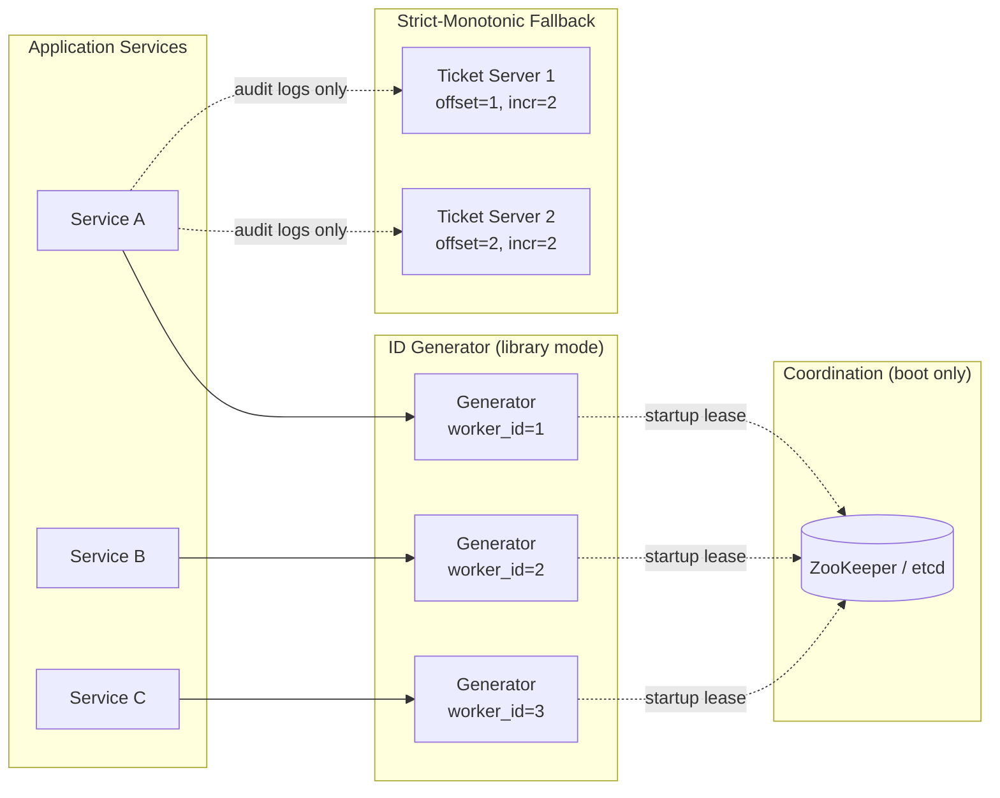
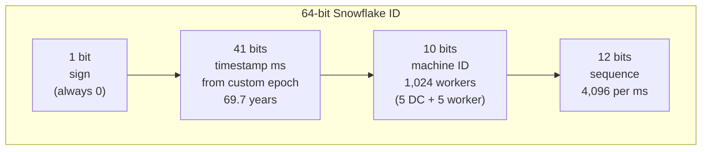
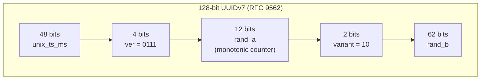
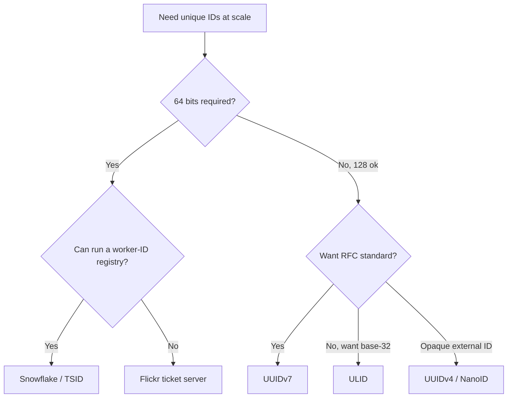
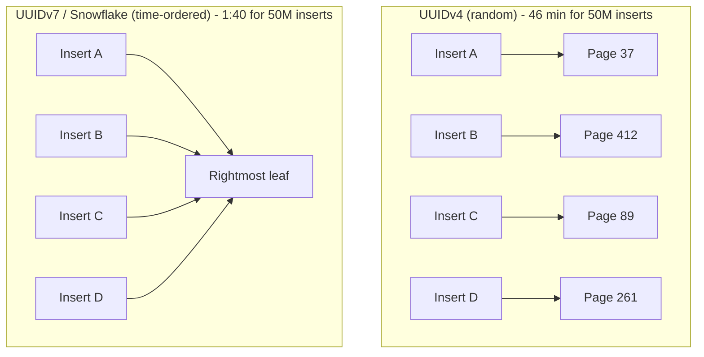

# Design a Unique ID Generator (Snowflake, ULID, TSID, UUIDv7)

> **TL;DR.** A unique ID generator hides a four-way trade-off between throughput, ordering, coordination cost, and ID width. Twitter Snowflake packs 41 bits of millisecond timestamp, 10 bits of machine ID, and 12 bits of sequence into 64 bits, yielding 4,096 IDs per ms per worker with zero hot-path coordination[^1]. UUIDv7 (RFC 9562, 2024) spends 128 bits to get the same time-ordering without a worker-ID registry[^2]. The pivotal decision: if 64 bits matters (halved index size at a billion rows), use Snowflake; if zero coordination matters more, use UUIDv7.

## Learning Objectives

- [ ] Defend a choice between Snowflake, ULID, UUIDv7, TSID, and a ticket server on specific workload criteria
- [ ] Compute the timestamp-exhaustion date and per-worker throughput ceiling from a Snowflake bit layout
- [ ] Design clock-skew resilience (bound-wait, logical-clock fallback, NTP alerting) for a distributed ID generator
- [ ] Justify why time-sortable IDs improve B-tree insert performance by 12-27x over random UUIDs[^3]
- [ ] Design worker-ID allocation across multiple data centers without coordination at ID-generation time

## Intuition

Generating a unique ID looks trivial. Call `uuid.v4()` and move on. At 10 users, that works. At 10 million IDs per second across three data centers, it collapses for two reasons.

First, random UUIDs destroy your database. A credativ benchmark on PostgreSQL 18 measured 50 million UUIDv4 inserts into a pre-populated table at 46 minutes wall time. The same workload with time-ordered UUIDv7 finished in 1 minute 40 seconds[^3]. The v4 index was 26% larger with 50% leaf fragmentation versus zero for v7[^3]. Random keys scatter inserts across the entire B-tree; time-ordered keys concentrate writes at the rightmost leaf.

Second, coordination kills throughput. A single auto-increment counter caps you at one database's insert rate. A distributed counter (Raft consensus per ID) adds milliseconds of latency to every write. The insight that unlocks the design: embed time in the high bits so IDs are naturally ordered, embed a machine identifier in the middle bits so workers never collide, and use a local sequence counter in the low bits so each worker generates thousands of IDs per millisecond without talking to anyone.

That is Snowflake. The rest of this chapter is about when to use it, when to use something else, and what breaks when clocks misbehave.

## Requirements

### Clarifying Questions

- **Q: What is the target aggregate throughput?**
  Assume: 10M IDs/sec aggregate, 100K IDs/sec per single worker at peak.

- **Q: Must IDs fit in 64 bits?**
  Assume: 64 bits preferred (fits in `BIGINT`, halves index size vs 128-bit). UUIDv7 is acceptable if 128 bits is tolerable.

- **Q: How long must the scheme last?**
  Assume: At least 69 years from a custom epoch (Snowflake's 41-bit millisecond timestamp gives exactly this)[^4].

- **Q: Strictly monotonic or approximately ordered?**
  Assume: Monotonic within a single worker. Globally ordered within clock-skew bounds. Strict global monotonic only for specific flows (audit logs, invoice numbers).

- **Q: Multi-region active-active?**
  Assume: Yes, 3 regions. No coordination on the hot path.

- **Q: Can we rely on NTP-synced clocks?**
  Assume: Yes within ~10 ms, but the design must survive a 1-second backward jump without duplicating IDs.

### Functional Requirements

- Generate a unique 64-bit ID on every call with no coordination on the hot path.
- Embed a millisecond timestamp recoverable from the ID for debugging, TTL enforcement, and time-range sharding.
- Survive a single worker crash without duplicating any previously issued ID.
- Support rolling worker redeployment with safe worker-ID reassignment.

### Non-Functional Requirements

- **Availability:** 99.999% on the generate path (called inline with every write).
- **Latency:** p99 under 1 ms local, under 5 ms including a network hop if run as a service.
- **Throughput:** 10M IDs/sec aggregate, 100K/sec per worker.
- **Uniqueness:** zero duplicates under any single-node failure, including clock rewind up to 10 seconds.
- **Ordering:** monotonic within a single worker; globally ordered within worker-clock-skew.

## Capacity Estimation

| Metric | Value | Derivation |
|--------|------:|------------|
| Timestamp bits | 41 | ms since custom epoch; 2^41 ms = 69.7 years[^4] |
| Worker-ID bits | 10 | 5 datacenter + 5 worker = 1,024 workers[^1] |
| Sequence bits | 12 | 2^12 = 4,096 IDs per worker per ms[^1] |
| Per-worker ceiling | 4.096M IDs/sec | 4,096/ms x 1,000 ms |
| Aggregate ceiling | 4.2B IDs/sec | 1,024 workers x 4.096M/sec |
| Headroom at 10M/sec | 420x | 4.2B / 10M |
| Storage per worker | ~16 bytes | last_timestamp_ms(8) + last_sequence(4) + worker_id(4) |
| Twitter epoch exhaustion | ~2080 | 2010-11-04 + 69.7 years[^5][^6] |
| Discord epoch exhaustion | ~2084 | 2015-01-01 + 69.7 years[^7] |

With 100 active workers each handling ~100K IDs/sec, the system runs at 2.4% of its theoretical ceiling. Three orders of magnitude of headroom before a layout redesign is needed.

## API and Data Model

### API Design

```text
# Local library call (preferred for latency)
id = snowflake.next_id()   # returns int64

# Remote service (for polyglot environments)
POST /v1/ids:generate
Body: { "count": 100 }
Response: { "ids": [7234567890123456789, ...], "issued_at_ms": 1735689600000 }

# Bulk-allocation for batch jobs
POST /v1/ids:reserve-range
Body: { "count": 1000000 }
Response: { "start": 7234..., "end": 7234..., "ttl_ms": 60000 }
```

The library form is the hot path. The service form serves Ruby, PHP, and short-lived Lambdas that cannot safely hold a worker-ID. The range-reservation API amortizes network round-trips for ETL and backfill jobs.

### Data Model

```sql
-- Worker state (local, persistent file)
last_timestamp_ms   BIGINT   -- last ms we issued in
last_sequence       INT      -- last sequence within that ms
worker_id           INT      -- assigned at startup
custom_epoch_ms     BIGINT   -- e.g. 2020-01-01 UTC in ms

-- Worker-ID registry (ZooKeeper / etcd)
-- Path: /id-gen/workers/{worker_id}
-- Value: { "hostname": "...", "dc": "us-east-1", "lease_expires_at": "..." }
-- Ephemeral node with 30-second TTL
```

On startup, a worker claims the lowest free slot via an ephemeral ZooKeeper node[^1]. On graceful shutdown, the node is released. On crash, the lease expires and the slot becomes reclaimable.

## High-Level Architecture



*Each application service embeds a Snowflake generator as a library. ZooKeeper is consulted once at boot for worker-ID assignment; the hot path is lock-free. The ticket-server fallback handles the rare flows requiring strict monotonicity.*

**Library mode (default):** The ID generator is a JAR, crate, or Go package linked into every service. It reads worker-ID from ZooKeeper at boot. The hot path is a single CAS on `(timestamp, sequence)`.

**Service mode (polyglot):** A small fleet of "id-service" pods sits behind a load balancer. Each pod holds its own worker-ID. Clients batch-request 100 IDs per call to amortize RPC overhead.

**Ticket-server mode (strict monotonic):** A MySQL primary with a single-row table using `REPLACE INTO` to advance an auto-increment[^8]. Used only for invoice numbers, audit logs, and customer-facing ticket IDs where strict ordering is a hard requirement.

**Observability:** Emit metrics for `ids_per_second_per_worker`, `clock_drift_ms`, `sequence_exhaustion_events`, and `worker_id_reassignments`.

## Deep Dives

### Snowflake bit-layout anatomy

The 64-bit Snowflake ID is a capacity-planning exercise encoded in a single integer.



*The 1+41+10+12 bit partition: each field is packed and extracted by shift-and-mask. The sign bit keeps the ID positive as a signed BIGINT.*

Construction is three shifts and two ORs: `id = ((now_ms - epoch) << 22) | (worker_id << 12) | sequence`[^4]. Extraction is equally cheap: `timestamp = (id >> 22) + epoch`[^7].

**Twitter's epoch** is `1288834974657` ms (2010-11-04T01:42:54.657Z)[^5][^6]. This gives Twitter IDs until approximately 2080. Discord uses epoch `1420070400000` (2015-01-01), extending exhaustion to ~2084[^7].

**Instagram's variant** reallocates bits: 41 timestamp + 13 shard-ID + 10 sequence[^9]. The shard-ID in the ID means reading an ID tells the application which PostgreSQL shard to query without a metadata lookup. The trade-off: per-shard ceiling drops to 1,024 IDs/ms (10 sequence bits) versus Snowflake's 4,096[^9].

**Sonyflake** uses 39 bits at 10-ms resolution (174-year lifetime), 8 bits of sequence (256 per 10 ms = 25,600/sec/machine), and 16 bits of machine-ID (65,536 machines)[^10]. It derives machine-ID from the lower 16 bits of the private IPv4 address, which is globally unique within an AWS VPC assigned a /16 CIDR[^10].

### Clock-skew resilience

Clock skew (a backward jump) is the failure mode, not clock drift (a slow clock). When NTP steps time backwards, a naive generator can issue duplicate IDs or produce an out-of-order sequence[^1][^2].

RFC 9562 section 6.2 defines three monotonicity methods[^2]:

1. **Fixed-length counter** seeded at random per new timestamp tick.
2. **Monotonic random** that increments by a random delta when the timestamp has not advanced.
3. **Sub-millisecond fraction** replacing the top random bits with a clock fraction.

For Snowflake-style generators, production systems combine two strategies:

**Bound-wait:** If `now_ms < last_timestamp_ms` and the delta is small (under 10 ms), sleep until time catches up. This is the pattern used by later derivatives such as Baidu's uid-generator and Meituan's Leaf; Twitter's original `IdWorker.scala` instead takes the stricter "refuse to issue" path described below[^1].

**Logical-clock fallback:** Treat `last_timestamp_ms` as a Lamport-style monotonic counter. If the wall clock went backwards, keep incrementing the stored timestamp and sequence. IDs remain unique and ordered, though the embedded timestamp is slightly ahead of reality.

**Refuse to issue:** If skew exceeds a threshold (e.g., 10 seconds), fail fast and alert. A generator that loops on "wait for time to advance" could deadlock during a large backward jump. Twitter's original `IdWorker.scala` takes this path unconditionally: on any backward jump it throws `InvalidSystemClock` with the message "Clock moved backwards. Refusing to generate id for N milliseconds"[^1].

The 2012 leap-second event is the canonical real-world anchor. On June 30, 2012, a leap-second insertion livelocked Linux kernels at Reddit, LinkedIn, and multiple Cassandra clusters[^11][^12]. Systems relying on `clock_gettime` hung or produced out-of-order timestamps. Any Snowflake-like generator built on that kernel was vulnerable.

**Detection:** Monitor `clock_drift_ms = now_ms - last_timestamp_ms`. Alert on negative values or deltas exceeding 1 second.

ULID handles monotonicity differently: within the same millisecond, the 80-bit random component increments by 1 at the least significant bit[^13]. This guarantees sort order without a worker-ID registry. The trade-off: if the random component overflows (2^80 IDs in one ms, practically unreachable), the generator throws rather than silently wrapping[^13].

### Worker-ID allocation across data centers

The 10-bit worker-ID field supports 1,024 concurrent generators. Assigning these without collision is the one coordination problem in the system.

Four patterns are in production use:

1. **ZooKeeper ephemeral nodes:** First-come-first-served claim with a lease. Originally used by Twitter's Snowflake[^1][^4]. On startup, claim the lowest free slot. On crash, the lease expires (30-second TTL) and the slot is reclaimable.

2. **Kubernetes StatefulSet ordinal:** Pod `id-gen-0` gets worker-ID 0, `id-gen-1` gets 1. Zero external coordination, but only works for dedicated ID-service deployments.

3. **IP-derived (Sonyflake):** Lower 16 bits of the private IPv4 address. Works inside an AWS VPC with a /16 CIDR because the low 16 bits are then unique across the VPC[^10]. No external service needed.

4. **Environment variable / static config:** Hardcoded in a deployment manifest. Simple but fragile; a typo silently causes collisions. TSID's library reads `TSIDCREATOR_NODE` from the environment and falls back to random if unset[^14].

The 5+5 bit split (5 datacenter + 5 worker) supports 32 DCs with 32 workers each. An alternative 3+7 split supports 8 DCs with 128 workers each. Choose based on your deployment topology.

**Lease-based reclamation** is critical for blue-green deployments. With 1,024 slots and 50 Kubernetes clusters doing rolling updates, short TTLs (30 seconds) ensure retired workers release their IDs before new workers need them[^4].

### UUIDv7 versus Snowflake: the modern choice

UUIDv7, standardized by RFC 9562 in May 2024[^2], is a 128-bit time-ordered UUID: 48 bits of Unix ms timestamp, 4-bit version, 12 bits of `rand_a` (often a monotonic counter), 2-bit variant, and 62 bits of `rand_b`.



*UUIDv7 layout per RFC 9562: the 48-bit timestamp prefix ensures B-tree locality; the 12-bit rand_a field provides monotonicity within a millisecond.*

PostgreSQL 18 ships native `uuidv7()` and `uuid_extract_timestamp()` functions[^3]. In credativ's benchmark, the UUIDv7 primary-key index achieved perfect page-order correlation (1.0 in `pg_stats`) versus -0.002 for UUIDv4[^3]. Leaf fragmentation: 0% for v7, ~50% for v4[^3].

**When UUIDv7 wins:** Greenfield systems, polyglot environments, no worker-ID registry available, 128 bits is acceptable. Zero coordination, IANA-standardized, native database support.

**When Snowflake wins:** 64 bits matters (halves index size at a billion rows), you can afford the worker-ID coordination, and you need the embedded machine-ID for debugging or routing (Instagram's shard-ID pattern[^9]).



*Decision tree for choosing an ID scheme: 64-bit versus 128-bit is the first fork; coordination feasibility is the second.*

## Real-World Example

Twitter built Snowflake in 2010 to replace a MySQL-based ID generator that could not keep up with tweet volume[^1]. The design goal was "tens of thousands of ids per second" in a highly available manner[^1]. The actual ceiling (4,096 IDs/ms = 4.1M/sec/worker) gave orders-of-magnitude headroom over the original target.

Twitter ran Snowflake as a standalone Thrift service coordinated via ZooKeeper[^1]. Clients made an RPC to a pool of Snowflake nodes; each node held a ZooKeeper-assigned worker-ID and a local monotonic counter. The project was archived in 2021 with a note that Twitter was rewriting it on top of Finagle and Twitter-server[^15].

Instagram adapted the layout in 2012 for their sharded PostgreSQL architecture[^9]. Their `next_id()` PL/pgSQL function runs inline with the `INSERT`, generating the ID atomically with the row:

```sql
CREATE OR REPLACE FUNCTION insta5.next_id(OUT result bigint) AS $$
DECLARE
    our_epoch bigint := 1314220021721;
    seq_id bigint;
    now_millis bigint;
    shard_id int := 5;
BEGIN
    SELECT nextval('insta5.table_id_seq') % 1024 INTO seq_id;
    SELECT FLOOR(EXTRACT(EPOCH FROM clock_timestamp()) * 1000) INTO now_millis;
    result := (now_millis - our_epoch) << 23;
    result := result | (shard_id << 10);
    result := result | (seq_id);
END;
$$ LANGUAGE PLPGSQL;
```

The key insight: embedding the shard-ID in the ID eliminates a metadata lookup on every read. When a service receives an ID, it extracts bits 10-22 to determine which PostgreSQL shard owns the row[^9]. At Instagram's scale (25 photos and 90 likes per second in 2012, orders of magnitude more today), this saves billions of routing lookups daily.

Discord adopted a similar 64-bit Snowflake layout (42 bits timestamp + 5 worker + 5 process + 12 sequence) for every message, user, channel, and guild ID[^7]. With trillions of messages stored across a ScyllaDB cluster (migrated from 177 Cassandra nodes to 72 ScyllaDB nodes, dropping p99 read latency from 125 ms to 15 ms)[^16], the snowflake timestamp drives the shard key for time-bucketed message storage. Discord serializes IDs as decimal strings in JSON to avoid 64-bit integer overflow in JavaScript clients[^7].

Beyond Snowflake variants, other production systems make different trade-offs. MongoDB's ObjectId uses 12 bytes (4-byte second-resolution timestamp + 5 random + 3 counter)[^17], optimized for BSON document storage. Segment built KSUID (160 bits: 32-bit second timestamp + 128-bit random) for S3 object keys where collision resistance matters more than compactness[^18]. Firebase push-IDs use 120 bits (48-bit ms timestamp + 72-bit random) with client-side monotonic correction on reconnect[^19].

## Trade-offs

| Scheme | Bit-width | Coordination | B-tree locality | Our pick |
|---|---|---|---|---|
| Auto-increment (single DB) | 32-64 | Centralized (one DB holds the counter) | Excellent (strictly sequential) | Single-region, low write rate |
| Flickr ticket server (odd/even)[^8] | 64 | Two MySQL ticket servers, odd/even offsets | Excellent (near-monotonic) | When strict monotonic IDs are required and a central service is acceptable |
| Twitter Snowflake[^1] | 64 | Worker-ID registry (ZooKeeper / etcd) + NTP | Excellent (41-bit time prefix) | Sharded systems at > 1M writes/sec where 64 bits is hard-required |
| Instagram sharded ID[^9] | 64 | Per-shard Postgres function (shard-ID embedded) | Excellent per shard (time-prefixed) | Heavy Postgres sharding; shard routing from the PK |
| Sonyflake[^10] | 64 | Machine-ID (private IP-derived on AWS VPC); 10 ms tick | Excellent (39-bit time prefix) | AWS VPC fleets > 1,024 machines or needing > 69-year lifetime |
| ULID[^13] | 128 | None (random + ms timestamp); monotonic-within-ms | Excellent (48-bit time prefix) | Client-generated, user-visible IDs |
| UUIDv7[^2] | 128 | None (RFC 9562; native `uuidv7()` in Postgres 18) | Excellent (48-bit time prefix) | Greenfield, polyglot stacks, standard tooling |
| KSUID[^18] | 160 | None (32-bit time + 128-bit random) | Excellent (32-bit time prefix) | S3 object keys, event logs where collision resistance dominates |
| UUIDv4[^2] | 128 | None (pure random) | Destroyed (46 min vs 1:40 for 50M inserts)[^3] | Low write rate, opaque external IDs |

The single biggest meta-decision: **64 bits versus 128 bits**. At one billion rows, a 64-bit primary key index is roughly 8 GB smaller than a 128-bit one. If your system has dozens of tables with billion-row counts, that difference compounds into hundreds of gigabytes of RAM for hot indexes. If you have fewer tables or can tolerate the extra storage, UUIDv7's zero-coordination property eliminates an entire class of operational failures.



*B-tree insert locality: UUIDv4 scatters inserts across random pages causing splits and fragmentation; time-ordered IDs append sequentially to the rightmost leaf, achieving 27x faster inserts[^3].*

## Scaling and Failure Modes

**At 10x load (100M IDs/sec):** The 1,024-worker ceiling becomes relevant. With 100 workers at 1M/sec each, you are at 24% capacity. No layout change needed, but worker-ID lease management must handle faster churn.

**At 100x load (1B IDs/sec):** You need more than 1,024 workers. Options: widen the worker-ID field (steal bits from sequence, reducing per-worker ceiling), or shard by tenant with separate generator pools per tenant.

**At 1000x load:** The 41-bit timestamp itself becomes the constraint. Consider widening to 128 bits (UUIDv7) or adopting a hierarchical scheme where a top-level coordinator assigns epoch ranges to regional sub-generators.

**Failure modes:**

- **Clock backward jump (NTP step):** Generator stalls for the skew duration (bound-wait) or uses logical-clock fallback. If skew exceeds threshold, generation fails fast. The 2012 leap-second incident crashed systems across the industry[^11][^12].
- **Worker-ID collision (two workers claim same ID):** Both emit IDs with identical machine bits. If they generate in the same ms with the same sequence, IDs collide. Detection: startup verification against ZooKeeper. Mitigation: ephemeral nodes with TTL[^1].
- **Sequence exhaustion within a ms:** A single worker tries to emit more than 4,096 IDs in one ms. The correct fallback is spin-wait for the next ms, not overflow[^1]. Monitor `sequence_exhaustion_events`.

## Common Pitfalls

> [!WARNING]
> **Using UUIDv4 as a primary key at scale.** Random inserts scatter across the B-tree. PostgreSQL 18 benchmarks show 27x slower inserts and 26% larger indexes compared to UUIDv7[^3]. Switch to a time-ordered scheme for any write-heavy table.

> [!WARNING]
> **Treating time-sortable IDs as unguessable.** Snowflake, ULID, UUIDv7, and KSUID all embed wall-clock time in the top bits. A public URL like `/photos/7234567890123456789` leaks the creation timestamp to anyone who knows the epoch[^2]. Use UUIDv4 or a keyed HMAC for public-facing identifiers.

> [!WARNING]
> **Deriving worker-ID from hostname hash without collision detection.** Two hostnames that hash to the same bucket silently produce duplicate IDs. Always verify the claimed ID against a registry at startup[^1][^10].

> [!WARNING]
> **Ignoring sequence-bit exhaustion.** A batch job generating IDs in a tight loop can exhaust 4,096 IDs within a single ms. The generator must spin-wait for the next ms, never silently overflow[^1].

> [!WARNING]
> **Assuming clocks only drift forward.** NTP steps, VM migrations, and leap seconds can all move time backwards. The 2012 leap-second event livelocked Linux kernels at Reddit, LinkedIn, and Cassandra clusters[^11][^12]. Design for backward jumps explicitly.

> [!WARNING]
> **Forgetting epoch exhaustion planning.** Twitter's 41-bit ms timestamp runs out ~2080[^4]. If you pick epoch 2020, you run out in 2089. Document the exhaustion date and the migration path before you ship.

## Follow-up Questions

**1. How would you migrate from UUIDv4 to Snowflake without downtime?**

Add a `snowflake_id` column alongside the existing UUID PK. Dual-write both IDs on every insert. Backfill historical rows with synthetic snowflake IDs (use the `created_at` timestamp to reconstruct the time component). Once backfill completes, swap the primary key in a non-locking DDL migration, then drop the UUID column.

**2. What if a worker crashes mid-millisecond with sequence=4095 and restarts?**

On restart, the worker reads `last_timestamp_ms` from its persistent state file. If the current wall clock is still within that ms, it waits for the next ms before issuing. If no state file exists (fresh deploy), wait 1 ms unconditionally. This guarantees no reuse of the exhausted sequence.

**3. How would you add a per-tenant shard-ID to the bit layout?**

Steal bits from worker-ID or sequence. A 41+8+6+9 layout gives 256 tenants, 64 workers, and 512 IDs/ms/worker. The trade-off is reduced per-worker throughput. Alternatively, use separate generator pools per tenant with independent worker-ID spaces.

**4. Can you make Snowflake IDs unguessable for external use?**

No. They embed timestamp and worker-ID by construction. For external-facing identifiers, generate a separate opaque token (NanoID[^20], UUIDv4, or HMAC of the Snowflake ID) and store the mapping. Stripe uses prefix-based IDs (`cus_`, `ch_`) that are opaque externally[^21].

**5. What is the write-amplification cost of random UUIDv4 versus Snowflake at 1B rows?**

UUIDv4 forces random B-tree page splits. In credativ's benchmark, `pg_stats` correlation was -0.002 for v4 (effectively random) versus 1.0 for v7 (perfectly ordered)[^3]. This means every v4 insert potentially triggers a page split, while v7/Snowflake inserts append to the rightmost leaf. At 1B rows, the index size difference alone is ~8 GB.

**6. How does the ticket-server pattern achieve HA?**

Run two MySQL servers with `auto_increment_increment=2`. Server 1 uses offset 1 (odd IDs), server 2 uses offset 2 (even IDs)[^8]. Clients round-robin between them. If one dies, the survivor continues at half the ID-space rate. Flickr has run this since January 2006[^8].

## Exercise

### Exercise 1: Design a custom bit layout

Your system needs to support 200 data centers, 50 workers per DC, and at least 500 IDs per ms per worker. You have 64 bits. Design the bit layout and compute the timestamp exhaustion date assuming a 2025 epoch.

<details>
<summary>Hint</summary>

200 DCs needs at least 8 bits (2^8 = 256). 50 workers needs at least 6 bits (2^6 = 64). 500 IDs/ms needs at least 9 bits (2^9 = 512). That leaves 64 - 1 - 8 - 6 - 9 = 40 bits for the timestamp.

</details>

<details>
<summary>Solution</summary>

**Layout:** 1 sign + 40 timestamp + 8 datacenter + 6 worker + 9 sequence = 64 bits.

**Timestamp exhaustion:** 2^40 ms = 1,099,511,627,776 ms = ~34.8 years. With a 2025 epoch, exhaustion occurs around 2060. This is shorter than Snowflake's 69.7 years.

**Per-worker ceiling:** 2^9 = 512 IDs/ms = 512,000 IDs/sec. Meets the 500/ms requirement with minimal headroom.

**Aggregate ceiling:** 256 DCs x 64 workers x 512/ms = 8,388,608 IDs/ms = ~8.4B IDs/sec.

**Trade-off accepted:** 34.8-year lifetime is shorter than ideal. If the system must last 50+ years, consider stealing 1 bit from datacenter (128 DCs) and giving it to timestamp (41 bits, 69.7 years). Alternatively, accept a 2060 migration deadline and document it now.

</details>

## Key Takeaways

- **Use Snowflake when 64 bits matters** and you can solve worker-ID allocation. Use UUIDv7 when 128 bits is acceptable and you want zero coordination.
- **The bit layout is a capacity-planning exercise.** Derive your timestamp-exhaustion date and per-worker throughput ceiling before you ship.
- **Clock skew is the failure mode, not clock drift.** Design for backward jumps (bound-wait, logical-clock fallback), not just slow clocks.
- **Time-sortable IDs yield 12-27x better B-tree insert performance** than random UUIDs[^3]. This alone justifies Snowflake/ULID/UUIDv7 over UUIDv4 for any primary key at scale.
- **The ticket server is not obsolete.** It is the correct answer when strict monotonicity is a hard requirement (audit logs, invoice numbers, customer-facing ticket IDs).

## Further Reading

- [Announcing Snowflake (Twitter Engineering, 2010)](https://blog.x.com/engineering/en_us/a/2010/announcing-snowflake). The original blog post and canonical bit-layout reference; explains the ZooKeeper coordination model.
- [Sharding and IDs at Instagram (2012)](https://instagram-engineering.com/sharding-ids-at-instagram-1cf5a71e5a5c). The embedded shard-ID variant with full PL/pgSQL source; shows how ID design drives database routing.
- [RFC 9562: Universally Unique IDentifiers (2024)](https://datatracker.ietf.org/doc/rfc9562/). The definitive standard; obsoletes RFC 4122, defines v6, v7, v8, and monotonicity methods.
- [A deeper look at UUIDv4 vs UUIDv7 in PostgreSQL 18 (credativ, 2025)](https://www.credativ.de/en/blog/postgresql-en/a-deeper-look-at-old-uuidv4-vs-new-uuidv7-in-postgresql-18/). The most rigorous Postgres benchmark comparing insert performance, index size, and fragmentation.
- [Ticket Servers: Distributed Unique Primary Keys on the Cheap (Flickr, 2010)](https://code.flickr.net/2010/02/08/ticket-servers-distributed-unique-primary-keys-on-the-cheap/). The two-MySQL-servers trick that has run since 2006.
- [ULID Specification](https://github.com/ulid/spec). The 48+80 bit layout, Crockford base-32 encoding, and monotonic-within-ms rules.
- [How Discord Stores Trillions of Messages (2023)](https://discord.com/blog/how-discord-stores-trillions-of-messages). Scale context for Snowflake IDs in production: 177 Cassandra nodes to 72 ScyllaDB nodes.
- [Sonyflake (Sony)](https://github.com/sony/sonyflake). The 39+8+16 variant with VPC-friendly IP-derived machine-ID; good reference for alternative bit allocations.

## Flashcards

<details>
<summary><strong>Q: What is the bit layout of a Twitter Snowflake ID?</strong></summary>

A: 1 sign bit + 41 bits millisecond timestamp (from custom epoch) + 10 bits machine ID (5 DC + 5 worker) + 12 bits sequence. Total: 64 bits. Yields 4,096 IDs per ms per worker.

</details>

<details>
<summary><strong>Q: How long does a 41-bit millisecond timestamp last, and when does Twitter's Snowflake exhaust?</strong></summary>

A: 2^41 ms = ~69.7 years. Twitter's epoch is 2010-11-04, so exhaustion occurs around 2080. Discord's 2015 epoch extends to ~2084.

</details>

<details>
<summary><strong>Q: Why are time-ordered IDs (Snowflake, UUIDv7) dramatically faster for database inserts than random UUIDs?</strong></summary>

A: Time-ordered IDs concentrate writes at the rightmost B-tree leaf (sequential append). Random UUIDs scatter inserts across all leaves, causing page splits and fragmentation. PostgreSQL 18 benchmarks show 27x faster inserts and 26% smaller indexes for UUIDv7 versus UUIDv4.

</details>

<details>
<summary><strong>Q: What are the three strategies for handling clock-skew in a Snowflake generator?</strong></summary>

A: (1) Bound-wait: sleep until the clock catches up for small backward jumps. (2) Logical-clock fallback: keep incrementing the stored timestamp as a monotonic counter. (3) Refuse to issue: fail fast and alert if skew exceeds a threshold.

</details>

<details>
<summary><strong>Q: How does Instagram embed shard-ID in its 64-bit IDs, and why?</strong></summary>

A: Layout: 41 bits timestamp + 13 bits shard-ID + 10 bits sequence. The shard-ID in the ID tells the application which PostgreSQL shard owns the row, eliminating a metadata lookup on every read.

</details>

<details>
<summary><strong>Q: What is the Flickr ticket-server pattern?</strong></summary>

A: Two MySQL servers with `auto_increment_increment=2`. Server 1 issues odd IDs (offset=1), server 2 issues even IDs (offset=2). Clients round-robin. If one dies, the survivor continues at half rate. Provides strict monotonicity per server.

</details>

<details>
<summary><strong>Q: When should you choose UUIDv7 over Snowflake?</strong></summary>

A: When 128 bits is acceptable, you want zero coordination (no worker-ID registry, no ZooKeeper), and you value standardization (RFC 9562, native Postgres 18 support). Snowflake wins when 64 bits matters and you can afford the coordination.

</details>

<details>
<summary><strong>Q: What real-world incident demonstrated the danger of clock-skew for ID generators?</strong></summary>

A: The 2012-06-30 leap-second event livelocked Linux kernels at Reddit, LinkedIn, and Cassandra clusters. Systems relying on `clock_gettime` hung or produced out-of-order timestamps. Any Snowflake-like generator on affected kernels was vulnerable.

</details>

<details>
<summary><strong>Q: How does Sonyflake derive its machine-ID without external coordination?</strong></summary>

A: It uses the lower 16 bits of the private IPv4 address. In an AWS VPC with a /16 CIDR, these bits are globally unique across the VPC, serving as a collision-free machine-ID without ZooKeeper or etcd.

</details>

<details>
<summary><strong>Q: What happens when a Snowflake generator exhausts its sequence bits within a single millisecond?</strong></summary>

A: With 12 sequence bits, the ceiling is 4,096 IDs per ms. On exhaustion, the generator must spin-wait for the next millisecond. It must never silently overflow or wrap the sequence counter, as that would produce duplicate IDs.

</details>

## References

[^1]: Twitter Engineering, "Announcing Snowflake", 2010. https://blog.x.com/engineering/en_us/a/2010/announcing-snowflake (archived: https://web.archive.org/web/20231225025931/https://blog.twitter.com/engineering/en_us/a/2010/announcing-snowflake)

[^2]: Davis, Peabody, Leach, "RFC 9562: Universally Unique IDentifiers (UUIDs)", IETF, May 2024. https://datatracker.ietf.org/doc/rfc9562/

[^3]: Josef Machytka (credativ), "A deeper look at old UUIDv4 vs new UUIDv7 in PostgreSQL 18", 2025-12-05. https://www.credativ.de/en/blog/postgresql-en/a-deeper-look-at-old-uuidv4-vs-new-uuidv7-in-postgresql-18/

[^4]: twitter-archive/snowflake repo (archived 2021). https://github.com/twitter-archive/snowflake

[^5]: ksuid.net, "Snowflake Generator", referencing Twitter epoch 1288834974657. https://ksuid.net/snowflake

[^6]: Gist demonstrating Twitter epoch 1288834974657 ms. https://gist.github.com/mqudsi/334741b453bac3d6d21e94434a4bdf81

[^7]: Discord Developer Documentation, "API Reference - Snowflakes". https://discord.com/developers/docs/reference#snowflakes

[^8]: Kay Kremerskothen (Flickr), "Ticket Servers: Distributed Unique Primary Keys on the Cheap", 2010-02-08. https://code.flickr.net/2010/02/08/ticket-servers-distributed-unique-primary-keys-on-the-cheap/

[^9]: Instagram Engineering, "Sharding & IDs at Instagram", 2012. https://instagram-engineering.com/sharding-ids-at-instagram-1cf5a71e5a5c (original: https://instagram-engineering.tumblr.com/post/10853187575/sharding-ids-at-instagram)

[^10]: sony/sonyflake v2 README. https://github.com/sony/sonyflake

[^11]: Cade Metz (Wired), "The Inside Story of the Extra Second That Crashed the Web", 2012-07-03. https://www.wired.com/2012/07/leap-second-glitch-explained/

[^12]: Joab Jackson (Computerworld), "Leap second bedevils Web systems over weekend", 2012-07-02. https://www.computerworld.com/article/2723048/leap-second-bedevils-web-systems-over-weekend.html

[^13]: ulid/spec, "Universally Unique Lexicographically Sortable Identifier". https://github.com/ulid/spec

[^14]: f4b6a3/tsid-creator README. https://github.com/f4b6a3/tsid-creator

[^15]: twitter-archive/snowflake README.mkd (retired). https://github.com/twitter-archive/snowflake/blob/master/README.md

[^16]: Discord Engineering, "How Discord Stores Trillions of Messages", 2023. https://discord.com/blog/how-discord-stores-trillions-of-messages

[^17]: MongoDB Documentation, "ObjectId() (mongosh method)". https://www.mongodb.com/docs/manual/reference/method/ObjectId/

[^18]: Segment, "ksuid: K-Sortable Globally Unique IDs". https://github.com/segmentio/ksuid

[^19]: Michael Lehenbauer (Firebase), "The 2^120 Ways to Ensure Unique Identifiers", 2015-02-11. https://firebase.googleblog.com/2015/02/the-2120-ways-to-ensure-unique_68.html

[^20]: ai/nanoid README. https://github.com/ai/nanoid

[^21]: Clerk Engineering, "Generating sortable Stripe-like IDs with Segment's KSUIDs". https://clerk.com/blog/generating-sortable-stripe-like-ids-with-segment-ksuids
